# 普通城市优先：AI 空间深度（设计候选）

> **ORDINARY CITY FIRST**\
> 不同类型、不同公众暴露与风险的 AI，以不同空间深度进入普通城市。\
> 本稿是研究级设计候选，不是法定规划、工程设计、已批准项目、投资承诺或实施时序。

## 1. 设计依据与资料清单

本方案以征集公告规定的三层范围、三区两翼和 formal 成果要求为任务边界，以面向智能体任务书的六项任务为内容清单。总体设计范围公告量级约 1,140 公顷，三个重点区公开量级分别约 192.1、104.3、72.0 公顷；这些是公开文本事实，不是当前 provisional polygon 的精确面积证明。[source:official-announcement] [source:agent-taskbook] [metric:published_overall_design_scope_area_sqm]

现有权威层分为四级：可追溯公开事实、公开来源支持的场地语境、设计候选、待正式数据补齐。九个 GeoJSON 图层继续作为机器审计层；其中场地与重点区 polygon 明确为临时粗略约束，OSM 只支持道路、蓝绿和辅助锚点研究，不证明产权、出入口、无障碍连续性、项目落位或审批许可。[source:provisional-boundaries] [source:openstreetmap-context-20260811] [data:geometry/site_boundary.geojson#SITE-PROV-001]

海淀官方公开资料支持科技成果转化政策语境、AI 原点的创新与人才服务、众智园和大钟寺的更新语境、京张二期配套完工以及真实零售具身设备案例；它们不证明本方案的房间、责任主体、设施容量或商户同意。[source:haidian-tech-transfer-policy] [source:ai-origin-community] [source:jingzhang-phase-two-completion]

AI 进入公共空间必须同时满足无障碍、非数字替代、人工接管、维护和退出。缺少官方建筑深度文件时，不把参考标准写成已满足的工程深度；建筑、消防、结构、机电与运维容量由后续专业团队核验。[source:accessibility-law] [standard:MOHURD-ARCH-DESIGN-DEPTH-2016] [depth:risk_missing_data]

## 2. 三层范围工作框架

三层范围不是三套相互竞争的方案。统筹研究范围回答产业、人才、算力、数据、资金与场景如何协同；总体设计范围回答普通城市底板如何保持连续；重点区回答同一套 AI 空间深度原则如何形成三种不同空间语法。[standard:PROJECT-OFFICIAL-ANNOUNCEMENT] [depth:three_level_scope_framework]

核心层级只有三层。L1 是“普通城市优先”；L2 是四条不变量：普通连续、人工接管、恢复与移除、证据状态；L3 是 `试点 → 测量 → 人工复核 → 保留/调整/移除 → 另行判断是否扩展`。Evidence First 是贯穿三层的证据方法，不是第二品牌，也不把软件 A/B Test 等同于城市规划。

普通城市底板包含步行、骑行、公共交通、商业、文化、休憩、遮荫、无障碍、人工帮助和维护。图中相关日常使用均为概念性 urban-use layer，不宣称当前场地已经具备；任何 AI 节点关闭时，基本城市功能仍应成立。[data:geometry/roads.geojson#ROAD-OSM-PRIMARY] [depth:existing_conditions_diagnosis]

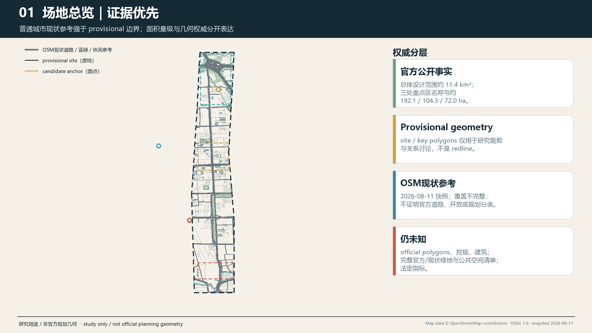

总体识别暂不锁定最终方案名称。当前仅使用“普通城市优先 / AI 空间深度”作为 `design_candidate` 描述；候选命名“京张·转场 / JINGZHANG TRANSITIONS”和“京张·共城 / JINGZHANG COMMON CITY”仍需双语理解、商标与公共语言测试。

## 3. 统筹研究范围产业与未来城市研究

AI 创新生态采用八项要素而不编造指标：土地提供可依法核验的空间条件；空间区分公共界面、受控工作、专业验证与后勤恢复；产业按软件、固定设备、具身系统区分验证义务；资金只提出公开透明的候选支持机制；人才包括研究者、创业团队、维护与一线服务劳动者；算力和数据保持受控接口；场景通过责任、失败和退出审查后才进入城市。[source:haidian-tech-transfer-policy] [depth:overall_spatial_structure]

六个主案例只转译机制，不复制形态。Helsinki 提供可结束于评估而非自动采用的短周期实地试点；Punggol 提供日常园区运营与数据边界的提醒；伦敦 Smart Mobility Living Lab 提供受控验证、隔离和恢复梯度；Cornell Tech 提供公共地面与受控创新空间并置；Woven City 提供不同试验环境对应不同物理代理的对照；Quayside 说明公共空间数字系统必须可问责、可分离。Waterfront Toronto 的资料分别证明数字治理、隐私和公共问责进入审查，以及 Sidewalk Labs 后来退出；本方案不把退出归结为单一原因。[source:C-SRC-101] [source:C-SRC-201] [source:C-SRC-301]

Cornell 的公共空间与创新建筑关系由大学官方页面支持；Woven City 的空间和参与描述来自运营方，不能证明开放北京街区可成为试车场；Quayside 仅作治理与退出警示。[source:C-SRC-502] [source:C-SRC-702] [source:C-SRC-801]

Kashiwa-no-ha 与 aspern Seestadt 为两个扩展案例：前者提醒持续的公私学协调界面比科技地标更重要，后者提醒不同领域实验室可以和日常城区并存，而不是把整座城市变成统一试验场。所有八个案例都不能证明京张的场地可用、主体能力、资金、居民同意或制度可转移。[source:C-SRC-401] [source:C-SRC-402] [source:C-SRC-601]

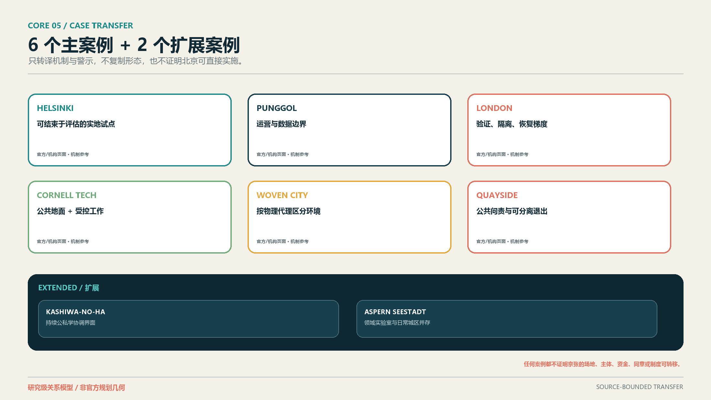

AI 空间深度以 D0–D4 表达进入关系：D0 普通城市、D1 公共界面、D2 可选 AI、D3 受控工作、D4 专业验证。**Service / Recovery Support 是横向后场支持层，不是 D5、不是升级终点。** D2、D3、D4 均必须能返回维护、修复、恢复、更换或移除。软件、固定设备、具身系统的线型不同，表示空间负担与恢复义务，不表示价值或成熟度。

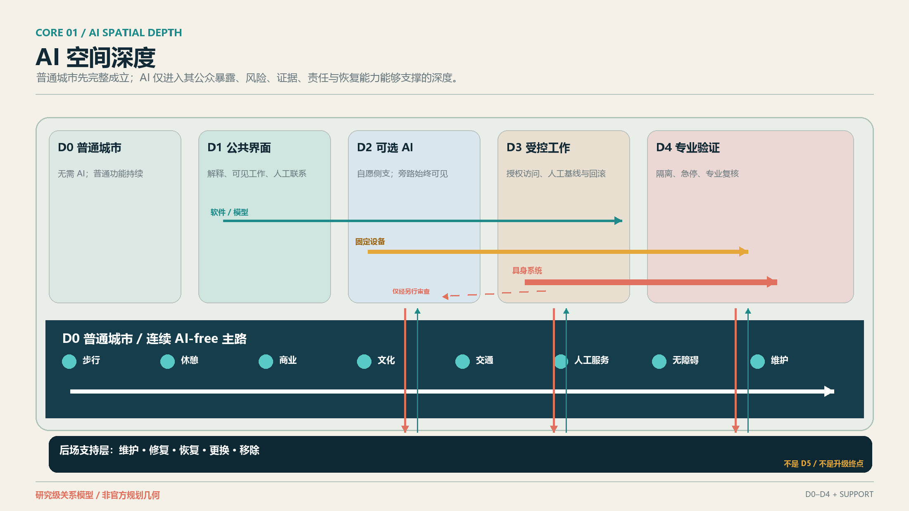

## 4. 总体设计范围城市更新与控规深度城市设计

总体策略先保护普通城市网络，再决定 AI 可以触及多深。道路、慢行、公共空间、蓝绿和现状使用图层用于识别研究问题；由于缺少官方地块、道路红线、建筑与控规条件，不提出新道路定线、FAR、建筑高度、建筑量、拆除范围或精确开发强度。[standard:MOHURD-CONTROL-DETAILED-PLANNING] [depth:land_use_layout] [metric:site_area_sqm]

当前 `land_use.geojson` 是完整覆盖 provisional site 的研究级单元，不是法定用地。建筑图层保持诚实的 unknown/空缺。[data:geometry/land_use.geojson#LU-PROV-001] [data:geometry/buildings.geojson#BUILDING-DATA-GAP]

正式 Green/Public geometry 是本提案实际主张的、完整的 participant-authored provisional metric-bearing polygon 集合，不是全 11.4 km² 的现状绿地清查，也不是海淀全部法律确认公共空间；OSM 现状 context 已与计量几何分离并只作为可追溯的研究语境。由此复算的 `green_ratio` 与 `public_space_ratio` 是低置信度、确定可复算的设计模型输出，不是法定或官方规划控制指标。[metric:green_ratio] [metric:public_space_ratio]

Public polygon 的 `public_access_status=proposed_public` 只表达未来设计意图，不证明现状法律开放或无障碍事实。AI Origin ↔ Xiaoyue、Xiaoyue ↔ Zhongzhiyuan、Zhongzhiyuan ↔ Dongsheng 三处跨组件普通通行仍为 `CONNECTIVITY_EVIDENCE_BLOCKED`；图示路线只证明组件内和已绘制线段的 AI-free ordinary access，不证明 belt-wide continuous AI-free route。三处 LineString 证据缺口不进入 `green_ratio` 或 `public_space_ratio`。

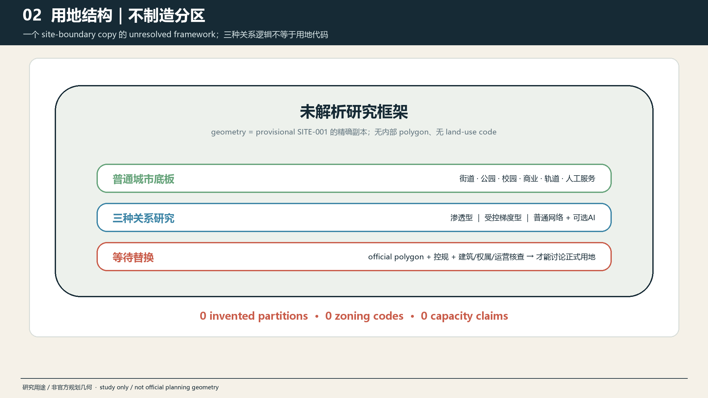

城市界面使用四条不变量校核：AI-free path 必须连续；公众能看到当前 AI 状态和证据状态；人工服务在错误、拒绝参与或断网时可以完成基本任务；安装物能从公共界面返回后场并恢复原有空间。该判断适用于首层、街道、公共空间和后勤，而不预设具体建筑改造。

## 5. 重点区域详细设计

三个重点区共享 D0–D4 与后场支持，但不共享同一构图。其 polygon 仍为 provisional context，公开面积量级不被概念图转换成精确红线。[data:geometry/key_areas.geojson#PROV-KEY-001] [metric:key_area_count] [depth:three_key_area_detailed_design]

**AI 原点 / Permeability。** 普通生活围绕开放公共边缘，Visible Work Edge 允许选择性看见、理解和交流；可选 AI 停留在 D1–D2，受控项目工作向 D3 后退。多个普通入口、休息、导向和物理信息在 AI 关闭后继续使用。公开资料支持该区域的创新、服务和展示语境，不证明某条建筑边缘可开放。[source:ai-origin-community] [source:ai-origin-talent-service]

**众智园 / Controlled Gradient。** 城市或生态边缘先形成可理解公共界面，再进入 D3 受控研发和 D4 专业验证；软件、固定设备与具身系统分别配置停止、隔离和恢复条件。Validation Threshold 让公开、受控、暂停、不可用状态可读，但公众没有进入受控验证的权利。[source:zhongzhiyuan-renewal] [source:tencent-xuezhiyuan]

**大钟寺 / Ordinary Network First + Optional AI Branch。** 交通、商业、文化和人工服务是主网络；Dazhongsi Branch Court 只是一条可关闭、可恢复普通用途的侧支。AI 不能成为乘车、购物、休息、文化体验或求助的必经节点。公开更新语境与零售 AI 案例只支持研究必要性，不证明任何商户或场地参加。[source:dazhongsi-renewal] [source:galbot-g1-haidian]

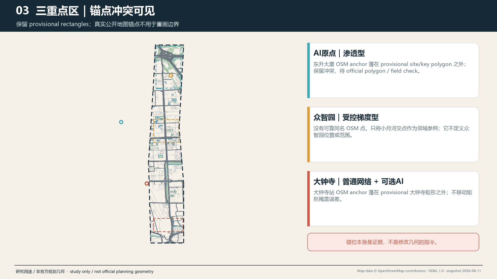

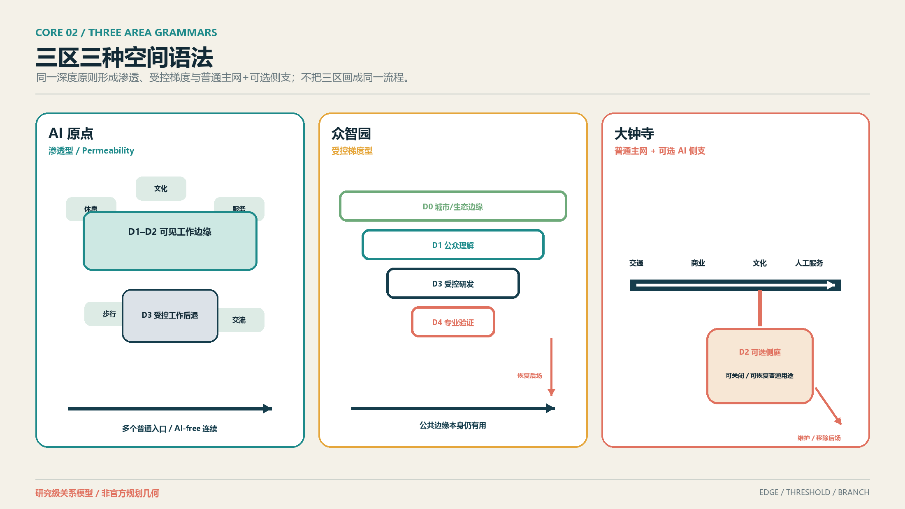

中关村科技服务翼承担证据诊所、要素转介与知识服务，小月河场景赋能翼承担可逆现场准备度审计；两翼是服务和方法网络，不画成新的重点区 polygon，也不自动成为项目。

## 6. AI 创新生态、人才画像与 AI+ 场景

十二个场景分为 **8 个 Spatial + 4 个 System**。Spatial 场景直接改变公共/受控边界、设备位置、测试空间或恢复关系；System 场景改变反馈、证据、服务连续或治理，不伪装成建筑。三类产业验证是 SCN-03 软件/模型、SCN-04 固定设备、SCN-10 具身系统。[standard:PROJECT-AGENT-OPEN-CALL-TASKBOOK] [depth:municipal_new_infrastructure]

| ID | 分类与场景 | 区域 / 深度 | 人工接管与退出 |
| --- | --- | --- | --- |
| SCN-01 | Spatial：项目可见性 | AI 原点，D0–D3 | steward 更正主张；移除数字层，普通入口和实体说明保留 |
| SCN-02 | System：社区反馈 | AI 原点与远程，D0–D2 | 人工读取原始意见；纸面、电话、在场渠道继续 |
| SCN-03 | Spatial / IND-TEST-01：受控软件研发 | 众智园，D3–D4 | 领域复核人停止模型并恢复人工基线 |
| SCN-04 | Spatial / IND-TEST-02：固定设备测试 | 众智园，D2–D4 + 后场支持 | 观察/维护者隔离电力网络、拆除并恢复表面与路径 |
| SCN-05 | Spatial：商业文化服务 | 大钟寺，D0–D2 | 一线人员旁路并完成普通服务 |
| SCN-06 | Spatial：自愿主办的零售应用 | 大钟寺，D2–D4 + 后场支持 | 授权员工停止设备并恢复普通零售布局 |
| SCN-07 | System：成果转化证据诊所 | 中关村翼，D1–D3 | 人类顾问核对材料；不自动决定资格、资金或审批 |
| SCN-08 | Spatial：可逆准备度审计 | 小月河翼，D0–D3 | 现场/人工记录优先；临时设备撤除并恢复 |
| SCN-09 | Spatial：可纠错文化解释 | 京张公共文化界面，D0–D3 | 内容 curator 停用、更正；物理路径和有据叙事保留 |
| SCN-10 | Spatial / IND-TEST-03：具身恢复演练 | 众智园，D3–D4 + 后场支持 | 训练角色急停、安全接近、隔离、恢复与撤场 |
| SCN-11 | System：AI-free 连续性演练 | 全带，D0–D4 | 激活普通服务；连续性失败则 AI 保持关闭或移除 |
| SCN-12 | System：双语开放证据复核 | 轮换/远程，D1–D3 | 人工翻译和 curator 更正、归档保留/调整/退出 |

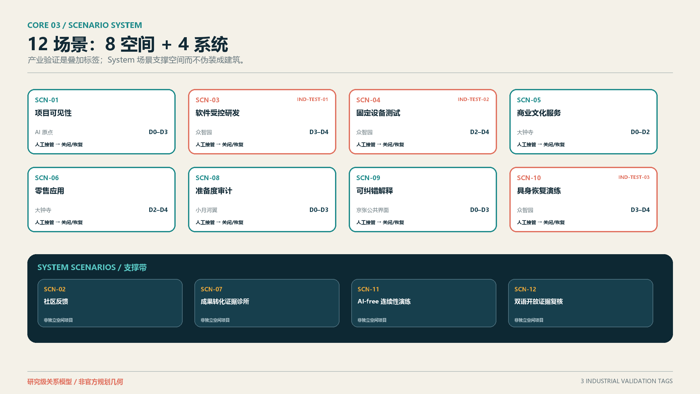

角色不是调研样本。七个 User/Worker 分别是研究人员、成果转化团队、居民/普通城市用户、设施维护人员、访客/学生/公共文化用户、一线商业与人工服务人员、无障碍敏感用户及陪同者；PER-08 是独立的 steward/governance role，拥有纠错、暂停、关闭和记录理由的职责，不冒充一般 persona。[source:accessibility-law]

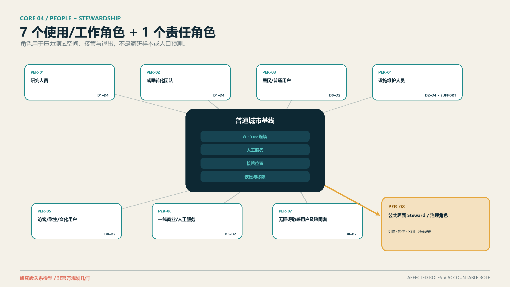

所有场景都必须通过“如果拿掉 AI 是否仍能提供基本城市功能”测试。AI 的不可替代价值只存在于可验证的识别、模拟、动态调整、受控验证或跨资源协同；若人工或普通设施更好，保留普通方案或移除 AI 都是成功结果。

## 7. 用地、建筑规模与拆改留方案

本阶段不具备精确建筑、权属、控规和工程证据，因此不把 Spatial Depth 画成建筑平面或层高。D0–D4 是关系性空间角色；后场支持可能是数字回滚、受控房间、维护通道或回收空间，具体形式、面积与位置待现场和专业核验。[standard:MOHURD-URBAN-DESIGN-MEASURES] [depth:development_intensity_controls] [depth:height_massing_character]

保留/改造/拆除/新建仍为待正式数据补齐。允许的当前判断只有：保留普通通行、商业、文化、休息和人工服务；优先使用可逆界面；不得以概念图决定拆改留；未证明维护与恢复能力的固定或具身设备不能开放。[depth:retain_renovate_demolish] [metric:building_density]

用地表达继续采用机器可校验的正式分类框架，不用自造“AI 用地”替代国土空间分类。AI 以可撤回的使用、界面、受控工作和运营义务进入，而不是给城市再加一种未经法定程序的用地类别。[standard:MNR-LAND-USE-CLASSIFICATION-GUIDE]

## 8. 交通、轨道、市政与公共服务设施

京张二期配套完成后，不能继续把过去的铁路阻隔直接描述为当前普遍事实。现有 OSM 道路、水系与 POI 仅为研究快照，不能证明宽度、坡度、开放时间、合法穿越、无障碍或服务通道。任何断点与时间成本必须通过多时段现场、地图路线和专业核验再确认。[source:jingzhang-phase-two-completion] [data:geometry/roads.geojson#ROAD-OSM-PRIMARY] [depth:traffic_rail_slow_parking]

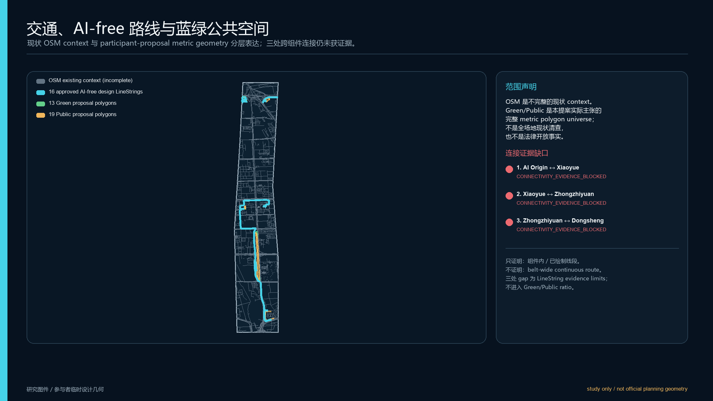

AI-free path 是设计要求而非现状主张：不需要账号、手机、传感授权或参与试验；在断网、错误、维护和永久移除时仍连续。固定设备不得挤占净宽，具身系统默认留在 D3–D4 受控环境；任何 D2 公众试点必须另行审查非参与者、无障碍、劳动、急停和恢复路径。

公共服务采用“普通入口 + 人工接管 + 可选 AI 侧支”。市政接口只登记电力、网络、弱电、充电、隔离、清洁和撤场等待核问题，不声称容量足够，也不把维护劳动隐形化。

## 9. 蓝绿空间、公共空间与城市风貌

蓝绿和公共空间首先服务休憩、遮荫、步行、骑行、文化、生态和人工帮助。AI 只能占据可关闭的侧支、解释界面或经批准的临时测试位置；主路径和基本公共价值不能依赖设备。[data:geometry/green_space.geojson#GREEN-OSM-COVERAGE] [data:geometry/public_space.geojson#PUBLIC-OSM-COVERAGE] [depth:blue_green_public_space]

三个主地标不是科技奇观，而是三种空间记忆：AI 原点的 **Visible Work Edge / 可见工作廊**，众智园的 **Validation Threshold / 验证门廊**，大钟寺的 **Dazhongsi Branch Court / 大钟寺分支庭**。前两者保留，后者是推荐设计候选；均无精确位置、尺寸、材料、建筑或运营承诺。

Human Service Anchor 降级为所有公共界面的 **Public Space Component**；Three-Layer Story Stop 降级为分布式 **Heritage Public Interface**。组件库包括人工服务点、非数字信息板、可选 AI 入口、AI-free/bypass 标识、接管/协助标识、维护通道提示、恢复/移除界面、无障碍休息与等候。它们是概念类型，不是产品目录或已布置设施。

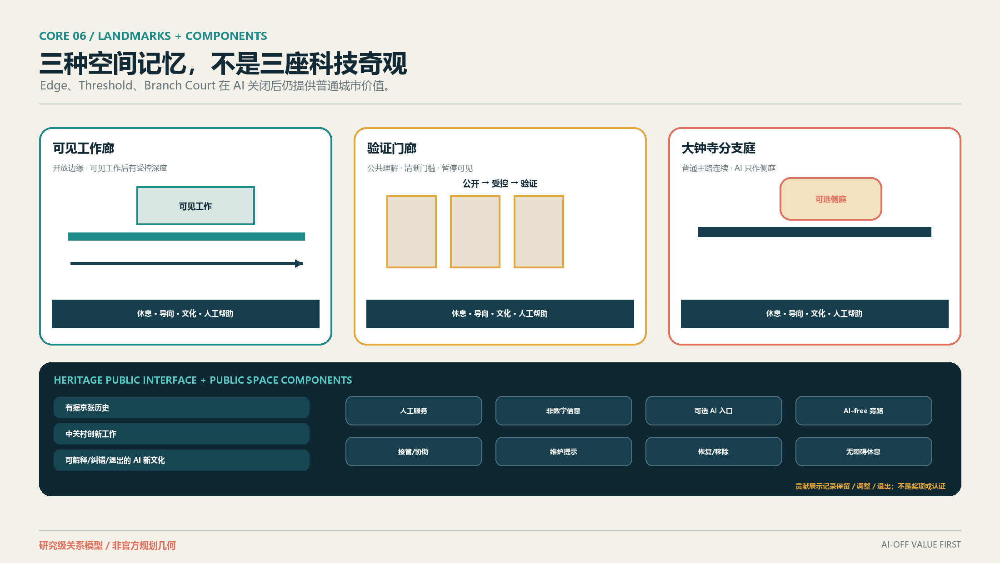

文化叙事分三层：有据的京张铁路历史与公共空间现状；中关村的创新工作与成果转化；AI 新文化的可解释、可纠错、可接管和可退出。实体、有来源的基础叙事先存在，可选数字层后进入；不得以铁路形态等同 AI，不虚构人物、事件或官方解释。[source:agent-taskbook] [source:jingzhang-phase-two-completion]

Open Contribution Display 记录贡献、来源、公共价值、Review/试点状态、维护贡献、恢复/移除结果和贡献者署名。保留、调整和退出都可以被记录；它不是奖项、认证、采购背书或政府荣誉。

## 10. 更新项目清单、实施政策与分期计划

候选组合分为三类：7 个 Spatial Projects（CP-01、03、04、05、06、07、10），2 个 Operational Programmes（CP-09、11），2 个 Governance / Service Systems（CP-02、08）。项目一词不再覆盖所有机制；只有内在需要空间且获得权威位置证据的候选，未来才有资格进入 GeoJSON。[depth:renewal_project_list]

| 类型 | 候选 | Geometry eligibility |
| --- | --- | --- |
| Spatial Projects | Visible Work Edge；Validation Threshold；Software/Model Shadow Cell；Fixed-Device Test Bay；Embodied Recovery Yard / Room；Ordinary Service + Optional AI Branch；Heritage Public Interfaces | CP-01/03/05/06 = YES；CP-04/07/10 = MAYBE；均不授权当前绘制 |
| Operational Programmes | Reversible Scenario Readiness Walks；Open Evidence Cycle & Archive | NO |
| Governance / Service Systems | Community Feedback Interface；Transfer Evidence Clinic Network | CP-02 = NO；CP-08 = MAYBE，仅限未来核验的服务点 |

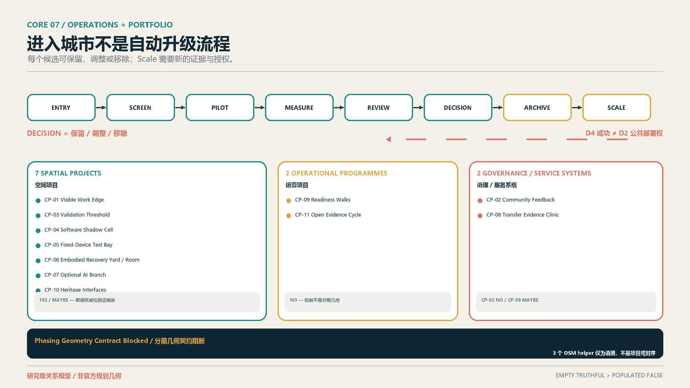

实施方法是 `ENTRY → SCREEN → PILOT → MEASURE → REVIEW → DECISION → ARCHIVE → SCALE`。Scale 不是自动结果；D4 验证成功不自动获得 D2 公共部署权，必须重新审查公共影响、普通连续、无障碍、一线劳动、维护、场地权利和退出。保持更深、暂停或移除均为正当决定。[source:C-SRC-101] [source:C-SRC-302] [depth:phasing_implementation]

现有 `phasing.geojson` 的三个 OSM 点只是 analysis helpers，不是项目、阶段、时序或地标。最新版 validator 要求 formal phasing 非空，因此外部空层测试将触发契约阻断；本阶段按规则保留原文件并明确 **Phasing Geometry Contract Blocked**。设计次序只表达依赖关系，不给日期、预算或政府承诺。[data:geometry/phasing.geojson#PHASE-CAND-001]

年度运营是候选机制：开放征集与 evidence clinic、开发者/维护者协作、场景开放、公众体验、双语 Review、退出归档和国际传播形成循环。活动品牌、场地、日历、经费、采购、合作方与转化效果均未确定；任何招引、资金或政策支持都不写成承诺。

## 11. 指标体系、面积复算与合规矩阵

已知指标包括由 provisional `SITE-001` 复算的 `site_area_sqm=11,412,825.385553982 m²`。[metric:site_area_sqm] 13 个 participant-proposed Green polygons 的 union area 为 `209,504.8649792572 m²`，`green_ratio ≈ 1.84%`。[metric:green_ratio] 19 个 participant-proposed Public polygons 的 union area 为 `192,272.2098199374 m²`，`public_space_ratio ≈ 1.68%`。[metric:public_space_ratio] `key_area_count=3`。[metric:key_area_count]

三项 required metrics 均是低置信度、submission-derived、provisional design-model outputs，不是官方面积或法定控制指标；公开总体范围约值 `11,400,000 m²` 只作版本/精度对照，不用于校准 polygon。[depth:metrics_recalculation]

建筑面积、FAR、建筑密度、高度、退线、官方精确 site polygon 及其他依赖未取得官方条件的指标继续保持 unknown。Green/Public 面积和比例则按上述 participant proposal geometry 以 known、low-confidence 保存，并在官方边界或设计几何变化时重新计算；这不削弱官方数据限制，也不把设计模型值升级为审批依据。[metric:green_ratio] [metric:public_space_ratio] [metric:floor_area_ratio]

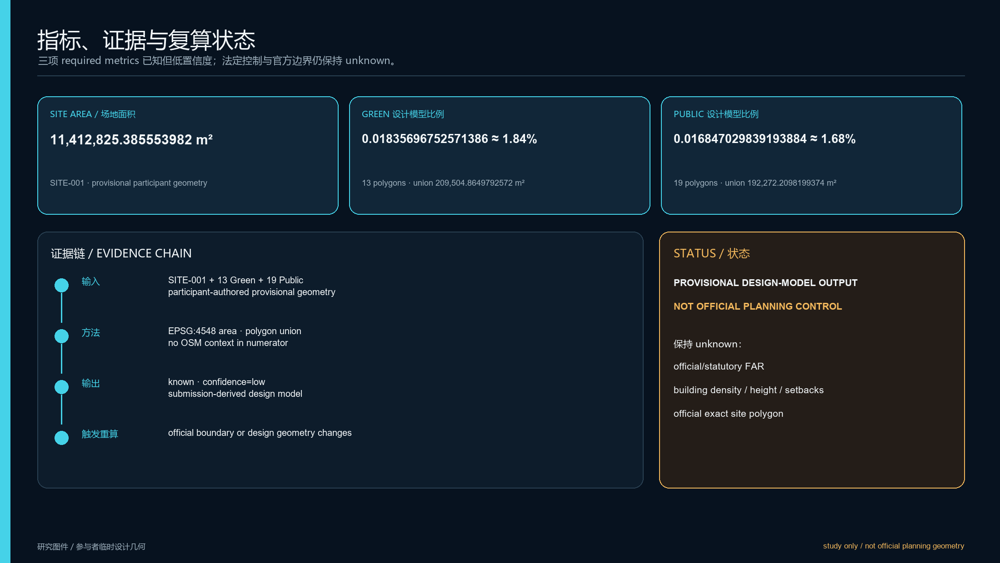

`compliance_matrix.json` 已把公告任务与 agent.1–agent.6 映射到正文、图层、指标、图纸、来源、假设和 HTML；`standard_matrix.json` 只登记真实专业标准；`design_depth_matrix.json` 把 Spatial Depth、三区、场景、文化、运营、候选组合和后续专业核验放入 evidence chain。矩阵完整不等于审批、工程可行或正式自检通过。

## 12. 风险、版权与合规说明

最大风险不是图面不够具体，而是用漂亮的空间精度掩盖没有来源的边界、建筑、责任和容量。当前保持 unknown：官方 site/key-area polygon、地块与道路红线、建筑/首层/产权/租约、消防结构机电、无障碍连续、后场和服务路线、具体 operator/maintainer、SLA、资金、活动资源、试验阈值及法律许可。[depth:risk_missing_data]

所有空间动作都是“概念建议”“参考方案”或“可供专业团队深化研究”。不得据此实施拆建、安装、封闭、测试、采购、招商或活动。D0–D4 是城市设计关系，不是法律风险、技术成熟度、认证或审批分类。

文本、图件、PDF 和离线 HTML 由本次智能体工作流生成；公共事实均记录在 `sources.json`。案例只做事实转述和机制比较，不复用案例图片、Logo、图纸、商标或大段文字。字体由本机系统用于 PDF 嵌入，完整权利与构建说明见 `report/copyright_statement.md`。

正式投稿资格以 `manifest.json` 与 `self_check.json` 的机器可读状态为准；本提案及其图件不构成审批、获选或实施状态声明。

## 13. 参考资料

完整的 28 条正式/场地/案例来源记录见 `sources.json`，包括发布者、URL、日期、用途、限制与复用说明；18 条去重假设记录见 `assumptions.json`。八个案例来源还包括 Helsinki 的城市创新公司说明、Punggol 的政府机构项目与测试公告、伦敦测试场运营方页面、Cornell Tech 大学页面、Woven City 运营方页面、Waterfront Toronto 公共机构声明、Kashiwa 官方项目页和 Seestadt 官方城区页。[source:C-SRC-102] [source:C-SRC-202] [source:C-SRC-501]

案例补充来源用于交叉支撑方法与空间关系，不证明北京转移：London private trials、Cornell campus、Woven Inventors、Waterfront Toronto withdrawal statement 和当前 Seestadt urban-lab page 均保留各自限制。[source:C-SRC-302] [source:C-SRC-701] [source:C-SRC-802]

本方案的审计优先级保持：GeoJSON → metrics → 三矩阵 → manifest/sources/assumptions/self-check → proposal → figures → HTML/PDF。若后续取得 official polygons、控规、建筑或责任证据，必须从权威层重新复算并同步所有呈现成果，而不是只改一张图。[standard:PROJECT-AGENT-OPEN-CALL-TASKBOOK]
