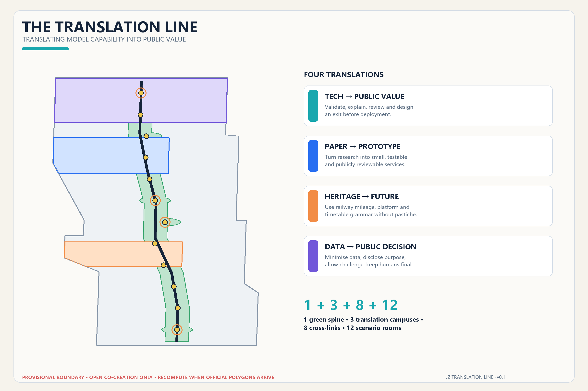
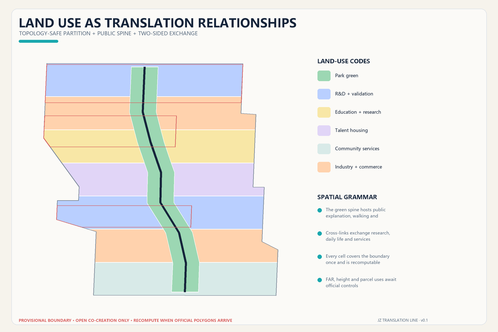
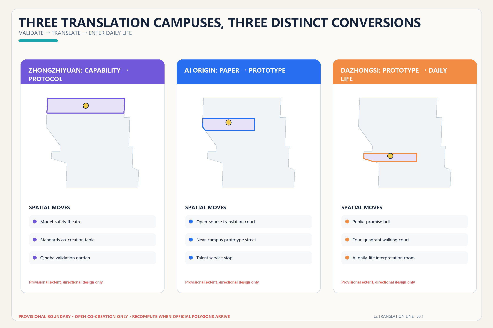
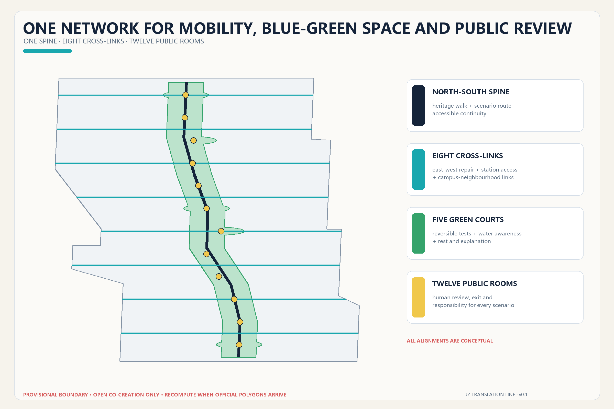
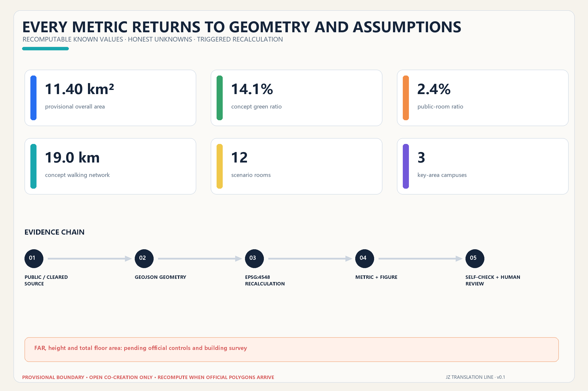

# THE TRANSLATION LINE / 京张共译线

> Translate model capability into public value.

## Design Basis and Source List

This proposal begins with a restrained diagnosis: Haidian does not lack algorithms, papers or demonstrations. What remains scarce is a civic interface that translates technical capability into something an ordinary person can understand, evaluate, challenge and refuse. “Translation” is therefore not a branding layer. It is a design gate. Before an AI-enabled service enters public space, it must state what was tested, what the service is for, who performs human review, how it can be paused or exited, and what public return it creates. The spatial language translates railway platforms, mileage, signals and timetables into contemporary public interfaces without reducing railway heritage to decoration. The official announcement and agent taskbook establish the three scales, required questions and open-call context [source:OFFICIAL-ANNOUNCEMENT] [source:AGENT-TASKBOOK].

The machine-audit layer reads the repository site package, source registry and processed fact pack as distinct forms of evidence: rules, permitted use and reading navigation respectively [source:SITE-PACKAGE] [source:SOURCE-REGISTRY] [source:PROCESSED-FACT-PACK]. Local standards snapshots guide judgments about urban design, regulatory-plan depth and land-use classification. None proves that an exact statutory boundary, regulatory change or engineering proposal has been approved. Existing buildings, ownership, road sections, heritage controls, utilities and capacity remain professional-data gaps rather than blanks for an AI to invent [depth:existing_conditions_diagnosis].

The repository has publicly disclosed a spatial mismatch between its default provisional boundary and mapped Jingzhang Heritage Park context. This proposal attributes and reuses the street-aligned derivation that contributor xr843 explicitly offered for reuse or improvement in Issue #846. It remains a `provisional_constraint`. OpenStreetMap is used only to understand named streets and station anchors; it is not a road red line, parcel fabric or official boundary [source:BOUNDARY-SOURCE] [source:PEER-STREET-BOUNDARY] [source:OSM-CONTEXT]. Recalculation in EPSG:4548 yields approximately 11.40 km². That value describes only the submitted provisional geometry. When an official polygon arrives, the boundary, key areas, every design layer, every metric, every figure and every PDF must be rebuilt as one chain [data:geometry/site_boundary.geojson#SITE-001] [metric:site_area_sqm].

## Three-Level Scope Framework

The three scopes perform three kinds of translation. The 43.6 km² coordinated research area translates regional innovation resources by connecting the three core areas, two enabling wings, universities, firms, technology services and feedback from real scenarios. The 11.4 km² overall design area translates spatial rules by placing industry, communities, public space, walking and operating relationships into a complete set of layers. Three key areas translate implementation prototypes: capability into protocol, paper into prototype, and prototype into everyday service. The scopes progressively focus the work, but the broad research area and textual directional descriptions are not drawn as false-precision boundaries [standard:PROJECT-OFFICIAL-ANNOUNCEMENT] [depth:three_level_scope_framework].

The spatial syntax is “1 + 3 + 8 + 12”: one north–south Translation Green Spine for heritage, walking and public explanation; three Translation Campuses for different stages of technical conversion; eight east–west corridors that conceptually reconnect campuses, innovation parks, neighbourhoods and rail stations; and twelve Scenario Rooms where AI services can be tested, explained and reviewed in visible public settings. This is not another monumental axis. It locates public value in ordinary crossings, pauses and conversations [data:geometry/roads.geojson#ROAD-001] [depth:overall_spatial_structure].

The naming system uses translation as a shared verb. The three key areas are the Protocol Campus, Prototype Campus and Everyday Campus. A logo direction folds two parallel rail traces into open quotation marks: cyan means public explanation, deep blue means reliable evidence, and orange marks the person’s final decision. Signage uses original geometry and system typefaces rather than borrowed corporate or event identities [standard:PROJECT-AGENT-OPEN-CALL-TASKBOOK].

The boundary is intentionally low-contrast and dashed. High contrast belongs to the spine, corridors, scenario nodes and key areas. This visual hierarchy also defines the replacement workflow: insert the new boundary, rebuild and clip the land-use topology, recalculate green space, public space, prototype footprints and mobility length, then regenerate figures, HTML, A3/A0 documents and manifest hashes. Replacing only a line would be an invalid update.

## Coordinated Research Area: Industry and Future City Research

The “three areas and two wings” become a two-way translation loop. Zhongzhiyuan converts model capability into safe protocols. AI Origin Community converts research into public prototypes. Dazhongsi converts prototypes into everyday services and cultural consumption. The Zhongguancun technology-service wing contributes capital, intellectual-property support, legal capacity and international networks; the Xiaoyue River scenario-enablement wing returns real questions from residents, firms and public services. Five functions—full-stack research, ecosystem cooperation, scenario validation, city experience and governance expression—form a workflow rather than a list of labels. Each stage must preserve source, responsibility and exit records.

Six global references supply transferable mechanisms, never copied form or imported numerical targets:

| Reference | Transferable mechanism | Translation for Jingzhang |
| --- | --- | --- |
| Kendall Square | Research clusters work with housing, food and public life | Include everyday places outside laboratories in the innovation ecosystem [source:CASE-KENDALL] |
| Barcelona 22@ | Knowledge transfer is coupled with mixed-use urban renewal | Industrial renewal must also repair services and neighbourhood links [source:CASE-22BARCELONA] |
| Singapore one-north | Research, incubation, testing, work and life form a continuous ecosystem | Pair validation space with open exchange and talent services [source:CASE-ONENORTH] |
| Toronto Quayside | A public institution retains leadership over privacy and digital governance | Establish civic rules before deploying urban data services [source:CASE-QUAYSIDE] |
| Hetao Shenzhen–Hong Kong zone | Research cooperation and institutional service interfaces advance together | The two wings should provide cross-institution services, not only spatial extension [source:CASE-HETAO] |
| Paris-Saclay | Urban campus and public realm connect distributed research bodies | Treat walking and public life between campuses, parks and communities as infrastructure [source:CASE-PARISSACLAY] |

All six are qualitative `background_only` references. They support neither site area nor intensity, investment or policy promises. The original contribution here is to extend technical transfer into civic co-translation: residents, disabled users, maintainers, visitors and professional reviewers receive explanation interfaces and feedback rights alongside firms and research institutions.

An eight-part Translation Table coordinates land, space, industry, capital, talent, computing, data and scenarios. Land follows official planning conditions; space begins with reversible prototypes; industry is organised by problem statements rather than an invented company list; funding suggestions attach to disclosed milestones; talent services combine work and life; computing declares energy and permissions; data declares source and retention; and every scenario names an operator and human reviewer. This framework does not fabricate companies, output, talent density or fiscal support. Where reliable baselines do not exist, performance remains a future monitoring framework.

## Overall Design Area: Urban Renewal and Regulatory-Plan-Level Urban Design

The Translation Green Spine is the civic armature. Other areas are arranged as paired east and west bands across seven north–south segments. The partition fully covers the submitted boundary without overlap and uses national territorial-spatial land-use codes: R&D validation `0802`, education and research `0804`, talent housing `0701`, community service `0702`, industrial-commercial mix `05` and park green `1401`. The diagram tests whether research, life, services and open space can continuously exchange; it does not pre-assign statutory parcel uses [standard:MNR-LAND-USE-CLASSIFICATION-GUIDE] [data:geometry/land_use.geojson#LU-001] [depth:land_use_layout].

Renewal follows five steps: pre-translation survey, shared evaluation, reversible trial, public follow-up and professional consolidation. Without a building survey and ownership data, the building layer contains only twelve possible spatial prototypes—open research courtyard, near-campus workshop, community translation station, mixed-use civic room, lifelong-learning station and talent-life support. These cannot be interpreted as surveyed buildings, demolition objects or approved new construction [data:geometry/buildings.geojson#BLDG-001] [metric:building_footprint_area_sqm].

Regulatory planning requires approved evidence for land use, floor-area ratio, height, density, green ratio, facilities and protected lines. The proposal turns those into a due-diligence list: FAR, height and total floor area remain `unknown`. Massing directions—accessible ground floors, permeable courtyards, controlled roof equipment and public explanation space at important edges—remain qualitative until official planning, heritage, fire, daylight and transport reviews are available [standard:MOHURD-CONTROL-DETAILED-PLANNING] [depth:development_intensity_controls].

Retain–renovate–demolish decisions are deliberately deferred. Professionals should build a seven-field card for each real building: structural safety, use efficiency, historical value, embodied carbon, property condition, public access and renewal cost. Safe buildings with public value should be retained first; lightweight adaptation should precede replacement; demolition or new construction should be considered only with complete evidence, higher replacement value and full approval. Height, massing, frontage and character decisions follow that evidence [depth:height_massing_character] [depth:retain_renovate_demolish].

## Detailed Design of Key Areas

All three provisional polygons are anchored to published approximate areas and public station clues. They support directional design only—not parcel, road or engineering decisions. Each Translation Campus shares five components: a public explanation desk, human-review room, reversible test surface, accessible feedback point and contribution-credit wall. Their conversion tasks differ [data:geometry/key_areas.geojson#PROV-KEY-001] [metric:key_area_count] [depth:three_key_area_detailed_design].

**Zhongzhiyuan Protocol Campus: capability into protocol.** Its sequence is Qinghe Validation Garden, Model Safety Theatre and Protocol Release Station. The garden accommodates low-disturbance sensing, robot circulation and low-carbon computing displays. The theatre makes red-team tests, standards discussion and failure review observable by appointment. The release station turns model scope, energy, data, human responsibility and exit conditions into a public “departure sheet.” External access, river controls, ecology, flood safety, energy and national-platform requirements require professional verification; no engineering work or institutional commitment is claimed.

**AI Origin Prototype Campus: paper into prototype.** Its sequence is Open-source Translation Court, Paper-to-Prototype Workshop and Talent Life Station. Research first explains its problem and limitations in ordinary language, then enters a small workshop for real-user testing. The station provides interfaces for legal help, intellectual property, accessibility, childcare, lodging and community collaboration. Connections to Wudaokou and Qinghuadongluxikou, campus boundaries and the use of research outputs all require official or rights-cleared evidence [data:geometry/key_areas.geojson#PROV-KEY-002].

**Dazhongsi Everyday Campus: prototype into everyday life.** Its sequence is Public Commitment Bell, Four-Quadrant Mobility Court and Intelligent-Life Glossary Room. The Bell is a replaceable information ring, not a monumental object: it shows the responsible party, service hours, data range and exit state for each open scenario. The court prioritises walking, cycling, accessibility and bicycle parking. The glossary room demonstrates terminals, content, legal and daily-life services under supervision. Station works, heritage relationships, intersections and business interfaces remain conditions for later study [data:geometry/key_areas.geojson#PROV-KEY-003].

## AI Innovation Ecosystem, Personas, and AI+ Scenarios

The line serves six specific groups rather than an abstract “AI talent” persona. Open-source developers need collaboration and attribution. Start-ups need affordable testing and compliance help. Researchers need a path from paper to evaluable prototype. Nearby residents need low-disturbance services and a clear exit. Disabled users need multimodal interfaces and on-site assistance. Urban maintainers need visible information about faults, energy, responsibility and human takeover. These personas guide space and service design; they do not create behavioural profiles or commercial recommendations.

Twelve scenario cards correspond to twelve public-space features. Every card includes purpose, minimum data, human review, operating responsibility, pause/exit and public return [data:geometry/public_space.geojson#PUBLIC-001] [metric:translation_node_count]:

| # | Scenario | Type and setting | Data and human boundary |
| --- | --- | --- | --- |
| 01 | Public model-safety red team | Industry test; Safety Theatre | Authorised test data only; safety lead can stop immediately |
| 02 | Accessible robot co-mobility | Industry test; north spine | No facial recognition; on-site guide has takeover priority |
| 03 | Edge-model energy and latency | Industry test; Validation Garden | Disclose energy and latency method; facilities engineer reviews |
| 04 | Multi-agent city-task sandbox | Industry test; Protocol Station | Synthetic or public tasks; no direct writes to urban controls |
| 05 | Walking-barrier explainer | Public service; eight corridors | Aggregate reports only; transport professional decides action |
| 06 | Accessible multimodal wayfinding | Public service; full line | User selects voice, haptic or large type; offline option remains |
| 07 | Community legal co-translation | Daily service; Origin area | Does not replace a lawyer; sensitive material stays local and reviewed |
| 08 | AI education and paper glossary | Education; Prototype Workshop | Sources and uncertainty shown; teacher or author confirms |
| 09 | Talent life-service station | Talent service; Origin area | No hidden scoring; staffed and offline alternatives remain |
| 10 | Intelligent-life glossary room | Consumer service; Dazhongsi | Recommendation and commercial relationships visible; personalisation off by choice |
| 11 | Jingzhang memory translation desk | Culture; Centennial platform | Verifiable history only; public corrections accepted |
| 12 | Annual open-source public route | Operations; full line | Event-specific consent; humans confirm safety, rights and capacity |

The first four industry tests exceed the three-test minimum. Every test is bounded by time, place and a named responsible role; a failed pilot can revert to ordinary walking space or staffed service. Success prioritises comprehension, timely human takeover, easy exit and visible civic benefit rather than model accuracy or attendance alone. Privacy, safety and human final judgment are hard gates [standard:PROJECT-AGENT-OPEN-CALL-TASKBOOK].

## Land Use, Building Scale, and Retain-Renovate-Demolish Strategy

Complete coverage and functional exchange govern land use. The green spine forms continuous park space, while research, education, housing, community service and commercial-industry cells occupy paired bands connected by transverse corridors. Calculable areas test whether adequate space has been reserved for public life, talent support and innovation services; they are not approved development controls.

The concept-building footprint is recalculated from `buildings.geojson` and used only for comparing prototype capacities. Every feature carries a `status_note` declaring that it is neither an existing-building survey nor approved construction. Total floor area, FAR and height remain unknown. `MOHURD-ARCH-DESIGN-DEPTH-2016` is recorded as unavailable official depth material, not as a standard already satisfied [standard:MOHURD-ARCH-DESIGN-DEPTH-2016].

Drawings use three levels of transparency instead of unsupported “demolish/retain” assertions: dark forms identify investigation and possible retention priority; translucent forms indicate reversible adaptation trials; dashed forms mark volumes discussable only after ownership, structure, planning, fire, daylight and public-value review. A professional handover replaces this prototype layer with a surveyed building database and logs evidence and date for every classification change.

## Transport, Rail, Municipal Infrastructure, and Public Services

The conceptual mobility network combines one north–south spine with eight east–west corridors. Its length is recalculated from the road layer. The spine links the three Translation Campuses and twelve Scenario Rooms; the corridors place daily east–west connections across railways, roads and closed edges onto a common map [data:geometry/roads.geojson#ROAD-001] [metric:slow_mobility_length_m] [depth:traffic_rail_slow_parking]. Every corridor requires professional review for walking continuity, cycling order, accessible slopes, rail safety, bicycle parking, night lighting and wet-weather use. No line is a bridge, tunnel, road, rail or construction design.

Station integration starts with four questions: can a person understand the route after exiting, is there an accessible alternative, is the crossing safe, and is public service visible? Zhongzhiyuan focuses on the North Fifth Ring and Qinghe interface; AI Origin focuses on campus–park–community links between Wudaokou and Qinghuadongluxikou; Dazhongsi focuses on four station quadrants and bicycle order. Passenger flows, road red lines, cross-sections, under-bridge space and rail protection information are required before detailed design.

New infrastructure uses a “visible service cabinet” prototype. Edge computing, distributed energy, sensors, storage or communications equipment must show energy use, data scope, maintenance body, fault state and human contact. Sensitive equipment is separated from public space and every connected service keeps an offline alternative. Utility, drainage, flood, fire, electricity and compute-capacity data are absent, so the proposal makes no capacity or siting promise [data:geometry/constraints.geojson#CONSTRAINTS] [depth:municipal_new_infrastructure].

## Blue-Green Network, Public Space, and Urban Character

The blue-green network is the first place where technology accepts public scrutiny, not a scenic background. The spine combines railway-heritage traces, walking and cycling, rest, rainwater explanation and low-disturbance testing. Five enlarged green courts support Qinghe validation, centennial mileage, open-source outcomes, talent life and protocol release. On the provisional geometry, green space is approximately 14.1% and the public-space layer approximately 2.4%. Neither is a statutory green-space rate or official park boundary [data:geometry/green_space.geojson#GREEN-001] [metric:green_ratio] [metric:public_space_ratio].

Character follows “railway grammar without railway pastiche”: slim canopies recall platforms, continuous ticks recall mileage, three-colour rings recall signals, and low lighting preserves night legibility. Materials should be maintainable, replaceable and low-glare. Neon “cyber” imagery and giant screens are avoided. Urban design coordinates buildings, public space and local culture, but heritage areas, height, massing and colour still require formal evidence and professional review [standard:MOHURD-URBAN-DESIGN-MEASURES] [depth:blue_green_public_space].

Four lightweight honour and pilgrimage nodes are proposed. The Protocol Release Station exhibits open standards, failure reviews and responsibility signatures. The Open-source Translation Court credits code, data, maintenance and community work rather than celebrity alone. The Centennial Mileage Platform aligns a verified railway timeline with public commitments for AI urbanism. The Public Commitment Bell displays running, paused and exited states through a replaceable ring. Contributor names must come from verifiable records; people, trademarks, company marks and historic images enter only after rights clearance.

The cultural narrative moves from a first translation of distance to a second translation of capability. A century ago the railway translated terrain into a shared timetable. Today the line should translate model capability into shared public rules. Wayfinding therefore communicates destination, accessibility, service state, data notice and human help together, never allowing technical spectacle to outrank dignity and daily life.

## Renewal Projects, Implementation Policy, and Phasing

The project list is an open task register with dependencies, not a commitment schedule:

| Project | Concept action | Condition before initiation |
| --- | --- | --- |
| T-01 Translation Green Spine | Continuous mobility, explanation desks and low-impact activity | Official park/heritage boundary, transport and accessibility review |
| T-02 Eight cross-corridors | Conceptual east–west links and station access | Road red lines, rail protection, bridge/tunnel and fire conditions |
| T-03 Protocol Campus | Safety Theatre, Validation Garden, Release Station | Institutional intent, ownership, energy and safety conditions |
| T-04 Prototype Campus | Open-source court, workshop and talent station | Campus/park boundary, building survey, operating body |
| T-05 Everyday Campus | Commitment Bell, four-quadrant court, glossary room | Station, intersection, heritage, business and transport review |
| T-06 Twelve-scenario opening kit | Governance cards, light facilities and exit drills | Data permission, responsible roles, public test and ethics review |
| T-07 Translation identity | Quotation-rail logo, mileage signs and state rings | Rights clearance for type, images, names and display |
| T-08 Public-value ledger | Explanation, takeover, exit, maintenance and follow-up record | Independent governance, data minimisation and operating budget |

Three complete phasing polygons cover the design area. The near term prioritises public translation stations, open-source explanation sessions, accessibility walks and small opening kits for four industry tests. The medium term advances the three campuses and corridor renewal only after boundary, ownership and professional conditions are supplied. The long term forms corridor-wide governance, annual maintenance and regional collaboration. The phases express conceptual dependency, not approval, funding or construction dates [data:geometry/phasing.geojson#PHASE-001] [depth:phasing_implementation].

An annual cycle runs through spring questions, summer prototypes, autumn open source and winter review. Spring publishes urban problem statements. Summer tests bounded prototypes with clear staff responsibility. The autumn “Jingzhang Translation Open-source Season” shares code, data notes and public feedback. Winter discloses faults, human takeover, exits and maintenance. Developers collaborate through issues, open days and maintenance rotations; the public route always offers a non-AI version; international communication uses bilingual case cards and reproducible methods. Events, investment attraction, policy, finance and institutional arrangements remain reference proposals [depth:renewal_project_list].

## Metrics, Area Recalculation, and Compliance Matrix

Only values reproducible from the present package are reported: provisional design-area size, concept-building footprint, green and public-space ratios, key-area count, mobility-network length and Scenario Room count. Geometry is recalculated in EPSG:4548. FAR, height and total floor area remain `unknown` because official controls and surveys are unavailable. A small auditable set is more useful for professional handover than false-precision development controls [depth:metrics_recalculation].

| Metric | Current result | Design meaning | Evidence boundary |
| --- | ---: | --- | --- |
| Provisional overall area | 11.400 km² | Base for clipping and recalculation | Provisional, not an official boundary |
| Concept building footprint | See `metrics.json` | Compare prototype spatial capacity | Low confidence; no total floor-area inference |
| Green ratio | approx. 14.1% | Continuous mobility, rest and low-impact testing | Design ratio, not statutory green rate |
| Public-space ratio | approx. 2.4% | Twelve rooms and public review interfaces | Design ratio; may overlap green space |
| Key areas | 3 | Three technical-conversion stages | Provisional polygons |
| Mobility network | approx. 19.0 km | One spine and eight corridors | Concept alignment; transport review required |
| Scenario Rooms | 12 | Spatial anchors for taskbook scenarios | Count fixed; positions replaceable with official boundary |

The compliance matrix covers announcement items 1.3, 1.4 and 1.5 plus agent.1–agent.6. The professional-standards matrix records five mandatory sources and one missing architecture-depth source. The design-depth matrix links diagnosis, three scopes, structure, land use, intensity, massing, retain–renovate–demolish, transport, utilities, blue-green network, key areas, projects, phases, metrics and risk to text, geometry, drawings and self-check. `PASS` means only that the package can enter content review. It does not mean planning approval or engineering feasibility.

## Risk, Copyright, and Compliance

The principal risk is that provisional geometry could be mistaken for a formal boundary. Every figure, HTML page and PDF marks it as provisional. When an official or rights-cleared polygon is published, the automated pipeline must rebuild from the boundary rather than preserve the present partition. Planning, roads, buildings, heritage, utilities, services and ownership gaps are separately logged in `assumptions.json` for review by planning, architecture, transport, landscape, heritage, utilities, fire, accessibility, data-governance and operations professionals [depth:risk_missing_data].

AI scenarios follow data minimisation, purpose limitation, user choice, human review, public responsibility and exit. The framework prohibits indiscriminate facial-recognition surveillance, hidden scoring, unexplained denial of service, direct writes from pilot output into urban control and supplier lock-in of public services. Safety, legal, medical, educational and planning advice always requires the relevant professional’s final judgment.

Text, layers, figures, HTML and PDFs were generated by OpenAI Codex from public or rights-cleared material. The Issue #846 boundary derivation is attributed; OSM is credited under ODbL. No commercial map tiles, unauthorised photographs, trademarks, portraits, paper figures, external font files, secret mapping or personal data are used. Generation methods, dependencies, licences and limitations are recorded in `report/copyright_statement.md`.

Every spatial, policy, event, investment, financing and operating statement is a concept suggestion, reference plan or item for professional study. Nothing replaces formal planning or constitutes government endorsement, administrative permission, investment decision, construction documentation or implementation commitment. Any later source, issue, pull request or review that changes the basis must update `changelog.md`, rerender, finalise, self-check and run preflight again.

## References

Primary references are the official announcement of 9 May 2026 from the Haidian branch of the Beijing planning and natural-resources authority; the rights-cleared agent taskbook excerpt; local snapshots of the national urban-design and regulatory-planning rules and land-use classification guide; the repository source registry, provisional boundary and missing-data register; and Issue #846’s public discussion and reusable street-aligned derivation. Global mechanisms are read from official pages of the City of Cambridge, Barcelona City Council, JTC Singapore, Waterfront Toronto, Shenzhen Government and the Paris-Saclay public development body, for qualitative comparison only.

The machine-readable source index, access dates, use restrictions and licences are in `sources.json`; formulas are in `metrics.json`; task, standards and design depth are in three matrices. Official architecture design-depth material is unavailable and is therefore recorded as a gap rather than claimed compliance. Readers should use GeoJSON/JSON as the recalculation layer, the proposal as the argument layer, and the figures and PDFs as the explanation layer—always preserving the provisional-boundary condition and human final judgment.
