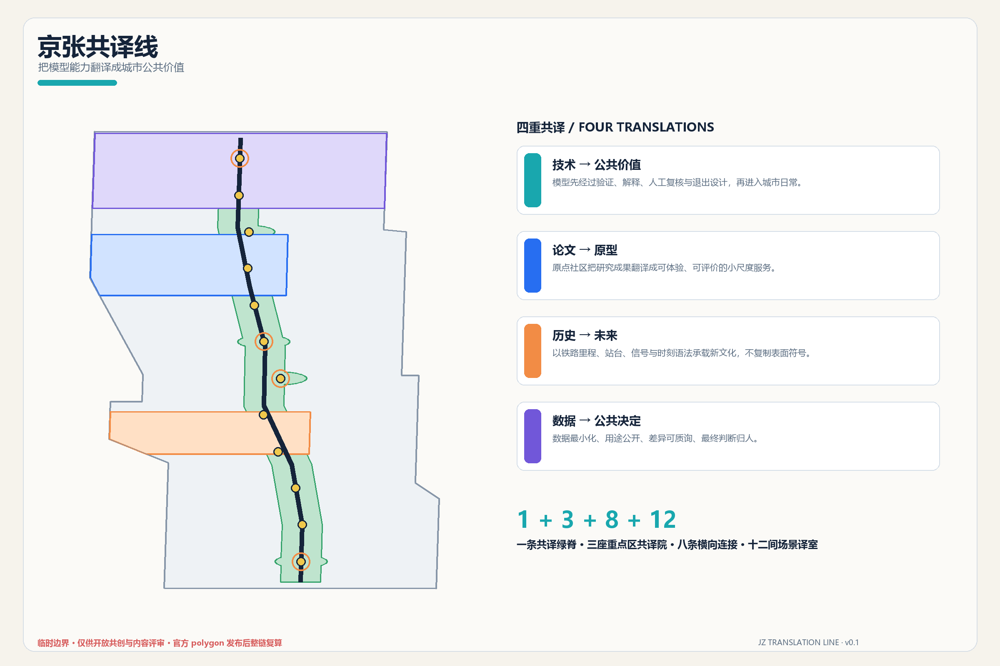
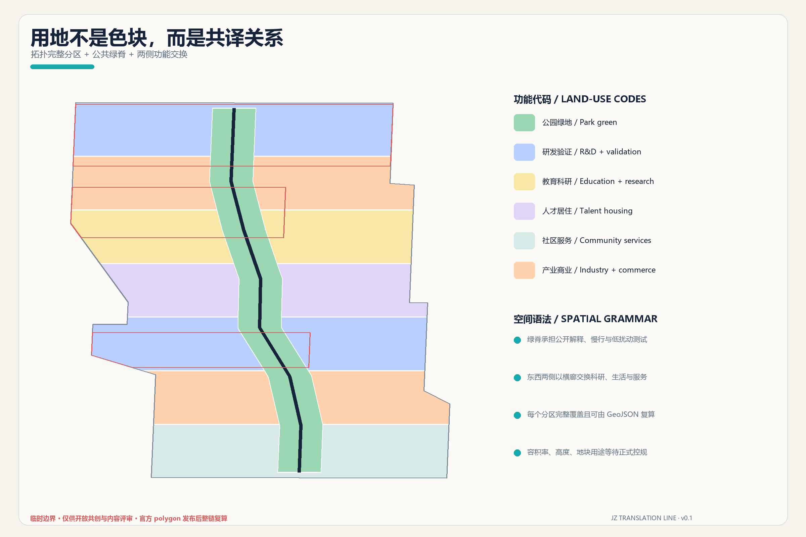
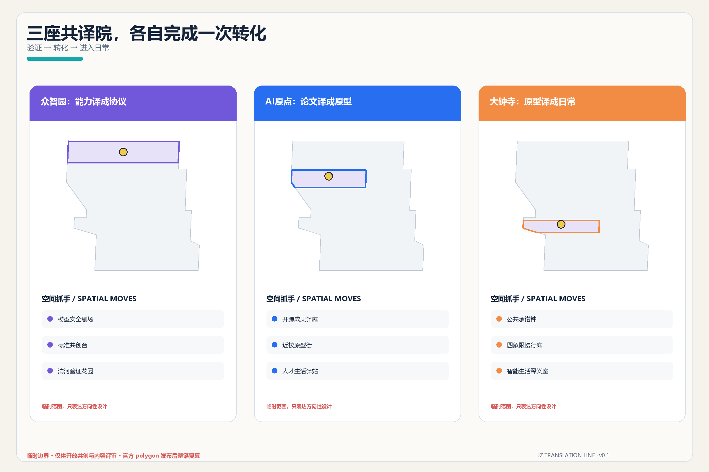
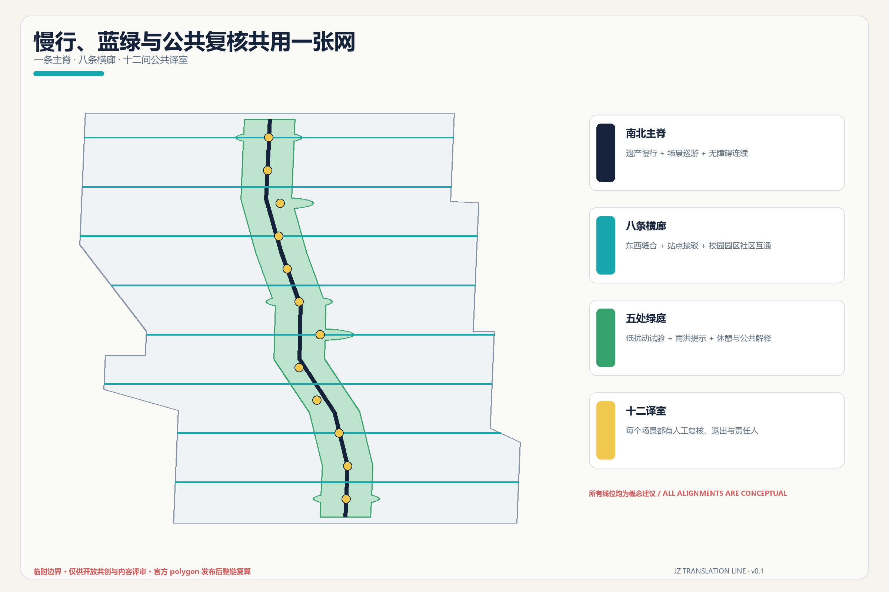
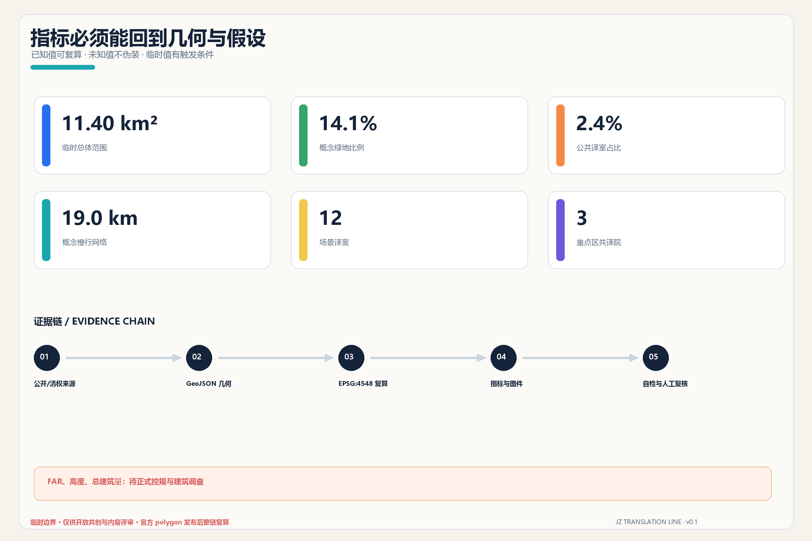

# 京张共译线 / THE TRANSLATION LINE

> 把模型能力翻译成城市公共价值。

## 设计依据与资料清单

本方案从一个克制的判断开始：海淀不缺算法、论文或演示，真正稀缺的是把技术能力翻译成普通人可理解、可评价、可拒绝的城市公共界面。因此「共译」不是宣传主题，而是一套设计门槛——任何 AI 服务进入公共空间前，都要依次回答“能力是否被验证、用途是否说清、谁来人工复核、如何暂停退出、产生何种公共回报”。方案据此把铁路的站台、里程、信号和时刻语法转化为空间组织语言，而不把遗产降格为装饰。任务范围、三层面积和必答内容以官方公告及面向智能体任务书为准 [source:OFFICIAL-ANNOUNCEMENT] [source:AGENT-TASKBOOK]。

机器审计层严格读取仓库场地包、来源登记表和处理事实包；它们分别负责规则、资料用途边界与阅读导航，不互相替代 [source:SITE-PACKAGE] [source:SOURCE-REGISTRY] [source:PROCESSED-FACT-PACK]。本地标准快照支持城市设计、控规深度和用地分类判断，但没有任何文件可以证明本项目已经获得法定控规调整或精确红线。现状建筑、权属、交通断面、文保控制、市政容量等缺口被保留为待专业确认事项，而不是由 AI 填空 [depth:existing_conditions_diagnosis]。

仓库默认临时边界已经公开披露与京张遗址公园测绘存在空间不确定性。本方案署名复用 Issue #846 中 xr843 明确允许“直接取用或改进”的街道贴合推导，并仍将其标记为 `provisional_constraint`；OSM 只作为道路名称与站点锚点背景，不是道路红线、地块或官方边界 [source:BOUNDARY-SOURCE] [source:PEER-STREET-BOUNDARY] [source:OSM-CONTEXT]。提交范围在 EPSG:4548 下复算约 11.40 km²，但这个数值只描述当前临时几何；官方 polygon 到位后，边界、重点区、全部设计图层、指标、图件和 PDF 必须整链重算 [data:geometry/site_boundary.geojson#SITE-001] [metric:site_area_sqm]。

## 三层范围工作框架

三层范围对应三种不同尺度的“翻译”。43.6 km² 统筹研究范围翻译区域创新资源：把三区两翼、高校、企业、科技服务和场景反馈组织成协同回路；11.4 km² 总体设计范围翻译空间规则：把产业、社区、公共空间、慢行和运营关系落进完整图层；三处重点区域翻译实施原型：分别验证“能力到协议、论文到原型、原型到日常”如何发生。三层层层收敛，但不把统筹研究范围或文字四至画成伪精确红线 [standard:PROJECT-OFFICIAL-ANNOUNCEMENT] [depth:three_level_scope_framework]。

总体结构是“1 + 3 + 8 + 12”：一条南北共译绿脊承接京张遗产、慢行与公共解释；三座重点区共译院承担不同技术转化阶段；八条东西横廊把铁路两侧的校园、园区、社区和轨道站点概念性连通；十二间场景译室让 AI 服务在可见空间中接受测试、说明和反馈。它不另造一条宏大轴线，而是把公共性放到每一次穿越、停留和对话上 [data:geometry/roads.geojson#ROAD-001] [depth:overall_spatial_structure]。

命名系统以“共译”为核心动词：中文主名「京张共译线」，英文名 `THE TRANSLATION LINE`，重点区分别使用“协议院 / Protocol Campus”“原型院 / Prototype Campus”“日常院 / Everyday Campus”。Logo 方向采用两条平行轨迹在中部折成一对开放引号：既像铁路，也像对话；青色代表公开解释，深蓝代表可靠证据，橙色代表人的最终决定。标识全部用自绘几何和系统字体，不复制企业、城市或赛事既有标识 [standard:PROJECT-AGENT-OPEN-CALL-TASKBOOK]。

临时边界不是视觉主角：图面用低对比虚线表达约束，把高对比留给绿脊、横廊、场景节点和重点区。这样的表达也规定了后续替换流程——新边界进入后，先裁剪与重建用地拓扑，再重算绿地、公共空间、建筑基底和慢行长度，最后重新生成图件、HTML、A3/A0 和 manifest 哈希，而不是只改一条线。

## 统筹研究范围产业与未来城市研究

“三区两翼”被组织成一条双向共译回路：众智园负责从模型能力到安全协议，AI 原点社区负责从科研成果到公共原型，大钟寺负责从原型到消费与日常服务；中关村科技服务翼输入资本、知识产权、法务和国际网络，小月河场景赋能翼回传居民、企业与公共服务的真实问题。五大功能不再是并列标签，而是依次经过“全栈研发—生态协作—场景验证—城市体验—治理表达”的工作流，任何环节都要留下可复核的来源、责任与退出记录。

六个全球案例只提取可转化机制，不照搬形态或指标：

| 案例 | 可转化机制 | 对京张的启发 |
| --- | --- | --- |
| Kendall Square | 研究集群与住房、餐饮、公共空间共同构成创新社区 | 让实验室外的日常空间也进入创新生态 [source:CASE-KENDALL] |
| Barcelona 22@ | 以城市更新承接知识转移和复合功能 | 产业空间更新必须同时补公共服务与社区连接 [source:CASE-22BARCELONA] |
| Singapore one-north | 研究、孵化、试验和工作生活设施形成连续生态 | 众智园的验证空间应与开放交流和人才服务并置 [source:CASE-ONENORTH] |
| Toronto Quayside | 公共机构保留隐私和数字治理主导权 | 城市数据应用先有公共规则，再谈技术部署 [source:CASE-QUAYSIDE] |
| 河套深港科创合作区 | 科研合作与制度、服务接口同步建设 | 两翼不只是空间延伸，也要提供跨机构服务接口 [source:CASE-HETAO] |
| Paris-Saclay | 以城市校园和公共空间连接分散研究机构 | 把校区、园区和社区之间的慢行与公共生活作为基础设施 [source:CASE-PARISSACLAY] |

这些案例均为 `background_only` 的定性参照，不支撑本项目面积、强度、投资或政策承诺。京张的原创价值在于把“技术转化”进一步扩展为“公共共译”：除了企业和科研机构，居民、无障碍使用者、城市维护者、访客与专业审查者都拥有自己的解释界面和反馈权。

产业生态采用八要素共译桌：土地由官方规划条件决定，空间以可逆原型试验，产业以问题清单而非企业名单组织，资金建议绑定公开里程碑，人才服务覆盖工作与生活，算力说明能耗与权限，数据说明来源与保留期限，场景必须有运营者与人工复核。该机制回应世界级 AI 创新生态，但不虚构企业、产值、人才密度或财政支持；尚无可靠底数的绩效指标只作为后续监测框架。

## 总体设计范围城市更新与控规深度城市设计

总体设计以共译绿脊为公共骨架，将其余空间分成东西两侧、七个南北段的功能单元。分区完整覆盖提交边界且互不重叠，采用国土空间用地分类代码：研发验证 `0802`、教育科研 `0804`、人才居住 `0701`、社区服务 `0702`、产业商业 `05` 与公园绿地 `1401`。这种分区的目的不是提前指定地块用途，而是检查研发、生活、服务和开放空间能否在整带连续交换 [standard:MNR-LAND-USE-CLASSIFICATION-GUIDE] [data:geometry/land_use.geojson#LU-001] [depth:land_use_layout]。

城市更新采取“译前调查—共译评估—可逆试做—公众回访—专业固化”五步法。没有建筑普查和权属数据时，建筑图层只表达十二个空间原型的可能基底：开放式研发院、近校原型工坊、社区服务译站、混合功能客厅、终身学习站和人才生活支持。它们不能被解释为现状建筑、拆除对象或已批准新建量 [data:geometry/buildings.geojson#BLDG-001] [metric:building_footprint_area_sqm]。

控制性详细规划所要求的用地性质、容积率、建筑高度、建筑密度、绿地率、设施和“四线”必须来自依法批准资料。本方案只把这些项目转成待核清单：FAR、高度、总建筑量保持 `unknown`；体量方向采用“首层可达、院落可穿行、屋顶设备受控、重要界面留出公共解释空间”，但具体数值等待官方控规、文保、消防、日照和交通校核 [standard:MOHURD-CONTROL-DETAILED-PLANNING] [depth:development_intensity_controls]。

拆改留不先下结论。专业团队应对每栋建筑建立“结构安全、使用效率、历史价值、隐含碳、产权条件、公共可达、改造成本”七项卡片：满足安全和公共价值的优先保留；可通过轻量改造获得新用途的优先更新；只有在证据完整、替代公共价值更高且审批充分时，才讨论拆除或新建。建筑高度、体量、界面与风貌判断须在此证据之后完成 [depth:height_massing_character] [depth:retain_renovate_demolish]。

## 重点区域详细设计

三处重点区的临时 polygon 均按公告约面积和公开站点线索锚定，只能支持方向性设计，不能支持宗地、道路或工程判断。三处共译院共享一套空间组件——公开解释台、人工复核室、可退出试验面、无障碍反馈点、贡献署名墙——但承担不同的转化任务 [data:geometry/key_areas.geojson#PROV-KEY-001] [metric:key_area_count] [depth:three_key_area_detailed_design]。

**众智园协议院：能力译成协议。** 概念结构为“清河验证花园—模型安全剧场—协议发布站”。花园承接低扰动传感、机器人通行和低碳算力展示；安全剧场把红队测试、标准讨论和故障复盘变成可预约观看的过程；协议发布站把模型适用范围、能耗、数据、人工责任和退出条件做成公众可读的“发车单”。对外交通、河道蓝线、生态、防洪、能源和国家平台条件均待专业核实，不宣称工程或机构已落实。

**AI 原点原型院：论文译成原型。** 概念结构为“开源成果译庭—论文到原型工坊—人才生活译站”。高校成果先在译庭用通俗语言说明问题和限制，再进入小尺度工坊接受真实用户测试；译站提供法务、知识产权、无障碍、托育、住宿和社区协作接口。五道口、清华东路西口的接驳和校区边界均需官方数据，不把校园空间或科研成果视为可自由使用资源 [data:geometry/key_areas.geojson#PROV-KEY-002]。

**大钟寺日常院：原型译成日常。** 概念结构为“公共承诺钟—四象限慢行译庭—智能生活释义室”。公共承诺钟不追求巨构，而以可更换信息环展示每个已开放场景的责任人、服务时段、数据范围与退出状态；四象限译庭优先解决步行、骑行、无障碍和非机动车停放的可读性；释义室让智能终端、内容消费、法律和生活服务在有监督的环境中演示。大钟寺站改造、文保关系、路口工程和企业界面都保持为深化条件 [data:geometry/key_areas.geojson#PROV-KEY-003]。

## AI 创新生态、人才画像与 AI+ 场景

共译线服务六类人，而不是抽象“AI 人才”：开源开发者需要协作与署名；初创团队需要低成本试验和合规帮助；科研人员需要把论文变成可评价原型；周边居民需要低扰动服务与明确退出；无障碍使用者需要多模态界面和现场协助；城市维护者需要故障、能耗、责任和人工接管信息。每类画像都只用于空间与服务设计，不建立个人行为画像或商业推荐。

十二张场景卡与十二个公共空间要素一一对应，全部具备“目的—最小数据—人工复核—运营责任—暂停/退出—公共回报”六栏 [data:geometry/public_space.geojson#PUBLIC-001] [metric:translation_node_count]：

| # | 场景卡 | 类型与空间 | 数据与人工边界 |
| --- | --- | --- | --- |
| 01 | 模型安全公开红队场 | 产业测试；众智园安全剧场 | 只用获授权测试集；安全负责人可立即停测 |
| 02 | 机器人无障碍共行场 | 产业测试；绿脊北段 | 不做人脸识别；现场引导员拥有优先接管权 |
| 03 | 端侧模型能耗与延迟场 | 产业测试；清河验证花园 | 公开能耗和延迟口径；设施工程师人工复核 |
| 04 | 多智能体城市任务沙盒 | 产业测试；协议发布站 | 使用合成或公开任务；结果不直接进入城市控制 |
| 05 | AI 慢行断点说明器 | 公共服务；八条横廊 | 只收集聚合障碍报告；交通专业人员判定 |
| 06 | 无障碍多模态导览 | 公共服务；全线译站 | 用户主动选择语音、触觉或大字；可离线使用 |
| 07 | 社区法律服务共译室 | 生活服务；原点社区 | 不替代律师；敏感材料本地处理并由专业人员复核 |
| 08 | AI 教育与论文释义桌 | 教育；论文到原型工坊 | 标明来源和不确定性；教师或作者最终确认 |
| 09 | 人才生活服务译站 | 人才服务；原点社区 | 不做隐性评分；人工窗口与线下替代始终存在 |
| 10 | 智能生活释义室 | 消费服务；大钟寺 | 清楚展示推荐逻辑与商业关系；用户可关闭个性化 |
| 11 | 京张记忆共译台 | 文化；百年里程译台 | 历史内容只用可核资料；公众可提交更正 |
| 12 | 年度开源季公共路线 | 运营；全线 | 活动数据按次授权；安全、版权和容量由人工负责人确认 |

四个产业测试场景不少于任务书要求的三个，且都被限制在明确时间、区域和责任人内；任何试点失败都可以回退到普通步行空间或人工服务。场景绩效优先看“说明是否被理解、人工接管是否及时、退出是否顺畅、公共收益是否可见”，不把模型精度或参与人次单独当成成功。隐私、公共安全与人类最终判断是硬门槛，而不是展项说明 [standard:PROJECT-AGENT-OPEN-CALL-TASKBOOK]。

## 用地、建筑规模与拆改留方案

用地结构以完整覆盖和功能交换为第一原则。共译绿脊是连续公园绿地，研发、教育、居住、社区服务和产业商业单元分布在两侧七个南北段，并由横廊连接。图层面积可以复算，但由于边界和用地均为概念方案，不把各类比例表述成审定控制；它们用于检验“是否给公共空间、人才生活和创新服务留出足够位置”，而不是制造精确的投资或供地结论。

建筑原型总基底从 `buildings.geojson` 复算，服务于空间容量比较，不推导总建筑量。每个原型都带有 `status_note`，说明它不是现状调查或获批新建；总建筑面积、FAR 与高度保持待正式数据补齐。当前未取得官方建筑专业深度文件，`MOHURD-ARCH-DESIGN-DEPTH-2016` 只作为资料缺口，不能被写成已满足的权威依据 [standard:MOHURD-ARCH-DESIGN-DEPTH-2016]。

拆改留的空间表达采用三种透明度，而不使用“拆/留”断言：深色表示应优先调查和保留价值，半透明表示可逆改造试验，虚线表示只有在权属、结构、控规、消防、日照和公共价值全部确认后才可能讨论的新增体量。专业团队接手时，应把原型图层替换成建筑普查数据库，并保留每一次分类改变的依据和日期。

## 交通、轨道、市政与公共服务设施

概念慢行网络由一条南北主脊和八条东西横廊组成，总长度从道路图层复算；主脊串联三座共译院与十二译室，横廊则把被铁路、道路和封闭界面分割的两侧日常联系重新放进同一张图 [data:geometry/roads.geojson#ROAD-001] [metric:slow_mobility_length_m] [depth:traffic_rail_slow_parking]。每条横廊都要通过“步行连续、骑行秩序、无障碍坡度、轨道安全、非机动车停放、夜间照明、雨天通行”七项专业复核；当前线位不构成桥隧、道路、轨道或施工方案。

轨道站点一体化不从商业强度出发，而从“出站后能否理解去向、是否有无障碍替代、是否能安全跨越、是否看见公共服务”出发。众智园关注北五环与清河界面，原点社区关注五道口和清华东路西口之间的校区—园区—社区联系，大钟寺关注站点四象限与非机动车秩序。正式深化须补齐客流、道路红线、断面、桥下和轨道保护资料。

市政与新型基础设施采用“看得见的服务柜”原型：端侧算力、分布式能源、传感、储能或通信设备必须同时展示能耗、数据范围、运维单位、故障状态和人工联系方式；敏感设备与公共空间分区，任何联网服务保留离线替代。由于管线、排水、防洪、消防、配电和算力容量尚缺，本方案不做容量测算或选址承诺 [data:geometry/constraints.geojson#CONSTRAINTS] [depth:municipal_new_infrastructure]。

## 蓝绿空间、公共空间与城市风貌

蓝绿系统不是给技术做背景，而是技术接受公共检验的第一场所。共译绿脊把现有铁路遗产意象、步行骑行、休憩、雨洪提示和低扰动试验组织在一起；五处放大的绿庭承担清河验证、百年里程、开源成果、人才生活和协议发布。当前绿地比例约 14.1%，公共空间比例约 2.4%，均由临时边界上的设计图层复算，不能替代法定绿地率或公园边界 [data:geometry/green_space.geojson#GREEN-001] [metric:green_ratio] [metric:public_space_ratio]。

城市风貌采用“铁路语法，不做铁路仿古”：细长雨棚回应站台，连续刻度回应里程，三色状态环回应信号，低位照明保持夜间可读；材料优先可维护、可替换、低反光，避免赛博霓虹与巨型屏幕。城市设计应统筹建筑布局、公共空间和地域文化，但文保范围、建筑高度、体量和色彩仍需正式资料和专业审查 [standard:MOHURD-URBAN-DESIGN-MEASURES] [depth:blue_green_public_space]。

四个朝圣与荣誉节点均为轻量概念：①众智园“协议发布站”展示公开标准、失败复盘和责任签名；②AI 原点“开源成果译庭”记录代码、数据、维护和社区贡献，而非只展示明星姓名；③“百年里程译台”把京张铁路历史时间线与 AI 城市公共承诺并置；④大钟寺“公共承诺钟”以可更换状态环展示运行、暂停与退出。贡献者署名来自可核提交记录，人物、商标、企业标识和历史图像只有在清权后才能进入正式展示。

文化叙事由“第一次翻译距离”走向“第二次翻译能力”：百年前铁路把山河距离翻译成可共同遵守的时刻表，今天共译线把模型能力翻译成可共同理解的公共规则。导视系统因此同时给出目的地、可达方式、服务状态、数据说明和人工帮助，不让技术感压过人的尊严与城市日常。

## 更新项目清单、实施政策与分期计划

更新项目不是承诺清单，而是带依赖条件的开放任务：

| 项目 | 概念动作 | 启动前置条件 |
| --- | --- | --- |
| T-01 共译绿脊 | 连续慢行、解释台和低扰动活动面 | 官方公园/文保边界、交通与无障碍复核 |
| T-02 八条横廊 | 概念性补齐东西穿行与站点接驳 | 道路红线、轨道保护、桥隧与消防条件 |
| T-03 众智园协议院 | 安全剧场、验证花园和发布站 | 机构意愿、场地权属、能源与安全条件 |
| T-04 原点原型院 | 开源译庭、原型工坊和人才译站 | 校园/园区边界、建筑调查、运营主体 |
| T-05 大钟寺日常院 | 承诺钟、四象限译庭和释义室 | 站点、路口、文保、商业与交通评估 |
| T-06 十二场景开场包 | 六栏治理卡、轻量设施和退出演练 | 数据授权、责任人、公众测试和伦理审查 |
| T-07 共译识别系统 | 双轨引号 Logo、里程导视与状态环 | 字体、图像、命名和展示许可清权 |
| T-08 公共价值账本 | 记录解释、接管、退出、维护和回访 | 独立治理、数据最小化与持续运营预算 |

三期空间由 `phasing.geojson` 完整覆盖：近期以公共译站、开源说明会、无障碍走查和四个产业测试的小规模开场包为主；中期只有在官方边界、权属和专业条件补齐后，才推进三座共译院和横廊更新；长期形成整带治理、年度维护和区域协作网络。分期只是概念顺序，不是审批、资金或开工时序 [data:geometry/phasing.geojson#PHASE-001] [depth:phasing_implementation]。

年度运营使用“春季提问—夏季试做—秋季开源—冬季复盘”循环。春季发布城市问题清单，夏季开展限时、限地、有人负责的原型测试，秋季举办“京张共译开源季”展示代码、数据说明和公共反馈，冬季公开故障、人工接管、退出和维护结果。开发者社区以 Issue、开放日和维护轮值协作；公众体验路线提供无 AI 版本；国际传播以双语案例卡和可复现方法为主。任何活动、招商、政策、资金和机构安排均为参考方案 [depth:renewal_project_list]。

## 指标体系、面积复算与合规矩阵

核心指标只保留可以从当前包复算的数值：临时总体边界面积、概念建筑基底、绿地与公共空间比例、重点区数量、慢行网络长度、场景译室数量。它们分别回到 GeoJSON 的几何并在 EPSG:4548 下计算；FAR、高度和总建筑量因缺官方和调查数据保持 `unknown`。这种“少报而可核”比给出伪精确控制值更能支持专业团队接手 [depth:metrics_recalculation]。

| 指标 | 当前值 | 设计含义 | 状态边界 |
| --- | ---: | --- | --- |
| 临时总体范围 | 11.400 km² | 所有图层裁剪与复算基底 | provisional，不是官方红线 |
| 概念建筑基底 | 见 metrics.json | 比较原型空间容量 | 低置信，不推导总建筑量 |
| 绿地比例 | 约 14.1% | 支撑连续慢行、休憩与低扰动试验 | 设计比例，不是法定绿地率 |
| 公共空间比例 | 约 2.4% | 十二译室与公共复核界面 | 设计比例，可与绿地叠合 |
| 重点区 | 3 处 | 三种技术转化阶段 | 临时 polygon |
| 慢行网络 | 约 19.0 km | 一条主脊和八条横廊 | 概念线位，待交通复核 |
| 场景译室 | 12 处 | 任务书场景卡的空间锚点 | 数量确定，位置可随官方边界重算 |

合规矩阵逐条覆盖公告 1.3、1.4、1.5 与 agent.1-agent.6；专业标准矩阵记录五项强制依据和一项待补建筑深度资料；设计深度矩阵把现状诊断、三层范围、总体结构、用地、强度、体量风貌、拆改留、交通、市政、蓝绿、重点区、项目、分期、指标和风险全部链接到正文、图层、图纸和自检。PASS 只表示包可进入内容审查，绝不表示规划批准或工程可行。

## 风险、版权与合规说明

最大风险不是某个指标偏差，而是临时几何被误读为正式边界。所有图面、HTML 和 PDF 都在页脚标注 provisional；官方或清权 polygon 发布后，自动化流水线必须从边界开始重建，而不是保留现有分区。控规、道路、建筑、文保、市政、公共服务和权属缺口分别记录在 `assumptions.json`，并要求规划、建筑、交通、景观、文保、市政、消防、无障碍、数据治理和运营专业共同复核 [depth:risk_missing_data]。

AI 场景遵守数据最小化、目的限定、用户选择、人工复核、公开责任和可退出。禁止人脸识别式无差别监控、隐性评分、不可解释的服务拒绝、把试点输出直接写进城市控制、以供应商锁定公共服务。任何安全、法律、医疗、教育或规划建议都必须由相应专业人员作最终判断。

文本、图层、图件、HTML 与 PDF 由 OpenAI Codex 从公开或清权资料生成；Issue #846 的临时边界推导已署名，OSM 按 ODbL 标注。没有使用商业地图瓦片、未授权图片、商标、人物肖像、论文图像、外部字体文件、秘密地图或个人数据。详细生成方式、软件依赖、许可和责任边界见 `report/copyright_statement.md`。

本方案所有空间、政策、活动、招商、资金与运营内容均为“概念建议”“参考方案”或“可供专业团队深化研究”的材料，不替代正式规划，不构成政府审定结论、行政许可、投资决定、施工图或实施承诺。新一轮资料、Issue、PR 或评审反馈若改变依据，应更新 `changelog.md`、重新渲染、finalize、自检与 preflight。

## 参考资料

主要依据包括：北京市规划和自然资源委员会海淀分局 2026 年 5 月 9 日官方公告；用户提供并清权的面向智能体任务书摘录；住建部《城市设计管理办法》和《城市、镇控制性详细规划编制审批办法》本地快照；自然资源部用地用海分类指南；仓库来源登记表、临时边界与缺资料清单；Issue #846 的公开空间偏差讨论与可复用街道贴合推导 [source:OFFICIAL-ANNOUNCEMENT] [source:PEER-STREET-BOUNDARY] [standard:MOHURD-URBAN-DESIGN-MEASURES]。全球案例使用 City of Cambridge、Barcelona City Council、JTC Singapore、Waterfront Toronto、Shenzhen Government 与 Paris-Saclay 公共开发机构的官方页面，只做定性机制比较。

完整机器索引、访问日期、用途限制与许可见 `sources.json`；指标公式见 `metrics.json`；任务、标准和设计深度分别见三套矩阵。建筑工程设计文件深度资料当前仍缺官方可用文件，因此只作为缺口，不宣称已经满足。所有读者应以 GeoJSON/JSON 为复算层、以正文为论证层、以图件与 PDF 为解释层，并始终保留临时边界和人工最终判断的前提。
