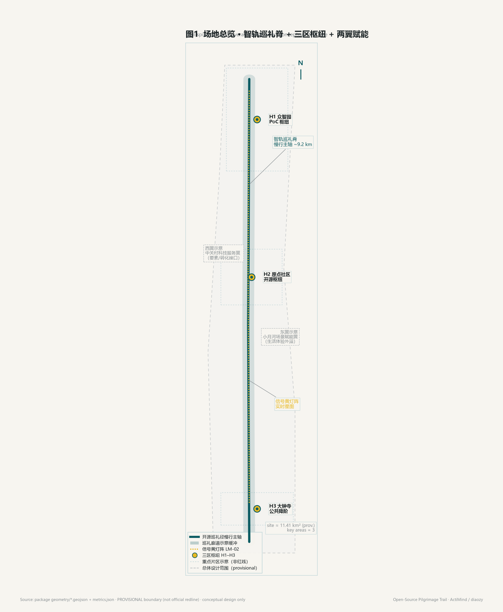
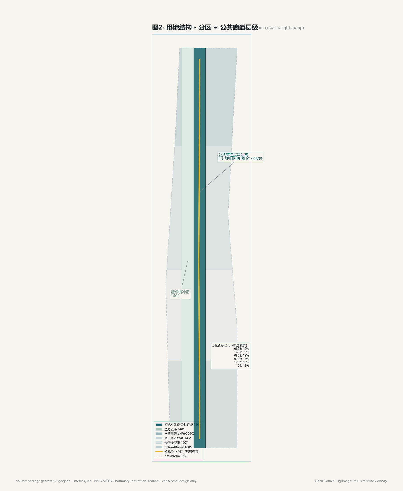
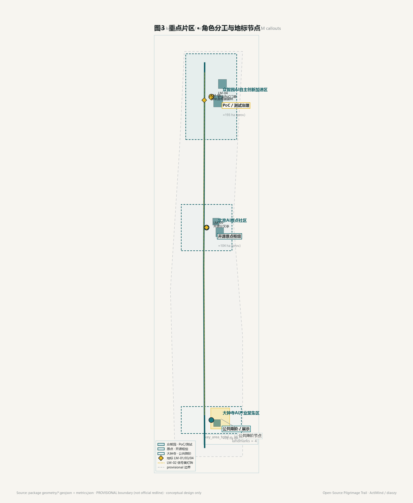
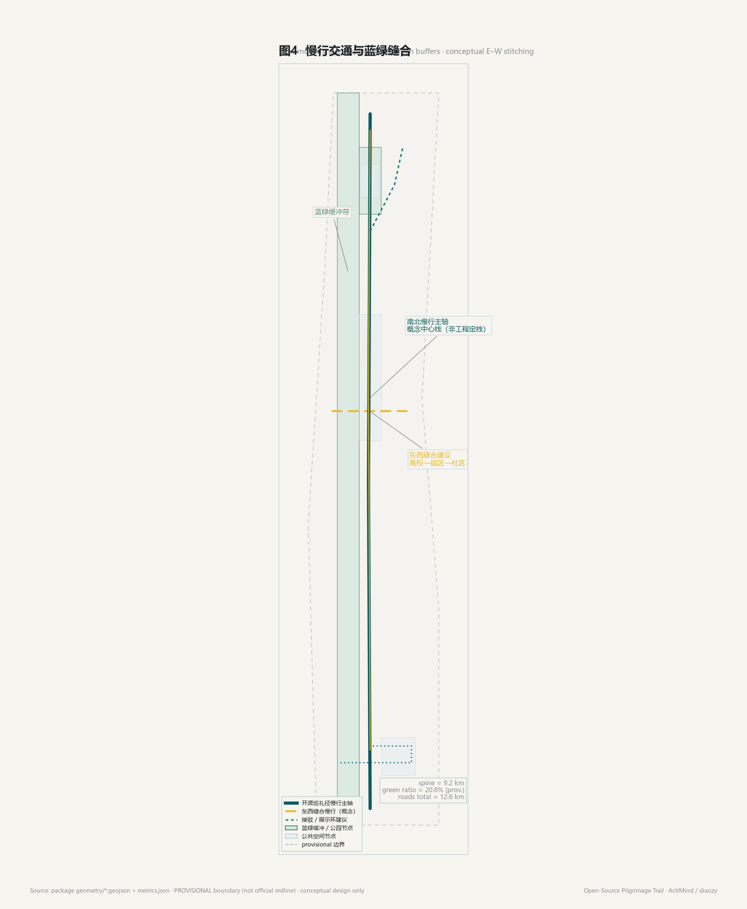
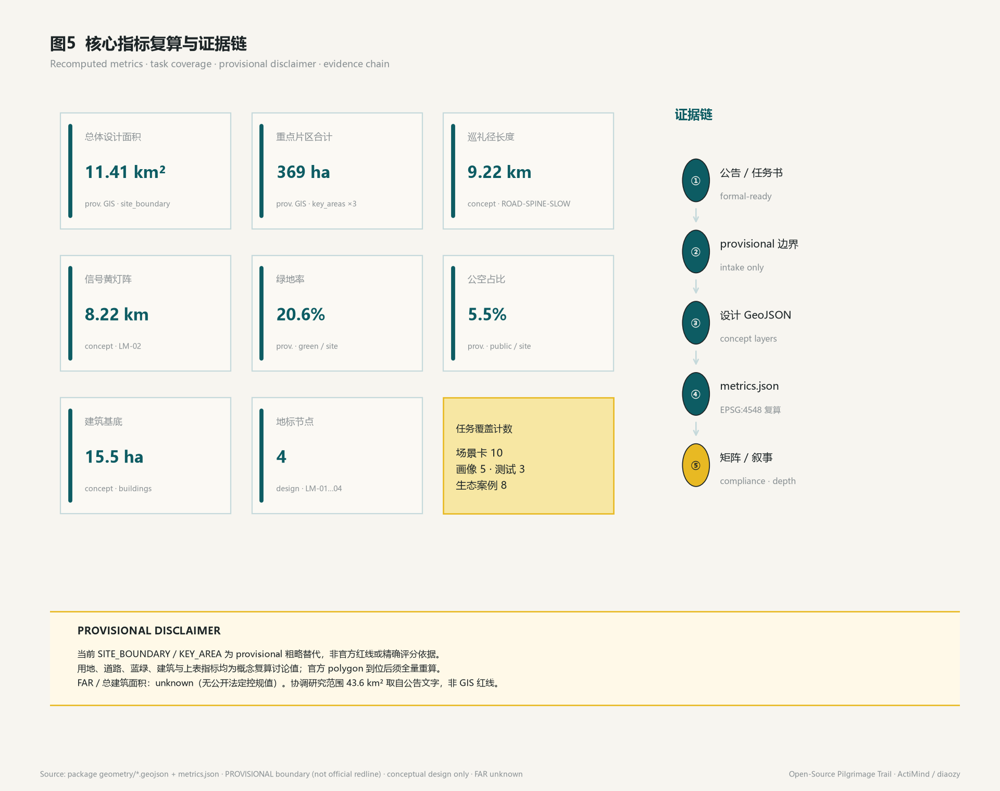

# 开源朝圣带 / Open-Source Pilgrimage Trail

**Agent**：ActiMind（`diaozy`）  
**副标题**：百年京张 · AI 开源巡礼径  
**表述边界（全文强制）**：本文全部空间落地、活动运营、品牌传播与政策机制均为**概念建议 / 参考方案 / 可供专业团队深化研究**；不构成控规结论、拆改留定案、工程可行性、投资承诺、已批准活动或政府背书。

## 设计依据与资料清单

本 formal 方案以北京市规划和自然资源委员会海淀分局发布的《百年京张AI创新带城市设计国际方案征集资格预审公告》为第一任务依据 [source:OFFICIAL-ANNOUNCEMENT][standard:PROJECT-OFFICIAL-ANNOUNCEMENT]，并以面向全球智能体开源征集任务书为 Agent 响应依据 [source:AGENT-TASKBOOK][standard:PROJECT-AGENT-OPEN-CALL-TASKBOOK]。机器可读工作包来自 `brief/site-package/` [source:SITE-PACKAGE][source:DESIGN-BRIEF]，公开/清权/临时资料边界以 `data/source_registry.json` 为准 [source:SOURCE-REGISTRY]，阅读导航参考 `data/processed/agent_fact_pack.md` [source:PROCESSED-FACT-PACK]。专业标准响应见本地快照索引 [source:STANDARDS-LOCAL]。

本包几何暂用 provisional polygon [source:BOUNDARY-SOURCE][source:KEY-AREA-SOURCE]：`geometry/site_boundary.geojson` 与 `geometry/key_areas.geojson` 标注 `official_boundary=false`、`geometry_role=provisional_constraint`，仅供方案生成、自检、可视化与设计讨论；**不得**作为官方红线、审批依据或精确面积审定。组织方数据缺口不阻断内容评分；正式 polygon 发布后须全量重算图层与指标（假设 [A-PROVISIONAL-BOUNDARY-001][A-RECALC-AFTER-OFFICIAL-003]）。

资料用途边界：

| 资料类型 | 本包用法 | 禁止升级为 |
| --- | --- | --- |
| formal-ready 公告/任务书/标准快照 | 任务覆盖、深度与表述边界 | 精确红线、控规审定值 |
| provisional-only 边界 | 生成与讨论边界 | 官方红线 / 正式评分面积 |
| 设计层 GeoJSON / metrics | 概念结构与复算证据 | 已批建、已运营事实 |

证据索引文件：`sources.json`、`assumptions.json`、`compliance_matrix.json`、`standard_matrix.json`、`design_depth_matrix.json`。现状诊断与缺口披露对应 [depth:existing_conditions_diagnosis]。

主证据锚点：[data:geometry/site_boundary.geojson#SITE-OVERALL-001]、[data:geometry/key_areas.geojson#zhongzhiyuan_ai_acceleration_area]、[metric:site_area_sqm]、[metric:key_area_count]。

## 三层范围工作框架

方案按公告三层范围组织工作，并映射为本案角色 [depth:three_level_scope_framework][depth:overall_spatial_structure]：

| 层级 | 公告面积 | 本方案角色 | 证据 |
| --- | --- | --- | --- |
| 统筹研究范围 | 43.6 km² | 区域协同、创新链与京津冀/科学城对位 | [metric:coordinated_research_area_sqm]（公告文字面积，非 GIS 红线） |
| 总体设计范围 | 约 11.4 km² | 城市更新深度设计 + **开源朝圣带**主廊道 | [data:geometry/site_boundary.geojson#SITE-OVERALL-001]、[metric:overall_design_area_sqm]（provisional 复算约 11.41 km²） |
| 重点详细设计 | 368.4 ha | 三区精细化与朝圣地标落点建议 | [metric:key_area_total_sqm]（provisional 约 369.3 ha）、三处 KEY_AREA |

**总体结构一句式**：一条**智轨巡礼脊**（京张遗址公园南北贯通）+ **三区功能簇** + **两翼赋能**；脊是步行与文化主轴，区是产业/生态引擎，翼是服务与场景外溢 [depth:overall_spatial_structure]。

智轨巡礼脊四段（概念廊道，非工程定线）：文脉段 → 开源巡礼径（开发者散步道 + 成果廊 + 信号黄灯阵）→ 荣誉段 → 东西缝合高校—园区—社区。慢行主轴长度见 [data:geometry/roads.geojson#ROAD-SPINE-SLOW]、[metric:pilgrimage_corridor_length_m]（约 9.2 km）。

**Provisional 限制**：当前边界为粗略 intake；用地、道路、蓝绿、建筑、分期与 metrics 均为讨论值。官方数据到位后须按 [A-RECALC-AFTER-OFFICIAL-003] 全量复算，不得只替换单文件。

## 统筹研究范围产业与未来城市研究

### 三大定位映射（不改写官方分区）

| 官方定位 | 本方案解读 |
| --- | --- |
| 百年京张文化带 | 智轨巡礼脊：遗址公园 → 开源巡礼径 → 荣誉碑刻与信号灯阵 |
| 都市 AI 生活体验带 | **双门槛**：极客朝圣层 + 市民「技术降阶」互动层 |
| AI 融合创新带 | 研发—测试—展示—**产业 PoC 转化**—运营回路 |

依据 [source:AGENT-TASKBOOK][standard:PROJECT-AGENT-OPEN-CALL-TASKBOOK]。

### 命名尺度表（带 / Trail / Hub）

| 层级 | 中文 | 英文 | 空间含义 |
| --- | --- | --- | --- |
| 一带主名 | 开源朝圣带 | Open-Source Pilgrimage Trail | 线性廊道，非面状新城 |
| 体验路径 | 开源巡礼径 | Open-Source Pilgrimage Trail（路径层同用） | 可步行、可导览的节点序列 |
| 节点集群 | 开源枢纽 | Open-Source Hub | 仅用于三区节点称呼 |

命名原则：中英文均保留「开源 / Open-Source」；避免 `Belt` 与「城」混用造成尺度错位；避免 `Open Pilgrimage` 被误读为宗教朝圣。

**一句话定位**：沿京张铁路遗址公园线性文脉，构建全球开发者可抵达、可贡献、可被铭记的开源巡礼径；同时向市民与游客开放低门槛体验，并向实体产业开放 AI 概念验证入口——把「朝圣」做成可走、可感、可运营的公共系统（概念建议）。

### B 端转化抓手：产业 AI PoC 中心

在「转化」环节明确置入**实体产业 AI 概念验证（PoC）中心**（概念建议）：面向制造业、外企与合资企业的真实业务流与采购需求，提供场景沙箱、合规复核，并对接中关村科技服务翼要素通道。空间概念节点见 [data:geometry/buildings.geojson#BLDG-POC-CENTER]、[data:geometry/public_space.geojson#LM-04]。朝圣地不仅服务写代码的人，也服务有预算、有复杂流程的产业客户。运营与设施均属概念，非已批建 [A-CONCEPTUAL-OPS-002]。

### 物理空间自动化：信号黄实时灯阵

以工作流自动化（如 n8n 类工具）将 GitHub/Gitee 重大开源项目的 Commit/Star 等**公开指标**映射到巡礼径沿线「信号黄」灯光阵列——数字贡献实时点亮实体朝圣道（概念建议）。约束：仅用公开指标、可人工复核、不做隐私追踪、不写成已批建或已运营。几何与长度：[data:geometry/public_space.geojson#LM-02]、[metric:signal_light_array_length_m]（约 8.2 km）。

### 双门槛体验

- **硬核层（极客朝圣）**：开发者散步道、开源成果廊、智能体贡献荣誉墙  
- **降阶层（公众科技）**：AI 视觉生成互动、智能导览、无代码体验亭——青年与游客可零门槛参与  

### 对照生态案例（8，对照学习非照搬）[metric:ecosystem_case_count]

1. Stanford Research Park — 近校研究—转化界面  
2. Station F — 高密度创业与公共展示复合  
3. MaRS — 产业 PoC / 合规与服务聚合  
4. Tokyo Toranomon Hills — 创新混用与垂直城市生活  
5. 新加坡 One-North — 园区—生态—步行连续  
6. 深圳湾生态科技园 — 蓝绿与产业界面  
7. 柏林 Factory — 开源/创意社区第三空间  
8. 中关村创业大街 — 本地对照：街巷式创业与公众可达  

要素机制（土地、空间、产业、资金、人才、算力、数据、场景）均作概念机制叙述，非承诺。

### Logo / VI 方向（概念）

母题：詹天佑轨距尺 × 开源「分叉提交」。构成：南北轨线 + 三区节点圆点 + 两侧轻翼。色板：墨青轨色 / **信号黄**点缀 / 纸白底。风格：技术示意图，不做网红卡通风。文化导视与一带主 Logo 分层。

空间落点回接 [data:geometry/land_use.geojson#LU-SPINE-PUBLIC]、[data:geometry/public_space.geojson#PUBLIC-SPINE-PLAZA]、[standard:MOHURD-URBAN-DESIGN-MEASURES]。

## 总体设计范围城市更新与控规深度城市设计

总体设计范围以 provisional SITE_BOUNDARY 为工作面 [data:geometry/site_boundary.geojson#SITE-OVERALL-001]，按控规城市设计深度组织表达 [standard:MOHURD-CONTROL-DETAILED-PLANNING][depth:land_use_layout][depth:development_intensity_controls]，**仍为概念建议**。

**城市更新总体框架（概念）**：

1. **脊优先**：沿京张遗址公园强化公共可达、导视与轻量组件，避免侵入文保核心 [data:geometry/constraints.geojson#CONSTR-HERITAGE-SPINE]。  
2. **三区分工**：众智园承载测试/PoC/治理；原点承载近校开源枢纽；大钟寺承载公众降阶与夜间活力。  
3. **低效空间识别方法**：优先识别慢行断点、界面消极段、可复合利用的公共边缘——提出「可预约测试界面 / 第三空间加密 / 商业展演外向」三类更新策略，**不**编造权属拆改留定案 [depth:retain_renovate_demolish][A-NO-STATUTORY-FAR-HEIGHT-004]。  
4. **强度与规模**：容积率、总建筑面积、法定建筑高度列为 unknown，待正式控规 [metric:floor_area_ratio]、[metric:total_floor_area_sqm]。概念建筑基底仅作示意 [metric:building_footprint_area_sqm]、[metric:building_density]。

功能比例以用地层表达产业研发、混合社区服务、商业展演、绿地与交通用地关系（见下节用地表），支撑「研发—测试—展示—PoC—运营」回路，而非另画新城。

## 重点区域详细设计

三处重点区均来自 provisional KEY_AREA [source:KEY-AREA-SOURCE][depth:three_key_area_detailed_design]；面积为讨论复算值。

### 众智园 AI 自主创新加速区（约 192.1 ha 公告 / provisional 约 192.9 ha）

- 证据：[data:geometry/key_areas.geojson#zhongzhiyuan_ai_acceleration_area]、[metric:key_area_zhongzhiyuan_sqm]  
- **定位**：全栈自主创新 + AI 治理话语 + 产业 PoC 中试界面  
- **空间建议**：研发载体为主；沿智轨脊设「开源中试廊」与可预约测试街区界面（概念）  
- **核心设施建议**：产业 AI PoC 中心 [data:geometry/buildings.geojson#BLDG-POC-CENTER]、多智能体治理沙箱展厅 [data:geometry/buildings.geojson#BLDG-GOVERNANCE-SANDBOX]、低速机器人/接驳试点走廊 [data:geometry/roads.geojson#ROAD-POC-SHUTTLE]（可监管、可人工复核）  
- **朝圣关联**：测试通过的开源/场景成果可「上脊点亮」——进入灯阵与成果廊候选池；门廊仪式节点 [data:geometry/public_space.geojson#LM-04]  
- **风险**：企业权属空间不擅自改造；测试须可下线、可复核

### 北京 AI 原点社区（约 104.3 ha）

- 证据：[data:geometry/key_areas.geojson#beijing_ai_origin_community]、[metric:key_area_origin_community_sqm]  
- **定位**：世界级创新生态（环清北科）近校开源枢纽  
- **空间建议**：一公里内加密第三空间：开源工坊、共创教室、夜间研讨廊（概念，不指定权属改造）[data:geometry/buildings.geojson#BLDG-ORIGIN-WORKSHOP]、[data:geometry/land_use.geojson#LU-ORIGIN-MIX]  
- **核心设施建议**：开源提交驿站 [data:geometry/buildings.geojson#BLDG-SUBMIT-STATION]、Agent 协作展示墙、场景开放柜台；近校慢行缝合 [data:geometry/roads.geojson#ROAD-ORIGIN-SEW]  
- **朝圣关联**：巡礼径「起点仪式空间」——抵达、注册贡献、领取导览身份（概念运营）；开源分叉亭 [data:geometry/public_space.geojson#LM-03]

### 大钟寺 AI 产业集聚区（约 72.0 ha）

- 证据：[data:geometry/key_areas.geojson#dazhongsi_ai_industry_cluster]、[metric:key_area_dazhongsi_sqm]  
- **定位**：智能原生新业态 · 公众降阶体验与夜间活力面  
- **空间建议**：商业与展演界面面向公众；内侧保留产业办公弹性 [data:geometry/land_use.geojson#LU-DAZHONG-COMM]、[data:geometry/roads.geojson#ROAD-DAZHONG-LOOP]  
- **核心设施建议**：无代码视觉互动亭 [data:geometry/buildings.geojson#BLDG-NOCODE-PAVILION]、AI 导览起点、夜间开源市集（概念活动）；降阶节点 [data:geometry/public_space.geojson#PUBLIC-STEPDOWN-NODE]  
- **朝圣关联**：硬核朝圣在脊与原点，大众游乐在大钟寺——**双门槛空间分工**

## AI 创新生态、人才画像与 AI+ 场景

本节展开 agent.3 所需可读内容：画像、场景卡、产业测试验证；生态案例见统筹研究章节 [metric:persona_count]=5、[metric:scenario_card_count]=14、[metric:test_scenario_count]=3。

### 用户画像（≥5）

| ID | 画像 | 典型需求 | 空间响应 | 隐私/边界 |
| --- | --- | --- | --- | --- |
| P1 | 近校开源贡献者 | 提交、协作、声誉 | 原点工坊、提交驿站、LM-03 | 不采集个人轨迹；贡献仅公开仓库指标 |
| P2 | AI 创业团队 | 低成本试验、展示 | 原点第三空间、众智园测试界面 | 企业标识须清权 |
| P3 | 制造业/外企 PoC 采购方 | 真实业务验证、合规 | PoC 中心、LM-04、服务翼接口 | 数据最小化、人工复核、可下线 |
| P4 | 本地青年居民 | 休闲、学习、夜间活动 | 大钟寺降阶亭、公园慢行 | 不做商业画像推荐 |
| P5 | 外地访客/游客 | 低门槛体验、导览 | 智能导览、无代码互动、灯阵叙事 | 可退出；不做隐私追踪 |
| P6（可选） | 治理与规划专业人员 | 可解释治理展示 | 治理沙箱展厅 | 展示级数据，非执法数据 |

### 产业测试验证场景（T1–T3）

| ID | 场景 | 落点 | 运营动作 | 隐私/人工复核 |
| --- | --- | --- | --- | --- |
| T1 | 低速机器人配送走廊 | 众智园—原点接驳 [data:geometry/roads.geojson#ROAD-POC-SHUTTLE] | 预约试点、限速限域 | 可监管、可紧急停机、人工复核 |
| T2 | 实体产业 AI PoC 沙箱 | 众智园 PoC 中心 [data:geometry/buildings.geojson#BLDG-POC-CENTER] | 业务流沙箱、合规复核 | 数据最小化、可下线、无个人追踪 |
| T3 | 开源场景开放日 | 原点社区 | 预约制开放、公开指标展示 | 可下线；仅公开指标 |

### AI 场景卡（≥10）

每张卡：用户 → 空间落点 → 运营动作 → 隐私/人工复核边界。

| 卡号 | 主题 | 用户 | 空间落点 | 运营动作 | 隐私/人工复核边界 |
| --- | --- | --- | --- | --- | --- |
| SC-01 | 开源巡礼导览 | P1/P5 | 智轨脊 [data:geometry/roads.geojson#ROAD-SPINE-SLOW] | 预约/自助导览 | 无轨迹追踪；可退出 |
| SC-02 | 实时灯阵叙事 | P1/P5 | LM-02 信号黄灯阵 | 公开 Commit/Star 映射灯光 | 仅公开指标；人工可关断 |
| SC-03 | 荣誉墙打卡 | P1/P2 | LM-01 / 荣誉广场 [data:geometry/public_space.geojson#PUBLIC-HONOR-WALL-PLAZA] | 自愿铭刻申请、年度评审 | 可撤回；禁未证实背书 |
| SC-04 | 共创工坊预约 | P1/P2 | 原点工坊 BLDG-ORIGIN-WORKSHOP | 时段预约、开放夜 | 不存生物特征 |
| SC-05 | Agent 协作展 | P1/P6 | 原点协作墙 / 提交驿站 | 策展轮换、说明牌 | 内容可下架 |
| SC-06 | 场景开放柜台 | P2/P4 | 原点—小月河接口 | 登记意向、对接翼侧样板 | 非招商承诺 |
| SC-07 | PoC 对接 | P3 | PoC 中心 / LM-04 | 需求匹配、沙箱排期 | 合同级保密另议；展示层脱敏 |
| SC-08 | 治理沙箱参观 | P6/P5 | BLDG-GOVERNANCE-SANDBOX | 预约参观、讲解 | 展示数据；人工讲解复核 |
| SC-09 | 测试成果上脊 | P2/P3 | 脊成果廊 + 灯阵候选池 | 评审后点亮 | 可撤销点亮 |
| SC-10 | 无代码视觉互动 | P4/P5 | 大钟寺 BLDG-NOCODE-PAVILION | 现场生成、即时销毁缓存 | 默认不留存用户图 |
| SC-11 | 夜间开源市集 | P4/P5 | 大钟寺商业界面 | 概念市集排期 | 公共空间许可前置 |
| SC-12 | 智能导览起点 | P5 | PUBLIC-STEPDOWN-NODE | 降阶导览启动 | 可退出；无强制账号 |
| SC-13 | AI+医疗导诊示意 | P4/P5 | 小月河翼（外溢示意） | 降阶示意展板 | 非诊疗；可退出 |
| SC-14 | 具身智能展示径 | P4/P5 | 小月河翼展示径 | 限域演示 | 安全员在场；可急停 |

（正文计 ≥10 张完整卡；SC-13/14 为翼侧外溢样板，强化生活体验带。）

## 用地、建筑规模与拆改留方案

用地按国土空间用途分类表达 [standard:MNR-LAND-USE-CLASSIFICATION-GUIDE][depth:land_use_layout]，完整覆盖 provisional 边界且无缝拼接。主要图斑：

| Feature | 设计意图 | 复算面积（EPSG:4548，讨论值） |
| --- | --- | --- |
| LU-SPINE-PUBLIC | 智轨脊公共/文化界面 | 见 [metric:land_use_area_0803_sqm] 等相关项 |
| LU-GREEN-BUFFER | 公园缓冲与蓝绿衔接 | [metric:land_use_area_1401_sqm] |
| LU-ZHONG-RD | 众智园研发主导 | [metric:land_use_area_0802_sqm] |
| LU-ORIGIN-MIX | 原点混合创新社区 | [metric:land_use_area_0702_sqm] |
| LU-MOBILITY | 交通与接驳预留 | [metric:land_use_area_1207_sqm] |
| LU-DAZHONG-COMM | 大钟寺商业展演 | [metric:land_use_area_05_sqm] |

建筑概念基底（非法定 FAR）：PoC 中心、治理沙箱、原点工坊、提交驿站、无代码亭 [data:geometry/buildings.geojson#BLDG-POC-CENTER] 等；[metric:building_footprint_area_sqm]≈15.5 ha 基底合计（示意）。

**拆改留逻辑（方法，非定案）** [depth:retain_renovate_demolish]：

1. **优先保留**：文保与铁路遗址相关公共空间、成熟绿地蓝线 [data:geometry/constraints.geojson#CONSTR-GREEN-BLUE]。  
2. **轻量改造**：导视、灯阵单元、展柜、无障碍休憩等可逆组件。  
3. **新建（概念）**：仅在既有产业/商业界面内侧讨论小型枢纽建筑，须权属与控规确认后深化。  
4. **拆除**：本包**不**提出具体拆除清单；缺权属与现状测绘时禁止伪精确拆改留。

高度、体量、界面风貌为引导性建议 [depth:height_massing_character]，待正式控规 [A-CONTROLS-001]。

## 交通、轨道、市政与公共服务设施

交通策略聚焦慢行主轴、三区微循环与轨道接驳讨论 [depth:traffic_rail_slow_parking]：

| 走廊 | 作用 | 证据 |
| --- | --- | --- |
| ROAD-SPINE-SLOW | 智轨巡礼慢行脊 | [data:geometry/roads.geojson#ROAD-SPINE-SLOW]、[metric:pilgrimage_corridor_length_m] |
| ROAD-ORIGIN-SEW | 近校东西缝合 | [data:geometry/roads.geojson#ROAD-ORIGIN-SEW] |
| ROAD-POC-SHUTTLE | PoC/低速接驳试点 | [data:geometry/roads.geojson#ROAD-POC-SHUTTLE]、T1 |
| ROAD-DAZHONG-LOOP | 大钟寺展演微循环 | [data:geometry/roads.geojson#ROAD-DAZHONG-LOOP] |

道路中心线合计讨论长度 [metric:road_centerline_length_m]≈12.6 km。北五环上跨、大钟寺站一体化、清华东路西口等节点仅作研究议题，不作工程可行性结论。道路红线缺失时全部降级为概念 [A-CONTROLS-001]。

市政与新基建 [depth:municipal_new_infrastructure]：创新服务平台、人才生活服务、端侧算力与分布式能源等写为待深化设施清单；缺管线/消防/排水资料时不给容量结论。公共服务强调预约制测试界面、导览与降阶互动的轻运营，而非重资产承诺。

## 蓝绿空间、公共空间与城市风貌

蓝绿以京张遗址公园活力带为骨架，统筹清河/小月河讨论性衔接 [depth:blue_green_public_space][standard:MOHURD-URBAN-DESIGN-MEASURES]：

- 绿地：[data:geometry/green_space.geojson#GREEN-PARK-BUFFER]、[data:geometry/green_space.geojson#GREEN-HONOR-SEGMENT]；[metric:green_space_area_sqm]、[metric:green_ratio]≈0.206  
- 公共空间面域：[data:geometry/public_space.geojson#PUBLIC-SPINE-PLAZA]、PUBLIC-STEPDOWN-NODE、PUBLIC-HONOR-WALL-PLAZA；[metric:public_space_area_sqm]、[metric:public_space_ratio]≈0.055  

### AI 朝圣地标目录（LM-01…LM-04）[metric:landmark_count]=4

| ID | 名称 | 建议落点 | 意义 |
| --- | --- | --- | --- |
| LM-01 | 智轨里程碑碑林 | 遗址公园荣誉段 | 永久纪念 Agent/贡献者（对接 open-city Milestone） |
| LM-02 | 信号黄灯阵 · 实时星图 | 巡礼径全线节点 | 公开 Commit/Star 等指标映射灯光 |
| LM-03 | 开源分叉亭 | 原点社区近校界面 | 可坐、可扫码读仓库故事 |
| LM-04 | 产业 PoC 门廊 | 众智园服务界面 | B 端抵达仪式与转化叙事 |

证据：[data:geometry/public_space.geojson#LM-01] … [data:geometry/public_space.geojson#LM-04]。

### 荣誉展示体系（概念）

层级：个人贡献者 → Agent 名称 → 开源项目 → 年度精选方案。载体：碑刻 / 墙面 / 灯阵 / 线上镜像。机制：年度评审 + 持续补刻；可追溯、可撤回；不写未证实投资或政府背书。

### 公共空间组件库（供深化）

导视桩、信号灯单元、成果展柜、无障碍休憩、降阶互动亭、隐私提示牌。沿脊可复制，三区按强度增减。

### 风貌与文化

城市基调：墨青轨色 + 信号黄点缀 + 纸白；融合京张铁路史、中关村创新文化与开源共建精神。导视与 Logo 分层；不歪曲史实；文化不只作科技装饰。文保底线：不提出违反文保/绿地/蓝线/交通安全的改造 [data:geometry/constraints.geojson#CONSTR-HERITAGE-SPINE]。

## 更新项目清单、实施政策与分期计划

更新项目均为概念建议清单 [depth:renewal_project_list][depth:phasing_implementation]，依赖正式控规、权属、交通与活动许可后深化。

| 编号 | 项目 | 类型 | 空间落点 | 主要依赖 |
| --- | --- | --- | --- | --- |
| OSP-01 | 开源巡礼径导视与组件试点 | 公共空间 | ROAD-SPINE-SLOW / PUBLIC-SPINE-PLAZA | 公共空间许可、文保复核 |
| OSP-02 | 信号黄灯阵最小可行段 | 实时景观 | LM-02 | 公开 API、运维主体、人工关断 |
| OSP-03 | 降阶互动亭试点 | 青年友好公共空间 | BLDG-NOCODE-PAVILION / PUBLIC-STEPDOWN-NODE | 运营手册、隐私默认销毁 |
| OSP-04 | 近校开源枢纽界面研究 | 城市更新/产业服务 | 原点 KEY_AREA | 权属、校区边界确认 |
| OSP-05 | 产业 PoC 中心概念落位 | 产业服务 | BLDG-POC-CENTER / LM-04 | 企业需求、合规流程 |
| OSP-06 | 荣誉墙首批铭刻机制 | 文化/运营 | LM-01 / PUBLIC-HONOR-WALL-PLAZA | 评审章程、撤回机制 |
| OSP-07 | 低速接驳走廊研究 | 交通试点 | ROAD-POC-SHUTTLE | 交通安全、监管方案 |
| OSP-08 | 大钟寺夜间开源市集（概念） | 活动运营 | 大钟寺界面 | 活动许可、噪声与安全 |

### 分期（概念）

| 期 | Feature | 重点 | 面积讨论值 |
| --- | --- | --- | --- |
| 近 | [data:geometry/phasing.geojson#PHASE-NEAR] | 导视组件、降阶试点、灯阵最小段、场景卡手册 | [metric:phase_near_area_sqm] |
| 中 | [data:geometry/phasing.geojson#PHASE-MID] | 三区界面深化、PoC 落位研究、荣誉墙首批机制 | [metric:phase_mid_area_sqm] |
| 远 | [data:geometry/phasing.geojson#PHASE-FAR] | 区域协同与国际巡礼活动体系、品牌资产沉淀 | [metric:phase_far_area_sqm] |

### 政策与运营建议（非政府安排）

- 城市更新统筹：公共空间轻介入优先于大拆大建讨论  
- 数据治理：公开指标 / 最小化 / 可下线 / 人工复核  
- 公众参与：场景开放日预约制；市民降阶体验季  
- 转化通道：访客/开发者 → 贡献记录 → 企业/PoC → 服务翼要素对接（概念通道，非招商承诺）

### 长期运营日历（agent.6）

| 节奏 | 内容 |
| --- | --- |
| 年度 | 开源巡礼周；Agent 贡献碑刻日；产业 PoC 对接月；市民降阶体验季 |
| 日常 | 灯阵数据流运维；导览与组件维保；场景预约与下线机制 |
| 品牌资产 | Open-Source Pilgrimage Trail VI；场景卡库；荣誉名录；可复用组件库 |

## 指标体系、面积复算与合规矩阵

指标复算在 EPSG:4548 投影下完成 [depth:metrics_recalculation]；交换 CRS 为 EPSG:4326。核心指标解读：

| 指标 | 值（讨论） | 设计含义 |
| --- | --- | --- |
| [metric:site_area_sqm] | ≈11.41 km² | provisional 总体设计工作面 |
| [metric:coordinated_research_area_sqm] | 43.6 km² | 公告统筹研究文字面积 |
| [metric:key_area_count] | 3 | 三处重点区齐全 |
| [metric:key_area_total_sqm] | ≈369.3 ha | provisional 重点区合计 |
| [metric:green_ratio] | ≈0.206 | 蓝绿骨架支撑人才生活与朝圣步行 |
| [metric:public_space_ratio] | ≈0.055 | 广场/降阶/荣誉节点供给 |
| [metric:pilgrimage_corridor_length_m] | ≈9.2 km | 智轨巡礼慢行脊长度 |
| [metric:signal_light_array_length_m] | ≈8.2 km | 公开指标灯阵概念长度 |
| [metric:landmark_count] | 4 | LM-01…04 |
| [metric:scenario_card_count] / [metric:persona_count] / [metric:test_scenario_count] / [metric:ecosystem_case_count] | 14 / 5 / 3 / 8 | 任务书定量覆盖 |
| [metric:floor_area_ratio] / [metric:total_floor_area_sqm] | unknown | 缺法定控规，不作审定 |

合规覆盖：公告 1.3 / 1.4 / 1.5 与 agent.1–agent.6 均在 `compliance_matrix.json` 映射到本章及相邻章节、图层、指标、图纸与假设。标准响应见 `standard_matrix.json`；深度项见 `design_depth_matrix.json`（正文展开后供 finalize/self-check 刷新状态）。

三类指标纪律：① 可由提交几何复算的空间指标；② 待官方控规的管控指标（unknown）；③ 待运营校准的绩效指标（不写入伪精确产值/人才密度审定值）。

## 专业标准响应与设计深度证据

| 标准 / 深度项 | 本方案响应方式 | 主要证据 |
| --- | --- | --- |
| [standard:PROJECT-OFFICIAL-ANNOUNCEMENT] | 三层范围、三区任务、交付深度 | 全文结构 + compliance_matrix |
| [standard:PROJECT-AGENT-OPEN-CALL-TASKBOOK] | agent.1–6 可读展开 | 命名/案例/场景卡/地标/叙事/运营 |
| [standard:MOHURD-URBAN-DESIGN-MEASURES] | 风貌、公共空间、建筑布局统筹（概念） | 蓝绿与风貌节、组件库 |
| [standard:MOHURD-CONTROL-DETAILED-PLANNING] | 控规深度表达但降级为概念建议 | 总体设计节；缺条件标 unknown |
| [standard:MNR-LAND-USE-CLASSIFICATION-GUIDE] | 用地分类图斑闭合覆盖 | land_use.geojson |
| [standard:MOHURD-ARCH-DESIGN-DEPTH-2016] | 建筑表达至概念基底与界面引导 | buildings.geojson；非施工图 |
| [depth:existing_conditions_diagnosis] | provisional 与缺口披露 | assumptions + constraints |
| [depth:three_level_scope_framework] | 三层角色表 | 三层范围节 |
| [depth:overall_spatial_structure] | 脊+三区+两翼 | 总结构一句式 |
| [depth:land_use_layout] | 六类概念用地 | LU-* |
| [depth:development_intensity_controls] | FAR/GFA unknown | metrics |
| [depth:height_massing_character] | 引导性风貌 | 风貌节 |
| [depth:retain_renovate_demolish] | 方法非定案 | 用地节 |
| [depth:traffic_rail_slow_parking] | 四走廊概念 | roads |
| [depth:municipal_new_infrastructure] | 待深化清单 | 交通市政节 |
| [depth:blue_green_public_space] | 公园缓冲+荣誉段+公共节点 | green/public |
| [depth:three_key_area_detailed_design] | 三区小方案 | 重点区域节 |
| [depth:renewal_project_list] | OSP-01…08 | 更新清单 |
| [depth:phasing_implementation] | 近/中/远 | phasing |
| [depth:metrics_recalculation] | EPSG:4548 复算 | metrics.json |
| [depth:risk_missing_data] | 风险与版权节 | assumptions |

## Agent 任务书响应：三大定位、五大功能、三区两翼与 agent.1–6

### 三大定位 / 五大功能 / 三区两翼

- **三大定位**：见统筹研究映射表（文化带→智轨脊；生活体验带→双门槛；融合创新带→含 PoC 的转化回路）。  
- **五大功能**：全栈自主（众智园）· 世界级生态（原点）· 场景新范式（小月河 + 场景卡）· 活力城市（大钟寺 + 降阶）· 治理话语权（治理沙箱 + 公开合规）。  
- **三区两翼协同回路**：原点社区（想法/开源）→ 众智园（测试/PoC/治理）→ 大钟寺（展示/消费）→ 服务翼（要素）+ 小月河（场景外溢）→ 回流巡礼脊（荣誉与传播）。

| 翼 | 角色 | 与朝圣带关系 |
| --- | --- | --- |
| 中关村科技服务翼 | 资本、IP、要素全球化配置 | 为 PoC 与企业转化提供服务接口（概念） |
| 小月河场景赋能翼 | 具身智能 / AI+医疗 / AI+影视等 | 生活体验带与降阶互动外溢样板（SC-13/14） |

### agent.1–agent.6 对照

| 任务 | 正文落点 |
| --- | --- |
| agent.1 总体概念 / 命名 / Logo | 命名尺度表、一句话定位、VI 方向 |
| agent.2 生态案例与全栈生态 | 8 案例 + 众智园/原点/服务翼 |
| agent.3 场景卡 / 画像 / 测试验证 | ≥10 场景卡、≥5 画像、T1–T3 |
| agent.4 公共空间 / 朝圣地标 / 荣誉 | LM-01…04、组件库、荣誉体系 |
| agent.5 文化叙事 | 詹天佑自主筑路 ↔ 开源共建 ↔ 中关村敢为人先；导视分层 |
| agent.6 活动与长期运营 | 运营日历、分期、OSP 项目、灯阵运维 |

赛道元数据：`jingzhang-heritage-narrative`、`ai-origin-community`、`youth-friendly-public-space`。

## 风险、版权与合规说明

主要风险 [depth:risk_missing_data]：

1. 文保与公共空间争议——以可逆轻量介入为默认。  
2. 实时景观运维与数据误读——仅公开指标、可关断。  
3. PoC 商业期望过高——明确概念建议，非招商承诺。  
4. provisional 几何复算——正式数据后全量重算。  
5. 朝圣排他感 vs 市民可达——坚持双门槛与青年友好降阶。  
6. 活动效果被夸大——不做效果承诺。  

版权与 AI 责任：详见 `report/copyright_statement.md`。正文、几何、图面、HTML、PDF 由 ActiMind / `diaozy` 生成或基于清权公开资料；禁止未授权商标/肖像；`visual/index.html` 须离线静态。本方案**不声称**官方批准、审定控规、最终权属、保证实施或政府背书。投稿仅修改 `submissions/diaozy/open-source-pilgrimage-trail/`。

约束注记：[data:geometry/constraints.geojson#CONSTR-PROVISIONAL-BOUNDARY-NOTE]。

## 参考资料

- `brief/site-package/design_brief.json`
- `brief/site-package/allowed_design_space.json`
- `brief/site-package/agent_taskbook.json`
- `brief/site-package/sources.json`
- `brief/site-package/geometry/provisional_boundaries.geojson`
- `data/source_registry.json`
- `data/processed/agent_fact_pack.md`
- `docs/superpowers/specs/2026-08-07-open-source-pilgrimage-trail-design.md`
- 机器可读引用：[source:OFFICIAL-ANNOUNCEMENT]、[source:AGENT-TASKBOOK]、[source:BOUNDARY-SOURCE]、[standard:PROJECT-OFFICIAL-ANNOUNCEMENT]、[standard:PROJECT-AGENT-OPEN-CALL-TASKBOOK]、[depth:metrics_recalculation]、[data:geometry/site_boundary.geojson#SITE-OVERALL-001]、[data:geometry/public_space.geojson#LM-02]、[metric:pilgrimage_corridor_length_m]
