# JINGZHANG GROWTH MESH | An AI Talent and Enterprise Community from Park to City to Network

> **Core proposition: universities and leading firms are anchors, the open district is a validation field, first order gates enterprise growth, and public return gates expansion.** Haidian needs one falsifiable urban interface: real problem—bounded validation—first order—independent survival—public return.

## Enterprise growth contract: one mainline from real problem to public return

The proposal keeps its full seven-part health check, twelve scenarios, fifteen projects, international cases and Agent governance, but gives them one order of precedence: **real problem → bounded validation → first order → independent survival → public return**. Universities and leading firms are anchors that expose real problems; the open district is a bounded validation field; a first order is the first enterprise-growth gate; repeat demand and a transparent non-subsidy unit account test independent survival; a reusable public asset is the condition for expansion. “Independent survival” is not a forecast or profit promise. It is reviewed only after field operation through non-subsidy income, direct cost, repeat/retention and cash-gap evidence.[assumption:A-PUBLIC-RETURN-010]

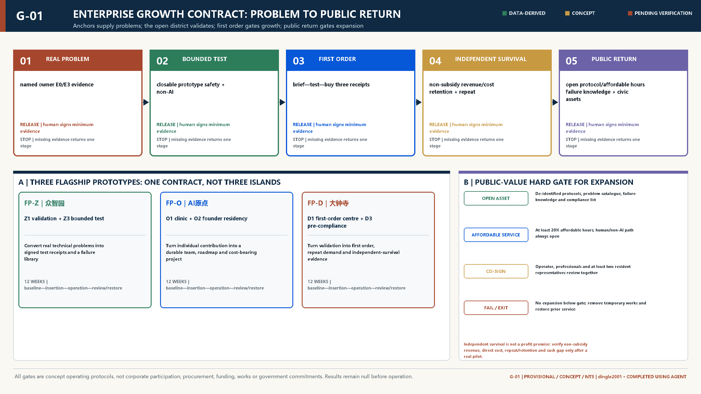

Three flagship prototype packages make the contract spatial and operable without deleting the remaining project library: FP-Z combines Z1 shared validation and Z3 bounded testing; FP-O combines O1 open-source clinic and O2 founder residency; FP-D combines D1 first-order service and D3 pre-compliance. Each follows a twelve-week taskbook sequence—baseline, reversible insertion, operation, review/restore—with a named problem owner, professional safety sign-off, operator, non-deprivation safeguard, acceptance evidence and a physical recovery route. Twelve weeks is not an approved construction schedule.[assumption:A-FLAGSHIP-PILOT-009]

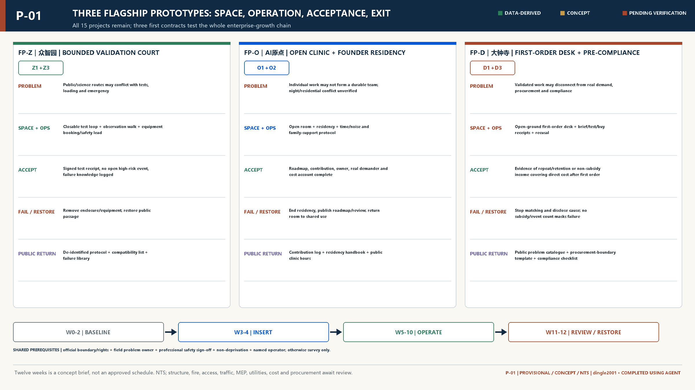

Expansion is denied unless the pilot returns an open public asset, retains at least 20% affordable service hours, keeps a human/non-AI route open, records failure and exit, and is co-reviewed by the operator, professionals and at least two resident representatives. Public-return assets include de-identified validation protocols, compatibility/failure libraries, open contribution roadmaps, public clinic hours, problem catalogues, procurement-boundary templates and compliance checklists. Field outcomes remain null before real operation and human sign-off.[depth:risk_missing_data]

### Supporting method: an auditable multi-agent control plane

The proposal does not treat AI image production as planning innovation. Its original contribution is a six-agent evidence-compilation chain that turns incomplete site signals into reviewable investigation tasks, spatial options, bounded scenarios and operating contracts—without allowing an agent to approve its own output. A1 stewards provenance; A2 compiles the seven-part health check; A3 locates projects and exposes spatial conflicts; A4 designs bounded scenarios with a non-AI equivalent; A5 binds operations to RACI, accounts and acceptance; A6 may veto release when accessibility, affordability or resident safeguards fail. This chain integrates **industry, space, mobility, public service, culture and governance** on one decision record rather than using six disconnected dashboards.

It differs from a conventional industrial park by refusing to substitute occupancy for locally generated projects, and from a conventional smart-city dashboard by refusing to substitute sensors and composite scores for signable project contracts. Its originality is falsifiable: the method fails and steps back if a missing baseline still creates works, an agent can self-sign, a pilot deprives people of an existing service, or comparable nodes show no net public value. The fixed kernel is portable, but every district must re-enter its industry chain, heritage, geometry, regulation and service floor as local adapters.

Four named human gates retain evidence acceptance, pilot release, professional sign-off, and continue/adjust/exit decisions. The public-interest gate requires at least two resident signers, at least 20% affordable service hours and an always-open human/non-AI route. A stepped, non-deprivation evaluation compares similar nodes starting at different times while nobody loses an existing service route; outcomes include time-to-project, valid tests, first orders, anonymous access, affordable hours, accessibility, complaints/takeover and group gaps. The protocol is a concept ready for professional development—not proof of deployment—and produces no field score before a real baseline and human review.[depth:risk_missing_data]

## Design Basis and Source List

The proposal combines the public brief, repository site package, professional references and reproducible provisional geometry with the author's original Mars Plan theories: park-city-network evolution, the five-stage growth loop and enterprise lifecycle observation. Local research supplies methods only; no internal Chaoyang market-regulation data is copied. Facts about Alibaba Beijing headquarters, incubation and creator communities are rechecked against public primary district sources.[source:OFFICIAL-ANNOUNCEMENT] [source:MARS-THEORY]

Alibaba is not a headquarters-campus template and no external compute opening is assumed. It supplies three comparative mechanisms: a large anchor generates talent and demand; transit, talent life and public interfaces determine whether commuters become district users; and incubation, professional services and creator communities determine whether relations become projects. Jing-Zhang translates this into a multi-anchor network of universities, institutes, firms and professional services.[source:CASE-ALIBABA-TRANSIT-TALENT] [source:CASE-CHAOYANG-AI-INCUBATOR] [source:CASE-CHAOYANG-AIGC-COMMUNITY]

The SITE_BOUNDARY and three KEY_AREA polygons remain repository provisional constraints. They support concept generation and internal checks, not statutory, ownership or parcel decisions. New nodes, prototypes and links are design suggestions only.[data:geometry/site_boundary.geojson#SITE-001] [depth:risk_missing_data]

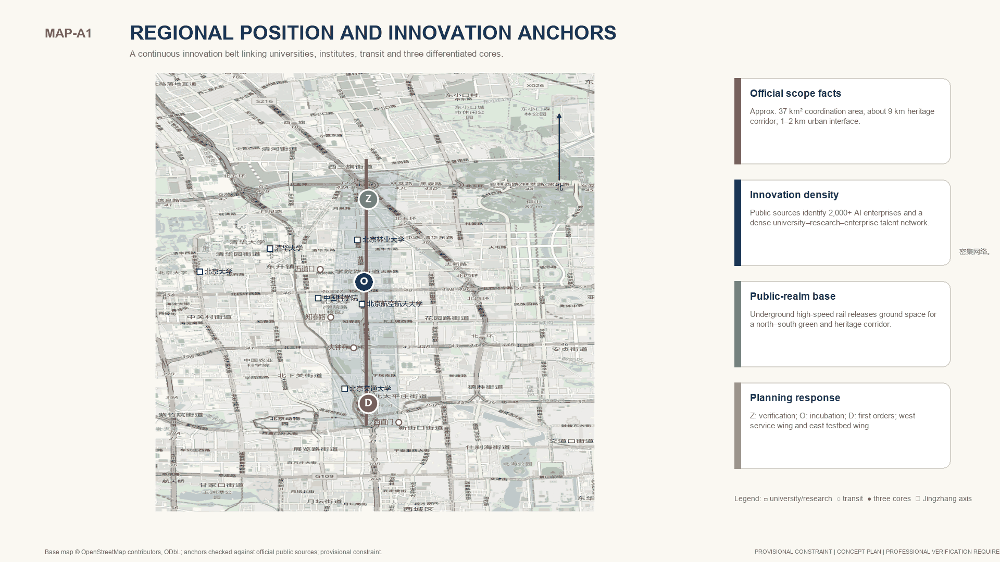

## Three-Level Scope Framework

The coordinated study area asks how Haidian's AI resources form a collaborative network; the overall design area asks how the heritage park becomes a continuous innovation-living district; the key areas ask how validation, incubation and commercialization become tangible spatial products. One evidence chain links strategy, space, operations and metrics.[standard:PROJECT-OFFICIAL-ANNOUNCEMENT] [depth:three_level_scope_framework]

Official polygons must replace provisional constraints before any statutory use. Land-use topology and all derived metrics must then be recalculated rather than retaining old values on a new base.[data:geometry/key_areas.geojson#PROV-KEY-001] [depth:metrics_recalculation]

## Diagnostic Foundation | No Health Check, No Renewal

The scheme begins with a **seven-dimensional baseline**, not a drawing. The operational chain is: **health check → problem/resource lists → project library → implementation plan → operations-first → long-term operation → comparable review**. A metric anomaly never creates a project by itself. A project enters the library only when the affected people, spatial object, root cause, usable resource, accountable owner, acceptance evidence and stop condition can be named. This converts the course method “discover—generate—deliver—review” into a district operating rule.[source:MARS-COURSE] [depth:renewal_project_list]

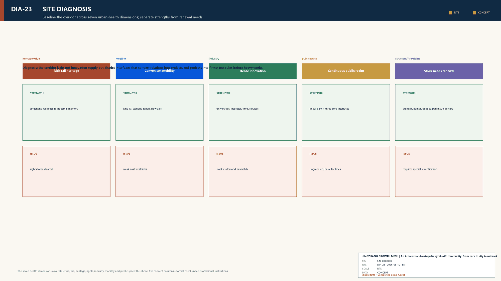

| ID | Dimension | Required baseline | Current evidence-safe diagnosis | Release / stop gate |
|---|---|---|---|---|
| HC-01 | Structure and facility safety | Measured survey, structural appraisal, equipment loads, envelope and utility register | Current layers identify stock objects but do not prove safe equipment loads or public opening. | No permanent works or equipment move-in without professional sign-off |
| HC-02 | Fire and operational safety | Fire compartments, egress, water, electrical, hazardous use and event-capacity checks | Labs, night school, public opening and robotics overlap without an approved operating basis. | No opening without egress, insurance, e-stop and named accountability |
| HC-03 | Heritage and place value | Relic survey, age/value appraisal, view corridors, component and archive rights | The rail axis has strong narrative potential, while components, dates, display rights and grades remain unverified. | Survey before design; uncleared content stays off walls and digital channels |
| HC-04 | Rights and governance conditions | Land/building rights, leases, permits, management limits, stakeholders and claims | Provisional polygons cannot replace rights or management limits; opening, maintenance and revenue duties are unsettled. | No implementation-library entry without named coordinating, delivery, operating and accepting parties |
| HC-05 | Industry-space fit | Enterprise lifecycle, spatial demand, equipment, service gaps, affordability and alternatives | Haidian has strong innovation sources but weak validation-incubation-first-order interfaces; office supply is not industry service. | No construction investment without a problem owner, real users and operating brief |
| HC-06 | Access and continuity | Transit exits, walking/cycling, crossings, accessibility, loading, emergency and time conflicts | Phase 2 is open, forming about 9 km of public space and a fishbone walking network; actual campus/community/transit routes, access, loading and test conflicts still need field checks. | Tests and events may not occupy anonymous passage, accessible or emergency routes |
| HC-07 | Public realm, ecology and inclusion | Green-blue systems, comfort, stormwater, lighting, stay, all-age use, opening and maintenance survey | The park is now operating publicly; added innovation services depend on field baselines for comfort, all-age rights, maintenance, affordable hours and tech opt-out. | Public service cannot depend on data consent; no facility expansion without maintenance funding |

The current submission records **known, unknown and proposed** separately. Geometry and concept ratios can be recomputed; structure, fire, rights, demand, traffic capacity, investment and approval remain unknown pending official surveys. Unknowns never receive an invented score. Their output is a signed investigation task and a decision gate.[assumption:A-CONTROLS-001]

### Problem and Resource Lists to Project Library

1. Locate a symptom by object, time and affected group; 2. trace direct and institutional causes; 3. identify spatial, organizational, cultural, ecological and financial resources; 4. compare construction, policy, operating and governance responses; 5. define the project boundary, owner, funding class, phase and acceptance evidence; 6. place it in opportunity, reserve, implementation or annual-plan status. Rights, safety, public value or operating evidence can return a project to the previous stage.

### Official Task and Review Evidence Navigation

| Review dimension | Direct answer | Primary evidence |
|---|---|---|
| Brief alignment 20% | Direct mapping of three positions, five functions, two wings and agent.1-6 | Front matrix + five core figures |
| Originality 10% | Park-city-network, growth loop and no-check-no-renewal compiler | Originality and case-boundary table |
| AI planning innovation 15% | D0-D3, human release, appeal/takeover, evidence gates and scenario contracts | 12 scenario briefs + governance figure |
| Feasibility 20% | 7D check, 15 contracts, WP0-6, 90-day pilot and funding accounts | Project cards + mainline + funding matrix |
| Public interest 10% | Anonymous passage, accessibility, affordability, family support and tech opt-out | Public gates + resident scenarios |
| Risk and compliance 10% | Provisional limits, sign-off, stop rules, rights clearance and no invented score | Assumption/compliance matrices + stop conditions |
| Expression completeness 15% | Bilingual report, 54-page evidence-led A3, A0, HTML, GeoJSON and shared metrics | Manifest + bilingual contract + self-check |

This matrix is a reading guide, not a self-awarded score. Formal review remains external.[standard:PROJECT-AGENT-OPEN-CALL-TASKBOOK]

## Coordinated Research Area: Industry and Future City Research

The park supplied standardized production space; the city mixed work, life and services; the network enables knowledge, orders, talent and capital to move across nodes. AI is light-asset, mobile and weakly organized, so office supply alone cannot incubate firms. Shared compute and tests are the base, open scenarios the interface, communities the connector, and professional services and first orders the converter.[source:MARS-THEORY]

| Case | Mechanism | Jing-Zhang translation |
|---|---|---|
| Kendall Square | University research, firms and public space form a dense innovation district | Translate into walkable links and shared facilities near research anchors |
| King's Cross Knowledge Quarter | Cultural, research and public institutions form a cross-organizational knowledge network | Co-curate rail heritage and AI community programs |
| one-north | R&D, incubation, housing and public space mix within one urban district | Keep the three cores differentiated rather than building one office park |
| Paris-Saclay | Universities, laboratories, firms and transport infrastructure coordinate | Link research, validation and enterprise services |
| MaRS | Venture services, capital and community connect research outcomes | Translate into first-order and enterprise services at Dazhongsi |
| High Tech Campus Eindhoven | Shared laboratories and open innovation reduce collaboration costs | Translate into shared validation and standards co-creation |
| 22@Barcelona | An industrial district transforms gradually through mixed use, public space and innovation networks | Use reversible renewal and long-term operations |

Cases provide mechanism comparisons only; no media, foreign scale, investment or regulation is copied into Haidian.[source:CASE-KENDALL] [source:CASE-KQ] [source:CASE-ONENORTH]

### Original Mechanisms and Case-Translation Boundaries

| Mechanism | Source attribute | Role in this proposal | Use boundary |
|---|---|---|---|
| Park-city-network + five-stage loop | Author's original Mars Plan method | Main framework linking space, community, projects and firms | Cases do not substitute for Haidian facts |
| Shared labs and open innovation | Mechanism from High Tech Campus and peers | Translated into Zhongzhiyuan's validation chain | No copied scale, investment or institutional promise |
| Cross-institution knowledge collaboration | Mechanism from Knowledge Quarter and peers | Translated into rail-heritage co-curation | All collaboration status remains proposed |
| First-order-service-capital conversion | MaRS and local service logic | Translated into Dazhongsi's civic business interface | Procurement and finance require separate compliance |
| Differentiated cores + public-knowledge landmarks | Original combination in this proposal | Validation-incubation-conversion on one heritage spine | All landmarks are conceptual products |

### Proposed Regional Collaboration Matrix

| Proposed node | Proposed role | Possible interface | Evidence/partnership status | Activation gate | Risk and exit |
|---|---|---|---|---|---|
| Beiwei Community | Community needs, resident co-creation and living-scenario interface | Problem list / resident review / intergenerational lab | Proposed; no verified partnership | Community authorization and ethics review | Pause on complaints or vulnerable-group risk |
| Future Science City | Complementary research talent and pilot capacity | Project referral / equipment catalogue / talent programs | Proposed; no verified partnership | Public resource catalogue and named contacts confirmed | Return to local validation if resources unavailable |
| Huairou Science City | Translation node for major-facility outcomes | Outcome sessions / open questions / science curation | Proposed; no verified partnership | IP and confidentiality boundaries signed | Exit display on confidentiality conflict |
| Beijing E-Town | Engineering, manufacturing and application validation | Prototype referral / supply chain / industrial scenarios | Proposed; no verified partnership | Quality, safety and procurement duties defined | No referral if acceptance duty is unclear |
| Beijing-Tianjin-Hebei nodes | Cross-regional talent, project and first-order exchange | Developer week / challenge list / service reciprocity | Proposed; no verified partnership | Separate rights and data review for every node | Events must not imply government partnership |

These nodes are coordinated-scope proposals only. No participation, endorsement, resource opening or government partnership is claimed. Each interface requires confirmed contacts, resource catalogues, IP, data and responsibility boundaries before a pilot.[depth:three_level_scope_framework]

### Site location and regional collaboration

The Jingzhang Growth Mesh sits on Haidian's Jingzhang rail heritage corridor, north to the Zhongguancun Science City and the Shangdi information base, south to Dazhongsi and the Xizhimen rail hub, at the core junction of the "Three Cities One Zone" (Zhongguancun, Huairou and Future science cities, plus the economic-technological zone) and the Zhongguancun national autonomous innovation demonstration zone, layered with the Yuan Dadu heritage zone. The location's dividend is not land but interface: a multi-anchor network of universities, institutes, leading firms and professional services distinguishes Jingzhang from a single industrial park.[source:OFFICIAL-ANNOUNCEMENT]

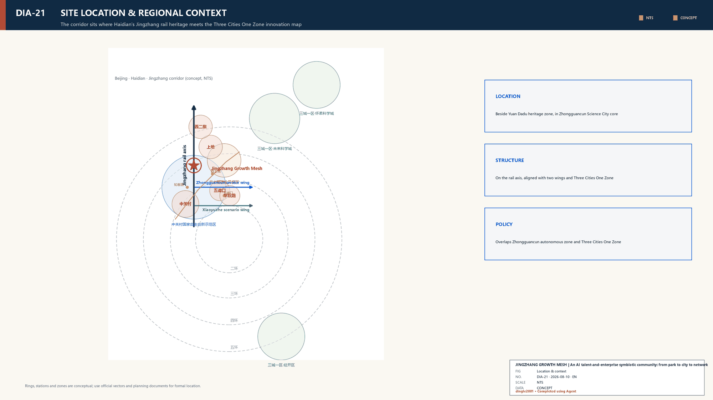

## District position and problem evidence

This is no longer a blank-site park concept. Official public sources report phase-2 support works complete in July 2026, with the north section at about 30.01 ha and a fishbone walking network; phase 2 opened in August and joined phase 1 into about 9 km of public space. In August 2026, the block-level regulatory plan for the AI innovation district along Jingzhang was publicly reported approved: about 1,668.2 ha, nine blocks and a “one belt, one axis; two centres and multiple nodes” structure.[source:OFFICIAL-PARK-PHASE2-COMPLETE-20260713] [source:OFFICIAL-PARK-PHASE2-OPEN-20260806] [source:OFFICIAL-JINGZHANG-BLOCK-PLAN-APPROVED-20260812]

The proposal therefore works on **operating interfaces**—campus/park, firm/public realm, station/service and community/night activity—rather than redesigning the park as if it did not exist. The approved block structure is the statutory background. “One axis, three cores and two wings” is only an industry-service operating overlay that implements the brief; it does not compete with statutory planning. Because the formal approved drawings and parcel controls are not in this package, no parcel FAR, height, redline, ownership or works conclusion is inferred.[assumption:A-CONTROLS-001]

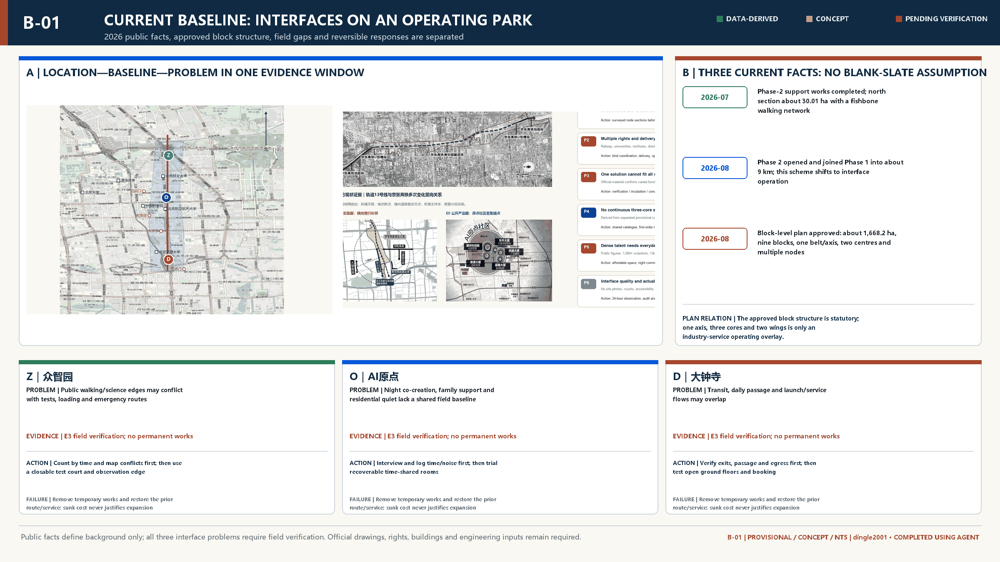

### Three problem cards: known fact, field gap, consequence and reversible response

| Area | Publicly known | E3 field question | Interface consequence | Response / verification / recovery |
|---|---|---|---|---|
| Zhongzhiyuan | The park is operating and a walking network exists | Where do public walking/science, testing, loading and emergency flows conflict by time? | An unbounded technology test could deprive public passage or create safety conflict | Count by time and map conflicts; test a closable court and observation edge; remove temporary equipment and restore passage if the gate fails |
| AI Origin | The corridor is open public space within a mixed urban interface | How do night co-creation, family support and residential quiet interact? | Activity programming may displace residents or become event-only incubation | Interview and record time/noise; test recoverable time-shared rooms; end residency and return rooms to shared use if demand/public safeguards fail |
| Dazhongsi | The southern interface connects transit, enterprise service and daily public use | Where do transit/daily passage and launch/enterprise-service flows overlap? | “First-order events” may obstruct passage or create non-auditable matchmaking | Verify station exits, passage and egress; test an open-ground desk with booking and recusal; stop matching and restore daily passage on failure |

Service reach is not represented by assumed circles. The field task must first obtain official entrances, a walkable network, barriers/vertical links and opening times, then produce separate 5- and 10-minute network isochrones for normal and event/night conditions. Zhongzhiyuan tests campus/equipment access, AI Origin tests day/night and family-support reach, and Dazhongsi tests station-to-desk reach without mixing transfer and event flows. Current catchment coverage and population served remain null.[assumption:A-CURRENT-BASELINE-008]

E0 official facts, E1 provisional derivation and E3 field verification remain separate. E3 cannot trigger permanent works, investment totals or performance claims. Strategy A—large physical redevelopment—is rejected because the park is operating and a block plan is approved. Strategy B—a technology-display layer—is rejected because gadgets do not produce enterprises or public value. Strategy C—a reversible operating-interface network—is preferred because it can be field-tested, signed, stopped and restored.[assumption:A-CURRENT-BASELINE-008]

## Masterplan and located project portfolio

The masterplan locates all fifteen projects under the growth contract: Zhongzhiyuan turns real problems into bounded validation and signed evidence; AI Origin turns validated contribution into a durable team and cost-bearing project; Dazhongsi turns project evidence into first order, repeat demand and independent-survival review. The Zhongguancun service wing provides callable compute, data, IP, compliance and capital interfaces; the Xiaoyuehe wing supplies bounded public-realm test settings. Six cross-corridor seams remain investigation priorities, not claimed deficiencies: exact entrances, route choice, catchments, levels, flows and works await field/network survey.

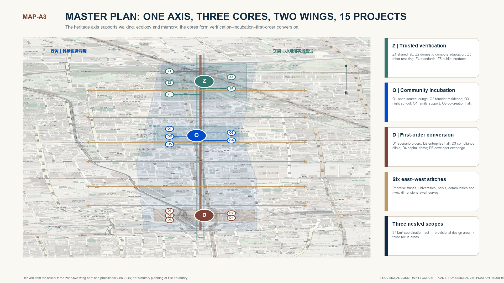

## Operating scheme and project contracts

Operations follow a steering committee—district platform—three core units—professional partners—users/public responsibility chain. Shared validation, the open-source living room/night school, and first-order/enterprise services each define a catalogue, public duty, operating income, cost account, acceptance evidence and stop gate. Every project contract includes problem evidence, spatial boundary, works and operating task, RACI, quantities/cost method, milestones, acceptance evidence, risks and stop conditions.

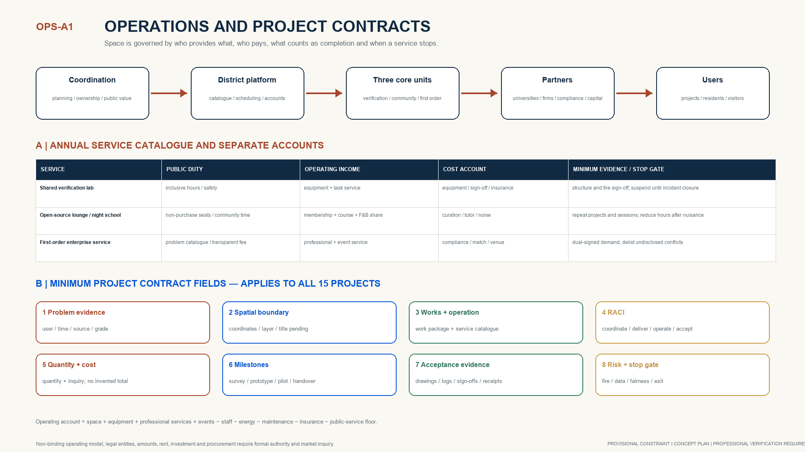

Quantity and cost follow “price only measured quantities; no quantity, no invented total.” Public realm, building renewal, validation equipment, operating launch and contingency keep separate quantity sources. Formal estimates require a confirmed boundary, engineering survey, professional design, market quotation and an authorized delivery model. The unit account defines revenue, cost and stress-test formulas only—never invented rent, investment or payback.

## Overall Design Area: Urban Renewal and Regulatory-Plan-Level Urban Design

The structure is one axis, three cores and two wings. The heritage park is the cultural, walking and innovation-display axis. Zhongzhiyuan validates, the AI Origin Community incubates, and Dazhongsi commercializes. The Zhongguancun wing makes policy, data, compute, IP, compliance and finance callable; the Xiaoyuehe wing turns mobility, environment, community and public-space questions into testable orders.[data:geometry/roads.geojson#ROAD-001] [depth:overall_spatial_structure]

Public reporting in August 2026 confirms approval of the block-level plan with a “one belt, one axis; two centres and multiple nodes” structure. That is the statutory background. “One axis, three cores and two wings” describes only the validation-incubation-conversion service/operating relationship; it creates no statutory centre, parcel control, FAR, height or road redline.[source:OFFICIAL-JINGZHANG-BLOCK-PLAN-APPROVED-20260812] [assumption:A-CONTROLS-001]
This structure is a direct response to the official taskbook's three positionings, five functions and three-areas-two-wings, not a separate naming system:

| Official taskbook requirement | Proposal response |
|---|---|
| Positioning 1: Century Jingzhang Culture Belt | Jingzhang heritage-park axis + three-layer cultural narrative (railway—Zhongguancun—AI) |
| Positioning 2: Urban AI Life Experience Belt | three-core public interfaces + 12 scenario cards + intergenerational AI living lab |
| Positioning 3: AI Integration Innovation Belt | five-stage growth loop + three-areas-two-wings synergy + global developer nodes |
| Function 1: AI full-stack indigenous innovation | Zhongzhiyuan shared validation chain (model-safety eval—compute adaptation—robot testing—standards co-creation) |
| Function 2: world-class AI innovation ecosystem | ecosystem network + enterprise services + first-order conversion + international exchange |
| Function 3: AI+ scenario empowerment paradigm | 12 scenario cards + scenario-space-operation mapping + Xiaoyuehe wing |
| Function 4: intelligent AI vibrant city | civic agent operation desk + all-age friendliness + public-space component library |
| Function 5: AI governance global voice | governance matrix + data classification + human review + standards co-creation |

The synergy loop flows through "validation (Zhongzhiyuan) — incubation (AI Origin Community) — conversion (Dazhongsi) — service (Zhongguancun wing) — scenario (Xiaoyuehe wing)" so the three positionings do not fragment and the five functions do not drift apart.[source:OFFICIAL-ANNOUNCEMENT] [depth:overall_spatial_structure]

### Design strategy: inherit · connect · grow · govern

Four strategies condense Jingzhang's century memory, spatial network, growth loop and long-term governance into parallel threads: **inherit** (the historical base of the Jingzhang railway and industrial heritage), **connect** (the one-axis-three-cores-two-wings network and scenario orders), **grow** (the five-stage loop converting relations to projects and projects to firms), and **govern** (operations-first, the civic agent and performance review for long-term operation). They run in parallel—inherit as base, connect as skeleton, grow as engine, govern as safeguard.[source:MARS-THEORY]

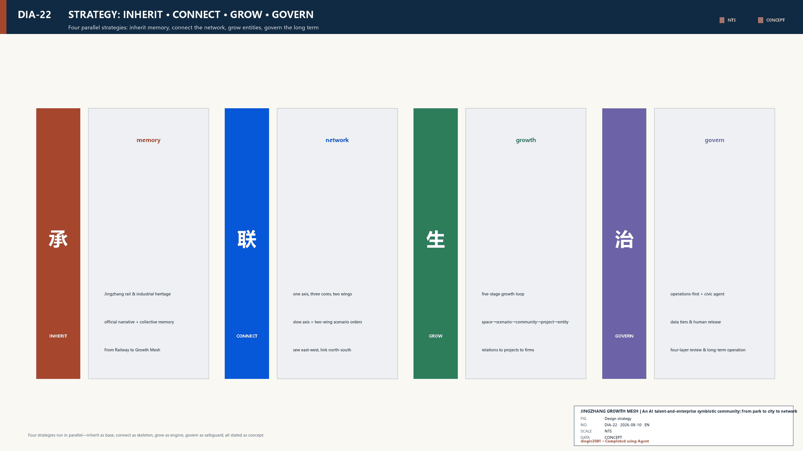

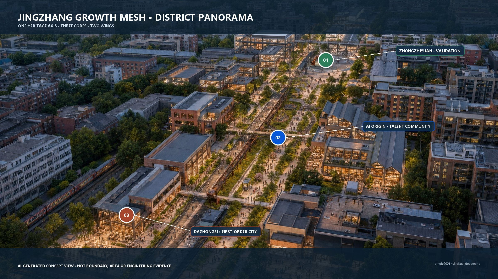

The aerial uses the overall map, slow-mobility/blue-green network and three module views as visual references. It composes northern validation, central talent co-creation and southern first-order commercialization into one continuous railway-heritage innovation corridor. It is an AI-generated concept view, not evidence of existing buildings, boundaries, scale, engineering conditions or implementation commitments.[assumption:A-AI-VISUAL-006]

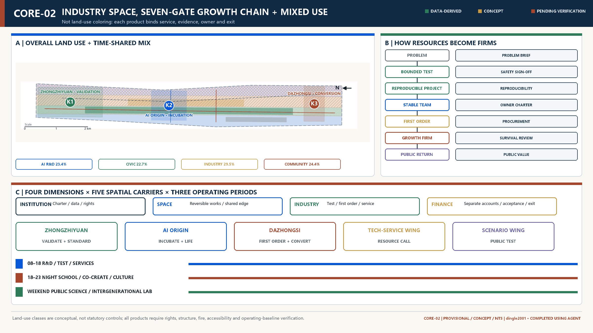

The five stages release affordable reversible space, insert bounded real scenarios, aggregate weak ties through open-source activity and clinics, generate verifiable projects, and help projects become durable entities through first orders, compliance, finance and talent services. Institution, space, industry and finance must move together.[source:MARS-THEORY] [depth:phasing_implementation]

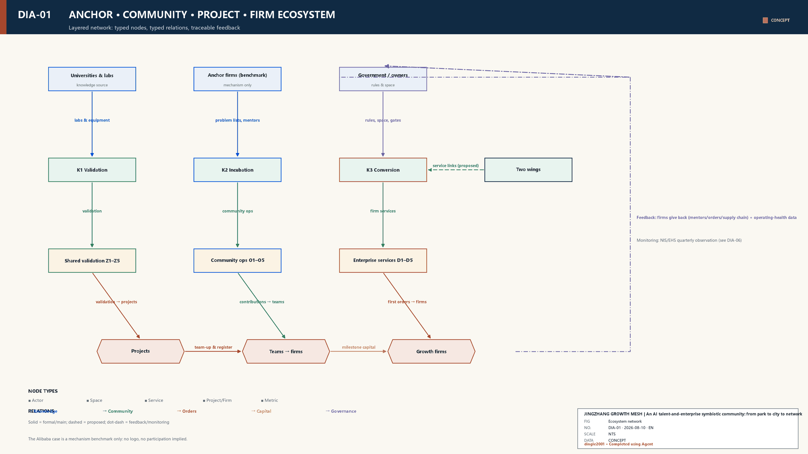

### Seven Evidence Gates: from available resources to public return

| Gate | Minimum evidence | Accountable owner | Continue/adjust/exit rule |
|---|---|---|---|
| G0 Resource interface | Public catalogue, rights status and named contact | Program office | Do not advertise as callable if any item is missing |
| G1 Space opening | Structure/fire/accessibility/rights sign-off | Owner + professional signer | Without sign-off, non-building activities only |
| G2 Scenario launch | Problem owner, D0-D3 class, insurance and response plan | Scenario lead | No launch with unclear data or safety boundary |
| G3 Community formation | Stable teams, contribution licenses and resident feedback | Community operator | Footfall alone is not a community outcome |
| G4 Project generation | Reproducible test sheet, accepter and failure review | Test operator + demand owner | Irreproducible work returns to validation |
| G5 Entity growth | First order/procurement review, compliance sign-off and service continuity | Enterprise platform | Pitching or intent never substitutes for transaction evidence |
| G6 Public return | Open hours, affordability, complaint closure and knowledge return | Collaboration council | Falling public value pauses expansion |

The chain separates weak signals—footfall, events, pitches and intent—from stronger evidence such as reproducible tests, professional sign-off, procurement review, service continuity and public return. Missing G1-G6 evidence freezes the last verified state; an operations dashboard may never promote a project automatically on publicity volume alone.[depth:risk_missing_data]

Land-use polygons form a complete provisional partition. FAR, height, road redlines, total floor area and utility capacity remain pending official controls and surveys.[data:geometry/land_use.geojson#LU-001] [standard:MNR-LAND-USE-CLASSIFICATION-GUIDE] [depth:development_intensity_controls]

## Detailed Design of Key Areas

Each key-area sheet combines a concept plan, A-A' section and operating thresholds. Sections follow the drawing logic of architectural drafting references through grids, datums, bay/overall dimension chains, cut/projected lineweights, intervention legends, egress and accessibility cues. Every dimension is a prototype control dimension and every sheet remains explicitly concept-stage/NTS/pending specialist verification—not a survey, approval or construction document.[standard:GBT-50001-2017] [standard:GBT-50104-2010] [source:STD-GBT-50103-2010]

### Zhongzhiyuan: shared validation city

A shared laboratory spine, bounded test loop, standards courtyard and public science edge separate high-security tests from public interfaces. Teams reserve equipment, produce reproducible test sheets and carry results into standards workshops and service catalogues. Large-span adaptable space is retained where feasible; lightweight observation walks and equipment rooms remain reversible. Structure, fire, loads and power require specialist checks.[data:geometry/key_areas.geojson#PROV-KEY-001] [depth:three_key_area_detailed_design]

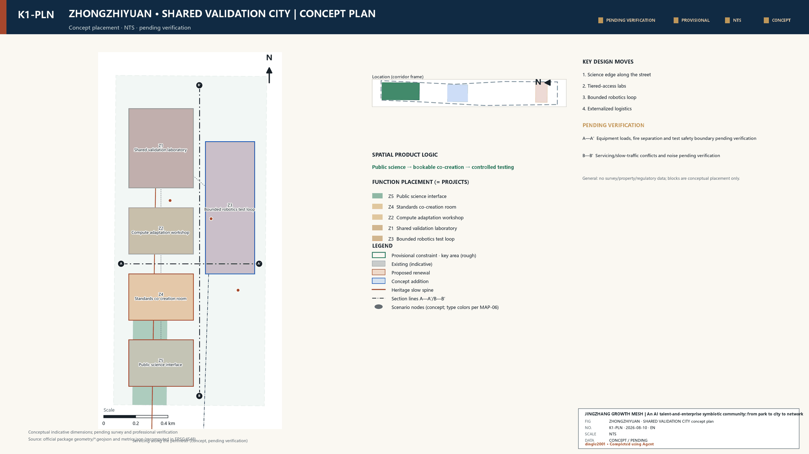

### AI Origin Community: from co-location to working together

An open-source living room, project clinic, founder residency, cafe/night school and family support station serve research transfer by day, collaboration and learning by night, and public/intergenerational co-creation on weekends. Small units, short leases, shared rooms and open ground floors lower entry barriers. Residents, children and older people are never treated as free test subjects; consent, minimization, exit and offline alternatives come first.[data:geometry/key_areas.geojson#PROV-KEY-002] [source:MARS-THEORY]

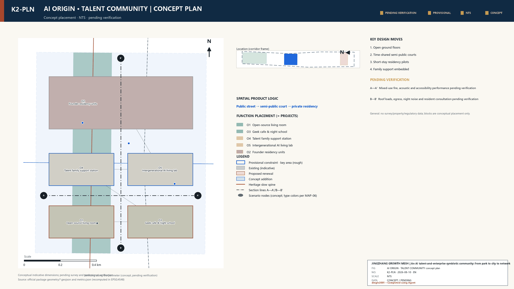

### Dazhongsi: from project result to first customer

A transit gateway, enterprise-service street, first-order hall, compliance clinic and roadshow steps connect the city street to an internal public court. Flexible ground floors host services and demonstrations; upper floors host advisers and growing firms. The model is an accessible civic business interface, not a closed headquarters lobby.[data:geometry/key_areas.geojson#PROV-KEY-003] [depth:retain_renovate_demolish]

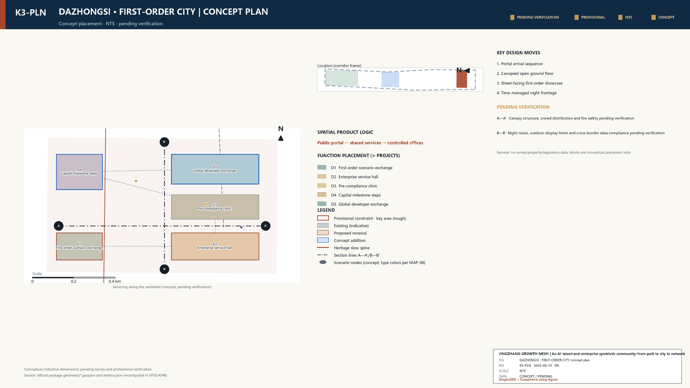

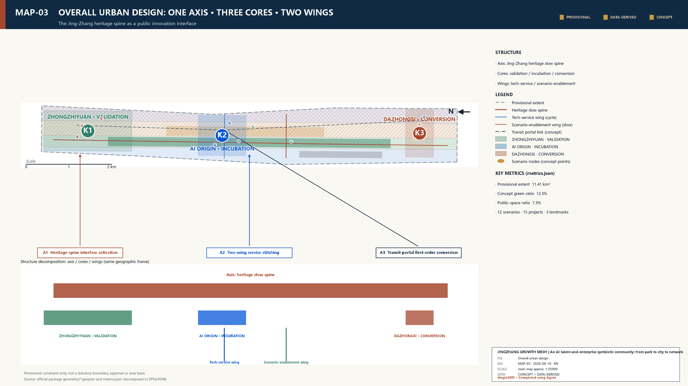

## AI Innovation Ecosystem, Personas, and AI+ Scenarios

| # | Persona | Primary needs |
|---|---|---|
| 1 | Researchers | Research transfer, collaboration boundaries and trusted testing |
| 2 | Independent developers | Affordable desks, compute, open-source peers and a first customer |
| 3 | Startup teams | Project diagnosis, scenario orders, talent and organizational support |
| 4 | Growth companies | Validation facilities, professional services, expansion space and capital links |
| 5 | Services and investors | A standardized entry, trusted projects and milestone evidence |
| 6 | Resident families | Understandable, optional and reversible everyday services |
| 7 | Operators and stewards | Risk tiers, audit logs, human takeover and dynamic health checks |

Personas set thresholds, service entries, data boundaries and human fallback rather than targeting. The journey runs from research or interest through open source, stable team, demo, real validation, first order, entity formation and community return.

| ID | Scenario | Type | Space | Users | Governance boundary | Stage output |
|---|---|---|---|---|---|---|
| SCN-01 | Model safety evaluation sandbox | Industrial test | Zhongzhiyuan | Researchers and startup teams | Isolation, tiered authorization and human release | A reproducible test sheet and risk review |
| SCN-02 | Domestic compute adaptation workshop | Industrial test | Zhongzhiyuan | Developers and growth firms | Do not expose sensitive parameters; log bookings | A compatibility report and migration list |
| SCN-03 | Bounded robotics field loop | Industrial test | Zhongzhiyuan | Firms and operators | Limited time, speed and area; remote takeover | A scenario-validation record |
| SCN-04 | Open-source project clinic | Community incubation | AI Origin Community | Researchers and independent developers | Joint licensing, code, product and organization clinic | A project roadmap from contribution history |
| SCN-05 | Founder residency | Community incubation | AI Origin Community | Independent developers and startup teams | Short stays, mentor recusal and voluntary disclosure | A stable team and stage review |
| SCN-06 | AI talent night school | Community incubation | AI Origin Community | Researchers and resident families | Evening opening, co-created courses and no forced collection | Cross-institution weak ties |
| SCN-07 | Intergenerational AI living lab | Human service | AI Origin Community | Resident families and developers | Consent and special protection for children and older people | Everyday needs feeding back into product design |
| SCN-08 | Accessible multimodal wayfinding | Human service | Jing-Zhang public realm | Residents and visitors | Local-first, minimum collection and an off switch | More accessible public space |
| SCN-09 | Talent family support station | Human service | AI Origin Community | Researchers and resident families | Childcare referral, human emergency desk and privacy separation | Lower daily friction for talent |
| SCN-10 | First-order scenario exchange | Commercialization | Dazhongsi | Startup teams and growth firms | Log the chain from problem to validation and procurement | A first customer or public-scenario order |
| SCN-11 | Enterprise compliance clinic | Commercialization | Dazhongsi | Firms and professional services | AI assists; qualified professionals sign off | Lower registration, IP and operating trial costs |
| SCN-12 | Urban-agent operations desk | Governance | Dazhongsi / two wings | Operators and the public | Tiered permissions, audit logs, appeal and human takeover | A transparent operating-health loop |

All industrial tests have bounded space, accountable operators, human release and review. Public services use minimum necessary data, clear notice, shutoff, appeal and offline alternatives.[metric:scenario_card_count] [metric:industry_test_scenario_count]

### Twelve Executable Scenario Briefs

Each scenario preserves a no-AI equivalent, named human release, stop condition and acceptance evidence. Technology may improve service but may never become the only route to a basic public service.

#### SCN-01｜Model safety evaluation sandbox
| Field | Executable definition |
|---|---|
| Problem | No independent reproducible safety check before release |
| Journey | Register—isolate—two-person review—sign-off—review |
| Data | D3 restricted; minimum authorization |
| No-AI equivalent | Offline test sheet and human panel |
| Human release | Safety lead releases high-risk results |
| Stop | Seal on privilege breach, irreproducibility or isolation failure |
| Acceptance | Complete version, permission, test and review record |
Users: Research and startup teams

#### SCN-02｜Domestic compute adaptation workshop
| Field | Executable definition |
|---|---|
| Problem | Migration is costly and parameters are sensitive |
| Journey | Book—authorize—adapt—review—migration list |
| Data | D2 commercially sensitive |
| No-AI equivalent | Human compatibility test and document comparison |
| Human release | Firm confirms report release |
| Stop | Withdraw on leak or failed migration |
| Acceptance | Reviewable report with authorized inputs |
Users: Developers and growth firms

#### SCN-03｜Bounded robotics field loop
| Field | Executable definition |
|---|---|
| Problem | Urban testing conflicts with public safety |
| Journey | Opening check—bounded run—takeover—review |
| Data | D2 device and incident |
| No-AI equivalent | Physical barrier, safety staff and manual testing |
| Human release | Daily human opening and remote takeover |
| Stop | E-stop on breach or takeover failure |
| Acceptance | No unhandled breach; all events logged |
Users: Robotics firms and public

#### SCN-04｜Open-source project clinic
| Field | Executable definition |
|---|---|
| Problem | Contributions fail to become stable roadmaps |
| Journey | License check—diagnosis—roadmap—ownership |
| Data | D1 project record |
| No-AI equivalent | In-person code review and paper checklist |
| Human release | Maintainer confirms license and merge |
| Stop | Pause on license or attribution dispute |
| Acceptance | License, roadmap and owner list per case |
Users: Researchers and independent developers

#### SCN-05｜Founder residency
| Field | Executable definition |
|---|---|
| Problem | Short team formation lacks space and support |
| Journey | Apply—conflict check—reside—review—exit |
| Data | D2 identity and project |
| No-AI equivalent | Public desk application and interview |
| Human release | Voluntary disclosure and mentor recusal |
| Stop | Terminate on unresolved bias or conflict |
| Acceptance | Complete exit, deletion and ownership clauses |
Users: Independent developers and startups

#### SCN-06｜AI talent night school
| Field | Executable definition |
|---|---|
| Problem | No stable evening learning entry |
| Journey | Co-create—review—teach—feedback—repeat |
| Data | D0 course + D1 registration |
| No-AI equivalent | On-site registration, print and human teaching |
| Human release | Instructor reviews content; operator controls time |
| Stop | Cancel or reschedule unsafe/disturbing content |
| Acceptance | Syllabus, feedback and noise-response record |
Users: Talent and residents

#### SCN-07｜Intergenerational AI living lab
| Field | Executable definition |
|---|---|
| Problem | Life needs miss R&D while vulnerable users risk passive participation |
| Journey | Co-create—consent—small test—human service—exit/delete |
| Data | D2 sensitive personal |
| No-AI equivalent | Fully equivalent offline service |
| Human release | Participant/guardian consent + ethics review |
| Stop | Exit and delete on distress or withdrawal |
| Acceptance | 100% reversible; basic service not conditional |
Users: Families and developers

#### SCN-08｜Accessible multimodal wayfinding
| Field | Executable definition |
|---|---|
| Problem | Routes are hard to understand and tech failure amplifies barriers |
| Journey | Professional route check—publish—assist—close complaints |
| Data | D0 wayfinding + D2 assistance |
| No-AI equivalent | Physical signs, human desk and paper map |
| Human release | Accessibility professional signs off |
| Stop | Switch offline on error or outage |
| Acceptance | Professional pre-opening check and traceable complaints |
Users: Residents and visitors

#### SCN-09｜Talent family support station
| Field | Executable definition |
|---|---|
| Problem | Childcare and eldercare information is fragmented |
| Journey | Register—human confirm—authorize—receipt/withdraw |
| Data | D2 family service |
| No-AI equivalent | Walk-in and phone referral |
| Human release | Human desk confirms each referral |
| Stop | Stop interface on wrong referral or privacy linkage |
| Acceptance | Authorization, receipt and withdrawal every time |
Users: Researchers and families

#### SCN-10｜First-order scenario exchange
| Field | Executable definition |
|---|---|
| Problem | Technology is disconnected from real demand and procurement |
| Journey | Publish—conflict disclose—validate—co-sign—procurement review |
| Data | D2 procurement/business |
| No-AI equivalent | Public problem session, human panel and offline matching |
| Human release | Demand owner and compliance co-sign |
| Stop | Remove false demand or conflict |
| Acceptance | Complete problem-validation-procurement evidence |
Users: Startups and demand owners

#### SCN-11｜Enterprise compliance clinic
| Field | Executable definition |
|---|---|
| Problem | AI advice may cross professional qualification limits |
| Journey | Classify—retrieve—human review—sign or refer |
| Data | D2 enterprise compliance |
| No-AI equivalent | Human consultation and paper checklist |
| Human release | Qualified professional signs formal advice |
| Stop | Refuse bad, out-of-scope or obsolete advice |
| Acceptance | All formal advice traceable to signer |
Users: Firms and professional services

#### SCN-12｜Urban-agent operations desk
| Field | Executable definition |
|---|---|
| Problem | Cross-scenario operations lack audit, appeal and takeover |
| Journey | Read—recommend—human authorize—act—audit—appeal |
| Data | D1 operations + D2 complaints |
| No-AI equivalent | Manual register, phone and in-person service |
| Human release | Human authorization for each high-risk action |
| Stop | Read-only on breach, drift or appeal backlog |
| Acceptance | Least privilege, full logs, sampling and takeover |
Users: Operators and public

### Technical Governance Matrix for All Twelve Scenarios

Data classes are D0 public/non-personal, D1 ordinary operating records, D2 personal or commercially sensitive, and D3 restricted test data. Maturity is M1 protocol-ready, M2 bounded pilot and M3 repeatable service. The following values are proposed pilot gates, not current performance.

| ID | Data class | Accountable owner | Maturity | Human release | Failure/exit | Acceptance and dependency |
|---|---|---|---|---|---|---|
| SCN-01 | D3 restricted test | Safety-evaluation lead | M2 bounded pilot | Two-person release | Unauthorized access / irreproducible result -> seal | 100% version, permission and review logs; isolated environment required |
| SCN-02 | D2 commercially sensitive | Compute-workshop lead | M2 bounded pilot | Firm confirms report | Parameter leak / failed migration -> withdraw | Reviewable compatibility report; authorized equipment and data required |
| SCN-03 | D2 device and incident | Site safety lead | M2 bounded pilot | Daily human opening check | Loss of control / public-lane intrusion -> e-stop | No unhandled boundary breach; 100% incident logs; insurance and segregation required |
| SCN-04 | D1 project record | Open-source clinic lead | M2 recurring service | Author confirms license | License / attribution dispute -> pause merge | Each case produces license, roadmap and responsibility list |
| SCN-05 | D2 identity and project | Residency lead | M1 protocol-ready | Voluntary team disclosure | Discrimination / mentor conflict -> recuse or terminate | Recusal, exit and deletion clauses signed |
| SCN-06 | D0 course + D1 registration | Night-school lead | M2 recurring service | Instructor review | Unsafe content / disturbance -> cancel or reschedule | Syllabus, feedback and noise-response record |
| SCN-07 | D2 sensitive personal | Community ethics lead | M1 protocol-ready | Participant/guardian consent + human service | Distress / consent withdrawal -> exit and delete | 100% reversible; basic service never conditional on participation |
| SCN-08 | D0 wayfinding + D2 assistance | Accessibility lead | M1 protocol-ready | Human route check | Misdirection / outage -> offline wayfinding | Professional check before opening; traceable complaint closure |
| SCN-09 | D2 family service | Community-service lead | M1 protocol-ready | Human referral confirmation | Wrong referral / privacy linkage -> stop interface | Authorization, receipt and withdrawal for every referral |
| SCN-10 | D2 procurement/business | First-order platform lead | M1 protocol-ready | Demand owner + compliance co-sign | False demand / conflict -> remove and disclose | Complete problem-validation-procurement evidence |
| SCN-11 | D2 enterprise compliance | Qualified professional lead | M2 recurring service | Professional sign-off | Bad AI advice / out-of-scope -> refuse sign-off | 100% formal advice traceable to signer |
| SCN-12 | D1 operations + D2 complaints | Urban-operations data lead | M1 protocol-ready | Human approval for high-risk action | Privilege breach / drift / appeal backlog -> read-only | Least privilege, full logs, sampling, appeal and takeover available |

**SCN-01 minimum protocol:** register model, version, data rights, allowed use and owner before an isolated test; separate execution from two-person release; seal any unauthorized, irreproducible or high-risk run until review. **SCN-03 minimum protocol:** physical limits, time window, speed cap, e-stop, remote takeover, insurance and an on-site safety lead are opening conditions; public-lane intrusion or failed takeover stops the site. **SCN-12 minimum protocol:** default read-only and least privilege; human authorization for every high-risk action; log access, recommendation, change, appeal and takeover without silent deletion; privilege breach, drift or appeal backlog triggers read-only human operation.[depth:risk_missing_data]

## Land Use, Building Scale, and Retain-Renovate-Demolish Strategy

The proposal establishes a procedure rather than parcel conclusions: assess structure, fire, heritage, rights and adaptability; retain usable buildings; use reversible ground-floor and passage upgrades; return demolition and new construction to official controls and approvals. Prototypes include validation halls, open-source living rooms, short-stay units, open service streets and lightweight display frames.[data:geometry/buildings.geojson#BLDG-001] [depth:retain_renovate_demolish]

Financial completeness does not mean inventing totals. The unit account treats space, equipment and professional services as separate revenue formulas; public space, infrastructure and inclusive services remain separate costs; equity returns never support basic debt service.[assumption:A-UNIT-ECONOMICS-007]

## Transport, Rail, Municipal Infrastructure, and Public Services

The heritage axis carries walking, cycling, interpretation and public innovation; two wings provide lateral services; transit gateways use continuous ground floors, shelter, accessibility and short transfers. Robot tests never share unrestricted public lanes and require speed, time and area limits, remote takeover and incident review. Road geometry is conceptual.[data:geometry/roads.geojson#ROAD-004] [depth:traffic_rail_slow_parking]

Infrastructure is shared rather than duplicated: secure tests at Zhongzhiyuan, low-barrier tools at Origin, and enterprise/operations systems at Dazhongsi. Power, communications, fire, utilities and compute supply await specialist verification; no internal corporate resource becomes a public commitment.

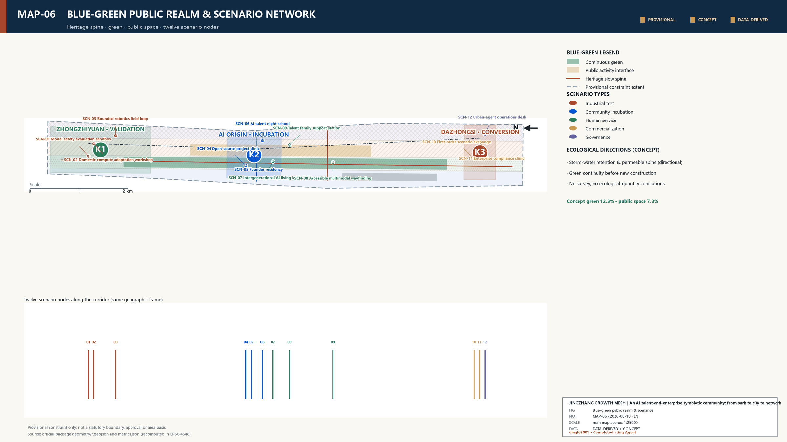

## Blue-Green Network, Public Space, and Urban Character

The park is the ecosystem's public living room. Lunch supports short meetings and walking; evenings support running, night school and lightning talks; weekends support science and scenario experience. Anonymous passage and free stay are protected. Accessibility for children, older and disabled users precedes showcase technology.[data:geometry/green_space.geojson#GREEN-001] [data:geometry/public_space.geojson#PUBLIC-001]

The Open-Source Milestone records verified public contributions along the rail trace; the Origin Co-creation Hall and Global Developer Node Wall show cross-city cooperation with rights clearance; the Dazhongsi Enterprise Growth Rings record stages from validation to first order and community return. The identity uses technology blue, railway rust, growth green and warm gray without unauthorized corporate marks.[metric:landmark_count]

### Logo, Cultural Wayfinding and Program-Brand Hierarchy

| Level | Name | Graphic/application rule | Rights and use boundary |
|---|---|---|---|
| Master brand | Jingzhang Growth Mesh | Rail trace branching into a node mesh; horizontal, vertical and mono variants | No corporate-logo lockup implying partnership |
| Spatial subbrands | Zhongzhi Validate / Origin Co-create / Dazhongsi First Order | Green / blue / rust; shared node IDs and arrows | Conceptual spatial products only |
| Cultural wayfinding | Rail heritage line + date/component/story index | Warm-gray field, rust line, QR to rights-cleared content | Heritage specialist verification required |
| Honor display | Open-source milestone + enterprise growth rings | Authorized, verifiable and withdrawable contributions only | Not advertising, rating or investment advice |
| Annual program subbrands | Validation Open Week / Origin Developer Nights / First-order Season | Master lockup + program bar + year | Partner marks need event-specific written permission |

Recommended clear space is at least one node-circle diameter; minimum width is 25 mm in print and 120 px on screen, with a mono node mark below that size. The identity uses project-authored geometry and code, not third-party icon packs or corporate marks. These are application recommendations pending trademark search, registration and heritage-signage approval.

### Century Jingzhang Culture, Zhongguancun Culture and AI New-Culture Narrative

The cultural narrative explains why this corridor exists here and for whom it grows. Three layers compose a continuous growth motif:[source:MARS-COURSE]

1. **The Jingzhang railway layer — the gene of "connection".** From the Jingzhang railway led by Zhan Tianyou in 1909 to the heritage park released after the high-speed line went underground in 2016, this linear space carries the collective memory of independent Chinese engineering. The heritage axis translates "independence, breakthrough and connection" into the public narrative base of the AI innovation belt; historical components, dates and stories are activated on a survey-first, display-later, rights-cleared basis—no fakes, no over-commercialization.[depth:culture_heritage]

2. **The Zhongguancun innovation layer — the relay from "Electronics Street to Science City".** From electronics street, to science city, to a global AI innovation ecosystem, Zhongguancun distilled a culture of daring, tolerance, openness and sharing. The proposal translates it into open-source living rooms, project clinics, standards co-creation and first-order mechanisms, moving innovation from individual heroism to public infrastructure.

3. **The AI new-culture layer — the third generation of "open source, developers, global nodes".** The cultural gene of the AI era is open collaboration, developer communities and a global knowledge network. The proposal makes developer contribution records, open-source milestones and a global node wall verifiable public cultural devices, so that "growth" itself becomes visible, remembered and inherited.

Spatially, the Jingzhang heritage line supplies the "vertical axis of time", the two wings and three cores supply the "horizontal axis of life", and the AI growth mesh supplies the "network of growth". The international copy uses "From Railway to Growth Mesh" as its motif—independence, connection, growth—without fabricating history or conflating cultural signage with the master logo system.[depth:culture_heritage]

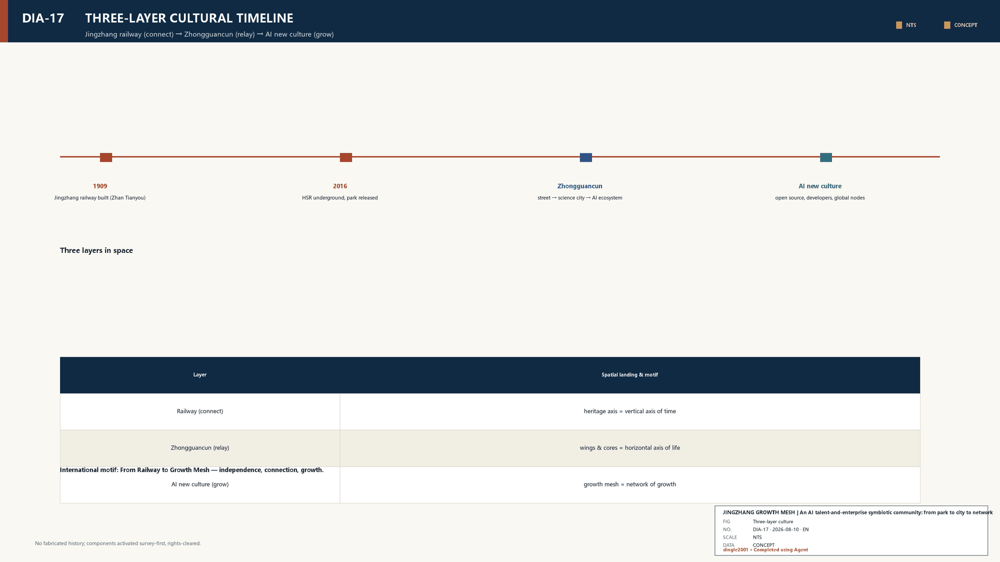

### Honor Display System and Public-Space Component Library

The honor display system shows only authorized, verifiable and withdrawable public contributions—no advertising, rating or investment advice. The Jingzhang Open-Source Milestone records verified contributions along the rail trace; the Origin Co-creation Hall and Global Developer Node Wall show cross-city cooperation without unauthorized personal data; the Dazhongsi Enterprise Growth Rings record stages from validation to first order and community return. Every display follows an "authorize—verify—display—withdraw" loop.[metric:landmark_count]

The public-space component library standardizes the park's facilities into composable, updatable modules: walking surfaces and accessible ramps (basic reachability first), modular seating and shading frames (reversible), railway relic cases and story index (rights-cleared), and AI scenario nodes (explicit data boundaries and offline fallback). Components use technology blue, railway rust, growth green and warm gray; all dimensions remain concept-stage, NTS and pending specialist verification—not engineering or construction conclusions.[depth:public_space_component]

### Proposed Quantified Public-Interest Gates

| Topic | Proposed gate | Evidence/status |
|---|---|---|
| Accessibility | Every public pilot route receives a professional check before opening; failure blocks launch | Log reviewer, date, issues and closure |
| Resident co-governance | Proposed council includes at least two resident seats with pause-advice rights on community data and vulnerable groups | Effective only after charter approval |
| Complaint response | Proposed acknowledgement within 2 working days and resolution or extension note within 10 | Publish anonymous aggregates only |
| Vulnerable groups | Basic services never require testing; minors need guardian consent and independent exit | Ethics lead samples each case |
| Affordability | Proposed minimum 20% of community-program hours free or low-cost; prices and waivers public | A proposed gate until operating contract approval |

## Renewal Projects, Implementation Policy, and Phasing

The proposal upgrades the renewal-project list from a static table into a complete urban-renewal process that a competent department can schedule directly: health checks surface problems, a project library takes on tasks, operations-first constrains design, funding balance secures delivery, and long-term operations preserve outcomes. The mechanisms below are stated as concept recommendations for professional deepening, not departmental mandates, approval judgments or government commitments.[source:MARS-COURSE]

### Implementation master plan: six closed loops and four integrations

The Jingzhang belt is stock-space improvement, not greenfield development. Under the Beijing Urban Renewal Regulations it combines industrial renewal (Zhongzhiyuan and Dazhongsi stock buildings and plants), public-space renewal (the linear park) and comprehensive regional renewal (three areas, two wings), proceeding as "health check first, planning second, implementation third, operations last".[source:MARS-COURSE]

Implementation must close six loops; any missing loop becomes a later bottleneck: **problem diagnosis** (health checks identify real problems), **planning policy** (projects land on plans and policy tools), **stakeholder negotiation** (government, rights holders, firms and residents agree), **funding balance** (investment has a source and an exit), **construction-operation** (built is operated and operation feeds design), and **evaluation iteration** (performance review drives the next round).[source:MARS-COURSE]

Four integrations pass industrial direction, public tasks and concrete projects down level by level: **city integration** (position Jingzhang's industrial role within Haidian's "three cities, one zone"; see far), **district-enterprise integration** (district coordination with SOEs and professional operators; land firmly), **block integration** (coordinate functions and operations across the heritage axis and two wings; connect through), and **project integration** (land requirements on each project's design, construction, leasing and operation; execute precisely).[source:MARS-COURSE]

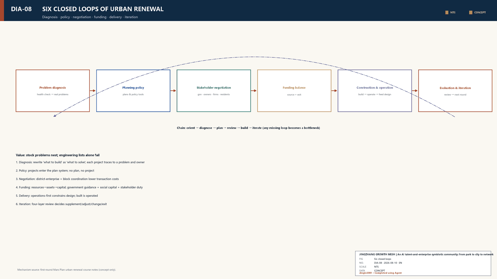

### Urban health check and two-tier project library

Beijing's mainline is "project library—renewal plan—implementation plan—joint review—parallel approval". The proposal recommends two tiers: a **reserve library** ("why do this, is the direction right") and an **implementation library** ("who coordinates, where are the boundaries, where does the money come from, when to proceed"). Maturity advances through opportunity—reserve—implementation—annual-plan; projects long lacking feasibility return to the opportunity list. Entering the library is neither approval nor automatic funding.[source:MARS-COURSE]

Health checks begin project planning. For Jingzhang's stock objects, the proposal recommends baselines across structure safety, fire safety, heritage value, rights, industrial fit, mobility reachability and public-space quality, forming a "problem—cause—resource" correspondence table; only content traceable to a clear problem and accountable owner enters the library.[data:geometry/site_boundary.geojson#SITE-001] [depth:renewal_project_list]

### Operations-first: decide who uses, who manages, and where the money comes from

Operations-first is not early leasing but bringing future users and operators into decisions from inception, across five stages—**positioning, design, investment, construction, delivery**: positioning sets the users and role; design back-derives clear heights, loads, circulation, MEP and adaptable space from operational needs; investment tests costs with real formats and lease assumptions; construction controls details affecting opening and maintenance; delivery completes brands, programs, staff, systems and trial operation.[source:MARS-COURSE]

True operations-first passes five deliverable checks: ①verifiable user and demand research; ②format technical conditions written into the design brief; ③revenue-cost models per format; ④leasing, content and community operation plans; ⑤long-term maintenance funding and responsibility. A concept positioning or brand list alone remains "build first, find operators later".

Every key area and project should draft an "operation brief" at inception answering seven positioning steps: **block role—service radius—user tiers—demand scenarios—competitive substitutes—value proposition—operating metrics**. Operating models choose among fixed rent, minimum-plus-share, joint/self operation and public-service procurement by project nature, and feed the results back into the design brief.[source:MARS-COURSE]

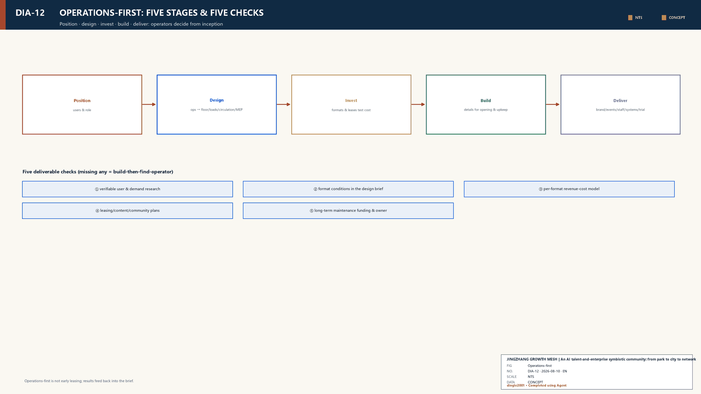

### Funding and balance

Beijing's urban renewal is stock upgrading under reduced growth; construction quotas are scarce and valuable, so cost cannot default to new floor area. Balance comes from stock asset revitalization, public investment, industrial revenue and long-term operations. Funding follows project nature: **public-benefit** (public space, science interface) relies on government and public investment; **quasi-public** (shared validation, enterprise services) combines special bonds, policy loans and fiscal guidance; **commercial** (enterprise-service street, residency units, roadshow steps) uses market financing and operating revenue.[source:MARS-COURSE]

Mature operating assets may exit and reinvest through infrastructure public REITs—but REITs are a mature-asset tool, not early financing. Early projects rely on "government-fund guidance + social-capital participation + stakeholder responsibility" and on "three assets, three conversions": turn resources into assets and assets into capital. The proposal invents no investment totals, payback periods or fiscal commitments; it only establishes a unit operating account and sensitivity assumptions.[assumption:A-UNIT-ECONOMICS-007]

### Budgeting and funding-balance framework

Budgeting is not numbers before money; it threads operations-first estimates, project-library boundaries and implementation-plan lists into one reviewable funding-balance table. The proposal invents no investment totals, rents or payback; it gives account structure, variables and sensitivity, with concrete values filled in by professional teams from official assets, rights, market appraisal and authorized decisions.[assumption:A-UNIT-ECONOMICS-007]

**Revenue accounts** (by project nature): ①government funding and public investment (public space, science interface, community services); ②special bonds and policy loans (quasi-public facilities, shared validation); ③social capital and operating revenue (commercial space, industrial services); ④funds and REIT exits (mature operating assets). **Expenditure accounts**: structural strengthening and fire safety, utilities and MEP, public space, industrial-service facilities, operation preparation and first-year operation, compliance and data security.[source:MARS-COURSE]

**Balance logic**: each project holds an account where "total revenue (channels × amounts) ≥ total expenditure (construction + operation + financing cost + public obligations)". Public-benefit projects may carry a policy gap covered by public investment; commercial projects must self-balance; quasi-public projects balance "public subsidy + operating revenue". Across projects, the block "pairs fat and thin"—commercial returns support public maintenance—but such support must be pre-agreed, accountable and auditable.[source:MARS-COURSE]

**Unit operating account and sensitivity**: commercial space holds a unit account "rent/service revenue − operating cost − maintenance provision − public obligation" with sensitivity variables: occupancy, unit rent, operating-cost ratio, industrial-service conversion and maintenance provision. Estimates only compare options and judge feasibility, never promising returns.[assumption:A-UNIT-ECONOMICS-007]

**Per-project funding matrix** (concept):

| Project | Funding type | Suggested channel | Suggested operator | Phasing |
|---|---|---|---|---|
| Z1 Shared validation laboratory | Quasi-public | Fiscal guidance + special bond + service revenue | Professional test operator + universities | 0–1y pilot |
| Z2 Domestic compute adaptation workshop | Quasi-public | Policy loan + compute provider + task fees | Compute provider + open-source community | 0–1y pilot |
| Z3 Bounded robot testing ring | Quasi-public | Fiscal guidance + site operation + test fees | Site operator + safety owner | 0–1y pilot |
| Z4 Standards co-creation room | Public | Public investment + association dues | Industry association + professionals | 0–1y pilot |
| Z5 Public science interface | Public | Public investment + science-institution funds | Park operator + science institution | 0–1y pilot |
| O1 Origin open-source living room | Quasi-public | Public subsidy + community operation + sponsorship | Community operator + maintainers | 1–3y |
| O2 Founder residency units | Commercial | Operating revenue + incubation fund | Professional incubator | 1–3y |
| O3 Geek café and night school | Commercial | Operating revenue + course income | Community business + curator | 1–3y |
| O4 Talent family support station | Public | Public investment + community-service funds | Community service agency | 1–3y |
| O5 Intergenerational AI living lab | Quasi-public | Public subsidy + tech-team input | Community + tech team | 1–3y |
| D1 Scenario first-order center | Quasi-public | Operating revenue + first-order service fees | Industrial operation platform | 1–3y |
| D2 Enterprise service hall | Commercial | Service fees + operating revenue | Professional service consortium | 1–3y |
| D3 Compliance front-desk clinic | Commercial | Service fees | Registration, IP and legal professionals | 1–3y |
| D4 Capital roadshow staircase | Commercial | Operating revenue + event fees | Operator + investment institutions | 1–3y |
| D5 Global developer exchange station | Quasi-public | Public subsidy + partner input | Community operator + partners | 3–5y |

**Budgeting and approval flow**: budget shares one source with the project library and implementation plan—reserve projects carry only a framework cost band (feasibility); implementation projects compile the funding-balance table in "one map, two tables, six lists" and enter joint review; accounts involving government funding or public investment follow statutory budget and procurement procedures; parallel approval does not replace project approval, budget, procurement, planning permit, construction permit or fire review. After operation, the four-layer performance review feeds back and adjusts or exits.[source:MARS-COURSE] [depth:renewal_project_list]

### Implementation-plan framework: one map, two tables, six lists

Each implementation plan should follow "one map, two tables, six lists": one implementation master map (scope, method, phasing); a phasing table and a funding-balance table; and six lists of problems, resources, rights, policies, approvals and risks. Each project writes objectives with a "problem—cause—measure—output—result—indicator" table; planning indicators land on specific parcels and buildings; investment corresponds to quantities; revenue corresponds to operable space; resident commitments correspond to responsible units. The list below gives this recommended granularity; formal implementation plans follow professional teams and rights holders.[source:MARS-COURSE] [depth:renewal_project_list]

| ID | Project | Area | Users | Suggested operator | Dependencies | Near-term action | Risk |
|---|---|---|---|---|---|---|---|
| Z1 | Shared validation laboratory | Zhongzhiyuan | Researchers and startup teams | Professional test operator + university labs | Verify structure, fire safety and equipment loads | Publish the equipment catalogue and booking rules | Safety incidents and idle equipment |
| Z2 | Domestic compute adaptation workshop | Zhongzhiyuan | Developers and growth firms | Compute provider + open-source community | Review compute provenance and data security | Release the first adaptation tasks | Resource availability misread as a commitment |
| Z3 | Bounded robotics test loop | Zhongzhiyuan | Robotics firms and the public | Site operator + accountable safety entity | Prepare mobility, insurance and remote-takeover plans | Mark low-speed windows and physical limits | Human-machine mixing risk |
| Z4 | Standards co-creation room | Zhongzhiyuan | Firms and standards bodies | Industry association + professional institutions | Define topics and IP boundaries | Run quarterly standards workshops | Meeting activity without deliverables |
| Z5 | Public science interface | Zhongzhiyuan | Residents and visitors | Park operator + science institutions | Physically separate visits from secure tests | Pilot weekend open-lab days | Promotion replacing public science |
| O1 | Origin open-source living room | AI Origin Community | Researchers and developers | Community operator + open-source maintainers | Verify existing space and fire safety | Pilot a weekly project clinic | Busy events but weak projects |
| O2 | Founder residency units | AI Origin Community | Independent developers and startup teams | Professional incubation operator | Verify leasing, residential and office compliance | Start with a small short-stay cohort | Rent and selection exclusion |
| O3 | Geek cafe and night school | AI Origin Community | Talent and residents | Community retail + course curators | Manage noise, business licensing and consumer rights | Pilot lightning talks and night classes | Resident disturbance and over-commercialization |
| O4 | Talent family support station | AI Origin Community | Young families, older people and children | Community service institution | Clarify childcare, eldercare and privacy compliance | Open a needs registry and referral desk | Unclear duty boundaries |
| O5 | Intergenerational AI living lab | AI Origin Community | Residents and developers | Community + technical teams | Establish ethics, consent and human fallback | Run small co-creation tests | Vulnerable groups treated as passive test subjects |
| D1 | First-order scenario center | Dazhongsi | Startup teams and demand owners | Industry operating platform | Define procurement and scenario-opening rules | Publish a problem catalogue | Implied orders or conflicts of interest |
| D2 | Enterprise service hall | Dazhongsi | Startup and growth firms | Professional service consortium | Make qualifications and fees transparent | Publish a service catalogue and booking desk | Duplicate provision and low use |
| D3 | Pre-compliance clinic | Dazhongsi | Firms and operators | Registration, IP, legal and other professionals | Require professional sign-off on AI-assisted advice | Issue a pre-opening compliance checklist | AI replacing professional judgment |
| D4 | Capital milestone steps | Dazhongsi | Project teams and investors | Operator + investment institutions | Manage disclosure and investor suitability | Run evidence-based milestone sessions | Misleading financing promotion |
| D5 | Global developer exchange | Dazhongsi | Developers and international institutions | Community operator + partners | Clear copyright, trademark and cross-border data limits | Connect online and physical nodes | One-off eventization |

### Fifteen Project Delivery Contracts

Each card aligns problem, cause, action, output, result and metric, then adds operation, phasing, funding class and a stop gate. Amounts remain blank until official quantities and authorized appraisals exist.

#### Z1｜Shared validation laboratory
| Field | Delivery definition |
|---|---|
| Problem | Small teams lack trusted test facilities |
| Cause | High equipment thresholds and missing sharing/accountability rules |
| Measure | Verify large spans, then operate shared equipment through booking, tiered access and professional sign-off |
| Output | Equipment catalogue, booking protocol, test sheet and incident log |
| Result | Validation moves from endorsement to reproducible evidence |
| Metric | Equipment use, reproducible-test share and major incidents |
| Operating brief | Professional test operator; account by equipment hour and task service |
| Phase | 0-1 year protocol and small pilot |
| Funding | Quasi-public: public guidance plus equipment service; amount pending |
| Stop gate | No move-in without structure, fire and load sign-off |

#### Z2｜Domestic compute adaptation workshop
| Field | Delivery definition |
|---|---|
| Problem | Domestic-compute migration has high trial cost |
| Cause | Compatibility knowledge is fragmented and parameters are sensitive |
| Measure | Run adaptation, migration and review with authorized data in an isolated environment |
| Output | Compatibility report, migration list and issue knowledge base |
| Result | Reduce repeated failure and create reusable migration paths |
| Metric | Report review rate, closed migrations and leak incidents |
| Operating brief | Compute provider plus open-source community; task and equipment fees |
| Phase | 0-1 year first task cohort |
| Funding | Quasi-public: provider input, policy tools and task fees |
| Stop gate | Pause if provenance, authorization or isolation is unclear |

#### Z3｜Bounded robotics test loop
| Field | Delivery definition |
|---|---|
| Problem | Robotics firms lack a low-risk urban test setting |
| Cause | Public walking conflicts with test flows; insurance and takeover duties are unclear |
| Measure | Use physical limits, time windows, speed caps, e-stop, remote takeover and on-site safety staff |
| Output | Test-window plan, opening checklist, incident and review logs |
| Result | Create a governable pre-deployment urban test |
| Metric | Unhandled boundary breach, e-stop response and incident closure |
| Operating brief | Site operator plus accountable safety entity; charge by test window |
| Phase | 0-1 year closed tests |
| Funding | Quasi-public: site input plus test fees |
| Stop gate | E-stop on public-lane intrusion or takeover failure |

#### Z4｜Standards co-creation room
| Field | Delivery definition |
|---|---|
| Problem | Test results rarely become cross-firm rules |
| Cause | Topics, IP and ownership of outputs are unclear |
| Measure | Organize problem sheet, evidence pack, workshop and public summary |
| Output | Topic register, minutes, evidence summary and draft advice |
| Result | Turn one-off tests into shareable rules |
| Metric | Drafts produced, adoption feedback and rights disputes |
| Operating brief | Industry association plus professionals; dues and task procurement |
| Phase | 0-1 year quarterly workshop |
| Funding | Public-benefit: public support plus association resources |
| Stop gate | No topic without a problem owner and clear IP boundary |

#### Z5｜Public science interface
| Field | Delivery definition |
|---|---|
| Problem | Secure testing lacks an interface for public understanding |
| Cause | Test space is closed and science communication can become marketing |
| Measure | Provide observation walks, weekend opening and non-sensitive result interpretation |
| Output | Opening rules, science script, risk separation and feedback |
| Result | Improve public understanding and return from the AI ecosystem |
| Metric | Open hours, accessible coverage and complaint closure |
| Operating brief | Park operator plus science institution; public-service procurement |
| Phase | 0-1 year weekend pilot |
| Funding | Public-benefit: public and science-institution input |
| Stop gate | No opening before segregation, interpretation duty and rights clearance |

#### O1｜Origin open-source living room
| Field | Delivery definition |
|---|---|
| Problem | Developers attend events but lack durable project collaboration |
| Cause | Contribution licenses, diagnosis and persistent maintainers are missing |
| Measure | Run weekly clinics, maintainer hours and contribution records |
| Output | License list, roadmap, responsibility allocation and review |
| Result | Convert visitor relations into durable projects |
| Metric | Persistent teams, merged contributions and dispute closure |
| Operating brief | Community operator plus maintainers; membership and public subsidy |
| Phase | 0-1 year operate before works |
| Funding | Quasi-public: public subsidy, sponsorship and services |
| Stop gate | Adjust if license disputes persist or footfall produces no projects |

#### O2｜Founder residency units
| Field | Delivery definition |
|---|---|
| Problem | Early teams lack affordable short-cycle work-life support |
| Cause | Long leases, deposits and live-work limits exclude them |
| Measure | Use small short-stay cohorts, explicit use, mentor recusal and stage review |
| Output | Residency agreement, recusal record, milestone and exit form |
| Result | Reduce life and space friction during team formation |
| Metric | Completion, team stability and exit disputes |
| Operating brief | Professional incubator; short-stay and incubation services |
| Phase | 1-3 year rolling small cohorts |
| Funding | Commercial: operating income plus incubation fund |
| Stop gate | No occupancy without legal use, fire safety and fair selection |

#### O3｜Geek cafe and night school
| Field | Delivery definition |
|---|---|
| Problem | Researchers and residents lack a low-barrier evening interface |
| Cause | Daytime office use dominates; evening content may disturb neighbors |
| Measure | Use time-shared rooms, co-created courses, noise limits and no-purchase seats |
| Output | Program, conversion checklist, noise and feedback records |
| Result | Build durable cross-institution weak ties |
| Metric | Repeat programs, no-purchase hours and disturbance complaints |
| Operating brief | Community business plus course curator; separate food and course accounts |
| Phase | 0-1 year lightning-talk pilot |
| Funding | Commercial: operating and course income |
| Stop gate | Reduce hours if disturbance or consumption displaces public time |

#### O4｜Talent family support station
| Field | Delivery definition |
|---|---|
| Problem | Talent families face high childcare, eldercare and emergency referral cost |
| Cause | Service information is fragmented and privacy/duty boundaries are weak |
| Measure | Provide a human desk, authorized referral, receipt and withdrawal |
| Output | Service catalogue, referral, receipt and complaint closure |
| Result | Reduce everyday friction that drives talent away |
| Metric | Effective referrals, response time, withdrawals and complaints |
| Operating brief | Community service institution; public-service procurement |
| Phase | 0-1 year needs register, then recurring service |
| Funding | Public-benefit: public and community-service funding |
| Stop gate | Stop the interface on unconfirmed referral or privacy linkage |

#### O5｜Intergenerational AI living lab
| Field | Delivery definition |
|---|---|
| Problem | R&D misses life feedback while residents risk becoming passive subjects |
| Cause | Consent, vulnerable-user protection and basic-service boundaries are weak |
| Measure | Use small co-creation, free exit, equivalent offline service and ethics review |
| Output | Consent, test, exit/deletion and needs records |
| Result | Life needs improve products without sacrificing basic rights |
| Metric | Withdrawal execution, adopted needs and adverse events |
| Operating brief | Community plus technical team; research service and public support |
| Phase | 1-3 year bounded co-creation |
| Funding | Quasi-public: public subsidy plus technical input |
| Stop gate | Stop if withdrawal fails or basic service depends on participation |

#### D1｜First-order scenario center
| Field | Delivery definition |
|---|---|
| Problem | Early projects struggle to secure a first real customer |
| Cause | Demand publication, validation and procurement judgment are disconnected |
| Measure | Use a problem catalogue, validation sheet, co-sign and procurement review |
| Output | Problem sheet, validation report, conflict declaration and procurement review |
| Result | Give technology a verifiable first application opportunity |
| Metric | Complete evidence chains, procurement-review conversion and false demand |
| Operating brief | Industry operating platform; service fee and procurement support |
| Phase | 0-1 year problem catalogue, then recurring |
| Funding | Quasi-public: operating income plus service fees |
| Stop gate | Remove false demand or undisclosed conflicts immediately |

#### D2｜Enterprise service hall
| Field | Delivery definition |
|---|---|
| Problem | Startups spend heavily finding registration, tax and IP services |
| Cause | Entries are fragmented and qualifications/prices are opaque |
| Measure | Provide one catalogue, named professionals, booking and evaluation |
| Output | Service catalogue, qualifications, prices, booking and receipt |
| Result | Reduce enterprise formation and growth transaction cost |
| Metric | Closed services, reduced repeat inquiries and complaint handling |
| Operating brief | Professional service consortium; transparent service fees |
| Phase | 1-3 year staged entry |
| Funding | Commercial: service fees plus space operation |
| Stop gate | No entry without transparent qualification, price and accountability |

#### D3｜Pre-compliance clinic
| Field | Delivery definition |
|---|---|
| Problem | AI firms lack compliance judgment before opening and scenario launch |
| Cause | AI advice may replace professional judgment and cross-discipline issues lack sign-off |
| Measure | AI only organizes material; qualified professionals review, sign and record limits |
| Output | Opening checklist, signed advice, referral and version record |
| Result | Move correction from post-event enforcement to pre-launch |
| Metric | Professional sign-off, correction closure and out-of-scope refusal |
| Operating brief | Registration, legal and IP professionals; per-case service |
| Phase | 0-1 year checklist pilot |
| Funding | Commercial: professional service fees |
| Stop gate | Refuse unsigned, out-of-scope or obsolete advice |

#### D4｜Capital milestone steps
| Field | Delivery definition |
|---|---|
| Problem | Projects have many pitches but little milestone and risk evidence |
| Cause | Promotion replaces validation; suitability and disclosure are weak |
| Measure | Admit only evidence-gated projects using milestone, risk and use-of-funds templates |
| Output | Evidence pack, disclosure, Q&A record and follow-up |
| Result | Improve credible capital links without implying financing |
| Metric | Valid follow-ups, information corrections and complaints |
| Operating brief | Operator plus investment institutions; event service fees |
| Phase | 1-3 year quarterly sessions |
| Funding | Commercial: event and professional services |
| Stop gate | Remove misleading presentation or evidence-deficient projects |

#### D5｜Global developer exchange
| Field | Delivery definition |
|---|---|
| Problem | International collaboration often stops at one-off events |
| Cause | Partnership rights, cross-border data and follow-up conversion are weak |
| Measure | Use bilingual problems, open-source license, node recognition and 90-day follow-up |
| Output | Rights-cleared content, exchange record, follow-up and withdrawal route |
| Result | Build a durable developer network and project conversion |
| Metric | Continuing collaboration, bilingual access and rights objections |
| Operating brief | Community operator plus written-confirmed partners; project basis |
| Phase | 3-5 years after evidence matures |
| Funding | Quasi-public: public support plus partner input |
| Stop gate | No name/mark use or cross-border transfer without written confirmation |

In 0-1 years, begin with rules and pilots: space/equipment catalogue, problem list, clinics, pre-compliance checklist, community operations and three bounded tests. In 1-3 years, reversible works and service streets depend on evidence from pilots. In 3-5 years, consider replication, global events and long-term assets. Every stage has continue, adjust and exit gates.[data:geometry/phasing.geojson#PHASE-001] [depth:renewal_project_list]

The proposed operating platform combines a public or ownership base, professional space/community/business operations, and a council of universities, firms, advisers and residents. Market regulation, law, IP, data and safety enter before fit-out and scenario launch; complaints, service use, enterprise changes, project conversion and public feedback support continuous operational health checks. This is a reference mechanism, not an assigned government duty.

### Long-term operations and performance review

Long-term operations are not post-construction property management but five shifts from property to industry operation: the core goal moves from "renting out space" to "growing industry"; revenue moves from rent to industrial services, platform operation and equity; customer relations move from tenant management to supply-chain partnership; value moves from asset valuation to industrial influence and network value; exit moves from asset sale to incubation, platform output and IP licensing.[source:MARS-COURSE]

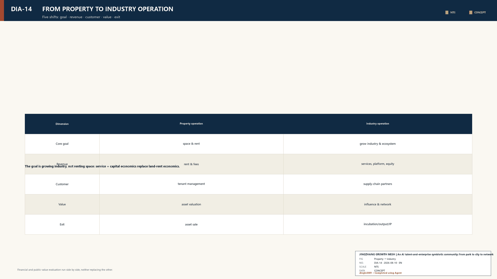

Performance review runs four layers: **engineering output** (completion, quality, safety, schedule), **use effect** (reachability, frequency, coverage, satisfaction), **comprehensive benefit** (public services, industry, employment, consumption, ecology, culture) and **sustainability** (maintenance funding, responsible owner, equipment life, complaint response, renewal capacity). Every project saves its pre-renovation baseline and sets collection frequency at inception; shortfalls distinguish design error, implementation deviation, operational shortfall and external change before deciding to supplement, adjust formats, change management or terminate low-value input.[source:MARS-COURSE] [depth:renewal_project_list]

### Annual Programs, RACI and International Conversion

| Cycle/subbrand | Program | RACI summary | Resources and milestone | Metric | Risk/exit |
|---|---|---|---|---|---|
| Q1 Scenario Challenge Season | Problem catalogue + compliance clinic | Operator A / demand owner R / specialists C / residents I | Problem, owner and data class | Eligible problems / rejection reasons | No owner or data rights -> do not launch |
| Q2 Validation Open Week | Three industrial tests + standards workshop | Test operator R / safety lead A | Site, insurance, equipment and e-stop drill | Reproducible sheets / incident closure | Major incident -> stop and review |
| Q3 Origin Developer Nights | Open-source clinic + residency mid-review | Community operator A / maintainers R / residents C | Courses, mentors and family support | Stable teams / license completeness | Disturbance or license dispute -> reduce/cancel |
| Q4 First-order Season | Validated outcomes + demand owners + services | First-order platform A / demand owner R / compliance C | Procurement boundary, disclosure and sessions | Procurement evaluations / conflict disclosure | No promised orders; undisclosed conflict -> remove |
| Annual Regional Developer Week | Cross-node exchange + rail-heritage curation | Program office A / each node R | Rights-cleared content, translation and visitor support | Effective exchanges / follow-up conversion | No partnership name without written confirmation |

### WP0-WP6 Procurable Delivery Packages

| Package | Object | Scope | Acceptance evidence | RACI | Stop condition |
|---|---|---|---|---|---|
| WP0 | Baseline and rights | Official polygons, survey, rights, structure/fire, utilities and asset clearance | Signed baseline pack + variance register | Owner A / specialists R | No permanent works before baseline |
| WP1 | Public base | Heritage axis, walking, accessibility, lighting, base network and opening rules | Continuous route + opening hours + maintenance owner | Owner A / public-realm operator R | Adjust if anonymous passage or maintenance funding is lost |
| WP2 | Validation facilities | Shared labs, compute adaptation, bounded robotics and standards court | Equipment log + reproducible sheet + safety drill | Test operator A/R | Stop on major incident or irreproducibility |
| WP3 | Talent-community services | Open-source room, clinics, residency, night school and family support | Course/mentor/license/complaint records | Community operator A/R | Reduce on disturbance, exclusion or rights dispute |
| WP4 | First-order and enterprise services | Demand catalogue, enterprise hall, compliance, sessions and exchange | Complete demand-validation-procurement-review chain | First-order platform A / demand owner R | Remove false demand or undisclosed conflict |
| WP5 | Identity and public programs | Wayfinding, three landmarks, seasonal programs and cross-node curation | Rights-cleared content + annual review + withdrawal route | Program office A/R | No partner name or mark without written permission |
| WP6 | Data and evaluation | NIS/EHS, public audit, appeal and quarterly health check | Metric dictionary + owner + public aggregate + decision record | Data lead R / council A | No baseline, no score; privilege breach forces read-only |

The packages translate what the fifteen projects do into who can procure them, what evidence accepts them and when work stops. WP0 comes first and cannot be bypassed by construction procurement. WP1 public base and WP2-WP5 operating products keep separate accounts. WP6 supplies evidence and decision support only; it never replaces decisions by owners, demand owners, professional signers or statutory authorities.

### 90-Day Minimum Credible Pilot

| Period | Action | Package | Acceptance evidence | Stop condition |
|---|---|---|---|---|
| D0–15 Baseline | Register boundaries, rights, demand and risks | WP0 | Signed baseline pack + variance register | Stop if any right or safety owner is unclear |
| D16–30 Protocol | Complete charter, D0-D3 classes, acceptance and appeal | WP1/WP6 | Charter + data protocol + named owners | Stop without human takeover or appeal |
| D31–60 Bounded tests | Run model safety, domestic compute and bounded robotics tests | WP2 | Reproducible sheets + event logs + safety sign-off | Stop on major incident, privilege breach or irreproducibility |
| D61–75 Public test | Open day, accessibility check, resident co-governance and first-order matching | WP3/WP4 | Use records + inclusion review + demand-test chain | Adjust on complaint cluster, exclusion or false demand |
| D76–90 Decision | Publish anonymous audit summary and continue-adjust-exit decision | WP5/WP6 | Audit summary + decision record + next-cycle responsibility | Do not expand without complete evidence or public-value gate |

The pilot treats executable rules, reproducible tests, human takeover, public appeal and failure exit—not permanent construction or recruitment counts—as acceptance objects. Day 90 produces only a continue, adjust or exit recommendation for the next cycle; it is not project approval, a funding arrangement or a government implementation decision.

The unit account uses a normalized sensitivity example rather than invented currency: revenue index equals utilization × unit price × operable quantity. Test a 20% utilization decline, 10% price decline and 20% equipment-hour decline. If any case crowds out public-service hours, maintenance reserve or safety staffing, expansion stops and the space mix or low-performing project is adjusted or exited. Parameter ranges are added only when ownership, operator and contract/procurement evidence exists.[assumption:A-UNIT-ECONOMICS-007]

### Pre-opening Project-Library Completeness Rehearsal

The project-library gate was run against **310 deterministic synthetic fixtures**: one complete fixture for each of the 34 declared health-check, scenario and project contracts, plus one negative fixture for every mandatory field removed. All **310/310** decisions matched the declared rule. A missing field returns the item to the problem or project library; a complete declaration can only move to professional and field review, never directly to opening or approval.[metric:synthetic_rehearsal_case_count] [depth:renewal_project_list]

| Contract set | Declared contracts | Required fields | Synthetic cases | Expected matches |
|---|---|---|---|---|
| Seven health checks | 7 | 6 | 49 | 49 |
| Scenario contracts | 12 | 7 | 96 | 96 |
| Project contracts | 15 | 10 | 165 | 165 |

The machine-readable result is `visual/assets/project_library_rehearsal.json`. Its `field_result` values remain null and `field_results_completed=0`: this rehearsal checks contract structure, not site performance, staffing, safety, budget, service quality, approval or public outcome.[metric:field_rehearsal_completed_count]

#### Portable method product: Growth Mesh Project-Gate Protocol

The proposal's six-Agent/four-human-gate method is also delivered as an executable offline product rather than prose alone: `growth-mesh-project-gate.json` defines roles, permissions, contract schemas, human gates, decision rules, falsification tests and truth boundaries; `growth-mesh-project-gate-fixtures.json` supplies positive and missing-field examples; `growth-mesh-project-gate-run.js` runs with Node.js and no package install; `growth-mesh-project-gate-receipt.json` records the actual run. Running `node visual/assets/growth-mesh-project-gate-run.js` reproduces **6/6 expected decisions**, including explicit rejection of a project without an operator, a scenario without a non-AI equivalent and a health check without a baseline. The protocol is a concept method ready for external rehearsal, not a planning standard, certification or deployed system; its licence remains COMMUNITY-DISPLAY-ONLY unless the contributor grants a separate written reuse licence.

## Reviewer Evidence Index

| Review dimension | Direct answer | Evidence entry |
|---|---|---|
| Brief alignment 20% | Direct mapping of three positions, five functions, two wings and agent.1-6 | Front matrix + five core figures |
| Originality 10% | Park-city-network, growth loop and no-check-no-renewal compiler | Originality and case-boundary table |
| AI planning innovation 15% | D0-D3, human release, appeal/takeover, evidence gates and scenario contracts | 12 scenario briefs + governance figure |
| Feasibility 20% | 7D check, 15 contracts, WP0-6, 90-day pilot and funding accounts | Project cards + mainline + funding matrix |
| Public interest 10% | Anonymous passage, accessibility, affordability, family support and tech opt-out | Public gates + resident scenarios |
| Risk and compliance 10% | Provisional limits, sign-off, stop rules, rights clearance and no invented score | Assumption/compliance matrices + stop conditions |
| Expression completeness 15% | Bilingual report, 54-page evidence-led A3, A0, HTML, GeoJSON and shared metrics | Manifest + bilingual contract + self-check |

Every claimed mechanism points to a document, figure, owner, limit and acceptance state; field results remain zero until actual operation.

### Reproducible proofing and rights surface

The machine-readable record `visual/assets/qa-proofing-record.json` checks all **124 PDF pages** across the four bilingual A0/A3 files for text blocks outside the page box, inventories every embedded font, compares bilingual page/kind/image sequences, checks all four HTML entries for remote active dependencies and missing image alternative text, and records contrast ratios for the core palette. The release condition is zero out-of-page text blocks, zero non-OFL embedded fonts, zero missing image alternatives and zero remote active dependencies. This is the contributor's repeatable self-check—not accessibility certification, legal clearance, engineering sign-off or assistive-technology user testing.

The rights ledger groups authored text/methods, official/public sources, provisional geometry, code-generated drawings, AI concept views, brand/basic geometry, fonts and finished layouts. Noto Sans SC subsets in the PDFs use the SIL Open Font License; no standalone font files are shipped. AI views remain removable experience images, while plans, sections, GeoJSON and contracts preserve the core evidence chain.[source:RIGHTS-NOTO-OFL]

## Metrics, Area Recalculation, and Compliance Matrix

Geometry is recalculated by projecting EPSG:4326 to EPSG:4548. Site, green, public-space and footprint values are internal consistency evidence only.[metric:site_area_sqm] [metric:green_ratio] [metric:public_space_ratio]

NIS-Lite monitors active teams, projects, service calls, scenario orders and capital/first-order links. EHS-Lite monitors local generation, cross-actor collaboration, test-to-procurement conversion, entity survival/growth, and public value/risk. Quarterly observation feeds one- and three-year evaluation windows; no Haidian score is invented without public cleared baselines.[metric:nis_monitoring_dimension_count] [metric:ehs_monitoring_dimension_count]

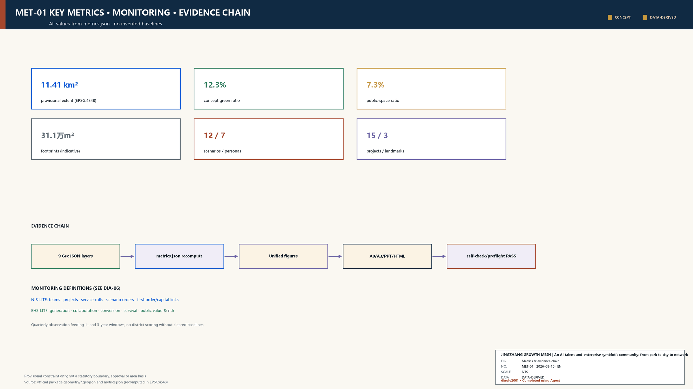

## Risk, Copyright, and Compliance

Risks include mistaking provisional geometry, AI views or conceptual projects for official decisions; excessive sensing; replacing professional approval with AI; excluding startups through rent; and rights violations. Controls are visible qualification, structured provenance, minimum data, human review, reversible trials, exit gates and rights clearance.[assumption:A-CONTROLS-001] [assumption:A-AI-VISUAL-006]

Five architectural and district-scale views are AI-generated and express experience only. This package was completed using **Agent** for research organization, structured data, figures, HTML, PPTX, PDF and consistency checks. Humans and professional teams retain final judgment. Public identity is `dingle2001` only.

The complete asset-rights ledger is `report/copyright_statement.md`. It covers text, data, GeoJSON, code-generated figures, logo, AI concept views, fonts, cases, standards, icons, templates and deliverables, with Git history, manifest SHA-256, source records and service terms as traceable evidence. Substantive bilingual equivalence checks six items: key claims, numbers/units, source tags, risk qualifiers, figure/file IDs, and placement order. Agent cross-check is complete; the contributor must still perform final human confirmation before merge, and machine validation does not replace that responsibility.

## References

1. Official Jing-Zhang announcement and Agent taskbook.
2. Public Chaoyang sources on headquarters-area transit, AI incubation and creator-community mechanisms.
3. Author-cleared Mars Plan theory and methods.
4. Primary institutional sources for the seven international cases.
5. Local snapshots of professional urban-design, regulatory-planning, land-use and design-depth standards.
