# 京张生长网｜从园到城再到网的AI人才与企业共生社区

> **核心主张：高校与龙头企业是锚点，开放街区是验证场，首单是企业生长门槛，公共回报是扩容条件。** 海淀不缺创新源头，真正需要补足的是一条可验收、可失败、可回退的城市接口：真实问题—限域验证—首单成交—独立生存—公共回流。

## 企业生长契约：从真实问题到公共回流的一条主线

本方案完整保留七维体检、12场景、15项目、国际案例和Agent治理，但只设置一条优先主线：**真实问题 → 限域验证 → 首单成交 → 独立生存 → 公共回流**。高校与龙头企业提供真实问题，开放街区承担限域验证，首单是企业生长的第一道门，复购／留存与非补贴单位账户检验独立生存，可复用的公共资产则是扩容条件。“独立生存”不是利润预测或承诺，只在真实试点后核验非补贴收入、直接成本、复购／留存和现金缺口。[assumption:A-PUBLIC-RETURN-010]

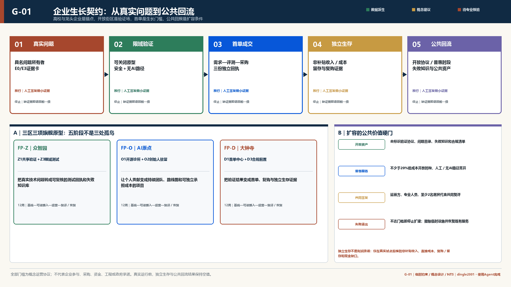

三份旗舰原型包让这条契约进入空间和运营，同时不删减其余项目库：FP-Z由Z1共享验证与Z3限域测试组成；FP-O由O1开源项目诊所与O2创始人驻留组成；FP-D由D1首单服务与D3合规前置组成。每份合同按“基线—可逆插入—运营记录—复评／恢复”的12周任务书推进，并具备问题所有者、专业安全签发、运营责任、公众非剥夺保障、验收证据和物理恢复路径。12周不是获批建设工期。[assumption:A-FLAGSHIP-PILOT-009]

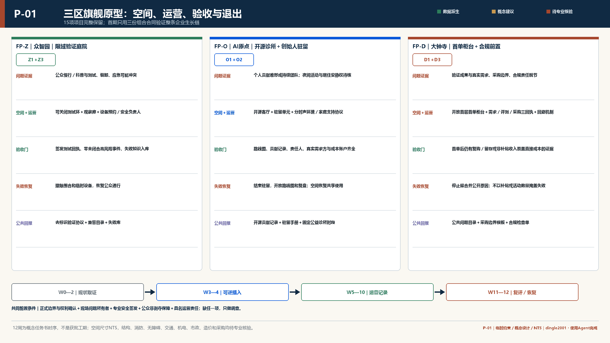

试点只有同时形成开放公共资产、保留不少于20%的低成本服务时段、保持人工／无AI路径常开、记录失败与退出，并由运营方、专业人员和至少2名居民代表共同复评，才可建议扩容。公共回报包括去标识验证协议、兼容／失败知识库、开源贡献路线图、公益诊所时段、公共问题目录、采购边界模板与合规清单。真实运行与人工签发前，成效字段保持空值。[depth:risk_missing_data]

### 后台方法：可审计的多智能体城市更新控制面

本方案不把AI出图等同于规划创新。原创价值在于建立一条六智能体证据编译链：把不完整的场地信号转成可复核的调查任务、空间比选、限域场景和运营合同，同时禁止智能体自我签发。A1管理来源与许可，A2编译七维城市体检，A3落位项目并暴露空间冲突，A4编排保留无AI等价路径的限域场景，A5把运营绑定到RACI、分账与验收，A6在无障碍、普惠或居民保障不足时拥有否决权。六者在同一决策记录中联动**产业、空间、交通、公共服务、文化与治理**，而不是形成六个彼此割裂的仪表盘。

它与常规产业园的区别是“不以入驻和出租率替代本地项目生成”，与常规智慧城市的区别是“不以传感器和综合评分替代可签发的项目合同”。原创性可以被证伪：缺基线仍生成工程、AI可以自签、试点剥夺既有服务、或对照节点没有净公共价值时，本方法即判定失败并退阶／退出。固定内核可在其他片区复用，但产业链、文化遗产、空间几何、法规和服务底线必须作为本地适配器重新输入。

证据接纳、试点放行、专业签发、继续／调整／退出四道门均由具名人员负责。公共利益门要求至少2名居民代表共同签发、至少20%普惠服务时段，并始终保留人工／无AI等价路径。评估采用“不剥夺服务”的分步对照：同类节点错峰启用，任何人不因参与对照而失去既有服务；比较项目形成时间、有效测试、首单、匿名通行、普惠时段、无障碍、投诉接管与分群差异。本机制是供专业深化的概念协议，不证明系统已经部署；真实基线和人工复核前不生成现场评分。[depth:risk_missing_data]

## 设计依据与资料清单

本方案以公开任务书、仓库资料包、专业标准和可复算临时空间数据为约束，以作者第一轮“火星计划”研究中的“园—城—网”“五级生长回路”和企业生命周期观察为理论母体。第一轮材料只提供原创方法，不复制朝阳区内部市场监管数据；关于阿里巴巴北京总部、孵化器和创作者社区的事实全部改用朝阳区公开一手资料重新核验。[source:OFFICIAL-ANNOUNCEMENT] [source:MARS-THEORY]

阿里样本不是照搬总部园区，更不是假定企业向外开放算力，而是提炼三点机制：第一，头部机构产生高密度人才与需求；第二，轨道、人才生活和公共界面决定人才是否从“通勤人口”变成街区使用者；第三，孵化、专业服务和创作者社区决定人才关系能否转成项目。京张的转译对象不是某一家企业，而是沿线高校、科研机构、头部企业和专业服务共同形成的多锚点网络。[source:CASE-ALIBABA-TRANSIT-TALENT] [source:CASE-CHAOYANG-AI-INCUBATOR] [source:CASE-CHAOYANG-AIGC-COMMUNITY]

当前 `SITE_BOUNDARY` 与三处 `KEY_AREA` 仍为仓库 provisional constraint（临时约束范围）。它们只支撑本次概念生成、拓扑检查和内部面积复算，不是官方红线、产权边界或精确地块。新增场景节点、建筑原型和联系线均是设计建议，不得据此作拆迁、控规、工程或投资判断。[data:geometry/site_boundary.geojson#SITE-001] [depth:risk_missing_data]

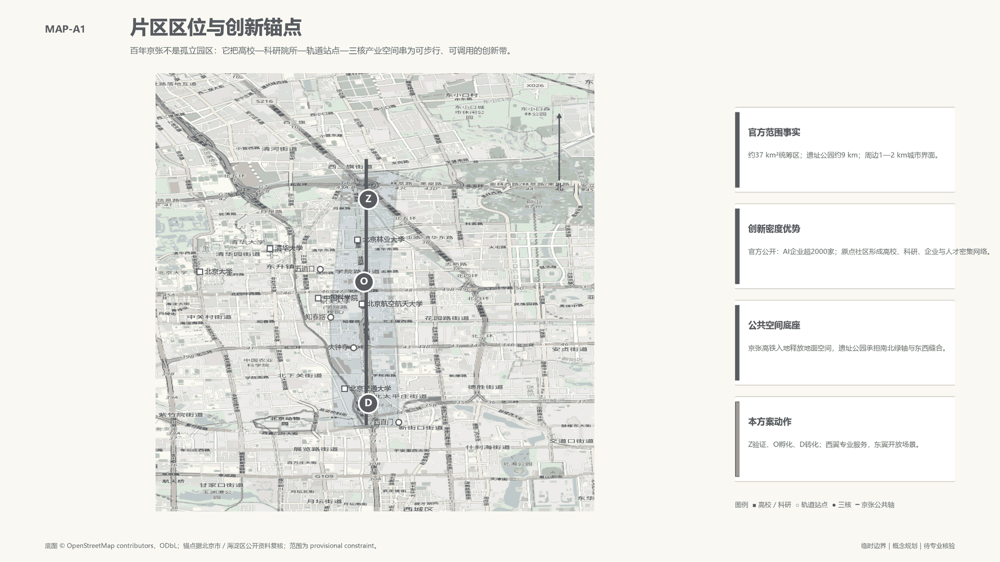

## 三层范围工作框架

统筹研究范围回答“海淀AI创新资源如何形成协作网络”；总体设计范围回答“京张遗址公园周边如何成为连续的创新生活街区”；三处重点区回答“验证、孵化、转化三种机制如何进入可感知空间”。三层并非三套方案，而是一条从战略到空间产品再到运营项目的证据链。[standard:PROJECT-OFFICIAL-ANNOUNCEMENT] [depth:three_level_scope_framework]

在统筹层，方案识别高校、科研、企业、服务和公共场景五类节点，强调跨机构合作与人才自由流动。在总体层，以京张遗址公园作为文化—慢行—创新展示轴，以两条横向服务翼补足东西向联系。在重点区层，每个核心都形成“空间结构＋建筑更新＋公共界面＋场景卡＋运营项目＋风险”的完整小方案。官方边界到位后，应先替换边界，再重做用地拓扑和全部派生指标，不得只换底图保留旧数值。[data:geometry/key_areas.geojson#PROV-KEY-001] [depth:metrics_recalculation]

## 城市体检诊断基础｜无体检不更新

本方案的第一步不是画方案，而是建立**七维度现状基线**。全过程固定为：**体检诊断→问题／资源清单→项目库→实施方案→运营前置→长效运营→同口径复评**。任何指标异常都不自动生成项目；只有影响对象、空间载体、根因、可用资源、责任主体、验收证据和停止条件能够说清，才进入项目库。由此把第一轮课堂的“发现问题—生成项目—实施更新—评价成效”转成可执行的街区规则。[source:MARS-COURSE] [depth:renewal_project_list]

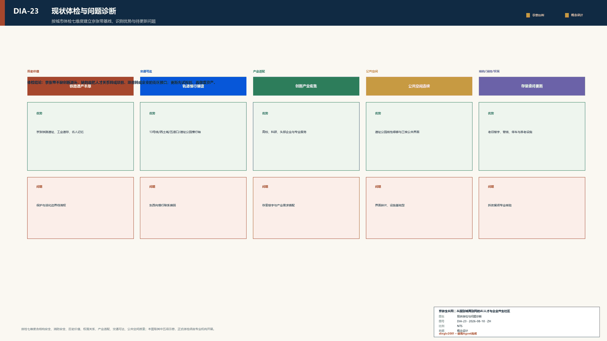

| 编号 | 体检维度 | 必须补齐的基线 | 当前可安全表达的诊断 | 放行／停止门 |
|---|---|---|---|---|
| HC-01 | 结构与设施安全 | 建筑测绘、结构鉴定、设备荷载、围护与管线台账 | 现有图层只能识别存量对象，不能证明承载验证设备或开放使用的安全条件。 | 无专业签发不得进入永久工程或设备进场 |
| HC-02 | 消防与运行安全 | 防火分区、疏散、消防水源、电气、危化与活动容量核验 | 实验、夜校、公众开放与机器人测试叠加，运行时段和人机分流尚无正式依据。 | 疏散、保险、急停或责任主体缺一项即不开场 |
| HC-03 | 遗产与场所价值 | 遗存普查、年代与价值评估、视廊、构件及档案清权 | 京张遗产轴具备强叙事潜力，但构件、年代、展示权与保护等级仍待逐项核验。 | 先调查、再设计；未清权内容不得上墙或数字发布 |
| HC-04 | 权属与治理条件 | 房地权属、租赁、经营许可、管理边界、利益相关者与诉求台账 | 临时边界不能替代产权和管理边界，跨节点公共开放、维护和收益责任尚未约定。 | 无具名统筹、实施、运营、验收主体不得入实施库 |
| HC-05 | 产业与空间适配 | 企业生命周期、空间需求、设备条件、服务缺口、可负担性与竞品调研 | 海淀创新源头强，验证—孵化—首单的街区接口弱；普通办公供给不能替代产业服务。 | 没有问题所有者、真实用户和运营任务书，不做建设性投入 |
| HC-06 | 交通可达与连续性 | 轨道出入口、步骑流线、过街、无障碍、装卸、应急与分时冲突调查 | 二期已开放并形成约9公里公共空间和鱼骨状慢行网络；跨园区／社区／轨道的实际路径、无障碍、装卸与测试冲突仍需现场验证。 | 匿名通行、无障碍和应急路线不得被测试或活动占用 |
| HC-07 | 公共空间、生态与包容 | 绿地水系、热舒适、雨洪、照明、停留、全龄使用、开放时间和维护调查 | 公园已进入公共运行阶段，能否叠加创新服务取决于舒适性、全龄权利、维护责任、低成本时段和技术退出权的现场基线。 | 公共服务不可与数据授权绑定，维护无来源不得扩张设施 |

本投稿严格分开“已知、未知、建议”：临时几何和概念比例可复算；结构、消防、权属、真实需求、交通容量、投资和审批在正式调查前均为未知。未知项不生成虚假分数，而是生成具名调查任务、签发要求和决策门。[assumption:A-CONTROLS-001]

### 问题清单、资源清单到项目库

六步转化为：①把症状落到对象、时段与受影响人群；②追到直接原因和制度根因；③盘点空间、组织、文化、生态与资金资源；④比较工程、政策、运营和治理方案；⑤明确项目边界、主体、资金属性、时序与验收证据；⑥按机会、储备、实施、年度计划四阶入库。权利、安全、公共价值或运营证据不足时，项目必须退阶，不得用“先建起来”替代论证。

### 官方任务与评分证据导航

| 评审维度 | 本方案直接回答 | 首要证据 |
|---|---|---|
| 任务契合 20% | 三大定位、五大功能、三区两翼逐项对位；agent.1—6证据导航 | 正文前置矩阵＋五张核心图 |
| 原创性 10% | 园—城—网、五级回路、无体检不更新编译链 | 原创机制与案例边界表 |
| AI规划创新 15% | D0—D3、人工放行、申诉接管、证据门和场景合同 | 12场景任务书＋治理图 |
| 实施可行 20% | 七维体检、15项目合同、WP0—6、90日试点、资金账户 | 项目卡＋实施主线＋资金矩阵 |
| 公共利益 10% | 匿名通行、无障碍、可负担、家庭服务、技术退出权 | 公共利益门＋居民场景 |
| 风险合规 10% | 临时边界、专业签发、停场、清权、无虚构评分 | 假设／合规矩阵＋每卡停止条件 |
| 表达完整 15% | 双语正文、54页证据型A3、A0、HTML、GeoJSON与同源指标 | manifest＋双语契约＋自检 |

该矩阵只是评审阅读导航，不是自评得分；正式结论仍由外部评审作出。[standard:PROJECT-AGENT-OPEN-CALL-TASKBOOK]

## 统筹研究范围产业与未来城市研究

### 从园到城再到网

“园”解决集中供地和标准化生产，“城”解决工作、生活和公共服务混合，“网”解决知识、订单、人才和资本跨节点流动。AI产业的轻资产、高流动和弱组织化特征，使单纯提供办公面积难以完成孵化。京张生长网因此不以“再建一个园区”为目标，而是建设一套城市级创新操作系统：算力和实验设施是底座，开放场景是界面，人才社群是连接器，专业服务和首单机制是转化器。[source:MARS-THEORY]

### 七个国际案例的可转译机制

| 案例 | 核心机制 | 对京张的转译 |
|---|---|---|
| Kendall Square | 大学科研与企业、公共空间共同构成高密度创新街区 | 转译为临近科研资源的步行网络与共享设施 |
| King's Cross Knowledge Quarter | 以文化、科研和公共机构构成跨组织知识网络 | 转译为京张遗产与AI社区共同策展 |
| one-north | 研发、孵化、居住和公共空间在同一城市片区混合 | 转译为三核差异化而非单一办公园区 |
| Paris-Saclay | 大学、实验室、企业与交通基础设施协同 | 转译为科研—验证—企业服务链 |
| MaRS | 以创业服务、资本和社区连接科研成果 | 转译为大钟寺首单和企业服务大厅 |
| High Tech Campus Eindhoven | 共享实验设施与开放创新社区降低企业协作成本 | 转译为众智园共享验证与标准共创 |
| 22@Barcelona | 工业片区通过混合功能、公共空间和创新网络渐进转型 | 转译为可逆改造和长期运营 |

案例只用于比较机制，不复制媒体图像，不把国外空间规模、投资或制度直接套用到海淀。[source:CASE-KENDALL] [source:CASE-KQ] [source:CASE-ONENORTH]

### 原创机制与案例转译边界

| 机制 | 来源属性 | 本方案作用 | 使用边界 |
|---|---|---|---|
| 园—城—网＋五级生长回路 | 作者第一轮原创方法 | 组织空间、社群、项目和企业的主框架 | 不以案例替代海淀事实 |
| 共享实验设施与开放创新 | High Tech Campus等案例机制 | 转译为众智园验证链 | 不复制规模、投资或组织承诺 |
| 知识机构跨组织协作 | Knowledge Quarter等案例机制 | 转译为铁路遗产共同策展 | 合作状态均为建议 |
| 首单—服务—资本转化 | MaRS及本地产业服务经验 | 转译为大钟寺城市商业界面 | 采购与融资须独立合规 |
| 三核差异化＋公共知识地标 | 本方案原创组合 | 验证—孵化—转化嵌入一条遗产轴 | 地标均为概念产品 |

### 区域协同建议矩阵

| 建议节点 | 建议角色 | 可能接口 | 证据／合作状态 | 启动门槛 | 风险与退出 |
|---|---|---|---|---|---|
| 北纬社区 | 社区需求、居民共创与生活场景接口 | 问题清单／居民评议／代际实验 | 建议，未核验合作 | 取得社区授权并完成伦理审查 | 投诉或弱势群体风险触发暂停 |
| 未来科学城 | 科研人才与中试能力互补节点 | 课题转介／设备目录／人才活动 | 建议，未核验合作 | 双方公开资源目录与联络人确认 | 资源不可用则退回本地验证 |
| 怀柔科学城 | 大科学装置成果与开发者转译节点 | 成果路演／开放课题／科普策展 | 建议，未核验合作 | 知识产权与保密边界签署 | 保密冲突即退出展示 |
| 北京经开区 | 工程化、制造与应用验证节点 | 样机转介／供应链／产业场景 | 建议，未核验合作 | 质量、安全和采购责任明确 | 验收责任不清则不转介 |
| 京津冀创新节点 | 跨区域人才、项目和首单交换 | 年度开发者周／问题榜单／服务互认 | 建议，未核验合作 | 每个节点单独清权与数据审查 | 禁止用品牌活动暗示行政合作 |

上述节点仅是面向统筹研究范围的协同建议，不代表任何机构已参与、认可、开放资源或形成行政合作。每个接口须在联络人、资源目录、知识产权、数据与责任边界逐项确认后才能进入试点。[depth:three_level_scope_framework]

### 项目区位与区域协同

京张生长网位于海淀京张铁路遗址走廊，北接中关村科学城与上地信息产业基地，南连大钟寺与西直门轨道枢纽，处于“三城一区”（中关村科学城、怀柔科学城、未来科学城、经开区）与中关村国家自主创新示范区的核心衔接点，并叠加元大都遗址风貌区的文化语境。区位红利不在“占地”，而在“接口”：沿线高校、科研机构、头部企业与专业服务共同形成的多锚点网络，是京张区别于单一产业园区的根本。[source:OFFICIAL-ANNOUNCEMENT]

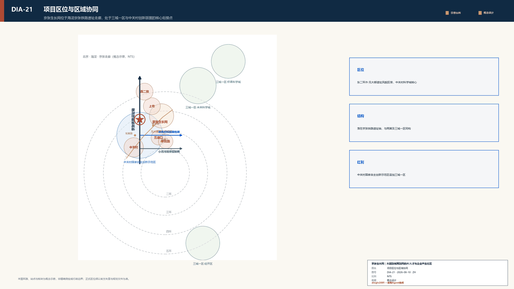

## 片区区位与问题证据

本方案不再把场地当作等待建设的空白公园。官方公开资料显示：2026年7月二期配套完工，北段约30.01公顷，并形成鱼骨状慢行网络；2026年8月二期开放，与一期连成约9公里公共空间。同月，京张沿线人工智能创新街区重点地区街区层面控规获批，范围约1668.2公顷、9个街区，形成“一带一轴、两心多点”的规划结构。[source:OFFICIAL-PARK-PHASE2-COMPLETE-20260713] [source:OFFICIAL-PARK-PHASE2-OPEN-20260806] [source:OFFICIAL-JINGZHANG-BLOCK-PLAN-APPROVED-20260812]

因此，本方案的对象从“重做公园”校正为**已运行公园上的产业接口**：校园与公园、企业与公共空间、轨道与服务、社区与夜间活动。已批“一带一轴、两心多点”是街区法定背景，“一轴三核两翼”只是落实任务书的产业服务与运营叠加层，不与法定结构竞争。由于正式获批图则、地块指标并未进入资料包，本方案不推导地块容积率、高度、红线、权属或工程结论。[assumption:A-CONTROLS-001]

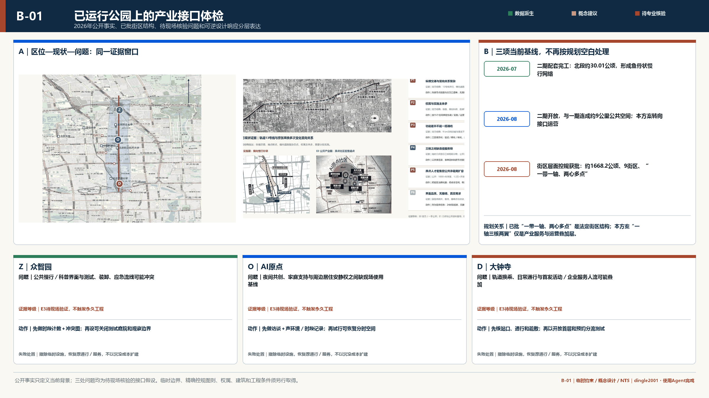

### 三区问题证据卡：已知事实、现场缺口、后果与可逆响应

| 重点区 | 公开已知 | E3现场问题 | 接口后果 | 响应／验证／恢复 |
|---|---|---|---|---|
| 众智园 | 公园已运行，慢行网络已形成 | 公共慢行／科普与测试、装卸、应急流线在什么时段、何处冲突？ | 无边界测试可能剥夺公共通行或形成安全冲突 | 先分时计数并绘制冲突图，再试行可关闭测试庭院和观察边界；失败则撤除临时设施、恢复通行 |
| AI原点 | 走廊已成为开放公共空间，并处于复合城市界面 | 夜间共创、家庭支持与居住安静权如何共存？ | 活动可能挤压居民权利，孵化可能退化为一次性活动 | 先访谈并记录时段／声环境，再试行可恢复分时空间；需求或公共保障不成立则结束驻留并恢复共享使用 |
| 大钟寺 | 南部界面叠加轨道、企业服务与日常公共使用 | 轨道换乘／日常通行与首发活动、企业服务流线在哪里叠加？ | “首单活动”可能阻碍通行，撮合过程可能不可审计 | 先核站口、通行和疏散，再试行开放首层柜台、预约分流与回避机制；失败则停止撮合、恢复日常通行 |

服务覆盖不使用经验圆圈代替现状。现场任务须先取得正式出入口、可通行路网、障碍／竖向联系和开放时段，再分别生成正常与活动／夜间条件下的5分钟、10分钟网络等时圈：众智园核验校园—设备可达，AI原点核验昼夜与家庭支持覆盖，大钟寺核验站口—首单柜台联系且不混淆换乘流与活动流。当前覆盖范围和服务人口保持空值。[assumption:A-CURRENT-BASELINE-008]

E0官方事实、E1临时推导、E3现场验证严格分开；E3不得触发永久工程、投资总额或成效声称。策略A“大规模物理重建”因公园已开放、街区控规已批而不采用；策略B“叠加科技展示层”因不能生成企业和公共价值而不采用；策略C“可逆的运营接口网络”可以调查、签发、停止和恢复，是本方案推荐方向。[assumption:A-CURRENT-BASELINE-008]

## 总体规划与项目落位

总体规划把15项项目全部归入企业生长契约：众智园把真实问题转成限域验证和签发证据，AI原点把验证贡献转成持续团队和可承担成本的项目，大钟寺把项目证据转成首单、复购与独立生存复评；中关村科技服务翼提供算力、数据、合规、知识产权和资本接口，小月河场景赋能翼提供蓝绿公共空间中的限域测试。六处横向缝合作为调查优先点，不直接声称为现状缺陷；精确入口、路径选择、服务覆盖、标高、流量和工程条件待现场与网络调查。

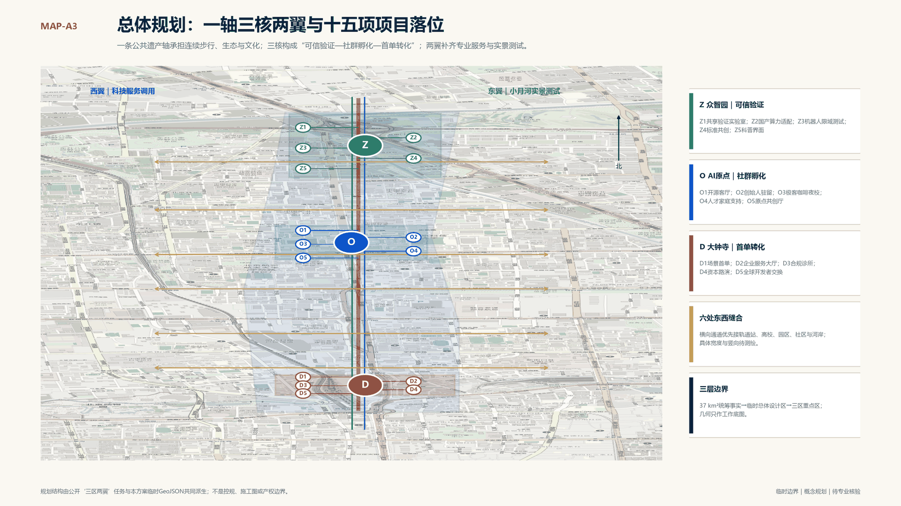

## 运营方案与项目合同

运营采用“统筹委员会—片区运营平台—三核运营单元—专业伙伴—用户与公众”五级责任链。共享验证实验室、开源客厅与夜校、首单与企业服务分别建立服务目录、公共责任、经营收入、成本账户、验收证据和停止门。每个项目合同至少包含问题证据、空间边界、建设与运营任务、主体RACI、工程量与费用、里程碑、验收证据、风险与停止门九类字段。

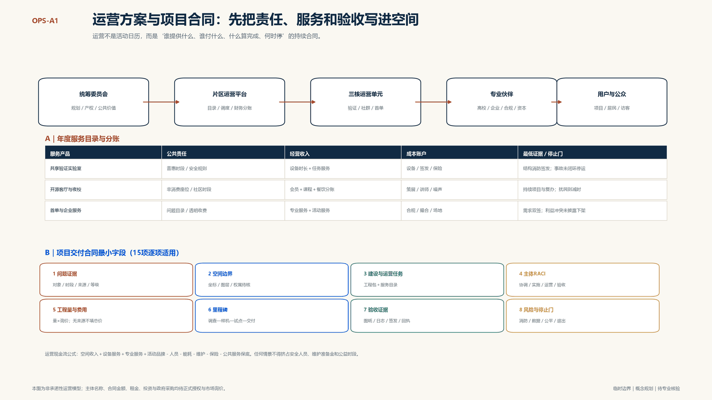

工程量与费用遵循“有量可询价，无量不报总投资”。公共空间、建筑更新、验证设备、运营启动和风险准备分别建立数量来源；正式估算须以法定边界、工程测量、专业设计、市场询价和批准的建设模式为前提。单位运营账户只定义收入、成本和压力测试公式，不虚构租金、投资或回收期。

## 总体设计范围城市更新与控规深度城市设计

总体空间结构为“一轴三核两翼”。一轴是京张遗址公园文化、慢行和创新展示轴；众智园是全栈验证核，AI原点社区是开源孵化核，大钟寺是商业转化核；中关村科技服务翼把政策、数据、算力、知识产权、合规和投融资做成可调用服务；小月河场景赋能翼把交通、环境、社区和公共空间问题做成可测试订单。[data:geometry/roads.geojson#ROAD-001] [depth:overall_spatial_structure]

2026年8月公开报道确认沿线重点地区街区层面控规已获批，形成“一带一轴、两心多点”。该结构是本方案必须服从的法定背景；“一轴三核两翼”只描述验证—孵化—转化的产业服务与运营关系，不新增法定中心、不替代地块控制，也不据此推导容积率、高度或道路红线。[source:OFFICIAL-JINGZHANG-BLOCK-PLAN-APPROVED-20260812] [assumption:A-CONTROLS-001]

本结构是面向官方任务书三大定位、五大功能与三区两翼的直接回应，不是另起炉灶的命名体系：

| 官方任务书要求 | 本方案落点 |
|---|---|
| 定位一：百年京张文化带 | 京张遗址公园遗产轴 + 三层文化叙事（铁路—中关村—AI） |
| 定位二：都市AI生活体验带 | 三核公共界面 + 12场景卡 + 代际AI生活实验室 |
| 定位三：AI融合创新带 | 五级生长回路 + 三区两翼协同 + 全球开发者节点 |
| 功能一：AI全栈自主创新体系 | 众智园共享验证链（模型安全评测—算力适配—机器人测试—标准共创） |
| 功能二：世界级AI创新生态 | 生态网络 + 企业服务 + 首单转化 + 国际交换 |
| 功能三：AI+场景赋能新范式 | 12场景卡 + 场景—空间—运营映射 + 小月河翼 |
| 功能四：智能化AI活力城市 | 城市智能体运营台 + 全龄友好 + 公共空间组件库 |
| 功能五：AI治理全球话语权 | 治理矩阵 + 数据分级 + 人工复核 + 标准共创 |

协同回路沿“验证（众智园）—孵化（AI原点社区）—转化（大钟寺）—服务（中关村翼）—场景（小月河翼）”闭环流动，使三大定位不互相割裂、五大功能不各自为政。[source:OFFICIAL-ANNOUNCEMENT] [depth:overall_spatial_structure]

### 设计策略：承 · 联 · 生 · 治

四条策略把京张的百年记忆、空间网络、生长回路与长效治理凝练成并行主线：**承**（继承京张铁路与工业遗产的历史底色）、**联**（以一轴三核两翼连接空间网络与场景订单）、**生**（沿五级生长回路推动人才关系转项目、项目转企业）、**治**（以运营前置、城市智能体与绩效复评守住长效运营）。四者并行不割裂——承是底色、联是骨架、生是动力、治是保障。[source:MARS-THEORY]

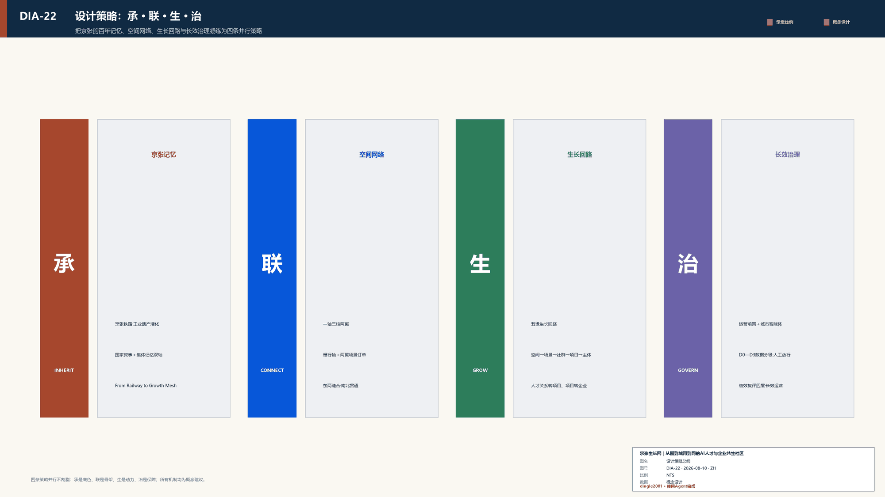

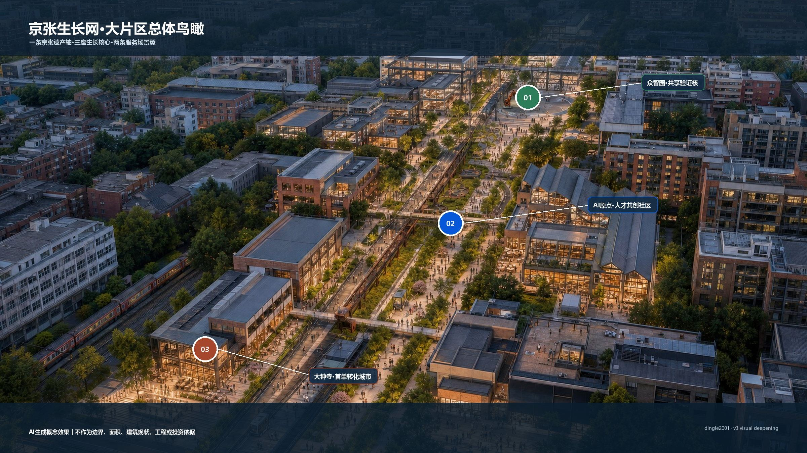

该鸟瞰以总体地图、慢行蓝绿网络和三处模块视景为视觉参照，将北部验证、中部人才共创、南部首单转化组织成一条连续的铁路遗产创新走廊。图像为AI生成概念效果，只表达空间气质与系统关系，不证明真实建筑、边界、尺度、工程条件或实施承诺。[assumption:A-AI-VISUAL-006]

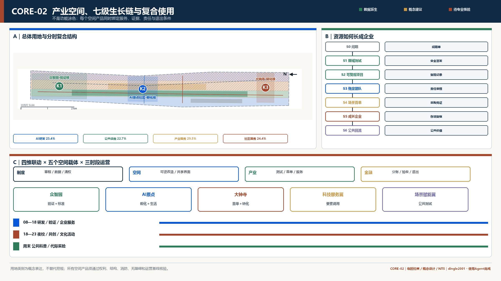

五级生长回路依次为：释放可负担、可短租、可逆改造的空间；植入带真实问题和数据边界的场景；以开源活动、夜校、项目诊所和导师网络形成高频弱关系；将连接转化为可验收项目；再通过首单、合规、资本和人才服务形成企业或长期组织。空间、制度、产业和金融必须同步推进，否则共享空间会变成普通办公，活动会变成一次性热闹，招商会重新压倒主体自生。[source:MARS-THEORY] [depth:phasing_implementation]

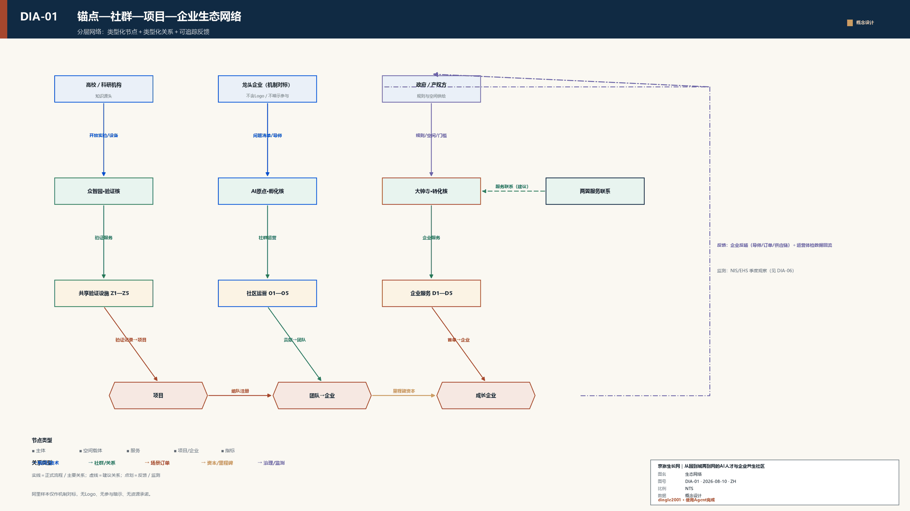

### 七级证据门：从“有资源”到“有公共回流”

| 证据门 | 最小证据 | 责任主体 | 继续／调整／退出规则 |
|---|---|---|---|
| G0 资源接口 | 公开资源目录、权利状态、联络责任人 | 项目办公室 | 缺任一项则不宣传为可调用资源 |
| G1 空间开放 | 结构／消防／无障碍／产权核验单 | 产权方＋专业签发人 | 未签发只可做非建设型活动 |
| G2 场景启动 | 问题所有者、D0—D3等级、保险与应急预案 | 场景负责人 | 数据或安全边界不清即不启动 |
| G3 社群形成 | 稳定团队、贡献许可、居民反馈 | 社群运营方 | 只有到访量不视为社群成果 |
| G4 项目生成 | 可复现实验单、验收人、失败复盘 | 测试运营方＋需求方 | 不可复现则退回验证 |
| G5 主体成长 | 首单／采购评估、合规签发、持续服务记录 | 企业服务平台 | 不得用路演或意向替代成交证据 |
| G6 公共回流 | 开放时段、可负担性、投诉闭环、知识回馈 | 协作委员会 | 公共价值下降则暂停扩张 |

这条链把“到访、活动、路演、意向”等弱证据与“可复现实验、专业签发、采购评估、持续服务、公共回流”等强证据分开。任何阶段都不能用宣传量替代结果量；G1—G6的证据缺失时，运营台只能保留上一个已验证状态，不能自动把项目标记为成长或复制。[depth:risk_missing_data]

用地方案继续采用完整拓扑分区，确保无重叠、无缺口。功能比例只描述本方案的临时概念图层，不构成法定用地调整。开发强度、建筑高度、道路红线、总建筑规模和市政容量因缺少正式控规与现状调查保持待确认。[data:geometry/land_use.geojson#LU-001] [standard:MNR-LAND-USE-CLASSIFICATION-GUIDE] [depth:development_intensity_controls]

## 重点区域详细设计

三处重点区图件采用“概念总平＋A—A'剖面＋运营门槛”同页证据结构。剖面参照房屋建筑与建筑制图的表达逻辑设置轴网、标高、开间／总尺寸链、剖切与投影线权、改造材料图例、疏散和无障碍提示；所有尺寸均为原型控制尺寸，统一标注“概念阶段／NTS／待专业核验”，不构成测绘、报审或施工图。[standard:GBT-50001-2017] [standard:GBT-50104-2010] [source:STD-GBT-50103-2010]

### 众智园：把“实验室能力”变成可共享的验证城市

众智园采用“共享实验脊＋限域测试环＋标准共创庭院＋公共科普边界”结构。内部高安全级测试与公众开放界面物理分区，团队通过预约进入共享实验室，测试结果形成可复现实验单，再进入标准工作坊和企业服务目录。建筑优先保留可适配的大跨空间，以透明、轻型、可拆卸构件增加观察廊和共享设备间；设备荷载、消防、防爆与电力条件须专项核验。[data:geometry/key_areas.geojson#PROV-KEY-001] [depth:three_key_area_detailed_design]

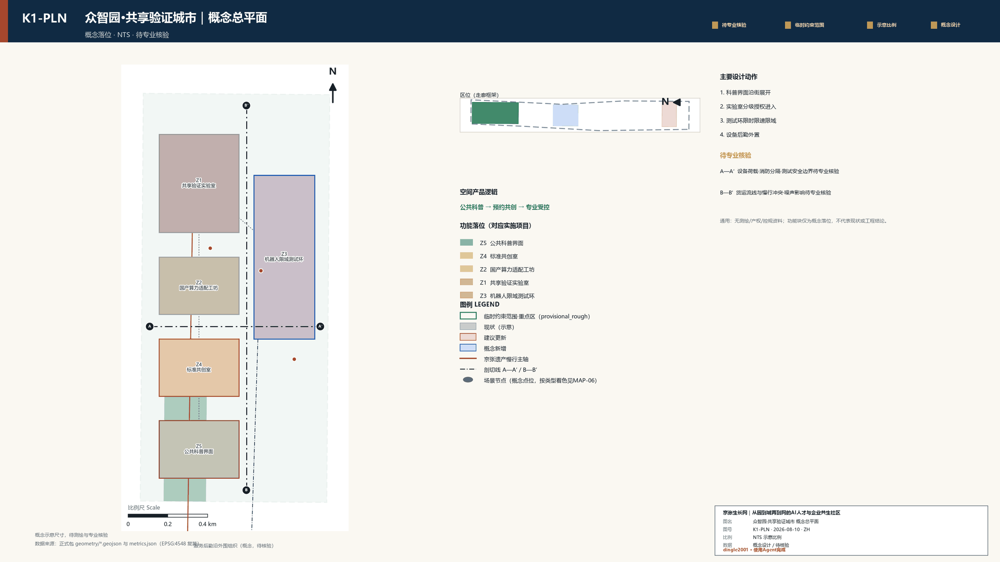

### AI原点社区：让人才从“同处一地”走向“共同做事”

原点社区采用“开源客厅＋项目诊所＋创始人驻留＋极客咖啡夜校＋人才家庭支持站”结构。白天服务科研转化、项目门诊和家庭支持，晚上转为开源协作、闪电演讲和社区夜校，周末承载公众体验和代际共创。空间采取小单元、短租约、共享客厅和开放首层，避免高租金、长期合同和封闭门禁把早期团队挡在外面。[data:geometry/key_areas.geojson#PROV-KEY-002] [source:MARS-THEORY]

代际AI生活实验室延续第一轮作业中的“技术反哺生活、生活场景帮助技术迭代”思路，但把基本权益放在创新之前：老人、儿童和普通居民不是免费测试对象；任何采集都需知情、最小化、可退出，并保留线下服务和人工兜底。

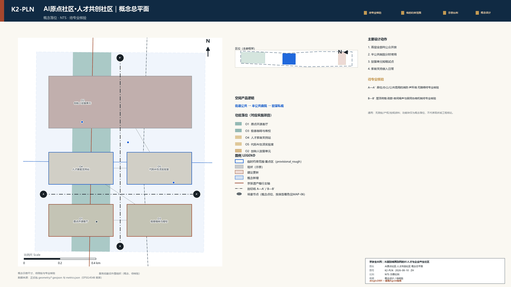

### 大钟寺：把项目成果转化为第一位客户和可持续企业

大钟寺采用“轨道门户＋企业服务街＋首单大厅＋合规诊所＋资本路演阶梯”结构。公共通道连接街道、轨道和内部庭院，首层设置可切换的展示、服务和会议单元，上层承载专业服务与成长企业。这里不以封闭总部大堂为原型，而以公开、可进入、可比较的城市商业界面降低早期企业寻找客户、法律、登记、知识产权和融资资源的成本。[data:geometry/key_areas.geojson#PROV-KEY-003] [depth:retain_renovate_demolish]

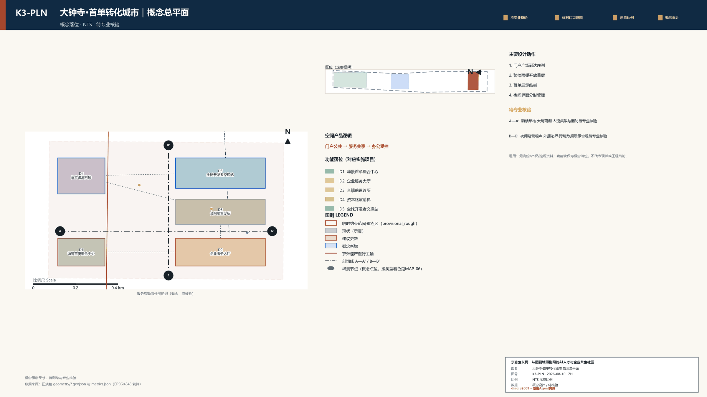

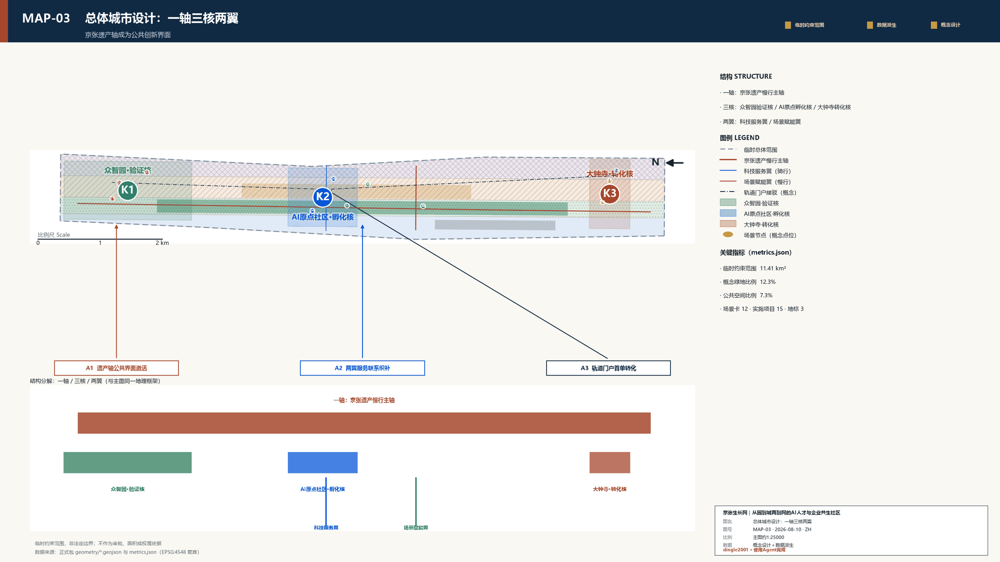

## AI 创新生态、人才画像与 AI+ 场景

| # | 人物画像 | 关键需求 |
|---|---|---|
| 1 | 科研人员 | 成果转化、兼职协作边界、可信测试 |
| 2 | 独立开发者 | 低成本工位、算力、开源同伴与第一位客户 |
| 3 | 创业团队 | 项目诊断、场景订单、人才与组织化支持 |
| 4 | 成长企业 | 验证设施、专业服务、扩张空间与资本连接 |
| 5 | 专业服务与投资机构 | 标准化入口、可信项目和里程碑证据 |
| 6 | 居民家庭 | 可理解、可选择、可退出的生活服务 |
| 7 | 运营治理人员 | 风险分级、日志审计、人工接管与动态体检 |

人物画像不用于精准营销，而用于确定空间门槛、服务入口、数据边界和人工兜底。团队的成长旅程为“科研/兴趣—开源协作—稳定团队—Demo—真实验证—首单—注册与成长—反哺社区”，每一阶段都对应一个空间、一类服务和一项可观察证据。

| ID | 场景卡 | 类型 | 空间 | 用户 | 治理边界 | 阶段成果 |
|---|---|---|---|---|---|---|
| SCN-01 | 模型安全评测沙盒 | 产业测试 | 众智园 | 科研人员、创业团队 | 隔离环境、分级授权、人工放行 | 完成可复现实验单与风险复盘 |
| SCN-02 | 国产算力适配工坊 | 产业测试 | 众智园 | 开发者、成长企业 | 不公开敏感参数，设备预约留痕 | 形成兼容性报告与迁移清单 |
| SCN-03 | 机器人限域测试环 | 产业测试 | 众智园 | 企业、运营人员 | 限时限速限域、远程接管、事故复盘 | 形成场景验证记录 |
| SCN-04 | 开源项目诊所 | 社群孵化 | AI原点社区 | 科研人员、独立开发者 | 许可、代码、产品、组织联合门诊 | 从贡献记录转为项目路线图 |
| SCN-05 | 创始人驻留计划 | 社群孵化 | AI原点社区 | 独立开发者、创业团队 | 短租空间、导师回避、成果自愿披露 | 形成稳定团队与阶段评审 |
| SCN-06 | AI人才夜校 | 社群孵化 | AI原点社区 | 科研人员、居民家庭 | 夜间开放、课程共创、无强制采集 | 形成跨机构弱关系网络 |
| SCN-07 | 代际AI生活实验室 | 人本服务 | AI原点社区 | 居民家庭、开发者 | 知情同意、儿童和老人特别保护 | 技术反哺生活、需求反馈产品 |
| SCN-08 | 无障碍多模态导览 | 人本服务 | 京张公共空间 | 居民、访客 | 本地优先、最小采集、随时关闭 | 提升公共空间可达性 |
| SCN-09 | 人才家庭支持站 | 人本服务 | AI原点社区 | 科研人员、居民家庭 | 托育转介、应急人工窗口、隐私隔离 | 降低人才日常生活摩擦 |
| SCN-10 | 场景首单撮合中心 | 商业转化 | 大钟寺 | 创业团队、成长企业 | 问题发布—验证—采购边界全过程留痕 | 完成首个客户或公共场景订单 |
| SCN-11 | 企业合规服务诊所 | 商业转化 | 大钟寺 | 企业、专业服务机构 | AI仅辅助，专业人员签发 | 降低登记、知识产权与经营试错 |
| SCN-12 | 城市智能体运营台 | 治理 | 大钟寺/两翼 | 运营治理人员、公众 | 权限分层、日志审计、申诉与人工接管 | 形成透明的运营体检闭环 |

三项产业测试均设置限域、责任主体、人工放行和复盘；所有公共服务场景遵循最小必要数据、明确告知、可关闭、可申诉和线下兜底。[metric:scenario_card_count] [metric:industry_test_scenario_count] [standard:PROJECT-AGENT-OPEN-CALL-TASKBOOK]

### 十二张可执行场景任务书

每个场景都保留无AI等价路径、具名人工放行、停止条件和验收证据。技术可以提高服务效率，但不得成为获得基本公共服务的唯一入口。

#### SCN-01｜模型安全评测沙盒
| 字段 | 可执行定义 |
|---|---|
| 问题 | 模型上线前缺独立、可复现的安全验证 |
| 服务旅程 | 登记—隔离测试—双人复核—签发—复盘 |
| 数据边界 | D3受限测试；最小授权 |
| 无AI等价路径 | 线下测试单与人工评审 |
| 人工放行 | 高风险结果由安全负责人放行 |
| 停止条件 | 越权、不可复现或隔离失效即封存 |
| 验收证据 | 版本、权限、测试和复盘记录完整 |
服务对象：科研与创业团队

#### SCN-02｜国产算力适配工坊
| 字段 | 可执行定义 |
|---|---|
| 问题 | 迁移适配成本高且参数敏感 |
| 服务旅程 | 预约—授权—适配—复核—迁移清单 |
| 数据边界 | D2商业敏感 |
| 无AI等价路径 | 人工兼容性测试与文档比对 |
| 人工放行 | 企业确认后发布报告 |
| 停止条件 | 泄露或迁移失败即撤回 |
| 验收证据 | 兼容性报告可复核且来源有授权 |
服务对象：开发者与成长企业

#### SCN-03｜机器人限域测试环
| 字段 | 可执行定义 |
|---|---|
| 问题 | 真实城市测试与公共安全冲突 |
| 服务旅程 | 开场检查—限域运行—接管—事件复盘 |
| 数据边界 | D2设备与事件 |
| 无AI等价路径 | 实体围挡、人工安全员和手动测试 |
| 人工放行 | 每日人工开场，异常远程接管 |
| 停止条件 | 越界或接管失效立即急停 |
| 验收证据 | 零未接管越界，事件全留痕 |
服务对象：机器人企业与公众

#### SCN-04｜开源项目诊所
| 字段 | 可执行定义 |
|---|---|
| 问题 | 贡献难转为稳定路线图 |
| 服务旅程 | 许可检查—问题诊断—路线图—责任认领 |
| 数据边界 | D1项目记录 |
| 无AI等价路径 | 面对面代码评审与纸面清单 |
| 人工放行 | 维护者确认许可与合并 |
| 停止条件 | 许可或归属争议即暂停 |
| 验收证据 | 每案形成许可、路线图和责任清单 |
服务对象：科研人员与独立开发者

#### SCN-05｜创始人驻留计划
| 字段 | 可执行定义 |
|---|---|
| 问题 | 短期组队缺空间和组织支持 |
| 服务旅程 | 申请—回避核验—驻留—阶段评审—退出 |
| 数据边界 | D2身份与项目 |
| 无AI等价路径 | 公开工位申请与人工面谈 |
| 人工放行 | 团队自愿披露，导师利益冲突回避 |
| 停止条件 | 歧视或利益冲突未处置即终止 |
| 验收证据 | 退出、删除与成果归属条款完整 |
服务对象：独立开发者与创业团队

#### SCN-06｜AI人才夜校
| 字段 | 可执行定义 |
|---|---|
| 问题 | 跨机构学习缺稳定夜间入口 |
| 服务旅程 | 共创选题—讲师审核—开课—反馈—复办 |
| 数据边界 | D0课程＋D1报名 |
| 无AI等价路径 | 现场报名、纸质材料和人工授课 |
| 人工放行 | 讲师审核内容，运营方控制时段 |
| 停止条件 | 不当内容或扰民则撤课调时 |
| 验收证据 | 课程有大纲、反馈和噪声处置记录 |
服务对象：人才与居民

#### SCN-07｜代际AI生活实验室
| 字段 | 可执行定义 |
|---|---|
| 问题 | 生活需求难进入研发且弱势群体易被动参与 |
| 服务旅程 | 需求共创—同意—小测—人工服务—退出删除 |
| 数据边界 | D2敏感个人 |
| 无AI等价路径 | 完全线下等价服务 |
| 人工放行 | 本人或监护同意＋伦理复核 |
| 停止条件 | 不适或撤回即退出并删除 |
| 验收证据 | 100%可撤回且基本服务不绑定参与 |
服务对象：居民家庭与开发者

#### SCN-08｜无障碍多模态导览
| 字段 | 可执行定义 |
|---|---|
| 问题 | 连续路线难理解、技术失效会放大障碍 |
| 服务旅程 | 专业核线—发布—按需辅助—投诉闭环 |
| 数据边界 | D0导览＋D2按需辅助 |
| 无AI等价路径 | 实体导视、人工问询和纸质地图 |
| 人工放行 | 无障碍专业人员校核后上线 |
| 停止条件 | 误导或中断即切换线下 |
| 验收证据 | 开放前专业核验，投诉可追踪 |
服务对象：居民与访客

#### SCN-09｜人才家庭支持站
| 字段 | 可执行定义 |
|---|---|
| 问题 | 托育养老等服务信息分散 |
| 服务旅程 | 需求登记—人工确认—授权转介—回执撤销 |
| 数据边界 | D2家庭服务 |
| 无AI等价路径 | 现场窗口与电话转介 |
| 人工放行 | 人工窗口确认每次转介 |
| 停止条件 | 错误转介或隐私串联即停接口 |
| 验收证据 | 每次有授权、回执与撤销机制 |
服务对象：科研人才与家庭

#### SCN-10｜场景首单撮合中心
| 字段 | 可执行定义 |
|---|---|
| 问题 | 技术与真实需求、采购判断脱节 |
| 服务旅程 | 问题发布—利益冲突声明—验证—双签—采购评估 |
| 数据边界 | D2采购与商业 |
| 无AI等价路径 | 公开问题会、人工评审和线下撮合 |
| 人工放行 | 需求方与合规人员双签 |
| 停止条件 | 虚假需求或利益冲突即下架 |
| 验收证据 | 问题、验证、采购三段证据完整 |
服务对象：创业团队与需求单位

#### SCN-11｜企业合规服务诊所
| 字段 | 可执行定义 |
|---|---|
| 问题 | AI建议可能越过专业资质边界 |
| 服务旅程 | 问题归类—依据检索—人工复核—签发或转介 |
| 数据边界 | D2企业合规 |
| 无AI等价路径 | 人工咨询和纸质清单 |
| 人工放行 | 具资质人员签发正式意见 |
| 停止条件 | 错误、超资质或依据失效拒绝签发 |
| 验收证据 | 正式意见全部可追溯至签发人 |
服务对象：企业与专业服务机构

#### SCN-12｜城市智能体运营台
| 字段 | 可执行定义 |
|---|---|
| 问题 | 跨场景调度缺审计、申诉和人工接管 |
| 服务旅程 | 只读观察—建议—人工授权—执行—审计—申诉 |
| 数据边界 | D1运营＋D2投诉 |
| 无AI等价路径 | 人工台账、电话和现场服务 |
| 人工放行 | 高风险动作逐项人工授权 |
| 停止条件 | 越权、漂移或申诉积压降级只读 |
| 验收证据 | 最小权限、全日志、抽检和接管可用 |
服务对象：运营人员与公众

### 十二场景技术治理矩阵

数据分级定义为D0公开／非个人、D1一般运营记录、D2个人或商业敏感、D3受限测试；成熟度M1为协议就绪、M2为限域试点、M3为可重复服务。下表指标均是建议试点门槛，不是现状成绩。

| ID | 数据等级 | 责任主体 | 成熟度 | 人工放行 | 失败模式／退出 | 验收指标与依赖 |
|---|---|---|---|---|---|---|
| SCN-01 | D3受限测试 | 安全评测负责人 | M2限域试点 | 双人复核后放行 | 越权访问／不可复现→立即封存 | 100%测试有版本、权限和复盘记录；依赖隔离环境 |
| SCN-02 | D2商业敏感 | 算力工坊负责人 | M2限域试点 | 企业确认后发布报告 | 参数泄露／迁移失败→撤回报告 | 兼容性报告可复核；依赖设备与数据授权 |
| SCN-03 | D2设备与事件 | 场地安全负责人 | M2限域试点 | 每日开场人工确认 | 失控／侵入公共线→急停并停场 | 零未接管越界；事件100%留痕；依赖保险与物理隔离 |
| SCN-04 | D1项目记录 | 开源诊所主理人 | M2周期服务 | 作者确认许可后公开 | 许可冲突／贡献归属争议→暂停合并 | 每案形成许可、路线图和责任清单 |
| SCN-05 | D2身份与项目 | 驻留运营负责人 | M1协议就绪 | 团队自愿披露 | 筛选歧视／导师利益冲突→回避或终止 | 签署回避、退出和数据删除条款 |
| SCN-06 | D0课程＋D1报名 | 夜校课程负责人 | M2周期服务 | 讲师审核后发布 | 不当内容／扰民→撤课或调整时段 | 课程有大纲、反馈和噪声处置记录 |
| SCN-07 | D2敏感个人 | 社区伦理负责人 | M1协议就绪 | 监护／本人同意＋人工服务 | 弱势群体不适／撤回同意→立即退出并删除 | 100%可撤回；不以参与换取基本服务 |
| SCN-08 | D0导览＋D2按需辅助 | 无障碍服务负责人 | M1协议就绪 | 人工校核路线后上线 | 误导／无障碍中断→切换线下导引 | 开放前完成专业核验；投诉闭环可追踪 |
| SCN-09 | D2家庭服务 | 社区服务负责人 | M1协议就绪 | 人工窗口确认转介 | 错误转介／隐私串联→中止接口 | 转介有授权、回执与撤销机制 |
| SCN-10 | D2采购与商业 | 首单平台负责人 | M1协议就绪 | 需求方与合规人员双签 | 虚假需求／利益冲突→下架并披露 | 问题、验证、采购三段证据完整 |
| SCN-11 | D2企业合规 | 持证专业负责人 | M2周期服务 | 专业人员签发 | AI建议错误／超资质→拒绝签发 | 100%正式意见可追溯至签发人 |
| SCN-12 | D1运营＋D2投诉 | 城市运营数据负责人 | M1协议就绪 | 高风险动作人工授权 | 越权／模型漂移／申诉积压→降级只读 | 最小权限、全日志、抽检、申诉与人工接管可用 |

**SCN-01最小协议：** 测试包进入隔离环境前登记模型、版本、数据权属、允许用途和责任人；执行与放行分离，双人复核；任何越权、不可复现或高风险输出立即封存，复盘通过后才可重启。**SCN-03最小协议：** 测试环以物理边界、时窗、速度上限、急停、远程接管、保险和现场安全员为开场条件；侵入公共慢行线或接管失效即停场。**SCN-12最小协议：** 默认只读和最小权限，高风险动作逐项人工授权；所有访问、建议、修改、申诉和接管写入不可静默删除的审计日志；发生越权、模型漂移或申诉积压时降级为只读人工台。[depth:risk_missing_data]

## 用地、建筑规模与拆改留方案

建筑策略不是在缺少现状测绘时直接判定“留改拆”，而是建立程序：先做结构、消防、历史价值、权属和适配性体检；可使用建筑优先保留；适合公共开放的首层和通道采用可逆改造；确需拆除或新建的部分必须回到正式控规、产权协商和专业审批。概念建筑原型包括大跨验证厂房、开源客厅、短期驻留单元、开放首层服务街和轻型展示构架。[data:geometry/buildings.geojson#BLDG-001] [depth:retain_renovate_demolish]

财务完整性不等于编造投资额。方案只建立单位运营账户：空间收入＝可运营面积×使用率×单位价格；设备服务收入＝可计费时长×利用率×单价；专业服务收入＝有效服务单量×平均服务费；活动与品牌收入按实际合同核算；股权收益不计入基础偿债现金流。公共空间、基础设施和普惠服务的成本必须单列，不能用高租金转嫁给早期团队。[assumption:A-UNIT-ECONOMICS-007]

## 交通、轨道、市政与公共服务设施

京张轴承担步行、骑行、文化导览和创新展示；两翼承担横向服务联系；三处轨道门户用连续首层、雨棚、无障碍和短距离接驳连接重点区。机器人测试线与公众慢行线不混用，采用限时、限速、限域、远程接管和事故复盘。道路图层只表达设计联系，不声称红线或交通组织已获批准。[data:geometry/roads.geojson#ROAD-004] [depth:traffic_rail_slow_parking]

新型基础设施遵循共享而非重复建设：众智园配置高安全级测试和设备环境，原点社区配置开发工具和低门槛协作网络，大钟寺配置企业服务和运营数据。电力、通信、能源、消防、市政管线和算力供给均待专项核验；不得将任何企业内部资源表述为区域公共资源。

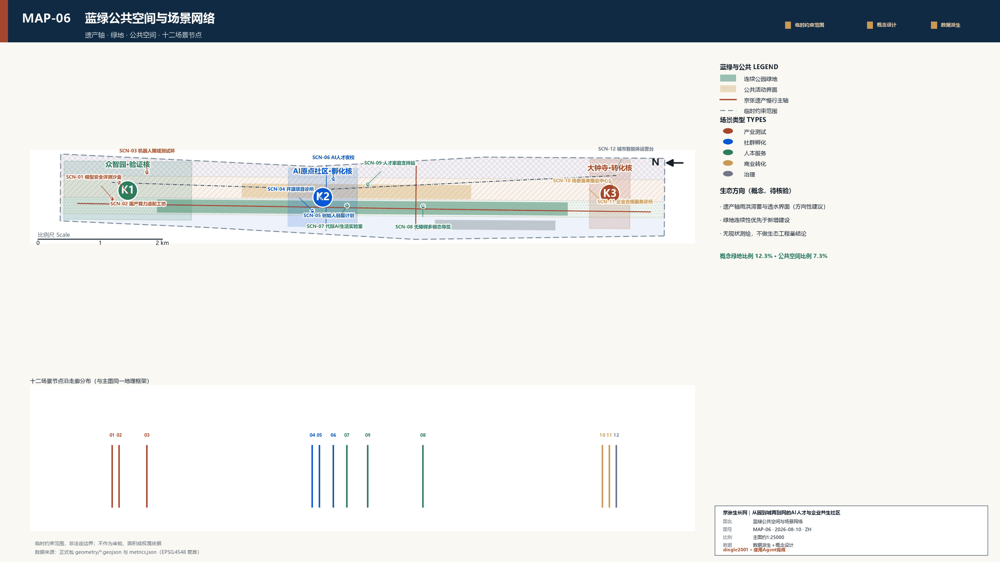

## 蓝绿空间、公共空间与城市风貌

遗址公园不是景观背景，而是创新生态的公共客厅。工作日午间承担短会和散步，傍晚承担跑步、夜校和闪电演讲，周末承担公众科普和场景体验。公共空间设备不得侵蚀匿名通行和自由停留；面向儿童、老人和残障人士的基础可达性优先于展示性“智慧设施”。[data:geometry/green_space.geojson#GREEN-001] [data:geometry/public_space.geojson#PUBLIC-001]

三个地标均为可更新的公共知识装置：京张开源里程碑沿铁路轨迹记录经核验的公共贡献；原点共创厅与全球开发者节点墙展示跨城市协作但不展示未经授权的个人信息；大钟寺企业生长年轮记录项目从验证到首单再到企业反哺的阶段。品牌以京张轨迹分化为节点网络，采用科技蓝、铁路锈红、生长绿和暖灰，不使用未授权企业标识。[metric:landmark_count]

### Logo、文化导视与活动子品牌层级

| 层级 | 名称 | 图形／应用规范 | 权利与使用边界 |
|---|---|---|---|
| 母品牌 | 京张生长网 | 京张轨迹分化为节点网；横式／竖式／单色版 | 不与企业Logo并列暗示合作 |
| 空间子品牌 | 众智验证／原点共创／大钟寺首单 | 绿／蓝／锈红；统一节点编号和方向箭头 | 只对应概念空间产品 |
| 文化导视 | 京张遗产线＋年代／构件／故事索引 | 暖灰底、铁路锈红线、二维码进入清权内容 | 历史内容须经遗产专家核验 |
| 荣誉展示 | 开源里程碑＋企业生长年轮 | 只展示授权、可验证、可撤回的贡献 | 不作广告、评级或投资推荐 |
| 年度活动子品牌 | 验证开放周／原点开发者夜／首单发布季 | 母品牌锁定＋活动色条＋年度编号 | 合作方商标逐次书面授权 |

Logo安全区建议不小于节点圆直径，印刷最小宽度25 mm、屏幕最小宽度120 px；小于该尺寸仅使用单色节点标。品牌图形由基础几何与本项目代码生成，不使用第三方图标库或企业标志。比例为应用建议，正式商标检索、注册与遗产标识审批仍待完成。

### 百年京张文化、中关村文化与AI新文化叙事

文化叙事不是给科技贴标签，而是讲清“这条走廊为什么在这里、为谁而生长”。京张生长网把三层文化叠成一条连续的成长母题：[source:MARS-COURSE]

1. **京张铁路层——“连接”的基因**：从1909年詹天佑主持的京张铁路，到2016年京张高铁入地后释放的遗址公园，这条线性空间承载的是中国人自主建造与攻坚的集体记忆。遗产轴不是背景墙，而是把“自主、攻关、连接”的铁路精神转译为AI自主创新带的公共叙事底图；历史构件、年代与故事按“先调查、后展示、清权后进入导视”的原则活化，不拆真建假、不过度商业化。[depth:culture_heritage]

2. **中关村创新文化层——“从电子一条街到科学城”的接力**：中关村从电子一条街、到科学城、再到全球AI创新生态，沉淀的是“敢闯、容错、开放、共享”的创新文化。方案把这种文化转译为开源客厅、项目诊所、标准共创与首单机制的空间载体，让创新从“个人英雄”走向“公共基础设施”。

3. **AI新文化层——“开源、开发者、全球节点”的第三代生长**：AI时代的文化基因是开源协作、开发者社区与全球知识网络。方案把开发者贡献记录、开源里程碑与全球节点墙做成可验证的公共文化装置，让“生长”本身成为可被看见、被记忆、被传承的文化。

三层叙事落到空间：京张遗产线提供“时间的纵轴”，两翼与三核提供“生活的横轴”，AI生长网提供“成长的网”。国际传播文案以“From Railway to Growth Mesh”为母题，强调自主、连接、生长三条主线，不虚构历史事实、不混淆文化标识与整体Logo系统。[depth:culture_heritage]

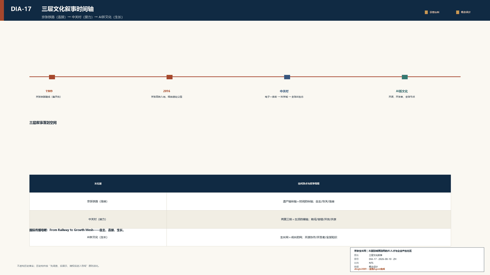

### 荣誉展示体系与公共空间组件库

荣誉展示体系只展示授权、可验证、可撤回的公共贡献，不作广告、评级或投资推荐：京张开源里程碑按铁路轨迹记录经核验的公共贡献；原点共创厅与全球开发者节点墙展示跨城市协作但不展示未经授权的个人信息；大钟寺企业生长年轮记录项目从验证到首单再到企业反哺的阶段。任何展示都遵循“授权—验证—展示—撤回”闭环。[metric:landmark_count]

公共空间组件库把遗址公园沿线的公共设施标准化为可组合、可更新的模块：慢行铺装与无障碍坡道（基础可达优先）、模块化座椅与遮阳构架（可逆安装）、铁路遗存展示柜与故事索引（清权后进入）、AI场景体验节点（明确数据边界与线下兜底）。组件库统一采用科技蓝、铁路锈红、生长绿与暖灰，所有尺寸均为概念建议、NTS、待专业核验，不构成工程或施工图结论。[depth:public_space_component]

### 公共利益量化门槛（建议）

| 议题 | 建议门槛 | 证据与状态 |
|---|---|---|
| 无障碍 | 所有开放试点路线在开放前完成专业核验；不通过则不上线 | 记录核验人、日期、问题和关闭状态 |
| 居民共治 | 协作委员会建议至少2个居民席位，涉及社区数据和弱势群体事项有暂停建议权 | 章程通过后方生效 |
| 投诉响应 | 建议2个工作日确认、10个工作日形成处理或延期说明 | 运营台公开匿名统计，不公开个人信息 |
| 弱势群体保护 | 不得以基本服务换取测试参与；未成年人须监护同意和独立退出 | 伦理负责人逐案抽查 |
| 可负担性 | 建议不少于20%的社区活动时段免费或低成本；价格及减免规则公开 | 运营合同确认前仅作门槛建议 |

## 更新项目清单、实施政策与分期计划

本方案把“更新项目清单”从一张静态表格升级为可被主管部门直接调度的城市更新全过程：以体检发现问题、以项目库承接任务、以运营前置约束设计、以资金平衡保障落地、以长效运营守住成果。以下机制均表述为“概念建议／参考方案”，供专业团队深化研究，不构成部门职责、审批判断或政府承诺。[source:MARS-COURSE]

### 城市更新实施总纲：六闭环与四个一体化

京张一带的本质是存量空间提质，不是增量开发。按《北京市城市更新条例》法定分类，本带同时涉及产业类（众智园、大钟寺存量楼宇与厂房）、公共空间类（京张遗址公园沿线线性公共空间）与区域综合类（三区两翼统筹）三类更新，须按“先体检、后谋划、再实施、终运营”的链条推进。[source:MARS-COURSE]

实施须闭合六个闭环，任一缺环都会成为后期瓶颈：**问题诊断闭环**（体检识别真问题）、**规划政策闭环**（项目落到规划与政策工具）、**主体协商闭环**（政府—产权人—企业—居民达成一致）、**资金平衡闭环**（投入有来源、退出有通道）、**建设运营闭环**（建成即运营、运营反哺设计）、**评价迭代闭环**（绩效复评推动下一轮调整）。[source:MARS-COURSE]

“四个一体化”把产业方向、公共任务与具体项目逐级传导：**市域一体化**（在海淀“三城一区”格局中定位京张的产业角色，看得远）；**区企一体化**（区级统筹与国企／专业运营主体协同，落得实）；**街区一体化**（在遗产轴与两翼尺度统筹多项目功能与运营，联得通）；**项目一体化**（把统筹要求落到每个项目的设计、建设与招商运营，做得精）。[source:MARS-COURSE]

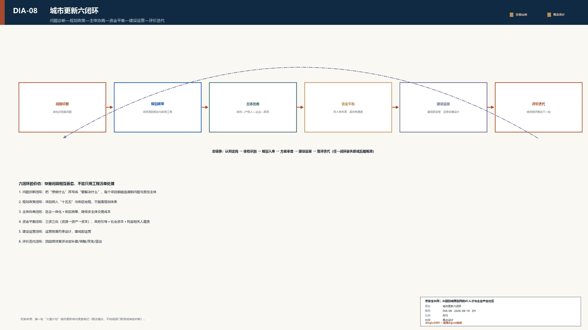

### 城市体检与两级项目库

北京项目推进主线为“项目库—更新计划—实施方案—联合审查—并联审批”。本方案建议建立两级项目库：**储备项目库**回答“为什么做、方向对不对”，**实施项目库**回答“谁统筹、边界在哪、钱从哪来、何时推进”。项目成熟度按“机会—储备—实施—年度计划”四阶推进，长期不具备实施条件的项目退回机会清单，避免“只进不出”。入库不是审批许可，也不等于自动获得资金支持。[source:MARS-COURSE]

体检是项目谋划的起点。针对京张带的存量对象，建议在结构安全、消防安全、历史价值、权属关系、产业适配、交通可达、公共空间质量七个维度建立基线，形成“问题—原因—资源”对应表；只有能追溯到明确问题与责任主体的内容才进入项目库。[data:geometry/site_boundary.geojson#SITE-001] [depth:renewal_project_list]

### 运营前置：先想清谁用、谁管、钱从哪来

运营前置不是提前招商，而是从立项起让未来使用者和运营者参与决策，贯穿**定位、设计、投资、建设、交付**五阶段：定位确定服务对象与项目角色；设计由运营需求反推层高、荷载、动线、机电与可变空间；投资用真实业态与租赁假设校验成本；建设控制影响开业维护的细节；交付前完成品牌、活动、人员、系统与试运营准备。[source:MARS-COURSE]

判断是否真正运营前置，用五项成果检验：①可验证的客群与需求研究；②业态技术条件已写入设计任务书；③分业态收入成本模型；④招商、内容与社群运营计划；⑤长期维护资金与责任落实。只有概念定位或品牌名单、没有这五项，仍属“建成后再找运营”。

每个重点区与每个实施项目都建议在立项时同步编制“运营任务书”，回答定位七步：**片区角色—辐射范围—客群分层—需求场景—竞争替代—价值主张—经营指标**。经营方式按项目属性在固定租金、保底分成、联营自营、公共服务采购四者中选择，并把测算结果反向写回设计任务书。[source:MARS-COURSE]

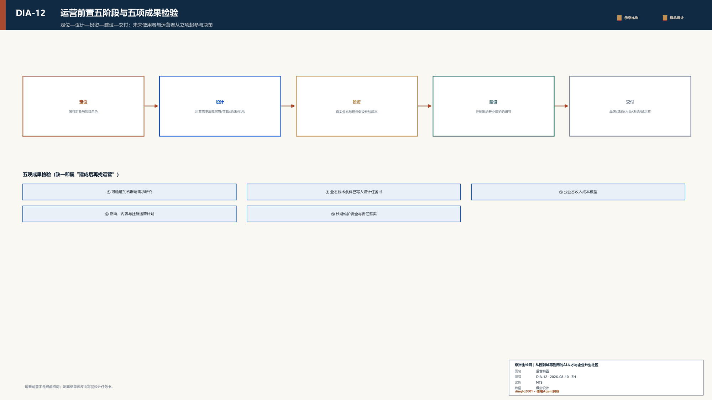

### 投融资与资金平衡

北京城市更新是减量发展下的存量物业改造升级，建设指标稀缺且价值最高；不能默认靠新增建筑面积覆盖成本，而要在存量资源盘活、公共投入、产业收益与长期运营中找平衡。资金按项目属性分层：**公益类**（公共空间、科普界面）以政府资金与公共投入为主；**准公益类**（共享验证、企业服务）可组合专项债、政策性贷款与财政引导；**经营类**（企业服务街、驻留单元、路演阶梯）走市场化融资与运营收益。[source:MARS-COURSE]

成熟运营资产可通过基础设施公募REITs实现退出与再投资，但REITs是成熟资产工具、不是前期融资；早期项目应依靠“政府资金引导＋社会资本参与＋利益相关人履责”的多元融资，并坚持“三资三化”：把资源转化为资产、把资产转化为资本。本方案不编造投资额、回收期或财政承诺，只建立单位运营账户口径与敏感性假设。[assumption:A-UNIT-ECONOMICS-007]

### 预算编制与资金平衡框架

预算不是先编数字再找钱，而是把运营前置的测算、项目库的边界和实施方案的清单串成一张可审查的资金平衡表。本方案不虚构投资额、租金或回收期，只给出科目结构、变量与敏感性，具体数值须由专业团队依据官方资产、权属、市场评估与授权决策填入。[assumption:A-UNIT-ECONOMICS-007]

**收入侧科目**（按项目属性归类）：①政府资金与公共投入（公共空间、科普界面、社区服务）；②专项债与政策性贷款（准公益设施、共享验证）；③社会资本与运营收益（经营类空间、产业服务）；④基金与REITs退出（成熟运营资产）。**支出侧科目**：结构加固与消防、管线与机电、公共空间、产业服务设施、运营筹备与首年运营、合规与数据安全。[source:MARS-COURSE]

**资金平衡口径**：单个项目按“总收入（资金渠道×金额）≥ 总支出（建设＋运营＋融资成本＋公共义务）”建立账户；公益类允许政策性缺口（由公共投入覆盖），经营类必须自身平衡，准公益类按“公共补贴＋经营收益”组合平衡。跨项目在街区尺度“肥瘦搭配”，以经营项目收益反哺公益项目维护，但反哺机制须事先约定、可核算、可追责。[source:MARS-COURSE]

**单位运营账户与敏感性**：对经营类空间建立“租金/服务收入 − 运营成本 − 维护计提 − 公共义务”的单位账户，敏感性变量包括出租率、单位租金、运营成本率、产业服务转化率与维护计提比例。任何测算只用于比选方案与判断可行性，不对外承诺回报。[assumption:A-UNIT-ECONOMICS-007]

**分项目资金渠道矩阵**（概念建议）：

| 项目 | 资金类型 | 建议资金渠道 | 建议运营主体 | 建议时序 |
|---|---|---|---|---|
| Z1 共享验证实验室 | 准公益 | 财政引导＋专项债＋服务收入 | 专业测试运营方＋高校 | 0—1年试点 |
| Z2 国产算力适配工坊 | 准公益 | 政策贷款＋算力服务商投入＋任务服务费 | 算力服务商＋开源社区 | 0—1年试点 |
| Z3 机器人限域测试环 | 准公益 | 财政引导＋场地运营＋测试服务费 | 场地运营方＋安全责任主体 | 0—1年试点 |
| Z4 标准共创室 | 公益 | 公共投入＋行业协会会费 | 行业协会＋专业机构 | 0—1年试点 |
| Z5 公共科普界面 | 公益 | 公共投入＋科普机构资金 | 园区运营方＋科普机构 | 0—1年试点 |
| O1 原点开源客厅 | 准公益 | 公共补贴＋社区运营＋赞助 | 社区运营方＋开源维护者 | 1—3年 |
| O2 创始人驻留单元 | 经营 | 运营收益＋孵化基金 | 专业孵化运营方 | 1—3年 |
| O3 极客咖啡与夜校 | 经营 | 运营收益＋课程收入 | 社区商业＋课程策展 | 1—3年 |
| O4 人才家庭支持站 | 公益 | 公共投入＋社区服务资金 | 社区服务机构 | 1—3年 |
| O5 代际AI生活实验室 | 准公益 | 公共补贴＋技术团队投入 | 社区＋技术团队 | 1—3年 |
| D1 场景首单中心 | 准公益 | 运营收益＋首单服务费 | 产业运营平台 | 1—3年 |
| D2 企业服务大厅 | 经营 | 服务收费＋运营收益 | 专业服务联合体 | 1—3年 |
| D3 合规前置诊所 | 经营 | 服务收费 | 登记、知识产权、法律等专业人员 | 1—3年 |
| D4 资本路演阶梯 | 经营 | 运营收益＋活动服务费 | 运营方＋投资机构 | 1—3年 |
| D5 全球开发者交换站 | 准公益 | 公共补贴＋合作伙伴投入 | 社区运营方＋合作伙伴 | 3—5年 |

**预算编制与审批流程**：预算与项目库、实施方案同源——储备项目只编框架性成本区间（用于判断可行性）；实施项目在“一图两表六清单”中编资金平衡表，随实施方案进入联合审查；涉及政府资金或公共投入的科目，按法定预算与采购程序办理，并联审批不替代立项、预算、采购、规划许可、施工许可与消防审验。项目投入运行后按绩效复评四层反馈，未达预期者调整预算科目或退出。[source:MARS-COURSE] [depth:renewal_project_list]

### 实施方案框架：一图两表六清单

单个实施项目的实施方案建议按“**一图、两表、六清单**”组织：一张实施总图（更新范围、方式、时序）；项目分期表与资金平衡表；问题、资源、权属、政策、审批、风险六张清单。每个项目用“问题—原因—措施—产出—结果—指标”六栏表写清目标，规划指标落到具体地块与建筑，投资测算对应工程量，经营收入对应可运营空间，居民承诺对应责任单位。以下项目清单即按此框架给出建议颗粒度；正式实施方案须在专业团队与产权方介入后编制。[source:MARS-COURSE] [depth:renewal_project_list]

| ID | 项目 | 空间 | 对象 | 建议运营主体 | 依赖条件 | 近期动作 | 主要风险 |
|---|---|---|---|---|---|---|---|
| Z1 | 共享验证实验室 | 众智园 | 科研人员、创业团队 | 专业测试运营方＋高校实验室 | 结构、消防、设备荷载核验 | 开放设备目录与预约规则 | 安全事故与设备闲置 |
| Z2 | 国产算力适配工坊 | 众智园 | 开发者、成长企业 | 算力服务商＋开源社区 | 算力来源与数据安全审查 | 发布首批适配任务 | 资源承诺被误读 |
| Z3 | 机器人限域测试环 | 众智园 | 机器人企业、公众 | 场地运营方＋安全责任主体 | 交通、保险、远程接管方案 | 划定低速测试时窗与物理边界 | 人机混行风险 |
| Z4 | 标准共创室 | 众智园 | 企业、标准机构 | 行业协会＋专业机构 | 议题和知识产权边界 | 形成季度标准工作坊 | 会议化、无成果 |
| Z5 | 公共科普界面 | 众智园 | 居民、访客 | 园区运营方＋科普机构 | 参观与测试区物理分隔 | 试办周末开放实验日 | 商业宣传替代科普 |
| O1 | 原点开源客厅 | AI原点社区 | 科研人员、开发者 | 社区运营方＋开源维护者 | 存量空间和消防核验 | 每周项目诊所试运行 | 活动热闹但项目弱 |
| O2 | 创始人驻留单元 | AI原点社区 | 独立开发者、创业团队 | 专业孵化运营方 | 租赁、居住与办公合规 | 小规模短期驻留 | 租金与筛选排斥 |
| O3 | 极客咖啡与夜校 | AI原点社区 | 人才、居民 | 社区商业＋课程策展团队 | 噪声、营业和消费权益 | 闪电演讲与夜校 | 扰民与过度消费化 |
| O4 | 人才家庭支持站 | AI原点社区 | 青年家庭、老人、儿童 | 社区服务机构 | 托育、养老和隐私合规 | 需求登记与转介 | 责任边界不清 |
| O5 | 代际AI生活实验室 | AI原点社区 | 居民、开发者 | 社区＋技术团队 | 伦理、知情同意和人工兜底 | 小范围共创测试 | 弱势群体被动试验 |
| D1 | 场景首单中心 | 大钟寺 | 创业团队、需求单位 | 产业运营平台 | 采购和场景开放规则 | 发布问题清单 | 承诺订单或利益冲突 |
| D2 | 企业服务大厅 | 大钟寺 | 初创与成长企业 | 专业服务联合体 | 服务资质和收费透明 | 服务目录与预约台 | 重复建设、低使用率 |
| D3 | 合规前置诊所 | 大钟寺 | 企业、运营人员 | 登记、知识产权、法律等专业人员 | AI建议必须人工签发 | 开业前合规清单 | AI替代专业判断 |
| D4 | 资本路演阶梯 | 大钟寺 | 项目团队、投资机构 | 运营方＋投资机构 | 信息披露与适当性管理 | 里程碑路演 | 融资宣传失真 |
| D5 | 全球开发者交换站 | 大钟寺 | 开发者、国际机构 | 社区运营方＋合作伙伴 | 版权、商标和跨境数据边界 | 线上线下节点互联 | 一次性会展化 |

### 十五项实施项目交付合同

每张项目卡把问题、原因、措施、产出、结果和指标逐项对齐，再补运营任务、时序、资金属性与停止门。正式工程量和授权评估到位前，金额保持空白，不以假数字替代可实施性。

#### Z1｜共享验证实验室
| 字段 | 交付定义 |
|---|---|
| 问题 | 中小团队缺乏可信测试设施 |
| 原因 | 设备门槛高、共享规则与责任链缺失 |
| 措施 | 先核验大跨空间，再以预约、分级权限和专业签发组织共享设备 |
| 产出 | 设备目录、预约协议、实验单、事件日志 |
| 结果 | 验证从口头背书转为可复现证据 |
| 指标 | 设备利用率、可复现实验占比、重大事件 |
| 运营任务书 | 专业测试运营方；按设备时长与任务服务核算 |
| 时序 | 0—1年协议与小规模试点 |
| 资金属性 | 准公益：公共引导＋设备服务；金额待测算 |
| 停止门 | 结构／消防／荷载未签发即不进场 |

#### Z2｜国产算力适配工坊
| 字段 | 交付定义 |
|---|---|
| 问题 | 团队迁移国产算力试错成本高 |
| 原因 | 软硬件兼容信息分散且商业参数敏感 |
| 措施 | 用授权数据和隔离环境完成适配、迁移与复盘 |
| 产出 | 兼容性报告、迁移清单、问题知识库 |
| 结果 | 降低重复试错并形成可复用适配路径 |
| 指标 | 报告复核率、迁移闭环数、泄露事件 |
| 运营任务书 | 算力服务商＋开源社区；任务费与设备服务 |
| 时序 | 0—1年首批任务 |
| 资金属性 | 准公益：服务商投入＋政策工具＋任务费 |
| 停止门 | 来源、授权或隔离条件不明即暂停 |

#### Z3｜机器人限域测试环
| 字段 | 交付定义 |
|---|---|
| 问题 | 机器人缺少贴近城市的低风险测试环境 |
| 原因 | 公共慢行与测试流线冲突，保险和接管责任不清 |
| 措施 | 物理围挡、分时、限速、急停、远程接管和现场安全员 |
| 产出 | 测试时窗图、开场清单、事件与复盘记录 |
| 结果 | 形成可监管的城市应用前验证 |
| 指标 | 未接管越界、急停响应、事件闭环 |
| 运营任务书 | 场地运营方＋安全责任主体；按测试时窗计费 |
| 时序 | 0—1年封闭测试 |
| 资金属性 | 准公益：场地投入＋测试服务费 |
| 停止门 | 侵入公共线或接管失效立即停场 |

#### Z4｜标准共创室
| 字段 | 交付定义 |
|---|---|
| 问题 | 测试结果难沉淀为跨企业共识 |
| 原因 | 议题、知识产权和成果责任不清 |
| 措施 | 以问题单—证据包—工作坊—公开摘要组织标准共创 |
| 产出 | 议题库、会议纪要、证据摘要、建议稿 |
| 结果 | 把单次测试转为可共享规则 |
| 指标 | 形成建议稿数、采纳反馈、权利争议 |
| 运营任务书 | 行业协会＋专业机构；会费与任务采购 |
| 时序 | 0—1年季度工作坊 |
| 资金属性 | 公益：公共支持＋协会资源 |
| 停止门 | 无问题所有者或IP边界不明不开题 |

#### Z5｜公共科普界面
| 字段 | 交付定义 |
|---|---|
| 问题 | 高安全验证与公众理解之间缺少接口 |
| 原因 | 测试空间封闭、科普容易变成营销 |
| 措施 | 设置观察廊、周末开放日和非敏感成果解释 |
| 产出 | 开放规则、科普脚本、风险隔离与反馈 |
| 结果 | 提高AI产业的可理解性和公共回流 |
| 指标 | 开放时长、无障碍覆盖、投诉闭环 |
| 运营任务书 | 园区运营方＋科普机构；公共服务采购 |
| 时序 | 0—1年周末试办 |
| 资金属性 | 公益：公共投入＋科普资源 |
| 停止门 | 隔离、讲解责任或清权未完成不开放 |

#### O1｜原点开源客厅
| 字段 | 交付定义 |
|---|---|
| 问题 | 开发者有活动但缺稳定项目协作 |
| 原因 | 贡献许可、项目诊断和持续主理人不足 |
| 措施 | 以每周诊所、维护者驻场和贡献记录组织协作 |
| 产出 | 许可清单、路线图、责任分工、复盘 |
| 结果 | 从到访关系形成可持续项目 |
| 指标 | 持续团队数、合并贡献、争议闭环 |
| 运营任务书 | 社区运营方＋开源维护者；会员与公共补贴 |
| 时序 | 0—1年先运行后改造 |
| 资金属性 | 准公益：公共补贴＋赞助＋服务 |
| 停止门 | 许可争议或只有客流没有项目即调整 |

#### O2｜创始人驻留单元
| 字段 | 交付定义 |
|---|---|
| 问题 | 早期团队缺低成本短周期工作生活支撑 |
| 原因 | 长租、高押金与办公居住边界形成排斥 |
| 措施 | 小批短驻、明确用途、导师回避和阶段评审 |
| 产出 | 驻留协议、回避记录、里程碑和退出单 |
| 结果 | 降低团队形成期的生活与空间摩擦 |
| 指标 | 驻留完成率、团队稳定率、退出争议 |
| 运营任务书 | 专业孵化运营方；短租与孵化服务 |
| 时序 | 1—3年小批滚动 |
| 资金属性 | 经营：运营收入＋孵化基金 |
| 停止门 | 用途、消防或公平筛选不清即不入住 |

#### O3｜极客咖啡与夜校
| 字段 | 交付定义 |
|---|---|
| 问题 | 科研人才与社区缺低门槛夜间交流 |
| 原因 | 日间办公化、夜间内容弱且可能扰民 |
| 措施 | 分时空间、课程共创、噪声边界和非消费座位 |
| 产出 | 课程表、空间转换清单、噪声与反馈记录 |
| 结果 | 形成跨机构弱关系和持续学习网络 |
| 指标 | 课程复办率、非消费时段、扰民投诉 |
| 运营任务书 | 社区商业＋课程策展；餐饮与课程收入分账 |
| 时序 | 0—1年闪电演讲试点 |
| 资金属性 | 经营：运营收入＋课程服务 |
| 停止门 | 扰民或消费挤占公益时段即减时调整 |

#### O4｜人才家庭支持站
| 字段 | 交付定义 |
|---|---|
| 问题 | 人才家庭托育、养老与应急转介成本高 |
| 原因 | 服务信息碎片、责任边界和隐私隔离不足 |
| 措施 | 建立人工窗口、授权转介和回执撤销机制 |
| 产出 | 服务目录、转介单、回执、投诉闭环 |
| 结果 | 减少人才留下来的日常生活摩擦 |
| 指标 | 有效转介、响应时长、撤销与投诉 |
| 运营任务书 | 社区服务机构；公共服务采购 |
| 时序 | 0—1年需求登记，1—3年常态化 |
| 资金属性 | 公益：公共投入＋社区服务资金 |
| 停止门 | 无人工确认或隐私串联立即停接口 |

#### O5｜代际AI生活实验室
| 字段 | 交付定义 |
|---|---|
| 问题 | 技术研发缺真实生活反馈，居民又易被当测试对象 |
| 原因 | 知情同意、弱势保护与基本服务边界不足 |
| 措施 | 小范围共创、随时退出、线下等价服务和伦理复核 |
| 产出 | 同意书、测试单、退出与删除记录、需求清单 |
| 结果 | 让生活需求反哺产品且不牺牲基本权益 |
| 指标 | 可撤回率、需求采纳、负面事件 |
| 运营任务书 | 社区＋技术团队；研究服务与公共支持 |
| 时序 | 1—3年限域共创 |
| 资金属性 | 准公益：公共补贴＋技术团队投入 |
| 停止门 | 撤回未执行或基本服务绑定参与即停止 |

#### D1｜场景首单中心
| 字段 | 交付定义 |
|---|---|
| 问题 | 早期项目难获得第一位真实客户 |
| 原因 | 需求发布、验证和采购边界脱节 |
| 措施 | 用问题目录、验证单、双签和采购评估形成证据链 |
| 产出 | 问题单、验证报告、利益冲突声明、采购评估 |
| 结果 | 让技术成果获得可核验的首个应用机会 |
| 指标 | 完整证据链、转采购评估率、虚假需求 |
| 运营任务书 | 产业运营平台；服务费与采购支持 |
| 时序 | 0—1年问题目录，1—3年常态化 |
| 资金属性 | 准公益：运营收入＋服务费 |
| 停止门 | 虚假需求或利益冲突未披露立即下架 |

#### D2｜企业服务大厅
| 字段 | 交付定义 |
|---|---|
| 问题 | 初创企业寻找登记、财税、知识产权等服务成本高 |
| 原因 | 入口分散、资质与收费不透明 |
| 措施 | 建立统一目录、具名专业人员、预约与评价机制 |
| 产出 | 服务目录、资质价格、预约单、服务回执 |
| 结果 | 降低企业组织化和成长的交易成本 |
| 指标 | 服务闭环、重复咨询下降、投诉处置 |
| 运营任务书 | 专业服务联合体；透明服务收费 |
| 时序 | 1—3年分批引入 |
| 资金属性 | 经营：服务收费＋空间运营 |
| 停止门 | 资质、价格或责任主体不透明不入驻 |

#### D3｜合规前置诊所
| 字段 | 交付定义 |
|---|---|
| 问题 | AI企业在开业和场景上线前合规判断不足 |
| 原因 | AI建议易替代专业判断，跨专业事项无人签发 |
| 措施 | AI仅辅助归纳，由具资质人员复核签发并记录边界 |
| 产出 | 开业清单、签发意见、转介单、版本记录 |
| 结果 | 把整改从事后处罚前移到上线前 |
| 指标 | 专业签发率、整改闭环、超范围拒签 |
| 运营任务书 | 登记、法律、知识产权等专业人员；按件服务 |
| 时序 | 0—1年清单试用 |
| 资金属性 | 经营：专业服务收费 |
| 停止门 | 无人签发、超资质或依据失效即拒绝出具 |

#### D4｜资本路演阶梯
| 字段 | 交付定义 |
|---|---|
| 问题 | 项目展示多、里程碑和风险证据少 |
| 原因 | 宣传替代验证，适当性和信息披露不足 |
| 措施 | 只接受通过证据门的项目，采用里程碑、风险与资金用途模板 |
| 产出 | 证据包、披露书、问答记录、后续动作 |
| 结果 | 提高资本连接的可信度而非制造融资承诺 |
| 指标 | 有效跟进、信息更正、投诉事件 |
| 运营任务书 | 运营方＋投资机构；活动服务费 |
| 时序 | 1—3年季度举行 |
| 资金属性 | 经营：活动与专业服务 |
| 停止门 | 证据缺失或误导性表述立即撤场 |

#### D5｜全球开发者交换站
| 字段 | 交付定义 |
|---|---|
| 问题 | 国际协作易停留在一次性会展 |
| 原因 | 合作权利、跨境数据与后续转化机制不足 |
| 措施 | 以双语问题单、开源许可、节点互认和90日跟进组织交换 |
| 产出 | 清权内容、交换记录、后续协作与撤回机制 |
| 结果 | 形成长期开发者网络和项目转化 |
| 指标 | 持续协作、双语可达、权利异议 |
| 运营任务书 | 社区运营方＋经书面确认的伙伴；项目制 |
| 时序 | 3—5年证据成熟后 |
| 资金属性 | 准公益：公共支持＋合作投入 |
| 停止门 | 无书面确认不得使用机构名标或跨境传输 |

近期0—1年优先做不依赖大建设的规则和试点：空间与设备目录、场景问题清单、项目诊所、合规前置清单、社群运营和三项限域测试。中期1—3年根据试点使用率和安全复盘推进可逆改造、共享设施和企业服务街。远期3—5年再讨论跨节点复制、品牌活动和资产长期运营。每一步设置“继续、调整、退出”门槛，避免先建后找内容。[data:geometry/phasing.geojson#PHASE-001] [depth:renewal_project_list]

运营组织建议由政府或产权方提供公共底座，专业运营机构负责空间、社群和企业服务，高校、企业、专业机构与居民形成协作委员会。市场监管、法律、知识产权、数据和安全等专业人员在企业装修和场景上线前介入，运行后通过投诉、服务调用、企业变更、项目转化和公共反馈开展动态体检。该模式是概念建议，不构成部门职责或政府承诺。

### 长效运营与绩效复评

长效运营的关键不是建好后的物业管理，而是从物业运营升级到产业运营的五个转变：核心目标从“把空间租出去”转向“让产业长出来”；收入从租金转向产业服务、平台运营与股权投资；客户关系从租户管理转向产业链上下游伙伴；价值评估从资产估值转向产业影响力与网络价值；退出机制从资产出售转向产业孵化、平台输出与IP授权。[source:MARS-COURSE]

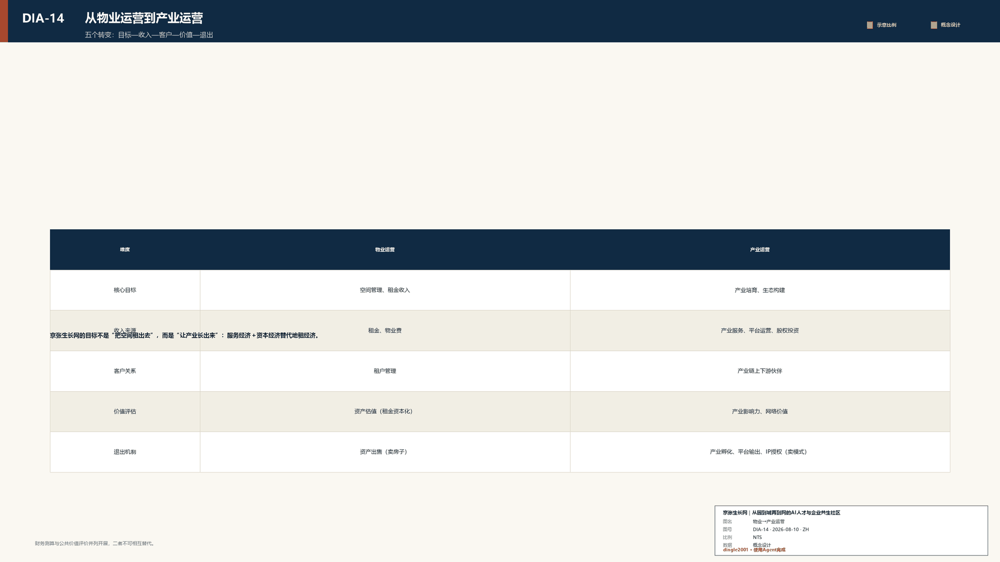

绩效复评按四层进行：**工程产出**（完成量、质量、安全、工期）、**使用效果**（可达性、使用频率、服务覆盖、满意度）、**综合效益**（公共服务、产业、就业、消费、生态、文化）、**可持续性**（运维经费、责任主体、设备寿命、投诉响应、更新能力）。每个项目在立项时保存改造前基线并明确数据采集频率；未达预期时区分设计错误、实施偏差、运营不足与外部条件变化，再决定补建、调整业态、改变管理或终止低效投入。[source:MARS-COURSE] [depth:renewal_project_list]

### 年度活动、RACI与国际转化运营表

| 周期／子品牌 | 内容 | RACI摘要 | 资源与里程碑 | 指标 | 风险／退出 |
|---|---|---|---|---|---|
| Q1 场景问题季 | 场景目录＋合规门诊 | 运营方A／需求方R／专业机构C／居民I | 问题清单、责任人、数据等级 | 合格问题数／退回原因 | 无责任人或数据权利→不立项 |
| Q2 验证开放周 | 三项产业测试＋标准工作坊 | 测试运营方R／安全负责人A | 场地、保险、设备、急停演练 | 可复现实验单／事件闭环率 | 重大事件→停场复盘 |
| Q3 原点开发者夜 | 开源诊所＋驻留中期评审 | 社区运营方A／维护者R／居民C | 课程、导师、家庭支持 | 稳定团队／贡献许可完整率 | 扰民或许可争议→缩减／取消 |
| Q4 首单发布季 | 验证成果—需求方—专业服务 | 首单平台A／需求方R／合规C | 采购边界、披露、路演 | 进入采购评估数／利益冲突披露率 | 不得承诺订单；冲突未披露→下架 |
| 年度区域开发者周 | 跨节点交换与京张文化策展 | 项目办公室A／各节点R | 清权内容、翻译、来访支持 | 有效交换项目／回访转化 | 无书面确认则不挂合作名义 |

### WP0—WP6可采购实施包

| 包 | 实施对象 | 范围 | 验收证据 | RACI | 停止条件 |
|---|---|---|---|---|---|
| WP0 | 基线与权利核验 | 正式边界、测绘、产权、结构消防、市政、资产清权 | 经签发的基线包＋差异清单 | 产权方A／专业团队R | 未形成基线不得进入永久工程 |
| WP1 | 公共底座 | 遗产轴、慢行、无障碍、照明、基础网络和公共开放规则 | 连续可达路线＋开放时段＋维护责任 | 产权方A／公共空间运营R | 挤占匿名通行或维护无预算即调整 |
| WP2 | 验证设施 | 共享实验室、算力适配、机器人限域测试和标准庭院 | 设备台账＋可复现实验单＋安全演练 | 测试运营方A/R | 重大事件或不可复现即停场 |
| WP3 | 人才社群服务 | 开源客厅、项目诊所、驻留、夜校、家庭支持 | 课程／导师／许可／投诉闭环记录 | 社区运营A/R | 扰民、排斥或权利争议即缩减 |
| WP4 | 首单与企业服务 | 需求目录、企业服务、合规诊所、路演与国际交换 | 需求—验证—采购评估完整链 | 首单平台A／需求方R | 虚假需求或利益冲突即下架 |
| WP5 | 品牌与公共活动 | 导视、三地标、四季活动和跨节点策展 | 清权内容包＋年度复盘＋撤回机制 | 项目办公室A/R | 无书面授权不使用合作名称或标志 |
| WP6 | 数据与评价 | NIS／EHS、公开审计、申诉、季度体检 | 指标字典＋责任人＋公开聚合＋决策记录 | 数据负责人R／协作委员会A | 无基线不评分；越权即降级只读 |

七个实施包把“十五个项目做什么”进一步翻译为“可由谁采购、以什么证据验收、何时停止”。WP0先行且不允许被施工招标倒逼跳过；WP1公共底座与WP2—WP5运营产品分线核算；WP6只提供证据和决策支持，不替代产权方、需求方、专业签发人或政府部门的法定决定。

### 九十日最小可信试点

| 时段 | 动作 | 对应包 | 验收证据 | 停止条件 |
|---|---|---|---|---|
| D0—15 基线 | 形成边界／权利／需求／风险登记册 | WP0 | 签发基线包＋差异清单 | 任一权利或安全责任不清即停 |
| D16—30 协议 | 完成运营章程、D0—D3分级、验收与申诉流程 | WP1／WP6 | 章程＋数据协议＋具名责任人 | 无法人工接管或无法申诉即停 |
| D31—60 限域测试 | 运行模型安全、国产算力适配、机器人限域三项测试 | WP2 | 可复现实验单＋事件日志＋安全签发 | 重大事件、越权或不可复现即停场 |
| D61—75 公共测试 | 开放日、无障碍核验、居民共治与首单撮合 | WP3／WP4 | 使用记录＋包容复核＋需求—验证链 | 投诉集中、排斥或虚假需求即调整 |
| D76—90 决策 | 发布匿名审计摘要并作继续—调整—退出决定 | WP5／WP6 | 审计摘要＋决策记录＋下一周期责任表 | 证据不完整或公共价值未达门槛不扩张 |

九十日试点不以永久工程或招商数量为成果，而以“规则是否可执行、测试是否可复现、人工能否接管、公众能否申诉、失败能否退出”为验收对象。D90只形成下一周期的继续、调整或退出建议，不构成建设立项、资金安排或政府实施决定。

单位运营账户采用标准化敏感性示例而不编造人民币数据：以“使用率×单位价格×可运营量”为收入指数，分别测试使用率下降20%、单位价格下降10%、设备可用时长下降20%三种情景；任一情景下若公共服务时段、维护准备金或安全人员配置被收入压力挤占，则不得扩张，先调整空间组合或退出低效项目。参数区间必须在产权方、运营方和公开采购／合同证据到位后补录。[assumption:A-UNIT-ECONOMICS-007]

### 开业前项目库完整性排演

项目库入库门已运行 **310 个确定性合成样例**：七维体检、场景和项目共34份完整合同各运行一次，再对每个强制字段逐项删减形成负样例。**310/310** 个判断均符合规则：缺任一强制字段即退回问题清单或项目库；字段完整也只能进入专业与现场复核，不能直接判定开业、验收或批准。[metric:synthetic_rehearsal_case_count] [depth:renewal_project_list]

| 合同组 | 声明合同 | 强制字段 | 合成样例 | 预期一致 |
|---|---|---|---|---|
| 七维体检 | 7 | 6 | 49 | 49 |
| 场景合同 | 12 | 7 | 96 | 96 |
| 项目合同 | 15 | 10 | 165 | 165 |

机器可读结果见 `visual/assets/project_library_rehearsal.json`。其中所有 `field_result` 保持空值，`field_results_completed=0`：本排演只检查合同结构，不证明场地、人员、安全、预算、服务质量、审批或公共成效。[metric:field_rehearsal_completed_count]

#### 可运行的方法产品：生长网项目门协议

本方案将“六智能体＋四道人门”进一步交付为可离线运行的规则产品，而不只停留在正文描述：`growth-mesh-project-gate.json` 定义角色、权限、合同字段、人类决策门、判定规则、证伪测试和事实边界；`growth-mesh-project-gate-fixtures.json` 提供正例与删字段反例；`growth-mesh-project-gate-run.js` 无需安装依赖即可用Node.js运行；`growth-mesh-project-gate-receipt.json` 保存本次实际运行回执。执行 `node visual/assets/growth-mesh-project-gate-run.js` 可复现 **6／6 个预期判断**，其中明确阻断“无运营主体的项目”“无AI等价路径的场景”和“无基线的体检”。该协议是可供其他片区桌面排演的概念方法，不是规划标准、认证或已部署系统；许可仍为COMMUNITY-DISPLAY-ONLY，除非投稿者另行书面授权复用。

## 评审证据索引

| 评审维度 | 本方案直接回答 | 证据入口 |
|---|---|---|
| 任务契合 20% | 三大定位、五大功能、三区两翼逐项对位；agent.1—6证据导航 | 正文前置矩阵＋五张核心图 |
| 原创性 10% | 园—城—网、五级回路、无体检不更新编译链 | 原创机制与案例边界表 |
| AI规划创新 15% | D0—D3、人工放行、申诉接管、证据门和场景合同 | 12场景任务书＋治理图 |
| 实施可行 20% | 七维体检、15项目合同、WP0—6、90日试点、资金账户 | 项目卡＋实施主线＋资金矩阵 |
| 公共利益 10% | 匿名通行、无障碍、可负担、家庭服务、技术退出权 | 公共利益门＋居民场景 |
| 风险合规 10% | 临时边界、专业签发、停场、清权、无虚构评分 | 假设／合规矩阵＋每卡停止条件 |
| 表达完整 15% | 双语正文、54页证据型A3、A0、HTML、GeoJSON与同源指标 | manifest＋双语契约＋自检 |

每项机制均指向文件、图件、责任主体、边界与验收状态；真实运行发生前，现场成效一律不填报。

### 可复跑的版面质检与权利审计

机器可读记录 `visual/assets/qa-proofing-record.json` 对中英文四份A0／A3的 **124页** 逐页检查文字是否超出页面边界，枚举全部嵌入字体，对照双语页数／页面类型／图件顺序，并检查四个HTML入口的远程主动依赖和图片替代文本，同时登记核心色板对比度。发布门槛是：越界文字为0、非OFL嵌入字体为0、缺失图片替代文本为0、远程主动依赖为0。该记录是投稿者可复跑的自检，不是无障碍认证、法律清权证明、工程签发或辅助技术用户测试。

权利台账按原创文字与方法、官方公开来源、临时几何、代码生成图、AI概念视景、品牌与基础几何、字体和成品版式分类。PDF仅嵌入SIL Open Font License许可的Noto Sans SC字形子集，不随包分发独立字体；AI视景可以单独撤下，规划图、剖面、GeoJSON和项目合同仍能维持核心证据链。[source:RIGHTS-NOTO-OFL]

## 指标体系、面积复算与合规矩阵

几何指标由EPSG:4326图层投影至EPSG:4548复算。临时边界面积、绿地比例、公共空间比例和建筑基底面积只用于包内一致性，不用于官方面积评分。[metric:site_area_sqm] [metric:green_ratio] [metric:public_space_ratio]

NIS-Lite监测“有效团队、活跃项目、专业服务调用、场景订单、资本/首单连接”五类数量；EHS-Lite监测“本地项目生成率、跨主体协作率、测试到采购转化率、主体存活与成长、公共价值与风险事件”五类质量。仪表盘以季度为观察周期，以一年和三年为评价窗口；在缺少公开、清权基线数据时不生成海淀分数。[metric:nis_monitoring_dimension_count] [metric:ehs_monitoring_dimension_count]

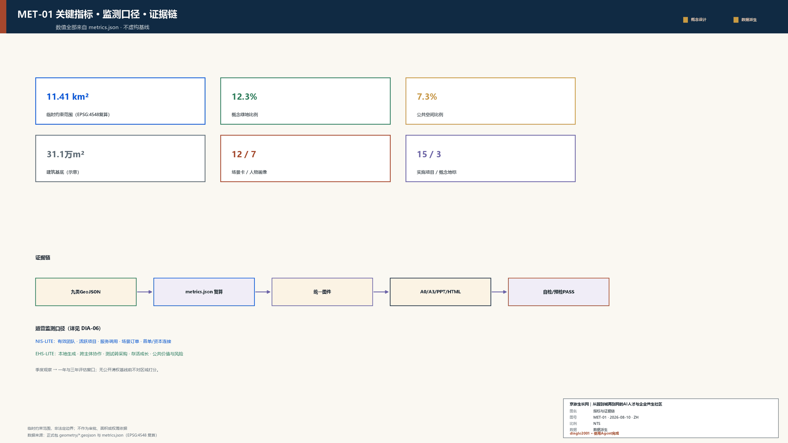

## 风险、版权与合规说明

主要风险包括临时边界被误读为官方红线、AI效果图被误读为设计承诺、概念项目被误读为政府安排、公共场景过度采集、AI建议替代专业审批、早期团队被高租金排斥、地标和活动侵犯姓名或商标权。对应措施为显著标注、结构化来源、最小数据、人工复核、可逆测试、阶段退出和清权后展示。[assumption:A-CONTROLS-001] [assumption:A-AI-VISUAL-006]

五张建筑与大片区视景由AI生成，仅表达空间体验，不承担边界、面积、建筑现状、工程可行性或投资依据。本成果使用 **Agent** 完成，包括资料梳理、结构化数据、图件、HTML、PPTX与PDF生成及一致性检查；最终判断由人类和专业团队负责。公开身份仅使用 `dingle2001`，不公开真实姓名和工作单位。[standard:PROJECT-AGENT-OPEN-CALL-TASKBOOK]

完整资产权利台账见 `report/copyright_statement.md`，逐项覆盖文字、数据、GeoJSON、代码生成图、Logo、AI概念视景、字体、案例、标准、图标、模板和成品文件，并以Git提交记录、manifest SHA-256、来源登记和服务条款作为可追踪证据。中英文实质等价采用六项核对：关键主张、数字与单位、来源标签、风险限定语、图号／文件名、图位顺序；Agent逐项交叉检查完成，投稿者仍应在合并前作最终人工确认，不以机器校验替代人工责任。

## 参考资料

参考资料按四类进入方案：官方公告与任务书确定任务范围、正式赛道和成果深度，是不能被概念设计替代的上位约束；朝阳区公开资料只用于提炼“锚点—轨道与人才生活—孵化服务—创作者社群—企业成长”的机制，不用于证明阿里参与京张项目；第一轮“火星计划”仅提供作者清权的园—城—网、五级生长回路和动态体检方法；七个国际案例用于比较共享设施、混合功能、公共空间和长期运营。[source:OFFICIAL-ANNOUNCEMENT] [source:MARS-THEORY]

几何指标来自临时GeoJSON并按EPSG:4548复算，正式边界替换后必须整体重算；产权、控规、建筑、工程和投资缺口均保留为待核验项。[data:geometry/site_boundary.geojson#SITE-001] [metric:site_area_sqm]

1. 百年京张AI创新带官方公告与面向智能体任务书：确定竞赛命题、三层范围与成果边界。[source:OFFICIAL-ANNOUNCEMENT]
2. 北京市朝阳区关于阿里巴巴北京总部周边交通、AI孵化器和AIGC社区的公开资料：仅作外部机制对标。[source:CASE-ALIBABA-TRANSIT-TALENT]
3. 作者第一轮“火星计划”原创研究：园—城—网、五级生长回路、企业生命周期和动态运营体检。[source:MARS-THEORY]
4. Kendall Square、Knowledge Quarter、one-north、Paris-Saclay、MaRS、High Tech Campus Eindhoven、22@Barcelona机构公开资料：只转译机制，不复制规模和承诺。[source:CASE-KENDALL]
5. 城市设计、控制性详细规划、用地分类和建筑设计深度相关专业标准快照：用于专业矩阵和设计深度自检。[standard:MNR-LAND-USE-CLASSIFICATION-GUIDE]
6. GB/T 50001-2017、GB/T 50104-2010和GB/T 50103-2010：仅用于概念图的轴网、标高、尺寸、线权和总平—剖面证据组织，不构成施工图符合性声明。[source:STD-GBT-50001-2017] [source:STD-GBT-50104-2010] [source:STD-GBT-50103-2010]
