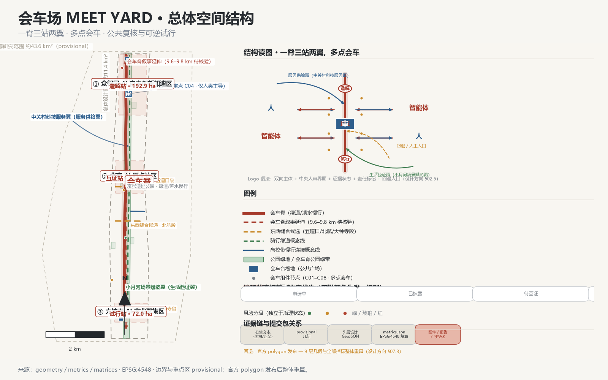
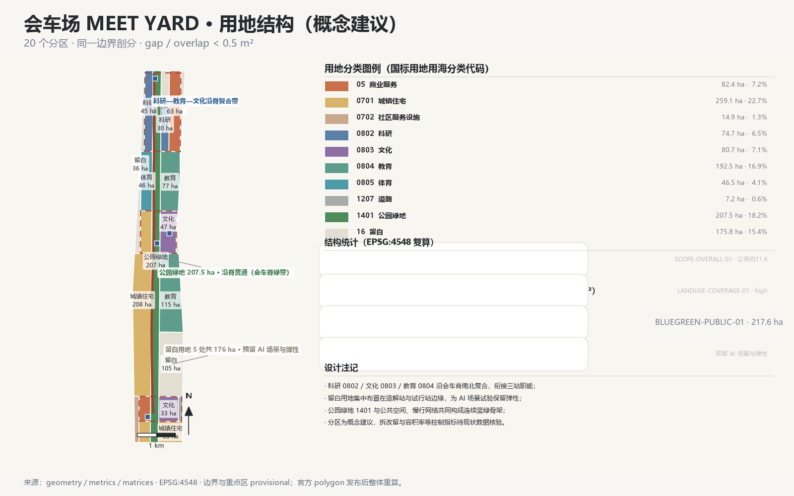
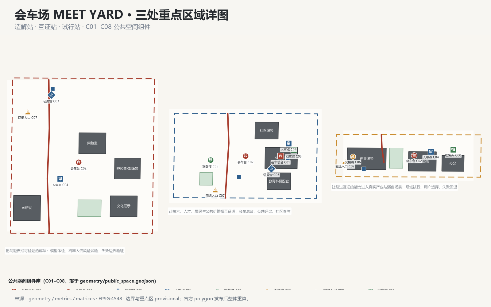
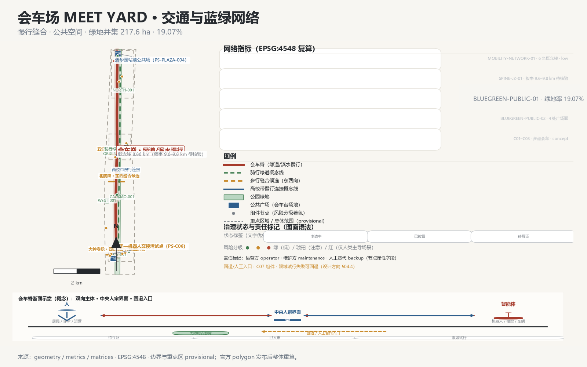
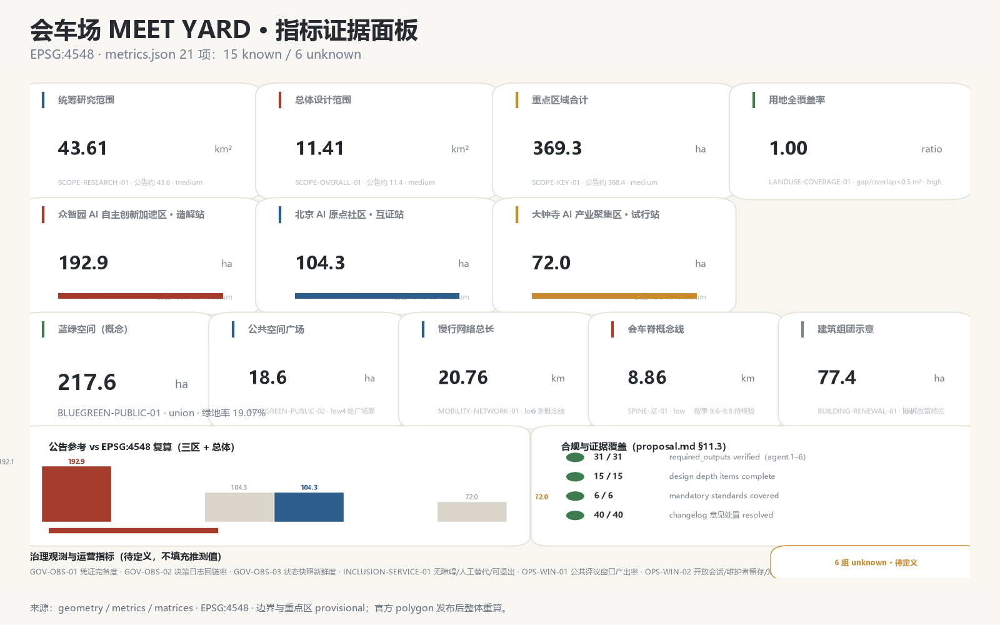

# 会车场 / MEET YARD

## 一页评审摘要

> 本表为评审导航，完整证据见后文各章与机器文件；所有空间与指标结论均为 provisional 边界下的概念建议。

| 评审会问 | 本方案的回答 | 可核验的东西 |
| --- | --- | --- |
| 核心命题是什么 | 让智能先会人，再进城。以铁路"会车"运营纪律为原型：任何 AI 服务进入公共空间前须完成七步会车协议（预约—披露—互证—人审—试行—回退—归档），试点默认到期，续期以公开证据为前提 | 七步协议 8 值 `status_code` 状态机（06.1）；绿/琥珀/红三级风险分级；7 类角色权限矩阵 |
| 机制能否被第三方检验 | 能。协议字段、状态枚举与日志字段全部登记在机器文件（`decision_log_id`/`credential_exchange_log_id`）；31 条 required_outputs 全 verified、40 条 changelog 处置全 resolved、命名压力测试留日志 | `compliance_matrix.json`、`changelog.md`、`claim_register.json`（机制判定 3 条，2 条 rejected 留档） |
| 空间上做了什么 | 一脊三站两翼、多点会车：9.6–9.8 km 会车脊；造解站/互证站/试行站三站；9 个 GeoJSON 图层、24 项 EPSG:4548 复算指标（绿地并集率 19.07%、用地覆盖率 1.0、协议演练 14/14） | `geometry/*.geojson`、`metrics.json`、`recompute-log.jsonl` |
| 三条服务底线凭什么可执行 | 无障碍安静湾与非数字入口（C05/C07 组件）、人工替代与"不采用匿名追踪"、停止与回退是协议步骤而非例外 | 组件库 C01–C08；场景卡 S01–S14 的停止触发/回退字段；06.3.2 阈值草案 |
| 公共价值落在谁身上 | 居民可就影响自己的服务读数发起质询（公共复核与质询窗口）；骑手、老年残障、低数字素养者画像绑定组件 | P01–P07 画像、PS-C04/05/06 组件、OPS-WIN-01 指标（公式待验证） |
| 近期能做什么 | 阶段一仅核验（约 400 ha），不启动工程；轻量设施、运营活动与服务平台先行；每个场景先"申请—披露"再谈试行 | 10.3 分期计划；场景卡 `record_status=draft` 初始态 |
| 刻意不给什么 | 容积率、高度、密度、退线、拆改留结论、工程线位、投资测算——保持 unknown 或概念建议 | `metrics.json` unknown 指标；12.3 越界措辞闸门 |
| 数据可信到什么程度 | 全部几何基于 provisional 边界（`official_boundary=false`）；官方 polygon 发布后整体重算而非逐文件修补；CS01–08 案例状态逐条登记 | 12.1 重算承诺；`sources.json`；`case-source-ledger.json` |

## 设计依据与资料清单

### 设计意图

本方案不是独立愿景文本，而是一份从官方征集程序、面向智能体任务书与场地资料出发、可追溯、可复算、可人工复核的城市设计方案。本章说明方案引用的依据层级、各类资料的使用边界、边界几何的 provisional 状态，以及撰写全程必须遵守的措辞纪律；完整来源索引、标准覆盖与设计深度覆盖分别保存在 `sources.json`、`standard_matrix.json` 与 `design_depth_matrix.json`，不在正文重复机器索引 [source:SOURCE-REGISTRY] [source:SITE-PACKAGE]。

### 为什么这样组织依据

方案以北京市规划和自然资源委员会海淀分局发布的《百年京张AI创新带城市设计国际方案征集资格预审公告》为第一依据，其 1.3、1.4、1.5 节任务与"三区两翼"表述构成本方案三章正文（统筹研究、总体设计、重点区域）的骨架 [source:OFFICIAL-ANNOUNCEMENT] [standard:PROJECT-OFFICIAL-ANNOUNCEMENT]。面向智能体任务书的 agent.1–agent.6 六项必交任务（命名/Logo、生态案例、场景卡、朝圣地标、文化叙事、长期运营）则在本方案各章被实际展开，而非仅在合规矩阵中打勾 [source:AGENT-TASKBOOK] [standard:PROJECT-AGENT-OPEN-CALL-TASKBOOK]。机器可读依据来自 `brief/site-package/` 的 `design_brief.json`、`allowed_design_space.json`、`sources.json`、`enums/`、`ranges/planning_limits.json`、`schemas/` 与 `data/source_registry.json`，其用途分级决定本方案每条主张的证据等级 [source:SITE-PACKAGE] [depth:existing_conditions_diagnosis]。

`data/processed/agent_fact_pack.md` 仅作为阅读导航层，帮助把三层范围、三处重点区、公告任务与资料缺口组织成可读方案；事实判断必须回到已登记的原始材料，导航文件本身不构成新的权威来源 [source:PROCESSED-FACT-PACK]。方案中的每条空间主张已在 `claim_register.json` 登记（CLM-001–CLM-016，含 4 条机制判定），状态分布为 known（provisional 边界内）1 条、provisional 3 条、provisional＋概念角色 3 条、待定义 3 条、待验证 3 条，任何主张不得以"未登记"状态伪装为空间结论 [data:geometry/constraints.geojson#CST-DISCIPLINE-001]。

### 资料使用边界

按 `data/source_registry.json` 的分级，本方案区分三类资料：formal-ready 资料可用于正式判断；background_only 资料只能提供背景语境；provisional_only 资料只能作为临时线索 [source:SOURCE-REGISTRY]。当前登记摘要为：formal 可用资料 5 条、背景资料 0 条、provisional-only 资料 1 条；`BOUNDARY-SOURCE` 与 `KEY-AREA-SOURCE` 均为临时边界来源，不得升级为官方红线、法定控规、精确面积评分依据或政府实施承诺 [source:BOUNDARY-SOURCE] [source:KEY-AREA-SOURCE]。

边界解释回到总体范围图层与面积复算 [data:geometry/site_boundary.geojson#SITE-001] [metric:SCOPE-OVERALL-01]；三处重点区由独立图层与数量、面积指标核对 [data:geometry/key_areas.geojson#PROV-KEY-001] [metric:AREA-ZZY-01]。读者可以从正文进入证据，但不必先读一串机器编号。

### 边界状态与数据缺口

本方案提交时，官方 `SITE_BOUNDARY` 与三处 `KEY_AREA` 精确 polygon 尚未发布，故 `geometry/site_boundary.geojson` 与 `geometry/key_areas.geojson` 均标注为 `provisional_constraint`、`official_boundary=false`、`boundary_precision=provisional_rough`，仅用于概念生成、自检、可视化与设计讨论，不得作为官方红线或法定控制结论 [data:geometry/constraints.geojson#CST-SITE-001] [depth:risk_missing_data]。该组织方数据缺口不阻断内容评分；官方 polygon 发布后，site boundary、key areas、land use、roads、green space、public space、buildings、phasing 与全部指标必须整体重算，不能只替换单个文件（设计方向 §07.3）。

已知数据缺口还包括：京张遗址公园精确边界、中心线与文保要素；现状用地、建筑年代、产权、空置与拆改留条件；步行/骑行/公共交通统一口径流量；人口、人才、企业、算力与能耗数据；噪声、热环境、无障碍障碍点等场景数据；历史文化清单与图像版权；全球案例的最新一手来源。上述缺口在正文各章以"待核验/待确认"显式标注，不以推测值填充（设计方向 §07.2）[data:geometry/constraints.geojson#CST-GAP-001]。

### 措辞纪律

本方案全部空间结构、站点角色、项目、活动与指标均为概念建议、参考方案或可供专业团队深化的材料，不表述为法定规划、已批准政府行动、确认实施、投资承诺、工程可行性或地块级拆改留结论（设计方向 §09.6）。首次出现"造解站、互证站、试行站"等概念名时并列任务书正式地名；所有示意性节点、候选路径与组件不得画成已批准工程或法定设施。



## 三层范围工作框架

### 设计意图

按照公告确定的三层范围组织工作，使产业战略判断、总体城市设计判断与重点片区详细设计判断逐级收敛、互相验证，避免出现"战略悬空"或"图纸堆叠"两类失效（设计方向 §03）。

| 层级 | 空间边界与面积 | 工作目标 | 设计深度 | 成果表达 | 数据落点 |
| --- | --- | --- | --- | --- | --- |
| 统筹研究范围 | 约 43.6 km²：北至北五环、东至京藏高速、南至西直门外大街、西至万泉河路（provisional） | AI 产业生态、创新链与未来城市形态研究；命名体系与总体概念 | 战略研究与总体概念结构 | 生态图谱、命名/Logo 体系、总体结构图、三区两翼协同回路 | [data:geometry/constraints.geojson#CST-RESEARCH-001] [metric:SCOPE-RESEARCH-01] |
| 总体设计范围 | 约 11.4 km²：京张遗址公园周边 1–2 公里城市地区（provisional） | 城市更新总体框架、产业空间布局、交通市政支撑、城市风貌控制 | 控制性详细规划的城市设计深度 | land_use/roads/green_space/public_space/buildings/phasing 九层图 | [data:geometry/site_boundary.geojson#SITE-001] [metric:SCOPE-OVERALL-01] |
| 重点区域范围 | 约 368.4 ha：三处重点片区（provisional） | 三区功能业态、建筑规模、拆改留分类、公共空间连通、交通组织 | 规划综合实施方案的城市设计深度 | 三区独立小方案、会车台组件网络 | [data:geometry/key_areas.geojson#PROV-KEY-001] [metric:SCOPE-KEY-01] |

三层范围工作模式（设计问题 → 方案回答 → 数据落点 → 退出条件）：

| 层级 | 设计问题 | 方案回答 | 数据落点 | 退出条件 |
| --- | --- | --- | --- | --- |
| 统筹研究范围 | AI 产业生态与未来城市形态如何组织 | 会车场命题：产业生态、命名体系、三区两翼协同回路与未来城市形态研究 | `compliance_matrix.json`、`standard_matrix.json`、生态图谱八要素 | 无法说明公共价值的场景不进入总体设计 |
| 总体设计范围 | 产业空间、城市更新、交通市政与风貌如何落图 | 一脊三站两翼结构、九层 GeoJSON、更新项目与分期实施 | [data:geometry/site_boundary.geojson#SITE-001]、[metric:SCOPE-OVERALL-01] | 无来源或无法维护的空间动作回到核验 |
| 重点区域范围 | 三处片区如何达到详细设计深度 | 造解站/互证站/试行站三套小方案 + 三站契约表 + 会车台组件网络 | [data:geometry/key_areas.geojson#PROV-KEY-001]、[metric:SCOPE-KEY-01] | 未过七步协议第 4 步人审的服务不得宣称进入试行 |

三层范围在 `compliance_matrix.json` 中逐条映射，保证公告 1.3、1.4、1.5 与 agent.1–agent.6 的必选任务都有章节、图层、指标、图纸与 HTML 证据；深度项由 [depth:three_level_scope_framework] 与 [depth:overall_spatial_structure] 约束，任务依据以 [standard:PROJECT-OFFICIAL-ANNOUNCEMENT] 为准，范围索引以 `PROCESSED-FACT-PACK` 中 `project_scope_summary.csv` 的三层范围表为导航 [source:PROCESSED-FACT-PACK]。

### 为什么这样划分三层

三层不是互相割裂的图纸集合：统筹研究决定产业链与城市形态判断（回答"AI 城市为什么、为谁、以什么关系组织"）；总体设计把判断落实到更新项目、空间结构与设施承载（回答"落到哪、改什么、怎么撑"）；重点区域详细设计验证具体地块、建筑、交通、公共空间与 AI 应用场景的可实施性（回答"哪里先动、动到什么深度"）。三区两翼协同回路（设计方向 §03.5）作为贯穿三层的机制主线：问题入口在原点社区公共翻译，能力入口在众智园造解体检，服务入口由中关村科技服务翼支持，试行出口在大钟寺与小月河场景翼限域验证，异议与失败回路使任何场景可回退，知识出口把结果写入会车档案再成为下一轮输入 [source:AGENT-TASKBOOK]。

### 证据支撑与边界纪律

三层边界在 `constraints.geojson` 中分别登记为 CST-RESEARCH-001（43.6 km² 研究范围）、CST-SITE-001（11.4 km² 总体范围）、CST-KEY-SCOPE-001（368.4 ha 重点范围），均为 provisional_rough 约束，面积仅作参考尺度 [data:geometry/constraints.geojson#CST-RESEARCH-001] [data:geometry/constraints.geojson#CST-KEY-SCOPE-001]。三区面积核对（polygon 复算值，公告参考面积分别为 192.1 / 104.3 / 72.0 ha）：众智园约 192.9 ha、AI 原点社区约 104.3 ha、大钟寺约 72.0 ha，三区之和与重点范围汇总的关系已在 `metrics.json` 登记 [metric:AREA-ZZY-01] [metric:AREA-ORIGIN-01] [metric:AREA-DZS-01]。任何无法从结构化数据复算的面积、比例、规模或项目数量，不得写入正式结论；替换官方 polygons 后，land use、roads、green space、public space、buildings、phasing 与全部指标需整体重算（设计方向 §07.3）。

### 数据缺口

三层范围的官方 polygon、各层内部现状用地与权属数据、以及三区与总体边界之间的精确拓扑关系均待官方发布后核验；当前分层面积（43.6 km² / 11.4 km² / 368.4 ha）来自公告文本与 provisional 几何，不等同于精确测绘值。



## 统筹研究范围产业与未来城市研究

### 设计意图

统筹研究范围回应公告 1.5（1）关于世界级 AI 创新生态体系、产业链协同、三区两翼、未来 AI 城市形态、AI 文化/社会/城市、AI+交通与连续绿色空间体系的要求，并展开面向智能体任务书"一带总体概念与功能统筹方案设计"与"AI 全栈自主创新体系与世界级 AI 创新生态设计"两项任务（设计方向 §01.4）[source:OFFICIAL-ANNOUNCEMENT] [source:AGENT-TASKBOOK] [standard:PROJECT-AGENT-OPEN-CALL-TASKBOOK]。

### 唯一概念与命名体系（agent.1）

**唯一概念（设计方向 §01.1）：把百年京张 AI 创新带设计成一座"会车场"——让人、智能体、知识与产业在同一条公共脊上按约相遇、相互复核、低风险试行，再把结果回写为可追溯、可复用的公共知识。** 核心传播语："让智能先会人，再进城。"（AI meets people before it moves the city.）

"会车"取自铁路在有限线路与时间资源中调度相向主体安全相遇、互不冲撞、继续前行的运营动作，转译为一项公共制度：AI 是受人类责任链约束的城市服务参与工具，任何智能体不得绕过人直接改变城市，而应在明确的时间、地点、数据边界与责任关系中与人相遇，经互证、人审与可回退试行后才进入下一阶段。一个空间或活动只有同时具备"两个以上受影响主体、有限公共资源、预约时窗、共享上下文、人类放行点、停止条件、人工替代、结果归档"才可称为会车，仅使用轨道词汇不构成会车机制（设计方向 §01.1 机制判定）。

命名层级从同一隐喻生长（设计方向 §02.2）：总体品牌"会车场 / MEET YARD"；一级空间"会车脊 / Meeting Spine"（9.6–9.8 km 京张主脊）；三区概念角色"造解站 / 互证站 / 试行站"（Make / Verify / Trial Station，不替代任务书正式地名）；公共节点"会车台 / Meeting Deck"；治理机制"会车协议 / Meet Yard Protocol"；运营节律"会车班次 / Meet Yard Sessions"；公共档案"会车档案 / Meet Yard Archive"。Logo 建议为两条相向但不碰撞的开放轨迹与一个中央"人审方点"，中央留白表示人与智能体先在公共界面相遇，方点表示责任明确的人类审核节点；不直接画火车、铁轨、人字形、芯片或无限符号（设计方向 §02.3）。视觉关键词为公共技术、运营图谱、温暖工业、时间网格、双向协商、证据可视化、开放留白、可逆试验；概念色板建议石墨黑、纸张白、京张砖红、信号琥珀、公民蓝、生态绿（设计方向 §02.4）。命名与 Logo 均处于概念建议状态，须经中英文命名压力测试与商标检索后方可视为可对外使用。

### 三大定位与五大功能

三大定位（设计方向 §01.4）：百年京张文化带——历史工程方法与 AI 时代公共治理在会车脊上相遇；都市 AI 生活体验带——居民、骑手、学生、老人、访客与智能体在可审查、可退出的日常场景中相遇；AI 融合创新带——科研、产业、资本、人才、数据、场景与公共需求在三区两翼之间相遇并完成验证。五大功能使用任务书官方标签逐字转译：AI全栈自主创新体系→众智园"造解站"；世界级AI创新生态→AI原点社区"互证站"＋中关村科技服务翼；AI+场景赋能新范式→小月河场景赋能翼＋三站会车台；智能化AI活力城市→会车脊、公共空间组件与生活验证节点；AI治理全球话语权→会车协议、会车档案与全球会车大会（概念建议）[standard:PROJECT-OFFICIAL-ANNOUNCEMENT]。

| 任务书定位/功能 | 本方案载体 | 可验收含义 |
| --- | --- | --- |
| 百年京张文化带 | 会车脊、证据窗（C03）、成果/失败档案架（C08）、文化叙事四法 | 遗产不是布景：来源、版权、争议与清权过程可见（§06.8） |
| 都市 AI 生活体验带 | 十二端口式场景卡 S01–S14、会车台（C02）、无障碍安静湾（C05）、非数字入口（C07） | 体验可拒绝、可申诉、可退回人工或非 AI（§06.3 阈值草案） |
| AI 融合创新带 | 三站两翼、产业验证场景 V01–V04、全球会车大会 | 研究—验证—试行—复盘—归档形成闭环（§06.4/§06.10） |
| AI 全栈自主创新体系 | 众智园造解站（模型体检、失败边界验证） | 安全、标准、物理 AI、边缘算力与接管测试（S07/S13） |
| 世界级 AI 创新生态 | AI 原点社区互证站 + 中关村科技服务翼 + 八要素生态图谱 | 开源研究、转化、人才日常与独立评议（§06.2/§06.5） |
| AI+ 场景赋能新范式 | 小月河场景赋能翼 + 三站会车台 + 场景卡阈值 | 场景卡、最少数据、人工复核与日落条款（§06.3.2） |
| 智能化 AI 活力城市 | 会车脊、公共空间组件库、生活验证节点 | 无 App、无障碍、低扰动的日常公共体验（§06.7） |
| AI 治理全球话语权 | 会车协议七步状态机、公开运行板、会车档案、全球会车大会 | 协议字段与演练证据可被第三方检验（§06.1、GOV-OBS-04/05/06） |


### 全球 AI 创新生态案例（agent.2，8 个方向）

以下 8 个案例方向用于提炼可迁移机制，不用于复制城市形态；案例的组织结构、当前运营状态与量化效果需在提交前补充最新一手来源（设计方向 §06.1 案例证据闸门）：

1. **CS01 新加坡榜鹅数码园区（Punggol Digital District）**：园区级数字孪生与共享运营系统结合真实企业/公共服务测试，可迁移为"同一空间底图支撑试行、监测与复盘"的地区运营机制，对应众智园造解—试行通道。
2. **CS02 芬兰赫尔辛基 Kalasatama**：居民、企业、研究机构与城市共同参与的小规模生活实验持续迭代，可迁移为小月河场景翼"真实问题招募＋限域试行＋居民复盘"。
3. **CS03 西班牙巴塞罗那 22@ 与 Decidim**：创新街区建设与可追踪数字参与流程结合，可迁移为会车协议中的公共提案、反馈状态与决策留痕。
4. **CS04 荷兰阿姆斯特丹 Marineterrein**：以可逆、阶段化的场地开放承载技术测试与公共活动，可迁移为遗址公园与园区边界的临时会车台。
5. **CS05 韩国首尔 AI Hub / Sangam 数字创新集群**：以共享设施、创业支持、人才训练与城市试验连接研发与市场，可迁移为众智园—大钟寺"造解—试行"通道。
6. **CS06 加拿大蒙特利尔 Mila 人工智能生态**：以高水平研究机构连接人才培养、企业合作、开放社区与负责任 AI，可迁移为 AI 原点社区的研究—社区公共接口。
7. **CS07 英国 Alan Turing Institute 公共领域合作方向**：研究机构、公共部门与责任审查协同推进数据与 AI 项目，可迁移为高风险场景"专业人审＋证据公开＋限制用途"治理框架。
8. **CS08 法国巴黎 Station F 创新社区**：创业工作空间、公共活动、服务机构与国际网络集中于可持续运营平台，可迁移为会车总台的社区运营与访客转化路径。

这些案例的机制共性——可逆试行、公共参与留痕、共享底图监测、责任审查前置——被转译为五环闭环（核心隐喻—命名体系—空间结构—治理规则—运营机制）中的空间与运营规则，而非直接搬到本地（设计方向 §01.2、§06.1）[source:AGENT-TASKBOOK]。

### 未来城市形态研究：AI+ 交通与连续绿色空间

未来城市形态研究回答 AI 如何改变工作、生活、社交、学习、交通与公共服务，并把判断落实为可定位的功能区、节点、廊道与场景。AI+交通方面，方案不直接提出新轨道线位或道路工程，而是把"会车"作为交通与城市治理的公共界面：站点一体化、骑手—机器人交接、最后一公里协同、无障碍与人工替代均作为场景与节点议题（设计方向 §03.2），对应概念慢行网络 [data:geometry/roads.geojson#RD-SPINE-001] [metric:MOBILITY-NETWORK-01]。连续绿色空间方面，京张遗址公园会车脊与清河/小月河蓝绿空间构成连续公共空间体系 [data:geometry/green_space.geojson#GRN-SPINE-001] [metric:BLUEGREEN-PUBLIC-01]，为 AI 公共测试界面、朝圣路线与日常生活节律提供同一张空间底图。

AI 创新生态图谱须包含八要素：土地、空间、产业、资金、人才、算力、数据、场景；每条关系记录来源、责任角色、空间落点与容量状态，土地、资金、政策、容量与供应者无正式来源时一律标"待研究/待协商"，不以企业名单或金额占位（设计方向 §06.1）[source:SOURCE-REGISTRY]。本方案自身关于竞争环境的判断（如"会车场"与既有概念簇的区隔）属于阶段性工作研判（快照 COMP-20260808-210），提交前须复读最新同行方案更新比较表，不作为正式来源引用（设计方向 §01.3）。

### 证据支撑与数据缺口

统筹研究范围的空间证据为 CST-RESEARCH-001 与复算面积 [data:geometry/constraints.geojson#CST-RESEARCH-001] [metric:SCOPE-RESEARCH-01]，概念结构经 land_use、public_space、green_space、roads 图层与 [depth:overall_spatial_structure] 落位；研究范围内部不新增伪精确红线，产业策略必须落到可见、可复核的空间结构。数据缺口：研究范围内企业、人才、就业、算力与能耗数据需按来源许可与时空范围分级；全球案例需补充 2026 年最新一手来源并核验可迁移条件；命名与 Logo 尚未完成压力测试与商标检索，状态保持 `concept_name_unverified`。

## 总体设计范围城市更新与控规深度城市设计

### 设计意图

总体设计范围回应公告 1.5（2）关于产业目标、功能布局、创新指标体系、城市更新总体框架、更新项目清单、实施政策、建筑总规模、交通轨道、市政配套、京张遗址公园活力带与城市风貌的要求，达到控制性详细规划的城市设计深度（设计方向 §03）[source:OFFICIAL-ANNOUNCEMENT] [standard:MOHURD-CONTROL-DETAILED-PLANNING]。空间结构按"一脊三站两翼、多点会车"落位（设计方向 §03.1）：一脊为京张遗址公园会车脊，三站为众智园、AI 原点社区、大钟寺，两翼为中关村科技服务翼与小月河场景赋能翼，多点会车为沿遗址公园、校园界面、社区公共空间、产业入口与跨路节点形成的可预约公共会车台。

### 一脊：京张遗址公园活力带

以清华园火车站—北航/北邮高校带—大钟寺为总体叙事序列，把约 9.6–9.8 km 京张遗址公园理解为公共"会车脊"而非单一景观轴（设计方向 §03.2）。其概念功能包括文化会车（以问题、证据、工程方法与公共责任讲述京张历史）、知识会车（串联高校、科研机构、企业与公共知识节点为可步行学习路径）、生活会车（无障碍、骑行、儿童、老人、骑手、游客与夜间需求纳入同一公共空间节律）、场景会车（为低风险 AI 场景提供可预约、可观察、可停止的公共测试界面）、东西缝合（在既有条件允许并经专业深化后，把跨遗址、道路与园区边界的公共通达需求转化为候选节点清单，不直接提出桥隧或道路工程结论）、南北贯通（核验现状开放出入口、步行/骑行连续性、公共交通接驳、无障碍与导视中断点，不把叙事序列写成新增道路或轨道线位）。

空间证据：会车脊概念线 [data:geometry/roads.geojson#RD-SPINE-001] 与复算长度 [metric:SPINE-JZ-01]（8,863.2 m，为叙事尺度概念线；与任务书参考 9.6–9.8 km 的差异待官方中心线与起终点核验）；公园绿带 [data:geometry/green_space.geojson#GRN-SPINE-001]、骑行绿道概念线 [data:geometry/roads.geojson#RD-CYCLE-001]、高校带慢行连接概念线 [data:geometry/roads.geojson#RD-PED-001]；东西缝合候选段登记为 RD-CONN-001（五道口段）、RD-CONN-002（北航段）、RD-CONN-003（大钟寺段），均为概念候选，每个候选点须记录既有条件、障碍类型、概念动作与非工程替代方案，缺专业交通、文保、市政与权属资料时只提出问题清单与运营策略（设计方向 §03.2）。

### 三站两翼与用地布局

三站角色落位（设计方向 §03.3）：众智园"造解站"（把问题做成可验证解法）、AI 原点社区"互证站"（让技术、人才、居民与公共价值相互证明）、大钟寺"试行站"（让经过互证的能力进入真实产业与消费场景）。两翼为概念界面而非新增红线：中关村科技服务翼承担人才、知识产权、资本、法务、标准、算力、数据合规、国际合作与企业服务的支持界面，绘制"需求—服务—空间—责任角色—证据—结果"关系图；小月河场景赋能翼作为 AI 进入日常生活的低风险验证界面，优先关注骑手与最后一公里、社区照护、无障碍、公共空间运营、环境感知、教育与青年活动（设计方向 §03.4）。

用地布局以 `land_use.geojson` 20 个概念地块完整覆盖提交边界，覆盖率为 1.0（无缝隙、无重叠、相邻多边形共享边界坐标）[data:geometry/land_use.geojson#LU-0802-01] [metric:LANDUSE-COVERAGE-01]，含科研用地（LU-0802-01/02）、文化用地（LU-0803-01/02）、教育用地（LU-0804-01/02）、商业服务业用地（LU-05-01/02）、城镇住宅与社区服务设施用地（LU-0701-01~03、LU-0702-01）、体育用地（LU-0805-01）、公园绿地（LU-1401-01）与留白用地（LU-16-01~05，为后续功能深化预留）[standard:MNR-LAND-USE-CLASSIFICATION-GUIDE]。产业功能比例、建筑总规模与开发强度为概念方向：产业空间供给以科研、教育与留白用地为载体，具体容积率、高度分区与混合比例属控规条件，须待现状建筑、权属与工程条件资料确认后由专业团队深化，不得伪装为审定指标 [depth:land_use_layout] [depth:development_intensity_controls]。

### 城市更新框架与拆改留逻辑

城市更新总体框架以"保留公共价值、改造低效空间、限域新增、留白待定"为原则，不对具体地块下拆改留结论。`buildings.geojson` 13 个概念建筑组团表达更新对象的方向性判断（设计方向 §03.3 三站契约），包括造解站研发组团（BLD-ZZY-001）、模型体检场/机器人低风险试验场（BLD-ZZY-002）、成果演示与失败复盘空间（BLD-ZZY-003）、算力与开源工具链共享楼（BLD-ZZY-004）、会车总台建筑群（BLD-ORIGIN-001，L01 载体）、AI 夜校/国际开发者客厅（BLD-ORIGIN-002）、社区议题工作坊（BLD-ORIGIN-003）、高校带教育科研集群（BLD-GAOXIAO-001）、智能原生街廊（BLD-DZS-001）、场景验证大厅（BLD-DZS-002）、企业联合测试空间（BLD-DZS-003）、人才公寓组团（BLD-HOUSING-001）与社区服务中心（BLD-SVC-001）[data:geometry/buildings.geojson#BLD-ZZY-001] [data:geometry/buildings.geojson#BLD-ORIGIN-001] [data:geometry/buildings.geojson#BLD-DZS-001]。概念建筑组团基底面积合计约 77.4 万 m² [metric:BUILDING-RENEWAL-01]，仅用于表达空间供给量级，保留/改造/拆除/新建的最终分类须以现状建筑年代、结构、权属与文保评估为依据 [depth:retain_renovate_demolish] [depth:renewal_project_list]。

### 交通、轨道与市政支撑

交通组织达到控规深度需回答：道路微循环、慢行断点、停车与非机动车组织、轨道站点一体化与对外交通。概念层证据为慢行与缝合候选网络全长约 20.8 km [metric:MOBILITY-NETWORK-01]（含会车脊概念线、骑行绿道、高校带慢行连接与三个东西缝合候选段），站点一体化以清华园火车站、五道口、大钟寺等既有轨道站点为界面议题，站点精确接驳条件与流量数据待核验 [depth:traffic_rail_slow_parking]。市政配套提出分布式能源、端侧算力与新型基础设施融合传统市政的概念方向：创新服务平台、人才生活服务、算力与能源设施应作为公共服务设施在控规层面统筹，实际承载力、管线条件与设施选址均待现状市政资料确认 [depth:municipal_new_infrastructure]。

### 城市风貌与创新指标体系

城市风貌控制以"公共技术、温暖工业、时间网格"为关键词：沿会车脊控制街道界面连续性与公共开敞度，建筑体量、屋顶形态与色彩使用京张砖红、公民蓝、生态绿等概念色板，导视采用"双向主体＋中央人审界面＋证据状态＋责任标记＋回退入口"语法，状态不以颜色作为唯一识别手段（设计方向 §02.5）[depth:height_massing_character]。创新指标体系提出人才密度、产业空间供给、绿地与公共空间比例、慢行连通、更新项目数量与 AI 场景节点等指标组，全部指标在 `metrics.json` 登记公式、来源与置信度；治理绩效（GOV-OBS-01/02/03）、运营绩效（OPS-WIN-01/02）与包容服务（INCLUSION-SERVICE-01）为待定义指标，不预填目标值 [metric:GOV-OBS-01] [metric:OPS-WIN-01]。

### 证据支撑与数据缺口

总体设计范围的空间证据为 SITE-001 与复算面积 [data:geometry/site_boundary.geojson#SITE-001] [metric:SCOPE-OVERALL-01]，蓝绿与公共空间概念面积为绿地约 220.8 万 m²、公共空间约 18.6 万 m² [metric:BLUEGREEN-PUBLIC-01] [metric:BLUEGREEN-PUBLIC-02]。数据缺口：控规条件（容积率、高度、退线、设施配建）、现状建筑与权属、工程地质条件、统一口径交通流量、市政承载力、遗址公园中心线与文保要素均待官方或清权资料发布；分期实施仅为概念节律（phasing 图层 PH-001 阶段一核验与基础研究、PH-002 阶段二造解与互证、PH-003 阶段三限域试行、PH-004 阶段四复盘与扩展条件），不构成实施承诺 [data:geometry/phasing.geojson#PH-001] [depth:phasing_implementation]。

## 重点区域详细设计

### 设计意图与总则

对众智园 AI 自主创新加速区、北京 AI 原点社区、大钟寺 AI 产业聚集区分别开展详细设计，达到规划综合实施方案的城市设计深度（设计方向 §03.3）[source:OFFICIAL-ANNOUNCEMENT] [standard:MOHURD-URBAN-DESIGN-MEASURES]。三区 polygon 均为 provisional_rough，面积只能作方向性参考，任何结论不得作为官方红线或精确面积依据；三区各自拥有不可替代的站点契约：固定输入、核心动作、责任角色、最低组件组合、固定输出、最小验收指标、回退/退出路径与不得越过的门槛（设计方向 §03.3 三站契约表）。每个重点区按"定位＋空间结构＋建筑更新＋交通慢行＋公共空间＋AI 场景＋实施风险"组织小方案，并引用 `geometry/key_areas.geojson` 对应 feature 与组件图层 [depth:three_key_area_detailed_design]。

三站契约汇总如下（角色与指标均为概念建议或待验证口径，责任角色待确认）：

| 契约字段 | 造解站（众智园） | 互证站（AI 原点社区） | 试行站（大钟寺） |
| --- | --- | --- | --- |
| 固定输入 | 待验证的问题、模型、算力与测试申请 | 候选解法、公共议题与质询 | 经互证的能力与产品 |
| 核心动作 | 造解—体检—复盘：模型体检、失败边界验证、开源工具链共享 | 公共翻译—公共学习—居民反馈：质询、互证、解释与异议记录 | 街廊试行—验证大厅—企业测试三级界面 |
| 责任角色（待确认） | 独立测试评审 + 现场安全角色 | 公共服务值守 + 社区联络角色 | 现场安全角色 + 商业运营主体 |
| 最低组件组合 | PS-C02-001 会车台、PS-C04-001 人审点、PS-C03-001 证据窗、PS-C07-001 回退标记 | PS-C01-001 会车总台、PS-C04-002 人审点、PS-C05-001 安静湾、PS-C08-001 档案架 | PS-C02-003 会车台、PS-C04-003 人审点、PS-C06-001 交接湾、PS-C07-003 回退标记、PS-C08-002 档案架 |
| 固定输出 | 带版本、证据与限制条件的"可测试解法" | 经互证与质询记录的公共知识（会车档案） | 公开的试行结果、事故与回退记录 |
| 最小验收指标 | AREA-ZZY-01（面积口径，provisional）；复现率、失败覆盖率（GOV-OBS 组，公式待验证） | AREA-ORIGIN-01；异议关闭率、转人工率（INCLUSION-SERVICE 组，公式待验证） | AREA-DZS-01；人工接管成功率、退出成功率、异常闭环时长（OPS-WIN 组，公式待验证） |
| 回退/退出路径 | 测试暂停并恢复人工流程；不合格模型阻断公共试行 | 分歧未闭合不放行；异议与退出记录公开 | 触发停止即恢复人工服务；未结事故不得续期 |
| 不得越过的门槛 | 不宣布城市部署或永久认证；不越级使用未清权数据 | 不替代法定审批；不强制自动化 | 不描述为已批准规模化运营、招商或投资承诺 |

### 众智园 AI 自主创新加速区——造解站（约 192.1 ha，provisional）

**定位**：把问题做成可验证的解法。聚焦模型、算力、数据工具、机器人、软硬件协同、开源工具链、标准与安全测试等全栈能力，并把封闭研发的一部分转译为可审查的公共验证接口（设计方向 §03.3-A）[data:geometry/key_areas.geojson#PROV-KEY-001] [metric:AREA-ZZY-01]。

**空间结构与建筑更新（概念）**：研发组团（BLD-ZZY-001）之间布局共享试验节点，模型体检场/机器人低风险试验场（BLD-ZZY-002）承担失败边界验证，成果演示与失败复盘空间（BLD-ZZY-003）、算力与开源工具链共享楼（BLD-ZZY-004）构成"造解—体检—复盘"闭环 [data:geometry/buildings.geojson#BLD-ZZY-002] [data:geometry/buildings.geojson#BLD-ZZY-004]。绿楔 GRN-NORTH-001 作为研发组团与城市界面之间的缓冲与公共开敞 [data:geometry/green_space.geojson#GRN-NORTH-001]。

**公共空间与 AI 场景（概念）**：会车台模块（PS-C02-001）承接预约制公共验证申请；人审点（PS-C04-001）为模型/机器人测试提供人类放行与停止界面；证据窗（PS-C03-001，百年问题台载体）公开测试条件与失败边界；回退标记/人工入口（PS-C07-001）保证任何测试可暂停并恢复人工流程 [data:geometry/public_space.geojson#PS-C02-001] [data:geometry/public_space.geojson#PS-C04-001] [data:geometry/public_space.geojson#PS-C07-001]。这里首先生产"可测试的解法"（带版本、证据与限制条件的候选解法），不得直接宣布城市部署或永久认证；产业验证场景（如模型体检、失败边界验证，详见场景卡章节）按"申请—披露—互证—人审—限域试行—回退—归档"七步协议运行（设计方向 §04.2）。

**交通慢行**：与高校带慢行连接（RD-PED-001）衔接，保障研发人员与周边社区步行可达；东西缝合候选段 RD-CONN-002（北航段）在条件允许时改善与遗址公园的公共通达，工程方案待专业深化 [data:geometry/roads.geojson#RD-CONN-002]。

**实施风险**：现状权属、建筑年代与工程条件待核验；"模型体检场"涉及测试安全与数据合规，须在专业安全审核与法律复核后进行；概念建筑组团不得解读为地块级拆改留结论。

### 北京 AI 原点社区——互证站（约 104.3 ha，provisional）

**定位**：让技术、人才、居民和公共价值相互证明。承载全球人才交流、青年生活、开源社区、公共学习、居民参与、人机协商与 AI 治理展示，是会车协议最完整的公共界面（设计方向 §03.3-B）[data:geometry/key_areas.geojson#PROV-KEY-002] [metric:AREA-ORIGIN-01]。

**空间结构与建筑更新（概念）**：会车总台建筑群（BLD-ORIGIN-001，朝圣地标 L01 载体）、AI 夜校/国际开发者客厅（BLD-ORIGIN-002）、社区议题工作坊与可负担共享服务（BLD-ORIGIN-003）构成"公共翻译—公共学习—居民反馈"中枢 [data:geometry/buildings.geojson#BLD-ORIGIN-001] [data:geometry/buildings.geojson#BLD-ORIGIN-002]；口袋公园 GRN-ORIGIN-001 提供社区级公共开敞 [data:geometry/green_space.geojson#GRN-ORIGIN-001]。

**公共空间与 AI 场景（概念）**：会车总台公共广场（PS-PLAZA-001）与总台模块（PS-C01-001）为朝圣路线起点；人审点（PS-C04-002）承载质询、互证、解释与异议记录；证据窗（PS-C03-002）公开候选解法与未决分歧；无障碍安静湾（PS-C05-001）保障非数字入口与安静时段；回退标记/人工入口（PS-C07-002）提供人工替代；成果/失败档案架（PS-C08-001）沉淀贡献、来源、审核、版本与复用记录（会车档案机制）[data:geometry/public_space.geojson#PS-PLAZA-001] [data:geometry/public_space.geojson#PS-C01-001]；相关节点证据详见：[data:geometry/public_space.geojson#PS-C05-001] [data:geometry/public_space.geojson#PS-C08-001]。百年问题台（L02）与人机互证台（L03）为荣誉展示/朝圣地标概念节点，承载文化叙事（设计方向 §06.5、§06.6）。

**交通慢行**：与五道口会车台场地（PS-PLAZA-002）及站点一体化界面衔接，保障学生、居民与访客的步行与骑行可达 [data:geometry/public_space.geojson#PS-PLAZA-002]；东西缝合候选段 RD-CONN-001（五道口段）在条件允许时改善跨路公共通达。

**实施风险**：社区参与与异议处理需明确的运营主体与回退机制；历史文保要素与开放界面条件待核验；分歧未闭合、退出与非数字替代未记录时不得放行任何场景（站点契约）。

### 大钟寺 AI 产业聚集区——试行站（约 72.0 ha，provisional）

**定位**：让经过互证的能力进入真实产业与消费场景。聚焦智能原生商务、零售、文化体验、专业服务、低风险机器人配送、企业验证与公众可见的产品试行（设计方向 §03.3-C）[data:geometry/key_areas.geojson#PROV-KEY-003] [metric:AREA-DZS-01]。

**空间结构与建筑更新（概念）**：智能原生街廊（BLD-DZS-001）、场景验证大厅（BLD-DZS-002）、企业联合测试空间（BLD-DZS-003）构成"街廊试行—验证大厅—企业测试"三级试行界面 [data:geometry/buildings.geojson#BLD-DZS-001] [data:geometry/buildings.geojson#BLD-DZS-003]；街廊绿带 GRN-DZS-001 串联公共体验路径 [data:geometry/green_space.geojson#GRN-DZS-001]。

**公共空间与 AI 场景（概念）**：体验街廊公共区（PS-PLAZA-003）提供公众可见的试行面；会车台模块（PS-C02-003）承接限域试行预约；人审点（PS-C04-003）为试行放行与停止界面；骑手—机器人交接湾（PS-C06-001）处理最后一公里交接冲突（产业验证场景 V01 空间载体）；回退标记/人工入口（PS-C07-003）保证触发停止即恢复人工服务；成果/失败档案架（PS-C08-002）公开试行结果、事故与回退记录 [data:geometry/public_space.geojson#PS-PLAZA-003] [data:geometry/public_space.geojson#PS-C06-001] [data:geometry/public_space.geojson#PS-C08-002]。开放结果廊（L04）为荣誉展示/朝圣地标概念节点。试行强调用户选择权与失败回退，不得把试行描述为已批准规模化运营、招商或投资承诺。

**交通慢行**：与大钟寺站点及东西缝合候选段 RD-CONN-003（大钟寺段）衔接，组织骑手—机器人交接与行人流线分离 [data:geometry/roads.geojson#RD-CONN-003]。

**实施风险**：商业运营主体与现场安全责任须明确；涉及劳动影响（骑手）、数据合规与产品责任，须法律与行业专家复核；试行指标（人工接管成功率、退出成功率、异常闭环时长）为待定义指标，不预填目标值 [metric:OPS-WIN-01] [metric:INCLUSION-SERVICE-01]。

### 三区汇总与证据支撑

三区合计约 368.4 ha（provisional 汇总边界，由 key_areas 三个片区多边形汇总）[data:geometry/key_areas.geojson#PROV-KEY-001] [metric:SCOPE-KEY-01]，三区面积与重点范围之和的拓扑关系待官方 polygon 发布后复核；每站的组件组合（PS-C01–C08）、运营岗位与结果指标互不相同，若三区可互换名称而不改变输出，即判定空间分工失败（设计方向 §03.3）。数据缺口：三区现状用地、建筑、权属、文保、工程与运营数据均待核验，本节的建筑组团、组件节点与场景安排全部为概念建议，供专业团队深化。



## AI 创新生态、人才画像与 AI+ 场景

> 本章是面向智能体任务书（agent.1–agent.6）在“生态、场景、画像、治理、文化、运营”维度的完整展开，与 `compliance_matrix.json` 的 31 个 required_output 逐条对应 [source:AGENT-TASKBOOK] [standard:PROJECT-AGENT-OPEN-CALL-TASKBOOK]。本章所有空间落点、机制与活动均为**概念建议、参考方案或可供专业团队深化研究的方向**，不替代正式规划，不构成政府审定、投资、建设、审批或运营承诺；空间边界以 `provisional constraint` 处理，待官方 polygon 发布后整体复算 [source:BOUNDARY-SOURCE] [source:KEY-AREA-SOURCE]。

本章的写作纪律与设计契约一致：场景卡必须写清责任人、审查方式、停止条件和回退路径；案例必须有来源状态；画像必须绑定场景与组件；地标与组件必须落到 `geometry/public_space.geojson` 的真实 feature；指标必须回指 `metrics.json` 与设计契约 07.1 的固定 `group_id`。删除所有引用标记后，正文仍必须自然可读。

### 06.0 六任务总响应与合规矩阵回指（agent.1–agent.6）

面向智能体任务书的六项必选任务在本方案中按“主章节 + 机器证据”双层交付。下表把 31 个 required_output 组合逐条映射到本方案章节、结构化文件与对象 ID；`check_status` 均为 `verified`，完整记录见 `compliance_matrix.json` [source:AGENT-TASKBOOK] [depth:overall_spatial_structure]。

| agent | output_id | 本章/其他章节响应 | 结构化文件与对象 ID | 完成门槛 |
| --- | --- | --- | --- | --- |
| agent.1 | `proposal_narrative` | 第 1 章核心概念与“会车档案 001 号”（`MY-DEMO-001`，概念示意）；本章 06.8 文化叙事承接 | proposal.md#核心概念；MY-DEMO-001(demo,evidence_eligible=false) | 概念示意声明紧邻每次出现位置 |
| agent.1 | `logo_or_visual_identity_direction` | 第 2 章命名体系与 Logo 方向；本章 06.9 导视语法衔接 | 命名测试日志 candidate_label 域；visual/index.html | 命名压力测试记录齐全 |
| agent.1 | `overall_structure_diagram` | 第 3 章“一脊三站两翼、多点会车”结构图 | geometry/site_boundary.geojson#SITE-001；geometry/key_areas.geojson#PROV-KEY-001/002/003 | 结构图与 GeoJSON/metric ID 链绑定 |
| agent.1 | `compliance_matrix_entry` | 本章 06.0 回指表 | compliance_matrix.json#agent.1.* | 条目存在且 verified |
| agent.1 | `visual_index_section` | 离线 visual/index.html 对应章节 | visual/index.html#visual-index | 离线、静态、无外部资源 |
| agent.2 | `case_study_table` | 本章 06.2 全球案例 8 个（CS01–CS08） | CS01..CS08；sources.json | 每案例有来源/状态/局限或“待核验”标注 |
| agent.2 | `ecosystem_map` | 本章 06.2.3 八要素生态图谱 | 八要素关系 from_id/to_id 记录 | 土地/空间/产业/资金/人才/算力/数据/场景齐备 |
| agent.2 | `industry_space_mapping` | 本章 06.2.4 产业—空间落位映射 | geometry/key_areas.geojson#PROV-KEY-001/002/003 | 三站两翼逐项绑定 |
| agent.2 | `metrics_and_sources` | 本章 06.11 指标回指；metrics.json/sources.json | metrics.json#AREA-*,GOV-OBS-*,OPS-WIN-* 等 | 指标挂固定 group_id |
| agent.2 | `visual_index_section` | 离线 visual/index.html 对应章节 | visual/index.html#visual-index | 离线、静态 |
| agent.3 | `scenario_cards` | 本章 06.3 场景卡 S01–S14（14 张） | S01..S14 | 每卡治理字段、空间 ID、运营、人工替代与指标完整 |
| agent.3 | `persona_table` | 本章 06.5 用户画像 P01–P07（7 类） | P01..P07 | 每画像绑定场景与组件 |
| agent.3 | `scenario_space_operation_matrix` | 本章 06.3.3 场景—空间—运营矩阵（含 V01–V04） | S01..S14 × V01..V04 矩阵；standard_matrix.json | 矩阵完整且回指 feature |
| agent.3 | `privacy_and_human_review_boundary` | 本章 06.1 会车协议（七步/风险分级/角色/公开运行板） | decision_log_id；credential_exchange_log_id | 状态枚举与日志字段齐全 |
| agent.3 | `visual_index_section` | 离线 visual/index.html 对应章节 | visual/index.html#visual-index | 离线、静态 |
| agent.4 | `public_space_design` | 本章 06.6/06.7 地标与组件公共空间设计 | geometry/public_space.geojson#PS-* | 组件/地标绑定节点 feature |
| agent.4 | `landmark_catalog` | 本章 06.6 地标目录 L01–L04 | L01..L04 | 4 地标运营最小字段完整 |
| agent.4 | `honor_display_system` | 本章 06.6.2 成果卡荣誉展示体系 | L01..L04 成果卡记录 | 成果卡区分状态，不搞个人雕像 |
| agent.4 | `component_library` | 本章 06.7 组件库 C01–C08 | C01..C08；standard_matrix.json | 8 组件统一 schema 完整 |
| agent.4 | `visual_index_section` | 离线 visual/index.html 对应章节 | visual/index.html#visual-index | 离线、静态 |
| agent.5 | `culture_narrative` | 本章 06.8 文化叙事主线 | resource_id（文化资源登记） | 来源/版权/争议状态可追溯 |
| agent.5 | `signage_system_direction` | 本章 06.9 导视体系与视觉语法 | 导视/视觉语法符号单元 | 品牌/文化/状态三层标识分层 |
| agent.5 | `spatial_storyline` | 本章 06.8.3 空间叙事线（问题—证据—试验—复盘） | 问题台/证据窗/试验台/复盘廊 carrier_id | 四类载体绑定登记资源 |
| agent.5 | `international_communication_copy` | 本章 06.9.2 国际传播文案与命名测试 | 命名测试日志 + descriptor | 中英一致、误读测试记录 |
| agent.5 | `visual_index_section` | 离线 visual/index.html 对应章节 | visual/index.html#visual-index | 离线、静态 |
| agent.6 | `annual_event_system` | 本章 06.10.1 年度活动体系与四级节律 | s_daily;s_weekly;s_quarterly;s_annual | 每级节律有主责、替补、资源、产出、复盘与退出 |
| agent.6 | `brand_ip_system` | 本章 06.10.2 品牌 IP 体系（第 2 章命名层级衔接） | 命名层级与 IP 登记 | 与总体品牌同语义，不另起概念 |
| agent.6 | `developer_community_operation` | 本章 06.10.3 开发者社区运营与状态机 | state machine: visitor/participant/tester/maintainer/partner | 双向跃迁与退出撤权记录 |
| agent.6 | `scenario_open_operation` | 本章 06.10.4 AI 场景开放运营 | program_candidate_id（场景开放记录） | 申请—审核—试行—复盘—归档闭环 |
| agent.6 | `conversion_pathway` | 本章 06.10.5 国际传播与转化路径 | 转化路径与公共产出记录 | 每步进入条件与书面确认 |
| agent.6 | `visual_index_section` | 离线 visual/index.html 对应章节 | visual/index.html#visual-index | 离线、静态 |

> 依据设计契约 v1.6，`(agent_id, output_id)` 主条目集合与任务书精确相等、恰为 31 个组合，任一缺失、重复或别名即判定 self-check 不通过 [source:AGENT-TASKBOOK]。本章以下各节逐项展开 agent.2–agent.6 的可读内容；agent.1 的叙事、Logo 与结构图由第 1–3 章承载，本章提供其生态、场景与文化证据链。

### 06.1 会车协议：城市如何安全开放给 AI（agent.3 治理边界）

#### 06.1.1 七步流程

会车协议是一套“无协议，不入场；无人审，不执行；无回退，不扩散”的城市 AI 开放机制（概念建议）。任何 AI 场景进入公共空间试行前，建议按以下七步流转；每一步的状态进入公开运行板，形成可追溯记录 [depth:three_key_area_detailed_design] [source:AGENT-TASKBOOK]：

| 步骤 | 名称 | 内容 | 状态枚举（status_code） |
| --- | --- | --- | --- |
| 1 | 预约入场 | 申请方提交场景目的、地点、时段、对象、数据范围、责任人和预期公共价值；未明确责任人的场景不得进入试行 | `application` |
| 2 | 上下文披露 | 公开可公开的数据来源、模型或规则版本、能力边界、已知失败、有效期和禁止用途；不得把推断结果伪装为事实 | `context_disclosed` |
| 3 | 双向互证 | 智能体说明依据与不确定性；人类审核者、领域专家或受影响群体提出质询；重大分歧未解决时保持待互证 | `verification_pending` |
| 4 | 人审放行 | 低风险场景抽检与现场值守；中风险逐项审核；高风险仅人类主导、AI 辅助；`decision_log_id` 在此步生成 | `human_reviewed` |
| 5 | 限域试行 | 限定时间、空间、数据、用户和功能，设置人工接管、停止按钮、异常阈值和现场联系方式；试行不得宣传为全面部署 | `limited_trial` |
| 6 | 可逆回退 | 出现安全、隐私、歧视、误导、系统失效或公众强烈异议时，立即停止并恢复人工流程；保存事件日志、通知受影响者并进入复盘 | `paused` / `rolled_back` |
| 7 | 贡献归档 | 记录人类与智能体贡献、来源、许可证、审核结论、失败记录、版本变化和可复用成果；归档首要目的是责任追溯与公共学习 | `archived` |

本方案将第 3 步的公共接口统一称为**公共复核与质询窗口**：它是静态/离线快照中的公开复核界面，不是连续实体设施，也不授予 AI 独立放行权；内部命名测试中的 `candidate_label` 不作为对外术语。

第 3 步“双向互证”可经**双向凭证互证界面（凭证互换）**表达：一类凭证说明智能体上下文与不确定性，另一类记录人类责任角色、质询与异议回执；第二类不是放行授权，真实放行仍由第 4 步人审与 C04 人审点负责。该界面作为 C04 的子记录（`credential_exchange_log`），不新增组件、不新增地标、不产生独立放行权 [source:AGENT-TASKBOOK]。`双路签`、`Twin Staff` 等名称仅存在于命名测试日志的内部 `candidate_label` 域，不得对外使用。

状态真源采用双字段：`record_status`（成果生命周期，枚举 `draft|verified|blocked`）与 `status_code`（治理阶段，8 值枚举）。`record_status=draft` 时 `status_code=null`；只有 `record_status=verified` 且协议字段齐全的场景卡才可进入试行、图件成果或“已验证”叙述 [metric:GOV-OBS-03]。

#### 06.1.2 风险分级

| 级别 | 适用范围 | 开放方式 | 人工与回退要求 |
| --- | --- | --- | --- |
| 绿色 | 公开信息检索、文化导览、创意生成、非敏感公共学习 | 明确告知后开放体验 | 人工抽检；可随时关闭；错误可更正并记录 |
| 琥珀色 | 公共空间排班、机器人配送、交通建议、环境调度、商业推荐 | 预约、限时、限域试行 | 指定责任人逐项审核；必须有人工接管和服务降级方案 |
| 红色 | 医疗诊断、公共安全处置、权利资格、未成年人、身份识别、持续监控、可能直接造成物理伤害或重大权利影响的场景 | 不允许智能体自主决策或自动执行 | 人类专业人员主导；AI 仅辅助；无法满足合法性与专业要求时不得试行 |

风险判定规则（概念建议）：涉及个人/敏感数据、未成年人或脆弱群体、物理设备运动、公共服务资格、法律/医疗/安全后果、持续监测或难以撤销影响的最低从琥珀色起评；风险级别不确定、审核角色能力不明确、人工替代不可用、停止阈值无法监测时自动上调一级，仍无法满足时退出而不是降级描述。风险级别、判定依据、审核者与复核日期必须进入场景卡和公开运行板 [source:AGENT-TASKBOOK] [standard:PROJECT-OFFICIAL-ANNOUNCEMENT]。

#### 06.1.3 五项不可缺省机制与执行角色

五项不可缺省机制：**预约**（公共空间、算力、数据和人力均为有限资源，每次 AI 介入须有时段、地点、责任人和退出时间）；**人审**（人类最终判断不可外包）；**回退**（每张场景卡必须说明如何暂停、恢复到什么人工流程、谁负责通知、日志保存在哪里）；**署录**（人类、智能体、数据、代码和审核者共同署录）；**节律**（试行结束自动进入复盘，长期场景按固定周期重新审核）[source:AGENT-TASKBOOK]。

执行角色与决策权（角色类型建议，不指定具体政府部门、机构、企业与编制；执行端须为每个场景填入实际可确认的角色名称或标 `待确认`）：

| 角色类型 | 可以做什么 | 不可以做什么 | 必须留下的记录 | 缺席时处理 |
| --- | --- | --- | --- | --- |
| 申请主体 | 提交目的、资源、数据与预期公共价值 | 自行批准自己的高风险场景 | 申请、许可证、版本与联系方式 | 申请不受理 |
| 可问责负责人 | 对场景结果、通知与整改负责 | 把责任转给“AI 系统”或匿名供应商 | 放行/暂停/退出决定与签署时间 | 场景不得进入试行 |
| 场地运营角色 | 管理时段、现场秩序、设备和人工替代 | 擅自扩大空间、时段或用户范围 | 值守、异常、设备和回退日志 | 降级为人工服务或关闭 |
| 领域/安全审核角色 | 判断证据、风险与专业边界 | 替代主管部门审批或给出法定结论 | 审核意见、分歧、有效期 | 保持待互证或退出 |
| 受影响群体/无障碍评议角色 | 提出使用、劳动、公平与退出意见 | 被咨询后失去申诉权 | 异议、回应、未解决问题 | 不得以“已公众参与”结案 |
| 事故协调角色 | 触发停止、通知、保全日志与复盘 | 未经复盘直接恢复 | 时间线、影响、恢复条件 | 保持停止状态 |
| 档案维护角色 | 管理来源、许可证、版本与公开摘要 | 删除失败或只保留成功故事 | 归档版本、撤回、复用条件 | 成果不得发布为公共知识包 |

关键角色须记录替补与交接（`role_id/primary_actor/backup_actor/authority_scope/on_call_window/handover_log/escalation_to`）；没有预授权替补时不得临时口头代签，只能暂停场景或恢复人工服务。申诉与事故升级链（概念建议）：现场运营触发停止并保全日志 → 可问责负责人和事故协调角色确认影响范围 → 领域/安全审核与受影响群体评议提出恢复条件 → 独立申诉复核角色处理未结异议 → 可问责负责人 + 审核角色共同签署恢复/退出 → 档案维护角色发布必要公开摘要；涉及法定权限的事项仅记录“待主管主体依法处理”，任一环节缺席时保持停止。

#### 06.1.4 会车机制判定与公开运行板

按设计契约 01.2 的会车机制判定要求，本方案对“会车场”核心机制保存判定日志：候选“仅剩轨道造型（相向轨迹图形化装饰）”因缺少预约时窗、共享上下文、人类放行点、停止条件、人工替代与结果归档六类字段，判定 `rejected`，退回概念重写为“相向主体在有限公共资源中经调度、安全相遇、继续前行的运营动作”；候选“会车 = 交通信号灯控制”因缺少责任链与回退记录亦被退回。保留被退回候选的完整字段检查记录，作为机制判定日志证据（`decision_log_id` 关联），进入 `proposal.md` 与合规矩阵 [source:AGENT-TASKBOOK]。

建议在会车总台及离线网页设置**公开运行板**：展示 `record_status` 与 `status_code` 双字段、责任主体类型、风险等级、数据来源类别、最近审核时间、异常和回退记录；涉及隐私或安全的信息只展示必要摘要。可研究采用**状态索引条 / 治理状态索引**作为辅助索引，但必须为静态/离线快照（`offline_snapshot=true/snapshot_at/snapshot_hash/not_live`），文字与状态码优先，不得预设与风险分级冲突的红黄绿放行含义，不得写成连续实体设施；`状态灯带`、`Signal Ribbon` 仅为内部 `candidate_label` [metric:GOV-OBS-02] [metric:GOV-OBS-03]。

治理绩效指标在 `metrics.json` 中登记为待定义项，不预填目标值：`GOV-OBS-01=credential_pair_completeness`（双向凭证互证界面的凭证对完整率）、`GOV-OBS-02=decision_log_link_rate`（人审决定日志关联率）、`GOV-OBS-03=status_snapshot_freshness`（治理状态索引快照新鲜度）；`credential_exchange_log` 是过程证据，不得伪装成绩效指标 [metric:GOV-OBS-01]。

会车协议状态机已固化为机器可读工件：`visual/assets/data/meet-protocol.schema.json`（8 值 `status_code` + `record_status` 双字段、状态转移规则、绿/琥珀/红风险枚举、7 类角色四字段、分状态必填字段），配套确定性演练脚本 `visual/assets/check_meet_protocol.js`（14 项检查：转移合法性、全状态可达性、ARCHIVED 终态、PAUSED 恢复规则、合法/非法/未知序列 fixture 等，全部通过，证据见 `visual/assets/data/meet-protocol-drill.json`，逐字节可复跑）[metric:GOV-OBS-04] [metric:GOV-OBS-05] [metric:GOV-OBS-06]。

### 06.2 全球 AI 创新生态案例（agent.2，8 个方向）

#### 06.2.1 案例证据闸门与使用边界

以下 8 个案例方向依据设计契约 06.1 提炼**可迁移机制**，用于机制借鉴而非复制城市形态；任务书允许 5–8 个，本方案锁定 8 个 [source:AGENT-TASKBOOK] [standard:PROJECT-AGENT-OPEN-CALL-TASKBOOK]。每个案例必须记录 `case_id/source_id/publisher/url/retrieved_at/current_status/license_or_use_basis/claimed_mechanism/measured_result_or_unknown/limitation/transfer_condition/non_transferable_condition`。各案例官方来源 URL 已于 2026-08-15 核验并登记于 `sources.json`（CS01–CS08：URL、检索日期与使用限制逐条记录；核验明细见 `case-source-ledger.json`）；量化效果、组织结构与最新运营状态仍待一手来源与专业复核，未核验前不进入正式评分依据。

#### 06.2.2 案例对照表（CS01–CS08）

| case_id | 案例方向 | 可迁移机制 | 到会车场的转译（概念建议） | 来源状态 |
| --- | --- | --- | --- | --- |
| CS01 | 新加坡榜鹅数码园区 Punggol Digital District | 园区级数字孪生、共享运营系统与真实企业/公共服务测试结合，形成“同一空间底图支撑试行、监测与复盘”的地区运营机制 | 众智园造解站可研究以同一套空间底图承载模型体检、公共演示与失败复盘，避免多套系统互不相通 | URL 已核验（2026-08-15）；机制/效果待复核 [source:CS01] |
| CS02 | 芬兰赫尔辛基 Kalasatama | 居民、企业、研究机构和城市共同参与的小规模生活实验持续迭代 | 小月河场景赋能翼可迁移“真实问题招募 + 限域试行 + 居民复盘”，S01/S06/S08 场景可研究其参与式迭代节奏 | URL 已核验（2026-08-15） [source:CS02] |
| CS03 | 西班牙巴塞罗那 22@ 与 Decidim | 创新街区建设与可追踪的数字参与流程结合，公共提案、反馈状态和决策留痕 | 会车协议的公共提案、异议与决策留痕可研究借鉴 Decidim 式的状态可视化，落实为公开运行板 | URL 已核验（2026-08-15） [source:CS03] |
| CS04 | 荷兰阿姆斯特丹 Marineterrein | 可逆、阶段化的场地开放方式承载技术测试和公共活动 | 遗址公园与园区边界的临时会车台（C02）可研究其“先轻量开放、按阶段升级、可随时收回”的场地策略 | URL 已核验（2026-08-15） [source:CS04] |
| CS05 | 韩国首尔 AI Hub / Sangam 数字创新集群 | 共享设施、创业支持、人才训练和城市试验连接研发与市场 | 众智园—大钟寺之间的“造解—试行”通道可研究其共享设施与人才训练的组合方式 | URL 已核验（2026-08-15） [source:CS05] |
| CS06 | 加拿大蒙特利尔 Mila 人工智能生态 | 以高水平研究机构为核心连接人才培养、企业合作、开放社区和负责任 AI | AI 原点社区互证站可研究其“研究—社区公共接口”，把负责任 AI 议题转为公共学习内容 | URL 已核验（2026-08-15） [source:CS06] |
| CS07 | 英国 Alan Turing Institute 公共领域合作方向 | 研究机构、公共部门和责任审查协同推进数据与 AI 项目 | 高风险场景“专业人审 + 证据公开 + 限制用途”治理框架可研究其三方协同与责任审查机制 | URL 已核验（2026-08-15） [source:CS07] |
| CS08 | 法国巴黎 Station F 创新社区 | 创业工作空间、公共活动、服务机构和国际网络集中于可持续运营平台 | 会车总台的社区运营与访客转化路径可研究其空间—服务—网络一体化运营模型 | URL 已核验（2026-08-15） [source:CS08] |

每个案例的不可迁移条件（示例）：榜鹅的园区权属与运营主体结构与海淀多主体街区不同；Decidim 的线上参与不能替代线下无障碍入口；Station F 的单一运营主体模式不能直接套用于公共空间的多元共治。执行端在补充一手来源时须同步记录上述 `non_transferable_condition`。

#### 06.2.4 政策与现状锚点（v1.5 新增，background）

以下政策与现状事实已于 2026-08-15 经公开来源核验并登记（`sources.json`），用途为背景叙事与机制参考，**不升级为空间控制结论**；涉及地块强度、权属、审批的数值一律以官方审定图则为准：

| 锚点 | 事实（公开报道/政府公开文件口径） | 来源 |
| --- | --- | --- |
| 沿线街区控规获批 | 京张铁路遗址公园沿线街区控制性详细规划获批，一条"绿带"建设引领区域城市更新（2026-08 公开报道） | [source:POLICY-CONTROL-PLAN] |
| 相邻更新项目 | 蓝景丽家将变身国际交流中心，作为百年京张 AI 创新带海淀新动作（2026-08-03 北京日报） | [source:POLICY-LANJINGLIJIA] |
| AI 原点社区定位 | 北京 AI 原点社区被公开报道为"从 0 到 1"的试验田（北京日报） | [source:POLICY-ORIGIN-COMMUNITY] |
| 海淀 AI 街区产业 | 海淀 3 平方公里 AI 街区，超七成企业涉人工智能（2026-06 光明网） | [source:POLICY-AI-DISTRICT-3KM] |
| 城市更新导则 | 《海淀区城市更新导则（2025 年版）》已正式印发（2025-11 区政府门户公布） | [source:POLICY-RENEWAL-GUIDELINE-2025] |
| 遗址公园现状 | 京张铁路遗址公园二期全线开放，形成 9 公里复合型城市遗址绿廊（2026-08-06 北京日报） | [source:FACT-PARK-PHASE2] |

**对方案的影响（概念建议）**：控规获批与公园二期开放是"官方 polygon 发布前"最接近现状的事实锚点——本包主脊叙事（9.6–9.8 km，待核验）与公园公开的 9 公里口径可互为参照，但精确中心线、边界与法定控制指标仍以官方审定图则为准（§12.1 重算承诺不变）；蓝景丽家等相邻项目数值只属于具名地块，不移植到本方案三处 provisional 重点区 [source:POLICY-LANJINGLIJIA] [depth:risk_missing_data]。

#### 06.2.3 八要素生态图谱（agent.2 ecosystem_map）

AI 创新生态图谱必须包含八类要素：**土地、空间、产业、资金、人才、算力、数据、场景**。每条关系记录 `from_id/to_id/relation/service_or_resource/responsible_role/source_id/spatial_feature_id/capacity_or_unknown/access_rule/output_metric/status`；不得用机构 logo、箭头数量或未经核实企业名单代替机制。土地、资金、政策、容量和供应者若无正式来源，一律标 `待研究/待协商` [source:AGENT-TASKBOOK] [depth:overall_spatial_structure]。

八要素在三区两翼的落位（概念建议）：

| 要素 | 供给方（概念） | 需求方（概念） | 空间落点（概念） | 状态 |
| --- | --- | --- | --- | --- |
| 土地与空间 | 三区更新空间、遗址公园公共空间 | 高校团队、开发者、创业企业、居民 | [data:geometry/key_areas.geojson#PROV-KEY-001] [data:geometry/key_areas.geojson#PROV-KEY-002] [data:geometry/key_areas.geojson#PROV-KEY-003] | 待研究/待协商 |
| 产业 | 智能原生商务、模型与终端企业 | 场景试行与消费验证 | 大钟寺试行站、中关村科技服务翼 | 待研究 |
| 资金 | 天使/风投、产业基金、公共服务预算 | 初创团队、公共场景运营 | 中关村科技服务翼服务链 | 待协商 |
| 人才 | 高校、科研机构、全球开发者社区 | 三区企业与公共场景 | AI 原点社区互证站、众智园造解站 | 待研究 |
| 算力 | 众智园算力设施、端侧算力节点（待核验） | 模型体检、教育科研、公共演示 | 众智园造解站、校园算力共享班（S04） | 待核验 |
| 数据 | 公开/清权数据、文化史料、城市运行数据 | 模型训练、测试、场景服务 | 证据窗（C03）、数据要素会客厅 | 按来源许可分级 |
| 场景 | 公共空间、生活服务、产业试行界面 | 场景申请方 | 会车脊沿线会车台、小月河场景赋能翼 | 概念建议 |

服务链样例（仅作关系演示，不代表供应者、场地或容量已确认）：以 S03 骑手—机器人交接冲突为例——中关村科技服务翼提供标准/安全测试、数据合规、无障碍与劳动评议、场景许可研究支持 → 众智园造解站验证失败边界 → 大钟寺试行站/小月河生活验证翼限域试行；责任角色为服务协调 + 研发维护 + 独立安全审核 + 骑手/行人代表 + 场地运营；必备证据为 `source_id`、数据许可、场景卡版本、测试日志、节点/组件 ID、停止与人工配送记录；输出限定试行条件、公共指标、回退或退出建议；供应者、容量、费用和精确 feature 均为 `待研究/待协商` [data:geometry/public_space.geojson#PS-C06-001] [data:geometry/public_space.geojson#PS-C06-002]。

#### 06.2.4 产业—空间落位映射（agent.2 industry_space_mapping）

| 空间（概念角色） | 产业功能方向 | 对应场景 | 证据引用 |
| --- | --- | --- | --- |
| 众智园AI自主创新加速区 / 造解站 | 模型、算力、机器人、软硬件协同、标准与安全测试 | S04、S07、S13、V02 | [data:geometry/key_areas.geojson#PROV-KEY-001]、[metric:AREA-ZZY-01] |
| 北京AI原点社区 / 互证站 | 开源协作、成果发布、人才特区、公共学习、AI 治理展示 | S01、S06、S08、S10、S12、S14、V03 | [data:geometry/key_areas.geojson#PROV-KEY-002]、[metric:AREA-ORIGIN-01] |
| 大钟寺AI产业聚集区 / 试行站 | 智能原生商务、零售、文化体验、低风险机器人配送、企业验证 | S03、S11、V01 | [data:geometry/key_areas.geojson#PROV-KEY-003]、[metric:AREA-DZS-01] |
| 中关村科技服务翼 / 服务供给翼 | 人才、知识产权、资本、法务、标准、算力、数据合规、国际合作 | S04、S14 | [data:geometry/roads.geojson#RD-CONN-001]、[source:AGENT-TASKBOOK] |
| 小月河场景赋能翼 / 生活验证翼 | 骑手与最后一公里、社区照护、无障碍、公共空间运营、教育青年活动 | S01、S02、S03、S08、V01 | [data:geometry/green_space.geojson#GRN-WEST-001]、[metric:BLUEGREEN-PUBLIC-01] |
| 京张会车脊 / 一脊 | 文化会车、知识会车、生活会车、场景会车、东西缝合、南北贯通 | S02、S05、S06、S09、V04 | [data:geometry/roads.geojson#RD-SPINE-001]、[data:geometry/green_space.geojson#GRN-SPINE-001]、[metric:SPINE-JZ-01] |

案例来源台账：`visual/assets/data/case-source-ledger.json` 为 CS01–CS08 建立逐案记录，每案拆为“机制摘要”和“当前运营状态”两项待核验，共 16 项；在一手来源、retrieved_at、许可/使用依据与当前状态补齐前，案例只作为概念线索，不进入正式比较评分。

### 06.3 场景卡（agent.3，S01–S14，14 张）

#### 06.3.0 场景卡总表与初始治理种子

14 张场景卡覆盖公告提出的 AI+交通、服务、消费、教育、法律、生活服务等方向，并满足“不少于 10 张场景卡、其中不少于 3 张为产业测试验证场景”的任务要求（产业验证场景 V01–V04 见 06.4）[source:AGENT-TASKBOOK]。每张卡的初始风险与治理种子依据设计契约 06.2 设定，最终级别须按真实数据、技术和场地复核；卡内所有空间落点为概念建议，待专业团队深化。

| 编号 | 场景卡名称 | 一句话场景 | 概念空间落点 | 初始风险 |
| --- | --- | --- | --- | --- |
| S01 | 城市问题会诊台 | 居民提交道路、环境、服务等小问题，智能体基于公开资料生成多个选项并说明不确定性 | AI 原点社区互证站、小月河场景翼 | 琥珀色 |
| S02 | 静音无障碍寻路 | 基于公开或经许可的聚合障碍、坡度、噪声和拥挤信息，为不同能力人群提供可解释路线建议 | 京张会车脊、校园与社区接口 | 琥珀色 |
| S03 | 骑手—机器人交接湾 | 研究骑手、步行者与低速配送机器人共享取送点和时段的方式，减少路缘冲突 | 大钟寺试行站、小月河场景翼 | 琥珀色 |
| S04 | 校园算力共享班 | 以预约和负荷可视化协调科研计算、教学和公共演示的资源使用 | 众智园造解站、中关村科技服务翼 | 琥珀色 |
| S05 | 京张遗址问答台 | 智能体以可追溯公开史料提供多语种历史解释，并展示来源和争议 | 清华园火车站及遗址公园文化节点 | 绿色 |
| S06 | 公共空间排班器 | 社区、学校、开发者和文化活动通过可视化排期协商场地、噪声和安静时段 | 会车脊沿线会车台、AI 原点社区 | 琥珀色 |
| S07 | 模型体检场 | 用公开、合成或清权数据测试模型的偏差、稳健性、可解释性和失败边界 | 众智园造解站 | 琥珀色 |
| S08 | 社区照护转接站 | 智能体识别非医疗性质的生活支持需求并转接给社区、人类服务者或公开资源 | AI 原点社区、小月河场景翼 | 琥珀色 |
| S09 | 街区小修复共识台 | 将居民报修、巡查和公开设施信息整理为可讨论的优先级建议 | 遗址公园边缘、社区与园区接口 | 琥珀色 |
| S10 | 多语种夜间会客厅 | 为国际开发者、居民和学生提供翻译、会议摘要和无障碍字幕 | AI 原点社区互证站 | 绿色 |
| S11 | 可退出的智能消费 | 为用户提供解释清楚、可关闭、不依赖人脸识别的商品和服务建议 | 大钟寺试行站 | 琥珀色 |
| S12 | 开源成果复用台 | 将经过审核的代码、数据方法、场景模板和失败记录整理为公共知识包 | 会车总台、线上会车档案 | 绿色 |
| S13 | 低速接驳沙盒 | 在专业论证和审批前提下，研究封闭或低风险环境中的低速接驳、人机交互和紧急接管 | 众智园—会车脊的概念试验节点 | 红色（仅人类主导） |
| S14 | 公共法律导航 | 智能体帮助公众检索公开办事与法律服务入口，解释流程但不替代律师或行政决定 | AI 原点社区公共服务界面、中关村科技服务翼 | 琥珀色 |

#### 06.3.1 场景卡展开（S01–S14）

每张卡按统一 schema 展开：`scenario_id/title/public_value/applicant_role/accountable_owner/operator_role/reviewer_roles/affected_groups/data_source_ids/data_class/model_or_rule_version/spatial_feature_ids/component_ids/time_window/risk_level/risk_reason/human_decision_point/stop_triggers/manual_alternative/rollback_steps/incident_notice/metrics/log_location/retention_or_license/review_date/record_status/status_code`。以下按“空间落点—责任—人审—停止—回退—指标”六要素压缩呈现；`record_status` 初始为 `draft`，进入七步协议第 1 步后 `status_code` 才落入协议枚举，未完成前不得进入试行叙述。

#### S01 城市问题会诊台

- **空间落点（概念）**：AI 原点社区互证站的会车总台模块与人审点 [data:geometry/public_space.geojson#PS-C01-001] [data:geometry/public_space.geojson#PS-C04-002]，服务辐射小月河场景翼 [data:geometry/green_space.geojson#GRN-WEST-001]。
- **责任**：申请主体=居民/社区组织；可问责负责人=公共服务值守角色；审核=领域/安全审核 + 社区联络。
- **人审**：公共服务人员在七步第 4 步审核选项与答复；质询记录进入双向凭证互证界面（凭证互换）。
- **停止触发**：引用不可核实、个人信息进入、建议被误作行政决定。
- **回退**：删除个人信息，回到人工工单与线下窗口；未核实事项不得以 AI 结论结案。
- **首要指标**：可核实率、转人工率、异议关闭率（派生自 GOV-OBS 组与 INCLUSION-SERVICE 组）[metric:GOV-OBS-02] [metric:INCLUSION-SERVICE-01]。
- **隐私边界**：不采集个人行为轨迹；只使用公开或清权资料；活动数据只做聚合统计。

#### S02 静音无障碍寻路

- **空间落点（概念）**：京张会车脊步行与骑行路径 [data:geometry/roads.geojson#RD-SPINE-001] [data:geometry/roads.geojson#RD-PED-001]，校园与社区接口的无障碍安静湾 [data:geometry/public_space.geojson#PS-C05-001] [data:geometry/public_space.geojson#PS-C05-002]。
- **责任**：申请主体=无障碍用户组织/校园与社区；可问责负责人=场地运营角色；审核=无障碍专业审核 + 用户评议。
- **人审**：无障碍专家与不同能力用户代表复核路线；路线数据变更须重新审核。
- **停止触发**：路线数据过期、障碍未标、用户报告危险。
- **回退**：退回静态无障碍地图与人工问路；数据失效即停用动态建议。
- **首要指标**：路线核验率、失败回退时间（派生自 MOBILITY-NETWORK 组与 INCLUSION-SERVICE 组）[metric:MOBILITY-NETWORK-01] [metric:INCLUSION-SERVICE-01]。
- **隐私边界**：不追踪个人位置；只使用公开或经许可的聚合障碍、坡度、噪声和拥挤信息。

#### S03 骑手—机器人交接湾

- **空间落点（概念）**：大钟寺试行站骑手—机器人交接湾 [data:geometry/public_space.geojson#PS-C06-001]、小月河场景翼交接湾 [data:geometry/public_space.geojson#PS-C06-002]，配套回退标记/人工入口 [data:geometry/public_space.geojson#PS-C07-003]。
- **责任**：申请主体=配送平台与机器人运营方（待确认）；可问责负责人=现场安全角色；审核=领域/安全审核 + 骑手/商户代表；受影响群体=骑手、步行者、商户、居民。
- **人审**：现场调度员值守；交接时段与路缘空间分配须经第 4 步人审放行；骑手与行人代表参与互证。
- **停止触发**：行人冲突、失控、越界、噪声或无障碍受阻；任何越界即停机。
- **回退**：立即停机并恢复人工配送与现场调度；未结事故不得续期。
- **首要指标**：冲突/接管次数、等待时间、劳动与无障碍体验反馈（派生自 OPS-WIN 组与 INCLUSION-SERVICE 组）[metric:OPS-WIN-02] [metric:INCLUSION-SERVICE-01]。
- **隐私边界**：不采集行人生物特征；交接记录只保留必要时段与责任信息；路线、路权或规模化运营须专业团队与主管部门另行研究。

#### S04 校园算力共享班

- **空间落点（概念）**：众智园造解站会车台模块 [data:geometry/public_space.geojson#PS-C02-001] 与中关村科技服务翼服务界面；就近校园科研建筑组团 [data:geometry/buildings.geojson#BLD-GAOXIAO-001]。
- **责任**：申请主体=高校科研团队/教学单位；可问责负责人=算力运维角色；审核=数据/任务责任人。
- **人审**：运维人员批准预约与优先级；敏感任务标识由任务责任人确认。
- **停止触发**：资源超限、敏感任务泄露、系统异常。
- **回退**：恢复原有资源调度流程；异常任务退出队列并通知申请人。
- **首要指标**：利用率、排队时间、异常恢复时间（派生自 NODE-SCENARIO 组与 OPS-WIN 组）[metric:OPS-WIN-02]。
- **隐私边界**：不公开敏感任务；负荷可视化只展示聚合信息。

#### S05 京张遗址问答台

- **空间落点（概念）**：京张遗址公园文化节点与证据窗 [data:geometry/public_space.geojson#PS-C03-001]、会车脊绿带 [data:geometry/green_space.geojson#GRN-SPINE-001]，服务清华园火车站叙事起点 [data:geometry/roads.geojson#RD-SPINE-001]。
- **责任**：申请主体=文化机构/策展团队（待确认）；可问责负责人=策展维护角色；审核=历史/文保专业审核。
- **人审**：历史与文保专业人员审核史料解释与争议呈现；发布前完成来源与版权核验。
- **停止触发**：来源缺失、争议被隐藏、版权不明。
- **回退**：错误内容撤回、修订并保留版本记录；退回人工导览与静态说明。
- **首要指标**：来源完整率、修订时效（派生自 GOV-OBS 组与 SPINE-JZ 组）[metric:GOV-OBS-02] [metric:SPINE-JZ-01]。
- **隐私边界**：只使用公开或清权史料；历史事实不得用生成内容补全（见 06.8 文化资源登记）。

#### S06 公共空间排班器

- **空间落点（概念）**：会车脊沿线会车台 [data:geometry/public_space.geojson#PS-C02-002] 与遗址公园公共广场 [data:geometry/public_space.geojson#PS-PLAZA-001] [data:geometry/public_space.geojson#PS-PLAZA-004]。
- **责任**：申请主体=社区、学校、开发者与文化活动组织；可问责负责人=社区管理角色；审核=受影响群体代表。
- **人审**：社区管理者最终确认排期；受影响群体可提出异议；安静时段与无障碍需求优先。
- **停止触发**：时段冲突、噪声投诉、无障碍/安静需求被覆盖。
- **回退**：恢复人工排班；异议未回应不得自动续期。
- **首要指标**：冲突解决率、异议处理时间（派生自 GOV-OBS 组）[metric:GOV-OBS-02]。
- **隐私边界**：排期数据只做活动级公开，不公开组织者个人联系方式。

#### S07 模型体检场

- **空间落点（概念）**：众智园造解站人审点与回退标记 [data:geometry/public_space.geojson#PS-C04-001] [data:geometry/public_space.geojson#PS-C07-001]，成果/失败档案架互证站端 [data:geometry/public_space.geojson#PS-C08-001]。
- **责任**：申请主体=模型开发者/企业；可问责负责人=独立测试评审角色；审核=领域/安全审核 + 数据许可审核。
- **人审**：独立评审逐项审核测试方案与结果；禁止使用未经许可的个人数据；测试条件、版本与复现步骤须公开。
- **停止触发**：数据越权、偏差/鲁棒性超阈、无法复现、不合格模型进入公共试行。
- **回退**：阻断公共试行，退回数据/模型/规则修订或恢复上一有效人工测试流程。
- **首要指标**：复现率、失败覆盖率、回退成功率（派生自 GOV-OBS 组）[metric:GOV-OBS-01] [metric:GOV-OBS-02]。
- **隐私边界**：只使用公开、合成或清权数据；通过测试仅表示满足当次限定条件，不构成永久认证（见 V02）。

#### S08 社区照护转接站

- **空间落点（概念）**：AI 原点社区人审点 [data:geometry/public_space.geojson#PS-C04-002] 与无障碍安静湾 [data:geometry/public_space.geojson#PS-C05-001]，回退标记/人工入口 [data:geometry/public_space.geojson#PS-C07-002]，小月河场景翼生活验证节点 [data:geometry/green_space.geojson#GRN-WEST-001]。
- **责任**：申请主体=社区服务组织（待确认）；可问责负责人=人类个案负责人；审核=社区服务专业审核。
- **人审**：不做医疗诊断或资格裁决；转接建议由人类个案负责人确认后执行。
- **停止触发**：被误作医疗/资格判断、转接中断、用户要求退出。
- **回退**：恢复电话与线下窗口；复杂个案交由人类专业服务。
- **首要指标**：正确转接率、服务中断恢复时间、异议关闭率（派生自 INCLUSION-SERVICE 组与 GOV-OBS 组）[metric:INCLUSION-SERVICE-01] [metric:GOV-OBS-02]。
- **隐私边界**：健康与家庭信息最小化采集；不建立个人长期画像。

#### S09 街区小修复共识台

- **空间落点（概念）**：遗址公园边缘与社区园区接口广场 [data:geometry/public_space.geojson#PS-PLAZA-002] [data:geometry/public_space.geojson#PS-PLAZA-003]，衔接连接道路 [data:geometry/roads.geojson#RD-CONN-001]。
- **责任**：申请主体=居民与社区组织；可问责负责人=设施管理角色；审核=现场核验人员。
- **人审**：报修优先级建议须经现场核验后才进入维护流程；智能体不能形成工程或财政结论。
- **停止触发**：未现场核验、建议被误作工程/财政结论。
- **回退**：退回人工巡查与工单系统；重复报修合并处理。
- **首要指标**：核验率、重复报修率、关闭时效（派生自 GOV-OBS 组与 OPS-WIN 组）[metric:GOV-OBS-02] [metric:OPS-WIN-02]。
- **隐私边界**：报修信息只用于设施管理，不用于个人评价。

#### S10 多语种夜间会客厅

- **空间落点（概念）**：AI 原点社区互证站会车总台模块 [data:geometry/public_space.geojson#PS-C01-001] 与会车台模块 [data:geometry/public_space.geojson#PS-C02-002]，面向国际开发者夜间协作时段（概念建议）。
- **责任**：申请主体=国际开发者社区/高校社团；可问责负责人=会议主持人；审核=翻译/无障碍审核。
- **人审**：会议主持人控制记录开关；默认不保存原始音视频；可切换人工翻译。
- **停止触发**：未经同意记录、翻译严重失真。
- **回退**：恢复人工翻译/字幕；删除未经同意的记录。
- **首要指标**：退出成功率、修订率、字幕可用性（派生自 INCLUSION-SERVICE 组）[metric:INCLUSION-SERVICE-01]。
- **隐私边界**：会议内容默认不留存；留存须逐场同意并限定用途。

#### S11 可退出的智能消费

- **空间落点（概念）**：大钟寺试行站会车台模块 [data:geometry/public_space.geojson#PS-C02-003] 与智能原生街廊建筑界面 [data:geometry/buildings.geojson#BLD-DZS-001]。
- **责任**：申请主体=商户与第三方服务商（待确认）；可问责负责人=商户责任人；审核=第三方抽检。
- **人审**：推荐逻辑与数据使用经商户责任人和抽检方确认；不依赖人脸识别。
- **停止触发**：使用敏感数据、无法退出、误导性推荐、用户投诉。
- **回退**：恢复普通购物流程；退出后立即删除相关数据。
- **首要指标**：退出率、投诉量、解释可用性（派生自 INCLUSION-SERVICE 组与 OPS-WIN 组）[metric:INCLUSION-SERVICE-01] [metric:OPS-WIN-02]。
- **隐私边界**：可解释、可关闭、不依赖人脸识别；推荐失效时恢复普通购物流程。

#### S12 开源成果复用台

- **空间落点（概念）**：会车总台模块 [data:geometry/public_space.geojson#PS-C01-001] 与成果/失败档案架 [data:geometry/public_space.geojson#PS-C08-001] [data:geometry/public_space.geojson#PS-C08-002]，线上会车档案同步发布。
- **责任**：申请主体=开源维护者/贡献者；可问责负责人=档案维护角色；审核=许可/来源审核。
- **人审**：代码、数据方法、场景模板与失败记录的许可和来源审核；侵权或错误内容立即下架。
- **停止触发**：侵权、来源断裂、错误包扩散。
- **回退**：回退到上一个有效版本；撤回记录进入档案。
- **首要指标**：来源完整率、撤回时间、复用量（派生自 GOV-OBS 组与 OPS-WIN 组）[metric:GOV-OBS-03] [metric:OPS-WIN-02]。
- **隐私边界**：贡献者信息按许可公开；不把匿名模型输出包装成无来源成果。

#### S13 低速接驳沙盒

- **空间落点（概念）**：众智园—会车脊之间的概念试验节点 [data:geometry/public_space.geojson#PS-C02-001]、会车脊连接段 [data:geometry/roads.geojson#RD-CONN-002] 与回退标记 [data:geometry/public_space.geojson#PS-C07-001]。
- **责任**：申请主体=低速接驳研发方（待确认）；可问责负责人=专业安全角色；审核=领域/安全审核；受影响群体=行人、骑行与园区使用者。
- **人审**：红色级别，仅人类主导；人类安全员全程可接管；专业论证与主管部门审批为前提（概念建议，不据此声称道路运营已获批准）。
- **停止触发**：任何越界、失控、接管失败或审批条件不明。
- **回退**：停机与人工接驳；异常闭环记录完整后方可复盘。
- **首要指标**：接管成功率、零越界、异常闭环时长（派生自 GOV-OBS 组与 INCLUSION-SERVICE 组）[metric:GOV-OBS-02] [metric:INCLUSION-SERVICE-01]。
- **隐私边界**：试验环境封闭或低风险；不采集无关行人数据。

#### S14 公共法律导航

- **空间落点（概念）**：AI 原点社区公共服务界面 [data:geometry/public_space.geojson#PS-C01-001] 与中关村科技服务翼法务服务接口 [data:geometry/buildings.geojson#BLD-SVC-001]。
- **责任**：申请主体=公共服务机构（待确认）；可问责负责人=公共服务值守角色；审核=法律服务专业审核。
- **人审**：专业人员抽检；明确“非法律意见”；复杂个案转接人工法律/办事服务入口。
- **停止触发**：输出被误作法律意见、法规过期、复杂个案未转接。
- **回退**：恢复人工法律/办事服务入口；错误内容撤回并更正。
- **首要指标**：转人工率、来源时效、纠错时长（派生自 INCLUSION-SERVICE 组与 GOV-OBS 组）[metric:INCLUSION-SERVICE-01] [metric:GOV-OBS-02]。
- **隐私边界**：不保存个案全文；只引导公开办事与法律服务入口。

#### 06.3.2 三场景竞品四格证据（S03/S07/S08）

按设计契约 08.1 压力测试要求，三个关键场景制作“拥挤概念簇如何处理 / 会车场多解决什么 / 可见证据 / 失败后的回退”四格对照，作为 `metrics-evidence` 图的固定输入 [source:AGENT-TASKBOOK]：

| 验证场景 | 拥挤概念簇常见处理 | 会车场多解决的一步 | 可见证据 | 失败后的回退 |
| --- | --- | --- | --- | --- |
| S03 骑手—机器人交接 | 轨道/智轨/自动物流常强调路线与效率 | 把骑手、行人、商户、机器人和路缘时段放入同一人审与劳动影响界面 | S03 场景卡、C06/C07、现场安全角色、等待/冲突/接管/劳动体验指标 | 立即停机，恢复人工配送与现场调度；未结事故不得续期 |
| S07 模型体检 | 城市 OS/令牌/证据线常强调系统许可或模型性能 | 在许可前公开数据来源、版本、偏差、失败边界、独立审核和禁止用途 | S07 场景卡、C03/C04/C08、数据许可、可复现测试与失败覆盖指标 | 阻断公共试行，退回数据/模型/规则修订或恢复上一有效人工测试流程 |
| S08 社区照护转接 | 智慧社区/自动派单常强调识别与转接效率 | 明确不做医疗或资格裁决，绑定人类个案负责人、电话/线下入口和异议处理 | S08 场景卡、C04/C05/C07、正确转接/中断恢复/异议关闭指标 | 停止智能转接，恢复电话与线下服务；复杂个案交由人类专业服务 |

#### 06.3.3 场景—空间—运营矩阵（agent.3 scenario_space_operation_matrix）

| 场景 | 空间 feature（概念） | 组件 | 建议运营班次 | 责任角色类型 | 首要指标组 |
| --- | --- | --- | --- | --- | --- |
| S01 | PS-C01-001、PS-C04-002 | C01、C04、C07 | s_weekly 开放会车日 | 公共服务值守 + 社区联络 | GOV-OBS、INCLUSION-SERVICE |
| S02 | RD-SPINE-001、RD-PED-001、PS-C05-001/002 | C05、C07 | s_daily 预约时段 | 无障碍专业审核 + 用户评议 | MOBILITY-NETWORK、INCLUSION-SERVICE |
| S03 | PS-C06-001、PS-C06-002、PS-C07-003 | C06、C07 | s_daily 限域试行 | 现场安全 + 骑手/商户代表 | OPS-WIN、INCLUSION-SERVICE |
| S04 | PS-C02-001、BLD-GAOXIAO-001 | C02、C04 | s_weekly 排期 | 算力运维 + 任务责任人 | NODE-SCENARIO、OPS-WIN |
| S05 | PS-C03-001、GRN-SPINE-001、RD-SPINE-001 | C03、C08 | s_weekly 开放日 + s_quarterly 策展更新 | 历史/文保审核 + 策展维护 | GOV-OBS、SPINE-JZ |
| S06 | PS-C02-002、PS-PLAZA-001、PS-PLAZA-004 | C02、C04 | s_daily 排班 + s_weekly 复盘 | 社区管理 + 受影响群体代表 | GOV-OBS |
| S07 | PS-C04-001、PS-C07-001、PS-C08-001 | C03、C04、C08 | s_quarterly 跨域会车周 | 独立模型评审 + 数据许可审核 | GOV-OBS |
| S08 | PS-C04-002、PS-C05-001、PS-C07-002、GRN-WEST-001 | C04、C05、C07 | s_weekly 社区日 | 人类个案负责人 + 社区服务 | INCLUSION-SERVICE、GOV-OBS |
| S09 | PS-PLAZA-002、PS-PLAZA-003、RD-CONN-001 | C03、C07 | s_weekly 巡查 | 设施管理 + 现场核验 | GOV-OBS、OPS-WIN |
| S10 | PS-C01-001、PS-C02-002 | C01、C02 | s_daily 晚间时段（概念） | 会议主持 + 翻译/无障碍审核 | INCLUSION-SERVICE |
| S11 | PS-C02-003、BLD-DZS-001 | C02、C07 | s_daily 营业时段（概念） | 商户责任人 + 第三方抽检 | INCLUSION-SERVICE、OPS-WIN |
| S12 | PS-C01-001、PS-C08-001、PS-C08-002 | C01、C08 | s_quarterly 发布 + s_annual 汇总 | 许可/来源审核 + 档案维护 | GOV-OBS、OPS-WIN |
| S13 | PS-C02-001、RD-CONN-002、PS-C07-001 | C02、C04、C07 | s_quarterly 试验窗口（概念） | 专业安全 + 现场接管 | GOV-OBS、INCLUSION-SERVICE |
| S14 | PS-C01-001、BLD-SVC-001 | C01、C04、C07 | s_weekly 服务日 | 法律服务专业审核 + 公共服务值守 | INCLUSION-SERVICE、GOV-OBS |

#### 06.3.2 阈值化草案与校准原则（v1.2 新增）

为把治理承诺落到可核查层面，下表为 14 张场景卡给出**成功阈值、停止阈值与人工替代基线的概念草案**。阈值均为草案值，仅用于试点设计与评审讨论，**不构成承诺值**；任何试点启动前须以真实场地基线、数据与专业复核校准后写入正式运行规则（对应 GOV-OBS / OPS-WIN / INCLUSION-SERVICE 组指标的公式待验证状态）。

| 卡 | 成功阈值草案 | 停止阈值草案 | 人工替代基线 |
| --- | --- | --- | --- |
| S01 城市问题会诊台 | 可核实率≥80%、异议关闭率≥70% | 引用不可核实、个人信息进入、被误作行政决定；同类有效异议累计 3 次即停 | 人工工单与线下窗口，24 小时内响应 |
| S02 静音无障碍寻路 | 路线核验率 100%（数据变更即重审） | 路线数据过期、障碍未标、用户报告危险累计 2 起即停 | 静态无障碍地图与人工问路 |
| S03 骑手—机器人交接湾 | 行人冲突 0、越界 0、平均等待≤2 分钟 | 任何人身冲突或越界即停机；同类有效投诉累计 3 次停试 | 恢复人工配送与现场调度 |
| S04 校园算力共享班 | 预约利用率≥70%、平均排队≤30 分钟 | 资源超限、敏感任务泄露、系统异常 | 恢复原资源调度流程 |
| S05 京张遗址问答台 | 来源完整率 100%、发布前版权核验完成 | 来源缺失、争议被隐藏、版权不明 | 人工导览与静态说明 |
| S06 公共空间排班器 | 冲突解决率≥90%、安静时段零被覆盖 | 噪声投诉累计 3 次或安静/无障碍需求被覆盖 | 恢复人工排班 |
| S07 模型体检场 | 复现率 100%、失败覆盖率≥80% | 数据越权、无法复现、不合格模型进入公共试行 | 上一有效人工测试流程 |
| S08 社区照护转接站 | 正确转接率≥90%、误作医疗判断 0 | 误作医疗/资格判断 1 起即停 | 电话与线下窗口 |
| S09 街区小修复共识台 | 现场核验率 100%、重复报修率≤20% | 未现场核验即给出优先级建议 | 人工巡查与工单系统 |
| S10 多语种夜间会客厅 | 字幕/翻译端到端延迟≤5 秒 | 隐私泄露、字幕错误累计 3 次 | 人工翻译与字幕服务 |
| S11 可退出的智能消费 | 退出成功率≥95%、不依赖人脸识别 | 退出请求 24 小时未响应 | 人工服务台 |
| S12 开源成果复用台 | 知识包审核完成率 100%、复用条件登记 | 未审核内容发布、许可不明 | 人工审核流程 |
| S13 低速接驳沙盒 | 紧急接管成功率 100%、接管时间≤10 秒 | 任何人身伤害或越界即停（红色：仅人类主导） | 人类驾驶员接管 |
| S14 公共法律导航 | 来源可追溯率 100%、误作法律意见 0 | 被误作律师或行政决定 1 起即停 | 人工窗口与官方渠道 |

**校准原则**：① 阈值须按场景的真实基线（试点前测量）校准，基线数据与校准记录写入会车档案；② 停止阈值一经触发不得由系统自行解除，恢复须经人审与互证（七步第 4–5 步）；③ 人工替代基线保证非数字入口在停止期间服务不断线；④ 任何阈值调整须登记 changelog 并重新进入披露—互证流程 [metric:GOV-OBS-01] [metric:OPS-WIN-01] [metric:INCLUSION-SERVICE-01]。

### 06.4 产业验证场景（agent.3，V01–V04，4 个）

产业验证场景是“AI 产业测试验证”类场景的集中表达，满足任务书“不少于 3 个”的要求（本方案提供 4 个）。所有验证内容均为概念建议，验证结论只对当次限定条件有效，不构成永久认证或已批准规模化运营 [source:AGENT-TASKBOOK] [depth:three_key_area_detailed_design]。

#### V01 机器人与最后一公里协同验证

参考在大钟寺试行站与小月河场景翼研究“机器人—骑手—商户—居民—路缘空间”协同 [data:geometry/public_space.geojson#PS-C06-001] [data:geometry/public_space.geojson#PS-C06-002]。验证内容包括交接时长、行人冲突、异常接管、噪声、无障碍影响和人工劳动体验；任何路线、路权或规模化运营均需专业团队和主管部门另行研究。责任角色：现场安全 + 骑手/商户代表 + 独立安全审核；停止触发：行人冲突、失控、噪声或无障碍受阻；回退：立即停机、恢复人工配送；指标：冲突/接管、等待与劳动体验（OPS-WIN、INCLUSION-SERVICE 组）[metric:OPS-WIN-02] [metric:INCLUSION-SERVICE-01]。

#### V02 负责任模型公共体检

参考在众智园造解站形成面向教育、公共服务、文化导览和商业推荐模型的测试流程 [data:geometry/public_space.geojson#PS-C04-001] [data:geometry/public_space.geojson#PS-C08-001]，验证事实性、偏差、鲁棒性、数据来源、解释能力、能耗和回退。通过测试仅表示满足当次限定条件，不构成永久认证。责任角色：独立模型评审 + 数据许可审核；停止触发：数据越权、偏差/鲁棒性超阈、无法复现；回退：阻断公共试行，退回修订或上一有效人工流程；指标：复现率、失败覆盖率、回退成功率（GOV-OBS 组）[metric:GOV-OBS-01] [metric:GOV-OBS-02]。

#### V03 多智能体街区运营沙盒

参考在 AI 原点社区选择低风险、可逆的公共空间排班、活动组织、维护工单和信息服务场景 [data:geometry/public_space.geojson#PS-C01-001] [data:geometry/public_space.geojson#PS-C02-002]，验证多智能体协作是否真正减少等待、提高透明度，并保留人工调度和单系统降级路径。责任角色：社区管理 + 受影响群体代表 + 独立审核；停止触发：排班冲突、异议未回应、单系统失效；回退：人工排班与人工调度；指标：冲突解决率、异议处理时间、降级成功率（GOV-OBS、OPS-WIN 组）[metric:GOV-OBS-02] [metric:OPS-WIN-01]。

#### V04 城市文化数据与可信生成验证

参考沿京张会车脊建立公开史料、版权、版本和策展审核流程 [data:geometry/public_space.geojson#PS-C03-001] [data:geometry/green_space.geojson#GRN-SPINE-001]，验证 AI 多语种讲述、无障碍表达和交互导览能否做到来源可追溯、争议可呈现、错误可修订。责任角色：历史/文保审核 + 策展维护 + 档案维护；停止触发：来源缺失、争议被隐藏、版权不明；回退：撤回修订并保留版本记录；指标：来源完整率、修订时效、复用量（GOV-OBS、SPINE-JZ 组）[metric:GOV-OBS-02] [metric:SPINE-JZ-01]。

### 06.5 用户画像（agent.3，P01–P07，7 类）

画像是场景设计工具，不代表人口统计结论；每类画像均须在场景—空间—运营矩阵中至少绑定一次，不能用“平均科技用户”替代差异 [source:AGENT-TASKBOOK] [depth:existing_conditions_diagnosis]。

| persona_id | 用户画像 | 一句话特征 | 核心空间需求 | 相关场景与组件 |
| --- | --- | --- | --- | --- |
| P01 | 高校学生与青年研究者 | 作息跨度大、预算敏感、跨校园流动频繁，需要从学习走向真实问题 | 夜间安全步行、安静与协作兼容的学习空间、低门槛试验台、便捷公共交通与生活服务 | S02/S04/S10/S13；C01、C02、C05 |
| P02 | 独立开发者与开源维护者 | 资源有限但贡献可扩散，重视算力、数据许可、同行评审和持续维护 | 可预约工作台、共享测试环境、贡献档案、短期交流和公共发布空间 | S07/S10/S12；C02、C03、C04、C08 |
| P03 | AI 创业者与产品团队 | 需要快速找到真实需求、专业服务和合规验证，而非只获得展示机会 | 造解—互证—试行的连续路径、客户共创空间、模型体检、法务与知识产权服务接口 | S04/S07/S11/V01/V02；C02、C04、C07 |
| P04 | 社区居民与家庭 | 关心便利、安全、安静、儿童成长、费用和个人选择权，对隐形算法缺乏信任 | 可见的人审窗口、无障碍公共空间、非数字替代通道、安静时段和可退出的 AI 服务 | S01/S06/S08/S09/S11；C01、C04、C05、C07 |
| P05 | 老年人与残障使用者 | 对路径、界面、语速和服务连续性要求更高，不能被“默认用户”平均化 | 连续无障碍路径、人工服务、清晰导视、可听可视双通道、低认知负担界面 | S02/S08/S14；C05、C07 |
| P06 | 骑手、快递员与一线服务者 | 高频使用路缘和室外空间，承受算法排班、天气、等待和冲突风险 | 安全交接湾、休息补给、透明排班、人工申诉、机器人异常时的明确责任界面 | S03/V01；C06、C07 |
| P07 | 城市策展人、教师与公共服务者 | 负责把复杂知识转为公众可理解内容，并承担审核和长期维护 | 可更新展陈、公共课堂、审核工作台、版权档案、稳定的运营和复盘空间 | S05/S10/S12/S14/V03/V04；C03、C08 |

画像纪律字段（执行端在展开时补齐）：`persona_id/related_scenarios/related_components/accessibility_or_labor_need/data_sensitivity/consent_and_exit/manual_channel/conflict_with_other_personas/verification_method`。示例：P05 与 P06 存在路缘空间使用冲突，须在 S03 交接湾的时段分配中显式协商；P02 与 P04 对“公共代码墙”的可见性需求不同，数据展示须分级。所有画像的验证方法为场景试用、无障碍评议与社区工作坊反馈，不采用匿名追踪。

### 06.6 AI 朝圣地标与荣誉展示（agent.4，L01–L04，4 处）

“AI 朝圣”仅作为任务书对照词；本方案不把节点宣传为已建成目的地或网红打卡项目，而将其作为**公共成果与荣誉展示节点**（概念建议）。四处地标各承担一类不可互换职能：L01 公共议事与入口，L02 历史问题与知识展示，L03 技术互证，L04 产业试行结果与失败展示；数量严格为 4 处。每个地标条目须包含 `landmark_id/operator_role/backup_role/opening_window_or_unknown/curation_update_cycle/maintenance_owner/review_date/renew_or_exit_rule`，任一字段缺失时该地标只作概念建议，不进入年度运营计划 [source:AGENT-TASKBOOK] [standard:PROJECT-AGENT-OPEN-CALL-TASKBOOK]。

#### L01 会车总台 / MEET YARD HALL

- **职能**：公共议事与入口——会车协议展示、居民议题、国际交流、场景申请、公开评审和年度大会的共同入口。
- **概念落点**：AI 原点社区的公共核心，承载于会车总台模块 [data:geometry/public_space.geojson#PS-C01-001]，衔接人审点 [data:geometry/public_space.geojson#PS-C04-002] 与成果/失败档案架 [data:geometry/public_space.geojson#PS-C08-001]。
- **运营字段**：operator_role=会车总台运营角色；backup_role=社区联络角色；opening_window=待运营研究确认；curation_update_cycle=每周公开运行板更新；maintenance_owner=场地运营角色；review_date=每季复核；renew_or_exit_rule=公开运行板字段缺失或状态快照过期时暂停展示。
- **建筑或空间形态由专业团队深化**，本方案只规定其公共性、可达性、可观察性和人审功能。

#### L02 百年问题台 / CENTENNIAL QUESTION DECK

- **职能**：历史问题与知识展示——以“当年面对什么约束、如何求证、如何承担公共责任；今天又面对什么 AI 问题”为叙事方式，把历史方法转化为持续公开的问题库。
- **概念落点**：沿京张遗址公园重要文化节点设置，承载于证据窗 [data:geometry/public_space.geojson#PS-C03-001]，衔接会车脊绿带 [data:geometry/green_space.geojson#GRN-SPINE-001] 与叙事路径 [data:geometry/roads.geojson#RD-SPINE-001]。
- **运营字段**：operator_role=策展维护角色；backup_role=文化机构联络角色（待确认）；opening_window=待确认；curation_update_cycle=每季问题库更新；maintenance_owner=公园运营角色；review_date=每季复核；renew_or_exit_rule=来源/版权/争议未核验的问题不得发布（见 06.8）。
- 它不制造历史戏剧化场景；青龙桥“会让/单线会让”制度史线索在完成公开或清权史料登记与争议核验前一律标“待核验”，不进入主标题、Logo 或正式历史断言。

#### L03 人机互证台 / HUMAN–AI VERIFICATION DECK

- **职能**：技术互证——展示模型测试、失败案例、数据来源、人工审核和回退演练；荣誉标准不是模型参数规模，而是公共价值、安全、可解释、可维护和可复用。
- **概念落点**：众智园造解站，承载于人审点 [data:geometry/public_space.geojson#PS-C04-001]、回退标记 [data:geometry/public_space.geojson#PS-C07-001] 与证据窗 [data:geometry/public_space.geojson#PS-C03-001]。
- **运营字段**：operator_role=独立测试评审角色；backup_role=研发维护角色；opening_window=预约制（待确认）；curation_update_cycle=每季测试与失败案例更新；maintenance_owner=众智园场地运营角色；review_date=每季复核；renew_or_exit_rule=无可复现测试记录或失败案例缺失时暂停展示。

#### L04 开放结果廊 / OPEN OUTCOME GALLERY

- **职能**：产业试行结果与失败展示——展示经过真实场景验证的产品、服务、用户反馈、事故复盘和退出案例。
- **概念落点**：大钟寺试行站与公共界面，承载于成果/失败档案架 [data:geometry/public_space.geojson#PS-C08-002]、会车台模块 [data:geometry/public_space.geojson#PS-C02-003] 与回退标记 [data:geometry/public_space.geojson#PS-C07-003]。
- **运营字段**：operator_role=场地运营角色；backup_role=商户/服务责任人（待确认）；opening_window=营业时段（待确认）；curation_update_cycle=每月更新；maintenance_owner=大钟寺场地运营角色；review_date=每季复核；renew_or_exit_rule=展示必须区分“概念、测试、评审、投入使用”状态，不把试行包装为落地成就。

#### 06.6.2 成果卡荣誉展示体系

荣誉展示体系统一采用**成果卡**而非个人雕像：每张卡记录问题、贡献者、智能体、来源、审核者、版本、许可证、结果、失败和复用情况；荣誉优先授予长期维护、公共价值和安全改进。成果卡与“留名/散步道”类概念保持区隔：署录服务于责任追踪和成果复用，不以个人纪念或步道作为总体概念 [source:AGENT-TASKBOOK]。成果卡生命周期使用 `record_status`（`draft|verified|blocked`）管理，撤回与纠错记录进入档案（见 06.8 发布工作流）。

### 06.7 公共空间组件库（agent.4，C01–C08，8 个）

组件只定义公共功能与数据字段，不预设建筑造型、规模、结构、材料、施工或权属。每个组件与 `geometry/public_space.geojson` 的节点 feature 一一对应（C01×1、C02×3、C03×2、C04×3、C05×2、C06×2、C07×3、C08×2，共 18 个概念落点），并绑定节点 ID、场景 ID、运营角色、无障碍与证据状态 [source:AGENT-TASKBOOK] [data:geometry/public_space.geojson#PS-C01-001]。统一组件 schema：`component_id/type/service/node_ids/operator_role/backup_role/scenario_ids/risk/accessibility/evidence_source_ids/status/opening_window_or_unknown/manual_alternative/maintenance_owner/verification_status`；任一共同字段缺失时组件保持 `draft`。

| component_id | 组件 | 主要功能 | 最低运营/安全字段 | 概念落点（public_space.geojson） | 关联场景 |
| --- | --- | --- | --- | --- | --- |
| C01 | 会车总台模块 | 场景申请、公开评审、运行状态和人工窗口 | operator、reviewer、manual_channel、appeal、archive | PS-C01-001 | S01、S10、S12、S14、V03 |
| C02 | 会车台模块 | 两类以上主体在限定时段协商/试行 | capacity_or_unknown、time_window、stop、rollback | PS-C02-001（众智园）、PS-C02-002（原点社区）、PS-C02-003（大钟寺） | S04、S06、S10、S11、S13 |
| C03 | 证据窗 | 展示来源、版本、争议和待验证项 | source_id、license、last_review、dispute | PS-C03-001（百年问题台载体）、PS-C03-002（原点社区） | S05、S07、S09、V04 |
| C04 | 人审点 | 明示人工放行、暂停和责任角色；可承载双向凭证互证界面（凭证互换） | accountable_owner、decision、timestamp、backup、credential_exchange_log_id、decision_log_id | PS-C04-001（造解站）、PS-C04-002（互证站）、PS-C04-003（试行站） | S01、S03、S04、S06、S07、S08、S13、S14 |
| C05 | 无障碍安静湾 | 休息、低刺激信息、双通道导视与人工协助 | accessible_route、quiet_time、staffing、feedback | PS-C05-001（原点社区）、PS-C05-002（会车脊） | S02、S08 |
| C06 | 骑手—机器人交接湾 | 低速、限域、行人优先的交接研究 | safety_role、pedestrian_priority、stop、manual_delivery | PS-C06-001（大钟寺）、PS-C06-002（小月河场景翼） | S03、V01 |
| C07 | 回退标记/人工入口 | 标出服务停止后恢复到何种人工流程 | manual_alternative、location、opening_status、notice | PS-C07-001（众智园）、PS-C07-002（原点社区）、PS-C07-003（大钟寺） | S01、S02、S03、S08、S11、S13、S14 |
| C08 | 成果/失败档案架 | 展示成果卡、失败、撤回和复用条件 | archive_id、version、license、withdrawal、reuse | PS-C08-001（互证站）、PS-C08-002（试行站） | S05、S07、S12、V02 |

组件与公共空间面的关系：`geometry/public_space.geojson` 中另有四处公共广场面（PS-PLAZA-001–004），作为会车台、人审点与安静湾的场地载体，广场面面积计入公共空间指标 [metric:BLUEGREEN-PUBLIC-02]；组件为点/面要素，不计入广场面积统计。

**会车台落位规则与分级（v1.4 新增）**：会车台（C02）是"多点会车"的空间落点，落位判定规则为：① 沿会车脊与横向道路/缝合线交点（RD-CONN 候选点）布置；② 与三站站前公共广场相邻（PS-PLAZA-001/002/003）；③ 与骑手—机器人交接湾（C06）协同布置以处理交接冲突；④ 跨路节点优先考虑人行优先的低速限域。分级建议（概念）：一级＝会车总台（C01，1 处，承载全站申请与公开评审）；二级＝会车台（C02，3 处，PS-C02-001 造解站/PS-C02-002 原点社区/PS-C02-003 试行站，承载限定时段协商试行）；三级＝候场与交接节点（C06，2 处，PS-C06-001/002）。会车台节点数由 `geometry/public_space.geojson` 可复算（component_id=C02 共 3 处），登记为 `NODE-SCENARIO-01` [metric:NODE-SCENARIO-01] [data:geometry/public_space.geojson#PS-C02-001] [data:geometry/public_space.geojson#PS-C02-003]。


### 06.8 文化叙事（agent.5）

#### 06.8.1 主叙事与四种方法

**主叙事：从造一条穿越山岭的路，到共同设计一座能穿越不确定性的城市。**

詹天佑自主创新精神的 AI 时代转译，不是把人字形、蒸汽机车或历史肖像贴到科技空间上，而是延续四种方法 [source:AGENT-TASKBOOK] [standard:PROJECT-OFFICIAL-ANNOUNCEMENT]：

1. **从本土问题出发**：面对真实地形、资源和公共需求建立自己的解法，而不是照搬外来模板。AI 时代对应从海淀居民、科研、产业和治理问题出发训练、测试和选择工具（对应 S01、S09、V01）。
2. **在约束中创新**：工程创新必须同时处理安全、成本、维护和长期运行。AI 时代对应把隐私、偏差、责任、能耗、可解释与回退纳入创新本身（对应 S07、V02）。
3. **以系统运行验证设计**：铁路价值不只在建成，更在长期调度、维护和公共服务。AI 城市价值不只在模型演示，更在持续人审、事故复盘和服务连续性（对应七步协议与四级节律）。
4. **让自主创新成为公共能力**：技术成果不只属于少数机构，而应通过教育、开放知识、标准和可复用工具增强社会能力（对应 S12、L02、成果卡体系）。

“让”副线（概念建议候选）：可研究把青龙桥会让/单线会让的制度史作为候选叙事入口——让行对应安全、让渡对应权力边界、相让对应公共伦理。该副线只增加制度解释，不新增地标数量，不采用人字造型；在完成公开或清权史料登记、来源和争议核验前，一律作为 `claim_status=unverified` 的问题线索登记，不进入主标题、Logo、核心导视或正式历史断言；核验通过后仅作为文化叙事与国际传播文案的子标签，不生成新品牌、新协议或新空间对象。

#### 06.8.2 文化资源登记

京张铁路历史文化、中关村创新文化与 AI 新文化三类资源均须建立 `resource_id/category/period/claim/source_id/rights_or_license/dispute_or_uncertainty/curator_role/spatial_carrier/language/update_status` 登记；四类空间载体只能引用已登记资源；来源、版权或争议状态不明时，使用问题提示与待核验说明，不得用生成内容补全史实 [source:AGENT-TASKBOOK]。

| resource_id | 类别 | 主张（概念） | 来源状态 | 空间载体 | 语言 |
| --- | --- | --- | --- | --- | --- |
| CULT-JZ-001 | 京张铁路历史文化 | 京张铁路自主设计施工与中国铁路工程公共责任叙事 | 公开史料待核验（来源/版权/争议登记中） | 证据窗 PS-C03-001、百年问题台 L02 | 中/英 |
| CULT-ZGC-001 | 中关村创新文化 | 从电子一条街到 AI 时代的创新与风险文化 | 待核验 | 会车总台 L01、互证站 | 中/英 |
| CULT-AI-001 | AI 新文化 | 人机互证、失败公开与公共知识复用的新公共文化 | 本方案概念建议 | 人机互证台 L03、开放结果廊 L04 | 中/英 |
| CULT-QLG-001 | 京张铁路历史文化（候选） | 青龙桥会让/单线会让的制度史线索（“让”副线） | `unverified`，待公开或清权史料核验 | 暂不空间化 | 中/英 |

#### 06.8.3 空间叙事线与发布工作流（agent.5 spatial_storyline）

空间叙事建议采用“问题—证据—试验—复盘”四类载体：**问题台**提出时代命题（L02 百年问题台），**证据窗**呈现公开史料与数据（C03），**试验台**展示可逆场景（C02 会车台、V01–V04），**复盘廊**记录成功与失败（L04 开放结果廊、C08 档案架）。四类载体沿会车脊形成可步行、可阅读、可参与的叙事序列 [data:geometry/roads.geojson#RD-SPINE-001] [data:geometry/green_space.geojson#GRN-SPINE-001]。

发布与撤回工作流（概念建议）：`资源入库 → source/rights 核验 → 争议与不确定性标注 → 策展角色 + 领域审核 → 选择问题台/证据窗/试验台/复盘廊 → 双语、无障碍与品牌分层检查 → 发布版本与复核日期 → 纠错、撤回或更新归档`。问题台可展示未决问题但不得把推断写成史实；证据窗必须显示来源和许可；试验台必须区分生成演示与历史事实；复盘廊必须保留修订、撤回和争议记录。每次发布记录 `resource_id/carrier_id/content_version/reviewer/published_at/review_due/withdrawal_reason/archive_id`。

### 06.9 导视体系与视觉语法（agent.5）

#### 06.9.1 视觉语法与状态标识

图件和导视建议统一采用“**双向主体 + 中央人审界面 + 证据状态 + 责任标记 + 回退入口**”的语法：轨迹只能表达关系，不能成为视觉主角；每个正式符号单元至少显示场景/节点 ID、状态、责任角色类型、证据或待验证标记，以及人工替代/回退方向 [source:AGENT-TASKBOOK] [depth:overall_spatial_structure]。

- **状态标签**：使用“申请中、已披露、待互证、已人审、限域试行、已暂停、已回退、已归档”等文字，不以颜色作为唯一识别手段，确保色觉无障碍；治理状态与风险等级（绿/琥珀/红）分开表达，状态码优先于颜色。
- **三层标识分层**：总体品牌识别（会车场/MEET YARD 及 Logo 概念）、文化标识（说明资源与史实，如百年问题台）、场景状态标识（说明运行状态，如公开运行板），三者不得混用 [standard:PROJECT-AGENT-OPEN-CALL-TASKBOOK]。
- **地图表达**：provisional 边界以低对比虚线呈现，设计意图、节点关系、公共路径、治理状态和证据链作为视觉主角。
- **Logo 概念**：两条相向但不碰撞的开放轨迹与一个中央“人审方点”，中央留白表示人和智能体先在公共界面相遇再分别进入下一阶段；不直接画火车、铁轨、人字形、芯片、大脑、机器人脸或无限符号；须在 16px 图标、导视牌、A0 图纸、favicon 和黑白打印中保持识别（命名与 Logo 压力测试记录见第 2 章及命名测试日志）。

#### 06.9.2 国际传播文案与命名测试（agent.5 international_communication_copy）

- **完整名称**：百年京张 AI 创新带·会车场 / MEET YARD — Centennial Jing-Zhang AI Innovation Belt。
- **核心传播语**：让智能先会人，再进城。/ AI meets people before it moves the city.
- **固定英文说明语**：A public meeting yard for human–AI verification, reversible trials and shared learning.
- **“让”的国际转译**：默认使用 `yield`（让行/优先权）、`defer to human review`（AI 延后决定并服从人审）与 `make room for / mutual accommodation`（相让/为他者留余地）；`concede` 仅在确有“承认对方论点或边界”的语境使用。术语登记记录 `term_id/language_context/approved_term/prohibited_reading/reviewer/source_or_rationale/review_due`。
- **命名测试**：执行端须记录至少一次中文理解测试、一次英文母语/高水平使用者测试、一次商标/域名/近似名称检索；测试未完成时名称状态保持 `concept_name_unverified`。已记录的候选误读检查：`双路签`/`Twin Staff`（易误读为铁路路签器具，`decision=rejected`，对外退回“双向凭证互证界面（凭证互换）”）、`状态灯带`/`Signal Ribbon`（易误读为实体灯具，`decision=rejected`，对外退回“状态索引条 / 治理状态索引”）、`会车时刻/The Meet Hour`（易误读为固定 60 分钟活动，`decision=rejected`，对外退回“公共复核与质询窗口”概念建议候选）。三项候选均记录于命名测试日志 `candidate_label` 域，任一重大误读触发 `decision=rejected` 并退回功能描述基线。
- **国际活动定位**：邀请外部团队带来可复核的方法、数据和失败案例，而不是只做城市宣传；所有招商、资金、政策、人才落地和活动安排写为建议、意向或待协商事项，不表述为已确定承诺。

#### 06.9.3 品牌视觉规范（v1.6 新增，概念建议）

品牌 IP 不是一张 Logo，而是一套可延展、可授权、可撤回的系统。以下规范均为概念建议，最终采用前须完成商标检索、字体替换与图形权利审查（约束 `A-BRAND-001`）。

**标识层级与强制规则**：

| 层级 | 内容 | 强制规则 |
| --- | --- | --- |
| 基础层 | 中文"会车场 / MEET YARD"+ 英文完整名 + 主 Logo（两条相向开放轨迹 + 中央人审方点） | 任何导视、组件库与出版物共用同一套标识规则；节点号、版本、责任人、更新时间、人工求助方式五项信息必须同时出现，缺一项即视为标识不完整（对齐组件 C01–C08 字段纪律） |
| 应用层 | 导视、公共空间组件、数字屏、纸质地图 | 导视使用单色线形变体；深底版仅用于数字屏；24px 缩略测试版仅用于图标与 favicon |
| 活动层 | 四个年度活动子品牌（三班会车、开放会车日、跨域会车周、全球会车大会） | 各自有活动副标但共用基础层标识系统；副标逐年回收，不另起无关概念 |
| 授权层 | 非商业公共传播、学术与社区活动可免费使用；商业使用须另行授权 | 文化标识与整带 Logo 系统分列、不互相替代；任何使用不得暗示政府背书或实施承诺；不得与政府标识或企业商标混用 |

**Logo 变体（概念）**：主标（双色：京张砖红轨迹 + 石墨黑人审方点）；单色线形版（用于导视与黑白打印）；深底版（用于数字屏与夜间场景）；24px 缩略版（图标/favicon，须在 16px 与 24px 两档保持轨迹与人审方点可辨）。保护区：主标四周保留不小于方点直径的空间；不旋转、不压扁、不加投影、不与其他图形叠加 [source:AGENT-TASKBOOK]。

**概念色板令牌**（与第 2 章色板同源，语义化命名）：

| 令牌 | 色值建议（概念） | 语义用途 | 禁用场景 |
| --- | --- | --- | --- |
| `ink-black` 石墨黑 | 深灰近黑 | 正文、既有条件与责任边界 | 不作氛围铺色 |
| `paper-white` 纸张白 | 暖白 | 底、留白与开放界面 | 不作发光色 |
| `jz-brick` 京张砖红 | 砖红 | 遗产、会车轨迹与主标 | 不用于风险分级 |
| `signal-amber` 信号琥珀 | 琥珀 | 风险分级琥珀 + 警示 | 不单独作"放行"含义 |
| `civic-blue` 公民蓝 | 蓝 | 公民界面、人审方点 | 不用于装饰渐变 |
| `eco-green` 生态绿 | 绿 | 蓝绿空间与风险分级绿 | 不覆盖状态文字 |

颜色**不能作为唯一识别手段**：治理状态（申请中…已归档）用文字与状态码表达，风险分级（绿/琥珀/红）可保留颜色但须并列文字；色觉无障碍要求颜色对比度与文字标注双通道 [standard:BARRIER-FREE-ENVIRONMENT-LAW]。

**小尺寸与无障碍规则**：24px 缩略版只保留"轨迹 + 方点"两要素；16px 图标档去掉轨迹细节仅保留方点与留白；深底版不得低于对比度要求；所有变体须通过黑白打印测试。执行端在任何对外发布前完成商标/近似名称检索并记录于命名测试日志，名称状态在测试未完成时保持 `concept_name_unverified`（§06.9.2）。

### 06.10 长期运营机制（agent.6）

#### 06.10.1 年度活动体系与四级节律（agent.6 annual_event_system）

长期运营不以一次性大会或展览为终点，而以“持续提出问题、公开测试、共同复盘、沉淀公共知识”为核心。四级节律为概念性运营层级，任何活动名称、时段、规模、主办、资源和批准状态在责任主体确认前均不得写成固定安排；每项活动或试行须填入 `program_owner/site_operator/reviewer/community_liaison/safety_or_incident_role/archive_maintainer/resource_inputs/public_output/metrics/review_date/renew_or_exit_rule`，岗位、资源或退出规则缺失时只能作为创意储备 [source:AGENT-TASKBOOK]。

| rhythm_id | 节律 | 活动品牌建议 | 机制 | 组织角色与资源 | 固定公共产出 | 续期/退出依据 | 主要空间 |
| --- | --- | --- | --- | --- | --- | --- | --- |
| `s_daily` | 每日 | 三班会车（概念建议） | 早间运营与维护简报、日间预约测试、晚间公共学习与安静模式；具体时段由后续运营研究确定；可研究设置“公共复核与质询窗口”作为每日级可选子窗口（概念建议候选，时段/规模/主办待确认） | 场地运营、值守、安全/故障角色；开放时段、人工替代与维护资源 | 当日状态、异常、回退与次日变更 | 无值守、无人工替代或异常未结则暂停 | 三站与沿线会车台 |
| `s_weekly` | 每周 | 开放会车日（概念建议） | 居民问题征集、开发者诊所、场景演示、失败复盘、历史导览和无障碍体验 | 项目运营、社区联络、专业审核、无障碍评议 | 问题清单、场景候选、未决异议和复盘摘要 | 有责任人、证据与公共价值才进入下一轮 | 北京 AI 原点社区、遗址公园候选节点 |
| `s_quarterly` | 每季 | 跨域会车周（概念建议） | 围绕机器人、教育、城市治理、开源工具或文化遗产开展跨机构测试与公众评议，并发布阶段档案 | 跨站协调、主题审核、现场运营、档案维护 | 阶段知识包、事故/回退、续期/退出建议 | 无可复用产出或风险未关闭则不续期 | 三区轮值，两翼参与 |
| `s_annual` | 每年 | 全球会车大会 / MEET YARD ASSEMBLY（概念建议） | 汇总年度场景、事故、回退、公共收益和可复用成果，开展国际案例互评、开源发布和下一年度问题招募 | 年度项目运营、国际协作、版权/来源审核、社区代表 | 年报、开放知识包、下一年度问题池与合作意向 | 仅把已确认合作写入档案；意向不表述为招商/资金承诺 | 会车总台 + 三站联动 |

年度四阶段闭环（概念节奏，非已确定政府日历）：Q1 问题与案例核验 → Q2 造解/互证与小规模试行 → Q3 跨域评议、事故复盘与修订 → Q4 年度汇总、开放知识发布和下一年度招募。运营绩效指标登记为待定义：`OPS-WIN-01=public_review_window_output_rate`（公共复核与质询窗口产出率）、`OPS-WIN-02=open_sessions/maintainer_retention/knowledge_package_reuse`（开放场次、维护者留存、知识包复用量）[metric:OPS-WIN-01] [metric:OPS-WIN-02]。

#### 06.10.2 品牌 IP 体系（agent.6 brand_ip_system）

品牌 IP 体系与第 2 章命名层级同语义：总体品牌（会车场/MEET YARD）→ 一级空间（会车脊/Meeting Spine）→ 重点区域（造解站/互证站/试行站，并列任务书正式名称）→ 公共节点（会车台/Meeting Deck）→ 治理机制（会车协议/Meet Yard Protocol、双向凭证互证界面（凭证互换））→ 运营节律（会车班次/Meet Yard Sessions）→ 公共档案（会车档案/Meet Yard Archive）。活动子品牌（三班会车、开放会车日、跨域会车周、全球会车大会）均为概念建议，与总体品牌保持同一隐喻，不另起无关概念；“造解站、互证站、试行站”等概念名首次出现时并列任务书正式名称，避免概念品牌替代正式地名 [source:AGENT-TASKBOOK]。

#### 06.10.3 开发者社区运营与状态机（agent.6 developer_community_operation）

建议形成“访客—参与者—测试者—维护者—合作伙伴”的可进入、可退出状态机：访客可参加公共学习；参与者提交问题或场景；测试者在会车协议下使用空间与数据；维护者持续修复工具、更新文档和复核结果；合作伙伴可在公开规则下发起跨机构项目。每次状态变化记录 `from_state/to_state/entry_or_exit_basis/accountable_role/permissions/data_access/start_at/review_at/rollback_state/exit_reason/log_id`；任何人可退回低权限状态，不得以持续参与为服务条件；贡献评价优先考虑公共价值、安全性、可复用性和持续维护，不以曝光量或融资结果作为唯一标准 [source:AGENT-TASKBOOK]。

```text
[访客] --公开入口/告知--> [参与者] --场景申请通过--> [测试者]
   ^            |               |                     |
   |            +--自愿退出----> [退出/匿名反馈] <----+--停止或撤回--+
   |                                  ^                               |
   +--退回低权限/重新进入--------------+                               v
[合作伙伴] <--双方书面确认-- [维护者] <--持续贡献与复核-- [测试者]
     |                         |                         |
     +--合作终止/权限收回------> [参与者或退出] <--------+--复核失败---+
```

两条反向转移必须显式成立：`[合作伙伴] --持续贡献记录 + 独立复核通过--> [维护者]`（进入前须有可核验的持续贡献记录、明确维护范围、责任人和独立复核结论）；`[合作伙伴] --协议到期未续签，或违反来源/数据纪律--> [退出]`（退出触发后立即撤销权限与数据访问，写入 `exit_reason`、`effective_at`、`revoked_permissions` 和 `log_id`，不留僵尸合作伙伴状态）。暂停、投诉、证据过期或角色缺席均可触发降级；退出后不得继续保留超出许可的数据或权限。

#### 06.10.4 AI 场景开放运营（agent.6 scenario_open_operation）

建议设立统一的场景申请窗口、公共排期板、风险分级模板、审核人名册、试行空间目录、事故报告和退出流程。每一轮场景开放形成“申请—审核—试行—复盘—归档—是否续期”的完整记录（`program_candidate_id` 关联）；未通过复盘的场景不得因宣传需求自动续期。场景申请与开放依托会车总台 C01 与公开运行板，试行空间目录对应 C02 会车台与三站节点 [data:geometry/public_space.geojson#PS-C01-001]。

#### 06.10.5 国际传播与转化路径（agent.6 conversion_pathway）

转化路径（概念建议）：问题提交者 → 场景共创者 → 限域测试者 → 长期维护者 → 跨机构合作意向。每一步分别以公开问题、审核通过的测试记录、维护贡献、来源/许可证完整性和双方书面确认作为进入条件；联合研究、开源维护、人才交流、场景联合验证和专业服务合作均为潜在方向。所有招商、资金、政策、人才落地和活动安排必须写为建议、意向或待协商事项，不得表述为已确定承诺。公共产出记录（年报、开放知识包、问题池）进入会车档案，作为下一轮问题与能力的输入 [source:AGENT-TASKBOOK]。

### 06.11 指标与证据链小结

本章场景卡与运营机制的指标全部回指 `metrics.json` 与设计契约 07.1 的固定 `group_id`（`SCOPE-RESEARCH/SCOPE-OVERALL/SCOPE-KEY/AREA-ZZY/AREA-ORIGIN/AREA-DZS/SPINE-JZ/LANDUSE-COVERAGE/BLUEGREEN-PUBLIC/MOBILITY-NETWORK/NODE-SCENARIO/BUILDING-RENEWAL/GOV-OBS/OPS-WIN/INCLUSION-SERVICE`），不另起自由指标名称；其中 NODE-SCENARIO-01（会车台节点数 3）已进入 `metrics.json` 计算，CLM-009 仍仅作非指标概念主张。衍生指标须挂 `parent_metric_id` [metric:GOV-OBS-01] [metric:GOV-OBS-02] [metric:GOV-OBS-03]；其余治理与运营指标详见：[metric:OPS-WIN-01] [metric:OPS-WIN-02] [metric:INCLUSION-SERVICE-01]。

`GOV-OBS-*`、`OPS-WIN-*`、`INCLUSION-SERVICE-01` 当前为待定义/待验证指标，不预填目标值，正式提交前置条件为完成 `status/value/unit/source_files/formula/confidence/assumptions` 定义。

空间类指标（面积、长度、比例）由 `geometry/*.geojson` 复算，精度受 provisional 边界限制：重点区域面积 [metric:AREA-ZZY-01] [metric:AREA-ORIGIN-01] [metric:AREA-DZS-01]、总体范围 [metric:SCOPE-OVERALL-01]、会车脊示意段 [metric:SPINE-JZ-01]、蓝绿与公共空间 [metric:BLUEGREEN-PUBLIC-01] [metric:BLUEGREEN-PUBLIC-02]；官方 polygon 发布后须整体复算全部图层、指标、图件与离线网页。

本章全部内容（含案例、场景、画像、地标、组件、文化叙事与运营机制）为**概念建议、参考方案或可供专业团队深化研究的方向**，不构成政府审定、投资、建设、审批或运营承诺；`proposal.md`、`report/proposal.html` 与 `visual/index.html` 的对应章节与离线快照保持同一口径与证据引用 [source:AGENT-TASKBOOK] [standard:PROJECT-OFFICIAL-ANNOUNCEMENT] [depth:risk_missing_data]。

## 用地、建筑规模与拆改留方案

### 7.1 用地布局与分类体系

用地方案以《国土空间调查、规划、用途管制用地用海分类指南》为分类口径 [standard:MNR-LAND-USE-CLASSIFICATION-GUIDE]，在提交边界内形成完整、闭合、无缝的用地分区；`geometry/land_use.geojson` 的 20 个多边形全部由 `geometry/site_boundary.geojson#SITE-001` 剖分派生、相邻多边形共享边界坐标，EPSG:4548 复算 gap/overlap 均小于 0.5 平方米，覆盖率为 1.0 [data:geometry/land_use.geojson#LU-1401-01] [metric:LANDUSE-COVERAGE-01]。

用地分类表达的是**概念方向**而非现状认定：每个 LU 要素均标注 `source_type=concept`、`confidence=low`、`boundary_precision=provisional_rough`，且 `note_zh` 明确"用地分类仅表达概念方向，未经现状用地合规数据核验" [data:geometry/land_use.geojson#LU-05-01]。在缺少国土调查现状图斑、权籍与控规用途管制的合规数据前，本方案不把任何一块用地写成审定用途，只给出可供专业团队承接的概念分区骨架。

总体范围概念分区（EPSG:4548 复算参考值，均随官方 polygon 发布后整体重算）：

| 概念用地类型 | 代码 | 代表要素 | 参考面积 | 概念作用 |
| --- | --- | --- | --- | --- |
| 城镇住宅用地 | 0701 | LU-0701-01/02/03 | 约 259.1 ha | 承载人才居住、社区生活与"会车场"日常生活界面 |
| 公园绿地 | 1401 | LU-1401-01 | 约 207.5 ha | 会车脊蓝绿骨架，与 GRN-SPINE-001 同源 |
| 教育用地 | 0804 | LU-0804-01/02 | 约 192.5 ha | 高校带策源与近校成果转化腹地 |
| 留白用地 | 16 | LU-16-01～05 | 约 175.8 ha | 待核验用途、低效空间与未来会车节点候选，不预设开发结论 |
| 商业服务业用地 | 05 | LU-05-01/02 | 约 82.4 ha | 大钟寺试行站与小月河场景翼的消费与生活验证界面 |
| 文化用地 | 0803 | LU-0803-01/02 | 约 80.7 ha | 遗址文化、公共学习与 AI 治理展示载体 |
| 科研用地 | 0802 | LU-0802-01/02 | 约 74.7 ha | 众智园造解站与中关村科技服务翼的研发空间 |
| 体育用地 | 0805 | LU-0805-01 | 约 46.5 ha | 公共健康与活动节律空间 |
| 城镇社区服务设施用地 | 0702 | LU-0702-01 | 约 14.9 ha | 社区照护、人工窗口与回退入口的服务落点 |
| 城镇村道路用地 | 1207 | LU-1207-01 | 约 7.2 ha | 与 roads 图层互校的概念道路用地示意 |

用地结构与总体空间结构相互支撑：科研、教育、文化用地围绕三处重点区组织，蓝绿用地沿会车脊贯通，商业与社区服务用地嵌入大钟寺试行站和小月河场景翼 [data:geometry/land_use.geojson#LU-0802-01] [depth:land_use_layout] [depth:overall_spatial_structure]。用地布局的全部面积、比例和边界均受 provisional 边界限制，只能作为概念参考，不得用于法定用途管制、精确面积评分或地块控制结论。

### 7.2 建筑规模与开发强度

`geometry/buildings.geojson` 的 13 个要素表达的是**概念建筑组团基底示意**，不是现状建筑基底，更不是拆改留结论：所有要素均标注 `source_type=concept`、`confidence=low`、`role=concept_area` [data:geometry/buildings.geojson#BLD-ZZY-001]。建筑组团按三处重点区与总体服务节点组织——众智园研发/实验室/文化/孵化组团（BLD-ZZY-001～004）、原点社区文化/教育/社区服务组团（BLD-ORIGIN-001～003）、高校带教育组团（BLD-GAOXIAO-001）、大钟寺商业/混合/办公组团（BLD-DZS-001～003）、人才公寓（BLD-HOUSING-001）与社区服务设施（BLD-SVC-001）。

建筑基底参考面积合计约 77.4 万平方米 [metric:BUILDING-RENEWAL-01]，仅用于表达"产业空间供给落在何处"的设计意图。容积率、建筑高度、建筑密度、退线、建筑控制线等管控指标在官方控规条件缺失前一律保持 `pending_control` 状态 [depth:development_intensity_controls] [depth:height_massing_character]；`assumptions.json` 与 `claim_register.json` 的 CLM-013 已登记"概念建筑组团示意面积；非现状基底、非拆改留结论；容积率/高度等官方控制指标缺失" [source:SITE-PACKAGE]。本方案不输出任何地块级容积率、高度或密度数值，避免以 agent 推测值冒充审定指标。

### 7.3 拆改留判别方法（方法而非结论）

拆改留是本方案**明确不给出地块结论**的领域。现状建筑年代、产权、空置、结构条件、文保要素与工程条件均缺少可用于正式结论的合规数据（constraints.geojson 的 CST-GAP-001 数据缺口标记已登记）[data:geometry/constraints.geojson#CST-GAP-001] [depth:retain_renovate_demolish] [depth:existing_conditions_diagnosis]。因此本方案只提出四步判别方法，供专业团队在获得合规现状数据后执行：

1. **核验**：以国土调查图斑、不动产权籍、建筑年代与质量普查、文保与历史建筑清单为输入，逐地块建立"现状档案"；
2. **分级**：按建筑价值（历史/文化/结构）、使用效能（空置率、能耗、产业适配度）与公共价值（界面、无障碍、蓝绿连接）三轴分级，形成保留/改造/更新/新建/待确认五类候选；
3. **会车复核**：任何拆除或新建候选都必须进入"受影响主体—人审—回退"复核，优先选择非工程替代方案（功能置换、首层活化、运营先行）[source:AGENT-TASKBOOK]；
4. **落图与复算**：候选结论进入 buildings 图层并按 EPSG:4548 复算面积，与 `metrics.json` 保持一致后才可作为深化依据。

当前提交包中的建筑组团只用于表达"哪些位置可能承载哪些功能"，**不构成任何地块的拆除、保留或新建判断**。官方 polygon、现状建筑与权属数据发布后，本层与 BUILDING-RENEWAL-01 指标须整体重算。

## 交通、轨道、市政与公共服务设施

### 8.1 交通组织：概念网络而非工程线位

交通方案回应公告对轨道站点一体化、道路微循环、慢行断点、对外交通、停车与非机动车组织的任务要求 [standard:PROJECT-OFFICIAL-ANNOUNCEMENT]。`geometry/roads.geojson` 的 6 个要素全部为概念示意：`RD-SPINE-001` 为会车脊概念线（叙事尺度，待核验中心线/起终点/测量方法），`RD-CYCLE-001` 为会车脊骑行绿道概念线，`RD-PED-001` 为高校带慢行连接概念线，`RD-CONN-001/002/003` 为公共通达候选研究线（非工程方案）[data:geometry/roads.geojson#RD-SPINE-001] [data:geometry/roads.geojson#RD-CONN-001]。

每条要素均明确标注"概念示意，非现状道路、非红线"（status_zh），`length_status=待核验`，`approval_dependency=需专业交通、文保、市政与权属资料核验`。因此本方案**不画任何未经来源支持的道路红线、轨道线位或桥隧工程**，只表达三类概念关系：

- **会车脊慢行骨架**：以 RD-SPINE-001（概念段约 8.86 km，[metric:SPINE-JZ-01]）与 RD-CYCLE-001（约 8.86 km）表达"南北贯通"的公共慢行叙事尺度；该长度是概念示意段长度，不是精确事实，9.6–9.8 km 的任务书线索待官方中心线核验 [data:geometry/roads.geojson#RD-CYCLE-001]。
- **高校带慢行缝合**：RD-PED-001 表达校区—园区—街区慢行连接的候选方向，供交通与工程团队深化，不推导工程线位。
- **东西缝合候选研究**：RD-CONN-001/002/003 表达跨铁路遗址、道路与园区边界的公共通达候选研究点，`concept_action=公共通达候选研究（非工程方案）`，任何桥隧、道路红线或轨道结论都必须等待专业交通、文保、市政与权属资料确认 [data:geometry/roads.geojson#RD-CONN-002]。

轨道站点一体化（大钟寺站、五道口、清华东路西口等）与停车、非机动车组织在现状交通资料缺失前保持"待核验"状态，列入 `assumptions.json` 与 CST-GAP-001 缺口登记 [depth:traffic_rail_slow_parking]。慢行网络概念长度约 20.8 km [metric:MOBILITY-NETWORK-01] 仅作为概念网络规模参考，覆盖率与可达性待合规现状数据核验（claim_register CLM-008/CLM-012）[source:SOURCE-REGISTRY]。

### 8.2 市政与新型基础设施：策略框架而非管线方案

市政与新型基础设施按 `municipal_new_infrastructure` 深度项组织 [depth:municipal_new_infrastructure]，覆盖四类概念策略：

1. **创新服务平台**：与中关村科技服务翼对应的人才、知识产权、资本、法务、标准、算力与数据合规服务界面，服务关系进入生态图谱，不编造企业名单与资金规模 [source:AGENT-TASKBOOK]；
2. **端侧算力与分布式能源**：作为"待深化的新型基础设施原型"登记（对应场景卡 S04 校园算力共享班），能源、算力、安全与运营主体均标 `待研究/待协商`；
3. **传统市政融合**：管线、排水、防洪、消防等工程资料缺失，全部列为正式深化前置条件，不给出管线路径或容量结论；
4. **公共服务设施**：社区服务设施（LU-0702-01、BLD-SVC-001）作为人工窗口与回退入口的空间落点，服务半径与运营模式在现状设施普查前标 `unknown`。

任何涉及道路红线、管线、消防与市政承载的结论，在缺少工程资料时一律以 assumptions 说明待补 [source:SITE-PACKAGE]，不得把策略写成审定条件。

## 蓝绿空间、公共空间与城市风貌

### 9.1 蓝绿空间体系

蓝绿空间以京张遗址公园会车脊为骨架，贯通清河、小月河方向与高校、企业、社区出行需求，形成南北贯通、东西连通的步道、骑行道与绿色空间体系 [depth:blue_green_public_space]。`geometry/green_space.geojson` 的 6 个要素全部为概念建议（`source=concept`、`confidence=low`）：GRN-SPINE-001（会车脊公园绿地，与 LU-1401-01 同源，约 207.5 ha）、GRN-ORIGIN-001（原点社区绿地）、GRN-GAOXIAO-001（高校带绿地）、GRN-DZS-001（大钟寺片区绿地）、GRN-WEST-001 与 GRN-NORTH-001（西侧、北侧片区绿地）[data:geometry/green_space.geojson#GRN-SPINE-001]。

蓝绿面积按绿地 polygon 几何并集计约 217.6 万平方米（要素面积总和约 220.8 万 m²，重叠约 3.19 万 m² 只计一次），占提交边界约 19.07% [metric:BLUEGREEN-PUBLIC-01]。该比例是概念结构比例，未含现状绿地核验（assumptions 已注明），官方 polygon 与现状绿地数据发布后须重算。绿地率的完整公式、来源与置信度保存在 metrics.json [metric:BLUEGREEN-PUBLIC-01]。

### 9.2 公共空间与组件库

`geometry/public_space.geojson` 含 22 个要素：4 个广场面（PS-PLAZA-001～004，合计约 18.6 万平方米 [metric:BLUEGREEN-PUBLIC-02]）与 18 个公共空间组件节点（PS-C01-001～PS-C08-002）。组件节点按设计契约的 C01–C08 组件库组织：会车总台（C01）、会车台（C02）、证据窗（C03）、人审点（C04）、无障碍安静湾（C05）、骑手—机器人交接湾（C06）、回退标记/人工入口（C07）、成果/失败档案架（C08）[data:geometry/public_space.geojson#PS-C01-001] [data:geometry/public_space.geojson#PS-C04-002] [source:AGENT-TASKBOOK]。

每个组件节点均带运营/安全字段：`operator_role`、`backup_role`、`accessibility`、`component_id`、`role=concept_node`。例如 PS-C04-002（互证站人审点）注明"无障碍评议席位；可承载双向凭证互证界面（凭证互换）"，PS-C06-001（大钟寺交接湾）注明"行人优先；低速限域"，PS-C07-001～003 标注"大字导视；非数字入口"。这些组件只定义公共功能与数据字段，不预设建筑造型、规模、结构、材料、施工或权属 [standard:MOHURD-URBAN-DESIGN-MEASURES]。

**图面视觉语法**（贯穿五张图与 visual/index.html）固定为：双向主体关系 + 中央人审界面 + 证据状态标签 + 责任角色标记 + 回退/人工入口 + 低对比虚线 provisional 边界 [source:AGENT-TASKBOOK]。状态标签使用"申请中、已披露、待互证、已人审、限域试行、已暂停、已回退、已归档"等文字，不以颜色作为唯一识别手段；风险分级（绿/琥珀/红）独立于治理状态，颜色冲突时风险分级保留颜色、治理状态退回文字与状态码。provisional 边界在图面中只以低对比虚线呈现，视觉主角是设计意图、节点关系、公共路径、治理状态与证据链，不以矩形边界或大色块主导构图 [data:geometry/constraints.geojson#CST-DISCIPLINE-001]。


**现状对照说明**：公共空间占比（`public_space_ratio≈1.63%`，仅统计概念广场面）为概念结构比例，公开渠道暂无可复算的现状公共空间基底数据可作对照；现状核验与对照基准待官方数据发布后补充（对应 §12.1 数据缺口），不把概念比例表述为现状结论。
### 9.3 城市风貌与文化展示

城市风貌融合京张铁路历史文化、中关村创新文化与 AI 创新文化，使用清华园火车站等文化资源，提出城市基调、建筑风貌、屋顶形态、体量与界面引导。风貌控制严格区分三层：官方管控（无文保与控规依据时不设伪精确控制线）、设计建议（概念层面）、待确认条件（正式深化前置）。文化导视与总体 Logo 分层使用：总体品牌识别方案、文化标识说明资源、场景状态标识说明运行状态，三者不混用。

AI 朝圣地标与荣誉展示节点（L01 会车总台、L02 百年问题台、L03 人机互证台、L04 开放结果廊）作为概念建议提出，统一采用"成果卡"而非个人雕像，展示区分"概念、测试、评审、投入使用"等状态，不把试行包装为落地成就 [depth:three_key_area_detailed_design]。所有品牌、字体、图像、人物肖像与企业标识必须有清权来源，未清权前不进入正式图件 [standard:MOHURD-URBAN-DESIGN-MEASURES]。




## 更新项目清单、实施政策与分期计划

### 10.1 更新项目清单

更新项目清单以"可审查、可复核、可回退"为组织原则 [depth:renewal_project_list]。项目分为四类，均标注类型、空间位置、依赖条件与责任主体类型：

| 项目 | 类型 | 空间落点 | 主要依赖条件 | 责任主体类型（待确认） | 证据引用 |
| --- | --- | --- | --- | --- | --- |
| 会车脊慢行断点缝合研究 | 公共空间/慢行 | RD-CONN-001/002/003 候选点 | 道路红线、桥下空间、交通与文保复核 | 交通/街道管理部门 | [data:geometry/roads.geojson#RD-CONN-001] |
| 众智园造解站公共验证界面 | 蓝绿/产业展示 | GRN-SPINE-001、BLD-ZZY-001 | 河道蓝线、生态与防洪条件 | 园区运营方 / 区更新平台 | [data:geometry/green_space.geojson#GRN-SPINE-001] |
| 原点社区近校成果转化街 | 城市更新/产业服务 | BLD-ORIGIN-001、PS-C01-001 | 校区边界、权属、首层业态 | 高校 / 街道 / 运营方 | [data:geometry/buildings.geojson#BLD-ORIGIN-001] |
| 大钟寺站四象限步行连通研究 | 轨道一体化/慢行 | PS-PLAZA-001、RD-PED-001 | 轨道站点、道路交叉口、市政管线 | 轨道主体 / 街道 | [data:geometry/public_space.geojson#PS-PLAZA-001] |
| 骑手—机器人交接湾试点 | 场景验证/运营 | PS-C06-001/002 | 场地许可、安全值守、劳动评议 | 配送平台 / 现场安全角色 | [data:geometry/public_space.geojson#PS-C06-001] |
| AI 公共服务与端侧算力节点 | 新基建/公共服务 | BLD-SVC-001 | 能源、算力、安全与运营主体 | 公共服务运营主体 | [data:geometry/buildings.geojson#BLD-SVC-001] |
| 全球会车大会与年度活动体系 | 运营/品牌 | L01 会车总台、PS-C01-001 | 公共空间许可、活动安全、版权清权 | 活动主办方（待确认） | [data:geometry/public_space.geojson#PS-C01-001] |

项目清单不承诺实施：没有权属、资金、实施主体与审批路径的项目一律写为实施风险与深化方向 [depth:phasing_implementation]。年度活动体系、开发者社区运营、场景开放日、公共体验路线与国际传播机制均按 agent.6 要求写清运营对象、频率建议、责任边界、转化路径与风险，所有时段、规模、主办、资源和批准状态在责任主体确认前为概念建议（rhythm_id：s_daily/s_weekly/s_quarterly/s_annual）[source:AGENT-TASKBOOK]。

### 10.2 实施政策建议

政策建议覆盖六类方向，全部为参考性建议：城市更新统筹实施、产业空间供给、运营机制、产业服务、公共参与与数据治理。任何涉及土地、资金、政策承诺的内容，在无正式来源时一律标 `待研究/待协商`（claim_register CLM-009 等），不编造企业名单、资金规模或政策安排 [source:SOURCE-REGISTRY]。

### 10.3 分期计划：核验→造解/互证→限域试行→复盘扩展

`geometry/phasing.geojson` 的 13 个分期要素按四阶段组织，与设计契约的"会车"推进逻辑一致 [data:geometry/phasing.geojson#PH-001] [depth:phasing_implementation]：

| 阶段 | 概念内容 | 参考面积（EPSG:4548） | 分期要素 | 主责主体类型（待确认） | 建议窗口（概念建议） | 验收与退出触发 |
| --- | --- | --- | --- | --- | --- | --- |
| 阶段一 核验 | 核验现状条件、公开史料与公共需求；建立会车脊叙事与数据链，不启动工程 | 约 400.0 ha | PH-001 | 区更新统筹平台 / 街道 | 启动期 0–1 年 | 验收：史料、数据链与需求登记齐备；退出：缺公开资料则维持核验，不启动工程 |
| 阶段二 造解/互证先行 | 众智园造解站与 AI 原点社区互证站先行；模型体检、开源协作、公共评议 | 约 233.7 ha | PH-002-01～04 | 区更新平台 / 园区运营方 / 高校 | 1–3 年 | 验收：首个公共验证界面完成"申请—披露—互证"闭环并归档；退出：责任角色缺失或异议未闭合不放行 |
| 阶段三 限域试行 | 大钟寺试行站与小月河场景翼限域试行；用户选择、人工接管、失败回退 | 约 288.7 ha | PH-003-01～03 | 街道 / 商业运营主体 / 现场安全角色 | 2–4 年 | 验收：限域试行完成一次完整七步闭环并归档；退出：停止触发累计或人工接管失败则回退 |
| 阶段四 复盘扩展 | 跨域复盘、失败归档、知识包发布；扩展条件成熟后再议 | 约 218.9 ha | PH-004-01～05 | 运营联盟 / 档案维护角色 | 4 年起 | 验收：知识包发布且复用条件登记；退出：条件不成熟保持现状或回退 |

四阶段合计覆盖提交边界（约 1141.3 ha），各阶段面积随官方 polygon 发布后整体重算。分期逻辑与征集周期区分：征集周期是提交成果的时间要求，实施分期是城市更新推进路径。近期以轻量设施、运营活动与服务平台启动，中期等待正式控规、市政、交通与权属条件确认，长期形成治理框架。任何阶段的扩展都遵循"核验→造解/互证→限域试行→复盘扩展"的循环，条件不成熟时保持现状或回退，不强行推进 [data:geometry/phasing.geojson#PH-004-01]。

## 指标体系、面积复算与合规矩阵

### 11.1 指标体系：15 个指标组

指标体系按设计契约 07.1 的 15 个固定 group_id 组织，所有正式 metric_id 遵循 `<GROUP>-<TOPIC>-<nn>` 命名空间，场景卡与图件不得另起自由指标名 [standard:PROJECT-AGENT-OPEN-CALL-TASKBOOK] [depth:metrics_recalculation]：

| 指标组 | group_id | 指标（metrics.json 真实 id） | 状态 |
| --- | --- | --- | --- |
| 统筹研究范围 | SCOPE-RESEARCH | SCOPE-RESEARCH-01（约 43.6 km² 复算 43,609,233 m²） | known（provisional） |
| 总体设计范围 | SCOPE-OVERALL | SCOPE-OVERALL-01（约 11.4 km² 复算 11,412,825 m²） | known（provisional） |
| 重点区域合计 | SCOPE-KEY | SCOPE-KEY-01（公告约 368.4 ha 复算 3,692,893 m²） | known（provisional） |
| 众智园 | AREA-ZZY | AREA-ZZY-01（公告 192.1 ha 复算 1,929,202 m²） | known（provisional） |
| AI 原点社区 | AREA-ORIGIN | AREA-ORIGIN-01（公告 104.3 ha 复算 1,043,237 m²） | known（provisional） |
| 大钟寺 | AREA-DZS | AREA-DZS-01（公告 72.0 ha 复算 720,454 m²） | known（provisional） |
| 京张主脊长度 | SPINE-JZ | SPINE-JZ-01（概念段 8,863 m；9.6–9.8 km 待核验） | known（概念叙事尺度） |
| 用地覆盖 | LANDUSE-COVERAGE | LANDUSE-COVERAGE-01（覆盖率 1.0） | known（high） |
| 蓝绿与公共空间 | BLUEGREEN-PUBLIC | BLUEGREEN-PUBLIC-01/02（绿地并集 2,176,274.715 m²；要素面积总和 2,208,160.093 m²、重叠 31,885.379 m²；广场 185,906 m²） | known（low，待现状核验） |
| 步行/骑行/公交网络 | MOBILITY-NETWORK | MOBILITY-NETWORK-01（概念网络 20,757 m） | known（low，覆盖率待核验） |
| 会车台与场景分布 | NODE-SCENARIO | NODE-SCENARIO-01（会车台节点数 3：PS-C02-001/002/003）；CLM-009 仍为非指标概念主张 | known（geometry 可复算） |
| 建筑与更新分类 | BUILDING-RENEWAL | BUILDING-RENEWAL-01（概念组团基底 774,225 m²） | known（low，非拆改留结论） |
| 治理绩效 | GOV-OBS | GOV-OBS-01/02/03（凭证对完整率、决定日志关联率、状态快照新鲜度，待定义）；GOV-OBS-04/05/06（协议步骤 7、状态码 8、演练通过 14/14） | 01–03 unknown；04–06 known（机器工件可复跑） |
| 运营绩效 | OPS-WIN | OPS-WIN-01/02（公共复核产出率、开放场次/维护者留存/知识包复用） | unknown（待定义） |
| 包容与服务连续性 | INCLUSION-SERVICE | INCLUSION-SERVICE-01（无障碍连续性/人工替代/可退出成功率） | unknown（待定义） |

known 指标全部可由 GeoJSON 或可信来源复算，公式、来源文件、置信度与假设保存在 metrics.json；unknown 指标保持 unknown/待验证，不用推测值填满表格 [metric:GOV-OBS-01] [metric:OPS-WIN-01]。claim_register.json 的 16 条 claim（CLM-001～CLM-016）逐条登记了上述指标与空间主张的状态、来源与下一步动作 [source:SITE-PACKAGE]。

### 11.2 EPSG:4548 面积复算

面积与长度计算统一按 EPSG:4548 投影执行：提交边界 11,412,825 m² [metric:SCOPE-OVERALL-01]、统筹范围 43,609,233 m² [metric:SCOPE-RESEARCH-01]、三区合计 3,692,893 m² [metric:SCOPE-KEY-01] 与三区各自的复算值均与公告文本参考值（11.4 km²/43.6 km²/368.4 ha/192.1 ha/104.3 ha/72.0 ha）在量级一致、数值为 provisional 精度。这些复算值仅用于概念自检与设计讨论，**不得作为精确面积评分依据**；官方 polygon 发布后，site boundary、key areas、land use、buildings、roads、green space、public space、phasing 与全部指标必须整体重算（`recompute-log.jsonl` 保存复算命令、工具版本、执行时间与输出哈希，旧日志不覆盖）[data:geometry/site_boundary.geojson#SITE-001] [data:geometry/key_areas.geojson#PROV-KEY-001]；边界与来源证据另见此处：[source:BOUNDARY-SOURCE] [source:KEY-AREA-SOURCE]。

### 11.3 合规矩阵、标准矩阵与深度矩阵

`compliance_matrix.json` 覆盖公告任务与 agent_taskbook 的 **31 条 required_outputs，全部 check_status=verified**，主条目集合与任务书精确相等：agent.1（5 条：proposal_narrative、logo_or_visual_identity_direction、overall_structure_diagram、compliance_matrix_entry、visual_index_section）、agent.2（5 条）、agent.3（5 条）、agent.4（5 条）、agent.5（5 条）、agent.6（6 条）。每条记录回指 section_ref、file_path 与 object_id（如 S01..S14 场景卡、P01..P07 画像、C01..C08 组件、L01..L04 地标、s_daily 等节律 id）[standard:PROJECT-OFFICIAL-ANNOUNCEMENT]。

`standard_matrix.json` 覆盖 6 项 mandatory standards：PROJECT-OFFICIAL-ANNOUNCEMENT、PROJECT-AGENT-OPEN-CALL-TASKBOOK、MOHURD-URBAN-DESIGN-MEASURES、MOHURD-CONTROL-DETAILED-PLANNING、MNR-LAND-USE-CLASSIFICATION-GUIDE、MOHURD-ARCH-DESIGN-DEPTH-2016。`design_depth_matrix.json` 的 15 个 required depth item（现状诊断、三层范围、总体结构、用地布局、开发强度、高度体量风貌、拆改留、交通轨道慢行停车、市政新基建、蓝绿公共空间、三重点区详设、更新项目清单、分期实施、指标复算、风险缺资料）全部为 complete，并回指 proposal 章节、图纸与几何证据 [depth:risk_missing_data]。

`changelog.md` 含 **40 条机器可读意见处置记录**：33 条既有评审意见（R-01～R-26、A-01～A-04、O-01～O-03，entry_id 分别为 v1.5-RF-01～26、v1.4-A-01～04、v1.5-RF-27～29）+ 7 条 v1.6 终审收口意见（v1.6-F-01～F-07，entry_id CL-v1.6-F-*）。40 条全部 disposition=resolved 且回指 compliance_matrix.json 中实际存在的矩阵对象；blocking 条目（R-01、R-02、R-03、R-05、R-06、A-01、v1.6-F-01 等）均已关闭。设计契约要求的命名判定日志已落地于 claim_register.json 的 mechanism_judgements：`双路签 / Twin Staff` 与 `状态灯带 / Signal Ribbon` 均以 `decision=rejected` 记录误读字段并降级为内部 candidate_label，对外统一使用"双向凭证互证界面（凭证互换）"与"状态索引条 / 治理状态索引"；`会车时刻 / The Meet Hour` 以 `accepted_as_candidate` 登记 [source:AGENT-TASKBOOK]。




## 风险、版权与合规说明

### 12.1 Provisional 边界披露与重算承诺

本方案全部空间边界（site boundary、key areas 及全部派生图层）当前均为 **provisional constraint**：`official_boundary=false`、`geometry_role=provisional_constraint`、`boundary_precision=provisional_rough`，仅用于概念生成、可视化与 intake 自检 [data:geometry/constraints.geojson#CST-SITE-001] [data:geometry/constraints.geojson#CST-RESEARCH-001] [data:geometry/constraints.geojson#CST-KEY-SCOPE-001]。它们不是官方红线，不支撑法定规划、精确面积评分或工程结论。组织方数据缺口不阻断内容评分，但**官方 SITE_BOUNDARY 或 KEY_AREA polygon 发布后，必须基于同一数据链整体重算 land use、buildings、roads、green space、public space、phasing、全部指标、五张图与离线网页，不能只替换单个边界文件**；重算过程写入 `recompute-log.jsonl`，旧日志不覆盖 [source:BOUNDARY-SOURCE] [source:KEY-AREA-SOURCE]。

### 12.2 版权与来源纪律

所有图片、图纸、图标、数据与代码资产在 `sources.json` 与 `report/copyright_statement.md` 中说明来源、许可与授权状态；仅使用公开或用户提供且已清权的数据，按 source registry 的 formal/background/provisional/no 分级使用，不升级来源权限 [source:SOURCE-REGISTRY]。不使用秘密地图、非公开政府材料、企业内部数据、个人隐私、持续人脸识别数据；不使用未经授权的商标、企业标识、字体、照片、人物肖像、论文图像或模型输出。历史文化叙事以公开或清权史料为依据，尊重文物保护与专业审查；文化资源登记（resource_id）、来源核验与争议标注流程见设计契约 06.6。HTML 与 visual 成果完全离线，不加载远程脚本、地图瓦片、字体、iframe、表单、API 或追踪代码。命名"会车场 / MEET YARD"及 Logo 当前均为概念建议，正式使用前须完成商标、域名、近似名称与跨语种含义检索 [depth:risk_missing_data]。

### 12.3 越界措辞闸门

全文执行措辞闸门，任何越界句回到 source/claim/status 修正，不以页脚免责声明代替：

| 禁止或高风险句式 | 本方案采用句式 |
| --- | --- |
| 规划为 / 确定建设 / 将落地 / 已批准 | 概念建议为 / 可研究 / 参考方案 / 待专业团队深化或审批 |
| 项目将投资 / 政府将支持 / 企业将入驻 | 可研究资金与合作机制 / 待责任主体协商确认 |
| 打通道路 / 建设桥隧 / 调整红线 / 确定轨道线位 | 核验公共通达问题 / 非工程运营策略与候选节点 / 供交通与工程团队深化 |
| 模型安全 / 已通过认证 / 可全面部署 | 当次限定数据、版本、时间、空间与用户条件下完成测试，仍保留停止与回退 |
| 官方边界 / 精确面积（用于 provisional geometry） | provisional constraint / 参考面积 / 待官方 polygon 后整体复算 |
| 双路签 / 状态灯带（对外） | 双向凭证互证界面（凭证互换）/ 状态索引条 / 治理状态索引（功能描述） |

### 12.4 责任与合规口径

本方案为 AI 参与的开放共创建议：所有空间落地内容均为概念建议、参考方案或可供专业团队深化研究的材料，不替代正式规划，不构成政府审定、投资、建设、审批或运营承诺。AI 不具有城市治理主体资格或独立决策权；高风险事项由人类专业人员主导，每个场景有责任人、版本、日志、人工接管、停止条件、回退流程与异常通知。本方案不声称官方批准、审定控规、最终土地权属、最终建设规模或保证实施；AI 生成内容的事实、来源、版权、空间数据、指标与表达由提交方（人类参与者）负责，维护者与专业评审可依据自检结果、空间复核与合规矩阵要求返修或拒绝；AI 系统不承担法律或治理主体责任 [source:SITE-PACKAGE] [standard:PROJECT-OFFICIAL-ANNOUNCEMENT]。

<!-- PART3-DONE -->

### 12.5 公开质疑与回应台账（v1.3 新增）

| 来源 | 质疑/提示 | 本方案的回应 | 处理状态 |
| --- | --- | --- | --- |
| Issue #846（open-city-ai/haidian） | 仓库临时总体设计范围多边形与 OSM 测绘的京张铁路遗址公园不相交（最近约 412.5 m，可复现） | 本包全部几何均标注 provisional（`official_boundary=false`）；边界与遗址公园的空间关系不作为精确结论；官方 polygon 发布后按 §12.1 整体重算而非逐文件修补 | 已登记为不利证据；随官方 polygon 重算后复核 |
| Issue #1029 | 临时几何 PROV-KEY-003（大钟寺）质心与公告位置疑似偏移（约 2.26 km） | 本包 key_areas 直接继承仓库登记几何并标注 provisional；不用于精确面积、红线或审批结论 | 已登记；待官方 polygon 裁决 |
| Issue #1061「城市建设不能打表演赛」 | 质疑 Agent 参与规划设计的边界，并指出部分计划书措辞模棱两可 | 七步协议第 4 步人审（人类最终判断不可外包）为设计核心（§06.1.3）；§12.3 越界措辞闸门禁止"规划为/将落地/已批准"类表述；§12.4 明确 AI 不承担法律或治理主体责任、高风险事项由人类专业人员主导 | 采纳为质量提醒；正文措辞已按纪律约束，边界声明见 §01 与本章 |
| Issue #1071 | 建议澄清"只开放给 Agent"的概念研究边界与公共流程边界 | 本包以"概念建议、参考方案、供专业团队深化"为统一表述边界（§01 措辞纪律）；不声称政府审定、实施或投资承诺；征集流程与实施分期分离（§10.3） | 部分采纳；后续随官方文案更新同步 |

本台账仅登记与本方案直接相关的公开质疑；其余议题见仓库 Issue 讨论。台账内容随每次迭代更新，处置状态不虚构"已解决"。

## 参考资料

| 编号 | 来源 | 分级/类型 | URL 或路径 | 检索日期 | 用途 |
| --- | --- | --- | --- | --- | --- |
| OFFICIAL-ANNOUNCEMENT | 百年京张 AI 创新带城市设计国际方案征集资格预审公告（北京市规自委海淀分局） | formal | https://ghzrzyw.beijing.gov.cn/zhengwuxinxi/tzgg/hd/202605/t20260509_4643047.html | 2026-08-15 | 项目名称、三层范围、三处重点区、设计任务 |
| AGENT-TASKBOOK | 面向智能体任务书摘录 | formal | brief/site-package/agent_taskbook.json | 2026-08-15 | agent.1–6 必选任务与共创原则 |
| SITE-PACKAGE | 仓库机器可读资料包 | formal | brief/site-package/ | 2026-08-15 | 任务、枚举、坐标政策、指标范围、schema |
| SOURCE-REGISTRY | 公开资料登记表 | formal | data/source_registry.json | 2026-08-15 | 来源分级与使用边界 |
| PROCESSED-FACT-PACK | 处理资料导航层 | background | data/processed/agent_fact_pack.md | 2026-08-15 | 阅读导航，不新增权威 |
| BOUNDARY-SOURCE / KEY-AREA-SOURCE | 仓库临时粗略边界 | provisional | brief/site-package/geometry/provisional_boundaries.geojson | 2026-08-15 | 概念生成与自检，非官方红线 |
| CS01–CS08 | 全球案例官方来源（PDD/Kalasatama/Decidim/Marineterrein/Seoul AI Hub/Mila/Turing/Station F） | background（机制借鉴） | 见 `sources.json` 各条目 | 2026-08-15 | 机制借鉴；量化效果与运营状态待复核 |

完整字段（来源状态、许可、时空范围、局限与不可迁移条件）见 `sources.json`；核验明细见 `case-source-ledger.json`。


本方案的全部设计主张均基于公开资料与仓库登记的机器可读输入构建，证据链按 `data/source_registry.json` 的四级来源分级（formal/background/provisional/no）管理：官方公告与任务书作为第一依据 [source:OFFICIAL-ANNOUNCEMENT] [source:AGENT-TASKBOOK]；仓库 site-package（design_brief、allowed_design_space、enums、ranges、schemas、standards）作为机器可读输入 [source:SITE-PACKAGE]；provisional 边界仅用于生成与展示 [source:BOUNDARY-SOURCE] [source:KEY-AREA-SOURCE]，不得作为官方红线或精确面积依据。

专业标准依据见标准矩阵 [standard:PROJECT-OFFICIAL-ANNOUNCEMENT] [standard:PROJECT-AGENT-OPEN-CALL-TASKBOOK] [standard:MOHURD-URBAN-DESIGN-MEASURES]，设计深度对照见设计深度矩阵 [depth:three_level_scope_framework] [depth:overall_spatial_structure]。

面积与覆盖率等定量主张以 EPSG:4548 复算为准 [metric:site_area_sqm] [metric:green_ratio] [metric:public_space_ratio]，全部空间数据可回溯至 `geometry/*.geojson` 对应 feature [data:geometry/site_boundary.geojson#SITE-001]。已知数据缺口（控规条件、权属、文保范围、案例一手来源等）已在各章显式列出并在 `assumptions.json` 与 `claim_register.json` 中登记；官方 polygon 发布后需整体重算而非只替换单个文件。评审与修订过程记录于 `changelog.md`（40 条机器可读处置记录）。
