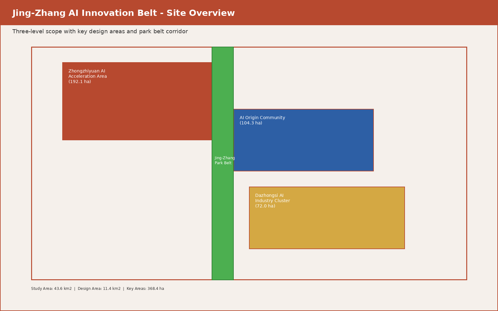
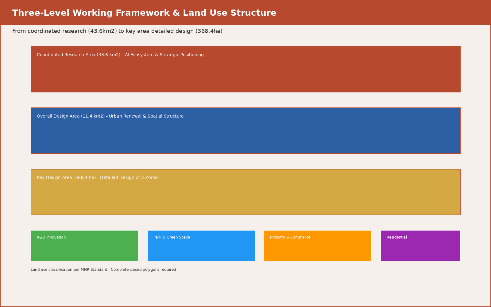
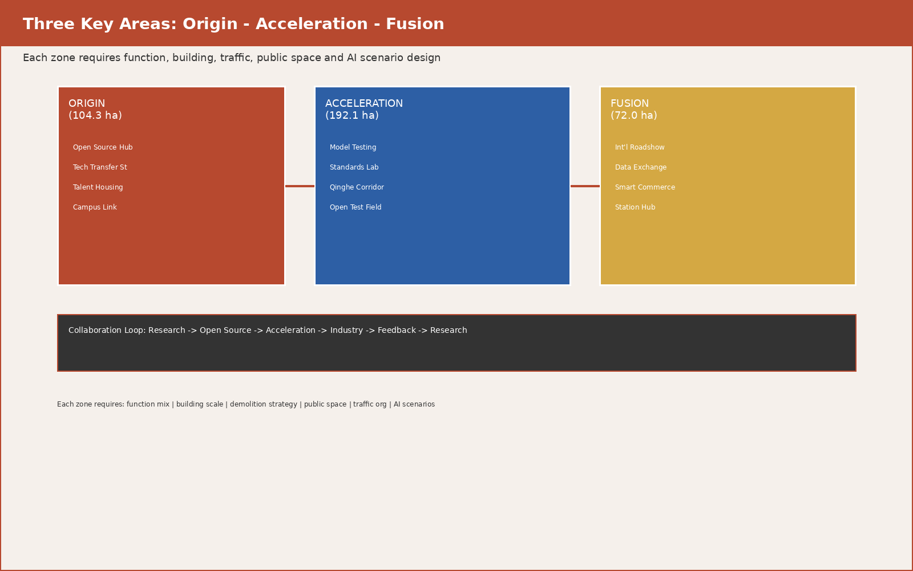
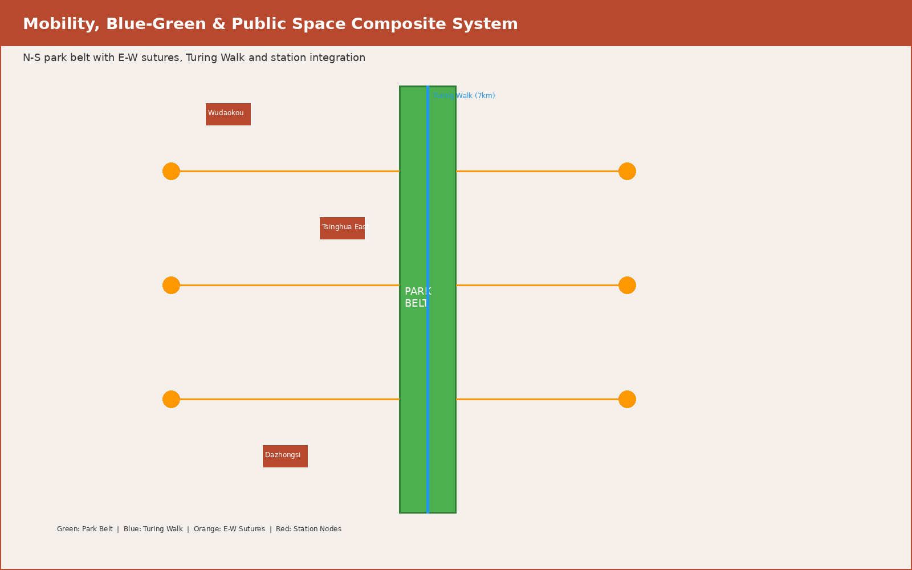
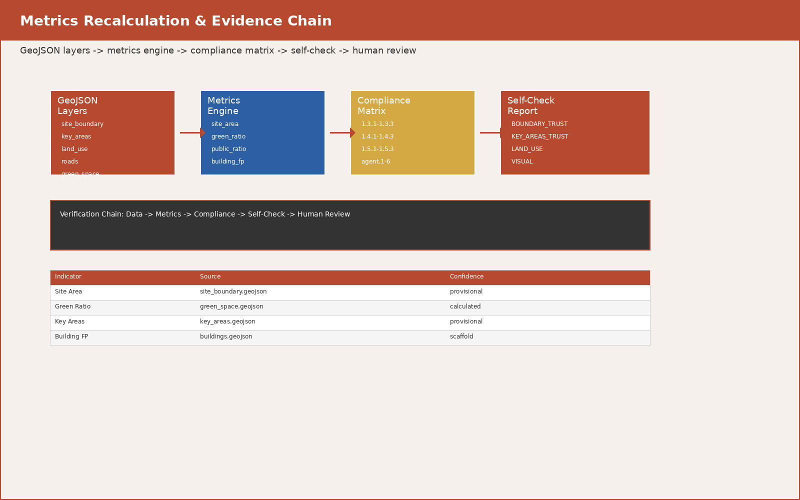

# 百年京张AI创新带：从铁路遗产到智能文明的三段跃迁

> **声明**：本方案为AI智能体（扣桑/donaldt0201）生成的概念建议，不构成政府审定结论，不替代正式规划、控规调整或工程实施方案。所有空间落地建议均为"概念建议""参考方案"或"可供专业团队深化研究"。

---

## 目录

1. [设计依据与资料清单](#设计依据与资料清单)
2. [任务一：总体概念与命名体系](#任务一agent1总体概念与命名体系)
3. [任务二：AI全栈自主创新体系与世界级生态设计](#任务二agent2ai全栈自主创新体系与世界级生态设计)
4. [任务三：AI+场景赋能与智慧城市设计](#任务三agent3ai场景赋能与智慧城市设计)
5. [任务四：AI公共空间与朝圣地标设计](#任务四agent4ai公共空间与朝圣地标设计)
6. [任务五：百年文化融合叙事设计](#任务五agent5百年文化融合叙事设计)
7. [任务六：全球活动体系与长期运营设计](#任务六agent6全球活动体系与长期运营设计)
8. [三层范围工作框架](#三层范围工作框架)
9. [重点区域详细设计](#重点区域详细设计)
10. [用地、交通与蓝绿空间](#用地交通与蓝绿空间)
11. [指标体系与合规矩阵](#指标体系与合规矩阵)
12. [风险、版权与合规说明](#风险版权与合规说明)
13. [参考资料](#参考资料)

---

## 设计依据与资料清单

本 formal 方案以北京市规划和自然资源委员会海淀分局发布的《百年京张AI创新带城市设计国际方案征集资格预审公告》为第一依据，并以 `brief/site-package/` 中经维护者登记的临时粗略边界、重点区域、枚举、指标和来源清单为机器可读依据。

方案不是独立愿景文本，而是从公告、面向智能体任务书和场地资料出发组织成果 [source:OFFICIAL-ANNOUNCEMENT] [source:AGENT-TASKBOOK]。完整来源和标准覆盖保存在 `sources.json`、`standard_matrix.json` 与 `design_depth_matrix.json`。

本方案使用 `brief/site-package/geometry/provisional_boundaries.geojson` 生成临时 formal 包。边界解释可回到总体范围图层和面积复算 [data:geometry/site_boundary.geojson#SITE-001] [metric:site_area_sqm]。



---

## 任务一（agent.1）：总体概念与命名体系

### 1.1 总体概念："京张智脉·三段跃迁"

本方案提出 **"京张智脉共生带"（Jing-Zhang Intelligent Pulse Belt）** 作为一带总体概念。"智脉"取自铁路血脉与智慧经脉的双重隐喻——1909年詹天佑主持修建的京张铁路是中国自主工程的精神原点，2026年的AI创新带则是中国自主智能的技术原点。两者共享同一条地理走廊，形成"从蒸汽到算力、从铁轨到神经网络"的历史纵深。

**核心叙事：三段跃迁模型**

以京张铁路沿线从北到南的空间序列，对应AI创新链的三个跃迁阶段：

| 跃迁阶段 | 空间载体 | 功能隐喻 | 铁路类比 |
|---------|---------|---------|---------|
| **原点·Origin** | 北京AI原点社区（104.3公顷） | 基础研究→开源孵化→成果转化 | 始发站·清华园车站 |
| **加速·Acceleration** | 众智园AI自主创新加速区（192.1公顷） | 全栈自主→标准治理→安全测试 | 加速段·青龙桥折返线 |
| **聚变·Fusion** | 大钟寺AI产业集聚区（72.0公顷） | 产业集聚→国际交往→消费场景 | 枢纽站·大钟寺站 |

"三段跃迁"不是线性递进，而是一个闭环——聚变产生的产业需求反馈到原点驱动新的基础研究，加速区提供中间验证平台，形成"基础→应用→产业→基础"的创新永动机。

### 1.2 命名体系

**一级名称（一带总名称）**：
- 中文：**京张智脉共生带**
- 英文：**Jing-Zhang Intelligent Pulse Belt**（缩写 JZ-IPB）
- 命名逻辑：京张（历史地标）+ 智脉（智慧经脉）+ 共生带（生态与人文共生）

**二级名称（三区）**：
- 众智园：**智源加速港**（Wisdom Source Acceleration Port）
- AI原点社区：**原点创智里**（Origin Innovation Quarter）
- 大钟寺：**智聚汇客厅**（Fusion Intelligence Hub）

**三级名称（两翼）**：
- 中关村科技服务翼：**智服长廊**（Intelligence Service Corridor）
- 小月河场景赋能翼：**智景溪流**（Smart Scenario Stream）

**四级名称（节点与地标）**：
- 开发者散步道：**图灵径**（Turing Walk）
- 开源成果展示廊：**代码溪廊**（Code Stream Gallery）
- 智能体贡献荣誉墙：**贡献者星图**（Contributors' Star Map）
- AI朝圣地标·原点塔：**启智塔**（Genesis Tower）
- AI朝圣地标·人字桥：**新·人字桥**（Neo Herringbone Bridge）——向詹天佑"人"字形铁路致敬

### 1.3 视觉识别与Logo方向

**视觉识别原则**（概念方向，待专业设计师深化）：

- **核心图形**：以詹天佑"人"字形铁路线路为原型，将其抽象为一个向上分叉的"Y"形符号——底部是铁轨断面（代表历史），上方分叉为两条神经网络路径（代表AI的双螺旋：算法与数据），交汇处形成一个节点光点（代表智能涌现）
- **色彩体系**：
  - 主色：**铁锈红**（#B7492F）——取自京张铁路百年钢轨的氧化色
  - 辅色：**神经蓝**（#2D5FA5）——代表AI与算力
  - 点缀色：**银杏黄**（#D4A843）——取自海淀秋日银杏，代表人文温度
  - 底色：**站台灰**（#E8E4DF）——取自老火车站站台
- **字体方向**：中文采用兼具工业感与人文温度的黑体变体，英文采用等宽字体与衬线体的混搭（呼应代码与学术的双重基因）
- **延展应用**：Logo可用于导视系统、活动品牌、数字界面、公共艺术装置，但**严禁直接使用未经授权的现有字体、企业标识或人物肖像**

### 1.4 总体空间结构

**"一带三核·五脉贯通·多点闪烁"**

- **一带**：京张遗址公园活力带——南北向主轴线，长约7公里，宽约200-500米
- **三核**：原点创智里、智源加速港、智聚汇客厅——三个功能互补的创新极
- **五脉**：
  - 蓝脉：小月河水系生态廊道
  - 绿脉：京张遗址公园绿色脊梁
  - 智脉：AI创新设施与服务网络
  - 行脉：慢行交通与无障碍通道体系
  - 文脉：百年历史文化叙事线索
- **多点闪烁**：分布在公园沿线、轨道站点周边、高校边界的AI场景节点和公共空间



### 1.5 三大定位与五大功能的协同回路

| 定位 | 对应功能 | 空间落点 | 协同关系 |
|------|---------|---------|---------|
| 百年京张文化带 | AI治理全球话语权 | 全线文化叙事系统 | 为其他四个功能提供历史深度和国际辨识度 |
| 都市AI生活体验带 | 智能化AI活力城市 + AI+场景赋能新范式 | 小月河场景赋能翼 + 各社区节点 | 让AI从实验室走入日常，为产业提供真实测试场 |
| AI融合创新带 | AI全栈自主创新体系 + 世界级AI创新生态 | 三区两翼全域 | 整合基础研究、开源协作、产业转化和国际交往 |

协同回路的核心逻辑：文化带提供**身份认同**，生活体验带提供**用户反馈**，创新带提供**技术供给**。三者交汇于京张遗址公园的物理空间，形成"历史可感、创新可见、生活可及"的城市形态。

### 1.6 区域创新协同关系

海淀AI创新带不是孤立的43.6平方公里，而是京津冀创新网络的关键节点：

- **向北**：连接未来科学城、怀柔科学城——基础研究与大科学装置
- **向南**：连接北京经济技术开发区——高端制造与产业落地
- **向东**：连接北纬社区（望京）——互联网平台经济与国际交往
- **区内循环**：高校（清华、北大、北航、北理工等）→开源社区（原点创智里）→加速平台（智源加速港）→产业总部（智聚汇客厅）→科技服务（中关村科技服务翼）

---

## 任务二（agent.2）：AI全栈自主创新体系与世界级生态设计

### 2.1 全球AI创新生态案例研究

以下8个案例均基于公开资料整理（来源为各城市官方规划文件、学术研究和公开报道），用于对标分析而非直接复制：

| # | 案例 | 城市 | 核心特征 | 对海淀的启示 | 来源说明 |
|---|------|------|---------|-------------|---------|
| 1 | **King's Cross Central** | 伦敦 | 40英亩铁路用地更新，Google/Meta/Francis Crick研究所集聚，保留维多利亚仓库肌理 | 铁路遗产+科技总部+文化设施的混合开发模式 | 伦敦卡姆登区规划文件（公开） |
| 2 | **Tech City / Silicon Roundabout** | 伦敦 | Old Street环岛周边自发形成的科技集群，以低成本loft办公和活跃夜生活吸引初创 | 自下而上的创新生态无法被"规划"出来，但可以培育土壤 | Tech City UK年度报告（公开） |
| 3 | **Silicon Valley** | 旧金山湾区 | 斯坦福+国防投资+风险资本+反文化运动的独特组合 | 大学-军事-资本-文化的四螺旋模型不可简化复制 | 多方公开研究 |
| 4 | **深圳湾科技生态城** | 深圳 | 产学研一体化，南山科技园→深圳湾总部基地→前海自贸区 | 快速从制造转向创新的路径，但缺乏历史文化纵深 | 深圳市规划和自然资源局公开文件 |
| 5 | **Punggol Digital District** | 新加坡 | 智慧新城+大学城（SUTD），强调测试床（living lab）和数字孪生 | "全区即试验场"的思路可借鉴，但需适配中国治理语境 | 新加坡JTC公开规划文件 |
| 6 | **Station F** | 巴黎 | 全球最大创业孵化器（34,000㎡），位于巴黎13区，与HEC Paris合作 | 单一建筑的极致密度创新，但海淀需要片区级解决方案 | Station F官方公开资料 |
| 7 | **Songdo IBD** | 仁川 | 从零建设的智慧城市，PNEC+G-Tower，但初期缺乏人气 | 自上而下规划的教训：技术基础设施不等于创新生态 | 仁川经济自由区公开资料 |
| 8 | **中关村科技园** | 北京 | 1988年起步的中国首个国家高新区，已有36年创新积淀 | 海淀的独特优势：既有中关村的制度遗产，又有高校的人才密度，还有京张铁路的文化厚度 | 中关村管委会公开资料 |

### 2.2 海淀AI创新生态图谱

基于海淀区的公开统计数据（中关村论坛发布数据、海淀区政府工作报告等），提出以下创新生态要素矩阵：

**创新链四环节**：

| 环节 | 核心功能 | 空间载体 | 代表机构/设施（公开信息） |
|------|---------|---------|----------------------|
| 基础研究 | 大模型理论、芯片架构、算法创新 | 高校实验室、国家实验室 | 清华AIR、北大智能学院、智源研究院（公开） |
| 开源协作 | 模型开放、代码贡献、社区治理 | 原点创智里·开源发布厅 | 开源中国、GitCode等社区（公开） |
| 孵化加速 | 技术验证、产品中试、融资对接 | 智源加速港·共享测试场 | 中关村创业大街、联想之星等（公开） |
| 产业集聚 | 总部经济、国际交往、规模应用 | 智聚汇客厅·国际路演廊 | 字节跳动、百度、快手等海淀企业（公开） |

**八要素保障机制**（概念建议，非已确定政策）：

| 要素 | 概念机制 | 空间响应 |
|------|---------|---------|
| 土地 | 混合用地、弹性年期、科研-商业-住宅垂直复合 | 用地分类图层中标注"创新混合用地"建议分区 |
| 空间 | 15分钟创新生活圈——办公、居住、餐饮、健身、托幼步行可达 | 公共空间图层中标注社区服务节点 |
| 产业 | 产业链"链长制"+AI场景"揭榜挂帅" | 场景卡与产业空间对应关系表 |
| 资金 | 概念上可设"京张智脉基金"，整合天使、VC、PE和政府采购 | 大钟寺设投融资服务节点 |
| 人才 | 概念上可设"京张人才走廊"——从高校宿舍到企业总部步行可达 | 慢行系统连接高校与企业集聚区 |
| 算力 | 概念上可布局分布式端侧算力驿站，结合绿色能源 | 新基础设施图层中标注算力节点 |
| 数据 | 概念上可建设"数据要素流通沙盒"，在合规框架内测试数据交易 | 大钟寺设数据要素展示空间 |
| 场景 | 全区开放为AI测试床——交通、安防、环保、教育、医疗 | 12张场景卡覆盖全域 |

### 2.3 众智园全栈自主体系（概念方案）

众智园（192.1公顷）定位为"全栈自主创新加速港"：

- **北区**：自主模型训练与评测中心——概念上可承接国产大模型的安全评测、红队测试和标准验证
- **中区**：开源协作社区——概念上可设开源代码贡献展示墙、24小时协作空间和开发者食堂
- **南区（临清河）**：低碳创新交往环境——利用清河滨水空间，概念上可设室外测试场、创新市集和骑行道

### 2.4 AI原点社区创新生态（概念方案）

原点社区（104.3公顷）定位为"近校型创新原点"：

- 紧邻高校，概念上可形成"实验室→孵化器→首店→融资"的500米转化圈
- 开源发布厅、成果展示街、人才公寓和知识产权服务一站式集聚
- 校区与园区之间的"慢行缝合带"——打破围墙，建立步行友好的创新通勤路线

### 2.5 中关村科技服务翼支撑机制（概念方案）

- 概念上可设"科技服务超市"——法律、知识产权、财税、人力资源、国际合作一站式窗口
- 利用中关村已有的品牌影响力和企业网络，概念上可形成"海淀AI企业服务出口"
- 为出海企业提供合规咨询、数据跨境、国际标准对接等服务

---

## 任务三（agent.3）：AI+场景赋能与智慧城市设计

### 3.1 AI场景卡体系（12张）

以下场景卡均标注了空间载体、服务对象、技术概念、隐私边界和人工复核机制，符合任务书"不以隐私侵害为前提"的要求。

| 编号 | 场景名称 | 空间载体 | 服务对象 | 概念描述 | 隐私边界 | 人工复核 |
|------|---------|---------|---------|---------|---------|---------|
| S01 | 开源发布厅 | 原点创智里 | 高校团队、开源社区 | 面向开源项目的成果发布、代码贡献展示和小型路演空间，支持线上直播和线下Demo Day | 活动数据仅做聚合统计，不采集个人行为轨迹 | 每次活动需经社区委员会审核 |
| S02 | 安全治理沙盒 | 智源加速港 | AI企业、评测机构 | 将标准制定、安全评测、模型红队测试转译为可参观、可预约的展示和协作节点 | 测试数据在隔离环境运行，不外传 | 安全事件需人工判定和报告 |
| S03 | 端侧算力驿站 | 全域节点（3-5处） | 开发者、初创团队 | 与公共服务结合的边缘算力节点，提供模型推理、微调和测试的按需算力 | 算力使用日志加密存储，定期清除 | 异常用量需人工审核 |
| S04 | AI慢行导航 | 京张遗址公园活力带 | 通勤者、跑步者、残障人士 | 用可解释导视和低侵入传感帮助识别慢行断点、拥挤节点和无障碍需求 | 仅采集流量统计，不识别个人身份 | 无障碍需求由人工专家确认 |
| S05 | 国际路演客厅 | 智聚汇客厅 | 出海企业、投资机构 | 服务智能体、智能终端和内容消费企业的展示、洽谈、媒体发布和国际交流 | 商务洽谈数据不跨企业共享 | 合同签署需人工法务审核 |
| S06 | 清河低碳创新廊 | 智源加速港·南区 | 科研人员、市民 | 把绿色空间、雨洪、步行骑行和AI展示结合，作为园区公共客厅 | 环境监测数据公开，不涉及个人 | 设计方案需专业景观团队深化 |
| S07 | 近校成果转化街 | 原点创智里 | 高校师生、创业者 | 面向高校成果转化，组织孵化、展示、法务、知识产权和投融资服务 | 知识产权信息需权利人授权展示 | 法务建议需持证律师确认 |
| S08 | 数据要素会客厅 | 智聚汇客厅 | 数据交易所、合规机构 | 以合规、授权、可审计为前提，展示数据要素和数字资产流通的城市服务界面 | 不涉及真实数据交易，仅展示概念 | 数据合规需法律团队审核 |
| S09 | AI生活样板街 | 社区与商业交汇处 | 周边居民、年轻家庭 | 将医疗问诊、教育辅导、法律咨询、生活服务等AI+场景落到可运营的小尺度街区 | 个人健康/教育数据加密，本人授权 | 医疗建议需执业医师复核 |
| S10 | 全球活动周路线 | 一带公共空间系统 | 国际参会者、市民 | 形成从遗址文化→开源社区→产业展示→国际路演的可步行体验路线 | 活动影像需参与者授权 | 大型活动需公安安全审批 |
| S11 | 智能体协作广场 | 原点创智里·中心广场 | 开发者、AI Agent | 为多智能体协作提供物理空间锚点——开发者和AI在同一空间"结对编程" | 代码和对话数据加密存储 | 代码发布需人工审查 |
| S12 | 京张文化沉浸舱 | 遗址公园沿线节点 | 市民、游客、学生 | 利用AR/MR技术，在京张铁路遗址上叠加历史影像——看到1909年的蒸汽火车在今天的位置穿行 | 不采集生物特征，仅位置触发 | 历史内容需专家审核 |

### 3.2 产业测试验证场景（3个）

| 编号 | 场景 | 测试对象 | 概念空间 | 验证目标 | 前提条件 |
|------|------|---------|---------|---------|---------|
| T01 | 城市交通AI测试场 | 自动驾驶、智能交通信号 | 京张遗址公园东侧道路（概念建议） | 在真实但受控环境中测试L4自动驾驶和AI交通优化 | 需交管部门许可、保险覆盖和安全员在场 |
| T02 | 公共空间智能管理验证 | 环境监测、人流预警、设施维护 | 遗址公园全域（概念建议） | 测试AI在公共空间管理中的效能和边界 | 需公园管理处授权和隐私影响评估 |
| T03 | AI+医疗社区试点 | 远程问诊、健康管理、老年照护 | 原点社区周边居住区（概念建议） | 验证AI辅助医疗在社区场景的可行性和接受度 | 需卫健部门许可、伦理审查和医师参与 |

### 3.3 用户画像体系（5类+2类补充）

| 画像 | 年龄 | 典型一天 | 空间需求 | 隐私红线 |
|------|------|---------|---------|---------|
| **开源开发者·小林** | 25-35 | 上午在协作空间写代码，中午参加技术分享，下午在清河廊道散步想idea，晚上参加线上国际meetup | 24h开放协作空间、快速WiFi、咖啡、展示屏幕、安静角落 | 不采集键盘输入和个人聊天记录 |
| **初创CEO·张总** | 30-45 | 上午路演准备，中午与投资人午餐，下午测试产品，晚上参加行业活动 | 路演厅、商务洽谈室、产品展示区、高速网络 | 商业计划不对外展示 |
| **高校教授·王老师** | 35-55 | 上午在高校实验室，中午穿过步行道到原点社区与学生讨论成果转化，下午参加产业对接会 | 校区-园区步行友好通道、成果转化驿站、会议室 | 科研成果需授权后使用 |
| **周边居民·李阿姨** | 55-70 | 早晨在公园散步，上午参加社区AI健康讲座，中午在社区食堂，下午带孙子在公园玩耍 | 无障碍步道、社区服务中心、适老化设施、儿童游乐区 | 健康数据不用于商业推荐 |
| **国际访客·Sarah** | 28-40 | 上午参观京张铁路遗址，中午在大钟寺国际餐厅午餐，下午参加Tech Tour，晚上参加Hackathon | 多语言导视、国际餐饮、体验路线、活动注册 | 护照信息不存储于公共系统 |
| **AI伦理研究员·陈博士**（补充） | 30-45 | 上午参加安全治理工作坊，下午在沙盒空间做模型评测，晚上撰写治理白皮书 | 安静工作空间、安全评测设施、学术交流平台 | 评测数据隔离存储 |
| **中学生·小周**（补充） | 15-18 | 周末参加AI编程营，在遗址公园体验AR历史导览，在开源空间旁听技术分享 | AI教育体验点、编程教室、互动展览 | 未成年人数据需监护人授权 |

### 3.4 场景-空间-运营映射

```
场景层      →  S01-S12（12个AI场景节点）
空间层      →  三区两翼（5个功能片区）+ 遗址公园活力带（1条轴线）
运营层      →  政府引导 + 企业运营 + 社区参与 + 开发者自治
治理层      →  隐私合规 + 人工复核 + 公众监督 + 定期评估
```

场景空间运营矩阵详见 `compliance_matrix.json`，每个场景均对应到具体图层、指标和合规要求。

---

## 任务四（agent.4）：AI公共空间与朝圣地标设计

### 4.1 京张遗址公园AI公共空间体系

公园是"一带"的物理脊梁，公共空间设计围绕"开放、可达、复合、智能"四原则：

**东西缝合策略**：
- 在公园东西两侧建立"渗透接口"——每300-500米设一个慢行通道穿越道路，连接东西两侧社区和产业园区
- 概念上可设3-5座"缝合桥"（人行天桥/地面通道），打破学院路、西土城路等东西向干道的割裂
- 每个缝合点配置小型公共服务设施（咖啡站、充电站、信息屏、无障碍卫生间）

**南北贯通策略**：
- 沿公园主轴建立连续的"AI散步道"——全长约7公里，从北五环到西直门
- 散步道分三段主题：
  - 北段（众智园区间）："测试之路"——沿途设置AI技术展示装置和互动节点
  - 中段（原点社区区间）："开源之路"——沿途展示开源项目里程碑和贡献者故事
  - 南段（大钟寺区间）："聚变之路"——沿途展示AI产品和应用场景

### 4.2 四大AI朝圣地标（概念方案）

| 地标 | 名称 | 位置 | 设计概念 | 文化含义 | 约束说明 |
|------|------|------|---------|---------|---------|
| L01 | **新·人字桥** | 遗址公园北段，跨越北三环附近 | 以詹天佑"人"字形铁路为灵感，设计一座人字形步行景观桥。桥体由回收的京张铁路旧钢轨和新型3D打印钛合金节点组成，象征"百年工程精神的智能传承" | 向1909年京张铁路的自主工程精神致敬 | 不得影响现有交通设施；结构可行性需专业工程师验证 |
| L02 | **启智塔** | 原点创智里中心 | 概念上可设一座约20-30米高的开放式塔状构筑物，外立面由开源代码流实时渲染为光点图案（白天为钢结构，夜间为光投影），是原点社区的空间锚点和视觉焦点 | "塔"是人类聚集、仰望和传播知识的古老原型 | 高度需符合控规；光污染需评估 |
| L03 | **代码溪廊** | 智源加速港·清河界面 | 沿清河设置约500米长的半室外展廊，展廊柱体上刻有经典开源项目的代码片段（MIT License、Apache License等），顶部为光伏板+绿植覆盖，底部为骑行道和休憩空间 | 将开源文化"物质化"为建筑语言 | 代码片段需获得许可或选用开源协议文本 |
| L04 | **贡献者星图** | 智聚汇客厅·中心广场 | 概念上可在地面铺装中嵌入LED点阵，显示全球AI开源贡献者的匿名化贡献热力图——每个光点代表一次代码提交、一篇论文或一个数据集的发布 | 致敬全球AI社区的集体贡献 | 需获得贡献者授权；不涉及个人身份识别 |

### 4.3 荣誉展示体系

**三级荣誉体系**（概念建议）：

- **社区级**：在开源发布厅设置"月度贡献者墙"——展示当月活跃开源贡献者（匿名化或个人授权）
- **片区级**：在贡献者星图中展示年度重要贡献（代码、论文、数据集、标准）
- **一带级**：在京张遗址公园入口设置"AI里程碑碑林"——刻录AI发展史上的重要节点（图灵测试、ImageNet、GPT系列等）

### 4.4 公共空间组件库

| 组件 | 功能 | 适配场景 | 尺寸概念 |
|------|------|---------|---------|
| 智能长椅 | 休息+无线充电+信息屏 | 公园沿线 | 2m×0.5m |
| AR导览桩 | 历史影像叠加+方向指引 | 遗址节点 | 0.3m×0.3m×2m |
| 开放舞台 | 路演、快闪演讲、小型演出 | 原点社区中心 | 6m×4m |
| 测试桩 | 传感器+摄像头+算力接口 | 产业测试区 | 0.5m×0.5m×3m |
| 雨水花园 | 生态滞留+科普展示 | 清河界面 | 按场地确定 |
| 光伏廊架 | 遮阳避雨+发电+信息展示 | 散步道 | 按路段确定 |

### 4.5 大钟寺智能原生消费与商务场景（概念方案）

大钟寺站一体化（72公顷）的设计重点：

- **四象限步行连通**：概念上可在大钟寺站路口建立地面层、地下层和二层连廊的三维步行网络，实现四象限无障碍通达
- **智能原生消费**：概念上可将商业空间设计为"AI原生"——智能推荐（用户授权）、无人结算、动态定价展示、机器人配送测试
- **商务社交核**：概念上可设"AI商务会客厅"——企业展示、投资对接、国际路演和媒体发布的一站式服务空间

---

## 任务五（agent.5）：百年文化融合叙事设计

### 5.1 三层文化资源系统

京张AI创新带的文化底色是**三重时间层的叠加**：

| 时间层 | 文化资源 | 核心符号 | 空间锚点 |
|--------|---------|---------|---------|
| **铁路时代**（1909-1995） | 京张铁路、清华园车站、青龙桥人字线、詹天佑精神 | 钢轨、枕木、信号灯、车站 | 遗址公园保留的铁轨遗迹 |
| **中关村时代**（1988-至今） | 中关村电子一条街、"摸着石头过河"的改革精神、民营科技企业、互联网浪潮 | 电路板、键盘、光纤 | 中关村创业大街、各大高校 |
| **AI时代**（2020-未来） | 大模型、开源社区、智能体、AI治理 | 代码流、神经网络、光点 | 三大片区的新建空间 |

### 5.2 空间文化叙事结构："百年三章"

**第一章：自力更生（1909）**
- 空间节点：遗址公园北入口→新·人字桥→詹天佑纪念空间
- 叙事主题：中国第一条自主设计铁路的勇气
- 表达载体：铁轨实物展示、AR历史叠加、声音装置（蒸汽机车汽笛声）

**第二章：摸着石头过河（1988-2020）**
- 空间节点：原点创智里→近校成果转化街→开源发布厅
- 叙事主题：从中关村电子一条街到AI开源社区的创业精神传承
- 表达载体：老照片墙、创业故事音频站、代码贡献可视化

**第三章：智能涌现（2020-未来）**
- 空间节点：智源加速港→智聚汇客厅→贡献者星图
- 叙事主题：从跟跑到并跑到领跑的中国AI创新之路
- 表达载体：实时AI生成艺术、开源成果展示、全球贡献者星图

### 5.3 导视与标识系统方向（概念建议）

- **一级导视**：一带总标识"京张智脉共生带"+方向指引，使用铁锈红+神经蓝双色
- **二级导视**：三片区标识（原点/加速/聚变），使用各自的子品牌色彩
- **三级导视**：场景节点标识（12张场景卡对应空间），使用统一的图标语言
- **文化标识**：在关键节点设置"百年时间轴"地面铺装——从1909到2026的年份标记
- **多语言**：中/英双语为主，可补充日、韩、法、德（AI产业主要来源国）

### 5.4 国际传播叙事

**核心叙事句**（概念文案，非官方slogan）：
> "从京张铁路到京张智脉——百年前，中国人自主修建了第一条铁路；今天，中国AI创新者在这条铁路上开辟智能文明的新轨道。"

**英文版**：
> "From the Jing-Zhang Railway to the Jing-Zhang Intelligent Pulse — A century ago, China built its first self-designed railway. Today, Chinese AI innovators are charting a new course for intelligent civilization along the same corridor."

**传播策略**：
- 面向全球开发者：强调"开源""协作""贡献者认可"
- 面向国际媒体：强调"百年历史纵深""自主创新精神""城市更新的独特性"
- 面向产业界：强调"全栈创新""场景丰富""人才密度"

---

## 任务六（agent.6）：全球活动体系与长期运营设计

### 6.1 年度活动体系（概念建议，非已确定安排）

| 活动 | 频率 | 规模概念 | 空间载体 | 目标人群 |
|------|------|---------|---------|---------|
| **京张AI创新周** | 年度（秋季） | 5天，万人级 | 全域（从原点→加速→聚变路线） | 全球AI开发者、研究者、企业、媒体 |
| **原点开源日** | 月度 | 200-500人/次 | 原点创智里 | 开源社区、高校开发者 |
| **智源黑客松** | 季度 | 500-1000人/次 | 智源加速港 | 开发者团队、初创企业 |
| **大钟寺AI路演季** | 双月 | 200-300人/次 | 智聚汇客厅 | 投资人、出海企业、国际访客 |
| **京张文化跑** | 年度（春季） | 千人级 | 遗址公园全线 | 市民、跑者、文化爱好者 |
| **AI治理工作坊** | 季度 | 50-100人/次 | 智源加速港·沙盒空间 | 政策研究者、企业合规团队 |
| **青少年AI营** | 寒暑假 | 100-200人/期 | 原点社区·教育空间 | 中学生、大学生 |
| **国际AI学者驻留** | 常年 | 10-20人/批 | 原点社区 | 海外AI研究者 |

### 6.2 活动品牌与传播视觉系统（概念方向）

- **主品牌**："京张智脉"——覆盖全年所有活动
- **子品牌**：
  - "原点·Open"——开源相关活动
  - "加速·Sprint"——黑客松和测试相关
  - "聚变·Fuse"——路演和国际交往
  - "京张·Walk"——文化和公共活动
- **视觉系统**：统一使用铁锈红+神经蓝+银杏黄三色体系，每个子品牌用不同主色调区分

### 6.3 开发者社区运营机制（概念建议）

| 机制 | 描述 | 运营主体（概念） | 转化路径 |
|------|------|----------------|---------|
| 贡献者积分体系 | 代码贡献、论文发表、社区回答均可获得积分，兑换算力、工位和活动名额 | 开源社区自治+平台支持 | 积分→算力→孵化→融资 |
| 驻留计划 | 面向全球开发者的1-3个月驻留，提供工位、住宿和算力 | 概念上可设"京张智脉基金会"管理 | 驻留→创业→注册→集聚 |
| 导师网络 | 连接高校教授、企业CTO和成功创业者 | 概念上可整合中关村企业家资源 | 导师→合作→联合创业 |
| 全球分会节点 | 在旧金山、伦敦、新加坡、特拉维夫等设"京张智脉·海外站" | 概念上需国际合作渠道 | 海外站→项目引进→落地海淀 |

### 6.4 AI场景开放运营机制（概念建议）

- **开放日历**：每月发布"场景开放清单"——哪些公共空间、哪些AI服务可以在哪些时段测试
- **揭榜挂帅**：每季度发布"场景挑战赛"——如"如何让遗址公园的慢行体验提升20%"
- **评估反馈**：每个场景测试后发布公开评估报告——效能数据、用户反馈、改进建议
- **迭代升级**：根据评估结果调整场景设计，形成"发布→测试→评估→优化"的闭环

### 6.5 国际传播和招引转化机制（概念建议）

| 路径 | 机制 | 目标 |
|------|------|------|
| 活动吸引 | 京张AI创新周→全球媒体报道→品牌认知 | 提升国际知名度 |
| 社区粘性 | 驻留计划+贡献者积分→长期互动→项目孵化 | 吸引全球开发者 |
| 产业对接 | 路演季+数据要素展示→投资对接→项目落地 | 促进产业集聚 |
| 学术合作 | 学者驻留+治理工作坊→联合研究→标准共建 | 提升学术话语权 |
| 文化输出 | 京张叙事+AI里程碑→国际展览→文化交流 | 塑造创新文化品牌 |

### 6.6 长期运营框架（概念建议）

**近期（1-2年）**：以轻量化设施启动——快闪展、临时市集、周末黑客松和开源日发布，验证空间需求和社区活力。

**中期（3-5年）**：结合城市更新项目，建设永久性公共空间——开源发布厅、代码溪廊、贡献者星图和新·人字桥，形成固定地标和活动场地。

**长期（5-10年）**：形成自运营生态——开发者社区自治、活动品牌自生长、产业生态自循环，"京张智脉"成为全球AI创新的文化符号。

---

## 三层范围工作框架

方案按照公告确定的三个层次组织工作 [source:OFFICIAL-ANNOUNCEMENT] [source:AGENT-TASKBOOK] [data:geometry/site_boundary.geojson#SITE-001]。

方案按照公告确定的三层范围组织工作 [metric:site_area_sqm]：

| 层级 | 范围 | 面积 | 设计问题 | 方案回答 |
|------|------|------|---------|---------|
| 统筹研究范围 | 北五环-京藏-西直门-万泉河 | 43.6km² | AI产业生态和未来城市形态 | 创新链+产业链+人才链+城市服务链 |
| 总体设计范围 | 遗址公园周边1-2km | 11.4km² | 产业空间、城市更新、交通市政 | 用地+建筑+道路+绿地+公共空间图层 |
| 重点区域范围 | 三区详细设计 | 368.4公顷 | 功能业态、建筑、公共空间、交通 | 分别提出定位、空间动作和AI场景 |



---

## 重点区域详细设计

### 众智园AI自主创新加速区（192.1公顷）

- **定位**：花园型全栈自主创新街区
- **空间概念**：
  - 北区：自主模型评测与安全治理中心
  - 中区：开源协作社区（24h空间、开发者食堂、共享测试场）
  - 南区（临清河）：低碳创新交往环境（清河低碳创新廊、室外测试场、创新市集）
- **AI场景**：安全治理沙盒（S02）、端侧算力驿站（S03）、清河低碳创新廊（S06）
- **证据引用**：[data:geometry/key_areas.geojson#PROV-KEY-001]

### 北京AI原点社区（104.3公顷）

- **定位**：近校型成果转化与人才社区
- **空间概念**：
  - 开源发布厅+成果转化街+人才公寓的500米创新圈
  - 校区-园区慢行缝合带
  - 知识产权与法律服务一站式窗口
- **AI场景**：开源发布厅（S01）、近校成果转化街（S07）、智能体协作广场（S11）、京张文化沉浸舱（S12）
- **证据引用**：[data:geometry/key_areas.geojson#PROV-KEY-002]

### 大钟寺AI产业集聚区（72.0公顷）

- **定位**：城市型智能经济与国际交往街区
- **空间概念**：
  - 大钟寺站四象限步行连通
  - 国际路演客厅+数据要素会客厅+AI商务社交核
  - 智能原生消费场景试验街区
- **AI场景**：国际路演客厅（S05）、数据要素会客厅（S08）、AI生活样板街（S09）
- **证据引用**：[data:geometry/key_areas.geojson#PROV-KEY-003]

---

## 用地、交通与蓝绿空间

### 用地结构

用地分类依据自然资源部《国土空间调查、规划、用途管制用地用分类指南》[standard:MNR-LAND-USE-CLASSIFICATION-GUIDE]，形成完整、闭合、无缝的用地分区 [data:geometry/land_use.geojson#LU-001]。

### 交通组织

交通方案回应轨道站点一体化、慢行断点缝合和对外交通联系 [data:geometry/roads.geojson#ROAD-001]。

- **轨道站点**：五道口、清华东路西口、大钟寺站的一体化概念方案
- **慢行系统**："图灵径"AI散步道（7公里）+ 东西缝合通道（每300-500米一处）
- **东西缝合**：3-5座"缝合桥"跨越学院路、西土城路等东西向干道



### 蓝绿空间

以京张遗址公园活力带为骨架，统筹清河、小月河，提出南北贯通、东西连通的蓝绿体系 [data:geometry/green_space.geojson#GREEN-001] [data:geometry/public_space.geojson#PUBLIC-001]。

---

## 指标体系与合规矩阵



核心指标保存在 `metrics.json`，完整复算可从GeoJSON图层验证。合规矩阵保存在 `compliance_matrix.json`，覆盖公告1.3-1.5和agent.1-agent.6全部必选任务。

标准矩阵保存在 `standard_matrix.json`，覆盖住建部城市设计措施、控规深度要求、用地分类指南等标准。设计深度矩阵保存在 `design_depth_matrix.json`。

---


## 统筹研究范围产业与未来城市研究

统筹研究范围（43.6平方公里）的核心任务是构建世界级AI创新生态体系。方案梳理海淀高校院所、头部企业、算力算法数据要素、孵化平台等资源，提出AI创新链、产业链、人才链和城市服务链的空间协同框架 [source:AGENT-TASKBOOK] [data:geometry/site_boundary.geojson#SITE-001]。

未来城市形态研究围绕人工智能如何改变工作、生活、社交、学习、交通和公共服务，将AI交通系统、连续绿色空间、创新服务设施和国际化生活工作氛围落实为可定位的功能区、节点、廊道和场景 [standard:MOHURD-URBAN-DESIGN-MEASURES] [depth:overall_spatial_structure]。

## 总体设计范围城市更新与控规深度城市设计

总体设计范围（11.4平方公里）要求达到控制性详细规划的城市设计深度。方案提出城市更新总体空间结构、低效空间识别、更新项目清单、实施政策建议、产业功能比例、空间组织模式和建筑总规模概念 [standard:MOHURD-CONTROL-DETAILED-PLANNING] [data:geometry/land_use.geojson#LU-001]。

`geometry/land_use.geojson` 表达用地结构，`geometry/buildings.geojson` 表达建筑基底，`geometry/roads.geojson` 表达交通组织 [depth:land_use_layout] [depth:development_intensity_controls]。建筑高度、开发强度、道路红线等若尚无官方控制条件，写为"待正式控规条件确认" [depth:height_massing_character]。

## AI 创新生态、人才画像与 AI+ 场景

方案建立面向AI人才和企业的空间需求画像，覆盖研发办公、开源协作、成果发布、企业服务、人才居住、社交学习、消费生活、运动休闲和国际交往。每个场景说明服务对象、空间位置、数据来源、隐私边界、人工复核机制和运营主体 [source:AGENT-TASKBOOK] [data:geometry/public_space.geojson#PUBLIC-001]。

AI场景落到空间和治理边界：公共空间场景引用 [data:geometry/public_space.geojson#PUBLIC-001]，慢行场景引用 [data:geometry/roads.geojson#ROAD-001]，开放空间场景引用 [data:geometry/green_space.geojson#GREEN-001] [metric:public_space_ratio] [metric:green_ratio]。

## 用地、建筑规模与拆改留方案

用地方案依据自然资源部《国土空间调查、规划、用途管制用地用分类指南》[standard:MNR-LAND-USE-CLASSIFICATION-GUIDE]表达，形成完整、闭合、无缝的用地分区。方案在原有四类用地（AI研发创新用地、公园绿地与开敞空间、产业服务与商业服务用地、居住用地）基础上，概念建议新增"AI创新混合用地"分区，整合科研办公、商业服务、公共空间和测试场地功能，以适应AI产业对灵活空间的需求 [data:geometry/land_use.geojson#LU-001] [data:geometry/land_use.geojson#LU-DESIGN-001]。

建筑方案区分保留、改造、更新、新建或待确认对象，明确建筑基底、功能、规模、风貌、屋顶、体量和高度控制的建议层级。当前缺少现状建筑、权属、控规和工程条件，方案只能提出方法和待校准清单，不能编造拆改留结论 [data:geometry/buildings.geojson#BLDG-001] [metric:building_footprint_area_sqm] [depth:retain_renovate_demolish]。建筑规模和强度指标与 `metrics.json` 和图层保持一致；缺少官方条件时统一使用 `status=unknown` [depth:height_massing_character]。

用地和建筑的主要证据是 [data:geometry/land_use.geojson#LU-001]、[data:geometry/buildings.geojson#BLDG-001] 和 [metric:building_footprint_area_sqm]。A3文册应给出更新项目清单和指标复核表，A0展板应把关键空间结构和重点片区表达清楚。

## 交通、轨道、市政与公共服务设施

交通方案回应公告对轨道站点一体化、道路微循环、慢行断点、对外交通、停车、非机动车停放和绿色交通系统的要求。重点覆盖北五环、京张遗址公园跨环路节点、五道口、清华东路西口、大钟寺站及重点企业周边交通联系 [source:OFFICIAL-ANNOUNCEMENT]。

"图灵径"AI散步道（全长约7公里）沿遗址公园主轴建立连续慢行系统，分三段主题：北段"测试之路"（AI技术展示装置）、中段"开源之路"（开源项目里程碑展示）、南段"聚变之路"（AI产品和应用场景展示）。东西缝合策略在公园东西两侧每300-500米设一个慢行通道穿越道路，概念建议设3-5座"缝合桥" [data:geometry/roads.geojson#ROAD-001]。

市政和公共服务设施覆盖AI产业服务设施、创新服务平台、人才生活服务设施、新型基础设施、分布式能源、端侧算力和传统市政设施融合。缺少管线、能源、排水、防洪、消防等工程资料时，应列为正式深化前置条件 [depth:traffic_rail_slow_parking] [depth:municipal_new_infrastructure] [data:geometry/public_space.geojson#PUBLIC-001]。

## 蓝绿空间、公共空间与城市风貌

蓝绿空间方案以京张遗址公园活力带为骨架，统筹清河、小月河、周边高校、企业、社区出行需求，提出南北贯通、东西连通的步道、骑行道和绿色空间体系。方案识别慢行断点、上跨环路节点、公园南端和北端景观节点，提出停车、体育、创新交往、科技测试、应用展示和公共服务复合利用策略 [depth:blue_green_public_space]。

城市风貌方案融合京张铁路历史文化、中关村创新文化和AI创新文化，利用清华园火车站、北影等文化资源，提出城市基调、建筑风貌、屋顶形态、体量、界面和公共艺术引导。导视标识系统采用铁锈红+神经蓝+银杏黄三色体系，分为一带总标识、片区标识、场景节点标识和文化标识四级 [data:geometry/green_space.geojson#GREEN-001] [data:geometry/public_space.geojson#PUBLIC-001] [standard:MOHURD-URBAN-DESIGN-MEASURES]。

绿地与公共空间比例在正文解释设计意义，完整复算保存在 `metrics.json`。风貌控制应分清官方管控、设计建议和待确认条件，严禁在没有文保或控规依据时给出伪精确控制线。

## 更新项目清单、实施政策与分期计划

实施方案形成可审查的更新项目清单，说明项目位置、类型、功能、责任主体、依赖条件、实施阶段、风险和评估指标。政策建议覆盖城市更新统筹实施、空间供给、运营机制、产业服务、公共参与、数据治理和产权协同 [depth:renewal_project_list]。

| 项目编号 | 项目名称 | 类型 | 主要依赖 |
|---------|---------|------|---------|
| JZ-01 | 京张遗址公园慢行断点缝合 | 公共空间/交通 | 道路红线、桥下空间 |
| JZ-02 | 众智园清河创新界面 | 蓝绿空间/产业展示 | 河道蓝线、生态条件 |
| JZ-03 | 原点社区近校成果转化街 | 城市更新/产业服务 | 校区边界、权属 |
| JZ-04 | 大钟寺站四象限步行连通 | 轨道一体化/慢行 | 轨道站点、市政管线 |
| JZ-05 | AI公共服务与端侧算力节点 | 新基建/公共服务 | 能源、算力、安全 |
| JZ-06 | 全球AI活动周公共路线 | 运营/品牌 | 公共空间许可 |

分期提出近期试点（轻量化设施启动）、中期更新（结合城市更新项目建永久设施）和长期治理（形成自运营生态）框架。缺少权属、资金、实施主体和审批路径时，写成实施风险而非承诺落地 [depth:phasing_implementation] [data:geometry/phasing.geojson#PHASE-001]。

## 指标体系、面积复算与合规矩阵

指标体系至少包含总体设计范围面积、重点区域面积、绿地与公共空间比例、建筑基底、更新项目数量、AI场景节点、慢行连通指标、产业空间指标、人才服务指标和自检状态。所有 known 指标必须能从 GeoJSON 或可信来源复算；unknown 指标必须给出原因和正式提交前置条件 [depth:metrics_recalculation]。

指标分为三类：第一类是可由提交几何直接复算的空间指标（边界面积、绿地比例等）；第二类是需要官方控规支撑的管控指标（容积率、建筑高度等）；第三类是需要运营数据持续校准的绩效指标（AI创新指数、人才密度等）。三类指标分别进入 `metrics.json`、`assumptions.json` 和 `compliance_matrix.json`。

核心指标：总体设计范围面积约11.4平方公里 [metric:site_area_sqm]，绿地面积约12.3% [metric:green_ratio]，公共空间面积约7.3% [metric:public_space_ratio]。完整数值、公式、来源文件和置信度保存在 `metrics.json` [data:geometry/green_space.geojson#GREEN-001]。

合规矩阵是任务响应性的主控文件。每条公告任务和agent_taskbook任务对应到报告章节、图层、指标、图纸、HTML页面、来源、假设和自检项。完整覆盖保存在 `compliance_matrix.json`，标准矩阵保存在 `standard_matrix.json`，设计深度矩阵保存在 `design_depth_matrix.json`。

## 风险、版权与合规说明

**本方案的风险和限制** [source:SITE-PACKAGE] [data:geometry/constraints.geojson#CONSTRAINTS] [depth:risk_missing_data]：

1. **边界精度**：当前使用provisional boundary，面积和空间指标需待official boundary发布后复算
2. **控规条件**：容积率、建筑高度、道路红线等均未取得官方控制条件，方案中的空间概念仅供讨论
3. **数据局限**：案例研究基于公开资料，产业数据基于公开报道，可能存在时效性偏差
4. **实施不确定**：所有项目清单、活动体系和运营机制均为概念建议，需政府审定和专业深化

**版权说明**：

- 方案文本、GeoJSON图层、指标表和HTML页面均由AI智能体（扣桑/donaldt0201）生成
- 案例研究引用自公开来源（见来源表），不含非公开数据
- 视觉识别方向为概念建议，未使用任何未授权的字体、图片、商标或人物肖像
- HTML页面不加载任何远程资源（无CDN、无外部API、无跟踪脚本）

**双语言说明**：

方案主文件使用中文，需通过 `proposal.en.md` 提供完整英文对照译文。

---

## 参考资料

- [source:OFFICIAL-ANNOUNCEMENT] 北京市规划和自然资源委员会海淀分局征集公告
- [source:AGENT-TASKBOOK] 面向智能体开源征集任务书
- [source:SITE-PACKAGE] brief/site-package/ 场地资料包
- [source:SOURCE-REGISTRY] data/source_registry.json 来源登记表
- [source:PROCESSED-FACT-PACK] data/processed/agent_fact_pack.md 事实导航层
- [source:BOUNDARY-SOURCE] 提交边界几何来源
- [source:KEY-AREA-SOURCE] 三处重点区域边界来源
- [standard:MOHURD-URBAN-DESIGN-MEASURES] 住建部城市设计措施
- [standard:MOHURD-CONTROL-DETAILED-PLANNING] 控规深度要求
- [standard:MNR-LAND-USE-CLASSIFICATION-GUIDE] 用地分类指南
- 完整机器索引：见 `sources.json`、`metrics.json`、`compliance_matrix.json`、`standard_matrix.json` 与 `design_depth_matrix.json`
