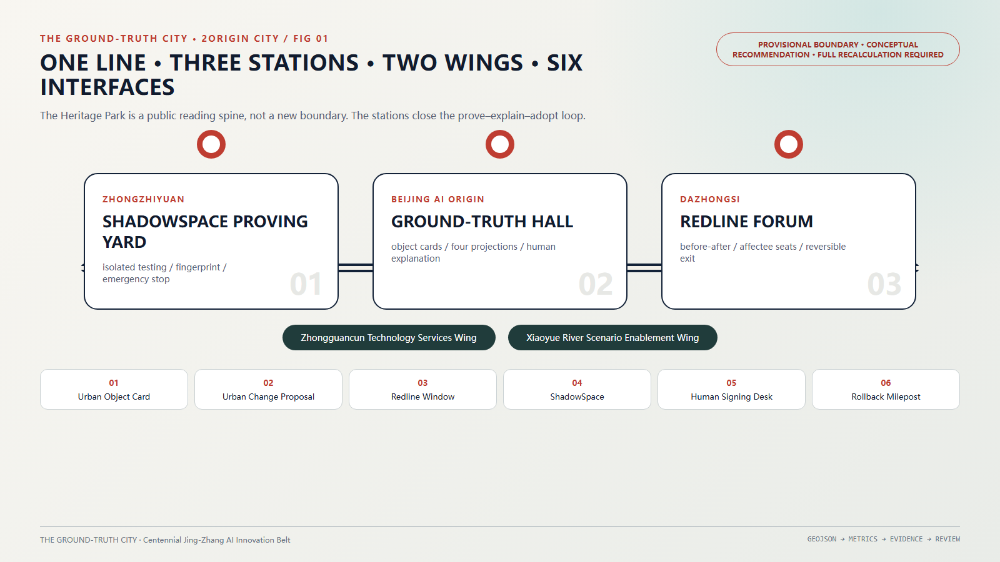
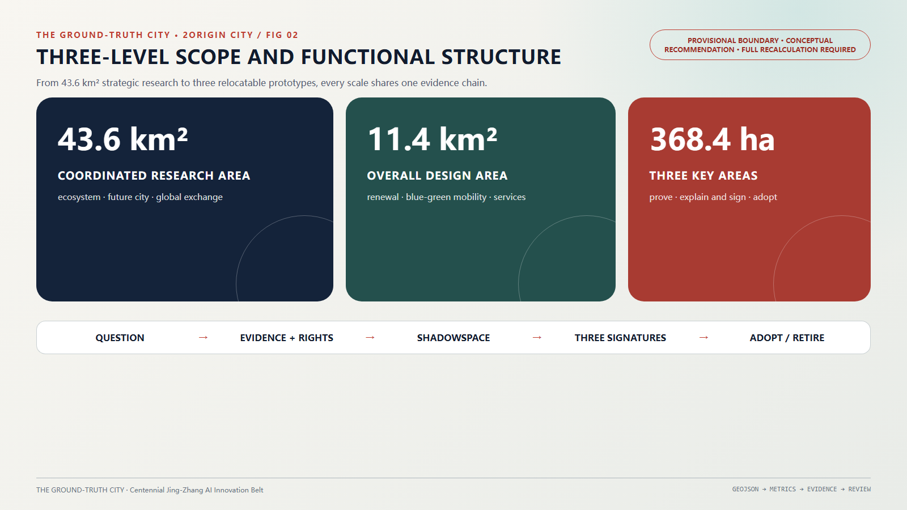
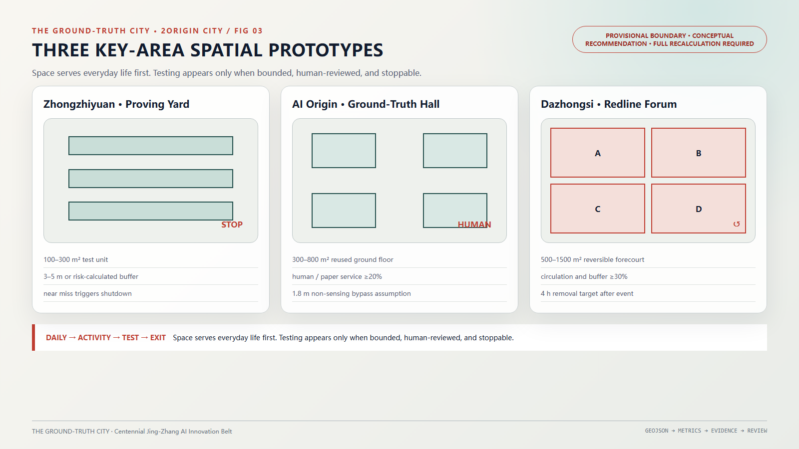
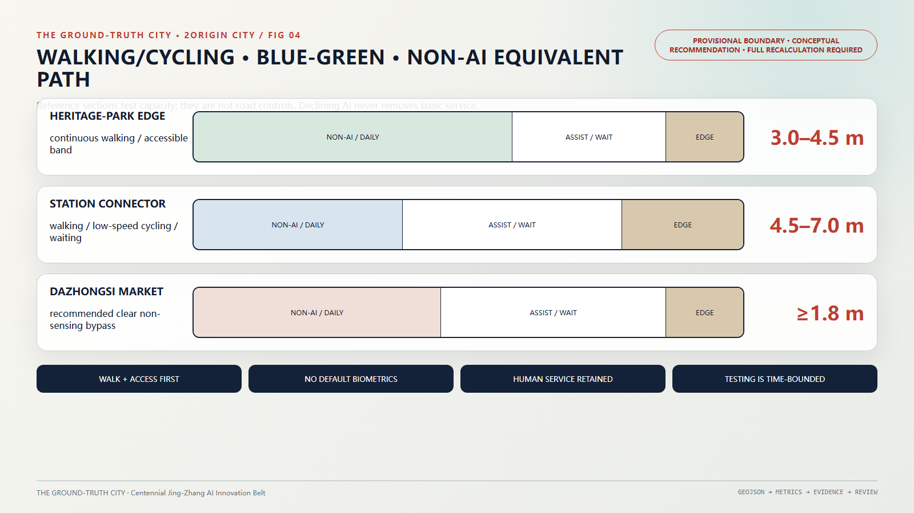
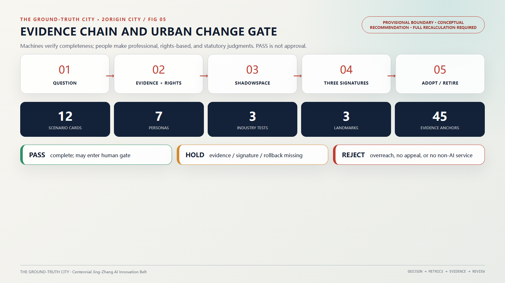

# THE GROUND-TRUTH CITY: A Signable Urban-State Infrastructure for Jing-Zhang

> Cities are first and foremost lived worlds. Protocols arise only when people, space, rights, or shared public resources are to be changed.

“THE GROUND-TRUTH CITY” is not about constructing an omniscient city brain, but about establishing a shared urban change rule set for people, professional teams, and Agents. Any high-impact proposal that alters public space, public services, others’ rights, or shared resources—regardless of whether it comes from AI or a person—must be grounded in verifiable facts and implemented reversibly wherever possible. Irreversible actions must be explicitly marked and pass a heightened gate. The final proposal must be jointly signed through one public threshold by legally authorized parties and representatives of affected groups. Ordinary walking, resting, chatting, or shopping generates no work order; an equivalent non-sensing path along the corridor requires no AI and no login.

The Jing-Zhang Railway once transformed ideas into maintainable systems through surveying, standardized interfaces, engineering records, and on-site acceptance. A century later, the “Jing-Zhang Urban Ground-Truth Line” translates this engineering discipline into urban public infrastructure: Zhongzhiyuan AI Independent Innovation Acceleration Area conducts trial validation within ShadowSpace; Beijing AI Origin Community translates technical proposals into publicly understandable and signable Urban Change Proposals; Dazhongsi AI Industry Cluster publicly documents before-and-after differences, adoption decisions, rejections, and rollbacks in daily practice. 2Origin / Benxiang Protocol is a replaceable, open-source method layer—not bound to any single vendor, model, or cloud platform.

## Design Basis and Source List

The proposal draws directly from the prequalification announcement, Agent Taskbook, and site package [source:OFFICIAL-ANNOUNCEMENT] [source:AGENT-TASKBOOK] [source:SITE-PACKAGE]. The announcement defines approximately 43.6 km² as the Coordinated Research Area, approximately 11.4 km² as the Overall Design Area, and three Key-Area Detailed Design Areas totaling approximately 368.4 hectares; the Taskbook requires responses to six Agent tasks, over ten scenario cards, three or more industry tests, five or more user personas, three or more landmark destinations, and a long-term operational mechanism. Machine-readable task coverage is documented in `compliance_matrix.json`; standards and design depth requirements are specified in `standard_matrix.json` and `design_depth_matrix.json`.

The current repository contains no precise official planning boundary suitable for formal approval. The submission package adopts the maintainers’ provisional, approximate boundary solely for conceptual generation, visualization, and self-checking [source:BOUNDARY-SOURCE] [source:KEY-AREA-SOURCE]. An independent public-map cross-check published in August 2026 reports a reproducible 412.5 m separation between the provisional overall-design polygon and the OSM-mapped heritage-park polygon, while explicitly warning that neither input is authoritative [source:REPO-BOUNDARY-DIAGNOSTIC-846]. Therefore, this draft refrains from specifying exact coordinates, floor-area ratios, building heights, road control lines, demolition volumes, or investment figures. All spatial interventions are designated “conceptual recommendations, reference schemes, and subjects for professional team deepening.” Upon receipt of official attachments, the entire boundary must be replaced and all GeoJSON files, metrics, drawings, and HTML regenerated—not merely locally adjusted.

This proposal adheres to the principle of “one normative record, not one truth/conclusion.” Each stable object has exactly one citable normative record, yet the record internally preserves its source, timestamp, confidence level, objections, and current adjudication. Conflicting evidence is never deleted; adjudications may be updated by new evidence. This avoids both “multiple databases each claiming correctness” and monopolization of factual interpretation under technological authority.

Global cases serve only for mechanism translation—not as spatial control precedent for Jing-Zhang:

| Case | Transferable Mechanism | Boundaries Not Adopted |
| --- | --- | --- |
| Singapore Punggol Digital District | Coordination among industry, campuses, and open digital platforms; testing first in digital twin, then real-world operation [source:CASE-PUNGGOL] | Does not replicate centralized city-wide sensing; Jing-Zhang adopts task-based authorization, minimal data collection, and opt-out design |
| Dutch Government Algorithm Register | High-impact algorithms discoverable, explainable, and accountable [source:CASE-NL-ALGORITHM-REGISTER] | “Registration” does not imply legality or safety; professional review, appeal, and stop conditions remain mandatory |
| Seoul S-Map Open Lab | Shared spatial models supporting urban problem simulation and open experimentation [source:CASE-SEOUL-SMAP] | Models are not reality itself; environmental differences must be disclosed via Environment Fingerprint |
| Helsinki 3D | Stable object IDs, open standards, open licensing, and continuous updates [source:CASE-HELSINKI-3D] | Open data must not be conflated with open personal data, nor substitute for property rights or statutory plans |
| Barcelona Decidim | Online-offline proposal, discussion, tracking, and open governance [source:CASE-DECIDIM] | Vote counts do not substitute for rights of affected groups or statutory procedures |
| EU CitCom.ai | AI validation under real urban conditions aligned with public governance frameworks [source:CASE-CITCOM] | Cities are not perpetual laboratories; only bounded ShadowSpace locations, timeframes, and objects may be tested |
| Boston Beta Blocks / New Urban Mechanics | Temporary experiments launched from community problems, departmental takeover, and public post-mortems [source:CASE-BOSTON-BETA-BLOCKS] | Novelty does not equal public value; long-term accountability and exit pathways must be explicit |

## Three-Level Scope Framework

All three scope levels share a unified “problem–evidence–trial–signing–adoption–maintenance” chain, yet address distinct scales of questions [source:PROCESSED-FACT-PACK]:

| Level | Core Question | THE GROUND-TRUTH CITY Response | Outcome Anchor |
| --- | --- | --- | --- |
| Coordinated Research Area | How to form a world-class AI ecosystem and future-city morphology | Connecting university sourcing, open collaboration, enterprise validation, public adoption, and international dissemination via real urban work orders | Industrial chain, case studies, operations, and AI2Work urban task set |
| Overall Design Area | How to translate industry and governance mechanisms into urban renewal structure | One Urban Ground-Truth Line, three stations, two wings, six public interfaces; walking/cycling, blue-green, and public service networks co-integrated | Land-use, road, public space, green space, building, and phasing layers |
| Key-Area Detailed Design Area | How to produce implementable spatial prototypes | Zhongzhiyuan trial validation, Beijing AI Origin Community explanation and signing, Dazhongsi daily adoption | Three-station plan-sections, scenario cards, responsibilities, and exit conditions |

“The One Line, Three Stations, Two Wings, Six Interfaces” introduces no new planning boundary. “One Line” is the public reading spine of the Jing-Zhang Railway Heritage Park; “Three Stations” correspond to the three taskbook-designated Key-Area Detailed Design Areas; Zhongguancun Technology Services Wing provides standards, legal, capital, intellectual property, and international services; Xiaoyue River Scenario Enablement Wing connects ecological, care, sports, and community issues; the six interfaces are Urban Object Cards, Urban Change Proposals, Redline Comparison Windows, ShadowSpace Sandboxes, Human Signing Desks, and Rollback Mileposts.

The six Agent tasks map to the following readable responses in the main text; machine indexing is separately documented in `compliance_matrix.json`:

| Task | Substantive Response | Text & Deliverables |
| --- | --- | --- |
| agent.1 Overall Concept and Functional Integration | “THE GROUND-TRUTH CITY” and the One Line, Three Stations, Two Wings, Six Interfaces framework | This section, overall structure diagram, logo, and wayfinding rules |
| agent.2 Full-Stack Autonomy and World-Class Ecosystem | Industrial service chain from urban inquiry to validation, adoption, maintenance, and retirement | Next section, seven mechanism case studies, industrial trial field |
| agent.3 AI+ Scenarios and Vibrant City | Twelve scenario cards, seven personas, three industry trials | “AI Innovation Ecosystem, Personas, and AI+ Scenarios” and offline demonstration |
| agent.4 Public Space, Emerging Business Forms, and Landmarks | Spatial prototypes for three stations, Zeroth Ground-Truth Repository, Centennial Redline Wall, Rollback Mileposts | “Detailed Design of Key Areas”, three-station plan-sections, and key-area maps |
| agent.5 Integration of Three Cultures | Jing-Zhang engineering discipline, Zhongguancun open collaboration, AI reproducibility culture | “Blue-Green Network, Public Space, and Urban Character” and cultural routes |
| agent.6 Global Events and Long-Term Operations | Four-season operations, contribution honors, scenario openness, international replication packages, and retirement lists | “Renewal Projects, Implementation Policy, and Phasing” |

## Coordinated Research Area: Industry and Future City Research

This proposal does not define “world-class” by number of enterprises or large-model parameters. A world-class AI innovation ecosystem must continuously convert authentic public problems into solutions that are verifiable, procurable, maintainable, and reversible. The industrial service chain is: **Urban Inquiry → Permissions and Data Preparation → ShadowSpace Simulation → Limited Real-World Testing → Professional and Public Signing → Procurement/Adoption → Maintenance/Retirement**. Universities and research institutes perform sourcing and evaluation; enterprises provide replaceable executors; professional institutions undertake planning, legal, safety, and engineering signing; communities raise problems and safeguard public value; government makes statutory decisions.

This service chain synthesizes mechanisms from open digital platforms, algorithm registers, urban digital twin testbeds, open participation, and community-led trials—while explicitly rejecting their institutional prerequisites [source:CASE-PUNGGOL] [source:CASE-NL-ALGORITHM-REGISTER] [source:CASE-BOSTON-BETA-BLOCKS].

2Origin’s urban dialect relies solely on five core concepts:

| Core Concept | Urban Expression | Minimum Acceptance Artifact |
| --- | --- | --- |
| Object | Roads, trees, facilities, policies, and actors each possess a stable ID | Urban Object Card and version history |
| Reference-First | Participants cite the normative record—not duplicate another truth | Source, timestamp, freshness, and scope of applicability |
| Projection | A single object generates resident, planning, construction, operations, and Agent views | Multi-end consistency and information-disclosure statements |
| Transaction | High-impact changes are encoded as semantic transactions with preconditions and rollback actions | Urban Change Proposal, executor, and rollback contract |
| Verification | Machines check integrity; humans perform professional, rights-based, and statutory judgment | PASS / HOLD / REJECT receipts and signing evidence |

Four named constructs combine these five concepts—they are not additional core concepts: “ActionParity Protocol” is consistent projection of a transaction across multiple replaceable executors; “Redline” is the pair of projections (pre- and post-change) of an object plus its referenced evidence; “ShadowSpace” is the isolated execution environment for constrained transactions; “Environment Fingerprint” is the detector, rule, adapter, and dependency-version objects referenced during verification. The submission compiler parses transactions, checks constraints, retains evidence, and reprojects. The included `visual/assets/commit-compiler.js` and test examples prove this is not pure narrative—but demonstration success does not equal planning approval.

Its distinction from common digital twins is directly testable:

| Test Criterion | Common Twin Platform Tendency | THE GROUND-TRUTH CITY Commitment |
| --- | --- | --- |
| Update Trigger | Sensors or platform administrators | Residents, merchants, professionals, devices, and Agents may propose—but cannot unilaterally decide |
| Truth-Source Structure | Current most-probable value | Simultaneously preserves evidence, objections, adjudication, scope of applicability, and freshness |
| Failure Behavior | Platform downtime equals service degradation | Core services switch to manual/paper; high-impact transactions automatically HOLD |
| Exit and Retirement | Upgrades replace exits | Executors are replaceable, data exportable, devices removable, projects publicly retireable |
| What Remains After System Disappearance | Visualization assets or data warehouses | Readable object cards, signing evidence, physical repairs, maintenance responsibilities, and public memory |

Future-city morphology is not screen overlay upon city—but embedding AI capability into spatially optional environments. Three parallel pathways form along the corridor: an unperceived daily pathway, an on-demand assistive pathway, and a controlled testing pathway. Anyone refusing AI or data authorization still receives functionally equivalent public services; embodied devices default to yielding and may not enter open space without physical isolation and manual emergency-stop capability.

## Overall Design Area: Urban Renewal and Regulatory-Plan-Level Urban Design

The overall structure uses the Jing-Zhang Railway Heritage Park as a composite spine for walking/cycling, ecological, cultural, and public-interpretation functions—no new enclosed “AI innovation campus” is introduced. Building renewal along the corridor prioritizes ground-floor openness, adaptive reuse, and reversible interventions: converting vacant ground floors, plaza forecourts, station perimeters, and under-bridge residual spaces into nodes for issue registration, co-production, outcome publication, human services, and community activities. Permanent new buildings, development intensity, and height may only be developed by professional teams after full confirmation of official regulatory detailed planning, property rights, heritage protection, fire safety, solar access, and transport conditions.

The six public interfaces adopt a unified yet low-interference design language: deep-rail gray denotes verified status; mist-white denotes daily space; Jing-Zhang Vermilion marks only differences, pauses, and human signing; solid lines indicate existing or verified conditions; dashed lines indicate suggestions or pending revalidation. The logo comprises a continuous rail line, visible difference layer, and human signing point—no third-party brands or human figures are used.

Spatial renewal follows a five-tier decision hierarchy—“retain–repair–reuse–supplement–exit”—not “demolish-then-build.” Each project first establishes an object card and baseline evidence, then compares no-construction, light-intervention, and construction alternatives; technologies lacking demonstrable net public benefit or irreversible rollback capability are excluded from public space. The existing land-use, building, road, and green-space GeoJSON within the provisional boundary serves only conceptual expression [data:geometry/land_use.geojson#LU-001] [data:geometry/buildings.geojson#BLDG-001] [data:geometry/roads.geojson#ROAD-001] and must not be interpreted as surveyed reality or approved regulatory plans.

“Affectees” are not self-selected by initiators. Each Urban Change Proposal first generates a public roster from three evidence types: continuous users within the spatial impact zone; persons dependent on the service being altered; and legally registered residents, merchants, property/rights holders, and special-rights groups. Cross-geographic-buffer impacts—including noise, accessibility, privacy, and safety—must be additionally included. Any person may request inclusion or challenge omissions; the responsible team must publicly state its rationale. Signing is not simple online voting: high-impact transactions require three independent evidentiary strands—statutory decision-makers’ signatures, relevant professional signatories’ signatures, and procedural representatives of affected groups confirming “full notification and resolution of key rights objections”; absence of any strand triggers HOLD. Where statutory hearings, votes, or permits apply, statutory process governs—this protocol does not invent governmental decision-making authority.

Changes proceed along two tracks. Software, devices, temporary furniture, service processes, and time-based organization constitute reversible transactions—each must specify a recovery point, maximum recovery time, and exit rehearsal. Permanent buildings, tree removal, rights disposition, and other irreversible or high-sunk-cost actions must not be falsely labeled “reversible”; they must be explicitly marked *irreversible*, entering heightened thresholds: statutory process, professional justification, comparison with no-construction and light-intervention alternatives, compensation/repair obligations, and long-term monitoring must all be satisfied before authorized entities decide. Permanent construction proposals in this submission express only demand packages for professional deepening—not automatic PASS paths in the demonstration compiler.

## Detailed Design of Key Areas

The specific polygons for the three Key-Area Detailed Design Areas remain provisional and approximate [data:geometry/key_areas.geojson#PROV-KEY-001] [data:geometry/key_areas.geojson#PROV-KEY-002] [data:geometry/key_areas.geojson#PROV-KEY-003]. Therefore, this proposal submits transferable spatial typologies—not fictionalized point locations.

### Zhongzhiyuan AI Independent Innovation Acceleration Area: ShadowSpace Trial Validation Field and Environment Fingerprint Gate

Prioritizes reuse of existing indoor venues or enclosed courtyards, forming a five-layer section: test unit, safety buffer, public observation gallery, human control room, and equipment decommissioning portal. Workflow: task registration, simulation, Environment Fingerprinting, limited real-world testing, public observation, and rollback post-mortem. Robots and ordinary pedestrians do not share default pathways; physical isolation, manual emergency-stop, liability insurance, and decommissioning routes must all be present before leaving simulation. This hosts three or more industry validations—autonomous models, low-speed robots, edge-side computing, and urban Agents—but does not turn the entire district into a testbed.

### Beijing AI Origin Community: Ground-Truth Pavilion and Urban Change Proposal Compilation Station

Prioritizes reuse of open ground-floor spaces or public service areas, composed of a central Urban Object Desk, four projection seats (resident, planner, builder, Agent), quiet human-explanation rooms, paper-archive desks, and unperceived passage corridors. Universities, developers, residents, and professionals view the same object’s sources and disputes, translating technical proposals into Urban Change Proposals. Community Model Clinics offer human explanation, offline registration, and appeals; residents may observe, inquire, or bypass entirely—refusing authorization does not forfeit service.

### Dazhongsi AI Industry Cluster: Redline Deliberation Arena and Daily Adoption Marketplace

Prioritizes reversible time-sharing of commercial forecourts or community plazas, dividing the same space into “pre-change,” “post-proposal,” “affectee seats,” “professional review seats,” and continuous bypass lanes. Merchants, residents, accessibility users, and commuters may request modifications, rejections, or restoration of non-AI services. Post-event, all furniture, signage, and equipment are fully removed. This tests whether technology improves real daily life—not just succeeds in exhibition halls.

The three stations adopt replaceable typological envelopes—not pseudo-precise master plans. Numerical values represent initial safety and capacity assumptions; formal design must be calibrated by on-site surveying, fire safety, accessibility, and equipment-risk calculations:

| Prototype | Initial Conceptual Envelope | Dual States: Daily/Test | Entry & Exit Conditions |
| --- | --- | --- | --- |
| Zhongzhiyuan ShadowSpace Trial Validation Field | Single test unit: 100–300 m²; equipment safety buffer: temporarily assumed at 3–5 m or larger risk-calculated value; continuous human observation | Daily: training/exhibition; Test: physical isolation, emergency-stop, and decommissioning portals fully activated | Entry requires responsible party, insurance, Environment Fingerprint, and decommissioning rehearsal; any near-miss event triggers immediate shutdown and post-mortem |
| Beijing AI Origin Community Ground-Truth Pavilion | Reusable ground floor: 300–800 m²; human explanation and paper services occupy ≥20% of usable area; unperceived passage net width recommended ≥1.8 m | Daily: public living room; Signing: adds object desk, professional seats, affectee seats | Always navigable around; digital projections go offline if content expires or human staffing is absent |
| Dazhongsi Redline Deliberation Arena | Reversible activity surface: 500–1500 m²; pre/post display bands each ≈20%, affectee and professional review ≈30%, continuous circulation and buffers ≥30% | Daily: restored marketplace/plaza; Deliberation: mobile furniture partitions space | Activities must not obstruct commuting or commerce; all temporary equipment cleared within 4 hours post-event as pilot target |

The above 1.8 m, areas, and timeframes are only testable assumptions—not statutory norms or confirmed engineering conditions; calibration processes and revision rationales enter Redline records.

The three “pilgrimage landmarks” are not monumental sculptures: the “Zeroth Ground-Truth Repository” at Beijing AI Origin Community displays how urban objects are recorded, contested, and revised; the “Centennial Redline Wall” at Dazhongsi displays pre-post differences and adoption/rejection rationales; “Rollback Mileposts” along the corridor record successfully decommissioned, repaired, and restored projects—transforming acknowledgment of failure into public honor. The first “Rollback Milepost” is proposed to anchor at the original site of the first publicly retired project; each winter’s Urban Signing Ceremony publishes the retirement list and transfers paper evidence copies here—making it physically accessible, narratively rich, and impactful without scale dominance. All placements require review and approval by heritage protection, green-space, transport, safety, accessibility, and operations authorities.

## AI Innovation Ecosystem, Personas, and AI+ Scenarios

Personas serve only service design and rights protection—not opaque screening. At least seven categories are covered: nearby residents and seniors; persons with disabilities and accessibility users; students and young developers; research and startup teams; small merchants and service staff; planning/operations professionals; domestic and international visitors. Each category has digital entry points, human entry points, and a right to bypass participation entirely.

Twelve scenario cards fulfill the Taskbook’s requirements on quantity, service recipients, spatial mapping, and industry testing [source:AGENT-TASKBOOK]; public-space and walking/cycling carriers respectively reference [data:geometry/public_space.geojson#PUBLIC-001] and [data:geometry/roads.geojson#ROAD-001].

| Scenario Card | Type & Spatial Carrier | Service Recipients & Core Action | Entry Conditions, Non-AI Pathways, and Rollback |
| --- | --- | --- | --- |
| 01 Accessibility Path Repair | Public service; Urban Ground-Truth Line and stations | Accessibility users submit breakpoints; professionals verify and generate repair tasks | No continuous trajectory collection; telephone/paper registration; temporary measures ineffective → immediate rollback |
| 02 Walking/Cycling Network Gap Diagnosis | Public service; under-bridge zones, intersections, station linkages | Aggregates observations of congestion/conflict; compares light-intervention options | Uses only de-identified statistics; on-site human observation is equivalent; restores the original arrangement |
| 03 Low-Speed Robot Delivery | **Industry Test**; Zhongzhiyuan ShadowSpace | Enterprise validates obstacle avoidance, emergency-stop, takeover, and decommissioning | Closed testing, responsible party, insurance; human delivery retained; near-miss event triggers immediate shutdown |
| 04 Medical Guidance & Referral | Public service; community model clinic | Residents receive institutional navigation and material prompts—not diagnosis | No medical records retained; human windows/telephone; erroneous information immediately withdrawn and reviewed |
| 05 Educational Resource Navigation | Public service; Beijing AI Origin Community | Students and families query public courses, events, and accessibility information | No capability ranking; paper directory; source expiration triggers automatic suspension |
| 06 Legal Service Referral | Public service; human explanation room | Provides application materials, aid agencies, and appointment portals—not adjudicative conclusions | Clearly stated as non-legal advice; human assistance available; rule-version mismatch triggers immediate halt |
| 07 Small-Merchant Business Assistant | Industry/Civil livelihood; Dazhongsi marketplace | Merchants understand public events, logistics, and energy consumption information | No customer profiling; human consultation; merchants may export and delete own data |
| 08 Public Space Time Scheduling | Public governance; Redline Deliberation Arena | Residents, merchants, and operators compare activity timing, noise, and bypass routes | Signed by affected groups; offline posting; conflict exceeding thresholds restores original schedule |
| 09 Tree & Waterway Maintenance | **Industry Test**; Xiaoyue River Scenario Enablement Wing | Devices identify anomalies; maintenance personnel confirm onsite | No facial imaging; human patrols; false-positive rate exceeding threshold returns model |
| 10 Jing-Zhang Multilingual Guiding | Cultural experience; heritage park | Visitors select text, audio, tactile, or human-guided tours | Offline content; paper/human equivalents; historical disputes displayed in parallel |
| 11 Emergency Information Verification | **Industry Test**; Zhongzhiyuan and three stations | Agents aggregate authoritative announcements; duty personnel issue public alerts | Cites only authoritative sources; human broadcast retained; source conflicts prevent automatic release |
| 12 Public Urban Renewal Redline | Public governance; Beijing AI Origin Community/Dazhongsi | Side-by-side comparison of pre/post changes, affected objects, opinions, and rationales | High-impact changes cannot auto-finalize; offline hearing required; unresolved appeals or rollbacks trigger direct rejection |

The three industry tests share a common acceptance threshold: task boundaries, data authorization, Environment Fingerprint, human takeover, physical emergency-stop, near-miss incident log, exit rehearsal, and responsible entity must all exist. Scenario performance is not judged solely by “model accuracy” but collectively by whether public problems improve, harms are detectable, services are recoverable, and maintenance costs are sustainable.

Annual operations follow four seasons: Spring “Urban Inquiry” opens public problem solicitation; Summer “Co-Production” generates reproducible solutions; Autumn “Ground-Truth Validation Week” reviews in controlled environments and public spaces; Winter “Urban Signing Ceremony” publishes adoption, rejection, pause, and retirement lists. The honor system records first proposers, maintainers, reviewers, affectee gatekeepers, and long-term operators—not ranked by capital size or model parameters.

Initial pilot thresholds—subject to baseline revision—are set as follows: recovery rehearsal target for high-impact temporary transactions ≤48 hours; non-AI equivalent service availability during open hours ≥99%; appeals acknowledged within 2 working days, resolved or formally extended within 30 days; reproduction-package pass rate in identical Environment Fingerprint ≥95%; automatic termination triggered by physical injury, unauthorized personal-data processing, or high-impact auto-finalization—regardless of composite score. These thresholds are not government commitments; prior to pilot launch, responsible entities and affected groups jointly calibrate them against service baselines—with modifications fully documented.

## Land Use, Building Scale, and Retain-Renovate-Demolish Strategy

In the absence of official polygons, current survey data, property rights documentation, regulatory detailed planning, or building condition assessments, this proposal does not propose approved land-use codes, total building scale, floor-area ratios, or building-by-building retain-renovate-demolish decisions. At the conceptual level, space is categorized into seven functional interfaces: public Urban Ground-Truth Line, innovation trial validation, near-university transformation, urban-type industry, community services, blue-green open space, and integrated support. Final classification must align with statutory land-use and regulatory detailed planning.

The retain-renovate-demolish strategy follows an evidence-based sequence: buildings with historical, structural, or sustained-use value are prioritized for retention; those improvable via ground-floor opening, energy efficiency, and accessibility upgrades are prioritized for renovation; existing spaces suitable for public services and innovation collaboration are prioritized for reuse; supplementation is considered only after professional verification of public facility deficits and absence of light-intervention alternatives; hazardous, illegal, or non-compliant structures are assessed for demolition by authorized departments per statutory authority. `building_footprint_area_sqm` reflects recalculation of the current conceptual layer only—not current reality or approved scale [metric:building_footprint_area_sqm].

Each renewal project must attach a “no-construction option” as baseline, listing carbon, solar access, transport, fire safety, heritage, property rights, operations, and decommissioning conditions. Permanent space and temporary installations are accounted separately; software, sensors, and device replacement cycles must not bind building lifespans.

To avoid “insufficient data” equating to “no design,” the three stations first submit interior/forecourt functional envelopes—formal boundary confirmation triggers repositioning and recalculation: Zhongzhiyuan recommends 40%–55% of reused space for divisible testing/preparation, 15%–25% for human control/safety buffer, 15%–25% for public observation/training, and 10%–20% for equipment decommissioning/support; Beijing AI Origin Community recommends 25%–35% for object/difference display, 20%–30% for human explanation/appeals, 15%–25% for co-production, 10%–15% for paper archives—with remaining space reserved for unperceived passage and support; Dazhongsi adopts time-sharing—no new exclusive permanent land allocation. Ratios are not additive across stations; they reflect functional capacity testing per reused unit—with priority given to satisfying first-phase needs through existing building reuse.

## Transport, Rail, Municipal Infrastructure, and Public Services

Transport strategy ranks priorities as: “walking and accessibility first—continuous cycling—public transit and rail connectivity—time-sliced logistics—necessary motor-vehicle movement.” Around Qinghe, Dazhongsi, and along rail connections, priority repairs target 15-minute walking-catchment gaps, crossing wait times, ramps, shading, nighttime lighting, and bicycle parking; specific alignments, rights-of-way, and station-city interfaces await confirmation of road control lines and rail engineering conditions. Low-speed delivery devices enter designated routes only after ShadowSpace validation and authorization—and human delivery remains permanently available.

Transport concepts reside solely within the submitted provisional road layer and remain subject to revalidation [data:geometry/roads.geojson#ROAD-001]; rail, municipal, and public service tasks derive from the official announcement and cannot be downgraded or substituted by Agents [source:OFFICIAL-ANNOUNCEMENT].

Three reference cross-sections validate capacity; they are not road control lines. The heritage-park interface centers on a 3.0–4.5 m continuous daily walking/accessibility band, with digital-assistance dwell points set outside the circulation band. Station connection segments simulate conflicts within a 4.5–7.0 m composite interface for walking, low-speed cycling, and waiting, separated by material, time, and sightline. The Dazhongsi marketplace segment maintains a continuous non-sensing bypass with a recommended clear width of at least 1.8 m, while loading and activities are time-separated. Any cross-section requiring encroachment on green space, trees, fire lanes, or essential existing circulation reverts to no-construction or micro-repair options; all dimensions are updated after on-site surveying and specialist code review.

Municipal and digital infrastructure employs replaceable interfaces: edge-side computing service points, low-power status devices, and essential sensors deployed as needed; default deployment excludes city-wide facial recognition, voiceprint, or continuous personal-trajectory systems. Public services simultaneously provide digital, human, telephone, and paper entry points. When AI systems fail, lose network connectivity, or vendors exit, core services continue operating.

Infrastructure changes entering the submission compiler must include responsible party, energy consumption, data catalog, cybersecurity, operations budget source, outage plan, and retirement rules. Judgments involving municipal capacity, fire safety, energy, communications, and underground utilities remain in HOLD status until professional documentation is available.

## Blue-Green Network, Public Space, and Urban Character

The Jing-Zhang Railway Heritage Park is a continuous public spine—not a device showcase. Blue-green strategy prioritizes protecting existing trees, waterways, birds, and quiet zones—then repairs breakpoints using small-scale stormwater gardens, shading, permeable paving, and ecological stepping stones. Actions related to Xiaoyue River must first verify river management, flood control, ecology, and maintenance conditions. Current `green_ratio` and `public_space_ratio` reflect recalculation from provisional conceptual geometry only—not planning targets [metric:green_ratio] [metric:public_space_ratio].

Public space maintains three temporal states: daily state avoids permitting impressions and forced interaction; activity state organizes co-creation using movable furniture and low-power signage; test state activates observation, emergency-stop, and responsibility mechanisms only within clearly bounded areas. The non-AI bypass lane remains continuously unbroken across all three states.

Urban character narrative avoids train-shaped replicas. Jing-Zhang culture provides engineering discipline—surveying, recording, interfacing, acceptance, and century-long maintenance; Zhongguancun culture delivers open collaboration, knowledge conversion, and pioneering spirit; AI new culture supplies reproducibility, contestability, and rollback. Together they forge an urban ethos: “record facts first, then propose change; prove first, then merge.” Wayfinding avoids ubiquitous screen highlighting—durable physical signage, tactile information, offline content, and replaceable digital layers operate in parallel.

## Renewal Projects, Implementation Policy, and Phasing

Project sequencing advances as “rules first, then light intervention, finally permanent construction”—all remain reference schemes:

Phasing responds to the Taskbook’s long-term operational requirements on annual events, developer community, scenario openness, public experience, international dissemination, and attraction conversion [source:AGENT-TASKBOOK], and links to the conceptual phasing layer [data:geometry/phasing.geojson#PHASE-001].

| Phase | Conceptual Projects | Responsibility & Exit Thresholds | Observable Outcomes |
| --- | --- | --- | --- |
| 0–12 months: Calibration | Official data integration, object dictionary, public problem database, compiler v1, three-station provisional exhibits | Jointly defined by management departments, professional teams, and community representatives; insufficient data maintains provisional status | Boundary recalculation package, public gap table, first 30 object cards, 12 scenario cards |
| 1–3 years: Trial Validation | Zhongzhiyuan ShadowSpace, Beijing AI Origin Community model clinic, Dazhongsi Redline Deliberation Arena, three industry tests | Tests require individual permits; near-miss events or absence of human takeover trigger pause | Three reproducible packages, quarterly incident/rollback ledger, non-AI equivalent service audit |
| 3–5 years: Adoption | Verified walking/cycling repairs, public services, and ecological maintenance scenarios replicated along the corridor | Receiving departments and maintenance funding confirmed; vendors replaceable; annual retirement assessment conducted | Service improvement metrics, maintenance cost, appeal closure rate, retirement list |

Policy tools include: open urban problem list, outcome-based phased procurement, data and model exit clauses, open-interface requirements, affectee signing seats, mandatory near-miss incident logging, and retirement honors. Scenarios do not automatically transition from validation to procurement; procurement and planning approvals remain subject to statutory procedures.

International dissemination avoids one-way exhibitions—releasing bilingual task packages, Environment Fingerprints, failure post-mortems, and reproducible results; developers may contribute executors but may not alter public rules. Recommended operational governance suggests a lightweight joint mechanism comprising management departments, professional institutions, community, and universities/enterprises—the final organizational form and funding arrangements require separate feasibility study.

## Metrics, Area Recalculation, and Compliance Matrix

Metrics fall into three categories—avoiding vision statements masquerading as approved controls:

Currently recalculable areas and ratios derive from the submission package’s conceptual geometry [metric:site_area_sqm] [metric:green_ratio] [metric:public_space_ratio]; Key-Area Detailed Design Area count is verified by independent layer [metric:key_area_count]. All confidence levels and recalculation formulas reside in `metrics.json`.

| Type | Metric Example | Status & Use |
| --- | --- | --- |
| Geometry Recalculation | Boundary area, green/public space ratio, building footprint, Key-Area Detailed Design Area count | Reflects provisional conceptual layer only; full recalculation required upon official polygon arrival |
| Professional Control | Floor-area ratio, height, building density, road control lines, facility capacity | Currently unknown; must be provided by formal regulatory detailed planning and specialized studies |
| Operational Performance | Problem closure rate, rollback time, non-AI service availability, appeal closure, reproducibility rate | Design recommendations; baseline established pre-pilot, publicly reported quarterly |

The Urban Change Proposal compiler’s eight minimum verdict criteria are: object ID and normative-record reference valid; multi-end projections reconstructible from identical versions; action contracts contain preconditions and reversals; Redline proposals enumerate affected objects; ShadowSpace includes spatiotemporal bounds, emergency-stop, takeover, and decommissioning; Environment Fingerprint specifies detector/rule/adapter versions; high-impact transactions must not auto-finalize; AI2Work work orders contain tool logs, result evidence, human scoring, and a reproducible environment. Missing fields trigger HOLD; high-impact auto-finalization, cancellation of non-AI services, or absence of appeal pathways trigger REJECT.

`metrics.json` stores recalculated values and confidence levels; `assumptions.json` catalogs missing documentation; `compliance_matrix.json` covers announcement sections 1.3–1.5 and agent.1–agent.6; `standard_matrix.json` and `design_depth_matrix.json` document professional standards and deliverable depth. Any machine PASS does not substitute for statutory, professional, or public signing.

## Risk, Copyright, and Compliance

Principal risks and gatekeeping protocols follow:

Risk inventory is first constrained by provisional coarse boundaries and data gaps [source:BOUNDARY-SOURCE] [source:KEY-AREA-SOURCE], cross-verified against submitted constraint layers [data:geometry/constraints.geojson#CONSTRAINTS].

| Risk | Prevention | Action Upon Trigger |
| --- | --- | --- |
| Provisional boundary offset or outdated data | Clear provisional labeling; all spatial conclusions subject to recalculation | Replace official polygon and recalculate entire package—no pseudo-precise conclusions retained |
| AI factual errors or expired rules | Freshness tagging, source conflict detection, human issuance | Automatic suspension, projection withdrawal, notification to responsible party for revalidation |
| Privacy and group profiling abuse | Data minimization, unperceived pathways, prohibition of default facial/voiceprint capture | Processing halted; data deleted or sealed; impact and remediation publicly disclosed |
| Automation overreach | High-impact transactions must not auto-finalize; permissions and affectee signing required | REJECT; revert to human workflow; retain audit evidence |
| Embodied-device injury | ShadowSpace, physical isolation, emergency-stop, human takeover, near-miss log | Immediate shutdown and decommissioning; professional investigation required before restart |
| Vendor lock-in and service cessation | Open interfaces, data exportability, executor replaceability, non-AI equivalent services | Switch executors or human services; archive per retirement rules |
| Public space occupation by technology | Daily-state priority, time-limited devices, continuous bypass, reversible furniture | Reduce or cancel testing; restore daily space |
| “Participation” formalism | Online-offline parallelism, dedicated affectee seats, public adoption rationale | Re-solicit input; signing prohibited until closed-loop |

This proposal does not claim official approval, approved regulatory detailed planning, final land rights, construction scale, investment, or government implementation commitment. All drawings are generated for this submission; external facts and mechanisms are logged in `sources.json`; copyright, font, code dependencies, and offline asset declarations appear in `report/copyright_statement.md`. HTML loads no remote scripts, map tiles, fonts, APIs, forms, or trackers. Chinese and English master texts, HTML, text-bearing graphics, and A3/A0 outputs must maintain equivalence in chapters, claims, metrics, and evidence.

## References

- Beijing Municipal Planning and Natural Resources Commission, Haidian Branch, “Prequalification Announcement for the International Open Call for Urban Design of the Centennial Jing-Zhang AI Innovation Belt” [source:OFFICIAL-ANNOUNCEMENT]
- Agent Taskbook and Site Package [source:AGENT-TASKBOOK] [source:SITE-PACKAGE]
- Repository processed data and provisional coarse boundaries [source:PROCESSED-FACT-PACK] [source:BOUNDARY-SOURCE] [source:KEY-AREA-SOURCE]
- Official materials from Punggol Digital District, Dutch Government Algorithm Register, Seoul S-Map, Helsinki 3D, Decidim Barcelona, CitCom.ai, Boston Beta Blocks; full URLs, uses, and limitations in `sources.json`
- Complete machine index: `sources.json`, `metrics.json`, `assumptions.json`, `compliance_matrix.json`, `standard_matrix.json`, `design_depth_matrix.json`
