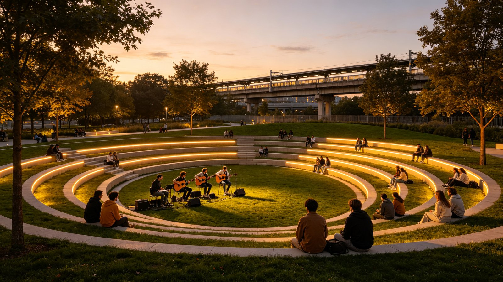
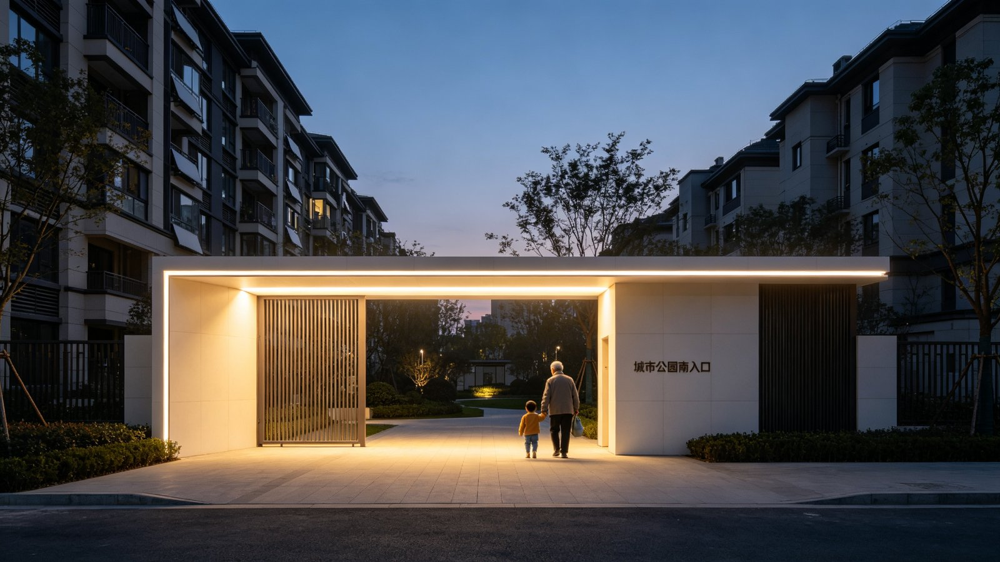
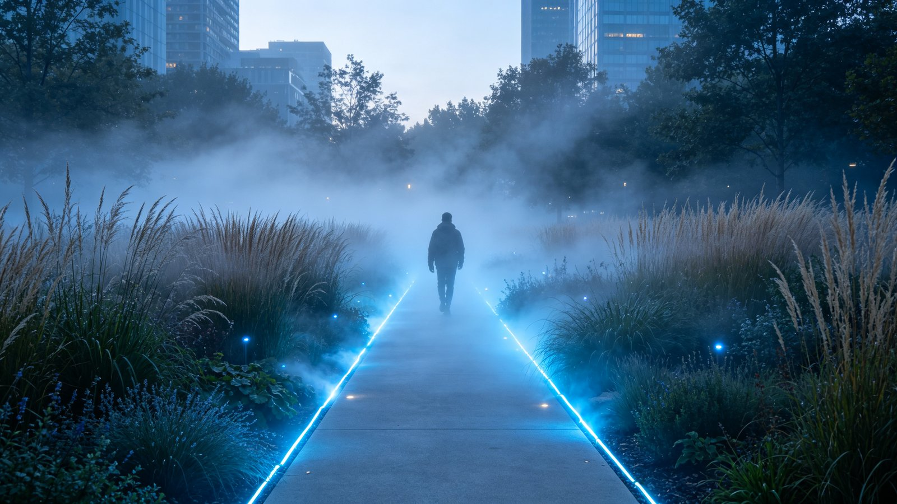
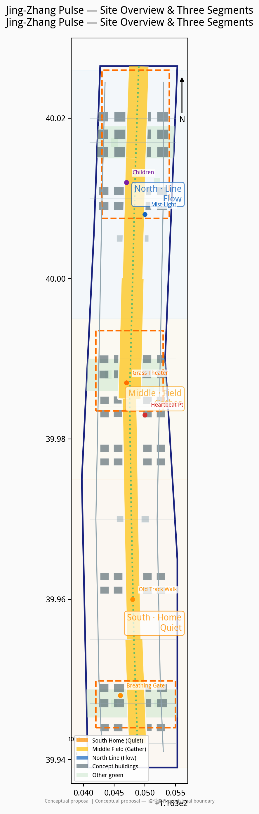
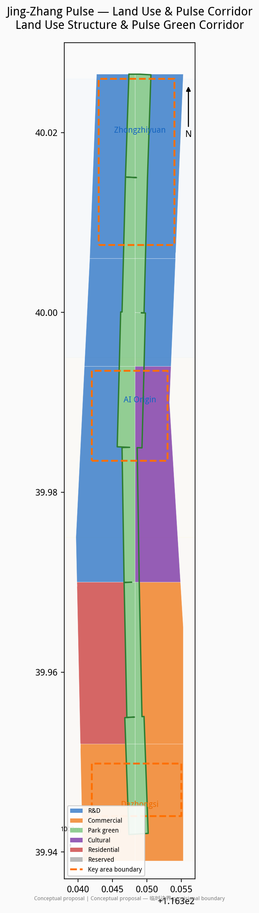
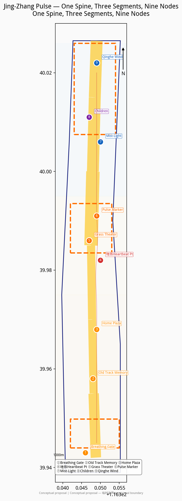
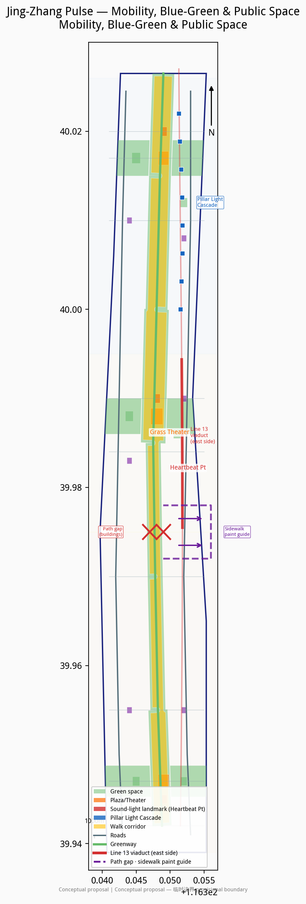
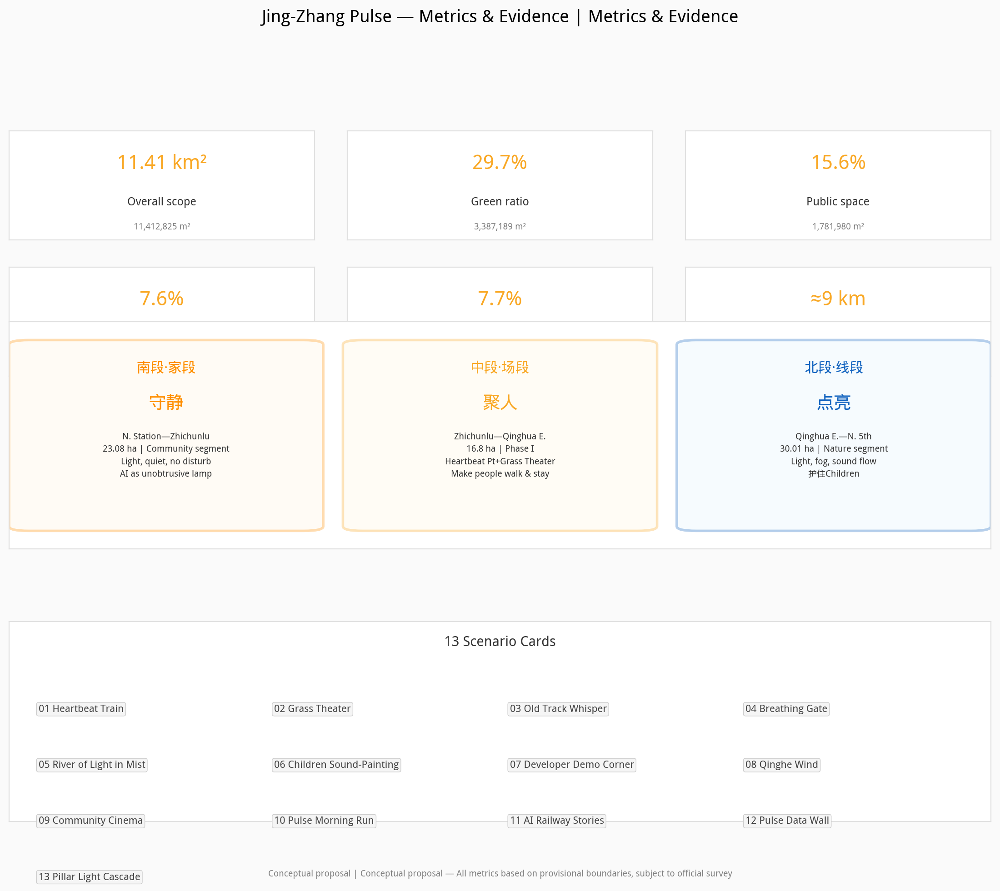

# Jing-Zhang Pulse

## 1. Design Basis and Source Inventory

This proposal is based first on the *International Urban Design Competition for the Centennial Jing-Zhang AI Innovation Belt — Prequalification Announcement* issued by the Haidian Branch of the Beijing Municipal Commission of Planning and Natural Resources [source:SRC-2026-BJ-GH-QUAL-PREANNOUNCEMENT], and directly on the Agent Open Call Taskbook [source:SRC-2026-0518-AGENT-OPEN-CALL-TASKBOOK].

The proposal follows the *Urban Design Management Measures* of the Ministry of Housing and Urban-Rural Development [standard:MOHURD-URBAN-DESIGN-MEASURES] and distinguishes approved controls, design suggestions, and items pending confirmation per the *Measures for Formulation and Approval of Regulatory Detailed Planning* [standard:MOHURD-CONTROL-DETAILED-PLANNING]. Land-use classification follows the MNR *Guidelines for Land and Sea Use Classification* [standard:MNR-LAND-USE-CLASSIFICATION-GUIDE].

**Sources used:**

| Source | Origin | Use |
|--------|--------|-----|
| Prequalification announcement | Haidian Branch, BMCPNR [source:SRC-2026-BJ-GH-QUAL-PREANNOUNCEMENT] | Objectives, three-tier scope, deliverables |
| Agent open call taskbook | Task package [source:SRC-2026-0518-AGENT-OPEN-CALL-TASKBOOK] | Six agent tasks, scenario and operations requirements |
| Provisional boundaries | Task package [source:SRC-PROVISIONAL-BOUNDARIES-2026] | Overall design scope and three key areas |
| Jing-Zhang Railway Heritage Park Phase II opening reports | Beijing Daily / CNR / The Beijing News [source:SRC-2026-JINGZHANG-PARK-PHASE2] | Park segmentation, restored tracks, children's areas, Line 13 viaduct relationship |
| "Three Areas, Two Wings" policy | Beijing Municipal Science & Technology Commission [source:SRC-2026-BJ-KW-THREE-AREAS-WINGS] | Industry positioning reference |
| Haidian "1+X+1" policy | Haidian District Government [source:SRC-2026-HAIDIAN-1X1] | Innovation ecosystem policy context |
| Land-use classification guide | MNR [source:SRC-2023-MNR-LAND-USE-CLASSIFICATION] | Land-use codes |
| OpenStreetMap | ODbL [source:SRC-OSM-COPYRIGHT] | Base map reference only |

**Data gaps:** No approved regulatory detailed plan, official surveyed boundaries, FAR/height/density/green-ratio controls, building condition surveys, title investigations, utility data, or railway heritage conservation plans have been provided. Existing-conditions diagnosis is based on task-package materials and public information [depth:existing_conditions_diagnosis]. All spatial and implementation content in this proposal is a conceptual suggestion and reference scheme for professional teams to develop further; it does not constitute a statutory planning conclusion or official approval [depth:risk_missing_data].

## 2. Three-Tier Scope Framework

The proposal establishes three nested work tiers per the announcement [depth:three_level_scope_framework]:

- **Strategic study scope (43.6 km²):** North to North 5th Ring Road, east to Jingzang Expressway, south to Xizhimenwai Street, west to Wanquanhe Road. This tier studies regional linkages between the Jing-Zhang Railway Heritage Park, Zhongguancun Science City, universities (Tsinghua, Peking, etc.), Wudaokou, and Dazhongsi.
- **Overall design scope (~11.4 km²):** A belt centered on the Jing-Zhang Heritage Park, extending ~1–2 km on each side. `geometry/site_boundary.geojson` corresponds to this scope, with an area of [metric:site_area_sqm] m² [data:geometry/site_boundary.geojson].
- **Key area scope (3.684 km²):** Zhongzhiyuan AI Autonomous Innovation Acceleration Zone (~192.9 ha) [metric:key_area_zhongzhiyuan_sqm], Beijing AI Origin Community (~104.3 ha) [metric:key_area_origin_community_sqm], and Dazhongsi AI Industry Cluster (~72.0 ha) [metric:key_area_dazhongsi_sqm] [data:geometry/key_areas.geojson].

All areas are calculated from provisional boundaries in EPSG:4548, with provisional_rough precision, subject to official surveyed boundaries [source:SRC-PROVISIONAL-BOUNDARIES-2026].

## 3. Strategic Study Scope: Industry and Future City Research — Jing-Zhang Pulse

### 3.1 Concept

The Jing-Zhang Railway was China's first self-designed and self-constructed railway. A century later, the high-speed rail went underground and the old surface line was transformed into a 9 km urban green corridor [source:SRC-2026-JINGZHANG-PARK-PHASE2]. Subway Line 13 trains still shuttle past on the elevated viaduct beside the park — every 3–5 minutes, like a heartbeat.

**Jing-Zhang Pulse** is about making this old line, cut apart by roads, into a breathing public spine once more. It breathes even when no one is there; when people come, they simply hear the pulse more clearly.

This is not a technology showcase or a historical renovation. It is making every subway pass feel like a heartbeat; making the old track walk the path from home to stage; making AI like an unobtrusive lamp — bright where it should be bright, quiet where it should be quiet.

### 3.2 Site Reading: Look at the Map First

Based on public reports and site materials [source:SRC-2026-JINGZHANG-PARK-PHASE2], the ~9 km Jing-Zhang Railway Heritage Park already has three distinct segments:

| Segment | Actual range | Current character | Design character |
|---------|-------------|-------------------|------------------|
| South · Home | Beijing North Station — Zhichunlu (Community Vitality segment, 23.08 ha) | Tight against residential areas; 2.4 km of restored 1909 tracks, steam locomotive, green train car, Sidaokou node; elderly sing, children play, residents stroll | **Keep quiet**: light, calm, suitable for elderly and children; AI like an unobtrusive lamp; do not disturb |
| Middle · Field | Zhichunlu — Qinghua East Road (Phase I, 16.8 ha) | The widest, most open section; Line 13 viaduct runs closest to the park here; under-viaduct space already opened; football field, ring mounds, interactive fountains; adjacent to Wudaokou and universities | **Gather people**: events can happen, soundscapes can amplify; grass theater, subway heartbeat point; make people walk up from the south and stay |
| North · Line | Qinghua East Road — North 5th Ring Jianting Bridge (Nature & Leisure segment, 30.01 ha) | Long and narrow; incorporates Dongsheng Bajia Country Park; fishbone slow-traffic paths; "Jing-Zhang Ring" plaza, forest theater, children's play area; connects to Qinghe green corridor | **Light up**: suited to flowing light, fog, lines, sound; no gathering, only passage and illumination; protect the existing children's play area |

**We place the middle segment between Zhichunlu and Qinghua East Road (the Phase I area).** Three reasons: first, this is the widest and most open section, capable of accommodating a sunken grass theater; second, the Line 13 viaduct is closest to the park here, making "lights on as train approaches, light follows as train passes, warmth remains after train leaves" most feasible; third, it is adjacent to Wudaokou and universities (Tsinghua, Peking, Beihang), where foot traffic and event demand are highest.

**How the north is used:** The north is narrow — no gathering field, but a flowing line. Light, fog, and sound unfold linearly along the path; one is illuminated passing through, and warmth remains after passing. The existing children's play area in the north (climbing slopes, slides, sandpits converted from railway embankments) is preserved and upgraded — not converted into an adult photo spot, no strong light or sound that could frighten children.

**How the south is protected:** The south is tight against residential areas — it is "home." No large events, no light-and-sound bombardment, no night clubs. AI exists in the most understated way — breathing glimmers, quiet guidance, convenient services. The old track walk is most complete in the south (2.4 km of restored 1909 tracks), a cultural anchor that people can step on, walk along, pause at, and listen to.

### 3.3 Naming and Logo Direction

**Scheme name: Jing-Zhang Pulse (京张脉搏)**

Naming logic: Jing-Zhang is place and history; pulse is life and rhythm. A century-old railway reawakens in the AI era — not cold technology, but a heartbeat with body temperature.

**Logo direction (conceptual suggestion):** Using the I-beam cross-section of rail as skeleton, integrated with an ECG pulse waveform. Two rail lines extend upward and converge at a heartbeat peak in the middle, symbolizing gathering and co-performance. The overall form resembles both a rail segment and a pulse line. Colors: warm white in the south (home warmth), amber gold in the middle (people and stage), cool blue in the north (flow and technology), gradient along the 9 km.

### 3.4 Spatial Structure: One Spine, Three Segments, Nine Nodes

- **One spine:** Jing-Zhang Railway Heritage Park Pulse Green Corridor, ~9 km north-south, the breathing spine of the entire route [data:geometry/green_space.geojson].
- **Three segments:** South · Home (keep quiet), Middle · Field (gather people), North · Line (light up).
- **Nine nodes:**
  1. Breathing Gate (south entrance)
  2. Old Track Memory Segment (2.4 km restored tracks in south)
  3. Home Doorstep Plaza (south residents' daily life)
  4. Subway Sound-Light · Heartbeat Point (middle, closest to Line 13)
  5. Grass Theater · Human-AI Co-performance Field (middle open area)
  6. Jing-Zhang Pulse Marker Tower (middle visual anchor)
  7. Mist-Light Corridor (north linear node)
  8. Children's Field (north, preserved and upgraded)
  9. Qinghe Wind Corridor (north end, connecting to Qinghe green corridor)

## 4. Overall Design Scope: Urban Renewal and Regulatory-Depth Urban Design

### 4.1 Land-Use Layout

The land-use layout is fully expressed in `geometry/land_use.geojson`, with 24 parcels covering the entire scope without gaps or overlaps [depth:land_use_layout] [data:geometry/land_use.geojson]:

| Code | Type | Area (10k m²) | Share |
|------|------|---------------|-------|
| 0802 | R&D | 424.1 | 37.2% |
| 05 | Commercial/services | 259.0 | 22.7% |
| 1401 | Park green space | 212.5 | 18.6% |
| 0803 | Cultural | 129.4 | 11.3% |
| 0701 | Urban residential | 116.3 | 10.2% |
| 16 | Reserved land | ≈0 | ≈0% |

R&D and commercial/services account for ~60%, reflecting the AI belt's functional orientation; park green space is 18.6%, with overall green ratio of [metric:green_ratio] [metric:green_space_area_sqm].

### 4.2 Development Intensity and Height Form

As official FAR and height controls have not been provided, this proposal does not give statutory FAR conclusions [depth:development_intensity_controls]. Conceptual suggestion: medium-high intensity (4–6 conceptual stories) at core parcels in the three key areas, tapering down toward the green spine interface to ensure spatial permeability [depth:height_massing_character]. All building outlines are conceptual masses, totaling 68 buildings [metric:building_count], footprint area [metric:building_footprint_area_sqm] m², building density ~[metric:building_density_ratio] [data:geometry/buildings.geojson]. Total floor area and FAR are unknown, pending official regulatory controls [metric:floor_area_ratio] [metric:total_floor_area_sqm].

### 4.3 Renewal Strategy

"Retain-renovate-demolish" in parallel [depth:retain_renovate_demolish]:
- **Retain:** 4 existing buildings (R&D, office, residential, community; one each), marked retain with low confidence (no field survey);
- **Renovate:** Old industrial/warehouse buildings along the green spine suggested for conversion to AI incubators, community services, and exhibition spaces;
- **Demolish:** Temporary buildings obstructing spine continuity suggested for removal, subject to title investigation and structural assessment.

## 5. Key Area Detailed Design

The three key areas are not locked to specific functions; conceptual suggestions are based on site reading and three-segment character [depth:key_area_detailed_design].

### 5.1 Zhongzhiyuan AI Autonomous Innovation Acceleration Zone (North · Line, ~192.9 ha)

Zhongzhiyuan is in the north, corresponding to the "Line" character. It is narrow, natural, near the Qinghe River — no large gatherings, but a flowing innovation line.

- **Mist-Light Corridor:** Linear mist and fiber-optic installations along the north green spine — a mist walk by day, a flowing river of light by night. Conceptual suggestion.
- **Pillar Light Cascade (key node combining north section with subway viaduct):** In the north section, the Line 13 viaduct passes through the park; the row of pillars is itself a line. Conceptual suggestion for projection mapping on all four pillar faces, lighting pillar by pillar as trains pass — pillar surfaces show a century of Jing-Zhang rolling stock (steam locomotives, green-skinned passenger trains, high-speed EMU trains), all locomotives facing the same direction as the passing train, traveling from past to future; light flows from one pillar face to the next, dimming slowly after the train leaves with residual warmth. Warm golden light is both artistic expression and path illumination. Diners at restaurants across the road watch across the street as an everyday backdrop to dinner. No new structures, no structural modification, projectors concealed; auto-dims or switches off after 21:30; volume ≤50dB or silent; no commercial advertising; safe distance to be coordinated with subway operator. This is the architectural-scale realization of "lights on as train approaches, light follows as train passes, warmth remains after train leaves" — the dullest structure becomes the brightest line. Conceptual suggestion and reference scheme, to be developed by professional teams (see Card 13).
- **Qinghe Wind Corridor:** At the north end connecting to the Qinghe waterfront, wind-driven devices transform the river wind into visible light and audible low-frequency harmonies. Conceptual suggestion.
- **Children's Field (preserved and upgraded):** The existing children's play area (climbing slopes, slides, sandpits) retains its children's-activity character; AI interactive elements may be added (ground projection games, sound-painting walls), but volume and brightness must stay child-friendly; not converted to an adult photo spot. Conceptual suggestion.
- **Jing-Zhang Ring:** The existing "Jing-Zhang Ring" 1909 theme plaza can serve as the north's cultural anchor, with pulse-themed night lighting while maintaining the natural-leisure tone. Conceptual suggestion.

### 5.2 Beijing AI Origin Community (Middle · Field, ~104.3 ha)

The Origin Community is in the middle, corresponding to the "Field" character. It is the most open, closest to the subway, adjacent to universities — the strongest heartbeat of the entire pulse.

- **Subway Sound-Light · Heartbeat Point:** Where the Line 13 viaduct is closest to the park (within Phase I, between Zhichunlu and North 4th Ring), non-contact sensors and in-ground lights are installed. As a train approaches, lights gradually brighten; as it passes, a light band follows section by section; after it leaves, lights dim slowly in a breathing rhythm, retaining warmth. No loudspeakers; sound is primarily low-frequency vibration and ambient tone to avoid disturbing residents. Conceptual suggestion.
- **Grass Theater · Human-AI Co-performance Field:** A sunken grass-slope amphitheater in the middle open lawn — a grassy field for sitting and lying by day, a stage when step lights come on at night. People can sit, stay, and make things happen themselves — student concerts, developer demo shows, community cinema, AI-generated art performances. No fixed large equipment; the lawn's everyday character is preserved. Conceptual suggestion.
- **Jing-Zhang Pulse Marker Tower:** A visual marker tower beside the grass theater, using the rail I-beam cross-section and pulse waveform as form language, conceptually 15–20 m tall, as the middle's spatial anchor. Conceptual suggestion.
- **University Inspiration Corner:** A semi-outdoor exchange space near universities with power, WiFi, and whiteboard walls where students and developers can gather spontaneously. Conceptual suggestion.

### 5.3 Dazhongsi AI Industry Cluster (South · Home, ~72.0 ha)

Dazhongsi is in the south, corresponding to the "Home" character. It is tight against residential areas — everything must be light and quiet.

- **Breathing Gate (south entrance):** A low light gate at the south entrance emitting warm white light in a breathing rhythm (~4 seconds on/off), welcoming residents home. No noise, no flashing. Conceptual suggestion.
- **Old Track Memory Segment:** The south has 2.4 km of restored 1909 tracks [source:SRC-2026-JINGZHANG-PARK-PHASE2], the cultural anchor of the entire route. The tracks remain walkable and everyday — not fenced off or enshrined. Low-profile audio posts along the tracks (scan QR to hear railway history and AI-generated ambient soundscapes) at whisper volume. Conceptual suggestion.
- **Home Doorstep Plaza:** A daily plaza beside south residential areas, preserving existing functions (elderly dancing, children playing). AI services are convenience-oriented: smart benches (wireless charging), quiet environmental monitoring displays, accessibility navigation. No large events, no night venues. Conceptual suggestion.
- **Life Service Corner:** Daily service node for south residents; AI is convenient but unobtrusive. Conceptual suggestion.

## 6. AI Innovation Ecosystem, Personas, and AI+ Scenarios

### 6.1 Global AI Innovation Ecosystem Cases

The following cases are compiled from public sources and provide reference for the Jing-Zhang Pulse ecosystem [depth:ai_ecosystem_cases].

| Case | Location | Lesson |
|------|----------|--------|
| King's Cross | London, UK | Railway heritage conversion + tech cluster (DeepMind); public space integrated with private development |
| Quayside | Toronto, Canada | Smart-city pilot lessons: technology must serve residents, not surveil them; public trust first |
| Digital Media City (DMC) | Seoul, Korea | Government-led AI/media cluster; digital art in public space |
| Kalasatama | Helsinki, Finland | Smart community centered on residents' daily lives; AI embedded, not overlaid |
| Seaport District | Boston, USA | Industrial heritage renewal + innovation economy; public waterfront driving vitality |
| Shibuya Scramble Square | Tokyo, Japan | AI services and public space integration in high-density transit hub |
| one-north | Singapore | Integrated live-work-play-learn ecosystem; public space encouraging cross-disciplinary exchange |
| EUREF-Campus | Berlin, Germany | Industrial heritage converted to clean-energy + smart-mobility demonstration; past and future side by side |

### 6.2 Five User Personas

1. **South residents:** Daily life, parenting, downstairs-and-there. Need quiet, safety, convenience. Fear noise, light pollution, the park becoming a tourist attraction.
2. **AI developers:** Work, exchange, light demonstration. Need inspiration collisions, demo space, peer socializing. Active mainly in the middle.
3. **University students:** Inspiration, socializing, events. Need cheap/free space, ability to organize events, WiFi and power. Primary users of the middle grass theater.
4. **International visitors:** Recognition, check-in,传播. Need identifiable landmarks, tellable stories, photographable scenes. The marker tower and heartbeat point are传播 points.
5. **Children and parents:** Safety, fun, inspiration. Need child-friendly facilities, non-frightening light/sound, places for parents to rest. Mainly south and north children's field.

### 6.3 Scenario Cards

**Card 01: Heartbeat Train**
- Location: Middle · Subway Heartbeat Point
- Time: All day, best at night
- Behavior: As Line 13 trains pass, in-ground lights brighten, follow, and retain warmth in sync with the train
- Technology: Non-contact vibration/optical sensors + in-ground LED + low-frequency vibration feedback
- Character: Not loud; visual and tactile rather than high-volume
- AI role: Senses train rhythm, generates synchronized light effects; when empty, lights run in a quiet breathing rhythm

**Card 02: Grass Theater**
- Location: Middle · Sunken lawn
- Time: Afternoon to evening
- Behavior: Grass for sitting/lying by day; step lights create a stage at night; spontaneous performances
- Technology: Low-voltage light strips, portable audio, open booking system
- Character: People are the protagonists; AI is the lighting designer
- AI role: Auto-adjusts lighting atmosphere based on crowd density; open booking platform for community/students/developers

**Card 03: Old Track Whisper**
- Location: South · Restored track walk
- Time: All day
- Behavior: Walk along tracks, scan QR to hear railway history and AI-generated ambient soundscapes
- Technology: Low-energy Bluetooth beacons, phone audio, TTS
- Character: Whisper level, not disturbing others
- AI role: Generates personalized soundscapes based on time, weather, walking pace; multilingual narration

**Card 04: Breathing Gate**
- Location: South entrance
- Time: Night
- Behavior: Residents returning home pass through; the gate glows warm white in a breathing rhythm
- Technology: Motion sensors + warm white LED
- Character: Like a porch light welcoming you home
- AI role: Slowly brightens as someone approaches; stays at minimum brightness when empty

**Card 05: River of Light in Mist**
- Location: North · Mist-Light Corridor
- Time: Dawn and dusk
- Behavior: Walking the narrow path, fiber optics in mist light up with footsteps and fade behind
- Technology: High-pressure micro-mist + fiber optics + footstep sensors
- Character: Flowing, transient, no gathering
- AI role: Generates following light effects based on walking direction and speed; mist volume auto-adjusts to temperature/humidity

**Card 06: Children's Sound-Painting Wall**
- Location: North · Children's Field
- Time: Daytime
- Behavior: Children speak or sing to the wall; colored ripples project on its surface
- Technology: Microphone array + projection + sound visualization algorithm
- Character: Gentle, fun, not frightening
- AI role: Transforms children's voices into visual ripples; auto-reduces sensitivity above volume threshold

**Card 07: Developer Demo Corner**
- Location: Middle · University Inspiration Corner
- Time: Weekday afternoons, weekends
- Behavior: Developers demonstrate prototypes in semi-outdoor space; peers gather and discuss
- Technology: Outdoor power, WiFi, portable display, open-source community booking platform
- Character: Casual, informal, open source
- AI role: Activity matching and recommendations; records public demos and generates index

**Card 08: Qinghe Wind Whispers**
- Location: North end · Qinghe Wind Corridor
- Time: When windy
- Behavior: Wind devices transform Qinghe wind into visible light bands and audible low-frequency harmonies
- Technology: Wind sensors + fiber optics + ambient sound
- Character: Natural, ethereal
- AI role: Converts wind speed/direction to light-sound patterns; accumulates "wind memory" data art over time

**Card 09: Community Cinema Night**
- Location: Middle · Grass Theater
- Time: Weekend evenings (2–4 times per month, not weekly)
- Behavior: Residents bring cushions to watch open-air cinema on the grass slope; south residents can opt out (sufficient distance)
- Technology: Portable projection, directional speakers (controlled sound range)
- Character: Community feel, low frequency
- AI role: Resident voting for films; auto-reschedule notification based on weather

**Card 10: Pulse Morning Run**
- Location: Full-route jogging path
- Time: Early morning
- Behavior: Runners run the 9 km corridor; foot lights pulse with running rhythm
- Technology: Path pressure sensors + in-ground lights + fitness app
- Character: Quiet, energetic but not noisy
- AI role: Records running data; lights shift color with pace (south warm white → middle amber → north cool blue)

**Card 11: AI-Generated Railway Stories**
- Location: South old track walk
- Time: All day
- Behavior: Visitors enter keywords; AI generates a short story or poem set on the Jing-Zhang Railway, displayed on e-ink screens
- Technology: E-ink displays + large language model
- Character: Quiet, cultural, low power
- AI role: Generates original stories based on railway history; content filtered for all ages

**Card 12: Pulse Data Wall**
- Location: Middle · Pulse Marker Tower base
- Time: All day
- Behavior: Displays real-time park "vitals" — trains passed today, people in park, air quality, energy use
- Technology: Low-power display + environmental sensors
- Character: Transparent, interesting, no personal surveillance
- AI role: Aggregates anonymous data into park "vital signs"; no personal identity data collected

**Card 13: Pillar Light Cascade**
- Location: North section · under Line 13 viaduct (Qinghua East Road to Jianting Bridge), pillar row
- Time: Dusk to night, triggered by passing trains
- Behavior: As a train approaches, the first pillar lights; overhead, light flows from one pillar face to the next in a continuous multi-screen cascade; after the train leaves, light fades slowly. All four pillar faces can project; the park-facing side shows a century of Jing-Zhang rolling stock — steam locomotives, green-skinned passenger trains, high-speed EMU trains — all locomotives facing the same direction as the passing train, traveling from past to future. Pedestrians walk through the light; diners across the road watch from restaurant terraces
- Technology: Projection mapping on pillar surfaces + non-contact train sensors + low-power projectors; no new structures, no structural modification, projectors concealed
- Character: Flowing, passing-through, no gathering; warm golden light is both art and path illumination
- AI role: Detects approaching/passing/leaving phases and orchestrates pillar-by-pillar sequences; daily century-of-Jing-Zhang imagery, themed content on festivals; dims after 21:30
- Restraint: Soft brightness, no direct light into residences; ambient sound only or silent; no advertising; coordinate with subway operator
- Conceptual suggestion, to be developed by professional teams

### 6.4 Three AI Test and Validation Scenarios

1. **Train rhythm sensing and light synchronization test:** At the middle heartbeat point, test non-contact sensor accuracy for Line 13 train approaching/passing/leaving phases and light response latency (target <200ms). Requires coordination with subway operator; must not affect train safety. Conceptual suggestion.
2. **Directional sound field boundary test:** At the grass theater, test directional speaker technology to verify event soundscape drops below 55 dB at 50 m, ensuring south residents are not disturbed. Conceptual suggestion.
3. **Child-friendly light/sound threshold test:** At the north children's field, test children's responses to sound-painting walls and other installations at various volumes/brightness levels to establish child-friendly thresholds (suggested ≤65 dB, no direct eye brightness). Conceptual suggestion.

## 7. Land, Building Scale, and Retain-Renovate-Demolish

### 7.1 Land Balance

Total overall design scope area: [metric:site_area_sqm] m². Land-use composition in Section 4.1. Layout in `geometry/land_use.geojson` [depth:land_use_balance].

### 7.2 Building Scale

As official FAR controls have not been provided, no statutory building-scale conclusions are given [depth:building_area_calculation]. Conceptual building totals are suggestions: 68 conceptual buildings [metric:building_count], footprint area [metric:building_footprint_area_sqm] m², building density ~[metric:building_density_ratio] [data:geometry/buildings.geojson]. Total floor area and FAR are unknown [metric:floor_area_ratio] [metric:total_floor_area_sqm].

### 7.3 Retain-Renovate-Demolish Classification

- **Retain:** 4 existing buildings, low confidence
- **Renovate:** Old industrial/warehouse buildings along the spine suggested for innovation/community conversion
- **New:** Conceptual masses in the three key areas, subject to title investigation and regulatory planning
- **Demolish:** Temporary buildings obstructing spine continuity, subject to assessment

All classifications are conceptual suggestions for professional teams to develop further, not implementation conclusions [depth:retain_renovate_demolish].

## 8. Transport, Rail, Utilities, and Public Services

### 8.1 Transport Organization

- **Slow-traffic system:** Walking, jogging, and cycling paths along the green spine [data:geometry/roads.geojson]. The south prioritizes strolling and parent-child use; jogging paths are more continuous in the middle and north.
- **South–middle path gap and sidewalk wayfinding:** The south (Beijing North Station—Zhichunlu) and middle (Zhichunlu—Qinghua East Road) sections are currently separated by buildings; the park path does not connect directly, and demolition is unlikely in the near term. Conceptual suggestion: no demolition or construction — paint colored wayfinding markings on the detour city sidewalks (pulse tricolor line + arrows + distance markers), turning the break into a ceremonial "gate crossing." Pedestrians follow the markings around the buildings and rejoin the green spine. Markings can be photoluminescent or low-voltage self-illuminating at night — low cost, iterable, no traffic impact [depth:transport_organization].
- **Line 13 viaduct:** Line 13 runs parallel along the east side of the park in a north-south direction; the middle section viaduct is closest to the park — both a sound source and the physical basis of the heartbeat concept. Under-viaduct space has been opened [source:SRC-2026-JINGZHANG-PARK-PHASE2]; shaded sheltered space is suggested under the viaduct. The north section pillars can host the "Pillar Light Cascade" projection mapping (see Card 13).
- **Rail stations:** Wudaokou, Zhichunlu, and Dazhongsi are the three main arrival points. The middle grass theater is ~10 minutes' walk from Wudaokou Station.
- **Micro-circulation:** Conceptual suggestion to improve east-west branch road connectivity, breaking barriers from walls and fences [depth:transport_organization].

### 8.2 Utilities

- All light/sound installations use low-voltage LED and fiber optics; power density conceptually ≤3W/m
- Mist systems use reclaimed water with water-saving controls
- Sensor networks use low-power LoRa/NB-IoT; no large equipment rooms
- Conceptual suggestion to use existing park power and communications infrastructure, subject to professional assessment [depth:municipal_services]

### 8.3 Public Services

- South: Convenience benches, barrier-free access, quiet rest pavilions
- Middle: Public restrooms, portable stage equipment, outdoor power, WiFi
- North: Service stations, bicycle parking, children's restrooms
- All facilities are conceptual suggestions; specific configuration subject to professional design [depth:public_services]

## 9. Blue-Green Space, Public Space, and Urban Character

### 9.1 Blue-Green Space

- Green spine area ~228.8 ha, the ecological backbone [data:geometry/green_space.geojson]
- Overall green ratio [metric:green_ratio], public space ratio [metric:public_space_ratio] [metric:public_space_area_sqm]
- North connects to Qinghe waterfront green corridor and Dongsheng Bajia Country Park [source:SRC-2026-JINGZHANG-PARK-PHASE2]
- Conceptual suggestion for rain gardens and bioswales within the spine, continuing Phase I sponge-city design [depth:blue_green_system]

### 9.2 Public Space

The nine-node public space system is expressed in `geometry/public_space.geojson` [depth:public_space_design]:

| Node | Segment | Type | Character |
|------|---------|------|-----------|
| Breathing Gate | South | Entrance landmark | Quiet, welcoming home |
| Old Track Memory | South | Walkway | Cultural, everyday, walkable |
| Home Doorstep Plaza | South | Plaza | Residents' daily, undisturbing |
| Subway Heartbeat Point | Middle | Sound-light landmark | Heartbeat, rhythm, not loud |
| Grass Theater | Middle | Sunken plaza | Gathering, co-performance, spontaneous |
| Pulse Marker Tower | Middle | Marker tower | Visual anchor, iconic |
| Mist-Light Corridor | North | Linear installation | Flowing, passage, no gathering |
| Children's Field | North | Children's play | Safe, fun, protecting children |
| Qinghe Wind Corridor | North end | Wind installation | Natural, ethereal |

### 9.3 Urban Character

- **Tone:** Industrial texture of railway heritage + light luminous feel of the AI era; no cyberpunk-style showing off
- **South character:** Warm tones, low brightness, everyday life — like an extension of home
- **Middle character:** Amber gold tones, theatrical but not ostentatious; grass slopes and trees are the main elements
- **North character:** Cool blue tones, natural wildness; light and fog hidden in planting
- **Cultural resources:** Qinghuayuan Station building, Sidaokou node, steam locomotive, green train car, welding-factory gantry crane and other railway heritage [source:SRC-2026-JINGZHANG-PARK-PHASE2] are the character base; AI installations are an overlay, not a replacement [depth:urban_character]

### 9.4 Cultural Narrative and Guided Tour Route

**Narrative arc: From self-designed railway to self-designed intelligence.** In 1909, Zhan Tianyou built China's first self-designed railway on the Jing-Zhang line; today, an AI self-directed innovation ecosystem grows along the same spine. The narrative is not shouted through slogans but walked by foot — from the old tracks in the south (history), through the heartbeat point and grass theater in the middle (present and co-performance), to the Pillar Light Cascade in the north (rolling-stock evolution from steam to high-speed EMU). The three segments form a timeline "traveling from past to future" [depth:cultural_narrative].

**Cultural resource system:**
- South: Qinghuayuan Station building, 2.4 km restored 1909 tracks, steam locomotive, green train car, Sidaokou node, welding-factory gantry crane [source:SRC-2026-JINGZHANG-PARK-PHASE2]
- Middle: Line 13 viaduct (physical source of the heartbeat), ring mounds, interactive fountain (existing Phase I)
- North: "Jing-Zhang Ring" 1909 theme plaza, children's play area (converted railway embankments), Pillar Light Cascade projection sequence

**Guided tour route (conceptual suggestion, ~5 km walk, 2–3 hours):**
1. **Breathing Gate departure** (south entrance) — warm white light gate, like leaving home
2. **Old Track Memory Segment** — walk on restored 1909 tracks, scan QR for whisper narration (Cards 03/11)
3. **Home Doorstep Plaza** — observe daily resident life, feel the "home" tone
4. **Zhichunlu gap · gate crossing** — follow tricolor sidewalk markings around buildings, from "home" into "field"
5. **Subway Heartbeat Point** — wait for a train to pass, watch lights follow (Card 01)
6. **Grass Theater** — sit down, observe the relationship between people and space (Card 02)
7. **Pulse Marker Tower** — look up or climb, see the 9 km spine in full
8. **Mist-Light Corridor** — walk through light and mist in the north (Card 05)
9. **Pillar Light Cascade** — wait under the pillars for a train, watch a century of rolling stock pass by (Card 13)
10. **Children's Field** — watch children play, remember the softest part of the line

Two paces are offered: "slow" (full walk with stops, ~3 hours) and "fast" (heartbeat point → grass theater → pillar cascade, ~1 hour). Wayfinding uses pulse tricolor ground markings + QR audio narration; no large interpretive signs [depth:wayfinding_system]. Conceptual suggestion and reference scheme, to be developed by professional teams.

### 9.5 AI Pilgrimage Landmarks and Honor System

**Three AI pilgrimage landmarks (conceptual suggestions):**

1. **Heartbeat Point (middle)** — the ritual of "waiting for a train." Line 13 trains arrive every 3–5 minutes as a metronome; lights brighten, follow, and retain warmth with each train. It needs no photo-prop installation — the experience is standing there and waiting. It is the "heartbeat itself" of the entire pulse.
2. **Pulse Marker Tower (middle)** — the vantage point to "see the 9 km." Using the rail I-beam cross-section and pulse waveform as form language, conceptually 15–20 m tall. The tower base hosts the Pulse Data Wall (Card 12), displaying real-time park "vitals." It is the visual anchor and communication symbol.
3. **Pillar Light Cascade (north)** — the cinematic sequence "from past to future." Four-sided projection on pillars, lighting pillar by pillar as trains pass with a century of rolling stock. It is the most cinematic scene and the most shareable image for international visitors.

The three landmarks correspond to three behaviors — "experience, observe, share" — distributed across the middle and north; no pilgrimage landmark is placed in the south (to protect the quiet of "home") [depth:pilgrimage_landmarks].

**Honor display system (conceptual suggestions):**
- **Developer Walk:** Bronze plaques embedded in the paving between the grass theater and inspiration corner, recording names of developers/teams who have contributed open-source projects, AI models, or public art on the Jing-Zhang Pulse platform (with consent). No statues, no rankings — names in the ground, walked over by passersby.
- **Annual Pulse Awards:** Each year, community voting selects "Best Public AI Scenario," "Community Contributor," and "Child-Friendly Design," awarded at the grass theater. The prize is an old railway sleeper with engraved text.
- **Open Data Wall:** The data wall at the marker tower base displays not only park data but also API calls, open-source project count, and contributor count on the open platform — making innovation itself the honor.

All honor displays are conceptual suggestions, not commercial rankings or advertising [depth:honor_system].

### 9.6 Wayfinding and Public Space Component Library

**Wayfinding and signage system (conceptual suggestions):**
- Primary mark: rail I-beam cross-section + pulse waveform (consistent with Logo direction)
- Colors: warm white south, amber gold middle, cool blue north, tricolor gradient along 9 km
- Ground markings: continuous pulse tricolor line; at the Zhichunlu gap, the tricolor line continues via sidewalk detour
- Information hierarchy: ground line (direction) → QR code (audio narration) → small bollard signs (node name and distance); no large interpretive signs
- Night: ground markings photoluminescent or low-voltage self-illuminating, brightness ≤5 lux (south) / 10 lux (middle) / 8 lux (north)

**Public space component library (conceptual suggestions, for professional teams to develop):**

| Component | Segment | Function | Character |
|-----------|---------|----------|-----------|
| Breathing light gate | South entrance | Entrance marker, welcome home | Warm white, quiet |
| Smart bench | Full route | Wireless charging, environmental monitoring | Understated, convenient |
| Whisper post | South old track | QR audio history | Whisper level, undisturbing |
| In-ground light strip | Middle heartbeat | Train rhythm light | Following, warmth-retention |
| Step light strip | Middle grass theater | Night stage edge | Amber gold, seatable |
| Mist fiber column | North | River of light in mist | Flowing, transient |
| Pillar projection | North viaduct | Pillar Light Cascade | Warm gold, passage |
| Children's interactive wall | North children's field | Sound painting | Gentle, fun |
| Tricolor ground guide | Gap detour | Path-gap stitching | Continuous, no demolition |
| Developer plaque | Middle | Honor display | In-ground, understated |

All components are modular, iterable, and low-cost-first; no designated supplier products [depth:component_library].

## 10. Renewal Project List, Implementation Policy, and Phasing

### 10.1 Renewal Project List (Conceptual Suggestions)

| ID | Project | Segment | Type | Priority |
|----|---------|---------|------|----------|
| P-01 | Subway Sound-Light · Heartbeat Point | Middle | Public space installation | Phase 1 |
| P-02 | Grass Theater · Co-performance Field | Middle | Public space | Phase 1 |
| P-03 | Old Track Whisper audio system | South | Cultural facility | Phase 1 |
| P-04 | Breathing Gate (south entrance) | South | Entrance installation | Phase 1 |
| P-05 | Children's Field light/sound upgrade | North | Children's facility | Phase 1 |
| P-06 | Mist-Light Corridor | North | Linear installation | Phase 2 |
| P-07 | Pulse Marker Tower | Middle | Landmark | Phase 2 |
| P-08 | Qinghe Wind Corridor | North end | Wind installation | Phase 2 |
| P-09 | Pulse morning-run lighting system | Full route | Slow-traffic facility | Phase 2 |
| P-10 | Pulse Data Wall | Middle | Data display | Phase 3 |
| P-11 | University Inspiration Corner | Middle | Exchange space | Phase 3 |
| P-12 | Corridor building renovation | Full route | Urban renewal | Ongoing |
| P-13 | Pillar Light Cascade projection | North | Public space installation | Phase 2 |
| P-14 | South–middle sidewalk wayfinding markings | Gap | Slow-traffic stitching | Phase 1 |

All projects are conceptual suggestions for professional teams to develop further, not implementation conclusions [depth:implementation_projects].

### 10.2 Implementation Policy Suggestions

- "Light intervention, iterable" strategy: start with low-cost portable installations (heartbeat lights, grass theater light strips), validate before permanent facilities
- Light/sound installations must pass environmental assessment and resident consultation; south installations must have a resident-activatable "quiet hours" mode
- Community participation mechanism: south residents have veto power over installations at their doorstep
- Conceptual suggestions; specific policies to be set by government [depth:implementation_policy]

### 10.3 Phasing Plan

- **Phase 1 (conceptual 0–12 months):** Heartbeat point, grass theater, old track whisper, breathing gate, children's upgrade, sidewalk wayfinding markings — low cost, quickly deployable, validatable
- **Phase 2 (conceptual 12–24 months):** Mist-light corridor, marker tower, Qinghe wind corridor, morning-run lights, Pillar Light Cascade — developed based on Phase 1 feedback
- **Phase 3 (conceptual 24–36 months):** Data wall, inspiration corner, building renovation — long-term operations and urban renewal

Phase areas: [metric:phase1_area_sqm], [metric:phase2_area_sqm], [metric:phase3_area_sqm] m² [data:geometry/phasing.geojson].

### 10.4 Annual Event System (Conceptual Suggestions)

| Season | Event | Segment | Frequency | Character |
|--------|-------|---------|-----------|-----------|
| Spring | Jing-Zhang Pulse Opening Run (9 km morning run) | Full route | Annually | Quiet, energetic |
| Spring | Grass Theater Opening Season | Middle | Weekends (Apr–May) | Students, community, developers |
| Summer | Community Cinema Night | Middle grass theater | 2–4 times/month | Community feel, directional sound |
| Summer | Developer Demo Day | Middle inspiration corner | Monthly | Open source, informal |
| Autumn | Jing-Zhang Railway Culture Week | South tracks + middle | Annually (around National Day) | History, parenting, whisper narration |
| Autumn | AI Art Light Festival | Middle + north | Annually (3–5 days) | Pillar Cascade special, restrained light/sound |
| Winter | Warm Light Plan | South breathing gate + doorstep plaza | All winter | Warm white light, hot drink stations, undisturbing |
| Year-round | Pulse Morning Run | Full route | Daily early morning | Lights pulse with running rhythm |

**Event brand:** "Jing-Zhang Pulse" is itself the event brand; all events use the unified pulse waveform visual identity. No large events in the south; middle event soundscape must drop below 55 dB at 50 m; north events are flowing and passing-through, no gathering [depth:annual_events].

### 10.5 Long-Term Operation Mechanism (Conceptual Suggestions)

**Operating entity (conceptual suggestion):** Under government guidance and led by park management, form a "Jing-Zhang Pulse Operations Group" including community representatives, university representatives, AI company representatives, and developer community representatives. Technical operation of AI installations may be delegated to professional teams, but content review and community communication must include resident representatives [depth:operation_mechanism].

**AI scenario open operation mechanism:**
- Establish a "Jing-Zhang Pulse Open Platform," opening sensor data APIs (train passing times, anonymous park occupancy, environmental data) and inviting developers to build public AI scenarios
- New scenarios must pass a triple review: community review + technical review + child-friendly review; south installations require a vote of nearby residents
- All AI scenario code is open source; no vendor lock-in
- Annual review of scenario usage; unused scenarios are replaced with new ones

**Developer community operation:**
- Grass theater and inspiration corner serve as offline gathering spaces for developers, with regular Demo Days, hackathons, and open-source workshops
- Long-term partnerships with AI student clubs at Tsinghua, PKU, Beihang and other universities
- Developer Walk plaques record contributor names (with consent)

**Public experience and landmark operation:**
- The three pilgrimage landmarks (heartbeat point, marker tower, pillar cascade) are free and open daily
- Pillar Cascade projection content updates quarterly (daily century-of-rolling-stock imagery + festival specials), reviewed by the operations group
- Audio tour narration supports Chinese and English, co-produced by volunteers and AI

**International communication and attraction:**
- Core narrative: "China's first self-designed railway reawakens in the AI era"
- Pillar Light Cascade and heartbeat point serve as core international communication images
- Developer Demo Day and AI Art Light Festival invite international AI community participation
- No exaggerated government promises; all events are conceptual suggestions subject to relevant approvals

**Resident rights protection:**
- South residents have veto power over installations at their doorstep
- All light/sound installations have "quiet hours" (22:00–7:00 off or minimum)
- Community feedback channels (mini-program + suggestion box + quarterly resident meetings); responses within 7 working days
- No personal identity data collected; all sensor data anonymized

## 11. Metrics, Area Recalculation, and Compliance Matrix

### 11.1 Core Metrics

| Metric | Value | Status |
|--------|-------|--------|
| Overall design scope area | [metric:site_area_sqm] m² | known |
| Green ratio | [metric:green_ratio] | known |
| Green space area | [metric:green_space_area_sqm] m² | known |
| Public space ratio | [metric:public_space_ratio] | known |
| Public space area | [metric:public_space_area_sqm] m² | known |
| Building footprint area | [metric:building_footprint_area_sqm] m² | known |
| Building density | [metric:building_density_ratio] | known |
| Building count | [metric:building_count] | known |
| Road area (estimated) | [metric:road_area_estimated_sqm] m² | known |
| Road ratio | [metric:road_ratio] | known |
| FAR | [metric:floor_area_ratio] | unknown (pending official controls) |
| Total floor area | [metric:total_floor_area_sqm] m² | unknown (pending official controls) |

### 11.2 Compliance Matrix

Full compliance matrix in `compliance_matrix.json` covering 23 official requirements. Standard coverage in `standard_matrix.json`; design depth in `design_depth_matrix.json`.

## 12. Risk, Copyright, and Compliance

### 12.1 Conceptual Nature Statement

All spatial implementation suggestions in this proposal are **conceptual suggestions and reference schemes for professional teams to develop further**. They do not constitute statutory planning conclusions, official approval, or implementation commitments. Actual construction must follow government-approved statutory planning and professional design.

### 12.2 Boundary Compliance

This proposal strictly follows the agent taskbook boundary clauses [source:SRC-2026-0518-AGENT-OPEN-CALL-TASKBOOK]:
- No statutory FAR, height, or density conclusions
- No implementation conclusions on specific parcel retain/renovate/demolish
- No road alignment, bridge/tunnel, or utility engineering schemes
- No non-public or personal privacy data
- No conceptual suggestions presented as confirmed government decisions

### 12.3 Light/Sound Environmental Risk

- South installations: conceptually ≤50 dB at night, ≤5 lux
- Middle event soundscape: ≤55 dB at 50 m
- North children's field: ≤65 dB, no direct eye brightness
- All installations must have "quiet hours" (22:00–7:00 off or minimum)
- All above are conceptual suggestions requiring professional acoustic and photometric verification

### 12.4 Copyright

This proposal was independently completed by TheKireal. Public sources cited are listed in Chapter 13. OpenStreetMap data follows ODbL [source:SRC-OSM-COPYRIGHT]. Proposal text under COMMUNITY-DISPLAY-ONLY license.

## 13. References

1. Haidian Branch, BMCPNR. *International Urban Design Competition for the Centennial Jing-Zhang AI Innovation Belt — Prequalification Announcement*. 2026-05-09. [source:SRC-2026-BJ-GH-QUAL-PREANNOUNCEMENT]
2. Agent Open Call Taskbook (0518 version). [source:SRC-2026-0518-AGENT-OPEN-CALL-TASKBOOK]
3. Task package provisional boundary data. [source:SRC-PROVISIONAL-BOUNDARIES-2026]
4. Beijing Daily / CNR / The Beijing News. *Jing-Zhang Railway Heritage Park Phase II fully opens (9 km urban green corridor)*. 2026-08-06. [source:SRC-2026-JINGZHANG-PARK-PHASE2]
5. Beijing Municipal Science & Technology Commission. "Three Areas, Two Wings" AI industry spatial pattern public information. [source:SRC-2026-BJ-KW-THREE-AREAS-WINGS]
6. Haidian District Government. Haidian "1+X+1" industry policy public information. [source:SRC-2026-HAIDIAN-1X1]
7. MOHURD. *Urban Design Management Measures*. 2017. [standard:MOHURD-URBAN-DESIGN-MEASURES]
8. MOHURD. *Measures for Formulation and Approval of Regulatory Detailed Planning*. [standard:MOHURD-CONTROL-DETAILED-PLANNING]
9. MNR. *Guidelines for Land and Sea Use Classification (Trial)*. 2023. [standard:MNR-LAND-USE-CLASSIFICATION-GUIDE]
10. OpenStreetMap contributors. ODbL. [source:SRC-OSM-COPYRIGHT]

## Figures

- Figure 1: Site overview and three-segment character

- Figure 2: Land-use structure and pulse green corridor

- Figure 3: Three areas and nine nodes

- Figure 4: Mobility, blue-green, and public space

- Figure 5: Metrics and evidence

