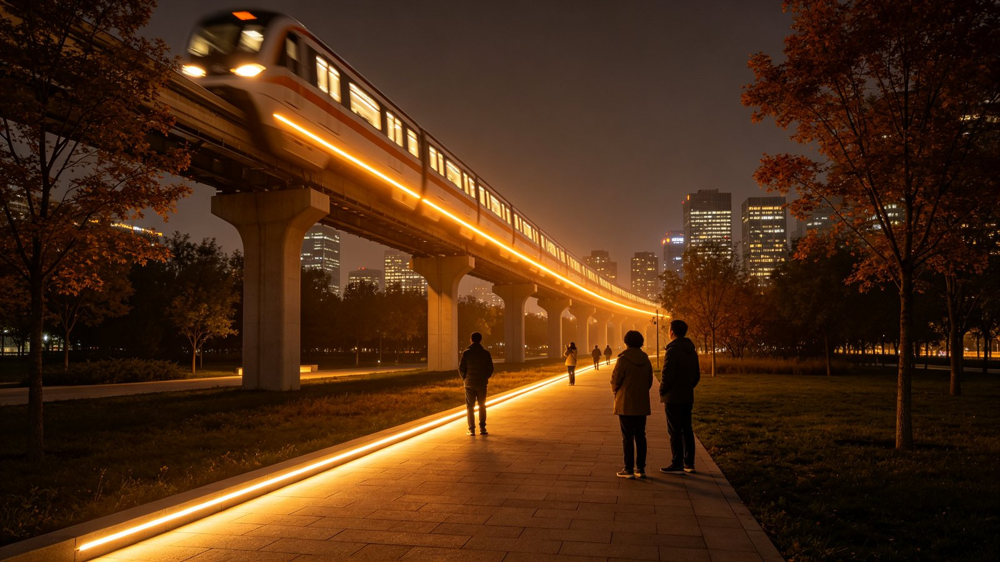
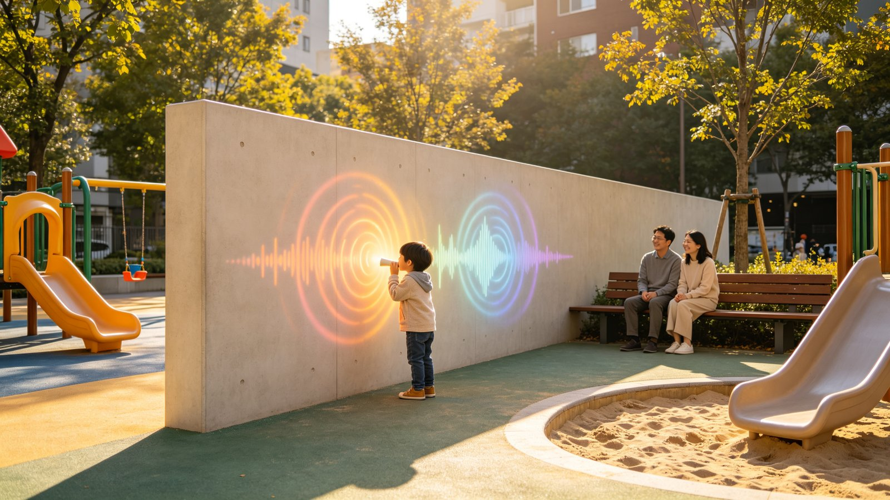
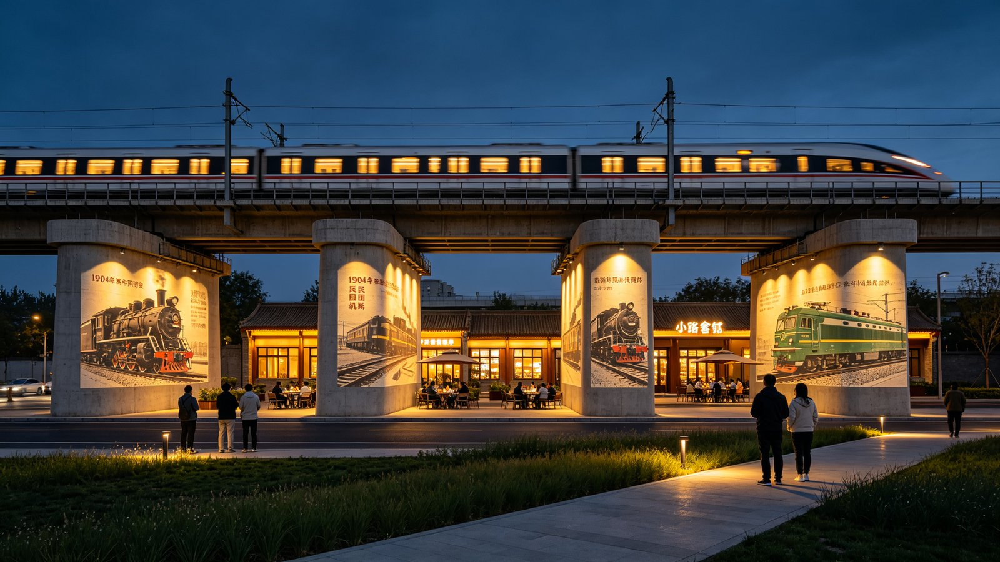
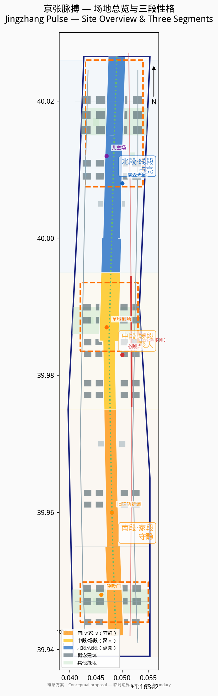
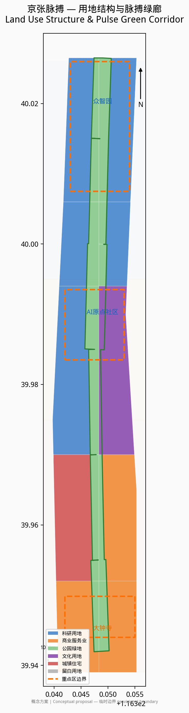
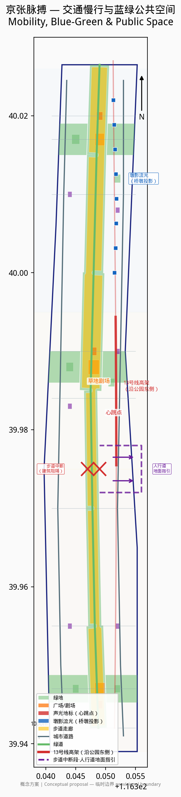
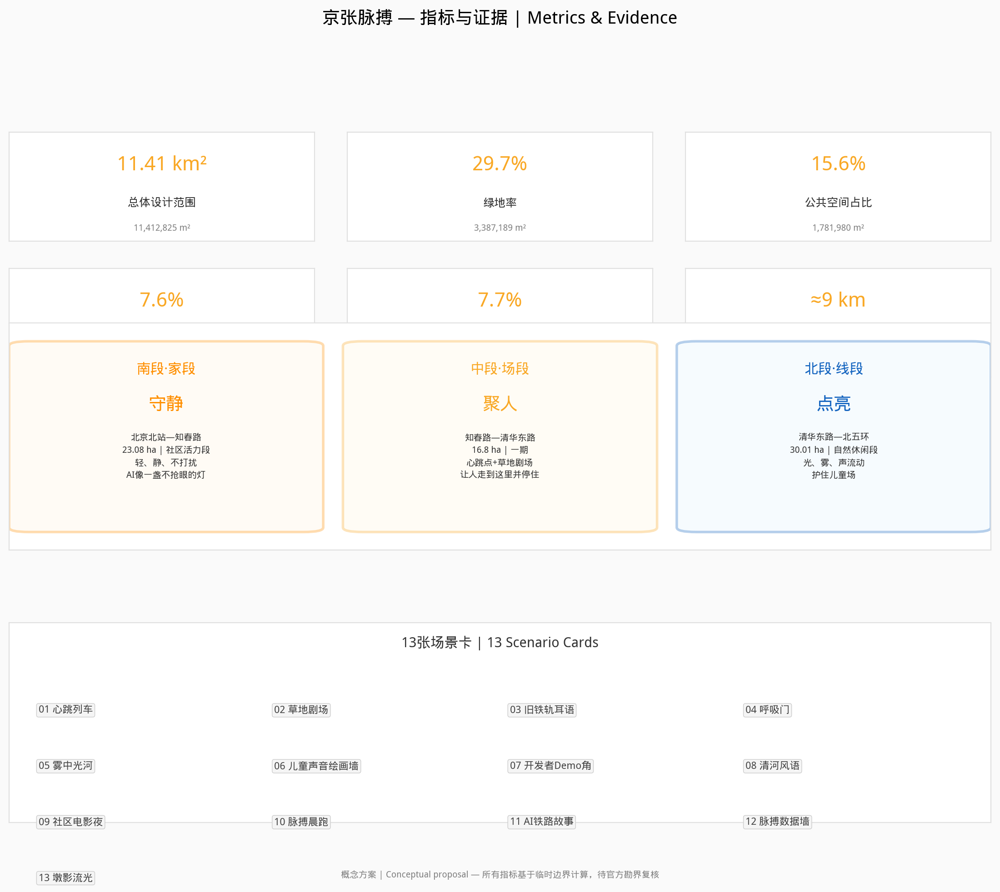

# 京张脉搏

## 1. 设计依据与资料清单

本方案以北京市规划和自然资源委员会海淀分局发布的《百年京张AI创新带城市设计国际方案征集资格预审公告》为第一依据 [source:SRC-2026-BJ-GH-QUAL-PREANNOUNCEMENT]，以智能体开放任务书为设计任务的直接来源 [source:SRC-2026-0518-AGENT-OPEN-CALL-TASKBOOK]。

方案编制参照《城市设计管理办法》对城市设计编制内容和风貌管控的基本要求 [standard:MOHURD-URBAN-DESIGN-MEASURES]，参照《城市、镇控制性详细规划编制审批办法》区分已批控制条件、设计建议与待确认事项 [standard:MOHURD-CONTROL-DETAILED-PLANNING]。用地分类采用自然资源部《国土空间调查、规划、用途管制用地用海分类指南（试行）》 [standard:MNR-LAND-USE-CLASSIFICATION-GUIDE]。

**已使用资料：**

| 资料 | 来源 | 用途 |
|------|------|------|
| 资格预审公告 | 北京市规自委海淀分局 [source:SRC-2026-BJ-GH-QUAL-PREANNOUNCEMENT] | 项目目的、三层范围、成果要求 |
| 智能体开放任务书 | 任务包 [source:SRC-2026-0518-AGENT-OPEN-CALL-TASKBOOK] | 六项智能体任务、场景与运营要求 |
| 临时边界 | 任务包 [source:SRC-PROVISIONAL-BOUNDARIES-2026] | 总体设计范围与三个重点区范围 |
| 京张铁路遗址公园二期开放报道 | 北京日报/央广网/新京报 [source:SRC-2026-JINGZHANG-PARK-PHASE2] | 公园分段、旧铁轨复原、儿童活动区、13号线高架关系等场地现状 |
| "三区两翼"政策 | 北京市科委公开信息 [source:SRC-2026-BJ-KW-THREE-AREAS-WINGS] | 产业定位与空间格局参考 |
| 海淀区"1+X+1"政策 | 海淀区政府公开信息 [source:SRC-2026-HAIDIAN-1X1] | 创新生态政策背景 |
| 用地分类指南 | 自然资源部 [source:SRC-2023-MNR-LAND-USE-CLASSIFICATION] | 用地代码与分类标准 |
| OpenStreetMap | ODbL [source:SRC-OSM-COPYRIGHT] | 背景地图参考，不作决策依据 |

**资料缺口：** 官方尚未提供批复的控制性详细规划成果、正式勘界红线、容积率/建筑高度/密度/绿地率等控制指标、现状建筑质量鉴定与权属调查、市政管线综合资料、铁路遗产保护规划。现状条件诊断基于任务包资料和公开信息完成 [depth:existing_conditions_diagnosis]。本方案所有空间与实施内容均为概念建议、参考方案，可供专业团队深化研究，不构成法定规划结论或官方批准 [depth:risk_missing_data]。

## 2. 三层范围工作框架

方案严格按照公告要求建立三个嵌套工作层次 [depth:three_level_scope_framework]：

- **统筹研究范围（43.6 km²）**：北至北五环，东至京藏高速，南至西直门外大街，西至万泉河路。该层次重点研究京张铁路遗址公园与中关村科学城、清华北大等高校、五道口及大钟寺商圈的区域联动关系。
- **总体设计范围（约11.4 km²）**：以京张遗址公园为中轴、两侧各约1—2公里的带状区域。本方案提交的 `geometry/site_boundary.geojson` 即对应该范围，面积为 [metric:site_area_sqm] 平方米 [data:geometry/site_boundary.geojson]。
- **重点区域范围（3.684 km²）**：包括众智园AI自主创新加速区（约192.9 ha）[metric:key_area_zhongzhiyuan_sqm]、北京AI原点社区（约104.3 ha）[metric:key_area_origin_community_sqm]、大钟寺AI产业聚集区（约72.0 ha）[metric:key_area_dazhongsi_sqm] [data:geometry/key_areas.geojson]。

三个层次在空间上由线到面、由宏观到微观递进。所有面积均基于任务包提供的临时边界（provisional boundary）在 EPSG:4548 投影下计算，精度为 provisional_rough，最终须以官方勘界红线为准 [source:SRC-PROVISIONAL-BOUNDARIES-2026]。

## 3. 统筹研究范围产业与未来城市研究：京张脉搏

### 3.1 概念阐述

京张铁路是中国第一条自主设计建造的铁路。百年后，高铁入地，地面旧线被改造为9公里城市绿廊 [source:SRC-2026-JINGZHANG-PARK-PHASE2]。地铁13号线的列车仍在公园旁高架上穿梭——每3—5分钟一班，像心跳。

**京张脉搏**，就是让这条被道路切开的旧线，重新成为一条有呼吸的公共脊线。无人时，它也在呼吸；有人时，人只是把这份脉搏，听得更清楚。

这不是科技展示，不是历史翻新。是让地铁的每一次经过，都像一次心跳；让旧铁轨步道成为人从家走到舞台的路；让AI像一盏不抢眼的灯，在该亮的地方亮，在该静的地方静。

### 3.2 场地研判：先看图，再动手

基于公开报道和场地资料 [source:SRC-2026-JINGZHANG-PARK-PHASE2]，京张铁路遗址公园全长约9公里，已形成三段实际性格：

| 段落 | 实际范围 | 现状特征 | 方案性格 |
|------|----------|----------|----------|
| 南段·家段 | 北京北站—知春路（社区活力段，23.08 ha） | 紧贴居民区，复原2.4公里1909年旧线铁轨，有蒸汽车头、绿皮车厢、四道口节点；老人唱歌、孩子玩耍、居民散步 | **守静**：轻、静、适合老人孩子；AI像一盏不抢眼的灯；不打扰 |
| 中段·场段 | 知春路—清华东路（一期，16.8 ha） | 全园最开阔处；13号线高架沿公园东侧平行，中段离公园最近，桥下空间已打开；有足球场、环丘、互动喷泉；紧邻五道口和高校 | **聚人**：可以发生活动、放大声景；草地剧场、地铁心跳点；让人愿意从南边走到这里并停住 |
| 北段·线段 | 清华东路—北五环箭亭桥（自然休闲段，30.01 ha） | 狭长线性，纳入东升八家郊野公园；鱼骨状慢行通道；有"京张之环"广场、林下剧场、儿童游乐区；衔接清河绿廊 | **点亮**：适合流动的光、雾、线、声；不堆聚集，只做穿越与点亮；护住现有儿童活动场地 |

**我们把中段放在知春路至清华东路之间（一期范围）。** 理由有三：第一，这是全园最开阔的段落，有条件容纳下沉草地剧场；第二，13号线高架在此段离公园最近，"车来先亮、车过逐光、车走留温"的心跳声光最有条件实现；第三，紧邻五道口和清华、北大、北航等高校，人气和活动需求最旺。

**北段怎么用：** 北段狭长，不做聚集场，做流动的线。光、雾、声沿步道线性展开，人穿过时被点亮，走过后留温。北段现有儿童游乐区（铁轨斜坡改造的攀爬区、滑梯、沙坑）保留升级，不改作成人打卡场，不用强声光惊吓孩子。

**南段怎么守：** 南段贴着居民区，是"家"。不做大型活动，不做声光轰炸，不做夜场。AI以最低调的方式存在——呼吸微光、安静的导览、便民的服务。旧铁轨步道在南段复原最完整（2.4公里1909年旧线），是文化锚，让人能踩、能走、能停、能听。

### 3.3 命名与Logo方向

**方案名：京张脉搏（Jingzhang Pulse）**

命名逻辑：京张是地名和历史，脉搏是生命和节奏。百年铁路在AI时代重新起跳——不是冰冷的科技，是有体温的心跳。

**Logo方向（概念建议）：** 以铁轨截面的"工"字钢为骨架，融入心电图脉搏波形。两条铁轨线向上延伸，在中段交汇成一个心跳峰值，象征中段的聚集与共演。整体造型既像一段铁轨，又像一条脉搏线。色彩建议：南段暖白（家的温度）、中段琥珀金（人气与舞台）、北段冷蓝（流动与科技），三色沿9公里渐变。

### 3.4 空间结构：一脉三段九节点

- **一脉**：京张铁路遗址公园脉搏绿廊，南北约9公里，是全线的呼吸脊线 [data:geometry/green_space.geojson]。
- **三段**：南段·家段（守静）、中段·场段（聚人）、北段·线段（点亮）。
- **九节点**：
  1. 呼吸门（南入口）
  2. 旧铁轨记忆段（南段2.4公里复原铁轨）
  3. 家门口广场（南段居民日常）
  4. 地铁声光·心跳点（中段，13号线最近处）
  5. 草地剧场·人机共演场（中段开阔处）
  6. 京张脉搏标志塔（中段视觉锚点）
  7. 雾森光廊（北段线性节点）
  8. 儿童场（北段，保留升级）
  9. 清河风廊（北端点，衔接清河绿廊）

## 4. 总体设计范围城市更新与控规深度城市设计

### 4.1 用地布局

总体设计范围的用地布局在 `geometry/land_use.geojson` 中完整表达，共24个地块，无间隙无重叠覆盖整个总体设计范围 [depth:land_use_layout] [data:geometry/land_use.geojson]。用地构成如下：

| 用地代码 | 用地类型 | 面积（万m²） | 占比 |
|----------|----------|-------------|------|
| 0802 | 科研用地 | 424.1 | 37.2% |
| 05 | 商业服务业用地 | 259.0 | 22.7% |
| 1401 | 公园绿地 | 212.5 | 18.6% |
| 0803 | 文化用地 | 129.4 | 11.3% |
| 0701 | 城镇住宅用地 | 116.3 | 10.2% |
| 16 | 留白用地 | ≈0 | ≈0% |

科研和商业服务业用地占比约60%，体现AI产业带的功能主导；公园绿地占18.6%，整体绿地率达 [metric:green_ratio] [metric:green_space_area_sqm]。

### 4.2 开发强度与高度形态

由于官方尚未提供容积率和建筑高度控制指标，本方案不给出法定容积率结论 [depth:development_intensity_controls]。概念性建议为：三个重点区核心地块采用中高强度开发（概念层数4—6层），沿绿脉界面降低高度形成梯度，确保绿脉的空间通透性 [depth:height_massing_character]。所有建筑轮廓均为概念体量，共68栋 [metric:building_count]，占地 [metric:building_footprint_area_sqm] 平方米，建筑密度约 [metric:building_density_ratio] [data:geometry/buildings.geojson]。总建筑面积和容积率状态为 unknown，待官方控规指标明确后复算 [metric:floor_area_ratio] [metric:total_floor_area_sqm]。

### 4.3 更新策略

更新方式以"留改拆"并举为原则 [depth:retain_renovate_demolish]：
- **留**：保留4栋现状建筑（科研楼、办公楼、住宅楼、社区楼各1栋），在 `buildings.geojson` 中标记为 retain，confidence 为 low（未进行实地核查）；
- **改**：沿绿脉两侧的旧工业和仓储建筑建议改造为AI孵化器、社区服务和展示空间；
- **拆**：严重影响绿脉贯通和公共空间连续性的临时建筑建议拆除，具体拆改留范围须以权属调查和房屋质量鉴定为依据。

## 5. 重点区域详细设计

三个重点区域不绑死具体功能，而是根据场地研判和三段性格提出概念建议 [depth:key_area_detailed_design]。

### 5.1 众智园AI自主创新加速区（北段·线段，约192.9 ha）

众智园位于北段，对应"线段"性格。这里狭长、自然、靠近清河，不做大型聚集，做流动的创新线。

- **雾森光廊**：沿绿脉北段设置线性雾森与光纤装置，日间是雾中步道，夜间是流动光河。概念建议。
- **墩影流光（北段与地铁高架结合的重点节点）**：北段13号线高架从公园内穿过，桥墩排列本身就是一条线。概念建议在桥墩四面设置投影映射，列车经过时逐墩点亮——墩面播放京张铁路百年车型影像（蒸汽机车、绿皮火车到高铁动车组），所有车头朝向与列车前进方向一致，从过去驶向未来；光从一个墩面流向下一个墩面，车走后缓缓暗下留有余温。暖金色光既是艺术表达，也照亮桥下步道。公路对面餐厅的食客隔路相望，成为日常晚餐的背景。不新增构筑物、不改造桥墩结构，投影设备隐蔽安装；21:30后自动降亮或关闭；音量≤50dB或静音；不含商业广告；须与地铁运营方协调安全距离。这是"车来先亮、车过逐光、车走留温"在建筑尺度上的实现——桥墩从最枯燥的结构变成最亮的线。概念建议、参考方案，可供专业团队深化研究（详见场景卡13）。
- **清河风廊**：北端衔接清河滨水绿廊，设置风动装置，将清河的风转化为可视的光与声。概念建议。
- **儿童场（保留升级）**：北段现有儿童游乐区（攀爬坡、滑梯、沙坑）保留儿童活动底色，可增加AI互动元素（如地面投影游戏、声音绘画墙），但音量和亮度须控制在儿童友好范围内，不改作成人打卡场。概念建议。
- **京张之环**：现有"京张之环"1909主题活动广场可作为北段的文化锚点，增加脉搏主题的夜间灯光，但保持自然休闲基调。概念建议。

### 5.2 北京AI原点社区（中段·场段，约104.3 ha）

原点社区位于中段，对应"场段"性格。这里最开阔、离地铁最近、紧邻高校，是整条脉搏的心跳最强处。

- **地铁声光·心跳点**：在13号线高架离公园最近处（一期范围内，知春路至北四环之间），设置非接触式传感与地埋灯光。列车 approaching 时灯光渐亮（车来先亮），列车经过时光带逐节追随（车过逐光），列车驶离后灯光以呼吸节律缓慢变暗留有余温（车走留温）。不使用高音喇叭，声音以低频振动和环境音为主，避免扰民。概念建议。
- **草地剧场·人机共演场**：在中段开阔草坪处设置下沉草坡看台，白天是可躺可坐的草地，晚上台阶灯带亮起成为舞台。人能坐、能留、能自己发生事——学生音乐会、开发者demo秀、社区电影、AI生成艺术演出都可在此发生。舞台不设固定大型设备，保持草地的日常性。概念建议。
- **京张脉搏标志塔**：草地剧场旁设置视觉标志塔，以铁轨"工"字钢截面和脉搏波形为造型，高度概念建议15—20米，作为中段的空间锚点。概念建议。
- **近校灵感角**：靠近高校的位置设置半户外交流空间，有电源、有网络、有白板墙，学生和开发者可自发聚集。概念建议。

### 5.3 大钟寺AI产业聚集区（南段·家段，约72.0 ha）

大钟寺位于南段，对应"家段"性格。这里贴着居民区，一切要轻、要静。

- **呼吸门（南入口）**：南段入口设置低矮的光门，以呼吸节律（约4秒一亮一暗）发出暖白光，欢迎回家的居民。不喧哗、不闪烁。概念建议。
- **旧铁轨记忆段**：南段已复原2.4公里1909年旧线铁轨 [source:SRC-2026-JINGZHANG-PARK-PHASE2]，是全线文化锚点。保持铁轨可走可踩的日常性，不围合、不供奉。沿轨设置低调的语音解说桩（扫码可听铁路历史和AI生成的环境音景），音量控制在耳语级别。概念建议。
- **家门口广场**：南段居民区旁的日常广场，保留老人跳舞、孩子玩耍的现有功能。AI服务以便民为主：智能座椅（无线充电）、安静的环境监测屏、无障碍导航。不做大型活动、不做夜场。概念建议。
- **生活服务角**：南段居民日常服务节点，AI便民但不抢眼。概念建议。

## 6. AI 创新生态、人才画像与 AI+ 场景

### 6.1 全球AI创新生态案例

以下案例基于公开资料整理，为京张脉搏的产业生态构建提供参考 [depth:ai_ecosystem_cases]。

| 案例 | 地点 | 可借鉴点 |
|------|------|----------|
| 伦敦国王十字（King's Cross） | 英国伦敦 | 铁路遗产改造+科技企业聚集（DeepMind），公共空间与私有开发融合 |
| 多伦多Quayside | 加拿大多伦多 | 智慧城市试点的经验教训：技术须服务居民而非监控居民，公众信任优先 |
| 首尔数字媒体城（DMC） | 韩国首尔 | 政府主导的AI/媒体产业集群，公共空间中的数字艺术装置 |
| 赫尔辛基Kalasatama | 芬兰赫尔辛基 | 智慧社区以居民日常生活为中心，AI服务嵌入而非叠加 |
| 波士顿海港区（Seaport） | 美国波士顿 | 工业遗产更新+创新经济，公共滨水空间带动区域活力 |
| 东京涩谷未来之光 | 日本东京 | 高密度交通枢纽中的AI服务与公共空间整合 |
| 新加坡纬壹科技城（one-north） | 新加坡 | 产学研居一体的生态社区，公共空间鼓励跨界交流 |
| 柏林EUREF园区 | 德国柏林 | 工业遗产改造为清洁能源+智能移动示范区，历史与未来并置 |

### 6.2 五类用户画像

1. **南段居民**：日常、亲子、下楼即达。需求是安静、安全、便民。怕吵、怕光污染、怕公园变成景区。
2. **AI开发者**：工作、交流、轻展示。需求是灵感碰撞、demo空间、同行社交。在中段活动为主。
3. **高校学生**：灵感、社交、活动。需求是便宜或免费的空间、能组织活动、有WiFi和电源。中段草地剧场的主要使用者。
4. **国际访客**：认知、打卡、传播。需求是可识别的地标、可讲述的故事、可拍照的场景。脉搏标志塔和心跳点是传播点。
5. **孩子与家长**：安全、趣味、启发。需求是儿童友好的设施、不吓人的声光、家长可休息的位置。南段和北段儿童场为主。

### 6.3 场景卡

**场景卡01：心跳列车**
- 位置：中段·地铁声光心跳点
- 时间：全天，夜间效果最佳
- 行为：13号线列车经过时，地埋灯光随列车节奏亮起、追随、留温
- 技术：非接触式振动/光学传感+地埋LED+低频振动反馈
- 性格：不喧哗，用视觉和体感而非高音
- AI角色：感知列车节奏，生成同步光效；无人时灯光以安静呼吸节律运行

**场景卡02：草地剧场**
- 位置：中段·下沉草坪
- 时间：午后至晚间
- 行为：白天草地躺坐，夜间台阶灯带亮起，自发演出
- 技术：低压灯带、可移动音响设备、开放式预约系统
- 性格：人是主角，AI是灯光师
- AI角色：根据人群密度自动调节灯光氛围；开放预约平台供社区/学生/开发者登记活动

**场景卡03：旧铁轨耳语**
- 位置：南段·复原铁轨步道
- 时间：全天
- 行为：沿铁轨散步，扫码听铁路历史和AI生成的环境音景
- 技术：低功耗蓝牙信标、手机音频、TTS语音合成
- 性格：耳语级别，不打扰他人
- AI角色：根据时间、天气、步行速度生成个性化音景；多语言解说

**场景卡04：呼吸门**
- 位置：南段入口
- 时间：夜间
- 行为：居民晚归经过，光门以呼吸节律亮起暖白光
- 技术：人体感应+暖白LED
- 性格：像玄关的灯，欢迎回家
- AI角色：感知有人接近时缓慢亮起，无人时保持最低亮度

**场景卡05：雾中光河**
- 位置：北段·雾森光廊
- 时间：清晨和傍晚
- 行为：沿狭长步道穿行，雾中光纤随脚步亮起又熄灭
- 技术：高压微雾系统+光纤+脚步感应
- 性格：流动、短暂、不聚集
- AI角色：根据步行方向和速度生成追随光效；雾量根据温湿度自动调节

**场景卡06：儿童声音绘画墙**
- 位置：北段·儿童场
- 时间：日间
- 行为：孩子对着墙说话或唱歌，墙面投影出彩色波纹
- 技术：麦克风阵列+投影+声音可视化算法
- 性格：柔和、有趣、不吓人
- AI角色：将儿童声音转化为视觉波纹；音量超过阈值时自动降低灵敏度

**场景卡07：开发者Demo角**
- 位置：中段·近校灵感角
- 时间：工作日午后、周末
- 行为：开发者在半户外空间演示原型，同行围观交流
- 技术：户外电源、WiFi、可移动显示屏、开源社区预约平台
- 性格：轻松、非正式、开源
- AI角色：提供活动匹配和推荐；记录公开demo并生成索引

**场景卡08：清河风语**
- 位置：北端·清河风廊
- 时间：有风时
- 行为：风动装置将清河的风转化为可视的光带和可听的低频和声
- 技术：风力传感器+光纤+环境音效
- 性格：自然、空灵
- AI角色：将风速风向转化为光声模式；长期积累形成"风的记忆"数据艺术

**场景卡09：社区电影夜**
- 位置：中段·草地剧场
- 时间：周末晚间（每月2—4次，非每周）
- 行为：居民自带坐垫在草坡看露天电影，南段居民可选择不参加（距离足够远）
- 技术：可移动投影设备、定向音响（控制声范围）
- 性格：社区感、低频次
- AI角色：居民投票选片；根据天气自动改期通知

**场景卡10：脉搏晨跑**
- 位置：全线慢跑道
- 时间：清晨
- 行为：跑者沿9公里绿廊跑步，脚下灯光随跑步节奏脉动
- 技术：步道压力感应+地埋灯+运动APP
- 性格：安静、有活力但不吵闹
- AI角色：记录跑步数据；灯光随跑者配速变换颜色（南段暖白→中段琥珀→北段冷蓝）

**场景卡11：AI生成铁路故事**
- 位置：南段旧铁轨步道
- 时间：全天
- 行为：访客输入关键词，AI生成一段以京张铁路为背景的短篇故事或诗歌，显示在墨水屏上
- 技术：电子墨水屏+大语言模型
- 性格：安静、文化、低功耗
- AI角色：基于铁路历史资料生成原创故事；内容过滤确保适合全年龄

**场景卡12：脉搏数据墙**
- 位置：中段·脉搏标志塔基座
- 时间：全天
- 行为：展示公园实时"脉搏"——今日列车经过次数、在园人数、空气质量、能耗
- 技术：低功耗显示屏+环境传感器
- 性格：透明、有趣、不监控个人
- AI角色：聚合匿名数据生成公园"生命体征"；不采集个人身份信息

**场景卡13：墩影流光**
- 位置：北段·13号线高架桥下（清华东路至箭亭桥段），桥墩排列段
- 时间：傍晚至夜间，列车经过时触发
- 行为：列车从远处驶来，第一个桥墩先亮；车到头顶，光影从一个墩面"流"向下一个墩面，形成连续的多屏流动画面；车走后光从末墩缓缓暗下，留数秒余温。桥墩四面均可投影，朝向公园的一面播放京张铁路百年车型影像——蒸汽机车、绿皮火车到高铁动车组，车头方向与列车前进方向一致，从过去驶向未来。桥下步道行人穿行于光中，公路对面餐厅的食客隔路相望，成为日常晚餐的背景
- 技术：桥墩表面投影映射（projection mapping）+ 列车接近非接触式传感器 + 低功耗投影；不新增构筑物，不改造桥墩结构，投影设备隐蔽安装于桥下或绿化带
- 性格：流动、穿越、不聚集；光是"路过"的，不是"驻留"的；暖金色光既是艺术表达，也照亮桥下步道
- AI角色：识别列车 approaching/passing/leaving 三阶段，实时调度逐墩光效序列；日常播放百年京张时空影像，节日可编排专题内容；安静时段（21:30后）自动降亮至最低或关闭
- 分寸：亮度柔和不直射居民楼；音量仅环境级（≤50dB）或静音光效；投影内容不得含商业广告；与地铁运营方协调安全距离，不影响行车与检修
- 概念建议、参考方案，可供专业团队深化研究

### 6.4 三个AI测试验证场景

1. **列车节奏感知与光效同步测试**：在中段心跳点测试非接触式传感器对13号线列车 approaching/passing/leaving 三阶段的识别准确率，以及光效响应延迟（目标<200ms）。需与地铁运营方协调，不影响行车安全。概念建议。
2. **定向声场边界测试**：在草地剧场测试定向音响技术，验证活动声景在50米外降至55分贝以下的可行性，确保南段居民不受干扰。概念建议。
3. **儿童友好声光阈值测试**：在北段儿童场测试声音绘画墙等装置在不同音量/亮度下的儿童反应，建立儿童友好声光阈值标准（建议音量≤65dB，亮度不直射眼睛）。概念建议。

## 7. 用地、建筑规模与拆改留方案

### 7.1 用地平衡

总体设计范围总用地面积 [metric:site_area_sqm] 平方米。各类用地构成见第4.1节表格。用地布局在 `geometry/land_use.geojson` 中完整表达 [depth:land_use_balance]。

### 7.2 建筑规模

由于官方尚未提供容积率控制指标，本方案不给出法定建筑规模结论 [depth:building_area_calculation]。概念性建筑总量为概念建议，共68栋概念建筑 [metric:building_count]，建筑基底面积 [metric:building_footprint_area_sqm] 平方米，建筑密度约 [metric:building_density_ratio] [data:geometry/buildings.geojson]。总建筑面积和容积率状态为 unknown [metric:floor_area_ratio] [metric:total_floor_area_sqm]。

### 7.3 拆改留分类

- **保留**：4栋现状建筑（retain），confidence 为 low
- **改造**：沿绿脉两侧旧工业/仓储建筑建议改造为创新和社区空间（renovate）
- **新建**：三个重点区内的概念体量（new），具体须以权属调查和控规为准
- **拆除**：影响绿脉贯通的临时建筑建议拆除（demolish），具体须以鉴定为准

所有拆改留判断均为概念建议，可供专业团队深化研究，不构成实施结论 [depth:retain_renovate_demolish]。

## 8. 交通、轨道、市政与公共服务设施

### 8.1 交通组织

- **慢行系统**：沿绿脉设置步行道、慢跑道、自行车道"三道" [data:geometry/roads.geojson]。南段以散步和亲子为主，慢跑道在中段和北段更连续。
- **南段—中段步道中断与地面指引**：南段（北京北站—知春路）与中段（知春路—清华东路）之间现状被建筑阻隔，公园步道不直接连通，短期内不大可能拆迁打通。概念建议：不拆不建，在绕行的城市人行道上涂刷彩色地面指引标识（脉搏三色线+箭头+距离标注），将断点转化为有仪式感的"过门"——行人沿指引绕过建筑，重新回到绿脉。标识夜间可蓄光或低压自发光，成本低、可迭代、不影响交通 [depth:transport_organization]。
- **13号线高架**：13号线沿公园东侧平行南北走向，中段高架离公园最近，既是声景来源也是心跳概念的物理基础。桥下空间已打开 [source:SRC-2026-JINGZHANG-PARK-PHASE2]，建议在桥下设置遮阴避雨的停留空间；北段桥墩可实施"墩影流光"投影映射（见场景卡13）。
- **轨道站点**：五道口站、知春路站、大钟寺站是三个主要到达点。中段草地剧场距五道口站步行约10分钟。
- **微循环**：概念建议改善东西向支路连通，打破围墙围栏造成的阻隔 [depth:transport_organization]。

### 8.2 市政设施

- 所有声光装置采用低压LED和光纤，功率密度概念建议≤3W/米
- 雾森系统使用中水，设置节水控制
- 传感器网络采用低功耗LoRa/NB-IoT，不布设大型机房
- 概念建议利用现有公园配电和通信基础设施，具体须专业评估 [depth:municipal_services]

### 8.3 公共服务设施

- 南段：便民座椅、无障碍通道、安静的休息亭
- 中段：公共卫生间、可移动舞台设备、户外电源、WiFi
- 北段：驿站、自行车停放、儿童卫生间
- 所有设施均为概念建议，具体配置须以专业设计为准 [depth:public_services]

## 9. 蓝绿空间、公共空间与城市风貌

### 9.1 蓝绿空间

- 绿脉面积约228.8 ha，是全线生态脊梁 [data:geometry/green_space.geojson]
- 整体绿地率 [metric:green_ratio]，公共空间占比 [metric:public_space_ratio] [metric:public_space_area_sqm]
- 北段衔接清河滨水绿廊和东升八家郊野公园 [source:SRC-2026-JINGZHANG-PARK-PHASE2]
- 概念建议在绿脉内设置雨水花园和植草沟，延续一期海绵城市设计 [depth:blue_green_system]

### 9.2 公共空间

九节点公共空间体系在 `geometry/public_space.geojson` 中表达 [depth:public_space_design]：

| 节点 | 段落 | 类型 | 性格 |
|------|------|------|------|
| 呼吸门 | 南段 | 入口地标 | 安静、欢迎回家 |
| 旧铁轨记忆段 | 南段 | 步道 | 文化、日常、可踩可走 |
| 家门口广场 | 南段 | 广场 | 居民日常、不打扰 |
| 地铁心跳点 | 中段 | 声光地标 | 心跳、节奏、不喧哗 |
| 草地剧场 | 中段 | 下沉广场 | 聚人、共演、自发 |
| 脉搏标志塔 | 中段 | 标志塔 | 视觉锚点、传播 |
| 雾森光廊 | 北段 | 线性装置 | 流动、穿越、不聚集 |
| 儿童场 | 北段 | 儿童活动 | 安全、趣味、护住孩子 |
| 清河风廊 | 北端 | 风动装置 | 自然、空灵 |

### 9.3 城市风貌

- **基调**：铁路遗产的工业质感+AI时代的轻盈光感，不做赛博朋克式的炫技
- **南段风貌**：暖色调、低亮度、生活化，像家的延伸
- **中段风貌**：琥珀金色调、有舞台感但不浮夸，草坡和树木是主体
- **北段风貌**：冷蓝色调、自然野趣，光和雾藏在植物中
- **文化资源**：清华园火车站旧站房、四道口节点、蒸汽车头、绿皮车厢、焊轨厂龙门吊等铁路遗产 [source:SRC-2026-JINGZHANG-PARK-PHASE2] 是风貌底色，AI装置是叠加层而非替代层 [depth:urban_character]

### 9.4 文化叙事与导览路线

**叙事主线：从自主设计到自主智能。** 1909年，詹天佑在京张铁路上实现了中国第一条自主设计建造的铁路；今天，AI自主创新体系在同一条脊线上生长。叙事不喊口号，而是让人用脚走出来——从南段的旧铁轨（历史），走到中段的心跳点和草地剧场（当下与共演），走到北段的墩影流光（从蒸汽机车到高铁动车组的车型演进），三个段落构成一条"从过去驶向未来"的时间线 [depth:cultural_narrative]。

**文化资源系统：**
- 南段：清华园站旧站房、2.4公里复原1909年旧线铁轨、蒸汽车头、绿皮车厢、四道口节点、焊轨厂龙门吊 [source:SRC-2026-JINGZHANG-PARK-PHASE2]
- 中段：13号线高架（心跳的物理来源）、环丘、互动喷泉（一期现状）
- 北段："京张之环"1909主题广场、儿童游乐区（铁轨斜坡改造）、墩影流光投影序列

**导览路线（概念建议，约5公里步行，2—3小时）：**
1. **呼吸门出发**（南段入口）——暖白光门，像离家
2. **旧铁轨记忆段**——踩在1909年复原铁轨上，扫码听耳语解说（场景卡03/11）
3. **家门口广场**——看居民日常，感受"家"的底色
4. **知春路断点·过门**——沿人行道三色指引线绕行建筑，从"家"进入"场"
5. **地铁心跳点**——等一班列车经过，看灯带追随（场景卡01）
6. **草地剧场**——坐下，看人和空间的关系（场景卡02）
7. **脉搏标志塔**——登顶或仰望，看9公里脊线全貌
8. **雾森光廊**——穿过北段的光与雾（场景卡05）
9. **墩影流光**——在桥墩下等列车经过，看百年车型从身边驶过（场景卡13）
10. **儿童场**——看孩子玩耍，记住这条线最柔软的部分

路线设置"慢版"（全程步行+停留，约3小时）和"快版"（地铁心跳点→草地剧场→墩影流光，约1小时）两种节奏。导览标识采用脉搏三色线地面铺装+二维码语音解说，不设大型解说牌 [depth:wayfinding_system]。概念建议、参考方案，可供专业团队深化研究。

### 9.5 AI朝圣地标与荣誉展示体系

**三个AI朝圣地标（概念建议）：**

1. **心跳点（中段）**——"等一班车"的仪式感。每3—5分钟一班的13号线列车就是节拍器，灯光随列车亮起、追随、留温。这里不需要拍照打卡的装置，需要的是站在那里等一班车经过的体验。它是整条脉搏的"心跳本尊"。
2. **脉搏标志塔（中段）**——"看见9公里"的制高点。以铁轨"工"字钢截面和脉搏波形为造型语言，概念高度15—20米。塔基设脉搏数据墙（场景卡12），展示公园实时"生命体征"。它是视觉锚点，也是传播符号。
3. **墩影流光（北段）**——"从过去驶向未来"的光影序列。桥墩四面投影，列车经过时百年车型逐墩点亮。它是最具电影感的场景，也是国际访客最容易传播的画面。

三个地标分别对应"体验—观看—传播"三种行为，分布在中段和北段，南段不设朝圣地标（守护"家"的安静）[depth:pilgrimage_landmarks]。

**荣誉展示体系（概念建议）：**
- **开发者步道**：在草地剧场至灵感角的铺装中嵌入铜质铭牌，记录在京张脉搏开放平台上贡献过开源项目、AI模型或公共艺术的开发者/团队名字（经本人同意）。不做雕像，不做排名，名字嵌在地上，路人踩过。
- **年度脉搏奖**：每年由社区投票选出"年度最佳公共AI场景""年度社区贡献者""年度儿童友好设计"，在草地剧场颁奖，奖品是一块旧铁轨枕木刻字。
- **开放数据墙**：标志塔基座的数据墙不仅展示公园数据，也展示开放平台上的API调用次数、开源项目数量、社区贡献者数量——让创新本身成为荣誉。

所有荣誉展示均为概念建议，不涉及商业排名或广告 [depth:honor_system]。

### 9.6 导视标识与公共空间组件库

**导视标识符号系统（概念建议）：**
- 主标识：铁轨"工"字钢截面+脉搏波形（与Logo方向一致）
- 色彩：南段暖白、中段琥珀金、北段冷蓝，三色沿9公里渐变
- 地面标识：脉搏三色线连续铺装，断点处（知春路）三色线绕行人行道延续
- 信息层级：地面线（方向）→ 二维码（语音解说）→ 小型立柱标识（节点名称和距离），不设大型解说牌
- 夜间：地面线蓄光或低压自发光，亮度不超过5lux（南段）/10lux（中段）/8lux（北段）

**公共空间组件库（概念建议，可供专业团队深化研究）：**

| 组件 | 段落 | 功能 | 性格 |
|------|------|------|------|
| 呼吸灯门 | 南段入口 | 入口标识、欢迎回家 | 暖白、安静 |
| 智能座椅 | 全线 | 无线充电、环境监测 | 低调、便民 |
| 耳语解说桩 | 南段旧铁轨 | 扫码听历史 | 耳语级、不打扰 |
| 地埋灯带 | 中段心跳点 | 列车节奏光效 | 追随、留温 |
| 台阶灯带 | 中段草地剧场 | 夜间舞台边界 | 琥珀金、可坐 |
| 雾森光纤柱 | 北段 | 雾中光河 | 流动、短暂 |
| 桥墩投影 | 北段高架 | 墩影流光 | 暖金、穿越 |
| 儿童互动墙 | 北段儿童场 | 声音绘画 | 柔和、有趣 |
| 三色地面指引 | 断点绕行 | 步道中断缝合 | 连续、不拆不建 |
| 开发者铭牌 | 中段 | 荣誉展示 | 嵌地、不张扬 |

所有组件均为模块化、可迭代、低成本优先，不使用指定供应商产品 [depth:component_library]。

## 10. 更新项目清单、实施政策与分期计划

### 10.1 更新项目清单（概念建议）

| 编号 | 项目 | 段落 | 类型 | 优先级 |
|------|------|------|------|--------|
| P-01 | 地铁声光·心跳点 | 中段 | 公共空间装置 | 一期 |
| P-02 | 草地剧场·人机共演场 | 中段 | 公共空间 | 一期 |
| P-03 | 旧铁轨耳语解说系统 | 南段 | 文化设施 | 一期 |
| P-04 | 呼吸门（南入口） | 南段 | 入口装置 | 一期 |
| P-05 | 儿童场声光升级 | 北段 | 儿童设施 | 一期 |
| P-06 | 雾森光廊 | 北段 | 线性装置 | 二期 |
| P-07 | 脉搏标志塔 | 中段 | 地标 | 二期 |
| P-08 | 清河风廊 | 北端 | 风动装置 | 二期 |
| P-09 | 脉搏晨跑灯光系统 | 全线 | 慢行设施 | 二期 |
| P-10 | 脉搏数据墙 | 中段 | 数据展示 | 三期 |
| P-11 | 近校灵感角 | 中段 | 交流空间 | 三期 |
| P-12 | 沿线旧建筑改造 | 全线 | 城市更新 | 持续 |
| P-13 | 墩影流光桥墩投影 | 北段 | 公共空间装置 | 二期 |
| P-14 | 南段—中段人行道地面指引 | 断点处 | 慢行缝合 | 一期 |

所有项目均为概念建议，可供专业团队深化研究，不构成实施结论 [depth:implementation_projects]。

### 10.2 实施政策建议

- 建议采用"轻介入、可迭代"策略：先做低成本可移动装置（如心跳点灯光、草地剧场灯带），验证效果后再做永久设施
- 声光装置须通过环评和居民意见征询，南段装置须设置居民可一键关闭的"安静时段"
- 建议建立社区参与机制：南段居民对家门口的装置有否决权
- 概念建议，具体政策须政府制定 [depth:implementation_policy]

### 10.3 分期计划

- **一期（概念建议0—12个月）**：心跳点、草地剧场、旧铁轨耳语、呼吸门、儿童场升级、人行道地面指引——低成本、可快速落地、可验证
- **二期（概念建议12—24个月）**：雾森光廊、标志塔、清河风廊、晨跑灯光、墩影流光——在一期反馈基础上深化
- **三期（概念建议24—36个月）**：数据墙、灵感角、沿线建筑改造——长期运营和城市更新

三期面积分别为 [metric:phase1_area_sqm]、[metric:phase2_area_sqm]、[metric:phase3_area_sqm] 平方米 [data:geometry/phasing.geojson]。

### 10.4 年度活动体系（概念建议）

| 季节 | 活动 | 段落 | 频次 | 性格 |
|------|------|------|------|------|
| 春 | 京张脉搏开跑（9公里晨光跑） | 全线 | 每年1次 | 安静、有活力 |
| 春 | 草地剧场开演季 | 中段 | 每周末（4—5月） | 学生、社区、开发者 |
| 夏 | 社区电影夜 | 中段草地剧场 | 每月2—4次 | 社区感、定向音响 |
| 夏 | 开发者Demo Day | 中段灵感角 | 每月1次 | 开源、非正式 |
| 秋 | 京张铁路文化周 | 南段旧铁轨+中段 | 每年1次（国庆前后） | 历史、亲子、耳语解说 |
| 秋 | AI艺术灯光节 | 中段+北段 | 每年1次（3—5天） | 墩影流光专题、声光克制 |
| 冬 | 暖光计划 | 南段呼吸门+家门口广场 | 整个冬季 | 暖白光、热饮站、不扰民 |
| 全年 | 脉搏晨跑 | 全线 | 每日清晨 | 灯光随跑步节奏 |

**活动品牌：** "京张脉搏"本身即活动品牌，所有活动统一使用脉搏波形视觉系统。南段不举办任何大型活动；中段活动声景须控制在50米外≤55dB；北段活动以流动和穿越为主，不聚集 [depth:annual_events]。

### 10.5 长期运营机制（概念建议）

**运营主体（概念建议）：** 建议由政府指导、公园管理方牵头，成立"京张脉搏运营小组"，吸纳社区代表、高校代表、AI企业代表和开发者社区代表参与。AI装置的技术运营可委托专业团队，但内容审核和社区沟通须有居民代表参与 [depth:operation_mechanism]。

**AI场景开放运营机制：**
- 建立"京张脉搏开放平台"，开放传感器数据API（列车经过时间、公园匿名人流、环境数据），邀请开发者基于数据开发公共AI场景
- 新场景须通过"社区评审+技术评审+儿童友好评审"三重审核，南段装置须经周边居民表决
- 所有AI场景代码开源，不锁定供应商
- 每年评估一次场景使用情况，无人使用的场景替换为新场景

**开发者社区运营：**
- 草地剧场和灵感角作为开发者线下聚集地，定期举办Demo Day、黑客松、开源工作坊
- 与清华、北大、北航等高校AI社团建立长期合作
- 开发者步道铭牌记录贡献者名字（经本人同意）

**公共体验与地标运营：**
- 心跳点、标志塔、墩影流光三个朝圣地标日常免费开放
- 墩影流光投影内容每季度更新一次（日常百年车型影像+节日专题），由运营小组审核
- 导览路线语音解说支持中英双语，可由志愿者和AI共同生成

**国际传播与招引转化：**
- 以"中国第一条自主设计铁路在AI时代重新起跳"为传播主线
- 墩影流光和心跳点作为国际传播核心画面
- 开发者Demo Day和AI艺术灯光节邀请国际AI社区参与
- 不夸大政府承诺，所有活动均为概念建议，须经相关部门审批

**居民权利保障：**
- 南段居民对家门口装置有一票否决权
- 所有声光装置设置"安静时段"（22:00—7:00关闭或降至最低）
- 建立社区反馈渠道（小程序+意见箱+季度居民会议），反馈须在7个工作日内回复
- 不采集个人身份信息，所有传感器数据匿名化处理

## 11. 指标体系、面积复算与合规矩阵

### 11.1 核心指标

| 指标 | 值 | 状态 |
|------|-----|------|
| 总体设计范围面积 | [metric:site_area_sqm] m² | known |
| 绿地率 | [metric:green_ratio] | known |
| 绿地面积 | [metric:green_space_area_sqm] m² | known |
| 公共空间占比 | [metric:public_space_ratio] | known |
| 公共空间面积 | [metric:public_space_area_sqm] m² | known |
| 建筑基底面积 | [metric:building_footprint_area_sqm] m² | known |
| 建筑密度 | [metric:building_density_ratio] | known |
| 建筑数量 | [metric:building_count] 栋 | known |
| 道路面积（估算） | [metric:road_area_estimated_sqm] m² | known |
| 道路占比 | [metric:road_ratio] | known |
| 容积率 | [metric:floor_area_ratio] | unknown（待官方控规） |
| 总建筑面积 | [metric:total_floor_area_sqm] m² | unknown（待官方控规） |

### 11.2 合规矩阵

完整合规矩阵见 `compliance_matrix.json`，覆盖23项官方要求。标准覆盖见 `standard_matrix.json`，设计深度见 `design_depth_matrix.json`。

## 12. 风险、版权与合规说明

### 12.1 概念性质声明

本方案所有空间落地建议均为**概念建议、参考方案，可供专业团队深化研究**，不构成法定规划结论、不构成官方批准、不构成实施承诺。具体建设须以政府审定的法定规划和专业设计为准。

### 12.2 边界遵守

本方案严格遵守智能体任务书边界条款 [source:SRC-2026-0518-AGENT-OPEN-CALL-TASKBOOK]：
- 不给出容积率、建筑高度等法定规划判断
- 不给出具体地块拆改留的实施结论
- 不给出道路线形、桥隧工程等工程方案
- 不使用非公开数据或个人隐私数据
- 不将概念建议表述为已确定政府决策

### 12.3 声光环境风险

- 南段所有装置音量概念建议≤50dB（夜间），亮度≤5lux
- 中段活动声景须控制在50米外≤55dB
- 北段儿童场音量≤65dB，亮度不直射儿童眼睛
- 所有声光装置须设置"安静时段"（22:00—7:00关闭或降至最低）
- 以上均为概念建议，须专业声学和光学测算验证

### 12.4 版权

本方案由 TheKireal 独立完成。方案中引用的公开资料已在第13章列明。OpenStreetMap数据遵循ODbL协议 [source:SRC-OSM-COPYRIGHT]。方案文本采用 COMMUNITY-DISPLAY-ONLY 许可。

## 13. 参考资料

1. 北京市规划和自然资源委员会海淀分局. 百年京张AI创新带城市设计国际方案征集资格预审公告. 2026-05-09. [source:SRC-2026-BJ-GH-QUAL-PREANNOUNCEMENT]
2. 智能体开放任务书（0518版）. [source:SRC-2026-0518-AGENT-OPEN-CALL-TASKBOOK]
3. 任务包临时边界数据. [source:SRC-PROVISIONAL-BOUNDARIES-2026]
4. 北京日报/央广网/新京报. 京张铁路遗址公园二期全线开放（9公里城市绿廊）. 2026-08-06. [source:SRC-2026-JINGZHANG-PARK-PHASE2]
5. 北京市科委. "三区两翼"AI产业空间格局公开信息. [source:SRC-2026-BJ-KW-THREE-AREAS-WINGS]
6. 海淀区政府. 海淀区"1+X+1"产业政策公开信息. [source:SRC-2026-HAIDIAN-1X1]
7. 住房和城乡建设部. 城市设计管理办法. 2017. [standard:MOHURD-URBAN-DESIGN-MEASURES]
8. 住房和城乡建设部. 城市、镇控制性详细规划编制审批办法. [standard:MOHURD-CONTROL-DETAILED-PLANNING]
9. 自然资源部. 国土空间调查、规划、用途管制用地用海分类指南（试行）. 2023. [standard:MNR-LAND-USE-CLASSIFICATION-GUIDE]
10. OpenStreetMap contributors. ODbL. [source:SRC-OSM-COPYRIGHT]

## 附图

- 图1：场地总览与三段性格

- 图2：用地结构与脉搏绿廊

- 图3：三区与九节点

- 图4：交通慢行与蓝绿公共空间

- 图5：指标与证据

