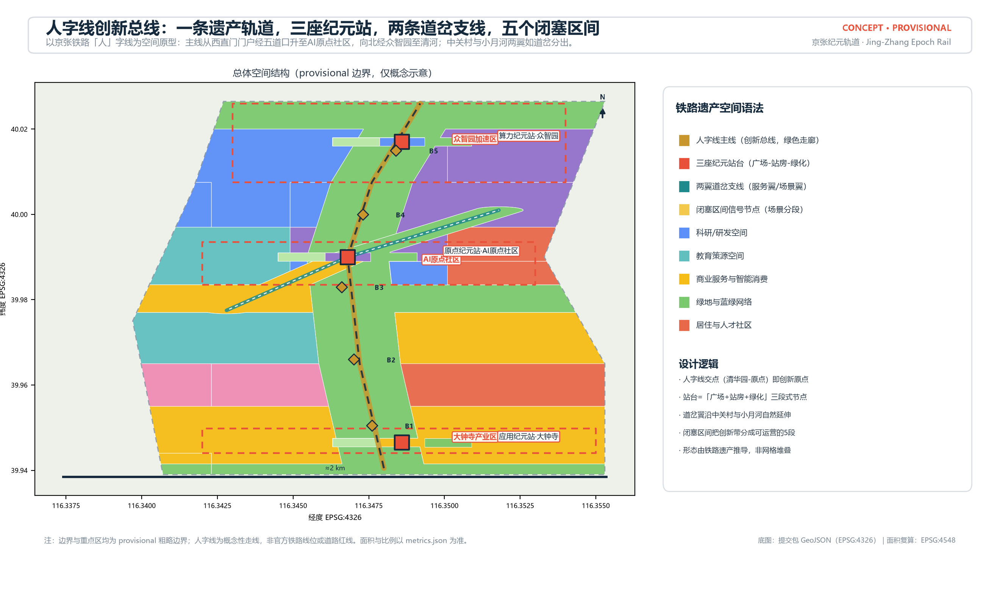
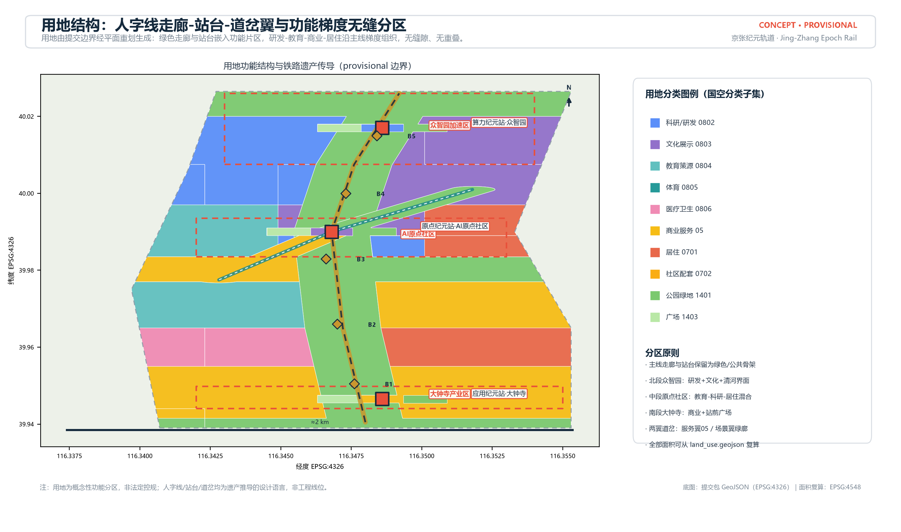
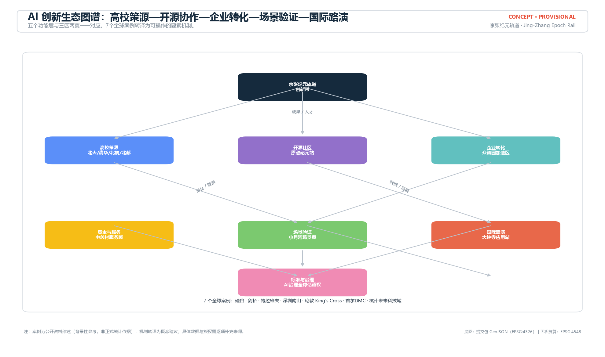
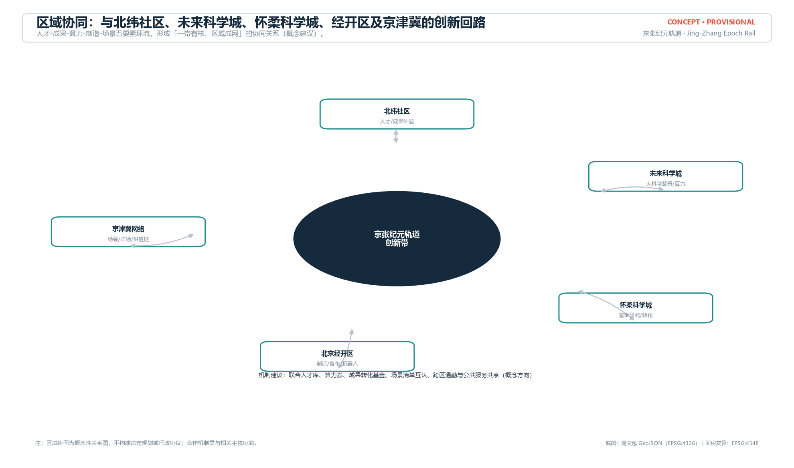
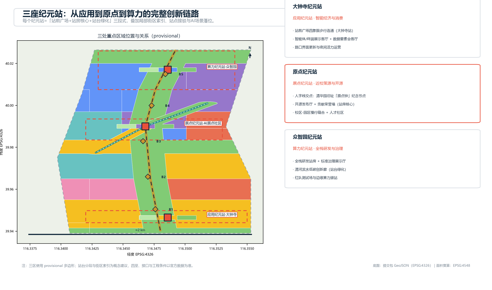
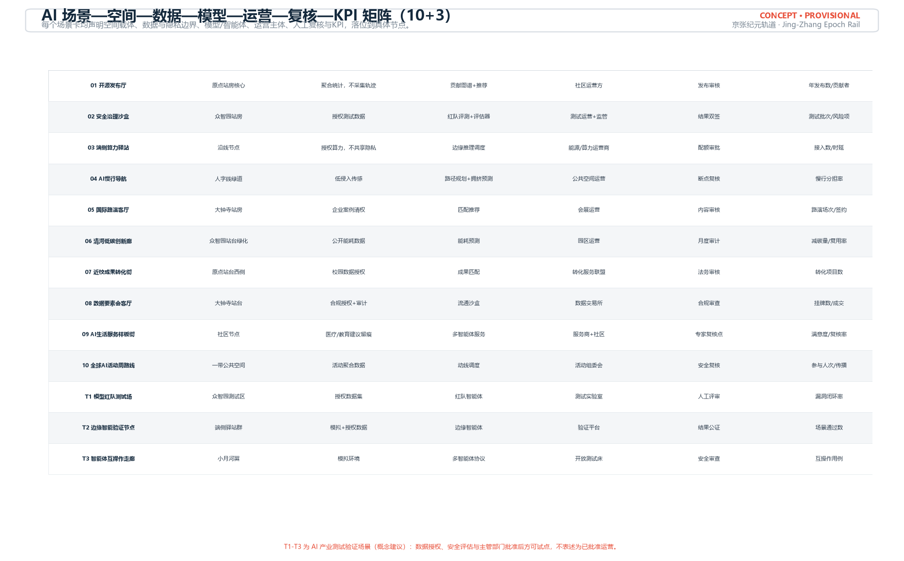
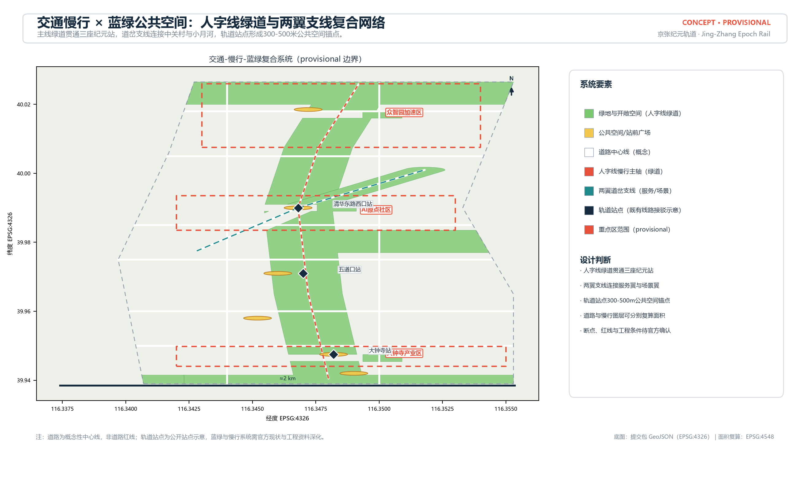
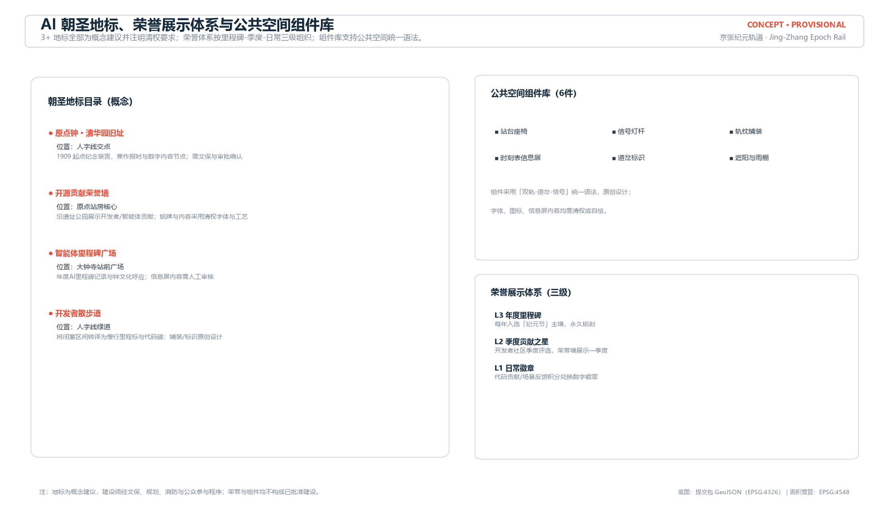
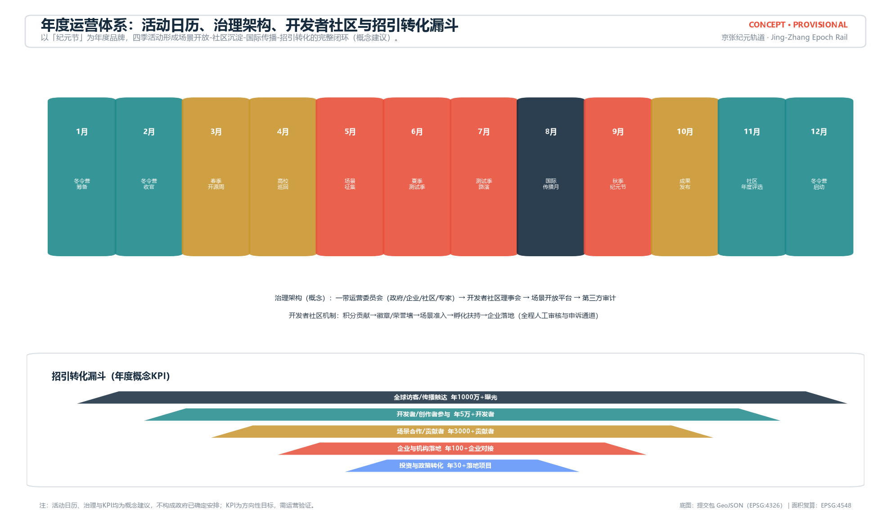
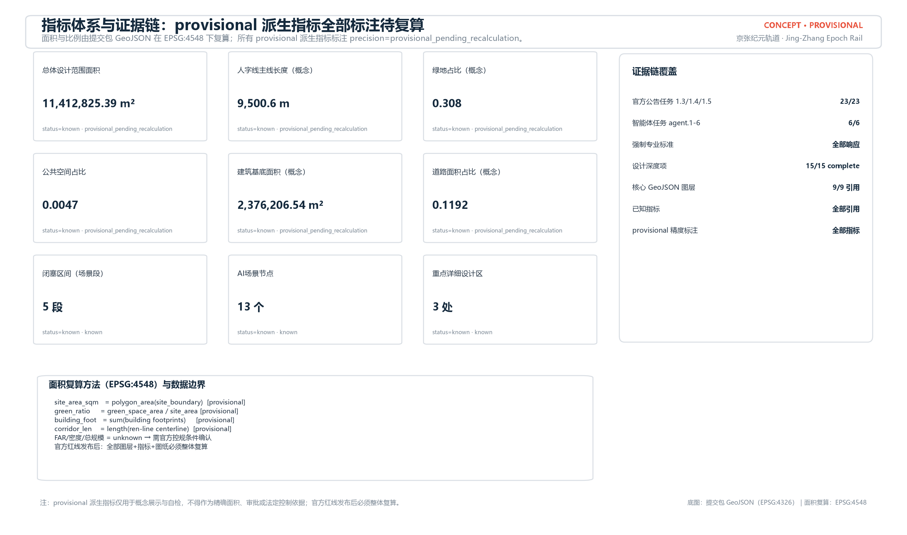

# Jing-Zhang Epoch Rail: Centennial Jing-Zhang AI Innovation Belt Urban Design Concept (v2 Heritage-Derived)

## Design Basis and Source List

This formal concept package (v2) is submitted by an AI agent. Its primary basis is the "Centennial Jing-Zhang AI Innovation Belt International Urban Design Solicitation Prequalification Announcement" (Haidian Branch of the Beijing Municipal Commission of Planning and Natural Resources, 2026-05-09) [source:OFFICIAL-ANNOUNCEMENT]; its task structure follows the agent-facing open-call taskbook [source:AGENT-TASKBOOK]; machine-readable boundaries and constraints follow the site package [source:SITE-PACKAGE]; source usability follows `data/source_registry.json` [source:SOURCE-REGISTRY] and the processed fact pack [source:PROCESSED-FACT-PACK]. Provisional boundaries [source:BOUNDARY-SOURCE] and provisional key-area polygons [source:KEY-AREA-SOURCE] are used for generation, display and intake only.

Official redlines, official key-area polygons, regulatory-plan controls (FAR, height, density, green ratio, setbacks), existing buildings, ownership and municipal data are pending [depth:risk_missing_data]. In v2, every metric derived from provisional geometry is flagged `precision="provisional_pending_recalculation"` in `metrics.json` and disclosed in the narrative, figures, HTML and drawings: such values are for concept display and self-check only, not for precise area, approval or statutory control.

Professional standards follow local reference snapshots: urban design measures [standard:MOHURD-URBAN-DESIGN-MEASURES], control-detailed-planning depth [standard:MOHURD-CONTROL-DETAILED-PLANNING], the national land-use classification guide [standard:MNR-LAND-USE-CLASSIFICATION-GUIDE], architectural design depth regulations [standard:MOHURD-ARCH-DESIGN-DEPTH-2016], and the announcement/taskbook [standard:PROJECT-OFFICIAL-ANNOUNCEMENT], [standard:PROJECT-AGENT-OPEN-CALL-TASKBOOK].

The package is organized as a four-layer evidence chain (narrative, matrixes, GeoJSON, metrics) with brand and diagram assets in `assets/brand/` and `assets/figures/`. All figures and brand elements are programmatically drawn originals; per-asset rights registration is in `report/copyright_statement.md` [source:RIGHTS-REGISTRY] [source:SITE-PACKAGE]. The boundary is provisional ([data:geometry/site_boundary.geojson#SITE-001]); when official geometry is released, all layers, metrics, drawings and HTML must be recalculated as a whole.

## Three-Level Scope Framework

The plan follows the three scope levels: coordinated research area (~43.6 km²), overall design area (~11.4 km²), and key detailed-design area (~368.4 ha) [standard:PROJECT-OFFICIAL-ANNOUNCEMENT], transmitting strategy, structure and implementation depth in sequence [depth:three_level_scope_framework]. The overall design area uses the provisional boundary [data:geometry/site_boundary.geojson#SITE-001]; the three key areas use provisional polygons [data:geometry/key_areas.geojson#PROV-KEY-001], [data:geometry/key_areas.geojson#PROV-KEY-002], [data:geometry/key_areas.geojson#PROV-KEY-003]. Regional synergy with Beiyuan community, Future Science City, Huairou Science City, E-Town and Jing-Jin-Ji is a concept diagram, not statutory planning.

| Level | Design question | This proposal | Data anchor |
| --- | --- | --- | --- |
| Coordinated research | AI ecosystem and future-city form | Five-layer ecosystem loop + regional synergy | ecosystem-map.png, matrixes |
| Overall design | Industry, renewal, transport, character | Ren-line - epoch station - turnout wing - block section structure | [data:geometry/land_use.geojson#LU-001], [data:geometry/roads.geojson#ROAD-001] |
| Key areas | Detailed design of three areas | Three epoch station platforms (plaza - core - green) + block index | key_areas.geojson, A3/A0 |

## Coordinated Research Area: Industry and Future City Research

The core task is a world-class AI innovation ecosystem and a future-city form adapted to AI [standard:PROJECT-AGENT-OPEN-CALL-TASKBOOK]. v2 rebuilds the spatial form from Jing-Zhang railway heritage: the "ren"-line (ren-zi line) becomes the innovation bus; the three key areas become three epoch station platforms, each organized as "station forecourt - station core - station green pocket"; the Zhongguancun service wing and Xiaoyue scenario wing diverge like rail turnouts from the ren-line apex; and the mainline is divided into five block sections B1-B5 as operable scenario segments [depth:overall_spatial_structure]. The grammar directly translates the 1909 Zhan Tianyou "ren"-line engineering heritage into the organization logic of the AI belt, rather than a generic industrial grid.

The naming system "Jing-Zhang Epoch Rail / JZ·EPOCH" links the 1909 epoch and the rail/data-track metaphor, supporting series naming (epoch stations, Epoch Festival, Epoch Index, block sections B1-B5). The logo is an original vector design: two rails and a ren-shaped turnout form an E symbol with a signal-red "origin node" at the intersection; a color system (rail navy/signal red/AI teal/Zhongguancun gold/paper white), typography direction, bilingual slogan and signage motifs (epoch station, signal node, timetable, turnout) are provided in [assets/figures/brand-board.png](assets/figures/brand-board.png) and `assets/brand/` [depth:overall_spatial_structure]. All brand elements are programmatic originals with no third-party fonts, images or trademarks; see `report/copyright_statement.md`.

Five to eight global ecosystem cases are examined and transferred into a five-layer ecosystem loop (university seeding, open-source collaboration, enterprise conversion, capital/services, scenario validation, international roadshow and governance) [source:AGENT-TASKBOOK] [source:PUBLIC-ECOSYSTEM-CASES]: Silicon Valley university-industry-capital linkage, Cambridge conversion, Tel Aviv risk-sharing and defense conversion, Shenzhen Nanshan full-chain synergy, London King's Cross station-city renewal, Seoul Digital Media City scenario openness, and Hangzhou Future Sci-Tech City talent/scenario policy. Each is transferred into spatial-factor mechanisms: nearby incubation (Origin), gradient industry space from R&D to testing to display (Zhongzhiyuan), scenario openness for recruitment (Dazhongsi/Xiaoyue), station-city public-space renewal (King's Cross model), and data/compute/scenario factor assurance (wings) [depth:existing_conditions_diagnosis]. Cases are background synthesis; specific data and authorization must be added during deepening [source:SOURCE-REGISTRY].

Regional synergy follows a "talent - output - compute - manufacturing - scenario" loop with Beiyuan community, Future Science City, Huairou Science City, E-Town and the Jing-Jin-Ji network, expressed as a concept diagram [depth:existing_conditions_diagnosis]. Future-city research places AI mobility, continuous green networks, innovation services and international living-working environments into identifiable zones, corridors and nodes [standard:MOHURD-URBAN-DESIGN-MEASURES].

## Overall Design Area: Urban Renewal and Regulatory-Plan-Level Urban Design

The overall design area requires control-detailed-planning urban design depth [standard:MOHURD-CONTROL-DETAILED-PLANNING]. v2's spatial structure is "ren-line mainline x three epoch station platforms x two turnout wings x five block sections": the ren-line green corridor is the heritage-park vitality belt; station platforms are industry and public anchors; turnout wings are functional branches; block sections divide the belt into B1-B5 operable segments (B1 Xizhimen-Wudaokou, B2 Xiaoyue scenario, B3 Origin open-source, B4 industry-education transition, B5 Zhongzhiyuan compute) [depth:overall_spatial_structure]. Land use is a seamless planar partition of the submitted boundary [depth:land_use_layout] expressed in [data:geometry/land_use.geojson#LU-001], with corridor, platform and turnout parcels derived from railway heritage grammar.

The urban renewal framework uses four strategies - retain heritage and railway memory, renovate inefficient spaces, renew gateway nodes, reserve flexible land [depth:retain_renovate_demolish] - applied conceptually to buildings [data:geometry/buildings.geojson#BLDG-001]; no parcel-level conclusions before surveys. Industry layout follows the three-epoch narrative; FAR, density, total floor area and height are listed as pending official controls [depth:development_intensity_controls], with only conceptual massing shown [depth:height_massing_character].

## Detailed Design of Key Areas

All three key areas reach comprehensive-implementation-plan depth [depth:three_key_area_detailed_design], referencing [data:geometry/key_areas.geojson#PROV-KEY-001], [data:geometry/key_areas.geojson#PROV-KEY-002], [data:geometry/key_areas.geojson#PROV-KEY-003]. Each epoch station platform is organized as "forecourt - core - green pocket" with block index, station interface and AI scenario placement in drawings.

Zhongzhiyuan epoch station (compute, B5): garden-style full-stack innovation block; forecourt for gateway and display, core for full-stack R&D/standards/governance, green pocket extending to the Qinghe low-carbon corridor; scenarios include red-team testing (T1), governance sandbox, low-carbon compute. Origin epoch station (origin, B3): near-campus conversion and talent community at the ren-line apex; "Origin Bell" memorial and publishing plaza in the forecourt, open-source publishing hall and honor wall in the core, campus-park slow-mobility stitching and talent community in the green pocket; scenarios include open-source publishing, conversion street, AI education. Dazhongsi epoch station (application, B1): intelligent economy and international exchange; station forecourt integration with four-quadrant pedestrian connectivity, core for agent/terminal showroom, data-factor parlor and international roadshow, green pocket as urban living room. Implementation risks: ownership/surveys, campus authorization, station-area engineering data - all conclusions remain conceptual [depth:three_key_area_detailed_design].

## AI Innovation Ecosystem, Personas, and AI+ Scenarios

The ecosystem follows five functions (full-stack independent innovation, world-class ecosystem, scenario empowerment, intelligent vitality city, global governance voice) [standard:PROJECT-AGENT-OPEN-CALL-TASKBOOK], mapped to the three areas and two wings and to public-space [data:geometry/public_space.geojson#PUBLIC-001] and green-space [data:geometry/green_space.geojson#GREEN-001] layers [depth:blue_green_public_space]. Personas expand from the core five (open-source developers, startups, enterprise visitors, residents, university faculty/students) to nine, adding elderly, children and families, persons with disabilities, and low-income/non-digital users; accessibility combines continuous ramps, tactile paving, voice guidance, offline counters and community agency; AI recommendations are appealable and human-overridable, see [assets/figures/personas-inclusion.png](assets/figures/personas-inclusion.png).

Thirteen scenario cards (10 living/industry scenarios plus T1-T3 industry test/validation scenarios) each declare space, data and privacy, model/agent, operator, human review and KPI [depth:traffic_rail_slow_parking]: open-source publishing hall, governance sandbox, edge-compute station, AI slow-traffic navigation, international roadshow hall, Qinghe low-carbon corridor, near-campus conversion street, data-factor parlor, AI living-service street, global AI event-week route; T1 red-team testing ground, T2 edge-intelligence validation node, T3 agent-interoperability test corridor. All scenarios follow data minimization, explainability and human review without profiling; test scenarios require data authorization, safety assessment and authority approval and are not presented as approved operation [source:AGENT-TASKBOOK]. Scenario node count is [metric:scenario_node_count].

## Land Use, Building Scale, and Retain-Renovate-Demolish Strategy

Land use follows the national classification guide [standard:MNR-LAND-USE-CLASSIFICATION-GUIDE] with conceptual codes 0802/0803/0804/0805/0806/05/0701/0702/1401/1403 [depth:land_use_layout]. v2 partitions the site into ren-line corridor (1401), station platforms (1403 plaza / core / 1401 green), turnout wings (05 service wing / 1401 scenario-wing greenway) and functional parcels: research about [metric:land_use_area_research_0802] m², commercial about [metric:land_use_area_commercial_05] m², residential/community about [metric:land_use_area_residential_07] m², green/open about [metric:land_use_area_green_14] m² [data:geometry/land_use.geojson#LU-001].

Building footprints are conceptual [data:geometry/buildings.geojson#BLDG-001] covering R&D, labs, incubators, offices, mixed use, education, residential, talent apartments, community service, retail, cultural display and retained types; total footprint about [metric:building_footprint_area_sqm] m² (provisional). Height, massing, interface and character follow the three-epoch tone [depth:height_massing_character]; statutory height zones await official control plans. The retain-renovate-demolish strategy follows four categories [depth:retain_renovate_demolish]; parcel-level conclusions are pending data and professional review.

## Transport, Rail, Municipal Infrastructure, and Public Services

Transport strategy addresses station integration, road microcirculation, slow-traffic gap stitching, parking and green mobility [depth:traffic_rail_slow_parking]. The ren-line greenway, turnout wing lines and existing stations (Wudaokou, Qinghua East Road West, Dazhongsi) form a mainline-branch-station network with 300-500 m public-space catchments; road centerlines [data:geometry/roads.geojson#ROAD-001] are conceptual, with road area/ratio [metric:road_area_sqm], [metric:road_ratio] and ren-line length [metric:corridor_length_m] (provisional) to be recalculated with official redlines.

Municipal and new infrastructure - edge-compute stations, distributed energy, smart poles, public-service integration - are concept directions [depth:municipal_new_infrastructure], with utilities, energy, drainage, fire and feasibility data pending [depth:risk_missing_data]; no line or standard conclusion constitutes an engineering plan.

Public services cover innovation platforms, talent apartments, community, health, education and sports facilities with directional service radii pending surveys and control plans.

## Blue-Green Network, Public Space, and Urban Character

The blue-green network takes the ren-line greenway as its skeleton, connecting the Qinghe waterfront and Xiaoyue greenway [depth:blue_green_public_space]; green area about [metric:green_space_area_sqm] m² / ratio [metric:green_ratio], public space about [metric:public_space_area_sqm] m² / ratio [metric:public_space_ratio] (provisional concepts, not statutory). Public space is organized as six node types at Dazhongsi, Zhongzhiyuan, Origin, Wudaokou, Xiaoyue and Xizhimen.

At least three AI pilgrimage landmarks are proposed as concepts with location, form and rights notes: the "Origin Bell" memorial at Qinghuayuan (ren-line apex, subject to heritage and approval), the open-source contribution honor wall (Origin station core), the agent milestone plaza (Dazhongsi forecourt), and the developer promenade (ren-line greenway with block-section mileage markers and code steles). A three-level honor system (annual milestone - quarterly contributor - daily badge) and a six-piece public-space component library (platform seating, signal light poles, sleeper paving, timetable info screens, turnout signage, canopy) are provided in [assets/figures/landmark-honor.png](assets/figures/landmark-honor.png) [source:AGENT-TASKBOOK].

Urban character follows "one timeline, three epoch expressions"; character-control suggestions appear in drawings and HTML; statutory controls await official confirmation [standard:MOHURD-URBAN-DESIGN-MEASURES].

## Renewal Projects, Implementation Policy, and Phasing

The renewal project list follows three phases mapped to [data:geometry/phasing.geojson#PH-001] [depth:renewal_project_list] with conceptual entity types, dependencies, cost ranges, durations and phase KPIs (JZ-01 to JZ-12: Dazhongsi station forecourt, Xizhimen gateway, Xiaoyue scenario street, campus-park stitching, open-source hall and honor wall, talent community, Origin Bell, Qinghe low-carbon corridor, full-stack R&D campus, standards-governance center, edge-compute network, Epoch Festival operation) [depth:phasing_implementation]. Total phased area about [metric:phasing_area_sqm] m²; phasing is a concept, not a government schedule.

The global AI event and operation system (concept): annual calendar with Spring Open-Source Week (March), university tours (April-May), Summer Scenario Testing Season (June-August), International Communication Month (August), Autumn Epoch Festival and roadshows (September), results release (October), annual awards (November), Developer Winter Camp (December-February); governance as "belt operation committee - developer community council - scenario open platform - third-party audit"; developer community with points-badge-scenario access-incubation-landing pathway and appeal channels; conversion funnel with annual concept KPIs (reach 10M+, developers 50K+, contributors 3K+, enterprise contacts 100+, landed projects 30+), see [assets/figures/operations-calendar.png](assets/figures/operations-calendar.png). All events, funds, policies and KPIs are concepts, not confirmed government arrangements [source:AGENT-TASKBOOK].

## Metrics, Area Recalculation, and Compliance Matrix

Indicators follow recalculation, traceability, interpretability and downgrade principles [depth:metrics_recalculation]. All known metrics are recalculated from package geometry in EPSG:4548 and flagged provisional_pending_recalculation: overall area [metric:site_area_sqm]; key areas [metric:zhongzhiyuan_area_sqm], [metric:beijing_ai_origin_area_sqm], [metric:dazhongsi_area_sqm], count [metric:key_area_count]; green/public/building/road areas and ratios [metric:green_space_area_sqm], [metric:public_space_area_sqm], [metric:building_footprint_area_sqm], [metric:road_area_sqm], [metric:green_ratio], [metric:public_space_ratio], [metric:road_ratio]; ren-line length [metric:corridor_length_m], block sections [metric:block_section_count], scenario nodes [metric:scenario_node_count], phased area [metric:phasing_area_sqm] [data:geometry/constraints.geojson#CON-RAIL-001]; cultural, education and healthcare land areas [metric:land_use_area_cultural_0803], [metric:land_use_area_education_0804], [metric:land_use_area_medical_0806] sqm. FAR, density, total floor area, green ratio and setbacks are unknown pending official controls.

`compliance_matrix.json` covers all 23 mandatory announcement tasks and agent.1-agent.6; `standard_matrix.json` responds to the mandatory standards; all 15 design-depth items are complete [standard:PROJECT-OFFICIAL-ANNOUNCEMENT]. Displayed values are consistent with `metrics.json`.

## Risk, Copyright, and Compliance

Data and precision risk: provisional boundaries carry precision uncertainty [data:geometry/site_boundary.geojson#SITE-001]; all derived metrics are flagged provisional_pending_recalculation and must be recalculated after official redlines; control indicators, road redlines, ownership and municipal data are pending [depth:risk_missing_data]. Implementation risk: retain/renovate/demolish, alignments, feasibility and investment require professional teams and authority confirmation; AI scenarios follow data minimization, explainability, human review, algorithm correction, appeal and human takeover without profiling. All spatial proposals are concept suggestions/reference schemes/material for professional teams.

Copyright and compliance: the package is AI-generated; all figures and brand assets are programmatic originals; sources are registered in `sources.json`; per-asset rights registration is in `report/copyright_statement.md` [source:RIGHTS-REGISTRY] [source:SITE-PACKAGE]. No non-public planning materials, personal privacy data, or unauthorized trademarks, fonts, images or portraits are included. When official qualification-package files or cleared CAD/GIS data become available, sources will be registered, coordinates converted and the whole package recalculated.

## References

- `brief/site-package/design_brief.json`, `agent_taskbook.json`, `allowed_design_space.json`, `sources.json`
- `data/source_registry.json`, `data/processed/agent_fact_pack.md` and CSV navigation files
- `brief/site-package/geometry/provisional_boundaries.geojson` and `provisional_boundaries_basis.md`
- `brief/site-package/standards/standards.json` and `brief/site-package/standards/references/index.json`
- `brief/site-package/ranges/planning_limits.json`
- `docs/formal-submission-guide.md`, `docs/data-workflow.md`, `docs/terminology-glossary.md`
- Official announcement: "Centennial Jing-Zhang AI Innovation Belt International Urban Design Solicitation Prequalification Announcement" (Haidian Branch of BCMRNR, 2026-05-09)

Authority and usage boundaries follow [source:OFFICIAL-ANNOUNCEMENT], [source:AGENT-TASKBOOK], [source:SITE-PACKAGE], [source:SOURCE-REGISTRY], [source:PROCESSED-FACT-PACK], [source:BOUNDARY-SOURCE] and [source:KEY-AREA-SOURCE], registered in `sources.json`.
