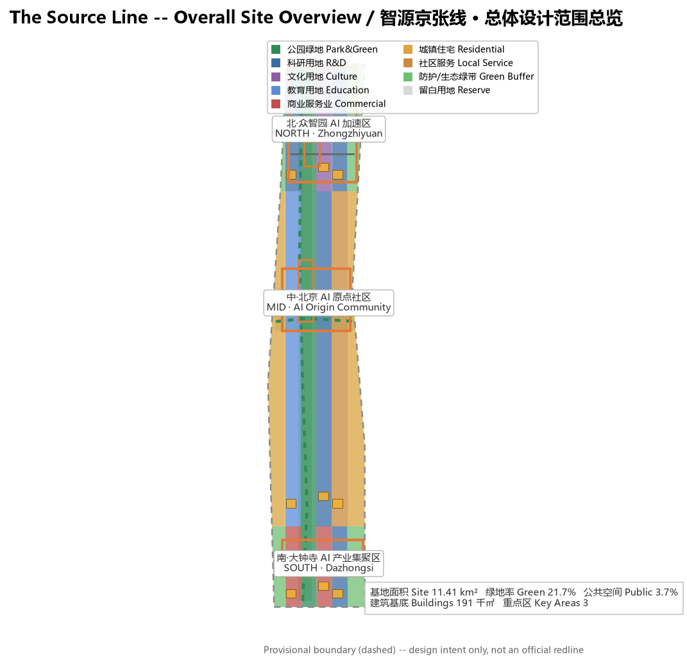
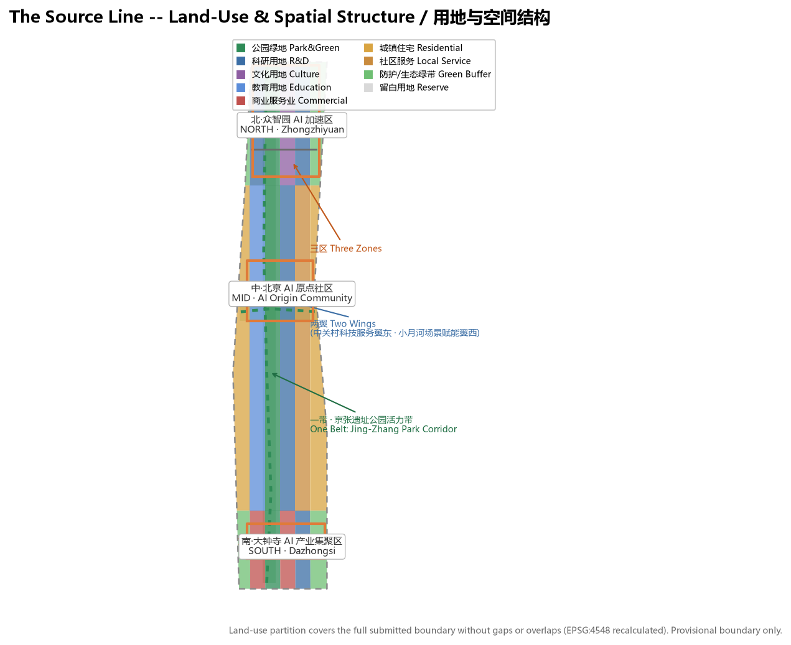
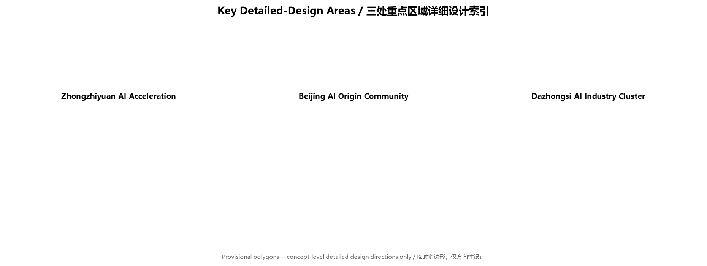
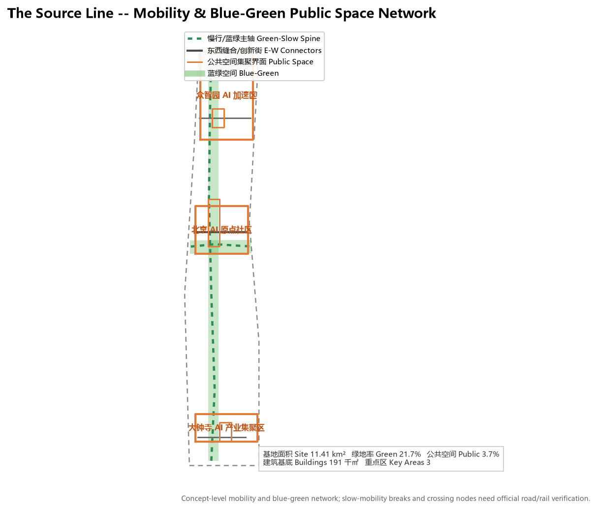
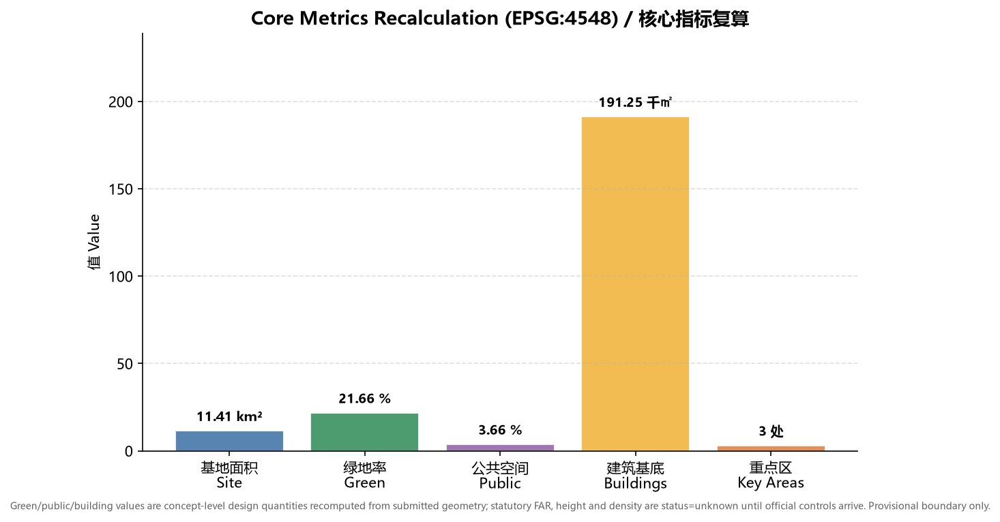

# The Source Line: Centennial Jing-Zhang AI Innovation Belt Urban Design Proposal

## Design Basis and Source Inventory

This proposal is anchored first on the Qualification Pre-Announcement for the Centennial Jing-Zhang AI Innovation Belt International Urban Design Open Call issued by the Haidian Branch of the Beijing Municipal Commission of Planning and Natural Resources, and reads the design brief, the agent-facing open-call taskbook, the allowed design space, provisional boundaries, enums, metric ranges and source inventory under `brief/site-package/` as machine-readable basis [source:OFFICIAL-ANNOUNCEMENT]. The agent-facing taskbook further defines the three positionings, five functions, three zones and two wings, six mandatory tasks and a unified boundary clause that organize the narrative, scenario cards, branding and operation content [source:AGENT-TASKBOOK].

Source-use boundaries follow `data/source_registry.json` [source:SOURCE-REGISTRY]: the official announcement and taskbook are formal-ready; `brief/site-package/geometry/provisional_boundaries.geojson` is provisional-only, usable for generation, presentation, self-check and design discussion but never as an official redline, approval basis or precise-area basis [source:BOUNDARY-SOURCE]. Traceable reference markers sit beside design judgments; the full inventory of sources, metrics, standards, design-depth and task coverage lives in `sources.json`, `metrics.json`, `standard_matrix.json`, `design_depth_matrix.json` and `compliance_matrix.json`, not as a dense index dump in the prose.

The proposal generates spatial layers on the provisional overall-design boundary, explicitly declaring `official_boundary=false` and `geometry_role=provisional_constraint` [data:geometry/site_boundary.geojson#SITE-001]. This organizer data gap does not block content scoring; once official polygons arrive, site boundary, key areas, land use, roads, green space, public space, buildings, phasing and all metrics must be recalculated [metric:site_area_sqm].

## Three-Level Scope Framework

The proposal is organized by the three scopes defined in the announcement [standard:PROJECT-OFFICIAL-ANNOUNCEMENT]: the coordinated research area (about 43.6 km²) addresses a world-class AI innovation ecosystem, industry-chain synergy, three zones and two wings, and future AI city form; the overall design area (about 11.4 km²) addresses the urban area around the Jing-Zhang Heritage Park at regulatory-detailed-planning urban-design depth; and the key detailed-design area (about 368.4 ha) addresses detailed design of the three key zones at planning-comprehension-implementation depth [depth:three_level_scope_framework].

The three scopes are not isolated drawings but progressive levels: industry strategy decides the coordinated judgment, the coordinated judgment lands on the overall spatial structure and renewal projects, and the overall design validates feasibility in the three key zones [depth:overall_spatial_structure]. The overall design area is the reference extent for spatial layers and metric recalculation, and the key areas are expressed by the three polygons in `geometry/key_areas.geojson` [data:geometry/key_areas.geojson#PROV-KEY-001].

## Coordinated Research Area: Industry and Future-City Study

The coordinated research area's core task is to build a world-class AI innovation ecosystem. The proposal develops the "The Source Line" name and visual-identity direction: the Jing-Zhang Railway's 1909 opening began China's self-built trunk rail "source," echoing Zhongguancun's role as a source of Chinese innovation, and extends "source" to AI compute, data, talent and ideas -- a unified narrative across "Centennial Jing-Zhang Culture Belt, Urban AI Life Experience Belt, AI Integration Innovation Belt" [standard:PROJECT-AGENT-OPEN-CALL-TASKBOOK]. The Logo direction combines the herringbone rail line with the "source" form as the wayfinding and brand motif.

The agent-facing taskbook requires the five functions and three-zone two-wing synergy [source:AGENT-TASKBOOK]. The proposal maps the five functions to a spatial loop: full-stack self-driven AI innovation (Zhongzhiyuan), world-class AI innovation ecosystem (AI Origin Community), AI+ scenario enablement new paradigm (Xiaoyue River scenario wing), intelligent AI vibrant city (Jing-Zhang Heritage Park belt), and global voice in AI governance (Dazhongsi international-exchange interface), with the Zhongguancun technology-service wing providing global-factor allocation and capital enablement.

| Global AI innovation ecosystem case | Transferable spatial / operation mechanism |
| --- | --- |
| Palo Alto university-town corridor, Silicon Valley | Campus-adjacent slow-mobility stitching, launch venues and talent community (Origin Community) |
| King's Cross regeneration, London | Railway-heritage vitality belt, innovation public space, mixed-use development |
| Kendall Square, Boston | Full-stack innovation chain, company and incubator ecosystem map (Zhongzhiyuan) |
| One-North, Singapore | Blue-green corridor, scenario opening, livable R&D environment |
| Marunouchi, Tokyo | Rail-station integration, international exchange and brand operation (Dazhongsi) |
| Shenzhen Bay Science & Technology Park | Low-carbon compute, industrial services and public display mixed use |

These cases are concept-level references for spatial, operation and scenario mechanisms, not assessments of any firm or project [source:AGENT-TASKBOOK]. The proposal lands these lessons in land use, public space, mobility, AI scenario nodes and indicators, as shown in `geometry/land_use.geojson` and the indicator system below [depth:land_use_layout].

## Overall Design Area: Urban Renewal and Regulatory-Plan Depth

The overall design area reaches regulatory-detailed-planning urban-design depth under a "One Belt, Three Zones, Two Wings, One Corridor" structure: the Jing-Zhang Heritage Park vitality belt as the north-south public spine, Zhongzhiyuan / AI Origin Community / Dazhongsi as innovation anchors, the Zhongguancun technology-service wing and Xiaoyue River scenario wing in synergy, and a Qing River-Xiaoyue River blue-green corridor linking public spaces [depth:overall_spatial_structure].

Land use follows the national territorial-spatial land-use classification to form a complete, closed and gapless partition [standard:MNR-LAND-USE-CLASSIFICATION-GUIDE]. `geometry/land_use.geojson` divides the overall design area into research, education, culture, commercial, residential, local-service, park green, protective green and reserve parcels -- 18 zones covering the full submitted boundary without overlap [data:geometry/land_use.geojson#LU-001]. Land use supports industry space supply and talent life services; green and public-space ratios serve innovation exchange and ecological quality [metric:green_ratio].

Buildings and development intensity: the proposal expresses concept-level building footprints only in `geometry/buildings.geojson` [data:geometry/buildings.geojson#BLDG-001], to show innovation-exchange density and massing direction [metric:building_footprint_area_sqm]. Regulatory indicators -- FAR, height, density, setbacks, road redlines -- are recorded as `status=unknown` because no official regulatory conditions exist, with pending-confirmation notes and recalculation paths in `assumptions.json`; concept volumes are never dressed up as approved limits [depth:development_intensity_controls].

Transport, rail, municipal and public services: the proposal develops spatial strategies for rail-station integration, road micro-circulation, slow-mobility gap stitching, parking and non-motorized organization, innovation service platforms, talent life services, new infrastructure, distributed energy and edge compute [depth:traffic_rail_slow_parking]. Content on road redlines, utilities, fire and municipal capacity is listed as a formal deepening prerequisite rather than an approved conclusion, given the absence of official engineering data [depth:municipal_new_infrastructure].

## Key Areas: Detailed Design

The three key zones reach planning-comprehension-implementation depth [depth:three_key_area_detailed_design] on the three provisional polygons in `geometry/key_areas.geojson` [data:geometry/key_areas.geojson#PROV-KEY-001].

| Key zone | Design positioning | Spatial moves | AI industry & operation scenarios |
| --- | --- | --- | --- |
| Zhongzhiyuan AI Acceleration Zone | Garden-style full-stack innovation district | Strengthen Qing River interface, industry display, low-carbon innovation exchange and external transport organization | Proprietary model testing, standard workshops, safety-governance display, low-carbon compute experience |
| Beijing AI Origin Community | Campus-adjacent outcome-transformation and talent community | Stitch campus, park and street; add launch venues, talent services, residential life and open-source collaboration | Open-source community, outcome launching, talent-zone services, campus-adjacent incubation |
| Dazhongsi AI Industry Cluster | Urban smart-economy and international-exchange district | Dazhongsi station integration, four-quadrant pedestrian connectivity, commercial services and public-environment renewal around anchor firms | Agent and smart-terminal display, content consumption, data elements and international roadshows |

Each key zone forms a readable mini-scheme of positioning, spatial structure, building renewal, mobility, public space, AI scenarios and implementation risk. Because the key-zone polygons are provisional, all parcel-level conclusions are directional and require deep refinement once official polygons and regulatory conditions arrive [data:geometry/key_areas.geojson#PROV-KEY-002] [data:geometry/key_areas.geojson#PROV-KEY-003].

## AI Innovation Ecosystem, Talent Personas and AI+ Scenarios

The proposal builds personas for AI talent, enterprises, residents and public governance, and defines AI+ scenarios for software/information, healthcare, education, legal, life services, transport and public space with explicit data sources, privacy boundaries, human review and operation mechanisms [depth:blue_green_public_space].

| User persona | Typical needs | Spatial response |
| --- | --- | --- |
| Open-source developer | Launch, collaborate, test, community reputation | Origin Community open-source launch hall, public code wall, night collaboration space |
| Startup team | Low-cost office, compute gateway, product testbed | Zhongzhiyuan shared test field, edge-compute service, standards/governance consulting |
| Anchor-company visitor | Display, business, international reception, recruiting | Dazhongsi international roadshow lounge, rail connection, public space around anchor firms |
| Local resident | Commute, leisure, community services, low-disruption renewal | Jing-Zhang Park slow loop, embedded community services, graded night lighting and events |
| University faculty & students | Outcome transformation, cross-campus collaboration, daily mobility | Campus-park slow stitching, transformation stations, AI-education experience points |

The proposal provides at least 10 AI scenario cards, including 3 industry test/validation scenarios:

| Scenario card | Spatial carrier | Type | Data source & governance boundary |
| --- | --- | --- | --- |
| 01 Open-Source Launch Hall | Beijing AI Origin Community | Public service | Public code and project metadata; aggregated activity data, no personal tracking |
| 02 Safety-Governance Sandbox | Zhongzhiyuan | Industry test/validation | Controlled test data; standards evaluation and red-team testing require authorization and human review |
| 03 Edge-Compute Hub | Overall design nodes | New-infrastructure prototype | Energy and compute operation data; privacy minimized |
| 04 AI Slow-Mobility Navigation | Jing-Zhang Heritage Park belt | Public service | Explainable wayfinding and low-intrusion sensing; gap identification requires human review |
| 05 Dazhongsi International Roadshow Lounge | Dazhongsi AI Cluster | Industry display | Corporate cases require clearance; business data confidential |
| 06 Qing River Low-Carbon Innovation Corridor | Zhongzhiyuan riverfront | Industry test/validation | Environmental and stormwater monitoring data; public ecological indicators |
| 07 Campus Outcome-Transformation Street | Beijing AI Origin Community | Industry service | Research and IP require authorization; legal and investment compliance |
| 08 Data-Element Salon | Dazhongsi area | Industry test/validation | Data-element circulation requires compliance, authorization and auditability |
| 09 AI Life-Service Sample Street | Community-commerce junction | Public service | Healthcare, education, legal scenarios need privacy and human-review boundaries |
| 10 Global AI Festival Week Route | Belt-wide public space system | Operation event | Event registration and experience data; copyright and portrait clearance |

These scenarios anchor to specific spatial layers and governance boundaries: public-space scenarios cite [data:geometry/public_space.geojson#PUBLIC-001], mobility scenarios cite [data:geometry/roads.geojson#ROAD-001], and open-space scenarios cite [data:geometry/green_space.geojson#GREEN-001]. All generative AI services follow data-minimization, explainability and human-review principles; they do not substitute for planning approval, output unauthorized personal profiles, or claim official implementation commitments.

## Land Use, Building Scale, and Retain / Renovate / Demolish

Land use follows the national classification and covers the full submitted boundary seamlessly without overlap [standard:MNR-LAND-USE-CLASSIFICATION-GUIDE]. The building scheme distinguishes retain, renovate, renew, new-build or to-be-confirmed objects and sets advisory levels for footprint, function, scale, character, roof, massing and height control [depth:height_massing_character].

Retain/renovate/demolish follows a "diagnose first, classify, confirm later" method [depth:retain_renovate_demolish]: without existing-building, ownership and regulatory conditions, no parcel-level demolition/renovation conclusion is fabricated; instead, concept footprints in `geometry/buildings.geojson` express renewal direction, and statutory development-intensity indicators are uniformly recorded as `status=unknown`. Building footprint is an explicitly labeled concept-level design quantity, not a statutory value [metric:building_footprint_area_sqm].

## Transport, Rail, Municipal and Public Services

The transport scheme responds to rail-station integration, road micro-circulation, slow-mobility gaps, external transport, parking and non-motorized organization, focusing on the North 5th Ring crossing nodes, Wudaokou, the west end of Qinghuadong Road, Dazhongsi station and anchor-company access [depth:traffic_rail_slow_parking]. `geometry/roads.geojson` expresses the Jing-Zhang Park slow spine, east-west stitching roads, innovation streets and the Xiaoyue River blue-green corridor [data:geometry/roads.geojson#ROAD-001].

Municipal and new infrastructure spans AI industry-service facilities, innovation service platforms, talent life services, distributed energy, edge compute and conventional municipal integration [depth:municipal_new_infrastructure]. The proposal explains standards, spatial layout, service radius, operation model and phasing; missing utility, energy, drainage, flood and fire data are listed as formal deepening prerequisites.

## Blue-Green Space, Public Space and City Character

The blue-green scheme takes the Jing-Zhang Heritage Park vitality belt as the spine and integrates Qing River, Xiaoyue River, campus, enterprise and community movement to form connected north-south and east-west walking, cycling and green-space networks [depth:blue_green_public_space]. `geometry/green_space.geojson` expresses park green, protective green and blue-green corridors [data:geometry/green_space.geojson#GREEN-001], and `geometry/public_space.geojson` expresses public-activity interfaces [data:geometry/public_space.geojson#PUBLIC-001].

City character fuses Jing-Zhang railway heritage, Zhongguancun innovation culture and AI new culture, proposing urban tone, architectural character, roof form, massing, interface and public-art guidance [standard:MOHURD-URBAN-DESIGN-MEASURES]. The proposal identifies at least 3 AI pilgrimage landmarks or honor-display nodes: the Jing-Zhang Park "Source Memorial Node" (railway-source and cultural memory), the Zhongzhiyuan "Self-Driven Innovation Honor Wall" (full-stack innovation and open-source contribution), and the Dazhongsi "AI Governance Discourse Square" (international exchange and outcome launching). Landmarks, wayfinding, Logo, fonts, images, portraits and corporate marks all require clearance; concepts must not be sensationalized or presented as approved construction.

## Renewal Project List, Policy and Phasing

The proposal forms an auditable renewal project list covering location, type, function, responsible party, dependencies, phase, risk and evaluation indicators [depth:renewal_project_list]. `geometry/phasing.geojson` expresses the phased extents [data:geometry/phasing.geojson#PHASE-001].

| ID | Project | Type | Key dependencies |
| --- | --- | --- | --- |
| JZ-01 | Jing-Zhang Park slow-mobility gap stitching | Public space / transport | Road redlines, underbridge space, traffic reorganization review |
| JZ-02 | Qing River innovation interface, Zhongzhiyuan | Blue-green / industry display | River blue line, ecology and flood conditions |
| JZ-03 | Origin Community campus outcome-transformation street | Urban renewal / industry service | Campus boundary, ownership, ground-floor uses |
| JZ-04 | Dazhongsi station four-quadrant pedestrian connectivity | Rail integration / mobility | Rail station, intersections, municipal utilities |
| JZ-05 | AI public service and edge-compute node | New infrastructure / public service | Energy, compute, security and operation body |
| JZ-06 | Global AI Festival Week public route | Operation / brand | Public-space permits, event safety, copyright clearance |

Phasing proposes near-term pilots, mid-term renewal and long-term governance [depth:phasing_implementation]: near-term starts with a Jing-Zhang Park pilot segment and lightweight operation facilities; mid-term advances Dazhongsi-Origin synergy renewal; long-term implements the Zhongzhiyuan self-driven innovation governance framework. The annual event system, developer-community operation, scenario open days, public-experience routes and international-communication mechanisms are all expressed as concept suggestions or deepening directions, not confirmed government arrangements. All events, investment, funding, policy and operation arrangements are written as material for professional teams to deepen.

## Indicator System, Area Recalculation and Compliance

The indicator system covers overall-design-area area, key-area area, green and public-space ratios, building footprint, renewal-project count, AI scenario nodes, mobility connectivity, industry space and talent-service indicators [depth:metrics_recalculation]. All known indicators are recomputed from submitted geometry in EPSG:4548 in `metrics.json`; unknown indicators state their reason and formal-submission prerequisites.

| Indicator | Value | Meaning |
| --- | --- | --- |
| Overall design area | 11,412,825 sqm | Reference extent for spatial layers and metrics [metric:site_area_sqm] |
| Green area / ratio | 2,471,521 sqm / 21.7% | Supports ecological quality, talent interaction and mobility [metric:green_ratio] |
| Public space area / ratio | 417,316 sqm / 3.7% | Supports innovation exchange, events and public experience [metric:public_space_ratio] |
| Building footprint | 191,251 sqm | Concept-level design quantity, not a statutory value [metric:building_footprint_area_sqm] |
| Key areas | 3 | Count check of the three key zones [metric:key_area_count] |

The compliance matrix is the master response-control file: `compliance_matrix.json` covers announcement tasks 1.3, 1.4, 1.5 and agent.1-agent.6; `standard_matrix.json` covers all mandatory professional standards; `design_depth_matrix.json` covers all mandatory design-depth items. Each task maps to report sections, layers, metrics, drawings, sources and self-check items; a proposal missing any mandatory task cannot enter formal professional scoring.

## Risk, Copyright and Compliance

This proposal provides complete bilingual deliverables, with `proposal.md` as the equivalent counterpart of this English file [depth:risk_missing_data]. The source, license and authorization status of all images, icons, data and code assets are stated in `sources.json` and `report/copyright_statement.md`. This proposal is AI-agent generated; all spatial recommendations are concept suggestions, reference schemes or material for professional teams to deepen, and do not replace formal planning or constitute government conclusions, and involve no unauthorized trademarks, fonts, images, portraits or copyrighted material.

This proposal does not claim official approval, approved regulatory planning, final land ownership, final building scale or guaranteed implementation. The AI agent is responsible for facts, sources, copyright, spatial data, indicators and expression; maintainers and professional reviewers may request revision or rejection based on self-check results, spatial review and compliance matrices. All generative AI services follow data-minimization, explainability and human-review principles and do not disclose personal privacy or non-public data.

## References

- Qualification Pre-Announcement for the Centennial Jing-Zhang AI Innovation Belt International Urban Design Open Call (Haidian BPNR, 2026-05-09)
- Agent-facing open-call taskbook excerpt for the Centennial Jing-Zhang AI Innovation Belt Urban Design (user-provided cleared material)
- Urban Design Management Measures (MOHURD, 2017)
- Urban and Town Regulatory Detailed Planning Preparation and Approval Measures (MOHURD)
- Guidelines for Classification of Land for National Territorial-Spatial Survey, Planning and Use Control (MNR, 2023)
- Interim Measures for the Management of Generative AI Services (CAC and six other departments, 2023)
- Law of the People's Republic of China on Barrier-Free Environment Construction (NPC Standing Committee, 2023)
- Haidian District "1+X+1" Modern Industrial System Layout (Haidian District Government, 2026)
- "Three Zones and Two Wings" toward a World-Class AI Aggregation Area (Beijing Municipal Science & Technology Commission / Zhongguancun, 2026)
- `brief/site-package/`, `data/source_registry.json` and local `standards/references` snapshots
- Full machine index: `sources.json`, `metrics.json`, `compliance_matrix.json`, `standard_matrix.json`, `design_depth_matrix.json`
- Copyright and licensing: `report/copyright_statement.md`

The bibliography and local snapshots above form the bibliographic entry point for the proposal's judgments; their full provenance, license and use boundaries are governed by `sources.json` and `data/source_registry.json` [source:SOURCE-REGISTRY] [source:SITE-PACKAGE].