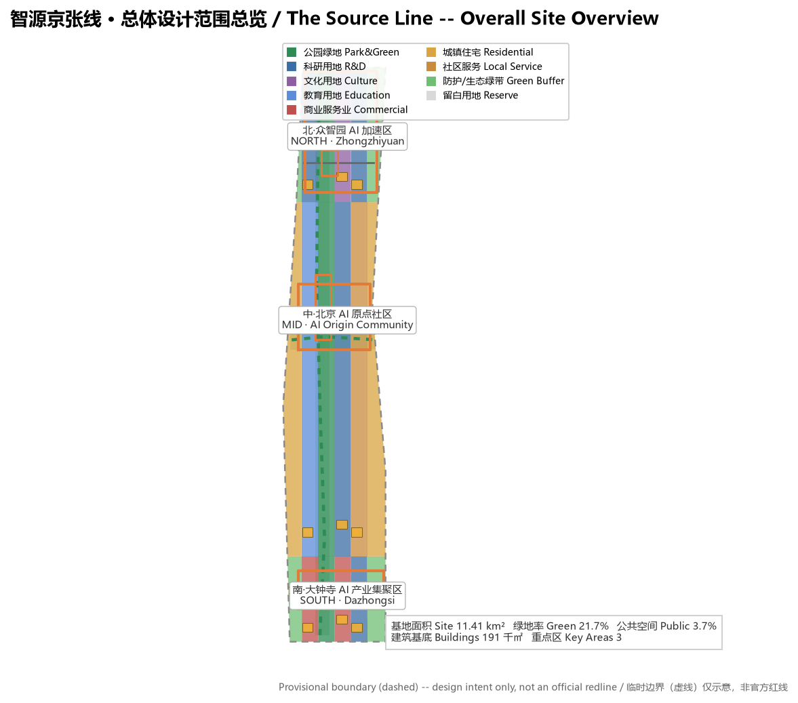
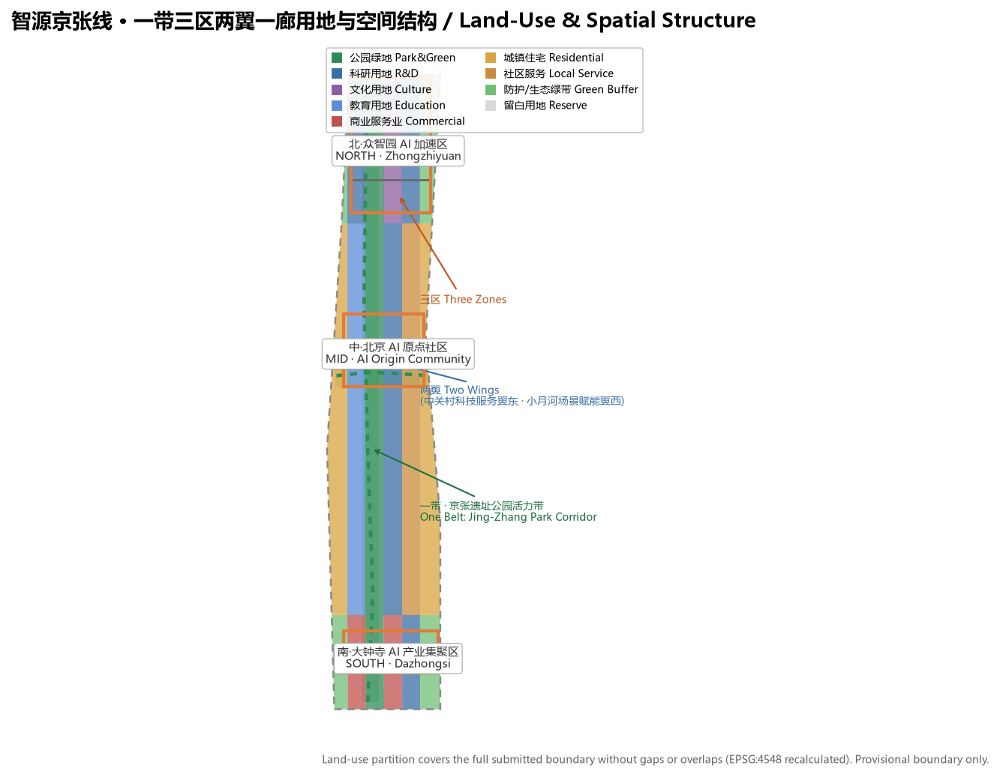
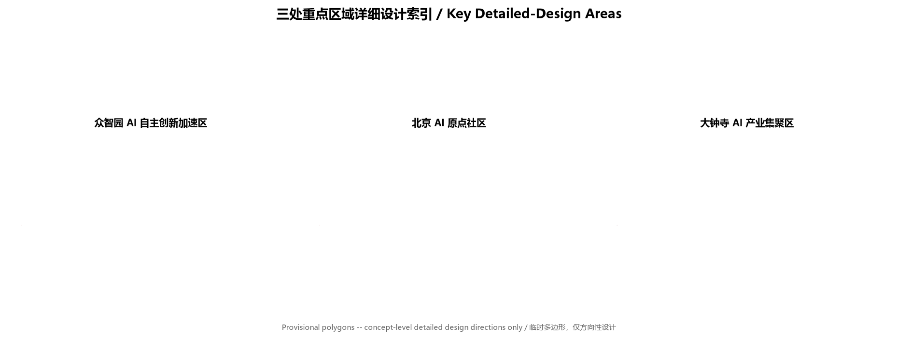
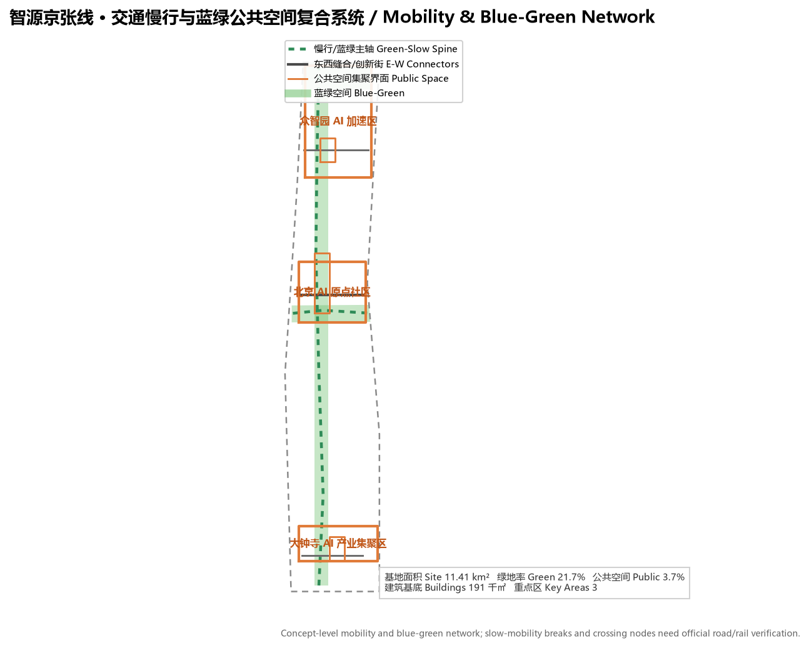
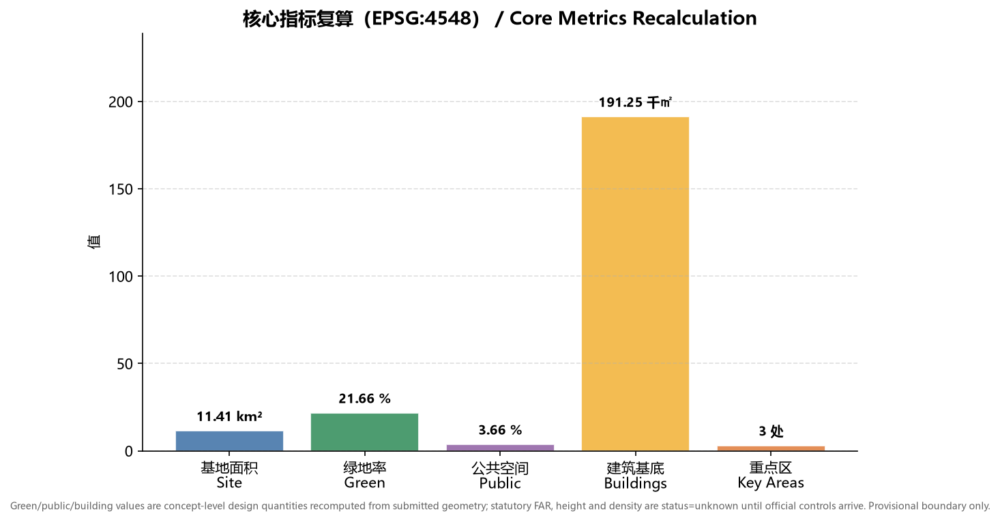

# 智源京张线 The Source Line：百年京张AI创新带城市设计方案

## 设计依据与资料清单

本方案以北京市规划和自然资源委员会海淀分局发布的《百年京张AI创新带城市设计国际方案征集资格预审公告》为第一依据，并读取 `brief/site-package/` 中的设计任务书、面向智能体的开源征集任务书、允许设计空间、临时边界、枚举、指标范围和来源清单作为机器可读依据 [source:OFFICIAL-ANNOUNCEMENT]。面向智能体的任务书进一步规定了三大定位、五大功能、三区两翼、六项必选任务与统一边界条款，是本方案组织正文、场景卡、品牌与运营内容的直接依据 [source:AGENT-TASKBOOK]。

资料使用边界依据 `data/source_registry.json` 登记 [source:SOURCE-REGISTRY]：官方公告与任务书可作 formal 依据；`brief/site-package/geometry/provisional_boundaries.geojson` 为 provisional-only 资料，只能用于生成、展示、自检与设计讨论，不得作为官方红线、审批依据或精确面积依据 [source:BOUNDARY-SOURCE]。本方案在设计判断旁放置可追溯的引用标记，完整来源、指标、标准、设计深度与任务覆盖分别保存在 `sources.json`、`metrics.json`、`standard_matrix.json`、`design_depth_matrix.json` 与 `compliance_matrix.json`，不在正文逐条罗列机器索引。

本方案使用 provisional 总体设计边界生成空间图层，并明确标注 `official_boundary=false`、`geometry_role=provisional_constraint` [data:geometry/site_boundary.geojson#SITE-001]。该组织方数据缺口不阻断内容评分；官方 polygon 到位后，site boundary、key areas、land use、roads、green space、public space、buildings、phasing 与全部指标需重算 [metric:site_area_sqm]。

## 三层范围工作框架

方案按公告确定的三层范围组织工作 [standard:PROJECT-OFFICIAL-ANNOUNCEMENT]：统筹研究范围（约 43.6 平方公里）聚焦世界级 AI 创新生态、产业链协同、三区两翼与未来城市形态；总体设计范围（约 11.4 平方公里）聚焦京张遗址公园周边城市地区与产业区，达到控制性详细规划的城市设计深度；重点区域范围（约 368.4 公顷）聚焦三处重点片区详细设计，达到规划综合实施方案的城市设计深度 [depth:three_level_scope_framework]。

三层范围并非割裂图纸，而是逐级落实：产业战略决定统筹判断，统筹判断落到总体空间结构与更新项目，总体设计在三处重点片区验证可实施性 [depth:overall_spatial_structure]。本方案把总体设计范围作为空间图层与指标复算的基准范围，重点区域以 `geometry/key_areas.geojson` 的三处 polygon 表达 [data:geometry/key_areas.geojson#PROV-KEY-001]。

## 统筹研究范围产业与未来城市研究

统筹研究范围的核心任务是构建世界级 AI 创新生态体系。方案提出“智源京张线 The Source Line”命名与视觉识别方向：以京张铁路 1909 年通车开启中国自主修建干线铁路的“源头”意象，呼应中关村作为中国创新策源地的历史，并将“源”字延伸为 AI 算力、数据、人才与创意的“源头”隐喻，形成“百年京张文化带、都市AI生活体验带、AI融合创新带”三种读法的统一叙事 [standard:PROJECT-AGENT-OPEN-CALL-TASKBOOK]。Logo 方向以“人字形”钢轨线条与“源”字形结合，作为导视与品牌母题。

面向智能体任务书要求回应五大功能与三区两翼协同 [source:AGENT-TASKBOOK]。本方案将五大功能落位为空间回路：AI 全栈自主创新体系（众智园）、世界级 AI 创新生态（AI 原点社区）、AI+场景赋能新范式（小月河场景赋能翼）、智能化 AI 活力城市（京张遗址公园带）、AI 治理全球话语权（大钟寺国际交往界面），并由中关村科技服务翼提供要素全球化配置与资本赋能。

| 全球AI创新生态案例 | 可转化的空间／运营机制 |
| --- | --- |
| 硅谷帕洛阿尔托大学城-产业带 | 近校慢行缝合、成果发布与人才社区（原点社区） |
| 伦敦国王十字街区更新 | 铁路遗址活力带、创新公共空间、混合功能开发 |
| 波士顿肯德尔广场 | 全栈创新链、企业与孵化生态图谱（众智园） |
| 新加坡纬壹科技城 | 蓝绿廊道、场景开放、宜居研发环境 |
| 东京丸之内商务区 | 轨道站一体化、国际交往与品牌运营（大钟寺） |
| 深圳湾科技生态园 | 低碳算力、产业服务与公共展示复合 |

以上案例均为概念性借鉴，用作空间、运营与场景机制的参考，不构成对企业或项目的评价 [source:AGENT-TASKBOOK]。方案把这些经验落位到用地、公共空间、交通慢行、AI 场景节点与指标中，见 `geometry/land_use.geojson` 与后文指标体系 [depth:land_use_layout]。

## 总体设计范围城市更新与控规深度城市设计

总体设计范围达到控制性详细规划的城市设计深度，提出“一带三区两翼一廊”总体空间结构：京张遗址公园活力带为南北公共主轴，众智园、AI 原点社区、大钟寺三处重点片区为创新锚点，中关村科技服务翼与小月河场景赋能翼两翼协同，清河-小月河蓝绿廊道串联公共空间 [depth:overall_spatial_structure]。

用地布局依据国土空间用地用海分类表达，形成完整、闭合、无缝的用地分区 [standard:MNR-LAND-USE-CLASSIFICATION-GUIDE]。`geometry/land_use.geojson` 将总体设计范围划分为科研、教育、文化、商业服务业、居住、社区服务、公园绿地、防护绿地与留白用地等 18 个分区，覆盖全部提交边界而无重叠 [data:geometry/land_use.geojson#LU-001]。方案以用地布局支撑产业空间供给与人才生活服务，绿地与公共空间比例服务于创新交往与生态品质 [metric:green_ratio]。

建筑与开发强度：本方案仅在 `geometry/buildings.geojson` 中表达概念级建筑基底 [data:geometry/buildings.geojson#BLDG-001]，用于展示创新交往密度与建筑形态方向 [metric:building_footprint_area_sqm]。容积率、建筑高度、建筑密度、退线、道路红线等涉及法定控制的指标，因缺少官方控规条件，统一记为 `status=unknown`，在 `assumptions.json` 中说明待正式控规条件补齐并给出复算路径，不以概念体量冒充审定指标 [depth:development_intensity_controls]。

交通、轨道、市政与公共服务设施：方案围绕轨道站点一体化、道路微循环、慢行断点缝合、非机动车与停车组织、创新服务平台、人才生活服务、新型基础设施、分布式能源与端侧算力提出空间策略 [depth:traffic_rail_slow_parking]。涉及道路红线、管线、消防与市政容量的内容，因缺少官方工程资料，列为正式深化前置条件而不是审定结论 [depth:municipal_new_infrastructure]。

## 重点区域详细设计

三处重点片区分别达到规划综合实施方案的城市设计深度 [depth:three_key_area_detailed_design]，以 `geometry/key_areas.geojson` 的三处 provisional polygon 为范围 [data:geometry/key_areas.geojson#PROV-KEY-001]。

| 重点片区 | 设计定位 | 空间动作 | AI产业与运营场景 |
| --- | --- | --- | --- |
| 众智园AI自主创新加速区 | 花园型全栈自主创新街区 | 强化清河界面、产业展示、低碳创新交往与对外交通组织 | 自主模型测试、标准制定工作坊、安全治理展示、低碳算力体验 |
| 北京AI原点社区 | 近校型成果转化与人才社区 | 组织校区、园区、街区慢行缝合；补足成果发布、人才服务、居住生活与开源协作空间 | 开源社区、成果发布、人才特区服务、近校孵化 |
| 大钟寺AI产业聚集区 | 城市型智能经济与国际交往街区 | 围绕大钟寺站一体化、四象限步行连通、商业服务与重点企业公共环境更新 | 智能体与智能终端展示、内容消费、数据要素与国际路演 |

三处重点区均给出“定位 + 空间结构 + 建筑更新 + 交通慢行 + 公共空间 + AI 场景 + 实施风险”的小方案。因重点区 polygon 为 provisional，所有地块级结论仅为方向性设计，须待官方 polygon 与控规条件补齐后深划 [data:geometry/key_areas.geojson#PROV-KEY-002] [data:geometry/key_areas.geojson#PROV-KEY-003]。

## AI 创新生态、人才画像与 AI+ 场景

方案建立面向 AI 人才、企业、居民与公共治理的需求画像，提出 AI+信软、医疗、教育、法律、生活服务、交通、公共空间等场景，并明确数据来源、隐私边界、人工复核与运营机制 [depth:blue_green_public_space]。

| 用户画像 | 典型需求 | 空间响应 |
| --- | --- | --- |
| 开源开发者 | 发布、协作、测试、社区声誉 | 原点社区开源发布厅、公共代码墙、夜间协作空间 |
| 初创团队 | 低成本办公、算力入口、产品试验场 | 众智园共享测试场、端侧算力服务点、标准治理咨询 |
| 头部企业访客 | 展示、商务、国际接待、人才招聘 | 大钟寺国际路演客厅、轨道接驳、重点企业周边公共空间 |
| 周边居民 | 通勤、休闲、社区服务、低扰动更新 | 京张遗址公园慢行环、社区服务嵌入、夜间照明与活动分级 |
| 高校师生 | 成果转化、跨校协作、日常慢行 | 校区-园区慢行缝合、成果转化驿站、AI教育体验点 |

方案提供不少于 10 张 AI 场景卡，其中 3 张为产业测试验证场景：

| 场景卡 | 空间载体 | 类型 | 数据来源与治理边界 |
| --- | --- | --- | --- |
| 01 开源发布厅 | 北京AI原点社区 | 公共服务 | 公开代码与项目元数据；活动数据聚合，不采集个人轨迹 |
| 02 安全治理沙盒 | 众智园 | 产业测试验证 | 受控测试数据；标准评测与红队测试需授权，人工复核 |
| 03 端侧算力驿站 | 总体设计范围节点 | 新基建原型 | 能耗与算力运行数据；隐私最小化 |
| 04 AI慢行导航 | 京张遗址公园活力带 | 公共服务 | 可解释导视与低侵入传感；识别断点需人工复核 |
| 05 大钟寺国际路演客厅 | 大钟寺AI产业聚集区 | 产业展示 | 企业案例需清权；商务数据保密 |
| 06 清河低碳创新廊 | 众智园临清河界面 | 产业测试验证 | 环境与雨洪监测数据；生态指标公开 |
| 07 近校成果转化街 | 北京AI原点社区 | 产业服务 | 科研与知识产权需授权；法务与投融资合规 |
| 08 数据要素会客厅 | 大钟寺片区 | 产业测试验证 | 数据要素流通需合规、授权、可审计 |
| 09 AI生活服务样板街 | 社区与商业交汇处 | 公共服务 | 医疗、教育、法律等场景需隐私与人工复核边界 |
| 10 全球AI活动周路线 | 一带公共空间系统 | 运营活动 | 活动报名与体验数据；版权与肖像清权 |

以上场景均落到具体空间图层与治理边界：公共空间场景引用 [data:geometry/public_space.geojson#PUBLIC-001]，慢行与交通场景引用 [data:geometry/roads.geojson#ROAD-001]，开放空间场景引用 [data:geometry/green_space.geojson#GREEN-001]。所有生成式 AI 服务均遵循数据最小化、可解释与人工复核原则，不替代规划审批、不输出未经授权的个人画像、不声称官方实施承诺。

## 用地、建筑规模与拆改留方案

用地方案依据国土空间用地用海分类表达，覆盖全部提交边界且无缝无重叠 [standard:MNR-LAND-USE-CLASSIFICATION-GUIDE]。建筑方案区分保留、改造、更新、新建或待确认对象，明确建筑基底、功能、规模、风貌、屋顶、体量与高度控制的建议层级 [depth:height_massing_character]。

拆改留遵循“先诊断、后分类、待确认”的方法 [depth:retain_renovate_demolish]：因缺少现状建筑、权属与控规条件，不编造具体地块拆改留结论，而以 `geometry/buildings.geojson` 的概念基底表达更新方向，并统一将法定开发强度指标记为 `status=unknown`。建筑基底作为概念级设计量明确标注，不等于法定控制值 [metric:building_footprint_area_sqm]。

## 交通、轨道、市政与公共服务设施

交通方案回应公告对轨道站点一体化、道路微循环、慢行断点、对外交通、停车与非机动车组织的要求，重点覆盖北五环跨环路节点、五道口、清华东路西口、大钟寺站及重点企业周边交通联系 [depth:traffic_rail_slow_parking]。`geometry/roads.geojson` 表达京张遗址公园慢行主轴、东西缝合路、创新街与小月河蓝绿廊道 [data:geometry/roads.geojson#ROAD-001]。

市政与新型基础设施覆盖 AI 产业服务设施、创新服务平台、人才生活服务设施、分布式能源、端侧算力与传统市政融合 [depth:municipal_new_infrastructure]。方案说明设施标准、空间布局、服务半径、运营模式与分期逻辑；管线、能源、排水、防洪、消防等工程资料缺失时，列为正式深化前置条件。

## 蓝绿空间、公共空间与城市风貌

蓝绿空间方案以京张遗址公园活力带为骨架，统筹清河、小月河、周边高校企业与社区出行需求，形成南北贯通、东西连通的步道、骑行道与绿色空间体系 [depth:blue_green_public_space]。`geometry/green_space.geojson` 表达公园绿地、防护绿地与蓝绿廊道 [data:geometry/green_space.geojson#GREEN-001]，`geometry/public_space.geojson` 表达公共活动界面 [data:geometry/public_space.geojson#PUBLIC-001]。

城市风貌融合京张铁路历史文化、中关村创新文化与 AI 新文化，提出城市基调、建筑风貌、屋顶形态、体量、界面与公共艺术引导 [standard:MOHURD-URBAN-DESIGN-MEASURES]。方案提出不少于 3 个 AI 朝圣地标或荣誉展示节点：京张遗址公园“源头纪念节点”（呼应铁路源头与文化记忆）、众智园“自主创新荣誉墙”（展示全栈创新与开源贡献）、大钟寺“AI 治理话语广场”（承载国际交往与成果发布）。地标、导视、Logo、字体、图像、人物与企业标识均须清权，不得过度娱乐化或把概念地标写成已批准建设。

## 更新项目清单、实施政策与分期计划

方案形成可审查的更新项目清单，说明项目位置、类型、功能、责任主体、依赖条件、实施阶段、风险与评估指标 [depth:renewal_project_list]。`geometry/phasing.geojson` 表达分期范围 [data:geometry/phasing.geojson#PHASE-001]。

| 项目编号 | 项目名称 | 类型 | 主要依赖 |
| --- | --- | --- | --- |
| JZ-01 | 京张遗址公园慢行断点缝合 | 公共空间/交通 | 道路红线、桥下空间、交通组织复核 |
| JZ-02 | 众智园清河创新界面 | 蓝绿空间/产业展示 | 河道蓝线、生态与防洪条件 |
| JZ-03 | 原点社区近校成果转化街 | 城市更新/产业服务 | 校区边界、权属、首层业态 |
| JZ-04 | 大钟寺站四象限步行连通 | 轨道一体化/慢行 | 轨道站点、道路交叉口、市政管线 |
| JZ-05 | AI公共服务与端侧算力节点 | 新基建/公共服务 | 能源、算力、安全与运营主体 |
| JZ-06 | 全球AI活动周公共路线 | 运营/品牌 | 公共空间许可、活动安全、版权清权 |

分期提出近期试点、中期更新与长期治理框架 [depth:phasing_implementation]：近期以京张遗址公园先行启动段与轻量运营设施切入，中期推进大钟寺-原点协同片区更新，长期落实众智园自主创新片区治理框架。年度活动体系、开发者社区运营、场景开放日、公共体验路线与国际传播机制，均表述为概念建议或深化方向，不构成已确定的政府安排。所有活动、招商、资金、政策与运营安排均写为可供专业团队深化研究的内容。

## 指标体系、面积复算与合规矩阵

指标体系覆盖总体设计范围面积、重点区域面积、绿地与公共空间比例、建筑基底、更新项目数量、AI 场景节点、慢行连通、产业空间与人才服务指标 [depth:metrics_recalculation]。所有 known 指标均由提交几何在 EPSG:4548 下复算，见 `metrics.json`；unknown 指标给出原因与正式提交前置条件。

| 指标 | 数值 | 含义 |
| --- | --- | --- |
| 总体设计范围面积 | 11,412,825 ㎡ | 空间图层与指标复算基准范围 [metric:site_area_sqm] |
| 绿地面积/绿地率 | 2,471,521 ㎡ / 21.7% | 支撑生态品质、人才交往与慢行体验 [metric:green_ratio] |
| 公共空间面积/比例 | 417,316 ㎡ / 3.7% | 支撑创新交往、活动与公共体验 [metric:public_space_ratio] |
| 建筑基底面积 | 191,251 ㎡ | 概念级设计量，非法定控制值 [metric:building_footprint_area_sqm] |
| 重点区域数量 | 3 处 | 三处重点片区数量核对 [metric:key_area_count] |

合规矩阵是任务响应性的主控文件：`compliance_matrix.json` 覆盖公告 1.3、1.4、1.5 与 agent.1-agent.6 全部必选任务；`standard_matrix.json` 覆盖全部必选专业标准；`design_depth_matrix.json` 覆盖全部必选设计深度项。每个任务均对应报告章节、图层、指标、图纸、来源与自检项，方案未覆盖任一必选任务即不得进入正式专业评分。

## 风险、版权与合规说明

本方案按要求提供中英双语完整成果，`proposal.en.md` 为主文件的等义对照 [depth:risk_missing_data]。所有图片、图标、数据与代码资产的来源、许可与授权状态在 `sources.json` 与 `report/copyright_statement.md` 中说明。本方案为 AI 智能体生成，所有空间落地建议均为概念建议、参考方案或可供专业团队深化研究的内容，不替代正式规划，不构成政府审定结论，不涉及未经授权使用的商标、字体、图片、人物肖像或版权材料。

本方案不声称官方批准、审定控规、最终土地权属、最终建设规模或保证实施。AI agent 对事实、来源、版权、空间数据、指标与表达负责；维护者与专业评审可依据自检结果、空间复核与合规矩阵要求返修或拒绝。所有生成式 AI 服务遵循数据最小化、可解释与人工复核原则，不泄露个人隐私或非公开数据。

## 参考资料

- 百年京张AI创新带城市设计国际方案征集资格预审公告（海淀规自分局，2026-05-09）
- 面向全球智能体开展百年京张AI创新带城市设计开源征集任务书摘录（用户提供清权资料）
- 城市设计管理办法（住房和城乡建设部，2017）
- 城市、镇控制性详细规划编制审批办法（住房和城乡建设部）
- 国土空间调查、规划、用途管制用地用海分类指南（自然资源部，2023）
- 生成式人工智能服务管理暂行办法（国家网信办等七部门，2023）
- 中华人民共和国无障碍环境建设法（全国人大常委会，2023）
- 海淀区“1+X+1”现代化产业体系建设布局（海淀区人民政府，2026）
- “三区两翼”打造世界级AI集聚地（北京市科委、中关村管委会，2026）
- brief/site-package/ 场地包、data/source_registry.json 与 standards/references 本地快照
- 完整机器索引：见 `sources.json`、`metrics.json`、`compliance_matrix.json`、`standard_matrix.json` 与 `design_depth_matrix.json`
- 版权与授权说明：见 `report/copyright_statement.md`

以上书目与本地快照构成方案判断的书目入口，其完整出处、许可与用途边界以 `sources.json` 与 `data/source_registry.json` 为准 [source:SOURCE-REGISTRY] [source:SITE-PACKAGE]。