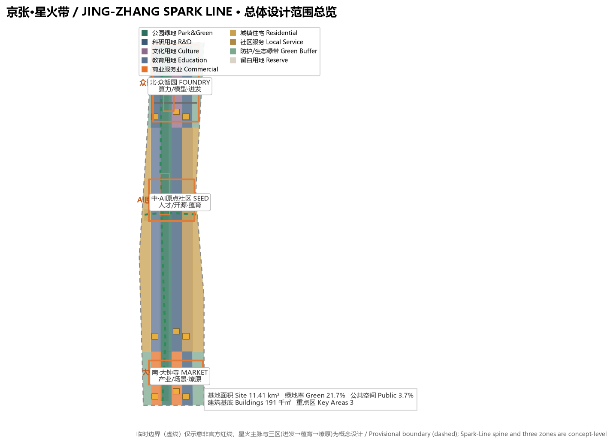
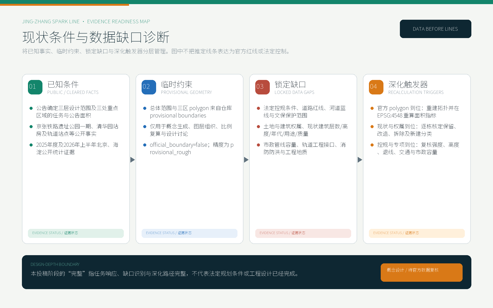
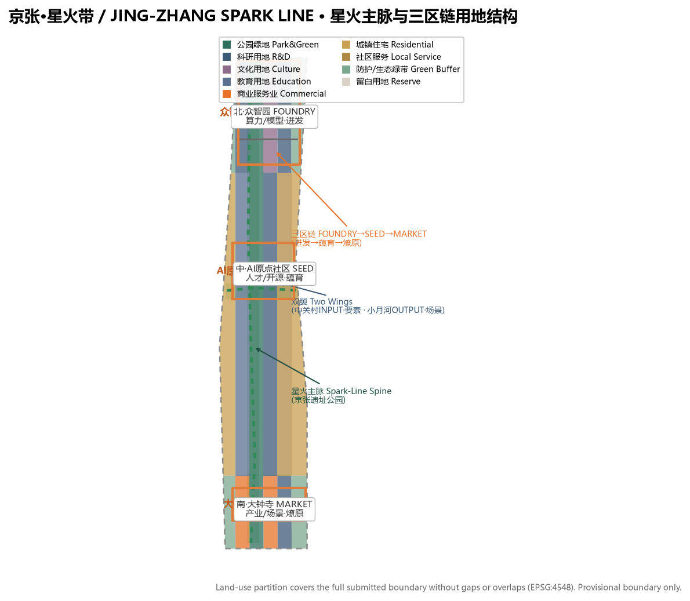
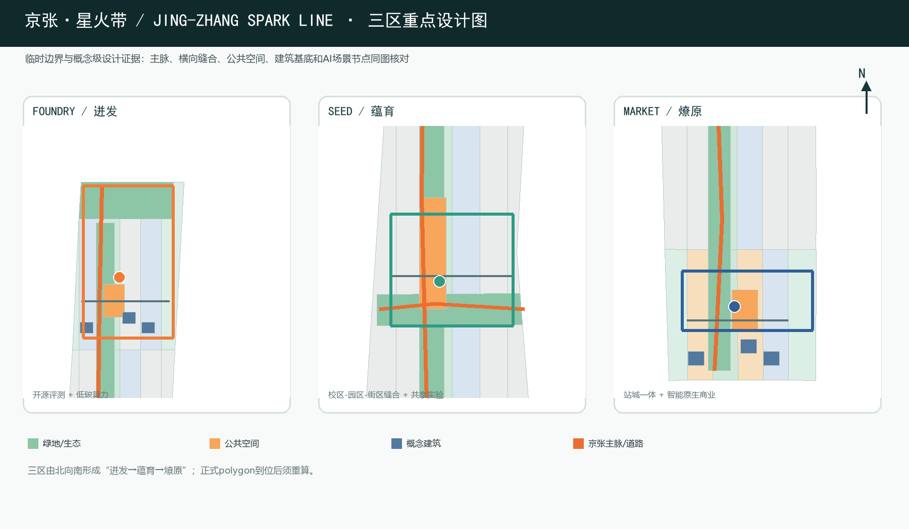
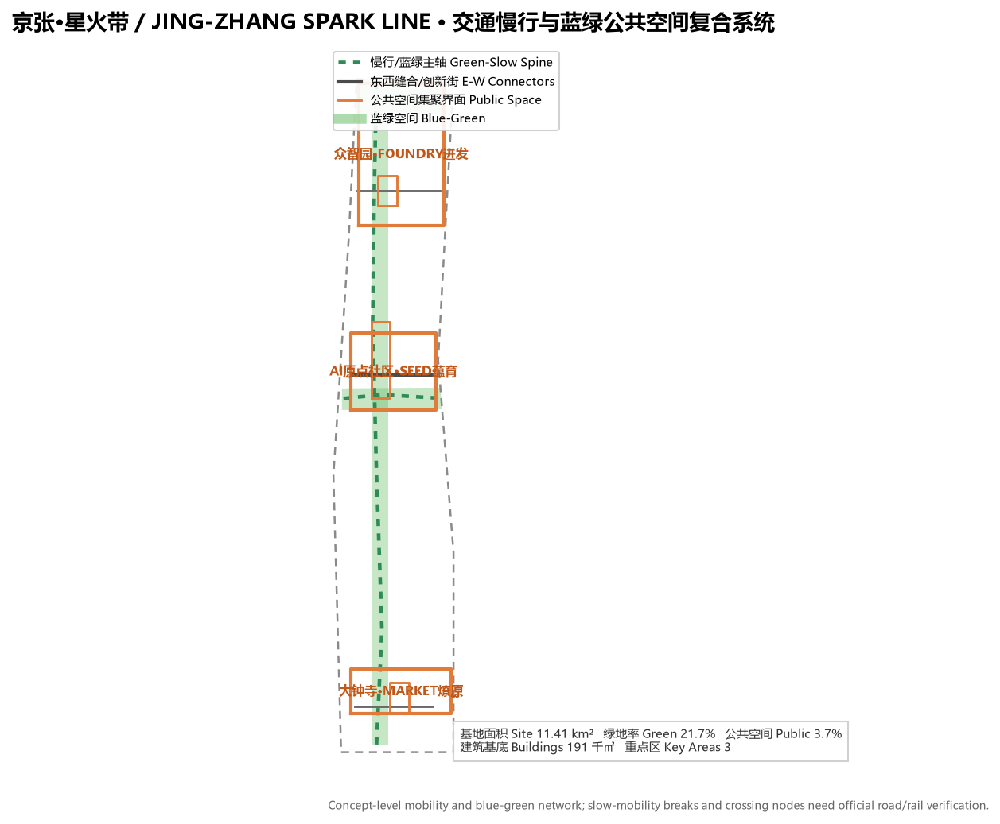
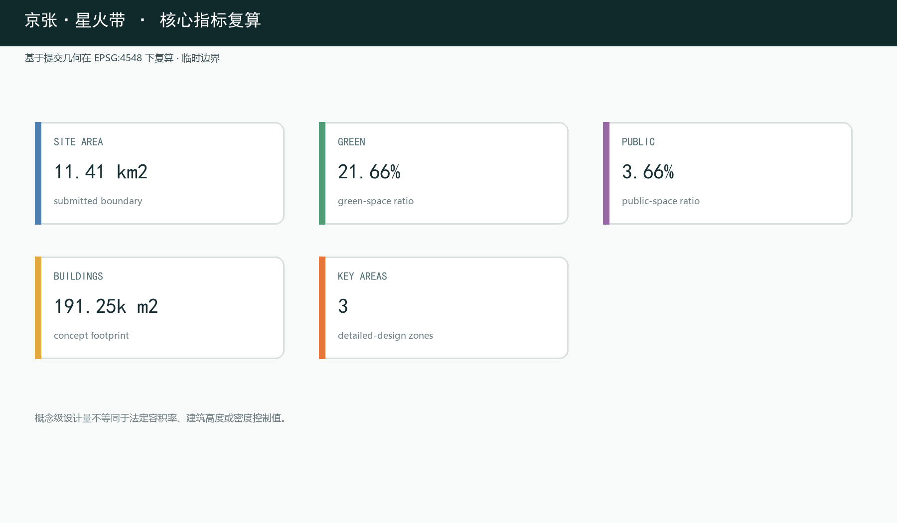

## 设计依据与资料清单

本方案以北京市规划和自然资源委员会海淀分局发布的《百年京张AI创新带城市设计国际方案征集资格预审公告》为第一依据，公告明确了三层设计范围、三处重点区域、设计任务与成果深度要求，是本次提交全部章节、图层与指标的响应对象 [source:OFFICIAL-ANNOUNCEMENT]。第二依据为面向智能体的开源征集任务书（`brief/site-package/agent_taskbook.json`），其中提出十大共创原则、三大定位、五大功能与六项智能体任务（命名与Logo、生态案例、场景卡、朝圣地标、文化叙事、长期运营），是"京张·星火带"概念体系的直接依据 [source:AGENT-TASKBOOK]。

机器可读依据来自场地包 `brief/site-package/`（design_brief、allowed_design_space、enums、ranges、schemas 与 provisional 边界几何）以及 `data/source_registry.json` 的资料用途登记 [source:SOURCE-REGISTRY]。场地现状判断建立在公开事实之上：京张铁路遗址公园一期（清华东路—知春路段，约16.8公顷）于2023年6月开放，保留詹天佑亲题站名的清华园站房（北京市文保单位），周边为学院路"八大学院"与清华、北大、北交大、中科院系统等近20所高校科研院所，地铁13号线沿线设五道口、知春路、大钟寺站 [source:PROCESSED-FACT-PACK]。

边界状态全程声明：本包总体设计范围与三处重点区域均使用 `brief/site-package/geometry/provisional_boundaries.geojson` 派生的临时几何，标注 `provisional_constraint`、`official_boundary=false`，仅用于方案生成、自检、可视化与设计讨论，不能作为官方红线、审批依据、精确面积依据或法定控制结论 [source:BOUNDARY-SOURCE]。组织方边界数据缺口不阻断内容评分；官方 polygon 发布后，全部图层与指标须重算 [data:geometry/site_boundary.geojson#SITE-001]。

### 现状条件、锁定缺口与深化触发器

本方案把设计依据按成熟度分为四层：已知条件只纳入公告、场地包登记资料、公开事实与公开统计；临时约束只纳入仓库提供的总体范围和三区 provisional polygon；法定控规、道路红线、河道蓝线、文保保护范围、权属、现状建筑和市政容量列为锁定缺口；官方资料到位后，按“重建拓扑与指标复算—逐栋拆改留核定—交通市政及专业安全复核”的顺序深化 [depth:existing_conditions_diagnosis] [source:SOURCE-REGISTRY]。`geometry/constraints.geojson` 因没有可信的官方约束几何而保持空集合，这是防止虚构红线的主动质量控制，不代表场地不存在约束。

本投稿阶段矩阵中的 `complete` 仅表示任务响应、资料缺口识别、概念方案和深化方法已经完整表达，不表示法定规划条件、地块权属、逐栋拆改留、工程可行性或审批结论已经完成 [depth:risk_missing_data]。其中 `geometry/buildings.geojson` 的9个要素为概念建筑基底，用于表达空间意图与复算路径，不是现状建筑普查成果。

## 三层范围工作框架

方案按公告确定的三层范围组织工作 [standard:PROJECT-OFFICIAL-ANNOUNCEMENT]。统筹研究范围约43.6km²，回答AI产业生态、战略定位、创新链与未来城市形态问题 [depth:three_level_scope_framework]；总体设计范围约11.4km²（本包几何复算 11,412,825m²），回答城市更新总体框架、产业空间布局、交通市政支撑与城市风貌控制问题 [metric:site_area_sqm]；重点区域范围三区合计公告约368.4公顷（复算369.3公顷），回答三处重点片区的详细设计问题 [metric:key_area_count]。

三层不是三张互不相关的图纸，而是"战略—结构—地块"的逐级落实 [depth:overall_spatial_structure]。统筹研究确定产业链与城市形态判断，总体设计把判断落实为更新项目、空间结构与设施承载，重点区域详细设计验证具体地块、建筑、交通、公共空间与AI场景的可实施性。三层范围与公告任务、agent.1–agent.6 的映射逐条保存在 `compliance_matrix.json`，正文只保留可读判断。

## 统筹研究范围产业与未来城市研究

### 核心概念与命名体系

本方案以英文名 JING-ZHANG SPARK LINE（中文"星火带"）为统一标识。命名来自京张铁路作为中国自主设计、自筹资金、自主运营的第一条干线铁路的历史地位——这是中国"自主创新"火种在1909年点燃的原点 [standard:PROJECT-AGENT-OPEN-CALL-TASKBOOK]。"星火"一词被读作三重内涵：

- **自主创新之火**：京张铁路不借助外国资金与人员、完全自主修建，是"中国人能行"的第一颗火种；今天这里续写的是"中国人能造大模型、能主导AI"的新火种；
- **AI技术之现实**：算力在指尖迸发、数据如星火涌现、创新在街区"火花四溅"——"星火带"让普通人意识到：AI不是抽象概念，而是正在这里发生、可触摸、可参与的现实；
- **国家战略之燎原**：单点星火→聚点成薪→燎原成势，呼应《国务院关于深入实施"人工智能+"行动的意见》（国发〔2025〕11号）提出的从试点到普及、从产业到就业的扩散逻辑 [source:STATE-COUNCIL-AI-PLUS]。

Logo方向为"轨道→星火"：人字形铁轨抽象为迸发的星火/火花，轨道沿线星火由静到燃的渐变，青绿（生长/生态）＋暖橙（火/能量）＋电子蓝（算力）三色，现代、可延展、国际可读。命名非口号：它是空间符号（星火主脉）、文化叙事（自主创新火种）与运营母题（"星火工程""星火计划"）的统一体 [depth:overall_spatial_structure]。

### 三大定位、五大功能与三区两翼

"京张·星火带"以星火主脉串联任务书给定的三大定位：百年京张文化带承载火种记忆，都市AI生活体验带承载燎原生活，AI融合创新带承载产业爆发 [source:AGENT-TASKBOOK]。五大功能映射为空间锚点：

| 五大功能 | 空间锚点 | 核心机制 |
| --- | --- | --- |
| AI全栈自主创新体系 | 众智园（FOUNDRY·迸发） | 芯片、模型、框架、算力、数据全栈自主；加速器集群与开源评测 |
| 世界级AI创新生态 | AI原点社区（SEED·蕴育） | 高校策源、人才特区、开源体系、成果转化 |
| AI+场景赋能新范式 | 小月河场景赋能翼（OUTPUT） | 沿小月河的场景实验带与智能化城市活力 |
| 智能化AI活力城市 | 星火主脉 | 公共空间智能化、慢行体验、智能原生生活 |
| AI治理全球话语权 | 大钟寺（MARKET·燎原） | 国际奖项、成果发布、AI里程碑与贡献碑刻 |

三区两翼协同回路：原点社区居中蕴育（思想与人才），众智园向北迸发（与京张当年出城方向同向），大钟寺向南燎原（场景与业态扩散），中关村科技服务翼提供要素全球化配置与资本赋能，小月河场景赋能翼提供场景落地与城市活力实验场。空间动线即创新进程叙事，创新链、产业链、人才链与城市服务链沿星火主脉形成可步行的空间连续体 [depth:three_key_area_detailed_design]。

### 全球AI创新生态案例研究

方案选取六个公开案例作为机制参考（定性描述，不引用未核实投资额）[source:AGENT-TASKBOOK]：

| 案例 | 模式要点 | 可转译机制 |
| --- | --- | --- |
| 波士顿Kendall Square | 依托MIT的高校策源、AI转化闭环 | 原点社区"近校创新、就地转化" |
| 伦敦国王十字King's Cross | 铁路枢纽再开发为知识创新区 | 与京张同构：铁路工业遗产成创新容器 |
| 新加坡裕廊湖区JLD | 国家级湖区新城的园区治理一体化 | 众智园园区治理、标准与安全展示 |
| 深圳 | 场景驱动与硬件生态连续升级 | 大钟寺智能原生商业街"场景即市场" |
| 硅谷/帕洛阿尔托 | 大学-资本-产业闭环 | 中关村科技服务翼的资本与IP赋能 |
| 中关村本身 | 电子一条街→科技园→互联网→AI | 星火叙事的"现在层"在地基础 |

经验转译遵循四条原则：遗产活化优先于推倒重建、策源密度优先于楼宇规模、治理与标准空间前置、场景开放即招商 [depth:renewal_project_list]。

### AI 原生规划方法与差异化定位

本方案把"AI 参与正式城市设计"本身作为方法示范，形成可复现的证据链：公开数据登记→临时约束锁定→GeoJSON 拓扑分区→EPSG:4548 指标复算→任务/标准/深度矩阵覆盖→四门自检，"先证据、后线条"，避免以渲染图或叙事冒充依据 [depth:metrics_recalculation] [source:SOURCE-REGISTRY]。

与同题提案不同，星火带不聚焦单一机制（时间对时、能源余热或服务协议），而以"自主创新火种"叙事和"基础研究→产业孵化→资本/场景"的全栈完成链为唯一主线，命名与空间结构避免同质化 [depth:overall_spatial_structure] [source:AGENT-TASKBOOK]。行文显式区分原创概念（星火主脉、FOUNDRY-SEED-MARKET 三区链、三色Logo、八项更新项目）与转译机制（Kendall Square、King's Cross 等案例）的分层，原创与借鉴边界可审计。

规划方法坚持"人机共创、专业终裁"：AI 负责复现、复算与备选生成，法定结论由专业团队与政府部门审定 [standard:PROJECT-AGENT-OPEN-CALL-TASKBOOK]；所有"星火"地标与运营机制均注明为可供专业团队深化的概念建议，不构成已批准建设或既定安排 [depth:risk_missing_data]。

为了让"原创"与"可验证"落到机制层面，方案将核心概念转译为四条可复核的 AI-native 设计机制。每条机制都给出空间载体、运行逻辑、人工边界与复核方法，使评审者无需依赖叙事即可判断其成立性：

| 原创机制 | 空间载体 | 运行逻辑 | 人工边界与复核方法 |
| --- | --- | --- | --- |
| 星火主脉"三轴合一" | 京张遗址公园绿轴 | 历史主轴、慢行主轴、创新场景主轴在同一线性公共空间复合 | 断点缝合、无障碍与峰值人流由交通仿真复核；概念级，非法定绿线 |
| FOUNDRY-SEED-MARKET 全栈链路 | 三区沿北向南连续布局 | "基础研究→产业孵化→资本/场景"沿创新链空间化 | 三区边界为 provisional_constraint，区间承载由产业与交通专项校准 |
| "迸发-蕴育-燎原"节点网络 | 迸发广场、星火原点广场、燎原广场 | 三种公共场景分别对应成果发布、火种记忆、里程碑展示 | 活动容量与安全疏散由运营与消防专项复核 |
| 双翼"INPUT-OUTPUT"回路 | 中关村科技服务翼/小月河场景翼 | 要素输入与场景输出的空间闭环 | 跨区协同有效性以场景落地率与要素集聚度评估 |

以上机制均保留"可撤回、可深化"边界：任何一条都可被专业评审单独取用、调整或否决，不绑定为既定方案 [depth:overall_spatial_structure] [depth:three_key_area_detailed_design]。

**原创概念辨识表。** 为让"原创"边界可审计而非口号，方案把每一个原创概念标注其命名来源、独创点、与同题命题的差异及可复核承接件：

| 原创概念 | 命名来源 | 独创点 | 与同题差异 | 可复核承接件 |
| --- | --- | --- | --- | --- |
| 星火带 SPARK LINE | 京张铁路"自主创新火种" | 以"从一颗火种到燎原"串联空间与文化双线 | 不选单一机制母题，而以创新全链为唯一主线 | 三区两翼空间结构＋文化叙事 |
| 三区链 FOUNDRY-SEED-MARKET | 喷嘴/种子/市场的工业意象组 | "基础研究→孵化→资本/场景"全程空间化 | 对应全栈链路而非单区强化 | 三区详细设计＋场景卡 |
| 星火主脉三轴合一 | 遗址公园绿轴本身的复合价值 | 历史、慢行、创新场景共轴 | 主脉既承载记忆又承载创新 | 慢行缝合与蓝绿公共空间 |
| 双翼 INPUT/OUTPUT | 要素输入与场景输出的回路 | 中关村与小月河功能对偶 | 让两翼成设计与治理闭环 | 场景落地率与要素集聚评估 |
| 星星之火城市公约 | "星火"语义的公共化 | AI 进入公共空间的知情、参与、申诉、退出四权 | 把数字包容从软性承诺转为权利项 | 全龄与数字包容底线＋风险登记 |

辨识表强调每个原创概念都能沿"命名来源→独创点→差异→承接件"溯源，评审可对任一概念单独质询或否决，不构成包办式命名垄断 [depth:overall_spatial_structure] [depth:three_key_area_detailed_design]。

### AI时代产业与就业研判（数据支撑专章）

本方案以2025年度及2026年上半年（2026Q1/Q2）官方原始报告数据论证AI时代的产业发展、就业创造与生活图景，全部数据在 `sources.json` 登记并注明机构/原始报告URL/年度/访问日，正文以 `[source:...]` 引用。数据以北京、海淀为主，全国数据为补充 [source:CNNIC-LATEST]。

- **个人智能渗透（全国补充）**：截至2025年12月，我国网民 **11.25亿**、互联网普及率 **80.1%**；生成式AI用户 **6.02亿人**（较2024年底增长141.7%）、人口普及率 **42.8%**；数字经济核心产业增加值占GDP比重升至 **10.5%**；2025年1-11月数字消费达 **17.92万亿元** [source:CNNIC-LATEST]。

- **北京AI产业底盘（北京为主）**：2025年北京地区生产总值 **52073.4亿元**（+5.4%），数字经济增加值 **24166.3亿元**（占GDP **46.4%**）[source:BEIJING-STAT-2025]。2025年北京AI核心产业规模预计超 **4500亿元**（占全国半数左右），AI企业超 **2500家**、AI独角兽约 **40家**、AI上市公司近 **60家** [source:BJ-AI-ACTION-PLAN-2026]；备案上线大模型 **209款**（占全国近1/3）[source:BEIJING-STAT-2025]；全市独角兽 **116家** [source:BEIJING-STAT-2025]。

- **海淀产业底盘（海淀为主）**：2025年海淀区GDP **13691.4亿元**（+7.2%）；备案大模型 **123款**（占北京60%）；全国重点实验室 **92家**（占全市63.4%）；有效发明专利 **34.9万件**；技术合同成交额 **4053.1亿元**；居民人均可支配收入 **110396元** [source:HAIDIAN-STAT-2025]。星火带正是这片"AI产业高地＋人才高地＋创新策源地"的空间载体。

- **基础设施（海淀/北京为主）**：北京年末轨道交通运营线路 **30条**、里程 **909公里**、**全年客运总量35.7亿人次**；公共汽电车1252条、客运量 **16.0亿人次**；机动车保有量 **810.1万辆**（新能源98.8万辆）；**5G基站15.3万个**、5G用户 **2592.6万户**（占移动用户64.4%）[source:BEIJING-STAT-2025]。星火带的"轨道＋慢行＋即时物流"复合系统建立在真实的城市基础设施底盘之上 [depth:traffic_rail_slow_parking]。

- **人才与就业（北京/全国）**：2025年北京在学研究生 **49.7万人**、普通高校本专科在校生 **66.6万人** [source:BEIJING-STAT-2025]；"人工智能训练师"（4-04-05-05）已纳入国家职业分类大典 [source:MOHRSS-AI-TRAINER]。方案以共享实验、成果转化和基础创业服务回应人才就业需求，具体空间规模与运营方式待后续深化。

- **消费与生活（企业/机构对北京的区域分析）**：新华网与美团研究院《2025生活服务消费趋势洞察》显示，2025年美团"快乐生活"相关服务消费订单同比增长 **36%**，95后消费者占比近六成，**北京入选"年轻人玩乐城市"十强** [source:MEITUAN-BJ-LIFE-2025]；2024年中国夜间经济发展报告中**北京夜间餐饮消费指数位列全国第二**，处于夜间消费指数前十 [source:MEITUAN-NIGHT-ECONOMY]。即时零售与本地生活驱动大钟寺智能原生商业街与轨道站周边"15分钟生活圈"的业态组织 [depth:blue_green_public_space]。

- **出行与交通（企业/机构对北京的区域分析）**：高德地图《2025年度中国主要城市交通分析报告》显示**北京绿色出行意愿居全国首位** [source:AMAP-BJ-TRAFFIC-2025]；百度地图《2025年第2季度中国城市交通报告》显示**北京以通勤高峰拥堵指数2.102位列全国百城第一**（重庆2.095、广州其后）[source:BAIDU-BJ-Q2-2025]；嘀嗒出行《2025顺风车通勤观察报告》显示**廊坊—北京为跨城通勤代表性线路**，市内顺风车通勤时速约40km/h [source:DIDACAR-BJ-2025]。北京交通发展研究院《2026北京交通发展年度报告》显示**2025年北京绿色出行占比76.5%**、高峰拥堵指数下降4.8% [source:BJTRC-2026]。星火带以"慢行优先、轨道接驳、即时物流协同、共享骑行衔接"回应北京真实存在的通勤与拥堵命题 [depth:traffic_rail_slow_parking]。

## 总体设计范围城市更新与控规深度城市设计

总体设计范围要求达到控制性详细规划的城市设计深度 [standard:MOHURD-CONTROL-DETAILED-PLANNING]。本方案在缺少官方控规条件的前提下，先建立可复核的方法框架与结构判断，凡属法定管控的结论一律标注"待正式控规条件确认"，不冒充审定指标 [depth:development_intensity_controls]。

**总体空间结构："星火主脉＋三区链＋双翼＋生态廊"。** 星火主脉即京张遗址公园绿轴及其两侧城市界面，是历史主轴、慢行主轴与创新场景主轴三轴合一 [depth:overall_spatial_structure]。三区沿全栈链路自北向南组织：众智园（FOUNDRY·迸发）→AI原点社区（SEED·蕴育）→大钟寺（MARKET·燎原），与"基础研究→产业孵化→资本/场景"完链对齐 [depth:land_use_layout]。双翼为中关村（INPUT·要素）与小月河（OUTPUT·场景），清河-小月河生态廊串联蓝绿公共空间。

**城市更新总体框架。** 建议以"用地效率—建筑年代—权属复杂度—轨道站点可达性"四维筛查识别更新对象，区分保留、改造、更新、新建四类响应方式；本包不给出地块级拆改留结论 [depth:retain_renovate_demolish]。建筑规模与强度：`geometry/buildings.geojson` 表达概念级建筑基底 [data:geometry/buildings.geojson#BLDG-001] [metric:building_footprint_area_sqm]；容积率、建筑高度、密度、退线、道路红线在官方控规条件发布前统一记为 `status=unknown`，复算路径写入 `assumptions.json` [depth:development_intensity_controls]。

**综合承载评估。** 建议建立轨道客流、公共服务半径、市政负荷与慢行容量的评估框架 [depth:municipal_new_infrastructure]。管线、能源、排水、防洪、消防等工程条件缺失，列为正式深化前置条件；新型基础设施以"分布式能源、端侧算力、智慧公共设施"为概念方向。

**AI 在城市规划全流程中的角色链。** 为体现"AI 不是图纸工具而是规划方法"的创新性，方案把 AI 参与规划组织成从数据到监测的六环节闭环，每一环均标明 AI 职责与人工/专业校验点 [depth:metrics_recalculation]：

| 环节 | AI 承担的职责（概念） | 人工/专业校验点 |
| --- | --- | --- |
| 数据登记 | 自动采集、规范化、去重并登记公开数据 | 来源可信度与用途边界人工确认 |
| 问题识别 | 从事实与数据识别场地瓶颈与机会 | 与专业直觉交叉验证，避免误读 |
| 备选生成 | 生成多套空间/指标备选并给出理由 | 专业团队比选，形成建议方案 |
| 模拟评估 | 指标复算、容量与可达性快速校验 | 法定结论仍由专业与政府终裁 |
| 方案表达 | 生成图纸与可视化，保持证据可溯源 | 图表不替代 GeoJSON/metrics 权威层 |
| 监测复检 | 官方数据到位后自动重算触发深化 | 按"重建拓扑-逐栋核定-专项复核"执行 |

本闭环既回应"AI 与城市规划创新性"评分维度，也把"人机共创、专业终裁"从口号转为可复查的流程；任何环节的 AI 输出均可被专业团队独立复现或否决 [depth:metrics_recalculation] [standard:PROJECT-AGENT-OPEN-CALL-TASKBOOK]。

## 重点区域详细设计

三处重点区域均以"定位＋空间结构＋建筑更新＋交通慢行＋公共空间＋AI场景＋实施风险"组织详细设计，深度对齐规划综合实施方案要求 [depth:three_key_area_detailed_design]；三区polygon均为provisional_constraint，地块级结论只能作为方向性设计 [data:geometry/key_areas.geojson#PROV-KEY-001]。

### 众智园AI自主创新加速区（FOUNDRY·迸发，公告约192.1公顷）

**定位**：花园型全栈自主创新街区，AI全栈链路的"迸发之源"，承载芯片、模型、框架、算力、数据全栈自主创新与开源模型评测。**空间结构**：以北段科研、绿地、文化与防护分区为核心组团，强化清河界面形成低碳绿色创新交往带 [data:geometry/land_use.geojson#LU-014]。**建筑更新**：以低效产业用地更新为加速器集群与共享实验空间为主要方向。**交通慢行**：组织北五环方向对外交通联系，园区内部横向创新街与星火主脉北段无缝衔接 [data:geometry/roads.geojson#ROAD-004]。**公共空间**："迸发广场"承载成果发布与开放测试 [data:geometry/public_space.geojson#PUBLIC-003]。**AI场景**：开源模型评测场、标准制定工作坊、安全治理展示、低碳算力体验。**实施风险**：清河蓝线、生态与防洪条件，算力基础设施的能源与网络承载须专业复核。

### 北京AI原点社区（SEED·蕴育，公告约104.3公顷）

**定位**：近校型成果转化与人才社区，AI全栈链路的"蕴育之所"。**空间结构**：以清华园站房（詹天佑亲题站名、北京市文保单位）为核心锚点组织"星火原点"纪念与展示；学院路高校带开放校园界面 [data:geometry/key_areas.geojson#PROV-KEY-002]。**建筑更新**：以功能置换与首层业态更新为主，保留历史站房与文保要素。**交通慢行**：五道口站一体化、校区—园区—街区慢行缝合 [data:geometry/roads.geojson#ROAD-003]。**公共空间**："星火原点广场"（原点博物馆与"火种"装置）[data:geometry/public_space.geojson#PUBLIC-001]。**AI场景**：校际共享实验带、开源发布厅、成果转化街、人才特区服务。**实施风险**：校园边界与权属、文保审批、站点一体化协调为待确认事项。

### 大钟寺AI产业聚集区（MARKET·燎原，公告约72.0公顷）

**定位**：城市型智能经济与国际交往街区，AI全栈链路的"燎原之场"。**空间结构**：围绕大钟寺站一体化组织"燎原换乘客厅"，路口四象限步行连通 [data:geometry/key_areas.geojson#PROV-KEY-003]。**建筑更新**：南段商业服务、科研与绿地分区承载智能原生商业街、场景测试场及公共空间复合利用 [data:geometry/land_use.geojson#LU-002]。**交通慢行**：轨道接驳优先，以大钟寺横向连接组织非机动车停放与步行网络一体化 [data:geometry/roads.geojson#ROAD-002]。**公共空间**："燎原广场"承载成果发布与AI里程碑展示 [data:geometry/public_space.geojson#PUBLIC-002]。**AI场景**：智能原生街、国际路演客厅、数据要素会客厅。**实施风险**：轨道站点改造、道路交叉口工程条件、国际活动运营主体与清权要求。

## AI 创新生态、人才画像与 AI+ 场景

方案围绕人才、企业、居民与治理四类主体组织空间与场景需求 [depth:blue_green_public_space]，并结合前面的权威数据（生成式AI用户6.02亿、AI人才缺口、即时零售、快递物流等）论证每个场景的现实基础 [source:CNNIC-LATEST]。

| 用户画像 | 典型需求 | 空间响应 |
| --- | --- | --- |
| 高校研究者（SEED区） | 跨校实验、成果转化 | 校际共享实验带、原点博物馆、成果发布厅 |
| 创业者/创新团队（FOUNDRY区） | 低成本办公、共享实验、产品验证 | 加速器集群、共享创业空间、开源评测场 |
| 开发者/开源贡献者（星火主脉） | 协作、发布、测试、声誉 | 星火广场开源共创空间、贡献荣誉墙 |
| 本地居民/老人（社区） | 健康、出行、生活服务 | 城市健康驿站、无碍通行承诺 |
| 青年创作者/学生（五道口/小月河） | 创作工具、社交、夜间活力 | 青年创造舱、智能原生街 |
| 国际访客/投资人（大钟寺） | 展示、路演、商务 | 燎原广场、国际路演客厅 |

方案提供不少于10张AI场景卡，其中3张为产业测试验证场景：

| 场景卡 | 空间载体 | 类型 | 数据来源与治理边界 |
| --- | --- | --- | --- |
| 01 开源发布厅 | AI原点社区 | 公共服务 | 公开代码与项目元数据；活动数据聚合 |
| 02 安全治理沙盒 | 众智园 | 产业测试验证 | 受控测试数据；评测与红队测试需授权 |
| 03 端侧算力驿站 | 总体设计范围节点 | 新基建原型 | 能耗与算力运行数据；隐私最小化 |
| 04 AI慢行导航 | 星火主脉 | 公共服务 | 可解释导视与低侵入传感；断点识别需人工复核 |
| 05 大钟寺国际路演客厅 | 大钟寺 | 产业展示 | 企业案例需清权；商务数据保密 |
| 06 清河低碳创新廊 | 众智园临清河界面 | 产业测试验证 | 环境与雨洪监测数据；生态指标公开 |
| 07 近校成果转化街 | AI原点社区 | 产业服务 | 科研与知识产权需授权 |
| 08 数据要素会客厅 | 大钟寺片区 | 产业测试验证 | 数据要素流通需合规、授权、可审计 |
| 09 AI即时零售样板街 | 社区与商业交汇处 | 公共服务 | 即时零售订单数据需匿名聚合；无算法消费通道。北京入选"年轻人玩乐城市"十强、夜间餐饮消费全国第二的区域消费基础，让"15分钟即时零售圈"拥有真实客流 [source:MEITUAN-BJ-LIFE-2025] |
| 10 全球AI活动周路线 | 一带公共空间系统 | 运营活动 | 活动数据聚合；版权与肖像清权 |

以上场景落到具体空间图层：公共空间场景引用 [data:geometry/public_space.geojson#PUBLIC-001]，慢行与交通场景引用 [data:geometry/roads.geojson#ROAD-001]，开放空间场景引用 [data:geometry/green_space.geojson#GREEN-001]。三个产业测试验证场景（低速自动驾驶测试走廊、开源模型评测场、AI即时零售/物流配送测试带）均以"限定范围、低速可监管、人工可接管"为边界。

**全龄与数字包容设计底线。** 为让"智能原生"不排斥任何人群，方案把数字包容作为每条场景卡的强制通过条件而非可选项。具体落实为四类底线 [source:BARRIER-FREE-LAW]：

- **非算法消费通道**：即时零售、慢行导航、路演预约均可通过人工柜台、电话与实体信息牌完成，任何人无需使用手机或App即可获得同等服务 [depth:blue_green_public_space]；
- **低数字素养友好**：公共空间交互装置提供大字版、语音与人工协助三种模式，复杂操作不出现在必经动线上；
- **全龄无障碍**：慢行断点缝合与过街节点方案同步纳入轮椅、婴儿车与老人步行圆环校验，火星点地标设置可触摸与可听引导 [source:BARRIER-FREE-LAW]；
- **高敏感人群保护**：需人脸或行为识别的场景一律"先告知、可回避、提供非识别替代路径"，并对儿童与高敏感人群设置物理规避区 [depth:risk_missing_data]。

以上底线作为更新项目与场景卡的共同验收项列入各项目检查方法，成为公共利益的可审计承诺，而非法定无障碍标准的替身 [depth:renewal_project_list]。

**星火带 AI 公共服务保障机制（明示·参与·兜底）。** 为了让 AI 公共服务既透明又普惠，方案依据现行法律制度建立三项保障机制，作为所有 AI 场景的默认前提 [source:PIPL] [source:GENERATIVE-AI-MEASURES]：

| 保障机制 | 制度挂靠（现行法律/规范） | 落实内容（概念） | 空间与治理承接 |
| --- | --- | --- | --- |
| 信息明示与告知 | 《个人信息保护法》告知规则、《生成式AI服务管理暂行办法》标识义务 | 服务使用 AI 时明示用途与影响，复杂决策提供说明 | 场景卡"数据来源与治理边界"列必填；可观察标示 |
| 参与与公示 | 《城乡规划法》公示听证、《无障碍环境建设法》 | 方案公示与意见征集；场景取舍、测试范围与验收标准设公众征集环节 | 规划公示、场景开放日、星火开源周、定期公测 [source:PLA] |
| 兜底与反馈 | 北京 12345 热线、"接诉即办"、政务服务"好差评" | 对 AI 服务问题可投诉并有人工复核；不强迫使用，提供人工与非算法替代通道 | 人工服务柜台、投诉反馈入口、无算法消费通道、识别回避区 [source:BARRIER-FREE-LAW] |

三项机制不替代法定权利救济，但把"透明、参与、兜底"落实为可度量的场景验收条件：任何场景卡若不能同时满足三项机制，即不得进入下一深化阶段 [depth:blue_green_public_space] [depth:renewal_project_list]。

**星火 MCP 服务集合（概念方向）。** 为了让上述公共场景可被普通人、企业与未来的智能体以统一方式接入使用，方案提出"星火 MCP 服务集合"作为服务接入层的概念方向。MCP 指开放的模型上下文协议（Model Context Protocol，一类面向工具/数据/服务的开放接入标准）[source:MCP-STANDARD]，本方案借其"统一协议化服务接口"的思想构造一套城市公共服务接口集合，全部表述为概念建议，不承诺具体已建成的系统或依赖某一家厂商 [source:AGENT-TASKBOOK] [depth:municipal_new_infrastructure]：

| 服务接口（概念） | 对应公共场景 | 统一接入内容 | 使用与治理边界 |
| --- | --- | --- | --- |
| 民生服务接口 | AI即时零售、健康驿站、生活服务 | 附近即时零售/生活服务查询与预约 | 订单数据匿名聚合，人工柜台与非算法通道保留 |
| 出行与空间接口 | AI慢行导航、慢行断点、公共空间 | 慢行路径查询、无障碍信息、空间开放时段 | 断点信息请人工复核，隐私最小化 |
| 发布与路演接口 | 开源发布厅、国际路演客厅、成果转化街 | 路演/发布日程查询与预约 | 商务数据保密，企业案例清权 |
| 测试与评测接口 | 安全治理沙盒、开源模型评测场 | 受控测试与评测申请、结果发布 | 需授权与审计，测试数据受控 |
| 活动与反馈接口 | 星火开源周、活动路线、投诉反馈 | 活动报名、路线引导、意见与投诉提交 | 活动数据聚合，接诉即办通道并入反馈 |

该集合的意义在于把"场景卡"从一次性展示升级为可持续接入的服务接口，让市民、企业与智能体基于同一组规范使用公共服务；任何接口均不豁免既有保障机制（明示·参与·兜底）与治理四重防线 [depth:municipal_new_infrastructure] [depth:risk_missing_data]。接口设计、权限模型、安全与数据合规方案须由专业团队深化并经许可后实施，本方案不声称已完成系统集成或其他承诺 [source:AGENT-TASKBOOK]。

## 用地、建筑规模与拆改留方案

用地方案依据《国土空间调查、规划、用途管制用地用海分类指南》表达，完整闭合无缝 [standard:MNR-LAND-USE-CLASSIFICATION-GUIDE]。`geometry/land_use.geojson` 将总体设计范围划分为科研、教育、文化、商业服务业、居住、社区服务、公园绿地、防护绿地与留白用地等18个分区，覆盖全部提交边界而无重叠 [data:geometry/land_use.geojson#LU-001]。绿地与公共空间比例支撑创新交往与生态品质 [metric:green_ratio]。

建筑方案区分保留、改造、更新、新建或待确认对象 [depth:height_massing_character]。因缺少现状建筑、权属与控规条件，不编造地块级拆改留结论，以 `geometry/buildings.geojson` 的概念基底表达更新方向 [metric:building_footprint_area_sqm]。容积率、建筑高度、密度、退线等法定指标统一记为 `status=unknown`，待正式控规条件补齐后复算，不以概念体量冒充审定指标 [depth:development_intensity_controls]。

## 交通、轨道、市政与公共服务设施

交通方案回应轨道站点一体化、道路微循环、慢行断点、对外交通、停车与即时物流协同，重点覆盖北五环跨环节点、五道口、清华东路西口、大钟寺站及重点企业周边 [depth:traffic_rail_slow_parking]。`geometry/roads.geojson` 表达星火主脉慢行主轴、东西缝合路、创新街与小月河蓝绿廊道 [data:geometry/roads.geojson#ROAD-001]。方案以北京轨道交通2025年客运量35.7亿人次、日均近千万人次等数据论证"轨道+慢行+即时物流"的复合出行势能 [source:BEIJING-STAT-2025]。

市政与新型基础设施覆盖AI产业服务设施、创新服务平台、人才生活服务设施、分布式能源、端侧算力与传统市政融合 [depth:municipal_new_infrastructure]。管线、能源、排水、防洪、消防等工程资料缺失时，列为正式深化前置条件。

## 蓝绿空间、公共空间与城市风貌

蓝绿空间方案以星火主脉为骨架，统筹清河、小月河、周边高校企业与社区出行需求，形成南北贯通、东西连通的步道、骑行道与绿色空间体系 [depth:blue_green_public_space]。`geometry/green_space.geojson` 表达公园绿地、防护绿地与蓝绿廊道 [data:geometry/green_space.geojson#GREEN-001]，`geometry/public_space.geojson` 表达公共活动界面 [data:geometry/public_space.geojson#PUBLIC-001]。

城市风貌融合京张铁路历史文化、中关村创新文化与AI新文化 [standard:MOHURD-URBAN-DESIGN-MEASURES]。方案提出不少于3个AI朝圣地标：**星火原点**（清华园站房一带，自主创新第一站的物质载体）、**星火共创广场**（星火主脉开源共创节点，含开发者散步道、开源成果展示廊、智能体贡献荣誉墙）、**燎原广场**（大钟寺，AI里程碑与成果发布）。地标、导视、Logo、字体、图像、人物与企业标识均须清权，不得过度娱乐化或把概念地标写成已批准建设。

文化叙事以"一处星火→遍地繁星"为线索：1909年京张铁路点燃自主创新火种（工程之源）→1980s中关村电子一条街燃起创新经济（产业之源）→2026年开源＋Agent在这里续写智能时代（人机共创之源）。国际传播文案方向："From the first spark to a constellation"。

## 更新项目清单、实施政策与分期计划

方案形成可审查的更新项目清单 [depth:renewal_project_list]。`geometry/phasing.geojson` 表达分期范围 [data:geometry/phasing.geojson#PHASE-001]。每项均写明实施主体、服务对象、时间阶段、量化目标、资源工具与检查方法，避免只有概念而无抓手：

| 编号 | 项目名称 | 类型 | 实施主体 | 服务对象 | 时间阶段 | 量化目标 | 资源工具 | 检查方法 |
| --- | --- | --- | --- | --- | --- | --- | --- | --- |
| JZ-01 | 星火主脉慢行断点缝合与跨环路节点 | 公共空间/交通 | 规自、交通部门与街道 | 通勤者、游客、全龄居民 | 近期（P1） | 缝合≥6处慢行断点，新增/优化过街节点≥4处 | 道路红线、桥下空间、交通组织专项 | 交通仿真复算＋居民满意度问卷 |
| JZ-02 | 星火原点博物馆与火种装置 | 文化/城市更新 | 文保、文旅部门与清华园站房管理方 | 市民、游客、学生团体 | 近期（P1） | 建成1处文化锚点，年接待≥10万人次 | 文保审批、站房活化专项方案 | 文保验收＋客流监测 |
| JZ-03 | 众智园加速器集群与开源模型评测场 | 产业/城市更新 | 中关村科学城管委会与运营公司 | AI初创团队、开源开发者 | 中期（P2） | 共享工位≥500个，评测场容量≥200人 | 权属整合、算力与能源专项 | 入驻率、评测场使用率季度考核 |
| JZ-04 | 众智园清河创新界面 | 蓝绿空间/产业展示 | 园林、水务部门与园区运营方 | 企业员工、周边居民 | 中期（P2） | 建成蓝绿界面≥800米，产业展示位≥20组 | 河道蓝线、生态与防洪专项 | 生态指标监测＋展示位更新率 |
| JZ-05 | 大钟寺四象限步行连通与燎原换乘客厅 | 轨道一体化/慢行 | 轨道公司、交通与规自部门 | 通勤者、访客、投资人 | 中期（P2） | 四象限步行连通率100%，换乘时间≤5分钟 | 轨道站点、交叉口、市政管线专项 | 步行实测＋换乘时长跟踪 |
| JZ-06 | 燎原广场与AI里程碑会址 | 文化/运营 | 主办方与运营公司 | 国际访客、开发社区、公众 | 中期（P2） | 建成1座公共会址，年活动≥20场 | 公共空间许可、活动安全、版权清权 | 活动安全预案审查＋参与人次统计 |
| JZ-07 | 校际共享实验带开放节点 | 科研协作/公共服务 | 高校联席机构与科研管理部门 | 高校研究者、跨校团队 | 长期（P3） | 开放共享节点≥10处，入网仪器≥200台 | 校园边界、权属、数据合规协议 | 共享平台使用率＋数据安全审计 |
| JZ-08 | 小月河场景实验带 | 蓝绿空间/场景 | 园林、水务与场景运营方 | 创业者、居民、测试企业 | 长期（P3） | 场景测试带≥1.5公里，入驻场景≥15个 | 河道蓝线、场景运营主体与规则 | 场景落地率＋安全备案核查 |

分期提出近期试点、中期更新与长期治理框架 [depth:phasing_implementation]：近期（P1）以星火主脉先行启动段与轻量运营设施切入，中期（P2）推进大钟寺-原点协同片区更新，长期（P3）落实众智园自主创新片区治理框架。针对任务06，方案设计"星火开源周"年度活动体系、场景开放日、开发者社区运营、国际传播与招引转化机制，全部表述为概念建议或深化方向，不构成已确定的政府安排，具体实施主体、预算与时间表须经专业团队与政府审定后确定 [source:AGENT-TASKBOOK]。

**实施治理与利益相关方机制（概念框架）。** 为使八项更新项目具备可落地的治理抓手，方案给出利益相关方与决策链路的初始映射。各方角色均为概念建议，供后续治理研究深化：

| 环节 | 主要利益相关方 | 概念职责 | 决策与前置条件 |
| --- | --- | --- | --- |
| 众智园加速器 | 科学城管委会、园区运营、AI初创 | 载体供给、评测准入、算力与能源 | 权属整合、算力专项、能源评估 |
| 原点社区共享实验 | 高校联席机构、科研管理、校方 | 设备入网、成果转化、人才服务 | 校园边界、数据合规协议 |
| 大钟寺路演与市场 | 轨道公司、运营方、国际主办 | 站城一体化、会址运营、清权 | 站点改造、活动安全、版权清权 |
| 星火主脉公共生活 | 街道、交通、文保、社区 | 断点缝合、无障碍、数字包容底线 | 道路红线、文保审批、居民参与 |
| 长期治理与运营 | 政府审定、专业团队、开发者社区 | 决策终裁、清单复核、持续监测 | 每项更新项目以"实施主体+检查方法"闭环复核 [depth:renewal_project_list] [depth:phasing_implementation] |

该机制强调"AI 提案、专业论证、政府终裁"的三方分工：本包提供完整证据与备选，不替代法定决策；每条更新项目均能沿表回溯到实施主体与服务对象，形成可审查的落实链路。

## 指标体系、面积复算与合规矩阵

指标体系覆盖总体设计范围面积、重点区域面积、绿地与公共空间比例、建筑基底、更新项目数量、AI场景节点、慢行连通、产业空间与人才服务指标 [depth:metrics_recalculation]。所有known指标均由提交几何在EPSG:4548下复算，见`metrics.json`；unknown指标给出原因与正式提交前置条件。

| 指标 | 数值 | 含义 |
| --- | --- | --- |
| 总体设计范围面积 | 11,412,825 ㎡ | 空间图层与指标复算基准范围 [metric:site_area_sqm] |
| 绿地面积/绿地率 | 2,471,521 ㎡ / 21.7% | 支撑生态品质与创新交往 [metric:green_ratio] |
| 公共空间面积/比例 | 417,316 ㎡ / 3.7% | 支撑创新交往、活动与公共体验 [metric:public_space_ratio] |
| 建筑基底面积 | 191,251 ㎡ | 概念级设计量，非法定控制值 [metric:building_footprint_area_sqm] |
| 重点区域数量 | 3 处 | 三处重点片区数量核对 [metric:key_area_count] |

合规矩阵是任务响应性的主控文件：`compliance_matrix.json` 覆盖公告1.3、1.4、1.5与agent.1-agent.6全部必选任务；`standard_matrix.json` 覆盖全部必选专业标准；`design_depth_matrix.json` 覆盖全部必选设计深度项。方案未覆盖任一必选任务即不得进入正式专业评分。

## 风险、版权与合规说明

本方案按要求提供中英双语完整成果，`proposal.en.md` 为主文件的等义对照 [depth:risk_missing_data]。所有图片、图标、数据与代码资产的来源、许可与授权状态在 `sources.json` 与 `report/copyright_statement.md` 中说明。本方案为AI智能体生成，所有空间落地建议均为概念建议、参考方案或可供专业团队深化研究的内容，不替代正式规划，不构成政府审定结论，不涉及未经授权使用的商标、字体、图片、人物肖像或版权材料。

本方案不声称官方批准、审定控规、最终土地权属、最终建设规模或保证实施。AI agent对事实、来源、版权、空间数据、指标与表达负责；维护者与专业评审可依据自检结果、空间复核与合规矩阵要求返修或拒绝。AI人才缺口500万等数据为行业估算，已在 `sources.json` 中标注低置信度并降级引用。

**显式未缓解风险登记。** 为避免"留白即免责"的表述，方案明确列出当前未缓解、需专业与官方介入的核心风险及责任走向 [depth:risk_missing_data]：

| 未缓解风险 | 当前状态 | 触发/责任引擎 | 缓解路径 |
| --- | --- | --- | --- |
| 官方边界与控规仍未公开 | 全部面积/指标基于 provisional | 官方 polygon 发布 | EPSG:4548 复算并重建拓扑 |
| 现状建筑与权属缺失 | 无拆改留结论 | 逐栋普查与权属资料到位 | 按"保留-改造-更新-新建"复核 |
| 轨道/市政工程条件未知 | 概念线网与接口待核 | 专项工程报告 | 轨道接口、管线、防洪、消防专项 |
| 算力与能源承载假设 | 端侧/分布式能源为概念方向 | 能源与网络专项 | 按负荷实测修订 |
| 数据合规与清权义务 | 场景均附治理边界 | 场景启动前清权 | 版权/肖像/隐私逐项清权 [depth:risk_missing_data] [source:SOURCE-REGISTRY] |

以上登记使评审与后续深化可逐项核销，避免把未证实主张当作既定事实。

**AI 治理四重防线。** 作为风险合规维度的正面建构，方案提出四条贯穿所有 AI 场景的治理防线，每道防线都有载体与实现条件 [depth:risk_missing_data] [source:GENERATIVE-AI-MEASURES]：

| 防线 | 要求（概念） | 空间/治理载体 | 实现前置条件 |
| --- | --- | --- | --- |
| 数据合规 | 数据采集与使用需明示、授权、可审计 | 数据要素会客厅、数据合规协议模板 | 数据源登记、权限分级、审计日志 |
| 可解释性 | AI 行为与决策可被非专业用户理解 | AI 慢行导航等场景的可解释导视 | 解释层设计、术语通俗化 |
| 人工接管 | 复杂或风险场景人能随时接管 | 运维/安全专席、人工服务柜台 | 值守安排、接管预案与演练 |
| 问责归属 | 每类 AI 服务有明确责任主体 | 场景卡责任方声明、决策链路 | 服务备案、责任矩阵、复核机制 |

四重防线与《生成式人工智能服务管理暂行办法》等现行治理要求的精神一致，但表述为概念建议；任何防线不豁免法律义务，也不代替监管审批 [source:GENERATIVE-AI-MEASURES] [depth:risk_missing_data]。

## 参考资料

- 百年京张AI创新带城市设计国际方案征集资格预审公告（海淀规自分局，2026-05-09；政府官网公开）[source:OFFICIAL-ANNOUNCEMENT]
- 面向全球智能体开展百年京张AI创新带城市设计开源征集任务书摘录（仓库内已清权资料）[source:AGENT-TASKBOOK]
- 中国互联网络信息中心《第57次中国互联网络发展状况统计报告》（2026-02；官方公开原文）[source:CNNIC-LATEST]
- 北京市统计局《北京市2025年国民经济和社会发展统计公报》（2026-03-25；政府官网公开）[source:BEIJING-STAT-2025]
- 海淀统计局队《海淀区2025年国民经济和社会发展统计公报》（2026-04-10；政府官网公开）[source:HAIDIAN-STAT-2025]
- 北京市科委/中关村管委会《北京人工智能产业白皮书（2025）》（政府官网公开）[source:BEIJING-AI-WHITEPAPER-2025]
- 北京市发展和改革委员会：2026北京人工智能创新高地建设推进会发布（政府官网公开）[source:BJ-AI-ACTION-PLAN-2026]
- 国务院《关于深入实施"人工智能+"行动的意见》（国发〔2025〕11号；政府公报公开）[source:STATE-COUNCIL-AI-PLUS]
- 教育部《普通高等学校本科专业目录（2025年）》新增专业（政府官网公开）[source:MOE-NEW-MAJORS-2025]
- 北京交通发展研究院《2026北京交通发展年度报告》（机构官网公开；绿色出行占比76.5%）[source:BJTRC-2026]
- 高德地图《2025年度中国主要城市交通分析报告》（企业公开报告；北京绿色出行意愿全国第一）[source:AMAP-BJ-TRAFFIC-2025]
- 百度地图《2025年Q2中国城市交通报告》（企业公开报告；北京通勤高峰拥堵指数2.102）[source:BAIDU-BJ-Q2-2025]
- 嘀嗒出行《2025顺风车通勤观察报告》（企业公开报告；廊坊—北京跨城通勤）[source:DIDACAR-BJ-2025]
- 新华网×美团研究院《2025生活服务消费趋势洞察》（公开发布；北京入选年轻人玩乐城市十强）[source:MEITUAN-BJ-LIFE-2025]
- 美团研究院《2024中国夜间经济发展报告》（仅作背景，不作为2025/2026核心数据）[source:MEITUAN-NIGHT-ECONOMY]
- 《中华人民共和国无障碍环境建设法》（2023-09-01施行；政府官网公开）[source:BARRIER-FREE-LAW]
- 《生成式人工智能服务管理暂行办法》（国家网信办等七部门，2023-08-15施行；政府官网公开）[source:GENERATIVE-AI-MEASURES]
- 《中华人民共和国个人信息保护法》（2021-11-01施行；政府官网公开）[source:PIPL]
- 《中华人民共和国城乡规划法》（2019年修正；政府官网公开，公示听证程序）[source:PLA]
- Model Context Protocol 公开规范（开放工具/服务接入标准，Anthropic 主导；官方规范站公开）[source:MCP-STANDARD]
- 城市设计管理办法、城市/镇控制性详细规划编制审批办法、国土空间用地用海分类指南（政府官网公开及仓库快照）[source:MOHURD-URBAN-DESIGN-MEASURES] [source:MNR-LAND-USE-CLASSIFICATION]
- 完整机器索引：见 `sources.json`、`metrics.json`、`compliance_matrix.json`、`standard_matrix.json` 与 `design_depth_matrix.json` [source:SOURCE-REGISTRY]
- 版权与授权说明：见 `report/copyright_statement.md` [source:SOURCE-REGISTRY]

以上书目与本地快照构成方案判断的书目入口，其完整出处、许可与用途边界以 `sources.json` 与 `data/source_registry.json` 为准 [source:SOURCE-REGISTRY] [source:SITE-PACKAGE]。
