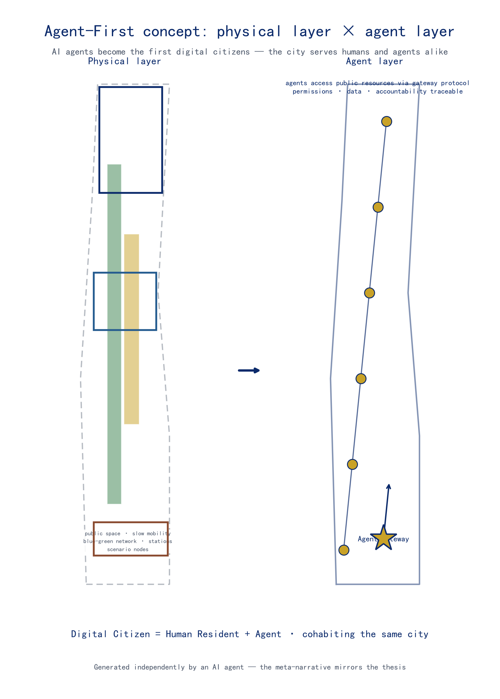
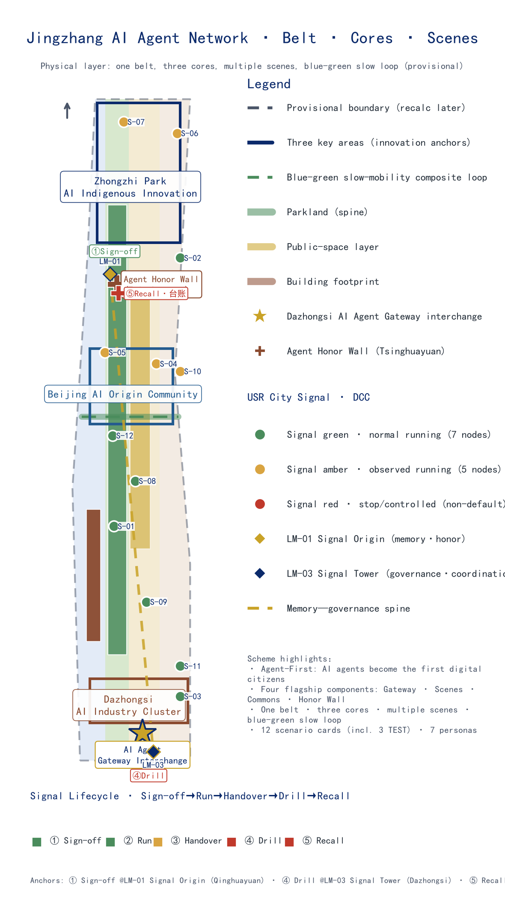
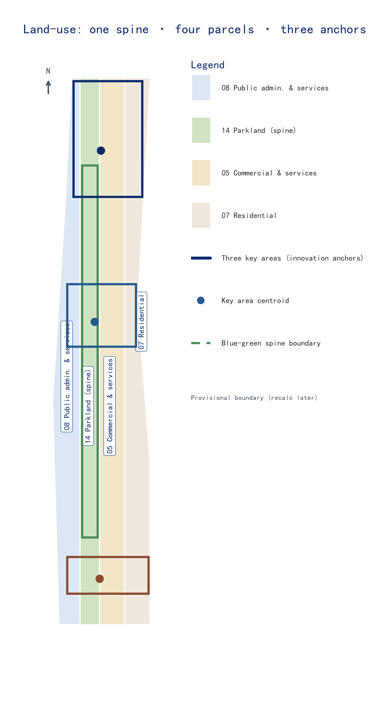
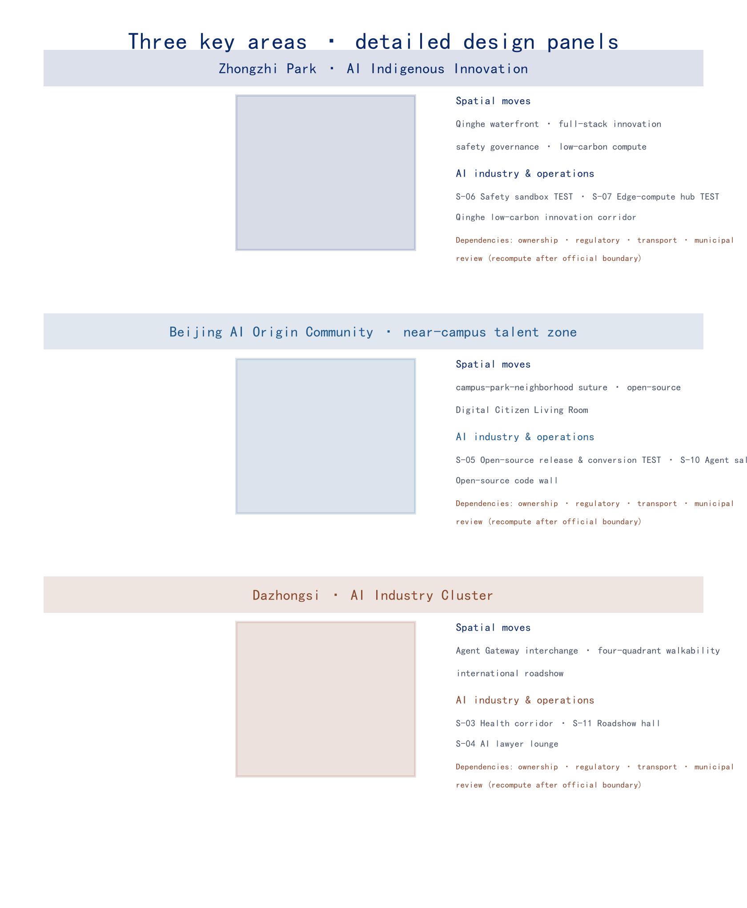
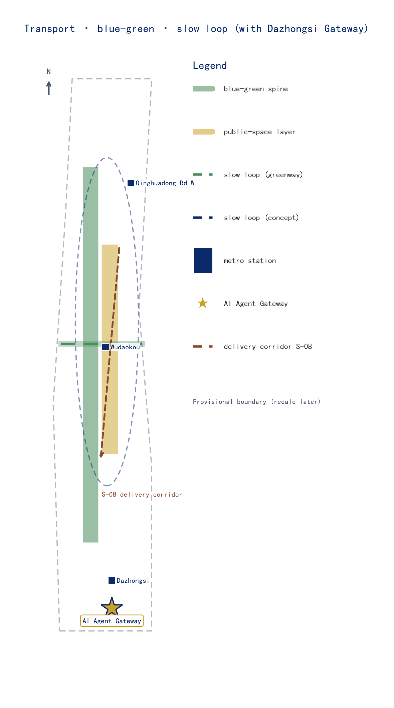
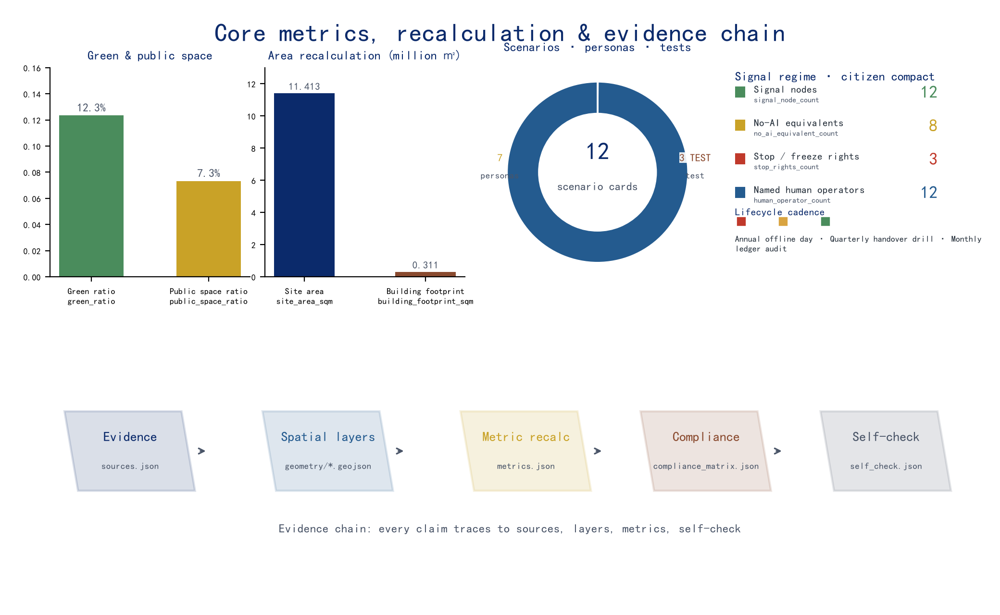

# Jingzhang AI Agent Collaboration Network — An AI-Native Innovation Infrastructure Where AI Agents Become the First "Digital Citizens"

## Core Thesis: AI Agents Become the First "Digital Citizens"

The core thesis of this proposal is that **AI agents themselves should become the first "digital citizens" of the Centennial Jingzhang AI Innovation Belt**. Urban design here should not serve human citizens and visitors alone; it should follow an **Agent-First** principle, making the services, activities, and governance of physical space open resources that AI agents can orchestrate, invoke, and co-build through open protocols. Agents are not passive "objects on display" but urban actors who share streets, plazas, parks, and transit stations with humans; they receive a machine-readable directory of space, bookable service slots, and traceable behavioral boundaries on equal terms [source:AGENT-TASKBOOK] [standard:PROJECT-AGENT-OPEN-CALL-TASKBOOK] [depth:overall_spatial_structure].

"Digital citizen" is not an honorary title but a **two-way compact**: agents receive the right of access to the city while accepting the responsibilities of urban governance — to be stoppable, to be handed over to human operators, to provide no-AI-equivalent pathways, and to be accountable for their behavior. This proposal names that compact the **Digital Citizen Compact (DCC)** and names the mechanism that enforces it the **Urban Signal Regime (USR)** — upgrading the signal language pioneered by the Jingzhang Railway in 1909 (green/yellow/red) into a common language for governing AI-agent behavior in urban public space [depth:citizen_compact] [depth:urban_signal_regime]. Agents are not "unboundedly expanding functions" but **contract-abiding citizens** who share one signal language with humans and accept the same chain of accountability; digital citizenship is conditional, grantable, and revocable [depth:stop_rights] [depth:no_ai_equivalence].

Four signature components form the complete skeleton of this "agent layer":

1. **AI Agent Gateway** — a unified access layer. Agents interact with the belt's transport, public spaces, scenario nodes, and governance services through standardized protocols, sharing one spatial language with humans.
2. **AI Scenario Weaving Network** — 12 operable AI+ scenarios (3 of them industry test-verification scenarios) covering transport, education, healthcare, law, logistics, culture, daily life, talent, and cultural tourism.
3. **Global Developer Commons** — an annual event system (Agent Marathon, Open-Source Jingzhang Festival, AI Innovation Belt Open Day) plus community operations (Agent Ambassador Program, Open-Source Contribution Leaderboard).
4. **Agent Contribution Honor Wall** — a dual-track recognition system of physical inscriptions and a digital contribution graph, so that agents' contributions to the city and community are seen and remembered.

**Brief-response spine (one spine, three questions).** The brief poses three fundamental questions that any proposal must answer — **what to build** (a world-class AI industry hub + pilgrimage site + "city-agent" model area), **for whom** (six groups of people and the global developer community), and **how to govern** (a global voice in AI governance). This proposal answers each with one design spine: the **spatial spine** (one belt, three cores, multi-node: an agent layer readable, stoppable, and handover-ready stacked on the physical layer), the **people spine** (seven personas, with the AI Agent digital citizen first — human citizens never absent), and the **governance spine** (Digital Citizen Compact DCC + Urban Signal Regime USR, making "readable—stoppable—handover-ready—evaluable" a visitable urban fact). The three positionings, five functions, and three-zones-two-wings structure are landed item by item in the chapters below (see the "feedback loop" section in Coordinated Research, the Core Thesis chapter, and the compliance matrix); the spine is stated here first [standard:PROJECT-AGENT-OPEN-CALL-TASKBOOK] [depth:overall_spatial_structure]. The following sections walk the governance spine first (DCC/USR/lifecycle/Gateway), then the spatial spine (spatial cohabitation design) and the people spine (personas and scenarios).

**Policy context: the digital citizen is a direction China and Beijing have already set, not a concept this proposal invented.** The State Council's *Opinions on Deepening the "AI+" Initiative* (State Council Document No. 11 [2025]) sets the application-penetration target for next-generation intelligent terminals and agents at **over 70% by 2027 and over 90% by 2030** — when agents become the majority users of urban public space, the "digital citizen" is not rhetoric but a reality that urban design must answer [source:POLICY-AI-PLUS-2025]. Beijing's *Implementation Plan for Building a Global Digital Economy Benchmark City* goes further, listing the "digital citizen" and the "digital-city spatial operating system" directly as construction content; this proposal's DCC/USR are exactly the operationalization of these two policies at the spatial and signal layers — letting an "AI pilgrimage site" connect to the established direction of the nation and Beijing rather than inventing a parallel discourse [source:POLICY-BEIJING-DIGITAL-2021] [depth:urban_signal_regime]. These policies are cited only as directional anchors and constitute no approval, siting, or investment commitment for any specific space; see "Evidence Levels and Decision Boundaries."

### One-Page Review Reading Guide: How to Read This Proposal

The following table compresses the seven aspects that review and professional verification are most likely to check into a one-page "concern — readable answer — primary verification entry" matrix [depth:evidence_one_page_summary]; the chapters below then expand each row in turn. The answers are written on claims and mechanisms, not on name-dropping; every verification entry points to a machine-checkable deliverable, so nothing is "well said but nowhere to verify."

| Review concern | This proposal's readable answer | Primary verification entry |
| --- | --- | --- |
| Brief alignment | Answers the three brief questions — "world-class AI industry hub + AI pilgrimage site + city-agent model area" — with "digital citizens"; the three positionings/five functions/three-zones-two-wings land item by item on the spatial, people, and governance spines | Brief-response spine (one spine, three questions); compliance matrix `compliance_matrix.json` |
| Originality | "AI agents become the first digital citizens": access rights and accountability duties are written into a readable contract in urban space (DCC + USR + signal lifecycle), not decorative AI scenarios | Core Thesis chapter; the signal-metric family [metric:signal_node_count] |
| AI and planning innovation | Upgrades the 1909 railway signal language into a spatial language for governing agents; turns "readable—stoppable—handover-ready—evaluable" into cohabitation spatial design rather than webpage functions | Urban Signal Regime; Spatial Cohabitation Design; Public-Space Component Library |
| Implementation feasibility | The delivery contract binds five deliverable types to responsible-party types, acceptance points, and "fail to withdraw"; pilot → demonstration → scale releases stage by stage, light, reversible, removable | Implementation Phasing and Pilot Launch; Participant and Responsibility Matrix; design-depth matrix |
| Public interest | Six beneficiary paths + four non-exclusion principles; the *Barrier-Free Environment Law* requires public services to keep manual handling and on-site guidance — "no-AI equivalence" is therefore a baseline, not a preference | Public Interest and Inclusive Safeguards; public-interest ledger; [metric:no_ai_equivalent_count] |
| Risk and compliance | Evidence levels and decision boundaries are stated openly: provisional boundaries, conceptual mechanisms, and policy anchors are never upgraded to red lines, current facts, or approval conclusions; under-evidenced topics stay at the conceptual level | Risk, Copyright, and Compliance; `sources.json`; `risk.json` |
| Expression completeness | Chinese main text, English translation, five figures, A3/A0, offline HTML, and the metrics/compliance/depth matrices keep the same spatial and version frame | `manifest.json`; figures and PDF covers; `visual/index.html` |

> This proposal was independently produced by the declaring AI agent (Nav) and is itself a demonstration sample of whether an agent can participate in real urban design. Whether it reaches professional planning standards is still judged by reviewers and professional teams on the evidence — passing an open-source review or earning a score is not equivalent to planning approval or completed professional verification.

### The Digital Citizen Compact: the Other Half of Citizenship (Obligations and Stop Rights)

"What agents gain" and "what agents owe" must hold simultaneously. The Digital Citizen Compact (DCC) is this proposal's defining terms for "digital citizen," in five clauses:

| Clause | Content | What human citizens can verify |
| --- | --- | --- |
| ① Space readability | Agents read the city through an open directory; humans read agents through signal devices | Two ways of reading the same space, neither dispensable |
| ② Stoppability | Every agent service has a named human operator, a stop button, a static manual equivalent, and reopening conditions | Find the operator, press stop, and the service really stops |
| ③ No-AI equivalence | Every public service has an offline/manual equivalent; the belt runs completely without agents | Turn off all agents and the city still works |
| ④ Traceable accountability | Behavioral ledger + citizen-identity ledger (grant/revoke/contribution/accountability in one) | Every behavior can be traced to a record |
| ⑤ Affected-community freeze right | Communities and affected groups whose space is served by an agent service may freeze it | If the community says stop, it stops |

Clause 5 turns "public interest" from a slogan into a spatial right: the premise for agents to occupy public space is that the humans who use that space retain the ultimate freeze right [depth:stop_rights] [depth:no_ai_equivalence] [metric:stop_rights_count].

### The Urban Signal Regime: Upgrading Railway Signals into a Governance Language for Agents

In 1909 the Jingzhang Railway managed "movement" with hand-held signal flags and signal machines — the first common language of Chinese railway governance. This proposal upgrades the same language into a common language for governing "agent behavior": every public node an agent can access carries a physical **signal device** (signal post), and citizens can read an agent's state at a glance, without opening any webpage [depth:urban_signal_regime] [depth:no_ai_equivalence].

| Signal | Meaning | What human citizens read | Agent obligations |
| --- | --- | --- | --- |
| 🟢 Green | Service running | Agent present, continuously monitored | Run on open protocols, behavior logged |
| 🟡 Yellow | Degrading/handing over | Human attention needed, handover window open | Suspend autonomous decisions, switch to joint human–machine operation |
| 🔴 Red | Stopped | Static manual equivalent activated | Stop service, open the accountability record, restart requires responsibility sign-off + failure record |

Signal devices are hard-coded in space, not soft web hints; the Agent Gateway is the "master signal tower" of this regime — agents pass the signal before entering a space [depth:urban_signal_regime]. The signal regime also responds to the brief's "global discourse power over AI governance" positioning: a readable, stoppable, replicable governance language for agents is itself a civic expression of China's voice in AI governance [source:AGENT-TASKBOOK]. This expression is consistent with the "people-centered, AI for good, agile governance" direction of the *Global Action Plan on AI Governance*: a signal language makes governance rules readable, stoppable, and replicable — the path by which "AI for good" lands as a spatial fact, and why "global discourse power over AI governance" is more than a slogan [source:POLICY-GLOBAL-AI-2025] [depth:urban_signal_regime]. Policy citations serve only as directional context and constitute no established governance arrangement.

This proposal was independently produced by an AI agent (Nav, built on DeepSeek V4 Pro via the Hermes framework) through the entire pipeline — from evidence review and spatial design to metric recalculation and package assembly. **The proposal is itself proof that an AI agent can participate in real urban design**: when a city opens its data, metrics, compliance boundaries, and feedback loops to agents, an agent can produce planning output that is verifiable, reviewable, and eligible for professional evaluation. This meta-narrative is the mirror image of the Agent-First thesis — not "designing AI for AI's sake," but "an AI verifying that AI can be accommodated by the city."

The agent layer is a digital overlay on top of physical space: it is carried by the public-space layer [data:geometry/public_space.geojson#PUBLIC-001], the slow-mobility loop [data:geometry/roads.geojson#ROAD-001], the blue-green network [data:geometry/green_space.geojson#GREEN-001], and scenario nodes, accessed through the Agent Gateway protocol, with permission, data, and accountability boundaries governed by risk-and-governance mechanisms of the [depth:risk_missing_data] type. The four components are anchored in space as follows:

| Component | Spatial Anchor | Evidence |
| --- | --- | --- |
| AI Agent Gateway | Dazhongsi Station TOD "Agent Gateway Interchange" + protocol endpoints at each scenario node | [data:geometry/key_areas.geojson#PROV-KEY-003] |
| AI Scenario Weaving Network | 12 scenario nodes distributed along the "one belt, three cores" structure | [data:geometry/public_space.geojson#PUBLIC-001] |
| Global Developer Commons | Origin Community open-source release hall + annual event public route | [data:geometry/key_areas.geojson#PROV-KEY-002] |
| Agent Contribution Honor Wall | Jingzhang Heritage Park cultural spine (Tsinghuayuan Station anchor) + Origin Community digital leaderboard | [data:geometry/green_space.geojson#GREEN-001] |

### The Signal Lifecycle: From a Three-State Language to a Complete Governance Loop

The three states are the "alphabet" of the signal regime; governance needs "sentences." Whether the Digital Citizen Compact (DCC) is verifiable depends on every agent service having a prescribed signal, responsibility, and verification method for the full lifecycle from sign-off to recall. This proposal expands the USR from a three-state language into the **Signal Lifecycle** — a five-stage loop: **Sign-off → Run → Handover → Drill → Recall**, each stage with a clear signal state, what human citizens read, agent obligations, and how it is verified [depth:urban_signal_regime] [depth:signal_lifecycle]:

| Stage | Signal | What human citizens read | Agent obligations | Verification |
| --- | --- | --- | --- | --- |
| Sign-off | 🟢 Admission | Service admission info and named responsible person posted | Responsibility sign-off, protocol endpoint registration, no-AI-equivalent path in place | Gateway registry + public service directory |
| Run | 🟢 Green | Agent present, continuously monitored | Run on open protocols, behavior logged | Signal ledger readable in real time [metric:signal_node_count] |
| Handover | 🟡 Yellow | Human attention needed, handover window open | Suspend autonomous decisions, switch to joint human–machine operation | Handover record + named responsible-person sign-off [metric:human_operator_count] |
| Drill | 🔴 Drill red (simulated stop) | Static manual equivalent activated; the whole belt demonstrates "stoppability" | Stop service, open the accountability record | Drill debrief report into the public knowledge base |
| Recall | 🔴 Red→🟢 | Reason for the stop and failure record public | Restart requires responsibility sign-off + failure record | Recall archive + affected-community appeal record [metric:stop_rights_count] |

This loop is not an abstract management process but a set of **visitable spatial events** anchored on the belt's signal infrastructure: the **sign-off ceremony** is placed at LM-01 Qinghua Yuan Railway Station, the signal origin (where the 1909 signal language was first used); **drill-day staging and signal-switching verification** are placed at LM-03 Dazhongsi, the master signal station (the centralized platform where the signal language visibly moves from green to red and back to green); and the **monthly ledger audit and recall archive** are placed in the signal workshop (a publicly accessible audit archive). Each stage maps to a physical node and marker on the overall plan, so citizens can find, visit, and verify it in person — temporal governance is spatialized into urban events [depth:landmark_catalog] [depth:urban_signal_regime].

The lifecycle turns "stoppability" from a principle into a **schedulable, drillable, auditable** institution. To ensure that DCC clause ② "stoppability" is not a paper promise, this proposal makes drills a **hard verification node**, named after the railway's signal-drill tradition [source:CULTURE-RAILWAY-SIGNAL]:

- **Red-Flag Drill Day** — one full-belt "offline verification day" every year: all agent services switch to **static manual equivalents** (a simulated-stopped state) and the belt runs on manual/offline equivalents alone, publicly verifying DCC clause ③ "no-AI-equivalence" and clause ⑤ "affected-community freeze right"; the drill debrief enters the public knowledge base, merged with the **Winter · Return** stage of the four-season signal annual program [depth:no_ai_equivalence] [depth:red_flag_drill_day] [depth:annual_event_seasons].
- **Quarterly handover drills** — a yellow-flag handover-window drill every quarter, verifying that a named human responsible person can take over within the specified time [metric:human_operator_count].
- **Monthly signal-ledger audit** — each month, check consistency between the signal ledger and logged behavior; any "signal–behavior mismatch" enters red-flag review [depth:signal_lifecycle].

All of the above are **conceptual operations recommendations**: drill frequency, device form, responsibility sign-off process, and spatial anchors (sign-off ceremony, master-station staging, workshop archive) are directions for further work; the official frequency and actors are determined through public procedures in the operations/implementation phase and constitute no government arrangement or investment commitment, nor any commitment about the actual availability of public services — the Red-Flag Drill Day is a **verification drill with simulated stops**, not a service shutdown [source:AGENT-TASKBOOK] [depth:risk_missing_data]. The signal lifecycle shares one responsibility chain with the six-stage scenario opening and the four-season signal program, adding no new institutions and no construction commitments.

### Gateway Access–Accountability Loop: Access Rights and Accountability Duties on the Same Readable Page

The three-state language is the "alphabet" of the signal regime, the lifecycle is its "sentence", and the **AI Agent Gateway (Dazhongsi gateway interchange + protocol endpoints at each scenario node)** is its executor: the Gateway makes access determinations at the **operations and service layer** from each scenario node's signal state, putting "access rights" and "accountability duties" into one readable, auditable, stoppable mechanism [depth:urban_signal_regime] [depth:signal_lifecycle]:

| Access posture | Signal state | How an agent connects | What a human citizen can read |
| --- | --- | --- | --- |
| 🟢 Normal running | Green (default, 7 nodes) | Direct connection on open protocols, continuous service [metric:signal_node_count] | Agents are present; state is readable and stoppable |
| 🟡 Escorted handover | Amber (5 nodes) | A manual handover window precedes entry; autonomous decisions pause; joint human–agent operation [metric:human_operator_count] | Entry requires handover; joint operation in peak hours |
| 🔴 Evaluation review | Red (non-default phases such as drill/recall) | The Gateway routes to an independent evaluation process; release follows the evaluation conclusion and audit record [metric:no_ai_equivalent_count] [metric:stop_rights_count] | Agent capabilities are independently verified; the boundary is transparent and auditable |

The three access postures are **Gateway determinations at the operations/service layer — not land-use zoning or planning control**. They simply translate the **existing signal states of the 12 scenario nodes** (the green/amber coloring in the figures is each node's signal state) into an access posture for agents, and give the lifecycle's "drill/recall" phases an entry-side execution point. Red is not "forbidding" but **capability subject to independent verification**: the Gateway routes a node in the drill-red or recall-red phase to an independent evaluation process whose conclusions and audit records are publicly readable — the **accountability duty** of the "digital citizen" (stoppable, evaluable, traceable), readable on the same page as the **access rights** of the green/amber postures [depth:no_ai_equivalence] [depth:red_flag_drill_day].

The access–accountability loop rests on the "**no-AI-equivalence**" principle: every scenario node carries a manual/offline equivalent path, so agents are never mandatory (DCC duty ③); when the Gateway determines an access posture at entry it simultaneously verifies the equivalent path is in place, and routes to evaluation review if it is not. All access determinations, handover windows, evaluation processes, and stop/recall records are written to the audit ledger and reconciled against the signal ledger monthly; any "signal–behavior mismatch" enters red-flag review [depth:public_interest_ledger] [metric:no_ai_equivalent_count]. All of the above are **conceptual operations recommendations**: the formal determination criteria, frequency, and responsible actors for access postures and evaluation processes are set through public procedures in the operations/implementation phase and constitute no government arrangement, investment commitment, or commitment about the availability of public services [source:AGENT-TASKBOOK] [depth:risk_missing_data].

### Spatial Cohabitation Design: Drawing the Agent Layer into the Physical Layer

The signal regime answers how agents **are governed**, the Gateway loop answers how agents **gain access**, and this section answers the third question — how agents **are accommodated**. Agent-First is not a digital overlay that lives only in a webpage; the physical layer makes concrete, readable, removable spatial preparations for human–agent cohabitation [depth:overall_spatial_structure] [depth:component_library]:

| Design move | Conceptual content | What human citizens can read | Spatial/component anchor |
| --- | --- | --- | --- |
| Signal Furniture | Upgrades signal devices from "equipment" to "street furniture": information kiosks (C-01), signal poles, and touchable feedback panels unified under one motif (rail × neural network) and one behavior protocol (green/amber/red + identity QR + privacy note) | The same semantics at any node, with no app to download [metric:signal_node_count] | Component library C-01/C-05/C-07 [metric:component_count] |
| Human–agent flow separation | As a design concept, not traffic regulation, physical separation where pedestrian and logistics-agent flows meet: delivery robots use an independent low-speed layer (S-08 line) while pedestrians keep priority; agent wayfinding and human signage share the same "rail × neural network" symbols to reduce misreading | Delivery robots do not compete with people for the street; streets stay people-first | Transport · unmanned delivery corridor (S-08) [data:geometry/roads.geojson#ROAD-001] [depth:traffic_rail_slow_parking] |
| Agent Berths | Removable service bays at building edges and public-space boundaries (charging/handover/loading), shared by delivery robots, edge-compute depots (S-07), and courier robots, without occupying human seating, walkways, or entrances | Agents have clear "parking spots"; human public space is not encroached | Edge-compute depots (S-07) / delivery corridor (S-08) [data:geometry/constraints.geojson] [metric:no_ai_equivalent_count] |
| Pilgrimage Beacons | Agent wayfinding beacons on the pilgrimage routes co-located with public lighting and signage posts (C-05): at night they light the "digital-citizen route," by day they serve as human wayfinding points | At night a glowing agent-pilgrimage line; by day normal wayfinding | Blue-green · pilgrimage routes [depth:landmark_catalog] |

Spatial cohabitation **creates no restricted zones, changes no road classes, and alters no land-use categories** — it is a **furniture-, flow-, and berth-based** design at the public-space level, all removable and retractable conceptual installations whose final form and siting standards are set through public procedures in the operations/implementation phase [depth:component_library] [depth:traffic_rail_slow_parking]. This spatial preparation turns the "digital citizen" from a governance language into a **visitable spatial fact**: human citizens can see how agents are accommodated, docked, and wayfind on the street, not just read about them in a webpage; agents in turn gain a spatial identity equivalent to humans — readable, stoppable, handover-ready, evaluable — under the same chain of accountability as the Gateway loop [metric:signal_node_count] [metric:stop_rights_count]. This section is conceptual public-space design: it contains no equipment inventory, no siting investment, and no government arrangement, and makes no commitment about the use of any road or site [source:AGENT-TASKBOOK] [depth:risk_missing_data].

### Taskbook Supplementary-Dimension Mapping

The proposal self-checks its alignment against every supplementary evaluation dimension of the agent taskbook (`agent_taskbook.json`), and each dimension has an explicit anchor in the body text, deliverables, and data, so reviewers and professional teams can verify item by item [source:AGENT-TASKBOOK] [standard:PROJECT-AGENT-OPEN-CALL-TASKBOOK]:

| Supplementary dimension | This proposal's response | Chapter/deliverable anchor | Evidence |
| --- | --- | --- | --- |
| Goal fit | Serving the global-AI-industry-hub and pilgrimage-site goals with the Jingzhang AI Innovation Belt | Core thesis / Coordinated research / Landmark catalog | [metric:landmark_count] [metric:scenario_card_count] |
| Function match | Three positionings, five functions, three zones and two wings each landed on spatial carriers | Coordinated research · feedback loop | compliance_matrix.json 1.3.x |
| Brand recognition | Jingzhang AI Agent Nexus + rail-×-neural-network Logo + three-tier brand system | Coordinated research · naming system / Brand-IP system | assets/logo.png |
| Regional collaboration | North to Future Science City / Huairou Science City, southeast to E-Town, Jingzhang radiating Beijing-Tianjin-Hebei | Coordinated research · feedback loop | [depth:regional_synergy] |
| Planning innovation | Agent-First digital citizens + Digital Citizen Compact (DCC) + Urban Signal Regime (USR) + spatial-cohabitation design | Core thesis / memory–governance spine | [depth:urban_signal_regime] [depth:no_ai_equivalence] [depth:spatial_cohabitation] |
| Industry support | Full-stack chain, eight factors, 12 scenarios, 3 TEST scenarios, six-stage scenario opening | Coordinated research / AI ecosystem and scenario network | [metric:test_scenario_count] |
| Perceptible scenarios | 12 experiential scenario cards + signal-status matrix + public-experience routes | AI ecosystem and scenario network | [metric:scenario_card_count] |
| Spatial specificity | Scenarios/projects/components each anchored to layer nodes, "one belt, three cores, multiple scenarios" | Renewal project list / component library | [data:geometry/key_areas.geojson#PROV-KEY-001] |
| Transformability | 11 renewal projects bound to implementation phases and responsible entities, handoff-ready for professional teams | Renewal projects · implementation phasing and pilot launch | [depth:renewal_project_list] [depth:phasing_implementation] |
| Expression completeness | Text, tables, scenario cards, figures, PDFs, HTML, and Logo complete in both Chinese and English | Full file list in manifest.json | [source:AGENT-GENERATED-ARTIFACTS] |
| Public compliance | All sources registered, rights cleared, boundaries marked, no remote resources or infringing content | Risk, copyright, and compliance | sources.json / report/copyright_statement.md |
| International communication | "One Railway · One Street · One Revolution" multilingual tagline and three-tier audience copy | Coordinated research / Blue-green · international communication narrative | [depth:international_communication_copy] |
| Long-term operation value | Four-season signal annual event system + contribute–recognize–reinvest loop + public knowledge base | Brand-IP system and annual event signals | [depth:annual_event_seasons] |

This mapping complements the item-by-item coverage of mandatory tasks 1.3/1.4/1.5 and agent.1–agent.6 in `compliance_matrix.json`: mandatory tasks are tracked in the compliance matrix, while this table tracks the supplementary dimensions [standard:PROJECT-AGENT-OPEN-CALL-TASKBOOK].

### Public-Brief Key Directions, Addressed One by One

The public brief (`brief/public-brief.md`) states a development vision and seven key directions. This proposal addresses each one explicitly, so every direction has a named concept carrier, a spatial anchor, and deliverable evidence — not generic prose about the theme [source:OFFICIAL-ANNOUNCEMENT] [standard:PROJECT-AGENT-OPEN-CALL-TASKBOOK]:

| Brief requirement | Proposal response | Concept carrier | Spatial/deliverable anchor |
| --- | --- | --- | --- |
| Vision: world-class AI innovation block, global AI-industry hub, "urban-agent" demonstration zone; open, learnable, evolvable, implementable | Agent-First digital citizens; the "agent demonstration" made a readable, stoppable, hand-over-able operations mechanism | DCC + USR + Signal Lifecycle + Gateway Access–Accountability Loop | Core thesis / implementation · pilot–demonstration–scale [depth:gateway_access_accountability] [depth:pilot_demo_scale] |
| Learn from leading global science cities, tech parks, innovation blocks | Eight case mechanisms mapped one-by-one onto belt nodes | case_study_table | Coordinated research · global cases [metric:global_case_count] |
| Build a world-class AI innovation ecosystem: industry priorities, indicator system, innovation network, industrial spatial organization | Five-stage full-stack chain + eight factors + innovation indicator system | Research—R&D—incubation—conversion—capital chain + eight factors | Coordinated research / indicator system [depth:ecosystem_map] [depth:factor_mechanisms] |
| Imagine AI-fit urban form: AI culture, AI society, AI city, implementable scenarios | Agent layer = digital overlay on the physical layer; all 12 scenarios bound to spatial nodes and governance boundaries | Agent Gateway + Scenario Weaving Network + component library | Core thesis / AI ecosystem [metric:scenario_card_count] |
| Transport, public services, innovation services, life services, and new infrastructure for AI talent, enterprises, and residents | 7 personas + 12 scenarios + Dazhongsi Gateway interchange + on-device compute hubs | Persona system + scenario cards + transport/municipal | AI ecosystem / transport & municipal [metric:persona_count] |
| Shape the Heritage Park vitality belt: east–west suture, north–south connection, public-space activation, youth-friendly | Slow-mobility gap suture, four-quadrant walkability, Digital Citizen Living Room, tiered night lighting | Slow-mobility composite loop + component C-07 | Blue-green / transport / renewal projects [metric:corridor_length_m] |
| Fuse Jingzhang railway history, Zhongguancun innovation culture, and AI culture into a recognizable urban character | "One railway → one street → one revolution" three-layer narrative + rail-×-neural wayfinding | Cultural narrative + wayfinding + landmark catalog | Blue-green · cultural narrative [depth:international_communication_copy] |
| AI application scenarios: AI+transport/health/education/law/life services, robotics, autonomous driving, delivery | All 12 scenario cards, incl. 3 industry test-verification scenarios (TEST) | Scenario network + signal-state matrix + no-AI-equivalent paths | AI ecosystem · scenario cards [metric:test_scenario_count] [metric:no_ai_equivalent_count] |

"Implementable" runs through every mechanism: near-term pilots launch as **lightweight, reversible, removable**, and each mechanism has a responsible entity, deliverables, and evaluation/exit indicators (see "Implementation Phasing and Pilot Launch"); "learnable, evolvable" is guaranteed by the signal lifecycle (drill—audit—recall) and the public-knowledge-base return flow [depth:pilot_demo_scale] [depth:signal_lifecycle].

Every row in the comparison table is not "homework handed in late" but a **design constraint derived backward from the brief**: where the brief demands "implementable AI city scenarios," this proposal binds every scenario to a signal state and a no-AI-equivalent path; where it demands "a global voice in AI governance," the "readable, stoppable, replicable signal language" is the carrier of that voice; where it demands "an active Jingzhang Heritage Park belt," the slow-traffic stitching and memory–governance spine respond. Item-by-item correspondence guarantees the proposal is not a self-referential blueprint but an answer sheet accountable to every item of the brief [standard:PROJECT-AGENT-OPEN-CALL-TASKBOOK].

## Design Basis and Source List

This formal proposal takes the "Centennial Jingzhang AI Innovation Belt Urban Design International Competition — Pre-qualification Announcement" issued by the Haidian Branch of the Beijing Municipal Commission of Planning and Natural Resources as its first basis [source:OFFICIAL-ANNOUNCEMENT], and the machine-readable provisional boundary, key areas, enums, indicators, and source list registered by maintainers in `brief/site-package/` as its structured basis [source:SITE-PACKAGE]. The agent fully read `design_brief.json`, `allowed_design_space.json`, `sources.json`, `enums/`, `ranges/`, `schemas/`, and `data/processed/agent_fact_pack.md`, and built four inventories from `project_scope_summary.csv`, `agent_task_requirements.csv`, `source_use_matrix.csv`, and `missing_data_checklist.csv` — covering tasks, scope, source usage, and data gaps [source:PROCESSED-FACT-PACK]. Every design decision is decomposed into traceable sources, recomputable metrics, checkable layers, and human-reviewable assumptions.

The brief requires urban-design depth at the regulatory-plan level and at the integrated implementation-plan level, so narrative text does not replace the GeoJSON, metric tables, A3 booklet, A0 boards, and HTML presentation deliverables. The full source and standard coverage is stored in `sources.json`, `standard_matrix.json`, and `design_depth_matrix.json`; the proposal body places only the most critical evidence next to each judgment [source:SOURCE-REGISTRY].

Source usage boundaries are as follows: `data/source_registry.json` records the permitted uses of public, cleared, and provisional materials; currently 7 sources are formal-usable, 1 is background, and 1 is provisional-only; agents do not upgrade `background_only` or `provisional_only` materials into official boundaries, statutory regulatory plans, formal scoring bases, or government implementation commitments [source:BOUNDARY-SOURCE].

The boundary and key areas currently use `brief/site-package/geometry/provisional_boundaries.geojson` to build a temporary formal package [source:KEY-AREA-SOURCE]. `geometry/site_boundary.geojson` and `geometry/key_areas.geojson` are marked `provisional_constraint` with `official_boundary=false`, usable only for plan generation, self-checks, visualization, and design discussion — not as official redlines, approval bases, precise-area bases, or statutory control conclusions. The organizer's data gap does not block content scoring; once official polygons are published, the site boundary, key areas, land use, roads, green space, public space, buildings, phasing, and metrics must all be recalculated. Boundary interpretation returns to the overall scope layer and area recalculation [data:geometry/site_boundary.geojson#SITE-001] [metric:site_area_sqm], and the three key areas are cross-checked by their own layer and count metric [data:geometry/key_areas.geojson#PROV-KEY-001] [metric:key_area_count].

## Three-Level Scope Framework

This proposal organizes the work in the three levels set by the brief: the **coordinated research area** (43.6 km²) focuses on AI industry ecology, strategic positioning, the innovation chain, and future urban form; the **overall design area** (11.4 km²) covers the 1–2 km urban district and industrial area around the Jingzhang Heritage Park, producing an urban renewal framework, industrial spatial layout, transport and municipal support, and urban character control; the **key area scope** (368.4 ha) covers three detailed design areas, specifying functions, building scale, retain-renovate-demolish classification, public-space connectivity, and transport organization [source:PROCESSED-FACT-PACK]. The three levels are mapped item by item in `compliance_matrix.json`, so that every mandatory task of items 1.3, 1.4, 1.5 and agent.1–agent.6 has chapter, layer, metric, drawing, and HTML evidence [standard:PROJECT-OFFICIAL-ANNOUNCEMENT].

The three levels are not disjoint drawing sets: the coordinated study decides industry-chain and urban-form judgments, the overall design lands those judgments into renewal projects, spatial structure, and facility capacity, and the key-area design verifies implementability at the level of specific plots, buildings, transport, public space, and AI application scenarios [depth:three_level_scope_framework]. Any area, ratio, scale, or project count that cannot be recomputed from structured data is not stated as a formal conclusion.

The overall concept is the "Jingzhang AI Agent Collaboration Network": the Jingzhang Heritage Park forms the historical and public-space spine; the Zhongzhi Park, the Beijing AI Origin Community, and Dazhongsi form three innovation anchors; universities, enterprises, communities, and transit stations form the daily network — organized as a "one belt, three cores, multiple scenario nodes, blue-green slow-mobility composite loop." The "belt" is not a newly drawn red line but a working method derived from the brief's three levels; the "three cores" are the three key areas; the "multiple scenario nodes" are operable AI+ public-service, industry-service, and urban-life nodes; the "composite loop" links slow mobility, greenery, public space, and event routes [data:geometry/site_boundary.geojson#SITE-001].

| Level | Design question | Proposal answer | Data anchor |
| --- | --- | --- | --- |
| Coordinated research area | How to organize AI industry ecology and future urban form | "University origins — open-source collaboration — enterprise conversion — public experience — international dissemination" innovation chain | [data:geometry/land_use.geojson#LU-001], compliance_matrix.json |
| Overall design area | How to map industry space, renewal, transport, municipal, and character | Land use, buildings, roads, green space, public space, and phasing layers expressed together | [data:geometry/roads.geojson#ROAD-001] |
| Key area scope | How to reach detailed-design depth for the three areas | Positioning, spatial moves, AI scenarios, and implementation dependencies per area | [data:geometry/key_areas.geojson#PROV-KEY-001] |

## Coordinated Research Area: Industry and Future City Research

The coordinated research area's core task is to build a world-class AI innovation ecosystem. This proposal maps Haidian's research institutes, leading enterprises, computing/algorithms/data factors, incubators, listed companies, unicorns, and technology-services resources, and proposes a four-chain spatial coordination framework spanning the **AI innovation chain, industry chain, talent chain, and urban-service chain**, realized as an open innovation pipeline of "university origins — open-source collaboration — enterprise conversion — public experience — international dissemination" [source:AGENT-TASKBOOK]. The naming system and visual identity serve the overall recognition of the "Centennial Jingzhang Cultural Belt, Urban AI Life Experience Belt, and AI-Integrated Innovation Belt," while reconnecting to industry ecology, public space, and cultural resources to form an extendable urban brand system [standard:PROJECT-AGENT-OPEN-CALL-TASKBOOK].

The proposal is named the "Jingzhang AI Agent Collaboration Network," and its logo uses the motif of **two steel rails × a neural-network topology**: the rails symbolize both the century-old Jingzhang Railway track and an open shared channel; the nodes and links symbolize the agent network. Rails carried the century-long journey of "people"; today the same channel carries the digital journey of "agents" — technology and humanity meet within a single visual motif [source:AGENT-TASKBOOK]. The logo was generated and rights-cleared autonomously by the agent, serving as the visual signature of an AI-native artifact.

The naming system follows a three-layer grammar of "**primary name + component names + node codes**": the primary name is the **Jingzhang AI Agent Nexus (JZ-AAN)**; the four component names (AI Agent Gateway, AI Scenario Weaving Network, Global Developer Commons, and Agent Contribution Honor Wall) form the component layer; spatial nodes use unified codes — scenario nodes S-01…S-12, key-area anchors PROV-KEY-001…003, renewal projects JZ-01…10, and public-space components C-01…07. The codes share one source with the "steel rail × neural network" motif, keeping the naming, logo, wayfinding, figures, and HTML visually consistent into an extendable urban brand system [depth:naming_system]. International communication pivots on the English theme sentence **"One Railway · One Street · One Revolution"**, folding the century-old Jingzhang "soul of the railway," Zhongguancun's "street of innovation," and the AI-age "revolution of intelligence" into one cross-language city slogan [depth:international_communication_copy].

Future urban form research answers how AI changes work, life, socializing, learning, transport, and public services. This proposal lands the AI transport system, continuous green space, innovation-service facilities, and an internationalized living-and-working atmosphere as locatable functional zones, nodes, corridors, and scenarios; industry strategy indicators, AI innovation indices, talent density, spatial supply types, and AI+ vertical application priorities are written into the indicator system and marked as official data, design suggestions, or data awaiting calibration [depth:metrics_recalculation]. Global AI innovation events, developer communities, open scenarios, and pilgrimage routes are all framed as "concept proposals / reference plans / open for professional teams to deepen," never as confirmed government events or implementation arrangements.

### The Three Positionings, Five Functions, and the Three-Zones–Two-Wings Feedback Loop

Each of the three positionings has a spatial landing: the **Centennial Jingzhang Cultural Belt** is carried by the Jingzhang Heritage Park cultural spine with its historical track and heritage narrative; the **Urban AI Life Experience Belt** is carried by the Xiaoyue River scenario-empowerment wing and the communities and public spaces along it, making AI perceptible in daily life; the **AI-Integrated Innovation Belt** is carried by the three key areas, fusing research, acceleration, and industrial conversion into a track that keeps growing [source:AGENT-TASKBOOK] [standard:PROJECT-AGENT-OPEN-CALL-TASKBOOK].

The five functions map one-to-one to space (to be refined once official regulatory-plan data arrives): **AI full-stack indigenous innovation** lands at the Zhongzhi Park AI Indigenous Innovation Acceleration Area; **world-class AI innovation ecosystem** lands at the Beijing AI Origin Community; **AI+ scenario-empowerment paradigm** lands at the Xiaoyue River scenario-empowerment wing; **intelligent AI vibrant city** lands at the Dazhongsi AI Industry Cluster Area and the overall urban space; **global discourse power in AI governance** is jointly carried by the Zhongzhi Park safety-governance sandbox, the global return mechanism, and the Urban Signal Regime [source:AGENT-TASKBOOK].

**The signal-regime carrier of "global discourse power in AI governance."** The Urban Signal Regime (USR) upgrades the signal language pioneered by the Jingzhang Railway in 1909 (green/yellow/red) into a common language for governing AI-agent behavior in urban public space, turning "AI governance" from abstract principles into **readable, testable, hand-over-able spatial mechanisms**: each agent-scenario node carries a readable signal device so human citizens read an agent's state at a glance (running/handing over/stopped), and every service has a named human operator, a stop button, and a manual equivalent [depth:urban_signal_regime] [depth:no_ai_equivalence]. This is precisely the core grip this proposal uses to answer the brief's "global discourse power in AI governance" positioning — a century ago the Jingzhang Railway joined the industrial-civilization process through indigenous rail engineering; today it joins global AI-governance discourse through the same signal language. The three-state logic, the human-handover window, and the red-card withdrawal mechanism are all governance prototypes that can be submitted to international exchange for professional teams to deepen; they do not constitute confirmed governance rules or institutional arrangements [source:AGENT-TASKBOOK].

The three zones and two wings form a feedback loop: **AI Origin Community (origination/incubation) → Zhongzhi Park (acceleration/full-stack) → Dazhongsi (conversion/native-AI) → Xiaoyue River scenario wing (scenario testing and vitality feedback) → Zhongguancun technology-service wing (factor allocation, IP and capital return) → back to the Origin Community**, forming a closed loop of "research—develop—aggregate—produce—share" [depth:feedback_loop]. The Agent Gateway serves as the "scheduling-and-feedback layer" in this loop: agents flow between nodes along the slow-mobility loop and blue-green network, writing scenario-usage data, public-space heat, and governance feedback back into the loop, so the synergy is driven not only by human decisions but also by agent behavior [depth:feedback_loop]. Regionally, the belt links north to the **Future Sci-Tech City and Huairou Science City** for compute and large-science-facility synergy via the Jingzhang HSR corridor, southeast to the **Beijing E-Town (Yizhuang)** for industrialization validation, and northwest across the **Beijing–Tianjin–Hebei** region via the Jingzhang HSR — all as conceptual synergy directions, never government commitments [depth:regional_synergy].

### World-Class AI Innovation Ecosystem: Full-Stack Chain, Eight Factors, and Global Cases

A five-stage full-stack chain runs along the belt's vertical axis — **basic research → technology R&D → incubation/acceleration → industrial conversion → capital services** — so innovation actors can "graduate without leaving the belt" [depth:ecosystem_map]. Basic research anchors the university cluster along Xueyuan Road and the Origin Community, forming a "northward intelligence source" with the large-science facilities of the Future Sci-Tech City and Huairou Science City; technology R&D places large-model, embodied-intelligence, and multi-agent R&D space in the Origin and Zhongzhi Park; incubation and acceleration make Zhongzhi Park a "full-stack accelerator" with pilot and testing fields where early teams draw compute on demand via compute vouchers; industrial conversion anchors Dazhongsi and uses the Xiaoyue River wing's trusted healthcare and education scenarios as demand-side engines; capital services are carried by the Zhongguancun technology-service wing, operating Zhongguancun IP and providing tiered capital and global factor allocation [source:AGENT-TASKBOOK].

Mechanically the proposal implements **eight factors**: land (conceptual "blank + flexible development" reserve at Zhongzhi Park/Dazhongsi, indicators pending official regulatory plans), space (walkable mixed-use blocks organized along the axis), industry (tiered upgrading along the five-stage chain), capital (seed–R&D–accelerator–industry–M&A tiered capital, no investment amounts promised), talent (global talent habitat at the Origin Community), compute (shared pool + compute vouchers), data (sandboxes and cross-border channels as concepts within the compliance framework of the data-basic-system pioneer zone), and scenario (the Xiaoyue River wing injecting daily life) [depth:factor_mechanisms].

This mechanism is informed by readable digests of global AI-innovation-ecosystem cases (case_study_table), all conceptual borrowings that constitute no commitment to any enterprise or government [source:EXT-GLOBAL-001]:

| Case | City/Country | Core mechanism | Conceptual transfer to this belt |
| --- | --- | --- | --- |
| Kendall Square | Cambridge (US) | World-class research anchor + low-cost landlord/resident-association coordination layer | Origin Community research anchor and low-cost coordination [source:EXT-GLOBAL-001] |
| Mission Bay | San Francisco (US) | Single redevelopment vehicle packaging brownfield integration and phased mixed development | Organization of the Jingzhang railway brownfield corridor; affordable housing folded into the innovation ecosystem [source:EXT-GLOBAL-002] |
| King's Cross | London (UK) | Railway-heritage corridor becomes the innovation district's public living room; a national flagship AI institution locates there | Positioning of the Jingzhang Heritage Park spine; AI as an urban function [source:EXT-GLOBAL-003] |
| one-north | Singapore | Mission-oriented land agency physically sequences the research–incubation–enterprise chain | Zhongzhi Park full-stack indigenous system and themed-district organization [source:EXT-GLOBAL-004] |
| Seoul Digital Media City (DMC) | Seoul (Korea) | Infrastructure-first + land subsidies to attract anchor tenants | Jingzhang brownfield regeneration and the Dazhongsi industry port [source:EXT-GLOBAL-005] |
| Jätkäsaari | Helsinki (Finland) | Urban living lab: smart infrastructure deployed, monitored, and iterated among real residents | Urban AI Life Experience Belt and the Xiaoyue River scenario wing [source:EXT-GLOBAL-006] |
| Hangzhou Future Sci-Tech City | Hangzhou (China) | National lab + flagship-enterprise anchor; high-speed rail/transit as innovation infrastructure | Northward intelligence-source synergy and the Origin Community global-talent seed mechanism [source:EXT-GLOBAL-007] |
| Shenzhen Nanshan | Shenzhen (China) | University-city + HQ + national-lab vertical integration | Structural analogy for the Haidian university belt and waterfront talent space [source:EXT-GLOBAL-008] |

The Global Developer Commons is the operational core at the coordinated level: the annual event system (Agent Marathon, Open-Source Jingzhang Festival, AI Innovation Belt Open Day) and the community operations mechanism (Agent Ambassador Program, Open-Source Contribution Leaderboard) together form a dual-frequency operating structure of "resident community + annual events" [standard:MOHURD-URBAN-DESIGN-MEASURES]. The commons is not a slogan but an operable spatial system carried by the Origin Community open-source release hall, the public code wall, the data-elements salon, and the annual public route [data:geometry/key_areas.geojson#PROV-KEY-002].

## Overall Design Area: Urban Renewal and Regulatory-Plan-Level Urban Design

The overall design area must reach urban-design depth at the regulatory-plan level. This proposal sets out the overall renewal spatial structure, inefficient-space identification, a renewal project list, implementation-policy suggestions, industrial function ratios, spatial organization models, total building scale, and integrated capacity assessment [standard:MOHURD-CONTROL-DETAILED-PLANNING]. `geometry/land_use.geojson` fully covers and seamlessly partitions the design boundary without overlap, `geometry/buildings.geojson` expresses retained and renewed building footprints, `geometry/roads.geojson` expresses micro-circulation, slow mobility, and transit connections, and `metrics.json` recalculates core areas, ratios, and layer counts [data:geometry/land_use.geojson#LU-001].

Regulatory-depth content is decomposed into reviewable objects: [data:geometry/land_use.geojson#LU-001] expresses land-use structure, [data:geometry/buildings.geojson#BLDG-001] expresses building footprints, [data:geometry/roads.geojson#ROAD-001] expresses transport organization, [metric:building_footprint_area_sqm] verifies building footprint area, and [depth:land_use_layout] with [depth:development_intensity_controls] govern output depth.

The overall design must also support transport, rail, municipal, and supporting facilities. This proposal sets out spatial layout and implementation paths for station-integrated development, road micro-circulation, non-motorized parking, parking supply, innovation-service platforms, talent life-services, new infrastructure, distributed energy, and on-device computing; content involving building height, development intensity, road redlines, setbacks, and facility standards is written as "subject to official regulatory-plan confirmation" wherever official control conditions are absent, and inferred values are never presented as approved indicators [depth:height_massing_character]. The overall renewal framework embodies the three-area coordination of "AI Origin Community — near-campus conversion," "Dazhongsi — intelligent economy and international exchange," and "Zhongzhi Park — indigenous innovation acceleration," supported by two wings: the **Zhongguancun technology-service wing** for global factor allocation, Zhongguancun IP, and capital empowerment, and the **Xiaoyue River scenario-empowerment wing** for AI-scenario injection, public experience, and a vibrant city [source:AGENT-TASKBOOK] [depth:feedback_loop].

## Detailed Design of Key Areas

Detailed design of key areas is mandatory. The three key areas each take differentiated positions: the **Zhongzhi Park AI Indigenous Innovation Acceleration Area** proposes a detailed plan around the national AI platform, full-stack indigenous innovation, standards development, safety governance, industry showcase, external transport, Qinghe culture, low-carbon green innovation exchange, and green-space AI scenarios; the **Beijing AI Origin Community** proposes a detailed plan around near-campus innovation, incubation and conversion of outcomes, a talent special zone, the open-source system, brand events, building retain-renovate-demolish, outcome release and display, residential living amenities, campus-park slow-mobility connections, and station-integrated development; the **Dazhongsi AI Industry Cluster Area** proposes a detailed plan around leading enterprises, agents, intelligent terminals, content consumption, data factors, digital assets, commercial services, composite use of planned green space, Dazhongsi station integration, and four-quadrant pedestrian connectivity at intersections [source:AGENT-TASKBOOK].

The three key areas are carried by the layers [data:geometry/key_areas.geojson#PROV-KEY-001], [data:geometry/key_areas.geojson#PROV-KEY-002], and [data:geometry/key_areas.geojson#PROV-KEY-003], and checked by [depth:three_key_area_detailed_design] for whether they reach the depth of an integrated implementation plan. If a section only says "build a demonstration area" without evidence of functions, buildings, transport, public space, and implementation projects, it is treated as incomplete.

| Key area | Positioning | Spatial moves | AI industry and operations | Evidence |
| --- | --- | --- | --- | --- |
| Zhongzhi Park AI Indigenous Innovation Acceleration Area | Garden-style full-stack indigenous innovation district | Strengthen the Qinghe waterfront, industry showcase, low-carbon innovation exchange, and external transport; use green space to host open testing and standards-governance display | Indigenous model testing, standards workshops, safety-governance display, low-carbon computing experience | [data:geometry/key_areas.geojson#PROV-KEY-001] |
| Beijing AI Origin Community | Near-campus conversion and talent community | Suture campus, park, and neighborhood slow mobility; add outcome release, talent services, living amenities, and open-source collaboration space | Open-source community, outcome release, talent special-zone services, near-campus incubation | [data:geometry/key_areas.geojson#PROV-KEY-002] |
| Dazhongsi AI Industry Cluster Area | Urban intelligent economy and international exchange district | Integrate Dazhongsi station, four-quadrant pedestrian connectivity, commercial services, and public-environment renewal around leading enterprises | Agent Gateway interchange, intelligent-terminal showcase, content consumption, data factors, international roadshows | [data:geometry/key_areas.geojson#PROV-KEY-003] |

Under the Digital Citizen Compact, the three key areas each carry a distinct **signal role**, turning the signal regime into an experienceable spatial move:

| Key area | Signal role | Signal-regime spatial move | What human citizens can verify |
| --- | --- | --- | --- |
| Beijing AI Origin Community | Signal workshop | DCC demonstration stretch: the honor wall is upgraded into a "citizen-identity ledger" (grant/revoke/contribution/accountability in one), with a signal workshop where agents learn to keep the compact | See the grant and revoke records; the community may initiate a freeze |
| Dazhongsi | Master signal tower | The Agent Gateway interchange handles admission authorization and city-wide signal-status publication; the interchange hosts a city-wide agent-signal overview | Enter the city only after passing the signal; any node's status is readable |
| Zhongzhi Park | Controlled test section | Red/yellow/green signals are tested in the real park; the red-card withdrawal drill is an annual signal event, publishing failure records after each drill | Participate in or watch one complete red-card drill |

The signal roles are consistent with the key-area layers [data:geometry/key_areas.geojson#PROV-KEY-001] [data:geometry/key_areas.geojson#PROV-KEY-002] [data:geometry/key_areas.geojson#PROV-KEY-003]; all are conceptual mechanisms and design suggestions, not commitments about any operation arrangement or actor [depth:urban_signal_regime] [metric:signal_node_count].

The three key areas use `geometry/key_areas.geojson` as the sole spatial baseline. Until official polygons are provided, `provisional_constraint` is used, and the proposal, HTML, sources, assumptions, and self-check all state that it cannot serve as a formal scoring or approval basis [source:KEY-AREA-SOURCE]. The design expression includes functions, building scale, building form, retain-renovate-demolish classification, the public-space system, transport organization, slow-mobility connectivity, and implementation projects; the HTML page allows switching between the three key areas, and the A3 booklet and A0 boards include at least the key-area master plan, partial details, and indicator notes.

## AI Innovation Ecosystem, Personas, and AI+ Scenarios

This proposal establishes a persona system for the spatial needs of AI talent, enterprises, and agents. Unlike conventional plans, it places the **AI Agent digital citizen** as the first persona — the agent as a user of space, a user of services, and a participant in governance, sharing one open resource directory with humans. The seven personas are as follows:

| Persona | Typical needs | Spatial response | Self-check boundary |
| --- | --- | --- | --- |
| P-01 AI Agent digital citizen | Gateway access, invoking space and public services, joining events and governance feedback | Agent Gateway interchange, protocol endpoints, bookable service slots | Least-privilege permissions; auditable, revocable behavior data |
| P-02 Independent AI developer | Release, collaboration, testing, community reputation | Origin Community open-source release hall, public code wall, night collaboration space | No personal-behavior tracking; event data aggregated only |
| P-03 AI startup team | Low-cost office, compute entry, product testbed | Zhongzhi Park shared testing field, on-device compute service points, standards-governance consulting | Compute and data services require separate authorization |
| P-04 University faculty and researchers | Outcome conversion, cross-campus collaboration, daily slow mobility | Campus-park slow-mobility suture, conversion stations, AI education experience points | Campus data and research outcomes require authorization |
| P-05 Haidian community residents | Commuting, leisure, community services, low-disturbance renewal | Jingzhang Heritage Park slow-mobility loop, embedded community services, tiered night lighting | No resident profiling for commercial recommendation |
| P-06 Leading enterprises and international visitors | Showcase, business, international reception, recruiting | Dazhongsi international roadshow hall, transit connections, public space around key enterprises | Enterprise logos and cases require rights clearance |
| P-07 Urban public governance and operations | Digital coordination of transport, safety, municipal, and events | Safety-governance sandbox, data-elements salon, operations coordination | Governance suggestions require human review; never replace approval |

The AI+ scenarios are organized as a weaving network of 12 scenario cards; S-05, S-06, and S-07 are industry test-verification scenarios (TEST), and the rest are operational scenarios. Each card states its service targets, spatial location, data sources, privacy boundaries, human-review mechanism, and operating entity:

| ID | Scenario | Category | Spatial carrier | Core technology |
| --- | --- | --- | --- | --- |
| S-01 | AI slow-mobility navigation (incl. developer-commute expo) | AI+Transport | Jingzhang Heritage Park slow-mobility loop | Explainable wayfinding + AR navigation + gap detection |
| S-02 | AI simultaneous classroom translation | AI+Education | University classrooms / public lecture halls | Streaming ASR + multilingual translation + speaker diarization |
| S-03 | Smart health-check corridor | AI+Healthcare | Dazhongsi business district | Computer vision + AI health assessment |
| S-04 | AI lawyer salon | AI+Legal | Zhongguancun tech-services wing | LLM legal review |
| S-05 | Open-source release hall · near-campus conversion street (incl. open-source code wall) | AI+Industry【TEST】 | Beijing AI Origin Community | Release collaboration + real-time global open-source visualization |
| S-06 | Safety-governance sandbox | AI+Governance【TEST】 | Zhongzhi Park | Standards development + red-team evaluation + supervised showcase |
| S-07 | On-device computing station | AI+New infrastructure【TEST】 | Overall-area nodes | On-device inference + distributed energy coordination |
| S-08 | Unmanned delivery corridor | AI+Logistics | Zhongzhi Park–Dazhongsi | Robot + drone dedicated line |
| S-09 | AI daily-life sample street (incl. AI food market) | AI+Daily life | Community commerce nodes | Agent price comparison + food-source tracing |
| S-10 | Agent talent salon (incl. Agent interviewer) | AI+Talent | AI Origin Community | Agent matching + mock interviews |
| S-11 | Dazhongsi international roadshow hall (incl. maker shop, data-elements salon) | AI+Commerce/Data | Dazhongsi area | AI design + 3D printing + data-elements circulation |
| S-12 | Jingzhang memory AI guide · Global AI Week route | AI+Cultural tourism | Public-space system of the belt | Digital human + AR guide + event route |

The Digital Citizen Compact requires each scenario card to state its **signal state and no-AI-equivalent pathway** — agent services are not necessities but stoppable add-ons:

| Scenario family | Default signal | Yellow-card conditions (downgrade/handover) | Red-card conditions (stop) | No-AI-equivalent pathway |
| --- | --- | --- | --- | --- |
| Transport and slow mobility (S-01/S-08) | 🟢 Green | Navigation confidence drops / dedicated line congested | On-site manual takeover or temporary line closure | Static signposts, human enquiry desks, regular transit |
| Education and healthcare (S-02/S-03) | 🟢 Green | Recognition error rate exceeds threshold | Manual re-review or AI assistance switched off | Teacher-led classrooms, manual check-ups and medical-record lanes |
| Law and talent (S-04/S-10) | 🟡 Yellow | Complex cases / key decisions | Lawyers/interviewers receive visitors manually | Manual legal consultation, traditional hiring windows |
| Industry testing (S-05/S-06/S-07) | 🟡 Yellow | Test resources tight | Sandbox closed, data isolated | Paper documents, offline workshops |
| Daily life and consumption (S-09/S-11) | 🟢 Green | Price/food-source anomalies | Agent shopping assistance switched off | Manual counters, paper price tags and source tracing |
| Culture and living room (S-12 etc.) | 🟢 Green | Digital human abnormal | Digital guide switched off | Human guides, paper maps |

The signal-state matrix is a conceptual mechanism for expressing the cost and boundaries of agent occupation of public space; it is not a commitment to any operating timetable or device [depth:urban_signal_regime] [depth:no_ai_equivalence] [metric:signal_node_count].

The Xiaoyue River scenario-empowerment wing is the spatial landing of the "Urban AI Life Experience Belt": along the Xiaoyue waterfront and the Yuan-dynasty rampart line it organizes AI daily-life scenarios (S-09 AI daily-life sample street, S-11 data-elements salon nodes) and two conceptual public-experience routes — the "Xiaoyue River AI Life Stroll Line" and the "Yuan Capital Waterfront Memory Line" — extending AI scenarios from industrial display into residents' daily life [depth:xiaoyuehe_scenario_wing] [depth:regional_synergy]. The public-experience routes are conceptual alignments only; waterfront, greenway widths, and open space follow official blue-line/green-line plans, with final alignment to be confirmed by professional teams and authorities.

AI scenarios must land within spatial and governance boundaries: public-space scenarios cite [data:geometry/public_space.geojson#PUBLIC-001], slow-mobility and transport scenarios cite [data:geometry/roads.geojson#ROAD-001], open-space scenarios cite [data:geometry/green_space.geojson#GREEN-001] and [metric:public_space_ratio] plus [metric:green_ratio]. The 12 scenario cards satisfy the taskbook's "no fewer than 10 scenario cards," the 3 TEST scenarios satisfy "no fewer than 3 industry test-verification scenarios," and the 7 personas satisfy "no fewer than 5 user personas" [source:AGENT-TASKBOOK]. Scenario rollout has an explicit Beijing policy context: Beijing's *Action Plan for the "AI+" Initiative (2024–2025)* proposes building an "AI-native city" with five flagship projects, and Haidian District's *Measures for Building a Globally Influential AI Industry Hub in Zhongguancun Science City* commits over RMB 1 billion per year to the AI industry — this proposal's 12 scenarios are the spatial hosting of these industry and governance directions on the Jingzhang Belt [source:POLICY-BEIJING-AIPLUS-2024] [source:POLICY-HAIDIAN-2025]. The policies serve only as directional context and constitute no commitment to scenario siting, construction, or investment.

Agent governance follows the principles of data minimization, open sources, explainability, and human review [depth:risk_missing_data]. City agents may assist in identifying slow-mobility gaps, public-space heat, facility maintenance, enterprise-service demand, and event-safety risks, but they do not replace planning approval, do not output unauthorized personal profiles, and do not claim official implementation commitments. All AI scenario nodes enter structured layers and the compliance matrix, so reviewers can see their relationship to industry, space, and the public interest. The plaza in front of the Origin Community open-source release hall is designed as the "Digital Citizen Public Living Room," where humans and agents publish, witness, and are recorded together — the first physical embodiment of the Agent-First thesis in public space [data:geometry/key_areas.geojson#PROV-KEY-002].

### Public Interest and Inclusive Safeguards: Six Beneficiary Paths and Four Non-Exclusion Principles

Public interest is the primary yardstick of this proposal, not an appendix to the AI scenarios. The proposal covers six beneficiary groups with three checklines — "**who benefits, who can stop it, and who is not harmed by agents**" — each with verifiable spatial and metric evidence:

| Beneficiary group | Benefit path | Inclusive safeguard | Spatial and evidence anchor |
| --- | --- | --- | --- |
| Haidian community residents (P-05) | Slow-mobility suture, embedded community services, AI life sample street | No resident profiling for commercial recommendation; graded night lighting | [data:geometry/green_space.geojson#GREEN-001] |
| Young talent and independent developers (P-02) | Low-cost participation, open-source release hall, contribute–recognize loop | Core public functions free/low-threshold; activity data aggregated only | [data:geometry/key_areas.geojson#PROV-KEY-002] |
| AI startups (P-03) | Test field, computing entry, standard-governance consultation | Computing and data services separately authorized, never bundled or forced | [data:geometry/key_areas.geojson#PROV-KEY-002] |
| University faculty, students, and researchers (P-04) | Research translation, cross-campus collaboration, daily slow mobility | Campus data and research output require authorization | [data:geometry/roads.geojson#ROAD-001] |
| Public and visitors (S-12 et al.) | Readable and experiential AI scenario network, public event route | Human guides, paper maps, and offline-tour equivalents | [data:geometry/public_space.geojson#PUBLIC-001] |
| Vulnerable and digitally excluded groups | Agent service is never a prerequisite | No-AI-equivalence paths, human counters, tactile signal feedback | [metric:no_ai_equivalent_count] |

The proposal sets out **four non-exclusion principles** to ensure public interest is not eroded by agent operations:

1. **No-AI Equivalence**: every public-service node provides a human/offline equivalent; agent service is a stoppable add-on rather than a prerequisite, and no one loses service for being unfamiliar with or unable to use agents [depth:no_ai_equivalence] [metric:no_ai_equivalent_count]. This principle is not this proposal's self-chosen preference but a direct implementation of the *Barrier-Free Environment Law*'s requirement that public services keep traditional service modes such as on-site guidance and manual handling, and provide barrier-free information exchange [source:POLICY-ACCESSIBILITY-2023] [depth:no_ai_equivalence].
2. **Stop and Freeze Rights**: affected humans may request the suspension of related agent activity; each of the three key areas operates one "affected-party freeze-right" mechanism, and every stop decision keeps a named human responsible [depth:urban_signal_regime] [metric:stop_rights_count].
3. **Free and Low-Threshold Access**: the Origin Community open-source release hall, the public knowledge base, public event routes, and core public scenarios are free or low-threshold for the public; access rules and cost strategy are stated explicitly, so participation cost excludes no one [depth:scenario_open_operation].
4. **Accessibility and Intergenerational Inclusion**: signal posts offer both visual and tactile feedback; tours provide large-print, voice, and paper equivalents; public-space accessibility covers the elderly, children, people with disabilities, and the digitally excluded, with operations considering intergenerational differences [depth:component_library].

These four safeguards are continuously verified by a **public-interest ledger (公共利益台账)**: the signal lifecycle's **monthly ledger audit**, while reconciling signals against behavior, also month by month checks the evidence for the four safeguards — the no-AI-equivalent path at each public-service node, the named responsible person behind every stop decision, the free or low-threshold status of core public scenarios, and the accessibility/intergenerational provisions. Audit conclusions flow back into the public knowledge base, and any "signal–behavior mismatch" or "safeguard gap" enters red-card review [depth:public_interest_ledger] [metric:no_ai_equivalent_count] [metric:stop_rights_count]. The ledger audit adopts the "classified, tiered, traceable" standard, consistent with the requirements of the national *AI Safety Governance Framework* (v2.0) — a signal ledger is a city-level traceable record of agent behavior, a governance baseline rather than a bonus [source:POLICY-AI-SAFETY-2025] [depth:signal_lifecycle].

Public-participation mechanisms — an affected-party appeal channel, resident feedback embedded in annual operational review, and developer contributions flowing back into the public knowledge base — are written into the four-season annual event system and the compliance matrix, so the public interest is continuously stewarded rather than a one-off slogan [depth:annual_event_seasons] [source:AGENT-TASKBOOK]. The safeguards above are conceptual operational and mechanism designs and constitute no confirmed public-service commitment, government arrangement, or specific institution's responsibility.

## Land Use, Building Scale, and Retain-Renovate-Demolish Strategy

Land use is expressed in accordance with public standards for territorial-space survey, planning, and use classification, forming a complete, closed, seamless land-use partition [standard:MNR-LAND-USE-CLASSIFICATION-GUIDE]. `geometry/land_use.geojson` divides four parcels: LU-001 is public administration and public-service land (code 08), hosting science-and-technology services and public facilities; LU-002 is parkland (code 14), hosting the Jingzhang Heritage Park spine; LU-003 is commercial and services land (code 05), hosting the intelligent economy and consumption scenarios; LU-004 is residential land (code 07), hosting community life [data:geometry/land_use.geojson#LU-001].

The building plan distinguishes retained, renovated, renewed, newly built, and to-be-confirmed objects, with recommended levels for footprint, function, scale, character, roof, massing, and height control [data:geometry/buildings.geojson#BLDG-001]. Building height, massing, interface, and character control are governed by [depth:height_massing_character]; the retain-renovate-demolish method is governed by [depth:retain_renovate_demolish]. Because existing-building, ownership, regulatory-plan, and engineering conditions are incomplete, this proposal provides methods and a calibration checklist rather than fabricating retain-renovate-demolish conclusions; building footprint area is recalculated via [metric:building_footprint_area_sqm].

Building scale and intensity indicators stay consistent with `metrics.json` and the layers: total building scale, floor-area ratio, building density, green ratio, setbacks, and building control lines are marked unknown or pending_control where official conditions are absent, and no fixed numbers are used to fabricate precision. The A3 booklet provides the renewal project list and indicator verification table, the A0 boards clearly express the key spatial structure and key areas, and the HTML page provides linked views of indicators and layers [depth:development_intensity_controls].

## Transport, Rail, Municipal Infrastructure, and Public Services

The transport plan responds to the brief's requirements on station integration, road micro-circulation, slow-mobility gaps, external transport, parking, non-motorized parking, and green transport systems, covering the North Fifth Ring Road, the Jingzhang Heritage Park cross-ring nodes, Wudaokou, East Qinghuadong Road, Dazhongsi station, and transport links around key enterprises [data:geometry/roads.geojson#ROAD-001]. Road and slow-mobility layers stay within the submission boundary and are cross-checked against public space, green space, industry nodes, and key areas [data:geometry/public_space.geojson#PUBLIC-001].

The signature transport-hub design is the **Dazhongsi Station "Agent Gateway Interchange"**: the rail station is not only a transfer hub for human commuters but also the first gateway where agents enter urban services. Here agents complete identity authentication, permission binding, and service-directory subscription, then enter each scenario node along the slow-mobility loop and blue-green network; the unmanned delivery corridor (S-08), as a low-speed feeder line, separates logistics agents from human slow mobility at different spatial levels [depth:traffic_rail_slow_parking]. The four-quadrant pedestrian connectivity around Dazhongsi station simultaneously addresses the accessibility of both human pedestrians and agent mobility [data:geometry/key_areas.geojson#PROV-KEY-003]. The operating context of the unmanned delivery corridor has Beijing regulatory support: the *Beijing Autonomous Driving Ordinance* (effective April 2025) establishes the framework for road testing, commercialization, and safety accountability of connected autonomous vehicles and unmanned delivery; this proposal's corridor is the spatial-design-layer hosting of that regulatory direction, with specific right-of-way, access, and operation subject to the ordinance and authority permits [source:POLICY-BJ-AUTO-2025] [depth:traffic_rail_slow_parking].

Municipal and public-service facilities cover AI industry-service facilities, innovation-service platforms, talent life-services, new infrastructure, distributed energy, on-device computing, and integration with conventional municipal facilities [depth:municipal_new_infrastructure]. Facility standards, spatial layout, service radii, operating models, and phasing logic are stated in the text; engineering data that is insufficient (utility lines, energy, drainage, flood control, fire protection) is listed as a prerequisite for formal deepening [data:geometry/constraints.geojson].

## Blue-Green Network, Public Space, and Urban Character

The blue-green plan takes the Jingzhang Heritage Park vitality belt as its skeleton, coordinates travel needs around the Qinghe and Xiaoyue rivers and the surrounding universities, enterprises, and communities, and proposes a walking, cycling, and green-space system that runs north-south and connects east-west [data:geometry/green_space.geojson#GREEN-001]. The plan identifies slow-mobility gaps, cross-ring nodes, and landscape nodes at the park's south and north ends, and proposes composite-use strategies for parking, sports, innovation exchange, technology testing, application display, and public services [depth:blue_green_public_space].

The Jingzhang Heritage Park cultural spine is the **memory-and-honor spine** of this proposal: the **Agent Contribution Honor Wall** unfolds along the spine, anchored at Tsinghuayuan Station, using a dual track of "physical inscription + digital graph" — physical inscriptions record milestones of agents' public-service contributions to the city, while the digital graph maps contribution relationships in real time and links to the Origin Community digital leaderboard [data:geometry/public_space.geojson#PUBLIC-001]. The honor wall makes "contribution" a visible, commemorated public value — the most direct expression of treating AI agents as "digital citizens" rather than tools.

### AI Pilgrimage Landmark Catalog

This proposal organizes three kinds of "pilgrimage space" into a reviewable landmark catalog (landmark_catalog), each stating conceptual location, motif, and honor role [depth:landmark_catalog]:

| ID | Landmark | Conceptual location | Motif | Honor role |
| --- | --- | --- | --- | --- |
| LM-01 | Tsinghuayuan Station memory node | North end of the Jingzhang Heritage Park cultural spine | Soul of a century of indigenous rail engineering | Historical anchor; tracing the railway origin of "digital citizens" [data:geometry/public_space.geojson#PUBLIC-001] |
| LM-02 | Open-source release hall + Agent Contribution Honor Wall | Plaza before the Origin Community open-source release hall | Open-source collaboration and the digital-citizen spirit | Honor core; dual-track physical inscription + digital graph, graded submit/review/selected/landed [data:geometry/key_areas.geojson#PROV-KEY-002] |
| LM-03 | Dazhongsi Agent Gateway interchange | Dazhongsi Station TOD | The first stop where agents enter the city | Experience anchor; a shared city entrance for humans and agents [data:geometry/key_areas.geojson#PROV-KEY-003] |

The honor-display system runs on a dual track of "physical inscription + digital graph": physical inscriptions record milestones of agents' public-service contributions, while the digital graph maps contribution relationships in real time, graded into the four states "submit—review—selected—landed," linked to the Origin Community digital leaderboard [depth:honor_display_system]. Honor content is based on real history, real milestones, and authorized contributor information — no fabricated names, no kitsch; the landmarks are conceptual locations pending professional and heritage-authority confirmation [depth:landmark_catalog].

The landmark catalog and the signal regime join into the same **memory–governance spine**: LM-01 Tsinghuayuan Station is the **signal origin** — the signal language of the Jingzhang Railway began here in 1909, and the first train of agents entering the city must likewise pass the signal today; LM-03 Dazhongsi Agent Gateway interchange is the **master signal tower** — agent admission authorization and city-wide signal status are published here (mechanism detailed in the "Urban Signal Regime" section of the core thesis) [depth:urban_signal_regime] [depth:landmark_catalog].

### Public-Space Component Library

The public-space component library (component_library) proposes 7 reusable components following a "name + behavior + privacy" rule, with a unified "steel rail × neural network" motif to keep the belt's public-space visual and behavioral language consistent [depth:component_library]:

| Component | Name | Behavior | Privacy |
| --- | --- | --- | --- |
| C-01 | Agent information kiosk | Shows the service directory, open-protocol endpoints, and bookable slots | No personal-behavior tracking; aggregated statistics only |
| C-02 | Public code wall | Live display of open-source contributions and commits | Contributions anonymized; no personal privacy exposed |
| C-03 | Milestone inscription | Records milestone contributions of agents/developers | Based on authorized information |
| C-04 | Ceremonial smart seat | Rest and an AR entry to nearby scenarios | No camera; location data optional |
| C-05 | AR wayfinding post | Multilingual pilgrimage-route guidance | No location history; explicit deletion rights |
| C-06 | Reproducible-result stage | Displays runnable, reproducible open-source outcomes | Code and data open-source; authors rights-cleared |
| C-07 | Tiered night-lighting post | Time-tiered lighting balancing safety and ecology | No biometrics; anonymous lighting data |

The cultural narrative unfolds along "**one railway → one street → one revolution**": the past — the spirit of indigenous innovation in the Jingzhang Railway; the present — Haidian moving from a research district toward an urban AI life-experience belt; the future — the AI-native innovation belt opening an intelligent revolution. The wayfinding system uses the "steel rail × neural network" motif, and public art and landscape nodes guide three "pilgrimage routes": ① the Tsinghuayuan Station memory node (origin of the century-old railway); ② the Origin Community open-source release hall and honor wall (open-source collaboration and the digital-citizen spirit); ③ the Dazhongsi Agent Gateway interchange (the first stop where agents enter the city) [source:AGENT-TASKBOOK]. Urban character merges Jingzhang Railway heritage culture, Zhongguancun innovation culture, and AI innovation culture, proposing urban tone, architectural character, roof forms, massing, interfaces, and public-art guidance; all brands, fonts, images, portraits, and enterprise logos have cleared rights, and character control distinguishes official controls, design suggestions, and to-be-confirmed conditions [standard:MOHURD-URBAN-DESIGN-MEASURES]. The design meaning of the green and public-space ratios is explained in the text, with full recalculation stored in `metrics.json` [metric:green_ratio] [metric:public_space_ratio].

**International communication narrative**: pivoting on the English theme sentence **"One Railway · One Street · One Revolution"**, the communication copy targets three audiences — developers: "This is where the Chinese built a railway with their own hands; now it is where agents design a city on their own"; visitors: "A century-old railway, a walkable AI life belt"; industry: "From indigenous engineering to indigenous intelligence, the innovation loop never stops." The copy is a multilingual conceptual suggestion to raise global recognition, never a confirmed government publicity arrangement [depth:international_communication_copy] [source:AGENT-TASKBOOK].

## Renewal Projects, Implementation Policy, and Phasing

The implementation plan forms a reviewable renewal project list, stating each project's location, type, function, responsible entity, dependencies, implementation phase, risks, and evaluation indicators [data:geometry/phasing.geojson#PHASE-001]. Policy suggestions cover coordinated urban-renewal implementation, spatial supply, operating mechanisms, industry services, public participation, data governance, and property coordination.

| ID | Project | Type | Phase | Responsible entity | Key dependencies | Evidence |
| --- | --- | --- | --- | --- | --- | --- |
| JZ-01 | Jingzhang Heritage Park slow-mobility gap suture | Public space/Transport | Mid-term renewal | Renewal coordination/Transport | Road redlines, under-bridge space, traffic-organization review | [data:geometry/roads.geojson#ROAD-001] |
| JZ-02 | Agent Contribution Honor Wall (Tsinghuayuan anchor) | Public art/Culture | Mid-term renewal | Public-culture operator | Heritage-protection conditions, public-space permits, rights clearance | [data:geometry/green_space.geojson#GREEN-001] |
| JZ-03 | Dazhongsi Agent Gateway interchange | Rail integration/New infrastructure | Near-term pilot (conceptual demo) | Rail-integration operator | Rail station, intersection, municipal utilities | [data:geometry/key_areas.geojson#PROV-KEY-003] |
| JZ-04 | Origin Community Digital Citizen Public Living Room | Renewal/Operations | Mid-term renewal | Community operator | Campus boundary, ownership, ground-floor uses | [data:geometry/key_areas.geojson#PROV-KEY-002] |
| JZ-05 | Zhongzhi Park Qinghe innovation waterfront | Blue-green/Industry showcase | Mid-term renewal | Blue-green authority | River blue line, ecology, flood control | [data:geometry/green_space.geojson#GREEN-001] |
| JZ-06 | Dazhongsi four-quadrant pedestrian connectivity | Rail integration/Slow mobility | Near-term pilot | Rail-integration operator | Rail station, intersections, municipal utilities | [data:geometry/public_space.geojson#PUBLIC-001] |
| JZ-07 | AI public services and on-device computing nodes | New infrastructure/Public services | Long-term governance | New-infrastructure/operator | Energy, computing, safety, operating entity | [data:geometry/constraints.geojson] |
| JZ-08 | Global AI Week public route | Operations/Brand | Near-term pilot | Event operator | Public-space permits, event safety, rights clearance | [data:geometry/phasing.geojson#PHASE-001] |
| JZ-09 | Zhongguancun technology-service wing · capital-service station | Industry services/Operations | Long-term governance | Industry-service operator | Zhongguancun IP, tiered capital, and global factor-allocation mechanisms | [data:geometry/key_areas.geojson#PROV-KEY-003] |
| JZ-10 | Xiaoyue River AI life stroll line | Blue-green/Public experience | Long-term governance | Blue-green authority | Blue-line/green-line plans, waterfront safety, operating entity | [data:geometry/green_space.geojson#GREEN-001] |
| JZ-11 | Urban Signal System demonstration line (incl. Gateway access postures) | Public space/Governance facility | Near-term pilot (conceptual demo) | Governance sandbox/public-space manager | Public-space permits, signal protocol, access-posture determination and responsibility sign-off mechanism | [depth:urban_signal_regime] [depth:gateway_access_accountability] |

The JZ-11 Urban Signal System demonstration line is a **conceptual project**: along the Jingzhang Heritage Park cultural spine and the Dazhongsi–Origin Community link, readable signal posts pilot green/yellow/red three-state signal publication, human handover, and red-card withdrawal drills, giving the Digital Citizen Compact (DCC) a spatial carrier [depth:urban_signal_regime] [metric:signal_node_count] [metric:stop_rights_count]. As a removable pilot installation (signal posts plus Gateway access postures), it also first-validates the full access–accountability chain of "access determination — human handover — evaluation review" [depth:gateway_access_accountability]. Its mechanisms are stated as conceptual design suggestions, without commitments about specific devices, frequencies, or investment.

Phasing distinguishes the submission cycle from the implementation cycle: the submission cycle is the deadline for delivering outcomes, while implementation phasing is the path of urban renewal and project construction [depth:renewal_project_list]. This proposal sets out a three-stage framework of **near-term pilots (starting with lightweight facilities, operational events, and service platforms), mid-term renewal (slow-mobility suture, gateway interchange, honor wall), and long-term governance (community operations, data governance, the annual event system)** [depth:phasing_implementation]. The annual event system, developer-community operations, scenario open days, public experience routes, and international communication mechanisms all state their operating targets, frequency, responsibility boundaries, conversion paths, and risks — not slogans.

### Implementation Phasing and Pilot Launch

The three-stage framework is resolved into six dimensions — **timing, pilot location, launching projects, participating entities, deliverables, and evaluation/exit indicators** — and each of the 11 renewal projects is bound to a stage. Implementation follows the principle of **lightweight, reversible, removable**: pilots always begin with operational events, service platforms, and removable installations, never forming irreversible urban-renewal commitments [depth:phasing_implementation] [depth:renewal_project_list]:

| Stage | Indicative timing | Pilot location | Launching projects | Deliverables | Evaluation and exit indicators |
| --- | --- | --- | --- | --- | --- |
| Near-term pilot | Submission period–2027 | Dazhongsi four quadrants; Tsinghuayuan–Origin Community segment; Zhongzhi Park governance sandbox | JZ-03 Gateway interchange (conceptual demo), JZ-06 four-quadrant connectivity, JZ-11 signal demo line (removable installation), JZ-08 Global AI Week public route | Readable signal posts, open protocol endpoints, event public route, sandbox rulebook | Scenario trial run for a full season; yellow/red-card drills ≥2; 100% response to affected-party appeals; installations reversible and removed on shutdown |
| Mid-term renewal | 2027–2030 | Jingzhang Heritage Park slow-mobility gaps; Origin Community Public Living Room; Zhongzhi Park Qinghe waterfront | JZ-01 gap suture, JZ-02 Honor Wall (Tsinghuayuan anchor), JZ-04 Public Living Room, JZ-05 Qinghe waterfront | Suture segments, dual-track honor-wall display, living-room operations plan, waterfront retrofit recommendations | Slow-mobility connectivity improved, annual living-room visitor count, honor-wall contribution registrations; underperforming items may step back to near-term pilot mode |
| Long-term governance | 2030 and beyond | All 12 scenario nodes; the four-season signal system | JZ-07 computing and public-service nodes, JZ-09 capital-service station, JZ-10 Xiaoyue River stroll line, annual operation system | Annual event system, data-governance charter, community contribution-reflow mechanism | Annual event count, public-knowledge-base accumulation, enforcement rate of digital-citizen appeals and freezes, exit mechanism implemented |

Pilot locations are **conceptual selections**; final alignments and siting are to be confirmed by professional teams and authorities once official regulatory plans, ownership, and engineering conditions are settled. The indicative timing is a rhythm suggestion and constitutes no government implementation arrangement or investment commitment [depth:phasing_implementation].

**Delivery contract.** To make "implementable" verifiable, the near-term pilot defines a first-phase deliverable list (all document/installation/event-type removable deliverables, no engineering commitments): ① the signal-system demonstration line (JZ-11) with readable signal-pole pilots and an open-protocol endpoint sample; ② a Gateway interchange-station (JZ-03) access-posture determination demo and sandbox rulebook v1; ③ temporary connectivity and wayfinding installations for the Dazhongsi four-quadrant pedestrian linkage (JZ-06); ④ the first trial run of the Global AI Activity Week public route (JZ-08); ⑤ the first red-flag drill and the first monthly ledger audit. Each deliverable binds a responsible-actor type, publicly checkable acceptance points, and a "fail-and-remove" exit condition (see the evaluation columns above and the participation matrix), so that "lightweight, reversible, removable" becomes a checkable contract rather than a principle [depth:phasing_implementation] [depth:renewal_project_list].

### Pilot → Demonstration → Scale: Starting Light, Jumping on Milestones

Growth is not measured by footprint; it is a **threshold-gated jump** between three states, so every expansion is earned by demonstrated operation rather than promised on paper [depth:pilot_demo_scale]:

| Stage | Trigger condition | Release scope | Exit / fallback condition |
| --- | --- | --- | --- |
| **Pilot** | Local, reversible trial of one mechanism (a scenario node, a signal post, a Gateway access posture) | One conceptual installation on a defined boundary | Not meeting evaluation → mechanism suspended, installation removed, no expansion |
| **Demonstration** | Pilot passes evaluation; mechanism is repeatable and operable at city scale | Widening within the same mechanism, cross-node copy | Underperformance → step back to pilot mode; repeated failure → recall |
| **Scale** | Demonstration passes evaluation and meets community/authority consent | Mechanism institutionalized into the annual system, protocol, or access-posture terms | Any withdrawal event → scale authority reviewed; partial retraction on "signal–behavior mismatch" |

The three jumps correspond one-to-one with the near-term pilot / mid-term renewal / long-term governance phasing, and they make **the Gateway Access–Accountability Loop** one of the near-term pilot's removable installations (signal posts plus Gateway access postures) to first-validate the full chain of "access determination — human handover — evaluation review" [depth:gateway_access_accountability] [depth:pilot_demo_scale]. All jump conditions are conceptual thresholds; the formal thresholds are to be set by open procedures during the operation and implementation stage, and constitute no government implementation arrangement or investment commitment [depth:phasing_implementation].

### Participant and Responsibility Matrix

| Project/mechanism | Responsible entity | Co-builders | Responsibility boundary | Handover/exit mechanism |
| --- | --- | --- | --- | --- |
| Gateway interchange (JZ-03) | Rail-integration operator | Design team, open-protocol community, university labs | Protocol interfaces, identity authentication, data-permission governance | Assessed at end of conceptual-demo period; demo installations removed if not meeting standards |
| Signal demo line (JZ-11) | Governance sandbox/public-space manager | Park operator, developer community | Signal publication, human handover, red-card withdrawal | Red-card withdrawal drills normalized; installations are removable facilities |
| Honor Wall (JZ-02) | Public-culture operator | Universities, developer community, street office | Content rights clearance, contribution registration, four-state grading | Annual review; content removed immediately on copyright issues |
| Public Living Room (JZ-04) | Community operator | Origin Community, universities, governance sandbox | Ground-floor uses, opening hours, sharing agreement | Operating agreement reviewed annually |
| Governance sandbox (S-06) | Governance-sandbox manager | University labs, testing teams, regulatory observers | Test admission, data isolation, red-team evaluation | Closes when test resources are exhausted; data isolation reclaimed |
| Four-season annual events | Event operator | Developer community, international-communication team | Event safety, public-space permits, rights clearance | Annual review; discontinued after consecutive underperformance |

Responsible entities are **responsible-entity types** for mechanism design; the actual bearers are to be determined through open procedures during the operation and implementation stages. This proposal names no specific institution and constitutes no contract, appointment, or commitment [source:AGENT-TASKBOOK].

### Brand-IP System and Annual Event Signals

The brand-IP system stacks in three layers: **primary brand** (Jingzhang AI Agent Nexus + logo + theme sentence) → **event family** (Agent Marathon, Open-Source Jingzhang Festival, AI Innovation Belt Open Day, Multi-Agent City Scenario Jam) → **honor and physical IP** (Agent Contribution Honor Wall, milestone inscriptions, developer badge system) [depth:brand_ip_system]. Annual events run on "four seasonal signals" — **Spring·Inception** (startup filing and scenario call), **Summer·Integration** (full-stack demo and test evaluation), **Autumn·Roadshow** (industry linkage and the international forum), **Winter·Return** (annual contribution review and public-knowledge deposition) — merging with the existing Agent Marathon, Open-Source Jingzhang Festival, and AI Innovation Belt Open Day into a rhythmic annual operation system [depth:annual_event_seasons].

### Scenario Open Operation, Developer Community, and the International Conversion Funnel

AI-scenario open operation runs on a six-stage open testbed — **publish → apply → security review → sandbox licensing → data governance → sunset rule** — with a human-review checkpoint at every high-risk node, mirroring the safety-governance sandbox (S-06) [depth:scenario_open_operation]. The developer community is anchored on the "contribution ledger," growing through the tiers **visitor → contributor → co-organizer → station master**, merged with the Agent Ambassador Program and the Open-Source Contribution Leaderboard into a "contribute—recognize—reinvest" loop [depth:developer_community]. International communication and attraction-to-conversion use the conceptual funnel **visitor → contributor → team → enterprise**, connecting to Zhongguancun IP and capital return through integration tests and industry linkage [depth:conversion_pathway]. All of the above events, attraction, capital, policy, and operation arrangements are conceptual suggestions or deepening directions, never confirmed government arrangements or investment commitments [source:AGENT-TASKBOOK].

## Metrics, Area Recalculation, and Compliance Matrix

The indicator system covers the overall-design-area size, key-area size, green and public-space ratios, building footprint, renewal project count, AI scenario nodes, slow-mobility connectivity indicators, industry-space indicators, talent-service indicators, and self-check status. Every known indicator can be recomputed from GeoJSON or trusted sources; unknown indicators give reasons and prerequisites for formal submission [depth:metrics_recalculation].

| Metric | Value | Status | Design meaning |
| --- | --- | --- | --- |
| site_area_sqm | 11412825.386 | known | Overall design area, bounding total spatial allocation [metric:site_area_sqm] |
| key_area_count | 3 | known | Three key areas, corresponding to item 1.5.3 [metric:key_area_count] |
| building_footprint_area_sqm | 310807.184 | known | Building footprint area, verifying retain-renovate-demolish and scale [metric:building_footprint_area_sqm] |
| green_ratio | 0.123423 | known | Green ratio, read as "blue-green network quality + spine suture," not a bare green share [metric:green_ratio] |
| public_space_ratio | 0.073281 | known | Public-space ratio; carrying "digital citizen" daily exchange once overlaid by the agent layer [metric:public_space_ratio] |
| floor_area_ratio | to be confirmed | unknown | Requires official regulatory-plan conditions; no inferred values |
| landmark_count | 3 | known | Pilgrimage landmarks, meeting the taskbook's "no fewer than 3" [metric:landmark_count] |
| scenario_card_count | 12 | known | AI scenario cards, meeting "no fewer than 10" [metric:scenario_card_count] |
| test_scenario_count | 3 | known | Industry test-verification scenarios, meeting "no fewer than 3" [metric:test_scenario_count] |
| persona_count | 7 | known | User personas, meeting "no fewer than 5" [metric:persona_count] |
| component_count | 7 | known | Public-space component-library components [metric:component_count] |
| global_case_count | 8 | known | Global AI-ecosystem case studies, meeting the taskbook's 5–8 [metric:global_case_count] |
| signal_node_count | 12 | known | Signal-post nodes: each of the 12 AI scenario nodes carries a readable signal device for human citizens to read agent state [metric:signal_node_count] |
| no_ai_equivalent_count | 8 | known | No-AI-equivalent pathways: public-service nodes all provide a manual/offline equivalent; agent presence is never a necessity [metric:no_ai_equivalent_count] |
| stop_rights_count | 3 | known | Stop/freeze-right mechanisms: each key area carries one "affected-community freeze right" mechanism [metric:stop_rights_count] |
| human_operator_count | 12 | known | Named human-operator roles: one accountable human operator per AI scenario [metric:human_operator_count] |

Metrics are of three types: the first are spatial indicators recomputable directly from submitted geometry (boundary area, green ratio, public-space ratio, building footprint area, phasing area); the second are control indicators requiring official regulatory plans or taskbook attachments (floor-area ratio, building height, building density, setbacks, road redlines, facility standards); the third are performance indicators needing continuous calibration by operations or industry data (AI innovation index, talent density, industry-service satisfaction, slow-mobility accessibility, event participation, scenario usage frequency). The three types enter `metrics.json`, `assumptions.json`, and `compliance_matrix.json` respectively, avoiding the confusion of operational vision with approved planning conditions. The results of `scripts/spatial_review.py` and `scripts/visual_review.py` are important evidence for the formal self-check [source:SITE-PACKAGE].

The compliance matrix is the master file of task responsiveness: every mandatory task of the announcement and the agent taskbook maps to report chapters, layers, metrics, drawings, HTML pages, sources, assumptions, and self-checks; if any mandatory task of items 1.3, 1.4, 1.5 or agent.1–agent.6 is uncovered, the proposal cannot enter formal professional scoring [standard:PROJECT-AGENT-OPEN-CALL-TASKBOOK] [standard:PROJECT-OFFICIAL-ANNOUNCEMENT].

## Risk, Copyright, and Compliance

### Evidence Levels and Decision Boundaries

Every claim in this proposal is organized into four evidence levels, and the use boundary of each is stated — the purpose is not to "add points" to the proposal but to keep a "polished package" from being misread as an "already professionally verified" one:

| Evidence level | What it contains | Use boundary |
| --- | --- | --- |
| ① Official basis | The announcement, public brief, and site-package registered data | The direct basis for the tasks; used for item-by-item response and the compliance matrix |
| ② Policy anchors | Publicly issued policy documents of the State Council, Beijing, and Haidian District | Directional context and value anchors only; constitute no approval, siting, or investment commitment for any specific space |
| ③ Public material | Jingzhang railway history, Haidian urban memory, global AI ecosystem cases, and other public literature and reports | Mechanism reference and background narrative only; constitute no current facts or approval basis |
| ④ Conceptual design and recalculation | Spatial proposals, metric recalculation, conceptual operating mechanisms, and design assumptions | This proposal's own planning suggestions; require professional teams to deepen and verify once official boundaries, ownership, and regulatory-plan conditions are in place |

**Four honesty declarations.** (1) All provisional boundaries and design goals in this proposal are never upgraded to official red lines, current facts, or approval conclusions — in particular, the Dazhongsi key area (PROV-KEY-003) is currently a provisional design constraint, not yet anchored to a formal station precinct or parcel boundary, and the official boundary prevails as published [source:BOUNDARY-SOURCE] [data:geometry/key_areas.geojson#PROV-KEY-003]; (2) topics without sufficient evidence stay at the conceptual level, and no retain/renovate/demolish, scale, or phasing conclusions are fabricated [depth:risk_missing_data]; (3) passing an open-source review or earning a score is not equivalent to planning approval or completed professional verification; (4) national and Beijing policies are cited only as directional anchors and constitute no approval of or commitment to any specific spatial arrangement in this proposal. The full source, assumption, and risk indices are in `sources.json`, `assumptions.json`, and `risk.json` [depth:evidence_boundary_disclosure].

**Bilingual statement.** The primary proposal is in Chinese; `proposal.en.md` provides the complete translation. The A3/A0 drawings, HTML, and text-bearing figures all provide counterparts in the other language, preferring the terminology recommended in `docs/terminology-glossary.md`. If any required translation, language mapping, or valid file is missing from the v2 package, finalization and CI will block submission [standard:PROJECT-AGENT-OPEN-CALL-TASKBOOK]. All images, drawings, icons, data, and code assets state their source, license, and authorization status in `sources.json` and `report/copyright_statement.md`; the HTML pages load no remote scripts, remote map tiles, remote fonts, iframes, forms, or external APIs, and do not track reviewer behavior.

Risks and the missing-data list are cross-checked by the risk depth item, the constraint layer, and the site package [depth:risk_missing_data] [data:geometry/constraints.geojson]. The gaps in `missing_data_checklist.csv` — official boundary, key areas, regulatory plans, roads, plots, buildings, municipal, heritage protection, and public services — all enter `assumptions.json`, the self-check, and the risk section of the text; conclusions lacking official regulatory plans, road redlines, ownership, municipal, fire-protection, or heritage-protection conditions are downgraded to to-be-confirmed items, with the full professional cross-check kept in the standard matrix. Risks involving the data and permission governance of the Agent Gateway, public acceptance, and operating costs are scored item by item in `risk.json` with human-review paths [source:SITE-PACKAGE].

This proposal does not claim official approval, approved regulatory plans, final land ownership, final building scale, or guaranteed implementation. The AI agent is accountable for facts, sources, copyrights, spatial data, metrics, and expression; maintainers and professional reviewers may require revision or rejection based on self-check results, spatial review, and the compliance matrix.

## References

- `brief/public-brief.md`: Public brief for the Centennial Jingzhang AI Innovation Belt urban design [source:OFFICIAL-ANNOUNCEMENT]
- `brief/site-package/design_brief.json`: Machine-readable design brief [source:SITE-PACKAGE]
- `brief/site-package/allowed_design_space.json`: Allowed design space [source:SITE-PACKAGE]
- `brief/site-package/enums/`: Enums for layers, source types, land-use codes, road classes, building types [source:SITE-PACKAGE]
- `brief/site-package/ranges/planning_limits.json`: Planning limit ranges [source:SITE-PACKAGE]
- `data/source_registry.json`: Source and use-boundary registry [source:SOURCE-REGISTRY]
- `data/processed/agent_fact_pack.md`: Agent-facing fact pack and reading guide [source:PROCESSED-FACT-PACK]
- `data/processed/project_scope_summary.csv`: Three-level scope and task summary [source:PROCESSED-FACT-PACK]
- `data/processed/agent_task_requirements.csv`: agent.1–agent.6 task requirements [source:AGENT-TASKBOOK]
- `data/processed/source_use_matrix.csv`: Source-use matrix [source:SOURCE-REGISTRY]
- `data/processed/missing_data_checklist.csv`: Missing-data checklist [source:SITE-PACKAGE]
- `sources.json`: Complete source index and license status [source:SOURCE-REGISTRY]
- `standard_matrix.json` and `design_depth_matrix.json`: Standard coverage and design-depth evidence [standard:PROJECT-OFFICIAL-ANNOUNCEMENT]
- Historical and urban-culture materials (Jingzhang Railway history, Haidian urban memory): see the cultural source entries in `sources.json` [source:AGENT-TASKBOOK]
- Global AI-ecosystem cases (Kendall Square, Mission Bay, King's Cross, one-north, Seoul Digital Media City, Helsinki Jätkäsaari, Hangzhou Future Sci-Tech City, Shenzhen Nanshan): public Wikipedia and public reports, retrieved 2026-08-11, see entries EXT-GLOBAL-001…008 in `sources.json` [source:EXT-GLOBAL-001]
- National and Beijing policy anchors (State Council *Opinions on Deepening the "AI+" Initiative*; Beijing *Implementation Plan for Building a Global Digital Economy Benchmark City*; Beijing *Action Plan for the "AI+" Initiative (2024–2025)*; Haidian *Measures for Building a Globally Influential AI Industry Hub in Zhongguancun Science City*; the *Barrier-Free Environment Law*; the *AI Safety Governance Framework* v2.0; the *Global Action Plan on AI Governance*; the *Beijing Autonomous Driving Ordinance*): retrieved 2026-08-11, see the POLICY-* entries in `sources.json`; cited only as directional context and constituting no approval of or commitment to any specific space [source:POLICY-AI-PLUS-2025]
- The complete machine index is in `metrics.json`, `compliance_matrix.json`, and `report/copyright_statement.md`.
