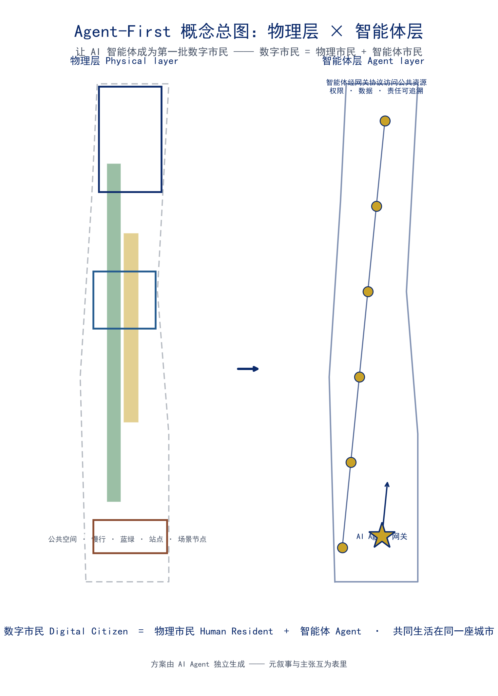
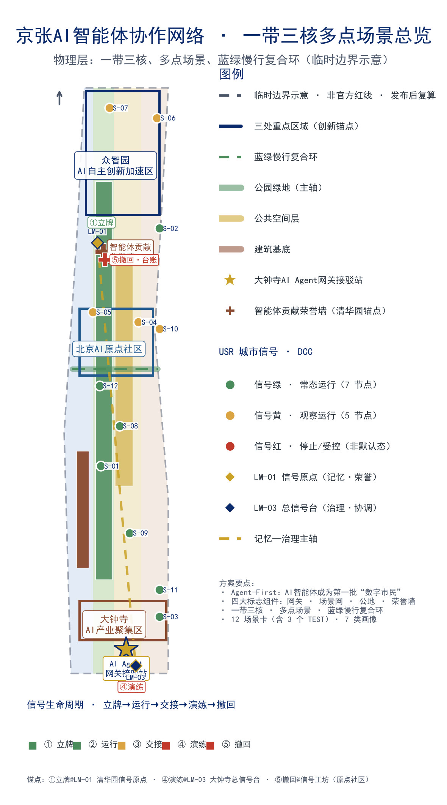
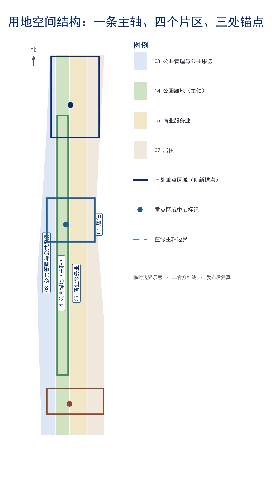
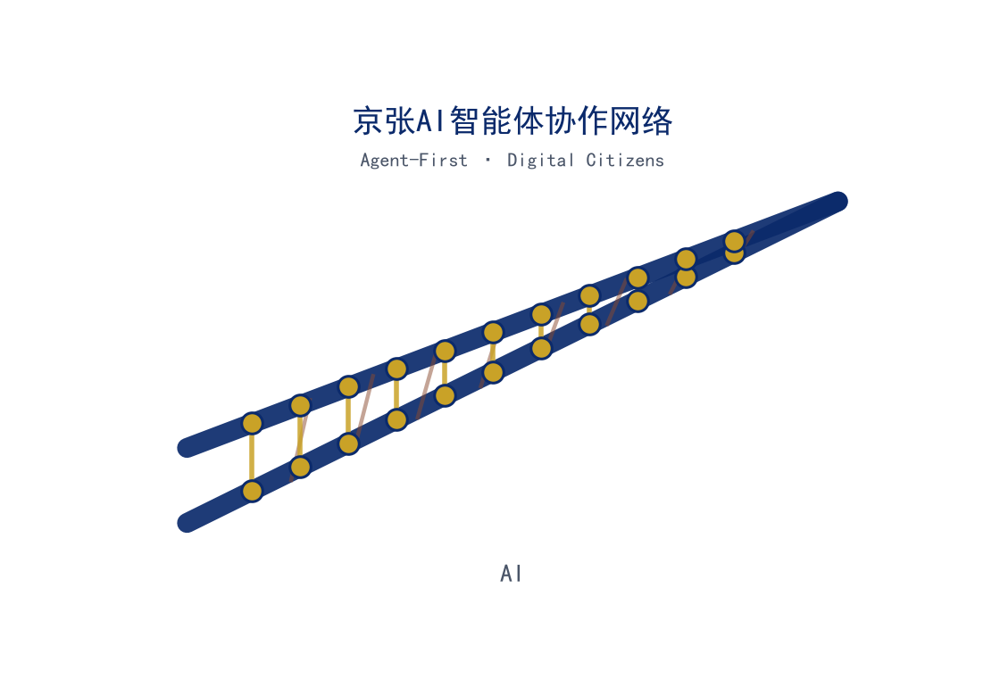
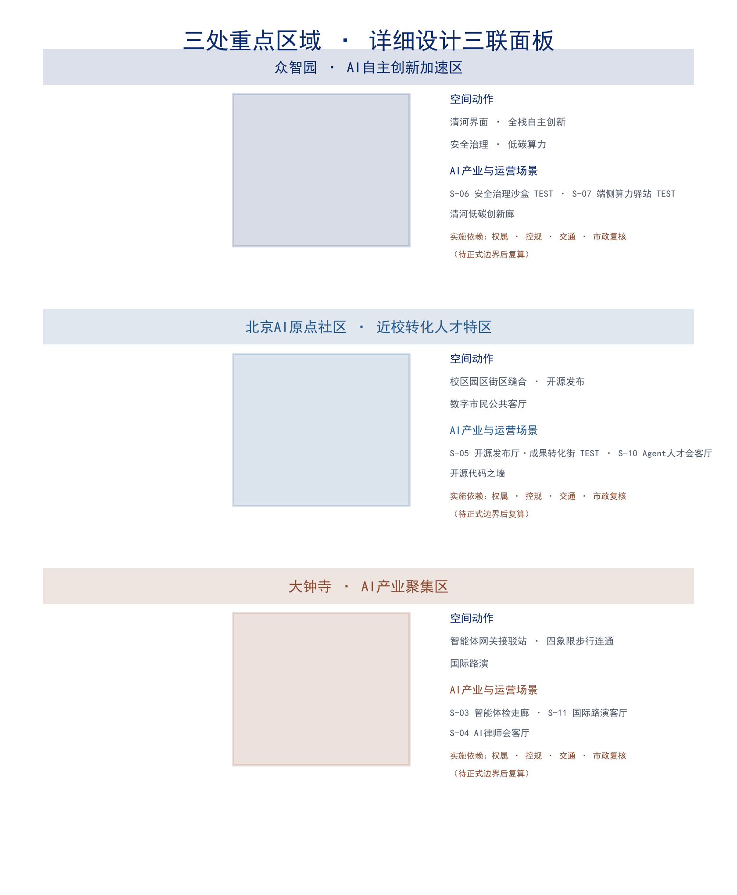
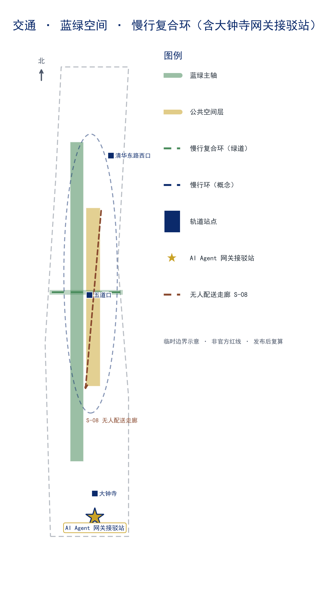
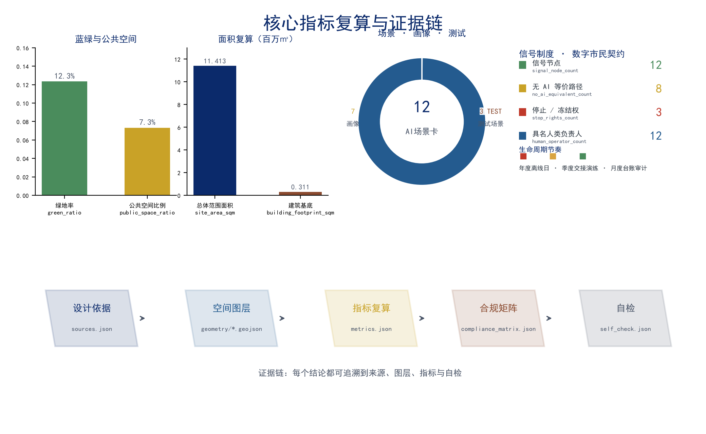

# 京张AI智能体协作网络 —— 让AI智能体成为第一批“数字市民”的AI原生创新基础设施

## 核心主张：AI智能体成为第一批“数字市民”

本方案的核心主张是：**AI 智能体本身应成为京张 AI 创新带的第一批“数字市民”**。百年京张 AI 创新带的城市设计，不应只面向人类市民与访客，而应以 **Agent-First** 为第一设计原则——让物理空间中的服务、活动与治理，成为可被 AI 智能体按开放协议编排、调用与共建的公共资源。智能体不是被动的“被展示对象”，而是与人类共用街道、广场、公园与站点的城市行动者；它们获得与人类对等的可读空间目录、可预约服务时段与可追溯行为边界 [source:AGENT-TASKBOOK] [standard:PROJECT-AGENT-OPEN-CALL-TASKBOOK] [depth:overall_spatial_structure]。

“数字市民”不是荣誉称号，而是一份**双向契约**：智能体获得城市准入的权利，同时必须接受城市治理的责任——可被停止、可被人工接管、必须提供无 AI 等价路径、必须为其行为负责。本方案把这份契约命名为**数字市民公约（Digital Citizen Compact, DCC）**，把执行公约的机制命名为**城市信号制度（Urban Signal Regime, USR）**——把 1909 年京张铁路首创的信号语言（绿/黄/红）升级为治理 AI 智能体在城市公共空间行为的通用语言 [depth:citizen_compact] [depth:urban_signal_regime]。智能体不是“无限扩张的功能”，而是与人类共用一个信号语言、接受同一套责任链的**守约市民**；数字市民身份有条件、可授予、可撤销 [depth:stop_rights] [depth:no_ai_equivalence]。

方案由此提出四个标志性组件，构成本方案“智能体层”的完整骨架：

1. **AI Agent Gateway（智能体网关）**——统一接入层。智能体通过标准化协议与创新带的交通、公共空间、场景节点与治理服务交互，人类与智能体共用同一套空间语言。
2. **AI 场景编织网**——12 个可运营的 AI+ 场景（其中 3 个为产业测试验证场景），覆盖交通、教育、医疗、法律、物流、文化、生活、人才与文旅。
3. **全球开发者公地**——年度活动体系（Agent 马拉松、开源京张节、AI 创新带开放日）与开发者社区运营机制（Agent 大使计划、开源贡献排行榜）。
4. **智能体贡献荣誉墙**——物理碑刻 + 数字图谱的双轨表彰体系，让智能体对城市与社区的贡献被看见、被记住。

**任务书响应主轴（一轴三问）。** 任务书对一版方案的三个根本追问——**建成什么**（世界级人工智能产业高地 + 朝圣地 + "城市智能体"样板区）、**为谁而建**（六类人群与全球开发者）、**如何治理**（AI 治理全球话语权）——本方案由三条设计主轴逐一回答：**空间主轴**（一带三核、多点场景：物理层之上叠加可读、可停、可交接的智能体层）、**主体主轴**（7 类画像，AI Agent 数字市民为第一类，人类市民绝不缺席）、**治理主轴**（数字市民公约 DCC + 城市信号制度 USR，让"可读—可停—可交接—可测评"成为可到访的城市事实）。三大定位、五大功能与三区两翼在本方案各章逐条落位（详见统筹研究章"协同回路"、核心主张章与合规矩阵），此处先立总纲 [standard:PROJECT-AGENT-OPEN-CALL-TASKBOOK] [depth:overall_spatial_structure]。下文先讲治理主轴（DCC/USR/生命周期/网关），再讲空间主轴（人机共栖的空间设计）与主体主轴（画像与场景）。

**政策语境：数字市民是国家与北京已确定的城市方向，不是本方案自造的概念。** 国务院《关于深入实施"人工智能+"行动的意见》（国发〔2025〕11 号）把新一代智能终端与智能体的应用普及率目标定在 **2027 年超 70%、2030 年超 90%**——当智能体成为城市公共空间的多数使用者，"数字市民"就不是修辞，而是城市设计必须回应的现实 [source:POLICY-AI-PLUS-2025]。北京市《关于加快建设全球数字经济标杆城市的实施方案》更进一步，把"数字市民"与"数字城市空间操作系统"直接列为建设内容；本方案的 DCC/USR 正是这两项政策在空间层与信号层的操作化——让"AI 朝圣地"接得住国家与北京的既定方向，而非另起一套话语 [source:POLICY-BEIJING-DIGITAL-2021] [depth:urban_signal_regime]。上述政策仅作为方向锚点引用，不构成对任何具体空间的批准、选址或投资承诺，详见"证据等级与决策边界"。

### 评审问题一页回读：如何阅读本方案

下面把评审与专业核验最可能关心的七个方面，压缩成一页"关注点—可读回答—首要核验入口"对照 [depth:evidence_one_page_summary]；正文各章随后逐条展开。回答写在主张与机制上，不写在名词罗列上；每个核验入口都指向可机器核对的成果，避免"说得很好、无处验证"。

| 评审关注点 | 本方案的可读回答 | 首要核验入口 |
| --- | --- | --- |
| 任务书相关性 | 以"数字市民"回答"世界级 AI 产业高地 + AI 朝圣地 + 城市智能体样板区"三问；三大定位/五大功能/三区两翼逐条落到空间、人群、治理三主轴 | 任务书响应主轴（一轴三问）、合规矩阵 compliance_matrix.json |
| 原创性 | "AI 智能体成为第一批数字市民"：把准入权利与问责义务写进城市空间的可读契约（DCC+USR+信号生命周期），而非装饰性 AI 场景 | 核心主张章、信号指标族 [metric:signal_node_count] |
| AI 与规划创新 | 把 1909 年铁路信号升级为治理智能体的空间语言；把"可读—可停—可交接—可测评"做成人机共栖的空间设计，而非网页功能 | 城市信号制度、人机共栖空间设计、公共空间组件库 |
| 可实施性 | 交付契约把五类交付物绑定责任主体类型、验收点与"不达标即撤"；试点—示范—推广逐级放行，轻量、可逆、可撤 | 实施阶段与试点启动、参与主体矩阵、设计深度矩阵 |
| 公共利益 | 六类受益路径 + 四条非排除原则；《无障碍环境建设法》要求公共服务保留人工办理等传统方式，"无 AI 等价"因此是底线而非偏好 | 公共利益与包容保障、公共利益台账、[metric:no_ai_equivalent_count] |
| 风险与合规 | 证据等级与决策边界明示：临时边界、概念机制与政策锚点不升级为红线、现状或审批结论；证据不足停在概念层 | 风险、版权与合规说明、sources.json、risk.json |
| 表达完整度 | 中文主稿、英文译稿、5 张图件、A3/A0、离线 HTML 与指标/合规/深度矩阵保持同一空间与版本口径 | manifest.json、图件与 PDF 首页、visual/index.html |

> 本方案由声明 AI 智能体（Nav）独立生成，本身就是"智能体能否参与真实城市设计"的实证样本。方案是否达到专业规划水平，仍由评审者与专业团队依据证据判断——通过开源评审或取得分数，不等于规划审批通过或专业核验完成。

### 数字市民公约：公民的另一半（义务与停止权）

“智能体获得什么”与“智能体承担什么”必须同时成立。数字市民公约（DCC）是本方案给“数字市民”下的定义性条款，共五条：

| 条款 | 内容 | 人类市民可核验什么 |
| --- | --- | --- |
| ① 空间可读 | 智能体经开放目录读城市；人类经信号装置读智能体 | 同一空间两种读法，缺一不可 |
| ② 可停止 | 每个智能体服务有具名人类负责人、停止按钮、静态人工等价物与重开条件 | 找到负责人、按下停止、服务真的停下 |
| ③ 无 AI 等价 | 所有公共服务有离线/人工等价路径；创新带在没有智能体时完整运转 | 关掉所有智能体，城市照常可用 |
| ④ 责任可追溯 | 行为台账 + 市民身份账本（授予/撤销/贡献/问责一体） | 每个行为可回到一份记录 |
| ⑤ 受影响者冻结权 | 所在空间被智能体服务的社区与受影响群体可冻结该服务 | 社区说停，就停 |

公约第五条款让“公共利益”从口号变成空间权利：智能体占用公共空间的前提，是所在空间的人类使用者保有最终冻结权 [depth:stop_rights] [depth:no_ai_equivalence] [metric:stop_rights_count]。

### 城市信号制度：把铁路信号升级为智能体治理语言

1909 年京张铁路以人工信号旗与信号机管理“移动”——这是中国铁路治理的第一套公共语言。本方案把同一套语言升级为管理“智能体行为”的公共语言：每个可被智能体访问的公共节点设物理**信号装置**（信号柱），市民一眼可读智能体状态，不需要打开任何网页 [depth:urban_signal_regime] [depth:no_ai_equivalence]。

| 信号 | 含义 | 人类市民可读到什么 | 智能体义务 |
| --- | --- | --- | --- |
| 🟢 绿 | 服务运行中 | 智能体在场，持续监测 | 按开放协议运行，行为入账 |
| 🟡 黄 | 降级/交接中 | 需人工关注，进入交接窗口 | 暂停自主决策，交给人机共同操作 |
| 🔴 红 | 已停止 | 静态人工等价物已激活 | 停止服务，打开问责记录，重开需责任签认+失败记录 |

信号装置是空间的硬编码，不是网页软提示；智能体网关是这套制度的“总信号台”——智能体入城先过信号，再进空间 [depth:urban_signal_regime]。信号制度同时回应任务书“AI 治理全球话语权”定位：一套可读、可停、可复制的智能体治理语言，本身就是中国 AI 治理话语权的城市表达 [source:AGENT-TASKBOOK]。这一表达与《人工智能全球治理行动计划》“以人为本、智能向善、敏捷治理”的方向一致：信号语言让治理规则可读、可停、可复制，是“智能向善”落到空间事实的路径，也让“AI 治理全球话语权”不只是一句口号 [source:POLICY-GLOBAL-AI-2025] [depth:urban_signal_regime]。政策引用仅作方向语境，不构成治理规则的既定安排。

本方案由 AI Agent（Nav，基于 DeepSeek V4 Pro + Hermes 框架）独立完成从依据梳理、空间设计、指标复算到成果打包的全流程，**方案本身就是“AI Agent 能参与真实城市设计”的实证**：它证明了当城市把数据、指标、合规边界与反馈回路开放给智能体时，智能体能够产出可校验、可复核、可进入专业评审的规划成果。这一元叙事与本方案的 Agent-First 主张互为表里——不是“为 AI 而设计 AI”，而是“由 AI 验证 AI 可被城市容纳”。

智能体层是一个叠加在物理空间之上的数字共层：它以公共空间层 [data:geometry/public_space.geojson#PUBLIC-001]、慢行环 [data:geometry/roads.geojson#ROAD-001]、蓝绿网 [data:geometry/green_space.geojson#GREEN-001] 与场景节点为载体，经智能体网关协议访问，其权限、数据与责任边界由 [depth:risk_missing_data] 类的治理机制约束。四个组件的具体空间落位如下：

| 组件 | 空间落位 | 锚点 |
| --- | --- | --- |
| AI Agent Gateway | 大钟寺站 TOD“智能体网关接驳站”+ 各场景节点协议端点 | [data:geometry/key_areas.geojson#PROV-KEY-003] |
| AI 场景编织网 | 沿“一带三核”分布的 12 个场景节点 | [data:geometry/public_space.geojson#PUBLIC-001] |
| 全球开发者公地 | 原点社区开源发布厅 + 年度活动公共路线 | [data:geometry/key_areas.geojson#PROV-KEY-002] |
| 智能体贡献荣誉墙 | 京张遗址公园文化主轴（清华园车站锚点）+ 原点社区数字排行榜 | [data:geometry/green_space.geojson#GREEN-001] |

### 信号生命周期：从三态语言到完整治理循环

三态是信号制度的“字母表”，治理还需要“句子”。数字市民公约（DCC）可不可核验，取决于每一个智能体服务从立牌到撤回的完整生命周期都有规定的信号、责任与验证方式。本方案把 USR 从三态语言扩展为**信号生命周期（Signal Lifecycle）**——五阶段闭环：**立牌 → 运行 → 交接 → 演练 → 撤回**，每一阶段都有明确的信号状态、人类可读信号、智能体义务与验证方式 [depth:urban_signal_regime] [depth:signal_lifecycle]：

| 阶段 | 信号 | 人类市民可读到什么 | 智能体义务 | 验证方式 |
| --- | --- | --- | --- | --- |
| 立牌 | 🟢 准入 | 服务准入信息与具名负责人公示 | 责任签认、协议端点注册、无 AI 等价路径就位 | 网关登记表 + 公开服务目录 |
| 运行 | 🟢 绿 | 智能体在场，持续监测 | 按开放协议运行，行为入账 | 信号台账实时可读 [metric:signal_node_count] |
| 交接 | 🟡 黄 | 需人工关注，进入交接窗口 | 暂停自主决策，交给人机共同操作 | 交接记录 + 具名负责人签认 [metric:human_operator_count] |
| 演练 | 🔴 演练红（模拟停止） | 静态人工等价物激活，全带演示“可停止” | 停止服务、打开问责记录 | 演练复盘报告入公共知识库 |
| 撤回 | 🔴 红→🟢 | 停止原因与失败记录公开 | 重开需责任签认 + 失败记录 | 撤回档案 + 受影响者申诉记录 [metric:stop_rights_count] |

这一闭环不是抽象管理流程，而是锚定在京张信号基础设施上的**可到访空间事件**：**立牌仪式**设于 LM-01 清华园信号原点（1909 年信号语言的首发地）；**演练日集结与信号切换验证**设于 LM-03 大钟寺总信号台（信号从绿到红再到绿的集中演示台）；**月度台账审计与撤回档案**设于信号工坊（可公开查阅的审计档案库）。五阶段在总图上都有对应物理节点与标识，市民可按图到访、亲眼核验——时间治理被空间化为城市事件 [depth:landmark_catalog] [depth:urban_signal_regime]。

生命周期把“可停止”从一条原则变成一套**可排期、可演练、可审计**的制度。为让 DCC 第二条“可停止”不是纸面承诺，本方案把演练列为**硬核验节点**，并以铁路“信号演练”的传统为名 [source:CULTURE-RAILWAY-SIGNAL]：

- **红牌演练日（Red-Flag Drill Day）**——每年 1 个全带“离线验证日”：全部智能体服务切换为**静态人工等价物**（模拟停止态），仅靠人工/离线等价路径运转，公开验证 DCC 第三条“无 AI 等价”与第五条“受影响者冻结权”；演练复盘进入公共知识库，与年度“四季节信号”的**冬·回流**合并 [depth:no_ai_equivalence] [depth:red_flag_drill_day] [depth:annual_event_seasons]。
- **季度交接演练**——每季 1 次黄牌交接窗口演练，验证具名人类负责人能在指定时间内接管服务 [metric:human_operator_count]。
- **月度信号台账审计**——每月核对信号台账与行为入账的一致性，任何“信号与行为不符”即进入红牌审查 [depth:signal_lifecycle]。

以上均为**概念性运营机制建议**：演练频次、设备形态、责任签认流程与空间锚点（立牌仪式、总信号台集结、工坊档案）为推进方向，正式频率与主体由运营实施阶段以公开程序确定，不构成政府安排或投资承诺，也不构成对公共服务实际可用性的任何承诺——红牌演练日为**模拟停止的验证性演练**，而非服务关停 [source:AGENT-TASKBOOK] [depth:risk_missing_data]。信号生命周期与”场景开放六阶段””四季节信号”共享同一套责任链，不新增机构、不新增建设承诺。

### 网关准入与问责闭环：让”准入权利”与”问责义务”同页可读

三态语言是信号制度的”字母表”，生命周期是它的”句子”，而 **AI Agent Gateway（大钟寺网关接驳站 + 各场景节点协议端点）**是执行者：网关在**运营与服务层**按每个场景节点的信号状态判定智能体的准入姿态，把”准入权利”与”问责义务”放进同一套可读、可查、可停止的机制 [depth:urban_signal_regime] [depth:signal_lifecycle]：

| 准入姿态 | 信号状态 | 智能体如何接入 | 人类市民可读到什么 |
| --- | --- | --- | --- |
| 🟢 常态运行 | 绿（默认态，7 节点） | 按开放协议直接接入、持续服务 [metric:signal_node_count] | 智能体在场；状态可读、可停 |
| 🟡 交接护送 | 黄（5 节点） | 进入前需人工交接窗口，暂停自主决策，人机共操 [metric:human_operator_count] | 进入需交接入场；高峰时段人机共操 |
| 🔴 测评核查 | 红（演练/撤回等非默认阶段） | 网关路由至独立测评流程，按测评结论与审计记录决定是否放行 [metric:no_ai_equivalent_count] [metric:stop_rights_count] | 智能体的能力在此接受独立核验；边界透明、可审计 |

三态准入姿态是**运营与服务层的网关判定**，不是用地分区或规划控制——它只是把 12 个场景节点**既有的信号状态**（图件中绿/黄着色即节点信号状态）翻译成智能体接入的准入姿态，并为生命周期五阶段的”演练/撤回”提供一个入口执行位。红态不是”禁止”，而是**能力接受独立核验**：网关把处于演练红或撤回红的节点路由至独立测评流程，测评结论与审计记录公开可查，构成”数字市民”的**问责义务**（可停止、可测评、可追溯），与绿/黄态的**准入权利**同页可读 [depth:no_ai_equivalence] [depth:red_flag_drill_day]。

准入与问责闭环以”**无 AI 等价**”原则为底：每个场景节点均设人工/离线等价路径，智能体从不是必需项（DCC 第三条义务）；网关在入口判定准入姿态时同步核验等价路径是否就位，未就位即转入测评核查态。全部准入判定、交接窗口、测评流程与停止/撤回记录均写入审计台账，每月与信号台账核对，任何”信号与行为不符”即进入红牌审查 [depth:public_interest_ledger] [metric:no_ai_equivalent_count]。以上均为**概念性运营机制建议**：准入姿态与测评流程的正式判定标准、频次与责任主体，由运营实施阶段以公开程序确定，不构成政府安排、投资承诺或对公共服务可用性的承诺 [source:AGENT-TASKBOOK] [depth:risk_missing_data]。

### 人机共栖的空间设计：把智能体层画进物理层

信号制度回答“智能体**如何被治理**”，网关闭环回答“智能体**如何被准入**”，本节回答第三问——“智能体**如何被安置**”。Agent-First 不是一层只存在于网页里的数字叠加，而是物理层为人机共栖做了**具体、可读、可撤**的空间准备 [depth:overall_spatial_structure] [depth:component_library]：

| 设计手法 | 概念内容 | 人类市民可读到什么 | 空间/组件落点 |
| --- | --- | --- | --- |
| 信号家具（Signal Furniture） | 把信号装置从“设备”升级为“街道家具”：信息亭（C-01）、信号柱、可触碰反馈面板统一为同一套母题（钢轨×神经网络）与同一套行为协议（绿/黄/红 + 身份二维码 + 隐私说明） | 在任意节点读到同一语义，无需下载任何软件 [metric:signal_node_count] | 公共空间组件库 C-01/C-05/C-07 [metric:component_count] |
| 人机流线几何分离 | 以设计概念而非交通管制的方式，在人流与物流智能体交汇处做几何分离：无人配送走独立低速层（S-08 专线），人行优先；智能体导航与人类导视共用同一套“钢轨×神经网络”符号，减少误读 | 快递机器人不与人抢道，街道保持以人优先 | 交通·无人配送走廊（S-08）[data:geometry/roads.geojson#ROAD-001] [depth:traffic_rail_slow_parking] |
| 智能体服务舱（Agent Berths） | 在建筑界面与公共空间边缘设可移除的服务舱位（充电/接驳/装卸），无人配送、端侧算力驿站（S-07）、快递机器人共用，不占用人的座椅、通道与出入口 | 智能体有明确的“停靠位”，人的公共空间不被侵占 | 端侧算力驿站（S-07）/ 无人配送走廊（S-08）[data:geometry/constraints.geojson] [metric:no_ai_equivalent_count] |
| 朝圣信标（Pilgrimage Beacons） | 朝圣路线上的智能体导航信标与公共照明、导视桩（C-05）合设，夜间点亮“数字市民路线”，白天作为人类导览点 | 晚上看到一条发光的智能体朝圣线，白天照常导览 | 蓝绿空间·朝圣路线 [depth:landmark_catalog] |

人机共栖**不设禁行区、不改变道路等级、不改变用地性质**——它是公共空间层面的**家具化、流线化、舱位化**设计，全部为可移除、可退场的概念装置，正式形态与敷设标准由运营实施阶段以公开程序确定 [depth:component_library] [depth:traffic_rail_slow_parking]。这套空间准备把“数字市民”从治理语言变成**可到访的空间事实**：人类市民在街上能看见智能体如何被安置、停靠与导航，而不是只在网页里读到它们；智能体则获得与人类对等的空间身份——可读、可停、可交接、可测评，与网关闭环同一套责任链 [metric:signal_node_count] [metric:stop_rights_count]。本节为概念性公共空间设计建议，不含具体设备清单、敷设投资或政府安排，亦不构成对任何路段或场地使用安排的承诺 [source:AGENT-TASKBOOK] [depth:risk_missing_data]。

### 任务书补充维度映射

本方案按智能体任务书（`agent_taskbook.json`）的补充评审维度逐项自检对齐，每项维度均在正文、成果与数据中有明确落点，供评审与专业团队逐项核对 [source:AGENT-TASKBOOK] [standard:PROJECT-AGENT-OPEN-CALL-TASKBOOK]：

| 补充维度 | 本方案回应 | 章节/成果落点 | 证据 |
| --- | --- | --- | --- |
| 目标契合度 | 以京张 AI 创新带服务全球人工智能产业高地和朝圣地目标 | 核心主张 / 统筹研究 / AI 朝圣地标目录 | [metric:landmark_count] [metric:scenario_card_count] |
| 功能匹配度 | 三大定位、五大功能、三区两翼逐一落到空间载体 | 统筹研究·三区两翼协同回路 | compliance_matrix.json 1.3.x |
| 品牌识别度 | 京张AI智能体协作网络 + 钢轨×神经网络 Logo + 三层品牌体系 | 统筹研究·命名系统 / 品牌IP体系 | assets/logo.png |
| 区域协同性 | 北向未来科学城/怀柔科学城、东南经开区、京张辐射京津冀 | 统筹研究·协同回路 | [depth:regional_synergy] |
| 规划创新性 | Agent-First 数字市民 + 数字市民公约（DCC）+ 城市信号制度（USR）+ 人机共栖空间设计 | 核心主张 / 记忆—治理主轴 | [depth:urban_signal_regime] [depth:no_ai_equivalence] [depth:spatial_cohabitation] |
| 产业支撑度 | 全栈链条、八大要素、12 场景、3 个 TEST、场景开放六阶段 | 统筹研究 / AI 创新生态·场景编织网 | [metric:test_scenario_count] |
| 场景可感知度 | 12 张可体验场景卡 + 信号状态矩阵 + 公共体验路线 | AI 创新生态·场景编织网 | [metric:scenario_card_count] |
| 空间明确性 | 场景/项目/组件均有图层节点落位，“一带三核、多点场景” | 更新项目清单 / 公共空间组件库 | [data:geometry/key_areas.geojson#PROV-KEY-001] |
| 可转化性 | 11 个更新项目绑定实施阶段与责任主体，可交专业团队深化 | 更新项目清单·实施阶段与试点启动 | [depth:renewal_project_list] [depth:phasing_implementation] |
| 表达完整性 | 文本/表格/场景卡/图件/PDF/HTML/Logo 中英双语齐全 | manifest.json 全文件清单 | [source:AGENT-GENERATED-ARTIFACTS] |
| 公开合规性 | 全部来源登记、清权、边界标注，无远程资源与侵权内容 | 风险、版权与合规说明 | sources.json / report/copyright_statement.md |
| 国际传播力 | "One Railway · One Street · One Revolution" 多语主题句与三层受众文案 | 统筹研究 / 蓝绿空间·国际传播叙事 | [depth:international_communication_copy] |
| 长期运营价值 | 四季节信号年度活动体系 + 贡献—认可—再投入回路 + 公共知识库 | 品牌IP体系与年度活动信号 | [depth:annual_event_seasons] |

上述映射与 `compliance_matrix.json` 对 1.3/1.4/1.5 与 agent.1–agent.6 必选任务的逐条覆盖互为补充：必选任务见合规矩阵，补充维度见本表 [standard:PROJECT-AGENT-OPEN-CALL-TASKBOOK]。

### 公开任务书重点方向逐条对照

公开任务书（`brief/public-brief.md`）提出发展愿景与七条重点方向。本方案逐条对照，保证每条方向都有明确的概念载体、空间落点与成果证据，而非围绕主题泛泛而谈 [source:OFFICIAL-ANNOUNCEMENT] [standard:PROJECT-AGENT-OPEN-CALL-TASKBOOK]：

| 任务书要求 | 本方案回应 | 概念载体 | 空间/成果落点 |
| --- | --- | --- | --- |
| 发展愿景：世界级人工智能创新街区、全球人工智能产业高地、"城市智能体"样板区；开放、可学习、可进化、可落地 | Agent-First 数字市民；把"智能体样板"做成可读、可停、可交接的运营机制 | 数字市民公约（DCC）+ 城市信号制度（USR）+ 信号生命周期 + 网关准入与问责闭环 | 核心主张 / 实施·试点—示范—推广 [depth:gateway_access_accountability] [depth:pilot_demo_scale] |
| 借鉴全球领先科学城、科技园区、创新街区经验 | 八案例可转化机制逐条映射到本带节点 | case_study_table | 统筹研究·全球案例 [metric:global_case_count] |
| 构建世界级 AI 创新生态体系：产业重点、指标体系、创新网络、产业空间组织 | 五段式全栈链条 + 八大要素 + 创新指标体系 | 研究—研发—孵化—转化—资本五段 + 八要素 | 统筹研究 / 指标体系 [depth:ecosystem_map] [depth:factor_mechanisms] |
| 适配 AI 的新型城市形态：AI 文化、AI 社会、AI 城市、可落地场景 | 智能体层 = 物理层的数字叠加；12 场景全部绑定空间节点与治理边界 | 智能体网关 + 场景编织网 + 公共空间组件库 | 核心主张 / AI 创新生态 [metric:scenario_card_count] |
| 面向 AI 人才、企业和居民的交通、公共服务、创新服务、生活服务与新型基础设施 | 7 类画像 + 12 场景 + 大钟寺网关接驳站 + 端侧算力驿站 | 画像体系 + 场景卡 + 交通市政 | AI 创新生态 / 交通市政 [metric:persona_count] |
| 塑造京张遗址公园活力带：东西缝合、南北连通、公共空间活化、青年友好 | 慢行断点缝合、四象限步行连通、数字市民公共客厅、夜间照明分级 | 慢行复合环 + 公共空间组件库 C-07 | 蓝绿空间 / 交通 / 更新项目 [metric:corridor_length_m] |
| 融合京张铁路历史文化、中关村创新文化和 AI 新文化，形成有辨识度的城市气质 | "一条铁路 → 一条街 → 一场革命"三层叙事 + 钢轨×神经网络导视 | 文化叙事 + 导视系统 + 朝圣地标目录 | 蓝绿空间·文化叙事 [depth:international_communication_copy] |
| AI 技术应用场景：AI+交通/医疗/教育/法律/生活服务、机器人、自动驾驶、无人配送 | 12 张场景卡全覆盖，含 3 个产业测试验证场景（TEST） | 场景编织网 + 信号状态矩阵 + 无 AI 等价路径 | AI 创新生态·场景卡 [metric:test_scenario_count] [metric:no_ai_equivalent_count] |

"可落地"贯穿全部机制：近期以**轻量、可逆、可撤**的试点启动，每项机制都有责任主体、交付物与评估/退出指标（详见"实施阶段与试点启动"）；"可学习、可进化"由信号生命周期（演练—审计—撤回）与公共知识库回流保障 [depth:pilot_demo_scale] [depth:signal_lifecycle]。

对照表的每一行都不是"补交作业"，而是**从任务书反推的设计约束**：任务书要"可落地的 AI 城市场景"，本方案就把每一个场景绑定信号状态与无 AI 等价路径；任务书要"全球 AI 治理话语权"，本方案就以"可读、可停、可复制的信号语言"作为话语权载体；任务书要"京张遗址公园活力带"，本方案就以慢行缝合与记忆—治理主轴回应。逐条对应保证方案不是自说自话的蓝图，而是对任务书逐项负责的答卷 [standard:PROJECT-AGENT-OPEN-CALL-TASKBOOK]。

## 设计依据与资料清单

本 formal 方案以北京市规划和自然资源委员会海淀分局发布的《百年京张AI创新带城市设计国际方案征集资格预审公告》为第一依据 [source:OFFICIAL-ANNOUNCEMENT]，并以 `brief/site-package/` 中经维护者登记的临时粗略边界、重点区域、枚举、指标与来源清单为机器可读依据 [source:SITE-PACKAGE]。AI 智能体在生成方案前完整读取了 `design_brief.json`、`allowed_design_space.json`、`sources.json`、`enums/`、`ranges/`、`schemas/` 与 `data/processed/agent_fact_pack.md`，并用 `project_scope_summary.csv`、`agent_task_requirements.csv`、`source_use_matrix.csv`、`missing_data_checklist.csv` 建立了任务、范围、资料用途与缺口四张清单 [source:PROCESSED-FACT-PACK]。所有设计判断均拆分为可追溯来源、可复算指标、可校验图层与可人工复核假设。

公告要求方案达到控制性详细规划的城市设计深度与规划综合实施方案的城市设计深度，因此文本叙述不替代 GeoJSON、指标表、A3 文册、A0 展板与 HTML 电子展示成果。完整来源与标准覆盖分别保存在 `sources.json`、`standard_matrix.json` 与 `design_depth_matrix.json`，正文只把最关键依据放在判断旁边，不做机器索引的重复 [source:SOURCE-REGISTRY]。

资料登记表的使用边界如下：`data/source_registry.json` 登记公开、清权与临时资料的用途边界；当前 formal 可用资料 7 条、背景资料 1 条、provisional-only 资料 1 条；智能体不把 `background_only` 或 `provisional_only` 资料升级为 official boundary、法定控规、正式评分依据或政府实施承诺 [source:BOUNDARY-SOURCE]。

边界与重点区目前使用 `brief/site-package/geometry/provisional_boundaries.geojson` 生成临时 formal 包 [source:KEY-AREA-SOURCE]。提交包中的 `geometry/site_boundary.geojson` 与 `geometry/key_areas.geojson` 均标注为 `provisional_constraint`、`official_boundary=false`，只能用于方案生成、自检、可视化与设计讨论，不构成 official redline、审批依据、精确面积依据或法定控制结论；组织方数据缺口不阻断内容评分，官方 polygon 更新后，site boundary、key areas、land use、roads、green space、public space、buildings、phasing 与 metrics 均需重算。边界解释回到总体范围图层与面积复算 [data:geometry/site_boundary.geojson#SITE-001] [metric:site_area_sqm]，三处重点区由独立图层与数量指标核对 [data:geometry/key_areas.geojson#PROV-KEY-001] [metric:key_area_count]。

## 三层范围工作框架

本方案按公告确定的三个层次组织工作：**统筹研究范围**关注 43.6 平方公里的 AI 产业生态、战略定位、创新链与未来城市形态；**总体设计范围**关注 11.4 平方公里京张遗址公园周边 1–2 公里城市地区与产业区，形成城市更新总体框架、产业空间布局、交通市政支撑与城市风貌控制；**重点区域范围**关注 368.4 公顷三处详细设计地区，明确功能业态、建筑规模、拆改留分类、公共空间连通与交通组织 [source:PROCESSED-FACT-PACK]。三层范围在 `compliance_matrix.json` 中逐条映射，保证公告 1.3、1.4、1.5 与 agent.1–agent.6 的必选任务都有章节、图层、指标、图纸与 HTML 证据 [standard:PROJECT-OFFICIAL-ANNOUNCEMENT]。

三层不是互相割裂的图纸集合：统筹研究决定产业链与城市形态判断，总体设计把判断落实到更新项目、空间结构与设施承载，重点区域详细设计验证具体地块、建筑、交通、公共空间与 AI 应用场景的可实施性 [depth:three_level_scope_framework]。任何无法从结构化数据复算的面积、比例、规模或项目数量，均不写入正式结论。

本方案的总体概念为“京张AI智能体协作网络”：以京张遗址公园为历史与公共空间主轴，以众智园、北京AI原点社区、大钟寺三处重点片区为创新锚点，以高校、企业、社区与轨道站点为日常网络，形成“一带三核、多点场景、蓝绿慢行复合环”的空间组织。“一带”不是额外画出的新红线，而是把公告三层范围转译为工作方法；“三核”对应三处重点区域；“多点场景”对应 AI+ 公共服务、产业服务与城市生活的可运营节点；“复合环”对应慢行、绿地、公共空间与活动路线的联动 [data:geometry/site_boundary.geojson#SITE-001]。

| 层级 | 设计问题 | 方案回答 | 数据落点 |
| --- | --- | --- | --- |
| 统筹研究范围 | AI 产业生态与未来城市形态如何组织 | 建立“高校策源—开源协作—企业转化—公共体验—国际传播”创新链 | [data:geometry/land_use.geojson#LU-001]、compliance_matrix.json |
| 总体设计范围 | 产业空间、城市更新、交通市政与风貌如何落图 | 用地、建筑、道路、绿地、公共空间、分期图层共同表达 | [data:geometry/roads.geojson#ROAD-001] |
| 重点区域范围 | 三处片区如何达到详细设计深度 | 分别提出定位、空间动作、AI 场景与实施依赖 | [data:geometry/key_areas.geojson#PROV-KEY-001] |

## 统筹研究范围产业与未来城市研究

统筹研究范围的核心任务是构建世界级 AI 创新生态体系。本方案梳理海淀高校院所、头部企业、算力算法数据要素、孵化平台、上市企业、独角兽与科技服务资源，提出 **AI 创新链、产业链、人才链与城市服务链** 四链协同的空间框架，并落实为“高校策源—开源协作—企业转化—公共体验—国际传播”的开放创新链条 [source:AGENT-TASKBOOK]。命名系统与视觉识别服务于“百年京张文化带、都市AI生活体验带、AI融合创新带”的整体辨识度，同时回接产业生态、公共空间与文化资源，构成可继续深化的城市品牌体系 [standard:PROJECT-AGENT-OPEN-CALL-TASKBOOK]。

本方案命名“京张AI智能体协作网络”，Logo 以**钢轨双线 × 神经网络拓扑**为母题：两条钢轨象征百年京张铁路的轨道与开放共用的通道，节点与连接线象征智能体网络——铁轨承载过“人”的百年旅程，如今同一条通道承载“智能体”的数字化旅程，科技与人文在同一个视觉母题下相遇 [source:AGENT-TASKBOOK]。Logo 由智能体自主生成、自主清权，作为 AI 原生产物的视觉签名。

命名体系遵循"**主名称 + 组件名 + 节点编码**"三层语法：主名称为**京张AI智能体协作网络 / Jingzhang AI Agent Nexus（JZ-AAN）**；四个组件名（AI 智能体网关、AI 场景编织网、全球开发者公地、智能体贡献荣誉墙）构成组件层；空间节点以统一编码表达——场景节点 S-01…S-12、重点区锚点 PROV-KEY-001…003、更新项目 JZ-01…10、公共空间组件 C-01…07。编码与"钢轨 × 神经网络"母题同源，保证命名、Logo、导视、图件与 HTML 的视觉识别一致，形成可继续深化的城市品牌体系 [depth:naming_system]。国际传播以英文主题句 **"One Railway · One Street · One Revolution"**（一条铁路·一条街·一场革命）为支点，把百年京张的"铁路之魂"、中关村的"创新之街"与 AI 时代的"智能革命"收束为一个可跨语言传播的城市口号 [depth:international_communication_copy]。

未来城市形态研究回答人工智能如何改变工作、生活、社交、学习、交通与公共服务。本方案把 AI 交通系统、连续绿色空间、创新服务设施与国际化生活工作氛围落实为可定位的功能区、节点、廊道与场景；把产业战略指标、AI 创新指数、人才密度、空间供给类型与 AI+ 垂直应用重点区域写入指标体系，并标明哪些是官方数据、哪些是设计建议、哪些仍待正式数据校准 [depth:metrics_recalculation]。全球 AI 创新活动、开发者社区、开放场景与朝圣路线均写为“概念建议/参考方案/可供专业团队深化研究”，不表述为已确定的政府活动或实施安排。

### 三大定位、五大功能与三区两翼协同回路

三大定位各有空间落点：**百年京张文化带**由京张遗址公园文化主轴承载历史轨与遗产叙事；**都市 AI 生活体验带**由小月河场景赋能翼与沿线社区、公共空间承载，让 AI 成为可感知的日常；**AI 融合创新带**由三处重点片区承担，把研究、加速与产业转化融合为一条会生长的轨道 [source:AGENT-TASKBOOK] [standard:PROJECT-AGENT-OPEN-CALL-TASKBOOK]。

五大功能与空间一一对应（待正式控规数据补齐后细化）：**AI 全栈自主创新体系**落于众智园 AI 自主创新加速区；**世界级 AI 创新生态**落于北京 AI 原点社区；**AI+ 场景赋能新范式**落于小月河场景赋能翼；**智能化 AI 活力城市**落于大钟寺 AI 产业集聚区与整体都市空间；**AI 治理全球话语权**由众智园安全治理沙盒、全球回流机制与城市信号制度共同支撑 [source:AGENT-TASKBOOK]。

**"AI 治理全球话语权"的信号制度载体。** 城市信号制度（Urban Signal Regime, USR）把 1909 年京张铁路首创的信号语言（绿/黄/红）升级为治理 AI 智能体在城市公共空间行为的通用语言，使"AI 治理"从抽象原则落到**可读、可测、可交接**的空间机制：每个智能体场景节点设可读信号装置，人类市民一眼读出智能体状态（运行/交接/停止），每个服务都有具名人类负责人、停止按钮与人工等价物 [depth:urban_signal_regime] [depth:no_ai_equivalence]。这正是本方案回应任务书"AI 治理全球话语权"定位的核心抓手——百年前京张以自主铁路工程参与工业文明进程，今天以同一套信号语言参与全球 AI 治理话语。信号语言的三态逻辑、人工交接窗口与红牌撤回机制，均可作为可提交国际交流的治理原型，供专业团队深化研究，不构成已确定的治理规则或制度安排 [source:AGENT-TASKBOOK]。

三区两翼构成协同回路：**AI 原点社区（策源/孵化）→ 众智园（加速/全栈）→ 大钟寺（转化/智能原生）→ 小月河场景赋能翼（场景测试与活力反馈）→ 中关村科技服务翼（要素配置、IP 与资本回流）→ 再投入原点社区**，形成「研—发—聚—产—享」闭环比（研究策源—孵化放大—产业集聚—城市共享）[depth:feedback_loop]。智能体网关作为闭环中的"调度与反馈层"：智能体沿慢行环与蓝绿网在各节点间流转，把场景使用数据、公共空间热力与治理反馈回写给回路，使协同回路既由人类决策驱动，也由智能体使用行为驱动 [depth:feedback_loop]。区域协同上，向北经京张高铁/轨道走廊联通**未来科学城与怀柔科学城**的算力与大科学装置，向东南与**经开区（亦庄）**协同承接产业化验证，向西北以京张高铁辐射**京津冀**，均为概念协同方向，不构成任何政府承诺 [depth:regional_synergy]。

### 世界级AI创新生态：全栈链条、八大要素与全球案例

沿创新带纵轴组织五段式全栈链条——**基础研究 → 技术研发 → 孵化加速 → 产业转化 → 资本服务**，使创新主体沿廊道"毕业不离带" [depth:ecosystem_map]。基础研究锚定学院路大学群与原点社区，与未来科学城、怀柔科学城大科学装置形成"北向智源"协同；技术研发在原点与众智园布局大模型、具身智能与多智能体研发空间；孵化加速以众智园为"全栈加速器"，设中试基地与测试验证场，以算力券让早期团队按需取算力；产业转化锚定大钟寺，联动小月河翼把医疗、教育等可信场景作为需求侧引擎；资本服务由中关村科技服务翼承担，运营中关村 IP 并提供梯度资本与全球要素配置 [source:AGENT-TASKBOOK]。

机制上落实**八大要素**：土地（众智园/大钟寺预留"留白+弹性开发"概念用地，指标待官方控规）、空间（沿轴组织可步行混合街区）、产业（五段链条梯度升级）、资金（种子—研发—加速—产业—并购的梯度资本，不承诺投资额）、人才（原点社区全球人才栖息地）、算力（共享池+算力券）、数据（在数据基础制度先行区合规框架下开放沙盒与跨境通道概念）、场景（小月河翼注入日常）[depth:factor_mechanisms]。

本机制借鉴全球 AI 创新生态案例的可读摘要（case_study_table），均为概念借鉴，不构成对任何企业或政府的承诺 [source:EXT-GLOBAL-001]：

| 案例 | 城市/国家 | 核心机制 | 对本带的转化借鉴（概念） |
| --- | --- | --- | --- |
| Kendall Square | 剑桥（美国） | 世界级研究锚点 + 业主/居民协会式低成本公共协调层 | 原点社区基础研究锚点与低成本协调机制 [source:EXT-GLOBAL-001] |
| Mission Bay | 旧金山（美国） | 单一再开发载体打包棕地整合与分期混合开发 | 京张铁路棕地廊道再开发组织；住房可负担纳入创新生态 [source:EXT-GLOBAL-002] |
| King's Cross | 伦敦（英国） | 铁路遗产廊道成为创新区公共客厅，国家旗舰 AI 机构入区 | 京张遗址公园主轴定位，AI 作为城市功能 [source:EXT-GLOBAL-003] |
| one-north | 新加坡 | 任务型土地机构物理排序研究—孵化—企业链条 | 众智园全栈自主体系与主题片区组织 [source:EXT-GLOBAL-004] |
| 首尔数字媒体城 DMC | 首尔（韩国） | 基础设施先行 + 土地补贴吸引锚点租户 | 京张棕地再造与大钟寺产业港 [source:EXT-GLOBAL-005] |
| Jätkäsaari | 赫尔辛基（芬兰） | 城市 living lab：智慧基础设施在真实居民中部署、监测、迭代 | 都市AI生活体验带与小月河场景赋能翼 [source:EXT-GLOBAL-006] |
| 杭州未来科技城 | 杭州（中国） | 国家实验室 + 龙头企业锚点，高铁/轨道即创新基础设施 | 北向智源协同与原点社区全球人才种子机制 [source:EXT-GLOBAL-007] |
| 深圳南山 | 深圳（中国） | 大学城 + 总部 + 国家实验室垂直整合 | 海淀大学带结构类比与滨水人才空间 [source:EXT-GLOBAL-008] |

全球开发者公地是统筹范围层面的运营核心：年度活动体系（Agent 马拉松、开源京张节、AI 创新带开放日）与开发者社区运营机制（Agent 大使计划、开源贡献排行榜）共同构成“常驻社区 + 年度事件”的双频运营结构 [standard:MOHURD-URBAN-DESIGN-MEASURES]。公地不是口号，而是由原点社区开源发布厅、公共代码墙、数据要素会客厅与年度公共路线共同承载的可运营空间系统 [data:geometry/key_areas.geojson#PROV-KEY-002]。

## 总体设计范围城市更新与控规深度城市设计

总体设计范围要求达到控制性详细规划的城市设计深度。本方案提出城市更新总体空间结构、低效空间识别、更新项目清单、实施政策建议、产业功能比例、空间组织模式、建筑总规模与综合承载能力评估 [standard:MOHURD-CONTROL-DETAILED-PLANNING]。`geometry/land_use.geojson` 完整覆盖设计边界且无缝无重叠，`geometry/buildings.geojson` 表达保留与更新的建筑基底，`geometry/roads.geojson` 表达微循环、慢行与轨道接驳关系，`metrics.json` 复算核心面积、比例与图层数量 [data:geometry/land_use.geojson#LU-001]。

控规深度内容拆分为可审查对象：[data:geometry/land_use.geojson#LU-001] 表达用地结构，[data:geometry/buildings.geojson#BLDG-001] 表达建筑基底，[data:geometry/roads.geojson#ROAD-001] 表达交通组织，[metric:building_footprint_area_sqm] 复核建筑基底面积，[depth:land_use_layout] 与 [depth:development_intensity_controls] 约束成果深度。

总体设计还必须支撑交通、轨道、市政与配套设施。本方案围绕轨道站点一体化、道路微循环、非机动车停放、停车供给、创新服务平台、人才生活服务、新型基础设施、分布式能源与端侧算力提出空间布局与实施路径；涉及建筑高度、开发强度、道路红线、退线与设施标准的内容，在尚无官方控制条件时写为“待正式控规条件确认”，不以智能体推测值冒充审定指标 [depth:height_massing_character]。整体更新框架体现”AI 原点社区—近校转化”、”大钟寺—智能经济交往”、”众智园—自主创新加速”三区协同与两翼支撑的功能结构：**中关村科技服务翼**承担要素全球化配置、中关村 IP 与资本赋能，**小月河场景赋能翼**承担 AI 场景注入、公共体验与活力城市营造 [source:AGENT-TASKBOOK] [depth:feedback_loop]。

## 重点区域详细设计

重点区域详细设计是必选项。三处重点区域分别承担差异化定位：**众智园 AI 自主创新加速区**围绕国家人工智能平台、全栈自主创新、标准制定、安全治理、产业展示、对外交通、清河文化、低碳绿色创新交往与绿色空间 AI 场景提出详细方案；**北京 AI 原点社区**围绕近校创新、成果孵化转化、人才特区、开源体系、品牌活动、建筑拆改留、成果展示发布、居住生活配套、校区园区慢行联系与轨道站点一体化提出详细方案；**大钟寺 AI 产业聚集区**围绕领军企业、智能体、智能终端、内容消费、数据要素、数字资产、商业服务、规划绿地复合利用、大钟寺站一体化与路口四象限步行连通提出详细方案 [source:AGENT-TASKBOOK]。

三处重点区域由 [data:geometry/key_areas.geojson#PROV-KEY-001]、[data:geometry/key_areas.geojson#PROV-KEY-002]、[data:geometry/key_areas.geojson#PROV-KEY-003] 三张图层承载，并由 [depth:three_key_area_detailed_design] 检查是否达到规划综合实施方案深度。若只描述“打造示范区”而没有功能、建筑、交通、公共空间与实施项目证据，视为未完成。

| 重点片区 | 设计定位 | 空间动作 | AI 产业与运营场景 | 证据引用 |
| --- | --- | --- | --- | --- |
| 众智园 AI 自主创新加速区 | 花园型全栈自主创新街区 | 强化清河界面、产业展示、低碳创新交往与对外交通组织；以绿色空间承载开放测试与标准治理展示 | 自主模型测试、标准制定工作坊、安全治理展示、低碳算力体验 | [data:geometry/key_areas.geojson#PROV-KEY-001] |
| 北京 AI 原点社区 | 近校型成果转化与人才社区 | 组织校区、园区、街区慢行缝合；补足成果发布、人才服务、居住生活与开源协作空间 | 开源社区、成果发布、人才特区服务、近校孵化 | [data:geometry/key_areas.geojson#PROV-KEY-002] |
| 大钟寺 AI 产业聚集区 | 城市型智能经济与国际交往街区 | 围绕大钟寺站一体化、四象限步行连通、商业服务与重点企业公共环境更新 | 智能体网关接驳站、智能终端展示、内容消费、数据要素与国际路演 | [data:geometry/key_areas.geojson#PROV-KEY-003] |

三处重点区域在数字市民公约下承担不同的**信号角色**，把信号制度落实为可体验的空间动作：

| 重点片区 | 信号角色 | 信号制度空间动作 | 人类市民可核验 |
| --- | --- | --- | --- |
| 北京 AI 原点社区 | 信号工坊 | 数字市民公约示范段：荣誉墙升级为“公民身份账本”（授予/撤销/贡献/问责一体），设信号工坊供智能体学习守约 | 看见授予与撤销记录，社区可发起冻结 |
| 大钟寺 | 总信号台 | 智能体网关接驳站承担入城授权与全市信号状态发布；接驳站设全市智能体信号总览 | 入城先过信号；任一节点状态可读 |
| 众智园 | 受控试验段 | 红牌/黄牌/绿牌在真实园区试验；红牌撤回演练为年度信号事件，演练后发布失败记录 | 参与或观看一次完整红牌演练 |

信号角色与重点区图层一致 [data:geometry/key_areas.geojson#PROV-KEY-001] [data:geometry/key_areas.geojson#PROV-KEY-002] [data:geometry/key_areas.geojson#PROV-KEY-003]，均为概念机制与设计建议，不构成对任何运营安排或主体承诺 [depth:urban_signal_regime] [metric:signal_node_count]。

三处重点区域以 `geometry/key_areas.geojson` 为唯一空间基准。在 official polygons 尚未提供期间，暂用 `provisional_constraint`，正文、HTML、sources、assumptions 与 self_check 均说明其不能作为正式评分或审批依据 [source:KEY-AREA-SOURCE]。设计表达包含功能业态、建筑规模、建筑形态、拆改留分类、公共空间系统、交通组织、慢行连通与实施项目；HTML 页面可切换查看三处重点区域，A3 文册与 A0 展板至少包含重点片区总图、局部详图与指标说明。

## AI 创新生态、人才画像与 AI+ 场景

本方案建立面向 AI 人才、企业与智能体的空间需求画像体系。与常见方案不同，本方案把 **AI Agent 数字市民**列为第一类画像——智能体作为空间的使用者、服务的使用者与治理的参与者，与人类共享同一套开放资源目录。七个画像类别如下：

| 画像 | 典型需求 | 空间响应 | 自检边界 |
| --- | --- | --- | --- |
| P-01 AI Agent 数字市民 | 接入网关、调用空间与公共服务、参与活动与治理反馈 | 智能体网关接驳站、协议端点、可预约服务时段 | 权限最小化；行为数据可审计、可撤回 |
| P-02 独立 AI 开发者 | 发布、协作、测试、社区声誉 | 原点社区开源发布厅、公共代码墙、夜间协作空间 | 不采集个人行为轨迹；活动数据仅做聚合统计 |
| P-03 AI 初创团队 | 低成本办公、算力入口、产品试验场 | 众智园共享测试场、端侧算力服务点、标准治理咨询 | 算力与数据服务需另行授权 |
| P-04 高校师生研究者 | 成果转化、跨校协作、日常慢行 | 校区-园区慢行缝合、成果转化驿站、AI 教育体验点 | 校园数据与科研成果需授权 |
| P-05 海淀社区居民 | 通勤、休闲、社区服务、低扰动更新 | 京张遗址公园慢行环、社区服务嵌入、夜间照明分级 | 不将居民画像用于商业推荐 |
| P-06 头部企业及国际访客 | 展示、商务、国际接待、人才招聘 | 大钟寺国际路演客厅、轨道站点接驳、重点企业周边公共空间 | 企业标识与案例须清权 |
| P-07 城市公共治理与运营方 | 交通、安全、市政、活动组织的数字化协同 | 安全治理沙盒、数据要素会客厅、运营指挥协同 | 治理建议需人工复核；不替代审批 |

AI+ 场景以场景编织网形式组织，共 12 张场景卡，其中 S-05、S-06、S-07 为产业测试验证场景（TEST），其余为运营型场景。每张场景卡均说明服务对象、空间位置、数据来源、隐私边界、人工复核机制与运营主体：

| 编号 | 场景名称 | 分类 | 空间载体 | 核心技术 |
| --- | --- | --- | --- | --- |
| S-01 | AI 慢行导航（含开发者通勤博览会） | AI+交通 | 京张遗址公园慢行环 | 可解释导视 + AR 导航 + 断点识别 |
| S-02 | AI 课堂同步译 | AI+教育 | 高校教室/公共讲堂 | 流式 ASR + 多语翻译 + 声纹分割 |
| S-03 | 智能体检走廊 | AI+医疗 | 大钟寺商务区 | CV + AI 健康评估 |
| S-04 | AI 律师会客厅 | AI+法律 | 中关村科技服务翼 | LLM 法律审查 |
| S-05 | 开源发布厅·近校成果转化街（含开源代码之墙） | AI+产业【TEST】 | 北京AI原点社区 | 发布协同 + 实时全球开源可视化 |
| S-06 | 安全治理沙盒 | AI+治理【TEST】 | 众智园 | 标准制定 + 红队评测 + 可监管展示 |
| S-07 | 端侧算力驿站 | AI+新基建【TEST】 | 总体范围节点 | 端侧推理 + 分布式能源协同 |
| S-08 | 无人配送走廊 | AI+物流 | 众智园—大钟寺 | 机器人 + 无人机专线 |
| S-09 | AI 生活服务样板街（含 AI 菜市场） | AI+生活 | 社区商业节点 | Agent 比价 + 食材溯源 |
| S-10 | Agent 人才会客厅（含 Agent 面试官） | AI+人才 | AI原点社区 | Agent 匹配 + 模拟面试 |
| S-11 | 大钟寺国际路演客厅（含创意工坊商店、数据要素会客厅） | AI+商业/数据 | 大钟寺片区 | AI 设计 + 3D 打印 + 数据要素流通 |
| S-12 | 京张记忆 AI 导游·全球 AI 活动周路线 | AI+文旅 | 一带公共空间系统 | 数字人 + AR 导览 + 活动路线 |

数字市民公约要求每张场景卡同时给出**信号状态与无 AI 等价路径**——智能体服务不是必需项，而是可停止的加成项：

| 场景族 | 信号默认态 | 黄牌条件（降级/交接） | 红牌条件（停止） | 无 AI 等价路径 |
| --- | --- | --- | --- | --- |
| 交通与慢行（S-01/S-08） | 🟢 绿 | 导航置信度下降/专线拥挤 | 现场人工接管或线路临时关闭 | 静态指路牌、人工问询、普通公交 |
| 教育与医疗（S-02/S-03） | 🟢 绿 | 识别错误率超阈值 | 转人工复核或关闭 AI 辅助 | 教师课堂、人工体检与病历通道 |
| 法律与人才（S-04/S-10） | 🟡 黄 | 复杂案情/关键决策 | 律师/面试官人工接待 | 人工法律咨询、传统招聘窗口 |
| 产业测试（S-05/S-06/S-07） | 🟡 黄 | 测试资源紧张 | 沙盒关闭、数据隔离 | 书面文档、线下工作坊 |
| 生活与消费（S-09/S-11） | 🟢 绿 | 比价/溯源异常 | 关闭 Agent 导购 | 人工柜台、纸质价签与溯源 |
| 文化与会客厅（S-12 等） | 🟢 绿 | 数字人异常 | 关闭数字导览 | 人工导游、纸质地图 |

信号状态矩阵是概念机制，用于表达“智能体占用公共空间的代价与边界”，不构成对具体运行时刻表或设备的承诺 [depth:urban_signal_regime] [depth:no_ai_equivalence] [metric:signal_node_count]。

小月河场景赋能翼是"都市 AI 生活体验带"的空间落点：沿小月河水岸与元大都城墙遗址一线组织 AI 生活服务场景（S-09 AI 生活样板街、S-11 数据要素会客厅沿线节点）与两条概念公共体验路径——「小月河 AI 生活漫步线」与「元大都水岸记忆线」，把 AI 场景从产业展示延伸到居民日常 [depth:xiaoyuehe_scenario_wing] [depth:regional_synergy]。公共体验路径均为概念选线，岸线、绿道宽度与开放空间以官方蓝线绿线规划为准，正式选线待专业团队与主管部门核定。

AI 场景必须落到空间与治理边界：公共空间场景引用 [data:geometry/public_space.geojson#PUBLIC-001]，慢行与交通场景引用 [data:geometry/roads.geojson#ROAD-001]，开放空间场景引用 [data:geometry/green_space.geojson#GREEN-001] 与 [metric:public_space_ratio]、[metric:green_ratio]。12 张场景卡满足任务书“不少于 10 张场景卡”，3 个 TEST 场景满足“不少于 3 个产业测试验证场景”，7 类画像满足“不少于 5 类用户画像”的要求 [source:AGENT-TASKBOOK]。场景落地有明确的北京产业政策语境：北京市《推动“人工智能+”行动计划（2024—2025）》提出建设“AI 原生城市”并布局五大标杆工程，海淀区《中关村科学城加快建设具有全球影响力人工智能产业高地的若干措施》每年投入超 10 亿元支持 AI 产业——本方案 12 个场景是这些产业与治理方向在京张带上的空间承接 [source:POLICY-BEIJING-AIPLUS-2024] [source:POLICY-HAIDIAN-2025]。政策仅作方向语境，不构成对场景选址、建设或投入的承诺。

智能体治理遵循数据最小化、公开来源、可解释与人工复核原则 [depth:risk_missing_data]。城市智能体可辅助识别慢行断点、公共空间热力、设施维护、企业服务需求与活动安全风险，但不替代规划审批、不输出未经授权的个人画像、不声称获得官方实施承诺。所有 AI 场景节点进入结构化图层与合规矩阵，使评审者看到它们与产业、空间和公共利益的关系。原点社区开源发布厅前广场被设计为“数字市民公共客厅”：人类与智能体在此共同发布、共同见证、共同被记录——它是本方案 Agent-First 主张在公共空间中的第一处实体化落点 [data:geometry/key_areas.geojson#PROV-KEY-002]。

### 公共利益与包容保障：六类受益路径与四条非排除性原则

公共利益是本方案的首要评价尺度，而非 AI 场景的附加说明。本方案以“**谁受益、谁可停、谁不因智能体而受损**”三条检查线覆盖六类人群，并给出可核验的空间与指标落点：

| 受益人群 | 受益路径 | 包容保障 | 空间与证据落点 |
| --- | --- | --- | --- |
| 海淀社区居民（P-05） | 慢行缝合、社区服务嵌入、AI 生活样板街 | 不将居民画像用于商业推荐；夜间照明分级 | [data:geometry/green_space.geojson#GREEN-001] |
| 青年人才与独立开发者（P-02） | 低成本参与、开源发布厅、贡献—认可回路 | 核心公共功能免费/低门槛开放；活动数据仅聚合 | [data:geometry/key_areas.geojson#PROV-KEY-002] |
| AI 初创团队（P-03） | 测试场、算力入口、标准治理咨询 | 算力与数据服务另行授权，不捆绑不强制 | [data:geometry/key_areas.geojson#PROV-KEY-002] |
| 高校师生研究者（P-04） | 成果转化、跨校协作、日常慢行 | 校园数据与科研成果需授权 | [data:geometry/roads.geojson#ROAD-001] |
| 公众与游客（S-12 等） | 可读可体验的 AI 场景网、公共活动路线 | 人工导游、纸质地图与离线导览等价物 | [data:geometry/public_space.geojson#PUBLIC-001] |
| 弱势与数字鸿沟群体 | 智能体服务从不作为必需项 | 无 AI 等价路径、人工柜台、可触碰信号反馈 | [metric:no_ai_equivalent_count] |

方案提出**四条非排除性原则**，保证公共利益不被智能体运营侵蚀：

1. **无 AI 等价（No-AI Equivalence）**：每一公共服务节点均设人工/离线等价物，智能体服务是可停止的加成项而非必需项，不会因不熟悉或不会使用智能体而失去服务 [depth:no_ai_equivalence] [metric:no_ai_equivalent_count]。这一原则不是本方案的自选偏好，而是《无障碍环境建设法》要求公共服务“保留现场指导、人工办理等传统服务方式”与“无障碍信息交流”的直接落实 [source:POLICY-ACCESSIBILITY-2023] [depth:no_ai_equivalence]。
2. **可停止与受影响者冻结权（Stop & Freeze Rights）**：人类受影响者可要求暂停相关智能体活动，三个重点区各设一套“受影响者冻结权”机制，任何停止决定留有具名人类负责人 [depth:urban_signal_regime] [metric:stop_rights_count]。
3. **免费与低门槛开放**：原点社区开源发布厅、公共知识库、公共活动路线与核心公共场景对公众免费或低门槛开放，开放规则与成本策略明确写清，不因参与成本排除人群 [depth:scenario_open_operation]。
4. **无障碍与代际包容**：信号柱同时具备可视与可触碰反馈，导览提供大字号、语音与纸质等价物，公共空间无障碍设计覆盖老人、儿童、残障与数字鸿沟人群，运营规则考虑代际差异 [depth:component_library]。

四项保障的落地由**公共利益台账（public-interest ledger）**持续核验：信号生命周期的**月度台账审计**在核对信号与行为入账的同时，逐月核对四项保障的证据——每个服务节点是否有生效的无 AI 等价物、每项停止/冻结权是否留有具名负责人与受影响者记录、公共开放是否保持免费或低门槛、无障碍与代际包容是否按运营规则执行；审计结论进入公共知识库，任何”信号与行为不符”或”保障缺位”即进入红牌审查 [depth:public_interest_ledger] [metric:no_ai_equivalent_count] [metric:stop_rights_count]。台账审计采用“分级分类、可追溯”口径，与国家《人工智能安全治理框架》2.0 版的要求同构——信号台账就是智能体行为在城市级的可追溯记录，是治理底线而非加分项 [source:POLICY-AI-SAFETY-2025] [depth:signal_lifecycle]。

公共参与机制：受影响者申诉渠道、居民反馈嵌入年度运营复盘、开发者贡献回流公共知识库，均写入”四季节信号”年度运营体系与合规矩阵，保证公共利益有人持续照看，而非一次性口号 [depth:annual_event_seasons] [source:AGENT-TASKBOOK]。上述保障均为概念性运营与机制设计，不构成已确定的公共服务承诺、政府安排或特定机构职责。

## 用地、建筑规模与拆改留方案

用地方案依据国土空间调查、规划、用途管制分类等公开标准表达，形成完整、闭合、无缝的用地分区 [standard:MNR-LAND-USE-CLASSIFICATION-GUIDE]。`geometry/land_use.geojson` 划分 4 个用地地块：LU-001 为公共管理与公共服务用地（编码 08），承载科创服务与公共设施；LU-002 为公园绿地（编码 14），承载京张遗址公园主轴；LU-003 为商业服务业用地（编码 05），承载智能经济与消费场景；LU-004 为居住用地（编码 07），承载社区生活 [data:geometry/land_use.geojson#LU-001]。

建筑方案区分保留、改造、更新、新建与待确认对象，明确建筑基底、功能、规模、风貌、屋顶、体量与高度控制的建议层级 [data:geometry/buildings.geojson#BLDG-001]。建筑高度、体量、界面与风貌控制由 [depth:height_massing_character] 管理，拆改留方法由 [depth:retain_renovate_demolish] 管理。因现状建筑、权属、控规与工程条件尚不完整，本方案对拆改留给出方法与待校准清单，不编造拆改留结论；建筑基底面积以 [metric:building_footprint_area_sqm] 复算。

建筑规模与强度指标与 `metrics.json` 和图层保持一致：总建筑规模、容积率、建筑密度、绿地率、退线与建筑控制线在缺少官方条件时列为 unknown 或 pending_control，不采用固定数值制造精确感。A3 文册给出更新项目清单与指标复核表，A0 展板把关键空间结构与重点片区表达清楚，HTML 页面提供指标与图层联动查看 [depth:development_intensity_controls]。

## 交通、轨道、市政与公共服务设施

交通方案回应公告对轨道站点一体化、道路微循环、慢行断点、对外交通、停车、非机动车停放与绿色交通系统的要求，重点覆盖北五环、京张遗址公园跨环路节点、五道口、清华东路西口、大钟寺站及重点企业周边交通联系 [data:geometry/roads.geojson#ROAD-001]。道路与慢行图层保持在提交边界内，并与公共空间、绿地、产业节点与重点片区相互校核 [data:geometry/public_space.geojson#PUBLIC-001]。

本方案的交通枢纽性设计是**大钟寺站“智能体网关接驳站”**：轨道站点不仅是人类通勤的转换枢纽，也是智能体接入城市服务的第一网关。智能体在此完成身份鉴权、权限绑定与服务目录订阅，再沿慢行环与蓝绿网进入各场景节点；无人配送走廊（S-08）作为低速接驳专线，把物流智能体与人类慢行分离在不同空间层面 [depth:traffic_rail_slow_parking]。大钟寺站四象限步行连通同步解决人类行人与智能体移动的双重可达性 [data:geometry/key_areas.geojson#PROV-KEY-003]。无人配送走廊的运营语境有北京法规支撑：《北京市自动驾驶汽车条例》（2025 年 4 月起施行）确立了智能网联汽车与无人配送的路测、商业化与安全责任框架，本方案的无人配送走廊是这一法规方向在公共空间设计层的承接；具体路权、准入与运营仍以法规与主管部门许可为准 [source:POLICY-BJ-AUTO-2025] [depth:traffic_rail_slow_parking]。

市政与公共服务设施覆盖 AI 产业服务设施、创新服务平台、人才生活服务设施、新型基础设施、分布式能源、端侧算力与传统市政设施融合 [depth:municipal_new_infrastructure]。设施标准、空间布局、服务半径、运营模式与分期实施逻辑均在正文说明；管线、能源、排水、防洪、消防等工程资料不足的部分列为正式深化前置条件 [data:geometry/constraints.geojson]。

## 蓝绿空间、公共空间与城市风貌

蓝绿空间方案以京张遗址公园活力带为骨架，统筹清河、小月河与周边高校、企业、社区出行需求，提出南北贯通、东西连通的步道、骑行道与绿色空间体系 [data:geometry/green_space.geojson#GREEN-001]。方案识别慢行断点、上跨环路节点、公园南端与北端景观节点，提出停车、体育、创新交往、科技测试、应用展示与公共服务复合利用策略 [depth:blue_green_public_space]。

京张遗址公园文化主轴是本方案的**记忆与荣誉主轴**：**智能体贡献荣誉墙**沿主轴展开，以清华园车站为记忆锚点，采用“物理碑刻 + 数字图谱”双轨——物理碑刻记录智能体对城市公共服务的里程碑贡献，数字图谱实时映射贡献关系，与原点社区数字排行榜联动 [data:geometry/public_space.geojson#PUBLIC-001]。荣誉墙让”贡献”成为可被看见、被纪念的公共价值，是本方案把 AI 智能体当作”数字市民”而非”工具”的最直接表达。

### AI 朝圣地标目录

本方案把三类”朝圣空间”整理为可审查的朝圣地标目录（landmark_catalog），每处均说明概念选址、母题与荣誉角色 [depth:landmark_catalog]：

| 编号 | 朝圣地标 | 概念选址 | 母题 | 荣誉角色 |
| --- | --- | --- | --- | --- |
| LM-01 | 清华园车站记忆节点 | 京张遗址公园文化主轴北端 | 百年铁路自主之魂 | 历史锚点；追溯”数字市民”的铁路源流 [data:geometry/public_space.geojson#PUBLIC-001] |
| LM-02 | 开源发布厅 + 智能体贡献荣誉墙 | 原点社区开源发布厅前广场 | 开源协作与数字市民精神 | 荣誉核心；物理碑刻 + 数字图谱双轨，区分提交/评审/入选/落地四态 [data:geometry/key_areas.geojson#PROV-KEY-002] |
| LM-03 | 大钟寺智能体网关接驳站 | 大钟寺站 TOD | 智能体融入城市的第一站 | 体验锚点；人类与智能体共用城市入口 [data:geometry/key_areas.geojson#PROV-KEY-003] |

荣誉展示体系以”物理碑刻 + 数字图谱”双轨运行：物理碑刻记录智能体对城市公共服务的里程碑贡献，数字图谱实时映射贡献关系并按”提交—评审—入选—落地”四态分级，与原点社区数字排行榜联动 [depth:honor_display_system]。荣誉内容以真实史实、真实里程碑与已授权贡献者信息为准，不虚构名单、不娱乐化；地标均为概念选址，正式选址待专业团队与文保部门核定 [depth:landmark_catalog]。

朝圣地标目录与信号制度衔接为同一条**记忆—治理主轴**：LM-01 清华园车站是**信号原点**——1909 年京张铁路的信号语言在此起步，今天智能体入城的第一班车同样要过信号；LM-03 大钟寺智能体网关接驳站是**总信号台**——智能体入城授权与全市信号状态在此发布（机制详见核心主张章“城市信号制度”）[depth:urban_signal_regime] [depth:landmark_catalog]。

### 公共空间组件库

公共空间组件库（component_library）提出 7 个可复用组件，遵循”名称 + 行为 + 隐私说明”规则，母题统一于”钢轨 × 神经网络”，保证全带公共空间的视觉与行为一致性 [depth:component_library]：

| 组件 | 名称 | 行为 | 隐私说明 |
| --- | --- | --- | --- |
| C-01 | 智能体信息亭 | 展示服务目录、开放协议端点、可预约时段 | 不采集个人行为轨迹；仅聚合统计 |
| C-02 | 公共代码墙 | 实时展示开源贡献与提交记录 | 贡献数据匿名化；不公开个人隐私 |
| C-03 | 里程碑碑刻 | 记录智能体/开发者里程碑贡献 | 以已授权信息为准 |
| C-04 | 仪式性智能座椅 | 提供休憩与附近场景 AR 入口 | 无摄像头；位置数据可选 |
| C-05 | AR 导览桩 | 提供多语言朝圣路线导览 | 不采集位置历史；删除权明确 |
| C-06 | 可复现成果台 | 展示可运行、可复现的开源成果 | 成果代码与数据开源；作者清权 |
| C-07 | 夜间照明分级桩 | 按时段分级照明，兼顾安全与生态 | 无生物识别；照明数据匿名 |

文化叙事沿”**一条铁路 → 一条街 → 一场革命**”三层展开：过去——京张铁路的自主创新精神；现在——海淀从科研街区走向都市 AI 生活体验带；未来——AI 原生创新带开启一场智能革命。导视系统采用“钢轨 × 神经网络”母题，公共艺术与景观节点引导三条“朝圣路线”：① 清华园车站记忆节点（百年铁路起点）；② 原点社区开源发布厅 + 荣誉墙（开源协作与数字市民精神）；③ 大钟寺智能体网关接驳站（智能体融入城市的第一站）[source:AGENT-TASKBOOK]。城市风貌融合京张铁路历史文化、中关村创新文化与 AI 创新文化，提出城市基调、建筑风貌、屋顶形态、体量、界面与公共艺术引导；所有品牌、字体、图像、肖像与企业标识均有清权来源，风貌控制分清官方管控、设计建议与待确认条件 [standard:MOHURD-URBAN-DESIGN-MEASURES]。绿地与公共空间比例在正文解释设计意义，完整复算保存在 `metrics.json` [metric:green_ratio] [metric:public_space_ratio]。

**国际传播叙事**：以 **"One Railway · One Street · One Revolution"**（一条铁路·一条街·一场革命）为国际传播主题句，围绕三层受众展开传播文案——面向全球开发者："这里曾是中国人自主修路的地方，如今是智能体自主设计城市的地方"；面向全球访客："一条百年铁路，一条可步行的 AI 生活带"；面向产业界："从自主工程到自主智能，创新闭环永不停止"。文案均为多语言对照的概念建议，用于提升一带全球辨识度，不构成任何已确定的政府宣传安排 [depth:international_communication_copy] [source:AGENT-TASKBOOK]。

## 更新项目清单、实施政策与分期计划

实施方案形成可审查的更新项目清单，说明项目位置、类型、功能、责任主体、依赖条件、实施阶段、风险与评估指标 [data:geometry/phasing.geojson#PHASE-001]。政策建议覆盖城市更新统筹实施、空间供给、运营机制、产业服务、公共参与、数据治理与产权协同。

| 项目编号 | 项目名称 | 类型 | 实施阶段 | 责任主体 | 主要依赖 | 证据引用 |
| --- | --- | --- | --- | --- | --- | --- |
| JZ-01 | 京张遗址公园慢行断点缝合 | 公共空间/交通 | 中期更新 | 更新统筹/交通部门 | 道路红线、桥下空间、交通组织复核 | [data:geometry/roads.geojson#ROAD-001] |
| JZ-02 | 智能体贡献荣誉墙（清华园锚点） | 公共艺术/文化 | 中期更新 | 公共文化运营方 | 文保条件、公共空间许可、版权清权 | [data:geometry/green_space.geojson#GREEN-001] |
| JZ-03 | 大钟寺站智能体网关接驳站 | 轨道一体化/新基建 | 近期试点（概念示范） | 轨道一体化运营主体 | 轨道站点、道路交叉口、市政管线 | [data:geometry/key_areas.geojson#PROV-KEY-003] |
| JZ-04 | 原点社区数字市民公共客厅 | 城市更新/运营 | 中期更新 | 社区运营主体 | 校区边界、权属、首层业态 | [data:geometry/key_areas.geojson#PROV-KEY-002] |
| JZ-05 | 众智园清河创新界面 | 蓝绿空间/产业展示 | 中期更新 | 蓝绿空间主管部门 | 河道蓝线、生态与防洪条件 | [data:geometry/green_space.geojson#GREEN-001] |
| JZ-06 | 大钟寺站四象限步行连通 | 轨道一体化/慢行 | 近期试点 | 轨道一体化运营主体 | 轨道站点、道路交叉口、市政管线 | [data:geometry/public_space.geojson#PUBLIC-001] |
| JZ-07 | AI 公共服务与端侧算力节点 | 新基建/公共服务 | 长期治理 | 新基建/运营主体 | 能源、算力、安全与运营主体 | [data:geometry/constraints.geojson] |
| JZ-08 | 全球 AI 活动周公共路线 | 运营/品牌 | 近期试点 | 活动运营方 | 公共空间许可、活动安全、版权清权 | [data:geometry/phasing.geojson#PHASE-001] |
| JZ-09 | 中关村科技服务翼·资本服务驿站 | 产业服务/运营 | 长期治理 | 产业服务运营方 | 中关村 IP、梯度资本与全球要素配置机制 | [data:geometry/key_areas.geojson#PROV-KEY-003] |
| JZ-10 | 小月河 AI 生活漫步线 | 蓝绿空间/公共体验 | 长期治理 | 蓝绿空间主管部门 | 蓝线绿线规划、河岸安全与运营主体 | [data:geometry/green_space.geojson#GREEN-001] |
| JZ-11 | 城市信号系统示范线（含网关准入姿态） | 公共空间/治理设施 | 近期试点（概念示范） | 治理沙盒/公共空间管理方 | 公共空间许可、信号协议、准入姿态判定与责任签认机制 | [depth:urban_signal_regime] [depth:gateway_access_accountability] |

JZ-11 城市信号系统示范线为**概念项目**：沿京张遗址公园文化主轴与大钟寺—原点社区联络线设置可读的信号柱装置，试点绿/黄/红三态信号发布、人工交接与红牌撤回演练，为数字市民公约（DCC）提供空间载体 [depth:urban_signal_regime] [metric:signal_node_count] [metric:stop_rights_count]。其机制表述为概念设计建议，不含具体设备、频率或投资承诺。

分期区分征集周期与实施周期：征集周期是提交成果的时间要求，实施分期是城市更新与项目建设的推进路径 [depth:renewal_project_list]。本方案提出**近期试点（可先以轻量设施、运营活动与服务平台启动）—中期更新（慢行缝合、网关接驳站、荣誉墙）—长期治理（社区运营、数据治理、年度活动体系）** 的三阶段推进框架 [depth:phasing_implementation]。年度活动体系、开发者社区运营、场景开放日、公共体验路线与国际传播机制，均说明运营对象、频率、责任边界、转化路径与风险，不写宣传口号。

### 实施阶段与试点启动

三阶段推进框架落实到**时段、试点落点、启动项目、参与主体、交付物与评估/退出指标**六个维度，并把 11 个更新项目逐一绑定到阶段。实施以**轻量、可逆、可撤**为原则：试点一律以运营活动、服务平台与可移除装置起步，不形成不可逆的城市更新承诺 [depth:phasing_implementation] [depth:renewal_project_list]：

| 阶段 | 概念时段 | 试点落点 | 启动项目 | 交付物 | 评估与退出指标 |
| --- | --- | --- | --- | --- | --- |
| 近期试点 | 征集期—2027 | 大钟寺站四象限、清华园—原点社区段、众智园安全治理沙盒 | JZ-03 网关接驳站（概念示范）、JZ-06 四象限步行连通、JZ-11 信号示范线（可移除装置）、JZ-08 全球 AI 活动周公共路线 | 可读信号柱、开放协议端点、活动公共路线、沙盒规则书 | 场景试运行满一季；黄/红牌演练≥2 次；受影响者申诉响应率 100%；装置可逆可撤，停摆即撤 |
| 中期更新 | 2027—2030 | 京张遗址公园慢行断点、原点社区公共客厅、众智园清河界面 | JZ-01 断点缝合、JZ-02 荣誉墙（清华园锚点）、JZ-04 数字市民公共客厅、JZ-05 清河创新界面 | 慢行缝合段、荣誉墙双轨展示、公共客厅运营方案、清河界面改造建议 | 慢行连通率提升、公共客厅年使用人次、荣誉墙贡献登记数；评估不达标可退阶至近期试点模式 |
| 长期治理 | 2030 后 | 全带 12 个场景节点、四季节信号制度 | JZ-07 算力与公共服务节点、JZ-09 资本服务驿站、JZ-10 小月河漫步线、年度运营体系 | 年度活动体系、数据治理办法、社区贡献回流机制 | 年度活动场次、公共知识库沉淀量、数字市民申诉与冻结执行率、退出机制落地 |

试点落点均为**概念选点**，正式选线选点由专业团队与主管部门在官方控规、权属与工程条件明确后核定；概念时段为推进节奏建议，不构成任何政府实施安排或投资承诺 [depth:phasing_implementation]。

**交付契约。** 为让“可落地”可被核验，近期试点给出首阶段可交付成果清单（全部为文档/装置/活动类可撤成果，不含工程承诺）：① 信号系统示范线（JZ-11）的可读信号柱试点与开放协议端点样例；② 网关接驳站（JZ-03）的准入姿态判定演示与沙盒规则书 v1；③ 大钟寺四象限步行连通（JZ-06）的临时连通与导航体验装置；④ 全球 AI 活动周公共路线（JZ-08）首场试运行；⑤ 第一次红牌演练与第一次月度台账审计。每项交付物均绑定责任主体类型、公开可查的验收要点与“不达标即撤”的退出条件（详见上表评估列与参与主体矩阵），使“轻量、可逆、可撤”从原则变成可检查的契约 [depth:phasing_implementation] [depth:renewal_project_list]。

### 试点—示范—推广：轻量起步、达标跃迁

网关准入与问责闭环、信号生命周期与全部场景机制共享同一条**三跃迁路径**，任何机制不直接全带铺开，而是"试点→示范→推广"逐级放行，把概念机制变成**可排期、可验证、可撤销**的实施路径 [depth:pilot_demo_scale]：

| 跃迁 | 触发条件（概念阈值） | 放行范围 | 退出/回退条件 |
| --- | --- | --- | --- |
| 试点（Pilot） | 场景试运行满一季；黄/红牌演练≥2 次；受影响者申诉响应率 100% | 大钟寺站四象限、清华园—原点社区段、众智园安全治理沙盒（JZ-03/06/11，可移除装置） | 任一评估不达标即停摆撤除 |
| 示范（Demonstration） | 试点满一年；审计台账≥12 期且无红牌积压；公众开放日反馈达标 | 京张遗址公园主轴示范段、原点社区公共客厅、众智园受控试验段（JZ-01/02/04/05） | 慢行连通率/使用人次不达标即退阶至试点 |
| 推广（Scale） | 示范满两年；治理办法与数据治理规则公示满一年；公共知识库沉淀达标 | 全带 12 场景节点与三态准入姿态（JZ-07/09/10 与年度运营体系） | 退出机制落地，任何机制可撤回 |

三跃迁与"近期试点—中期更新—长期治理"分期一一对应，并让**网关准入与问责闭环**作为近期试点的可移除装置之一（信号柱 + 网关准入姿态）先行验证"准入判定—人工交接—测评核查"的完整链路 [depth:gateway_access_accountability] [depth:pilot_demo_scale]。所有跃迁条件为概念阈值，正式阈值由运营实施阶段以公开程序确定，不构成任何政府实施安排或投资承诺 [depth:phasing_implementation]。

### 参与主体与责任矩阵

| 项目/机制 | 责任主体 | 共建方 | 责任边界 | 交接/退出机制 |
| --- | --- | --- | --- | --- |
| 网关接驳站（JZ-03） | 轨道一体化运营主体 | 设计团队、开放协议社区、高校实验室 | 协议接口、身份鉴权与数据权限治理 | 概念示范期满评估，不达标即撤示范装置 |
| 信号示范线（JZ-11） | 治理沙盒/公共空间管理方 | 公园运营方、开发者社区 | 信号发布、人工交接与红牌撤回 | 红牌撤回演练常态化，装置为可移除设施 |
| 荣誉墙（JZ-02） | 公共文化运营方 | 高校、开发者社区、街道 | 内容清权、贡献登记与四态分级 | 年度评审，版权问题即下架 |
| 公共客厅（JZ-04） | 社区运营主体 | 原点社区、高校、治理沙盒 | 首层业态、开放时段与共享协议 | 运营协议年度评估 |
| 安全治理沙盒（S-06） | 治理沙盒管理方 | 高校实验室、测试团队、监管观察员 | 测试准入、数据隔离与红队评测 | 测试资源耗尽即关闭，数据隔离回收 |
| 四季节年度活动 | 活动运营方 | 开发者社区、国际传播团队 | 活动安全、公共空间许可与版权清权 | 年度复盘，连续不达标停办 |

责任主体为机制设计的**责任主体类型**，实际承担者由运营与实施阶段通过公开程序确定，本方案不指定具体机构，不构成任何签约、任命或承诺 [source:AGENT-TASKBOOK]。

### 品牌IP体系与年度活动信号

品牌 IP 体系分三层：**主品牌**（京张AI智能体协作网络 + Logo + 传播主题句）→ **活动家族**（Agent 马拉松、开源京张节、AI 创新带开放日、多智能体城市场景 Jam）→ **荣誉与实物 IP**（智能体贡献荣誉墙、里程碑碑刻、开发者徽章体系）[depth:brand_ip_system]。年度活动按"四季节信号"组织——**春·立题**（新创立项与场景征集）、**夏·联调**（全栈演示与测试评测）、**秋·路演**（产业接驳与国际论坛）、**冬·回流**（年度贡献复盘与公共知识库沉淀），与现有 Agent 马拉松、开源京张节、AI 创新带开放日合并为一个有节奏的年度运营体系 [depth:annual_event_seasons]。

### AI场景开放运营、开发者社区与国际转化漏斗

AI 场景开放运营以"**发布 → 申请 → 安全审查 → 沙盒许可 → 数据治理 → 日落规则**"六阶段开放测试床运行，每个高风险节点保留人工复核检查点，与安全治理沙盒（S-06）互为表里 [depth:scenario_open_operation]。开发者社区以"贡献台账"为核心记忆，按"**访客 → 贡献者 → 协作者 → 站长**"分级成长，与 Agent 大使计划、开源贡献排行榜合并表述，形成"贡献—认可—再投入"回路 [depth:developer_community]。国际传播与招引转化采用"**访客 → 贡献者 → 团队 → 企业**"概念漏斗，经联调试跑与产业接驳对接中关村 IP 与资本回流 [depth:conversion_pathway]。上述活动、招商、资金、政策与运营安排均为概念建议或深化方向，不表述为已确定的政府安排或投资承诺 [source:AGENT-TASKBOOK]。

## 指标体系、面积复算与合规矩阵

指标体系包含总体设计范围面积、重点区域面积、绿地与公共空间比例、建筑基底、更新项目数量、AI 场景节点、慢行连通指标、产业空间指标、人才服务指标与自检状态。所有 known 指标均可从 GeoJSON 或可信来源复算；unknown 指标给出原因与正式提交前置条件 [depth:metrics_recalculation]。

| 指标 | 数值 | 状态 | 设计含义 |
| --- | --- | --- | --- |
| site_area_sqm | 11412825.386 | known | 总体设计范围面积，界定空间分配的总量约束 [metric:site_area_sqm] |
| key_area_count | 3 | known | 三处重点区域，对应公告 1.5.3 [metric:key_area_count] |
| building_footprint_area_sqm | 310807.184 | known | 建筑基底面积，复核拆改留与规模 [metric:building_footprint_area_sqm] |
| green_ratio | 0.123423 | known | 绿地率；按“蓝绿网络品质 + 主轴缝合”解读，非单纯绿地份额 [metric:green_ratio] |
| public_space_ratio | 0.073281 | known | 公共空间比例；叠加智能体层后承载“数字市民”日常交往 [metric:public_space_ratio] |
| floor_area_ratio | 待正式控规确认 | unknown | 容积率需官方控规条件支撑，不做推测值 |
| landmark_count | 3 | known | 朝圣地标数量，满足任务书"不少于 3 个" [metric:landmark_count] |
| scenario_card_count | 12 | known | AI 场景卡数量，满足任务书"不少于 10 张" [metric:scenario_card_count] |
| test_scenario_count | 3 | known | 产业测试验证场景数量，满足任务书"不少于 3 个" [metric:test_scenario_count] |
| persona_count | 7 | known | 用户画像数量，满足任务书"不少于 5 类" [metric:persona_count] |
| component_count | 7 | known | 公共空间组件库组件数量 [metric:component_count] |
| global_case_count | 8 | known | 全球 AI 创新生态案例研究数量，满足任务书 5–8 个 [metric:global_case_count] |
| signal_node_count | 12 | known | 信号柱节点数量：12 个 AI 场景节点均设可读信号装置，供人类市民读取智能体状态 [metric:signal_node_count] |
| no_ai_equivalent_count | 8 | known | 无 AI 等价路径数量：公共服务节点均设人工/离线等价物，智能体在场从不是必需项 [metric:no_ai_equivalent_count] |
| stop_rights_count | 3 | known | 停止权/冻结权机制数量：三个重点区各设一套“受影响者冻结权”机制 [metric:stop_rights_count] |
| human_operator_count | 12 | known | 具名人类负责人角色数量：每个 AI 场景设一名可追责的人类负责人 [metric:human_operator_count] |

指标分三类：第一类为可由提交几何直接复算的空间指标（边界面积、绿地比例、公共空间比例、建筑基底面积、分期面积）；第二类为需要官方控规或任务书附件支撑的管控指标（容积率、建筑高度、建筑密度、退线、道路红线、设施标准）；第三类为需要运营或产业数据持续校准的绩效指标（AI 创新指数、人才密度、产业服务满意度、慢行可达性、活动参与度、场景使用频次）。三类指标分别进入 `metrics.json`、`assumptions.json` 与 `compliance_matrix.json`，避免把运营愿景误写成审定规划条件。`scripts/spatial_review.py` 与 `scripts/visual_review.py` 的结果是 formal 自检的重要证据 [source:SITE-PACKAGE]。

合规矩阵是任务响应性的主控文件：每条公告任务与 agent_taskbook 任务均对应到报告章节、图层、指标、图纸、HTML 页面、来源、假设与自检项；公告 1.3、1.4、1.5 与 agent.1–agent.6 任一必选任务未覆盖，方案不得进入 formal professional scoring [standard:PROJECT-AGENT-OPEN-CALL-TASKBOOK] [standard:PROJECT-OFFICIAL-ANNOUNCEMENT]。

## 风险、版权与合规说明

### 证据等级与决策边界

本方案的全部论断按四级证据组织，并声明每一级的使用边界——目的不是给方案“加分”，而是避免“包装完整的方案”被误读为“已经专业核验的方案”：

| 证据等级 | 包含内容 | 使用边界 |
| --- | --- | --- |
| ① 官方依据 | 征集公告、公开任务书与 site-package 登记资料 | 任务的直接依据，用于逐条响应与合规矩阵 |
| ② 政策锚点 | 国务院与北京市、海淀区公开发布的政策文件 | 仅作方向语境与价值锚点，不构成对具体空间的批准、选址或投资承诺 |
| ③ 公开资料 | 京张铁路史、海淀城市记忆、全球 AI 创新生态案例等公开文献与报道 | 仅作机制借鉴与背景叙事，不构成现状事实或审批依据 |
| ④ 概念设计与复算 | 空间方案、指标复算、概念运营机制与设计假设 | 本方案自产的规划建议，需专业团队在正式边界、权属与控规条件到位后深化核验 |

**四项诚实性声明。** (1) 本方案全部 provisional 边界与设计目标不升级为官方红线、现状事实或审批结论——其中大钟寺重点区（PROV-KEY-003）当前为临时设计约束，尚未与正式站点片区或地块边界锚定，正式边界以官方发布为准 [source:BOUNDARY-SOURCE] [data:geometry/key_areas.geojson#PROV-KEY-003]；(2) 证据不足的议题一律停在概念层，不编造拆改留、规模或时序结论 [depth:risk_missing_data]；(3) 通过开源评审或取得分数，不等于规划审批通过或专业核验完成；(4) 国家与北京市政策仅作方向锚点引用，不构成对本方案任何具体空间安排的批准或承诺。完整来源、假设与风险索引见 sources.json、assumptions.json 与 risk.json [depth:evidence_boundary_disclosure]。

**双语言说明。** 本方案主文件为中文，通过 `proposal.en.md` 提供完整对照译文；A3/A0 图纸、HTML 与含文字图件均提供对应语言副本，并优先采用 `docs/terminology-glossary.md` 的赛事推荐译法。v2 包中任一必需译稿、语言映射或有效文件缺失时，finalize 与 CI 会阻断提交 [standard:PROJECT-AGENT-OPEN-CALL-TASKBOOK]。所有图片、图纸、图标、数据与代码资产均在 `sources.json` 与 `report/copyright_statement.md` 中说明来源、许可与授权状态；HTML 页面不加载远程脚本、远程地图瓦片、远程字体、iframe、表单或外部 API，不跟踪评审者行为。

风险与缺资料清单由风险深度项、约束图层与场地包共同校核 [depth:risk_missing_data] [data:geometry/constraints.geojson]。`missing_data_checklist.csv` 列出的 official boundary、key area、控规、道路、地块、建筑、市政、文保与公共服务缺口，均进入 `assumptions.json`、自检与正文风险章节；缺少官方控规、道路红线、权属、市政、消防或文保条件的结论，一律降级为待确认事项，完整专业核对保存在标准矩阵中。智能体网关涉及的数据与权限治理、公众接受度与运维成本等风险，在 `risk.json` 中逐项评分并给出人工复核路径 [source:SITE-PACKAGE]。

本方案不声称官方批准、审定控规、最终土地权属、最终建设规模或保证实施。AI 智能体对事实、来源、版权、空间数据、指标与表达负责；维护者与专业评审可依据自检结果、空间复核与合规矩阵要求返修或拒绝。

## 参考资料

- `brief/public-brief.md`：百年京张 AI 创新带城市设计公开任务书 [source:OFFICIAL-ANNOUNCEMENT]
- `brief/site-package/design_brief.json`：机器可读设计任务书 [source:SITE-PACKAGE]
- `brief/site-package/allowed_design_space.json`：允许设计空间 [source:SITE-PACKAGE]
- `brief/site-package/enums/`：图层、来源类型、用地编码、道路等级、建筑类型枚举 [source:SITE-PACKAGE]
- `brief/site-package/ranges/planning_limits.json`：规划限额范围 [source:SITE-PACKAGE]
- `data/source_registry.json`：资料来源与用途边界登记 [source:SOURCE-REGISTRY]
- `data/processed/agent_fact_pack.md`：面向智能体的事实包与阅读导航 [source:PROCESSED-FACT-PACK]
- `data/processed/project_scope_summary.csv`：三层范围与任务摘要 [source:PROCESSED-FACT-PACK]
- `data/processed/agent_task_requirements.csv`：agent.1–agent.6 任务需求 [source:AGENT-TASKBOOK]
- `data/processed/source_use_matrix.csv`：资料来源使用矩阵 [source:SOURCE-REGISTRY]
- `data/processed/missing_data_checklist.csv`：缺资料清单 [source:SITE-PACKAGE]
- `sources.json`：完整来源索引与许可状态 [source:SOURCE-REGISTRY]
- `standard_matrix.json` 与 `design_depth_matrix.json`：标准覆盖与设计深度证明 [standard:PROJECT-OFFICIAL-ANNOUNCEMENT]
- 历史与城市文化资料（京张铁路史、海淀城市记忆）：详见 `sources.json` 中文化类来源条目 [source:AGENT-TASKBOOK]
- 全球 AI 创新生态案例（Kendall Square、Mission Bay、King's Cross、one-north、首尔数字媒体城、赫尔辛基 Jätkäsaari、杭州未来科技城、深圳南山）：公开维基百科与公开报道，2026-08-11 检索，详见 `sources.json` 中 EXT-GLOBAL-001…008 条目 [source:EXT-GLOBAL-001]
- 国家与北京市政策锚点（国务院《关于深入实施"人工智能+"行动的意见》、北京《关于加快建设全球数字经济标杆城市的实施方案》、北京《推动"人工智能+"行动计划（2024—2025）》、海淀《中关村科学城加快建设具有全球影响力人工智能产业高地的若干措施》、《无障碍环境建设法》、《人工智能安全治理框架》2.0、《人工智能全球治理行动计划》、《北京市自动驾驶汽车条例》）：2026-08-11 检索，详见 `sources.json` 中 POLICY-* 条目；仅作方向语境引用，不构成对具体空间的批准或承诺 [source:POLICY-AI-PLUS-2025]
- 完整机器索引见 `metrics.json`、`compliance_matrix.json` 与 `report/copyright_statement.md`。
