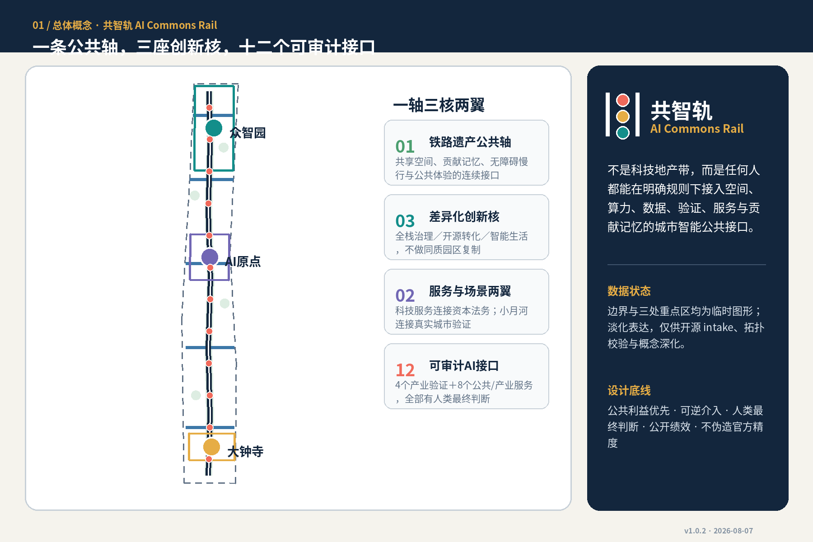
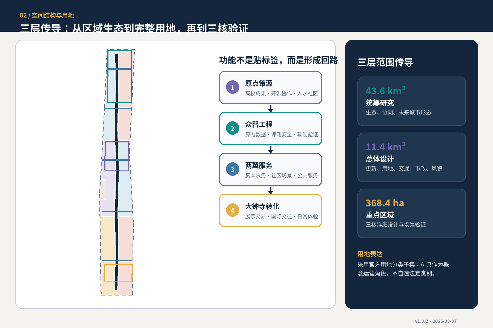
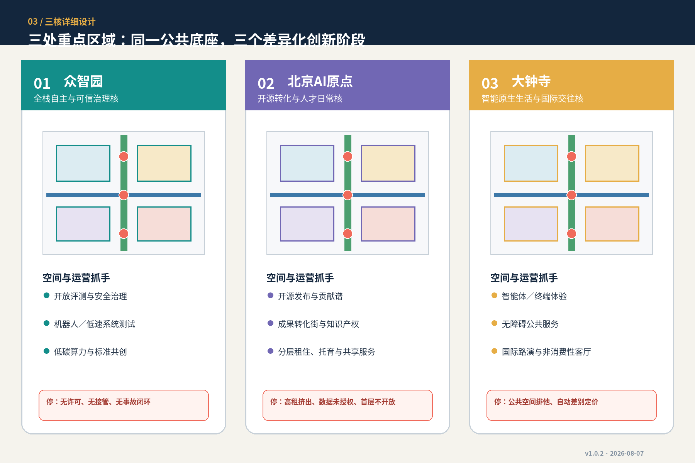
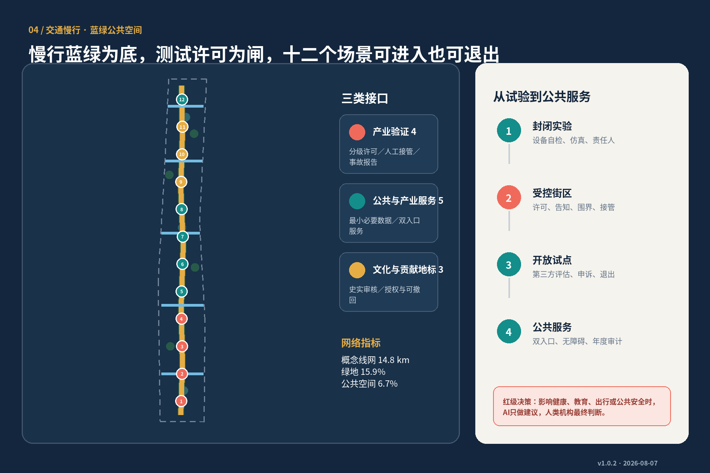
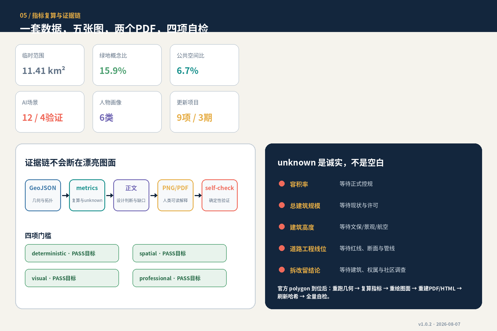

# Co-Intelligence·AI Commons Rail: A Verifiable, Co-Governable, and Scalable Urban Intelligent Public Interface

**Version: v1.0.2 | 2026-08-07.**

**Sub-title: Verifiable, Co-governable, and Scalable Urban Intelligent Public Interface.** This proposal does not view the "AI Innovation Belt" as a concentrated technological real estate axis, but rather translates the century-old linear heritage of the Jing-Zhang Railway into a public interface: any university, company, resident, or city manager can share space, computing power, trusted data, testing environments, display stages, and contribute memories under clear access, privacy, security, and Human Review rules. The overall structure is summarized as **one axis, three cores, two wings, five horizontal chains, twelve interfaces, and three phases**. Among them, "one axis" is the Jing-Zhang Smart Vein Park and Heritage Narrative Axis; "three cores" are Zhongzhiyuan, Beijing AI Origin Community, and Dazhongsi; "two wings" are Zhongguancun Technology Services Wing and Xiaoyue River Scenario Enablement Wing; "twelve interfaces" are four categories of industrial validation and eight categories of public/industrial service scenarios. [source:AGENT-TASKBOOK] [standard:PROJECT-AGENT-OPEN-CALL-TASKBOOK]

> **Unified Boundary Statement:** All spatial implementations, branding, events, policies, and operational content in this proposal are Open Co-Creation initiatives, reference proposals, or materials for further in-depth study by professional teams. They do not replace formal planning, nor do they constitute government approval, engineering feasibility conclusions, investment commitments, or definitive implementation arrangements.

## Design Basis and Source List

The proposal establishes a six-layer Evidence Chain of "source—assumption—geometry—indicator—drawing—self-inspection." The task is based on the official pre-qualification announcement and the smart body task book; the professional boundaries are derived from Urban Design, control plan preparation, and the local snapshot of land use classification in the spatial plan. Graphical references are based only on the provisional boundaries clearly marked in the warehouse. The external six innovative district case studies are used solely for mechanism comparison and do not support the project's red lines, statutory controls, or numerical commitments. [source:OFFICIAL-ANNOUNCEMENT] [source:SITE-PACKAGE] [source:SOURCE-REGISTRY] [source:PROCESSED-FACT-PACK] [standard:PROJECT-OFFICIAL-ANNOUNCEMENT]

Currently, `geometry/site_boundary.geojson` and `geometry/key_areas.geojson` respectively reference the repository's temporary overall scope and three temporary key areas. [source:BOUNDARY-SOURCE] [source:KEY-AREA-SOURCE] Their `official_boundary=false` and `geometry_role=provisional_constraint`, and are only used for structural generation, topological validation, visualization, and open-source intake; they are not official planning boundaries, approval references, precise areas, or property boundaries. Consequently, the derived land use, buildings, roads, green spaces, Public Spaces, and phased layers can be re-run after the official polygon placements, rather than being manually shifted. (Official Planning Boundary) [data:geometry/site_boundary.geojson#SITE-001] [data:geometry/key_areas.geojson#PROV-KEY-001] [depth:existing_conditions_diagnosis]

The data gaps are actively modeled as `constraints.geojson#CONSTRAINTS`: formal zoning, road rights-of-way, parcel ownership, existing buildings, cultural heritage areas, and municipal and public service baselines are all pending. It is a "missing data mask" rather than a control line; any affected conclusions are downgraded to methods, processes, or items to be confirmed. [data:geometry/constraints.geojson#CONSTRAINTS] [depth:risk_missing_data]

## Three-Level Scope Framework

The Coordinated Research Area covers approximately 43.6 square kilometers, used to address how the AI Innovation Ecosystem in Haidian integrates with the Beiwai Community, Future Science City, Huairou Science City, Economic Development Zone, and the coordinated development of the Beijing-Tianjin-Hebei region; the Overall Design Area covers approximately 11.4 square kilometers, used to organize the integration of industry, updates, transportation, utilities, blue-green spaces, and urban appearance into an Urban Design framework; three key areas with a combined announced area of approximately 368.4 hectares are used to validate spatial prototypes for different stages of innovation and everyday life. The text area is derived from official announcements, while the graphical positions are from temporary polygons; the two should not be mixed. [source:OFFICIAL-ANNOUNCEMENT] [depth:three_level_scope_framework]

| Level | Key Issues | Output of This Plan | Evidence and Recalculation Boundaries |
| --- | --- | --- | --- |
| Integrated Research | How to Form a World-Class AI Ecosystem and Regional Synergy | "Research—Engineering—Validation—Service—Dissemination" Five-Ring Ecosystem, Six Case Studies Transformation, Long-Term Governance | Strategy and Mechanism, No New Green Lines |
| Master Plan | How to Integrate Rail Heritage, Urban Renewal, and AI Scenarios | One Axis, Three Cores, Two Wings, Five Horizontal Chains, Complete Land Use Zones, Slow Travel Blue-Green Spaces, and Phased Implementation | Use provisional overall boundary, recalculate after the Official Boundary is set |
| Key Areas | How to Form Differentially Distinct and Implementable Spatial Prototypes | Zhongzhiyuan "Full Stack Governance Core," Yuan Point "Open Source Transformation Core," Dazhongsi "Intelligent Living Core" | All three polygons are provisional and no land plot conclusions are drawn |

Three layers are not three isolated scales. Coordinated research should determine the platform and governance; overall design should embed the platform into transportation, Public Space, and living environments; key areas should use real users, scenario cards, project dependencies, and risk validation strategies. `land_use.geojson` should be clipped from the same boundary in sequence, fully covering without overlapping; `phasing.geojson` should express a phased approach with three tiered thresholds—first pilot, then platform, and finally expansion. [data:geometry/land_use.geojson#LU-001] [data:geometry/phasing.geojson#PHASE-001] [depth:overall_spatial_structure]

## Coordinated Research Area: Industry and Future City Research

### 1. Naming and Visual Identity

Main name is **"Co-Intelligence Track"**, with the English name **AI Commons Rail**. It conveys three layers of meaning: `Rail` refers to the material and memory continuity of the century-old Jing-Zhang; `Commons` refers to the shared technological foundation, non-consumptive Public Spaces, and public knowledge; `AI` refers to city intelligence that is explainable, auditable, and ultimately judged by humans. The logo direction uses "two parallel tracks + three nodes + open parenthesis": the tracks are the continuous interface between heritage and the future, the three nodes correspond to the three cores, and the open parenthesis indicate that the system is scalable and contributions are welcome. Visual colors use railway blue, public green, validation coral, and contribution gold; only original geometric shapes and the Noto open-source font are used, no corporate trademarks or unlicensed character images. [source:AGENT-TASKBOOK]

### 2. Six Global Cases: Only Migration Mechanisms, Not Form-Making

| Case | Transformable Mechanism | Clearly Not to Be Replicated |
| --- | --- | --- |
| Kendall Square | Anchor Institution + Shared Technology Platform + Early Stage Enterprise Space + Inter-Institutional Network [source:CASE-KENDALL]| Project-specific proportions,MIT Type of Site Conditions |
| one-north | differentiated nodes, incubation networks, authentic testing, temporary pedestrianization pilot [source:CASE-ONE-NORTH] | monocentric development regime and colonial residential form |
| King's Cross—Knowledge Quarter | Adaptive reuse of railway heritage, mixed-use district, concurrent public facilities, and knowledge alliances [source:CASE-KINGS-CROSS] | International hub, concentrated ownership, and commercial landmark replication |
| Hazelwood Green | Retain Existing Structures for Advanced Manufacturing/Robotics Testing, Long-Term Site Core and Professional Platform [source:CASE-HAZELWOOD] | Steel Mill Aesthetics and Unfulfilled Visionary Achievements |
| Paris-Saclay | Distributed Professional Platform, Public Development, Research and Innovation Conversion, and Coordinated Layering of Transportation Subjects [source:CASE-PARIS-SACLAY] | Mismatch between Large-Scale New City and Transportation Timing |
| Seoul DMC | realistic road communication foundation, automated system validation and transition to accessible public services [source:CASE-SEOUL-DMC] | outdated statistics, headquarters cluster, and "built and successful" |

Six cases collectively point to: an innovation district is not a list of buildings, but rather **entry rules + shared facilities + real validation + Public Space + daily activities of talents + long-term operations**. This plan proposes the "Full Stack Five Loops": Research Ecosystem Loop, Shared Engineering Loop, Urban Validation Loop, Enterprise/Talent Service Loop, and Cultural Communication Loop. The five loops are connected by a unified reservation directory, ethical and safety review, intellectual property agreement, and annual public performance reports. No single institution is responsible for all tasks. [depth:overall_spatial_structure]

### 3. Three Zones and Two Wings Synergistic Loop

Zhongzhiyuan undertakes the full-stack engineering interface for models, chips, computing power, data, security, and governance; AI Origin community bears the academic achievements, open-source collaboration, incubation, intellectual property, and talent living; Dazhongsi bears intelligent agents, terminals, content consumption, international showcases, and public experiences. Zhongguancun Technology Services Wing provides capital, legal services, intellectual property, corporate services, and global communication; Xiaoyue River Scenario Enablement Wing provides community, healthcare, education, transportation, low-speed robotics, and controlled validation environments for ecological governance. Results move from the "Origin Concept" to the "Intelligence Engineering," through "Wing Validation/Services," and to "Dazhongsi Display and Transaction," using feedback to loop back to the origin; this is a functional loop, not an administrative boundary or a recruitment promise. [standard:MOHURD-URBAN-DESIGN-MEASURES]

## Overall Design Area: Urban Renewal and Regulatory-Plan-Level Urban Design

Overall structure is **one axis, three cores, two wings, and five horizontal stitching chains**. The North-South Heritage Public Axis is not a landscape decoration but an "urban operating system home page" for shared experiments, memory contributions, barrier-free slow travel, and public experiences; the five horizontal chains connect the universities, communities, businesses, and rail portals on either side to the main axis, prioritizing the east-west divide. The conceptual line network is approximately `14.8` kilometers in total length, only indicating network relationships and not road alignments, red lines, or engineering feasibility conclusions. [data:geometry/roads.geojson#ROAD-001] [metric:road_network_length_m] [depth:traffic_rail_slow_parking]

Use land use categories from the national spatial classification subset, while recording the "AI function" in `concept_role` to avoid creating new legal land use categories. Research and development/academic, education, commercial services, community services, roads, parks, and green spaces with elastic reserves form a complete zoning; each area is recalculated using EPSG:4548, but due to the temporary overall boundary, the confidence level is low, and the official polygons will be finalized and recalculated once they are in place. [standard:MNR-LAND-USE-CLASSIFICATION-GUIDE] [depth:land_use_layout]

The architectural layer expresses eighteen conceptual baselines, aiming to test the spatial relationships of "building—public axis—horizontal link—three cores," without claiming about the current status, ownership, number of floors, or scale of construction. The update takes a four-step approach: authentic preservation of cultural/valuable buildings; prioritized adaptive reuse of flexible buildings; updates to safety and functional issues after professional assessment; and the study of new buildings only after formal control plans, ownership, municipal, and public interests are clearly defined. The current conceptual Building Coverage Ratio is approximately `1.7%`, which is not a planning control indicator. [data:geometry/buildings.geojson#BLDG-001] [metric:building_footprint_area_sqm] [metric:building_density] [depth:retain_renovate_demolish]

Development Intensity, total building scale, and Building Height all remain unchanged. [metric:total_floor_area_sqm] [metric:floor_area_ratio] [metric:building_height_m] This is not a case of missing deliverables, but a clear rejection of using concept drawings to manufacture review precision. Professional deepening should involve overlaying the official control detailed planning, cultural heritage, roads, fire safety, utilities, and property rights, and then conducting a coordinated review of capacity, solar access, wind environment, fire safety, and traffic bearing. [standard:MOHURD-CONTROL-DETAILED-PLANNING] [depth:development_intensity_controls] [depth:height_massing_character]

## Detailed Design of Key Areas

The three key areas collectively adhere to the principles of "ground-level public access, platform sharing, life accessibility, test control, and heritage readability," but they each take on different roles. Locations and areas are based on temporary graphics and are only for directional design. [data:geometry/key_areas.geojson#PROV-KEY-001] [data:geometry/key_areas.geojson#PROV-KEY-002] [data:geometry/key_areas.geojson#PROV-KEY-003] [depth:three_key_area_detailed_design]

### Zhongzhiyuan: Full-stack Autonomous and Trustworthy Governance Core

Positioned as an "open engineering academy in a garden." The space is defined by the Jing-Zhang axis and the Qinghe interface as dual public faces, configuring open evaluation, safety governance, soft-hardware collaboration, robot/low-speed system testing, and standard co-creation; the research and development carriers enclose reservable test courtyards, with the first floor open to developers, small and medium-sized enterprises in the supply chain, and the public for visual display. Model evaluation for four categories of industrial validation, robot testing, and edge-side computing capabilities will be piloted here. Any real testing must have tiered permits, boundary/time restrictions, independent safety assessments, public notifications, accident reporting, and exit mechanisms; it is not permissible to reduce public safety under the guise of a "sandbox." [source:AGENT-TASKBOOK]

### Beijing AI Origin Community: Open Source Transformation and Talent Daily Verification

Located as the "first kilometer from campus to city community." The space emphasizes a seamless connection between the campus, park, and community through pedestrian-friendly design, featuring an open-source release hall, a technology transfer street, intellectual property/legal services, a youth collaborative space, and interfaces for housing, childcare, dining, and sports, as well as community shared services. Building updates prioritize the renovation of accessible ground floors and existing spaces, avoiding the high-cost construction of new facilities that could displace early teams. Operations are centered on contribution records, open-source maintenance, mentor services, and local hiring, with evaluations not solely based on foot traffic or the number of tenants.

### Dazhongsi: Smart Native Living and International Exchange Core

Located as the "City Living Room for AI to Enter Daily Life." Organize smart body/terminal experiences, content, and digital culture, international roadshows, data compliance living room, barrier-free public services, and nighttime activities around the station and the four-quadrant public interface; Public Spaces must retain non-consumptive stays, direct pedestrian access, and community services. Any corporate displays and digital asset activities must be transparently labeled, authorized, and include customer service and complaint channels to avoid turning public spaces into brand showrooms.

## AI Innovation Ecosystem, Personas, and AI+ Scenarios

### Six User Persona Categories

| Image | Key Needs | Space/Service Mapping | Public Interest Boundary |
| --- | --- | --- | --- |
| Open Source Developer | Collaboration, Evaluation, Reputation Contribution, Low-Cost Nighttime Space | Origin Launch Hall, Contribution Spectrum, Shared Computing Power | No Personal Trajectory Recording, Contribution Display Requires Individual Authorization |
| Start-ups and Small & Medium Enterprises (SMEs) | Prototypes, Customers, Compliance, Procurement, and Financing | Collaborative Validation Platform, Technology Service Wing | Public Access and Pricing, Avoiding Service Bias Toward Headline Companies |
| University Students and Faculty Researchers | Cross-Institution Collaboration, Technology Transfer, and Daily Active Transportation | Origin Transformation Street, Five Horizontal Chains | Research Results and Campus and Personal Data Require Authorization |
| Surrounding Residents and Small Merchants | Low-Impact Updates, Public Services, Employment, and Recreation | Community Service Nodes, Non-Consumptive Public Axes | Not Used for Business Profiling or Automated Differential Pricing |
| International Talent and Families | Accommodation, Childcare, Healthcare, Social Engagement, Language Services | Layered Accommodation and 15-Minute Living Interface | Not Equating "Internationalization" with High-End Consumption |
| Maintenance Staff, Elderly, and Mobility-Challenged Individuals | Barrier-Free Access, Manual Assistance, Clear Accountability | Barrier-Free Navigation, Onsite Service Counter, Maintenance Workshop | Must Have Entry for Non-Smartphones and Manual Backup |

User personas are categorized into six types. [metric:persona_count] They are not individual user profiles but service demand assumptions; any subsequent research must be voluntary, anonymous, and with the minimum necessary data, and must allow for withdrawal.

### Twelve Scene Cards

| # | Scenario/Space | Data and Privacy | Human Review/Operations |
| --- | --- | --- | --- |
| 01★ | Open Release and Model Evaluation Hall / Origin-ZhiZhong | Authorized Models, Public Benchmarks, Desensitized Logs | Third-Party Evaluation + Controversy Review; Shared Platform Operations |
| 02★ | Low-Speed System Test Loop / Zhongzhiyuan | Test Vehicles, Environmental, and Event Data | Safety Officer Takeover, Accident Reporting; Tiered Authorization |
| 03★ | Trusted Data Authorization Sandbox / Technology Service Wing | Authorized, Minimal Field, Purpose-Limited Data | Reviewed by Data Stewards and Ethics Committee |
| 04★ | Edge Computing and Low-Carbon Dispatching Kiosks / Axial Nodes | Remote Monitoring of Equipment and Energy Aggregation | Maintenance Staff Confirm, No Automatic Change to Critical Facilities |
| 05 | AI-Powered Slow Travel and Accessibility Navigation / Five Horizontal Chains | Traffic Conditions, Facilities, and Voluntary Feedback | Manual Verification of Obstacles; Maintain Offline Signage |
| 06 | Community Health Service Navigation / Community Interface | No Diagnosis, Refer to Formal Service Directory | Medical/Healthcare and Social Workers Final Judgment |
| 07 | Education and Lifelong Learning Assistant / Origin Community | Courses and Voluntary Learning Records | Teacher/Learner Controlled, No Automatic Streaming |
| 08 | Corporate Compliance and Intellectual Property Assistant / Technology Services Wing | Public Regulatory Texts and Corporate Authorization Documents | Final Opinion Prepared by Lawyers/Professional Personnel |
| 09◇ | Jing-Zhang Memory Interpretive Guiding Tour / Heritage Axis | Review of Qing Right Historical Materials and Public Contributions | Examination by Historical Facts Editing Committee |
| 10◇ | Zhongguancun Contribution Spectrum and Honor Archive / Origin | Voluntary Authorization by Contributors, Version Tracable | Personal Correction/Withdrawal, Public Review |
| 11◇ | Global Developer Collaborative Lounge / Mid-Segment Node | Minimum Fields for Activity Registration | Community Facilitation and Anti-Harassment Mechanism |
| 12 | Dazhongsi Intelligent Native Life Theater / Dazhongsi | On-site Anonymous Feedback, Facial Recognition Default Off | Offline Customer Service, Merchant and Community Co-Governance |

★For 4 Testing and Validation Scenarios, ● for 3 AI pilgrimage/honor nodes. Total scenarios 12, testing and validation 4, landmarks 3, all derived from `SCENARIO_NODE`. [data:geometry/public_space.geojson#SCN-001] [metric:scenario_node_count] [metric:pilot_test_scenario_count] [metric:landmark_count]

Governance is implemented using a "red–yellow–green" tier system: closed-loop experiments are classified as green; controlled public environment testing is classified as yellow, requiring safety reviews, notifications, manual takeovers, and exits; decisions affecting travel, health, education, resource allocation, or public safety are classified as red, where AI provides only recommendations, and human institutions retain the final judgment and appeal. Continuous facial recognition, purposeless behavior tracking, unexplainable automated enforcement, or resident commercial scoring are strictly prohibited.

## Land Use, Building Scale, and Retain-Renovate-Demolish Strategy

The complete land use zoning includes park green spaces, conceptual roads, research and development, education, commercial services, community services, and flexible blank spaces. [data:geometry/land_use.geojson#LU-001] [metric:land_use_1401_area_sqm] [metric:land_use_1207_area_sqm] [metric:land_use_0802_area_sqm] [metric:land_use_0804_area_sqm] [metric:land_use_05_area_sqm] [metric:land_use_0702_area_sqm] [metric:land_use_16_area_sqm] With AI functions added as operational roles, they do not alter the semantic classification of the land space. The proportion of road land use is approximately `1.6%`, which is also just within the Provisional Boundary for conceptual recalculation. [metric:road_area_ratio]

Buildings are not evaluated through a "draw first, then demolish" approach but rather through a decision tree: the first step verifies cultural heritage or value; the second step verifies structural safety, functional adaptability, and carbon emissions; the third step verifies ownership, tenant impact, and community effects; the fourth step compares the full lifecycle costs of preservation, light renovation, adaptive reuse, and new construction. Only when all the necessary documentation is available can a decision be made for a specific building. The conceptual base area totals approximately `19.6` hectares, only proving that spatial relationships can be recalculated by machines; it does not equal the current status, zoning permits, or construction scale.

Mood suggestions include "track base, open ground floor, visible production, lightweight reversibility": retain the temporal traces of the railway structures; new interventions are distinguishable from the remnants; the research and validation processes are comprehensible to the public; the equipment, signage, and exhibits use removable nodes; control noise, glare, and nighttime activities along the community interface. Building Height, skyline, and color must be refined after official control and specialized evaluation. [standard:MOHURD-ARCH-DESIGN-DEPTH-2016]

## Transport, Rail, Municipal Infrastructure, and Public Services

Traffic strategies prioritize "public transit access, walking and cycling for the last mile, service vehicle time-sharing, and test vehicle tiering." The Jing-Zhang axis provides continuous north-south walking and cycling, with five horizontal connections linking to universities, communities, industries, and stations on either side. Key areas will feature transfer information, bicycle parking, accessible rest areas, and manned services. Slow travel discontinuities will initially be validated with temporary markings, lighting, signage, and volunteer guidance; bridge, tunnel, and intersection works must await road right-of-way, traffic specialty, pipeline, and safety approvals. [data:geometry/roads.geojson#ROAD-002]

Municipal and new infrastructure adopt a "four-layer foundation": traditional municipal safety layer (electricity, water, heating, drainage, fire protection); edge facility layer (communication, positioning, charging, environmental sensing); trusted data and computing power layer (authorization directory, sandbox, logs, energy and carbon accounting); scenario interface layer (booking, permitting, public notification, incident reporting). Public authorities retain rule-setting and auditing rights, while professional entities operate the equipment, and universities/enterprises use the resources according to agreements. Communities can monitor public impact. Without municipal capacity and energy data, no conclusions are given on pipeline relocation, load, or supply engineering. [depth:municipal_new_infrastructure]

Public services adhere to a "dual entry" approach: online intelligent services must have a telephone, physical window, or human assistance; the source of service directories must be verifiable; health, education, legal, and public safety scenarios must not be decided solely by model automation. Talent services and resident services are co-located to avoid forming exclusive welfare islands within the innovation district.

## Blue-Green Network, Public Space, and Urban Character

The blue-green system is centered around the Jing-Zhang Heritage Park, overlaying four conceptual pocket parks and three core squares, forming a continuous open space network from north to south and interconnected from east to west. The green space concept covers an area of approximately `180.9` hectares, with a proportion of `15.9%`; the Public Space concept covers an area of approximately `76.1` hectares, with a proportion of `6.7%`. [data:geometry/green_space.geojson#GREEN-001] [metric:green_space_area_sqm] [metric:green_ratio] [data:geometry/public_space.geojson#PUBLIC-001] [metric:public_space_area_sqm] [metric:public_space_ratio] [depth:blue_green_public_space]

These proportions are not indicative of the plot ratio or Public Space standards. The layers emphasize continuity, accessibility, and operation: at least retaining non-consumptive seating, drinking fountains, restrooms, shading, child/elderly-friendly features, barrier-free access, and nighttime safety; activities are zoned into quiet, daily, celebratory, and test categories, with test periods and scopes subject to revocation. Ecological measures prioritize rain gardens, permeable surfaces, and native plants, but these must be refined after the availability of river blue line, flood protection, soil, and underground utility data.

Three "AI Holy Sites" do not compete for attention with oversized buildings: **Jing-Zhang Memory Explanatory Tour** weaves a century of railway history with open-source documentation into a public narrative that can be corrected; **Zhongguancun Contribution Spectrum** records contributions of open-source code, papers, standards, products, and public services, allowing contributors to license, correct, and retract; **Global Developer Collaborative Living Room** sustains ongoing collaboration under daily community rules and anti-harassment mechanisms. The value of the landmarks lies in their institutional and content updates, not in expensive aesthetics. [standard:MOHURD-URBAN-DESIGN-MEASURES]

Culture narrative for "From railway connecting the nation, to open collaboration connecting the smart era": The Jing-Zhang Railway represents autonomous and public connectivity through infrastructure, while Zhongguancun represents knowledge, market, and institutional innovation. The AI new culture emphasizes open-source, explainability, auditability, and human final judgment. The sign system is composed of sleeper rhythm, mileage markings, and open parentheses; Chinese is the primary language, with English for international information exchange; cultural heritage value and historical facts must be verified by the relevant authorities and professional institutions.

## Renewal Projects, Implementation Policy, and Phasing

| Number | Concept Project | Stage | Main Dependencies and Stop Conditions |
| --- | --- | --- | --- |
| JZ-01 | Jing-Zhang Heritage and Public Space Asset Register | Recently | Cultural Heritage/Ownership/Safety Survey; No Renovation Without Verification |
| JZ-02 | Five Horizontal Chains Temporary Pedestrian and Barrier-Free Pilot | Near Term | Traffic Organization, Lighting, and Public Feedback; Revoke if Safety Standards Are Not Met |
| JZ-03 | Open Evaluation and Trustworthy Data Sandbox | Recently | Data Authorization, Ethical Safety, Intellectual Property Rights, and Independent Auditing |
| JZ-04 | Origin Open Source Release and Transformation Street | Mid-term | Ownership and Rental Affordability, Ground Floor Openness, and Operational Team |
| JZ-05 | Zhongzhiyuan Robot/Low-Speed System Testing Loop | Mid-term | Graduated Permitting, Insurance, Takeover, Accident Reporting, and Public Notification |
| JZ-06 | Dazhongsi Smart Living and International Meeting Hall | Mid-term | Station Interface, Community Co-governance, Non-consumptive Spaces, and Nighttime Disturbances |
| JZ-07 | Three Contributions Memory Landmarks | Mid-term | Historical Facts, Copyright, Contribution Authorization, Error Correction and Retraction Mechanism |
| JZ-08 | Talent—Shared 15-Minute Service Network for Residents | Long-Term | Public service baseline, rental housing, childcare, healthcare, sports, and artificial entrance |
| JZ-09 | Regional Innovation Platform and Performance Reinvestment Mechanism | Long-term | Interagency Charter, Budget, Transparency KPI And third-party evaluation |

Update nine projects. [metric:renewal_project_count] Phasing into three phases: [data:geometry/phasing.geojson#PHASE-001] [data:geometry/phasing.geojson#PHASE-002] [data:geometry/phasing.geojson#PHASE-003] [metric:phase_count] [metric:phase_1_area_sqm] [metric:phase_2_area_sqm] [metric:phase_3_area_sqm] [depth:renewal_project_list] [depth:phasing_implementation]. Spatial zoning is merely a conceptual implementation order; the actual construction sequence must conform to heritage conservation, control plans, property rights, traffic, utilities, funding, and public engagement.

Long-term governance recommendations suggest a six-layered structure: the public sector sets the baseline and conducts audits; a long-term implementation platform coordinates assets and infrastructure; universities/research institutions provide knowledge anchor points; professional operators manage computational power, data, and test facilities; businesses and communities participate in co-governance; and neutral network organizations connect clients, capital, supply chains, jobs, and international communications. Common charter provisions include public access, fees, data management, intellectual property rights, conflict of interest avoidance, appeals, and exit mechanisms.

Annual operation forms "Seasonal Scenario Access": Spring Open Maintenance Season, Summer Urban Validation Season, Autumn Global AI Commons Week, Winter Safety and Public Value Review; the entire year runs developer co-learning, small roadshows, Scenario Access Days, and Jing-Zhang Memory Routes. Each event scores based on reusable outcomes, participation structure, safety incidents, community impact, and subsequent collaborations, rather than just exposure. All activities are Conceptual Recommendations and do not represent that the government or institution has determined to host them.

## Metrics, Area Recalculation, and Compliance Matrix

Indicators are divided into three categories: Spatial indicators are recalculated based on the submitted GeoJSON in EPSG:4548; statutory indicators remain as official zoning/control plans/property lines are missing; operational indicators are only defined with future collection rules. The Provisional Boundary recalculation covers an area of approximately `11.413` square kilometers, with the discrepancy not fully matching the announced value, serving as evidence that provisional geometry cannot be used as an exact substitute for official property lines. [metric:site_area_sqm] [depth:metrics_recalculation]

| Group | Current Calculable/Countable | Design Implication |
| --- | --- | --- |
| Space | Building Footprint, Green Space/Public Space, Conceptual Roads, Land Use Codes and Phase  Area | Check Complete Coverage, Continuity, and Plan Consistency |
| Key Area | 3 temporary polygon areas [metric:key_area_count] [metric:key_area_zhongzhiyuan_ai_acceleration_area_area_sqm] [metric:key_area_beijing_ai_origin_community_area_sqm] [metric:key_area_dazhongsi_ai_industry_cluster_area_sqm] | Only for temporary detailed design, not to replace announced area and Official Boundary |
| Scenario/Operation | 12 Scenarios, 4 Tests, 6 Portraits, 3 Landmarks, 9 Projects | Validate agent.1—agent.6 Readable Coverage and Operational Loop |
| Legal/Engineering | Floor Area Ratio, Total Building Scale, Height Preservation | Waiting for Control Detailed Planning, Cultural Heritage, Ownership, Municipal and Specialized Argumentation |

`compliance_matrix.json` covers announcements 1.3, 1.4, 1.5, and agent.1—agent.6; `standard_matrix.json` maps to five mandatory standards; `design_depth_matrix.json` includes fifteen required depths with detailed text, drawings, layers, metrics, sources, assumptions, and self-inspection evidence. This ensures that the design is not merely a "matrix tick-off" but that each requirement can be traced back to readable design and machine data.

## Risk, Copyright, and Compliance

The primary risk is not technical failure, but writing temporary data as definitive planning, turning public testing into privacy surveillance, converting innovative updates into rent exclusion, and turning railway heritage into consumer backdrops. Corresponding measures are: tiered boundaries and indicators; human final judgment in sensitive scenarios; affordable innovation/living spaces and public facilities in sync; tiered valuation of heritage with reversible interventions; annual operational transparency; and the right of any party to appeal and exit.

Risk evidence is constrained by missing data mask, source tier, and design depth. [data:geometry/constraints.geojson#CONSTRAINTS] [source:SOURCE-REGISTRY] [depth:risk_missing_data]

Continuously register eight categories of risks: data privacy, implementation complexity, public acceptance, operational costs, policy uncertainty, spatial disputes, technological maturity, and equity inclusiveness. Conditions for triggering a pause include: lack of legal data authorization, inability to provide manual take-over, unclamped test security incidents, Public Space exclusivity, unclear cultural or ecological boundaries, no remedy for residents/merchants affected, and unsustainable operational funding. Risk conclusions are linked with `assumptions.json`, `self_check.json`, and the data gap mask.

Text, original graphics, conceptual geometry, offline HTML, and PDF were generated by Manus AI for DUDULU; official/clear rights documentation and six background case studies are registered in `sources.json`. The visuals do not use commercial map tiles, news images, company logos, portraits, or remote assets; the Noto CJK font comes from the system open-source font package. Detailed generation methods and permissions are available in `report/copyright_statement.md`. This plan is released under CC BY 4.0; third-party sources retain their respective rights statements.

Self-check objectives include deterministic validation, spatial review, visual packaging, and professional evidence four items PASS. The absence of official polygons only limits precision; it does not block participants from scoring their controlled content. Once the formal boundaries are released, participants must rerun geometry, metrics, graphics, HTML, PDF, manifest hashes, and the full self-check, rather than manually overriding the results.

## References

- Official Task and Local Standards: [source:OFFICIAL-ANNOUNCEMENT] [source:AGENT-TASKBOOK] [source:SITE-PACKAGE] [source:SOURCE-REGISTRY] [source:PROCESSED-FACT-PACK]
- Professional Standards: [standard:PROJECT-OFFICIAL-ANNOUNCEMENT] [standard:PROJECT-AGENT-OPEN-CALL-TASKBOOK] [standard:MOHURD-URBAN-DESIGN-MEASURES] [standard:MOHURD-CONTROL-DETAILED-PLANNING] [standard:MNR-LAND-USE-CLASSIFICATION-GUIDE] [standard:MOHURD-ARCH-DESIGN-DEPTH-2016]
- Design Depth: [depth:existing_conditions_diagnosis] [depth:three_level_scope_framework] [depth:overall_spatial_structure] [depth:land_use_layout] [depth:development_intensity_controls] [depth:height_massing_character] [depth:retain_renovate_demolish] [depth:traffic_rail_slow_parking] [depth:municipal_new_infrastructure] [depth:blue_green_public_space] [depth:three_key_area_detailed_design] [depth:renewal_project_list] [depth:phasing_implementation] [depth:metrics_recalculation] [depth:risk_missing_data]
- Data layers: [data:geometry/site_boundary.geojson#SITE-001] [data:geometry/key_areas.geojson#PROV-KEY-001] [data:geometry/land_use.geojson#LU-001] [data:geometry/buildings.geojson#BLDG-001] [data:geometry/roads.geojson#ROAD-001] [data:geometry/green_space.geojson#GREEN-001] [data:geometry/public_space.geojson#PUBLIC-001] [data:geometry/constraints.geojson#CONSTRAINTS] [data:geometry/phasing.geojson#PHASE-001]
