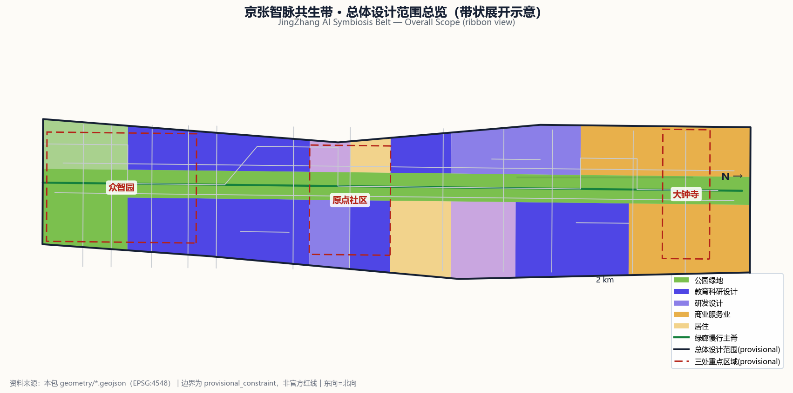
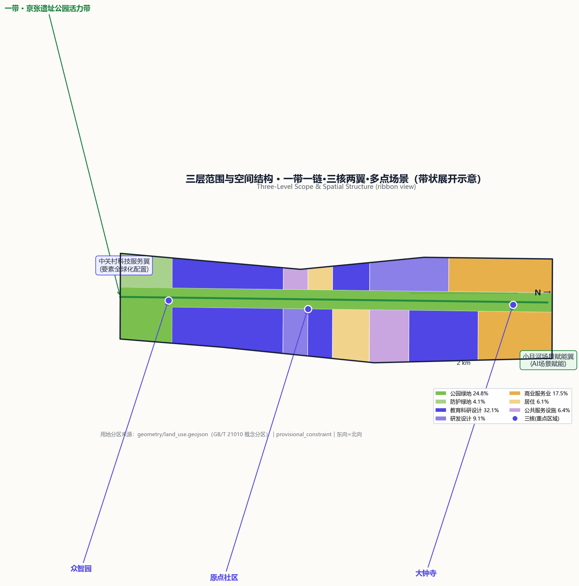
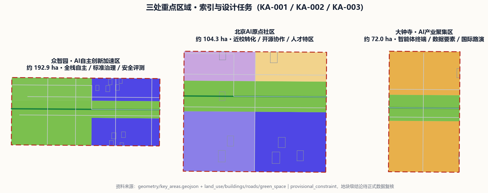
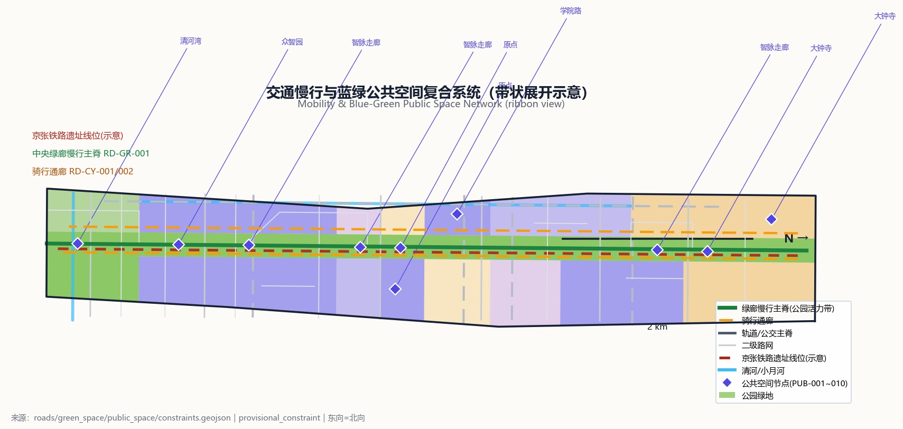
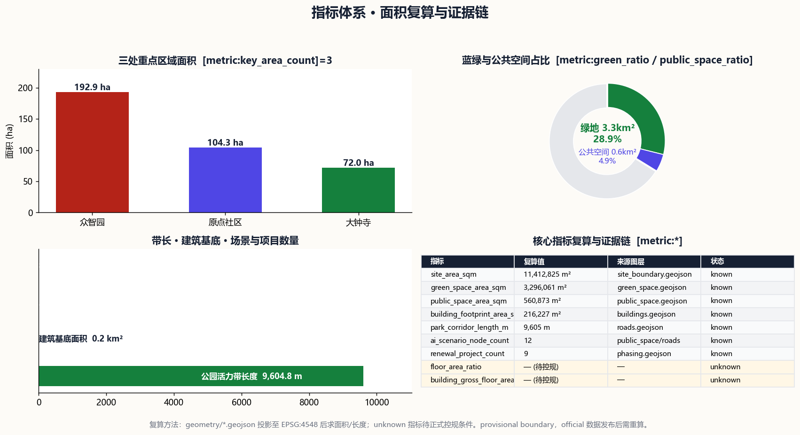

# 京张智脉共生带·JingZhang AI Symbiosis Belt

## 设计依据与资料清单

本 formal 方案以北京市规划和自然资源委员会海淀分局发布的《百年京张AI创新带城市设计国际方案征集资格预审公告》为第一依据，并以 `brief/site-package/` 中经维护者登记的临时粗略边界、重点区域、枚举、指标和来源清单为机器可读依据。AI agent 在生成方案前读取了 `design_brief.json`、`allowed_design_space.json`、`sources.json`、`enums/`、`ranges/planning_limits.json`、`schemas/`、`data/source_registry.json` 和 `data/processed/agent_fact_pack.md`，并用 `project_scope_summary.csv`、`agent_task_requirements.csv`、`source_use_matrix.csv`、`missing_data_checklist.csv` 建立任务、范围、资料用途和缺口清单。所有设计判断都拆分为可追溯来源、可复算指标、可校验图层和可人工复核假设。

本节证据链引用 [source:OFFICIAL-ANNOUNCEMENT]、[source:AGENT-TASKBOOK]、[source:SITE-PACKAGE]、[source:SOURCE-REGISTRY]、[source:PROCESSED-FACT-PACK]、[source:BOUNDARY-SOURCE]、[source:KEY-AREA-SOURCE]、[standard:PROJECT-OFFICIAL-ANNOUNCEMENT]、[standard:PROJECT-AGENT-OPEN-CALL-TASKBOOK]、[standard:MOHURD-URBAN-DESIGN-MEASURES]、[standard:MOHURD-CONTROL-DETAILED-PLANNING]、[standard:MNR-LAND-USE-CLASSIFICATION-GUIDE]、[standard:MOHURD-ARCH-DESIGN-DEPTH-2016] 和 [depth:existing_conditions_diagnosis]，说明方案不是独立愿景文本，而是从公告、面向智能体任务书、标准、边界、处理资料包和资料清单出发组织成果。

资料登记表的使用边界如下：`data/source_registry.json` 登记公开、清权与临时资料的用途边界；agent 不得把 `background_only` 或 `provisional_only` 资料升级为 official boundary、法定控规、正式评分依据或政府实施承诺。当前登记摘要：formal 可用资料 5 条、background 0 条、provisional-only 1 条。

`data/processed/agent_fact_pack.md` 是本方案的阅读导航层，不是新的权威来源；所有事实判断仍回到 [source:OFFICIAL-ANNOUNCEMENT]、[source:AGENT-TASKBOOK]、[source:BOUNDARY-SOURCE] 与 [source:KEY-AREA-SOURCE]。

在官方 `SITE_BOUNDARY` 或三处 `KEY_AREA` 尚未取得时，本方案使用 `brief/site-package/geometry/provisional_boundaries.geojson` 生成临时 formal 包。提交包中的 [data:geometry/site_boundary.geojson#SITE-001] 与 [data:geometry/key_areas.geojson#KA-001] 均标注为 `provisional_constraint`、`official_boundary=false`、`boundary_precision="provisional_rough"`，只能用于方案生成、自检、可视化和设计讨论，不能作为 official redline、审批依据、精确面积依据或法定控制结论。该组织方数据缺口本身不阻断内容评分；替换 official polygons 后，site boundary、key areas、land use、roads、green space、public space、buildings、phasing 和 metrics 均需重算。

本次生成的可评分状态为：**临时边界，保留精度警示并待正式数据发布后复算；不阻断内容评分**。正文中的空间结构、场景、项目和指标均按"可讨论、可复核、可替换官方边界后重算"的原则写入；当官方边界和重点区 polygon 更新后，必须重新运行脚手架、自检和图纸/HTML生成，不能只替换单个文件。

## 三层范围工作框架

方案按照公告确定的三个层次组织工作：统筹研究范围关注约 43.6 平方公里的 AI 产业生态、战略定位、创新链和未来城市形态；总体设计范围关注约 11.4 平方公里的京张遗址公园周边 1-2 公里城市地区和产业区，要求形成城市更新总体框架、产业空间布局、交通市政支撑和城市风貌控制；重点区域范围关注约 368.4 公顷三处详细设计地区，要求明确功能业态、建筑规模、拆改留分类、公共空间连通和交通组织。三层范围在 `compliance_matrix.json` 中逐条映射，保证公告 1.3、1.4、1.5 与 agent.1-agent.6 的必选任务都有章节、图层、指标、图纸和 HTML 证据。

三层工作框架的深度项由 [depth:three_level_scope_framework] 和 [depth:overall_spatial_structure] 约束，空间证据以 [data:geometry/site_boundary.geojson#SITE-001]（总体设计范围，复算面积 [metric:site_area_sqm]=11,412,825 m²）与 [data:geometry/key_areas.geojson#KA-001]、[data:geometry/key_areas.geojson#KA-002]、[data:geometry/key_areas.geojson#KA-003] 三处重点区（[metric:key_area_count]=3）为准，任务依据以 [standard:PROJECT-OFFICIAL-ANNOUNCEMENT] 为准，范围索引以 [source:PROCESSED-FACT-PACK] 中 `project_scope_summary.csv` 的三层范围表为导航。

三层工作不是互相割裂的图纸集合。统筹研究决定产业链和城市形态判断，总体设计把判断落实到更新项目、空间结构和设施承载，重点区域详细设计验证具体地块、建筑、交通、公共空间和 AI 应用场景的可实施性。agent 生成方案时先锁定当前提交采用的 provisional 边界和约束，再生成用地、建筑、道路、绿地、公共空间、分期和 AI 服务节点，最后从这些图层复算指标并在正文解释哪些结论仍受 provisional boundary 限制。任何无法从结构化数据复算的面积、比例、规模或项目数量，不得写入正式结论。

本方案建议的总体概念为"京张智脉共生带"：以京张遗址公园活力带为历史与公共空间主轴（"一带"），沿带组织智脉创新链（"一链"），串联众智园、北京 AI 原点社区、大钟寺三处重点区域（"三核"），协同中关村科技服务翼与小月河场景赋能翼（"两翼"），在带、链、核、翼上布置 12 个 AI 场景节点（"多点场景"），形成 [metric:ai_scenario_node_count]=12 的"一带一链·三核两翼·多点场景"空间组织。这里的"一带"是把公告三层范围转译为工作方法的设计概念，不是新画红线；"三核"对应三处重点区域；"两翼"对应中关村要素全球化配置和小月河 AI 场景赋能的产业分工。

| 层级 | 设计问题 | 方案回答 | 数据落点 |
| --- | --- | --- | --- |
| 统筹研究范围 | AI 产业生态和未来城市形态如何组织 | 建立"高校策源-开源协作-企业转化-公共体验-国际传播"创新链，三区两翼协同 | compliance_matrix.json、standard_matrix.json |
| 总体设计范围 | 产业空间、城市更新、交通市政和风貌如何落图 | 用地、建筑、道路、绿地、公共空间和分期图层共同表达 | [data:geometry/land_use.geojson#LU-006]、[data:geometry/roads.geojson#RD-GR-001] |
| 重点区域范围 | 三处片区如何达到详细设计深度 | 分别提出定位、空间动作、AI 场景和实施依赖 | [data:geometry/key_areas.geojson#KA-001]、[data:geometry/key_areas.geojson#KA-002]、[data:geometry/key_areas.geojson#KA-003] |

## 统筹研究范围产业与未来城市研究

统筹研究范围的核心任务是构建世界级 AI 创新生态体系。方案梳理海淀高校院所、头部企业、算力算法数据要素、孵化平台、独角兽和科技服务资源，提出 AI 创新链、产业链、人才链和城市服务链的空间协同框架。本概念方案（供专业团队深化研究）以"京张智脉共生带 / JingZhang AI Symbiosis Belt"为主名称，以"智脉带 / JZ·Belt"为简称，建立三级命名体系：整体带名（智脉带）、三大功能分区名（全栈园/原点城/智能谷）、场景节点名（智脉 NODE-01-12）。Logo 视觉方向建议取"双轨钢轨×神经网络"母题：两条平行钢轨（京张铁路历史印记）向外弯折延伸为发散的网络节点链，中段以节点交汇形成智能脉冲符号；标准色取京张锈红 #B42318（历史钢轨）、智能靛 #4F46E5（AI 未来）、公园绿 #15803D（生态底座）、理论灰 #162033（学术基调），保证在站牌、路引、展板和数字界面上的延展性。命名与视觉系统服务于"百年京张文化带、都市 AI 生活体验带、AI 融合创新带"三大定位，不能只停留在口号；本概念 Logo 建议仅为设计方向，实际 Logo、字体、图形需经清权后由专业团队深化。

面向智能体任务书要求回应"五大功能"和"三区两翼"协同：AI 全栈自主创新体系（众智园承载）、世界级 AI 创新生态（原点社区承载）、AI+场景赋能新范式（小月河翼承载）、智能化 AI 活力城市（全带公共空间承载）、AI 治理全球话语权（众智园标准治理与安全评测承载）；中关村科技服务翼承担要素全球化配置、中关村 IP 与资本赋能，小月河场景赋能翼承担 AI 场景赋能与智能活力城市示范。本节必须用 [source:AGENT-TASKBOOK] 与 [standard:PROJECT-AGENT-OPEN-CALL-TASKBOOK] 标注这些要求来自 agent 开源征集任务，是概念建议而非法定规划控制。

全球 AI 创新生态案例（公开资料可查的生态组织机制，供参考、不作招商承诺）：

| 案例 | 生态组织机制（可读摘要） | 可转化为空间/运营的机制 |
| --- | --- | --- |
| 美国硅谷（斯坦福大学+风投+半导体/互联网产业） | 大学策源技术、风险资本承担早期风险、产业集群实现转化，形成校-产-资闭环 | 近校孵化区、成果转化街、风险资本与知识产权服务节点 |
| 美国波士顿肯德尔广场（MIT/哈佛近邻） | 高校实验室紧邻办公与产业，步行可达内完成成果转化与创业 | 校区-园区慢行缝合、成果发布与路演空间、人才特区服务 |
| 以色列特拉维夫（军工研发溢出+创业文化） | 国防研发产出成熟技术，外溢为消费级创业公司，配套创投与加速器 | 研发成果展示与转移节点、测试验证场景、加速器集群 |
| 深圳（南山科技园+硬件产业链） | 完整的硬件设计-制造-销售链条使原型快速落地 | 端侧算力与硬件测试场、产业中试与质检样板间、供应链服务 |
| 新加坡纬壹科技城（政府统筹+园区平台） | 政府土地统筹、园区专业运营、国际人才政策协同，一站集成创新要素 | 一体化创新服务台、国际人才生活配套、场景开放运营机制 |
| 英国伦敦国王十字区（铁路工业遗产更新） | 铁路货场历史地段整体更新为知识经济街区，遗产记忆与创新功能共存 | 京张遗址公园活力带的遗产更新策略、公共空间复合利用 |

以上案例说明：AI 创新生态的空间规律可概括为"近校策源、步行转化、测试闭环、遗产活化、运营一体"五条机制。本方案将五条机制落到总体设计范围的空间结构：近校策源对应原点社区与清华东路的校区-园区缝合带；步行转化对应沿京张遗址公园的慢行创新走廊；测试闭环对应众智园与节点上的产业测试验证场景；遗产活化对应京张铁路遗址线的历史展示；运营一体对应 [depth:overall_spatial_structure] 中"一带一链·三核两翼·多点场景"的总体结构。

未来城市形态研究回答人工智能如何改变工作、生活、社交、学习、交通和公共服务：AI 交通系统、连续绿色空间、创新服务设施和国际化生活工作氛围落实为可定位的功能区、节点、廊道和场景。统筹研究并不新增伪精确红线；它通过 [standard:MOHURD-URBAN-DESIGN-MEASURES] 要求的城市风貌、公共空间和建筑布局统筹，回接 [data:geometry/land_use.geojson#LU-006]、[data:geometry/public_space.geojson#PUB-001] 与 [depth:overall_spatial_structure]。产业战略指标、AI 创新指数、人才密度、空间供给类型和 AI+垂直应用重点区域写入指标体系，并标明哪些是官方、哪些是设计建议、哪些仍待正式数据校准。全球 AI 创新活动、开发者社区、开放场景或朝圣路线均写为"概念建议/参考方案/可供专业团队深化研究"，不写成已确定的政府活动或实施安排。

## 总体设计范围城市更新与控规深度城市设计

总体设计范围要求达到控制性详细规划的城市设计深度。方案提出城市更新总体空间结构、低效空间识别、更新项目清单、实施政策建议、产业功能比例、空间组织模式、建筑总规模和综合承载能力评估。`geometry/land_use.geojson` 完整覆盖设计边界且无重叠，`geometry/buildings.geojson` 表达更新与保留建筑基底，`geometry/roads.geojson` 表达微循环、慢行和轨道接驳关系，`metrics.json` 复算核心面积、比例和图层数量。

用地结构按 [standard:MNR-LAND-USE-CLASSIFICATION-GUIDE] 分七类（基于 provisional 边界的概念分区，供专业团队深化）：[data:geometry/land_use.geojson#LU-006] 教育科研设计用地 3,666,866 m²（占 32.1%，呼应海淀高校院所密集）；[data:geometry/land_use.geojson#LU-001] 商业服务业用地 1,993,980 m²（占 17.5%，集中在三处重点区与站点周边）；[data:geometry/land_use.geojson#LU-002] 公园绿地 2,827,024 m²（占 24.8%，即京张遗址公园活力带主体）；[data:geometry/land_use.geojson#LU-003] 防护绿地 469,038 m²（占 4.1%）；[data:geometry/land_use.geojson#LU-007] 研发设计用地 1,033,942 m²（占 9.1%，为众智园产业腹地）；[data:geometry/land_use.geojson#LU-005] 公共服务设施用地 731,470 m²（占 6.4%）；[data:geometry/land_use.geojson#LU-004] 居住用地 690,522 m²（占 6.1%，围绕轨道站点与公园布局，服务 AI 人才生活）。本节用地分区为概念方案，具体地块边界、权属与用途需待正式控规与土地调查数据确认。

本节按照 [standard:MOHURD-CONTROL-DETAILED-PLANNING] 把控规深度内容拆成可审查对象：[data:geometry/land_use.geojson#LU-001] 表达用地结构，[data:geometry/buildings.geojson#BL-001] 表达建筑基底，[data:geometry/roads.geojson#RD-TR-001] 表达轨道与公交主轴，[data:geometry/roads.geojson#RD-SE-001] 表达二级路网，[metric:building_footprint_area_sqm]=216,227 m² 用于复核建筑基底面积，[depth:land_use_layout] 与 [depth:development_intensity_controls] 约束成果深度。总体设计还应支撑交通、轨道、市政和配套设施：围绕轨道站点一体化、道路微循环、非机动车停放、停车供给、创新服务平台、人才生活服务、新型基础设施、分布式能源和端侧算力提出空间布局和实施路径。涉及建筑高度、开发强度、道路红线、退线和设施标准的内容，若尚无官方控制条件，一律写为"待正式控规条件确认"，不以 agent 推测值冒充审定指标。

## 重点区域详细设计

重点区域详细设计是必选项。三处重点区域基于 provisional 边界给出方向性设计（达到规划综合实施方案的城市设计深度框架，地块级拆改留结论需待正式数据与专业复核）。[data:geometry/key_areas.geojson#KA-001] 众智园 AI 自主创新加速区（[metric:key_area_count] 之一，面积约 192.9 ha）围绕国家人工智能平台、全栈自主创新、标准制定、安全治理、产业展示、对外交通、清河文化、低碳绿色创新交往环境和绿色空间 AI 场景提出详细方案；[data:geometry/key_areas.geojson#KA-002] 北京 AI 原点社区（面积约 104.3 ha）围绕近校创新、成果孵化转化、人才特区、开源体系、品牌活动、建筑拆改留、成果展示发布、居住生活配套、校区园区慢行联系和轨道站点一体化提出详细方案；[data:geometry/key_areas.geojson#KA-003] 大钟寺 AI 产业聚集区（面积约 72.0 ha）围绕领军企业、智能体、智能终端、内容消费、数据要素、数字资产、商业服务、规划绿地复合利用、大钟寺站一体化和路口四象限步行连通提出详细方案。

三处重点区域详细设计由 [depth:three_key_area_detailed_design] 检查是否达到规划综合实施方案深度，并用 [standard:MOHURD-ARCH-DESIGN-DEPTH-2016] 约束设计表达深度。若只描述"打造示范区"而没有功能、建筑、交通、公共空间和实施项目证据，应被视为未完成。

| 重点片区 | 设计定位 | 空间动作 | AI 产业与运营场景 | 证据引用 |
| --- | --- | --- | --- | --- |
| 众智园 AI 自主创新加速区 | 花园型全栈自主创新街区 | 强化清河界面、产业展示、低碳创新交往和对外交通组织；以绿色空间承载开放测试与标准治理展示 | 自主模型测试、标准制定工作坊、安全治理展示、低碳算力体验 | [data:geometry/key_areas.geojson#KA-001]、[depth:three_key_area_detailed_design] |
| 北京 AI 原点社区 | 近校型成果转化与人才社区 | 组织校区、园区、街区慢行缝合；补足成果发布、人才服务、居住生活和开源协作空间 | 开源社区、成果发布、人才特区服务、近校孵化 | [data:geometry/key_areas.geojson#KA-002]、[source:AGENT-TASKBOOK] |
| 大钟寺 AI 产业聚集区 | 城市型智能经济与国际交往街区 | 围绕大钟寺站一体化、四象限步行连通、商业服务和重点企业公共环境更新 | 智能体与智能终端展示、内容消费、数据要素与国际路演 | [data:geometry/key_areas.geojson#KA-003]、[metric:key_area_count] |

三处重点区域均形成"定位+空间结构+建筑更新+交通慢行+公共空间+AI 场景+实施风险"的可读小方案。由于重点区 polygon 均为 provisional，所有分区边界、地块拆改留和规模结论只能作为方向性设计，替换 official polygon 后需重算面积并复核功能落位。`compliance_matrix.json` 分别覆盖公告 1.5.3.1、1.5.3.2、1.5.3.3；HTML 页面可切换查看三处重点区域，A3 文册和 A0 展板包含重点片区总图、局部详图和指标说明。

## AI 创新生态、人才画像与 AI+ 场景

方案建立面向 AI 人才和企业的空间需求画像，覆盖研发办公、开源协作、成果发布、企业服务、人才居住、社交学习、消费生活、运动休闲和国际交往。以下为不少于 5 类用户画像（概念建议，供专业团队深化）：

| 用户画像 | 典型需求 | 空间响应 | 自检边界 |
| --- | --- | --- | --- |
| 开源开发者 | 发布、协作、测试、社区声誉 | 原点社区开源发布厅、公共代码墙、夜间协作空间 | 不采集个人行为轨迹；活动数据只做聚合统计 |
| 初创团队 | 低成本办公、算力入口、产品试验场 | 众智园共享测试场、端侧算力服务点、标准治理咨询 | 算力和数据服务需另行授权 |
| 头部企业员工/访客 | 展示、商务、国际接待、人才招聘 | 大钟寺国际路演客厅、轨道站点接驳、重点企业周边公共空间 | 企业标识和案例须清权 |
| 高校师生 | 成果转化、跨校协作、日常慢行 | 校区-园区慢行缝合、成果转化驿站、AI 教育体验点 | 校园数据和科研成果需授权 |
| 周边居民 | 通勤、休闲、社区服务、低扰动更新 | 京张遗址公园慢行环、社区服务嵌入、夜间照明和活动分级 | 不将居民画像用于商业推荐 |
| 国际访客/投资人 | 体验展示、考察接待、一站式服务 | 公共体验路线、双语导视、国际活动接待节点 | 接待信息匿名化，不追踪 |
| 政务/公共治理者 | 城市运行监测、风险研判、透明决策 | 众智园治理展示节点、安全评测沙盒、可解释面板 | 运行数据分级授权、人工复核优先 |

AI+场景必须落到空间和治理边界：公共空间场景引用 [data:geometry/public_space.geojson#PUB-001]，慢行与交通场景引用 [data:geometry/roads.geojson#RD-GR-001]，开放空间场景引用 [data:geometry/green_space.geojson#GRN-1401-01] 和 [metric:public_space_ratio]、[metric:green_ratio]。面向智能体任务书要求不少于 10 张 AI 场景卡、不少于 3 张产业测试验证场景和不少于 5 类用户画像；以下给出 12 张场景卡（含 4 张产业测试验证场景），每张卡映射到空间位置、服务对象、运行数据、隐私边界、人工复核、运营主体、可视化图层和风险：

| 场景卡 | 空间载体 | 服务对象 | 运行数据 | 隐私边界 | 人工复核 | 运营主体 | 图层/风险 |
| --- | --- | --- | --- | --- | --- | --- | --- |
| 01 开源发布厅 | 原点社区 [data:geometry/public_space.geojson#PUB-002] | 高校、开源社区、初创 | 发布预约、展示内容（聚合） | 不采集个人行为轨迹 | 发布内容人工审核+社区评议 | 园区运营方+开源社区共建（概念） | 图层 PUB-002；风险=版权/内容合规 |
| 02 大模型安全评测沙盒（产业测试验证） | 众智园 [data:geometry/key_areas.geojson#KA-001] | 模型厂商、安全研究者 | 评测任务、评测结果（脱敏） | 不输入未授权内部数据 | 评测结论专家复核后发布 | 园区+专业评测机构共建（概念） | 图层 KA-001；风险=评测公正性 |
| 03 端侧算力真机测试场（产业测试验证） | 众智园/硬件企业 [data:geometry/buildings.geojson#BL-001] | 终端与芯片企业 | 真机测试参数（设备授权） | 企业数据授权使用 | 测试报告人工签发 | 园区运营方+企业共建（概念） | 图层 BL-001；风险=数据保密 |
| 04 AI 慢行导航 | 京张遗址公园活力带 [data:geometry/roads.geojson#RD-GR-001] | 居民、通勤者、访客 | 低侵入传感+人工上报（聚合） | 不采集可识别个体轨迹 | 导航建议人工抽查 | 公共空间运营方（概念） | 图层 RD-GR-001；风险=数据最小化 |
| 05 大钟寺国际路演客厅 | 大钟寺 [data:geometry/public_space.geojson#PUB-003] | 智能体/终端/内容企业 | 活动预约、路演资料（报名授权） | 不对外公开报名者信息 | 路演内容人工审核 | 园区+国际活动运营方（概念） | 图层 PUB-003；风险=接待隐私 |
| 06 清河低碳创新廊 | 众智园临清河界面 [data:geometry/green_space.geojson#GRN-1402-02] | 园区企业、周边社区 | 能耗、人流、活动（聚合） | 不采集个体画像 | 能耗数据人工校验 | 园区运营方（概念） | 图层 GRN-1402-02；风险=蓝线约束 |
| 07 低速物流机器人测试廊道（产业测试验证） | 公园南段慢行廊道 [data:geometry/roads.geojson#RD-CY-001] | 机器人企业、园区物流 | 机器人运行日志（授权） | 行人数据不可识别化 | 运行安全人工值守 | 园区+机器人企业共建（概念） | 图层 RD-CY-001；风险=人机混行 |
| 08 数据要素会客厅 | 大钟寺片区 [data:geometry/public_space.geojson#PUB-004] | 数据服务商、企业 | 交易与授权摘要（脱敏） | 不展示原始数据 | 交易合规人工审核 | 专业数据机构（概念） | 图层 PUB-004；风险=数据合规 |
| 09 AI 生活服务样板街 | 社区与商业交汇处 [data:geometry/land_use.geojson#LU-005] | 居民、白领 | 服务预约（聚合） | 不将居民画像用于商业推荐 | 服务反馈人工复核 | 社区+服务商共建（概念） | 图层 LU-005；风险=隐私 |
| 10 AI 质检产线样板间（产业测试验证） | 小月河场景赋能翼 [data:geometry/buildings.geojson#BL-002] | 制造企业、测试机构 | 质检样本与结果（脱敏） | 样本不外传 | 质检结论人工复核 | 园区+质检机构（概念） | 图层 BL-002；风险=数据保密 |
| 11 智能体城市治理面板 | 众智园治理节点 [data:geometry/public_space.geojson#PUB-005] | 治理者、公众 | 城市运行聚合指标 | 分级授权、不追踪个人 | 治理建议人工决策 | 政务+专业团队（概念） | 图层 PUB-005；风险=决策责任 |
| 12 全球 AI 活动周公共路线 | 一带公共空间系统 [data:geometry/roads.geojson#RD-GR-001] | 国际访客、开发者、公众 | 活动预约（聚合） | 不对外公开报名者 | 活动内容人工审核 | 活动运营方+社区（概念） | 图层 RD-GR-001；风险=版权清权 |

agent 生成的 AI 治理建议遵守数据最小化、公开来源、可解释和人工复核原则。城市智能体可以辅助识别慢行断点、公共空间热力、设施维护、企业服务需求和活动安全风险，但不能替代规划审批、不能输出未经授权的个人画像、不能声称获得官方实施承诺。所有 AI 场景节点进入结构化图层或合规矩阵，便于评审者看到它们与产业、空间和公共利益之间的关系。

## 用地、建筑规模与拆改留方案

用地方案依据 [standard:MNR-LAND-USE-CLASSIFICATION-GUIDE] 表达，形成完整、闭合、无缝的用地分区（[data:geometry/land_use.geojson#LU-001] 至 [data:geometry/land_use.geojson#LU-007]，[metric:site_area_sqm]=11,412,825 m²）。建筑方案区分保留、改造、更新、新建或待确认对象，明确建筑基底、功能、规模、风貌、屋顶、体量和高度控制的建议层级；[data:geometry/buildings.geojson#BL-001] 至 [data:geometry/buildings.geojson#BL-053] 共 53 个概念建筑基底（合计 [metric:building_footprint_area_sqm]=216,227 m²），其中教育科研与研发类建筑集中在众智园与原点社区，混合功能建筑布置在站点周边，产业测试与中试建筑布置在众智园和小月河翼，居住与社区服务围绕公园与轨道站点布置。

建筑高度、体量、界面和风貌控制由 [depth:height_massing_character] 管理，拆改留方法由 [depth:retain_renovate_demolish] 管理。本概念方案提出三层拆改留框架（供专业团队深化）：第一类保留对象为京张铁路历史遗存、清华园站保护点与现状优质建筑（[data:geometry/constraints.geojson#C-HER-001]、[data:geometry/constraints.geojson#C-HER-002]）；第二类改造更新对象为产业园区与老旧楼宇，围绕功能置换、绿色改造和公共空间释放；第三类新建对象为轨道站点一体化开发与创新服务设施。地块级拆改留结论需要权属、建筑质量、控规和工程条件，本方案只提供方法框架和待校准清单，不编造地块拆改留结论。

建筑规模和强度指标与 `metrics.json` 一致：总建筑面积、容积率、建筑高度、建筑密度、绿地率和退线等缺少官方条件，因此在指标体系中列为 `unknown` 或 `pending_control`，不使用固定数值制造精确感。A3 文册给出更新项目清单和指标复核表，A0 展板把关键空间结构和重点片区表达清楚，HTML 页面提供指标和图层联动查看。

## 交通、轨道、市政与公共服务设施

交通方案回应公告对轨道站点一体化、道路微循环、慢行断点、对外交通、停车、非机动车停放和绿色交通系统的要求，覆盖北四环/北三环跨线、京张遗址公园跨环路节点、清华东路、大钟寺站及重点企业周边交通联系。道路和慢行图层保持在提交边界内，并与公共空间、绿地、产业节点和重点片区相互校核：[data:geometry/roads.geojson#RD-TR-001] 为南北向轨道与公交主脊，沿京张遗址带组织站城一体化节点；[data:geometry/roads.geojson#RD-GR-001] 为中央绿廊慢行主脊（公园活力带，长度 [metric:park_corridor_length_m]=9,605 m）；[data:geometry/roads.geojson#RD-CY-001] 与 [data:geometry/roads.geojson#RD-CY-002] 为东西向骑行通廊；[data:geometry/roads.geojson#RD-SE-001] 至 [data:geometry/roads.geojson#RD-SE-006] 为二级路网，连接三处重点区与主要居住/产业地块；[data:geometry/roads.geojson#RD-BR-001] 至 [data:geometry/roads.geojson#RD-BR-006] 与 [data:geometry/roads.geojson#RD-LA-001] 至 [data:geometry/roads.geojson#RD-LA-003] 为地块支路与局部通道。若提交边界为 provisional，交通结论也只能作为临时设计讨论。

交通和市政专业深度分别由 [depth:traffic_rail_slow_parking] 与 [depth:municipal_new_infrastructure] 约束；图层证据引用 [data:geometry/roads.geojson#RD-GR-001]、[data:geometry/public_space.geojson#PUB-001] 和 [data:geometry/constraints.geojson#C-RD-001]。当道路红线、管线、消防和市政条件缺失时，通过 assumptions 说明待补，而不是把策略写成审定条件。

市政和公共服务设施覆盖 AI 产业服务设施、创新服务平台、人才生活服务设施、新型基础设施、分布式能源、端侧算力和传统市政设施融合，说明设施标准、空间布局、服务半径、运营模式和分期实施逻辑。缺少管线、能源、排水、防洪、消防等工程资料时，列为正式深化前置条件。

## 蓝绿空间、公共空间与城市风貌

蓝绿空间方案以京张遗址公园活力带为骨架，统筹清河、小月河、周边高校、企业、社区出行需求，提出南北贯通、东西连通的步道、骑行道和绿色空间体系：[data:geometry/green_space.geojson#GRN-1401-01] 公园绿地 2,827,024 m² 构成活力带主体（占 [metric:green_ratio]=0.289），[data:geometry/green_space.geojson#GRN-1402-02] 防护绿地 469,038 m² 沿主干路与蓝线布置，与 [metric:public_space_area_sqm]=560,873 m² 的 [data:geometry/public_space.geojson#PUB-001] 至 [data:geometry/public_space.geojson#PUB-010] 十处公共空间节点（大钟寺·站前智联广场、原点·开源共创广场、众智园·创新展示广场等）共同构成连续蓝绿公共空间网络（[metric:public_space_ratio]=0.049）。方案识别慢行断点、上跨环路节点、公园南端和北端景观节点，提出停车、体育、创新交往、科技测试、应用展示和公共服务复合利用策略。

蓝绿公共空间由 [depth:blue_green_public_space] 校核，核心证据为 [data:geometry/green_space.geojson#GRN-1401-01]、[data:geometry/public_space.geojson#PUB-001]、[metric:green_ratio] 和 [metric:public_space_ratio]；城市设计管理办法要求统筹景观风貌、公共空间和建筑控制，因此本节同时引用 [standard:MOHURD-URBAN-DESIGN-MEASURES]。

城市风貌方案融合京张铁路历史文化、中关村创新文化和 AI 创新文化，提出城市基调、建筑风貌、屋顶形态、体量、界面和公共艺术引导。以下提出不少于 3 个 AI 朝圣地标或荣誉展示节点（概念建议，供专业团队深化研究，不视为已批准建设）：其一，"清华园站·AI 原点纪念碑"位于原点社区近清华园站节点，以铁路站房历史意象与"开源第一行代码"纪念铭牌并置，象征京张铁路自主精神向 AI 开源协作精神的延续；其二，"京张锈红·百年钢轨纪念轴"位于遗址公园活力带南段，利用铁轨历史线位组织慢行纪念步道与历史信息铭牌，作为"文化线"起点；其三，"开源贡献者荣誉塔/贡献墙"位于原点社区开源共创广场，以数字+物理双生方式展示开发者贡献与开源里程碑，连接 [data:geometry/public_space.geojson#PUB-002]；其四，"众智园·全栈创新展示塔"位于众智园，以可感知的方式展示全栈自主创新成果与安全治理原则；其五，"大钟寺·智能体城市客厅"位于大钟寺站前，作为智能体与新业态展示的国际交往窗口，连接 [data:geometry/public_space.geojson#PUB-003]。荣誉展示体系采用"数字荣誉墙+物理铭牌+年度评选"三件套，所有人物、企业、字体、图像和标识均需清权，不得过度娱乐化或把概念地标写成已批准建设。导视标识系统复用"双轨×神经网络"母题，区分文化线（锈红）、产业线（智能靛）、未来线（公园绿）三类主题路线，与整体 Logo 系统一脉相承但不混同。

## 更新项目清单、实施政策与分期计划

实施方案形成可审查的更新项目清单，说明项目位置、类型、功能、责任主体、依赖条件、实施阶段、风险和评估指标。以下 9 个概念更新项目（[metric:renewal_project_count]=9）与 `geometry/phasing.geojson` 的三期空间范围挂接：

| 项目编号 | 项目名称 | 类型 | 分期 | 主要依赖 | 证据引用 |
| --- | --- | --- | --- | --- | --- |
| JZ-01 | 京张遗址公园慢行断点缝合 | 公共空间/交通 | 近期 [data:geometry/phasing.geojson#PH-001] | 道路红线、桥下空间、交通组织复核 | [data:geometry/roads.geojson#RD-GR-001] |
| JZ-02 | 众智园清河创新界面 | 蓝绿空间/产业展示 | 近期 [data:geometry/phasing.geojson#PH-001] | 河道蓝线、生态和防洪条件 | [data:geometry/green_space.geojson#GRN-1402-02] |
| JZ-03 | 原点社区近校成果转化街 | 城市更新/产业服务 | 近期 [data:geometry/phasing.geojson#PH-001] | 校区边界、权属、首层业态 | [data:geometry/buildings.geojson#BL-001] |
| JZ-04 | 大钟寺站四象限步行连通 | 轨道一体化/慢行 | 近期 [data:geometry/phasing.geojson#PH-001] | 轨道站点、道路交叉口、市政管线 | [data:geometry/public_space.geojson#PUB-003] |
| JZ-05 | AI 公共服务与端侧算力节点 | 新基建/公共服务 | 中期 [data:geometry/phasing.geojson#PH-002] | 能源、算力、安全和运营主体 | [data:geometry/constraints.geojson#C-RD-001] |
| JZ-06 | 产业测试验证场景集群 | 产业空间/测试 | 中期 [data:geometry/phasing.geojson#PH-002] | 场地条件、测试安全、企业合作 | [data:geometry/buildings.geojson#BL-002] |
| JZ-07 | 众智园创新展示与治理节点 | 公共空间/展示 | 中期 [data:geometry/phasing.geojson#PH-002] | 公共空间许可、展示内容合规 | [data:geometry/public_space.geojson#PUB-005] |
| JZ-08 | 全域蓝绿慢行贯通 | 蓝绿空间/慢行 | 远期 [data:geometry/phasing.geojson#PH-003] | 跨线节点、公园与滨水协调 | [data:geometry/green_space.geojson#GRN-1401-01] |
| JZ-09 | 全球 AI 活动周公共路线 | 运营/品牌 | 远期 [data:geometry/phasing.geojson#PH-003] | 公共空间许可、活动安全、版权清权 | [data:geometry/roads.geojson#RD-GR-001] |

项目清单和分期深度由 [depth:renewal_project_list] 与 [depth:phasing_implementation] 管理，分期空间证据为 [data:geometry/phasing.geojson#PH-001] 至 [data:geometry/phasing.geojson#PH-003]。如果没有权属、资金、实施主体和审批路径，写成实施风险，不承诺落地。

分期与 100 天征集设计周期区分：征集周期是提交成果的时间要求，实施分期是城市更新和项目建设的推进路径。方案提出近期试点（大钟寺站前+原点，2026-2028 概念）、中期更新（众智园+原点东，2028-2031 概念）、远期治理（全线提升，2031 后概念）三期，均标注为概念建议，等待正式控规、市政、交通和权属条件确认后由专业团队深化。

长期运营设计（agent.6，概念建议）：年度活动体系建议按四季展开——春季"开源共创周"（代码贡献、workshop、hackathon）、夏季"AI 场景开放日"（真实场景路演与体验）、秋季"全球 AI 活动周"（国际路演、开发者大会、成果发布）、冬季"成果发布季"（发布白皮书、评估报告、年度荣誉）。活动品牌建议以"智脉·JZ"为母品牌，配"双轨×神经网络"视觉母题，形成活动/场景/地标三级传播；开发者社区运营机制建议包括开源协作站、季度评审、贡献积分与荣誉墙联动（连接原点社区 PUB-002 开源发布厅）；场景开放运营机制建议按"开放申请-评测发布-风险分级-人工复核"四步，把 12 张场景卡转化为可预约、可监管、可退出的开放运营单元；公共体验路线建议设文化线/产业线/未来线三条，覆盖 [data:geometry/roads.geojson#RD-GR-001] 活力带与三处重点区；国际传播与招引转化建议按"活动-企业-空间"漏斗，从活动流量转向企业落地与空间供给，所有招商、资金、政策与运营安排写为概念建议或深化方向，不写成已确定政府安排。

## 指标体系、面积复算与合规矩阵

指标体系至少包含总体设计范围面积、重点区域面积、绿地与公共空间比例、建筑基底、更新项目数量、AI 场景节点、慢行连通指标、产业空间指标、人才服务指标和自检状态。所有 known 指标都能从 GeoJSON 或可信来源复算；unknown 指标给出原因和正式提交前置条件。`scripts/spatial_review.py` 和 `scripts/visual_review.py` 的结果是 formal 自检的重要证据。

指标复算深度由 [depth:metrics_recalculation] 管理。本方案正文显式引用全部 known 指标：[metric:site_area_sqm]=11,412,825 m²（[data:geometry/site_boundary.geojson#SITE-001]）、[metric:green_space_area_sqm]=3,296,061 m²（[data:geometry/green_space.geojson#GRN-1401-01]、[data:geometry/green_space.geojson#GRN-1402-02]）、[metric:public_space_area_sqm]=560,873 m²（[data:geometry/public_space.geojson#PUB-001] 等十处）、[metric:building_footprint_area_sqm]=216,227 m²（[data:geometry/buildings.geojson#BL-001] 等 53 处）、[metric:green_ratio]=0.289、[metric:public_space_ratio]=0.049、[metric:park_corridor_length_m]=9,605 m（[data:geometry/roads.geojson#RD-GR-001]）、[metric:ai_scenario_node_count]=12、[metric:renewal_project_count]=9、[metric:key_area_count]=3（[data:geometry/key_areas.geojson#KA-001]、[data:geometry/key_areas.geojson#KA-002]、[data:geometry/key_areas.geojson#KA-003]）。

合规矩阵是任务响应性的主控文件。每条公告任务和 agent_taskbook 任务对应到报告章节、图层、指标、图纸、HTML 页面、来源、假设和自检项。未能覆盖公告 1.3、1.4、1.5 或 agent.1-agent.6 的任一必选任务，方案不得进入 formal professional scoring。

正式深化时，把每个指标分为三类：第一类可由提交几何直接复算的空间指标（边界面积、绿地比例、公共空间比例、建筑基底面积和分期面积）；第二类需要官方控规或任务书附件支撑的管控指标（容积率、建筑高度、建筑密度、退线、道路红线和设施标准）；第三类需要运营或产业数据持续校准的绩效指标（AI 创新指数、人才密度、产业服务满意度、慢行可达性、活动参与度和场景使用频次）。三类指标分别进入 `metrics.json`、`assumptions.json` 和 `compliance_matrix.json`，避免把运营愿景误写成审定规划条件。

## 风险、版权与合规说明

方案使用中文（`language: "zh"`），不设英文主文本，因此不需要中文正式译文章节。所有图片、图纸、图标、数据和代码资产在 `sources.json` 或 `report/copyright_statement.md` 中说明来源、许可和授权状态；HTML 页面不加载远程脚本、远程地图瓦片、远程字体、iframe、表单或外部 API，不跟踪评审者行为。

风险和缺资料清单由 [depth:risk_missing_data] 管理，并与 [data:geometry/constraints.geojson#C-RAIL-001]、[source:SITE-PACKAGE]、[source:PROCESSED-FACT-PACK] 和 [standard:MOHURD-CONTROL-DETAILED-PLANNING] 相互校核。`missing_data_checklist.csv` 中列出的 official boundary、key area、控规、道路、地块、建筑、市政、文保和公共服务缺口，进入 `assumptions.json`、自检和正文风险章节。任何缺少官方控规、道路红线、权属、市政、消防或文保条件的结论，都降级为待确认事项。

本方案不声称官方批准、审定控规、最终土地权属、最终建设规模或保证实施。所有空间落地建议表述为"概念建议""参考方案""可供专业团队深化研究"，不构成政府审定结论。京张铁路历史文化叙事不歪曲历史事实；地标、导视、Logo、字体、图像、人物和企业标识均待清权；不把文化只当作科技装饰。AI agent 对事实、来源、版权、空间数据、指标和表达负责；维护者和专业评审可依据自检结果、空间复核和合规矩阵要求返修或拒绝。

## 参考资料

- brief/public-brief.md
- brief/site-package/design_brief.json
- brief/site-package/allowed_design_space.json
- brief/site-package/enums/
- brief/site-package/ranges/planning_limits.json
- brief/site-package/geometry/provisional_boundaries.geojson
- data/processed/agent_fact_pack.md
- data/processed/project_scope_summary.csv
- data/processed/agent_task_requirements.csv
- data/processed/source_use_matrix.csv
- data/processed/missing_data_checklist.csv
- report/copyright_statement.md
- 机器可读引用索引：[source:OFFICIAL-ANNOUNCEMENT]、[source:AGENT-TASKBOOK]、[source:SITE-PACKAGE]、[source:SOURCE-REGISTRY]、[source:PROCESSED-FACT-PACK]、[source:BOUNDARY-SOURCE]、[source:KEY-AREA-SOURCE]、[standard:PROJECT-OFFICIAL-ANNOUNCEMENT]、[standard:PROJECT-AGENT-OPEN-CALL-TASKBOOK]、[standard:MOHURD-URBAN-DESIGN-MEASURES]、[standard:MOHURD-CONTROL-DETAILED-PLANNING]、[standard:MNR-LAND-USE-CLASSIFICATION-GUIDE]、[standard:MOHURD-ARCH-DESIGN-DEPTH-2016]、[depth:existing_conditions_diagnosis]、[depth:three_level_scope_framework]、[depth:overall_spatial_structure]、[depth:land_use_layout]、[depth:development_intensity_controls]、[depth:height_massing_character]、[depth:retain_renovate_demolish]、[depth:traffic_rail_slow_parking]、[depth:municipal_new_infrastructure]、[depth:blue_green_public_space]、[depth:three_key_area_detailed_design]、[depth:renewal_project_list]、[depth:phasing_implementation]、[depth:metrics_recalculation]、[depth:risk_missing_data]、[data:geometry/site_boundary.geojson#SITE-001]、[data:geometry/key_areas.geojson#KA-001]、[data:geometry/land_use.geojson#LU-001]、[data:geometry/buildings.geojson#BL-001]、[data:geometry/roads.geojson#RD-GR-001]、[data:geometry/green_space.geojson#GRN-1401-01]、[data:geometry/public_space.geojson#PUB-001]、[data:geometry/constraints.geojson#C-RAIL-001]、[data:geometry/phasing.geojson#PH-001]、[metric:site_area_sqm]、[metric:green_space_area_sqm]、[metric:public_space_area_sqm]、[metric:building_footprint_area_sqm]、[metric:green_ratio]、[metric:public_space_ratio]、[metric:park_corridor_length_m]、[metric:ai_scenario_node_count]、[metric:renewal_project_count]、[metric:key_area_count]
