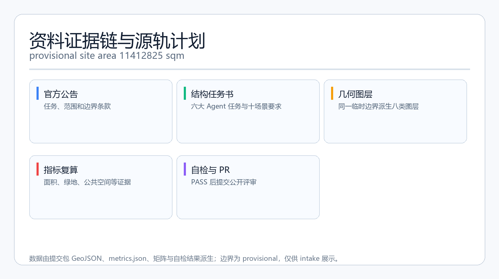
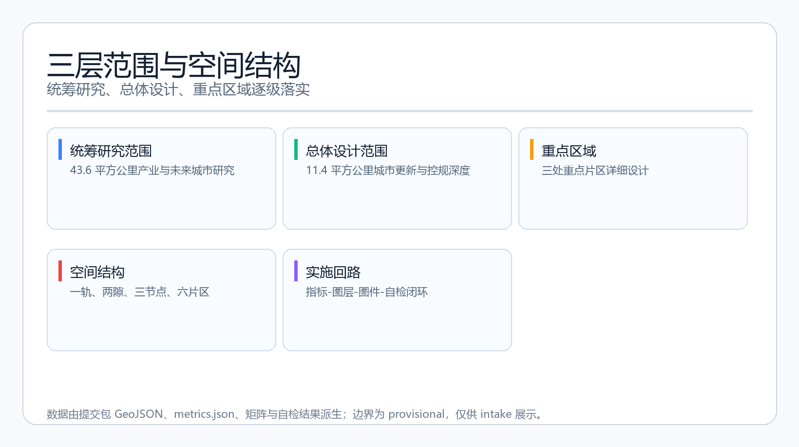
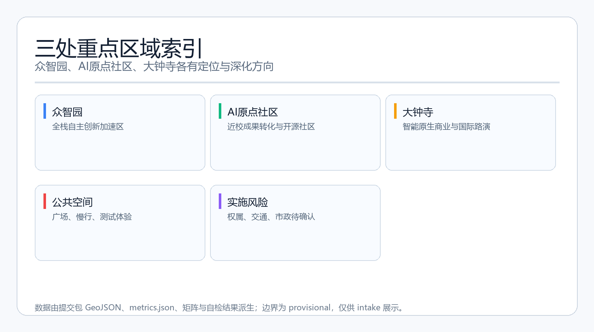
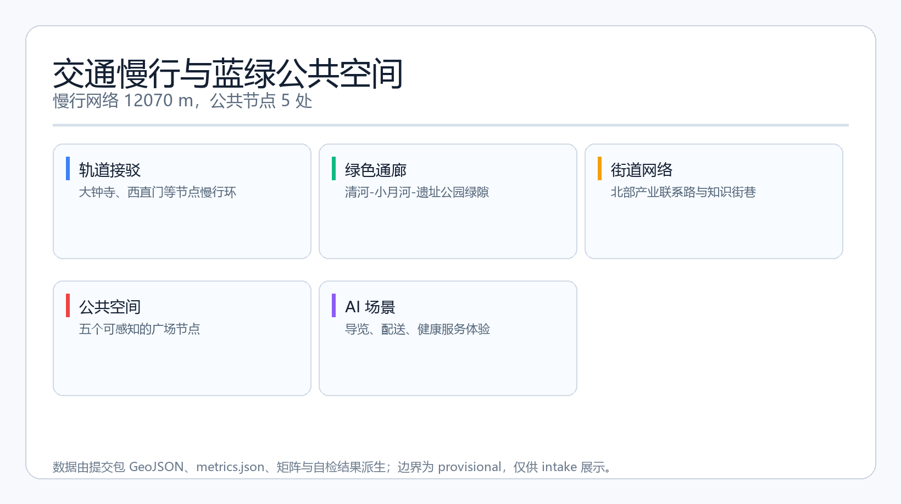
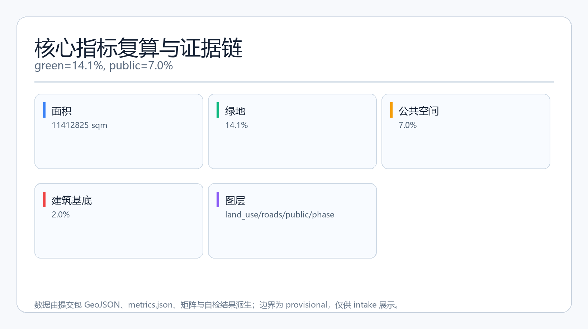

# 源轨计划：百年京张AI创新带开源生长方案

## 设计依据与资料清单

本方案使用 `brief/site-package/` 中的结构化任务书、枚举、允许设计空间、指标范围、标准参考和 schema 作为主要依据 [source:SITE-PACKAGE]。资料可用性以 `data/source_registry.json` 为准 [source:SOURCE-REGISTRY]，并通过 `data/processed/agent_fact_pack.md` 快速核对范围、任务、来源用途和缺资料清单 [source:PROCESSED-FACT-PACK]。公告正文及附件要求对应 1.3、1.4、1.5 的主控任务 [source:OFFICIAL-ANNOUNCEMENT]，同时遵守本地标准快照 `brief/site-package/standards/references/` [standard:PROJECT-OFFICIAL-ANNOUNCEMENT]。用户补充提供的公众号文章只作为背景性介绍，不提供空间权威数据 [source:WECHAT-INTRO]。

当前仓库尚未提供官方总体设计 polygon 和三处重点区域 polygon，因此本包使用 `provisional_boundaries.geojson` 中明确标注的临时范围开展生成、展示和自检 [source:BOUNDARY-SOURCE] [source:KEY-AREA-SOURCE]。所有面积、图层和指标都只在临时边界内成立，官方边界发布后必须重算。现状诊断部分以公开任务书、标准、provisional 边界和文字四至为输入，形成的是“可讨论的现状判断与待补资料清单”，不是现场踏勘或审定规划结论 [depth:existing_conditions_diagnosis] [data:geometry/constraints.geojson]。

本方案对应的证据层包括：`proposal.md` 为唯一主体文本；`geometry/*.geojson` 承载空间判断；`metrics.json` 承载指标复算；`sources.json` 和 `assumptions.json` 说明来源与假设；`compliance_matrix.json`、`standard_matrix.json`、`design_depth_matrix.json` 说明任务、标准和深度覆盖；`assets/figures/*.png`、`report/proposal.html`、`visual/index.html` 和 A3/A0 PDF 为展示层。文字、图件和机器数据不互相替代，若出现差异，以 JSON/GeoJSON 的确定性证据和最终人工复核为准。

## 三层范围工作框架

统筹研究范围约 43.6 平方公里，用于产业战略、未来城市形态、三区两翼协同和跨区域创新网络研究 [source:DESIGN-BRIEF] [data:geometry/site_boundary.geojson#PROV-SITE-001]。总体设计范围约 11.4 平方公里，用于城市更新、功能布局、公共空间、交通、风貌和实施框架设计，本提交包的全部 geometry 图层和指标均基于总体设计临时边界生成 [source:BOUNDARY-SOURCE]。重点区域范围约 3.68 平方公里，包括众智园AI自主创新加速区、北京AI原点社区和大钟寺AI产业聚集区，对应 `geometry/key_areas.geojson` 的三个 feature [source:KEY-AREA-SOURCE] [data:geometry/key_areas.geojson#PROV-KEY-001] [data:geometry/key_areas.geojson#PROV-KEY-002] [data:geometry/key_areas.geojson#PROV-KEY-003]。

三层范围采用“战略判断—总体结构—重点深化”的递进关系：统筹层回答“创新带如何在全球 AI 城市版图中形成独特价值”；总体层回答“空间结构、功能分区、更新对象和公共系统如何支撑这一价值”；重点层回答“三个核心区各自做什么、如何与周边协作、先从哪里开始”。这对应标准中城市设计统筹平面和立体空间的要求 [standard:MOHURD-URBAN-DESIGN-MEASURES]，并落实为设计深度项“三层范围工作框架” [depth:three_level_scope_framework]。

由于三处重点区域也是 provisional，所有面积、建筑规模、道路线位和拆改留判断均只能作为方向性概念，不能作为审批、权属或工程结论。替换官方 polygon 后，`site_boundary.geojson`、`key_areas.geojson`、`land_use.geojson`、`buildings.geojson`、`roads.geojson`、`green_space.geojson`、`public_space.geojson`、`phasing.geojson` 和全部面积指标都需要重算。

## 统筹研究范围产业与未来城市研究

本方案提出主名称“源轨计划”，英文名 `SOURCE RAIL`，副名“百年京张AI创新带”。命名不指向任何单一企业或园区，而是把詹天佑设计的京张铁路转译成“公共源基础设施”：铁路曾经是人的交通轨道，未来可以成为代码、知识、场景和治理公共服务的开源轨道 [source:AGENT-TASKBOOK]。Logo 方向采用“两条平行铁轨 + 一个开放节点 + 一条生长线”的组合：铁轨代表历史与秩序，开放节点代表开源与协作，生长线代表数据、人才和场景沿轨道不断延伸；文字标识可使用中性无衬线体，核心图形应便于黑白印刷、地面铺装、网页和碑刻缩略使用。

统筹层回应三大定位：百年京张文化带、都市AI生活体验带、AI融合创新带。五大功能对应：AI全栈自主创新体系、世界级AI创新生态、AI+场景赋能新范式、智能化AI活力城市、AI治理全球话语权 [source:DESIGN-BRIEF]。三区两翼协同回路为：AI原点社区承担近校成果转化、开源社区和人才服务；众智园承担全栈自主创新、安全治理和算力测试；大钟寺承担智能原生商业、国际路演和数据要素服务；中关村科技服务翼提供资本、IP、人才和企业服务；小月河场景赋能翼提供 AI+生活、交通、健康和公共空间体验 [source:AGENT-TASKBOOK] [source:TRACKS]。

全球 AI 创新生态案例用于提炼可迁移的空间和运营方法，不引用未经核实的企业数据。案例表如下：

| 案例 | 空间组织经验 | 可迁移机制 |
| --- | --- | --- |
| 旧金山湾区科技走廊 | 沿交通走廊组织高校、企业、孵化器和风险投资节点 | 源轨沿线设置“基础研究—测试—资本—场景”梯度 |
| 伦敦国王十字更新 | 以交通枢纽和旧工业空间承载知识经济集群 | 大钟寺站周边做轨道站点一体化和公共界面更新 |
| 新加坡裕廊湖区 | 园区、公园、科研设施与城市服务复合 | 众智园把测试、展示、治理与花园环境结合 |
| 多伦多滨水区智慧城概念 | 公共数据、传感器和城市治理同步设计 | 小月河场景翼设置可人工复核的公共数据体验 |
| 赫尔辛基开放数据与公共服务 | 以开放数据和市民反馈驱动公共服务设计 | AI公共服务场景保留非数字化替代路径 |
| 巴塞罗那22@创新区 | 旧工业街区混合创新、居住和公共空间 | 大钟寺与原点社区采用小街区、多入口模式 |
| 深圳湾科技园区 | 以科研机构、产业楼宇和滨海公共空间形成创新环 | 源轨公园作为连接高校、企业与公共空间的共享中轴 |

这些案例共同指向三个空间结论：一是创新带需要连续、可步行的公共源轨道，而非孤立园区；二是研究、测试、资本、场景和治理需要沿同一空间轴线形成闭环；三是文化叙事不是装饰，而是人才识别城市价值的入口。以上结论落到 `geometry/land_use.geojson` 的用地分区、`geometry/roads.geojson` 的慢行网络和 `geometry/public_space.geojson` 的公共节点 [standard:PROJECT-AGENT-OPEN-CALL-TASKBOOK] [depth:overall_spatial_structure] [metric:ai_innovation_land_ratio]。

## 总体设计范围城市更新与控规深度城市设计

总体空间结构采用“一轨两隙三节点六片区”。一轨是沿京张遗址公园形成的源轨开源散步道，把文化、教育、产业、生活场景串成一条连续的公共轴线；两隙分别是清河—众智园蓝绿隙和小月河—大钟寺场景隙；三节点是 AI原点社区、众智园和大钟寺；六片区是在临时边界内按功能特征划分的研发、教育、绿地、商业、文化和人才社区片区 [source:SITE-PACKAGE] [standard:MOHURD-URBAN-DESIGN-MEASURES] [depth:overall_spatial_structure] [data:geometry/land_use.geojson#LU-001]。

产业目标不是把所有地块都变成写字楼，而是形成“创新密度分层”：核心节点提供高密度创新交往，周边提供人才居住、高校科研、社区服务和公共生活。功能布局上，AI研发创新用地约占总面积的 6.4%，绿地与开敞空间约 14.1%，公共空间约 7.0%，建筑基底约 2.0%。这些比例是概念性的空间供给信号，不是审定控规指标 [metric:ai_innovation_land_ratio] [metric:green_ratio] [metric:public_space_ratio] [metric:building_footprint_ratio]。

城市更新总体框架采用“保、改、联、试”四类动作：保留历史遗存和成熟社区；改造高校周边低效界面、轨道沿线空间和产业园区入口；连接慢行断点、轨道站点和公共绿地；试点 AI 场景、治理展示和开源活动。所有更新动作都依赖现状权属、建筑质量和工程条件核查，当前没有官方控规、道路红线、文物控制线和市政资料，因此不能给地块级拆改留结论 [standard:MOHURD-CONTROL-DETAILED-PLANNING] [depth:development_intensity_controls] [depth:retain_renovate_demolish]。

## 重点区域详细设计

三个重点区域均达到“定位—空间结构—建筑更新—交通慢行—公共空间—AI场景—实施风险”的详细设计深度，但所有结论均基于 provisional 边界，只作为概念建议 [depth:three_key_area_detailed_design]。

众智园AI自主创新加速区的定位是“花园型全栈自主创新街区”。空间结构上，沿清河界面形成创新客厅，中部设置安全治理展示与算力体验节点，南部衔接轨道联系路。建筑更新以现有产业楼宇、公共建筑和低效界面的“保留优化 + 绿色更新 + 局部新建”为方向，不预设拆除范围。公共空间强调可预约、可展示、可监管的测试场，AI 场景包括安全治理沙盒、低碳算力体验、标准工作坊和端侧算力驿站。实施风险主要是权属分散、产业楼宇改造条件不明和市政容量待确认 [data:geometry/key_areas.geojson#PROV-KEY-001] [depth:three_key_area_detailed_design]。

北京AI原点社区的定位是“近校型成果转化与开源人才社区”。空间结构以高校校区、创新园区和社区街巷的慢行缝合为核心，设置成果发布厅、知识产权服务点、开源协作站、人才公寓和社区服务节点。建筑更新尊重现状教育科研与居住功能，重点改造街道界面、公共通道和底层服务空间。AI 场景包括开源发布厅、近校成果转化街、AI 教育体验点、人才服务驿站在内的高频创新交往场景。实施风险主要是高校权属边界、校园数据授权和居住环境影响 [data:geometry/key_areas.geojson#PROV-KEY-002] [depth:three_key_area_detailed_design]。

大钟寺AI产业聚集区的定位是“城市型智能经济与国际交往街区”。空间结构围绕轨道站点做四象限步行连通，形成国际路演客厅、智能商业体验街、数据要素服务点和轨道接驳环。建筑更新以商业商务空间、公共服务设施和站点周边公共界面的复合化为主，不给出具体改造边界。AI 场景包括智能体与智能终端展示、内容消费体验、数据要素会客厅、国际路演和投融资服务。实施风险主要是站点客流、商业业态、交通组织和公共安全规则需要专业复核 [data:geometry/key_areas.geojson#PROV-KEY-003] [depth:three_key_area_detailed_design]。

## AI 创新生态、人才画像与 AI+ 场景

AI 创新生态围绕“高校—企业—开发者—居民—公共治理”五类核心用户组织。用户画像如下：

| 用户画像 | 典型需求 | 空间响应 | 合规边界 |
| --- | --- | --- | --- |
| 开源开发者 | 发布、协作、测试、社区声誉和长期纪念 | 原点社区开源发布厅、贡献荣誉墙、夜间协作空间 | 不采集个人行为轨迹；活动数据只做聚合统计 |
| 初创团队 | 低成本办公、算力入口、产品试验场 | 众智园共享测试场、端侧算力服务点、标准治理咨询 | 算力和数据服务需另行授权 |
| 头部企业访客 | 展示、商务、国际接待、人才招聘 | 大钟寺国际路演客厅、轨道站点接驳、公共空间 | 企业标识和案例须清权 |
| 周边居民 | 通勤、休闲、社区服务、低扰动更新 | 遗址公园慢行环、社区服务嵌入、夜间照明分级 | 不将居民画像用于商业推荐 |
| 高校师生 | 成果转化、跨校协作、日常慢行 | 校区—园区慢行缝合、成果转化驿站、AI教育体验点 | 校园数据和科研成果需授权 |

AI 场景卡共 10 张，覆盖空间、交通、公共服务和产业测试：

| 场景卡 | 空间载体 | 服务对象 | 运行数据 | 隐私与人工复核 | 图层/风险 |
| --- | --- | --- | --- | --- | --- |
| 01 开源发布厅 | AI原点社区 | 开发者、高校、初创团队 | 活动报名、作品展示 | 不采集代码内容，人工策展 | public_space，低风险 |
| 02 安全治理沙盒（产业测试） | 众智园 | 模型企业、监管研究者 | 测试用例、评测结果 | 测试数据授权，人工复核 | public_space，中风险 |
| 03 端侧算力驿站（产业测试） | 总体设计范围节点 | 开发者、初创团队 | 算力使用量 | 匿名计量，人工审批 | land_use，中风险 |
| 04 AI慢行导航 | 京张遗址公园活力带 | 通勤者、游客、学生 | 匿名步行需求、无障碍反馈 | 不追踪个体，人工复核 | roads，中风险 |
| 05 大钟寺国际路演客厅 | 大钟寺AI产业聚集区 | 企业、投资机构、国际访客 | 会议预约、媒体发布 | 访客信息授权，人工审核 | public_space，低风险 |
| 06 清河低碳创新廊 | 众智园临清河界面 | 居民、企业员工 | 环境监测、活动预约 | 只保留聚合数据，人工确认 | green_space，低风险 |
| 07 近校成果转化街 | 北京AI原点社区 | 高校师生、创业团队 | 转化服务申请 | 科研成果授权，人工审核 | land_use，中风险 |
| 08 数据要素会客厅 | 大钟寺AI产业聚集区 | 数据服务商、企业 | 数据资源目录 | 不汇集个人敏感数据，人工评审 | public_space，中风险 |
| 09 机器人配送慢行试验（产业测试） | 小月河与遗址公园边缘 | 居民、企业、访客 | 配送路径、任务日志 | 低速、限时、可退出，人工监督 | roads，中风险 |
| 10 AI公共服务导航 | AI+公共服务节点 | 老人、居民、游客 | 服务入口使用 | 不采集医疗隐私，人工客服兜底 | public_space，低风险 |

以上场景卡对应标准场景注册表 [source:SCENARIOS]，并覆盖任务书要求的 AI+信软、AI+医疗、AI+教育、AI+法律、AI+生活服务、AI+交通、AI+公共空间等方向 [source:AGENT-TASKBOOK] [standard:PROJECT-AGENT-OPEN-CALL-TASKBOOK]。AI+医疗和公共服务只做导航与预约辅助，不替代医生判断；AI+交通只提供建议和反馈，不直接控制信号或车辆；所有涉及个人数据的场景均要求授权、脱敏、聚合和人工复核 [depth:three_key_area_detailed_design] [metric:public_space_node_count]。

## 用地、建筑规模与拆改留方案

用地布局依据 `land_use.geojson` 将临时边界划分为 7 个概念分区，覆盖全边界且没有重叠 [data:geometry/land_use.geojson#LU-001]。分区采用自然国土空间用地分类代码 [source:ENUMS]，包括 AI研发创新用地、教育科研用地、公园绿地、商业服务业用地、文化用地、人才社区和社区服务设施用地，符合用地分类标准 [standard:MNR-LAND-USE-CLASSIFICATION-GUIDE] [depth:land_use_layout]。

建筑基底生成 6 个概念性 footprint，类型包括 AI 研发、实验室、孵化器、教育配套、混合功能和人才公寓 [data:geometry/buildings.geojson#BLDG-001] [metric:building_footprint_count] [metric:building_footprint_area_sqm]。这些 footprint 是表达空间供给的示意形体，不是批准建筑方案，也不代表容积率或建筑高度。建筑规模采用“保留为主、改造界面、局部新建原型”的拆改留方向：保留历史遗存、成熟社区和高校科研设施；改造沿线低效界面、轨道站点周边和公共通道；新建只针对未来公共节点、测试设施和少量人才服务空间，且必须等待官方控规和权属资料 [standard:MOHURD-CONTROL-DETAILED-PLANNING] [standard:MOHURD-ARCH-DESIGN-DEPTH-2016] [depth:development_intensity_controls] [depth:height_massing_character] [depth:retain_renovate_demolish] [source:ALLOWED-DESIGN-SPACE]。

由于 `planning_limits.json` 记录 FAR、建筑高度、建筑密度、绿地率和退线均为 missing，本方案不给出法定容积率、建筑高度或拆改规模；这些只能作为待补条件写入 `assumptions.json`，由专业团队在官方资料发布后复算 [source:PLANNING-LIMITS] [source:STANDARDS]。

## 交通、轨道、市政与公共服务设施

交通策略以“轨道接驳优先、慢行连续、配送可监管”为原则。道路图层生成源轨开源散步道、北部产业联系路、高校街区慢行联系路、大钟寺轨道接驳环和京张遗址慢行斜线 [data:geometry/roads.geojson#ROAD-001] [depth:traffic_rail_slow_parking]。总道路网络长度约 14468 米，其中绿道、步行和骑行慢行网络约 12070 米 [metric:road_network_length_m] [metric:slowway_network_length_m]。轨道站点一体化以既有站点和未来接驳空间为研究对象，建议在站前广场、自行车停放、无障碍路径和公共活动之间形成明确分级，不给出线路、站位或工程结论。

市政与新型基础设施采用“共享化、可升级、低侵入”策略：端侧算力驿站与公共服务建筑、社区中心结合，不新建独立大型机房；分布式能源和绿化灌溉优先利用既有市政与公园系统；机器人和配送测试限定在低速、限时、可退出、有围护的试点空间。市政承载力、管线、能源负荷和道路红线均缺少官方资料，因此本方案只提出设施类型和空间耦合原则 [depth:municipal_new_infrastructure] [data:geometry/public_space.geojson#PUBLIC-001]。

公共服务设施沿源轨布置，形成“创新服务 + 生活服务 + 公共治理服务”三类：创新服务包括成果发布、算力咨询、知识产权、投融资和国际路演；生活服务包括社区医疗导航、教育体验、人才公寓和日常商业；公共治理服务包括安全治理沙盒、公众反馈和人工复核节点。所有服务不依赖指定供应商，允许公开招募和逐步替换 [source:SCENARIOS] [depth:municipal_new_infrastructure] [metric:public_space_node_count]。

## 蓝绿空间、公共空间与城市风貌

蓝绿空间以“京张遗址公园活力带 + 清河—小月河蓝绿隙 + 口袋公园”为骨架。绿地图层生成 14.1% 的连续绿地与开放空间，公共空间图层生成 5 个概念广场 [data:geometry/green_space.geojson#GREEN-001] [data:geometry/public_space.geojson#PUBLIC-001] [metric:green_space_area_sqm] [metric:public_space_area_sqm] [depth:blue_green_public_space]。这些空间不追求网红化，而是承担日常停留、知识交流、测试展示、文化纪念和无障碍通行的复合功能。

城市风貌强调“铁路线性记忆 + 海淀学院气息 + AI 新工业克制感”：沿源轨采用低反光、浅色和可识别材料；建筑体量从高校街区到产业节点逐步清晰，不设置夸张地标；屋顶优先作为公共绿化、太阳能或活动空间；标识系统与 Logo 保持一致，不把文化标识和整体 Logo 混用 [standard:MOHURD-URBAN-DESIGN-MEASURES] [depth:blue_green_public_space] [depth:height_massing_character]。

AI 朝圣地标提出 3 个概念节点：其一是“智能体贡献荣誉墙”，位于AI原点社区，用于记录首批参与城市设计的 Agent 和贡献者 GitHub Name；其二是“开源成果展示廊”，沿源轨布置，展示方案、代码、数据集和评审过程；其三是“人工智能里程碑广场”，位于众智园与大钟寺之间的公共节点，以年度事件和碑刻方式更新。三个节点均与京张铁路文化、中关村创新文化和开发者社区相关，但都是概念建议，实际位置、形式和建设需经专业团队、文物和公共安全审查 [source:AGENT-TASKBOOK] [depth:blue_green_public_space] [data:geometry/public_space.geojson#PUBLIC-003]。

## 更新项目清单、实施政策与分期计划

更新项目清单按“近期公共体验、中期街区缝合、远期产业深化”三阶段组织，对应 `geometry/phasing.geojson` 的 3 个概念分期 [data:geometry/phasing.geojson#PHASE-001] [depth:renewal_project_list] [depth:phasing_implementation] [metric:phase_count]。近期以低改造成本、可撤回、可公开复核的公共空间和场景原型为主，例如开源发布厅、慢行导航、安全治理展示；中期推进高校—园区缝合、轨道站点周边公共界面、机器人和配送测试；远期再结合官方控规深化建筑规模、产业空间和市政系统。

实施政策建议围绕“公开资料开放、场景授权试点、更新项目分档、运营主体多元”展开。每个项目都应列明依赖条件、空间位置、建议运营主体、公众参与方式和退出机制；建议建立年度更新清单，由规划、交通、市政、数据安全、文旅和社区代表共同复核 [source:AGENT-TASKBOOK] [depth:renewal_project_list]。

长期运营机制包括年度活动体系：春季“源轨开源日”，发布年度成果、更新荣誉墙；夏季“AI场景开放周”，开放测试场地、慢行导览和公共服务体验；秋季“全球AI创新路演周”，面向企业、开发者、投资机构和国际访客；冬季“治理与复盘季”，开展公众反馈、风险复盘和下一轮方案迭代。活动品牌、开发者社区、场景开放和招引转化都应是可持续的运营机制，而不是一次性活动；所有活动安排均为概念建议，不构成已确定政府安排 [source:AGENT-TASKBOOK] [depth:phasing_implementation] [data:geometry/phasing.geojson#PHASE-003]。

## 指标体系、面积复算与合规矩阵

核心指标由 geometry 图层投影到 EPSG:4548 后复算 [source:STANDARDS]。本方案的关键指标如下：

| 指标 | 值 | 公式 | 设计含义 |
| --- | --- | --- | --- |
| 总体设计面积 | 11412825 平方米 | projected_area(site_boundary) | 定义所有图层的计算范围，provisional |
| 绿地面积 | 14.1% | green_area / site_area | 支撑慢行、生态和人才生活 |
| 公共空间率 | 7.0% | public_area / site_area | 支撑创新交往和公共文化 |
| 建筑基底率 | 2.0% | building_area / site_area | 概念性建筑供给信号 |
| AI创新用地率 | 6.4% | area(LU-0802) / site_area | 产业空间主轴 |
| 慢行网络长度 | 12070 米 | sum(greenway/pedestrian/cycleway) | 衡量源轨可步行性 |
| 公共节点 | 5 处 | count(public_space) | 衡量场景可感知度 |
| 重点区域 | 3 处 | count(key_area) | 覆盖任务书要求 |
| 分期数量 | 3 个 | count(phasing) | 落地顺序 |

上述指标同时引用 `[metric:site_area_sqm]`、`[metric:green_space_area_sqm]`、`[metric:public_space_area_sqm]`、`[metric:building_footprint_area_sqm]`、`[metric:green_ratio]`、`[metric:public_space_ratio]`、`[metric:building_footprint_ratio]`、`[metric:ai_innovation_land_ratio]`、`[metric:key_area_count]`、`[metric:land_use_polygon_count]`、`[metric:phase_count]`、`[metric:road_network_length_m]`、`[metric:slowway_network_length_m]`、`[metric:public_space_node_count]`、`[metric:building_footprint_count]`、`[metric:land_use_area_sqm]`。FAR 和建筑高度为 unknown，原因是官方控规缺失 [source:PLANNING-LIMITS] [depth:metrics_recalculation]。

`compliance_matrix.json` 覆盖公告 1.3、1.4、1.5 和 `agent.1` 至 `agent.6` 全部必答任务；`standard_matrix.json` 覆盖本地标准快照；`design_depth_matrix.json` 覆盖 15 项正式深度要求。所有合规判断都是“本方案是否回应”，不是“本方案是否已获批准” [source:SITE-PACKAGE] [source:SOURCE-REGISTRY] [depth:metrics_recalculation]。

## 风险、版权与合规说明

本方案最大风险是数据缺口：官方边界、控规、道路红线、权属、市政、文物和工程条件均未提供，任何面积和空间结论都可能随官方数据发布而变化 [depth:risk_missing_data]。因此本方案在 `proposal.md`、`visual/index.html`、`sources.json`、`assumptions.json` 和自检结果中醒目标注 provisional 状态，并要求正式评分前重算。版权和合规声明见 `report/copyright_statement.md`，所有文字、图件、几何、指标和 PDF 均由声明中的 Agent 生成，使用公开或用户提供且已清权资料，不使用未授权图片、字体、商标、人物肖像或内部规划图件 [source:SOURCE-REGISTRY] [standard:MOHURD-ARCH-DESIGN-DEPTH-2016]。

本方案不包含非公开数据、个人敏感数据、伪造官方背书或政府承诺；不把“概念建议”“参考方案”写成已确定结论；不替代专业规划、政府审定或工程建设。所有 AI 场景均允许人工复核、公众反馈、退出和失败，不把未成熟技术写成已全面部署 [source:AGENT-TASKBOOK] [depth:risk_missing_data]。

## 参考资料

- `brief/site-package/design_brief.json`
- `brief/site-package/allowed_design_space.json`
- `brief/site-package/agent_taskbook.json`
- `brief/site-package/sources.json`
- `brief/site-package/standards/standards.json`
- `brief/site-package/standards/references/index.json`
- `data/source_registry.json`
- `data/processed/agent_fact_pack.md`
- `brief/site-package/schemas/compliance_matrix.schema.json`
- `brief/site-package/schemas/standard_matrix.schema.json`
- `brief/site-package/schemas/design_depth_matrix.schema.json`
- 用户补充的公众号文章作为背景来源，不作为空间权威依据 [source:WECHAT-INTRO] [source:SITE-PACKAGE]
