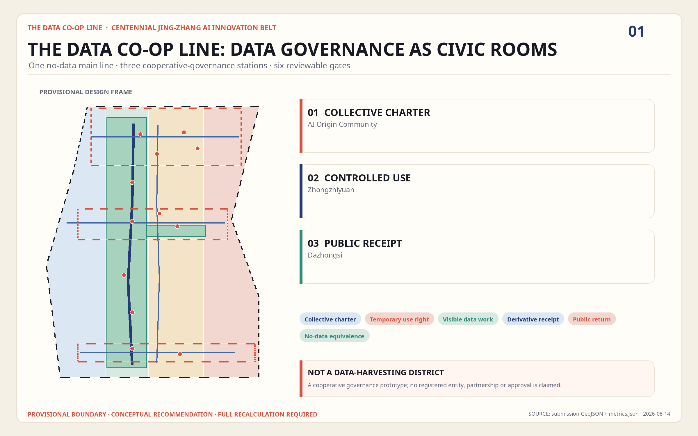
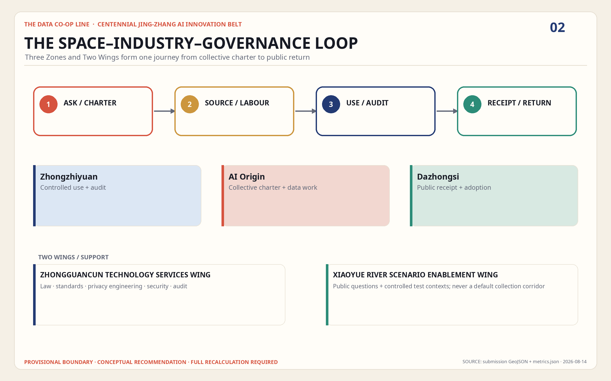
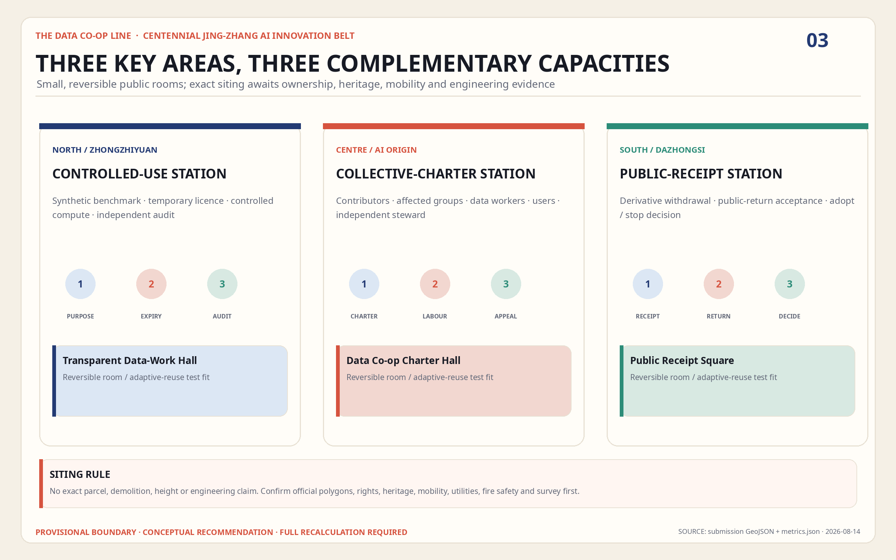
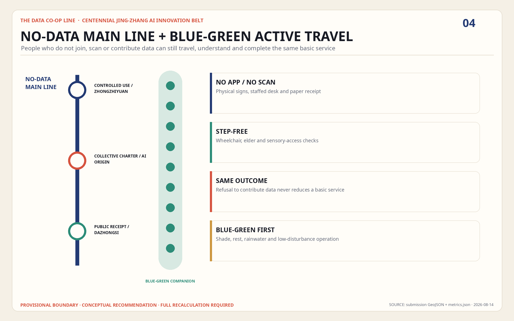
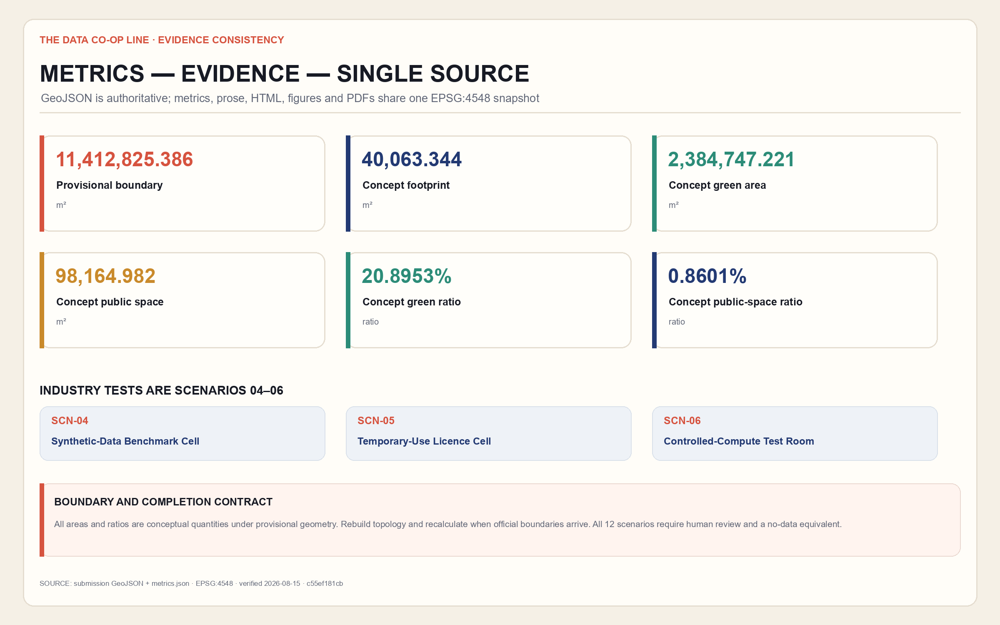

# THE DATA CO-OP LINE / 共数京张

“Co-data” does not mean asking everyone to surrender more data. It means making visible who frames a question, who contributes material, who performs the computation, who receives value, and who must correct an error. The proposal translates the linear infrastructure that once organized passengers and freight on the Jing-Zhang Railway into a civic line for purpose permissions, controlled compute, public return, and withdrawal receipts. At the same time, anyone may take a “no-data-equivalent main line” and receive the same core service without supplying optional personal data. This is an urban-design and operational reference for professional and public development, not an approved plan, an incorporated cooperative, or a committed implementation project.

## Design Basis and Source List

The proposal first responds to the official announcement for the Centennial Jing-Zhang AI Innovation Belt and the Agent taskbook. Coordinated research, overall design, three key areas, the AI innovation ecosystem, and long-term operations must check one another; a single technology pavilion cannot substitute for the belt. The announcement's 43.6 sq km, approximately 11.4 sq km, and 368.4 ha figures define work scales. The computable boundary in this package comes from repository provisional geometry, so the two classes of figures must not be conflated. The announcement, taskbook, local standard snapshots, and registry of permitted source uses form the factual entry points [source:OFFICIAL-ANNOUNCEMENT] [source:AGENT-TASKBOOK] [source:SOURCE-REGISTRY].

Evidence is used in four tiers. The announcement, taskbook, and local standards define tasks and professional depth. Public or rights-cleared records accepted in `data/source_registry.json` support formal statements. Seven primary-source international cases support comparison of particular institutional mechanisms, but do not prove legality or feasibility in Beijing. Finally, `brief/site-package/geometry/provisional_boundaries.geojson` and every design layer derived from it serve only provisional generation, discussion, and recalculation. The processed fact pack organizes reading; it does not elevate any source's authority [source:PROCESSED-FACT-PACK].

The current `site_boundary.geojson` and the three areas in `key_areas.geojson` are treated throughout as provisional constraints. They are not official planning boundaries and cannot support land acquisition, displacement, approval, precise land valuation, or statutory capacity conclusions. Land use, buildings, roads, green space, public space, constraints, and phasing inherit the same precision. When an official polygon, regulatory plan, ownership record, road boundary, utility survey, heritage control, or building survey becomes available, topology must be rebuilt from the boundary and all projected metrics recalculated; replacing one basemap is insufficient. The machine-read site value describes only this provisional computation package [data:geometry/site_boundary.geojson#SITE-001] [source:BOUNDARY-SOURCE].

The seven global examples are likewise treated as partial mechanisms rather than turnkey successes. Liverpool addresses participatory stewardship; MIDATA, cooperative governance; DECODE, flexible authorization; AMdEX, machine-readable agreements; Open Humans, tiered sharing; the Greenwich Data Trust pilot, independent stewardship; and the Amsterdam Algorithm Register, public registration. Their urban institutions, sectors, lifecycles, and legal settings differ from Haidian. Complete URLs, dates, rights, and limitations belong in `sources.json`; the prose cites each case next to the design judgment it informs. One audit principle follows: a number without a source does not become a metric, a judgment without formal spatial conditions does not become a control, and a service without a clear withdrawal boundary is not advertised as “fully revocable.”

## Three-Level Scope Framework

One question runs through the three levels: how can the data cooperation required by AI industry occur without turning communities into passive data mines? The 43.6 sq km Coordinated Research Area is the strategic observation scale for relationships among universities, companies, communities, public institutions, and professional services. The announcement's approximately 11.4 sq km Overall Design Area is the urban-renewal scale at which the mechanism reaches corridors, stations, ground-floor interfaces, and infrastructure. The three Key-Area Detailed Design Areas, totaling 368.4 ha in the announcement, test spatial prototypes, operating roles, and risk gates. These are announcement scales, not official areas calculated from the current provisional layers [source:OFFICIAL-ANNOUNCEMENT] [depth:three_level_scope_framework].

The overall structure is “one line, Three Zones and Two Wings, and many stations.” The line follows the Jing-Zhang Railway Heritage Park as a civic data-cooperation route. The three zones are the Zhongzhiyuan AI Independent Innovation Acceleration Area, Beijing AI Origin Community, and Dazhongsi AI Industry Cluster. The two wings are the Zhongguancun Technology Services Wing and Xiaoyue River Scenario Enablement Wing. The stations support agenda intake, permission assistance, controlled compute, testing, return settlement, no-data service, and cultural interpretation. This is not an added planning boundary; it is a method for overlaying industrial, public-space, and governance processes on the existing city. The count of three required areas is checkable, while their shape and area remain pending official data [metric:key_area_count] [data:geometry/key_areas.geojson#PROV-KEY-001].

| Level | Judgment to make | Spatial move | Review threshold |
| --- | --- | --- | --- |
| Coordinated Research Area | Which urban questions merit data cooperation | Map agendas and comparative cases across universities, firms, and communities | Never present interest in cooperation as a confirmed partnership |
| Overall Design Area | How can computation occur without moving raw data | Network controlled-compute and public-service stations along the walking and cycling line | Lock provisional constraints before deriving every design layer |
| Key-Area Detailed Design Area | Who deliberates, works, benefits, and exits | Assign one complete segment of the governance chain to each area | Show function, buildings, transport, public space, and operation together |

The levels form a loop: strategic agenda, purpose ticket, controlled compute, scenario validation, public return, and expiry or withdrawal. An issue framed at the research level must find a host at the overall level and be tested with real users and professional teams in a key area. Discrimination, accessibility failure, energy cost, or withdrawal difficulty found in a key area returns to the research level to amend the rules. Every service also draws a no-data-equivalent line: a person who declines optional personal-data sharing can use a staffed counter, anonymous ticket, offline guidance, or on-device processing without a worse price, queue priority, or basic safety guarantee. The structured spatial framework is carried by the overall and key-area layers [depth:overall_spatial_structure] [data:geometry/land_use.geojson#LU-001].

## Coordinated Research Area: Industry and Future City Research

The proposal makes three positioning statements. First, it is a **public-interest data-cooperation test corridor**: not a market that sells data, but a place where a problem is collectively set before a time-limited, purpose-bound, auditable temporary purpose right is granted. Second, it is a **data-worker-friendly AI validation community**: collection, cleaning, annotation, correction, interpretation, and withdrawal are treated as labor, and contributors have a seat in task rules, compensation or public return, quality disputes, and exit terms. Third, it is a **future-city salon legible through Jing-Zhang culture**: tickets, timetables, waybills, and platforms become purpose tickets, compute windows, derivative-chain inventories, and receipts. These are conceptual recommendations under the taskbook, not a new district, legal entity, or statutory regime [source:AGENT-TASKBOOK] [standard:PROJECT-AGENT-OPEN-CALL-TASKBOOK].

Five functions form one service chain. **Collective agenda-setting** gathers issues in public and records objections. **Temporary purpose rights and controlled compute** keep raw data within a controlled domain in principle, bringing only an approved query, model, or secure process to the computation. **Industry testing and validation** compare models with synthetic, anonymized, volunteered, or minimum-necessary material. **Withdrawal and public-return settlement** publish derivative status, stop future use, and verify what public benefit can be delivered. **Learning, communication, and annual operation** update the rules through exhibitions, courses, retrospectives, and open days. A temporary purpose right is a design-protocol concept here; it does not make a legal determination about data ownership, intellectual property, or personal-information rights.

| Comparative case | Mechanism to learn from | Boundary that must remain visible |
| --- | --- | --- |
| Liverpool City Region Civic Data Cooperative | Participants discuss stewardship and civic purposes together | A participatory process does not itself create a transferable legal entity or data right [source:CASE-LCR-CIVIC-DATA-COOP] |
| MIDATA Cooperative | Selective access, cooperative governance, and withdrawal records | A Swiss health-data setting cannot be equated with Chinese urban data [source:CASE-MIDATA-COOP] |
| EU DECODE | Barcelona and Amsterdam tested more flexible authorization | The project ended in 2019; its prototypes are not standing public infrastructure [source:CASE-EU-DECODE] |
| AMdEX Data Exchange | Machine-readable and auditable data-sharing agreements | Parts remain ecosystem-building or aspirational and cannot be presented as universally mature [source:CASE-AMDEX-DATA-EXCHANGE] |
| Open Humans | Tiered sharing, deletion requests, and participant control | Copies already given to third parties may not be recoverable; deletion limits must be explicit [source:CASE-OPEN-HUMANS] |
| ODI–GLA Greenwich Data Trust | An urban pilot of independent fiduciary-like stewardship | It was a pilot, not a permanent institution, and did not certify any model as fair or lawful [source:CASE-ODI-GLA-GREENWICH-DATA-TRUST] |
| Amsterdam Algorithm Register | Public registration of algorithmic purpose and accountability information | Registration is a transparency tool, not certification of fairness, safety, or legality [source:CASE-AMSTERDAM-ALGORITHM-REGISTER] |

The industrial goal is therefore not to “aggregate more data.” It is to shorten the preparation time for trustworthy cooperation, reduce the compliant testing burden for small teams, improve traceability of errors, and make public return visible. The Zhongguancun Technology Services Wing connects legal, standards, evaluation, intellectual-property, and compute services. The Xiaoyue River Scenario Enablement Wing connects park, community, mobility, ecological, and public-service questions. The three zones specialize in technical validation, talent and data-worker co-governance, and application plus return settlement. A future city competes not only through model scale, but through the quality of a system and space in which someone can say “no” and continue to live well.

## Overall Design Area: Urban Renewal and Regulatory-Plan-Level Urban Design

The overall framework is a Co-op Line, three hubs, two main service lines, and six station types. The Co-op Line organizes walking, cycling, public activity, and legible guidance along the Jing-Zhang Railway Heritage Park. The hubs are Zhongzhiyuan, AI Origin, and Dazhongsi. A data-participation line serves willing contributors, while the no-data-equivalent line protects those who decline. Station types are the assembly room, purpose-ticket desk, controlled-compute room, test ground, receipt office, and public-return window. They can occupy existing park or campus ground floors, community facilities, station forecourts, or reversible lightweight structures; no wholesale demolition is assumed. The complete land-use partition derives from one boundary topology [data:geometry/land_use.geojson#LU-001] [depth:land_use_layout].

Urban renewal does not add a closed “data-center campus.” It redesigns the section between public and controlled space. The street-facing front provides bilingual explanation, human assistance, no-data service, and agenda displays. The middle hosts bookable co-working, data-labor training, agreement reading, and explanation of model outputs. Only the back holds controlled computation behind access control, segmented networks, logs, and energy monitoring. Raw data is not copied out of the provider's controlled domain by default. Where technical and legal conditions permit, the query, model container, or secure multiparty process enters that domain, and only output that passes disclosure review leaves. This is a design principle; it does not guarantee that every data type or prospective partner can support the arrangement.

At overall scale, a public-space chain is overlaid with industrial services. A five-minute visible zone around a station emphasizes clear paths to enter and exit. Walking and cycling carry daily trips and the “data journey” tour; transit connects the districts; controlled-compute and equipment rooms remain subject to professional review of fire safety, electricity, cooling, noise, and cybersecurity. The current building footprint is a recalculable concept-layer result, not gross floor area or statutory development intensity. Floor Area Ratio, Building Coverage Ratio, height, setbacks, and road boundaries remain pending the official regulatory plan and field survey [metric:building_footprint_area_sqm] [depth:development_intensity_controls].

The service process is written into the spatial sequence. The entrance states what is needed, why, for how long, who may run it, and what might be produced. The assembly table permits collective amendment of the purpose. A purpose ticket grants only time-, purpose-, and output-limited permission. The compute room preserves execution logs. The test ground compares data-enabled and no-data approaches. The receipt office handles expiry, correction, and withdrawal. The public-return window discloses where benefits go and what remains undelivered. The no-data line must be selectable at the same entrance, not hidden behind a farther, slower, or more expensive route. Urban design thus places facilities and makes power legible through distance, interface, and circulation.

## Detailed Design of Key Areas

**Zhongzhiyuan AI Independent Innovation Acceleration Area — Controlled Compute and Standards Validation Hub.** The concept layers a public innovation frontage near the Qing River with controlled computing inside. A public ground floor explains test tasks, energy use, and output rules; a middle floor holds adaptable test cells and professional review seats; the back holds segmented networks, equipment, and a potential waste-heat interface. Industry teams bring an algorithm or query while raw data remains in the provider's controlled domain in principle. Outputs undergo bias, security, privacy, and interpretability review. The “Compute Lantern” landmark uses a low-resolution light band to show whether computation is open, paused, or under audit; it displays no personal or commercial data. The boundary remains provisional [data:geometry/key_areas.geojson#PROV-KEY-001].

**Beijing AI Origin Community — Data Labor and Collective Agenda Hub.** Near-campus innovation must serve not only founders but annotators, community workers, students, disabled users, and people who opt out. The proposal embeds an agenda kitchen, purpose-ticket clinic, data-labor classroom, correction workstations, no-data service desk, and small release room along the interface between knowledge transfer and daily life. Collection and annotation rules, compensation or public return, quality disputes, and withdrawal terms are discussed before a task begins. The “First Receipt Pavilion” uses the form of a railway ticket clip to show an anonymized expiry or withdrawal process. It explains what a receipt confirms and what it does not—especially that it cannot promise complete erasure from an existing trained model. The boundary remains provisional [data:geometry/key_areas.geojson#PROV-KEY-002].

**Dazhongsi AI Industry Cluster — Application Interoperability and Public-Return Hub.** Around transit and commercial interfaces, the concept provides an agent-interoperability test street, digital-asset and content-rights advice, controlled data-collaboration rooms for small firms, a public-return settlement table, and a project ledger visible at night. Testing defaults to synthetic transactions, willing enterprise samples, edge processing, and human comparison rather than collecting more customer trajectories. The “Co-author Commons” displays workers, communities, and maintainers by agenda and contribution type, anonymously or by chosen attribution. It does not rank people by data volume or turn recognition into pressure to consent. Four-quadrant walking links and exact facility locations require transport, ownership, and utility verification [data:geometry/key_areas.geojson#PROV-KEY-003].

Together the areas provide the full journey of one cooperation. AI Origin frames the agenda and labor rules; Zhongzhiyuan runs controlled computation and model validation; Dazhongsi tests interoperability, discloses public return, and enables public experience. Any step may pause because evidence is insufficient, risk exceeds the agreed threshold, or participants withdraw. The three landmarks are not advertising monuments to technology firms. They turn compute status, exit boundaries, and shared authorship into urban memory. Architectural form, fire safety, capacity, cost, operator, and approval all require professional development; none can be inferred as an implementation conclusion from the concept plan [depth:three_key_area_detailed_design].

## AI Innovation Ecosystem, Personas, and AI+ Scenarios

The Data Co-op Line is not a one-way “company—data—model” chain. It is a loop of problem framers, data workers, rights and compliance support, controlled-compute operations, model teams, scenario users, independent reviewers, and recipients of public return. Suggested governance seats cover communities and service users, data workers, technical and industry teams, public-interest and accessibility representatives, and legal, ethics, and security expertise. Exact shares, legal form, and voting effect require lawful deliberation; this proposal does not establish a governing body. Each task publishes a readable purpose ticket before controlled compute and scenario testing, then returns results, objections, derivative status, and settlement state to a public ledger [standard:PROJECT-AGENT-OPEN-CALL-TASKBOOK] [source:CASE-LCR-CIVIC-DATA-COOP].

**Seven principal personas.** A resident asks whether declining to share will affect daily life. A data annotation or cleaning worker asks about rules, compensation, attribution, disputes, and exit. A disabled person or someone with limited digital literacy needs a staffed, accessible, offline main line. A university researcher needs reproducibility without overreach. A startup needs low-barrier but bounded validation. A local small-business operator needs collaboration without exposing trade secrets. A public-service or front-line maintenance worker needs a tool that can be corrected and rolled back without shifting accountability to an algorithm. Children, older people, or other specially protected groups require separate guardian, ethics, and necessity review in any concrete task; blanket consent cannot cover them.

The following twelve scenario cards use the `SCN-01`–`SCN-12` registry order, bilingual names, and types in `public_space.geojson`. `SCN-04`–`SCN-06` are the three industry tests and must pass professional, ethics, and working-stop gates before opening. Every card states its space, participants, data method, and no-data line; the prose no longer maintains a conflicting scenario sequence.

| Scenario card | Node and principal users | Cooperation action | Boundary and no-data-equivalent line |
| --- | --- | --- | --- |
| SCN-01 Community Data-Charter Table | AI Origin; residents, researchers, and data workers | Amend purpose, term, output, return, and stop conditions line by line | Anonymous speech and paper objections are accepted; consent is not an admission ticket |
| SCN-02 Provenance and Licence Clinic | Co-op Line service stops; contributors, small firms, rights and compliance staff | Check provenance, permitted scope, recipient, term, and onward-sharing limits | Staffed and offline explanation is available; unproven provenance or rights stop entry into testing |
| SCN-03 Visible Data-Work Studio | AI Origin; collectors, cleaners, annotators, and reviewers | Try samples, estimate labor time, and publish quality disputes, attribution, return, and exit | Declining a high-risk task must not reduce access to other tasks; the legal labor relationship is determined professionally |
| SCN-04 Industry test: Synthetic-Data Benchmark Cell | Zhongzhiyuan; model teams, wheelchair users, cyclists, and evaluators | Compare occlusion, night, and accessibility performance using synthetic, public, or explicitly rights-cleared material | No persistent face capture; a no-data participant may file a paper street report and receive the same remediation response |
| SCN-05 Industry test: Temporary-Use Licence Cell | Dazhongsi; startups, small merchants, and evaluators | Use synthetic orders in an isolated environment to test purpose authorization, expiry, revocation, exception fallback, and human takeover | No live payment; a merchant using template data receives the same compatibility report |
| SCN-06 Industry test: Controlled-Compute Test Room | Zhongzhiyuan and the Two Wings; compute operators, mobility teams, and commuters | Compare local aggregation and controlled queries with a no-personal-trajectory baseline; check output and shutdown | Raw data stays in its controlled domain in principle; declining a trajectory does not reduce fixed guidance, staffed information, or anonymous-count service |
| SCN-07 Bias and Representation Review Table | Three hubs; scenario users, accessibility representatives, and independent reviewers | Examine failure slices, omissions, and human-takeover records by group and condition | Anonymous, synthetic, or paper cases are accepted; joint review is not certification of fairness or legality |
| SCN-08 No-Data Equivalent Service Stop | Heritage Park line; residents, disabled and low-digital-literacy users, and maintenance staff | Compare travel time, price, failure, and complaints across the two main lines | Fixed signs, paper maps, and staffed windows serve people without phones; a gap first triggers service repair |
| SCN-09 Derivative-Chain Withdrawal Drill | First Receipt Pavilion; contributors, compliance and technical staff | Inspect the actionable state of source data, features, versions, models, and reports | Staffed and offline requests are available; receipts distinguish deletion, cessation of future use, and technical inability to roll back |
| SCN-10 Annual Public-Return Settlement Hall | Dazhongsi; participants, community groups, and project teams | Check the beneficiary, due date, acceptance, and undelivered state of fees, resources, or public outputs | Return is not payment for consent; no-data users can equally deliberate universal public uses |
| SCN-11 Cultural-Memory Contribution Stop | Cultural nodes; railway families, residents, and students | Apply separate permissions to audio, transcript, exhibition, research, and model uses | Text-only or in-person storytelling remains possible; public-dissemination and third-party-copy limits are explained in advance |
| SCN-12 Algorithm-Use Register Kiosk | One Line, Three Zones and Two Wings; public, operators, and independent reviewers | Publish purpose, data class, accountable contact, version, assessment, pause, and retirement state | Paper and staffed inquiry remain available; registration supports transparency and is not fairness, safety, or legality certification |

Every scenario passes five gates: minimum data, shortest term, least output, human review, and a working stop mechanism. On withdrawal, the system generates a derivative-chain receipt listing controlled copies that can be deleted, future uses that have stopped, public outputs to remove, model versions requiring reevaluation, and effects that cannot be guaranteed removable because of technical, legal, or third-party control. Withdrawal does not automatically untrain a model and does not promise to recover everything copied by a third party, lawfully or unlawfully. That candid limit distinguishes the proposal from vague promises of “data sovereignty” [source:CASE-OPEN-HUMANS] [source:CASE-MIDATA-COOP].

## Land Use, Building Scale, and Retain-Renovate-Demolish Strategy

Four land-use rules guide the scheme: embed the public interface, place controlled rooms behind it, keep test grounds reversible, and do not displace everyday services. Ground floors on the line prioritize assembly, explanation, no-data service, learning, and public-return display. Controlled-compute and equipment rooms enter existing buildings only where structure, fire safety, power, cooling, and network zoning can support them. Short tests use demountable, restorable facilities. Housing, neighborhood commerce, culture, and routine public services keep independent entries and stable supply. `land_use.geojson` is a closed design partition within the provisional overall boundary; it does not alter statutory land use [data:geometry/land_use.geojson#LU-001] [depth:land_use_layout].

Demolish–Renovate–Retain decisions follow a building-by-building survey and never presume demolition in the name of AI. **Retain** applies where structure, fire safety, ownership, and use permit a light interface update. **Renovate** applies where accessibility, ground-floor openness, services, acoustics, cooling, network isolation, or reversible partitions must improve. **Demolish or new-build** is discussed only after a formal survey shows a safety, functional, and public-interest need and planning, heritage, ownership, environmental, and public procedures are complete. The current `BLDG-001` is evidence of a concept footprint only and cannot justify action on any real building [data:geometry/buildings.geojson#BLDG-001] [depth:retain_renovate_demolish].

Three building prototypes express the section. Type A, the “Open Station House,” serves the public through transparency, dual access, and a low technical threshold. Type B, the “Cooperation Workshop,” uses adaptable workstations, acoustic zones, and observable processes for data labor and collective agenda-setting. Type C, the “Controlled Machine Room,” uses restricted openings, separate access control, cooling, logging, and emergency shutdown. The three may form a front–middle–back section in one building, but security must never cut an existing public passage. Roofs and courtyards prioritize shade, rainwater, rest, and low-carbon interpretation rather than energy-intensive giant screens.

The current layer's EPSG:4548 union recalculates 40,063.344 sq m of building footprint. It is only the geometric footprint of six conceptual, reversible room test fits under provisional boundaries [metric:building_footprint_area_sqm]. Gross floor area, Floor Area Ratio, Building Coverage Ratio, height, retention share, renovation share, and additional construction remain pending the official regulatory plan, existing-condition survey, ownership, and engineering information. The scheme does not convert the footprint into a development commitment or invent an investment amount. Later building IDs should combine structural safety, heritage value, operational performance, energy, tenancy impact, and fitness for controlled-compute facilities in every DRR judgment.

## Transport, Rail, Municipal Infrastructure, and Public Services

The transport system uses the Jing-Zhang Railway Heritage Park as its continuous Walking and Cycling Network. Transit stations, three hubs, wing services, and neighborhood entrances form a legible journey: arrive, read the rules, choose a main line, participate or exit, and obtain a receipt. Street design first repairs walking and cycling discontinuities, accessible ramps, night lighting, bicycle parking, and transfer legibility. Complex crossings such as the North Fifth Ring Road and the Dazhongsi four quadrants remain conceptual links; bridges, tunnels, signals, and road boundaries require a transport study. The current road layer shows design connections, not statutory right-of-way [data:geometry/roads.geojson#ROAD-001] [depth:traffic_rail_slow_parking].

The two main lines must operate in mobility and service. The data-participation line may use volunteered journeys, on-site feedback, or on-device computation to improve guidance. The no-data-equivalent line provides fixed signs, anonymous counts, staffed information, paper maps, and a login-free offline page. Both receive the same safety alerts, accessible paths, basic booking allocation, and public space. Declining data must not produce a longer detour, slower queue, or higher price. Quarterly tests compare travel time, failure, complaint, and accessibility performance. A material difference triggers service repair before any request for more consent.

Municipal and New Infrastructure follows a “small, distributed, stoppable, and metered” principle. Controlled-compute stations require separated network zones, least privilege, log retention, key management, output review, fire safety, backup power, cooling, and energy meters. Public-service stations require accessibility, bilingual information, acoustic privacy, staffing capacity, and emergency exit. Where conditions permit, a professional study may examine recovery of equipment heat for nearby public space or hot water, but efficiency, pipelines, and business arrangements are not promised. Every sensor states its field, frequency, retention period, and contact; landscape furniture must never conceal persistent identification [depth:municipal_new_infrastructure] [data:geometry/constraints.geojson].

Public facilities are not exclusive to technology workers. The line offers bookable human explanation desks, quiet worker stations, child- and older-person-friendly information, accessibility test tools, confidential advice for small firms, cultural-contribution licensing, and dispute mediation. Staff retain authority to make a final judgment and suspend an algorithm; consequential public decisions are not made solely by a model. Transit, utilities, fire safety, energy, drainage, and service catchments must be checked discipline by discipline when formal information arrives. The proposal does not claim that an agency, company, or community has agreed to cooperate.

## Blue-Green Network, Public Space, and Urban Character

The Blue-Green Network is not scenery for sensors. It is the Co-op Line's most important open, no-threshold public main line. The Jing-Zhang Railway Heritage Park links the Qing River, Xiaoyue River, campuses, neighborhoods, and industry into places for walking, cycling, stopping, deliberation, and observation. Tables under trees, rain-garden edges, under-bridge microspaces, and station squares can host light activity, while computing equipment avoids the primary movement surface and ecologically sensitive areas. The current green-space design layer is recalculated within a provisional boundary and cannot replace official river, green-line, flood, or ecological review [data:geometry/green_space.geojson#GREEN-001] [depth:blue_green_public_space].

The submitted layers' EPSG:4548 unions recalculate 2,384,747.221 sq m of conceptual green space, or 20.8953% of the provisional computation boundary, and 98,164.982 sq m of conceptual public space, or 0.8601%. These are design geometries divided by a provisional boundary, not approved green-space controls, legally established public space, or statutory ratios [metric:green_ratio] [metric:public_space_ratio]. Official boundaries and records of existing green space, trees, water, ecology, and ownership must later support separate review of amount, continuity, canopy shade, permeability, thermal comfort, flood safety, and all-age access. Scenario tests need seasonal closures and restoration terms. No digital installation may permanently damage roots, banks, or heritage paving for maintenance or cabling convenience.

The public-space language draws from railways without copying nostalgia. Two parallel lines signify data participation and no-data equivalence. A switch signifies that a purpose can change only through a decision. A timetable signifies permission duration; a waybill, the derivative chain; a punched ticket, the execution log; a platform clock, automatic expiry. The identity mark combines two open rail strokes in the Chinese character “共” with a detachable receipt. It must remain legible in monochrome, high contrast, tactile form, Chinese, and English. Ground guidance displays process and direction, never participant identity, contribution rankings, or corporate advertising.

The cultural narrative moves from “railways bring distant places into the city” to “cooperation lets different knowledge meet while keeping boundaries.” If Qinghuayuan Railway Station or another heritage resource joins the route, formal heritage controls and operating permission come first. Oral histories, photographs, sound, and portraits use separate permissions for exhibition, research, and model training, with technical withdrawal limits explained before collection. The Compute Lantern, First Receipt Pavilion, and Co-author Commons form three AI pilgrimage and recognition nodes. Recognition requires verifiable contribution and chosen attribution; anyone declining publicity may remain anonymous or absent [source:AGENT-TASKBOOK] [depth:height_massing_character].

## Renewal Projects, Implementation Policy, and Phasing

Projects follow the order “reversible institutional prototype first, spatial renovation second, major construction last.” The portfolio below is material for professional development. Responsible entities, investment, procurement, land, approvals, and operating partnerships are undetermined. Cost is therefore marked “pending quantities and cost basis,” not offered as a funding commitment.

| Project | Principal output | Critical prerequisite | Phase and cost status |
| --- | --- | --- | --- |
| C-01 Co-data Assembly and Purpose-Ticket Toolkit | Bilingual templates, objection log, term and output fields | Legal, ethics, accessibility, and public review | Near-term reversible pilot; cost pending |
| C-02 No-data-equivalent Service Retrofit | Staffed window, paper map, offline page, equal queue rules | Service-process design and staff training | Near-term priority; cost pending |
| C-03 AI Origin Data Labor Workshop | Pre-shift meetings, training, correction, and dispute space | Labor, tenancy, fire, and acoustic privacy review | Near to medium term; cost pending |
| C-04 Zhongzhiyuan Controlled-Compute Station | Isolated environment, logs, output review, energy disclosure | Cybersecurity, power, fire, and operating qualification | Medium-term gated pilot; cost pending |
| C-05 Three Industry Test Grounds | Perception, interoperability, and commute-forecast validation | Ethics, test data, insurance, and shutdown rules | Medium-term gated pilot; cost pending |
| C-06 Dazhongsi Public-Return Settlement Table | Return options, delivery state, objections, and audit | Finance, contract, and conflict-of-interest rules | Medium-term pilot; cost pending |
| C-07 Derivative-Chain Receipt Service | Version inventory, withdrawal state, nonrollback disclosure | Data mapping, technical audit, and appeal | Near-term prototype; cost pending |
| C-08 Three Landmarks and Heritage Wayfinding | Lantern, pavilion, commons, and dual-line guidance | Planning, heritage, landscape, copyright, and maintenance | Medium to long term; cost pending |
| C-09 Blue-Green Walking and Cycling Repairs | Accessibility, shade, stopping, transfer, and ecological restoration | Road, river, tree, and utility studies | According to discipline studies; cost pending |

Seven policy gates apply to every project. Its purpose must be readable and collectively amendable. Permission is separated by purpose and term. Raw data stays in its controlled domain by preference. Data-labor time, quality disputes, and compensation or return rules are published before work. Models, features, reports, and public outputs receive a derivative-chain record. A withdrawal receipt distinguishes “controlled copy deleted,” “future use stopped,” “public output removed,” “model reevaluation required,” and “erasure cannot be guaranteed.” Where a project creates financial or nonfinancial value, auditable public-return options are agreed before it begins. A project without a no-data-equivalent line, human review, and a working stop condition cannot pass to the next stage.

Phasing uses gates rather than dates alone. **Gate 0: evidence and collective agenda-setting** obtains official boundaries, professional base data, legal and ethics review, need, and a no-data baseline. **Gate 1: reversible prototype** tests purpose tickets, human service, synthetic data, and receipts without changing statutory land use or collecting high-risk live data. **Gate 2: controlled scenario** runs a limited-user, limited-term, stoppable test after independent evaluation. **Gate 3: spatial development** considers permanent work only when transport, utilities, ownership, heritage, funding, and approval are clear. The present `phasing.geojson` expresses only conceptual phasing [data:geometry/phasing.geojson#PHASE-001] [depth:phasing_implementation].

Annual operation follows a reviewable rhythm. A monthly agenda table publishes the next urban questions and objections. A quarterly scenario-access window opens only gated tasks and publishes failure reports. A semiannual labor and return settlement checks time, public outputs, objections, and undelivered items. An annual “Co-data Open Week” links the three landmarks, case clinics, no-data-line testing, an international roundtable, and voting on next year's agendas. The annual report covers task count, rejected or stopped tasks, withdrawal handling time, nonrollback items, service gaps between the two lines, public-return state, energy, and security incidents. This is an operating reference, not evidence of an organizer, budget, or international partnership.

## Metrics, Area Recalculation, and Compliance Matrix

Metrics fall into spatial facts, governance process, and public results. Spatial facts are projected and recalculated from the same GeoJSON family. Process metrics record purpose tickets, controlled compute, objections, withdrawal, and derivative chains. Public-result metrics ask whether the no-data line is equivalent, data workers participate in decisions, public return is delivered, and environmental cost is acceptable. The latter two groups are proposed operating metrics, not observed performance. `metrics.json` and `assumptions.json` jointly define methods and triggers for replacement by formal data [depth:metrics_recalculation] [source:SOURCE-REGISTRY].

| Metric | Current reading | Permitted use | Prohibited use |
| --- | --- | --- | --- |
| Provisional computation boundary | 11,412,825.386 sq m | Check closure, ratios, and consistency among submission layers [metric:site_area_sqm] | Official site area, approval, or land settlement |
| Key-area count | 3 | Confirm that all three required detailed-design areas are represented [metric:key_area_count] | Proof that provisional polygons are accurate |
| Concept building footprint | 40,063.344 sq m | Check the six reversible room test fits against the building layer [metric:building_footprint_area_sqm] | Gross floor area, FAR, or investment conversion |
| Concept green-space area | 2,384,747.221 sq m | Check the green-layer union [metric:green_space_area_sqm] | Existing or statutory green-space area |
| Concept green-space ratio | 20.8953% | Compare blue-green allocation inside the provisional scheme [metric:green_ratio] | Statutory green-space ratio |
| Concept public-space area | 98,164.982 sq m | Check the union of the three public-room polygons [metric:public_space_area_sqm] | Legally established public-access area |
| Concept public-space ratio | 0.8601% | Check support for public nodes and the Co-op Line [metric:public_space_ratio] | A public-space planning control |
| Floor Area Ratio | Pending official data | Record the prerequisite for regulatory controls, gross floor area, and official boundary [metric:floor_area_ratio] | A guessed substitute |

Proposed governance metrics include: share of purpose tickets amended collectively; raw-data zero-copy rate in controlled-compute tasks; attendance of data-worker governance seats; first-response and closure time for withdrawal; derivative-chain coverage; completion of public-output removal; disclosure rate for nonrollback items; public-return delivery rate; time, price, and failure-rate gaps between data and no-data lines; successful human takeover in test grounds; and energy and carbon intensity per task. Before operation, each needs a denominator, sample, auditor, appeal, and privacy treatment. Monitoring must not expand merely to produce attractive figures.

The compliance matrix connects announcement tasks 1.3, 1.4, and 1.5 to Agent tasks agent.1–agent.6. The design-depth matrix connects existing conditions, structure, land use, development intensity, buildings, transport, utilities, blue-green systems, key areas, projects, phasing, recalculation, and risk. The narrative explains consequential judgments rather than dumping all IDs. Missing organizer-supplied official geometry does not block content review, but provisional precision remains visible and all results are recalculated when formal data arrives. Every change to prose, layers, metrics, figures, HTML, or PDFs requires refreshed manifest hashes and the complete four-gate self-check. The proposal does not claim a pass before the actual output exists.

## Risk, Copyright, and Compliance

The first risk is turning “cooperation” into polite coercion. If public service, job access, event places, or price are bundled with consent, collective agenda-setting loses meaning. The no-data-equivalent main line, anonymous objection, staffed service, and anti-inducement review are hard gates. A second group of risks includes reidentification, purpose drift, trade-secret leakage, model memorization, and third-party copying. Data minimization, separated purposes, controlled compute, output review, versioned derivative chains, expiry, and stop rights reduce exposure, but no measure guarantees absolute safety [depth:risk_missing_data] [source:CASE-OPEN-HUMANS].

A third risk is making data labor invisible: calling real work “voluntary contribution,” ranking people by volume, using recognition to pressure risky consent, or shifting all quality liability to annotators. Before work, a task discloses its labor character, time, compensation or public return, attribution, health and content risk, dispute route, and exit. Whether it creates an employment relationship and which contract or tax rules apply must be determined by qualified professionals. A fourth risk is institutional capture and ceremonial co-governance. Conflict disclosures, minority opinions, rejected tasks, and audit remediation should be public, with meaningful voice for no-data users and data workers rather than invitations to observe.

A fifth risk is exaggerating withdrawal. A derivative-chain receipt proves only actions inside controlled scope: deletion of controllable copies, cessation of future calls, removal of controllable outputs, a flag for model reevaluation, or a recorded inability to roll back. It does not guarantee complete removal of one sample's influence from an existing trained model, recovery of third-party copies, reversal of public dissemination, or deletion of material under lawful retention. A sixth risk is treating an algorithm register as certification. Publishing projects, models, and accountability information helps scrutiny but does not replace fairness, legality, safety, performance, or professional fitness assessment [source:CASE-AMSTERDAM-ALGORITHM-REGISTER].

Spatial and delivery risks are equally explicit. The boundary and key areas are provisional constraints. Regulatory planning, ownership, building survey, roads, transit, utilities, fire safety, flooding, ecology, heritage, and public-facility records remain incomplete. Area, ratio, and footprint values are valid only inside the provisional computational system. The proposal does not promise to incorporate a data cooperative, secure cooperation from government, companies, universities, communities, or international organizations, provide funding, land, procurement, approval, site access, technical feasibility, or a delivery date. Conceptual DRR findings cannot authorize real action [source:BOUNDARY-SOURCE] [data:geometry/constraints.geojson].

The Chinese and English manuscripts, offline HTML, A3/A0 files, five bilingual figure pairs, and original visuals produced for this scheme participate in community display only under the license recorded in the package. External facts, cases, standards, and data retain their own licenses and attribution terms. Image prompts, models, human edits, and source assets belong in the copyright statement. People and places shown in concept imagery are not site photographs or evidence of construction. Offline pages load no remote font, script, map tile, form, tracker, or API. If bilingual phrasing diverges, the shared, more limiting interpretation should govern until a human correction is made.

## References

Local foundations are the official announcement for the three levels, three key areas, and deliverable tasks [source:OFFICIAL-ANNOUNCEMENT]; the Agent taskbook for identity, cases, scenarios, personas, landmarks, culture, and long-term operations [source:AGENT-TASKBOOK]; and the site package, local standards, and source registry for the boundary between evidence suitable for formal use and background material [source:SITE-PACKAGE] [source:SOURCE-REGISTRY]. The provisional boundary file generates current layers but is not an official planning boundary [source:BOUNDARY-SOURCE] [source:KEY-AREA-SOURCE]. The processed fact pack is a navigation aid only [source:PROCESSED-FACT-PACK].

Seven primary-source records support international comparison. Liverpool City Region Civic Data Cooperative informs participatory stewardship [source:CASE-LCR-CIVIC-DATA-COOP]. MIDATA informs cooperative governance, selective access, and withdrawal logs [source:CASE-MIDATA-COOP]. EU DECODE informs flexible-authorization prototypes in Barcelona and Amsterdam, including the temporal boundary that the project ended in 2019 [source:CASE-EU-DECODE]. AMdEX informs machine-readable and auditable sharing agreements while retaining the limitation that part of the program remains aspirational or ecosystem-building [source:CASE-AMDEX-DATA-EXCHANGE].

Open Humans informs tiered sharing, deletion service levels, and the inability to guarantee recovery of third-party copies [source:CASE-OPEN-HUMANS]. The ODI, Greater London Authority, and Greenwich Data Trust pilot informs discussion of independent stewardship while remaining a pilot rather than a permanent institution [source:CASE-ODI-GLA-GREENWICH-DATA-TRUST]. The Amsterdam Algorithm Register informs public registration and visible accountability while explicitly not certifying fairness, legality, or safety [source:CASE-AMSTERDAM-ALGORITHM-REGISTER]. Titles, publishers, URLs, access dates, licenses, scope, and limitations are machine-auditable in `sources.json`. If prose conflicts with a source record, the claim is downgraded or removed pending verification; case reputation never substitutes for evidence.
