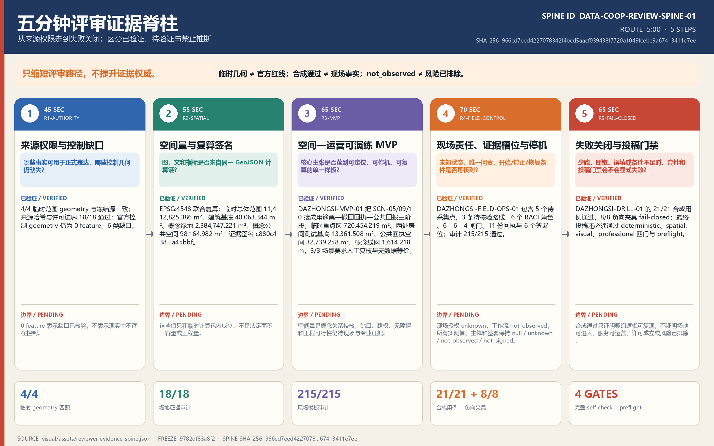
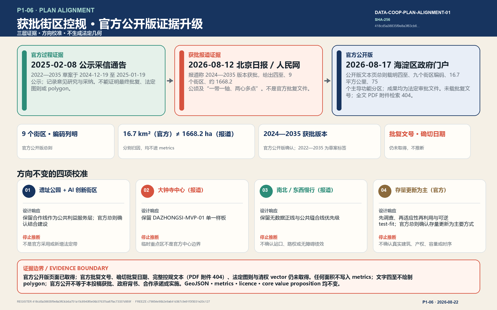
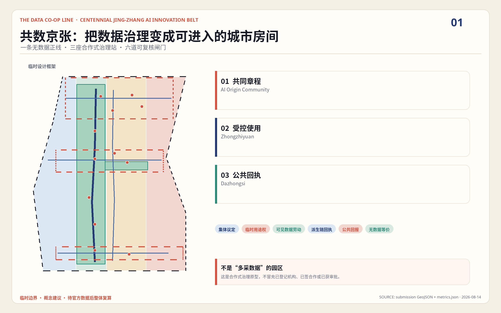
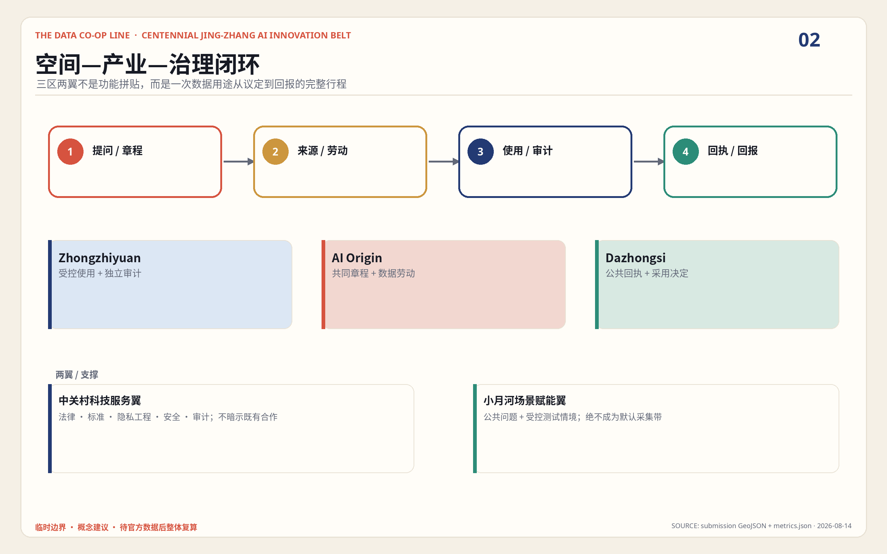
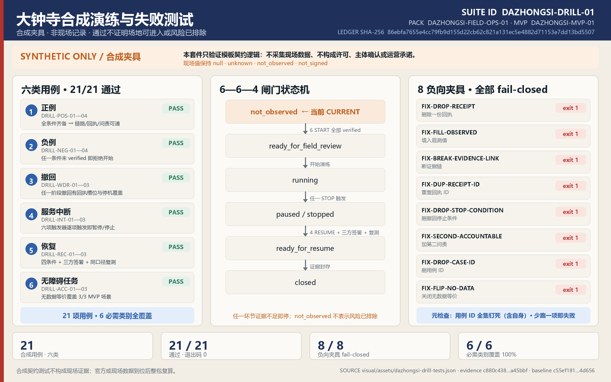
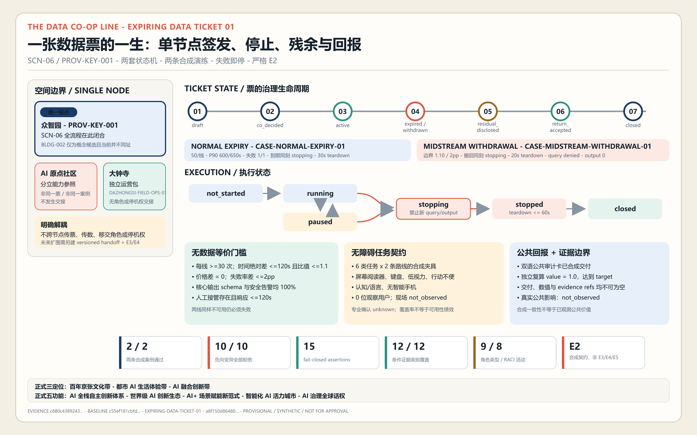
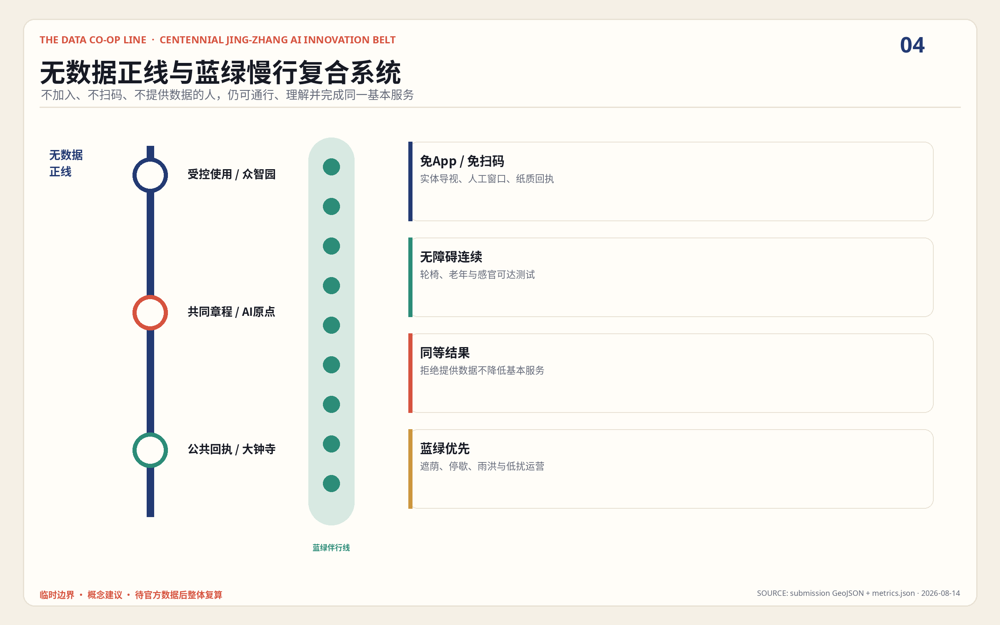
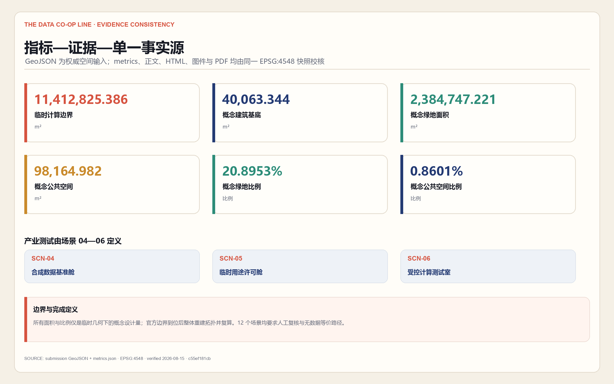

# 共数京张 / THE DATA CO-OP LINE

“共数”不是要求每个人交出更多数据，而是让谁提出问题、谁贡献材料、谁运行计算、谁取得收益、谁承担纠错责任都被看见。方案把京张铁路曾经组织人流与货流的线性基础设施，转译为组织用途许可、受控计算、公共回报和撤回回执的城市合作线；与此同时，任何人都可走一条不提供可选个人数据、仍获得同等核心服务的“无数据等价正线”。这是一套供专业团队和公众继续深化的城市设计与运营参考，不是已批准规划、已成立法人或已承诺实施的项目。

## 五分钟评审入口 · P2-03

`DATA-COOP-REVIEW-SPINE-01` 把既有证据压缩为一条 **300 秒、5 步**的评审路径；唯一事实源是 `visual/assets/reviewer-evidence-spine.json`，SHA-256 为 `966cd7eed4227078342f4bcd5aacf039438f7720a1049fcebe9a67413411e7ee`。本轮分支冻结于 `upstream/main@9782df83a8f2a58ebe79823fe8001f18d129b975`。该入口不改变方案方向、GeoJSON、metrics、来源或许可边界；它只让评审者更快区分“已验证”“待验证”和“禁止推断”。临时几何不升级为官方红线，合成通过不升级为现场事实，`not_observed` 不解释为风险已排除。

| 时间 | 评审问题 | 直接证据 | 停止推断的位置 |
| --- | --- | --- | --- |
| 0:00—0:45 | 哪些事实可正式表达，哪些控制几何仍缺失 | `site-evidence-register.json` + `site-evidence-audit.js`：4/4 geometry、18/18 检查、0 official-control feature / 6 类缺口 | 空集表示缺口已核验，不表示现实中无控制 |
| 0:45—1:40 | 图、文与指标是否来自同一计算链 | `evidence-snapshot.json` + `metrics.json` + `evidence-consistency.js`：EPSG:4548 复算与签名 `c880c438…a45bbf` | 仅为临时计算包内的概念量，不是法定面积或工程量 |
| 1:40—2:45 | 核心主张是否落到可定位、可停机的样板 | `DAZHONGSI-MVP-01`：`SCN-05/09/10`、两处房间测试基底、公共回执空间与两条概念线 | 站口、路权、无障碍与工程可行性仍待实证 |
| 2:45—3:55 | 未知状态、唯一问责与停机条件是否清楚 | `DAZHONGSI-FIELD-OPS-01`：5 点、3 路、6 角色、6—6—4 闸门、11 回执、6 签署位；215/215 审计通过 | 现场授权 `unknown`、工作流 `not_observed`，主体与实测值均未确认 |
| 3:55—5:00 | 少跑、断链或条件不足时是否显式失败 | `DAZHONGSI-DRILL-01`：21/21 合成用例、8/8 负向夹具 fail-closed；随后核对四门 self-check 与 preflight | 合成通过不证明可进入、可运营、许可成立或风险已排除 |

复现命令为 `node visual/assets/reviewer-evidence-spine-audit.js --json`；`--self-test --json` 会删除末步的内存夹具并证明审计 fail-closed。该审计只读、仅用 Node 内置库；最终载体仍须经过 manifest refresh 后的完整 self-check，而不能预写通过状态。

## P1-05｜已获批街区控规的文本级对齐与证据边界

2026-08-22 的证据升级把官方公开版页面纳入证据链：海淀区人民政府门户网站于 2026-08-17 发布该控规（公开版）文本页，总则条款可直接核验；仍不把任何文本升级为空间数据。唯一事实源 `visual/assets/planning-alignment-register.json` 的 Register ID 为 `DATA-COOP-PLAN-ALIGNMENT-01`，SHA-256 为 `daea14242a25926bebbe781d948571117e71c418304dc7a7c7951e49b37e2f7d`；分支冻结于 `upstream/main@c79854e90b2e9a641d367c9e91f3f3031e20c127`。该台账同时钉死完整 `metrics.json` 与九个 GeoJSON 哈希，任何借“对齐”改变 geometry 或 metrics 的操作都会显式失败；C-01/C-02/C-04 合成容量包络增加六项非空间 E2 治理指标后，台账已重新认证整份 `metrics.json`，九个 geometry 哈希与证据签名保持不变。

| 证据层 | 可核验文本事实 | 本轮不可推断 |
| --- | --- | --- |
| 海淀分局 2025-02-08 官方公示采信通告 | 2022—2035 年版本草案于 2024-12-19 至 2025-01-19 网上公示，并记录公众意见研究与采纳 [source:JINGZHANG-PLAN-PARTICIPATION-NOTICE-20250208] | 不是最终批复文件，不能证明批复日期、法定图则、polygon 或未载明控制值 |
| 北京日报经人民网转载的 2026-08-12 报道 | 报道称 2024—2035 年版本街区控规获批；文字范围为东至新街口外大街、西至中关村大街、北至成府路、南至西直门外大街，共 9 个街区、约 1668.2 公顷 [source:JINGZHANG-PLAN-APPROVAL-REPORT-20260812] | 报道不是批复文件本身；报道面积口径（约 1668.2 公顷）与官方公开版口径（16.7 平方公里）分别归因，均不进入 `metrics.json` |
| 海淀区人民政府门户网站 2026-08-17 发布的控规（公开版）文本页 | 官方公开页标题确认获批版本为 2024—2035 年；总则载明四至、HD00—1601 等九个街区编码、规划总面积 16.7 平方公里、75 个主导功能分区，且规划成果（文本、图纸、图则）均为法定审批文件 [source:JINGZHANG-PLAN-OFFICIAL-PUBLICATION-20260817] | 页面未载官方批复文号与确切批复日期；全文 PDF 附件于 2026-08-22 检索返回 HTTP 404，法定图则与清权 vector 仍未取得；文字四至不用于绘制 polygon |
| 同一报道的结构概括 | “一带一轴、两心多点”：京张铁路遗址公园产业创新带、中关村大街创新发展轴、大钟寺与五道口两中心及知春路、四道口等节点 [source:JINGZHANG-PLAN-APPROVAL-REPORT-20260812] | 不能据此把本方案的“一线、三区、两翼、多站”说成官方采用，也不能推导项目实施或政府背书 |

2025 官方过程通告使用 2022—2035 年标签；2026-08-17 官方公开版文本确认获批版本为 2024—2035 年标签，草案标签仍归属早期公示通告，不推断修编链或确切批复日期。文本对齐带来四项**不改方向的校准**：遗址公园绿色公共空间与产业创新带支持继续把“合作线”作为公共利益服务层，且官方公开版总则确认该规划结合京张铁路遗址公园与海淀人工智能创新街区建设；大钟寺被报道为两中心之一，支持继续把 `DAZHONGSI-MVP-01` 作为单一样板，但 `PROV-KEY-003` 绝不是官方中心边界；南北贯通、东西连通的慢行方向支持无数据等价步行骑行正线与公共缝合线，但不确认站口、路权或无障碍绩效；官方公开版总则确认以存量更新为主要方式，支持“先调查、再适应性再利用、可逆 test-fit”，但不确认任何真实建筑、产权、容量或时序 [assumption:A-PLAN-ALIGNMENT-001]。

复现命令为 `node visual/assets/planning-alignment-audit.js --json`；`--self-test --json` 把“已取得官方批复文件”错误翻转为 true，审计必须 fail-closed。该规划对齐动作不改变核心价值主张、投稿许可、GeoJSON、metrics 或证据签名，也不复制外部图片、附件或长段文字；“控规获批”与“官方公开版发布”只描述所引用的街区控规信息，不描述本投稿状态。

## P2-04｜离线体验与媒体：服务旅程短片、交互旅程与原创封面

本轮把方案的「进入—使用—退出」旅程做成可直接体验的离线媒体，全部内容为本包原创生成，不引入外部素材、不改变任何已登记数值。

- `assets/media/experience.mp4`：44 秒无声概念短片（1280×720，H.264），沿无数据正线走过三座治理站与六道可复核闸门，并展开 12+3 场景矩阵；配 `experience.vtt` 中英双语字幕、`experience.md` 文字稿与权利说明、`experience-poster.webp` 海报帧。
- `visual/index.html` 与 `index.en.html` 新增「服务旅程」区段：键盘 ←/→ 可达的六闸门步进器（WAI-ARIA tablist 语义、reduced-motion 降级、无 JS 时全部面板静态可读），并内嵌带字幕的视频播放器。
- `assets/media/cover.webp`：原创 Gallery 封面（线、三站、六闸门与核心指标），经 `manifest.cover_image` 登记；不代表官方渲染或获批效果。

视频与封面只承担概念沟通；权威数据仍以 GeoJSON、metrics、矩阵与审计台账为准 [data:geometry/public_space.geojson] [metric:no_data_equivalent_service_target_ratio]。

## 设计依据与资料清单

本方案首先回应《百年京张 AI 创新带城市设计国际方案征集资格预审公告》及面向智能体的任务书：统筹研究、总体设计、三处重点区域、AI 创新生态和长期运营必须互相校核，而不能用一个技术展馆代替整条创新带。公告给出的 43.6 平方公里、11.4 平方公里和 368.4 公顷是工作尺度依据；提交包中的可计算边界则来自仓库临时几何，两类数字不可混称。公告、任务书、标准快照与资料用途登记共同构成本方案的事实入口 [source:OFFICIAL-ANNOUNCEMENT] [source:AGENT-TASKBOOK] [source:SOURCE-REGISTRY]。

资料被分成四层使用。第一层是公告、任务书和本地标准快照，用来界定任务与专业深度；第二层是 `data/source_registry.json` 中许可用于正式表达的公开或已清权资料；第三层是七个国际案例的一手来源，只用于比较制度机制，不直接证明北京的合法性或可实施性；第四层是 `brief/site-package/geometry/` 下的 `provisional_boundaries.geojson` 及由其派生的设计图层，只用于临时生成、讨论和复算。事实导航包帮助组织阅读，但不提升任何来源的权威级别 [source:PROCESSED-FACT-PACK]。

| 场地证据 | 发布 / 核验日期 | 允许用途与边界 | 冻结结果 |
| --- | --- | --- | --- |
| 官方征集公告 | 发布 2026-05-09；登记访问 2026-06-03 | 可确认项目、文字范围、约面积与任务；不能替代 polygon、道路红线或法定控制 | 本地快照 SHA-256 `158203872171…9cc3` |
| 仓库临时三层 / 重点区 polygon | 发布 2026-06-05；依据说明核验 2026-08-07；本包复核 2026-08-20 | 只用于临时生成、离线展示、intake 自检和明确标注的非结论性讨论 | 总体范围与三处重点区 4/4 geometry 精确匹配冻结源；源 SHA-256 `0b9ae36bae6e…2306` |
| 官方控规、文保、道路红线、权属、轨道与蓝线 geometry | 本包复核 2026-08-20 | 未取得可引用的官方或已清权几何；不能用公告文字、OSM 背景或推定线条代填 | `constraints.geojson` 保持 0 feature，并登记 6 类缺口与替换触发器 |

机器台账 `visual/assets/site-evidence-register.json` 冻结 `upstream/main@ce2c6bcee` 的四个来源哈希、4 组 geometry 映射和许可 / 禁用边界；零依赖 `site-evidence-audit.js` 当前 18/18 检查通过。脚本会在来源、geometry、空约束状态或 allowed / prohibited uses 漂移时显式失败；0 个官方控制 feature 表示“缺口已核验”，不表示现实中不存在控制 [source:BOUNDARY-SOURCE] [source:KEY-AREA-SOURCE] [data:geometry/constraints.geojson]。

当前 `site_boundary.geojson` 与三处 `key_areas.geojson` 均按临时约束范围理解：它们不是官方红线，不能支撑征地、拆迁、审批、精确地价或法定容量结论。用地、建筑、道路、绿地、公共空间与分期设计层沿用这一精度等级；`constraints.geojson` 则刻意不复制这些范围，因为它负责登记仍缺失的 official control geometry。官方多边形、控规、权属、道路红线、市政、文保或建筑普查任一项到位时，必须从边界开始整体重建拓扑并重新投影复算，而不能只替换一张底图。当前总体范围的机器读数仅代表这一临时计算包 [data:geometry/site_boundary.geojson#SITE-001] [source:BOUNDARY-SOURCE]。

七个全球案例也被当作“可借鉴的局部机制”，而非成套移植的成功模板。Liverpool 的参与式数据守护、MIDATA 的合作治理、DECODE 的灵活授权、AMdEX 的可机读协议、Open Humans 的分级分享、Greenwich Data Trust 试点和 Amsterdam Algorithm Register 的公开登记分别回答不同问题；它们的城市制度、行业、生命周期和法律环境均与海淀不同。完整网址、日期、权利状态和限制保存在 `sources.json`，正文只在相关设计判断旁引用。由此形成一条审计原则：没有来源的数字不进入指标，没有正式空间条件的判断不升级为控制，没有清晰撤回边界的服务不以“可撤回”宣传。

## 三层范围工作框架

三层范围由同一问题贯穿：如何让 AI 产业所需的数据合作既能发生，又不把社区变成被动的数据矿场。统筹研究范围以 43.6 平方公里为战略观察尺度，研究高校、企业、社区、公共机构与专业服务之间的合作关系；总体设计范围以公告约 11.4 平方公里为城市更新工作尺度，把机制落实到廊道、站点、首层界面和基础设施；三处重点区域共 368.4 公顷，是验证空间原型、运营角色和风险闸门的详细设计尺度。这些为公告尺度，不等于当前临时图层的官方面积 [source:OFFICIAL-ANNOUNCEMENT] [depth:three_level_scope_framework]。

总体结构是“一线、三区、两翼、多站”。“一线”即沿京张铁路遗址公园展开的公共数据合作线；“三区”分别是众智园 AI 自主创新加速区、北京 AI 原点社区和大钟寺 AI 产业聚集区；“两翼”是中关村科技服务翼与小月河场景赋能翼；“多站”则是议题收集、许可服务、受控计算、测试验证、回报结算、无数据服务和文化展示的日常节点。它不是一条新增规划红线，而是把产业、公共空间和治理流程叠合到既有城市结构中的设计方法。三处重点范围的数量可以核对，但其形状与面积仍待正式数据 [metric:key_area_count] [data:geometry/key_areas.geojson#PROV-KEY-001]。

| 层级 | 要回答的判断 | 空间动作 | 复核门槛 |
| --- | --- | --- | --- |
| 统筹研究范围 | 哪些城市问题值得共同用数 | 形成跨高校、企业、社区的议题地图和案例对照 | 不把合作意向写成已确认伙伴关系 |
| 总体设计范围 | 数据如何“不搬走也能算” | 以受控计算站、公共服务站和慢行线构成网络 | 先锁临时约束，再生成全部派生图层 |
| 重点区域范围 | 谁议定、谁劳动、谁受益、如何退出 | 三个片区各承担一段完整治理链 | 功能、建筑、交通、公共空间和运营同时表达 |

三层之间采用“战略议题—用途票—受控计算—场景验证—公共回报—到期或撤回”的闭环。研究层产生的议题必须在总体层找到承载节点，在重点层接受真实用户与专业团队检验；重点层发现的歧视、无障碍、能耗或撤回问题又返回研究层修订规则。每个服务还要绘制一条无数据等价正线：不分享可选个人数据的人可以使用人工窗口、匿名票据、离线导引或本地处理，价格、排队优先级和基本安全保障不因拒绝贡献而下降。结构化空间骨架由总体和重点图层共同承载 [depth:overall_spatial_structure] [data:geometry/land_use.geojson#LU-001]。

## 统筹研究范围产业与未来城市研究

任务书的正式“三定位、五功能”与本方案的设计命题必须分层。**公共利益导向的数据合作试验廊、数据劳动者友好的 AI 验证社区、京张文化可读的未来城市客厅**是“共数京张”的三项设计表达，不替代正式原项。正式原项逐项进入同一条“议定—票—计算—到期或撤回—残余披露—公共回报”链：

| 正式任务书原项 | 共数京张的可核验响应 |
| --- | --- |
| 百年京张文化带 | 将车票、时刻表、运单、打孔与站台钟转译为用途许可、期限、派生链、执行日志与自动到期，不伪造历史事实 |
| 都市AI生活体验带 | 把无数据等价、人工、纸面与离线通道放在同一入口，使拒绝可选数据者仍取得同等核心服务 |
| AI融合创新带 | 用受控计算把用途、输入、输出、到期、撤回与工作停机写成同一份可复演契约 |
| AI全栈自主创新体系 | 以控制域、获准 query/model/container、执行日志与输出闸组成可审计技术栈 |
| 世界级AI创新生态 | 用多角色 RACI、唯一问责与单方停止权降低有边界试验的进入成本 |
| AI+场景赋能新范式 | 让 `SCN-06` 从“受控计算房间”变成带输入、输出、角色、阈值、回退与证据产物的完整场景 |
| 智能化AI活力城市 | 同时验收两条正线、人工接管和投诉补救，不以采集量代替城市服务质量 |
| AI治理全球话语权 | 公开双语、机器可读的到期—撤回—残余—回报协议，同时公开不能声称的 E3/E4/E5 边界 |

本方案自己的五步服务链仍是**共同议定、临时用途权与受控计算、产业测试验证、撤回与公共回报结算、学习传播与年度运营**；它们是落实正式功能的空间—运营方法，而不是另一套“官方五功能”。临时用途权也只是设计协议概念，不对数据权属、知识产权或个人信息权利作法律认定 [source:AGENT-TASKBOOK] [standard:PROJECT-AGENT-OPEN-CALL-TASKBOOK] [data:visual/assets/expiring-data-ticket-protocol.json#EXPIRING-DATA-TICKET-01]。

| 对照案例 | 可借鉴机制 | 不可越过的边界 |
| --- | --- | --- |
| Liverpool City Region Civic Data Cooperative | 让参与者共同讨论数据守护与城市用途 | 参与式过程不自动生成可移植的法人或数据权利 [source:CASE-LCR-CIVIC-DATA-COOP] |
| MIDATA Cooperative | 选择性授权、合作治理与撤回记录 | 健康数据场景和瑞士制度不能直接等同于中国城市数据 [source:CASE-MIDATA-COOP] |
| EU DECODE | Barcelona、Amsterdam 试验了更灵活的授权方式 | 项目已于 2019 年结束，原型不等于常设公共设施 [source:CASE-EU-DECODE] |
| AMdEX Data Exchange | 可机读、可审计的数据共享协议 | 部分机制仍带愿景和生态建设性质，不能宣称成熟普及 [source:CASE-AMDEX-DATA-EXCHANGE] |
| Open Humans | 分级分享、删除请求与参与者控制 | 已交给第三方的副本未必可追回，删除边界必须明示 [source:CASE-OPEN-HUMANS] |
| ODI–GLA Greenwich Data Trust | 独立受托式治理的城市试点 | 这是试点而非永久制度，也不证明任一模型公平合法 [source:CASE-ODI-GLA-GREENWICH-DATA-TRUST] |
| Amsterdam Algorithm Register | 面向公众登记算法用途与责任信息 | 登记是透明工具，不是公平、安全或合法性的认证 [source:CASE-AMSTERDAM-ALGORITHM-REGISTER] |

产业策略因此不以“聚集更多数据”为目标，而以缩短可信合作的准备周期、降低中小团队合规试验门槛、提高错误可追溯性和让公共回报可见为目标。中关村科技服务翼连接法律、标准、测评、知识产权和算力服务；小月河场景赋能翼连接公园、社区、交通、生态和公共服务问题；三区分别承担技术验证、人才与数据劳动共治、应用与回报结算。未来城市的竞争力不只来自模型规模，也来自一个人可以说“不”、仍能顺利生活的制度与空间质量。

## 总体设计范围城市更新与控规深度城市设计

总体设计采用“合作线—三枢纽—两类正线—六类站点”的空间骨架。合作线沿京张铁路遗址公园组织步行、骑行、公共活动和可视化导引；三个枢纽对应众智园、AI 原点社区与大钟寺；数据参与正线服务自愿贡献者，无数据等价正线保障拒绝贡献者；六类站点包括议事厅、用途票服务台、受控计算室、测试场、回执所和公共回报橱窗。不同站点可以嵌入现有园区首层、社区服务设施、站前空间或可逆轻型构筑物，不预设大拆大建。完整用地分区由统一边界拓扑生成 [data:geometry/land_use.geojson#LU-001] [depth:land_use_layout]。

城市更新的关键不是增加一个封闭“数据中心园区”，而是重做公共与受控之间的剖面。面向街道的前区提供双语说明、人工帮助、无数据服务和议题展陈；中区提供可预约的共同工作、数据劳动培训、协议阅读和模型结果解释；后区才是门禁、分级网络、日志和能耗监测下的受控计算。原始数据默认不复制出提供方控制域；在技术与法律条件允许时，查询、模型容器或安全多方流程进入控制域，输出经披露检查后离开。该表述是设计原则，不保证所有数据类型或合作方都具备此类技术条件。

总体层面把公共空间串联与产业服务叠加：站点五分钟可见范围强调清楚的进入与退出路径，步行骑行网络承担日常通勤与“数据旅程”导览，轨道接驳承担跨片区联系，受控计算与设备机房则服从消防、供配电、散热、噪声和网络安全专业复核。当前建筑基底只是概念图层中的可复算面积，不代表总建筑规模或法定开发强度；容积率、建筑高度、密度、退线和道路红线均待正式控规和现场调查补齐 [metric:building_footprint_area_sqm] [depth:development_intensity_controls]。

服务流程被写进空间：入口先展示“需要什么、为何需要、保存多久、谁能运行、可能产出什么”；议事桌允许集体修改用途；用途票只授予限时、限目的、限输出的权限；计算室保留执行日志；测试场比较有数据与无数据方案；回执所处理到期、纠错和撤回；公共回报橱窗披露收益去向与未兑现事项。无数据正线在同一入口即可选择，不能藏在更远、更慢或更贵的替代通道中。由此，城市设计不仅摆放设施，也用距离、界面和动线表达权力关系。

## 重点区域详细设计

**众智园 AI 自主创新加速区——“受控计算与标准验证枢纽”。** 片区建议将临清河的创新展示界面与内部受控计算设施分层组织：公共首层解释测试任务、能源消耗和输出规则，中层布置可变测试舱与专业复核席，后场布置隔离网络、设备和废热回收接口。产业团队带算法或查询进入，原始数据原则上留在数据提供方控制域；测试结果需经过偏差、安全、隐私与可解释性复核。地标“算力灯塔”以低分辨率光带显示计算是否开放、暂停或进入审计，不显示个人或商业数据。范围仍为临时重点区 [data:geometry/key_areas.geojson#PROV-KEY-001]。

### 众智园：会到期、可撤回、披露残余并回报公共价值的数据票

`EXPIRING-DATA-TICKET-01` 把 `SCN-06` 从原则说明压缩为一份可机读、可复演、失败即停的 E2 契约。它严格限定在 `SCN-06 / PROV-KEY-001` 单节点：不跨节点传票、传数，也不移交角色或单方停机权；AI 原点社区只是分立能力参照，大钟寺 `DAZHONGSI-FIELD-OPS-01` 是独立包。未来若要跨节点运行，必须另建有版本的交接契约、目的角色映射、接收回执与 SLA、拒收升级路径，并取得授权 E3 测试和 E4 主体/法律确认。`BLDG-002` 只能作为待专业深化的概念宿主候选，因为当前点位并不在该 polygon 内，不得写成同址或已落入建筑。协议不增加真实个人数据、场地进入或运营承诺 [data:visual/assets/expiring-data-ticket-protocol.json#EXPIRING-DATA-TICKET-01] [assumption:A-EXPIRING-TICKET-001]。

**一张票，两套耦合状态机。** 治理生命周期固定为 `draft → co_decided → active → expired | withdrawn → residual_disclosed → return_accepted → closed`；执行状态另行记录为 `not_started / running / paused / stopping / stopped / closed`。到期或撤回必须在同一事件原子进入 `stopping`，立即禁止新 query 与输出，只允许 teardown，并在合成目标 **60 秒内**进入 `stopped`。只有票为 `active` 才能释放新输出；到期或撤回后不得重新激活。随后才盘点派生物、披露不能彻底回滚的影响，并在交付物、价值指标和证据均通过后验收公共回报、关闭票。“撤回”从不等于承诺从既有模型、人类记忆或合法留存中彻底抹除影响。

| 票的关口 | 必须读到的字段或证据 | Fail-closed 动作 |
| --- | --- | --- |
| 议定与激活 | 中英用途、允许/禁止用途、期限、来源/许可、最小输入、控制域、获准 query/model/container、唯一问责 | 任一来源、许可、角色或开始条件不明，不激活 |
| 运行与输出 | 执行日志、最小聚合阈值、输出审查、无数据等价、人工接管 | 非 active、未授权 query、原始记录外流或两线不等价，阻断输出并停机 |
| 到期或撤回 | 机器停止、人工/纸面/离线受理、停止回执、撤回后 query 拒绝 | 任何到期后输出、派生链断点或撤回通道不可用，审计失败 |
| 残余与回报 | 派生清单与残余披露；双语公共审计卡；受益对象、期限、价值指标、复算公式、证据指针、验收范围与未兑现状态 | 未映射派生项、交付物缺失、指标不达标、证据为空、残余披露不全或把回报说成购买同意，不得关闭 |

**无数据等价不是口号。** 每条正线至少跑 30 次合成尝试；无数据线相对数据线的 P90 时间必须同时满足差值不超过 120 秒、比值不超过 1.10，价格溢价为 0，失败率差不超过 2 个百分点；核心输出字段与安全告警匹配率为 100%，人工接管必须成功且不超过 120 秒。无障碍不再使用自报“保障匹配率”：屏幕阅读器、纯键盘、低视力、行动受限、认知/语言和无智能手机六类任务，均须在数据线与无数据线形成可解析的合成夹具，12 / 12 路线任务全部完成、关键输出回读与投诉/停机回执均可用。该覆盖率只证明 E2 要求与夹具齐全，观察用户数仍为 0，不证明真实可用性；两线同样不可用也必须失败。审计从 `observation_batches` 与任务记录独立复算后再套用阈值，以上不是实测 SLA [assumption:A-EXPIRING-TICKET-THRESHOLDS-001]。

**两条演练覆盖正常与困难路径。** `CASE-NORMAL-EXPIRY-01` 每线 50 次，P90 为 600 / 650 秒、价格 0 / 0、失败 1 / 1；10:00 到期同刻进入 `stopping` 并禁新调用，30 秒后 `stopped`。`CASE-MIDSTREAM-WITHDRAWAL-01` 把时间比值和失败率差放在 1.10 与 2 个百分点边界；11:20 撤回同刻进入 `stopping`，20 秒后 `stopped`，11:21 注入 query 被拒绝且输出为 0，并披露“无法从人类记忆追回已查看合成摘要”的残余。两案均交付双语公共审计卡，价值实绩由无数据规则通过数 / 评估数独立复算为 1.0；`impact_observation` 仍为 `not_observed`，不把交付一致性冒充公共影响。2 / 2 案例、12 类条件证据通过；后期放行、原始导出、小群体、派生缺口、缺 `stopping`、回报空壳、越界节点及两线同败无障碍任务等 10 种内存变异 10 / 10 被拒绝 [metric:expiring_ticket_synthetic_case_passed] [metric:expiring_ticket_negative_path_fail_closed_total]。

**责任可以定位，主体仍未知。** 九类角色组成八项 RACI，每项恰好一个 `A`；参与者代表、数据域托管、无数据服务与权利—伦理—安全复核四类角色保留单方停止权，不必先等问责角色同意。所有实体分配仍为 `null / unknown`。场地、运营主体、消防、供电散热网络、网络安全、无障碍、法律伦理与专业审查八项阻断条件未关闭前，不进入 Gate 2；证据等级严格保持 **E2**，不冒充 E3 现场、E4 主体确认或 E5 实施 [metric:expiring_ticket_conditional_artifact_coverage_ratio] [assumption:A-EXPIRING-TICKET-001]。

**北京 AI 原点社区——“数据劳动与共同议定枢纽”。** 近校创新不只服务创业者，也服务标注员、社区工作者、学生、残障使用者和选择退出的人。沿成果转化与生活服务界面，建议嵌入议题厨房、用途票门诊、数据劳动教室、纠错工位、无数据服务台和小型发布空间；同一任务的采集、标注规则、报酬或公共回报、质量争议与撤回条件先在此公开讨论。地标“第一张回执亭”用铁路票夹形式展示一份匿名化的用途到期或撤回流程，说明回执确认了什么、没有确认什么，尤其不承诺从既有训练模型中彻底抹除影响。范围仍为临时重点区 [data:geometry/key_areas.geojson#PROV-KEY-002]。

**大钟寺 AI 产业聚集区——“应用互操作与公共回报枢纽”。** 围绕轨道站点与商业服务界面，建议设置智能体互操作测试街、数字资产与内容权利咨询、面向小微企业的受控数据协作室、公共回报结算桌和夜间可见的项目账本。测试不以采集更多顾客轨迹为默认，而以合成交易、企业自愿样本、边缘处理和人工对照为优先。地标“共同作者广场”按议题与贡献类型展示匿名或经同意署名的劳动者、社区和维护者，不按数据量排名，也不把荣誉变成诱导同意。四象限步行连通及具体设施位置需交通、权属和市政核验 [data:geometry/key_areas.geojson#PROV-KEY-003]。

### 大钟寺“用途票—撤回回执—公共回报”可演练 MVP

本轮把上述方向压缩为一个可复算、可停机的空间演练，而不是新增建设承诺。**Before**：`SCN-05` 正文写在大钟寺，但点位 `[116.3508, 40.013]` 实际位于北侧临时重点区，且没有重点区归属和停机字段。**After**：将其修正为大钟寺临时范围内、无数据服务驿站测试基底内的概念点 `[116.351, 39.946]`；`SCN-05`、`SCN-09`、`SCN-10` 统一挂接 `PROV-KEY-003 / DAZHONGSI-MVP-01`，按 1—3 阶段记录角色和至少三项停止条件 [data:geometry/public_space.geojson#SCN-05] [assumption:A-DAZHONGSI-MVP-001]。

空间底盘由同一组 GeoJSON 投影至 EPSG:4548 复算：临时重点区 **720,454.219 平方米**，两处可逆房间测试基底 **13,361.508 平方米** [metric:dazhongsi_mvp_key_area_sqm] [metric:dazhongsi_mvp_reversible_room_footprint_sqm]。

公共回执广场为 **32,739.258 平方米**；`ROAD-001` 与 `ROAD-003` 在临时重点区内的概念线网联合长度 **1,614.218 米**。这些数值只核对内部空间关系，不证明站口、路权、无障碍、建筑现状或工程可行性 [metric:dazhongsi_mvp_public_receipt_space_sqm] [metric:dazhongsi_mvp_route_length_m]。

| 演练阶段 | 空间与操作 | 同一份事实回执 | 硬停止条件 |
| --- | --- | --- | --- |
| 1 · 用途票 / `SCN-05` | 在 `BLDG-006` 以合成订单和纸面模板测试用途、期限、撤销、异常回退与人工接管 | 数据参与和无数据商户取得字段相同的兼容性报告 | 来源或许可不明、需要真实支付/个人轨迹、两线报告不等价即停 |
| 2 · 撤回回执 / `SCN-09` | 沿免 App 南北正线转至 `BLDG-005`，核对副本、特征、模型、报告和公开输出状态 | 人工与离线申请共用可机读、可读的派生状态 | 派生映射不全、残余影响未披露、人工/离线撤回不可用即停 |
| 3 · 公共回报 / `SCN-10` | 经东西“回执轨”到 `PUBLIC-003`，由人工核对受益对象、到期日、验收与未兑现项 | 结算记录同时保留异议、未兑现状态和采用/停止决定 | 受益对象不明、期限或验收缺失、把回报说成购买同意即停 |

三节点全部要求人工复核和无数据等价路径，结构化覆盖目标为 **3 / 3（100%）**；这是演练准入条件而非已观测绩效。正式启用前必须以实地通行时间、价格、失败率、无障碍和人工接管测试证明两线等价，并核对站口、权属、文保、市政、消防和运营责任；任一项不成立就迁移、缩减或停止该原型 [metric:dazhongsi_mvp_scenario_count] [metric:dazhongsi_mvp_no_data_route_coverage_ratio]。

### P1-03 · 大钟寺待授权现场运营责任与证据模板

**边界与状态。** `DAZHONGSI-FIELD-OPS-01`（对应 `DAZHONGSI-MVP-01`）是待授权、待现场填写的运营责任与证据模板，不是地图、现场记录、正式空间证据、主体确认、许可或运营承诺。唯一事实源为 `visual/assets/dazhongsi-field-validation-pack.json`，SHA-256 为 `4613343f7943bc81207db0fc3c8ad2a98bc97fb1e4f0442eb215f1e36a773a61`。当前现场授权为 `unknown`，工作流为 `not_observed`；站口、实际路线、通行时间、失败率、价格、无障碍、人工接管、责任主体、签署和许可全部未观测或未确认，模板不得被引用为这些事项已经成立。

**5 个待采集点与 3 条待核验路线。** 五点分别是轨道站口候选核验点、无障碍连续路径核验点、`SCN-05` 用途票、`SCN-09` 撤回回执和 `SCN-10` 公共回报采集点；其观察位置均为 `null`，核验状态均为 `unknown`。三条路线是“站口—无障碍—用途票到达线”“数据参与正线”和“无数据等价正线”；观察路径均为 `null`，路线状态均为 `not_observed`。每条路线的时间、失败、价格、无障碍和人工接管记录均保持 `not_observed`，具体数值与结论均为 `null`。

**6 个 RACI 角色与唯一问责。** 角色为现场验证负责人、场地运营责任主体、无障碍复核、数据与许可复核、安全与停机复核、证据保管；六者的主体分配仍为 `null / unknown`。每项活动只有一个 `A`：开始决定—场地运营责任主体；两线与无障碍采集—现场验证负责人；三阶段纸面或合成演练—场地运营责任主体；暂停或停机—场地运营责任主体；证据封存与签署—场地运营责任主体；恢复决定—场地运营责任主体。`R / C / I` 只分配任务，不替代唯一问责。

**6—6—4 运行闸门。** 只有下列六项开始条件全部成为 `verified` 才能开始：①站口、实际路线和路权；②连续无障碍路径与合理便利；③权属、文保、市政、消防与安全边界；④运营责任主体与现场负责人书面确认；⑤只使用合成、纸面或经许可的最小必要材料；⑥两条正线、人工接管与紧急停止可测试。当前六项均为 `unknown`。

触发任一停止条件就立即暂停或停止：①来源或许可不能证明，或要求真实支付、个人轨迹、隐蔽标识；②站口、无障碍路径或任一正线不能安全通行；③人工接管不可用或未在记录时间内响应；④两线在时间、价格、失败、基本输出或安全保障上出现未处置差异；⑤派生映射不全、残余影响未披露或人工/离线撤回不可用；⑥公共回报缺少受益对象、到期日、验收或未兑现状态，或被说成购买同意。当前六项均为 `not_observed`，不表示已排除风险。

恢复必须同时满足四项：①记录停止原因、影响范围和责任角色；②完成纠正并按同一口径复测；③六项开始条件重新全部 `verified` 且没有新停止触发器；④场地运营责任主体、安全复核与现场负责人共同签署。当前四项均为 `unknown`；不得用单方判断代替复测和共同签署。

**11 份回执与 6 个签署位。** 回执依次覆盖站口与路权、无障碍连续路径、用途票阶段、撤回回执阶段、公共回报阶段、权属/文保/市政/消防/安全、运营责任主体、材料来源与许可、人工接管与紧急停止、暂停或停机决定、纠正/复测/恢复决定。十一份回执均为 `not_observed`，采集时间、文件引用、哈希和签署者均为 `null`。六个 RACI 角色各保留一个签署位，全部为 `not_signed`，姓名、组织、时间与签名引用均为 `null`。

### P1-04 · 大钟寺合成演练与失败测试

**边界与状态。** `DAZHONGSI-DRILL-01` 是对 `DAZHONGSI-FIELD-OPS-01` 模板契约的合成演练与失败测试套件，声明性台账为 `visual/assets/dazhongsi-drill-tests.json`，配套运行器为 `visual/assets/dazhongsi-drill-test-runner.js`（仅用 Node 内置库、只读）。台账 SHA-256 为 `86ebfa7655e4cc79fb9d155d22cb62c821a131ec5e4882d71153e7dd13bd5507`。全部输入为合成或纸面夹具；模板中的现场值仍为 `null / unknown / not_observed / not_signed`。测试通过只证明契约逻辑可复现执行，不证明场地可进入、服务可运营或风险已排除 [assumption:A-DAZHONGSI-DRILL-001]。

**六类 21 项用例。** 正例验证全部开始条件齐备时三阶段链路、11 份回执与唯一问责可通；负例验证任一开始条件未 `verified` 即拒绝开始、模板空值纪律、`not_observed` 不得解释为风险已排除；撤回验证任一阶段的撤回都有回执槽位与停机覆盖、公共回报不得被表述为购买同意；服务中断验证六项停止触发器逐项触发即暂停或停止并阻断阶段推进；恢复验证四项条件与三方共同签署缺一不可且须按同一口径复测；无障碍任务测试验证无数据等价与人工复核覆盖全部 MVP 场景、离线正线与人工接管在契约中可定位 [data:visual/assets/dazhongsi-drill-tests.json#DRILL-META-01] [metric:dazhongsi_drill_category_coverage_ratio]。

**元检查与负向自测。** 运行器把实际执行的用例 ID 全集与钉死清单逐一比对（含元检查自身），少跑一项即失败，「少跑一项」与「全部通过」在输出上不可区分的情况被阻断；`--self-test` 对 8 个变异夹具（删回执、填入观测值、断证据链、重复回执 ID、删撤回停止条件、加第二问责、删用例 ID、关闭无数据等价）逐一验证运行器必然以退出码 1 失败。当前 21/21 用例通过、8/8 负向夹具全部 fail-closed [metric:dazhongsi_drill_case_passed] [metric:dazhongsi_drill_negative_fixture_fail_closed_total]。

**复现。** `node visual/assets/dazhongsi-drill-test-runner.js --json` 退出码 0 为通过；`--self-test --json` 输出每个夹具的 fail-closed 证据。该套件是模板契约级的合成验证；官方数据或现场证据到位后，按同一链条整包复算，不得以合成通过替代现场证据。

三处片区合起来完成“一次合作的全旅程”：原点社区形成议题和劳动规则，众智园执行受控计算与模型验证，大钟寺完成应用互操作、公共回报披露和公众体验；任一环节都可因证据不足、风险超限或参与者撤回而暂停。三地标不是纪念技术公司的广告装置，而是把计算状态、退出边界和共同作者关系变成城市记忆。其建筑形态、消防、容量、造价、运营主体与审批均需专业团队继续深化，不能从概念图直接推导实施结论 [depth:three_key_area_detailed_design]。

## AI 创新生态、人才画像与 AI+ 场景

共数京张的生态不是“企业—数据—模型”的单向链，而是“问题提出者—数据劳动者—权利与合规支持—受控计算运营—模型团队—场景使用者—独立复核—公共回报接收者”的循环。建议治理席位至少覆盖社区与服务使用者、数据劳动者、技术和产业团队、公共利益与无障碍代表、法律伦理及安全专业人员；具体比例、法人形式和表决效力需依法讨论，本方案不代设治理机构。每项任务先发布可读用途票，再进入受控计算与场景测试，结果、异议、派生链和回报状态回到公共账本 [standard:PROJECT-AGENT-OPEN-CALL-TASKBOOK] [source:CASE-LCR-CIVIC-DATA-COOP]。

**七类主要画像。** ①社区居民关心生活是否因拒绝分享而受影响；②数据标注与清洗劳动者关心规则、报酬、署名、争议和退出；③残障或数字能力有限的使用者需要人工、无障碍和离线正线；④高校研究者需要可复现又不越权的研究环境；⑤初创团队需要低门槛但有边界的验证条件；⑥本地小微企业经营者需要商业秘密不外流的协作方式；⑦公共服务与一线运维人员需要能纠错、能回退、责任不被算法替代的工具。儿童、老年人等特殊群体若进入具体任务，应另行进行监护、伦理和最小必要性审查，而不是被概括同意覆盖。

下列十二张场景卡直接采用 `public_space.geojson` 的 `SCN-01`—`SCN-12` 注册顺序、双语名称和类型；其中 `SCN-04`—`SCN-06` 是三项产业测试，开放前必须通过专业、伦理与停止机制闸门。每张卡同时写明空间、参与者、数据方式和无数据正线，正文不再另建一套与图层冲突的场景编号。

| 场景卡 | 节点与主要使用者 | 合作动作 | 边界与无数据等价正线 |
| --- | --- | --- | --- |
| SCN-01 社区数据章程议事桌 | AI 原点社区；居民、研究者、数据劳动者 | 逐项修改目的、期限、输出、回报和停止条件 | 可匿名发言或提交纸面异议，不以同意换取入场资格 |
| SCN-02 来源与许可门诊 | 合作线服务站；贡献者、小微企业、权利与合规人员 | 核对来源、许可范围、接收方、期限和再共享限制 | 提供人工与离线说明；无法证明来源或权利时停止进入测试 |
| SCN-03 可见数据标注工坊 | AI 原点社区；采集、清洗、标注和审核人员 | 试做样本、估算工时，公开质量争议、署名、回报和退出流程 | 拒绝高风险任务不降低进入其他任务的机会，具体劳动关系依法确认 |
| SCN-04 产业测试：合成数据基准舱 | 众智园；算法团队、轮椅使用者、骑行者、测评人员 | 用合成、公开或明确清权材料比较遮挡、夜间与无障碍识别表现 | 不持续采集人脸；无数据参与者可提交纸面路况并获得同等整改反馈 |
| SCN-05 产业测试：临时用途许可舱 | 大钟寺；初创团队、小微商户、测评人员 | 在隔离环境以合成订单测试用途授权、到期、撤销、异常回退和人工接管 | 不接真实支付；商户可只用模板数据获得同等兼容性报告 |
| SCN-06 产业测试：受控计算测试室 | 众智园与两翼；计算运营、交通团队、通勤者 | 比较本地聚合、受控查询与无个人轨迹基线，检查输出与停机 | 原始数据原则上不外流；拒绝轨迹不影响固定导引、人工问询和匿名计数正线 |
| SCN-07 偏差与代表性共审台 | 三处枢纽；场景使用者、无障碍代表、独立复核人员 | 按人群与情境检查失败切片、遗漏和人工接管记录 | 可用匿名、合成或纸面案例参与；共审不构成公平或合法认证 |
| SCN-08 无数据等价服务站 | 遗址公园沿线；居民、残障与数字能力有限使用者、运维人员 | 对比两条正线的通行时间、价格、失败率和投诉 | 无手机者使用固定标识、纸图和人工窗口；差距先触发服务修复 |
| SCN-09 派生链撤回演练 | 大钟寺公共回执厅；贡献者、合规与技术人员 | 查询原始数据、特征、版本、模型和报告的可处理状态 | 提供人工和离线申请；回执区分已删除、停止未来使用与无法技术回滚 |
| SCN-10 公共回报年度结算厅 | 大钟寺；参与者、社区组织、项目团队 | 核对费用、资源或公共成果的受益对象、到期日、验收和未兑现事项 | 回报不是购买同意；无数据参与者同样可讨论普惠公共用途 |
| SCN-11 文化记忆贡献站 | 沿线文化节点；铁路家属、居民、学生 | 以分段许可记录音频、文本、展览、研究与模型用途 | 可只提交文字或现场讲述；公开传播与第三方副本边界须事前说明 |
| SCN-12 算法使用清单亭 | 一线三区两翼；公众、运营者、独立复核人员 | 公布场景目的、数据类别、责任人、版本、评估、暂停和停用状态 | 提供纸质与人工查询；公开登记用于透明，不等于公平、安全或合法认证 |

所有场景都设“最小数据、最短期限、最少输出、人工复核、可停止”五道门。撤回时，系统生成派生链回执：列出可删除的受控副本、已停止的未来使用、需下架的公开输出、须重新评估的模型版本，以及因技术、法律或第三方控制而不能保证消除的部分。这里的“撤回”不等于自动模型反训练，也不承诺追回已被合法或非法复制到第三方的全部材料；这种诚实边界本身就是本方案区别于口号式“数据自主”的关键 [source:CASE-OPEN-HUMANS] [source:CASE-MIDATA-COOP]。

## 用地、建筑规模与拆改留方案

用地策略采用“公共界面嵌入、受控空间后置、测试场可逆、生活服务不被挤出”四条规则。沿合作线的首层优先容纳议事、解释、无数据服务、教育与回报展示；受控计算和设备空间进入具备承载、消防、配电、散热和网络分区条件的既有建筑内部；短期测试使用可拆、可恢复的设施；居住、社区商业、文化和日常公共服务保持独立入口与稳定供给。`land_use.geojson` 是在临时总体边界内闭合的设计分区，不改变现行法定用地性质 [data:geometry/land_use.geojson#LU-001] [depth:land_use_layout]。

拆改留先做建筑单体调查，再作分类，不以“AI”之名预设拆除。**保留**适用于结构、消防、产权和使用状态允许，且可通过轻量界面更新接入合作线的建筑；**改造**适用于需要补充无障碍、首层开放、机电、隔声、散热、网络隔离或可逆隔断的建筑；**拆除或新建**只在正式普查证明安全、功能和公共利益确有必要，并完成规划、文保、权属、环评及公众程序后讨论。当前 `BLDG-001` 仅为方案建筑基底证据，不能支持具体单体拆除判断 [data:geometry/buildings.geojson#BLDG-001] [depth:retain_renovate_demolish]。

建筑原型分为三类。A 类“开放站房”以通透、双入口和低技术门槛服务公众；B 类“合作工坊”以可变工位、声学分区和可观察流程服务数据劳动与共同议定；C 类“受控机房”以最小窗墙开口、独立门禁、设备散热、日志和紧急停机服务计算。三类空间可在同一建筑形成前—中—后剖面，但门禁不能切断原有公共通道。屋顶与庭院优先承担遮阳、雨水、休息和低碳展示，不以巨型屏幕制造能耗与光污染。

当前图层以 EPSG:4548 联合复算的建筑基底为 40,063.344 平方米，仅是临时边界与六处概念性、可逆房间测试基底下的几何结果 [metric:building_footprint_area_sqm]。总建筑面积、容积率、建筑密度、高度、保留率、改造率和新增量因缺少官方控规、现状普查、权属及工程条件而待正式数据补齐。设计不把该基底值换算成开发承诺，也不设未经证实的投资规模；后续应以单体编码把结构安全、历史价值、使用绩效、能耗、租赁影响和数据设施适配性共同纳入拆改留决策。

## 交通、轨道、市政与公共服务设施

交通系统把京张铁路遗址公园作为连续步行骑行骨架，把轨道站点、三处枢纽、两翼服务和社区入口组织成“到站—读规则—选择正线—参与或退出—取得回执”的可理解旅程。道路设计优先修补慢行断点、无障碍坡道、夜间照明、非机动车停放和换乘识别；穿越北五环、大钟寺四象限等复杂节点只提出概念连接，具体桥隧、信号和道路红线需交通专项论证。当前道路图层表达设计联系而非法定路权 [data:geometry/roads.geojson#ROAD-001] [depth:traffic_rail_slow_parking]。

“两类正线”在交通与服务层面都必须成立。数据参与正线可使用志愿行程、现场反馈或本地设备计算改善导引；无数据等价正线提供固定信息牌、匿名客流计数、人工问询、纸质地图和不登录的离线页面。两线共享相同的安全告警、无障碍路线、基本预约名额与公共空间，不把拒绝数据的人导向更长的绕行、更慢的队列或更高价格。每季度用通行时间、失败率、投诉与无障碍实测比较两线，若出现实质差距，应先修复服务而不是诱导更多人同意。

市政与新型基础设施采用“小型分布、可关停、能计量”的原则。受控计算站需独立网络区、最小权限、日志留存、加密密钥管理、输出检查、消防、备用电源、散热和能耗表；公共服务站需无障碍、双语、声学隐私、人工值守条件和紧急退出。条件允许时可研究回收设备废热服务附近公共空间或建筑热水，但其效率、管线和商业模式不得预先承诺。任何传感器都应标明采集范围、频率、保存期和联系渠道，禁止用景观设施隐藏持续身份识别 [depth:municipal_new_infrastructure] [data:geometry/constraints.geojson]。

公共服务设施不只服务技术从业者。沿线设置可预约的人工解释桌、劳动者安静工位、儿童与老年友好说明、无障碍测试工具、小微企业保密咨询、文化贡献授权台和争议调解空间。服务人员保留最终判断和暂停算法的权力，重要公共决定不得仅由模型自动作出。轨道、市政、消防、能源、排水和设施服务半径因正式资料未齐，应在后续专项中逐项复核，当前方案不声明主管部门、企业或社区已经同意合作。

## 蓝绿空间、公共空间与城市风貌

蓝绿系统不是为传感器布景，而是合作线最重要的无门槛公共正线。京张铁路遗址公园串联清河、小月河、校园、社区和产业节点，形成可步行、骑行、停留、讨论与观察的连续场所；林下议事桌、雨水花园边缘、桥下微空间和站前广场承载轻量活动，受控计算与设备不侵占主要通行面和生态敏感区。当前绿地设计图层在临时边界内复算，不能替代河道蓝线、绿线、防洪或生态评价 [data:geometry/green_space.geojson#GREEN-001] [depth:blue_green_public_space]。

提交图层以 EPSG:4548 联合复算：概念绿地面积为 2,384,747.221 平方米，占临时计算边界的 20.8953%；概念公共空间面积为 98,164.982 平方米，占 0.8601%。二者都是设计几何相对临时计算边界的结果，不是审定绿地率、确权公共空间或控制指标 [metric:green_ratio] [metric:public_space_ratio]。后续取得官方边界和现状绿地、树木、水系、生态及权属资料后，应分别复核数量、连通性、树冠遮阴、透水性、热舒适、洪涝安全和全龄可达性。场景试验需设置季节性关闭与恢复条款，任何数字装置都不得以维护或布线为由长期破坏根系、岸线和遗产铺装。

公共空间语言取自铁路而不复制怀旧符号：两条并行线分别代表“数据参与”和“无数据等价”，交汇的道岔代表可改变用途，时刻表代表授权期限，运单代表派生链，打孔车票代表执行日志，站台钟代表自动到期。品牌标识以“共”字的两条开口轨线和一枚可撕回执构成，必须在黑白、高对比、触觉和中英双语环境中可识别。地面导引只显示流程与方向，不显示参与者身份、贡献量排名或企业广告。

文化叙事从“铁路把远方带到城市”转向“合作让不同知识在保留边界的前提下相遇”。清华园火车站等遗产资源若纳入路线，应以正式文保要求和运营许可为前提；口述史、照片、声音和肖像采用分段用途许可，展览、研究、模型训练分别选择，撤回的技术限制在采集前说明。算力灯塔、第一张回执亭和共同作者广场构成三座 AI 朝圣与荣誉节点，但荣誉授予基于可核验贡献和自愿署名，拒绝公开者可以匿名或不出现 [source:AGENT-TASKBOOK] [depth:height_massing_character]。

## 更新项目清单、实施政策与分期计划

更新项目按“可逆制度原型先行、空间改造随后、重大建设最后”排序。下表是供专业团队深化的项目组合；责任主体、投资、采购、土地、审批和运营合作均未确定，成本目前只标为“待工程量与造价基准”，不构成资金承诺。

| 项目 | 主要成果 | 关键前置条件 | 分期与成本状态 |
| --- | --- | --- | --- |
| C-01 共数议事与用途票工具包 | 双语模板、反对意见记录、期限与输出字段 | 法律、伦理、无障碍和公众审阅 | 近期可逆试点；成本待测算 |
| C-02 无数据等价服务改造 | 人工窗口、纸图、离线页、同等队列规则 | 服务流程和人员培训 | 近期优先；成本待测算 |
| C-03 AI 原点数据劳动工坊 | 班前会、培训、纠错与争议空间 | 劳动、租赁、消防、隐私声学 | 近期至中期；成本待测算 |
| C-04 众智园受控计算站 | 隔离环境、日志、输出检查、能耗披露 | 网络安全、能源、消防、运营资质 | 中期门控；成本待测算 |
| C-05 三类产业测试场 | 感知、互操作、通勤预测验证 | 伦理、测试数据、保险与停机规则 | 中期门控；成本待测算 |
| C-06 大钟寺公共回报结算桌 | 回报选项、兑现状态、异议与审计 | 财务、合同、利益冲突规则 | 中期试点；成本待测算 |
| C-07 派生链回执服务 | 版本清单、撤回状态、不可回滚说明 | 数据映射、技术审计、申诉流程 | 近期原型；成本待测算 |
| C-08 三地标与遗产导引 | 灯塔、回执亭、共同作者广场及双线导视 | 规划、文保、景观、版权和运维 | 中长期；成本待测算 |
| C-09 蓝绿慢行断点修补 | 无障碍、遮阴、停留、换乘与生态恢复 | 道路、河道、树木、市政专项 | 依专项推进；成本待测算 |

**C-01 / C-02 / C-04 合成容量准入包络。** `SCN06-C010204-SYNTHETIC-CAPACITY-01` 用同一份 60 分钟、12 个到达请求的投稿自有合成夹具检查三项目怎样共同接住一个 `SCN-06` 服务窗口：C-01 的 4 个抽象并行服务单元按每请求 15 分钟复算为容量 16、余量 4；C-02 将 6 个数据线请求和 6 个无数据线请求分别交给两组不可互借的 2 单元，各自容量 10、余量 4，因此**无数据专用容量**与数据线容量比为 1.0；C-04 的 4 单元中先保护 1 单元用于拆卸与恢复，只以 3 单元承接工作，容量 9、余量 3 [metric:synthetic_capacity_resource_gate_total] [metric:synthetic_capacity_minimum_headroom_requests] [metric:synthetic_capacity_no_data_to_data_capacity_ratio]。

审计不采信手填合计，而是从服务时长、可用单元和需求独立复算容量、余量与利用率：目前 4 / 4 资源闸门、3 / 3 项目闸门通过；篡改计算、让需求超过容量、借走无数据单元、移除停止预留或伪造现场确认等 5 / 5 负向变体均 fail-closed [metric:synthetic_capacity_resource_gate_passed] [metric:synthetic_capacity_project_gate_passed] [metric:synthetic_capacity_negative_path_fail_closed_total]。这些“单元”不是人员、服务器、供配电、散热、网络、场地、消防或造价数量；真实运营主体、容量、采购、审批与专业确认仍为 `null / unknown`，现场决定固定为 `not_ready_for_field_operation`。因此它只把资源约束从 E0 叙述提升为可复算 E2 准入证据，不构成 E3 实测、E4 确认或实施承诺 [assumption:A-SYNTHETIC-CAPACITY-001]。

所有项目共用七条政策闸门：用途必须可读且可集体修改；许可按目的和期限拆分；原始数据优先不出控制域；数据劳动的工时、质量争议和回报规则事前公开；模型、特征、报告和公开输出建立派生链；撤回回执区分“删除受控副本”“停止未来使用”“公开输出下架”“模型需重评”和“无法保证抹除”；形成经济或非经济收益时，项目启动前就约定可审计的公共回报选项。任何项目未提供无数据等价正线、人工复核和停止条件，均不得进入下一阶段。

分期采用三道门而非单纯年份。**门 0：证据与共同议定**，完成正式边界、专业底图、法律伦理、需求与无数据基线；**门 1：可逆原型**，在不改变法定用地和不采集高风险真实数据的条件下测试用途票、人工服务、合成数据和回执；**门 2：受控场景**，经独立评估后运行有限用户、有限期限、可关停的测试；**门 3：空间深化**，只有当交通、市政、权属、文保、资金和审批均明确时才讨论永久改造。当前 `phasing.geojson` 只表达概念分期范围 [data:geometry/phasing.geojson#PHASE-001] [depth:phasing_implementation]。

年度运营建议形成可复盘的节律：每月一次议题桌，公开下一批城市问题和反对意见；每季度一次场景开放窗，只开放已过闸任务并发布失败报告；每半年一次劳动与回报结算会，核对工时、公共成果、异议和未兑现事项；每年举办“共数开放周”，串联三地标、案例诊所、无数据正线实测、国际圆桌和下一年度议题投票。年度报告至少披露任务数量、拒绝或停止数量、撤回处理时长、无法回滚项、两线服务差距、公共回报状态、能耗和安全事件。该节律是运营参考，不表示已有主办方、经费或国际合作。

## 指标体系、面积复算与合规矩阵

指标分为三组：空间事实、治理过程和公共结果。空间事实从同一组 GeoJSON 投影复算；治理过程记录用途票、受控计算、异议、撤回与派生链；公共结果衡量无数据正线是否等价、数据劳动者是否参与决策、回报是否兑现以及环境成本是否可接受。后两组目前是建议的运营指标，不能伪装成已观测绩效。复算方法与正式资料触发条件由指标表和假设表共同管理 [depth:metrics_recalculation] [source:SOURCE-REGISTRY]。

| 指标 | 当前读数 | 可怎样使用 | 不能怎样使用 |
| --- | --- | --- | --- |
| 临时计算边界面积 | 11,412,825.386 平方米 | 检查提交图层闭合、比例和派生一致性 [metric:site_area_sqm] | 不作为官方用地面积、审批或土地结算依据 |
| 重点区域数量 | 3 处 | 核对三个必选详细设计片区均被表达 [metric:key_area_count] | 不证明临时多边形准确 |
| 概念建筑基底 | 40,063.344 平方米 | 校核六处可逆房间测试基底与建筑图层 [metric:building_footprint_area_sqm] | 不换算总建筑量、容积率或投资 |
| 概念绿地面积 | 2,384,747.221 平方米 | 复核绿地图层联合面积 [metric:green_space_area_sqm] | 不称现状或法定绿地面积 |
| 概念绿地比例 | 20.8953% | 比较临时方案内部的蓝绿配置 [metric:green_ratio] | 不称法定绿地率 |
| 概念公共空间面积 | 98,164.982 平方米 | 复核三处公共房间多边形的联合面积 [metric:public_space_area_sqm] | 不称确权后的公共开放面积 |
| 概念公共空间比例 | 0.8601% | 检查公共节点与合作线的支撑关系 [metric:public_space_ratio] | 不称公共空间控制指标 |
| 容积率 | 待正式数据补齐 | 记录控规、总建筑面积和官方边界的前置需求 [metric:floor_area_ratio] | 不用推测值填补 |

建议新增的治理指标包括：用途票被集体修改的比例、受控计算任务中原始数据零复制率、数据劳动者治理席位出席率、撤回请求首次响应和闭环时间、派生链覆盖率、公开输出下架完成率、无法回滚项披露率、公共回报兑现率、无数据与数据正线的时间/价格/失败率差值、测试场人工接管成功率以及每项计算的能源和碳强度。正式运营前应定义分母、抽样、审计者、申诉渠道和隐私保护，不能为了好看的数字扩大监测。

合规矩阵逐条连接公告 1.3、1.4、1.5 与 agent.1—agent.6，设计深度矩阵连接现状、结构、用地、开发强度、建筑、交通、市政、蓝绿、重点区、项目、分期、复算和风险；正文只解释关键判断，不堆叠全部 ID。临时几何不会因组织方资料缺口而阻断内容评分，但必须持续标明精度并在正式数据到位后整体复算。每次修改主稿、图层、指标、图片、HTML 或 PDF 后，应刷新清单哈希并重跑四门自检；未取得实际输出前，不在正文声称已经通过。

## 风险、版权与合规说明

首要风险是把“合作”变成更温和的强迫。若公共服务、工作机会、活动名额或价格与同意捆绑，集体议定就失去意义；因此无数据等价正线、可匿名异议、人工窗口和反诱导审查是硬闸。第二类风险是再识别、目的漂移、商业秘密泄露、模型记忆和第三方复制；对策是数据最小化、用途拆分、受控计算、输出检查、版本化派生链、期限和停止权，但没有任何措施能保证绝对安全 [depth:risk_missing_data] [source:CASE-OPEN-HUMANS]。

第三类风险是数据劳动被隐形化：以“志愿贡献”替代真实工时、按数据量排名、用荣誉诱导高风险同意，或把质量责任全部压给标注者。方案要求任务前披露劳动性质、时间、报酬或公共回报、署名、健康与内容风险、争议和退出；是否构成劳动关系、适用何种合同与税务规则必须由专业人员依法判断。第四类风险是机构俘获和形式化共治；建议公开利益冲突、少数意见、被拒任务和审计整改，并让无数据使用者与数据劳动者拥有实质性发言渠道，而不是只被邀请参观。

第五类风险是撤回被夸大。派生链回执只能证明受控范围内采取了哪些动作：删除可控副本、停止未来调用、下架可控输出、标记模型重评或记录无法回滚。它不保证从已训练模型中彻底抹除某个样本影响，也不保证追回第三方副本、公开传播或法定留存材料。第六类风险是算法登记被误作认证；公开项目、模型和责任信息有助于问责，但不能替代公平、合法、安全、性能和专业适用性评估 [source:CASE-AMSTERDAM-ALGORITHM-REGISTER]。

空间与实施风险同样明确：当前边界和重点区为临时约束，法定控规、权属、建筑普查、道路、轨道、市政、消防、洪涝、生态、文保与公共设施资料尚待补齐；面积、比例和建筑基底只在临时计算系统内有效。约束空集已由冻结来源哈希、六类缺口和 fail-loud audit 证明是“知道缺什么”，而不是“已经没有约束”。方案不承诺成立数据合作社法人，不承诺政府、企业、高校、社区或国际机构合作，不承诺资金、土地、采购、审批、场地开放、技术可行性或实施时间，也不把概念性拆改留结论用于真实处置 [source:BOUNDARY-SOURCE] [data:geometry/constraints.geojson]。

主稿、英文译稿、离线 HTML、A3/A0、五组双语图件和本方案生成的原创视觉，仅按清单所列许可参与社区展示；外部来源的事实、案例、标准与数据继续服从各自许可和引用条件。视觉生成提示、模型、人工编辑和素材来源应记入版权声明；人物和场景图是概念表达，不能被当作现场照片或已建成效果。离线页面不得调用远程字体、脚本、地图瓦片、表单、追踪或外部 API。若双语表达发生歧义，以两版共同传达的限制性较强含义为准并人工校正。

## 参考资料

本方案的本地依据包括：赛事公告，用于确认三层范围、三处重点区域和成果任务 [source:OFFICIAL-ANNOUNCEMENT]；面向智能体任务书，用于确认命名、案例、场景、画像、地标、文化和长期运营要求 [source:AGENT-TASKBOOK]；场地包、标准快照与资料登记表，用于限制哪些资料可以支撑正式表达 [source:SITE-PACKAGE] [source:SOURCE-REGISTRY]；临时边界文件，用于生成当前空间图层但不作为官方红线 [source:BOUNDARY-SOURCE] [source:KEY-AREA-SOURCE]。`site-evidence-register.json` 与审计脚本只证明这些来源和缺口在冻结提交下保持一致，不提升其权威等级；处理后的事实包只承担导航功能 [source:PROCESSED-FACT-PACK]。

国际比较采用七组一手来源记录：Liverpool City Region Civic Data Cooperative 记录参与式守护的探索 [source:CASE-LCR-CIVIC-DATA-COOP]；MIDATA 记录合作治理、选择性授权和撤回日志 [source:CASE-MIDATA-COOP]；EU DECODE 记录 Barcelona 与 Amsterdam 的灵活授权原型及 2019 年项目结束这一时间边界 [source:CASE-EU-DECODE]；AMdEX 记录可机读、可审计共享协议的方向及其仍具愿景性的限制 [source:CASE-AMDEX-DATA-EXCHANGE]。

Open Humans 用于说明分级分享、删除服务水平与第三方副本不能保证追回 [source:CASE-OPEN-HUMANS]；ODI、Greater London Authority 与 Greenwich 的 Data Trust 试点用于讨论独立受托机制，同时明确试点不是永久制度 [source:CASE-ODI-GLA-GREENWICH-DATA-TRUST]；Amsterdam Algorithm Register 用于讨论公开登记和责任可见性，同时明确登记不构成公平、合法或安全认证 [source:CASE-AMSTERDAM-ALGORITHM-REGISTER]。每条来源的标题、发布者、网址、访问日期、许可、适用范围和限制以 `sources.json` 为机器审计入口；若正文与来源记录冲突，应先降级或删除主张，再补充核验，不以案例知名度代替证据。
