# COMMON TIME JING-ZHANG

> AI should not occupy more of the city by default. Before any technology enters public life it must identify whose problem it solves, who remains accountable, how it will be tested, and when it will stop.

COMMON TIME treats a possible mismatch between the operating hours of research, community, commerce and public services as a hypothesis to be measured, not as an established fact. The proposal begins with weekday/weekend and day/night baselines. It then applies four levels of intervention—shared use, light retrofit, reversible additions and only then necessary construction—to test whether existing assets can serve more people for longer periods. AI may assist retrieval, matching, translation, booking and review; human problem owners, property owners, operators, independent evaluators and affected communities retain approval, appeal and stop authority.

The spatial concept is **one spine, three evidence clocks, two wings and twelve time commons**. The spine is a segment-by-segment relationship between railway heritage, ecology and slow mobility. VERIFY, LEARN and LIVE are three distinct evidence gates rather than three real-estate brands. The technology-service wing and the urban-needs wing feed tested problems into the system. Twelve commons include four arrival portals, three test or release courts, three community learning or service points, and two quiet ecological places. The operating loop is `VERIFY → LEARN → LIVE → ADOPT / RETIRE`.

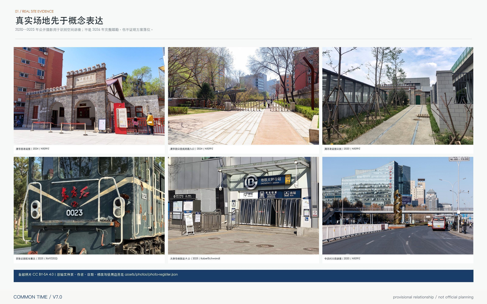

The photographs above are real public photographs recorded individually in `visual/assets/photo-register.json`, including place, date, author, source page, CC BY-SA 4.0 licence and permitted use. Their dates range from 2020 to 2025. They provide urban context only; they do not constitute a complete 2026 survey and do not verify key-area boundaries, engineering conditions or design locations.

## Why COMMON TIME Instead of Another AI Park

Three routes are compared against the same public-value, spatial, delivery and exit conditions. The result is a reviewable design choice for this submission, not an expert score or a government decision.

| Alternative | Strongest hypothesis | Principal cost and failure mode | COMMON TIME decision |
| --- | --- | --- | --- |
| A New-build expansion first | New buildings and landmarks can directly host innovation | Unknown ownership, demand, fire, utility, heritage and life-cycle cost can create vacancy, fiscal lock-in and spectacle | `HOLD`; consider construction only after existing-time and ground-floor options fail |
| B Platform and sensors first | Data integration and algorithmic scheduling automatically improve efficiency | Wider attack surface, personal-data purpose drift and vendor lock-in may transfer public decisions to opaque systems | `REJECT AS DEFAULT`; real-data access requires separate legal, security and procurement review, while fixed rules and human service remain valid |
| C Time-based adoption first | Register a real problem and non-AI baseline before reversible space and time-limited trials | Slower delivery and a need for real owners, independent evaluation, affected-group participation and retirement funds | `SELECTED FOR TESTING`; failure, stop and restoration are written into the same contract as deployment |

Selecting C does not presume success. If weekday/weekend and day/night evidence does not show a time mismatch, or if sharing does not outperform the non-AI baseline on accessibility, residential quiet, frontline labour, maintenance and unit cost, the relevant action must `PIVOT` or `RETIRE`. The core concept can therefore be disproved by evidence rather than confirmed only by branding.

## Design Basis and Source List

Evidence is separated into five levels. Level A consists of official calls, plans, public heritage records and policy documents; it can establish tasks and known facts but not infer missing parcel boundaries. Level B consists of cleared repository materials and validation rules; it defines the submission contract but does not replace statutory plans. Level C consists of open context such as OpenStreetMap and institutional case material; it supports low-authority relationships only. Level D consists of the proposal’s own GeoJSON, drawings, operational contracts and scenario cards. Level U means unknown and is kept visible wherever ownership, statutory lines, heritage GIS, municipal capacity, demand, cost or approvals are absent. [source:OFFICIAL-ANNOUNCEMENT] [source:AGENT-TASKBOOK] [source:SITE-PACKAGE]

The repository provides no official polygon with a verifiable statutory coordinate basis. `SITE-001` and the three key-area envelopes are provisional constraints; every relevant feature records `official_boundary=false`. The calculated site area is an internal EPSG:4548 package check, not a planning figure. [source:BOUNDARY-SOURCE] [source:KEY-AREA-SOURCE] [data:geometry/site_boundary.geojson#SITE-001] [metric:site_area_sqm] OpenStreetMap data provides background roads, rail, water and buildings at Level C. The empty `constraints.geojson` deliberately records missing statutory road lines, land-use controls, heritage protection GIS, river control lines, capacity and ownership rather than inventing them. [source:OSM-PUBLIC-CONTEXT-20260808] [data:geometry/constraints.geojson#DATA-GAPS]

Professional development must first produce six aligned surveys: railway alignment and the status of every original, restored, relocated or replicated object; Qinghe and Xiaoyue river systems, drainage and flood controls; public transport, walking, cycling and accessibility breaks; campus, park, community and access-control boundaries; building age, use, ground-floor condition and retain/retrofit/remove status; and public services, innovation spaces, opening times and capacity. Jingzhang Railway Heritage Park Phase 1 is publicly documented, but the nine-kilometre corridor must still be shown by construction and verification status rather than as one completed park. [source:OFFICIAL-JINGZHANG-PARK-PHASE1] [source:OFFICIAL-JINGZHANG-CO-DESIGN] The Qinghuayuan Station protection area and construction-control zones are preconditions, and Dazhongsi’s AI district must not be conflated with the protected Juesheng Temple complex. [source:OFFICIAL-QINGHUAYUAN-HERITAGE-CONTROL] [source:OFFICIAL-DAZHONGSI-HERITAGE]

The professional response references the official call, agent taskbook, national urban-design and regulatory-planning measures, the national land-use classification guide and the design-depth matrix. [standard:PROJECT-OFFICIAL-ANNOUNCEMENT] [standard:PROJECT-AGENT-OPEN-CALL-TASKBOOK] [standard:MOHURD-URBAN-DESIGN-MEASURES] [standard:MOHURD-CONTROL-DETAILED-PLANNING] [standard:MNR-LAND-USE-CLASSIFICATION-GUIDE] Documents not available in full remain marked for verification rather than treated as authority.

### P0–P1 Key-Area Spatial Deepening Supplement

The bilingual supplement `drawings/p0-p1-spatial-deepening.pdf` uses real public OpenStreetMap context to locate thirty candidate observation points, nine candidate action zones, six candidate section lines and twelve relation sections across the three key areas. Open mapping is not treated as an official boundary or survey base, and candidate dimensions are not represented as existing conditions or code conclusions. Six hard gates—transport, ecology, heritage, building/municipal/fire safety, public interest/accessibility and AI/data governance—must close independently rather than being averaged into a composite score. [source:OSM-PUBLIC-CONTEXT-20260808] [depth:three_key_area_detailed_design]

Field-return requirements, professional prerequisites and GO/HOLD rules are recorded in `report/narrative.md`. All three key areas remain conceptual until official polygons, two-person field verification, professional sign-off, real owners, procurement routes and RMB costs are available.

## Three-Level Scope Framework

The coordinated research area, overall design area and three key areas answer different decisions. At roughly 43.6 square kilometres, the research scope examines how talent, capital, computing, data, professional services and real-world problems circulate between Zhongguancun Science City and surrounding innovation nodes. At roughly 11.4 square kilometres, the overall design scope organises land-use roles, a public relationship spine, station–campus–park connections, transport, blue-green systems, municipal interfaces and public services. At the key-area scale, each prototype must show arrival, ground floor, public space, section, project owner, operational mode and trigger conditions. [depth:three_level_scope_framework]

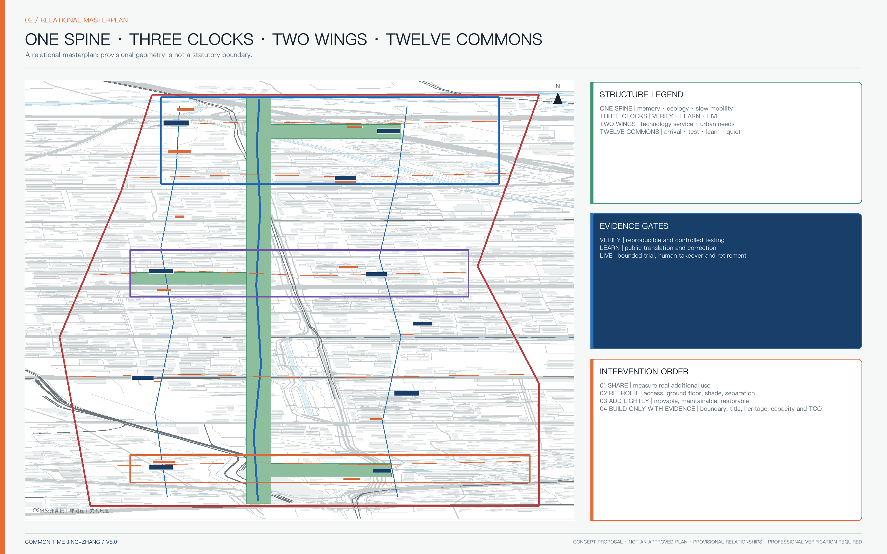

The “one spine” is not a uniform 200-metre green strip. It is a conceptual 70–90 metre relationship zone with three east–west garden tasks; exact widths, park phases and ownership remain to be verified. [data:geometry/land_use.geojson#LU-TIME-SPINE] [data:geometry/green_space.geojson#GREEN-SPINE] [depth:overall_spatial_structure] The cultural narrative is juxtaposition rather than destiny: the 1909 Jingzhang Railway, Qinghuayuan Station’s institutional history and Zhongguancun’s later technology entrepreneurship are separately sourced episodes. They are compared as public coordination experiments, not claimed as a proven causal line leading to AI. [source:OFFICIAL-JINGZHANG-HISTORY] [source:INSTITUTION-QINGHUAYUAN-HISTORY] [source:OFFICIAL-ZGC-HISTORY]

## Coordinated Research Area: Industry and Future City Research

The industry strategy is an adoption loop, not a list of fashionable sectors. Regional policy on the “two zones and one belt,” proof of concept, prototype development, testing and application provides context but does not imply endorsement, funding or tenant commitments. [source:OFFICIAL-TWO-ZONES-ONE-BELT] [source:OFFICIAL-HAIDIAN-2026-PLAN] [source:OFFICIAL-ZGC-AI-ACTION]

| Gate | Principal place | Required evidence | If the gate fails |
| --- | --- | --- | --- |
| G0 Problem registration | two wings and service points | named problem owner, baseline, affected groups, non-AI option | do not initiate |
| G1 Joint team | LEARN | domain owner, technical party, data steward, operator, public representative | HOLD |
| G2 Reproducible verification | VERIFY | data/model card, licence, benchmark, failure record | RETIRE |
| G3 Controlled test | VERIFY | protocol, comparison, thresholds, emergency stop, independent evaluation | no public trial |
| G4 Public translation | LEARN | plain-language and accessible explanation, appeal, trained human service | PIVOT |
| G5 Limited city trial | LIVE | limited time, area and user group, logs, feedback, human takeover | stop on safety or public-value failure |
| G6 Adoption readiness | service wing | TCO, procurement route, interfaces, IP/data rights, migration and supplier exit | no adoption |
| G7 Time-limited operation | owner’s real setting | SLA, monitoring, versioning, appeal, maintenance and residual value | renew explicitly |
| G8 Replicate or retire | belt and partners | common metrics, cross-site reproduction, applicability, restoration cost | replicate mechanism, not hype |

### Falsifiable G0–G8 Record Contract

Each project may have only one current record. Required fields are `problem_owner_status`, `affected_groups`, `non_ai_baseline_status`, `evidence_refs`, `thresholds_status`, `independent_evaluator_status`, `human_route`, `appeal_route`, `expiry`, `retirement_fund_status`, `gate_decision` and `next_evidence_due`. Allowed states are `VERIFIED / PROPOSED / PENDING / HOLD / RETIRE`; an agent may not infer missing external evidence.

1. If the problem owner, affected groups or non-AI baseline is unverified, the project can reach no further than G0 `HOLD`.
2. Missing thresholds, emergency stop, independent evaluator or data rights prohibit entry to G3.
3. Failure of the same-place, same-time and same-effect human/non-digital route, accessible task chain or appeal adjudication prohibits entry to G5.
4. Missing owner budget, procurement route, operations, migration or retirement fund prohibits entry to G6.
5. Any life-safety, heritage-authenticity, privacy-right or serious group-disparity failure causes `RETIRE` and cannot be averaged away by a composite score.

Owners, site evidence, thresholds, budgets and independent evaluators for all three priority projects are `PENDING/HOLD`. This submission therefore proves only the contract structure and rejection logic; it does not claim that any project has passed G0–G8.

### Five Named Regional Coordination Interfaces

| Interface | What this belt offers | What the counterpart may offer | Required exchange receipt | Current state |
| --- | --- | --- | --- | --- |
| Beiwei Community | community problem cards, non-digital service and group-disparity tasks | resident/care, frontline-service and daily-life problems | joint problem owner, affected-group record, non-AI baseline and appeal responsibility | `PROPOSED / owner pending` |
| Future Science City | VERIFY reproduction protocol, independent testing and failure archive | engineering research, facilities and cross-site reproduction conditions | same-threshold reproduction, difference note, supplier exit and data-rights proof | `PROPOSED / partner pending` |
| Huairou Science City | public translation, model/data cards and urban-problem interface | big-science outputs and science-communication resources | rights-cleared package, reproducible steps, applicability boundary and human sign-off | `PROPOSED / partner pending` |
| Beijing E-Town | LIVE bounded trial and kerb/service protocols | engineering manufacture, robotics and industrial test conditions | non-AI comparison, safety thresholds, liability cover, maintenance and retirement proof | `PROPOSED / partner pending` |
| Beijing–Tianjin–Hebei coordination nodes | public metrics, failure archives and portable interfaces | different urban conditions and cross-regional problem owners | cross-site reproduction, regulatory/climate/population differences and replicate/do-not-replicate decision | `PROPOSED / nodes pending` |

These are coordination-contract templates, not proof that any institution participates, authorises the work or commits resources. An interface becomes `VERIFIED` only when both named sides, a public purpose, cleared inputs, accountable people, a time boundary and exit evidence all exist.

The gate sequence adapts NIST’s `GOVERN—MAP—MEASURE—MANAGE` logic without replacing Chinese law, sector regulation or public approval. [source:FRAME-NIST-AI-RMF] Seven activities—research, engineering verification, open collaboration, translation, enterprise growth, city trial and international communication—must each name inputs, outputs, responsibility and an exit artefact. VERIFY concentrates controlled testing and independent evaluation; LEARN connects authorised knowledge to public understanding and entrepreneurship; LIVE tests only limited urban services with visible human fallback. International precedents are used only for mechanisms such as research-to-adoption, open science, PoC support, co-location and station–campus coordination; foreign scales, laws and investment figures are not transferred. [source:CASE-VECTOR-TORONTO] [source:CASE-MILA-MONTREAL] [source:CASE-SEOUL-AI-HUB] [source:CASE-ONE-NORTH]

## Overall Design Area: Urban Renewal and Regulatory-Plan-Level Urban Design

The plan is presented as three aligned layers rather than a false statutory plan. Layer one is the surveyed and statutory base, with absent information hatched `UNKNOWN`. Layer two is a spatial-role framework for research, translation, shared services, daily life and blue-green edges. Layer three is a negotiated operating-time layer that does not change statutory land use. GeoJSON retains national classification codes for machine readability and complete topology, while each feature states `legal_land_use_status=unknown`. [data:geometry/land_use.geojson#LU-W-03] [depth:land_use_layout]

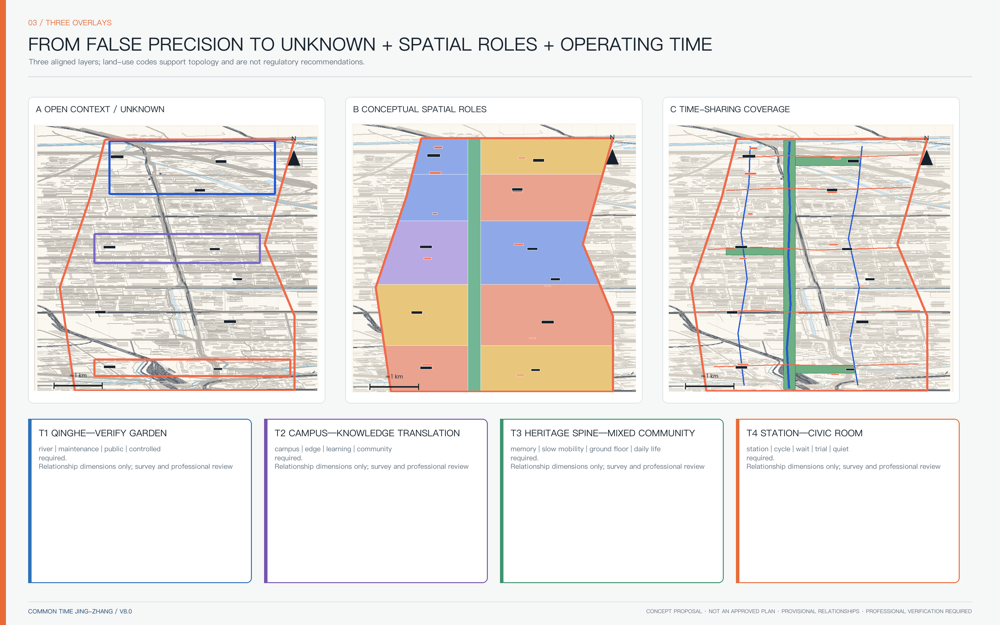

Four time bands form a negotiation template: 07:00–10:00 supports commuting, breakfast, exercise and campus connection; 10:00–18:00 supports research, education, enterprise and public services; 18:00–22:00 may host co-learning, release, culture and bounded trials; 22:00–07:00 retains only necessary, low-noise and human-recoverable services. Actual hours require baseline measurement, labour agreements, resident consultation, fire review and an operating budget. [metric:temporal_utilization_index]

Four not-to-scale urban sections expose conflicts for the next professional survey. T1 sequences Qinghe ecology, a possible 4–6 m maintenance route, an 8–12 m interpretation forecourt, physical separation and a controlled test core. T2 connects the campus knowledge source, a 3–5 m boundary passage, an 8–12 m learning court, community services and rail arrival. T3 places verified railway memory, a shaded 6–9 m slow-mobility route, a 6–12 m shared ground floor and a 4–6 m residential service edge. T4 separates station arrival, a possible 3–4 m cycling strip, an 8–15 m waiting court, trial space and a 5–8 m quiet rear edge. These dimensions compare relationships only; they are not red lines, engineering sections or investment quantities.

Five building prototypes prioritise retrofit: shared ground floors in existing research buildings; campus–street learning passages; a controlled evaluation hall with a public explanation forecourt; a station-facing civic room; and reversible park-edge service pavilions. Each prototype must identify applicable existing assets, day/night operation, fire and maintenance preconditions, reversible components and exit conditions. The GeoJSON envelopes are demand areas, not building footprints. [data:geometry/buildings.geojson#BLDG-T01] [depth:retain_renovate_demolish] FAR, height, density, setbacks and construction volume remain unknown. [metric:floor_area_ratio] [depth:development_intensity_controls]

## Detailed Design of Key Areas

All three key areas use a common review frame—one central conflict, four interacting systems and six drawing obligations—but no shared geometric template. The three rectangles are provisional indexes and do not correspond to parcels, roads or ownership. [data:geometry/key_areas.geojson#PROV-KEY-001] [data:geometry/key_areas.geojson#PROV-KEY-002] [data:geometry/key_areas.geojson#PROV-KEY-003] [metric:key_area_count]

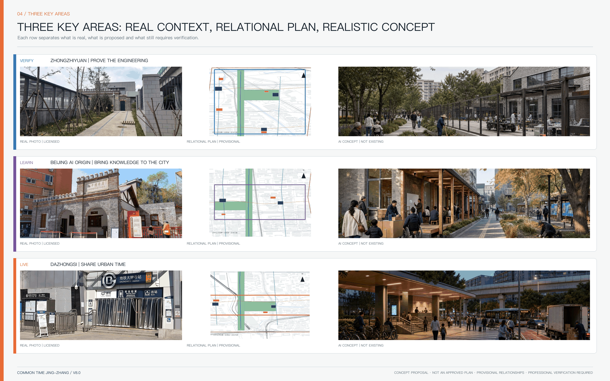

**VERIFY / Zhongzhiyuan.** The central conflict is between secure verification and an open river garden. The sequence is controlled test core, standards collaboration ring, public explanation forecourt and Qinghe ecological edge. Research logistics never cross the public garden, and visitors see only translated, cleared results. Before a real entrance is drawn, the team must verify the Fifth Ring Road, river and flood controls, park phases and actual paths. A proposed “engineering evidence table” may present sourced measurement, construction and maintenance records, while every rail object must be labelled original, restored, relocated, replicated or symbolic. The generated visual is a concept image, not a site photograph or approved plan.

| Real context | Realistic concept test |
| --- | --- |
| 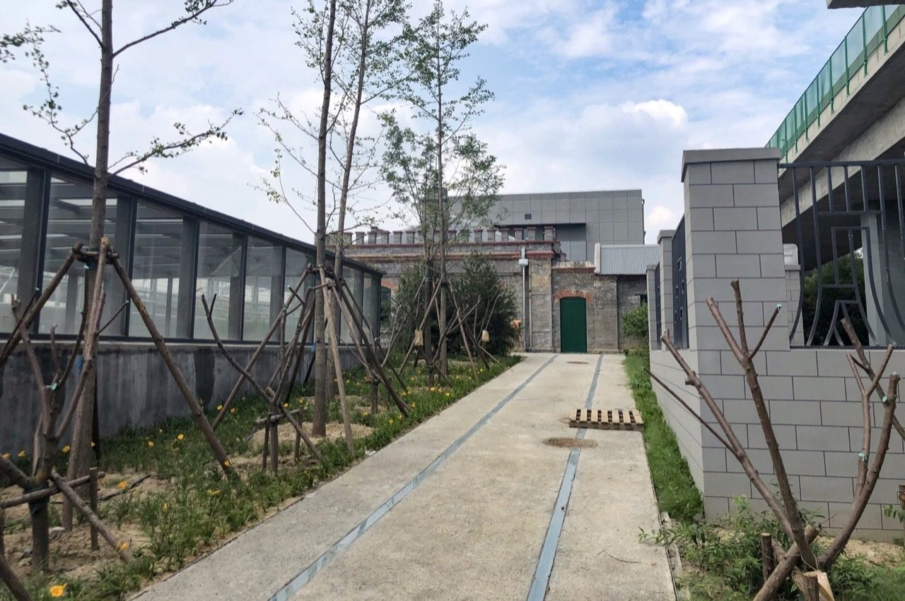 | 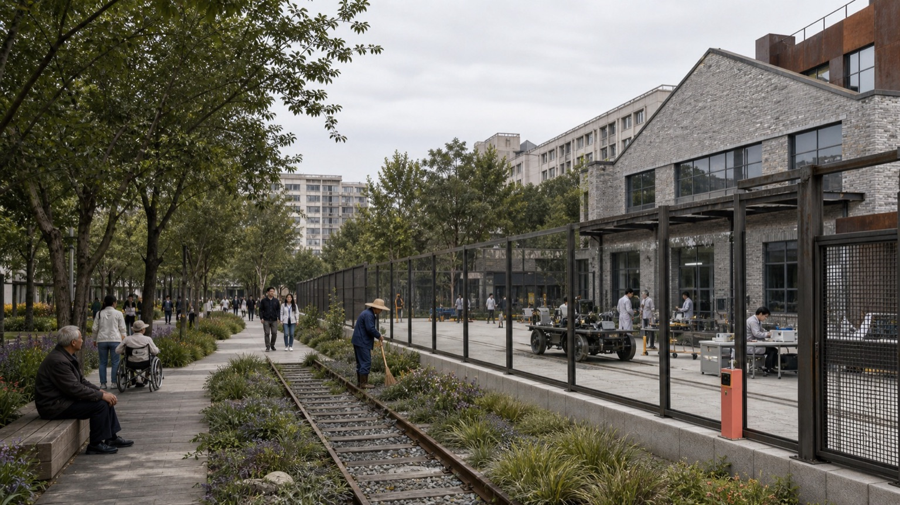 |

**LEARN / Beijing AI Origin Community.** The central conflict is the gap between campus knowledge density and urban accessibility. The proposed sequence is knowledge source, translation passage, incubation court, community learning edge and rail arrival. Campus access-control and personal data are never merged into a unified profile. Qinghuayuan Station is a historical anchor, not a nostalgic stage set. Any low-impact “time ticket” must be outside verified protected areas, cite time, event, source and confidence, offer correction, and undergo heritage review. The concept image tests a city-side learning court, human help desk, paper and digital access, continuous accessibility and a quiet garden; it does not depict alterations to the protected building.

| Real context | Realistic concept test |
| --- | --- |
| 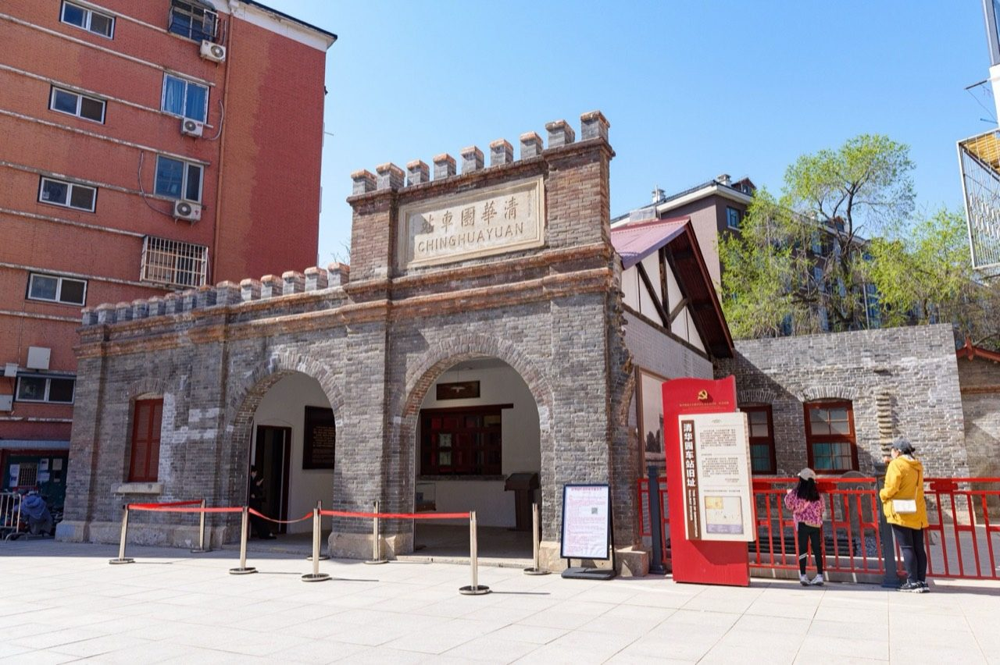 | 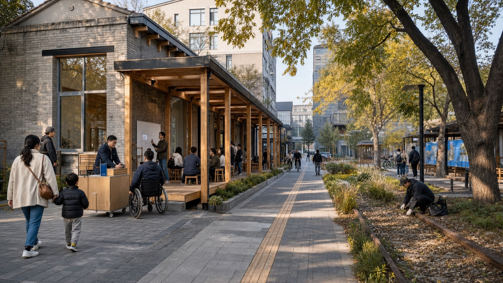 |

**LIVE / Dazhongsi.** The central conflict is between intense rail/commercial movement and comfortable public life. Four-quadrant arrival, a station forecourt, service ground floors, logistics and a quiet residential edge are separated by time and space. Algorithms may advise but never alter lawful right of way; fixed signs and trained staff take precedence. Juesheng Temple is not used as an AI brand, and no unverified route or relationship is shown. The concept image tests arrival, cycling, waiting, service, loading and quiet edges without claiming a specific station exit or engineering design.

| Real context | Realistic concept test |
| --- | --- |
| 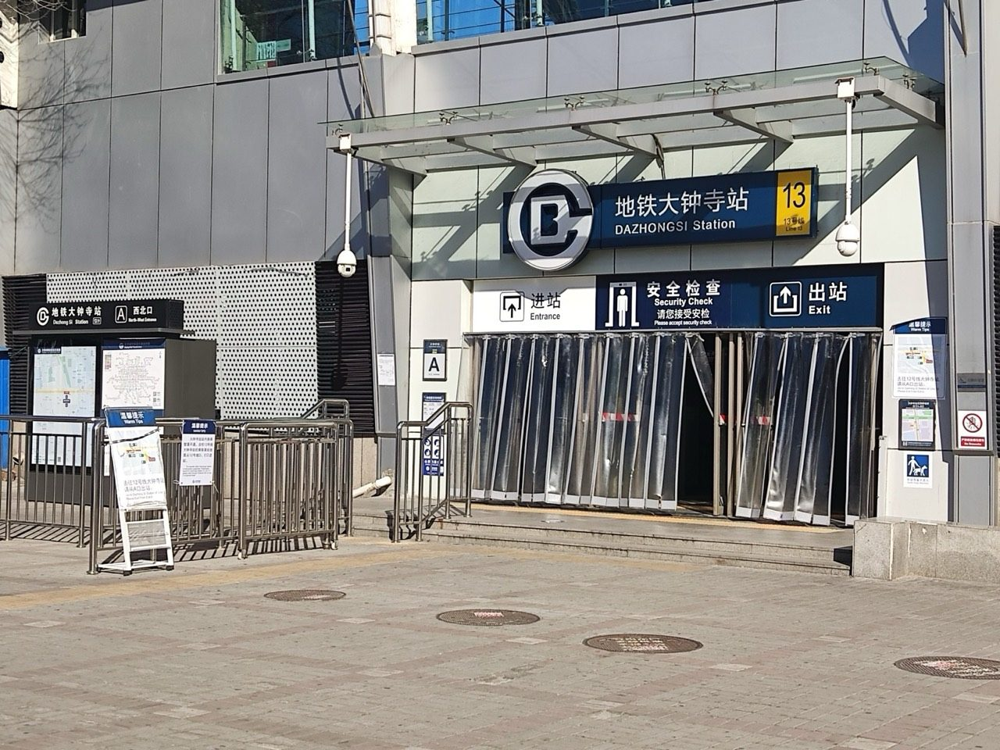 | 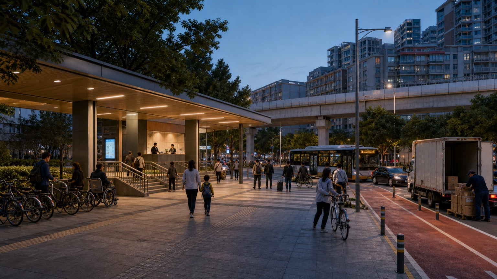 |

Each district must ultimately provide a locatable plan, two sections through real interfaces, a time-based arrival and logistics plan, a retain/retrofit/remove drawing and a project-trigger drawing. Missing any one of these means “detailed design” is not complete. [depth:three_key_area_detailed_design]

## Priority Project Contracts for the Three Key Areas

Each priority project converts a spatial prototype into a work contract that can be rejected. All three are `PROPOSED`, and every current decision is `HOLD`: no real problem owner, asset/operator, official GIS, site condition, independent evaluator, procurement route, RMB budget or funding commitment has been verified.

| Contract | Problem owner and non-AI baseline | Minimum spatial/service scope | Outcomes that must be recorded | `HOLD / RETIRE` conditions |
| --- | --- | --- | --- | --- |
| P-V01 Zhongzhiyuan VERIFY controlled verification and public explanation garden | real urban-problem owner `PENDING`; baseline is human/bench testing, paper records, human explanation, fixed separation and on-site safety procedure | public explanation forecourt, independent evaluation court, controlled core, logistics/emergency loop and ecological buffer; no fixed building or river line | reproducibility and failure archive, serious-incident closure, public understanding and group disparity, human takeover time, ecological maintenance burden and unit advancement cost | no real owner/evaluator; public routes cross the controlled/logistics core; safety, data-rights, heritage or ecology fails; no gain over baseline; unresolved appeal |
| P-L01 AI Origin LEARN public learning court | public-learning/research-translation owner `PENDING`; no university, street, community or cultural institution is confirmed; baseline is offline lectures, library/paper material, human consultation and existing campus/community activity | only authorised translation, human hosting, paper/digital parity and accessible co-learning in an existing city-side ground floor/court; no change to campus access or heritage fabric | task understanding/reproduction, accessibility and non-digital parity, human correction, voluntary 90-day retention, non-commercial hours, group disparity and unit cost | heritage/copyright/IP unresolved; no human host or equal non-digital route; no evidenced result after two rounds; group disparity, noise or maintenance worsens; content cannot be corrected/removed |
| P-D01 Dazhongsi LIVE arrival and quiet-service forecourt | transport/public-service owner `PENDING`; transport, station, street and community parties are unconfirmed; baseline is lawful right of way/signals, human information, paper maps, fixed kerb rules and site management | reversible staffed arrival, continuous accessibility, fixed-time kerb, quiet waiting and bounded trial; algorithms never control right of way | distribution of interchange time rather than averages, conflicts/near misses, accessible task success, human takeover, noise/appeals, frontline labour burden, unit cost and recovery time | evacuation, fire, right-of-way or accessibility failure; no site takeover; worse noise/labour; no net gain after two cycles; data misuse or unresolved appeal |

The three contracts share the G0–G8 record fields but not success thresholds. Thresholds, samples, evaluators, accountable people, project finance and restoration funds can be confirmed only with the future owner, affected groups and relevant professionals; this submission does not prefill numbers.

## AI Innovation Ecosystem, Personas, and AI+ Scenarios

The adoption team contains research originators, open-source maintainers and technical architects; product owners, domain experts, service designers and bilingual communicators; adoption, MLOps/security and procurement specialists; and data stewards, facility operators and accessibility/community reviewers. [metric:innovation_role_count] The cycle is open problem → cross-functional team → accountable project → skills passport → adoption team → mentor return. It does not create a personal city score and does not require public identity disclosure.

### Six Service Groups Pending Co-design

Six personas are hypotheses for co-design: a cross-campus student; a researcher or entrepreneur; a resident or caregiver; an older, disabled or temporarily mobility-limited person; a cleaner, guard, courier or facility worker; and a domestic/international visitor or non-digital user. [metric:persona_count] Their journeys are measured across weekdays/weekends and day/night. Every journey requires a same-channel human or non-digital fallback: static maps and non-commercial seating; in-person intake and standard forms; a staffed desk and paper directory; guided travel and physical controls; fixed operating rules and local emergency stops; signed decisions and independent appeals. Average travel time may not hide group-specific failure. These are proposal hypotheses and must be revised through real participation by residents, disabled people, frontline workers, students, enterprises and visitors.

### Public Rights, Appeal and Exit Contract

| Public right | Proposal constraint | Evidence required before G5 | Current state |
| --- | --- | --- | --- |
| Unconditional access | public space and essential service remain available without login, purchase or personal data | on-site entrance audit and tasks refusing login/purchase | `PROPOSED / field test pending` |
| Equal human/non-digital route | human, paper, static-map or physical-button routes operate at the same place, time and effect, not as degraded access | paired tasks comparing waiting time and decision effect with the digital channel | `PROPOSED / service owner pending` |
| Accessibility and comprehension | routes, information, communication, emergency stop and departure form one task chain | full-chain testing led by disabled participants and specialists, with failures reported separately | `PROPOSED / co-design pending` |
| Notice and minimum data | purpose, data, retention, accountable person and non-AI option are visible; no person is identified by default | data inventory, purpose limitation, deletion proof and human comprehension check | `PROPOSED / legal review pending` |
| Appeal and independent adjudication | in-person, paper and phone submission; a supplier does not adjudicate its own appeal | named intake and independent review roles, service time, result notice and escalation route | `PROPOSED / authority and SLA pending` |
| Pause, restore and exit | automation can stop on site, restore the human baseline, and provide export/deletion/withdrawal/retirement proof | emergency-stop drill, recovery time, export/deletion check and asset/supplier exit list | `PROPOSED / operator and fund pending` |

This is an admission contract, not an operating participation mechanism. No affected-group co-design sample, field route test, approved service time or accountable institution yet exists. Any unclosed gap keeps the relevant project at `HOLD`.

Twelve scenario cards cover mobility, enterprise services and civic governance. [metric:scenario_count] A mobility scenario compares fixed guidance and trained staff with AI-assisted routing; success requires fewer wrong routes and conflicts without discriminatory burden. A public-service assistant may retrieve authorised material but a named human signs the answer. A facility digital twin may support energy and maintenance simulation but must declare sensors, calibration, error, security, operator and retirement. A heritage guide may retrieve and translate cleared records but may not generate unsupported historical claims. Four testbeds provide controlled engineering, public translation, limited service and interoperability/exit testing. [metric:industry_testbed_count] Each card records purpose, problem owner, affected groups, non-AI baseline, minimum data, thresholds, stop rule, appeal, operator, evaluator, OPEX and retirement evidence.

## Land Use, Building Scale, and Retain-Renovate-Demolish Strategy

The land-use layer is a proposal-wide spatial-role framework, not a statutory land-use plan. Concept areas are recalculated in `metrics.json` using the provisional site polygon and national classification codes, while every number remains non-statutory. [metric:land_use_0802_area_sqm] [metric:land_use_0804_area_sqm] [metric:land_use_05_area_sqm] [metric:land_use_0702_area_sqm] [metric:land_use_1401_area_sqm] The design gives priority to existing research, education, community and park assets. It first shares time, then retrofits ground floors, then adds reversible components, and considers new construction only after ownership, structure, fire safety, capacity and need are verified.

A building register must classify each real structure by age, use, structural condition, ownership, ground-floor interface, energy and municipal demand, heritage relationship and retain/retrofit/remove recommendation. No such complete register is available, so no existing building is marked for demolition. Prototype envelopes in `buildings.geojson` are small demand zones for testing access and adjacency; they are not cadastral objects, building masses, land acquisition proposals or construction quantities. [metric:building_footprint_area_sqm] [depth:retain_renovate_demolish] Height, massing and character principles remain modest at heritage interfaces, readable at the ground floor, low-glare at night, repairable and reversible, without imitation heritage or science-fiction megastructures. [depth:height_massing_character]

## Transport, Rail, Municipal Infrastructure, and Public Services

The transport strategy registers five connection tasks: Qinghe Station to the VERIFY district; Qinghuayuan Station to the heritage spine; Wudaokou to Qinghuadongluxikou across campus and park edges; the four quadrants around Dazhongsi; and communities to everyday services. [data:geometry/roads.geojson#ROAD-SWITCH-01] [depth:traffic_rail_slow_parking] Candidate lines show relationships and test questions, not bridges, tunnels, rights of way or engineering alignment. Their verification requires timed passenger counts, desire lines, cycling conflicts, accessibility routes, loading, emergency access, station boundaries and road authority.

Pedestrian detour and continuous accessibility are unknown until route tests are completed. [metric:transit_detour_factor] [metric:accessible_continuity_rate] Time-based kerb management remains an operating hypothesis; the algorithm cannot change lawful priority, and staff must be able to take over on site. Parking quantities are not prefilled. Public services retain two equal channels: AI may help search, while human staff or static text provides the authoritative response.

Municipal and digital infrastructure is organised at node, block, district and governance levels. Node checks cover power isolation, storage, charging, drinking water, first aid and human review. Block checks cover electricity, communications, cooling, fire safety, waste, loading and night maintenance. District checks cover capacity, drainage, emergency redundancy and asset management. Governance checks cover purpose, data, role permissions, suppliers, fallback, versions, migration and retirement. Capacity is unknown; edge computing is not treated as furniture without energy, cooling, maintenance and fire implications. [depth:municipal_new_infrastructure]

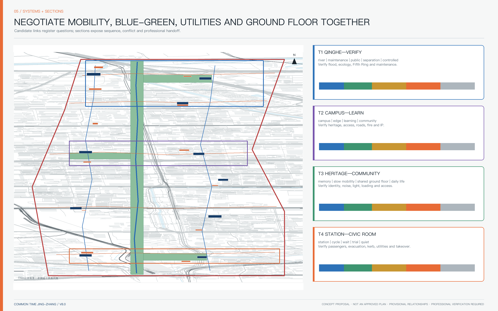

## Blue-Green Network, Public Space, and Urban Character

The blue-green network consists of three geographic tasks rather than one uniform green strip. The north addresses Qinghe ecology, flood conditions, verification gardens and the Fifth Ring interface. The centre links heritage park segments, campuses and communities through shaded east–west connections. The south combines station-area open space, peak evacuation and a quiet night edge. Xiaoyue River is an environmental problem source for the eastern wing, but its exact line and flood requirements require official data. [data:geometry/green_space.geojson#GREEN-SPINE] [depth:blue_green_public_space]

The current concept calculates approximately 8.50% blue-green coverage and 0.28% coverage for the twelve commons on the provisional polygon. These are package geometry checks, not statutory ratios or performance claims. [metric:green_space_area_sqm] [metric:green_ratio] [metric:public_space_area_sqm] [metric:public_space_ratio] Functional continuity requires four aligned baselines: biodiversity, soil and tree canopy; hydrology, flood control and heat exposure; access and comfort for different bodies and ages; and irrigation, cleaning, repair, seasonal closure and labour. If ecology, thermal comfort, accessibility or maintenance fails, the spine remains a relationship hypothesis and may not be called an ecological corridor.

The twelve time commons are deliberately different: four arrival portals explain direction, public rules and evidence; three testing or release courts provide isolation, explanation and restoration; three community service or learning points provide staff, paper material, non-commercial seating and accessibility; two quiet ecological places prioritise restoration and low-light use. [data:geometry/public_space.geojson#PUBLIC-01] [metric:time_commons_count] Four proposed public-memory and learning nodes honour reproducible evidence, contributions, human responsibility and the ability to stop. [metric:landmark_count] They are new, dated and reversible; they do not imitate railway relics or create monumental AI icons.

## Renewal Projects, Implementation Policy, and Phasing

Ten projects convert the concept into accountable tasks. P01 measures opening-time baselines with property owners and operators. P02 establishes an authorised translation and learning court. P03 provides staffed human review for public services. P04 creates an independently operated evaluation hall. P05 develops the relationship spine only after boundary, heritage, ecology and maintenance checks. P06 tests Dazhongsi arrival through professional traffic and accessibility review. P07 pilots the twelve commons with individual charters and expiry dates. P08 tests edge-service infrastructure with energy, fire, cybersecurity and supplier-exit gates. P09 maintains a sourced and correctable public-memory archive. P10 runs an annual COMMON TIME cycle in which every event must have a real problem owner and a next-stage budget. [depth:renewal_project_list]

For every project the public package identifies an accountable owner type, an executing operator, affected groups, CAPEX category, OPEX owner, preconditions, result KPI, expiry and restoration condition. Funds are described by category only; no government appropriation, sponsor or investment is claimed. Outcome measures include added effective opening hours, reproduction and understanding rates, human takeover time, serious events, maintenance labour, accessibility success, complaints, energy use, migration time and unit advancement cost. [metric:unit_advancement_cost] Supplier, evaluator, procurement decision-maker and appeal authority must not collapse into one party.

The annual cycle is Q1 open problems, Q2 controlled verification, Q3 public learning and Q4 adopt-or-retire. Event names, dates and organisers remain proposals. The conversion path is G0 problem → G1 team → G2/G3 verification → G4 translation → G5 limited trial → G6 procurement/TCO/migration review → G7 time-limited operation → G8 replicate or retire. The responsibility-chain completeness rate and adoption rate remain unknown until real owners and trials exist. [metric:responsibility_chain_completeness_rate] [metric:adoption_rate]

Three phases are evidence sequences rather than promised dates. Phase 1 uses LEARN for registration, team formation, translation and opening-time baselines. Phase 2 uses VERIFY for reproducibility, comparison, controlled testing and independent evaluation. Phase 3 uses LIVE for limited trial, adoption readiness, renewal, replication or retirement. [data:geometry/phasing.geojson#PHASE-01] [metric:phase_count] [depth:phasing_implementation] Each phase ends in `GO / HOLD / PIVOT / RETIRE`; it cannot advance until public value, privacy, safety, accessibility, noise, labour, budget and retirement funds are jointly closed.

## Metrics, Area Recalculation, and Compliance Matrix

Metrics are divided into four types. Package geometry checks include provisional area, blue-green and public-space coverage, prototype demand zones and relationship-line length. Content counts include twelve commons, six personas, twelve adoption roles, four testbeds, four memory nodes, three key areas and three phases. Operating metrics—time utilisation, accessibility, detour, responsibility, adoption and cost—remain unknown until measured. Statutory and engineering metrics—FAR, height, density, setbacks, green-space requirements and capacity—remain unknown until official data and professional approval. [depth:metrics_recalculation]

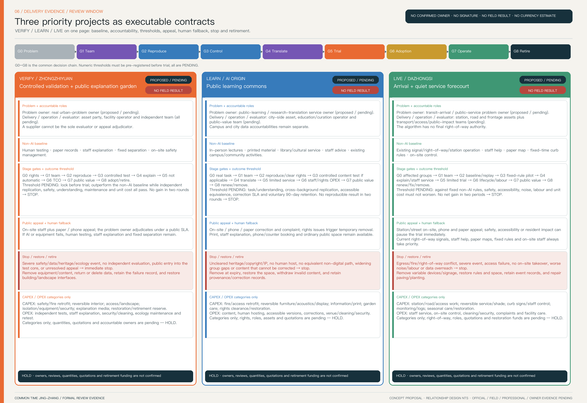

`metrics.json` is the sole numerical source for the package. The relationship spine, cross-gardens, twelve commons, ten prototype demand zones and candidate lines are recalculated in EPSG:4548. Machine validation proves only internal completeness and consistency; it does not prove survey accuracy, statutory compliance, engineering feasibility, investment readiness or professional sign-off. The compliance matrix maps all public-call requirements and the six agent tasks. The standards and design-depth matrices link each obligation to prose, drawings, data or an explicit data gap. “Complete” means an evidence obligation is answered, not that absent local information has been acquired.

## Risk, Copyright, and Compliance

The following remain unknown: official scope and key-area polygons; survey and coordinate basis; parcels, ownership and statutory use; existing building footprints, age, height and retain/retrofit/remove decisions; FAR, density, height and setbacks; road lines, sections, passenger demand, parking and station engineering; heritage-park phases; Qinghuayuan protection GIS; Juesheng Temple’s exact relationship; river control and flood data; utility, fire, energy, computing and public-service capacity; current projects; real demand; cost, investment, tenants and public funding. [depth:risk_missing_data]

The worst operating scenario is a high-activity, low-adoption and high-maintenance showcase district. The defence is to reject problems without owners; separate suppliers from evaluators; preserve human and non-AI access; require TCO, interfaces, migration and exit before adoption; finance restoration and retirement; and measure closed problems and unit advancement cost rather than visitor totals. Shared use may not shift night work, risk or expense to cleaners, guards, service staff, couriers or residents.

A unified digital platform could increase vendor lock-in, attack surface and purpose drift. Connecting real sensors, access-control, payment, identity or personal data is outside this proposal and requires separate legal, security, procurement and operational approval. Public space uses no facial recognition, individual tracking or opaque ranking. Event logs are limited to necessary incidents, accountable people, versions and review decisions.

Railway, Zhongguancun and AI are related here by design interpretation, not by asserted historical causation. Original, restored, relocated, replicated and digitally reconstructed objects must be distinguished. Real photographs keep their CC BY-SA 4.0 author and source information and do not imply endorsement. Three concept images are labelled AI-generated, not existing conditions, not official plans and pending survey verification. OpenStreetMap background retains its attribution. The overall proposal uses `COMMUNITY-DISPLAY-ONLY` without restricting embedded CC BY-SA components; details are in `visual/assets/photo-register.json` and `report/copyright_statement.md`.

### Rights, Licence and Generation-Status Summary

| Content type | Rights/generation status | Boundary that must remain visible |
| --- | --- | --- |
| Chinese/English proposal and original diagrams | overall project `COMMUNITY-DISPLAY-ONLY` | does not claim third-party marks, heritage imagery or institutional endorsement |
| Real photographs | each item recorded under CC BY-SA 4.0 with author, source page, date and crop/modification | the photographic component retains its source licence and conveys no endorsement |
| OpenStreetMap background | Level-C public background with ODbL attribution | low-authority relationships only; not official GIS, cadastral, survey or engineering proof |
| AI concept images | project-generated and labelled AI-generated, non-existing, non-official and pending survey | cannot prove built condition, real view, dimensions, ownership or approval |
| Official/institutional public material | summarised and linked through `sources.json` | no full-work copying and no conversion of policy language into project authorisation, funding or commitment |
| Fonts | no font file is distributed in this package | verify embedding rights or substitute an open font, then perform machine and human checks before publication |
| Bilingual and tool output | both languages use the same fact states; tool output retains provenance | tool licensing does not approve source content; bilingual planning edit and human fact review remain pending before external publication |

All spatial, policy, operating, event and identity proposals are concepts for professional development. They are not government approval, professional certification, investment, construction, procurement, tenant, operation or event commitments.

## References

The authoritative project references are the official call, agent taskbook, public site package, source registry, provisional boundary sources and current official planning or heritage pages. [source:OFFICIAL-OPEN-CALL-SITE-20260808] [source:OFFICIAL-ANNOUNCEMENT] [source:AGENT-TASKBOOK] [source:SITE-PACKAGE] [source:SOURCE-REGISTRY] [source:BOUNDARY-SOURCE] [source:KEY-AREA-SOURCE] Planning and history references cover the Haidian district plan, Jingzhang control notice and park phases, railway history, Qinghuayuan Station heritage controls, Dazhongsi/Juesheng Temple and Zhongguancun history. [source:OFFICIAL-HAIDIAN-DISTRICT-PLAN] [source:OFFICIAL-JINGZHANG-CONTROL-NOTICE] [source:OFFICIAL-JINGZHANG-PARK-PHASE1] [source:OFFICIAL-JINGZHANG-HISTORY] [source:OFFICIAL-QINGHUAYUAN-HERITAGE-CONTROL] [source:OFFICIAL-DAZHONGSI-HERITAGE] Policy references cover the regional innovation strategy and AI proof-of-concept programmes. [source:OFFICIAL-TWO-ZONES-ONE-BELT] [source:OFFICIAL-HAIDIAN-2026-PLAN] [source:OFFICIAL-ZGC-AI-ACTION] Full URLs, access dates and reuse restrictions are in `sources.json`.

Machine-readable evidence links include the site boundary [data:geometry/site_boundary.geojson#SITE-001], key areas [data:geometry/key_areas.geojson#PROV-KEY-001], land-use roles [data:geometry/land_use.geojson#LU-TIME-SPINE], prototypes [data:geometry/buildings.geojson#BLDG-T01], mobility tasks [data:geometry/roads.geojson#ROAD-SWITCH-01], blue-green network [data:geometry/green_space.geojson#GREEN-SPINE], commons [data:geometry/public_space.geojson#PUBLIC-01], data gaps [data:geometry/constraints.geojson#DATA-GAPS] and phasing [data:geometry/phasing.geojson#PHASE-01].

Design-depth links cover existing conditions, the three scopes, overall structure, land use, development controls, height and character, retain/retrofit/remove, transport, municipal systems, blue-green space, key areas, renewal projects, phasing, recalculation and risk. [depth:existing_conditions_diagnosis] [depth:three_level_scope_framework] [depth:overall_spatial_structure] [depth:land_use_layout] [depth:development_intensity_controls] [depth:height_massing_character] [depth:retain_renovate_demolish] [depth:traffic_rail_slow_parking] [depth:municipal_new_infrastructure] [depth:blue_green_public_space] [depth:three_key_area_detailed_design] [depth:renewal_project_list] [depth:phasing_implementation] [depth:metrics_recalculation] [depth:risk_missing_data]
