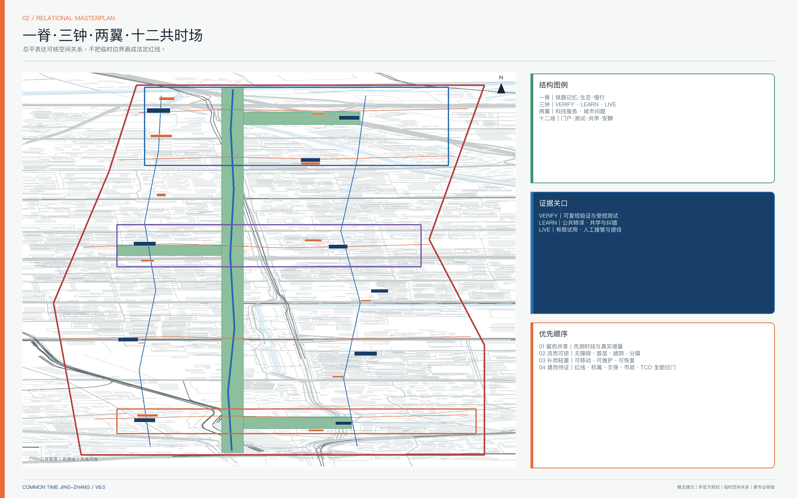
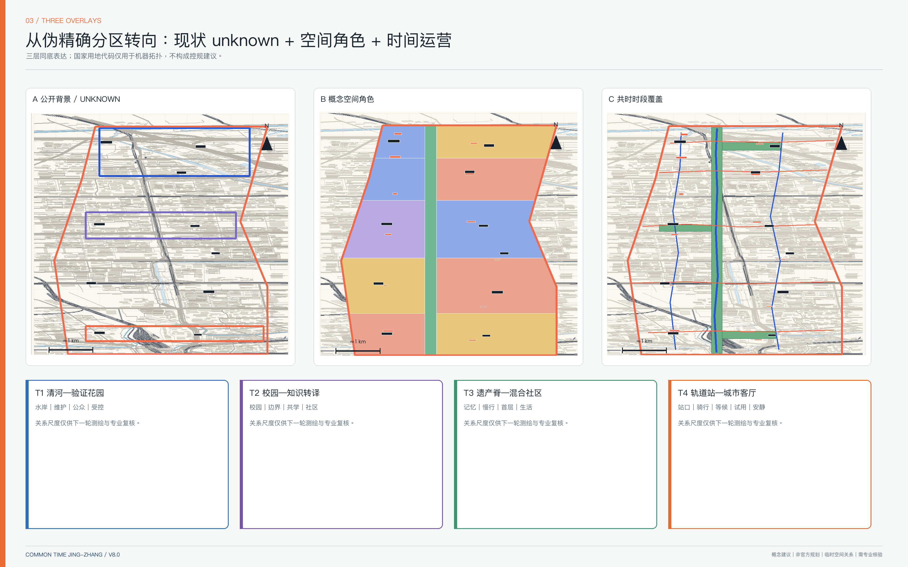
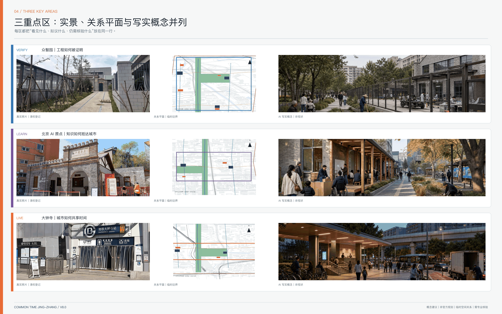
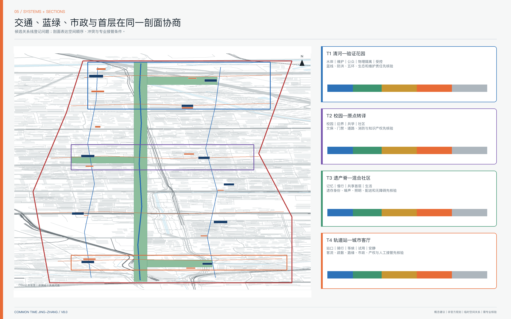
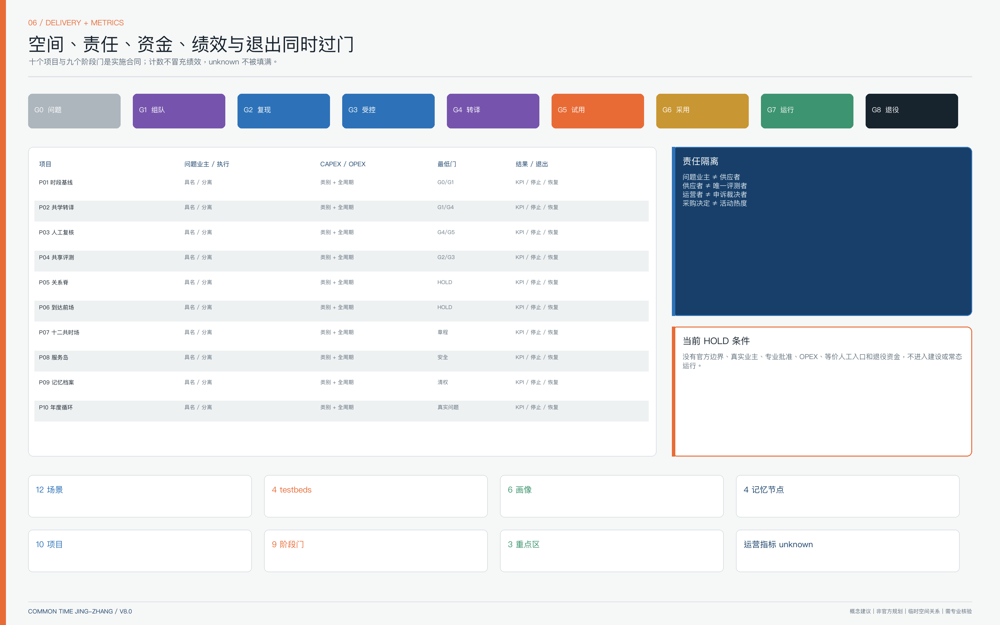

# 共时京张 / COMMON TIME

> **不是让 AI 占领更多城市，而是让每一次技术进入城市之前，先回答：谁的问题、谁负责、如何验证、何时停止。**

“共时京张”把“科研、社区、商业与公共服务可能存在时段错配”作为**待调查假设**，而不是既成事实。方案先建立工作日/周末、昼/夜的时段基线，再以共享、轻改、可逆补点和必要建设四级动作，检验存量空间能否在更多时间服务更多人。AI 仅承担检索、匹配、翻译、预约和复盘；问题业主、产权人、运营者、独立评测者与公众保留批准、申诉和停止权。

空间结构为 **一脊·三钟·两翼·十二共时场**。本轮不以虚构鸟瞰开场，而把实景证据、关系总平、节点平面/剖面、写实概念图和实施门依次展开：一脊是分段核验的铁路遗产—生态—慢行关系脊；三钟是 `VERIFY / LEARN / LIVE` 三个证据关口；两翼分别输入科技服务与真实城市问题；十二场分为 4 个门户、3 个验证/发布院落、3 个社区服务/共学节点和 2 个安静生态节点。最终回路是 `VERIFY → LEARN → LIVE → ADOPT / RETIRE`，不以扩大部署掩盖失败。

上图全部为真实摄影，逐张记录地点、拍摄日期、作者、CC BY-SA 4.0 许可、原始文件页和使用边界，详见 `visual/assets/photo-register.json`。照片时间跨 2020—2025 年，只用于建立场地与城市语境，**不等于 2026 年完整现状调查，也不证明重点区边界、工程条件或方案落位**。

## 设计依据与资料清单

### 1. 证据等级

| 等级 | 内容 | 可用于 | 不可用于 |
| --- | --- | --- | --- |
| A 官方公开 | 征集公告、海淀规划、公园一期、文保条目、政策文件 | 确认任务、历史事实、规划背景和法定核验入口 | 在缺图件时推断精确红线、权属或指标 |
| B 仓库清权 | site package、任务书、字段与校验规则 | 生成提交包、矩阵、自检和引用关系 | 替代缺失的官方控规与现状测绘 |
| C 公开背景 | OSM、机构官网与国际案例 | 低权威空间关系和机制比较 | 法定现状、完整设施清单或本地绩效外推 |
| D 生成设计 | GeoJSON、图纸、运营合同和场景卡 | 方案讨论、内部复算、专业深化入口 | 政府审定、工程可行、投资或建设承诺 |
| U unknown | 宗地、权属、红线、文保 GIS、市政容量、真实成本等 | 明确下一步调查与决策门 | 填入伪精确数字 |
### 2. 边界、现状和精度

仓库未提供可验证坐标系的官方精确 polygon。总体与重点区替代边界的来源分别登记在 [source:BOUNDARY-SOURCE] 与 [source:KEY-AREA-SOURCE]，相关对象均标为 `provisional_constraint`、`official_boundary=false`。包内边界对象可由 [data:geometry/site_boundary.geojson#SITE-001] 定位；1141.28 公顷仅是 EPSG:4548 包内复算，其数值状态见 [metric:site_area_sqm]。

公开 OSM 摘取仅为道路、轨道、水系、建筑和站点的 C 级背景 [source:OSM-PUBLIC-CONTEXT-20260808]。`constraints.geojson` 保持空图层，是因为道路红线、法定用地、清华园车站保护范围 GIS、觉生寺与重点区精确关系、清河/小月河蓝线、市政容量和权属资料尚未齐备。[data:geometry/constraints.geojson#DATA-GAPS] [depth:existing_conditions_diagnosis]

### 3. 六张现状基线图规格

正式深化必须先形成六张可相互校验的图：①铁路原线、原址/复原/迁置/复制遗存及遗址公园已开放—在建/计划—待核验分段；②清河、小月河、汇水、蓝线、排涝和生态连续；③道路、轨道站、公交、步行骑行、无障碍和断点；④校园、园区、社区、产权边界与门禁；⑤现状建筑、年代、用途、首层开放、拆改留；⑥公共服务、创新载体、时段、容量与缺口。没有这些基线，不输出确定拆建、线位、断面、强度或投资结论。

京张铁路遗址公园一期已公开开放，但 9 公里全线在不同时间资料中仍呈动态分期，图上必须分段 [source:OFFICIAL-JINGZHANG-PARK-PHASE1] [source:OFFICIAL-JINGZHANG-CO-DESIGN]。清华园车站法定保护范围与建设控制地带须作为前置约束补录 [source:OFFICIAL-QINGHUAYUAN-HERITAGE-CONTROL]；大钟寺 AI 片区不能与觉生寺文保本体混同 [source:OFFICIAL-DAZHONGSI-HERITAGE]。

专业响应把依据分为六项逐条回链：

- 征集公告 [standard:PROJECT-OFFICIAL-ANNOUNCEMENT]；
- Agent 任务书 [standard:PROJECT-AGENT-OPEN-CALL-TASKBOOK]；
- 城市设计管理办法 [standard:MOHURD-URBAN-DESIGN-MEASURES]；
- 详细规划相关要求 [standard:MOHURD-CONTROL-DETAILED-PLANNING]；
- 用地用海分类指南 [standard:MNR-LAND-USE-CLASSIFICATION-GUIDE]；
- 建筑工程设计文件深度规定正文尚未取得，仅登记待补 [standard:MOHURD-ARCH-DESIGN-DEPTH-2016]。

## 品牌识别、文化导视与国际传播

### 1. 主名称与概念 Logo

总体品牌为 **共时京张 / COMMON TIME JING-ZHANG**。Logo 方向不是铁路或文物图形的仿制，而是由“两条平行轨迹 + 四个时刻点 + 一个开放缺口”组成：平行轨迹对应铁路记忆与当代城市生活；四点对应 `VERIFY—LEARN—LIVE—ADOPT/RETIRE`；开放缺口表示人工判断、申诉和可退出。它是投稿阶段的概念视觉识别，不是官方启用商标，不构成主办方、铁路、学校、企业或文保单位背书。

### 2. 视觉识别系统

| 层级 | 组件 | 使用规则 | 禁止事项 |
| --- | --- | --- | --- |
| 总体品牌 | 证据蓝、验证橙、公共绿、unknown 灰；平行轨迹与开放缺口 | 用于封面、总平索引、指标与规则条 | 不复制机构专有配色、图标或版式 |
| 三个证据关口 | VERIFY / LEARN / LIVE | 只作为空间与运营状态标签 | 不包装成已建园区或独立地产品牌 |
| 文化导视 | 证据票据、方向标、版本日期、勘误入口 | 事实、解释、拟议设施分层 | 不复制机车、钟体、校徽、企业 Logo 或伪遗产 |
| 活动品牌 | COMMON TIME CYCLE | 每次活动显示问题业主、阶段门、后续责任和事实状态 | 不把设想活动写成政府确定日程 |

字体方向采用系统可用的中性无衬线字体与开放授权替代，不在投稿包中分发字体文件；图形优先黑白可识别、色盲友好和低墨印刷。实景照片、分析图、概念效果图继续分栏并保留来源/生成状态。文化标识与一带总体 Logo 不混同。[source:AGENT-TASKBOOK]

### 3. 最小国际传播副本

`COMMON TIME JING-ZHANG is a proposal for a civic AI adoption belt where every deployment must identify a real problem owner, pass an independent test, retain a human route, and remain reversible.`

所有英文传播必须同时带事实状态：`Concept proposal · not an approved plan · provisional spatial relationships · professional verification required.` 本包提供中英 Markdown、HTML、A3/A0 和五张含字图件对照；正式对外传播前仍需双语城市规划编辑、商标检索、字体许可和人类事实复核。

### P0–P1 三重点区空间深化附册

新增双语附册 `drawings/p0-p1-spatial-deepening.pdf`：以真实 OpenStreetMap 公开语境表达三重点区的 30 个候选观察点、9 个候选行动区、6 条候选剖面线和 12 条关系剖面。附册不把开放地图当官方边界或测绘底图，不把候选尺寸当现状或规范结论；交通、生态、遗产、建筑市政消防、公共利益无障碍和 AI 数据治理六类硬门分别关闭，不以综合分平均。[source:OSM-PUBLIC-CONTEXT-20260808] [depth:three_key_area_detailed_design]

现场回填、专业前置条件和 GO/HOLD 规则见 `report/narrative.md`。官方 polygon、现场两人复核、专业签署、真实业主、采购路径和人民币成本未取得前，三处重点区继续保持概念建议状态。

## 三层范围工作框架

“年度钟—周日钟—小时钟”只保留为传播隐喻，三个空间层级分别回答不同问题：[depth:three_level_scope_framework]

| 层级 | 决策对象 | 必须形成的空间成果 | 评价方式 |
| --- | --- | --- | --- |
| 约43.6 km²统筹研究范围 | 人才、资金、算力、数据、场景和专业服务如何循环 | 三区两翼分工、七环节资源流、与中关村科学城和区域创新节点的接口 | 资源是否进入真实问题并形成采用证据 |
| 约11.4 km²总体设计范围 | 产业与城市系统如何共生 | 空间类型、公共脊、站点—校园—园区接口、交通、蓝绿、市政和公共服务网络 | 系统是否连续、可达、可维护、可回退 |
| 三处重点区 | 原型如何落地 | 同尺度分区平面、首层、到达、公共空间、建筑原型、剖面、项目与触发条件 | 是否具备责任、专业审批和退出条件 |

总体结构中的“一脊”不是约 200 米宽的等质绿带，而是 70—90 米量级的概念关系带并叠加三个横向花园任务；具体宽度、边界和公园分期仍须核验。[data:geometry/land_use.geojson#LU-TIME-SPINE] [data:geometry/green_space.geojson#GREEN-SPINE] [depth:overall_spatial_structure]

文化叙事采用并置而非目的论：1909 年建成的京张铁路可称“第一条由中国人自主设计建造的国有干线铁路” [source:OFFICIAL-JINGZHANG-HISTORY]；清华园车站的校园往来与 1949 到达史实依据机构研究 [source:INSTITUTION-QINGHUAYUAN-HISTORY]；1980 年代中关村科技创业与制度试验依据官方专题 [source:OFFICIAL-ZGC-HISTORY]。三者不是天然因果，而是三次可比较的公共协作实验：工程标准协调远距离行动，制度试验连接科研与市场，当代 AI 则需要透明责任协调技术与生活。

## 统筹研究范围产业与未来城市研究

### COMMON TIME ADOPTION LOOP｜共时采用回路

海淀“两区一带”和从 0—1 到 1—100 的政策表述为区域角色提供背景 [source:OFFICIAL-TWO-ZONES-ONE-BELT] [source:OFFICIAL-HAIDIAN-2026-PLAN]；概念验证、原型开发、产品测试、场景示范和创新应用联合体为采用链提供机制参照 [source:OFFICIAL-ZGC-AI-ACTION]。这些来源不表示本项目已获政策、资金或招商支持。

| 门 | 主要空间 | 必须提交的证据 | 不过门的动作 |
| --- | --- | --- | --- |
| G0 问题登记 | 两翼、社区、服务节点 | 问题业主、现状基线、受影响人群、非 AI 方案 | 无真实业主则不立项 |
| G1 联合组队 | LEARN | 领域业主、技术方、数据责任人、运营者、公众代表 | 权责不清则 HOLD |
| G2 可复现验证 | VERIFY | 数据/模型卡、许可、基准测试、失败记录 | 不可复现则 RETIRE |
| G3 受控测试 | VERIFY | 非 AI 对照、协议、样本条件、阈值、急停、独立评测 | 严重风险未关闭不得公开试用 |
| G4 公共转译 | LEARN | 用户语言说明、无障碍版本、申诉、人员培训 | 无法解释则 PIVOT |
| G5 有限城市试用 | LIVE/小月河翼 | 限时限域限人群、日志、反馈、人工接管 | 公共价值或安全不过门即停止 |
| G6 采用准备 | 科技服务翼 | TCO、采购规格、接口、IP/数据权、成果再利用、迁移和供应商退出 | 无预算业主、法定采购路径或运维主体则不采用 |
| G7 常态运行 | 需求业主真实空间 | SLA、组织更新、监测、版本、申诉、维护人力、残值与供应商绩效 | 定期续期，不默认永久运行 |
| G8 复制或退役 | 全带与合作区 | 共同指标、跨点复现、适用条件、失败档案、恢复成本与退役证明 | 复制机制，不外推单点成功 |

阶段方法参考 NIST `GOVERN—MAP—MEASURE—MANAGE` [source:FRAME-NIST-AI-RMF]，但不替代中国法律、行业审查和政府审批。七环节“基础研究—工程验证—开源协作—成果转译—企业成长—城市试用—国际传播”必须绑定六类要素：人才、资金、算力、数据、专业服务、场景；载体分为受控研发、半开放协作、公共体验三类。每一个箭头都有输入、输出、责任人和退出凭证，而不只是产业名词。

三处差异化分工：众智园 VERIFY 形成“受控测试内核—标准协作中环—公众解释前场—清河生态界面”；AI 原点 LEARN 形成“校园知识源—转译廊—孵化服务—社区共学”；大钟寺 LIVE 形成“轨道到达—公共试用—商务服务—夜间安静”。中关村科技服务翼提供法务、知识产权、资本、设计和国际合作，小月河场景赋能翼输入社区、生活服务、公共治理和环境议题。

国际案例只提取机制：Vector 的研究—人才—产业采用 [source:CASE-VECTOR-TORONTO]，Mila 的开放科学与社会责任 [source:CASE-MILA-MONTREAL]，Seoul AI Hub 的教育—孵化—PoC—商业验证链 [source:CASE-SEOUL-AI-HUB]，one-north 的近距离专业网络 [source:CASE-ONE-NORTH]，Punggol 的产学共址与真实环境试验 [source:CASE-PUNGGOL-DIGITAL]，Paris-Saclay 的科研校园—城市—轨道协同 [source:CASE-PARIS-SACLAY]，Kendall Square 的创新经济与持续更新 [source:CASE-KENDALL-SQUARE]。不移植国外规模、法规、招商名单或投资数字。

## 总体设计范围城市更新与控规深度城市设计

### 1. 三张叠图，而不是一张伪控规图

第一层为现状/法定底图，当前缺失处以斜线 `UNKNOWN` 表达；第二层为产业与公共服务的空间类型框架，表达研发、转译、共享服务、生活配套与蓝绿界面的关系；第三层为共时时段覆盖，表达不改变用地性质前提下的开放日历。GeoJSON 仍用国家分类代码满足机器可读与全覆盖拓扑，但每个 feature 明确 `legal_land_use_status=unknown`，面积不作为法定或推荐比例。[data:geometry/land_use.geojson#LU-W-03] [depth:land_use_layout]

四时段是协商模板，不是强制开放：07:00—10:00 优先通勤、早餐、运动和校园接驳；10:00—18:00 优先研发、教育、企业与公共服务；18:00—22:00 承接共学、发布、文化和有限试用；22:00—07:00 只保留必要、低噪声和可人工回退的服务。具体时段必须由基线调查、劳动安排、居民协商、消防与运维共同决定。[metric:temporal_utilization_index]

### 2. 四类城市断面

| 断面 | 空间序列与候选关系尺度（NTS） | 首层/运行策略 | 必补专业条件 |
| --- | --- | --- | --- |
| T1 清河—验证花园 | 水岸生态—维护步道候选 4–6m—解释前场候选 8–12m—物理隔离—受控测试内核 | 对水岸开放解释，不把设备占满生态界面；研发物流不穿公众花园 | 蓝线、防洪、生态、五环、园林维护、真实高差 |
| T2 校园—原点转译 | 校园知识源—边界廊候选 3–5m—共学院候选 8–12m—沿街社区服务—轨道到达 | 校园侧受控、城市侧可读；知识授权双向核验但门禁和数据不越权 | 文保 GIS、产权/门禁、道路、消防、知识产权、无障碍 |
| T3 遗产脊—混合社区 | 身份待定铁路记忆—遮阴慢行候选 6–9m—共享首层进深候选 6–12m—生活后场候选 4–6m | 首层日历可见，闭馆后恢复完整生活边界；配送与慢行错时 | 遗存身份、噪声、照明、配送、无障碍、消防 |
| T4 轨道站—城市客厅 | 站口—骑行带候选 3–4m—等候前场候选 8–15m—试用首层—安静后场候选 5–8m | 高峰到达与夜间文化错时，现场标志和人工调度优先；首层可关闭退场 | 站点边界、客流、路缘、疏散、声环境、市政与产权 |

上述数字只用于比较空间关系、暴露冲突和组织下一轮测绘/交通/水务/文保/建筑/消防任务，不是工程断面、道路红线、蓝线、建筑尺寸、面积指标或投资依据；专业底图与现场调查到位后必须重画。

### 3. 五类建筑原型

十个原 6.8—17.1 公顷的长条 program envelope 已重绘为约 0.5—1.2 公顷的人本尺度“原型需求区”，不再暗示建筑基底。五类原型是：既有研发楼首层共享带、校园—街区共学廊、受控评测厅与公开解释前场、轨道站前城市会客厅、公园边缘可逆服务亭。每类必须给出适用现状、首层界面、昼夜剖面、消防/运维前提、可逆动作和退出条件。[data:geometry/buildings.geojson#BLDG-T01] [metric:building_footprint_area_sqm] [depth:retain_renovate_demolish]

容积率、建筑高度、密度、退线、绿地率和建设量保持 unknown [metric:floor_area_ratio] [depth:development_intensity_controls]。风貌只提出有依据的原则：遗产界面尺度克制；首层开放状态、人工负责人和版本日期可读；夜间低眩光；附加构件可拆、可修、可回收；新旧不仿古也不做科幻巨构。[depth:height_massing_character]

## 重点区域详细设计

三处重点区共享 `1+4+6` 审查框架，但不共享空间模板：1 个核心矛盾；产业载体、到达慢行、蓝绿公共空间、建筑首层与运营 4 个系统；现状问题、功能邻接、交通流线、公共空间、典型剖面、项目/时序 6 类图。北、中、南三处索引分别是 [data:geometry/key_areas.geojson#PROV-KEY-001]、[data:geometry/key_areas.geojson#PROV-KEY-002] 和 [data:geometry/key_areas.geojson#PROV-KEY-003]；它们不对应道路、地块或权属。数量复算见 [metric:key_area_count]，专业交付义务见 [depth:three_key_area_detailed_design]。

官方边界、测绘与产权资料到位后，三重点区必须按同一交付深度重画，但比例按真实范围确定：片区现状/问题与结构图建议 1:2000—1:3000；核心节点首层、流线、公共空间和维护路径建议 1:500—1:1000；典型界面与昼夜切换建议 1:100—1:200。比例数字只是下一轮制图任务，不是当前图件比例声明。每区至少提交一张可定位平面、两条切到真实界面的剖面、一张分时到达/后勤图、一张保留改造拆除图和一张项目触发图；缺任一项就不能称“详细设计完成”。

| 重点区 | 明确不做 | 结果 KPI | 撤回/转向触发器 |
| --- | --- | --- | --- |
| 众智园 VERIFY | 不让公众穿越研发物流与测试内核；不把清河界面当活动背景板 | 可复现率、严重事件关闭、解释成功率、生态维护负荷 | 无独立评测、风险未关闭、蓝线/防洪冲突或维护超负荷即 HOLD/RETIRE |
| AI 原点 LEARN | 不并库校园门禁/画像；不在文保对象附着屏幕与灯带；不以消费换学习 | 复现率、知识理解、人工纠错、无障碍任务完成与90日留存 | IP/史实未清权、文保范围不明、无人工主持或群体差异扩大即 PIVOT |
| 大钟寺 LIVE | 不让算法改变法定路权；不把觉生寺与 AI 商业品牌混同；不以夜经济压过居民 | 换乘时间分布、冲突点、无障碍成功、噪声投诉与劳动负荷 | 疏散/交通不通过、夜间噪声或劳动负担恶化、现场无法接管即停止试用 |

### 众智园 · VERIFY｜工程如何被证明

核心矛盾是高安全验证与开放花园的冲突。空间由受控测试内核、标准协作中环、公众解释前场、清河生态界面四层组成；研发物流不穿越公众花园，公众只接触经过转译和脱敏的结果。北段首先核验五环、清河、水岸、防洪、公园分期和现状通道，再决定真实入口与横向连接。`BLDG-T01/T02`、`PUBLIC-09/10/11/12` 是原型需求，不是现状资产。

文化动作从“自主创新口号”转向“工程证据与维护文化”：拟议“京张工程证据桌”展示有来源的测量、施工组织和维护资料；铁路维护、园林养护、设施运维与 AI 安全人员共同进入“维护者档案”。轨道、道岔、机车、龙门吊等必须分别标注原址、复原、迁置或设计符号；未鉴定前不得称原址遗存。

| 真实语境证据 | 写实概念推演 |
| --- | --- |
|  |  |

右图状态：**概念效果图｜AI 生成｜非现状影像｜非官方规划图｜空间关系待测绘核验**。空间动作是“研发物流后场—受控测试内核—透明但物理隔离的解释界面—公众花园—维护步道—清河生态界面”；在蓝线、防洪、五环和真实通道未核前，不给出工程线位。

| 设计动作 | 首层/剖面关系 | 实施门 |
| --- | --- | --- |
| 受控测试内核 | 设备、人员与样本可独立关闭；公众不穿越 | G2 可复现、G3 独立评测与急停 |
| 公众解释前场 | 低技术展台、纸质说明、人工主持；不暴露原始数据 | 版权、脱敏、无障碍和申诉齐全 |
| 清河维护花园 | 生态优先、设施可拆、维护车与慢行错时 | 蓝线、防洪、园林和维护责任确认 |

### 北京 AI 原点社区 · LEARN｜知识如何抵达城市

核心矛盾是校园知识密度与城市可达性的断裂。空间形成“知识源—转译廊—孵化院—社区共学界面—轨道到达”；校园数据和门禁不并入统一画像，城市侧提供纸质材料、人工答疑和无障碍版本。重点核验五道口、清华东路西口、校园园区边界、清华园车站文保与真实慢行网络。

清华园车站是 LEARN 的历史锚点，不是复古布景。1910 建站、校园交通和 1949 到达等史实只在授权材料范围内叙述；保护范围与Ⅰ/Ⅴ类建设控制地带须前置核验。在保护范围外可设置低扰动“时间票据”：时间、事件、来源、置信度和勘误入口五列并存，不在旧址附着屏幕、投影或灯带。

| 真实语境证据 | 写实概念推演 |
| --- | --- |
|  |  |

右图状态：**概念效果图｜AI 生成｜非现状影像｜非官方规划图｜空间关系待测绘核验**。它不描绘受保护站房，只测试“城市侧共学院—人工服务桌—纸质与数字双入口—连续无障碍—安静庭院”的关系。

| 设计动作 | 首层/剖面关系 | 实施门 |
| --- | --- | --- |
| 城市侧共学院 | 沿街可见、非消费座位、关门后恢复完整边界 | 产权、消防、开放时段和 OPEX 确认 |
| 转译廊 | 校园数据/门禁不并库，知识材料经授权后转译 | IP、数据责任和人工编辑签发 |
| 时间票据 | 保护范围外、低扰动、可撤回、可勘误 | 文保范围 GIS 与专家审查先行 |

### 大钟寺 · LIVE｜城市如何共享时间

核心矛盾是高强度轨道商业与舒适公共生活的冲突。空间形成“四象限到达—站前公共厅—智能原生首层—夜间物流与安静界面”；交通高峰、公众试用、文化活动、装卸和居民安静时段不得占用同一冲突界面。四象限连接仅登记问题与候选关系，不给桥隧或道路工程线位。

文化上并置古钟的公共节律、铁路时刻表与 AI 实时调度三种时间制度，这只是策展解释，不是历史因果。“AI朝圣地标”改称“公共记忆与学习节点”；不复制钟体、不擅采钟声、不以宗教/文物意象做商业装饰。觉生寺与重点区精确关系未叠合前，不宣称其在区内，也不绘未经核验的步行线路。

| 真实语境证据 | 写实概念推演 |
| --- | --- |
|  |  |

右图状态：**概念效果图｜AI 生成｜非现状影像｜非官方规划图｜空间关系待测绘核验**。它表达站口到达、骑行、候车、服务首层、装卸与安静后场的分层，不对应大钟寺站具体站口或工程设计。

| 设计动作 | 首层/剖面关系 | 实施门 |
| --- | --- | --- |
| 站前公共厅 | 到达与停留分区，人工问询和静态导图始终可用 | 站点边界、客流、疏散与无障碍实测 |
| 分时路缘 | 公交/接驳/装卸按固定规则优先，算法只建议 | 交通管理批准、现场人员接管、仿真复核 |
| 夜间安静界面 | 高峰、活动、装卸与居民安静时段不冲突 | 声环境、照明、运营时段和投诉处置 |

## AI 创新生态、人才画像与 AI+ 场景

创新采用团队由四层十二个专业角色组成；它回答“谁把技术带到采用”，不冒充真实用户画像：[metric:innovation_role_count]

| 层 | 角色 | 共时机制 |
| --- | --- | --- |
| 策源 | 科学家、开源维护者、技术架构师 | 复现时段、版本责任、导师回流 |
| 转译 | AI产品负责人、领域专家、服务设计师、双语科技传播者 | 把能力转成问题定义、操作协议与公众语言 |
| 采用 | 采用工程师、MLOps/安全工程师、采购与合同专家 | 集成、监测、TCO、接口、迁移和退出 |
| 公共运行 | 数据责任人、设施运营者、无障碍与社区评议者 | 值守、维护、申诉、公平和公共价值复核 |

人才循环不是一次招聘会，而是“开放问题—跨职能组队—有责任项目—技能护照—进入采用团队—导师回流”。不建立个人城市评分，不把贡献公开作为参与前提。

### 六类真实用户画像与服务旅程

官网要求的用户画像必须来自实际服务关系，而不是产业岗位名称。V6.0 建立六类**待共创验证**的服务对象画像：[metric:persona_count]

| 画像 | 一天中的关键任务 | 主要空间触点 | 最易被排除/转嫁的负担 | 同渠道人工与非数字回退 | 后续验证 |
| --- | --- | --- | --- | --- | --- |
| PERS-01 跨校通勤学生 | 换乘、骑行、课程与低成本停留 | 五道口/清华东路西口、共学院、关系脊 | 门禁绕行、缺座、夜间安全、必须消费 | 静态导图、人工问询、非消费座位 | 路径陪走、晚间性别安全审计 |
| PERS-02 科研/创业人员 | 组队、复现、测试、IP 与采用对接 | 原点 LEARN、众智园 VERIFY | 只重发布不重失败、供应商锁定 | 线下受理、标准模板、独立评测 | G0—G6 转化漏斗与退出访谈 |
| PERS-03 社区居民与照护者 | 接送、就医教育咨询、休息与投诉 | 社区服务节点、LIVE、安静界面 | 活动噪声、数据采集、通道被占 | 人工服务台、纸质目录、电话/现场申诉 | 工作日/周末、昼/夜共创与噪声日志 |
| PERS-04 老年、残障及临时行动不便者 | 连续换乘、如厕、休息、获得可靠信息 | 站口、过街、坡道、座椅、服务亭 | 断链、误导、设备不可达、只给 App | 人工带行、触觉/大字/纸质信息、物理按钮 | 无障碍专业陪测，不以平均到达时间替代 |
| PERS-05 一线保洁安保配送与设施人员 | 轮班、维护、装卸、急停和恢复 | 后场、路缘、设备岛、夜间界面 | 夜间 OPEX、算法加压、休息不足、责任下沉 | 固定作业规则、人工排班、物理急停 | 劳动负担、事件与恢复时间单列统计 |
| PERS-06 国内外访客与非数字用户 | 导览、翻译、理解历史、求助与离场 | 门户、记忆节点、城市客厅 | 术语误译、无网/无账号、事实混淆 | 双语静态牌、人工讲解、原文并列 | 任务完成率、误解点与人工纠错 |

公共空间不以登录、消费、身份识别或提供数据为进入条件；AI 公共服务必须保持同地点、同开放时段、同效力的人工/静态入口。成效按群体分布复核，不能只报平均值。以上画像只是方案假设，必须由居民、残障人士、一线劳动者、学生、企业和访客的真实参与修订。

十二张场景卡逐一写明服务对象/情境、最小数据、公共价值、风险、人工责任与非 AI 回退；并绑定空间、通过阈值和退役路径：[metric:scenario_count]

| ID | 服务对象/情境/最小数据 | 公共价值与主要风险 | 空间、人工闸门与非 AI 回退 |
| --- | --- | --- | --- |
| CT-01 空间预约 | 学生/居民预约共享时段；只用场地、时段、履约 | 增加真实开放；风险为排除非数字用户和空订 | 共时场；产权运营者确认；人工登记/现场余量 |
| CT-02 模型红队与复现 | 技术/领域团队；清权测试集、版本、基准 | 暴露失败；风险为自测自证和数据越权 | VERIFY；独立评测签发；失败隔离/退役 |
| CT-03 端侧兼容 | 设施人员/供应者；设备、接口、能耗、漏洞 | 降低集成风险；风险为消防、锁定和无人值守 | VERIFY；安全工程师监护；离线/人工流程/物理急停 |
| CT-04 开源解释课 | 学生/公众；授权材料、复现步骤、理解反馈 | 降低知识门槛；风险为版权和技术崇拜 | LEARN；主讲负责；纸质材料与现场问答 |
| CT-05 无障碍慢行助手 | 老年/残障/访客；自愿路线实测与断点 | 提高连续可达；风险为错误引导和个体轨迹 | 一脊；无障碍专家核验；静态导图与人工带行 |
| CT-06 分时路缘 | 通勤者/配送/居民；客流、冲突和规则执行 | 降低到达冲突；风险为算法改变通行权 | LIVE；交通管理/现场人员决定；固定时段规则 |
| CT-07 公共服务导航 | 居民/访客；官方目录、更新时间、转接结果 | 找到正确服务；风险为过期答复和数字排斥 | 人工复核亭；服务人员答复；完全人工受理 |
| CT-08 专业信息导引 | 教育/法律/健康求助者；只读权威目录与转接 | 缩短求助路径；风险为越权建议和弱势误导 | 共学厅；专业人员确认；官方渠道，不作诊断/裁决 |
| CT-09 低噪声物流 | 配送员/居民；时窗、噪声、劳动负担、投诉 | 减少冲突；风险为劳动压强转嫁 | 南段服务岛；运营者调度；传统配送 |
| CT-10 蓝绿舒适共测 | 居民/园林水务；校准环境数据，不采个人信息 | 支持维护；风险为设备干扰生态和伪精确 | 清河平台；景观/水务复核；人工巡检 |
| CT-11 铁路文化多语讲述 | 访客/社区；来源、身份、许可、勘误 | 让历史可读；风险为伪遗产和史实混淆 | 记忆节点；文史编辑签发；人工讲解与原文来源 |
| CT-12 国际活动翻译 | 国内外参与者；授权原文、术语表、纠错 | 降低语言障碍；风险为错译承诺和身份混淆 | 城市客厅；人工编辑签发；原文并列 |

官方标准场景 ID 的可读映射为：`ai-traffic-walkability → CT-05/06`，`enterprise-service-copilot → CT-02/03/07`，`public-safety-operations-review → CT-02/06/10`。这些映射用于 portal 检索，不把未成熟技术写成已批准运营。

CT-02、03、06、10 是四个受控 testbed [metric:industry_testbed_count]。测试包至少包括：问题和非 AI 对照、样本/环境、输入许可、可复现步骤、通过/失败阈值、严重事件分级、急停、独立评测、复测和退役证明。四个场景目前都没有真实样本与阈值，不能宣称已经验证。

## 用地、建筑规模与拆改留方案

机器分区保证临时 site polygon 全覆盖、无实质重叠；各类面积只用于内部复算：

- 研发角色 `0802` [metric:land_use_0802_area_sqm]；
- 教育科研角色 `0804` [metric:land_use_0804_area_sqm]；
- 商业服务角色 `05` [metric:land_use_05_area_sqm]；
- 居住生活角色 `0702` [metric:land_use_0702_area_sqm]；
- 公共绿地关系角色 `1401` [metric:land_use_1401_area_sqm]。

这些面积不是现状、法定或建议控制比例。

拆改留按四级门执行：①留而共享——开放首层、错峰会议、周末教学和设备共用；②改而可逆——补无障碍、遮阳、声学、储物与可拆分隔；③补而轻量——只在公共界面缺口设置可移动、可维护服务构件；④建而待证——只有官方边界、宗地、控规、权属、消防、市政、文保、需求和全生命周期成本均明确后才讨论新建。

每个建筑原型必须在“现状状态—问题业主—空间动作—首层与昼夜剖面—消防/运维—撤回成本”六栏完成后进入设计。任何以“AI需要”为理由的建设量都不自动成立；优先证明空间时效提升能否在不新增建筑的情况下实现。

## 交通、轨道、市政与公共服务设施

交通由三条南北候选关系链和五类断点任务组成，不再画成五条等距直线。[data:geometry/roads.geojson#ROAD-SPINE] [metric:road_centerline_length_m] [depth:traffic_rail_slow_parking]

| 断点任务 | 核心问题 | 必测指标 | 专业前置 |
| --- | --- | --- | --- |
| 五环—清河北门户 | 环路与水岸如何安全连续 | 绕行系数、无障碍连续率、夜间可见 | 交通、水务、防洪、桥下空间、园林 |
| 遗产带横向穿越 | 东西生活联系如何不损害遗产 | 断点数、原物干预、通行成功率 | 文保、现状通道、应急与安保 |
| 五道口—清华东路西口 | 校园园区边界如何缝合 | 门禁绕行、骑行冲突、开放时段 | 校园、道路、轨道与消防 |
| 大钟寺站—重点地块 | 四象限到达如何兼顾骑行与步行 | 换乘时间分布、冲突点、无障碍成功率 | 站点、客流、停车、路缘、工程 |
| 社区—公共服务 | 错时服务能否真正可达 | 实际路径、服务开门率、人工接管时间 | 公共服务、社区运营与无障碍 |

步行绕行系数和连续无障碍率当前 unknown [metric:transit_detour_factor] [metric:accessible_continuity_rate]。分时路缘只作为运营假设，算法不得改变法定通行权；现场标志与人工指挥优先。停车策略先调查既有共享供给和活动需求，不预填泊位数。

市政与新基建按四级接口组织：[depth:municipal_new_infrastructure]

- 节点级：断电、储物、充电、饮水、人工复核和急救；
- 街区级：配电、通信、散热、消防、垃圾、装卸和夜间维护；
- 片区级：能源、市政、排涝、应急冗余和资产管理；
- 治理级：数据目的、责任人、供应商、故障回退、版本与退役。

容量值全部 unknown。每个场景必须列依赖链、故障模式、人工值守和物理关闭方式；不能把端侧算力当作无能耗、无散热、无消防、无维护的家具。公共服务保持同渠道双入口：AI 帮助检索，人工或静态文本负责最终答复。

## 蓝绿空间、公共空间与城市风貌

蓝绿系统分为三类地理任务，而不是一条等质绿带：北段处理清河水岸、花园型验证和五环界面；中段处理遗址公园、校园、社区的东西缝合与遮阴休憩；南段处理轨道站周边绿地复合、高峰疏散与夜间安静。小月河作为场景赋能翼的环境议题入口，但精确位置、蓝线和排涝条件需官方资料。[data:geometry/green_space.geojson#GREEN-SPINE] [depth:blue_green_public_space]

概念蓝绿面积与覆盖率分别见 [metric:green_space_area_sqm] 和 [metric:green_ratio]；十二节点面积与覆盖率分别见 [metric:public_space_area_sqm] 和 [metric:public_space_ratio]。约 8.50% 与约 0.28% 只是在 provisional polygon 上的关系图复算，既不是法定绿地率，也不是公共空间定额。

蓝绿绩效不再以面积或“一条连续绿色形状”代替功能证据。专业深化须建立四套共同基线：①物种、栖息地、土壤、树冠和铁路/道路断点；②雨洪、蓝线、防洪、热暴露、遮阴和夜间低照；③不同年龄与能力人群的到达、停留、过街、坡度和休息点；④灌溉、修剪、保洁、设备维护、季节关闭与一线工时。由此形成“生态连续—热舒适—无障碍连续—可维护”的四联评价；任何一联不过门，绿脊只保留为关系假设，不宣称生态廊道。[source:SCH-URBAN-RIVER-CORRIDOR-REVIEW] [source:SCH-RAIL-EASEMENT-BIODIVERSITY] [source:SCH-URBAN-FOREST-LIVING-LAB]

十二共时场不再是十二个同尺度矩形：[data:geometry/public_space.geojson#PUBLIC-01] [metric:time_commons_count]

- 4 个门户/到达节点：说明方向、公共规则、换乘和历史证据；
- 3 个验证/发布院落：有测试隔离、公开解释、独立主持和恢复责任；
- 3 个社区服务/共学节点：必须有人工值守、纸质材料、非消费座位和无障碍；
- 2 个安静生态节点：优先生态恢复、维护教育和低照度，不承担高强度活动。

每个 feature 都记录 `program / time_window / safety_gate / non_ai_fallback / capacity_status`。公共空间组件仅包括可移动座椅、发布桌、人工服务台、安静雨棚和版本标记；不嵌入人脸识别，不以登录、消费或数据提供作为使用条件。

四处拟议公共记忆与学习节点为南端时间证据台、原点证据时钟、贡献者版本廊和零点回退花园 [metric:landmark_count]。它们对应任务书 `agent.4` 的“AI 朝圣地标、贡献/荣誉展示或公共空间组件”要求，但在方案中坚持称为**拟议公共记忆与学习节点**：朝圣的对象不是企业、模型或网红装置，而是可复现证据、公开贡献、人工责任和及时停止。节点不制造“伪铁路遗存”或巨构；新增构件必须可识别、可逆、带日期，史料由文史人员审核，AI只做检索、翻译、无障碍解释和勘误。

## 更新项目清单、实施政策与分期计划

十项目从“项目名 + 最小动作”升级为责任、资金类别、阶段门和结果 KPI 的实施矩阵；资金只写类型，不写已落实金额或财政承诺。[depth:renewal_project_list]

| 项目 | 问责/执行主体类型 | CAPEX/OPEX与运营 | 最低阶段门 | 结果 KPI / 退出 |
| --- | --- | --- | --- | --- |
| P01 时段基线登记 | 组合办公室/产权人与运营者 | 调研采购、产权方实物投入、年度复测 | 授权、受影响群体、非共享对照、维护/取消规则 | 新增有效开放小时、履约率、单位成本；无真实增量则停止扩点 |
| P02 原点共学转译院 | 高校/研究机构与专业社区 | 课程、研究、赞助、场地、版权与主持 OPEX | IP/数据权、复现、无障碍、人工主持 | 复现率、理解率、90日留存；只产生活动人数则 PIVOT |
| P03 人工复核亭 | 公共服务问题业主/服务机构 | 稳定值守、培训、内容更新和设备退役 OPEX | 权限、转接、申诉裁决、SLA 与群体差异基线 | 接管时间、首次解决、误导率；不能等价服务则 RETIRE AI 层 |
| P04 共享评测厅 | 独立测试机构/设施运营者 | 测试收费、科研支持、保险、维护与复测 | 协议、许可、非 AI 基线、隔离、阈值、急停 | 测试周期、复测率、严重事件、单位晋级成本；自测自证则 HOLD |
| P05 共时关系脊 | 公共空间资产主体/维护团队 | 批准后 CAPEX，锁定养护、季节复测与恢复资金 | 边界、文保、物种/土壤/树冠、蓝线、无障碍 | 功能连续、热舒适、维护工时；四联评价不过门则缩减或恢复 |
| P06 大钟寺到达前场 | 交通/资产问题业主与运营者 | 前期专业研究，批准后工程、现场值守与维护 | 客流仿真、许可、疏散、无障碍、劳动与噪声基线 | 换乘分布、冲突、无障碍、投诉；现场不可接管即停止算法建议 |
| P07 十二共时场 | 各点产权人/统一策展运营 | 场地、活动、公益配额、保洁安保、撤场与修复 | 每点章程、到期日、责任人、安静、申诉和恢复规则 | 实际开放、公益时段、OPEX、群体差异；到期仅可续期/转永久/撤除 |
| P08 端侧服务岛 | ICT/设施业主与安全团队 | 租赁/按量、能源、散热、网安、更新与残值 | 消防、能源、漏洞、数据目的、IP、断电与迁移 | 可用率、能耗、恢复、漏洞、退役时间；锁定/越权则更换或退役 |
| P09 公共记忆档案 | 文史机构/编辑委员会 | 研究、口述史、保存、出版、授权与勘误 OPEX | 官方身份、逐项来源/版权、文保审查、撤回 | 引用完整、纠错SLA、多语审核；伪遗产或侵权即下架 |
| P10 COMMON TIME WEEK | 独立秘书处/策展场务评估 | 注册、合作伙伴、赞助、场务、安保、无障碍与复盘 | 每场绑定真实问题、问题业主、独立评测和后续预算 | 有效问题、进入G2/G3、采用/退役；无后续责任链则不续办同类活动 |

### COMMON TIME CYCLE｜年度活动与长期运营

活动不是一次发布会，而是与采用门同步的四季循环；所有名称、日期和主办关系均为概念建议，不是已确定政府安排。

| 周期 | 拟议活动 | 产出与空间 | 进入下一季的门 |
| --- | --- | --- | --- |
| Q1 问题季 / OPEN PROBLEMS | 社区、高校、企业、公共服务和一线人员共同登记真实问题 | 两翼与公共服务节点形成问题卡、基线、非 AI 方案和责任人 | G0：问题业主、受影响群体和数据边界清楚 |
| Q2 验证季 / VERIFY DAYS | 复现、红队、端侧兼容、无障碍与运维测试 | 众智园受控测试内核形成失败记录、独立评测和退役凭证 | G2/G3：许可、对照、阈值、急停、复测闭合 |
| Q3 公开学习季 / LEARN COMMONS | 开源解释课、历史证据票据、专业转译和公众陪测 | 原点共学院与一脊形成可访问材料、勘误和技能护照 | G4：版权、无障碍、人工主持和申诉闭合 |
| Q4 采用/退役季 / ADOPT OR RETIRE | 有限城市试用、采购前 TCO/接口/迁移审查、失败档案发布 | 大钟寺 LIVE 与科技服务翼形成采用建议或退役证明 | G5—G8：业主预算、运维、公共价值与退出同时通过 |

开发者社区采用“问题仓—复现仓—技能护照—导师回流”机制；贡献者可匿名或不公开展示，不以排名和个人评分决定进入公共空间。场景开放运营采用限时、限域、限人群、版本化协议，每轮自动到期，只有具名问题业主、独立保证组和受影响人群复核后续期。国际传播只发布经授权的证据、失败条件和当前状态，不以活动人数替代采用率。

转化路径为：公开问题 → G1 跨职能组队 → G2/G3 受控验证 → G4 公共转译 → G5 有限试用 → G6 TCO/采购/迁移/退出审查 → G7 有期限运行 → G8 复制或退役。人才、企业和开发者只有进入具名采用团队、形成责任链与退出合同，才算转化；招商、政策和资金保持建议状态。

五类财务模型分别为公共利益服务、共享专业设施、市场活动、知识公共品和公共空间资产。不得出售用户数据、强制广告或绑定单一技术供应商。指标必须纳入保洁、安保、轮班、能源、修复和退役成本，避免把“共享”成本转嫁给一线人员或居民。[metric:unit_advancement_cost]

治理至少包含问题业主、组合办公室、测试场运营者、独立保证组、社区与使用者小组。场景责任链完整率和采用率目前 unknown [metric:responsibility_chain_completeness_rate] [metric:adoption_rate]。供应者不能同时成为唯一评测者、采购决定者和申诉裁决者。

三期是证据序列，不是确定工期：[data:geometry/phasing.geojson#PHASE-01] [metric:phase_count] [depth:phasing_implementation]

1. 原点完成 G0/G1/G4：问题登记、责任组队、共学转译和时段基线；
2. 众智园完成 G2/G3：可复现验证、非 AI 对照、受控测试与独立评测；
3. 大钟寺完成 G5—G8：有限试用、采用准备、常态续期、复制或退役。

每个阶段只允许 `GO / HOLD / PIVOT / RETIRE` 四种决策。公共价值、隐私、安全、无障碍、噪声、运维、预算和退役资金没有同时过门，不进入下一阶段。

## 指标体系、面积复算与合规矩阵

指标分四类：[depth:metrics_recalculation]

| 类型 | 示例 | 当前状态 | 解释边界 |
| --- | --- | --- | --- |
| 包内几何复算 | 临时面积、概念蓝绿/公共节点覆盖、原型需求区、关系线长度 | known/低置信 | 证明 GeoJSON 内部一致，不是现状或控规 |
| 内容计数 | 12 场、6 类服务对象、12 个采用角色、4 testbed、4 记忆节点、3 重点区、3 阶段 | known/高置信 | 证明成果覆盖，不等于绩效 |
| 运营性能 | 时效系数、无障碍连续、绕行、责任链、采用、单位晋级成本 | unknown | 由调查与试点产生基线，禁止预填 |
| 法定/工程指标 | FAR、高度、密度、退线、绿地率、市政容量 | unknown | 取得官方资料与专业批准后计算 |

本轮重绘后，概念关系带、公园横园、十二节点、十个原型需求区和八条候选关系线均按 EPSG:4548 复算。`metrics.json` 是唯一数值真源；图文出现的 8.50%、0.28% 等均由该文件生成，而不是人工估算。机器 PASS 只表示包具备内容评审条件，不表示已达到审批、施工、投资或专业签章状态。

合规矩阵覆盖公告 1.3、1.4、1.5 共 17 项和 Agent 六项任务；专业矩阵将项目公告、任务书、城市设计、控规和用地分类逐项回链；设计深度矩阵覆盖现状、三层范围、总体结构、用地、强度缺口、风貌、拆改留、交通、市政、蓝绿、重点区、项目、分期、复算和风险。每项 `complete` 仅表示“证据义务已被正文/图件/数据或明确 data gap 回应”，不表示缺失现状资料已经补齐。

## 风险、版权与合规说明

### 1. 必须保持 unknown 的资料

官方三层范围和三重点区 polygon、坐标/测绘基准、宗地权属与法定用途、现状建筑轮廓/高度/年代/拆改留、容积率/密度/高度/退线、道路红线/断面/客流/公交/停车、轨道站口与四象限工程可行性、遗址公园各期边界、清华园车站保护 GIS、觉生寺与重点区关系、清河/小月河蓝线与防洪排涝、给排水/电力/通信/消防/能源/算力容量、公共服务容量、在建项目、真实需求、成本、投资、企业和财政承诺。[depth:risk_missing_data]

### 2. 实施风险

最坏情景是“高频活动 + 低采用率 + 高运维成本”的展示型园区。防线包括：问题业主不明确不立项；供应者和评测者分离；人工与非 AI 回退全覆盖；采用前提交 TCO、接口、迁移与退出合同；保留退役预算；以单位晋级成本、公共价值和问题关闭率替代活动人数。共享不得把夜间成本转嫁给保洁、安保、一线服务者和居民。

统一数字底座可能带来供应商锁定、攻击面扩大和数据用途漂移。任何真实传感器、算力、门禁、支付、身份或个人数据接入都超出本稿授权范围，须另行合法性、安全、网络、采购与运营审查。公共空间不使用人脸识别、个体轨迹和不透明评分；日志仅记录必要事件、责任人、版本和复盘结论。

### 3. 历史、视觉与版权

铁路、中关村和 AI 的联系是设计解释，不是历史因果。原址、原物、复原、迁置、复制和数字重建必须分标；新增构件不仿旧。实景照片逐张保留 CC BY-SA 4.0 作者、原始文件页、修改和使用边界；照片组件及其裁切继续按该许可提供，不表示作者或 Wikimedia 对本方案背书。三张概念效果图由本项目生成，均在图面和图注标明“AI 生成、非现状、非官方、待测绘核验”。公开 OSM 背景按其署名许可使用，不承担法定证据。项目总体许可为 `COMMUNITY-DISPLAY-ONLY`，不对其中 CC BY-SA 摄影组件附加限制，详见 `visual/assets/photo-register.json` 与 `report/copyright_statement.md`。

所有空间、政策、运营、活动和品牌动作均为概念建议、参考方案或供专业团队深化研究的工作框架；不构成政府审定、专业批准、投资、建设、采购、招商、运营或活动承诺。

## 参考资料

征集依据以官网、公告和 Agent 任务书为主，分别记录在 [source:OFFICIAL-OPEN-CALL-SITE-20260808]、[source:OFFICIAL-ANNOUNCEMENT] 与 [source:AGENT-TASKBOOK]。提交结构、数据字段与引用边界由 site package 和来源登记表约束，完整 URL、访问日期、允许用途及禁止用途统一保存在 `sources.json`，正文不再重复机器索引。

规划与历史判断采用海淀分区规划 [source:OFFICIAL-HAIDIAN-DISTRICT-PLAN]、京张沿线控规公示 [source:OFFICIAL-JINGZHANG-CONTROL-NOTICE] 和遗址公园一期资料 [source:OFFICIAL-JINGZHANG-PARK-PHASE1]。铁路、清华园车站、觉生寺和中关村的史实各自独立引用；本方案只做并置解释，不把它们写成通往 AI 的必然因果。清华园保护范围、觉生寺关系与九公里公园分期在官方 GIS 和最新现场核验前均不得推断。

产业与治理背景采用“两区一带”、海淀年度计划和中关村 AI 行动资料，案例只提取可复现验证、开放学习、产学共址、专业服务和城市试用等机制，不移植境外规模、法规、招商名单或投资数字。OpenStreetMap 仅作为低权威背景 [source:OSM-PUBLIC-CONTEXT-20260808]。机器可读对象、设计深度、指标、标准与来源的完整对照分别保存在 GeoJSON、`design_depth_matrix.json`、`metrics.json`、`standard_matrix.json` 和 `sources.json`；这些结构化文件是审计索引，正文只保留与具体判断相邻的必要证据。
