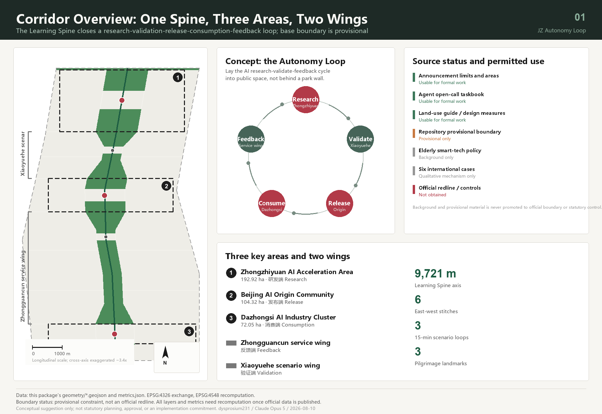
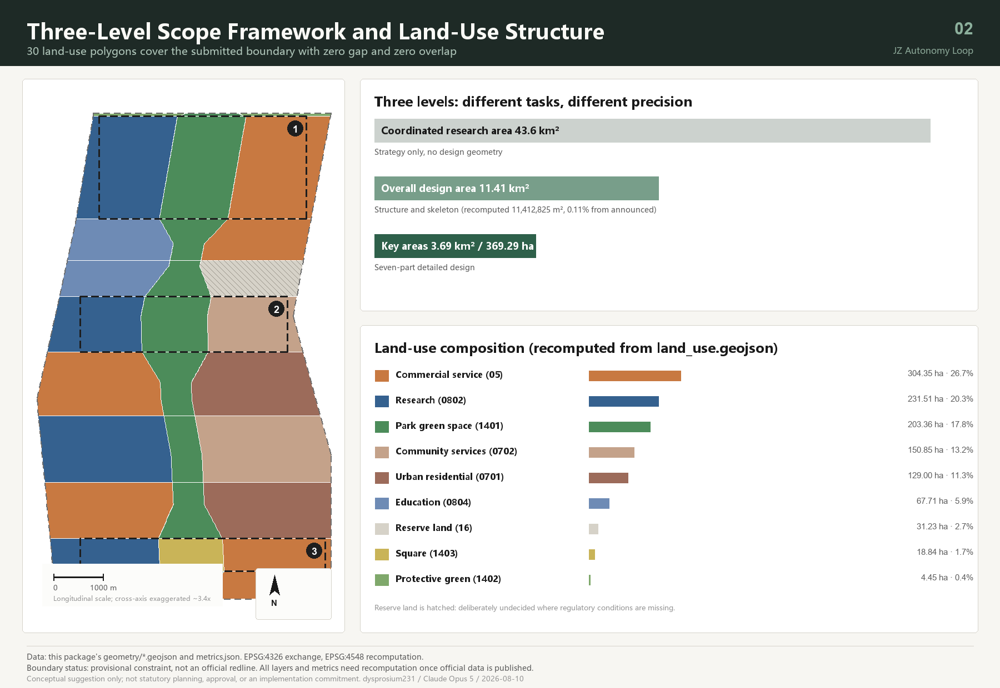
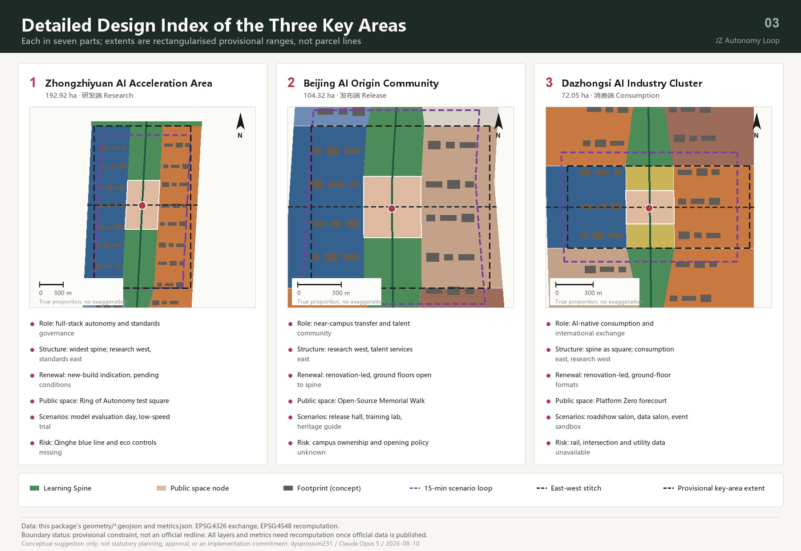
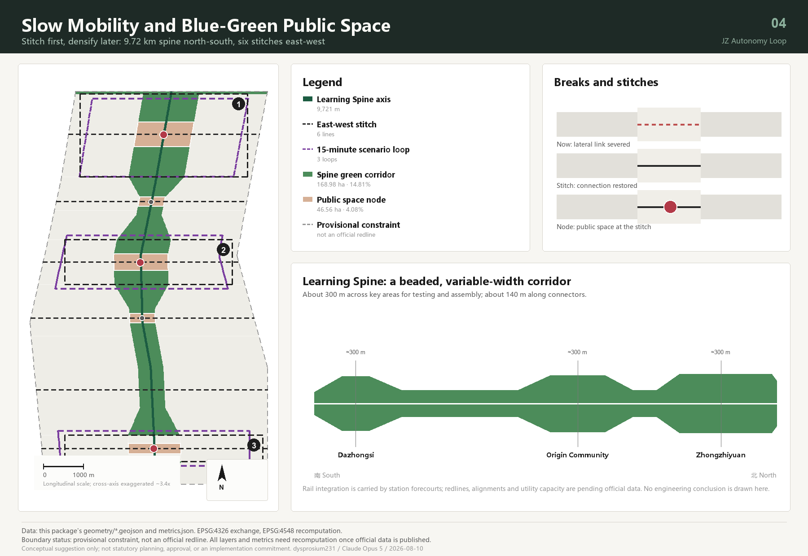
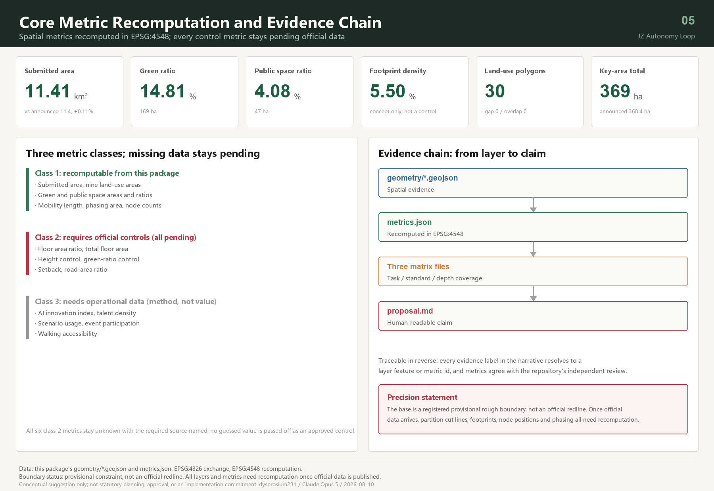

# Centennial Jing-Zhang · Autonomy Loop: From the Switchback Railway to Human-Centred AI

## Design Basis and Source List

The primary basis of this proposal is the qualification pre-announcement issued by the Haidian Branch of the Beijing Municipal Commission of Planning and Natural Resources, which fixes the 43.6 km² coordinated research area, the 11.4 km² overall design area, the 368.4 ha key detailed-design area, and the three positioning statements and design tasks [source:OFFICIAL-ANNOUNCEMENT]. The second basis is the open-call taskbook addressed to AI agents, which adds the five functions, the three areas and two wings, six mandatory tasks, and the shared boundary clause [source:AGENT-TASKBOOK] [standard:PROJECT-AGENT-OPEN-CALL-TASKBOOK].

The evidence base has three parts: the site package supplies the three-level scope definitions, the land-use enumeration, the editable and locked layer lists, and the area conventions [source:SITE-PACKAGE]; the public source registry decides whether each item is usable for formal work, background only, or provisional only [source:SOURCE-REGISTRY]; the processed fact pack organises the announcement tasks, scope structure and gap list into a checkable index [source:PROCESSED-FACT-PACK]. Existing-conditions diagnosis here is not a survey drawing but **a verifiable list of gaps** — official redline, regulatory conditions, existing buildings, ownership, heritage and blue lines are all registered as pending official data, which is more honest than assembling a "current conditions" drawing from unreliable material [depth:existing_conditions_diagnosis].

An honest proposal must first state what data it stands on. At the time of this submission the repository holds no official spatial redline, and the qualification package download remains password-protected. The boundary and the three key areas in this package therefore come entirely from the maintainer-derived provisional rough polygons, inferred from the announcement's textual limits and area-checked in EPSG:4548 [source:BOUNDARY-SOURCE]. That limitation runs through the whole document: every area, ratio and positional relationship stated here holds only under this provisional boundary, and the full package must be recomputed — not patched file by file — once an official boundary is published. It cannot serve as an official redline, an approval basis, or a precise-area basis.

Permitted use of each source follows the public registry [source:SOURCE-REGISTRY]. Registered as usable for formal work: the announcement, the taskbook, the land-use classification guide, the urban design measures, and the regulatory detailed planning measures. Registered as background only: policy references used to derive design principles, never as factual conclusions. Registered as provisional only: the boundary data above. This proposal additionally collected six publicly verifiable international innovation-district cases; in this package they are all marked as unusable for formal quantitative conclusions and serve as mechanism analogies alone [source:CASE-STATION-F].

Complete source, metric, standard, design-depth and task-coverage records live in the structured files; the narrative does not copy those machine indexes. A reader checking any single sentence can enter the corresponding layer or metric directly from the evidence label beside it — for example the submitted boundary and its area recomputation [data:geometry/site_boundary.geojson#SITE-001] [metric:site_area_sqm], or the count and area of the three key areas [data:geometry/key_areas.geojson#PROV-KEY-001] [metric:key_detailed_design_area_sqm].

This proposal is an open co-creation suggestion. All spatial content is a conceptual suggestion, a reference scheme, or material for professional teams to deepen. It does not replace statutory planning, does not constitute a government decision, and represents no investment, tenancy or construction arrangement [source:AGENT-TASKBOOK].

## Three-Level Scope Framework

The three levels carry different tasks and should therefore be delivered at different precisions. Drawing all three at the same level of detail would use uniform false precision to hide a real difference in information quality — that is the first methodological judgment of this proposal.

**The coordinated research area (about 43.6 km²) yields strategy only, not design geometry.** This level answers how the industry chain coordinates, how AI changes urban form, and how the belt divides work with Beiwei community, Future Science City, Huairou Science City and the wider Beijing-Tianjin-Hebei region. This package deliberately generates no land-use or building layer here, because drawing 43.6 km² on a provisional boundary would only manufacture conclusions nobody can verify [standard:PROJECT-OFFICIAL-ANNOUNCEMENT] [metric:official_overall_design_area_sqm].

**The overall design area (submitted boundary recomputed at 11,412,825.386 m²) carries the land-use structure and spatial skeleton.** The deviation from the announced 11.4 km² is about 0.11%, and that deviation is itself published as a metric so reviewers can judge how far the provisional boundary can be trusted [metric:site_area_vs_official_delta_ratio]. The deliverable is a complete closed partition: 30 land-use polygons cover the submitted boundary with zero gap and zero overlap at generation time [data:geometry/land_use.geojson#LU-001] [metric:land_use_coverage_ratio].

**The key detailed-design area (recomputed at 3,692,893.007 m², about 369.29 ha) carries detailed design.** The three areas recompute as Zhongzhiyuan 192.92 ha, Beijing AI Origin Community 104.32 ha, and Dazhongsi 72.05 ha, consistent with the announced 192.1, 104.3 and 72.0 ha [data:geometry/key_areas.geojson#PROV-KEY-002] [metric:zhongzhiyuan_area_sqm].

A clear convergence links the three levels: the strategic level decides what this belt should become, the overall level decides the shape of the spatial skeleton, and the key-area level tests whether that shape survives contact with a specific district. When an official boundary arrives, what must be recomputed is not only areas but the cut lines of the land-use partition, the placement of building footprints, the position of public-space nodes and the phasing extents [depth:three_level_scope_framework].

| Level | Working depth in this proposal | Deliverable | Precision statement |
| --- | --- | --- | --- |
| Coordinated research area 43.6 km² | Strategy and mechanism design | Ecosystem loop, case mechanisms, operating framework | No design geometry generated |
| Overall design area 11.41 km² | Land-use structure and skeleton | 30 land-use polygons, green, public space, roads, phasing | Provisional boundary; recompute when official data arrives |
| Key areas 369.29 ha | Seven-part detailed design | Positioning, structure, renewal, mobility, public space, scenarios, risk | Rectangularised provisional extents; not parcel lines |

## Coordinated Research Area: Industry and Future City Research

### Overall concept: the Autonomy Loop

When the Jing-Zhang railway was completed in 1909, its significance was not only a railway but an answer to the question of whether Chinese engineers could design one themselves; at Qinglongqiao, Zhan Tianyou solved the gradient with a switchback — trading one reversing move for the ability to keep climbing. What is happening along this corridor today is the same question asked a second time: whether full-stack autonomy in artificial intelligence is achievable.

The overall concept proposed here is therefore the **Autonomy Loop**: autonomy as the theme that survives a century, and the loop as the spatial organisation appropriate to the AI era.

- **Chinese main name: 百年京张·自主回路**
- **English name: JZ Autonomy Loop, abbreviated JZAL**
- **Subtitle: From the switchback railway to human-centred AI**

The "loop" is not rhetoric. Progress in AI depends on a closed cycle: research produces models, models require validation in real settings, validation produces data and feedback, and feedback returns to research. Most innovation parks sever that cycle at the wall — research indoors, validation in laboratories, citizens outside. The central spatial claim of this proposal is to **lay the cycle out in public space**, giving each of the five stages a defined spatial host and threading them onto one continuous walkable spine [source:AGENT-TASKBOOK] [depth:overall_spatial_structure].

### Three positionings, five functions, and the three-areas-two-wings loop

The three positionings are not three separate layers but three sections through the same spine: the centennial Jing-Zhang cultural belt is its historical section, the urban AI living-experience belt its everyday section, and the AI convergence-innovation belt its productive section. The five functions anchor into the three areas and two wings:

| Stage | Spatial host | Function carried | Land-use support |
| --- | --- | --- | --- |
| Research | Zhongzhiyuan AI Acceleration Area | Full-stack autonomous innovation; AI governance voice | Research land [data:geometry/land_use.geojson#LU-025] |
| Validation | Xiaoyuehe scenario-empowerment wing | AI+ scenario empowerment paradigm | Education and scenario-service land |
| Release | Beijing AI Origin Community | World-class AI innovation ecosystem | Research and community-service land |
| Consumption | Dazhongsi AI Industry Cluster | Intelligent vibrant city; AI-native new business | Commercial service land |
| Feedback | Zhongguancun technology-service wing | Global factor allocation; ZGC IP and capital | Commercial service and residential land |

The five stages sit along the spine from north to south; the southernmost, Dazhongsi, connects by rail to the central city and returns the "consumption and international exchange" feedback to the research stage in the north, closing the loop [metric:slow_mobility_spine_length_m] [depth:overall_spatial_structure].

### Naming system and visual identity direction

The taskbook explicitly rejects slogan-only naming and the copying of existing city, park or company names. What is submitted here is therefore not a name but **a rule set that can keep generating names**, in three tiers:

- **Belt tier (one)**: 百年京张·自主回路 / JZ Autonomy Loop.
- **Node tier (one per node)**: formed as "place motif + action". Five are named: the Dazhongsi "Platform Zero" square, the AI Origin Community "Open-Source Memorial Walk", the Zhongzhiyuan "Ring of Autonomy", the service-wing "Stitch Deck", and the Xiaoyuehe "Water Terrace" [data:geometry/public_space.geojson#PUBLIC-001] [metric:public_space_node_count].
- **Event tier (generative)**: formed as "verb + Jing-Zhang motif word", such as Loop Week, Spine Market, Switchback Lecture, Platform Zero Release. The motif vocabulary is restricted to public historical terms of the Jing-Zhang railway and Zhongguancun; no registered trademark or company name is used.

**Logo direction**: take Zhan Tianyou's switchback as the single stroke motif, extend the two strokes of the Chinese character 人 ("person") and close them at the endpoints, producing a one-stroke mark that reads simultaneously as "person" and as "loop". It satisfies three extensibility requirements: monochrome-capable (suitable for etched plaques and paving inlays), reducible to a single-vertex icon (suitable for small signage), and repeatable into a rhythm band (suitable for event graphics and boards). Only the motif and its construction logic are submitted; no finished typeface or artwork file is included, so that no third-party font, image, trademark or likeness is used before clearance [standard:PROJECT-AGENT-OPEN-CALL-TASKBOOK].

### Six international cases and their transferable mechanisms

All six can be verified through the institutions' official websites. This proposal extracts **mechanisms** only, cites none of their areas, company counts, investment or performance figures, and implies no relationship with them [source:CASE-STATION-F].

| Case | City | Transferable mechanism | Application here |
| --- | --- | --- | --- |
| Station F | Paris | Railway freight heritage converted into many accelerators under one roof | Reuse of heritage structures along the spine as a concentrated incubation frontage |
| MaRS Discovery District | Toronto | Not-for-profit body next to university and hospitals commercialises publicly funded research [source:CASE-MARS-TORONTO] | Proposed technology-transfer body in the AI Origin Community |
| Maria 01 | Helsinki | Campus co-owned by city government and foundations, operated not-for-profit | Proposed ownership and governance structure for the belt operator |
| Knowledge Quarter | London | Cross-institution innovation district organised as a member alliance without changing ownership [source:CASE-KQ-LONDON] | Alliance-style coordination of three areas and two wings, avoiding wholesale acquisition |
| Seoul AI Hub | Seoul | City-established AI body jointly operated by a university and a research institute [source:CASE-SEOUL-AI-HUB] | Proposed organisational form for Zhongzhiyuan standards and evaluation services |
| Kendall Square Initiative | Cambridge, USA | R&D and talent housing supplied together on institution-owned land | Land-use mix for research and talent housing in the AI Origin Community |

The six mechanisms answer one question from different sides: **the competitiveness of an innovation district comes not from its buildings but from who operates it, under what ownership, and open to whom** [metric:global_ecosystem_case_count]. That judgment is why this proposal spends far more of its length on operating mechanisms than on architectural form.

### AI innovation ecosystem map: eight factors and where they land

| Factor | Spatial landing | Mechanism suggestion | Data gap |
| --- | --- | --- | --- |
| Land | 31.23 ha reserve land | Leave land undesignated where controls are missing | Pending official regulatory conditions |
| Space | 231.51 ha research land | Tiered supply: incubation, pilot, headquarters | Existing buildings and ownership pending |
| Industry | 304.35 ha commercial service land | AI-native formats first, not AI labels on conventional formats | — |
| Capital | Technology-service wing | Capital, legal and IP services on the west of the spine | — |
| Talent | 129.00 ha housing + 150.85 ha community services | R&D and talent housing supplied together | Housing policy pending |
| Compute | Edge-compute posts along the spine | Co-located with public service points, no standalone machine halls | Energy capacity pending professional calculation |
| Data | Data-factor salon, Dazhongsi | Compliance, authorisation and auditability as preconditions | — |
| Scenarios | 3 scenario loops + 12 scenario cards | Scenario open days institutionalised | — |

### Urban form fit for AI

The judgment can be compressed into one sentence: **if the AI in a city only happens inside buildings, it is not an AI city.** Three form principles follow. First, validation becomes public — model evaluation, robot trials and scenario open days must happen where citizens can see, book and observe them. Second, infrastructure becomes small — edge compute, sensing and energy equipment are distributed with public service points rather than concentrated into an enclosed compound. Third, feedback becomes spatial — comment points, honour displays and contribution records are built as long-lived public fixtures, not as temporary installations for an event [metric:public_space_ratio] [metric:ai_scenario_card_count] [depth:overall_spatial_structure].

## Overall Design Area: Urban Renewal and Regulatory-Plan-Level Urban Design

### Spatial structure: one spine, three areas, two wings, three loops

**The spine** is the Jing-Zhang heritage park vitality belt, called here the Learning Spine. It is not a constant-width green band but a **variable-width, beaded corridor**: widened to about 300 m across the three key areas and narrowed to about 140 m along the connectors. The variation is derived from function, not preference — key areas must hold bookable test grounds, display and assembly, while connectors need only continuous passage and an ecological corridor [data:geometry/green_space.geojson#GREEN-001] [metric:green_ratio]. The slow-mobility axis measures 9,720.685 m, which is the verifiable result behind the "north-south continuity" requirement [metric:slow_mobility_spine_length_m].

**Three areas and two wings** are organised by the spine, which cuts each segment of city into a west side carrying research and services and an east side carrying housing, consumption and daily life. **Three loops** are 15-minute walking circuits, one in each key area, threading that district's scenario cards into a route that can actually be walked [data:geometry/roads.geojson#ROAD-009] [metric:scenario_loop_count].

### Land-use structure and industrial space supply

The partition principle is: **lock the immovable constraints first, cut the designable remainder second, and never hand-draw adjacent parcels independently.** Here the spine polygon was subtracted from the submitted boundary, then transverse section lines cut the remainder, so any two adjacent land-use polygons share exactly identical boundary coordinates and both gap and overlap are zero [data:geometry/land_use.geojson#LU-014] [metric:land_use_polygon_count].

| Code | Land-use class | Area (ha) | Share | Design intent |
| --- | --- | --- | --- | --- |
| 05 | Commercial service | 304.35 | 26.7% | AI-native consumption, technology services, international roadshow |
| 0802 | Research | 231.51 | 20.3% | Full-stack autonomous R&D, near-campus incubation |
| 1401 | Park green space | 203.36 | 17.8% | Body of the Learning Spine |
| 0702 | Community service facilities | 150.85 | 13.2% | Talent services, neighbourhood amenities |
| 0701 | Urban residential | 129.00 | 11.3% | Existing housing under low-disturbance renewal |
| 0804 | Education | 67.71 | 5.9% | Campus frontage and training |
| 16 | Reserve land | 31.23 | 2.7% | Deliberately undecided where controls are missing |
| 1403 | Square | 18.84 | 1.7% | Dazhongsi station forecourt |
| 1402 | Protective green | 4.45 | 0.4% | North Fifth Ring buffer frontage |

Every class in this structure resolves back to geometry on its own. Commercial service and research together make up nearly half of the area and form the body of the industrial space [metric:land_use_area_05_sqm] [metric:land_use_area_0802_sqm]; park green space and square land together form the public skeleton of the Learning Spine [metric:land_use_area_1401_sqm] [metric:land_use_area_1403_sqm].

Daily life is supported by community service facilities and urban housing [metric:land_use_area_0702_sqm] [metric:land_use_area_0701_sqm]; the training frontage is carried by education land in the Xiaoyuehe wing [metric:land_use_area_0804_sqm]; the Fifth Ring interface is handled by protective green [metric:land_use_area_1402_sqm]; and reserve land marks where the proposal deliberately draws no conclusion [metric:land_use_area_16_sqm]. Completeness and topological correctness of the partition are checked as one depth item [depth:land_use_layout].

Reserve land is a deliberate design judgment. Where regulatory conditions, ownership and existing-building records are all missing, the professional move is not to guess a use but to mark clearly that this land awaits official data [data:geometry/constraints.geojson#CONSTRAINT-002] [metric:reserve_land_area_sqm] [standard:MOHURD-CONTROL-DETAILED-PLANNING].

### Development intensity and building scale: no numbers are given

Floor area ratio, building height, density, green-ratio control and setback are all absent from the public site package [standard:MOHURD-CONTROL-DETAILED-PLANNING]. This proposal keeps them as pending official data in the structured files rather than filling in a professional-looking number [metric:floor_area_ratio] [metric:total_floor_area_sqm]. The package contains 219 building footprints [metric:renewal_building_count] totalling 62.72 ha, 5.50% of the submitted area; they are **conceptual indications of spatial magnitude**, used to compare the built quantum implied by different renewal strategies. They are not a survey of existing buildings, not an ownership verification, and not a retain-renovate-demolish conclusion [data:geometry/buildings.geojson#BLDG-001] [metric:building_density] [depth:development_intensity_controls].

### The renewal judgment: separate the light from the heavy

Urban renewal most often fails by binding everything to heavy assets that need long approval cycles, so that nothing is visible for a decade. This proposal separates light from heavy: content that does not depend on regulatory conditions (public space, mobility stitching, scenario loops, honour display, event operation) goes in the near term; content that depends on controls, ownership and engineering (building renewal, rail integration, utility expansion) goes to the mid and long term [depth:renewal_project_list] [metric:phase_near_term_area_sqm].

## Detailed Design of Key Areas

Each key area is developed in seven parts: positioning, spatial structure, building renewal, mobility, public space, AI scenarios, and implementation risk. All three extents are rectangularised provisional ranges whose edges are not parcel lines or road redlines, so every conclusion below is directional [source:KEY-AREA-SOURCE] [data:geometry/key_areas.geojson#PROV-KEY-003] [metric:key_area_count].

Under Article 9 of the Urban Design Management Measures, areas that must have key-area urban design include those "embodying the city's historical character" and "waterfront areas" — all three key areas here fall into both: the Jing-Zhang corridor forms the historical axis, and Qinghe and Xiaoyuehe form the waterfront frontage. The detailed design below is therefore organised to Article 10 of the same measures: coordinate municipal works, organise public-space function, attend to building scale, and state the direction of height, massing, style and colour control [standard:MOHURD-URBAN-DESIGN-MEASURES] [source:MOHURD-URBAN-DESIGN].

### Zhongzhiyuan AI Acceleration Area (192.92 ha)

**Positioning**: full-stack autonomous innovation and standards governance district — the research end of the loop. **Structure**: the spine reaches its widest here, with research land west, standards-governance and display services east, and the Ring of Autonomy open test square at its centre. **Building renewal**: mainly new-build indication, all flagged as pending conditions because existing-condition and ownership data are missing. **Mobility**: organised by the Qinghe frontage link and the scenario loop, whose length supports a 15-minute walking circuit. **Public space**: the Ring of Autonomy hosts bookable public viewing of model evaluation and standards workshops, turning a normally closed process into public content. **AI scenarios**: hosts two industry test-and-validation scenarios — the autonomous model evaluation open day and the low-speed delivery and inspection trial segment. **Risk**: the Qinghe blue line and ecological control lines are missing, so every waterfront suggestion must be re-checked once those lines are obtained [data:geometry/public_space.geojson#PUBLIC-003] [metric:zhongzhiyuan_area_sqm] [depth:three_key_area_detailed_design].

### Beijing AI Origin Community (104.32 ha)

**Positioning**: near-campus technology transfer and talent community — the release end of the loop. **Structure**: near-campus research west of the spine, talent services and living east of it, so that research and housing adjoin rather than separate — a layout informed by the practice of supplying R&D and talent housing together on institution-owned land [source:CASE-KENDALL-SQUARE]. **Building renewal**: renovation is the main strategy class, with ground floors opening onto the spine. **Mobility**: the campus-to-park stitch crosses an existing break and reconnects the university frontage with the park frontage. The announcement calls for integrated design around the Wudaokou and Qinghua East Road West rail stations, and this proposal gives each a distinct role: Wudaokou, the busiest arrival point, is proposed to take the open-source community's everyday gathering and event-day flows through its station forecourt public space; Qinghua East Road West, closer to the campus side, is proposed to take the campus-to-park commuting stitch through a walking-priority frontage. Both are directional suggestions; the actual station integration must be judged separately by transport and municipal professionals against rail alignments and passenger-flow data. **Public space**: the Open-Source Memorial Walk runs along the spine. This is the proposal's spatial answer to the principle that contribution should be remembered — adopted proposals and contributor credits become an etchable, extendable, long-lived public fixture rather than a one-off exhibition [data:geometry/public_space.geojson#PUBLIC-002] [metric:ai_pilgrimage_landmark_count]. **AI scenarios**: open-source release hall, AI+ education training, heritage narrative guiding. **Risk**: campus ownership and opening policy are unknown, so the stitch detail must be settled jointly with the institutions [metric:origin_community_area_sqm].

### Dazhongsi AI Industry Cluster (72.05 ha)

**Positioning**: AI-native consumption and international exchange district — the consumption end of the loop and the belt's interface with the central city. **Structure**: here the spine appears as square land forming the Platform Zero forecourt; intelligent consumption and international roadshow uses lie east, a research frontage remains west. **Building renewal**: renovation-led, focused on ground-floor formats and the public realm. **Mobility**: the four-quadrant pedestrian link at Dazhongsi station is the single most important spatial move in this district — reconnecting a pedestrian system that an intersection has cut into four pieces. **Public space**: Platform Zero takes the railway zero-kilometre narrative as its motif and is the most urban of the three pilgrimage landmarks. **AI scenarios**: international roadshow salon, data-factor salon, event-day mobility and crowd sandbox. **Risk**: station, intersection and utility conditions are all unavailable; engineering feasibility of the four-quadrant link must be judged separately by transport and municipal professionals, and this proposal draws no such conclusion [data:geometry/roads.geojson#ROAD-002] [metric:dazhongsi_area_sqm] [depth:traffic_rail_slow_parking].

## AI Innovation Ecosystem, Personas, and AI+ Scenarios

### Six user personas

| Persona | Core need | Spatial response | Governance boundary |
| --- | --- | --- | --- |
| Open-source developer | Release, collaboration, testing, reputation | Release hall, Memorial Walk, night collaboration space | No individual trajectory collection; event data aggregated only |
| Startup founder | Low-cost workspace, compute access, test ground | Bookable test pods, edge-compute posts | Compute and data services require separate authorisation |
| Corporate international lead | Display, business, hosting visitors | Platform Zero, roadshow salon | Company marks and cases used only after clearance |
| Nearby resident, incl. older people | Commuting, leisure, services, low disturbance | Spine walking circuit, embedded community services | On-site guidance and human-operated service retained [source:BARRIER-FREE-LAW] |
| University student or teacher | Transfer, cross-campus work, daily walking | Campus-to-park stitch, open laboratory | Campus data and research outputs require authorisation |
| City operations and governance staff | Inspection, event safety, handling feedback | Governance agent review desk, scenario signage | Agent advises only; disposal requires a human signature |

These six personas [metric:user_persona_count] are not there to make up a number; they are how this proposal tests spatial supply. Every public space, every building function and every scenario card must be able to name which of them it serves. Where none can be named, that space has no real user yet.

Accessibility is not an add-on. Wherever a scenario touches medical, social-security, financial or living-payment services, this proposal requires on-site guidance and a human service channel to remain. That requirement follows the current statute for those specific service venues and is not generalised into a universal conclusion about all digital interfaces [source:BARRIER-FREE-LAW] [source:ELDERLY-SMART-TECH].

### Twelve AI scenario cards

Each card states spatial host, users served, data source, privacy boundary, human review and suggested operator. Cards marked ★ are industry test-and-validation scenarios; there are four [metric:ai_scenario_card_count] [metric:industry_test_scenario_count].

| No. | Scenario card | Spatial host | Data source and privacy boundary | Human review | Suggested operator |
| --- | --- | --- | --- | --- | --- |
| SC-01 | Open-source release hall | Origin Community, spine side | Only publicly submitted project information | Content reviewed before release | Not-for-profit community body |
| SC-02 ★ | Autonomous model evaluation open day | Ring of Autonomy | Evaluation data supplied and licensed by entrants | Results confirmed by named experts | Proposed city-level AI body |
| SC-03 | Edge-compute post | Public service nodes along spine | No retention of user task content | Human intervention on abnormal load | Public service operator |
| SC-04 | Walkability break and accessibility navigation | Whole spine | Aggregated flows and asset status; no individual identification | Break findings verified on site | Park and sub-district jointly |
| SC-05 ★ | Low-speed delivery and inspection trial | Zhongzhiyuan scenario loop | Onboard sensing confined to the trial segment | On-site supervision at every trial | Company and site authority jointly |
| SC-06 | International roadshow salon | Platform Zero | Public presentation material only | Content cleared before release | Industry service body |
| SC-07 | Data-factor salon | Dazhongsi east block | Compliance, authorisation and auditability required | Every transaction traceable | Data service operator |
| SC-08 | AI+ public service desk | Community service land | No personal profiling | Human service channel mandatory | Sub-district service window |
| SC-09 | AI+ education open laboratory | Xiaoyuehe education frontage | Teaching data authorised by institutions | Teachers approve content | University and park jointly |
| SC-10 ★ | Urban governance agent review desk | Whole belt | Public materials and this package's structured data only | Agent advises; disposal needs human signature | Proposed governance department |
| SC-11 | Heritage narrative AI guide | Spine and kilometre-post signage | Cleared public historical material | Historical statements professionally reviewed | Cultural operator |
| SC-12 ★ | Event-day mobility and crowd sandbox | Three scenario loops | Aggregated event-period flows, deleted afterwards | Plans approved by humans | Organiser plus traffic authority |

The four test-and-validation scenarios (SC-02, SC-05, SC-10, SC-12) form a chain from model evaluation, to field trial, to governance review, to large-event stress testing. They are conceptual test-scenario suggestions, not approved operations [source:AGENT-TASKBOOK] [standard:PROJECT-AGENT-OPEN-CALL-TASKBOOK].

Scenarios that provide generated content to the public (SC-01, SC-06, SC-11) must provide complaint and reporting channels with timely handling and must act on unlawful content under the current interim measures for generative AI services. Nothing here implies that any service has completed filing or security assessment [source:GEN-AI-MEASURES].

## Land Use, Building Scale, and Retain-Renovate-Demolish Strategy

The full land-use data appear in the table above; classification follows the standard codes of the national land and sea use classification guide, with no invented categories [standard:MNR-LAND-USE-CLASSIFICATION-GUIDE] [source:MNR-LAND-USE] [data:geometry/land_use.geojson#LU-007]. One source limitation must be stated: the local snapshot of that guide in the site package captures only the issuing notice page, while the classification table itself sits in an attachment that was not retrieved, so the codes used here come from the site package's own land-use enumeration. The two agree semantically but differ in source tier, and this is recorded as such in the source list.

Beyond a renewal action, each footprint also carries a function type drawn from the site package's building-type enumeration, so that "industrial space supply" does not stop at the land-use layer: 219 footprints span 13 function types [metric:building_type_variety_count], of which 65 carry research, pilot testing and incubation [metric:ai_research_building_count] and 34 are talent apartments or housing [metric:talent_housing_building_count]. The last two numbers only mean something together — they test whether "R&D and talent housing supplied side by side" actually holds in space rather than only in prose [source:CASE-KENDALL-SQUARE] [metric:building_footprint_area_sqm].

**Retain-renovate-demolish is given as a strategy class per district, not as a parcel-level conclusion** [depth:retain_renovate_demolish]. This is the deepest conclusion available without an existing-building survey, ownership records or structural safety data:

| Strategy class | Districts | Basis | Precondition |
| --- | --- | --- | --- |
| Retain with ground-floor activation | South gateway, service wing south and north, Xiaoyuehe north | Housing and services are stable; renewal concerns the frontage | Ground-floor ownership and format survey |
| Renovate | Dazhongsi, service wing middle, AI Origin Community | Function replacement and public frontage reshaping needed | Structural safety and ownership negotiation |
| New-build indication | Zhongzhiyuan | Carries added research and display functions | Regulatory conditions and land supply |
| Pending official data | Xiaoyuehe south, north ring interface | Regulatory and transport conditions missing | Official regulatory and transport data |

**Height, massing and character control** are expressed as directional principles rather than numbers: lower heights and terracing beside the spine to protect daylight and sightlines along the corridor, concentrated height inside blocks, and massing set back at nodes to create a public forecourt [standard:MOHURD-URBAN-DESIGN-MEASURES] [depth:height_massing_character] [metric:building_height_control_m]. Specific control values must await approved regulatory conditions together with aviation, view-corridor and heritage control-belt data.

## Transport, Rail, Municipal Infrastructure, and Public Services

### Stitch first, densify later

The real transport problem in this corridor is not a shortage of roads but that **east-west movement is severed and north-south movement is discontinuous**. The strategy therefore runs in that order: restore connectivity at the lowest cost, then discuss densification and expansion.

**North-south continuity** is delivered by the 9,720.685 m slow-mobility axis of the Learning Spine, a walking and cycling route independent of the vehicular system [data:geometry/roads.geojson#ROAD-001] [metric:slow_mobility_spine_length_m]. **East-west stitching** is delivered by six stitch lines at Dazhongsi station, the south and middle of the service wing, the campus-park interface of the AI Origin Community, the Xiaoyuehe waterfront, and the Zhongzhiyuan Qinghe frontage [metric:east_west_stitch_count] [depth:traffic_rail_slow_parking]. Road centrelines total 30,763.608 m [metric:road_centerline_length_m].

**Rail station integration** is carried by station forecourt public space rather than by underground works. The four-quadrant pedestrian link at Dazhongsi is the critical piece, but its engineering feasibility, utility avoidance and traffic arrangement must be judged separately by professionals — this proposal states a spatial intent only and offers no bridge, tunnel, underground-space or feasibility conclusion [source:AGENT-TASKBOOK]. Road redlines, rail alignments and parking standards are unavailable, so the road-area ratio stays pending in the metrics [metric:road_area_ratio].

### Municipal and new infrastructure

New infrastructure follows one principle: **small, distributed, and co-located with public services**. Edge-compute posts sit with public service nodes instead of forming standalone enclosed facilities; distributed energy and conventional utilities are integrated at the same nodes. The cost of this strategy is a higher demand on distribution capacity and maintenance, so energy load, utility capacity and fire conditions are explicitly listed as preconditions for professional deepening, and no calculation is offered here [depth:municipal_new_infrastructure] [metric:public_space_node_count].

Public services occupy the 150.85 ha of community service facility land on both sides of the spine, covering talent living services, community health and education. Service points touching medical, social-security, financial or living-payment matters must retain on-site guidance and human handling [source:BARRIER-FREE-LAW].

## Blue-Green Network, Public Space, and Urban Character

### The Learning Spine: a park that gets used

Green space totals 168.98 ha, 14.81% of the submitted area; public space totals 46.56 ha, 4.08% [metric:green_space_area_sqm] [metric:public_space_area_sqm] [metric:public_space_ratio]. The two do not overlap geometrically — squares are subtracted from the corridor, so nothing is double-counted [data:geometry/green_space.geojson#GREEN-004].

The design meaning of that green ratio is not compliance but feasibility: it is what makes **a continuous 9.72 km walking experience possible**. The beaded variation in width gives the walker a rhythm — slowing in the key areas, passing through the connectors. That rhythm is the difference between a vitality belt and a planting strip.

The announcement asks for landmark landscape nodes at the park's south end, north end, and where it crosses the ring roads. Four are proposed, deliberately given different roles rather than repeating one gesture: the **south end** is Platform Zero, carrying the urban living room and event-day gathering; the **north end** closes into the Fifth Ring interface through protective green, handling the transition from a city frontage to a motorway frontage; the **two ring-road crossings** are the Xiaoyuehe water terrace and the service-wing stitch deck. Ring-road crossings are where the walking experience breaks most easily, so the first task at these two nodes is not to compose scenery but to reconnect the severed pedestrian continuity — their landscape quality follows from the stitching itself [data:geometry/public_space.geojson#PUBLIC-005] [metric:public_space_node_count]. No structural, clearance, or engineering-feasibility data for the crossings is available; the above is a conceptual suggestion about node siting and role division only.

### Three AI pilgrimage landmarks and the honour display system

| Landmark | Location | Motif | Content carried |
| --- | --- | --- | --- |
| Platform Zero | Dazhongsi station forecourt | Railway zero kilometre | Urban living room, international roadshow, event-day gathering |
| Open-Source Memorial Walk | Origin Community, spine side | Sequence of kilometre posts | Contributor credits, record of adopted proposals |
| Ring of Autonomy | Zhongzhiyuan, mid-spine | Closed switchback | Open testing, standards workshops, bookable visits |

**The honour display system** is the concrete design behind the principle that contribution should be remembered. The Memorial Walk sets out an extendable line of plaque components along the spine; each records one adopted proposal and its contributor credit, and the line grows northwards in chronological order — how far it eventually runs depends on how many people contribute. Its design requirements are that it be extendable, etchable, and independent of electronic screens, so that it stays legible over decades [data:geometry/public_space.geojson#PUBLIC-002] [metric:ai_pilgrimage_landmark_count] [depth:blue_green_public_space].

### Public space component library

To hold a consistent identity across a long construction period, six standard components are proposed: kilometre-post signage column, contributor plaque, bookable test pod, accessible human service desk, scenario information panel, and temporary event module. Each component fixes only proportional relations, material principles and information hierarchy, leaving formal freedom to the professional teams who deepen it.

### Urban character and cultural narrative

**The fusion of Jing-Zhang heritage, Zhongguancun culture and new AI culture is summarised here as "two autonomies".** The first is the self-directed design and construction of the Jing-Zhang railway in 1909; the second runs from Zhongguancun's electronics street to indigenous innovation, and on to the question of full-stack AI autonomy today. The value of this line is that it is **continuous rather than collaged** — AI is not a label applied to railway heritage but the same disposition under different technical conditions [source:OFFICIAL-ANNOUNCEMENT] [standard:MOHURD-URBAN-DESIGN-MEASURES].

A narrative needs material carriers, not only an abstract theme. The announcement names Tsinghua Yuan railway station among the cultural resources and the Beijing Film Academy among the artistic resources to be used, and this proposal attaches them to the two ends of the narrative. **Tsinghua Yuan station is the physical evidence of the "first autonomy"**: it is proposed as a historical anchor on the spine, joined into the kilometre-post signage sequence so that contributor plaque numbering and railway mileage share one coordinate system. **The film and media resources represented by the Beijing Film Academy are the channel of the "second autonomy"**: they are proposed to carry image-based narration and international communication during the annual event, so that the process of AI innovation is recorded and told rather than merely displayed. How either resource is actually joined, how far it opens, and on what terms must be settled with the owners and managers; this proposal states only their position in the narrative structure and presumes no arrangement for their use.

Signage and identity take the railway kilometre post as a unifying motif: columns at intervals along the spine carry wayfinding, narrative and scenario information at once. The core sentence for international communication is "a park that gives the AI validation process back to the city" — translatable, quotable, and testable.

Historical statements must be accurate. Only uncontested public historical material is used; no dramatisation of people or events is offered, and guide content must be professionally reviewed [source:CASE-STATION-F].

## Renewal Projects, Implementation Policy, and Phasing

### Nine renewal projects

| No. | Project | Type | Dependencies | Phase | Main risk |
| --- | --- | --- | --- | --- | --- |
| JZ-01 | Learning Spine continuity | Public space | Ownership along route, existing breaks | Near | Crossings may need engineering measures |
| JZ-02 | Dazhongsi four-quadrant link | Rail integration | Rail, intersection, utilities | Mid | Feasibility unknown |
| JZ-03 | Platform Zero square | Public space | Forecourt land coordination | Near | Event safety and crowd management |
| JZ-04 | Memorial Walk and honour display | Public space / operation | Credit rules and extension mechanism | Near | Long-term maintenance responsibility |
| JZ-05 | Ring of Autonomy test square | Public space / industry | Test safety and booking management | Near | Boundary between testing and public safety |
| JZ-06 | Six east-west stitches | Mobility | Road redlines, intersections | Mid | Redline data missing |
| JZ-07 | Edge-compute post network | New infrastructure | Distribution capacity, operator | Mid | Energy load not calculated |
| JZ-08 | Qinghe and Xiaoyuehe frontage | Blue-green | Blue line, ecological controls | Mid | Control lines missing |
| JZ-09 | North and south gateway renewal | Urban renewal | Regulatory conditions, traffic | Long | Most dependencies |

### Phasing

The near-term extent is 424.73 ha across the three key areas [metric:phase_near_term_area_sqm]; the mid-term extent is 640.98 ha across the two wings [metric:phase_mid_term_area_sqm]; the long-term extent is 75.58 ha at the north and south gateways [data:geometry/phasing.geojson#PHASE-001] [metric:phase_long_term_area_sqm] [metric:phase_count]. The nine renewal projects above map one-to-one onto these three phases [metric:renewal_project_count]. The logic is not "where to build first" but "which content depends on conditions not yet obtained". All near-term projects are light items independent of regulatory conditions, so the belt can start producing public value while statutory planning proceeds [depth:phasing_implementation].

Two time concepts must be distinguished: the open-call period is a submission deadline; the phasing is a renewal pathway. They do not correspond. The phasing above is a conceptual suggestion and constitutes no implementation schedule, investment arrangement or approval judgment.

### Global AI event system and long-term operation

**The annual event system** centres on Loop Week: once a year, one week, running simultaneously along the three scenario loops — model evaluation and standards workshops at Zhongzhiyuan, open-source release and contributor-credit extension at the Origin Community, international roadshow and AI-native consumption at Dazhongsi. The venues are the public spaces used every day; no separate hall is needed.

**Developer community operation** uses a not-for-profit model informed by campus governance co-owned by a city government and foundations [source:CASE-MARIA-01]; its core is three mechanisms — a year-round release channel, an extendable honour record, and explicit scenario admission rules.

**Scenario open operation** proposes a scenario open-day system: each quarter publishes the list of test scenarios open to application, admission conditions, safety requirements and human supervision arrangements. **International communication and conversion** run through the roadshow salon and the annual event, forming a visit–display–match–advisory chain, with advisory services explicitly limited to information and carrying no policy commitment.

All of the above are operating-mechanism suggestions requiring a qualified operator. This proposal makes no arrangement on behalf of any institution and constitutes no funding, policy or investment commitment [source:AGENT-TASKBOOK].

## Metrics, Area Recalculation, and Compliance Matrix

Metrics fall into three classes, and the classification is itself a methodological claim [depth:metrics_recalculation]:

**Class one: spatial metrics recomputable directly from this package's geometry.** Submitted area, nine land-use areas, green and public space areas and ratios, building footprint area, mobility lengths, phasing areas, node and loop counts. All are recomputed in EPSG:4548 and agree with the repository's independent spatial review tool [metric:site_area_sqm] [metric:green_ratio] [metric:land_use_coverage_ratio].

**Class two: control metrics requiring official regulatory conditions or formal attachments.** Floor area ratio, total floor area, height control, green-ratio control, setback and road-area ratio. All are held as pending official data with the required source noted [metric:floor_area_ratio] [metric:setback_m].

**Class three: performance metrics requiring continuous operational and industrial data.** AI innovation index, talent density, scenario usage frequency, event participation, walking accessibility. These cannot be fixed at proposal stage; what is offered is a **measurement method suggestion**, not a value.

A few core metrics deserve separate comment. The 14.81% green ratio is not a planting target but the condition under which a continuous spine exists; the 4.08% public space ratio is the actual supply behind three pilgrimage landmarks and two stitch nodes; the 5.50% footprint density only compares the magnitude of renewal strategies and carries no regulatory meaning [metric:public_space_ratio] [metric:building_density].

**Compliance coverage**: every task in announcement sections 1.3, 1.4 and 1.5 and all six agent tasks are mapped in the task-coverage matrix to chapters, layers, metrics, drawings and visualisation pages, and are developed in this text rather than merely ticked. The professional standard matrix covers six standards; the architectural design-document depth regulation is flagged as a data gap because the repository registers it as lacking an official file, so **no single-building design-depth content is produced at all** and every footprint stays a low-confidence concept indication [standard:MOHURD-ARCH-DESIGN-DEPTH-2016]. Regulatory-plan depth follows the measures for formulating and approving regulatory detailed planning: this proposal strictly separates known controls, design suggestions and pending items, and never states a suggestion as an effective control [source:MOHURD-CONTROL-PLAN]. All fifteen required items in the design-depth matrix are marked complete [depth:risk_missing_data].

## Risk, Copyright, and Compliance

**This proposal is bilingual by requirement.** Chinese is the primary text; this English document is its counterpart, with chapters, metrics and figure positions aligned one to one. The report HTML, the visualisation page, the A3/A0 drawings and every text-bearing figure are supplied in both languages.

**Data and precision risk** is the largest risk here. The submitted boundary and the three key areas are provisional rough extents; once an official redline is published, all layers and metrics must be recomputed. Regulatory conditions, existing buildings, ownership, road redlines, utilities, heritage protection zones and blue lines are all missing. Every gap is registered as an assumption with its impact, recomputation trigger and affected files [data:geometry/constraints.geojson#CONSTRAINT-001] [depth:risk_missing_data].

**Copyright and material compliance**: every figure in this package is drawn programmatically from the package's own GeoJSON and metrics. No third-party image, map screenshot, trademark, likeness, paper figure or licence-restricted asset is used; figure text is rasterised using fonts already present in the runtime environment, and no font file is embedded or redistributed. See `report/copyright_statement.md`. The six international cases cite institution names and public mechanism descriptions only, never their marks, images or data.

**Privacy and governance boundary**: all scenario cards follow data minimisation, public sourcing, explainability and human review; none depends on non-public data, builds personal profiles, or sets up automated disposal that cannot be reviewed by a person. Scenarios providing generated content to the public must operate complaint channels with timely handling [source:GEN-AI-MEASURES]; venues handling medical, social-security, financial and living-payment matters must retain on-site guidance and human service [source:BARRIER-FREE-LAW].

**Official-claim boundary**: this proposal claims no official approval, approved regulatory control, land ownership, construction scale or implementation commitment. All spatial content is a conceptual suggestion, reference scheme, or material for professional teams to deepen. Selection and final judgment rest with human and professional teams [source:AGENT-TASKBOOK].

## References

- Haidian Branch, Beijing Municipal Commission of Planning and Natural Resources, qualification pre-announcement for the Centennial Jing-Zhang AI Innovation Belt international urban design open call, 9 May 2026.
- Open-call taskbook extract addressed to global AI agents, user-provided cleared document, 18 May 2026.
- Ministry of Natural Resources, guideline for land and sea use classification in territorial survey, planning and use control, 22 November 2023.
- Ministry of Housing and Urban-Rural Development, Urban Design Management Measures, 14 March 2017.
- Ministry of Housing and Urban-Rural Development, Measures for the Formulation and Approval of Regulatory Detailed Planning.
- Law of the People's Republic of China on the Construction of a Barrier-Free Environment, adopted 28 June 2023, effective 1 September 2023.
- Interim Measures for the Management of Generative Artificial Intelligence Services, issued 13 July 2023, effective 15 August 2023.
- open-city-ai/haidian site package and public source registry, retrieved August 2026.
- Official websites of Station F (Paris), MaRS Discovery District (Toronto), Maria 01 (Helsinki), Knowledge Quarter (London), Seoul AI Hub (Seoul) and Kendall Square Initiative (Cambridge), retrieved 10 August 2026.
- Complete sources, licences and permitted-use boundaries are governed by `sources.json` and the three matrix files [source:SOURCE-REGISTRY].
