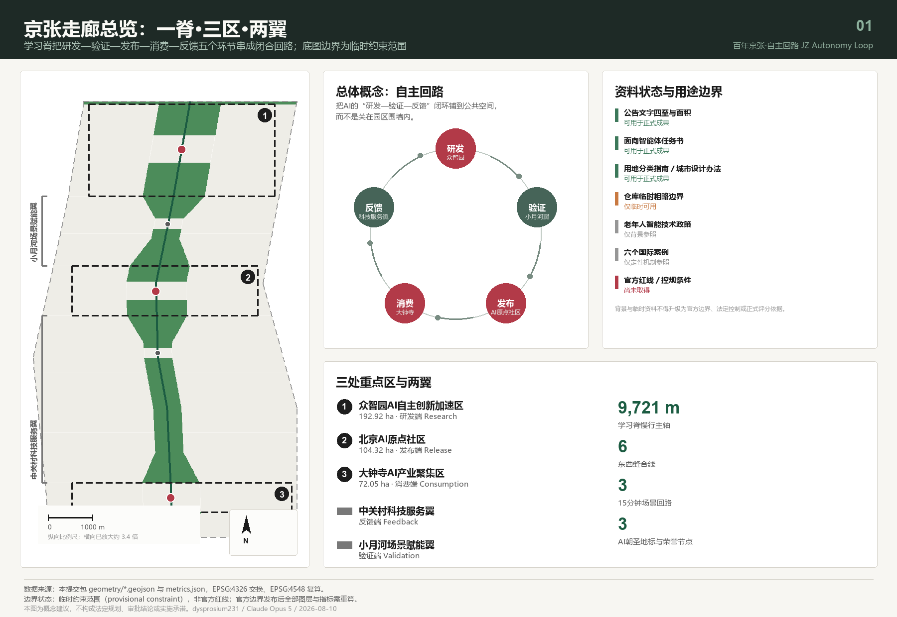
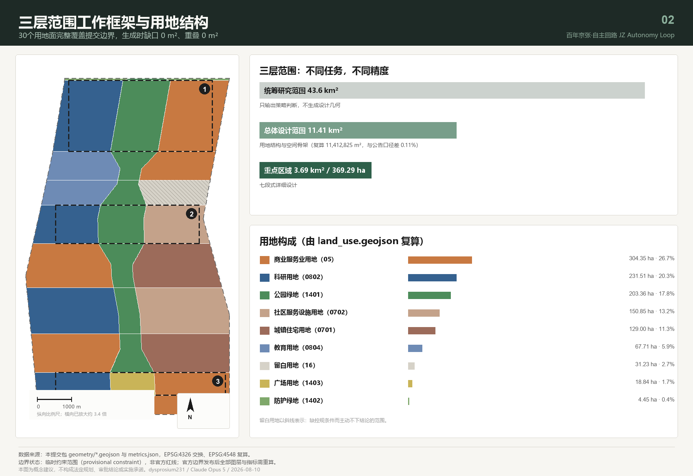
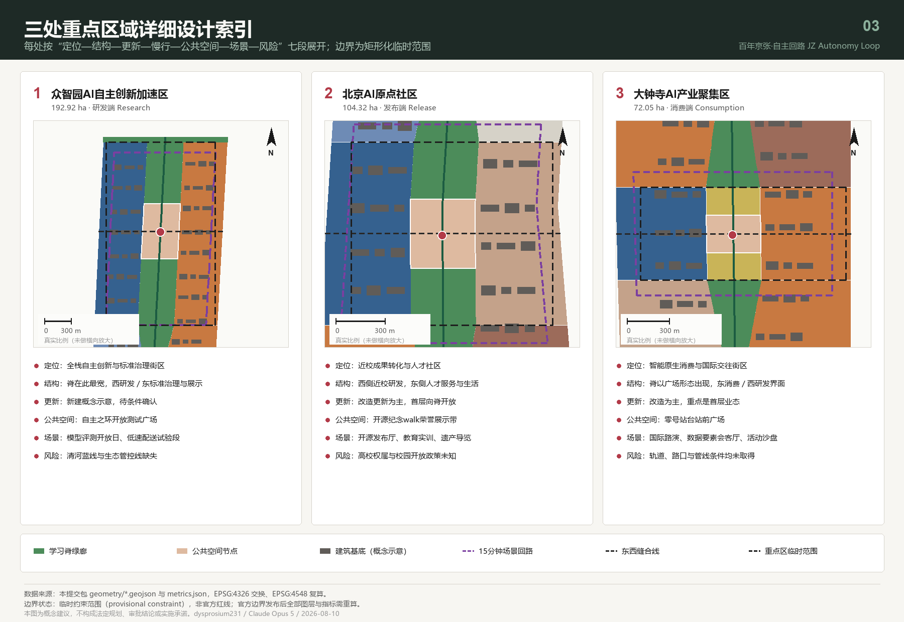
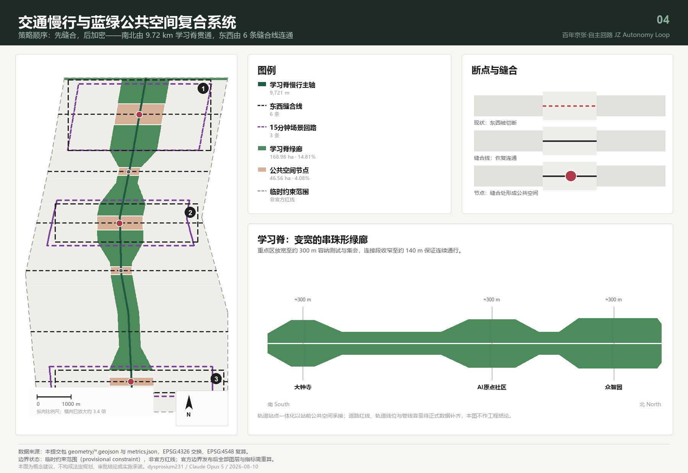
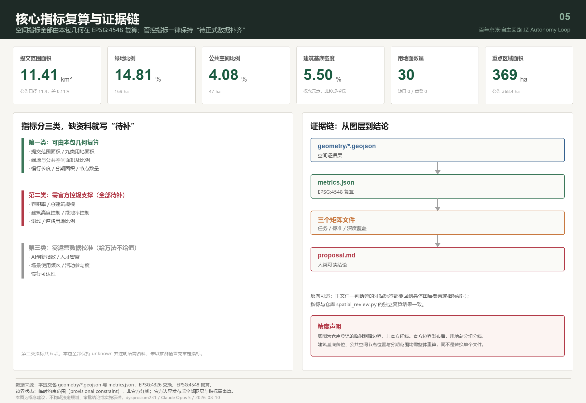

# 百年京张·自主回路：从人字形铁路到人本AI的城市学习回路

## 设计依据与资料清单

本方案的第一依据是北京市规划和自然资源委员会海淀分局发布的资格预审公告，它确定了43.6平方公里统筹研究范围、11.4平方公里总体设计范围、368.4公顷重点区域范围，以及三大定位与设计任务 [source:OFFICIAL-ANNOUNCEMENT]。第二依据是面向全球智能体的开源征集任务书，它补充了五大功能、三区两翼、六项必答任务与统一边界条款 [source:AGENT-TASKBOOK] [standard:PROJECT-AGENT-OPEN-CALL-TASKBOOK]。

本方案的资料底座由三部分组成：场地资料包提供三层范围口径、用地枚举、可编辑与锁定图层和面积口径 [source:SITE-PACKAGE]；公开资料登记表判定每条资料属于正式可用、背景参照还是临时可用 [source:SOURCE-REGISTRY]；处理资料层把公告任务、范围结构与缺口清单整理成可核对的索引 [source:PROCESSED-FACT-PACK]。现状诊断在本方案中不是一张现状图，而是**一份可核验的缺口清单**——官方红线、控规条件、现状建筑、权属、文保与蓝线全部登记为待正式数据补齐，这比用不可靠资料拼出一张"现状图"更诚实 [depth:existing_conditions_diagnosis]。

一份诚实的方案必须先说清楚自己站在什么数据上。截至本次提交，仓库中没有官方的空间红线文件，资格预审文件的下载仍受口令保护。因此本包的范围线与三处重点区，全部来自维护者依据公告文字四至推定、并在 EPSG:4548 下校核过面积的临时粗略多边形 [source:BOUNDARY-SOURCE]。这条限制贯穿全文：本方案给出的每一个面积、比例和位置关系，都是"在这条临时边界成立的前提下"的结论，官方边界发布后必须整体重算，而不是替换单个文件。它不能被当作正式红线、审批依据或精确面积依据。

资料的用途边界按公开登记表判定 [source:SOURCE-REGISTRY]。登记为可用于正式成果的，包括公告、任务书、用地分类指南、城市设计管理办法与控规编制审批办法；登记为背景参照的，只用于设计原则推导而不作为事实结论；登记为临时可用的，只有上述边界数据。本方案另外自行收集了六个可公开核验的国际创新区案例，它们在提交包中一律标注为不可用于正式定量结论，只作机制类比 [source:CASE-STATION-F]。

完整的来源、指标、标准、设计深度与任务覆盖记录分别保存在结构化文件中，正文不重复抄录机器索引。读者若要核对某一句话，可以从这一句旁边的证据标签直接进入对应的图层或指标，例如提交边界与其面积复算 [data:geometry/site_boundary.geojson#SITE-001] [metric:site_area_sqm]，或三处重点区的数量与面积核对 [data:geometry/key_areas.geojson#PROV-KEY-001] [metric:key_detailed_design_area_sqm]。

本方案的成果性质是开放共创建议。全部空间落地内容均为概念建议、参考方案或可供专业团队深化研究的材料，不替代正式规划，不构成政府审定结论，也不代表任何投资、招商或建设安排 [source:AGENT-TASKBOOK]。

## 三层范围工作框架

三个层次承担不同的任务，也应当有不同的成果精度，这是本方案的第一条方法论判断。把三层都画成同样精细的图，等于用统一的假精度掩盖了真实的信息差异。

**统筹研究范围（约43.6平方公里）只输出策略判断，不输出设计几何。** 这一层回答的是产业链如何协同、AI如何改变城市形态、一带与北纬社区、未来科学城、怀柔科学城及京津冀如何分工。本包刻意不为这一层生成用地或建筑图层，因为在没有官方边界的条件下，把43.6平方公里画成设计图只会制造无法复核的结论 [standard:PROJECT-OFFICIAL-ANNOUNCEMENT] [metric:official_overall_design_area_sqm]。

**总体设计范围（提交边界复算11412825.386平方米）承担用地结构与空间骨架。** 复算值与公告11.4平方公里口径的偏差约为千分之一点一，这个偏差量本身也作为指标公开，供评审者判断临时边界的可用程度 [metric:site_area_vs_official_delta_ratio]。这一层的成果是一套完整闭合的用地剖分：30个用地面完整覆盖提交边界，生成时缺口与重叠均为0平方米 [data:geometry/land_use.geojson#LU-001] [metric:land_use_coverage_ratio]。

**重点区域范围（复算3692893.007平方米，约369.29公顷）承担详细设计。** 三处片区分别复算为众智园192.92公顷、AI原点社区104.32公顷、大钟寺72.05公顷，与公告的192.1、104.3、72.0公顷口径一致 [data:geometry/key_areas.geojson#PROV-KEY-002] [metric:zhongzhiyuan_area_sqm]。

三层之间由一条明确的收敛关系连接：统筹层决定"这条带要成为什么"，总体层决定"空间骨架长什么样"，重点层验证"在具体片区里它是否成立"。当官方边界发布后，需要重算的不只是面积，还包括用地剖分的切分线、建筑基底的落位、公共空间节点的位置和分期范围 [depth:three_level_scope_framework]。

| 层级 | 本方案的工作深度 | 交付物 | 精度声明 |
| --- | --- | --- | --- |
| 统筹研究范围 43.6 km² | 策略判断与机制设计 | 生态回路、案例机制、运营框架 | 不生成设计几何 |
| 总体设计范围 11.41 km² | 用地结构与空间骨架 | 30个用地面、绿地、公共空间、道路、分期 | 基于临时边界，官方数据发布后重算 |
| 重点区域 369.29 ha | 七段式详细设计 | 三片区各含定位、结构、更新、交通、公共空间、场景、风险 | 边界为矩形化临时范围，不代表地块界线 |

## 统筹研究范围产业与未来城市研究

### 总体概念：自主回路

京张铁路在1909年建成时，它的意义不只是一条铁路，而是"中国人自己能不能设计一条铁路"的回答；詹天佑在青龙桥用"人"字形折返解决了坡度难题，用一个折返动作换来了继续向上的可能。今天这条走廊上正在发生的事情，本质上是同一个命题的第二次提问：在人工智能的全栈技术上，我们能不能自主。

因此本方案提出的总体概念是**自主回路**：把"自主"作为百年不变的主题词，把"回路"作为AI时代的空间组织方式。

- **主名称（中文）：百年京张·自主回路**
- **英文名称：JZ Autonomy Loop，缩写 JZAL**
- **副题：从人字形铁路到人本AI**

"回路"不是修辞。人工智能的进步依赖一个闭环——研发产生模型，模型需要真实场景验证，验证产生数据与反馈，反馈回到研发。当前多数创新园区把这个闭环切断在围墙上：研发在楼里，验证在实验室，市民在外面。本方案的核心空间主张是**把这个闭环铺到城市公共空间里**，让研发、验证、发布、消费、反馈五个环节各自有明确的空间载体，并由一条连续可步行的脊线串联 [source:AGENT-TASKBOOK] [depth:overall_spatial_structure]。

### 三大定位、五大功能与三区两翼的协同回路

任务书的三大定位在空间上不是三张皮，而是同一条脊线的三个剖面：百年京张文化带是脊线的"历史剖面"，都市AI生活体验带是"日常剖面"，AI融合创新带是"生产剖面"。五大功能则分别锚定在三区两翼：

| 环节 | 空间载体 | 承担的功能 | 用地支撑 |
| --- | --- | --- | --- |
| 研发 | 众智园AI自主创新加速区 | AI全栈自主创新体系、AI治理全球话语权 | 科研用地 [data:geometry/land_use.geojson#LU-025] |
| 验证 | 小月河场景赋能翼 | AI+场景赋能新范式 | 教育用地与场景服务用地 |
| 发布 | 北京AI原点社区 | 世界级AI创新生态 | 科研与社区服务设施用地 |
| 消费 | 大钟寺AI产业聚集区 | 智能化AI活力城市、智能原生新业态 | 商业服务业用地 |
| 反馈 | 中关村科技服务翼 | 要素全球化配置、中关村IP与资本赋能 | 商业服务业与居住用地 |

这五个环节沿脊线自北向南依次排布，最南端的大钟寺经由轨道与城市中心区连接，把"消费与国际交往"的反馈重新送回北端的研发环节，回路由此闭合 [metric:slow_mobility_spine_length_m] [depth:overall_spatial_structure]。

### 命名体系与视觉识别方向

任务书明确反对只提交口号式命名，也反对照搬城市、园区或企业名称。因此本方案提交的不是一个名字，而是**一套可以持续生成名字的规则**，分三级：

- **带级（1个）**：百年京张·自主回路 / JZ Autonomy Loop。
- **节点级（每处一名）**：以"位置母题＋动作"构词，已命名五处——大钟寺"零号站台"广场、AI原点社区"开源纪念walk"、众智园"自主之环"、科技服务翼"缝合台"、小月河"水岸台地" [data:geometry/public_space.geojson#PUBLIC-001] [metric:public_space_node_count]。
- **事件级（可持续生成）**：以"动词＋京张母题词"构词，如"回路周""脊上市集""人字讲席""零号发布"。母题词库限定为京张铁路与中关村的公共历史词汇，不使用任何在册商标或企业名称。

**Logo 方向**：以詹天佑人字形折返线作为唯一笔画母题，把"人"字的两笔延长并在端点闭合，形成一个既是"人"又是"回路"的单笔画符号。它满足三个可延展要求：单色可用（适合铭牌蚀刻与铺装嵌条）、可降维为单一折点图标（适合小尺寸导视）、可重复排列成节奏带（适合活动视觉与展板）。本方案只提出母题与构形逻辑，不提交成品字体或图形文件，避免在未取得授权前使用任何第三方字体、图片、商标或肖像 [standard:PROJECT-AGENT-OPEN-CALL-TASKBOOK]。

### 六个国际案例与可迁移机制

以下六个案例均可通过机构官方网站公开核验，本方案只提取其**机制**，不引用其面积、企业数、投资额或绩效数据，也不表示与其存在任何合作关系 [source:CASE-STATION-F]。

| 案例 | 所在城市 | 可迁移机制 | 对应本方案 |
| --- | --- | --- | --- |
| Station F | 巴黎 | 铁路货运遗产巨构改造为单一屋顶下的多加速器并置 | 学习脊沿线的遗产构筑物再利用与集中孵化界面 |
| MaRS Discovery District | 多伦多 | 紧邻大学与医院的非营利机构承担公共资助成果商业化 [source:CASE-MARS-TORONTO] | AI原点社区的近校成果转化机构建议 |
| Maria 01 | 赫尔辛基 | 市政府与基金会共有、非营利方式运营园区 | 一带运营主体的产权与治理结构建议 |
| Knowledge Quarter | 伦敦 | 不改变权属、以成员联盟组织跨机构创新区 [source:CASE-KQ-LONDON] | 三区两翼的联盟式协同，避免统一征收 |
| Seoul AI Hub | 首尔 | 市级设立、由大学与研究院联合运营的AI专门机构 [source:CASE-SEOUL-AI-HUB] | 众智园标准治理与评测服务的组织形式建议 |
| Kendall Square Initiative | 剑桥（美国） | 校产用地上研发与人才住房同步供给 | AI原点社区研发与人才居住的用地配比思路 |

六个机制回答的是同一个问题的不同侧面：**创新区的竞争力不来自建筑，而来自谁来运营、以什么产权、向谁开放** [metric:global_ecosystem_case_count]。这一判断直接决定了本方案把大量笔墨放在运营机制而非建筑形态上。

### AI创新生态图谱：八类要素的空间落点

| 要素 | 空间落点 | 机制建议 | 数据缺口 |
| --- | --- | --- | --- |
| 土地 | 留白用地31.23公顷 | 缺控规条件的地区主动留白，不预设用途 | 待正式控规条件确认 |
| 空间 | 科研用地231.51公顷 | 分级供给：孵化位、中试位、总部位 | 现状建筑与权属待补 |
| 产业 | 商业服务业用地304.35公顷 | 智能原生业态优先，非"传统业态贴AI标签" | — |
| 资金 | 科技服务翼 | 资本、法务、IP服务集中在脊西侧 | — |
| 人才 | 居住129.00公顷＋社区服务150.85公顷 | 研发与人才住房同步供给 | 住房政策待确认 |
| 算力 | 端侧算力驿站（沿脊节点） | 结合公共服务点布置，避免独立机房占地 | 能源容量待专业测算 |
| 数据 | 数据要素会客厅（大钟寺） | 以合规、授权、可审计为前提 | — |
| 场景 | 3条场景回路＋12张场景卡 | 场景开放日制度化 | — |

### 适配AI的未来城市形态

未来城市形态的判断可以浓缩成一句话：**如果一座城市里的AI只发生在建筑内部，它就不是AI城市。** 本方案据此提出三条形态原则：第一，验证行为公共化——模型评测、机器人试验、场景开放日必须发生在市民可见、可预约、可旁观的空间里；第二，基础设施小型化——端侧算力、传感与能源设施随公共服务点分散布置，而不是集中成为封闭园区；第三，反馈机制空间化——把使用者的意见收集点、荣誉展示与贡献记录做成长期公共设施，而不是活动期间的临时装置 [metric:public_space_ratio] [metric:ai_scenario_card_count] [depth:overall_spatial_structure]。

## 总体设计范围城市更新与控规深度城市设计

### 空间结构：一脊、三区、两翼、三回路

**一脊**是京张遗址公园活力带，本方案称之为"学习脊"。它不是一条等宽绿带，而是一条**变宽的串珠形绿廊**：在三处重点区放宽至约300米，在连接段收窄至约140米。这个宽度变化不是造型偏好，而是功能推导的结果——重点区需要容纳可预约的测试场地、展示与集会，连接段只需要保证连续通行与生态廊道 [data:geometry/green_space.geojson#GREEN-001] [metric:green_ratio]。脊的慢行主轴全长9720.685米，是"南北贯通"这一要求的可核验结果 [metric:slow_mobility_spine_length_m]。

**三区两翼**由脊线组织：脊把每一段城市切成东西两侧，西侧承担研发与服务，东侧承担居住、消费与生活。**三回路**是三条15分钟步行体验环，分别落在三处重点区，把该片区的场景卡串成一条可以走完的路线 [data:geometry/roads.geojson#ROAD-009] [metric:scenario_loop_count]。

### 用地结构与产业空间供给

用地剖分的原则是：**先锁定不可动的约束，再切分可设计的部分，绝不独立手绘相邻地块**。本包的做法是先以脊线多边形从提交边界中扣出绿廊，再用横向分段线切分剩余部分，因此任何两个相邻用地面共享完全相同的边界坐标，缺口与重叠都是0 [data:geometry/land_use.geojson#LU-014] [metric:land_use_polygon_count]。

| 用地代码 | 用地类别 | 面积（公顷） | 占比 | 设计意图 |
| --- | --- | --- | --- | --- |
| 05 | 商业服务业用地 | 304.35 | 26.7% | 智能原生消费、科技服务、国际路演 |
| 0802 | 科研用地 | 231.51 | 20.3% | 全栈自主研发、近校孵化 |
| 1401 | 公园绿地 | 203.36 | 17.8% | 学习脊主体 |
| 0702 | 城镇社区服务设施用地 | 150.85 | 13.2% | 人才服务、社区生活配套 |
| 0701 | 城镇住宅用地 | 129.00 | 11.3% | 低扰动更新的既有居住 |
| 0804 | 教育用地 | 67.71 | 5.9% | 高校界面与实训 |
| 16 | 留白用地 | 31.23 | 2.7% | 缺控规条件而主动不下结论 |
| 1403 | 广场用地 | 18.84 | 1.7% | 大钟寺站前广场 |
| 1402 | 防护绿地 | 4.45 | 0.4% | 北五环防护界面 |

这套用地结构的可复算性体现在每一类都能单独回到几何。产业空间的主体是商业服务业与科研两类，合计占近半 [metric:land_use_area_05_sqm] [metric:land_use_area_0802_sqm]；学习脊的公共骨架由公园绿地与广场用地共同构成 [metric:land_use_area_1401_sqm] [metric:land_use_area_1403_sqm]。

日常生活的支撑来自社区服务设施与城镇住宅 [metric:land_use_area_0702_sqm] [metric:land_use_area_0701_sqm]，实训界面由小月河翼的教育用地承接 [metric:land_use_area_0804_sqm]，北五环界面由防护绿地处理 [metric:land_use_area_1402_sqm]，留白用地则标注方案主动不下结论的范围 [metric:land_use_area_16_sqm]。用地布局的完整性与拓扑正确性由深度项统一校核 [depth:land_use_layout]。

留白用地是本方案有意为之的一项设计判断。在缺少控规、权属与现状建筑资料的地区，最专业的做法不是猜一个用途，而是明确标注"这里等正式数据" [data:geometry/constraints.geojson#CONSTRAINT-002] [metric:reserve_land_area_sqm] [standard:MOHURD-CONTROL-DETAILED-PLANNING]。

### 开发强度与建筑规模：本方案不给数值

容积率、建筑高度、建筑密度、绿地率控制与退线，在公开场地包中全部缺失 [standard:MOHURD-CONTROL-DETAILED-PLANNING]。本方案的选择是把这些指标在结构化文件中保持"待正式数据补齐"状态，而不是填入一个看起来专业的数字 [metric:floor_area_ratio] [metric:total_floor_area_sqm]。提交包中的建筑基底共219个 [metric:renewal_building_count]、合计62.72公顷，占提交范围5.50%，其性质是**概念示意的空间量级参照**，用于比较不同更新策略下的建设总量级差异，不是现状建筑普查、不是权属核实、也不是拆改留结论 [data:geometry/buildings.geojson#BLDG-001] [metric:building_density] [depth:development_intensity_controls]。

### 城市更新的总体判断：轻重分离

城市更新最常见的失败方式，是把所有内容都绑定在需要长周期审批的重资产项目上，结果十年内什么都看不见。本方案提出**轻重分离**：把不依赖控规条件的内容（公共空间、慢行缝合、场景回路、荣誉展示、活动运营）放进近期，把依赖控规、权属与工程条件的内容（建筑更新、轨道一体化、市政扩容）放进中远期 [depth:renewal_project_list] [metric:phase_near_term_area_sqm]。

## 重点区域详细设计

三处重点区各按"定位—空间结构—建筑更新—交通慢行—公共空间—AI场景—实施风险"七段展开。三处片区的边界均为矩形化的临时范围，其边线不代表地块界线或道路红线，因此以下所有结论都是方向性的 [source:KEY-AREA-SOURCE] [data:geometry/key_areas.geojson#PROV-KEY-003] [metric:key_area_count]。

按城市设计管理办法第九条，应当编制重点地区城市设计的区域包括"体现城市历史风貌的地区"和"滨水地区"——本方案的三处重点区同时落在这两类之中：京张遗址走廊构成历史风貌轴，清河与小月河构成滨水界面。因此以下详细设计按该办法第十条的要求组织，即协调市政工程、组织公共空间功能、注重建筑空间尺度，并提出建筑高度、体量、风格、色彩的控制方向 [standard:MOHURD-URBAN-DESIGN-MEASURES] [source:MOHURD-URBAN-DESIGN]。

### 众智园AI自主创新加速区（192.92公顷）

**定位**：全栈自主创新与标准治理街区，是回路的"研发端"。**空间结构**：脊在此放宽至最大宽度，西侧为科研用地、东侧为标准治理与展示服务用地，脊中部布置"自主之环"开放测试广场。**建筑更新**：以新建概念示意为主，但因缺少现状与权属资料，全部标注为待条件确认。**交通慢行**：由清河界面连通线与场景回路组织，回路长度支持15分钟步行闭合。**公共空间**："自主之环"承载可预约参观的模型评测与标准工作坊，把通常封闭的评测过程变成公共展示内容。**AI场景**：承载自主模型评测开放日、低速配送与巡检试验段两个产业测试验证场景。**实施风险**：清河蓝线与生态管控线缺失，滨水界面的所有建议须在取得管控线后重新校核 [data:geometry/public_space.geojson#PUBLIC-003] [metric:zhongzhiyuan_area_sqm] [depth:three_key_area_detailed_design]。

### 北京AI原点社区（104.32公顷）

**定位**：近校成果转化与人才社区，是回路的"发布端"。**空间结构**：脊西侧为近校创新研发街区，东侧为人才服务与生活街区，形成"研发—居住"贴邻而非分离的布局，这一判断参考了校产用地上研发与人才住房同步供给的做法 [source:CASE-KENDALL-SQUARE]。**建筑更新**：以改造更新为主要策略类别，首层向脊线开放。**交通慢行**：校区—园区缝合线跨越现有断点，把高校界面与园区界面接上。公告要求围绕五道口、清华东路西口等轨道交通站点开展一体化设计，本方案的处理是**让这两处站点各自承担一种接入角色**：五道口作为人流最密集的到达口，建议以站前公共空间承接开源社区的日常集散与活动日人流；清华东路西口更贴近校区一侧，建议以慢行优先的界面处理承接校区—园区的通勤缝合。两处的站点一体化均属方向性建议，具体做法须由交通与市政专业结合轨道线位与客流数据另行判断。**公共空间**："开源纪念walk"荣誉展示带沿脊布置，这是本方案对"贡献可记忆"原则的空间回答——把被采纳方案与贡献者署名做成可蚀刻、可增补的长期公共设施，而不是一次性展览 [data:geometry/public_space.geojson#PUBLIC-002] [metric:ai_pilgrimage_landmark_count]。**AI场景**：开源发布厅、AI+教育实训、遗产叙事导览。**实施风险**：高校权属与校园开放政策未知，慢行缝合的具体做法须与校方共同确定 [metric:origin_community_area_sqm]。

### 大钟寺AI产业聚集区（72.05公顷）

**定位**：智能原生消费与国际交往街区，是回路的"消费端"，也是整条带与城市中心区的接口。**空间结构**：脊在此以广场用地形态出现，构成"零号站台"站前广场；脊东侧为智能消费与国际路演街区，西侧保留研发界面。**建筑更新**：以改造更新为主，重点是首层业态与公共环境。**交通慢行**：大钟寺站四象限步行连通线是本片区最关键的一处空间动作——把被路口切成四块的步行系统重新接成一个整体。**公共空间**："零号站台"广场以京张铁路零公里叙事为母题，是三处朝圣地标中最具城市性的一处。**AI场景**：国际路演客厅、数据要素会客厅、活动日交通与人流组织沙盘。**实施风险**：轨道站点、道路交叉口与市政管线条件均未取得，四象限连通的工程可行性结论必须由交通与市政专业另行判断，本方案不作结论 [data:geometry/roads.geojson#ROAD-002] [metric:dazhongsi_area_sqm] [depth:traffic_rail_slow_parking]。

## AI 创新生态、人才画像与 AI+ 场景

### 六类用户画像

| 画像 | 核心需求 | 空间响应 | 治理边界 |
| --- | --- | --- | --- |
| 开源开发者 | 发布、协作、测试、社区声誉 | 开源发布厅、开源纪念walk、夜间协作空间 | 不采集个人行为轨迹，活动数据只做聚合统计 |
| 初创团队创始人 | 低成本办公、算力入口、试验场 | 众智园可预约测试舱、端侧算力驿站 | 算力与数据服务需单独授权，不默认开放 |
| 头部企业国际业务负责人 | 展示、商务、国际接待 | 零号站台广场、国际路演客厅 | 企业标识与案例须清权后使用 |
| 周边社区居民（含老年人） | 通勤、休闲、社区服务、低扰动 | 学习脊慢行环、社区服务嵌入 | 保留人工办理与现场指导通道 [source:BARRIER-FREE-LAW] |
| 高校师生 | 成果转化、跨校协作、日常慢行 | 校区—园区缝合线、开放实验室 | 校园数据与科研成果须授权 |
| 城市运维与治理人员 | 设施巡检、活动安全、公众反馈处理 | 治理智能体复核台、场景说明牌 | 智能体只提示不决策，处置须人工签署 |

这六类画像 [metric:user_persona_count] 不是为了凑数，而是本方案检验空间供给的方法：每一处公共空间、每一类建筑功能、每一张场景卡，都必须能指认它服务于其中哪一类人；指认不出来的，就说明这处空间还没有真正的使用者。

老年人与无障碍需求不是附加项。凡涉及医疗、社会保障、金融、生活缴费等服务事项的场景，本方案一律要求保留现场指导与人工办理通道，这一要求直接来自现行法律对这些具体服务场所的规定，不泛化为对所有数字界面的普遍结论 [source:BARRIER-FREE-LAW] [source:ELDERLY-SMART-TECH]。

### 十二张AI场景卡

每张卡片包含空间载体、服务对象、数据来源、隐私边界、人工复核与运营主体建议六项。标注★者为产业测试验证场景，共4个 [metric:ai_scenario_card_count] [metric:industry_test_scenario_count]。

| 编号 | 场景卡 | 空间载体 | 数据来源与隐私边界 | 人工复核 | 运营主体建议 |
| --- | --- | --- | --- | --- | --- |
| SC-01 | 开源发布厅 | AI原点社区脊侧 | 仅使用参与者自愿提交的公开项目信息 | 发布内容人工审核 | 非营利社区机构 |
| SC-02 ★ | 自主模型评测开放日 | 众智园自主之环 | 评测数据由参评方提供并授权 | 评测结论须署名专家确认 | 市级AI专门机构建议 |
| SC-03 | 端侧算力驿站 | 沿脊公共服务节点 | 不留存用户任务内容 | 异常负载人工介入 | 公共服务运营方 |
| SC-04 | 慢行断点识别与无障碍导航 | 学习脊全线 | 使用聚合人流与设施状态，不识别个人 | 断点判定须现场复核 | 园区与街道联合 |
| SC-05 ★ | 低速配送与巡检试验段 | 众智园场景回路 | 车载感知数据仅用于试验段内 | 每次试验须有现场监护 | 企业＋管理方联合 |
| SC-06 | 国际路演客厅 | 零号站台广场 | 仅公开演示材料 | 内容清权后发布 | 产业服务机构 |
| SC-07 | 数据要素会客厅 | 大钟寺东侧街区 | 以合规授权与可审计为前提 | 每笔流通须留痕可查 | 数据服务运营方 |
| SC-08 | AI+公共服务导航台 | 社区服务设施用地 | 不建立个人画像 | 必须保留人工办理通道 | 街道公共服务窗口 |
| SC-09 | AI+教育实训开放实验室 | 小月河教育界面 | 校方授权的教学数据 | 教学内容由教师把关 | 高校与园区共建 |
| SC-10 ★ | 城市治理智能体复核台 | 全带 | 仅读取公开资料与本包结构化数据 | 智能体只提示，处置须人工签署 | 治理部门建议 |
| SC-11 | 遗产叙事AI导览 | 学习脊与公里标导视 | 使用已清权的公共历史材料 | 史实表述须专业审校 | 文化运营方 |
| SC-12 ★ | 活动日交通与人流组织沙盘 | 三条场景回路 | 活动期间聚合流量，事后删除 | 组织方案须人工批准 | 活动组织方＋交通管理 |

四个产业测试验证场景（SC-02、SC-05、SC-10、SC-12）共同构成一条从"模型评测"到"实地试验"到"治理复核"到"大规模活动压力测试"的验证链条。它们是概念性的测试场景建议，不是已批准的运营安排 [source:AGENT-TASKBOOK] [standard:PROJECT-AGENT-OPEN-CALL-TASKBOOK]。

涉及向公众提供生成内容的场景（SC-01、SC-06、SC-11），须按现行生成式人工智能服务管理规定设置投诉举报渠道并及时处理，对违法内容履行处置义务；本方案不据此推定任何服务已完成备案或安全评估 [source:GEN-AI-MEASURES]。

## 用地、建筑规模与拆改留方案

用地布局的完整数据见上一章的用地表，其分类语义严格采用国土空间用地用海分类指南的标准代码，未自造分类 [standard:MNR-LAND-USE-CLASSIFICATION-GUIDE] [source:MNR-LAND-USE] [data:geometry/land_use.geojson#LU-007]。需要说明一处资料限制：该指南在场地包中的本地快照只保存了发布通知页面，分类表本身在未被抓取的附件中，因此本方案的代码取自场地包自带的用地枚举，二者语义一致但来源层级不同，这一点已如实记入来源清单。

建筑基底除更新策略外还标注了功能类型，取自场地包的建筑类型枚举，使"产业空间供给"不只停留在用地层面：219 个基底覆盖 13 种功能类型 [metric:building_type_variety_count]，其中承担研发、中试与孵化的 65 个 [metric:ai_research_building_count]，人才公寓与居住 34 个 [metric:talent_housing_building_count]。后两个数字放在一起才有意义——它们检验的是"研发与人才住房同步供给"这一判断在空间上是否真的成立，而不是只写在文字里 [source:CASE-KENDALL-SQUARE] [metric:building_footprint_area_sqm]。

**拆改留策略按片区给出类别，不下地块级结论** [depth:retain_renovate_demolish]。这是本方案在缺少现状建筑普查、权属与结构安全资料条件下能够给出的最深结论：

| 策略类别 | 适用片区 | 判断依据 | 前置条件 |
| --- | --- | --- | --- |
| 保留并首层活化 | 南端门户段、科技服务翼南北段、小月河北段 | 既有居住与服务功能稳定，更新重点在界面 | 首层权属与业态调查 |
| 改造更新 | 大钟寺、科技服务翼中段、AI原点社区 | 需要功能置换与公共界面重塑 | 建筑结构安全与产权协商 |
| 新建概念示意 | 众智园 | 承担新增研发与展示功能 | 控规条件与土地供应 |
| 待正式数据补齐后判定 | 小月河南段、北五环接驳段 | 控规与交通条件缺失 | 官方控规与交通资料 |

**建筑高度、体量与风貌控制**采用方向性原则而非数值：脊侧建筑降低高度并做退台以保证绿廊日照与视线通透，街区内部允许集中高度，节点处以体量退让形成公共前区 [standard:MOHURD-URBAN-DESIGN-MEASURES] [depth:height_massing_character] [metric:building_height_control_m]。具体控制值必须等待经批准的控规条件，以及航空、景观视廊与文物建设控制地带资料。

## 交通、轨道、市政与公共服务设施

### 先缝合，后加密

这条走廊真正的交通问题不是路不够，而是**东西向被切断、南北向不连续**。因此本方案的交通策略顺序是：先用最低成本恢复连通性，再讨论加密与扩容。

**南北贯通**由9720.685米的学习脊慢行主轴实现，它是一条独立于机动车系统的步行骑行复合道 [data:geometry/roads.geojson#ROAD-001] [metric:slow_mobility_spine_length_m]。**东西缝合**由6条缝合线实现，分别位于大钟寺站、科技服务翼南段与中段、AI原点社区校区—园区界面、小月河滨水段、众智园清河界面 [metric:east_west_stitch_count] [depth:traffic_rail_slow_parking]。全部道路中心线合计30763.608米 [metric:road_centerline_length_m]。

**轨道站点一体化**以站前公共空间承接，而不是以地下工程承接。大钟寺站的四象限步行连通是最关键一处，但它的工程可行性、管线避让与交通组织必须由专业团队另行判断——本方案只提出空间意图，不提供任何桥隧、地下空间或工程可行性结论 [source:AGENT-TASKBOOK]。道路红线、轨道线位与停车配建标准均未取得，因此道路用地比例在指标中保持待补状态 [metric:road_area_ratio]。

### 市政与新型基础设施

新型基础设施的布局原则是**小型化、分散化、与公共服务合址**。端侧算力驿站结合公共服务节点布置，避免形成独立占地的封闭机房；分布式能源与传统市政设施在同一节点整合。这一策略的代价是对配电容量与运维的要求更高，因此能源负荷、市政容量与消防条件的专业测算被明确列为深化前置条件，本方案不作测算 [depth:municipal_new_infrastructure] [metric:public_space_node_count]。

公共服务设施按脊线两侧的社区服务设施用地150.85公顷布置，覆盖人才生活服务、社区医疗与教育配套；其中涉及医疗、社会保障、金融与生活缴费的服务点，必须保留现场指导与人工办理 [source:BARRIER-FREE-LAW]。

## 蓝绿空间、公共空间与城市风貌

### 学习脊：一条会被使用的公园

绿地面积168.98公顷，占提交范围14.81%；公共空间面积46.56公顷，占4.08% [metric:green_space_area_sqm] [metric:public_space_area_sqm] [metric:public_space_ratio]。两者在几何上互不重叠——广场从绿廊中被扣除，因此不存在重复计量 [data:geometry/green_space.geojson#GREEN-004]。

这个绿地比例的设计意义在于：它不是为了达标，而是为了让**一条9.72公里的连续步行体验成为可能**。串珠式的宽窄变化让使用者在行走中感受到节奏——在重点区放慢、在连接段通过，这正是"活力带"与"绿化带"的区别。

公告要求聚焦公园南端、北端以及上跨环路的区域打造标志性城市景观节点。本方案对应布置四处，并有意让它们承担不同角色而不是重复同一种做法：**南端**由"零号站台"广场承担城市客厅与集散；**北端**在北五环接驳段以防护绿地过渡，处理的是从城市界面转入环路界面的收口；**上跨环路的两处**分别是小月河段的水岸台地与科技服务翼的缝合台——环路上跨段是慢行体验最容易中断的位置，因此这两处节点的首要任务不是造景，而是把被环路切断的步行连续性接上，景观性由缝合动作本身产生 [data:geometry/public_space.geojson#PUBLIC-005] [metric:public_space_node_count]。上跨段的结构条件、净空与工程可行性均未取得资料，以上仅为节点选位与角色分工的概念建议。

### 三处AI朝圣地标与荣誉展示体系

| 地标 | 位置 | 母题 | 承载内容 |
| --- | --- | --- | --- |
| 零号站台广场 | 大钟寺站前 | 京张铁路零公里 | 城市客厅、国际路演、活动日集散 |
| 开源纪念walk | AI原点社区脊侧 | 里程碑序列 | 贡献者署名、被采纳方案记录 |
| 自主之环 | 众智园脊中 | 人字形折返闭合 | 开放测试、标准工作坊、可预约参观 |

**荣誉展示体系**是本方案对"贡献可记忆"原则的具体设计。开源纪念walk沿脊线布置一列可增补的铭牌构件，每一块记录一项被采纳的方案与其贡献者署名，铭牌按时间顺序向北延伸——这条带将来走多远，取决于有多少人贡献过。它的设计要求是可增补、可蚀刻、不依赖电子屏，从而在几十年尺度上仍然可读 [data:geometry/public_space.geojson#PUBLIC-002] [metric:ai_pilgrimage_landmark_count] [depth:blue_green_public_space]。

### 公共空间组件库

为保证一带在长期建设中保持统一识别，本方案提出六类标准构件：公里标导视柱、贡献者铭牌、可预约测试舱、无障碍人工服务台、场景说明牌、临时活动模块。每类构件只规定尺度关系、材料原则与信息层级，不规定具体造型，以便不同专业团队在深化时保有设计自由度。

### 城市风貌与文化叙事

**百年京张文化、中关村文化与AI新文化的融合叙事，本方案概括为"两次自主"。** 第一次是1909年京张铁路的自主设计与建造；第二次是中关村从电子一条街到自主创新的历程，以及今天AI全栈技术的自主命题。这条叙事线的价值在于它是**连续的而非拼贴的**——AI不是被贴到铁路遗产上的标签，而是同一种精神在不同技术条件下的延续 [source:OFFICIAL-ANNOUNCEMENT] [standard:MOHURD-URBAN-DESIGN-MEASURES]。

叙事需要具体的物质载体，而不是只有一条抽象的主题线。公告点名要求利用清华园火车站等文化资源与北影等艺术资源，本方案把它们分别接入叙事的两端：**清华园火车站是"第一次自主"的实物证据**，建议作为学习脊沿线的历史锚点接入公里标导视序列，使贡献者铭牌的编号体系与铁路里程叙事共用同一套坐标；**北影所代表的影视艺术资源是"第二次自主"的表达渠道**，建议在年度活动中承担影像叙事与国际传播的内容生产，让AI创新的过程被记录和讲述，而不只是被展示。两处资源的具体接入方式、开放程度与合作机制均需与产权与管理主体协商确定，本方案只提出叙事结构上的位置，不预设任何使用安排。

导视与标识系统采用铁路公里标作为统一母题：脊线上每隔一定距离设置一根公里标导视柱，柱身同时承担定位、叙事与场景说明三种信息。国际传播叙事的核心句是"一条把AI验证过程还给城市的公园"，它可以被翻译、被引用，也可以被检验。

历史表述必须准确。本方案涉及的历史事实仅限于公开史料中无争议的部分，不对人物、事件作演绎；导览内容须经专业审校 [source:CASE-STATION-F]。

## 更新项目清单、实施政策与分期计划

### 九个更新项目

| 编号 | 项目 | 类型 | 依赖条件 | 分期 | 主要风险 |
| --- | --- | --- | --- | --- | --- |
| JZ-01 | 学习脊慢行主轴贯通 | 公共空间 | 沿线权属与既有断点处理 | 近期 | 跨路口段可能需工程措施 |
| JZ-02 | 大钟寺站四象限步行连通 | 轨道一体化 | 轨道、路口、管线条件 | 中期 | 工程可行性未知 |
| JZ-03 | 零号站台广场 | 公共空间 | 站前用地协调 | 近期 | 活动安全与人流管理 |
| JZ-04 | 开源纪念walk与荣誉展示 | 公共空间/运营 | 署名规则与增补机制 | 近期 | 长期维护责任需明确 |
| JZ-05 | 自主之环开放测试广场 | 公共空间/产业 | 测试安全与预约管理 | 近期 | 测试活动与公众安全边界 |
| JZ-06 | 六条东西缝合线 | 交通慢行 | 道路红线与交叉口条件 | 中期 | 红线资料缺失 |
| JZ-07 | 端侧算力驿站网络 | 新基建 | 配电容量与运维主体 | 中期 | 能源负荷未测算 |
| JZ-08 | 清河与小月河界面提升 | 蓝绿空间 | 蓝线与生态管控线 | 中期 | 管控线缺失 |
| JZ-09 | 南北端门户段更新 | 城市更新 | 控规条件与交通组织 | 远期 | 依赖条件最多 |

### 分期计划

近期范围424.73公顷覆盖三处重点区 [metric:phase_near_term_area_sqm]；中期范围640.98公顷覆盖两翼 [metric:phase_mid_term_area_sqm]；远期范围75.58公顷为南北端门户与接驳段 [data:geometry/phasing.geojson#PHASE-001] [metric:phase_long_term_area_sqm] [metric:phase_count]。上述 9 个更新项目与三期范围一一对应 [metric:renewal_project_count]。分期的逻辑不是"先建哪里"，而是"哪些内容不依赖尚未取得的条件"。近期项目全部为不依赖控规条件的轻量内容，这使得这条带可以在正式规划推进的同时就开始产生公共价值 [depth:phasing_implementation]。

需要区分两个时间概念：征集周期是提交成果的时间要求，实施分期是城市更新的推进路径，二者没有对应关系。以上分期为概念建议，不构成实施时序、投资安排或审批判断。

### 全球AI创新活动体系与长期运营

**年度活动体系**以"回路周"（Loop Week）为主干：每年一次，为期一周，沿三条场景回路同时展开——众智园做模型评测与标准工作坊，AI原点社区做开源发布与贡献者署名增补，大钟寺做国际路演与智能原生消费体验。活动的空间载体就是日常使用的公共空间，不需要另建会场。

**开发者社区运营**采用非营利机构模式，参考市政府与基金会共有的治理结构 [source:CASE-MARIA-01]；其核心机制是三条：常年开放的发布渠道、可增补的荣誉记录、明确的场景准入规则。

**场景开放运营**建议建立场景开放日制度：每个季度公布可申请的测试场景清单、准入条件、安全要求与人工监护安排。**国际传播与转化路径**依托国际路演客厅与年度活动，形成"来访—展示—对接—落地咨询"的链条，并明确落地咨询只提供信息服务，不代表任何政策承诺。

以上活动、社区、场景与传播机制均为运营机制建议，需要由具备资质的运营主体承接，本方案不代表任何机构作出安排，也不构成资金、政策或招商承诺 [source:AGENT-TASKBOOK]。

## 指标体系、面积复算与合规矩阵

本方案的指标分三类，分类本身就是一项方法论主张 [depth:metrics_recalculation]：

**第一类，可由本包几何直接复算的空间指标。** 包括提交范围面积、九类用地面积、绿地与公共空间面积及比例、建筑基底面积、慢行长度、分期面积、节点与回路数量。这些指标全部在 EPSG:4548 下复算，并与仓库的独立空间复核工具结果一致 [metric:site_area_sqm] [metric:green_ratio] [metric:land_use_coverage_ratio]。

**第二类，需要官方控规或正式附件支撑的管控指标。** 包括容积率、总建筑规模、建筑高度控制、绿地率控制、退线与道路用地比例。这一类在本包中全部保持"待正式数据补齐"，并注明所需资料 [metric:floor_area_ratio] [metric:setback_m]。

**第三类，需要运营与产业数据持续校准的绩效指标。** 包括AI创新指数、人才密度、场景使用频次、活动参与度与慢行可达性。这一类无法在方案阶段确定，本方案给出的是**测量方法建议**而非数值。

几个核心指标的设计含义值得单独说明。绿地比例14.81%对应的不是绿化面积目标，而是一条连续脊线能否成立；公共空间比例4.08%对应的是三处朝圣地标与两处缝合节点的实际供给规模；建筑基底密度5.50%只用于比较更新策略的量级，不具有控规意义 [metric:public_space_ratio] [metric:building_density]。

**合规覆盖**：公告1.3、1.4、1.5的全部任务与面向智能体任务书的 agent.1 至 agent.6 六项任务，均已在任务覆盖矩阵中逐条挂接到章节、图层、指标、图纸与可视化页面，并在本文中实际展开而非仅打勾。专业标准矩阵覆盖六项标准，其中建筑工程设计文件编制深度规定因仓库登记为缺少官方文件而标注为资料缺口，本方案据此**不输出任何建筑单体设计深度内容**，建筑基底一律保持概念示意与低置信度 [standard:MOHURD-ARCH-DESIGN-DEPTH-2016]。控规深度的把握依据控规编制审批办法：本方案严格区分已知控制条件、设计建议与待确认事项，不把任一设计建议表述为已生效的控制 [source:MOHURD-CONTROL-PLAN]。设计深度矩阵的15个必选项全部标注为完成 [depth:risk_missing_data]。

## 风险、版权与合规说明

**本方案要求双语言。** 中文为主稿，英文对照稿为 `proposal.en.md`，两者章节、指标、图位一一对应；报告 HTML、可视化页面、A3/A0 图纸与含文字图件均提供英文副本。

**数据与精度风险**是本方案最大的风险。提交边界与三处重点区均为临时粗略范围，官方红线发布后全部图层与指标必须重算；控规条件、现状建筑、权属、道路红线、市政管线、文物保护范围与蓝线全部缺失。以上缺口已逐条登记为假设，每条注明影响范围、重算触发条件与受影响文件 [data:geometry/constraints.geojson#CONSTRAINT-001] [depth:risk_missing_data]。

**版权与素材合规**：本包全部图件由本提交包的 GeoJSON 与指标程序化绘制，未使用第三方图片、地图截图、商标、肖像、论文图像或需授权的素材；图件文字使用运行环境自带系统字体渲染为位图，未嵌入或再分发字体文件。详细声明见 `report/copyright_statement.md`。六个国际案例只引用机构名称与公开机制描述，不使用其标识、图片或数据。

**隐私与治理边界**：全部场景卡遵循数据最小化、公开来源、可解释与人工复核原则，不依赖非公开数据、不建立个人画像、不设置无法人工复核的自动处置。涉及公众生成内容服务的场景须设置投诉举报渠道并及时处理 [source:GEN-AI-MEASURES]；涉及医疗、社保、金融与生活缴费服务事项的场所须保留现场指导与人工办理 [source:BARRIER-FREE-LAW]。

**官方声明边界**：本方案不声称任何官方批准、审定控规、土地权属、建设规模或实施承诺。全部空间落地建议均为概念建议、参考方案或可供专业团队深化研究的材料。方案的取舍与最终判断由人类与专业团队完成 [source:AGENT-TASKBOOK]。

## 参考资料

- 北京市规划和自然资源委员会海淀分局《百年京张AI创新带城市设计国际方案征集资格预审公告》，2026年5月9日。
- 《面向全球智能体开展百年京张AI创新带城市设计开源征集任务书摘录》，用户提供清权文件，2026年5月18日。
- 自然资源部《国土空间调查、规划、用途管制用地用海分类指南》，2023年11月22日。
- 住房和城乡建设部《城市设计管理办法》，2017年3月14日。
- 住房和城乡建设部《城市、镇控制性详细规划编制审批办法》。
- 《中华人民共和国无障碍环境建设法》，2023年6月28日通过，2023年9月1日施行。
- 《生成式人工智能服务管理暂行办法》，2023年7月13日发布，2023年8月15日施行。
- open-city-ai/haidian 仓库场地资料包与公开资料登记表，2026年8月检索。
- Station F（巴黎）、MaRS Discovery District（多伦多）、Maria 01（赫尔辛基）、Knowledge Quarter（伦敦）、Seoul AI Hub（首尔）、Kendall Square Initiative（剑桥）机构官方网站，2026年8月10日检索。
- 完整来源、许可与用途边界以 `sources.json` 与三个矩阵文件为准 [source:SOURCE-REGISTRY]。
