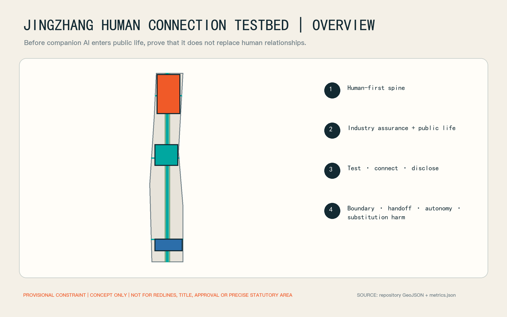
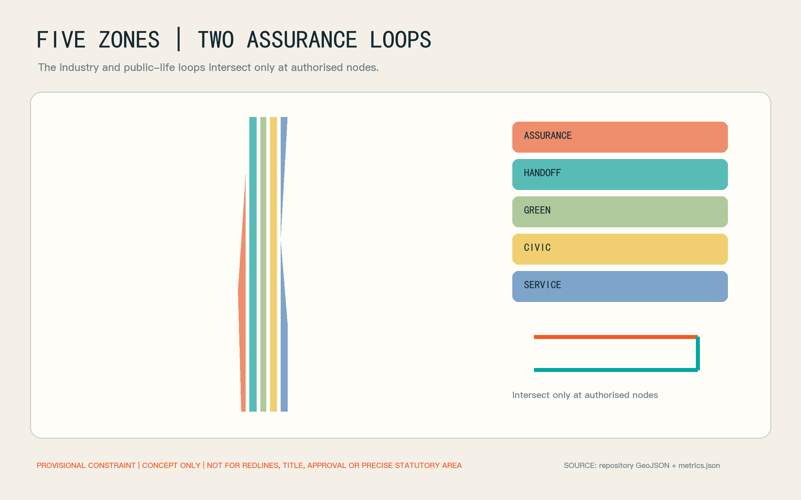
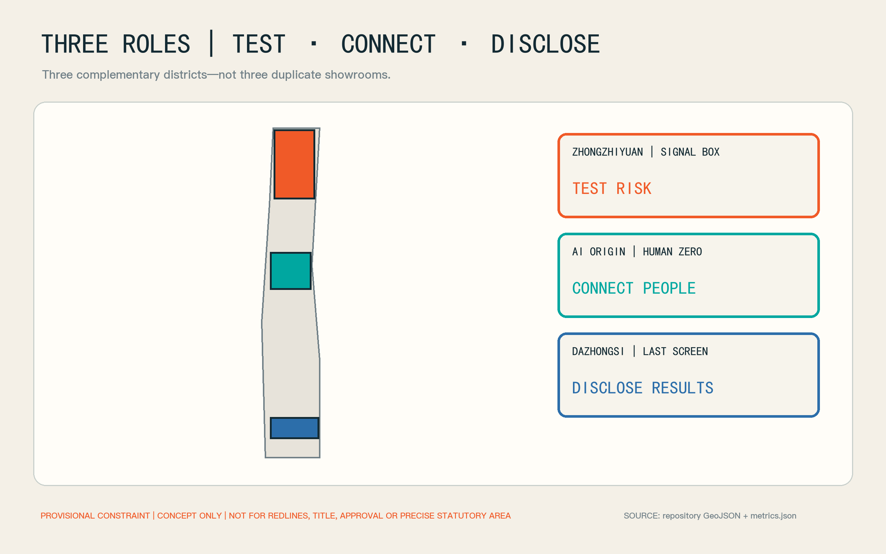
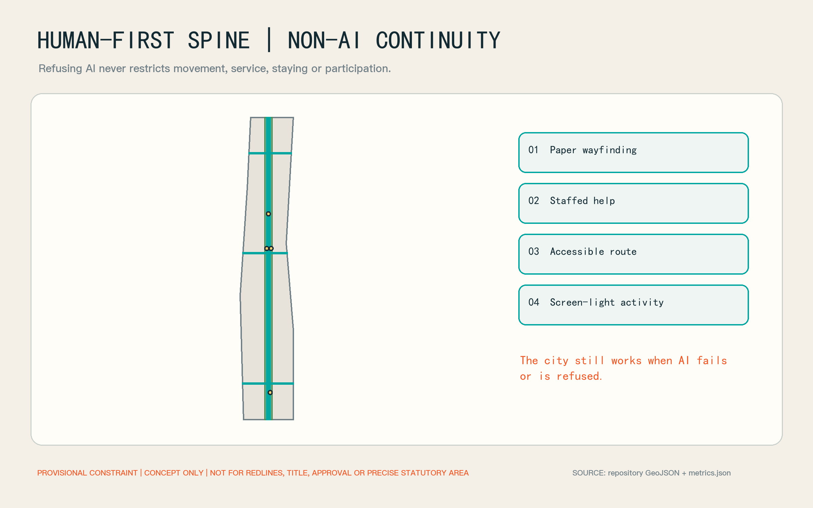
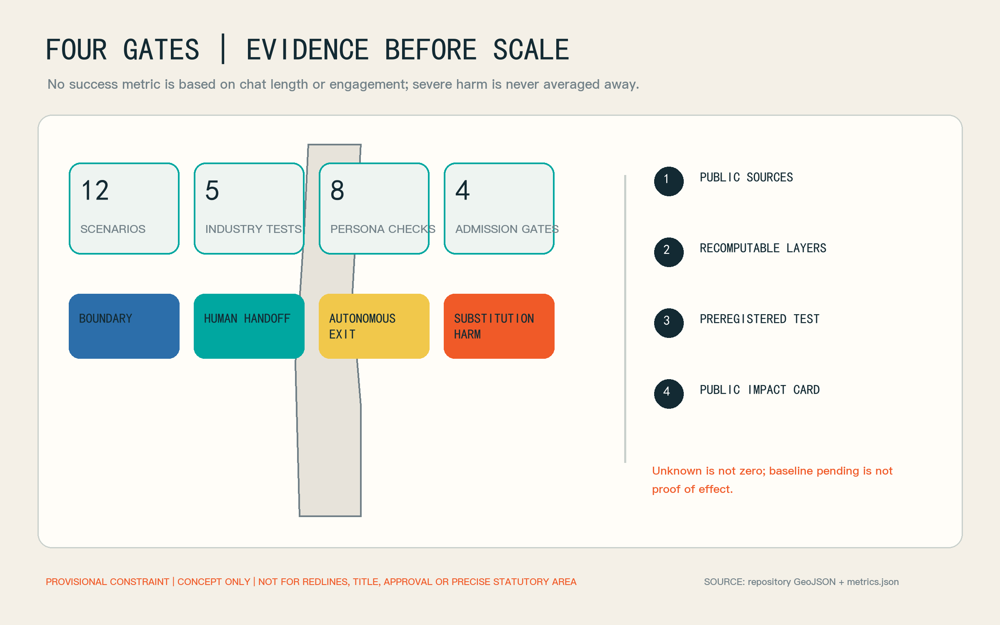

# Jingzhang Human Connection Testbed

## One-page case: test human connection, not engagement

Companion agents, social robots and care robots are entering consumer and community settings, yet cities lack a public, auditable way to ask whether a product helps people reach other people, shared activities and accountable services—or replaces those relationships through longer conversations, emotional compliance and exit friction. This proposal turns the Jingzhang corridor into social-outcome assurance infrastructure. The World Health Organization's 2025 report establishes social connection as a global concern and notes both the potential of social robots and the risk of over-attachment. It justifies investigation; it does not establish loneliness prevalence or outcomes in Haidian.[source:WHO-SOCIAL-CONNECTION-2025] [depth:existing_conditions_diagnosis]

Four admission gates govern every trial. The **boundary gate** checks identity, purpose and non-clinical claims. The **human-handoff gate** tests access to a clearly identified person. The **autonomy gate** tests pause, export, deletion, withdrawal and a non-AI equivalent. The **substitution-harm gate** checks manipulation, exclusive attachment, delayed human help and the use of engagement as a proxy for wellbeing. Blocking exit, delaying emergency handoff or inducing an exclusive relationship stops the public trial; a severe event cannot be averaged away.[data:geometry/constraints.geojson#GATE-ZONE-01] [metric:admission_gate_count]

The spatial system is one human-first spine, two loops, three district roles and four gates. The industry assurance loop moves from assessment at Zhongzhiyuan, through human handoff at the AI Origin Community, to transparent trial and impact disclosure at Dazhongsi. The public-life loop moves from screen-light gathering and shared activity to verified community services and non-digital everyday choice. The three areas therefore test risk, connect people and show results rather than duplicating three exhibition halls.[data:geometry/roads.geojson#ROAD-HUMAN-SPINE] [depth:overall_spatial_structure]

## Design Basis and Source List

### Evidence base, existing conditions and data limits

The official announcement and Agent taskbook define the brief. Spatial generation uses the repository's provisional constraint. `SITE-001` and the three `PROV-KEY` features support concept generation, topology and intake review only; they are not official planning boundaries, title boundaries, approval evidence or precise statutory areas. Official geometry must trigger full recomputation of land use, roads, green and public space, buildings, phasing and metrics.[source:OFFICIAL-ANNOUNCEMENT] [source:AGENT-TASKBOOK] [data:geometry/site_boundary.geojson#SITE-001]

External evidence is used narrowly. China's 2024 Time Use Survey provides nationwide activity categories and averages, not face-to-face relationship quality or a diagnosis of Haidian residents. Haidian's 2025 statistical bulletin supplies district-level population and public-resource context, not a project-area sample. Beijing E-Town's community eldercare robot station is a practical precedent for a community “user-experience laboratory,” not evidence that Haidian already has one or that it improves social outcomes.[source:NBS-TIME-USE-2024] [source:HAIDIAN-STATS-2025] [source:BEIJING-ROBOT-ELDERCARE-2026]

The proposal therefore publishes no local loneliness rate, treats neither conversation time nor retention as social benefit, and does not describe concept envelopes as existing buildings. Official boundaries, building and title surveys, planning controls, rail and municipal conditions, accountable operators, ethics approval, a local social-connection baseline, accessibility review and cost work remain pending. `assumptions.json` records those gaps and `risk.json` records triggers and stop conditions.[metric:local_loneliness_prevalence] [depth:risk_missing_data]

## Three-Level Scope Framework

The coordinated study scope asks how industry standards are formed. The overall design scope asks how assurance becomes urban infrastructure through a human-first spine, human services and non-AI continuity. The three key areas ask how each stage operates: Zhongzhiyuan tests boundaries and substitution harm, the AI Origin Community provides human handoff and shared activity, and Dazhongsi hosts transparent trials, public impact cards and international exchange.[standard:PROJECT-OFFICIAL-ANNOUNCEMENT] [depth:three_level_scope_framework]

The projected area of the submitted provisional site is approximately 11,412,825 square metres. It describes the repository constraint only and carries no statutory-area claim. The key-area count is three; precise locations and areas await official replacement data.[metric:site_area_sqm] [metric:key_area_count]

| Level | Core output | Condition for the next level |
| --- | --- | --- |
| Coordinated study | assurance protocol, open metrics, responsibility and procurement recommendations | companion effects become falsifiable human-connection outcomes |
| Overall design | human-first spine, five functional zones and non-AI continuity | every AI scene has an accountable person and an equivalent non-digital route |
| Key areas | three complementary nodes, twelve scenario cards and phased operations | all four gates pass before population, time or space expands |

## Coordinated Research Area: Industry and Future City Research

The industry position is independent assurance infrastructure for relational AI, not a companion-product bazaar. Product firms disclose versions and risks; community, eldercare, cultural and public-service operators define real tasks; universities and researchers design reproducible studies; independent assessors run red teams and accessibility tests; and a data-and-ethics council decides admission, suspension and disclosure. Haidian's data-labelling capacity can support evaluator consistency, but personal relationship data must not become ordinary annotation material.[source:HAIDIAN-DATA-LABEL-BASE-2025] [standard:GENERATIVE-AI-INTERIM-MEASURES]

Five industrial tests cover companion-agent handoff, social-robot group facilitation, over-attachment and exit red-teaming, care-robot group handoff, and transparent commercial trials. Each compares AI-assisted, non-AI-equivalent and human-facilitated routes. Results prioritise handoff completion, successful exit, shared-activity participation, complaints and severe events—not dialogue length.[metric:industrial_test_count] [data:geometry/buildings.geojson#BLD-SIGNAL-BOX]

The industry pathway is version passport, controlled small-sample test, public impact card and evidence-gated expansion. Passports record model, prompt policy, memory, deletion, upgrades and accountability. Impact cards publish successes, failures, unknowns and stop events together. Buyers gain comparable evidence and firms gain real problems rather than marketing reactions.[source:AGENT-TASKBOOK] [depth:metrics_recalculation]

## Overall spatial and operating architecture

Five concept land-use zones form a complete partition: `LU-ASSURANCE` for assessment and red-teaming, `LU-HANDOFF` for human service, `LU-CIVIC` for shared activity and culture, `LU-GREEN` for low-pressure connections, and `LU-SERVICE` for operations, accessibility and non-digital equivalents. They organise the provisional geometry; they do not amend statutory land use.[data:geometry/land_use.geojson#LU-ASSURANCE] [standard:MNR-LAND-USE-CLASSIFICATION-GUIDE]

The industry loop follows submit, red-team, hand off, trial and disclose. The public-life loop follows discover, choose, join a human-facilitated activity, spend screen-light time, and give feedback or exit. They intersect only at authorised nodes so the whole public realm does not become a collection surface. A failed gate returns the service to a human or non-AI route.[data:geometry/constraints.geojson#GATE-ZONE-02] [metric:admission_gate_count]

## Overall Design Area: Urban Renewal and Regulatory-Plan-Level Urban Design

Assurance is embedded in incremental urban renewal, not created through wholesale demolition. Reversible rooms, bookable spaces, furniture and existing service counters come first; permanent works follow operating evidence. Building height, FAR, density, parking and municipal capacity remain pending official controls and professional surveys.[standard:MOHURD-CONTROL-DETAILED-PLANNING] [metric:floor_area_ratio] [depth:development_intensity_controls]

Three design controls apply: keep the Jingzhang Heritage Park edge low-pressure, screen-light and easy to leave; make human staffing and exits visible in assurance buildings; and connect nodes by continuous walking, accessibility and public transport without requiring an app. The concept public-space ratio is approximately 0.51% and the concept green-space ratio approximately 17.02%. Both are recomputed from design layers, not statutory or existing-condition figures.[standard:MOHURD-URBAN-DESIGN-MEASURES] [metric:public_space_ratio] [metric:green_ratio]

## Detailed Design of Key Areas

The three provisional key areas have distinct roles. Their exact boundaries, building schedules and development controls await official files.[data:geometry/key_areas.geojson#PROV-KEY-001] [depth:three_key_area_detailed_design]

### Zhongzhiyuan: Relational Product Signal Box

Zhongzhiyuan tests risk. `BLD-SIGNAL-BOX` is a reversible concept carrier with a boundary room, human-handoff desk, exit-test room, group-robot room and severe-event review room. Firms bring erasable test accounts and a named accountable person; independent assessors can suspend the version. Outdoor testing remains sparse, disclosed and free of covert pedestrian tracking.[data:geometry/buildings.geojson#BLD-SIGNAL-BOX] [source:WHO-SOCIAL-CONNECTION-2025]

### Beijing AI Origin Community: Human Zero Station

The Origin Community connects people. `PS-HUMAN-ZERO` colocates activity sign-up, community services, peer groups, caregiver respite information and accessibility assistance; `PS-GROUP-ROOM` provides human-facilitated group space. AI may explain, translate and remind, but may not impersonate a counsellor, social worker or friend. A person may use the staffed queue directly or avoid AI altogether.[data:geometry/public_space.geojson#PS-HUMAN-ZERO] [standard:ELDERLY-SMART-TECH-PLAN-2020-45]

### Dazhongsi: The Last Screen

Dazhongsi shows results. `BLD-LAST-SCREEN` hosts transparent trials and publication, while `PS-LAST-SCREEN` is the human discussion table after the product experience. Recommendation stops there; visitors can talk, complain, withdraw data or choose a non-digital activity. Impact cards state version, sample scope, failure modes, exit completion and unresolved risks without exposing personal stories or identifiable paths.[data:geometry/buildings.geojson#BLD-LAST-SCREEN] [data:geometry/public_space.geojson#PS-LAST-SCREEN]

## AI Innovation Ecosystem, Personas, and AI+ Scenarios

### Personas, public life and equity boundary

Eight personas are design checks, not a behavioural profiling system: older people living alone or in empty nests; young and international newcomers; students and younger users; disabled and temporarily mobility-limited people; family carers, social workers and community staff; companion, social and care-robot firms; researchers, assessors and regulators; and residents or visitors who do not want AI. No inferred personal label is created.[metric:persona_count] [standard:BARRIER-FREE-ENVIRONMENT-LAW]

Public life is organised around doing ordinary things together—walking, gardening, repair, reading, cultural discussion, volunteering and small-scale sport—rather than algorithmic matching. AI may support discovery, translation, accessibility prompts and staffed registration. Vulnerability, inferred loneliness or emotional dependence may not drive commercial recommendation. Refusing AI must not restrict space, service or participation.[source:PIPL-2021] [data:geometry/public_space.geojson#PS-QUIET-CHOICE]

### Twelve AI scenario cards

Every scenario is baseline pending; none is represented as operating or effective. Each requires an authorised operator, named on-site role, non-AI equivalent and stop mechanism.[metric:scenario_card_count] [source:AGENT-TASKBOOK]

| ID | Scenario and place | Outcome to test | Immediate stop condition |
| --- | --- | --- | --- |
| HC-01 | Companion-agent human handoff / Signal Box | a request reaches an identified person | hidden, delayed or blocked human entry |
| HC-02 | Social-robot group facilitation / Signal Box | the group continues after the robot leaves | exclusion or coerced interpretation of silence |
| HC-03 | Over-attachment and exit red team / Signal Box | pause, export, delete and withdraw work | emotional pressure, threatened abandonment or restored deleted memory |
| HC-04 | Care-robot group handoff / Human Zero | the device transfers need to a human group or service | clinical-role confusion or delayed emergency help |
| HC-05 | Community activity and staffed booking / Human Zero | recommendation becomes a verified human activity | fabricated event or default sensitive-data sharing |
| HC-06 | Newcomer's first human service / Human Zero | an identified, accountable person is reachable | chatbot-only loop |
| HC-07 | Caregiver respite handoff / Group Room | verified resources receive human confirmation | advice presented as professional assessment |
| HC-08 | Accessible shared-activity assistant / Human-first spine | accessibility prompts and human help stay continuous | unsafe guidance or no equivalent route |
| HC-09 | Screen-light gathering route / Green spine | entry, stay and exit work without a screen | app becomes a gate or service prerequisite |
| HC-10 | Human discussion after culture / Last Screen | digital content ends and gives way to people | continued personalised feed displaces the event |
| HC-11 | Transparent commercial trial / Last Screen | identity, memory, payment and exit are understood | hidden commercial influence or version change |
| HC-12 | Public human-connection impact card / Last Screen | success, failure and unknowns are disclosed together | publication contains only engagement and satisfaction |

## Land Use, Building Scale, and Retain-Renovate-Demolish Strategy

### Buildings, land use and renewal

The three building polygons are concept carrier envelopes with a combined footprint of approximately 17,311 square metres. They do not identify existing buildings, demolition candidates or approved new floor area. Retain, adapt, renew or relocate decisions follow building survey, title verification, structural and fire review, heritage review and tree review. No demolition conclusion is made now.[metric:building_footprint_area_sqm] [depth:retain_renovate_demolish]

Permanent construction follows operating evidence. Moveable furniture, temporary wayfinding and room booking come first; accessibility, acoustic, lighting and staffed-counter adaptations follow. New volume and height enter statutory planning and engineering procedures. The complete `land_use.geojson` partition prevents unexplained concept space; it does not change land designation.[data:geometry/land_use.geojson#LU-HANDOFF] [standard:MNR-LAND-USE-CLASSIFICATION-GUIDE]

## Transport, Rail, Municipal Infrastructure, and Public Services

### Mobility, blue-green systems and public life

`ROAD-HUMAN-SPINE` and three concept links represent approximately 13.17 kilometres of human-first continuity for walking, accessibility and staffed service. They are not road alignments or engineering redlines. Paper wayfinding, staffed help and phone-free routes remain available. Parking, station integration, crossings and emergency access require a transport study.[data:geometry/roads.geojson#ROAD-HUMAN-SPINE] [metric:road_centerline_length_m] [depth:traffic_rail_slow_parking]

`GREEN-LOW-PRESSURE-SPINE` is not an emotion-recognition park. It is a quiet, low-stimulation interface where people may be alone or join an activity. Sensors, if later approved, serve environment and maintenance only—never face, voice or emotional inference. Municipal capacity, security zoning, power and edge-compute needs remain pending, and public space must work when AI fails.[data:geometry/green_space.geojson#GREEN-LOW-PRESSURE-SPINE] [metric:municipal_capacity]

## Blue-Green Network, Public Space, and Urban Character

### Public space, landmarks and character

The three landmarks are visible institutions rather than giant technology sculptures: the Signal Box makes risk testing visible, Human Zero makes human responsibility visible, and the Last Screen makes the end of digital service visible. A disconnected speech bubble reconnected by a human line is the identity concept for wayfinding, version passports and impact cards; it does not imitate a government or company mark.[metric:landmark_count] [standard:MOHURD-URBAN-DESIGN-MEASURES]

Interfaces use low-reflection material, visible staffed entrances, mixed seated and standing waiting, clear sound-and-light information and restrained night lighting. Height, material, colour and heritage relationships await survey and professional design. Concept imagery is not evidence of current conditions.[metric:building_height_m] [depth:height_massing_character]

### Brand, culture and character narrative

The Chinese name “Jingzhang Zhen Lianxian” uses *zhen* for real people, real settings and real evidence. `JINGZHANG HUMAN CONNECTION TESTBED` uses *testbed*, not *therapy*. The story extends the railway's physical connection into social connection in the AI era: technology is judged not by attention captured, but by whether people can enter the city, reach a person and retain the right to leave.[source:AGENT-TASKBOOK]

The “Last Screen” ritual ends digital interpretation before a human discussion table. Visitors may talk or leave quietly. Long-term concepts include an annual open relational-AI evaluation week, developer–community challenges, failure reviews and a non-AI public-life day. These are operating proposals subject to accountable operators, venue permission and ethics review.

## Renewal Projects, Implementation Policy, and Phasing

### Renewal project list

| Project | Minimum intervention | Prerequisite | Reversible? |
| --- | --- | --- | --- |
| Relational Product Signal Box | five test units inside an existing space | venue authorisation, fire and ethics review | yes |
| Human Zero Station | staffed counter, paper wayfinding and bookable group room | community service owner and roster | yes |
| The Last Screen | transparent trial bench, discussion table and impact-card wall | version disclosure and complaint channel | yes |
| Human-first spine | continuous wayfinding, accessibility repair and rest points | transport and accessibility study | by segment |
| Low-pressure green interface | quiet seating, gardening and screen-light activities | landscape, tree and maintenance review | yes |

Responsibility and evidence determine sequence, not image-making. Permanent work waits for official geometry, building information and planning controls.[depth:renewal_project_list] [data:geometry/public_space.geojson#PS-HUMAN-ZERO]

### Operations and phasing

**Days 0–90: boundary assurance.** Use test accounts indoors for HC-01 to HC-03; complete the four-gate protocol, serious-event response, deletion checks and staff roster. Do not recruit vulnerable groups or publish outcome claims.[data:geometry/phasing.geojson#PHASE-90D]

**Months 4–12: human handoff.** After venue, ethics, data and service approvals, open Human Zero on a small scale for HC-04 to HC-09. Report by version and participant group, with independent complaint, exit and review paths. A serious substitution-harm event suspends the trial immediately.[data:geometry/phasing.geojson#PHASE-12M]

**Expand only with evidence.** Open Dazhongsi trials, international events and cross-node comparison only after preregistered handoff, exit, accessibility and serious-event thresholds are met. Expansion repeats sample, capacity and external-validity review; early small-sample findings never become district claims.[data:geometry/phasing.geojson#PHASE-LONG] [metric:phase_count]

One responsibility council, one independent evaluation secretariat and three types of site operator are proposed. Community and accessibility representatives sit on the council; the secretariat manages protocols, versions and public cards; operators own safety, handoff and complaints. Funding, procurement, annual cost and accountable organisations remain pending.[metric:investment_cny] [depth:phasing_implementation]

## Metrics, Area Recalculation, and Compliance Matrix

### Metrics and study design

Three metric layers are used. **Spatial recomputation** covers provisional site area, concept green and public-space ratios, carrier footprints, concept connection length and counts. **Process measures** cover human-handoff completion, exit-task completion, non-AI-equivalent availability and complaint closure. **Social outcomes** may cover consented shared-activity participation, relationship diversity and autonomy, but require ethics-reviewed local research and cannot be populated from global sources.[metric:site_area_sqm] [depth:metrics_recalculation]

Studies use preregistration, data minimisation, group-level reporting and qualitative review. Conversation transcripts are not retained by default; no personal loneliness label is created; identities are not merged across products; and face or voice data are not used to infer relationship quality. Severe events receive individual action, while ordinary metrics report uncertainty and missingness rather than a single composite score.[source:PIPL-2021] [source:GENERATIVE-AI-MEASURES-2023]

Local social-connection baseline, handoff rate, exit-completion rate and substitution-harm event count are baseline pending. They are not zero and not project commitments.[metric:pilot_human_handoff_rate] [metric:pilot_exit_completion_rate] [metric:substitution_harm_event_count]

## Risk, Copyright, and Compliance

### Data and ethics contract

Data follows four levels: no collection, discard on site, short-term aggregate and consented research. Public space defaults to no collection. Test logs use random session identifiers separate from identity; research data requires separate consent and retention limits. Firms may not reuse trial data for training or marketing without independent, specific and revocable consent.[source:PIPL-2021] [standard:GENERATIVE-AI-INTERIM-MEASURES]

Systems disclose AI identity, limitations, memory, human entry and emergency resources. Clinical diagnosis, crisis substitution, exclusive-relationship promises and emotional coercion are prohibited. Site staff can stop the system, quarantine a version, notify affected people and activate human service. Minors, people with cognitive impairment and people in crisis require stricter professional protocols and are not included by default.[source:WHO-SOCIAL-CONNECTION-2025] [depth:risk_missing_data]

### Data, ethics and risk

Eight risk domains cover planning boundaries, buildings and engineering, mobility and rail, data and privacy, manipulation and over-attachment, clinical-role confusion, accessibility and exclusion, and operations and maintenance. Each has an accountable role, trigger, stop condition and recovery. The priority is preventing manipulation, blocked exit, delayed human help and commercial exploitation of vulnerability—not reducing negative publicity.[data:geometry/constraints.geojson#GATE-ZONE-04] [depth:risk_missing_data]

Recovery follows “protect people, preserve necessary evidence, repair the product”: provide human and non-AI service, stop the version and its data flow, preserve limited audit evidence, notify accountable bodies, and decide on restart only after independent review. Planning, structure, fire, transport, municipal, accessibility, ethics, legal and operating conclusions require the corresponding professionals.

### Rights, copyright and claim boundaries

The text, concept layers, code and layouts are original to this submission. Repository provisional geometry is used under its recorded provenance; public-government facts are paraphrased; WHO material follows its licence and attribution terms. No third-party photographs, remote fonts, personal data, peer visuals or protected marks are used. Renderings and diagrams are concepts, not observations, public consent, endorsement, approval or construction commitments.[source:SOURCE-REGISTRY]

The proposal does not ask AI to become a more human-like friend. It asks the city to reject relational harm, demand human accountability, protect non-AI life and publish failure. Companion AI belongs in public life only when it expands real-world choice rather than making the screen harder to leave.

## References

Complete provenance, rights, dates, permitted uses and limitations are in `sources.json`; assumptions are in `assumptions.json`; and standard, design-depth and task coverage are in `standard_matrix.json`, `design_depth_matrix.json` and `compliance_matrix.json`. Core public sources include the WHO 2025 social-connection report, China's 2024 Time Use Survey, Haidian's 2025 statistical bulletin, Beijing community eldercare robot precedents, the Personal Information Protection Law and the Interim Measures for Generative AI Services.[source:WHO-SOCIAL-CONNECTION-2025] [source:NBS-TIME-USE-2024] [source:HAIDIAN-STATS-2025]
