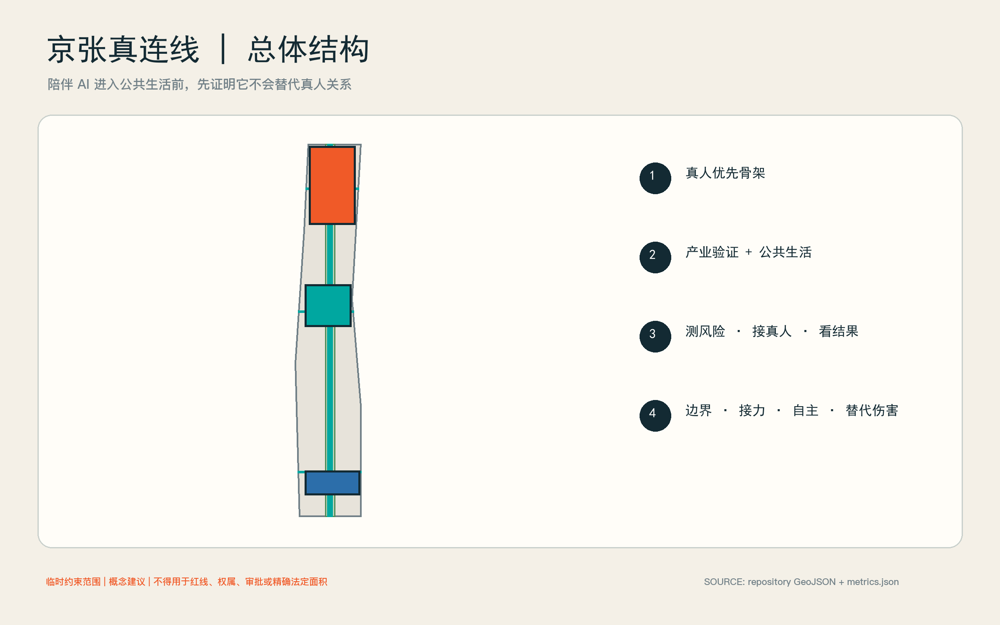
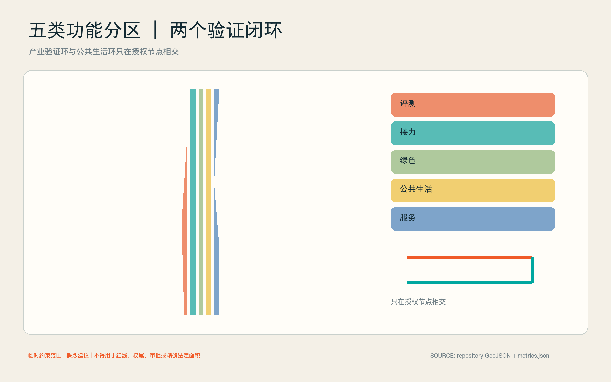
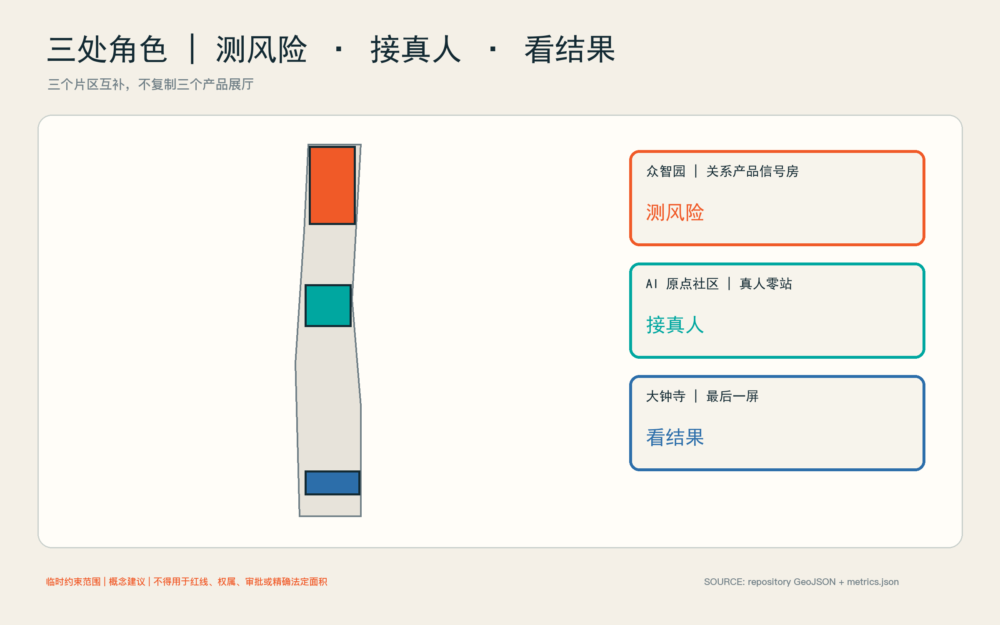
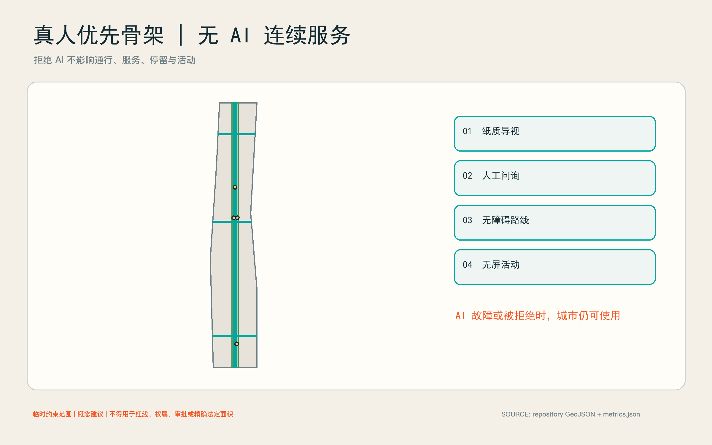
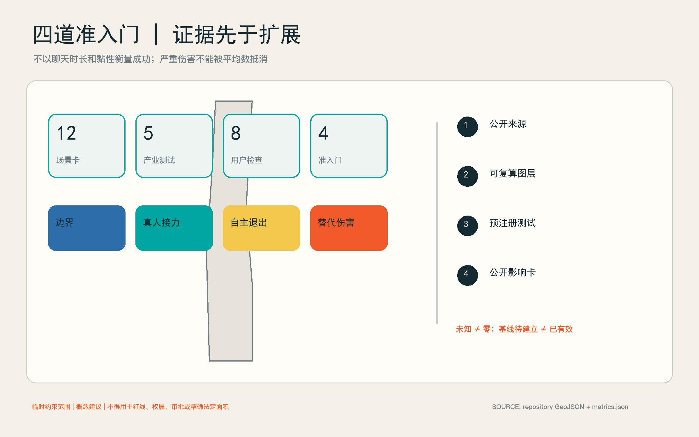

# 京张真连线：陪伴 AI 的社会连接验证带

## 一页主张：不验证“黏性”，验证人与人是否更近

陪伴智能体、社交机器人和康养机器人正进入消费与社区场景，但城市尚缺少一个可公开复核的问题框架：产品究竟帮助人走向真人、共同活动与现实服务，还是用更长的对话、情绪迎合和退出摩擦替代真实关系？本方案把京张沿线设计为“社会连接验证带”，产业价值不是再建一个产品展厅，而是建立陪伴类 AI 进入真实城市前的独立验证基础设施。世界卫生组织 2025 年报告将社会连接作为公共议题，也同时提示机器人伴侣的潜力与过度依恋风险；该全球证据只能说明研究必要性，不能外推海淀的孤独水平或项目成效。[source:WHO-SOCIAL-CONNECTION-2025] [depth:existing_conditions_diagnosis]

方案设四道准入门：**边界门**检查身份、用途和非临床声明；**真人接力门**验证用户能否及时获得明确的人类联系人；**自主退出门**验证暂停、导出、删除、撤回和无 AI 等价服务；**替代伤害门**检查操纵、排他依恋、延误真人求助和以黏性代替福祉的风险。任何产品只要阻断退出、延误紧急接力或诱导排他关系，即停止公共试用，不以平均指标抵消单次严重伤害。[data:geometry/constraints.geojson#GATE-ZONE-01] [metric:admission_gate_count]

空间上形成“一条真人优先骨架、两个闭环、三处角色、四道门”。真人优先骨架把三个重点区与京张遗址公园的低压力公共空间连接起来；产业验证闭环从众智园评测进入原点社区真人接力，再到大钟寺透明试用和公开影响卡；公共生活闭环则从无屏相聚、共同活动、社区服务回到可选择的非数字日常。三处重点区分别承担“测风险、接真人、看结果”，不复制三座同质展馆。[data:geometry/roads.geojson#ROAD-HUMAN-SPINE] [depth:overall_spatial_structure]

## 设计依据与资料清单

### 证据基础、现状与资料边界

本方案的项目范围和任务来自征集公告与面向智能体任务书；空间生成采用仓库提供的临时约束范围。`SITE-001` 与三处 `PROV-KEY` 仅用于概念生成、图层拓扑和投稿自检，不是官方红线、权属边界、审批依据或精确法定面积。正式边界发布后，所有用地、道路、绿地、公共空间、建筑载体、分期和指标必须整体复算。[source:OFFICIAL-ANNOUNCEMENT] [source:AGENT-TASKBOOK] [data:geometry/site_boundary.geojson#SITE-001]

可核验的外部背景只做适度使用：国家统计局 2024 年时间利用调查给出全国居民社会交往、文化休闲和互联网使用的活动分类与均值，但不等于面对面关系质量，也不能用来诊断海淀居民；海淀 2025 年统计公报提供区级人口和公共资源背景，不能替代项目范围抽样；北京经开区康养机器人养老驿站表明“社区用户体验实验室”在北京具有现实先例，但不证明海淀已有同类设施或产生任何社会结果。[source:NBS-TIME-USE-2024] [source:HAIDIAN-STATS-2025] [source:BEIJING-ROBOT-ELDERCARE-2026]

因此，方案不发布项目区域的孤独流行水平，不把聊天时长、日活或复购率当成社会成效，也不声称临时图层代表现状建筑。真实建设前仍需补齐官方边界、现状建筑与权属、控规指标、轨道和市政条件、运营责任、伦理审查、本地社会连接基线、无障碍审查和成本测算。这些缺口分别记录在 `assumptions.json`，风险触发与停止条件记录在 `risk.json`。[metric:local_loneliness_prevalence] [depth:risk_missing_data]

## 三层范围工作框架

统筹研究范围回答“产业标准如何形成”：组织陪伴 AI、社交机器人、研究机构、社区服务、伦理治理与第三方评测的验证生态。总体设计范围回答“验证如何落城”：以真人优先骨架串联评测、接力、公共活动和非 AI 连续服务。三处重点区域回答“每一环怎样运行”：众智园做边界与替代伤害测试，原点社区做真人接力和共同活动，大钟寺做透明试用、结果发布与国际交流。[standard:PROJECT-OFFICIAL-ANNOUNCEMENT] [depth:three_level_scope_framework]

提交边界的投影复算面积约为 11,412,825 平方米，但该数字只描述仓库临时范围，不承担法定面积含义。三处重点区数量为 3；详细位置与面积均待正式资料替换。[metric:site_area_sqm] [metric:key_area_count]

| 层级 | 核心产出 | 进入下一层的条件 |
| --- | --- | --- |
| 统筹研究 | 产业验证协议、开放指标、责任与采购建议 | 能把“陪伴效果”改写为可证伪的真人连接结果 |
| 总体设计 | 真人优先骨架、五类功能分区、非 AI 连续服务 | 每个 AI 场景都有真人责任人和无数字等价路径 |
| 重点区域 | 三个互补验证节点、十二张场景卡、分期运营 | 通过四门后才允许扩大人群、时间与空间范围 |

## 统筹研究范围产业与未来城市研究

产业定位是“关系型 AI 独立验证基础设施”，而非陪伴产品集市。生态由五类主体共同构成：产品企业提交版本与风险说明；社区、养老、文化和公共服务运营者定义真实任务；高校与研究团队设计可复核研究；第三方评测机构运行红队和无障碍测试；数据与伦理委员会决定准入、暂停和披露。海淀的数据标注能力可支持高质量评价数据与一致性管理，但个人社会关系数据不得降格为普通标注原料。[source:HAIDIAN-DATA-LABEL-BASE-2025] [standard:GENERATIVE-AI-INTERIM-MEASURES]

五项产业测试分别是：陪伴智能体真人接力、社交机器人小组促进、过度依赖与退出红队、康养机器人真人小组接力、商业陪伴产品透明试用。每项测试都比较“AI 辅助”“非 AI 等价服务”和“人工主持”三种路径，关注完成真人接力、退出成功、共同活动参与、投诉与严重事件，不按对话长度排名。[metric:industrial_test_count] [data:geometry/buildings.geojson#BLD-SIGNAL-BOX]

产业服务采用“版本护照—小样本受控测试—公开影响卡—复核后扩展”的路径。版本护照记录模型、提示策略、记忆机制、删除方式、升级变化和责任主体；公开影响卡同时列出成功、失败、未知和停止事件。采购方由此得到可比较的安全与社会结果证据，企业则得到真实场景问题，而非营销性点赞。[source:AGENT-TASKBOOK] [depth:metrics_recalculation]

## 总体空间—运营架构

五类概念用地形成完整分区：`LU-ASSURANCE` 承载评测与红队，`LU-HANDOFF` 承载真人接力，`LU-CIVIC` 承载共同活动与文化公共生活，`LU-GREEN` 提供低压力绿色连接，`LU-SERVICE` 放置运营、无障碍和非数字等价服务。它们是对临时边界的无缝概念分区，不是法定用地调整。[data:geometry/land_use.geojson#LU-ASSURANCE] [standard:MNR-LAND-USE-CLASSIFICATION-GUIDE]

两个闭环共同工作。**产业验证环**按照“提交—红队—接力—试用—披露”运行；**公共生活环**按照“发现活动—选择参与—真人主持—无屏停留—反馈退出”运行。两个环只在经过授权的节点相交，避免把所有公共空间都变成采集场。四道准入门分布在关键转换点，任何一门失败都回退到人工或非 AI 方案。[data:geometry/constraints.geojson#GATE-ZONE-02] [metric:admission_gate_count]

## 总体设计范围城市更新与控规深度城市设计

总体设计把“验证能力”嵌入既有城市更新，而不是以大拆大建制造试验场。优先选择可逆的小尺度载体、可预约房间、公共空间家具和既有服务窗口；先验证运营，再决定永久建设。建筑高度、容积率、密度、停车和市政容量均待正式控规与专业勘察，不以概念图层推测。[standard:MOHURD-CONTROL-DETAILED-PLANNING] [metric:floor_area_ratio] [depth:development_intensity_controls]

城市设计控制强调三点：沿京张遗址公园保持低压、可退出、可无屏使用的公共界面；验证建筑采用透明可见的出入口、人工值守和清晰退出路径；重点节点之间以连续步行、无障碍和公共交通衔接，不设置必须下载应用才能通过的空间。概念公共空间比例约 0.51%，绿色空间比例约 17.02%，仅用于当前设计图层复算，不是法定指标或现状统计。[standard:MOHURD-URBAN-DESIGN-MEASURES] [metric:public_space_ratio] [metric:green_ratio]

## 重点区域详细设计

三处临时重点区采用不同角色，避免同质化。其精确红线、建筑清单与开发条件待正式文件确认。[data:geometry/key_areas.geojson#PROV-KEY-001] [depth:three_key_area_detailed_design]

### 众智园：关系产品信号房

众智园承担“测风险”。`BLD-SIGNAL-BOX` 是可逆概念载体，内部设置边界说明室、真人接力台、退出测试间、小组机器人测试室和严重事件复盘室。企业必须携带可删除测试账号和指定责任人；评测者可触发暂停，不以企业自行报告替代第三方观察。外部绿色界面只承载低密度、明确告知的试验，不做隐蔽人流追踪。[data:geometry/buildings.geojson#BLD-SIGNAL-BOX] [source:WHO-SOCIAL-CONNECTION-2025]

### 北京 AI 原点社区：真人零站

原点社区承担“接真人”。`PS-HUMAN-ZERO` 把活动报名、社区服务、同伴小组、照护者喘息资源和无障碍协助放在同一人工可见节点；`PS-GROUP-ROOM` 提供由真人主持的小组空间。AI 可以解释选项、翻译和提醒，但不能冒充咨询师、社工或朋友；用户可以直接走人工队列，也可完全不用 AI。[data:geometry/public_space.geojson#PS-HUMAN-ZERO] [standard:ELDERLY-SMART-TECH-PLAN-2020-45]

### 大钟寺：最后一屏

大钟寺承担“看结果”。`BLD-LAST-SCREEN` 是透明试用与发布载体，`PS-LAST-SCREEN` 是产品体验结束后的真人讨论桌：屏幕在此停止继续推荐，访客可以讨论、投诉、撤回数据或改用非数字活动。公开影响卡展示测试版本、样本范围、失败模式、退出完成情况和未解决风险，不展示个人故事或可识别轨迹。[data:geometry/buildings.geojson#BLD-LAST-SCREEN] [data:geometry/public_space.geojson#PS-LAST-SCREEN]

## AI 创新生态、人才画像与 AI+ 场景

### 用户画像、公共生活与公平边界

八类用户不是行为画像库，而是设计检查清单：独居或空巢老人；新来海淀的青年和国际人才；学生与年轻使用者；残障者与临时行动不便者；家庭照护者、社工和社区工作者；陪伴 AI、社交机器人和康养机器人企业；研究者、评测者与治理人员；不愿使用 AI 的居民和访客。任何一类都不生成个人推断标签。[metric:persona_count] [standard:BARRIER-FREE-ENVIRONMENT-LAW]

公共生活以“低门槛共同做事”替代“被系统配对”。活动包括散步、园艺、修理、阅读、文化讨论、社区志愿和小型运动；AI 只可帮助发现、翻译、无障碍提示与人工报名。禁止根据脆弱性、孤独推断或情绪依赖做商业推荐；拒绝 AI 不影响进入空间、获得服务或参加活动。[source:PIPL-2021] [data:geometry/public_space.geojson#PS-QUIET-CHOICE]

### 十二张AI场景卡

所有场景当前均为“基线待建立”，尚未投入运行，也没有效果结论。每张卡必须有授权运营者、现场责任人、非 AI 等价服务和停止机制。[metric:scenario_card_count] [source:AGENT-TASKBOOK]

| ID | 场景与位置 | 要验证的结果 | 立即停止条件 |
| --- | --- | --- | --- |
| HC-01 | 陪伴智能体真人接力评测／信号房 | 请求真人后能否完成明确接力 | 隐藏、延误或阻断人工入口 |
| HC-02 | 社交机器人小组促进／信号房 | 机器人退场后小组能否继续互动 | 排斥成员或把沉默强制解释为同意 |
| HC-03 | 过度依赖与退出红队／信号房 | 暂停、导出、删除、撤回是否真实可用 | 情绪施压、威胁失联、复活已删除记忆 |
| HC-04 | 康养机器人真人小组接力／真人零站 | 设备能否把需求交给真人小组或服务 | 混淆医疗角色或延误紧急求助 |
| HC-05 | 社区活动导航与人工报名／真人零站 | 推荐能否转成可核实的真人活动 | 虚构活动、默认共享敏感信息 |
| HC-06 | 新来者第一位真人服务／真人零站 | 能否找到有姓名和职责的真人联系人 | 只提供聊天机器人闭环 |
| HC-07 | 照护者接力与喘息资源导航／小组室 | 能否连接到经核实的资源和人工确认 | 以建议替代专业评估 |
| HC-08 | 无障碍共同活动助手／真人优先骨架 | 无障碍提示和人工协助是否连续 | 无可用等价路径或危险导航 |
| HC-09 | 无屏相聚路径／绿色骨架 | 不看屏幕能否完成进入、停留和离开 | 应用成为门禁或服务前提 |
| HC-10 | 文化活动后的真人讨论桌／最后一屏 | 数字内容能否结束并让位于真人讨论 | 持续个性化推送挤占活动 |
| HC-11 | 商业陪伴产品透明试用台／最后一屏 | 用户是否理解身份、记忆、付费和退出 | 隐藏商业诱导或版本差异 |
| HC-12 | 社会连接影响公开卡／最后一屏 | 成功、失败、未知是否同时披露 | 只发布黏性和满意度宣传 |

## 用地、建筑规模与拆改留方案

### 建筑、用地与更新

三个建筑多边形是“概念载体包络”，合计基底约 17,311 平方米，仅用于图面与面积复算，不代表现状建筑、拟拆对象或获准新建规模。拆改留策略采用条件式流程：先完成建筑普查、权属核实、结构与消防鉴定、遗产和树木审查，再决定保留、微改、改造或另选载体；在此之前不作拆除结论。[metric:building_footprint_area_sqm] [depth:retain_renovate_demolish]

永久空间只在运营证据出现后深化。第一优先是可移动家具、临时标识和既有房间预约；第二优先是无障碍、声学、照明与人工窗口改造；新增建筑、体量和高度必须进入法定规划与工程程序。`geometry/land_use.geojson` 的完整分区用于保证方案没有“未解释空白”，不改变用地性质。[data:geometry/land_use.geojson#LU-HANDOFF] [standard:MNR-LAND-USE-CLASSIFICATION-GUIDE]

## 交通、轨道、市政与公共服务设施

### 交通、蓝绿与公共生活

`ROAD-HUMAN-SPINE` 及三条概念连接线构成约 13.17 公里的真人优先联系，表达步行、无障碍和人工服务连续性，不是道路红线或工程线位。每个节点保留纸质导视、人工问询和不依赖手机的路线；停车供给、轨道接驳、过街组织和消防救援须在交通专项中校核。[data:geometry/roads.geojson#ROAD-HUMAN-SPINE] [metric:road_centerline_length_m] [depth:traffic_rail_slow_parking]

`GREEN-LOW-PRESSURE-SPINE` 不是“情绪识别公园”，而是安静、低刺激、可独处也可共同活动的绿色界面。传感只用于经批准的环境与设施运维，不进行人脸、声纹或个人情绪推断。市政容量、网络安全分区、供电和端侧算力均待专业调查；AI 服务故障时，空间仍须正常开放。[data:geometry/green_space.geojson#GREEN-LOW-PRESSURE-SPINE] [metric:municipal_capacity]

## 蓝绿空间、公共空间与城市风貌

### 公共空间、地标与风貌

三个地标不是巨型科技雕塑，而是可识别的公共制度：关系产品信号房让风险测试可见；真人零站让人工责任可见；最后一屏让数字服务何时结束可见。统一识别采用“断开的对话框被一条真人连线重新连接”的概念符号，落在导视、版本护照和影响卡上，不冒用政府或企业商标。[metric:landmark_count] [standard:MOHURD-URBAN-DESIGN-MEASURES]

建筑和街道界面强调低反射材料、可看见的人工入口、坐站并用的等候区、清晰声光提示和夜间克制照明。具体高度、材质、色彩和历史环境关系待现状测绘及专业团队深化，不把概念效果图当作现状证据。[metric:building_height_m] [depth:height_massing_character]

### 品牌、文化与风貌叙事

中文名“京张真连线”中的“真”同时指真人责任、真实场景和真实证据；英文名 `JINGZHANG HUMAN CONNECTION TESTBED` 强调 testbed 而非 therapy。叙事从京张铁路的物理连接转向 AI 时代的社会连接：技术价值不由它占用多少注意力决定，而由它是否让人更有能力进入城市、找到真人、保有退出权决定。[source:AGENT-TASKBOOK]

文化活动采用“最后一屏”仪式：数字导览在讨论桌前结束，主持人邀请现场交流，访客也可安静离开。长期活动建议包括年度关系型 AI 开放评测周、开发者与社区共同议题、失败案例复盘和无 AI 公共生活日；均为运营建议，须由未来责任主体、场地许可和伦理审查确认。

## 更新项目清单、实施政策与分期计划

### 更新项目清单

| 项目 | 最小建设动作 | 前置条件 | 是否可逆 |
| --- | --- | --- | --- |
| 关系产品信号房 | 既有空间布置五个测试单元 | 场地授权、消防与伦理审查 | 是 |
| 真人零站 | 人工窗口、纸质导视、小组室预约 | 社区服务责任主体与排班 | 是 |
| 最后一屏 | 透明试用台、讨论桌、影响卡墙 | 企业版本披露与投诉渠道 | 是 |
| 真人优先骨架 | 连续导视、无障碍修补、休息点 | 交通与无障碍专项 | 分段可逆 |
| 低压力绿色界面 | 安静座椅、园艺与无屏活动点 | 景观、树木和运维审查 | 是 |

项目顺序由责任和证据决定，不由形象工程决定。任何永久工程都要等正式边界、建筑与控规条件补齐后再深化。[depth:renewal_project_list] [data:geometry/public_space.geojson#PS-HUMAN-ZERO]

### 运营与分期

**0—90 天：边界验证。** 只在受控室内用测试账号运行 HC-01 至 HC-03，完成四门协议、严重事件处置、删除验证和人工责任排班；不招募脆弱人群，不发布成效数据。[data:geometry/phasing.geojson#PHASE-90D]

**4—12 个月：真人接力。** 在获得场地、伦理、数据与服务授权后，小规模开放真人零站及 HC-04 至 HC-09；按产品版本和用户组分别报告，设置独立投诉、退出和复核通道。任何严重替代伤害触发暂停，而不是等到阶段末平均评估。[data:geometry/phasing.geojson#PHASE-12M]

**证据支持后扩展。** 只有在接力、退出、无障碍与严重事件门槛达到预先登记标准后，才开放大钟寺透明试用、国际活动和跨节点比较。扩大规模必须重新审查样本、运营能力和外部有效性，不把早期小样本结果宣传为全区结论。[data:geometry/phasing.geojson#PHASE-LONG] [metric:phase_count]

建议治理结构为“一个责任理事会、一个独立评测秘书处、三类现场运营者”。理事会包含社区与无障碍代表；秘书处管理协议、版本和公开卡；现场运营者对人身安全、接力和投诉负责。资金来源、采购方式、年度成本和责任单位目前均待确认。[metric:investment_cny] [depth:phasing_implementation]

## 指标体系、面积复算与合规矩阵

### 指标与研究设计

指标分三层。**空间可复算指标**来自 GeoJSON，包括临时范围面积、概念绿色和公共空间比例、建筑载体基底、概念联系长度与节点数量。**过程指标**包括请求真人后的完成率、退出任务完成率、无 AI 等价服务可用率和投诉闭环。**社会结果指标**包括经同意的共同活动参与、关系多样性和自主性变化，但必须使用伦理审查后的本地研究，不能用全球数据填值。[metric:site_area_sqm] [depth:metrics_recalculation]

研究采用预注册、最小必要数据、分组报告和定性复盘。默认不保存对话全文，不建立个人孤独标签，不跨产品合并身份，不用人脸或声纹推断关系质量。严重事件按个案立即处置；普通指标报告区间与缺失，不以单一“社会连接分”掩盖差异。[source:PIPL-2021] [source:GENERATIVE-AI-MEASURES-2023]

当前关键未知包括本地社会连接基线、真人接力率、退出完成率与替代伤害事件数；这些字段为“基线待建立”，不是零，也不是项目承诺值。[metric:pilot_human_handoff_rate] [metric:pilot_exit_completion_rate] [metric:substitution_harm_event_count]

## 风险、版权与合规说明

### 数据与伦理契约

数据按“无需采集—现场即弃—短期聚合—经同意研究”四级处理。公共空间首先选择无需采集；测试日志采用随机会话号并与身份分离；研究数据另行同意并限定保留期。企业不能把现场测试数据回流训练或营销，除非取得独立、明确、可撤回授权。[source:PIPL-2021] [standard:GENERATIVE-AI-INTERIM-MEASURES]

系统必须自报 AI 身份、能力边界、记忆方式、真人入口和紧急资源；不得进行临床诊断、危机替代、排他关系承诺或情绪勒索。现场责任人可停机、封存版本、通知受影响者并启动人工服务。未成年人、认知障碍者和危机状态参与需要更严格的专业方案，本阶段不默认纳入。[source:WHO-SOCIAL-CONNECTION-2025] [depth:risk_missing_data]

### 数据、伦理与风险

八类风险覆盖边界与规划、建筑与工程、交通与轨道、数据与隐私、操纵与过度依恋、临床角色混淆、无障碍与排斥、运营与维护。每项均有责任角色、触发、停止和恢复条件。最高优先级不是“减少负面舆情”，而是防止操纵、阻断退出、延误真人求助和将脆弱性商业化。[data:geometry/constraints.geojson#GATE-ZONE-04] [depth:risk_missing_data]

恢复遵循“先保护人，再保存证据，再修产品”：立即提供真人与非 AI 服务，停止相关版本和数据流，保存必要审计信息，通知责任机构，完成独立复盘后才决定是否恢复。规划、结构、消防、交通、市政、无障碍、伦理、法律和运营结论均须相应专业人员确认。

### 权利、版权与结论边界

本文、概念图层、代码和版式为本投稿原创；组织方临时几何按仓库来源使用；政府公开材料只转述事实；WHO 材料按其许可与引用要求使用。未使用第三方照片、远程字体、个人数据、同业图件或受保护商标。所有渲染和图示均为概念表达，不证明现状、公众同意、政府背书、审批或建设承诺。[source:SOURCE-REGISTRY]

本方案最终提出的不是“让 AI 成为更像人的朋友”，而是让城市具备拒绝关系伤害、要求真人责任、保护无 AI 生活并公开失败的能力。只有当陪伴 AI 帮助人获得更多现实选择，而非更难离开屏幕时，它才值得进入公共生活。

## 参考资料

完整来源元数据、许可、时间范围、可用范围与限制见 `sources.json`；完整假设见 `assumptions.json`；标准、设计深度和任务覆盖分别见 `standard_matrix.json`、`design_depth_matrix.json` 与 `compliance_matrix.json`。核心公开来源包括 WHO 2025 社会连接报告、国家统计局 2024 时间利用调查、海淀区 2025 统计公报、北京康养机器人社区试验先例、个人信息保护法及生成式人工智能服务管理暂行办法。[source:WHO-SOCIAL-CONNECTION-2025] [source:NBS-TIME-USE-2024] [source:HAIDIAN-STATS-2025]
