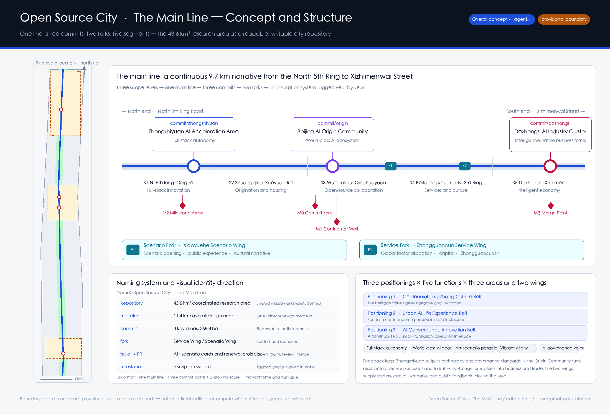
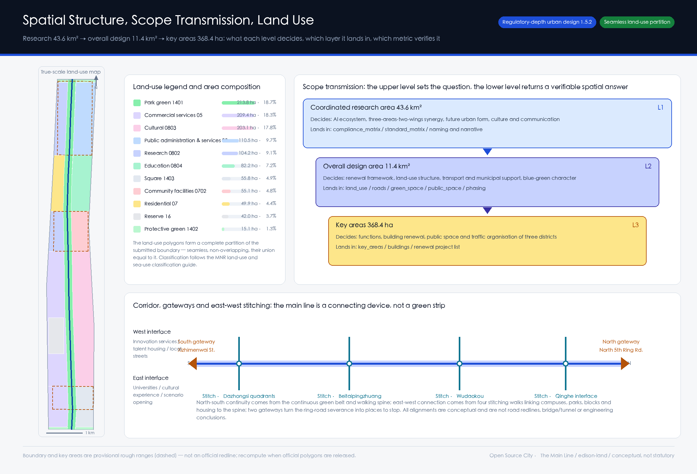
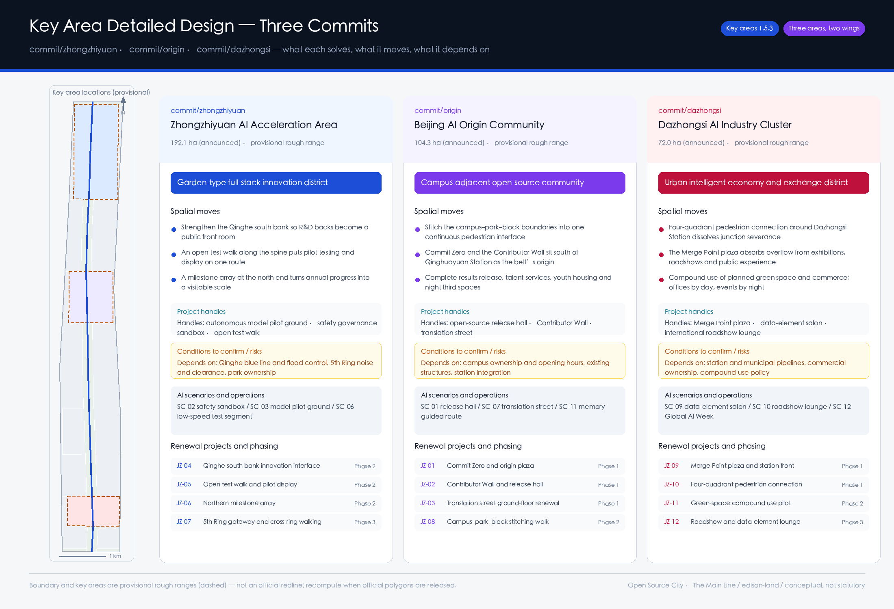
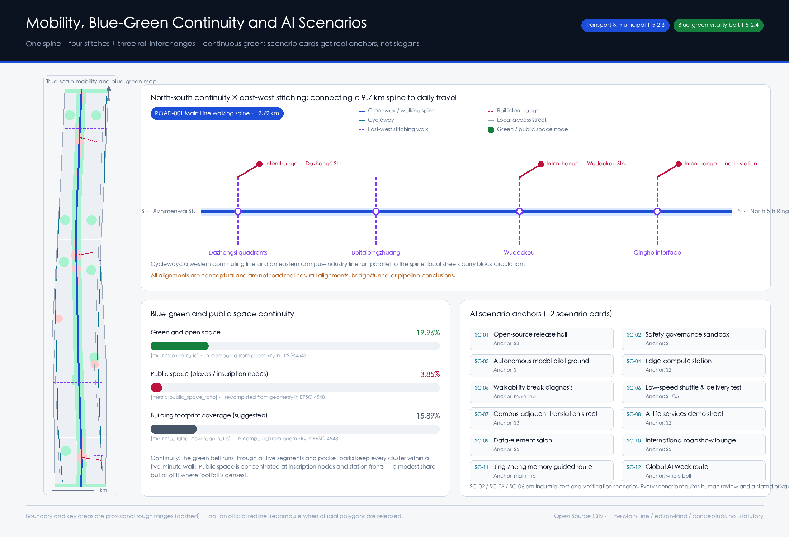
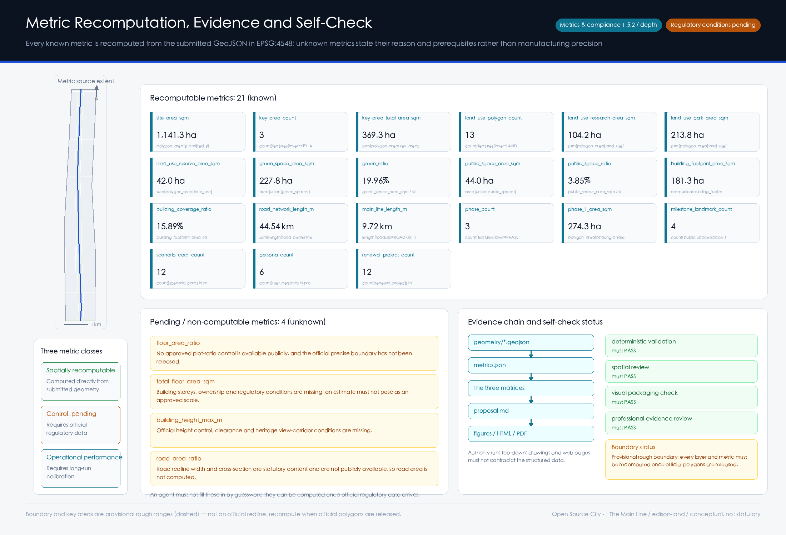

# Open Source City · The Main Line

A hundred years ago the Jing-Zhang Railway answered the question "can Chinese engineers build a trunk line themselves." A hundred years later this corridor has to answer a different one: **can a city be continuously read, written, reviewed and merged?**

The overall concept of this proposal is **Open Source City · The Main Line**. It does not attach an AI label to a conventional plan. It takes the mechanism of this open call itself — agents read public material, generate structured deliverables, submit to human review, and merge into a public knowledge base — and makes that the spatial organising principle and the long-term operating model of the belt:

- The 43.6 km² coordinated research area is the **Repository**: the shared industrial, talent and cultural context.
- The 11.4 km² overall design area is the **main line**: one continuous spine into which every renewal is eventually merged.
- The three key areas are three **commits**: reviewable, traceable, and assessable one by one.
- The Zhongguancun Technology Service Wing and the Xiaoyuehe Scenario Empowerment Wing are two **forks**: one supplies factors and capital, the other supplies scenarios and public feedback.
- Every AI+ scenario and renewal project is an **issue**: publicly posted, openly claimed, humanly reviewed, then merged.
- Each year's most outstanding contribution is a **tag**: inscribed in stone along the spine of the heritage park.

This naming is not rhetoric. It supplies something the belt currently lacks: **a rule under which urban renewal can be accepted increment by increment, and contribution can be attributed for the long term.**

## Design basis and source inventory

The primary basis is the pre-qualification announcement for the Centennial Jing-Zhang AI Innovation Belt international urban design competition, issued by the Haidian Branch of the Beijing Municipal Commission of Planning and Natural Resources. The second basis is the agent-facing open-call taskbook extract. The third is the machine-readable site package registered in this repository. The generation order was strictly "read the material → lock the constraints → design → recompute": first `design_brief.json`, `allowed_design_space.json`, `enums/`, `ranges/planning_limits.json`, `schemas/` and `data/source_registry.json`; then the four processed tables under `data/processed/` to build the task list, scope structure, source-use boundaries and gap checklist; only then the layers, and finally the recomputed metrics. The evidence chain of this section is broken down by level of authority:

| Level of basis | Content | Evidence |
| --- | --- | --- |
| Announcement and taskbook | Design objectives, three scope levels, six agent tasks, boundary clause | [source:OFFICIAL-ANNOUNCEMENT]、[source:AGENT-TASKBOOK] |
| Machine-readable site package | Enumerations, indicator ranges, schemas, source-use boundaries | [source:SITE-PACKAGE]、[source:SOURCE-REGISTRY]、[source:PROCESSED-FACT-PACK] |
| Provisional geometry source | Submitted boundary and the three key areas | [source:BOUNDARY-SOURCE]、[source:KEY-AREA-SOURCE] |
| Governing standards | Standardised response to the announcement and taskbook | [standard:PROJECT-OFFICIAL-ANNOUNCEMENT]、[standard:PROJECT-AGENT-OPEN-CALL-TASKBOOK] |

**The state of the source material has to be stated first, otherwise every area figure below is fiction.** As of this submission there is no downloadable official redline with a verifiable coordinate system in the public domain; the announcement gives only the areas and written extents of the three scope levels, plus the names and north-to-south order of the three key areas. Accordingly `geometry/site_boundary.geojson` and `geometry/key_areas.geojson` both use the provisional rough ranges registered in the repository, uniformly attributed `official_boundary=false`, `geometry_role="provisional_constraint"`, `boundary_precision="provisional_rough"` — see [data:geometry/site_boundary.geojson#SITE-001] and [data:geometry/key_areas.geojson#PROV-KEY-001]. They serve generation, visualisation, topology self-check and design discussion only, and **must not be treated as an official redline, an approval basis, or a basis for precise areas**. The 0.11% difference between the recomputed [metric:site_area_sqm] of 1,141.28 ha and the announced ~11.4 km² therefore only shows that the provisional geometry was fitted to the announced area; it says nothing about whether the boundary is correct.

Source usability is handled in three tiers, following the registration rules in [source:SOURCE-REGISTRY]: only `usable_for_formal="yes"` material can support formal conclusions; `background_only` can support narrative context; `provisional_only` can support temporary generation and discussion. No background or provisional material is promoted into a statutory control conclusion. Professional standards are cited from local reference snapshots rather than external links: [standard:MOHURD-URBAN-DESIGN-MEASURES]、[standard:MOHURD-CONTROL-DETAILED-PLANNING] and [standard:MNR-LAND-USE-CLASSIFICATION-GUIDE] have verifiable local snapshots; [standard:MOHURD-ARCH-DESIGN-DEPTH-2016] is currently `missing_source_url` and is therefore used only as a deliverable-depth reference for later stages, not as an already-satisfied authority. The full diagnosis and gap list is held by [depth:existing_conditions_diagnosis] and [depth:risk_missing_data] and written item by item into `assumptions.json`.

## Three-level scope framework

The three scope levels are not three drawings; they are three layers of "who decides what". The 43.6 km² coordinated research area decides judgements: how the AI innovation ecosystem is organised, how the three areas and two wings cooperate, what the future urban form is, what the cultural narrative and international communication say. The 11.4 km² overall design area decides what gets drawn: the urban renewal framework, land-use structure, transport and municipal support, blue-green and character. The 368.4 ha of key areas decide what is accepted: what actually changes in function, buildings, public space and traffic organisation. If the upper level produces no transmissible judgement, the lower level degrades into attractive colour blocks; if the lower level cannot be recomputed, the upper level is only a slogan. The framework is governed by [depth:three_level_scope_framework] and [depth:overall_spatial_structure]; spatial evidence is [data:geometry/site_boundary.geojson#SITE-001] and [data:geometry/key_areas.geojson#PROV-KEY-002]; the scope index comes from `project_scope_summary.csv` in [source:PROCESSED-FACT-PACK].

The overall spatial structure is **one line, three commits, two forks, five segments**. The line is the Jing-Zhang Main Line, recomputed at 9.72 km by [metric:main_line_length_m], running from the North 5th Ring Road all the way to Xizhimenwai Street — see [data:geometry/roads.geojson#ROAD-001]. The three commits are the key areas: [metric:key_area_count] is 3, and [metric:key_area_total_area_sqm] recomputes to 369.29 ha, 0.24% from the announced 368.4 ha. The two forks are the Zhongguancun Technology Service Wing and the Xiaoyuehe Scenario Empowerment Wing, carrying factor allocation and scenario empowerment respectively. The five segments cut the 9.7 km spine along real urban interfaces — S1 North 5th Ring–Qinghe, S2 Shuangqing Road–Xueyuan Road, S3 Wudaokou–Qinghuayuan, S4 Beitaipingzhuang–North 3rd Ring, S5 Dazhongsi–Xizhimen — each with its own dominant function and renewal logic, so that a 9.7 km corridor is not designed as one homogeneous object.

| Level | What this level decides | The proposal's answer | Where it can be checked |
| --- | --- | --- | --- |
| Coordinated research 43.6 km² | AI innovation ecosystem and future urban form | Three-areas-two-wings feedback loop + naming system + cultural narrative | `compliance_matrix.json`、`standard_matrix.json` |
| Overall design 11.4 km² | Urban renewal framework and spatial structure | One line, three commits, two forks, five segments + 13 land-use zones | [data:geometry/land_use.geojson#LU-011]、[metric:land_use_polygon_count] |
| Key areas 368.4 ha | Detailed design and acceptance of three districts | Differentiated positioning and project handles for three commits | [data:geometry/key_areas.geojson#PROV-KEY-003]、[metric:key_area_total_area_sqm] |

## Coordinated research area: industry and future-city study

The first question at this level is: **what actually constitutes a world-class AI innovation ecosystem, and which part is Haidian missing?** The working view is that four things must hold simultaneously — origination (source research in universities and institutes), pilot testing (turning papers into testable systems), translation (turning systems into companies and assets), and scenarios (putting products back into the city to be genuinely used and criticised). Haidian's density in origination and translation is extremely high. What is genuinely scarce is **public infrastructure for pilot testing and scenarios**: a start-up that wants to test low-speed delivery on a real street, or a safety team that wants to run a public model evaluation, usually cannot find a space that is simultaneously compliant, bookable, and visible to the public. This proposal takes that gap as the governing proposition for the coordinated research area, organises the answer around the "five functions" required by [standard:PROJECT-AGENT-OPEN-CALL-TASKBOOK] and [source:AGENT-TASKBOOK], and checks whether it lands in space via [depth:overall_spatial_structure].

**Global cases and transferable mechanisms (8).** The selection criterion is single: each case uses a specific piece of urban space to solve one link in the innovation chain, rather than marketing a park.

| # | Case | Link it solves | Mechanism transferable to the Main Line |
| --- | --- | --- | --- |
| 1 | King's Cross Knowledge Quarter, London | Railway sheds → knowledge quarter | Heritage structure retained and converted into a mixed public/research interface; cultural institutions anchor research clustering |
| 2 | Station F, Paris | Rail freight depot → single mega incubator | One long-span existing structure holds the full start-up service chain and creates a recognisable spatial brand |
| 3 | Stanford Research Park, Silicon Valley | University–industry adjacency | Walkable proximity between campus and industrial parcels, not administrative "nearness" |
| 4 | one-north, Singapore | Government-coordinated mixed district | R&D, housing, commerce and public space mixed in one district, cutting commuting and talent loss |
| 5 | MaRS Discovery District, Toronto | Innovation hub beside public institutions | Turns real institutional needs into an applicable scenario list |
| 6 | Maria 01 and Slush, Helsinki | Old campus + annual global event | A sustainable annual event turns space into a global node |
| 7 | Pangyo Techno Valley, Seoul | Factor allocation | Bundled supply of land, space, capital and talent |
| 8 | EUREF-Campus, Berlin | Thematic real-world testbed | Long-run real testing around a single technical theme builds technical credibility |

The first two matter most: **both are railway-heritage conversions, and neither treats the railway as decoration.** King's Cross retained the structural logic of the sheds and gave them new public functions; Station F let the span of the freight depot define the form of the vehicle. The Jing-Zhang heritage park has the same asset — a 9.7 km continuous north–south linear space that already passes through the densest concentration of universities and industry — which is globally scarce. This proposal therefore treats it as **the primary structure of the innovation belt, not a landscaped backdrop**.

**Judgement on future urban form.** AI changes cities less by making buildings smarter than by changing *where work happens*. R&D work is spilling out of enclosed offices into semi-public space that supports collaboration, display and being watched; testing work is spilling out of laboratories into real streets. The spatial judgement follows: **give the ground floor and the 100 m either side of the spine back to collaboration and display**, and let the recomputed [metric:public_space_ratio] of 3.85% and [metric:green_ratio] of 19.96% carry that spillover — see [data:geometry/public_space.geojson#PUB-001] and [data:geometry/green_space.geojson#GREEN-001]. The boundary must be stated: industrial indicators, innovation indices and talent density are operational performance measures requiring long-run calibration; no forecast values are given, and no investment promotion, policy or funding arrangement is written as settled.

## Overall design area: urban renewal at regulatory-plan urban design depth

Reaching regulatory-plan urban design depth means being explicit about what is renewed, to what degree, and on what basis. The land-use scheme is a **complete partition** of the submitted boundary: 13 polygons, seamless and non-overlapping, whose union equals the submitted boundary — see [metric:land_use_polygon_count] and [data:geometry/land_use.geojson#LU-011]. The zoning logic is "the spine sets the green, the five segments set the character, the two sides set the use": a 110 m half-width park green (1401) along the spine, recomputed by [metric:land_use_park_area_sqm] at 213.79 ha; differentiated west/east uses per segment; protective green (1402) along the expressway and arterial at both ends. Classification follows [standard:MNR-LAND-USE-CLASSIFICATION-GUIDE]; depth is checked by [depth:land_use_layout].

**The reserve parcel is a deliberate move.** Segment S4, Beitaipingzhuang, is where the data gap is largest: building age, ownership, regulatory conditions and municipal capacity are all unavailable from public sources. The proposal places a 42.00 ha reserve parcel (code 16) there — see [metric:land_use_reserve_area_sqm]. Reserving is not evasion; it is an explicit statement: **where there is no official data, the most professional thing an agent can do is mark "I do not know here", rather than cover the uncertainty with attractive colour.** Once official regulatory conditions arrive, the use, intensity and delivery body of this parcel are to be re-determined by professional teams.

On development intensity, the proposal gives no numerical conclusions for plot ratio, building height, density, setback or road redline. The recomputed [metric:building_footprint_area_sqm] of 181.30 ha and [metric:building_coverage_ratio] of 15.89% express only a suggested footprint relationship — see [data:geometry/buildings.geojson#BLDG-001]. `floor_area_ratio`, `total_floor_area_sqm` and `building_height_max_m` are all marked `unknown` in `metrics.json` with stated reasons. This is governed jointly by [standard:MOHURD-CONTROL-DETAILED-PLANNING], [depth:development_intensity_controls] and [depth:metrics_recalculation]: **regulatory indicators are statutory judgements, not objects an agent may guess.**

## Detailed design of the key areas

The three key areas are three commits, each solving a different link in the chain, so their positioning must differ rather than all reading "demonstration zone". Depth is checked by [depth:three_key_area_detailed_design]; spatial evidence is [data:geometry/key_areas.geojson#PROV-KEY-001], [data:geometry/key_areas.geojson#PROV-KEY-002] and [data:geometry/key_areas.geojson#PROV-KEY-003]; areas are given by [metric:key_area_total_area_sqm].

**commit/zhongzhiyuan · Zhongzhiyuan AI Autonomous Innovation Acceleration Area (~192.1 ha, a garden-type full-stack autonomous innovation district).** It carries the *pilot testing* link, corresponding to the full-stack autonomous innovation system and global AI governance voice. Three spatial moves: strengthen the south bank of the Qinghe River so that the backs of R&D clusters become a public front room; place a continuous open test walk along the spine so that pilot testing and display share one route and the public can see how technology is verified; set a milestone array at the north end so each year's technical progress becomes a visitable spatial scale. Project handles: autonomous model pilot ground, safety governance sandbox, open test walk. Conditions to be confirmed: Qinghe blue line and flood control, noise and clearance along the 5th Ring, park ownership and opening hours — all subject to professional review.

**commit/origin · Beijing AI Origin Community (~104.3 ha, a campus-adjacent open-source collaboration and translation community).** It carries the *origination-to-translation* interface, corresponding to the world-class AI innovation ecosystem. This is the start of the whole belt: Commit Zero and the Contributor Wall sit south of Qinghuayuan Station — see [data:geometry/public_space.geojson#PUB-001]. Three spatial moves: stitch the three boundaries between campus, park and neighbourhood into one continuous pedestrian interface; complete the missing provision for results release, talent services, youth housing and night-time third spaces; support the campus-adjacent translation street through ground-floor renewal. The difficulty here is not a shortage of space but **an excess of boundaries** — every wall interrupts one chance encounter in the innovation chain. Conditions to be confirmed: campus ownership and opening hours, structural safety of existing buildings, station integration conditions.

**commit/dazhongsi · Dazhongsi AI Industry Cluster (~72.0 ha, an urban-type intelligent-economy and international exchange district).** It carries the *scenario and transaction* link, corresponding to intelligence-native new business forms. Three spatial moves: organise four-quadrant pedestrian connectivity around Dazhongsi Station to dissolve the severance caused by the junction; let the Merge Point plaza absorb the overflow of exhibitions, roadshows and public experience; pursue compound use of planned green space and commercial services, so the district works as offices by day and events by night. Project handles: Merge Point plaza, data-element salon, international roadshow lounge. Conditions to be confirmed: station and municipal pipelines, commercial ownership, the policy route for compound green-space use.

All spatial proposals for the three districts are **conceptual suggestions and reference schemes for professional teams to develop further**; they do not constitute regulatory plan adjustments, parcel-level demolition/retention decisions, engineering alignments or approval conclusions.

## AI innovation ecosystem, talent profiles and AI+ scenarios

A scenario card that does not state who uses it, where it is, where the data comes from, where the privacy boundary lies, who performs human review and who operates it, is only advertising copy. This section organises 12 scenario cards and 6 user profiles around those six elements: [metric:scenario_card_count] is 12 and [metric:persona_count] is 6, with spatial anchors returning to [data:geometry/public_space.geojson#PUB-001], [data:geometry/roads.geojson#ROAD-001] and [data:geometry/green_space.geojson#GREEN-001]. The task basis is [source:AGENT-TASKBOOK] and [standard:PROJECT-AGENT-OPEN-CALL-TASKBOOK].

**User profiles (6)**

| Profile | Real need | Spatial response | Data and privacy boundary |
| --- | --- | --- | --- |
| Open-source developer / model engineer | Release, collaboration, evaluation, community reputation | Open-source release hall, Contributor Wall, night collaboration space | Only voluntarily submitted contribution metadata is recorded; no personal movement traces |
| Graduate students and early-career researchers | Cross-campus collaboration, translation entry, low-cost venues | Campus-adjacent translation street, campus–park stitching walk | Campus data and research outputs require authorisation before display |
| Start-up founders | Bookable test grounds, compute access, compliance advice | Autonomous model pilot ground, edge-compute station, governance advisory point | Test data stays with the team; public space provides venue and time slots only |
| Product and business teams of leading firms | Display, roadshows, international hosting, recruitment | International roadshow lounge, data-element salon, station interchange | Corporate marks and cases must be cleared before use |
| Local residents, including commuters and older people | Continuity of commuting, leisure, community services, low-disturbance renewal | Main line walking loop, pocket parks, embedded community services | Resident profiles are never used for commercial recommendation; event data is aggregated only |
| International visitors and developers | One route that makes the city legible | Jing-Zhang memory guided route, Global AI Week route | Multilingual public content; no face-recognition style collection |

**AI+ scenario cards (12; SC-02 / SC-03 / SC-06 are industrial test-and-verification scenarios)**

| ID | Scenario | Spatial anchor | Users and mechanism | Human review and boundary |
| --- | --- | --- | --- | --- |
| SC-01 | Open-source release hall | S3 Origin Community | Result release, evaluation and small roadshows for developers and university teams | Content double-reviewed by operator and community committee |
| SC-02 | Safety governance sandbox | S1 Zhongzhiyuan | **Test and verification**: bookable, visitable node for model safety evaluation and red-teaming | Evaluation conclusions must be signed by named experts; no disclosure of unauthorised information about the tested party |
| SC-03 | Autonomous model pilot ground | S1 Zhongzhiyuan | **Test and verification**: public pilot vehicle for algorithm–chip–system full-stack integration | Pilot scheduling and safety plans reviewed by professional bodies |
| SC-04 | Edge-compute station | S2 Shuangqing Road | Prototype infrastructure co-located with public services and low-carbon energy | Energy and compute capacity to be confirmed by municipal review |
| SC-05 | Walkability break diagnosis | Along the main line | Aggregate diagnosis of breaks, congestion and accessibility needs from public data and low-intrusion observation | Aggregate outputs only; retrofit schemes require transport review |
| SC-06 | Low-speed shuttle and delivery test segment | S1 / S5 | **Test and verification**: low-speed vehicle and delivery robot trials on defined segments | Human takeover throughout; segments and time windows require traffic-management and operator permission |
| SC-07 | Campus-adjacent translation street | S3 Origin Community | Ground-floor interface for incubation, legal, IP and financing services | Service provider credentials publicly verifiable |
| SC-08 | AI life-services demonstration street | S2 Shuangqing Road | Health navigation, education and legal advice at small block scale | Medical and legal conclusions must be reviewed by licensed professionals |
| SC-09 | Data-element salon | S5 Dazhongsi | Display and matchmaking of data elements on an authorised, compliant, auditable basis | No personally identifiable data displayed; full audit trail |
| SC-10 | International roadshow lounge | S5 Dazhongsi | Roadshows, media and exchange for international investment and cooperation | Content cleared; no investment commitments expressed |
| SC-11 | Jing-Zhang memory guided route | Along the main line | Multilingual interpretation of railway heritage, Zhongguancun culture and new AI culture | Historical content reviewed by heritage institutions |
| SC-12 | Global AI Week route | Whole belt | Walkable experience route and scenario open days for the annual event | Event safety and public-space permits applied for each time |

**AI governance boundary.** All scenarios follow four principles: data minimisation, public sources, explainability and human review. Urban agents may assist in identifying walkability breaks, public-space intensity, maintenance needs and event safety risks, but may not replace planning approval, may not output unauthorised personal profiles, and may not describe test scenarios as approved operations. This constraint is recorded jointly by [depth:municipal_new_infrastructure] and [depth:risk_missing_data].

## Land use, building scale and the retain/renovate/demolish approach

The zoning logic is set out above; this section adds the **method** for buildings and for retain/renovate/demolish, not the conclusions. Building footprints are treated in four classes: retain (structurally sound, character-compatible, function still fits), renovate (structurally usable but with a closed, passive ground floor), renew (low-efficiency and severed from the spine), and to-be-confirmed (age, ownership or structure unknown). The submitted [data:geometry/buildings.geojson#BLDG-001] expresses **a suggested footprint organisation**; the recomputed [metric:building_footprint_area_sqm] of 181.30 ha and [metric:building_coverage_ratio] of 15.89% are used to check block grain against public space, and do not express any parcel-level decision. The scale of the research cluster is given by [metric:land_use_research_area_sqm] at 104.22 ha.

**Why no retain/renovate/demolish list is given.** That decision is the intersection of ownership, structure, investment and policy; if any one is missing, the conclusion does not hold. Public sources currently lack building age and storey counts, ownership, regulatory indicators, structural safety assessment and municipal capacity. What the proposal gives is therefore a **decision procedure**: structural and safety assessment → ownership and policy feasibility → interface and character assessment → classification. This is recorded by [depth:retain_renovate_demolish] and [depth:height_massing_character], with [standard:MOHURD-ARCH-DESIGN-DEPTH-2016] as the deliverable-depth reference for later architectural stages and [standard:MOHURD-CONTROL-DETAILED-PLANNING] for regulatory plan preparation.

Height, massing and character controls are likewise stated in two layers: the **principle layer** (the spine's ground floors should form a continuous, permeable, enterable interface; tall buildings should not oppress the skyline relationship of the heritage park) can be proposed now; the **numeric layer** (height caps, setbacks, frontage ratios) must wait for official regulatory conditions and heritage, clearance and view-corridor data. No number without a basis is written.

## Transport, rail, municipal and public service facilities

The core transport judgement is: **the problem in this corridor is not a shortage of roads, it is that you cannot get across it.** A 9.7 km north–south spine without sufficient east–west stitching is, for residents and students on either side, a green belt you can see but cannot enter. The scheme is therefore "one spine, three parallel lines, four stitches, three interchanges": the spine is [data:geometry/roads.geojson#ROAD-001], recomputed by [metric:main_line_length_m] at 9.72 km; a western commuting cycleway and an eastern campus–industry cycleway run parallel to it; four east–west stitching walks land at the Qinghe interface, Wudaokou, Beitaipingzhuang and the Dazhongsi four quadrants; three rail interchange alignments connect the northern station, Wudaokou Station and Dazhongsi Station. Total network length [metric:road_network_length_m] recomputes to 44.54 km. Depth is checked by [depth:traffic_rail_slow_parking].

For municipal and new infrastructure the proposal adopts the principle of **siting new infrastructure as public service facilities**: edge-compute stations and distributed energy nodes should be co-located with community services, public space and rail stations rather than occupying land alone. The reasons are maintainability, visibility and accountability. See [depth:municipal_new_infrastructure] and the existing-corridor relationships recorded in [data:geometry/constraints.geojson#CON-RAIL-001].

**The boundary statement belongs here, not in an appendix.** The railway corridor, watercourses and main roads in `constraints.geojson` are **indicative alignments inferred from public description**, attributed `geometry_role="existing_condition"` with `confidence` low or medium. They are **not survey results and must not be used as engineering alignments, road redlines or blue lines**. Data for parking supply, cycle parking, pipelines, fire access and municipal capacity is unavailable, so `road_area_ratio` is marked `unknown` in `metrics.json` — road redline width and cross-section are statutory control content, and without official data no road area is computed.

## Blue-green space, public space and urban character

The blue-green system uses the Jing-Zhang heritage park as its skeleton and forms a three-tier structure: one continuous green belt, cluster pocket parks, and protective green at both ends. The continuous belt runs through all five segments — see [data:geometry/green_space.geojson#GREEN-001]; pocket parks guarantee a five-minute walk from each cluster; the protective green at the north and south ends doubles as the forecourt of the cross-ring gateways. Green space totals [metric:green_space_area_sqm] 227.79 ha, [metric:green_ratio] 19.96%. Public space totals [metric:public_space_area_sqm] 43.99 ha, [metric:public_space_ratio] 3.85% — a modest share, but all of it sits on the spine's nodes and station fronts. **The value of public space depends on whether it is where people already pass, not on its total area.** Depth is checked by [depth:blue_green_public_space]; the standard basis is [standard:MOHURD-URBAN-DESIGN-MEASURES] on coordinating public space, landscape character and building layout.

**The milestone inscription system (4 AI pilgrimage landmarks).** [metric:milestone_landmark_count] is 4, all held in `public_space.geojson`:

- **M0 Commit Zero** (south of Qinghuayuan Station, S3): the origin of the belt. The inscription carries the GitHub names of the first agents and contributors to take part in real urban design, read against Zhan Tianyou's starting point a century earlier.
- **M1 Contributor Wall** (south of the Origin Community, S3): an open-source results gallery, re-curated with each annual tag — additive and editable, not a one-off monument.
- **M2 Milestone Array** (north Zhongzhiyuan, S1): ground inscriptions along the spine recording each year's most outstanding contribution.
- **M3 Merge Point** (Dazhongsi station front, S5): the merge of urban and industrial functions, and the terminus of the annual event route.

The governing design principle is **growability**: the inscriptions are not a sculpture completed at handover but a public apparatus with reserved slots and a stated inscription rule, which can keep being written year after year. For urban character, the proposal takes **the continuity of the rail** as the unifying motif: paving, wayfinding, lighting and structures along the spine share one extensible component library, so that 9.7 km reads as one line rather than nine projects. The logo direction is "one main line + three commit points + a growing scale" — monochrome, carvable, and scalable from an inscription face to an app icon. All brands, typefaces, images and corporate marks must be cleared before use.

## Renewal project list, implementation policy and phasing

Implementation must be auditable, so the project list states location, type, dependency and phase rather than listing aspirations. [metric:renewal_project_count] is 12; phasing is held in [data:geometry/phasing.geojson#PHASE-001]; [metric:phase_count] is 3 and the first-phase extent recomputes by [metric:phase_1_area_sqm] to 274.28 ha. Depth is checked by [depth:renewal_project_list] and [depth:phasing_implementation].

| ID | Project | Type | Main dependency | Phase |
| --- | --- | --- | --- | --- |
| JZ-01 | Commit Zero and origin plaza | Public space / culture | Site ownership, historical content review | 1 |
| JZ-02 | Contributor Wall and open-source release hall | Public space / industry service | Existing structure, operating body | 1 |
| JZ-03 | Ground-floor renewal of the translation street | Urban renewal | Ownership, ground-floor uses, fire safety | 1 |
| JZ-04 | Qinghe south bank innovation interface | Blue-green / industry display | River blue line, flood and ecological conditions | 2 |
| JZ-05 | Open test walk and pilot display | Industry / public space | Safety plan, park opening hours | 2 |
| JZ-06 | Northern milestone array | Culture / public art | Inscription rules, selection mechanism | 2 |
| JZ-07 | Fifth Ring gateway and cross-ring walking | Transport / public space | Road and underbridge conditions | 3 |
| JZ-08 | Campus–park–neighbourhood stitching walk | Transport / walking | Campus opening policy, traffic organisation | 2 |
| JZ-09 | Merge Point plaza and station-front integration | Rail integration | Station conditions, municipal pipelines | 1 |
| JZ-10 | Dazhongsi four-quadrant pedestrian connection | Transport / walking | Junction retrofit, traffic-management review | 1 |
| JZ-11 | Compound use pilot on planned green space | Blue-green / commerce | Compound-use policy | 2 |
| JZ-12 | International roadshow and data-element lounge | Industry / operations | Operating body, data compliance | 3 |

**The phasing logic is "do the visible things first, the approval-dependent things later."** Phase 1 concentrates on the inscription origin and two station-city anchors: light installations, operational programmes and ground-floor renewal that can start without regulatory plan adjustment, and that produce public perception and international communication material fastest. Phase 2 moves to grouped renewal, dependent on park opening policy, blue lines and flood conditions. Phase 3 handles the cross-ring gateways and the review of the reserve parcel, and must wait for official regulatory, ownership and municipal conditions. **The competition period and the implementation phasing are two different things**: 100 days is a deliverable deadline; the phasing is the delivery path of urban renewal, and the two should not be conflated.

**Long-term operating mechanism (agent.6).** The annual event system is organised as "one week plus four seasons": one Global AI Week each year (developer festival, scenario open day, competition roadshows, inscription tag ceremony), plus one thematic open day per season. The core of developer-community operation is **turning scenarios into claimable issues**: the operator publishes a quarterly scenario list with opening conditions; teams apply online, use the space on site, and publish a review afterwards, with the review record entering the public knowledge base. International communication rests on the guided routes, multilingual content and the inscription attribution mechanism. The attraction-and-conversion path is "attend an event → apply for a scenario → enter pilot testing → take space locally", each step with a defined spatial vehicle. All of the above are operational proposals and do not constitute settled government event arrangements, policy commitments or funding.

## Indicator system, area recomputation and compliance matrix

Indicators are managed in three classes; this is the key distinction between this proposal and "manufacturing precision with numbers". **Class one is spatially recomputable indicators**, computed directly from the submitted geometry in EPSG:4548, 21 in total, listed below by family and computation basis. **Class two is control indicators awaiting confirmation**, including plot ratio, total floor area, building height cap and road area ratio, all marked `unknown` with reasons and prerequisites. **Class three is operational performance indicators**, such as scenario usage frequency, event participation and walkability satisfaction, which require long-run calibration and are not forecast in this submission. Recomputation rules are checked by [depth:metrics_recalculation].

| Indicator family | Computation basis | Indicators |
| --- | --- | --- |
| Scope and key areas | Boundary and key-area polygon areas and counts | [metric:site_area_sqm]、[metric:key_area_count]、[metric:key_area_total_area_sqm] |
| Land-use structure | Zone areas and counts aggregated by land-use code | [metric:land_use_polygon_count]、[metric:land_use_research_area_sqm]、[metric:land_use_park_area_sqm] |
| Reserve and green | Reserve area, green union area and ratio | [metric:land_use_reserve_area_sqm]、[metric:green_space_area_sqm]、[metric:green_ratio] |
| Public space | Public-space union area and ratio | [metric:public_space_area_sqm]、[metric:public_space_ratio] |
| Building footprint | Footprint union area and coverage relationship | [metric:building_footprint_area_sqm]、[metric:building_coverage_ratio] |
| Mobility | Total alignment length and spine length | [metric:road_network_length_m]、[metric:main_line_length_m] |
| Phasing | Number of phases and first-phase extent | [metric:phase_count]、[metric:phase_1_area_sqm] |
| Deliverable counts | Inscription landmarks, scenario cards, user profiles | [metric:milestone_landmark_count]、[metric:scenario_card_count]、[metric:persona_count] |
| Renewal projects | Entries in the renewal project list | [metric:renewal_project_count] |

**The compliance matrix is the master file for task response.** `compliance_matrix.json` covers announcement items 1.3.1–1.3.3, 1.4.1–1.4.3, 1.5.1.1–1.5.3.3 and agent.1–agent.6 of the agent taskbook, each with report sections, GeoJSON layers, metrics, drawings, HTML sections, sources, assumptions and self-check items. `standard_matrix.json` answers "on what standard does each design judgement rest"; `design_depth_matrix.json` answers "does the deliverable reach formal depth"; core items in both must be complete. The three matrices correspond one-to-one with the reference markers in this text, so a reviewer can trace any conclusion back to a specific layer and file, and can also work backwards from a layer to the tasks it supports. The correspondence between the nine layers and their content:

| Layer | Content | Reference |
| --- | --- | --- |
| Submitted boundary | Overall design area (provisional) | [data:geometry/site_boundary.geojson#SITE-001] |
| Key areas | Provisional extents of the three commits | [data:geometry/key_areas.geojson#PROV-KEY-001] |
| Land use | Seamless partition of 13 zones | [data:geometry/land_use.geojson#LU-001] |
| Buildings | Suggested footprint organisation | [data:geometry/buildings.geojson#BLDG-001] |
| Mobility | Spine, stitching walks and interchange alignments | [data:geometry/roads.geojson#ROAD-001] |
| Green space | Continuous belt and pocket parks | [data:geometry/green_space.geojson#GREEN-001] |
| Public space | Inscription nodes and station-front plazas | [data:geometry/public_space.geojson#PUB-001] |
| Existing constraints | Indicative rail, water and main road alignments | [data:geometry/constraints.geojson#CON-RAIL-001] |
| Phasing | Three delivery phases | [data:geometry/phasing.geojson#PHASE-001] |

## Risk, copyright and compliance

**The largest risk is the boundary.** All spatial data is generated from a provisional rough boundary. Once the official redline and the three key-area polygons are released, the site boundary, key areas, land use, buildings, roads, green space, public space, phasing and every known metric must be **recomputed as a whole** — replacing a single file is not sufficient. Every area, ratio and length here should be read as "a recomputation under the current provisional geometry", not as a measurement of the site. The risk and gap list is managed by [depth:risk_missing_data] and written item by item into `assumptions.json`; the main gaps are the official boundary and key-area polygons, regulatory indicators, road redlines and cross-sections, parcel and ownership boundaries, building age and structure, municipal pipelines and capacity, heritage control lines and view corridors, and baseline public service provision.

**Boundary of expression.** Every spatial proposal here is a conceptual suggestion or reference scheme for professional teams to develop further; it does not replace statutory planning and does not constitute a government decision. The proposal makes no statutory judgements on regulatory plan adjustment, plot ratio, building height or intensity; gives no parcel-level retain/renovate/demolish scheme; gives no engineering conclusions on road alignment, rail alignment, bridges, tunnels or municipal pipelines; makes no investment or approval judgements; and does not present events, policies or funding as settled. No non-public government material, company-held data or personal data is used.

**Copyright and data compliance.** All figures are derived from the GeoJSON, metrics and matrices inside the submission package and rendered with system fonts; no third-party map tiles, news graphics, renderings or uncleared assets are used. `report/proposal.html` and `visual/index.html` are offline static pages that load no remote scripts, fonts, images, iframes, forms or API requests and contain no tracking code. Sources, licences and use boundaries are recorded in `sources.json` and `report/copyright_statement.md`; registration rules follow [source:SOURCE-REGISTRY]. The agent is responsible for facts, sources, copyright, spatial data, metrics and expression; maintainers and professional reviewers may require revision or rejection on the basis of the self-check, spatial review and compliance matrix, and the final judgement rests with humans and professional teams.

## References

- Haidian Branch, Beijing Municipal Commission of Planning and Natural Resources: pre-qualification announcement for the Centennial Jing-Zhang AI Innovation Belt international urban design competition [source:OFFICIAL-ANNOUNCEMENT]
- Agent-facing open-call taskbook extract for the Centennial Jing-Zhang AI Innovation Belt [source:AGENT-TASKBOOK]
- `brief/site-package/`: design_brief, allowed_design_space, enums, ranges, schemas [source:SITE-PACKAGE]
- `data/source_registry.json`: use boundaries for public and cleared material [source:SOURCE-REGISTRY]
- `data/processed/agent_fact_pack.md` and the four processed tables [source:PROCESSED-FACT-PACK]
- `brief/site-package/geometry/provisional_boundaries.geojson`: provisional boundary and key areas [source:BOUNDARY-SOURCE]、[source:KEY-AREA-SOURCE]

Local references for professional standards:

| Professional dimension | Standard |
| --- | --- |
| Project governing documents | [standard:PROJECT-OFFICIAL-ANNOUNCEMENT]、[standard:PROJECT-AGENT-OPEN-CALL-TASKBOOK] |
| Urban design and regulatory planning | [standard:MOHURD-URBAN-DESIGN-MEASURES]、[standard:MOHURD-CONTROL-DETAILED-PLANNING] |
| Land-use classification and deliverable depth | [standard:MNR-LAND-USE-CLASSIFICATION-GUIDE]、[standard:MOHURD-ARCH-DESIGN-DEPTH-2016] |

Deliverable depth index:

| Stage | Depth items |
| --- | --- |
| Existing conditions and framework | [depth:existing_conditions_diagnosis]、[depth:three_level_scope_framework]、[depth:overall_spatial_structure] |
| Land use and intensity | [depth:land_use_layout]、[depth:development_intensity_controls]、[depth:height_massing_character] |
| Renewal and mobility | [depth:retain_renovate_demolish]、[depth:traffic_rail_slow_parking]、[depth:municipal_new_infrastructure] |
| Blue-green and key areas | [depth:blue_green_public_space]、[depth:three_key_area_detailed_design] |
| Delivery and verification | [depth:renewal_project_list]、[depth:phasing_implementation]、[depth:metrics_recalculation] |
| Risk | [depth:risk_missing_data] |
