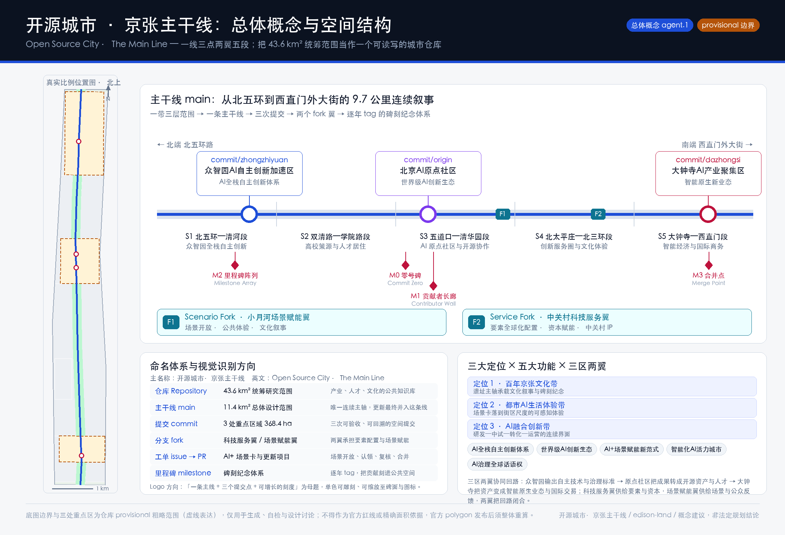
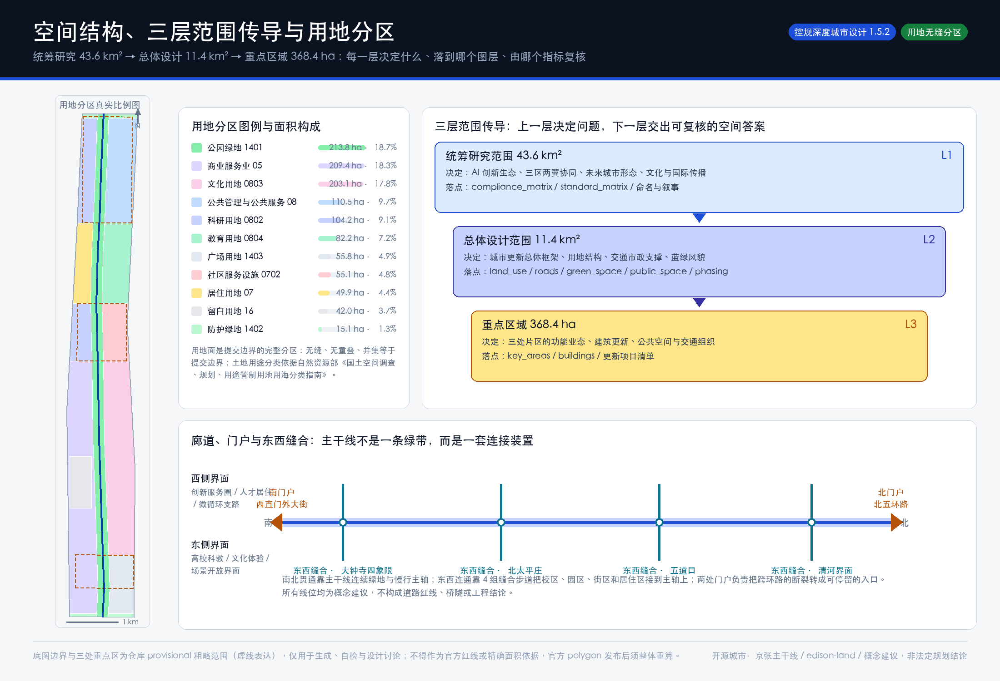
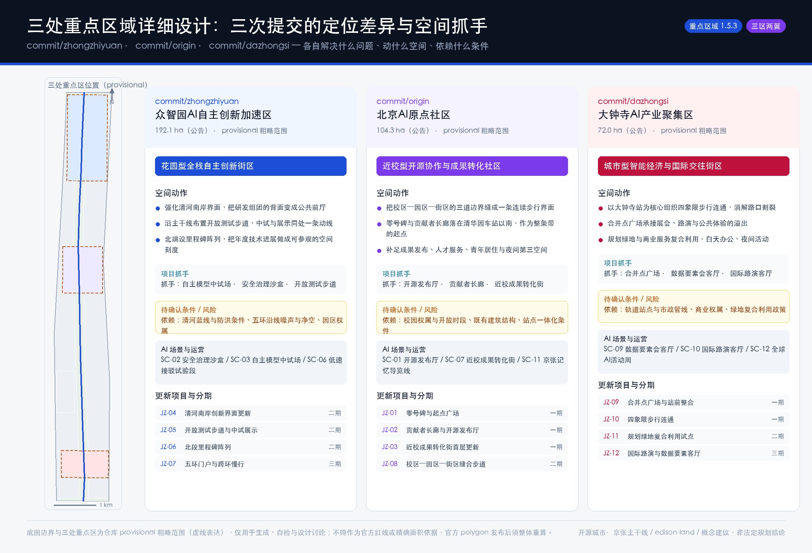
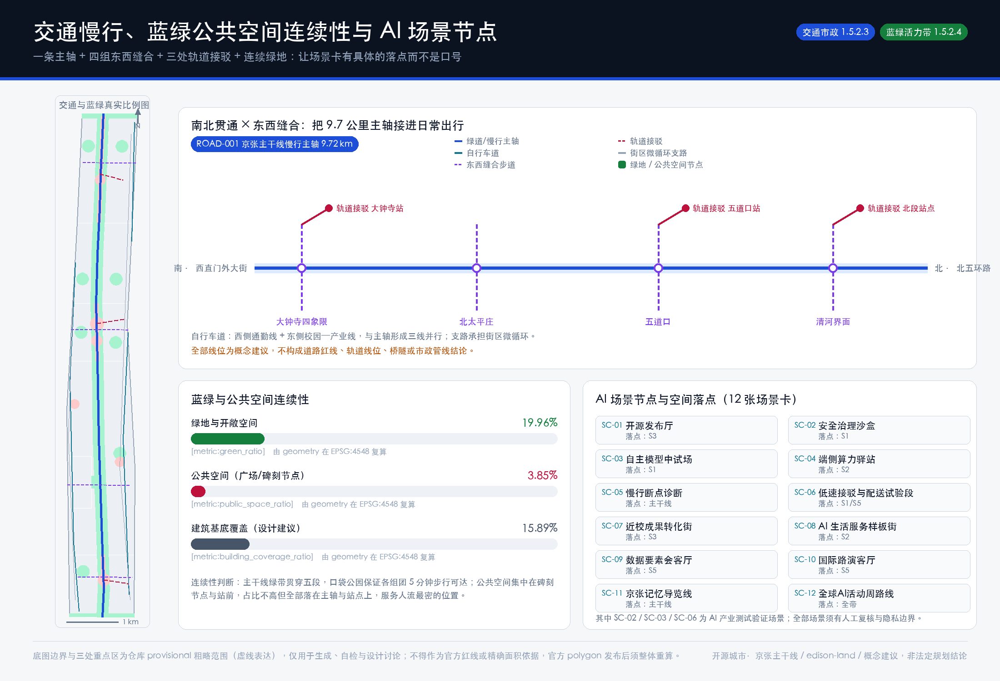
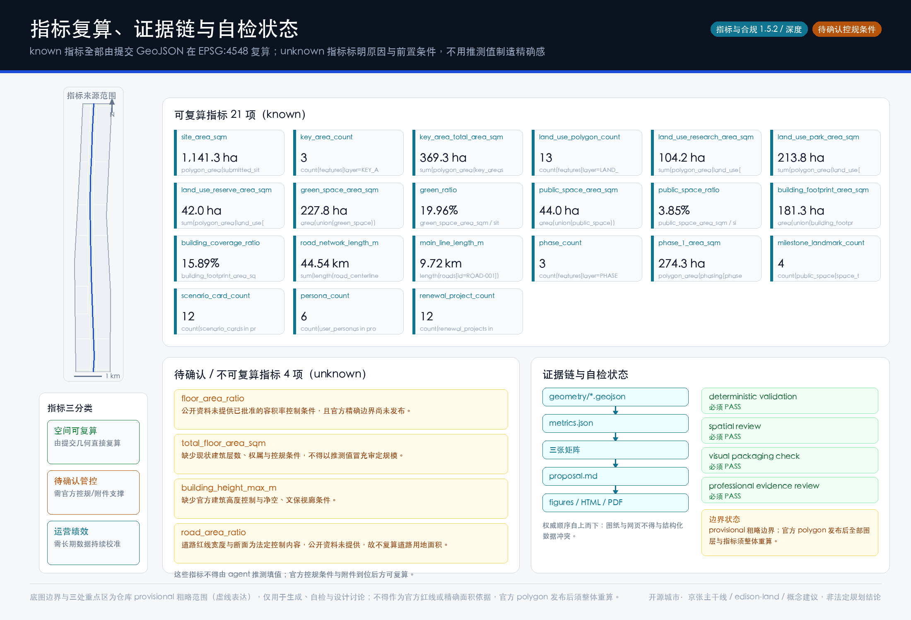

# 开源城市 · 京张主干线

一百年前，京张铁路解决的是「中国人能不能自己修一条干线」。一百年后，这条走廊要回答的是另一个问题：**一座城市能不能被持续地读、写、审阅和合并**。

本方案提出的总体概念是 **开源城市 · 京张主干线（Open Source City · The Main Line）**。它不是给传统方案贴一个 AI 标签，而是把这次征集本身的机制——智能体读取公开资料、生成结构化成果、接受人工复核、合并进公共知识库——直接变成这条创新带的空间组织方式和长期运营方式：

- 43.6 平方公里统筹研究范围是 **仓库 Repository**：共享的产业、人才、文化上下文；
- 11.4 平方公里总体设计范围是 **主干线 main**：唯一一条连续主轴，所有更新最终并入它；
- 三处重点区域是三次 **提交 commit**：可验收、可回溯、可分别评估；
- 中关村科技服务翼与小月河场景赋能翼是两个 **分支 fork**：一个供给要素与资本，一个供给场景与公众反馈；
- 每一个 AI+ 场景与更新项目是一张 **工单 issue**：公开发布、开放认领、人工复核、合并上线；
- 每一年最杰出的贡献是一次 **里程碑 tag**：以碑刻形式刻在遗址公园的主轴上。

这套命名不是修辞。它给出了一个此前缺失的东西：**一条让城市更新可以被逐次验收、让贡献可以被长期署名的规则**。

## 设计依据与资料清单

本方案的第一依据是北京市规划和自然资源委员会海淀分局发布的《百年京张AI创新带城市设计国际方案征集资格预审公告》，第二依据是面向全球智能体开源征集的任务书摘录，第三依据是仓库中已完成登记的机器可读站点包。生成顺序严格遵循「先读资料—再锁约束—后做设计—最后复算」：先读 `design_brief.json`、`allowed_design_space.json`、`enums/`、`ranges/planning_limits.json`、`schemas/` 与 `data/source_registry.json`，再用 `data/processed/` 的四张处理表建立任务清单、范围结构、资料用途与缺口清单，最后才生成图层并复算指标。本节的证据链按依据层级拆分如下：

| 依据层级 | 内容 | 证据 |
| --- | --- | --- |
| 公告与任务书 | 设计目的、三层范围、六项智能体任务与统一边界条款 | [source:OFFICIAL-ANNOUNCEMENT]、[source:AGENT-TASKBOOK] |
| 机器可读站点包 | 枚举、指标区间、模式与资料用途边界 | [source:SITE-PACKAGE]、[source:SOURCE-REGISTRY]、[source:PROCESSED-FACT-PACK] |
| 临时几何来源 | 提交边界与三处重点区的 provisional 几何 | [source:BOUNDARY-SOURCE]、[source:KEY-AREA-SOURCE] |
| 主控标准 | 公告与任务书要求的标准化响应 | [standard:PROJECT-OFFICIAL-ANNOUNCEMENT]、[standard:PROJECT-AGENT-OPEN-CALL-TASKBOOK] |

**资料状态必须先讲清楚，否则后面所有面积都是假的。** 截至本次提交，公开渠道没有可下载、可校验坐标系的本次征集官方精确红线；公告只给出三层范围的面积与文字四至、三处重点区的名称与南北顺序。因此本方案的 `geometry/site_boundary.geojson` 与 `geometry/key_areas.geojson` 全部使用仓库登记的 provisional 粗略范围，属性统一标注 `official_boundary=false`、`geometry_role="provisional_constraint"`、`boundary_precision="provisional_rough"`，见 [data:geometry/site_boundary.geojson#SITE-001] 与 [data:geometry/key_areas.geojson#PROV-KEY-001]。它们只用于生成、可视化、拓扑自检与设计讨论，**不得作为官方红线、审批依据或精确面积依据**。相应地，[metric:site_area_sqm] 复算值 1 141.28 公顷与公告约 11.4 平方公里之间的 0.11% 偏差，只说明临时几何拟合了公告面积，不说明边界正确。

资料可用性按三档处理，来自 [source:SOURCE-REGISTRY] 的登记规则：`usable_for_formal="yes"` 的资料才能支撑正式结论；`background_only` 只能做背景论述；`provisional_only` 只能支撑临时生成与讨论。本方案不把任何背景或临时资料升级为法定控制结论。专业标准依据本地参考快照而非外链，其中 [standard:MOHURD-URBAN-DESIGN-MEASURES]、[standard:MOHURD-CONTROL-DETAILED-PLANNING]、[standard:MNR-LAND-USE-CLASSIFICATION-GUIDE] 已取得可核对的本地快照；[standard:MOHURD-ARCH-DESIGN-DEPTH-2016] 当前状态为 `missing_source_url`，因此在本方案中只作为深化阶段的成果深度参照，不作为已满足的权威依据。现状诊断与资料缺口的完整清单见 [depth:existing_conditions_diagnosis] 与 [depth:risk_missing_data]，并逐条写入 `assumptions.json`。

## 三层范围工作框架

三层范围不是三张图纸，而是三层「谁决定什么」的分工。统筹研究范围 43.6 平方公里决定判断：AI 创新生态怎么组织、三区两翼怎么协同、未来城市形态是什么、文化叙事与国际传播说什么。总体设计范围 11.4 平方公里决定落图：城市更新总体框架、用地结构、交通市政支撑、蓝绿与风貌。重点区域 368.4 公顷决定验收：三处片区的功能业态、建筑更新、公共空间与交通组织到底动了什么。上一层如果没有给出可传导的判断，下一层就会退化成好看的色块；下一层如果不能复算，上一层就只是口号。本框架由 [depth:three_level_scope_framework] 与 [depth:overall_spatial_structure] 约束，空间证据为 [data:geometry/site_boundary.geojson#SITE-001] 与 [data:geometry/key_areas.geojson#PROV-KEY-002]，范围索引来自 [source:PROCESSED-FACT-PACK] 的 `project_scope_summary.csv`。

总体空间结构概括为 **一线、三点、两翼、五段**。一线是京张主干线，全长 [metric:main_line_length_m] 复算 9.72 公里，从北五环路一直连到西直门外大街，见 [data:geometry/roads.geojson#ROAD-001]。三点是三次 commit，[metric:key_area_count] 为 3，合计面积 [metric:key_area_total_area_sqm] 复算 369.29 公顷，与公告 368.4 公顷相差 0.24%。两翼是中关村科技服务翼与小月河场景赋能翼，分别承担要素配置和场景赋能。五段是把 9.7 公里主轴按现实的城市界面切成 S1 北五环—清河段、S2 双清路—学院路段、S3 五道口—清华园段、S4 北太平庄—北三环段、S5 大钟寺—西直门段，每一段有独立的主导功能与更新逻辑，避免把一条 9.7 公里的走廊当作一个均质对象来设计。

| 层级 | 这一层决定什么 | 方案的回答 | 可复核的落点 |
| --- | --- | --- | --- |
| 统筹研究范围 43.6 km² | AI 创新生态与未来城市形态 | 三区两翼协同回路 + 命名体系 + 文化叙事 | `compliance_matrix.json`、`standard_matrix.json` |
| 总体设计范围 11.4 km² | 城市更新总体框架与空间结构 | 一线三点两翼五段 + 13 个用地分区 | [data:geometry/land_use.geojson#LU-011]、[metric:land_use_polygon_count] |
| 重点区域 368.4 ha | 三处片区的详细设计与验收 | 三次 commit 的定位差异与项目抓手 | [data:geometry/key_areas.geojson#PROV-KEY-003]、[metric:key_area_total_area_sqm] |

## 统筹研究范围产业与未来城市研究

统筹研究范围要回答的第一个问题是：**世界级 AI 创新生态到底由什么构成，海淀缺的是哪一块。** 通行的判断是四件事同时成立才能称为生态——策源（高校院所的源头研究）、中试（把论文变成可测试的系统）、转化（把系统变成企业与资产）、场景（把产品放回城市里被真实使用与批评）。海淀在策源与转化上密度极高，真正稀缺的是**中试与场景的公共载体**：一个初创团队想在真实街道上测一次低速配送，或者一个安全团队想公开做一次模型评测，往往找不到既合规、又可预约、又能被公众看见的空间。本方案把这一缺口作为统筹研究范围的主命题，依据 [standard:PROJECT-AGENT-OPEN-CALL-TASKBOOK] 与 [source:AGENT-TASKBOOK] 对「五大功能」的要求组织回答，并由 [depth:overall_spatial_structure] 校核其是否落到空间。

**全球案例与可转化机制（8 例）。** 这些案例的选取标准只有一个：它们都在「用一块具体的城市空间解决创新链的某一环」，而不是泛泛的园区宣传。

| # | 案例 | 它解决的环节 | 可转化到京张主干线的机制 |
| --- | --- | --- | --- |
| 1 | 伦敦 King's Cross Knowledge Quarter | 铁路棚场遗产 → 知识区 | 遗产结构不拆除、改为公共与研发混合界面；文化机构做锚点带动周边研发集聚 |
| 2 | 巴黎 Station F | 铁路货运站 → 单一巨型创业载体 | 用一个超长跨度的既有构筑物容纳全流程创业服务，形成可辨识的空间品牌 |
| 3 | 硅谷斯坦福研究园区 | 大学—产业邻近性 | 校区与产业地块的步行可达关系，而非行政意义上的「靠近」 |
| 4 | 新加坡 one-north | 政府统筹的混合街区 | 研发、居住、商业、公共空间同一街区混合，降低通勤与人才流失 |
| 5 | 多伦多 MaRS Discovery District | 医院/大学旁的创新中枢 | 把公共机构的真实需求变成可申请的场景清单 |
| 6 | 赫尔辛基 Maria 01 与 Slush | 老园区 + 年度全球活动品牌 | 用一个可持续的年度活动把空间变成全球节点 |
| 7 | 首尔 Pangyo Techno Valley | 政府主导的要素配置 | 土地、空间、资金、人才的打包供给机制 |
| 8 | 柏林 EUREF-Campus | 主题化实景测试场 | 围绕单一技术主题（能源/交通）做长期真实测试，形成技术信誉 |

前两例最值得注意：**它们都是铁路遗产改造，而且都没有把铁路当作装饰**。King's Cross 保留了棚场的结构逻辑并让它承担新的公共功能，Station F 直接用货运站的超长跨度定义了载体形态。京张遗址公园具备同样的条件——一条 9.7 公里、连续、南北贯通、且天然穿过高校与产业密集区的线性空间，这在全球范围内都是稀缺资源。本方案因此不把遗址公园当作绿化背景，而当作**创新带的主结构**。

**未来城市形态的判断。** AI 改变城市的方式不是让建筑变得更聪明，而是改变了「工作发生在哪里」。研发工作正在从封闭办公空间外溢到可以协作、可以展示、可以被围观的半公共空间；测试工作正在从实验室外溢到真实街道。因此本方案对未来城市形态的空间判断是：**把首层和主轴两侧 100 米还给协作与展示**，用 [metric:public_space_ratio] 复算 3.85%、[metric:green_ratio] 复算 19.96% 的公共与绿色空间承接这种外溢，见 [data:geometry/public_space.geojson#PUB-001] 与 [data:geometry/green_space.geojson#GREEN-001]。这里必须说明边界：产业指标、创新指数、人才密度等属于运营绩效指标，需要长期数据持续校准，本方案不给出预测值，也不把招商、政策与资金安排写成已确定事项。

## 总体设计范围城市更新与控规深度城市设计

总体设计范围要达到控制性详细规划的城市设计深度，核心是把「更新什么、更新到什么程度、依据什么」讲清楚。本方案的用地方案是提交边界的**完整分区**：13 个用地面无缝、无重叠，并集等于提交边界，见 [metric:land_use_polygon_count] 与 [data:geometry/land_use.geojson#LU-011]。分区逻辑是「主轴定绿、五段定性、两侧定用」——主轴 110 米半幅为公园绿地（1401），复算 [metric:land_use_park_area_sqm] 213.79 公顷；五段按主导功能给出西侧与东侧的差异化用地；南北两端沿快速路与主干路设防护绿地（1402）。分类依据 [standard:MNR-LAND-USE-CLASSIFICATION-GUIDE]，深度由 [depth:land_use_layout] 校核。

**留白是这套方案的一个刻意动作。** S4 北太平庄段是当前资料缺口最大的片区：既有建筑年代、权属、控规条件和市政容量都无法从公开资料获得。本方案在该段设置 42.00 公顷留白用地（代码 16），见 [metric:land_use_reserve_area_sqm]。留白不是回避设计，而是明确表态：**在没有官方数据的地方，一个智能体最专业的做法是标出「这里我不知道」，而不是用漂亮的色块把不确定性盖住。** 官方控规条件补齐后，这块留白的用途、强度与实施主体由专业团队重新确定。

开发强度方面，本方案不给出容积率、建筑高度、建筑密度、退线与道路红线的数值结论。[metric:building_footprint_area_sqm] 复算 181.30 公顷、[metric:building_coverage_ratio] 复算 15.89%，仅为设计建议的基底覆盖关系，见 [data:geometry/buildings.geojson#BLDG-001]；`floor_area_ratio`、`total_floor_area_sqm`、`building_height_max_m` 在 `metrics.json` 中一律标注为 unknown 并写明原因。这一处理由 [standard:MOHURD-CONTROL-DETAILED-PLANNING]、[depth:development_intensity_controls] 与 [depth:metrics_recalculation] 共同约束：**控规指标是法定判断，不是智能体可以推测的对象。**

## 重点区域详细设计

三处重点区域是三次 commit，各自解决创新链上的一环，因此定位必须有差异，不能都写成「示范区」。详细设计深度由 [depth:three_key_area_detailed_design] 校核，空间证据为 [data:geometry/key_areas.geojson#PROV-KEY-001]、[data:geometry/key_areas.geojson#PROV-KEY-002] 与 [data:geometry/key_areas.geojson#PROV-KEY-003]，各区面积见 [metric:key_area_total_area_sqm]。

**commit/zhongzhiyuan · 众智园AI自主创新加速区（约 192.1 公顷，花园型全栈自主创新街区）。** 它承担的是「中试」这一环，对应五大功能中的 AI 全栈自主创新体系与 AI 治理全球话语权。三个空间动作：一是强化清河南岸界面，把研发组团朝向河道的背面改造为公共前厅，让园区的边界变成城市的界面；二是沿主干线布置连续的开放测试步道，使中试与展示处在同一条动线上，公众能看见技术如何被验证；三是在北端设置里程碑阵列，把每年的技术进展做成可参观的空间刻度。项目抓手为自主模型中试场、安全治理沙盒、开放测试步道。待确认条件：清河蓝线与防洪条件、五环沿线噪声与净空、园区权属与开放时段，均须由专业团队复核。

**commit/origin · 北京AI原点社区（约 104.3 公顷，近校型开源协作与成果转化社区）。** 它承担「策源到转化」的接口，对应世界级 AI 创新生态。这里是整条带的起点：零号碑与贡献者长廊落在清华园车站以南，见 [data:geometry/public_space.geojson#PUB-001]。三个空间动作：把校区、园区、街区之间的三道边界缝成一条连续的步行界面；补足成果发布、人才服务、青年居住与夜间第三空间；用首层业态更新支撑近校成果转化街。这一片区的难点不是缺空间，而是**边界太多**——每一道围墙都在打断创新链上的一次偶遇。待确认条件：校园权属与开放时段、既有建筑结构安全、轨道站点一体化条件。

**commit/dazhongsi · 大钟寺AI产业聚集区（约 72.0 公顷，城市型智能经济与国际交往街区）。** 它承担「场景与交易」这一环，对应智能原生新业态。三个空间动作：以大钟寺站为核心组织四象限步行连通，消解路口对片区的割裂；用合并点广场承接展会、路演与公共体验的溢出；推动规划绿地与商业服务的复合利用，实现白天办公、夜间活动的时段共享。项目抓手为合并点广场、数据要素会客厅、国际路演客厅。待确认条件：轨道站点与市政管线、商业权属、绿地复合利用的政策路径。

三处片区的空间落地建议均为**概念建议与参考方案，可供专业团队深化研究**，不构成控规调整、地块拆改留、工程线位或审批结论。

## AI 创新生态、人才画像与 AI+ 场景

场景卡如果不写清楚「谁用、在哪、数据从哪来、隐私边界在哪、谁来人工复核、谁来运营」，就只是宣传语。本节按这六项要素组织 12 张场景卡与 6 类用户画像，[metric:scenario_card_count] 为 12、[metric:persona_count] 为 6，空间落点回接 [data:geometry/public_space.geojson#PUB-001]、[data:geometry/roads.geojson#ROAD-001] 与 [data:geometry/green_space.geojson#GREEN-001]，任务依据为 [source:AGENT-TASKBOOK] 与 [standard:PROJECT-AGENT-OPEN-CALL-TASKBOOK]。

**用户画像（6 类）**

| 画像 | 真实需求 | 空间响应 | 数据与隐私边界 |
| --- | --- | --- | --- |
| 开源开发者 / 模型工程师 | 发布、协作、评测、社区声誉 | 开源发布厅、贡献者长廊、夜间协作空间 | 仅记录自愿提交的贡献元数据；不采集个人移动轨迹 |
| 高校研究生与青年科研者 | 跨校协作、成果转化入口、低成本活动场地 | 近校成果转化街、校区—园区缝合步道 | 校园数据与科研成果须经授权方可展示 |
| 初创团队创始人 | 可预约的测试场、算力入口、合规咨询 | 自主模型中试场、端侧算力驿站、治理咨询点 | 测试数据由团队自持；公共空间仅提供场地与时段 |
| 头部企业产品与商务团队 | 展示、路演、国际接待、招聘 | 国际路演客厅、数据要素会客厅、站前接驳 | 企业标识与案例须清权后使用 |
| 周边居民（含通勤者与老年人） | 通勤连续性、休闲、社区服务、低扰动更新 | 主干线慢行环、口袋公园、社区服务嵌入 | 不将居民画像用于商业推荐；活动数据只做聚合统计 |
| 国际访客与开发者 | 一条能读懂这座城市的路线 | 京张记忆导览线、全球AI活动周路线 | 导览内容多语种公开；不做人脸识别类采集 |

**AI+ 场景卡（12 张，其中 SC-02 / SC-03 / SC-06 为 AI 产业测试验证场景）**

| 编号 | 场景 | 空间落点 | 服务对象与机制 | 人工复核与边界 |
| --- | --- | --- | --- | --- |
| SC-01 | 开源发布厅 | S3 原点社区 | 开发者与高校团队的成果发布、评测与小型路演 | 发布内容由运营方与社区委员会双重复核 |
| SC-02 | 安全治理沙盒 | S1 众智园 | **测试验证**：模型安全评测、红队演练的可预约、可参观节点 | 评测结论须专家署名；不得对外披露受测方未授权信息 |
| SC-03 | 自主模型中试场 | S1 众智园 | **测试验证**：算法—芯片—系统全栈联调的公共中试载体 | 中试排期与安全预案由专业机构审核 |
| SC-04 | 端侧算力驿站 | S2 双清路段 | 与公共服务、低碳能源结合的新型基础设施原型 | 能源与算力容量须市政专业复核后确定 |
| SC-05 | 慢行断点诊断 | 主干线全线 | 用公开数据与低侵入观测识别断点、拥挤与无障碍需求 | 只输出聚合结论；改造方案须交通专业复核 |
| SC-06 | 低速接驳与配送试验段 | S1 / S5 | **测试验证**：低速接驳车与配送机器人的限定路段试验 | 全程可人工接管；试验段与时段须交管与运营方许可 |
| SC-07 | 近校成果转化街 | S3 原点社区 | 孵化、法务、知识产权与投融资的首层服务界面 | 服务机构资质公开可查 |
| SC-08 | AI 生活服务样板街 | S2 双清路段 | 医疗健康导航、教育、法律咨询等生活服务的小尺度落地 | 医疗与法律结论必须由持证人员复核 |
| SC-09 | 数据要素会客厅 | S5 大钟寺 | 以授权、合规、可审计为前提的数据要素展示与撮合 | 不展示可识别个人的数据；全链路留痕 |
| SC-10 | 国际路演客厅 | S5 大钟寺 | 面向国际投资与合作的路演、媒体与交流 | 内容清权；不作投资承诺表述 |
| SC-11 | 京张记忆导览线 | 主干线全线 | 铁路文脉、中关村文化与 AI 新文化的多语种导览 | 史实内容由文史机构复核 |
| SC-12 | 全球AI活动周路线 | 全带 | 年度活动的可步行体验路线与场景开放日 | 活动安全与公共空间许可须逐次申请 |

**AI 治理边界。** 全部场景遵守数据最小化、公开来源、可解释与人工复核四项原则。城市智能体可以辅助识别慢行断点、公共空间使用强度、设施维护需求与活动安全风险，但不得替代规划审批，不得输出未经授权的个人画像，不得把测试场景写成已批准运营。这一约束由 [depth:municipal_new_infrastructure] 与 [depth:risk_missing_data] 共同记录。

## 用地、建筑规模与拆改留方案

用地方案在前文已说明其分区逻辑，本节补充建筑与拆改留的**方法**，而不是结论。方案把建筑基底分为四类处理：保留（结构安全、风貌协调、功能仍适配）、改造（结构可用但首层封闭、界面消极）、更新（低效且与主轴关系割裂）、待确认（缺少年代、权属或结构资料）。本次提交的 [data:geometry/buildings.geojson#BLDG-001] 表达的是**设计建议的基底组织关系**，复算面积 [metric:building_footprint_area_sqm] 181.30 公顷、覆盖率 [metric:building_coverage_ratio] 15.89%，用于校核街区尺度与公共空间的匹配关系，不表示任何具体地块的拆改留判断。科研用地组团的规模见 [metric:land_use_research_area_sqm] 104.22 公顷。

**为什么不给拆改留清单。** 拆改留是权属、结构、投资与政策的交集，任何一项缺失，结论都不成立。当前公开资料缺少现状建筑年代与层数、产权主体、控规指标、结构安全评估与市政容量。因此本方案给出的是**判定流程**：先做结构与安全评估 → 再做权属与政策可行性 → 再做界面与风貌评估 → 最后才形成分类。这一流程由 [depth:retain_renovate_demolish] 与 [depth:height_massing_character] 记录，标准依据为 [standard:MOHURD-ARCH-DESIGN-DEPTH-2016] 在深化阶段的成果深度要求与 [standard:MOHURD-CONTROL-DETAILED-PLANNING] 的控规编制要求。

建筑高度、体量与风貌的控制建议同样分层表述：**原则层**（主轴两侧界面应形成连续、通透、可进入的首层；高层不应压迫遗址公园的天际关系）可以现在提出；**数值层**（高度上限、退线、贴线率）必须等待官方控规条件与文保、净空、视廊资料。凡是没有依据的数值，本方案一律不写。

## 交通、轨道、市政与公共服务设施

交通方案的核心判断是：**这条走廊的问题不是路不够，而是横过不去。** 一条 9.7 公里的南北主轴，如果没有足够的东西向缝合，它对两侧居民和师生就只是一条看得见走不进的绿带。因此方案组织为「一轴、三线并行、四组缝合、三处接驳」：主轴见 [data:geometry/roads.geojson#ROAD-001]，复算 [metric:main_line_length_m] 9.72 公里；西侧通勤自行车道与东侧校园—产业自行车道与主轴形成三线并行；四组东西缝合步道分别落在清河界面、五道口、北太平庄与大钟寺四象限；三处轨道接驳线位连接北段站点、五道口站与大钟寺站。全网线位长度 [metric:road_network_length_m] 复算 44.54 公里。深度由 [depth:traffic_rail_slow_parking] 校核。

市政与新型基础设施部分，方案提出「把新基建当作公共服务设施来选址」的原则：端侧算力驿站、分布式能源节点应与社区服务、公共空间和轨道站点合设，而不是单独占地。这样做的理由是可运维、可被看见、也可被监督。相关内容见 [depth:municipal_new_infrastructure] 与 [data:geometry/constraints.geojson#CON-RAIL-001] 所记录的现状走廊关系。

**边界说明必须写在这里而不是附录。** `constraints.geojson` 中的铁路走廊、水系与主要道路线位均为依据公开叙述推定的**示意线位**，属性标注 `geometry_role="existing_condition"`、`confidence` 为 low 或 medium，**不是测量成果，不得作为工程线位、道路红线或蓝线依据**。停车供给、非机动车停放、管线、消防与市政容量所需的资料当前均不可得，因此 `road_area_ratio` 在 `metrics.json` 中标注为 unknown——道路红线宽度与断面是法定控制内容，没有官方资料就不复算道路用地面积。

## 蓝绿空间、公共空间与城市风貌

蓝绿系统以京张遗址公园为骨架，形成「一条连续绿带 + 组团口袋公园 + 两端防护绿地」的三级结构。连续绿带沿主轴贯穿五段，见 [data:geometry/green_space.geojson#GREEN-001]；口袋公园保证各组团 5 分钟步行可达；南北两端的防护绿地同时承担跨环路门户的前庭功能。绿地总量 [metric:green_space_area_sqm] 复算 227.79 公顷，[metric:green_ratio] 19.96%。公共空间总量 [metric:public_space_area_sqm] 43.99 公顷、[metric:public_space_ratio] 3.85%，占比不高，但全部落在主轴节点与轨道站前——**公共空间的价值取决于它在不在人流经过的地方，而不是总量。** 深度由 [depth:blue_green_public_space] 校核，标准依据 [standard:MOHURD-URBAN-DESIGN-MEASURES] 对公共空间、景观风貌与建筑布局的统筹要求。

**碑刻纪念体系（AI 朝圣地标，4 处）。** [metric:milestone_landmark_count] 为 4，均落在 `public_space.geojson` 中：

- **M0 零号碑 Commit Zero**（清华园车站以南，S3）：整条带的起点。碑面刻录第一批参与真实城市设计的智能体与贡献者的 GitHub 名称，与詹天佑的起点形成一百年的对读。
- **M1 贡献者长廊 Contributor Wall**（原点社区南侧，S3）：开源成果展示长廊，按年度 tag 更新展陈，可增可改，不是一次性纪念物。
- **M2 里程碑阵列 Milestone Array**（众智园北段，S1）：沿主轴每段布置的地面碑刻，记录当年最杰出的贡献。
- **M3 合并点 Merge Point**（大钟寺站前，S5）：象征城市功能与产业功能的合并，也是活动周路线的终点。

这套体系的关键设计原则是**可增长**：碑刻不是竣工即完成的雕塑，而是一套预留了空位、规定了刻录规则、可以年复一年写下去的公共装置。城市风貌方面，方案建议以「铁轨的连续性」作为统一母题——主轴的铺装、导视、照明与构筑物共用一套可延展的构件库，让 9.7 公里读起来是一条线而不是九段工程。Logo 方向为「一条主线 + 三个提交点 + 可增长的刻度」，单色、可雕刻、可缩放至碑面与终端图标。所有品牌、字体、图像与企业标识须清权后使用。

## 更新项目清单、实施政策与分期计划

实施必须可审查，因此项目清单要写清楚位置、类型、依赖与分期，而不是罗列愿景。[metric:renewal_project_count] 为 12，分期见 [data:geometry/phasing.geojson#PHASE-001]，[metric:phase_count] 为 3，一期范围复算 [metric:phase_1_area_sqm] 274.28 公顷。深度由 [depth:renewal_project_list] 与 [depth:phasing_implementation] 校核。

| 编号 | 项目 | 类型 | 主要依赖 | 分期 |
| --- | --- | --- | --- | --- |
| JZ-01 | 零号碑与起点广场 | 公共空间 / 文化 | 场地权属、文史内容复核 | 一期 |
| JZ-02 | 贡献者长廊与开源发布厅 | 公共空间 / 产业服务 | 既有建筑结构、运营主体 | 一期 |
| JZ-03 | 近校成果转化街首层更新 | 城市更新 | 权属、首层业态、消防 | 一期 |
| JZ-04 | 清河南岸创新界面更新 | 蓝绿 / 产业展示 | 河道蓝线、防洪与生态条件 | 二期 |
| JZ-05 | 开放测试步道与中试展示 | 产业 / 公共空间 | 安全预案、园区开放时段 | 二期 |
| JZ-06 | 北段里程碑阵列 | 文化 / 公共艺术 | 碑刻规则、评选机制 | 二期 |
| JZ-07 | 五环门户与跨环慢行 | 交通 / 公共空间 | 道路与桥下空间条件 | 三期 |
| JZ-08 | 校区—园区—街区缝合步道 | 交通 / 慢行 | 校园开放政策、交通组织 | 二期 |
| JZ-09 | 合并点广场与站前整合 | 轨道一体化 | 站点条件、市政管线 | 一期 |
| JZ-10 | 大钟寺四象限步行连通 | 交通 / 慢行 | 交叉口改造、交管复核 | 一期 |
| JZ-11 | 规划绿地复合利用试点 | 蓝绿 / 商业 | 绿地复合利用政策 | 二期 |
| JZ-12 | 国际路演与数据要素客厅 | 产业 / 运营 | 运营主体、数据合规 | 三期 |

**分期逻辑是「先做能被看见的、再做需要审批的」。** 一期集中在碑刻起点与两处站城锚点，多为轻量设施、运营活动与首层更新，不依赖控规调整即可启动，同时最快形成公众感知与国际传播素材；二期进入成组更新，依赖园区开放政策与蓝线、防洪条件；三期处理跨环路门户与留白校核，必须等待官方控规、权属与市政条件补齐。**征集周期与实施分期是两件事**：100 天是成果提交的时间要求，实施分期是城市更新的推进路径，二者不应混为一谈。

**长期运营机制（agent.6）。** 年度活动体系建议以「一周 + 四季」组织：每年一次全球 AI 活动周（开发者节、场景开放日、竞赛路演、碑刻 tag 仪式），四季各一次主题开放日。开发者社区运营的核心是**把场景变成可认领的工单**：运营方按季度发布场景清单与开放条件，团队线上申请、线下使用、公开复盘，复盘记录进入公共知识库。国际传播依托导览路线、多语种内容与碑刻署名机制形成可持续叙事。招引转化路径为「参加活动 → 申请场景 → 进入中试 → 落地办公」，每一步都有明确的空间载体。以上均为运营机制建议，不构成已确定的政府活动安排、政策承诺或资金安排。

## 指标体系、面积复算与合规矩阵

指标分三类管理，这是本方案区别于「用数字制造精确感」的关键。**第一类是空间可复算指标**，由提交几何在 EPSG:4548 下直接复算，共 21 项，按指标族与复算口径列出如下。**第二类是待确认管控指标**，包括容积率、总建筑规模、建筑高度上限与道路用地比例，全部标注 unknown 并写明原因与前置条件。**第三类是运营绩效指标**，如场景使用频次、活动参与度、慢行可达性满意度，需长期数据校准，不在本次提交中给出预测值。复算规则由 [depth:metrics_recalculation] 校核。

| 指标族 | 复算口径 | 指标 |
| --- | --- | --- |
| 范围与重点区 | 边界与重点区多边形面积、数量 | [metric:site_area_sqm]、[metric:key_area_count]、[metric:key_area_total_area_sqm] |
| 用地结构 | 按用地代码汇总分区面积与数量 | [metric:land_use_polygon_count]、[metric:land_use_research_area_sqm]、[metric:land_use_park_area_sqm] |
| 留白与绿地 | 留白面积、绿地并集面积与占比 | [metric:land_use_reserve_area_sqm]、[metric:green_space_area_sqm]、[metric:green_ratio] |
| 公共空间 | 公共空间并集面积与占比 | [metric:public_space_area_sqm]、[metric:public_space_ratio] |
| 建筑基底 | 基底并集面积与覆盖关系 | [metric:building_footprint_area_sqm]、[metric:building_coverage_ratio] |
| 交通与慢行 | 线位长度合计与主轴长度 | [metric:road_network_length_m]、[metric:main_line_length_m] |
| 分期实施 | 分期数量与一期范围面积 | [metric:phase_count]、[metric:phase_1_area_sqm] |
| 成果计数 | 碑刻地标、场景卡与用户画像数量 | [metric:milestone_landmark_count]、[metric:scenario_card_count]、[metric:persona_count] |
| 更新项目 | 更新项目清单条目数 | [metric:renewal_project_count] |

**合规矩阵是任务响应的主控文件。** `compliance_matrix.json` 逐条覆盖公告 1.3.1—1.3.3、1.4.1—1.4.3、1.5.1.1—1.5.3.3 以及面向智能体任务书的 agent.1—agent.6，每条给出报告章节、GeoJSON 图层、指标、图纸、HTML 页面、来源、假设与自检项。`standard_matrix.json` 回答「每条设计判断依据什么标准」，`design_depth_matrix.json` 回答「成果是否达到 formal 深度」，两者的核心项均须为 complete。三张矩阵与本文的引用标签一一对应，评审者可以从任意一条结论回溯到具体图层与具体文件，也可以反向从图层查出它支撑了哪条任务。九个图层与其表达内容的对应关系如下：

| 图层 | 表达内容 | 引用 |
| --- | --- | --- |
| 提交边界 | 总体设计范围（provisional） | [data:geometry/site_boundary.geojson#SITE-001] |
| 重点区域 | 三次 commit 的粗略范围 | [data:geometry/key_areas.geojson#PROV-KEY-001] |
| 用地分区 | 13 个用地面的无缝分区 | [data:geometry/land_use.geojson#LU-001] |
| 建筑基底 | 设计建议的基底组织关系 | [data:geometry/buildings.geojson#BLDG-001] |
| 交通慢行 | 主轴、缝合步道与接驳线位 | [data:geometry/roads.geojson#ROAD-001] |
| 绿地系统 | 连续绿带与口袋公园 | [data:geometry/green_space.geojson#GREEN-001] |
| 公共空间 | 碑刻节点与站前广场 | [data:geometry/public_space.geojson#PUB-001] |
| 现状约束 | 铁路、水系与主要道路示意线位 | [data:geometry/constraints.geojson#CON-RAIL-001] |
| 分期实施 | 三期推进范围 | [data:geometry/phasing.geojson#PHASE-001] |

## 风险、版权与合规说明

**最大的风险是边界。** 本方案全部空间数据基于 provisional 粗略边界生成。官方精确红线与三处重点区 polygon 发布后，site boundary、key areas、land use、buildings、roads、green space、public space、phasing 与全部 known 指标必须**整体重算**，不能只替换单个文件。方案中所有面积、比例与长度都应视为「在当前临时几何下的复算结果」，而不是对场地的量测结论。风险与缺资料清单由 [depth:risk_missing_data] 管理，逐条写入 `assumptions.json`，主要缺口包括：官方边界与重点区 polygon、控规指标、道路红线与断面、地块与权属边界、现状建筑年代与结构、市政管线与容量、文保控制线与视廊、公共服务设施底数。

**表述边界。** 本方案的一切空间落地建议均为概念建议、参考方案，可供专业团队深化研究；不替代正式规划，不构成政府审定结论。方案不涉及控规调整、容积率、建筑高度、建筑强度等法定规划判断，不给出具体地块的拆改留方案，不给出道路线形、轨道线位、桥隧工程与市政管线的工程结论，不做投资测算与审批判断，不把活动、政策与资金安排写成已确定事项。方案不使用任何未公开的政府资料、企业自有数据或个人隐私数据。

**版权与数据合规。** 全部图件由提交包内的 GeoJSON、metrics 与矩阵派生，使用本机系统字体渲染，未使用第三方地图瓦片、新闻示意图、渲染图或未清权素材。`report/proposal.html` 与 `visual/index.html` 均为离线静态页面，不加载远程脚本、远程字体、远程图片、iframe、表单或 API 请求，不包含跟踪代码。资料来源、许可与用途边界见 `sources.json` 与 `report/copyright_statement.md`，登记规则见 [source:SOURCE-REGISTRY]。智能体对事实、来源、版权、空间数据、指标与表达负责；维护者与专业评审可依据自检结果、空间复核与合规矩阵要求返修或拒绝，最终判断由人类与专业团队完成。

## 参考资料

- 北京市规划和自然资源委员会海淀分局：百年京张AI创新带城市设计国际方案征集资格预审公告 [source:OFFICIAL-ANNOUNCEMENT]
- 面向全球智能体开展百年京张AI创新带城市设计开源征集任务书摘录 [source:AGENT-TASKBOOK]
- `brief/site-package/`：design_brief、allowed_design_space、enums、ranges、schemas [source:SITE-PACKAGE]
- `data/source_registry.json`：公开与清权资料的用途边界登记 [source:SOURCE-REGISTRY]
- `data/processed/agent_fact_pack.md` 与四张处理表 [source:PROCESSED-FACT-PACK]
- `brief/site-package/geometry/provisional_boundaries.geojson`：临时边界与重点区 [source:BOUNDARY-SOURCE]、[source:KEY-AREA-SOURCE]

专业标准本地参考：

| 专业维度 | 标准 |
| --- | --- |
| 项目主控 | [standard:PROJECT-OFFICIAL-ANNOUNCEMENT]、[standard:PROJECT-AGENT-OPEN-CALL-TASKBOOK] |
| 城市设计与控规 | [standard:MOHURD-URBAN-DESIGN-MEASURES]、[standard:MOHURD-CONTROL-DETAILED-PLANNING] |
| 用地分类与成果深度 | [standard:MNR-LAND-USE-CLASSIFICATION-GUIDE]、[standard:MOHURD-ARCH-DESIGN-DEPTH-2016] |

成果深度索引：

| 阶段 | 深度项 |
| --- | --- |
| 现状与框架 | [depth:existing_conditions_diagnosis]、[depth:three_level_scope_framework]、[depth:overall_spatial_structure] |
| 用地与强度 | [depth:land_use_layout]、[depth:development_intensity_controls]、[depth:height_massing_character] |
| 更新与交通 | [depth:retain_renovate_demolish]、[depth:traffic_rail_slow_parking]、[depth:municipal_new_infrastructure] |
| 蓝绿与重点区 | [depth:blue_green_public_space]、[depth:three_key_area_detailed_design] |
| 实施与复核 | [depth:renewal_project_list]、[depth:phasing_implementation]、[depth:metrics_recalculation] |
| 风险 | [depth:risk_missing_data] |
