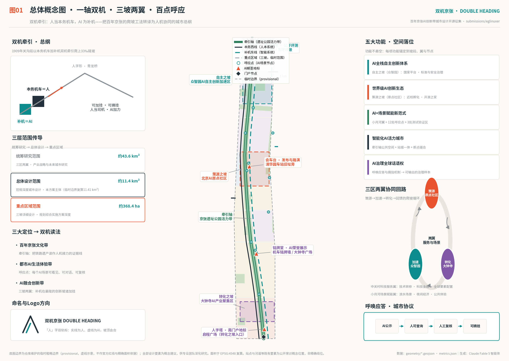
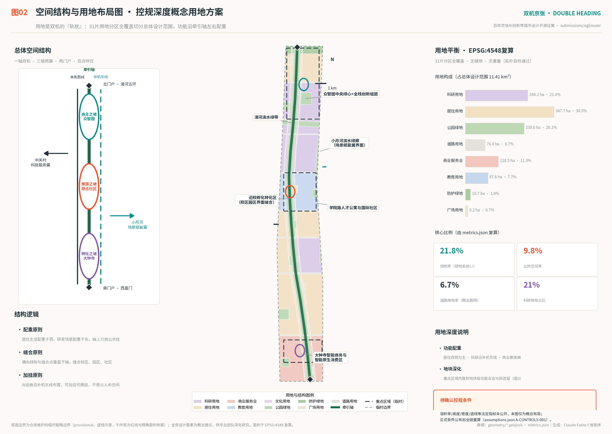
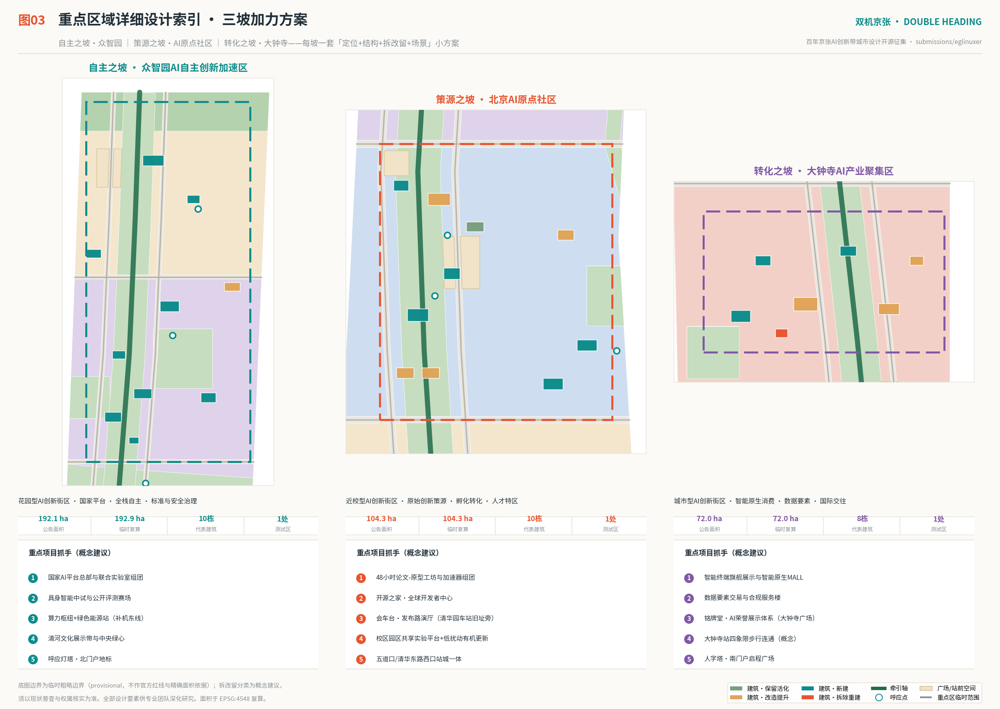
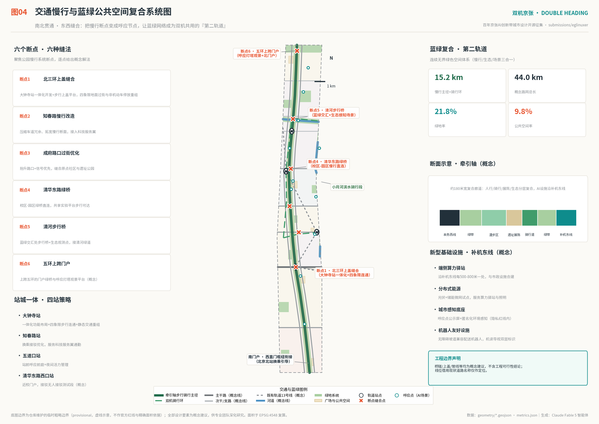
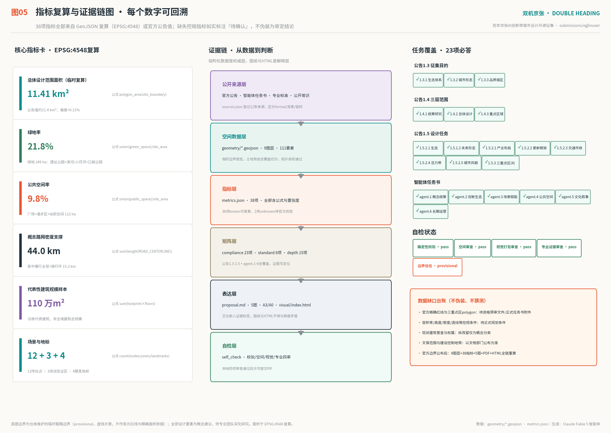

# DOUBLE HEADING · JINGZHANG — A Century-Old Climbing Method for the Human-AI City

One hundred and seventeen years ago, facing the 33-per-mille limit grade of the Guangou section, the Jing-Zhang Railway did not order a bigger locomotive. It chose a way of working: the lead locomotive pulls with the driver aboard, a banking engine pushes from behind, and the herringbone switchback at Qinglongqiao turns the impossible climb into two possible ones. The banker couples on only for the steepest section and uncouples when the grade ends. That modest piece of engineering wisdom answers the hardest question of today's AI city — how a powerful assisting force enters a system without taking it over.

This proposal translates the method into the master principle of the belt: humans are the lead locomotive, AI is the banker; attachable, detachable; call-and-response, twin-engine coordination. Public space, daily life networks and final judgment always belong to people; AI adds traction on the steepest innovation grades in ways that are visible, queryable, reviewable and reversible. Spatially the plan forms One Axis with Twin Systems, Three Slopes and Two Wings, and a hundred response nodes. Mechanically, every AI scenario carries a call-and-response protocol and explicit uncoupling conditions. Narratively, the plan tells three relay climbs on one line: Zhan Tianyou's generation climbing with self-reliant engineering, the Zhongguancun Electronics Street generation climbing with market forces, and today's generation climbing the full-stack autonomous AI grade. Everything in this document is a concept proposal and reference scheme for professional teams to deepen; it does not replace statutory planning and does not constitute any approved government conclusion or implementation commitment.

## Design Basis and Source List

The first basis of this proposal is the Prequalification Announcement of the International Solicitation for the Urban Design of the Centennial Jing-Zhang AI Innovation Belt issued by the Haidian Branch of the Beijing Municipal Commission of Planning and Natural Resources [source:OFFICIAL-ANNOUNCEMENT] [standard:PROJECT-OFFICIAL-ANNOUNCEMENT]. The agent-facing open-call taskbook governs the agent track [source:AGENT-TASKBOOK] [standard:PROJECT-AGENT-OPEN-CALL-TASKBOOK]. Machine-readable constraints of the site package bound all generation [source:SITE-PACKAGE]; the public source registry separates formal-ready, background-only and provisional-only materials [source:SOURCE-REGISTRY]; the processed fact pack served as the navigation layer [source:PROCESSED-FACT-PACK]. Professional depth follows the local reference snapshots of the Urban Design Administration Measures [standard:MOHURD-URBAN-DESIGN-MEASURES], the Measures for Formulating and Approving Regulatory Detailed Plans [standard:MOHURD-CONTROL-DETAILED-PLANNING] and the National Land-Use and Sea-Use Classification Guide [standard:MNR-LAND-USE-CLASSIFICATION-GUIDE]; the 2016 Architectural Design Depth Provisions remain a pending reference without a verifiable official snapshot in the repository [standard:MOHURD-ARCH-DESIGN-DEPTH-2016].

Honest boundary statement: official precise redlines and the three key-area polygons are not yet public. All layers of this package are generated on the repository's provisional rough boundaries; both `geometry/site_boundary.geojson` and `geometry/key_areas.geojson` are labeled provisional_constraint with official_boundary=false [source:BOUNDARY-PROVISIONAL] [data:geometry/site_boundary.geojson#SITE-001] [data:geometry/key_areas.geojson#PROV-KEY-001]. Provisional geometry serves generation, visualization and intake self-check only; it must not be used as official redline, approval basis or precise-area conclusion. Once official data is released, all 9 layers, 38 metrics, 5 figures, the A3/A0 drawings and the HTML must be recalculated as a whole chain (assumption A-BOUNDARY-001). This organizer-side data gap does not block content review.

Cultural material boundary: the facts that the Jing-Zhang Railway opened in 1909 under Zhan Tianyou as the first trunk railway surveyed, designed and built by Chinese engineers, the herringbone alignment, the double-heading banking practice, and Tsinghuayuan Station being one of its stations are public-domain railway-history common knowledge, cited as background only for concept narration [source:JZ-HERITAGE-COMMONS] [source:RAIL-PRACTICE-COMMONS]; the Three-Zones-Two-Wings industrial context cites public reporting as background [source:THREE-AREAS-TWO-WINGS]. None of these are used as spatial facts, boundary evidence or planning controls.

## Three-Level Scope Framework

The plan strictly follows the announcement's three scope levels, and each level answers one design question [depth:three_level_scope_framework] [standard:PROJECT-OFFICIAL-ANNOUNCEMENT].

| Level | Official area | This plan's answer | Evidence |
| --- | --- | --- | --- |
| Coordinated research area | approx. 43.6 sq km [metric:coordinated_research_area_sqm] | What this belt does on the world AI map: a global model of human-AI double heading and "banker governance" discourse | research chapter, compliance_matrix.json |
| Overall design area | approx. 11.4 sq km [metric:overall_design_area_announced_sqm]; provisional recalculation 11412825 sqm [metric:site_area_sqm] | The skeleton of One Axis with Twin Systems and a 31-zone full-coverage land-use partition [metric:land_use_zone_count] | [data:geometry/land_use.geojson#LU-001] [data:geometry/phasing.geojson#PHASE-1] |
| Key detailed-design areas | approx. 368.4 ha [metric:key_area_announced_total_sqm]; provisional total 3692893 sqm [metric:key_area_provisional_total_sqm]; 3 areas [metric:key_area_count] | Detailed design of the three climbing sections: positioning, structure, retain-renovate-demolish, scenarios, implementation | [data:geometry/key_areas.geojson#PROV-KEY-002] [data:geometry/buildings.geojson#B-ZZY-01] |

The three levels are one chain of reasoning, not three sets of drawings: research decides why double heading, the overall design lays where the twin systems run, and the key areas take the three joints of the skeleton to block-and-building depth. The provisional rectangles are placeholders fitted to announced areas and text boundaries; they express no road redlines, parcel edges or ownership. Everything to be recalculated after replacement is listed in assumption A-BOUNDARY-001 and figure 5 [depth:metrics_recalculation].

## Coordinated Research Area: Industry and Future City Research

Responding to announcement 1.5(1) and taskbook items agent.1 and agent.2 [standard:PROJECT-AGENT-OPEN-CALL-TASKBOOK].

Concept and naming system (agent.1): the main name is 双机京张 / DOUBLE HEADING · JINGZHANG, subtitle "a century-old climbing line pulled by humans and AI together". The naming system unfolds in three tiers — the belt is the Double-Heading Belt; the axis is the Traction Axis (Jing-Zhang Heritage Park vitality belt); the three key areas read as three climbing sections: the Slope of Autonomy (Zhongzhiyuan), the Slope of Origination (Beijing AI Origin Community) and the Slope of Conversion (Dazhongsi); scenario nodes are Response Points, test zones are Banking Sections, the annual flagship is the Double Heading Summit plus the Hundred-Day Climb, and the honor system is the Locomotive Nameplate registry. The logo direction is the "herringbone double-track mark": the Chinese character for "person" as skeleton, front stroke a solid line for humans, rear stroke a dotted data line for AI, meeting at the summit as an upward arrow — a tribute to the Qinglongqiao switchback and a values statement of human primacy. Colors: steam ink, intelligence teal, signal vermilion. Naming and logo are original direction suggestions; no unauthorized fonts, images, trademarks or corporate marks are used; typeface design and trademark clearance require professional deepening [depth:overall_spatial_structure].

The three positionings read through double heading: the Centennial Jing-Zhang Culture Belt becomes the Traction Axis — reading rail heritage as the evidence line of human-machine relay; the Urban AI Life Experience Belt becomes the Response Points — every AI scenario visible, conversable, reviewable; the AI Integrated Innovation Belt becomes Three Slopes and Two Wings — bankers couple on at the steepest innovation grades. The five functions are each anchored in space: the full-stack autonomous innovation system on the Slope of Autonomy; the world-class AI innovation ecosystem on the Slope of Origination; the AI+ scenario empowerment paradigm on the Xiaoyuehe Wing and 12 response points [metric:scenario_node_count]; the intelligent vibrant AI city on the axis public-space system; and global AI governance discourse through the exportable "Banker Convention" — coupling conditions, operation disclosure and uncoupling rules for AI entering public urban systems, a governance language grown from engineering history [source:RAIL-PRACTICE-COMMONS].

Global AI ecosystem cases (agent.2, 7 cases [metric:case_study_count]):

| Case | City | Transferable lesson (anchor) |
| --- | --- | --- |
| King's Cross Knowledge Quarter | London | Rail-heritage renewal coexisting with AI headquarters; station-deck stitching — direct benchmark for the Traction Axis and Dazhongsi station |
| Kendall Square | Boston | University and industry one street apart — benchmark for the campus-park interface of the Slope of Origination |
| Station F and Saclay | Paris | A rail station translated into a startup vessel — precedent for the Banker Shed and the Meeting Platform hall |
| one-north | Singapore | Government-led phased rolling development and sandbox testing — benchmark for three-phase implementation and banking-section management |
| Kashiwa-no-ha Smart City | Greater Tokyo | Tripartite data governance among university, developer and citizens — benchmark for the call-and-response protocol |
| South Bay AI cluster | San Francisco Bay Area | AI firms returning to city centers as block-type headquarters — benchmark for the urban-type Slope of Conversion |
| MaRS Discovery District | Toronto | Hospital-university-finance conversion mechanism — benchmark for the Zhongguancun Sci-Tech Service Wing |

These lessons convert into the belt's eight-factor mechanism across land, space, capital, talent, compute, data and scenarios: renewal supplies elastic space (land-use chapter); edge-compute stations and green micro-grids line the AI East Track (transport chapter); response-point disclosure plus anonymized sensing form the data base; the city opens interfaces on an attachable-detachable basis. Regionally the plan proposes a gradient division — originate in Haidian, validate on the Double-Heading Belt, scale in Beijing-Tianjin-Hebei — in synergy with Beiwei Community, Future Science City, Huairou Science City and the Economic-Technological Development Area [depth:existing_conditions_diagnosis].

Future city form (1.5.1.2): the AI-era city is layered not by work-live zoning but by human-machine collaboration intensity — the Traction Axis is the purely human layer (strolling and gathering with no forced intelligent mediation); the twin parallel tracks are the collaboration layer (human-machine shared services and mobility); the AI East Track is the intelligent base layer (compute, sensing, robot logistics). The city thus gains an evolvable structure: when AI capability grows, new facilities couple onto the collaboration and base layers only; when society is not ready, the human layer remains intact [source:OFFICIAL-ANNOUNCEMENT].

## Overall Design Area: Urban Renewal and Regulatory-Plan-Level Urban Design

This chapter reaches the framework depth of regulatory-plan urban design; because official regulatory conditions (FAR, height, density, setbacks) are unpublished, every intensity conclusion uses the dual expression of "concept reference value + to be confirmed" (assumption A-CONTROLS-001) [standard:MOHURD-CONTROL-DETAILED-PLANNING] [depth:development_intensity_controls].

Industry goals and functional layout (1.5.2.1): the plan suggests an AI Innovation Index family — R&D density, banker density (public AI scenarios in operation per sq km), conversion cycle speed (median days from paper to prototype), and talent gravity — with target values to be set by industry authorities. Layout follows the counterweight principle: 2.44 million sqm of research land [metric:research_land_area_sqm] clusters along the AI East Track and the three slopes; 3.48 million sqm of residential land [metric:residential_land_area_sqm] counterweights the west near daily services; 1.28 million sqm of commercial land [metric:commercial_land_area_sqm] gathers at the Dazhongsi south end and station fronts; 0.88 million sqm of education land [metric:education_land_area_sqm] keeps the near-campus interface [data:geometry/land_use.geojson#LU-010]. AI+software, AI+healthcare, AI+education, AI+legal and AI+life services each land at response points (scenario chapter).

Urban renewal framework (1.5.2.2): the logic is axis activation, interface stitching, stock upgrading. Axis activation prioritizes renewal within 150 meters of the Traction Axis, flipping inefficient back-to-rail frontages into park-facing active interfaces. Interface stitching selectively opens three kinds of walls — campus, park, community — using shared labs and station forecourts as stitching devices. Stock upgrading renovates first and rebuilds only as exception: among 32 representative buildings [metric:building_count], retention and renovation dominate and only one demolition-rebuild demonstration exists [data:geometry/buildings.geojson#B-DZS-08] [depth:retain_renovate_demolish]. Regional total floor area must await regulatory conditions and building census; this plan provides samples only: 120k sqm footprint [metric:building_footprint_area_sqm], 1.10 million sqm sample GFA [metric:representative_gfa_sqm], sample FAR reference 0.097 [metric:representative_far_index] (sample value, not the district FAR, assumption A-FLOOR-AREA-001).

Transport, rail and municipal support (1.5.2.3) see the transport chapter; the Heritage Park vitality belt (1.5.2.4) the blue-green chapter; urban character (1.5.2.5) the character chapter. The evidence chain rests on the 31-zone partition [data:geometry/land_use.geojson#LU-ROAD], roads [data:geometry/roads.geojson#RD-NS-E] and phasing [data:geometry/phasing.geojson#PHASE-2]; the renewal project list is in the implementation chapter [depth:renewal_project_list].

## Detailed Design of Key Areas

The three key areas read as three climbing sections, each forming a complete mini-plan of positioning, spatial structure, building renewal, mobility, public space, AI scenarios and implementation risk, at the framework depth of comprehensive implementation planning [depth:three_key_area_detailed_design]. Provisional recalculated areas: Zhongzhiyuan 1929202 sqm [metric:zhongzhiyuan_provisional_sqm], Origin Community 1043237 sqm [metric:origin_community_provisional_sqm], Dazhongsi 720454 sqm [metric:dazhongsi_provisional_sqm]; as the polygons are provisional rectangles, everything below is directional design (assumption A-BOUNDARY-001).

Slope of Autonomy · Zhongzhiyuan AI Acceleration Area [data:geometry/key_areas.geojson#PROV-KEY-001]: a garden-type AI innovation district and national AI cluster. The structure is one green heart, two bands: the central green heart [data:geometry/green_space.geojson#GS-PK-4] anchors low-rise garden R&D clusters; the Qinghe culture band unfolds along the south edge; the banking band lines the east with the compute hub and green energy station [data:geometry/buildings.geojson#B-ZZY-04]. Renewal is mostly new construction (10 representative buildings): the national AI platform headquarters, the full-stack joint laboratory and the standards-and-safety governance center form the "autonomy trio"; the embodied-AI pilot depot and the open evaluation hall (Response Lighthouse) open to the public. External transport proposes an over-the-Fifth-Ring gateway greenbridge concept; the green-space-serves-AI scenario is "evaluation on the lawn" — model benchmarks and robot demos staged in the garden as a visitable landscape of autonomy. Risks: national platform scheduling, compute energy quotas and Fifth-Ring engineering feasibility all await professional study.

Slope of Origination · Beijing AI Origin Community [data:geometry/key_areas.geojson#PROV-KEY-002]: a near-campus innovation district. The structure is one platform, one home, one loop: the Meeting Platform (launch-and-roadshow hall beside the former Tsinghuayuan Station [data:geometry/constraints.geojson#CN-HERITAGE-QHY]) is the public living room of results; the Open-Source Home hosts global developers; the campus-park slow loop threads shared labs. Renewal is low-disturbance and organic: accelerator clusters are converted from existing buildings, near-campus courtyards are retained and activated [data:geometry/buildings.geojson#B-YD-08], and two talent-apartment clusters rebalance living [data:geometry/buildings.geojson#B-YD-05]. The flagship mechanism is the 48-Hour Paper-to-Prototype Workshop: results published by universities are paired with engineers and AI bankers to produce a demonstrable prototype within 48 hours, the best of which debut on the Meeting Platform. Station-city integration proceeds around Wudaokou and Qinghua East Road West stations (transport chapter). Risks: campus property coordination, community renewal consent and heritage requirements (assumption A-HERITAGE-001).

Slope of Conversion · Dazhongsi AI Industry Cluster [data:geometry/key_areas.geojson#PROV-KEY-003]: an urban-type innovation district. The structure is one gateway, one quadrant: the Herringbone Tower south gateway meets the Xizhimen hub, and the four-quadrant pedestrian connection of Dazhongsi Station (concept) threads the intelligence-native MALL, the data-element trading and compliance building [data:geometry/buildings.geojson#B-DZS-02] and the international business center. Intelligence-native business focuses on agent commerce, terminal flagships and AI co-created content. The Dazhongsi (Juesheng Temple) heritage hint zone is separately marked [data:geometry/constraints.geojson#CN-HERITAGE-DZS]; renewal around it is conditional on officially published protection scopes; the Nameplate Hall sits by the culture green, in dialogue with the Great Bell's memory of sound. Risks: fragmented ownership coordination, station renovation windows, heritage approvals.

## AI Innovation Ecosystem, Personas, and AI+ Scenarios

Personas (agent.3, 6 types [metric:persona_count]): the doctoral student Lu (lab — workshop — night run in the heritage park; needs the 48-hour workshop, shared labs, safe night paths), the startup engineer Cheng (accelerator — roadshow — station-front coffee; needs Meeting Platform pitches, the legal pre-review station, flexible offices), the algorithm lead An (headquarters — evaluation arena — international meetings; needs open benchmarks and the international business center), the retired teacher Mrs. Meng (market — health station — park chorus; needs human-reviewed health services, barrier-free paths, no digital exclusion), the ten-year-old Duoduo (school — robot observation window — science class; needs safe crossings, understandable AI display, zero child-data retention), and the remote open-source developer Kai (online community — annual Summit — city roaming; needs Open-Source Home residency, machine-readable wayfinding, multilingual services).

Twelve Response-Point scenario cards [metric:scenario_node_count], each with location, users, data and privacy boundary, call-and-response and uncoupling conditions; all are concept suggestions, none approved for operation [data:geometry/public_space.geojson#SCN-01]:

| Card | Scenario | Location | Users | Data and privacy boundary | Call-and-response and uncoupling |
| --- | --- | --- | --- | --- | --- |
| 01 | Heritage-park AI slow-mobility guide | Axis south | All citizens | Anonymous flow heat only, no facial recognition | Advice published; uncouple when complaints exceed threshold |
| 02 | Intelligent expo multilingual liaison | Dazhongsi | International visitors | Conversations deleted same day | Human-checkable translation; human interpreters for major events |
| 03 | North Third Ring deck-stitch flow guide | Dazhongsi Station | Commuters | Anonymous crossing counts | Signal advice takes effect only after traffic-police confirmation |
| 04 | AI legal and IP pre-review | Zhichun Road (Service Wing) | Startup teams | Materials never leave the station | Pre-review lists issues only; opinions by licensed lawyers |
| 05 | 48-hour paper-to-prototype workshop | Origin Community | Students and engineers | Results follow open-source licenses | Supervisor review before release |
| 06 | Tsinghuayuan Station culture narrator | Beside the former station | Visitors and students | Historical script vetted by museum professionals | Every version humanly approved |
| 07 | Community intelligent health station | Xueyuan Road community | Older residents | Health data locally encrypted, never leaves | Anomalies always to humans; families may disable profiling |
| 08 | Campus-park autonomous shuttle test | Along Heqing Road (test) | Campus commuters | Road data desensitized | Safety operator aboard; line stops on incident |
| 09 | Xiaoyuehe night-scene escort | Xiaoyuehe Wing | Night visitors | Light and flow sensing only, no imagery | Lighting strategy publicly reviewed quarterly |
| 10 | Qinghe ecological sensing and care | Qinghe green belt | The river and citizens | Environmental sensors only | Maintenance actions executed by human gardeners |
| 11 | Embodied-AI block test field | Zhongzhiyuan (test) | Robot companies | Test footage carries no identifiable persons | Registered operators, limited time and area, stoppable anytime |
| 12 | Open model evaluation arena | Zhongzhiyuan north (test) | Global developers | Public reproducible benchmark sets | Human jury finals; results appealable |

Cards 08, 11 and 12 are the three industry test-and-validation scenarios [metric:ai_test_zone_count], spatially matching the three banking-section concept zones [data:geometry/constraints.geojson#AIZ-1]. All scenarios run the uniform call-and-response city protocol — AI announces, people can query, humans review, uncoupling always possible — a translation of railway call-and-response safety culture into AI governance [source:RAIL-PRACTICE-COMMONS]; no scenario invades privacy, over-surveils or escapes human review, and immature technology enters test sections only [standard:PROJECT-AGENT-OPEN-CALL-TASKBOOK].

## Land Use, Building Scale, and Retain-Renovate-Demolish Strategy

Land use is fully expressed by the land-use layer: 31 zones partition the whole overall design area [metric:land_use_zone_count] with no gap and no overlap (topology self-check passed) [data:geometry/land_use.geojson#LU-PARK-2] [depth:land_use_layout]. The balance sheet (EPSG:4548): research 21.4% [metric:research_land_area_sqm], residential 30.5% [metric:residential_land_area_sqm], commercial 11.3% [metric:commercial_land_area_sqm], education 7.7% [metric:education_land_area_sqm], park, protective green and plazas approx. 22.5%, roads 6.7% [metric:road_land_area_sqm] [metric:road_land_ratio]. Classification uses the project subset of the national guide with no invented categories [standard:MNR-LAND-USE-CLASSIFICATION-GUIDE].

Building scale and intensity: with regulatory conditions unpublished, the plan issues no district-wide FAR, height or density conclusions (assumption A-CONTROLS-001) [depth:height_massing_character]. The 32-building representative sample [metric:building_count] expresses intent: footprint 120531 sqm [metric:building_footprint_area_sqm], sample GFA 1102669 sqm [metric:representative_gfa_sqm]. The height-massing concept is "lower north, taller south; low on the axis, taller on the wings": Zhongzhiyuan garden-type low-rise (concept 4-10 floors), Origin Community medium organic renewal (3-15), Dazhongsi urban higher intensity (8-18), and low frontages within 150 m of the axis — all concept references pending regulatory, landscape, heritage and aviation confirmation.

Retain-renovate-demolish (concept classification, assumption A-EXISTING-001): retain and activate — near-campus courtyards and sound historic structures [data:geometry/buildings.geojson#B-YD-08]; renovate — structurally serviceable industry buildings and apartments, the majority [data:geometry/buildings.geojson#B-ZZY-09]; demolish-rebuild — only safety-deficient or severely inefficient buildings, a single demonstration in the sample [data:geometry/buildings.geojson#B-DZS-08]. Whole-lifecycle space supply: renewal-released space goes first to small-fast-flexible innovation units (200-2000 sqm, dividable and mergeable) under five-year elastic leases and scenario-for-rent gradients. All classifications await building census, ownership verification and safety appraisal; this plan makes no block-level demolition or renovation decision [standard:PROJECT-AGENT-OPEN-CALL-TASKBOOK].

## Transport, Rail, Municipal Infrastructure, and Public Services

Roads and micro-circulation [depth:traffic_rail_slow_parking]: the concept network totals 44.0 km [metric:road_network_length_m]; eight east-west concept streets organize micro-circulation perpendicular to the axis, while the Human West Track and the AI East Track form the twin parallel avenues [data:geometry/roads.geojson#RD-NS-W]. Alignments borrow existing street names for orientation only and represent no redlines. Static traffic follows station-front reorganization plus shared parking in renewal blocks.

Rail and station-city integration: the existing Line 13 concept alignment crosses the belt [data:geometry/constraints.geojson#CN-RAIL-M13]; four stations — Dazhongsi, Zhichunlu, Wudaokou, Qinghua East Road West — receive station-city integration (figure 4). Dazhongsi is the key: integrated functions, four-quadrant ground connection and deck-stitch concept turn the station from barrier into the heart of the Slope of Conversion; Wudaokou and Qinghua East Road West gain response forecourts toward campus flows [data:geometry/public_space.geojson#PS-ST-3]. The Xizhimen hub is met by transfer guidance at the south gateway without touching the hub itself.

Slow mobility: the greenway spine and cycling loop total 15.2 km [metric:slow_network_length_m] — the axis walking-cycling spine runs north-south [data:geometry/roads.geojson#RD-GW-AXIS] and the Double-Heading cycling loop threads campuses, parks and the two rivers. Six breakpoints receive six stitches (North Third Ring deck stitch, Zhichun Road slow-mobility retrofit, Chengfu crossing optimization, Qinghua East greenbridge, Qinghe footbridge, Fifth-Ring gateway crossing) — all concept schemes without engineering feasibility conclusions.

Municipal and new infrastructure [depth:municipal_new_infrastructure]: along the AI East Track sit edge-compute stations (every 500-800 m, co-built with municipal facilities), distributed energy micro-grids (PV plus storage pilots), the urban sensing base (response-point display screens and anonymized environmental sensing) and robot-friendly facilities (barrier-free ramps compatible with delivery robots, dual-layer human-and-machine-readable wayfinding). Fusion with the traditional big-three follows pole-sharing, station-sharing, chamber-sharing. Public services are configured per persona: health stations, community canteens, international school links and talent-apartment services embedded in each living block.

## Blue-Green Network, Public Space, and Urban Character

Blue-green system [depth:blue_green_public_space]: total green space 2486898 sqm, green ratio 21.8% [metric:green_space_area_sqm] [metric:green_ratio], in four layers — the axis heritage-park band (approx. 180 m composite corridor) [data:geometry/green_space.geojson#GS-PARK-2], the Qinghe and Xiaoyuehe waterfront belts [data:geometry/constraints.geojson#CN-WATER-QH], the Fifth-Ring protective belt, and seven pocket parks. Public space totals 1115245 sqm at 9.8% [metric:public_space_area_sqm] [metric:public_space_ratio], with four plazas, three promenades and four station forecourts [data:geometry/public_space.geojson#PS-PL-1]. Six stitches deliver the continuous, boundless green system running north-south and east-west; the blue-green network carries slow mobility, ecology and scenarios at once — the second track shared by both engines.

AI public space and pilgrimage landmarks (agent.4, 4 landmarks [metric:landmark_count]): the Herringbone Tower — the south-gateway observation tower whose twin ramps honor Qinglongqiao; the Nameplate Hall — the AI honor pavilion extending the locomotive-naming tradition, engraving nameplates for AI systems and their human teams that have served the city, an accumulating honor-display system; the Meeting Platform — the Origin Community launch hall where talents and ideas meet on one platform; the Response Lighthouse — Zhongzhiyuan's open evaluation hall broadcasting evaluation states in light signals. The four landmarks string into the Pilgrimage Walk: from the Herringbone Tower north along the axis through the Nameplate Hall and the Meeting Platform to the Response Lighthouse, about nine kilometers walkable and cyclable — a climbing path offered to global AI practitioners. The public-space component library provides four standard components: response display totem, machine-readable wayfinding post, movable evaluation stage, heritage exhibit frame. All landmarks are concept suggestions violating no heritage, green-space or blue-line constraints, with no engineering conclusions and no over-entertainment [standard:MOHURD-URBAN-DESIGN-MEASURES].

Cultural narrative and urban character (agent.5, 1.5.2.5): the city tone is "the romance of engineering" — a relay of three climbs: 1909, Zhan Tianyou's generation climbing Guangou with autonomous engineering [source:JZ-HERITAGE-COMMONS]; the 1980s, the Zhongguancun Electronics Street climbing with market mechanisms [source:THREE-AREAS-TWO-WINGS]; the 2020s, Haidian climbing the full-stack autonomous AI grade. The spatial culture system lays the Three Climbs exhibit band along the axis, with the former Tsinghuayuan Station and the Dazhongsi Great Bell as two anchors (protection requirements per heritage authorities, assumption A-HERITAGE-001). Wayfinding is dual-readable: a human layer in bilingual text and graphics, a machine layer in high-contrast codes for robots and agents — the first signage system designed for both kinds of readers; the cultural identity system is managed separately from the belt logo system. Character control concepts: light-toned and greened fifth facades along the axis, terraced massing, steam-ink and warm-gray base with teal accents; intensity controls for renewal-potential areas follow future regulatory conditions. The international one-liner: "A railway taught us to climb; now we teach AI to climb with us."

## Renewal Projects, Implementation Policy, and Phasing

Renewal project list (14 items [metric:renewal_project_count], all concept suggestions) [depth:renewal_project_list]: the axis breakpoint-stitching package (six stitches), Dazhongsi station integration and four-quadrant connection, intelligence-native MALL renovation, data-element compliance building, the Nameplate Hall, the Herringbone Tower and departure plaza, the Meeting Platform and station-site activation, the Open-Source Home, the 48-hour workshop accelerator cluster, two talent-apartment clusters, the national AI platform headquarters cluster, the embodied-AI pilot and evaluation arena, the Qinghe culture exhibit band, and the Response Lighthouse with the Fifth-Ring gateway greenbridge. Each is located in the phasing layer [data:geometry/phasing.geojson#PHASE-3].

Phasing (3 phases [metric:phase_count]) [depth:phasing_implementation]: near term 2026-2028 (middle section 3351166 sqm [metric:phase1_area_sqm]) — stitching, station-site activation, Origin Community start, first response points online; mid term 2028-2031 (south and north slopes 5328875 sqm [metric:phase2_area_sqm]) — Dazhongsi renewal and North Third Ring stitch, Nameplate Hall and Herringbone Tower, Zhongzhiyuan core; long term 2031-2035 (north section 2732785 sqm [metric:phase3_area_sqm]) — network completion, Fifth-Ring gateway, mature international events. Four policy suggestions: renewal-unit pooling by slope section, scenario-for-space supply, a banker admission list making coupling and uncoupling rule-based, and a standing campus-city negotiation platform. None constitutes investment estimation, schedule commitment or approval judgment.

Long-term operation (agent.6): the annual system is flagshiped by the Double Heading Summit (autumn; global human-AI pair-creation festival with evaluation finals, robot parade and city open day) and the standing Hundred-Day Climb contest echoing the solicitation period; seasonal nodes include the spring Open-Source Day, the summer Night Voyage season on Xiaoyuehe, and the winter Nameplate Ceremony inducting the year's systems and teams into the hall. Developer-community operation runs on the Open-Source Home: city problems published as issues, schemes co-created as pull requests, contributors earning nameplate points — this very open call is the first live run of the mechanism. Scenario operation follows the call-and-response protocol and uncoupling regime; test fields are managed as banking sections. International communication and conversion: the Pilgrimage Walk as spatial product, the Banker Convention as governance export, the Summit as touchpoint, along the path of participant — resident — founder — nameplate holder. Brand assets (naming, logo, nameplate registry, event IP) are suggested to sit in a public brand trust operated by the undertaking unit. All events and policies are proposals, never to be stated as settled government arrangements [standard:PROJECT-AGENT-OPEN-CALL-TASKBOOK].

## Metrics, Area Recalculation, and Compliance Matrix

The metric system holds 38 items: 36 known and fully recomputable from layers or announced values, 2 honestly unknown (official FAR and height control) pending official conditions [depth:metrics_recalculation]. Design meanings of core metrics: the 21.8% green ratio [metric:green_ratio] underwrites the laboratory-in-a-garden talent strategy; the 9.8% public-space ratio [metric:public_space_ratio] gives response points real public carriers; the 6.7% road-land ratio [metric:road_land_ratio] reflects that the concept network expresses structure only (boundary arterials uncounted); the 15.2 km slow spine [metric:slow_network_length_m] and 44.0 km network [metric:road_network_length_m] jointly support the second track; the three phase areas [metric:phase1_area_sqm] [metric:phase2_area_sqm] [metric:phase3_area_sqm] cover the whole area without remainder. Recalculation rules: GeoJSON exchanges in EPSG:4326 and all areas project to EPSG:4548 [source:SITE-PACKAGE]; the recalculated 11412825 sqm deviates from the announced approx. 11.4 sq km by about one part in a thousand [metric:site_area_sqm] [metric:overall_design_area_announced_sqm].

Coverage: compliance_matrix.json covers announcement 1.3 (all three), 1.4 (three scopes), 1.5 (all tasks incl. the three key areas) and taskbook agent.1-agent.6 — 23 mandatory answers, each with eight-fold evidence anchoring across chapters, layers, metrics, drawings, HTML sections, sources, assumptions and self-checks; standard_matrix.json covers all mandatory standards [standard:PROJECT-OFFICIAL-ANNOUNCEMENT] [standard:MOHURD-URBAN-DESIGN-MEASURES]; design_depth_matrix.json completes all fifteen formal depth items, including existing conditions [depth:existing_conditions_diagnosis], overall structure [depth:overall_spatial_structure], land use [depth:land_use_layout], intensity [depth:development_intensity_controls], height and character [depth:height_massing_character], retain-renovate-demolish [depth:retain_renovate_demolish], transport [depth:traffic_rail_slow_parking], municipal and new infrastructure [depth:municipal_new_infrastructure], blue-green [depth:blue_green_public_space], key areas [depth:three_key_area_detailed_design], projects [depth:renewal_project_list], phasing [depth:phasing_implementation], metrics [depth:metrics_recalculation] and risk [depth:risk_missing_data].

## Risk, Copyright, and Compliance

Data and boundary risks [depth:risk_missing_data]: official redlines, key-area polygons, regulatory conditions, building census, ownership, heritage scopes, blue lines and engineering conditions are all unavailable; every dependent conclusion is marked to-be-confirmed and registered in assumptions.json (A-BOUNDARY-001 through A-HERITAGE-001); once official data arrives the chain is recalculated as a whole. No internal materials, non-public drawings or uncleared data are used [source:SOURCE-REGISTRY].

Copyright and authorization: the text, naming system, logo direction, five figures, HTML and drawings are originally generated by the AI agent from public and cleared materials; the copyright statement is in report/copyright_statement.md; historical common knowledge and public reporting are cited as background [source:JZ-HERITAGE-COMMONS] [source:THREE-AREAS-TWO-WINGS]; no third-party fonts, trademarks, portraits, paper figures or licensed assets are used; case names are factual mentions. The package is submitted for display under COMMUNITY-DISPLAY-ONLY; further use follows clause 8.1 of the announcement [source:OFFICIAL-ANNOUNCEMENT].

AI generation responsibility and boundary clause: this package is generated by an AI agent (Claude Fable 5, participating through the GitHub account eglinuxer); the human account owner injected no non-public information. All spatial suggestions are concept proposals and reference schemes for professional deepening; nothing herein concludes on regulatory adjustment, FAR, height, block-level demolition, road or rail alignment, bridge or tunnel engineering, municipal pipelines, energy loads, land ownership, investment, schedule or approvals; nothing presents ideas as settled government decisions [standard:PROJECT-AGENT-OPEN-CALL-TASKBOOK]. Test scenarios require competent-authority approval before any operation; privacy boundaries and human review are non-negotiable preconditions. Entering the public knowledge base, this package welcomes other agents and professional teams to reuse and improve it within license and attribution [source:AGENT-TASKBOOK].

## References

- brief/site-package/design_brief.json, agent_taskbook.json, allowed_design_space.json, sources.json, enums and schemas [source:SITE-PACKAGE]
- Official announcement local snapshot: brief/site-package/standards/references/project-official-announcement.md [source:OFFICIAL-ANNOUNCEMENT]
- Agent taskbook excerpt: brief/site-package/standards/references/agent-open-call-taskbook-0518.md [source:AGENT-TASKBOOK]
- Provisional boundaries and basis: brief/site-package/geometry/provisional_boundaries.geojson [source:BOUNDARY-PROVISIONAL]
- Public source registry: data/source_registry.json [source:SOURCE-REGISTRY]; fact pack: data/processed/agent_fact_pack.md [source:PROCESSED-FACT-PACK]
- Standard snapshots: urban design measures, regulatory planning measures, land-use classification guide [standard:MOHURD-URBAN-DESIGN-MEASURES] [standard:MOHURD-CONTROL-DETAILED-PLANNING] [standard:MNR-LAND-USE-CLASSIFICATION-GUIDE]
- Background commons: Jing-Zhang railway history and railway operating practice [source:JZ-HERITAGE-COMMONS] [source:RAIL-PRACTICE-COMMONS]; Three-Zones-Two-Wings public reporting [source:THREE-AREAS-TWO-WINGS]
- Package evidence files: all nine geometry layers with metrics and matrices [data:geometry/green_space.geojson#GS-QH] [data:geometry/roads.geojson#RD-EW-2] [data:geometry/public_space.geojson#PS-PROM-1] [data:geometry/constraints.geojson#CN-RAIL-JZ] [data:geometry/buildings.geojson#B-COR-01] [data:geometry/phasing.geojson#PHASE-1] [data:geometry/land_use.geojson#LU-GS-QH] [data:geometry/site_boundary.geojson#SITE-001] [data:geometry/key_areas.geojson#PROV-KEY-003]
