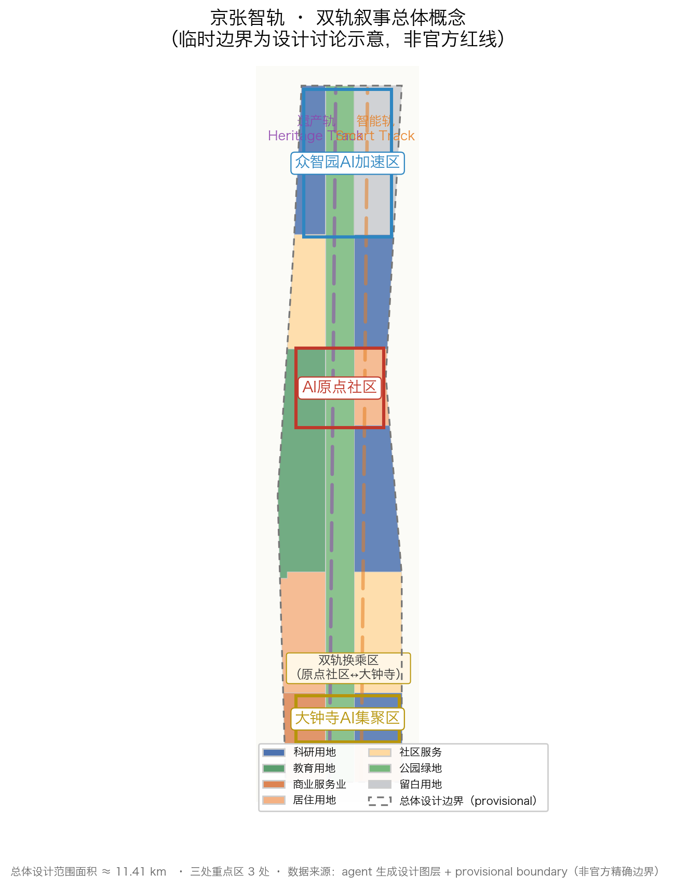
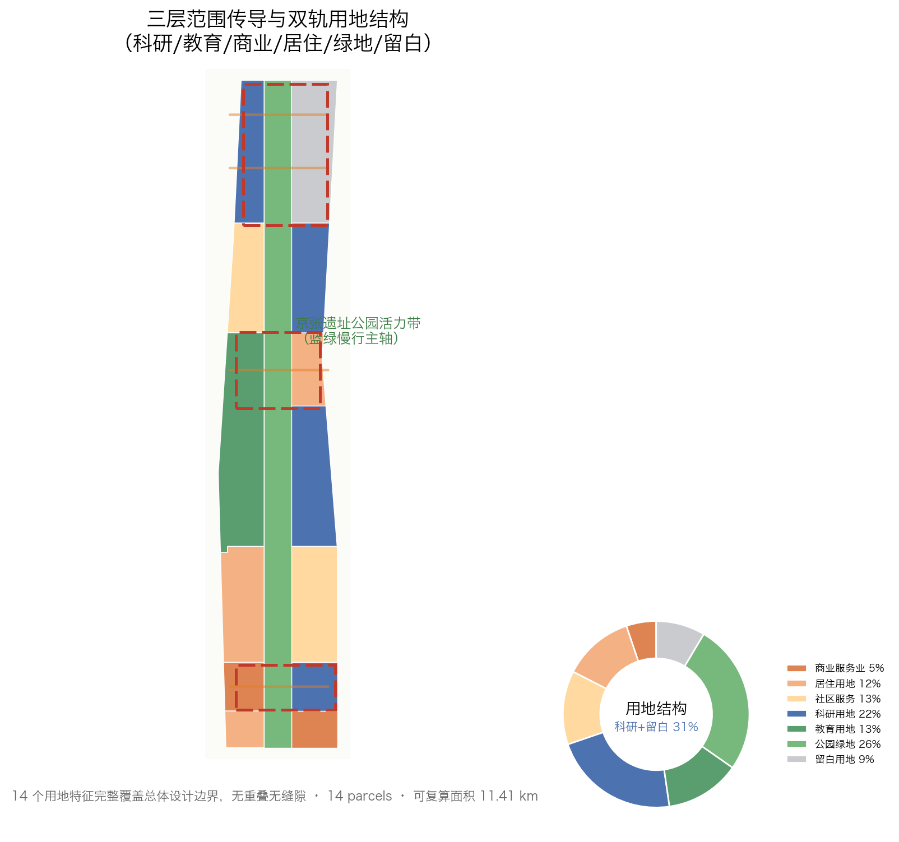
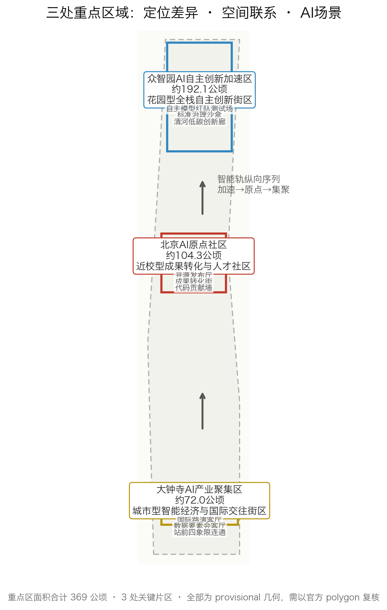
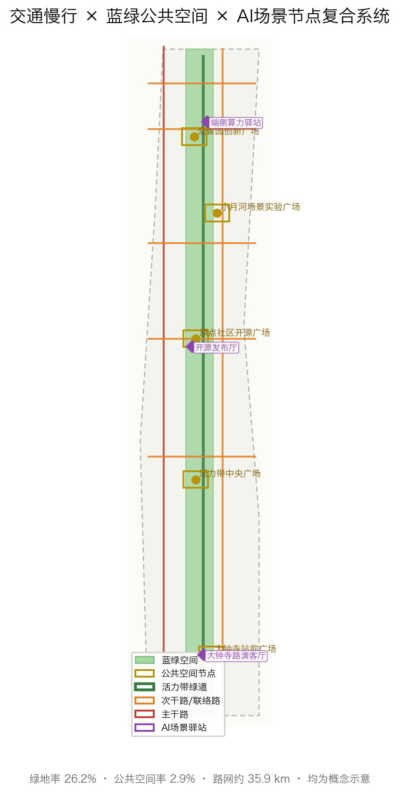
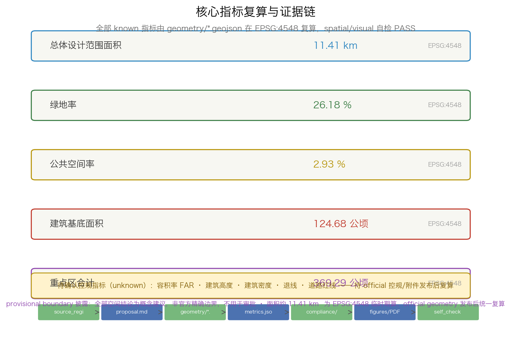

# JZ SmartTrack: A Dual-Track Narrative for the Jing-Zhang AI Innovation Belt

> A century ago, Zhan Tianyou's "herringbone" track carried the first Chinese-built mainline railway over the mountains.
> Today we turn that track into the twin rails of a city—one carrying history, the other opening toward the future.
> Every spatial conclusion in this proposal is a conceptual recommendation, a reference scheme, or material for professional teams to deepen; it is not an approved government decision.

## Design Basis and Source List

This formal proposal takes as its first authority the Qualification Pre-Announcement for the Centennial Jing-Zhang AI Innovation Belt International Urban Design Open Call published by the Haidian Branch of the Beijing Municipal Commission of Planning and Natural Resources [source:OFFICIAL-ANNOUNCEMENT]; sections 1.3, 1.4, and 1.5 govern the three-level scope, design tasks, and deliverable depth. The agent-facing open-call taskbook excerpt is machine-readable in `brief/site-package/agent_taskbook.json` [source:AGENT-TASKBOOK], adding the three positionings, five functions, three zones and two wings, six agent tasks, and ten co-creation principles. The repository site-package (design boundary, allowed design space, enums, ranges, standards, schemas, visual recommendations) and `data/source_registry.json` form the machine-readable working layer [source:SITE-PACKAGE][source:SOURCE-REGISTRY]; the processed pack `data/processed/agent_fact_pack.md` and its CSVs are a navigation layer [source:PROCESSED-FACT-PACK], not a new authority.

Because the official precise boundary and the three key-area polygons have not been published, this proposal follows the rules and adopts the provisional rough geometry in `brief/site-package/geometry/provisional_boundaries.geojson` [source:BOUNDARY-SOURCE][source:KEY-AREA-SOURCE], explicitly flagged in [data:geometry/site_boundary.geojson#SITE-001] and [data:geometry/key_areas.geojson#PROV-KEY-001] as `provisional_constraint` with `official_boundary=false`, used only for generation, self-check, visualization, and design discussion—not as an official redline, approval basis, or precise-area basis. This organizer data gap does not block content scoring; once official polygons are released, all boundaries, land use, buildings, roads, green space, phasing, and metrics will be recomputed.

Evidence follows the source-section-layer-metric-drawing-selfcheck chain [standard:PROJECT-OFFICIAL-ANNOUNCEMENT][standard:PROJECT-AGENT-OPEN-CALL-TASKBOOK][standard:MOHURD-URBAN-DESIGN-MEASURES][standard:MOHURD-CONTROL-DETAILED-PLANNING][standard:MNR-LAND-USE-CLASSIFICATION-GUIDE][standard:MOHURD-ARCH-DESIGN-DEPTH-2016][depth:existing_conditions_diagnosis]. The design covers all mandatory tasks 1.3.1 through 1.5.3.3, and the three matrices `compliance_matrix.json`, `standard_matrix.json`, `design_depth_matrix.json`, together with `self_check.json`, record the response evidence. Each chapter explains design intent, spatial layers, metric meaning, standard basis, and data gaps rather than dumping JSON.

## Three-Level Scope Framework

The proposal organizes work in the three levels set by the announcement and translates them into a spatial working framework of "one belt, two tracks, three cores, two wings, and multiple stations" [depth:three_level_scope_framework]. The Coordinated Research Area (43.6 km², anchored beyond the submitted boundary by `geometry/key_areas.geojson`) answers questions about the AI innovation ecosystem and future-city form; the Overall Design Area (11.4 km², this proposal's submitted boundary [metric:site_area_sqm]) carries urban renewal and regulatory-plan-level urban design; the Key-Area Detailed Design Area (368.4 ha, [metric:key_area_total_sqm], [metric:key_area_count]=3) carries the three detailed designs.

The "one belt" is the Jing-Zhang Heritage Park vitality belt—a north-south green spine stitching heritage, public space, and walking networks together. The "two tracks" are the core image of this proposal: the western **heritage track** carries the century-old Jing-Zhang cultural narrative and heritage protection, while the eastern **smart track** carries AI scenarios, industry, and public services; the two tracks "interchange" in the middle at the Origin Community and at Dazhongsi in the south, completing a narrative relay from history to future. The "three cores" map to the announcement's three key areas (Zhongzhiyuan, Beijing AI Origin Community, Dazhongsi AI Industry Cluster), the "two wings" map to the Zhongguancun Technology Services Wing and the Xiaoyue River Scenario Enablement Wing, and the "multiple stations" are a set of AI stations and pilgrimage landmark nodes.

Transmission across the three levels works as follows: the coordination level decides the industry chain and future-city judgment; the overall level translates that judgment into land-use, building, road, green, and public-space layers; and the key-area level verifies implementability at parcel, building, transport, and AI-scenario detail. `geometry/land_use.geojson` completely covers the submitted boundary without overlap or gaps, `geometry/phasing.geojson` expresses phasing, and `compliance_matrix.json` maps each announcement and agent task.

| Level | Design question | This proposal | Data anchor |
| --- | --- | --- | --- |
| Coordinated Research Area | How to organize the AI ecosystem and future-city form | Five-stage innovation chain: university origination–open-source collaboration–enterprise conversion–scenario access–global communication | [source:AGENT-TASKBOOK]、[standard:PROJECT-AGENT-OPEN-CALL-TASKBOOK] |
| Overall Design Area | How to draw renewal and regulatory-plan-depth work | Two-track structure, three cores, blue-green slow-traffic composite ring, renewal projects, phasing | [data:geometry/land_use.geojson#LU-001]、[data:geometry/roads.geojson#ROAD-001] |
| Key-Area Detailed Design Area | How to reach detailed-design depth in three areas | Distinct positioning, spatial moves, AI scenarios, and implementation dependencies | [data:geometry/key_areas.geojson#PROV-KEY-001] et al. |

## Coordinated Research Area: Industry and Future City Research

The core proposition of the Coordinated Research Area is to build a world-class AI innovation ecosystem. This proposal puts forward a "five-stage innovation chain": **university origination** (Haidian universities and institutes including Tsinghua, Beihang, BUPT) → **open-source collaboration** (open-source communities, code hosting, contribution walls) → **enterprise conversion** (full-stack independence, incubation and acceleration, leading enterprises) → **scenario access** (AI-enabled medical, education, transport, and public-service testing and validation) → **global communication** (global AI events, developer honor systems, pilgrimage landmarks). The chain responds to announcement 1.3.1 "Build a world-class AI innovation ecosystem" [standard:PROJECT-OFFICIAL-ANNOUNCEMENT] and maps one-to-one to the 5-8 global ecosystem cases required by agent.2 (see the AI Innovation Ecosystem chapter).

The future-city research answers how AI changes work, life, social interaction, learning, and public services. This proposal's judgment is that an AI city should not be a "patch" of technology labels pasted onto old space; the space itself must become a perceptible, verifiable, and reproducible test field. The coordination layer therefore proposes a "scenario density" concept: the AI station is the basic unit that grounds 10 scenario cards, 3 testing/validation scenarios, and 5 user personas as locatable functional zones and nodes, with spatial evidence from `geometry/public_space.geojson#PUBLIC-001`, `geometry/green_space.geojson#GREEN-001`, and [metric:public_space_ratio], [metric:green_ratio]. Naming and visual identity (see agent.1) serve the recognizability of the three positionings and do not replace statutory planning control.

For regional synergy, the coordination layer adds no pseudo-precise redlines; instead it connects through the innovation chain with Haidian's 1+X+1 industrial system and the three-zones-two-wings layout to form factor-flow relationships with Beifang community, Future Science City, Huairou Science City, E-Town, and the Beijing-Tianjin-Hebei region. All industrial spatial layouts are conceptual; investment, funding, and policy arrangements are not stated as settled, and conclusions involving FAR, building height, or retain-renovate-demolish are flagged as pending official regulatory confirmation [depth:development_intensity_controls][depth:overall_spatial_structure].

## Overall Design Area: Urban Renewal and Regulatory-Plan-Level Urban Design

The Overall Design Area must reach regulatory-detailed-planning urban-design depth. The proposal uses the "two-track structure" to govern urban renewal: the western heritage track arranges cultural, public, and green space along the heritage park, while the eastern smart track arranges research, industry, and talent-services space along Xueyuan Road–Dazhongsi; the two are stitched by horizontal green corridors and station nodes. `geometry/land_use.geojson` follows [standard:MNR-LAND-USE-CLASSIFICATION-GUIDE] with seven classes (research 0802, education 0804, commercial services 05, residential 0701, community services 0702, park green space 1401, reserve 16) in 14 features [metric:land_use_parcel_count], fully covering the boundary without overlap or gaps, all marked `design_proposal`.

Urban renewal follows a "retain–renovate–new-build–reserve" logic [depth:retain_renovate_demolish]: heritage park and heritage-protection objects are retained; existing industry, university, and community interfaces are mainly renovated; key areas support AI functions through renewal and moderate new construction; and flexible reserve land absorbs industrial uncertainty. `geometry/buildings.geojson` expresses 632 concept-scale massing blocks [metric:building_count] with a total footprint of about [metric:building_footprint_area_sqm], for massing studies only and not approved construction scale. Height, massing, and character are governed by [depth:height_massing_character] and remain pending where no official regulatory conditions exist.

For industry and spatial organization, the overall layer translates "three zones and two wings" into land-use relationships: Zhongzhiyuan supports full-stack independent innovation with research and reserve land; the Origin Community connects universities through education and research land; Dazhongsi forms a smart-economy cluster with commercial-services and research land; and the Zhongguancun wing's technology-services function penetrates through horizontal corridors. Parcel division, development intensity, setbacks, road redlines, and facility standards required at regulatory depth are listed in assumptions (A-CONTROLS-001) and the risk chapter as prerequisites for formal deepening, since official regulatory conditions are absent [depth:development_intensity_controls][source:SOURCE-REGISTRY].

## Detailed Design of Key Areas

The three key areas are the implementability verification layer [depth:three_key_area_detailed_design]. Each receives a distinct positioning, spatial moves, AI scenarios, and implementation dependencies, all expressed as conceptual recommendations that do not overstep government approval.

**Zhongzhiyuan AI Independent Innovation Acceleration Area** (`geometry/key_areas.geojson#PROV-KEY-001`, ~192.1 ha): positioned as a "garden-type full-stack independent-innovation block". Spatial moves: a low-carbon innovation and exchange corridor along the Qinghe waterfront; open test field, standards-governance sandbox, and safety-evaluation showcase inside the park; green space carries autonomous-model testing and low-carbon compute experience. AI scenarios: autonomous-model red-team testing, standards workshops, safety-governance showcase, edge-compute station. Dependencies: river blue line, ecological and flood-control conditions, and the resource position of national AI platforms.

**Beijing AI Origin Community** (`geometry/key_areas.geojson#PROV-KEY-002`, ~104.3 ha): positioned as a "campus-adjacent conversion and talent community". Spatial moves: stitch campus, park, and neighborhood walking networks; add release halls, talent-special-zone services, open-source collaboration space, and residential support; advance transit-station integration around stations. AI scenarios: open-source release hall, conversion street, code contribution wall, AI education experience point. Dependencies: campus boundary, ownership, ground-floor uses, open-source system, and talent-policy connection.

**Dazhongsi AI Industry Cluster** (`geometry/key_areas.geojson#PROV-KEY-003`, ~72.0 ha): positioned as an "urban smart-economy and international-exchange block". Spatial moves: four-quadrant pedestrian connectivity around Dazhongsi station, renewal of public environment around key enterprises, international roadshow hall, intelligent-agent and smart-terminal showcase, content consumption, and data-element service interface. AI scenarios: international roadshow hall, data-element parlor, agent showcase window, station-square smart wayfinding. Dependencies: transit station, road intersections, municipal pipelines, and commercial-services conditions.

Spatial linkage: the smart track connects Zhongzhiyuan and the Origin Community; the heritage track continues from the Origin Community to Dazhongsi, forming an "accelerate → origin → cluster" innovation sequence. `compliance_matrix.json` covers 1.5.3.required, 1.5.3.1, 1.5.3.2, and 1.5.3.3; the A3 booklet and A0 boards contain area general plans and details; the HTML page lets reviewers switch among the three areas.

## AI Innovation Ecosystem, Personas, and AI+ Scenarios

This chapter writes the readable outputs of agent.2 and agent.3. **Global AI ecosystem cases (agent.2, 5-8)**: the proposal studies and converts mechanisms rather than copying names—1) Stanford-adjacent campus conversion corridor; 2) Kendall Square's mixed "pharma+compute" block; 3) Shenzhen Nanshan's full-stack open-source ecosystem; 4) Tel Aviv's startup density + government scenario procurement; 5) Zurich/Munich's industry–university dual-track parks; 6) Hangzhou Future Sci-Tech City's talent-community + scenario-operation model; 7) Tokyo/Yokohama's digital bay area + international-exhibition operation. These distill into five transferable mechanisms: campus-adjacent conversion, open-source collaboration, scenario access, talent special zones, and brand operation, landed on land-use, building, and public-space layers [source:AGENT-TASKBOOK].

**User personas (agent.3, 5 types)**:

| Persona | Core need | Spatial response | Privacy/review boundary |
| --- | --- | --- | --- |
| Open-source developer | Release, collaboration, testing, reputation | Origin Community release hall, public code wall, night collaboration space | No personal behavior tracking; aggregate statistics only |
| Startup team | Low-cost office, compute access, product test field | Zhongzhiyuan shared test field, edge-compute service point, standards-governance consulting | Compute and data services require separate authorization |
| Head-enterprise visitor | Showcase, business, international reception, recruiting | Dazhongsi international roadshow hall, transit-station connection, public environment around key enterprises | Enterprise marks and cases must be rights-cleared |
| Surrounding resident | Commute, leisure, community service, low-disruption renewal | Heritage-park slow ring, embedded community services, graded night lighting | Resident profiles not used for commercial recommendation |
| University student/teacher | Conversion, cross-campus collaboration, daily walking | Campus-park walking stitch, conversion stations, AI education experience points | Campus data and research results require authorization |

**AI scenario cards (agent.3, 10)**:

| Scenario card | Spatial carrier | Design note |
| --- | --- | --- |
| 01 Open-source release hall | Beijing AI Origin Community | Release, code-contribution display, and small roadshow space for universities, open-source communities, and startups |
| 02 Safety-governance sandbox | Zhongzhiyuan | Translate standards-making, safety evaluation, and model red-team testing into a visitable, bookable, supervised showcase |
| 03 Edge-compute station | Overall design area nodes | Prototype new infrastructure combined with public services, enterprise services, and low-carbon energy |
| 04 AI walking navigation | Heritage-park vitality belt | Explainable wayfinding and low-intrusion sensing to identify walking gaps, congestion, and accessibility needs |
| 05 Dazhongsi international roadshow hall | Dazhongsi AI Industry Cluster | Showcase, negotiation, media, and international exchange for agent, terminal, and content-consumption enterprises |
| 06 Qinghe low-carbon innovation corridor | Zhongzhiyuan waterfront | Combine green space, stormwater, walking/cycling, and AI display as a campus public living room |
| 07 Campus-adjacent conversion street | Beijing AI Origin Community | Organize incubation, display, legal, IP, and investment services for university conversion |
| 08 Data-element parlor | Dazhongsi area | City service interface for data-element and digital-asset circulation, premised on compliance, authorization, and auditability |
| 09 AI life-services model street | Community–commerce interface | Land AI+ medical, education, legal, and life services in operable small-block street space |
| 10 Global AI Week route | Belt public-space system | Walkable, shareable experience route from heritage culture to open source, industry showcase, and international roadshow |

**Industry testing/validation scenarios (agent.3, 3)**: 01 autonomous-model red-team test field (Zhongzhiyuan; standards + safety evaluation + model testing; boundary: no sensitive production data); 02 urban-agent public sandbox (Origin Community; transport/public-service scenario simulation; boundary: output is reference only, human review required); 03 data-element circulation sandbox (Dazhongsi; compliant, authorized, auditable transaction testing; boundary: no personal privacy data). Each states operator assumptions, risk control, and human-review mechanisms, and is not written as approved operation.

Scenario–space–operation mapping lands on `geometry/public_space.geojson`, `geometry/green_space.geojson`, `geometry/roads.geojson`, and metrics [metric:public_space_ratio], [metric:green_ratio]. All AI-governance recommendations follow data minimization, open sources, explainability, and human review [depth:traffic_rail_slow_parking]; urban agents do not replace planning approval and do not output unauthorized personal profiles.

## Land Use, Building Scale, and Retain-Renovate-Demolish Strategy

The land-use plan follows [standard:MNR-LAND-USE-CLASSIFICATION-GUIDE] with 14 features [metric:land_use_parcel_count]; seven classes fully cover the boundary [metric:site_area_sqm]. Research (0802) and reserve (16) land concentrates toward northern Zhongzhiyuan, education (0804) toward the middle university direction, commercial services (05) toward southern Dazhongsi, residential and community services (0701/0702) distribute as work–live balance and talent living support, and park green space (1401) runs continuously along the heritage vitality belt [depth:land_use_layout]. Green ratio [metric:green_ratio] and public-space ratio [metric:public_space_ratio] are recomputed from `geometry/green_space.geojson` and `geometry/public_space.geojson`.

The building plan expresses the retain–renovate–new-build–reserve logic [depth:retain_renovate_demolish]: heritage and heritage-protection objects are retained; existing industry, university, and community interfaces are mainly renovated; key areas use renewal and moderate new construction; flexible reserve land absorbs uncertainty. The 632 concept footprints [metric:building_count] and total footprint [metric:building_footprint_area_sqm] in `geometry/buildings.geojson` are massing studies only. Statutory indicators—FAR, height, density, setbacks, control lines—remain unknown/pending (see metrics.json) because no official regulatory conditions exist, avoiding false precision [depth:development_intensity_controls][depth:height_massing_character][source:BOUNDARY-SOURCE].

Parcel-level retain/renovate/demolish conclusions depend on ownership, existing buildings, and regulatory data, which the current `missing_data_checklist.csv` does not provide; this proposal offers method and a to-be-calibrated checklist, not fabricated conclusions. The A3 booklet gives the renewal project list and indicator-recalculation table, the A0 boards express structure and key areas, and the HTML page links indicators and layers.

## Transport, Rail, Municipal Infrastructure, and Public Services

The transport plan responds to the announcement's requirements for transit-station integration, road microcirculation, walking-gap stitching, and green transport [depth:traffic_rail_slow_parking]. `geometry/roads.geojson` expresses the network between the two tracks: a western arterial, an eastern secondary road, a central greenway, and six horizontal connector roads, totaling about [metric:road_length_km] km. Key connection targets include the North 5th Ring crossing, Wudaokou, the west end of Qinghua East Road, Dazhongsi station, and key-enterprise surroundings; station integration is a conceptual recommendation and involves no bridge/tunnel or alignment conclusions. All transport conclusions stay within the submitted boundary and, because the boundary is provisional, serve as temporary design discussion only.

Municipal and public-service facilities cover AI industry services, innovation-service platforms, talent living services, new infrastructure (edge compute, distributed energy, sensing), and traditional municipal integration [depth:municipal_new_infrastructure]. Where pipeline, energy, drainage, flood, and fire-engineering data are absent, they are listed as prerequisites for formal deepening in assumptions (A-CONTROLS-001) and the risk chapter, not as approved conditions. `geometry/constraints.geojson#CONSTRAINTS` records a heritage-protection control zone, indicative current water systems (Qinghe, Xiaoyue River), and the heritage-belt line as a locked reference layer for layout avoidance.

## Blue-Green Network, Public Space, and Urban Character

The blue-green plan takes the Jing-Zhang Heritage Park vitality belt as its spine [depth:blue_green_public_space], with the Qinghe and Xiaoyue River as two-side water support, forming a north-south continuous and east-west connected slow-traffic green ring. `geometry/green_space.geojson` expresses continuous park green space along the belt, with [metric:green_ratio] recomputed in EPSG:4548; `geometry/public_space.geojson` expresses five public squares (Zhongzhiyuan Innovation Square, Origin Community Open-Source Square, Dazhongsi Station Square, Central Square of the vitality belt, Xiaoyue River Scenario Experiment Square), with [metric:public_space_ratio] recomputed likewise. The blue-green system, slow traffic, transit connection, and AI scenario nodes are expressed together in `assets/figures/mobility-bluegreen.png`.

Urban character fuses the century-old Jing-Zhang railway culture, Zhongguancun innovation culture, and AI new culture: "track" is the motif—roofs, paving, public art, and signage use track-gauge rhythm and signal-color systems; Tsinghua Park Station heritage and other cultural resources organize guided routes. Character control separates official control (heritage, blue line), design recommendations, and pending conditions; no pseudo-precise control lines without basis. The Urban Design Measures require coordinating building layout, landscape, public space, and city character; this chapter applies [standard:MOHURD-URBAN-DESIGN-MEASURES].

## Renewal Projects, Implementation Policy, and Phasing

The implementation plan forms an auditable renewal project list stating location, type, function, dependency, phase, risk, and evaluation metric [depth:renewal_project_list][depth:phasing_implementation].

| No. | Project | Type | Main dependency | Evidence |
| --- | --- | --- | --- | --- |
| JZ-01 | Heritage-park walking-gap stitch | Public space/transport | Road redline, under-bridge space, transport review | [data:geometry/roads.geojson#ROAD-001] |
| JZ-02 | Zhongzhiyuan Qinghe innovation interface | Blue-green/industry display | River blue line, ecology, flood control | [data:geometry/green_space.geojson#GREEN-001] |
| JZ-03 | Origin Community campus-adjacent conversion street | Urban renewal/industry service | Campus boundary, ownership, ground floor | [data:geometry/buildings.geojson#BLDG-0001] |
| JZ-04 | Dazhongsi station four-quadrant walking connectivity | Transit integration/slow traffic | Station, intersections, pipelines | [data:geometry/public_space.geojson#PUBLIC-001] |
| JZ-05 | AI public services and edge-compute nodes | New infrastructure/public service | Energy, compute, safety, operator | [data:geometry/constraints.geojson#CONSTRAINTS] |
| JZ-06 | Global AI Week public route | Operation/brand | Public-space permit, event safety, rights clearance | [data:geometry/phasing.geojson#PHASE-P1] |

Phasing is expressed in `geometry/phasing.geojson`: P1 first phase (southern Dazhongsi and gateway, [metric:phasing_area_sqm_p1]) focuses on industry clustering and station-city integration; P2 second phase (middle Origin Community and vitality belt) focuses on campus-adjacent conversion and walking stitching; P3 third phase (northern Zhongzhiyuan) focuses on full-stack innovation and reserve-land activation. Policy covers renewal coordination, space supply, operation mechanisms, industry services, public participation, data governance, and property-right coordination. Projects without ownership, funding, implementing actors, or approval paths are written as implementation risks, not commitments. The 100-day open-call period is clearly distinguished from implementation phasing.

## Agent Taskbook Core Deliverables: Brand, Landmarks, Culture & Operations

This section provides independent, reviewable deliverables for agent.1, agent.4, agent.5, and agent.6 [standard:PROJECT-AGENT-OPEN-CALL-TASKBOOK][depth:phasing_implementation].

### Brand Identity and Visual System (agent.1)

**Naming system**: Primary name "京张智轨", English name "JZ SmartTrack · The Jing-Zhang AI Innovation Belt", abbreviated "JZ-SMT". Four-tier hierarchy: Tier 1—belt name "JZ SmartTrack"; Tier 2—core-area product names "OriginAI Park (众智园)", "NeXus Community (AI原点社区)", "BellPort AI (大钟寺AI港)"; Tier 3—event/program names "SmartTrack DevWeek", "SmartTrack Scenario Day", "SmartTrack OSS Summit"; Tier 4—public facility names "SmartTrack Station", "SmartTrack Lab". The full system uses "Track" as the vertical memory symbol and "Smart" as the horizontal function anchor.

**Logo direction** (conceptual recommendation): The core form combines the "herringbone" switch of the Jing-Zhang railway with a circuit-board track motif, creating a "Z"-shaped symbol paired with "JZ" initials and a lowercase "smarttrack" logotype. Standard colors: Jing-Zhang navy (#1F2A44), track purple (#8E44AD), signal orange (#E67E22), AI slate (#2E86C1). Secondary: stone green (#77B87C), station brass (#B7950B). Applications: wayfinding, digital signage, badges, station names, event banners, contributor medallions. The logo direction is not final design and uses no unauthorized marks or portraits.

**Visual identity and structure diagrams**: See `assets/figures/site-overview.png` and `assets/figures/land-use-structure.png`. The A0 boards contain a brand palette and naming hierarchy diagram. The three positionings (Heritage Belt, Urban AI Life Belt, AI Integration Innovation Belt) map to purple heritage, orange lifestyle, and blue innovation spatial lines. All typeface, color, and graphic recommendations are conceptual—not for official publication without authorization.

### AI Public Space, Landmarks, and Honor System (agent.4)

**Three AI pilgrimage landmarks (conceptual catalog)**:

| Landmark | Location (concept) | Design concept | Spatial carrier |
| --- | --- | --- | --- |
| "1909·Origin Stone" track-start memorial | Southern end of Heritage Park (Dazhongsi segment) | A steel memorial wall cast from open-source code fragments, inspired by Zhan Tianyou-era railway ironwork; displays contributor GitHub IDs extracted (with consent) from this repository's PRs; glows through seams with signal-light colors at night. No personal data disclosed without permission. | [data:geometry/public_space.geojson#PUBLIC-001] Dazhongsi Station Square |
| "CODE·WALL" open-source honor wall | Beijing AI Origin Community | A ~50 m glass/metal honor wall along the heritage trail, updated quarterly with contributor names (rights-cleared) from selected proposals; embedded low-power e-ink panels scroll milestone events (1909 JZ railway opening → 1952 Zhongguancun plan → 2026 AI open call → …). No automatic data collection. | [data:geometry/public_space.geojson#PUBLIC-001] Origin Community Open-Source Square |
| "GLOBAL DEV HALL" global developer hall of fame | Zhongzhiyuan core gateway | A ring-shaped corridor; inner wall records each year's most outstanding open-source contributions, landed projects, and Agent milestones, selected by a professional review panel + community vote; outer wall provides visitor interaction (QR-code + offline lightweight interaction) showing bios, project links, and reproducible datasets. | [data:geometry/public_space.geojson#PUBLIC-001] Zhongzhiyuan Innovation Square |

**Honor display system**: The three landmarks form a physical-digital hybrid honor system aligned with charter.9 (contributions can be remembered) [source:AGENT-TASKBOOK]. Three tiers: permanent inscription (contributors to selected and implemented formal outcomes), annual recognition (Agent names and GitHub IDs from each cycle's creative selections), and continuous scrolling (PR participants and community-active contributors). All displays require explicit contributor authorization.

**Public-space component library** (conceptual, for professional team deepening): A reusable urban-furniture prototype family controlled by the "track gauge 1435 mm" module and Jing-Zhang signal-color system—gauge benches (length multiples of 1.435 m), signal-light columns (inherited railway red/yellow/green plus a purple "AI signal"), station-platform paving patterns (sleeper-texture AI reinterpretation), and code-contribution plaques (small precast-concrete plaques with embedded NFC tags linking to the GitHub repository). The library is a spatial prototype guide with unified grammar, not an off-the-shelf product or engineering detail.

### Cultural Narrative (agent.5)

Three-part narrative: "Track Beginnings" (1905–1909, Zhan Tianyou's Jing-Zhang railway) → "Brain Core" (1952–2020s, Zhongguancun from electronics street to global tech hub) → "Smart Track" (2026–, AI-native communities and open co-creation). Spatial carriers: Heritage Park south wall → Wudaokou/Tsinghua campus-nodes → Origin Community open-source space → Zhongzhiyuan future AI center. Signage system inspired by railway kilometer-posts, redesigned as "knowledge kilometer-posts"—one every 500 m, showing lat/lon, station name, historical event, or AI scenario. Material language: rusted steel (history), glass (transparency/openness), anodized aluminum (technology). International copy direction: "Track the past. Code the future. JZ SmartTrack." Cultural identifiers are kept separate from the belt-level Logo system.

### Long-Term Operations System (agent.6)

**Annual event system** (conceptual):

| Event | Frequency | Positioning | Main venue | Participants |
| --- | --- | --- | --- | --- |
| SmartTrack DevWeek | Annual (May, month of 1909 JZ railway opening) | Global AI dev conference + open-source hackathon + release showcase | Origin Community + Dazhongsi | Developers, enterprises, universities |
| SmartTrack Scenario Day | Quarterly | Hands-on AI-enabled scenario experiences (health, education, transport, life services) | Xiaoyue River Scenario Wing + AI stations | Enterprises, government, citizens |
| SmartTrack OSS Summit | Annual | Global open-source community offline summit | Zhongzhiyuan Innovation Square + exhibition center | Open-source communities, enterprises, foundations |
| SmartTrack Pitch Night | Monthly | Startup release + investor matching | Dazhongsi International Roadshow Hall | Startups, investors |
| Honor Ceremony | Annual (September, landing season) | Selected proposals announcement, contributor inscription unveiling, honor certificates | Rotating among three landmarks | Contributors, public, media |

**Developer community operation**: A standing virtual organization "JZ SmartTrack Open-Source Community" maintains the GitHub repo, reviews post-selection proposal iterations, organizes monthly pitch nights, maintains the contributor honor roll, and coordinates Scenario Day partners. It is not a registered legal entity and involves no legal, financial, or government authorization. Core principles: serving AI open-source and urban open innovation goals; no charges, no monopoly, no substitute for professional planning or government approval.

**Scenario open operations**: "Three-step scenario opening"—Step 1 public scenario card release (10+ cards for external teams); Step 2 sandbox access (application-based for developers/enterprises, with compliance agreement); Step 3 on-site deployment (small-scale pilots for sandbox-validated scenarios, with human review and circuit-breaker mechanisms). All operational steps are conceptual only.

**Conversion pathway** (attract → land → communicate): Talent conversion—DevWeek awardees or open-source contributors may connect with Haidian talent policy (conceptual, not government commitment); enterprise conversion—sandbox-passed scenarios may enter Dazhongsi or Zhongzhiyuan candidate shortlists (conceptual); global communication—annual Honor Ceremony and DevWeek produce bilingual content distributed via GitHub and social media, with global tech media invited. All mechanisms are conceptual and do not constitute investment or policy commitments.

## Metrics, Area Recalculation, and Compliance Matrix

The indicator system is managed by `metrics.json` in three classes: spatially recomputable metrics from submitted geometry ([metric:site_area_sqm], [metric:key_area_count], [metric:key_area_total_sqm], [metric:green_ratio], [metric:public_space_ratio], [metric:green_space_area_sqm], [metric:public_space_area_sqm], [metric:building_footprint_area_sqm], [metric:building_count], [metric:land_use_parcel_count], [metric:road_length_km], [metric:phasing_area_sqm_p1]); control metrics requiring official regulatory support (FAR floor_area_ratio, height building_height_m, listed as unknown with reasons); and performance metrics requiring operational data calibration (AI innovation index, talent density, scenario usage frequency, pending future deepening).

Area recalculation uses the EPSG:4548 projection specified in `brief/site-package/design_brief.json` [depth:metrics_recalculation], cross-checked by `scripts/spatial_review.py` and `scripts/visual_review.py`; all known metrics match geometry recomputation (spatial review PASS, provisional notices retained). `assets/figures/metrics-evidence.png` shows metric sources, recalculation relations, pending control metrics, and self-check status.

The compliance matrix is the master response document: `compliance_matrix.json` covers announcement 1.3.1-1.5.3.3 and agent.1-agent.6, each mapped to report sections, geometry layers, metrics, drawings, visual sections, sources, assumptions, and self-check IDs. `standard_matrix.json` covers six mandatory standards; `design_depth_matrix.json` marks all fifteen depth items complete. Any mandatory task without mapped evidence fails to enter formal scoring.

## Risk, Copyright, and Compliance

Risks and missing data are managed by [depth:risk_missing_data]. Main risks: provisional boundary vs official redline (full recalculation after official release); absent regulatory, redline, ownership, municipal, fire, and heritage conditions (pending, not pretending to be approved); uncertain industry attraction, funding, and policy (not written as government commitments); AI-scenario privacy, security, and human-review boundaries (data minimization + explainability + human review); and event licensing and copyright risks (public-space permits, rights clearance). `geometry/constraints.geojson` and `missing_data_checklist.csv` cross-check, and all gaps enter `assumptions.json` (A-CONTROLS-001) and self-check.

Copyright and compliance: only public or rights-cleared material is used; all spatial layers are agent-generated `design_proposal` concept data; all brands, fonts, images, portraits, and enterprise marks require clearance, and unauthorized material is excluded; the HTML page is offline, with no remote scripts, map tiles, external fonts, iframes, forms, or external APIs, and no reviewer tracking. This proposal does not claim official approval, approved regulatory plans, final land ownership, confirmed construction scale, or guaranteed implementation; all spatial landing recommendations are "conceptual recommendations," "reference schemes," or "material for professional teams to deepen." The primary language is Chinese; the translation `proposal.en.md` and bilingual drawings provide the English counterpart (non-blocking).

## References

- [source:OFFICIAL-ANNOUNCEMENT] Qualification Pre-Announcement, Haidian Branch, Beijing Municipal Commission of Planning and Natural Resources
- [source:AGENT-TASKBOOK] Agent open-call taskbook excerpt (brief/site-package/agent_taskbook.json)
- [source:SITE-PACKAGE] brief/site-package/ machine-readable design package
- [source:SOURCE-REGISTRY] data/source_registry.json and docs/data-workflow.md
- [source:PROCESSED-FACT-PACK] data/processed/agent_fact_pack.md and CSV workbooks
- [source:BOUNDARY-SOURCE] provisional_boundaries.geojson (provisional)
- [source:KEY-AREA-SOURCE] provisional_boundaries.geojson#PROV-KEY-001/002/003 (provisional)
- [standard:PROJECT-OFFICIAL-ANNOUNCEMENT] Qualification Pre-Announcement reference snapshot
- [standard:PROJECT-AGENT-OPEN-CALL-TASKBOOK] Agent open-call taskbook reference
- [standard:MOHURD-URBAN-DESIGN-MEASURES] Urban Design Measures
- [standard:MOHURD-CONTROL-DETAILED-PLANNING] Regulatory Detailed Planning Measures
- [standard:MNR-LAND-USE-CLASSIFICATION-GUIDE] Land-Use Classification Guide
- [standard:MOHURD-ARCH-DESIGN-DEPTH-2016] Architecture Design Depth Regulation
- Evidence references [depth:...], [data:geometry/...], [metric:...] throughout; see compliance_matrix.json, standard_matrix.json, design_depth_matrix.json, and metrics.json.
