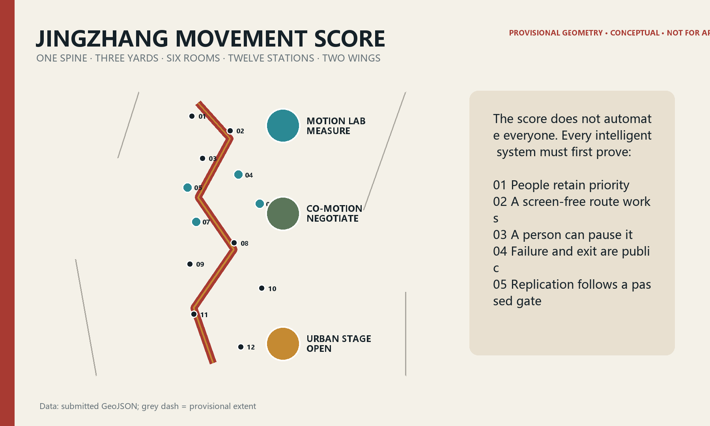
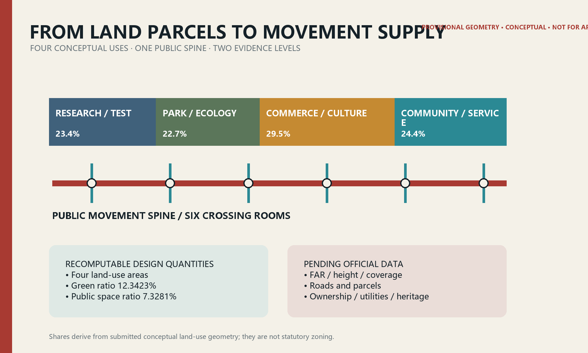
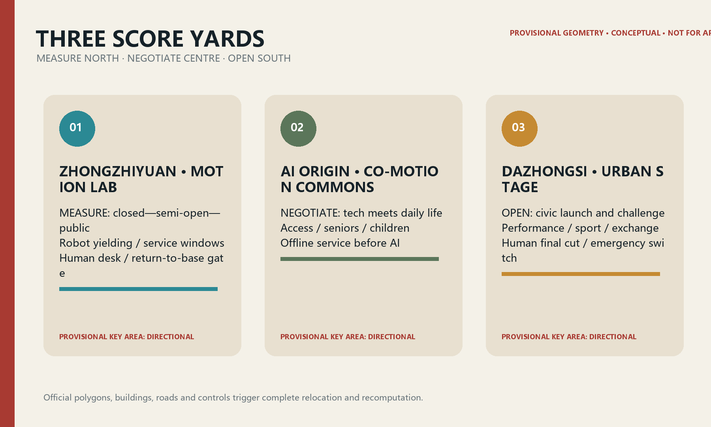
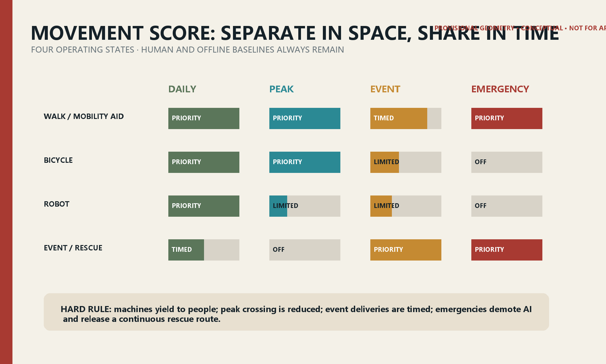
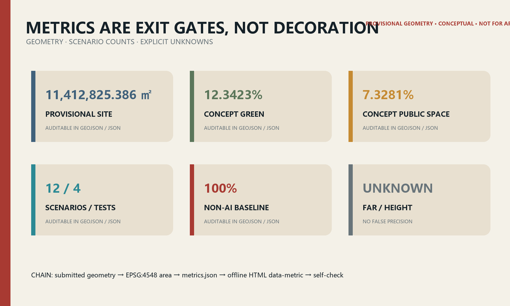

# JINGZHANG MOVEMENT SCORE / 京张行谱

> **Choreograph people first; schedule machines second.** The Jing-Zhang Railway timetable coordinated speed, direction and priority on one line. This proposal translates that discipline into public space. AI receives no unconditional right of way: it must yield, explain itself, stop, and preserve a route that can be completed without a phone.

Figure 0 | Concept-only image generated by the submission agent. People and place are fictional and provide no factual, boundary or engineering evidence.

## Design basis and source inventory

Only the official announcement, repository taskbook, public law and registered materials are treated as task evidence. Provisional boundaries support generation, display and temporary recomputation only. No verified official polygons, road redlines, existing-building survey, regulatory controls, ownership, utilities or heritage-control geometry are publicly supplied; these gaps are recorded rather than guessed. [source:OFFICIAL-ANNOUNCEMENT] [source:SOURCE-REGISTRY] [standard:PROJECT-OFFICIAL-ANNOUNCEMENT]

The spatial claims come from `geometry/*.geojson`. In EPSG:4548 the submitted provisional site is 11,412,825.386 sqm, with a conceptual green ratio of 12.3423% and conceptual public-space ratio of 7.3281%. These are recomputable design quantities, not an official redline area or statutory controls. [data:geometry/site_boundary.geojson#SITE-001] [metric:site_area_sqm] [metric:green_ratio]

The package follows the repository's urban-design, regulatory-planning and land-use references and uses accessibility, elderly digital-inclusion and generative-AI rules as service guardrails. Every construction, opening and operating statement is a conceptual recommendation requiring professional review. [standard:MOHURD-URBAN-DESIGN-MEASURES] [standard:BARRIER-FREE-ENVIRONMENT-LAW] [depth:existing_conditions_diagnosis]

## Three-level scope framework

The 43.6 sq km Coordinated Research Area addresses industry, culture and regional coordination; the approximately 11.4 sq km Overall Design Area addresses the public spine, land use, walking/cycling, public space and renewal projects; the three Key-Area Detailed Design Areas, approximately 368.4 ha in total, address executable scenarios and interfaces. The three levels form one strategy—structure—pilot—evaluation—rollback evidence chain. [source:SITE-PACKAGE] [depth:three_level_scope_framework]

Repository provisional polygons are used with `official_boundary=false`, `geometry_role=provisional_constraint` and `boundary_precision=provisional_rough`. Rectangular key areas do not represent roads, parcels or ownership. When official geometry arrives, all boundaries, intersections, areas, metrics, figures, HTML and PDFs must be regenerated together. [data:geometry/key_areas.geojson#PROV-KEY-001] [metric:key_area_count]

## Coordinated research: industry and future-city strategy

The name **JINGZHANG MOVEMENT SCORE** combines the railway operating diagram with an auditable urban score. Its original mark uses two offset crossing lines and an open gap: different tempos for human and machine movement, plus the right to override and exit. It uses no company or railway trademark. [source:AGENT-TASKBOOK] [standard:PROJECT-AGENT-OPEN-CALL-TASKBOOK]

The framework is **One Spine · Three Yards · Six Rooms · Twelve Stations · Two Wings**. The heritage-park corridor becomes the public movement spine. Zhongzhiyuan's Motion Lab tests embodied AI and low-speed robots; AI Origin's Co-Motion Commons tests everyday public services; Dazhongsi's Urban Stage supports performance, sport, creative commerce and exchange. Six co-motion rooms resolve crossing, interchange, pause, charging, staffed help and emergency needs. Twelve stations host the scenario cards. The Zhongguancun Technology Services Wing contributes compliance, models, capital and professional services; the Xiaoyue River Scenario Enablement Wing contributes everyday contexts and ecological feedback. [data:geometry/roads.geojson#ROAD-001] [depth:overall_spatial_structure]

| Global case | Transferable mechanism | Jing-Zhang translation | Deliberate limit |
|---|---|---|---|
| Singapore one-north | Mixed research, startup, living and event ecosystem | Shared equipment, short-lease test units and public programs | No gated-campus substitute for civic space |
| Helsinki Kalasatama | Short-cycle city-company-resident pilots and evaluation | 90-day baseline—pilot—review—exit loop | Smartness is not a sensor count |
| Barcelona Superblock | Reallocation of street space to people and community life | Co-motion rooms prioritise continuity and safe crossing | No permanent closure without traffic evidence |
| London SHIFT | Place-based inclusive innovation partnership | Public-interest review and open calls through the services wing | No invented operator commitment |
| NAVER 1784 | Building, network and robot operations designed together | Switchable robot-service interfaces at Motion Lab | No facial recognition as a public-service gate |
| Toyota Woven City | Inventors and residents co-test mobility | Users and maintainers co-sign pilot release | Residents are not unconditional test subjects |

Together these cases show that a world-class ecosystem is not a company list; it combines low-friction entry, real-world validation, explicit data limits, evaluated exit and lasting public life. [source:CASE-KALASATAMA] [source:CASE-WOVEN-CITY]

## Overall design: urban renewal and regulatory-depth design

The Overall Design Area uses a public movement spine, mixed research/service edges and three types of cross-connection. Conceptual land-use geometry organises research, park, commercial-service and community-service supply as a continuous system. Public and green space are innovation infrastructure, not residual land. [data:geometry/land_use.geojson#LU-001] [metric:public_space_ratio] [depth:land_use_layout]

Renewal is expressed as retain—adapt—add—remove. Retain useful structures and cultural traces; adapt ground floors, links and vacant spaces for shared testing and service; add accessibility, shade, water management, charging, maintenance and staffed help; remove only after ownership, structural, heritage and public review. The building layer is a conceptual design quantity, not an existing-condition or demolition survey. [data:geometry/buildings.geojson#BLDG-001] [metric:building_footprint_area_sqm] [depth:demolish_renovate_retain]

The regulatory-depth package separates what can be proposed from what is pending. Structure, publicness, scenario interfaces, manual fallback and phase gates can be designed now. FAR, height, coverage, setbacks, rights-of-way, utility capacity and specific demolition remain `unknown` until official controls arrive. [standard:MOHURD-CONTROL-DETAILED-PLANNING] [metric:floor_area_ratio]

## Key-area detailed design

### Zhongzhiyuan: Motion Lab — measure

A controlled entry point for embodied-intelligence and autonomous-system validation. Switchable floor markings, soft separation, observation paths, a staffed control desk and equipment turn-around support closed-to-semi-open testing. The walking route always outranks the robot route; night maintenance uses fixed time windows. SCN-04 and SCN-05 begin here. [data:geometry/key_areas.geojson#PROV-KEY-001] [data:geometry/roads.geojson#ROAD-001] [depth:key_area_detailed_design]

### Beijing AI Origin Community: Co-Motion Commons — negotiate

An interface where technology negotiates with everyday life. Accessible guidance, senior rehabilitation, child-safe crossing and heat-comfort routes work first through physical design and staffed service, then add AI. Ground-floor adaptation supports shared rooms, health/education referral and human help; downloading an app is never an entrance condition. [data:geometry/key_areas.geojson#PROV-KEY-002] [data:geometry/public_space.geojson#PUBLIC-001]

### Dazhongsi: Urban Stage — open

A civic launch interface where systems can be seen, joined and questioned. Daily commuting and community use shifts to zoned queues, quiet waiting and emergency movement during events. Multilingual guidance and performance tools show AI provenance and human final review, with staffed tours, paper maps and screen-free routes. [data:geometry/key_areas.geojson#PROV-KEY-003] [data:geometry/public_space.geojson#PUBLIC-001]

All three polygons are rough rectangles. Building form, entrances and project boundaries are directional only. Official geometry, surveys, station boundaries and street data trigger walking-network, fire-safety and traffic review before architectural or engineering development.

## AI ecosystem, personas and AI-enabled scenarios

Six personas act as acceptance testers: a wheelchair user; an older adult; a caregiver with a child; a research engineer; a night maintenance worker; and an international visitor/performer. A scenario fails if any relevant persona cannot independently understand, choose, complete and exit it. [standard:BARRIER-FREE-ENVIRONMENT-LAW] [standard:ELDERLY-SMART-TECH-PLAN-2020-45]

| Card | Place and users | Minimum data / privacy | Human review and non-AI baseline | Release / exit gate |
|---|---|---|---|---|
| 01 Equivalent accessible wayfinding | Zhongzhiyuan; disabled users | Segment status; no identity | Staffed desk, tactile/high-contrast signs | Stop if closures are stale |
| 02 Senior balance and rehabilitation walk | Zhongzhiyuan; older adults | Optional pace, facility state; on-device | Therapist route and printed exercise card | No health conclusion without professional review |
| 03 Child-friendly safe crossing | North room; caregivers | Anonymous counts and conflicts | Crossing guard, physical calming and signal | Downgrade if warnings distract |
| 04 Low-speed delivery shared corridor ★ | Motion Lab; public and engineers | Vehicle path and near miss; no face ID | Safety steward and manual cart | Excess near misses return test to closed course |
| 05 Maintenance-robot time windows ★ | North spine; maintainers | Device state and closure duration | Manual cleaning and barriers | Timeout or loss of link returns robot to base |
| 06 Event crowd-flow rehearsal ★ | AI Origin; organisers | Anonymous zone counts | Manual count and incident commander | Stop advice if model diverges from observation |
| 07 Cycling-conflict warning ★ | AI Origin; cyclists | Conflict events, no persistent personal path | Physical separation, mirrors and patrol | Remove if warning creates distraction |
| 08 Heat-comfort walking advice | Middle spine; everyone | Public weather and shade state | Shade, water and paper map | Show data unavailable on sensor failure |
| 09 Multilingual movement guide | Central-south; visitors | User-selected language only | Staffed guide and bilingual signs | No publication before translation sampling |
| 10 Public-performance opening protocol | Dazhongsi; creators/public | Rights and consent metadata | Human final cut and printed programme | Unclear rights trigger recall |
| 11 Offline emergency guidance | South spine; everyone | No personal data | Lit/tactile lines, broadcast and staff | AI is advisory under emergency command |
| 12 Safe night-shift companion route | Dazhongsi; night workers | On-demand location, short retention | Lighting, staffed point and phone | User can stop and delete session at any time |

Four starred cards are industry testing and validation scenarios. All twelve are rejectable, overridable, traceable and reversible; `non_ai_baseline_coverage=1.0`. [data:geometry/roads.geojson#ROAD-001] [metric:scenario_node_count] [metric:non_ai_baseline_coverage]

## Land use, building quantity and retain-adapt-remove strategy

Conceptual land use describes functional cooperation only. Research land supports models, robotics and validation; parkland forms the public spine; commercial services support launch, food, culture and evening life; community services support health, education, legal help and staffed assistance. Lines are design discussion geometry, not statutory land-use boundaries. [data:geometry/land_use.geojson#LU-004] [depth:development_intensity]

The 310,807.184 sqm building footprint expresses accessible low-rise test/service interfaces. With no total floor area, FAR is unknown. With no existing-building survey, demolition/adaptation/retention quantities are unknown. Later decisions follow survey—value assessment—ownership/heritage—structural safety—carbon—public dialogue, prioritising retention and adaptive reuse. [metric:building_footprint_area_sqm] [metric:floor_area_ratio]

## Mobility, transit, utilities and public services

The spine has four operating states. Daily use prioritises walking and mobility aids; peak commuting limits robot crossing; events use booked delivery, zoned queues and quiet waiting; emergencies demote all AI advice and release a continuous evacuation/rescue corridor. The road centreline is conceptual movement-score geometry, not an existing or planned right-of-way. [data:geometry/roads.geojson#ROAD-001] [depth:transport_integration]

Transit integration begins with the last 800 metres: continuous accessibility, shade, night lighting, bicycle order, legible interchange and staffed questions precede crowding or route advice. Edge compute, low-power sensors and charging interfaces must be independently switchable and must not occupy clear width, fire routes, tactile paths or tree-growing space. Sections, passenger flows, utilities, power and drainage remain pending. [standard:MOHURD-CONTROL-DETAILED-PLANNING]

## Blue-green space, public realm and urban character

Railway heritage's line, rhythm, arrival and crossing become a spatial grammar: fine weathering-steel lines suggest trajectories; permeable paving marks stations; tree rows set tempo; original rail elements are reused only after provenance and heritage permission. The provisional boundary recedes as a light dashed constraint; the green spine, cross-rooms and public nodes carry the composition. [data:geometry/green_space.geojson#GREEN-001] [metric:green_ratio] [depth:blue_green_space]

Three conceptual pilgrimage/honour nodes are proposed. **Score Zero** publishes each pilot's baseline, rules, failures and exit. **Co-Motion Yard** shows release sheets co-signed by accessibility users, maintainers and developers. **Centennial Score Hall** layers railway timetables, Zhongguancun innovation history and contemporary public-AI ethics. Honour recognises auditable public contribution and cannot be bought through naming rights. [metric:landmark_count]

No precise height is proposed. Ground floors should be visibly welcoming without exposing personal data; corners support pause; equipment remains maintainable; roof water, PV and public use need professional study. Media façades require glare, residential-impact and content review. All type, image, character and brand assets are original or rights-cleared.

## Project list, policy and phasing

| Package | Concept project | Minimum pilot and dependency | Role classes | Pass / exit |
|---|---|---|---|---|
| P0 | Score Zero | One accessible node; site permission and staff | Planning, community, maintenance, accessibility | Publish 90 days; show missing data rather than fill it |
| P1 | North Motion Lab | Closed course + 50 m semi-open segment | Robotics, safety, landscape maintenance | Excess near misses return to closed course |
| P2 | Origin Co-Motion Room | Staffed desk + four scenarios | Community, health/education referral, developers | Screen-free completion must pass |
| P3 | Six Co-Motion Rooms | One crossing and one interchange prototype first | Transport, accessibility, district, maintenance | Peak conflicts fall and clear width passes |
| P4 | Dazhongsi Urban Stage | One small public event | Venue, fire safety, rights, volunteers | Evacuation drill and rights review pass |
| P5 | Open Score Protocol | Publish interface, baseline and exit templates | Legal, data security, operations, public reps | Quarterly audit; two failures trigger exit |

**0—1 year**: baseline, prototype and permission only. **1—3 years**: replicate nodes that pass. **After year 3**: discuss systematic building and utility work. `phasing.geojson` is a near-term discussion area, not a budget, construction or acquisition commitment. [data:geometry/phasing.geojson#PHASE-001] [depth:implementation_phasing]

Suggested annual operations are an Accessible Co-Test Week, Summer Night Score, Robot Yielding Challenge and Annual Failure Class. The developer community works from public issue lists and small prototype calls. International communication publishes bilingual baseline, permission, incident, exit and review summaries. Activities, investment, funding and operators require later authorisation. [source:AGENT-TASKBOOK]

## Metrics, recomputation and compliance

| Metric | Value/status | Meaning and method |
|---|---:|---|
| Provisional site area | 11,412,825.386 sqm | EPSG:4548 polygon area; package consistency only |
| Conceptual green ratio | 12.3423% | Concept green / provisional site; continuous green supply |
| Conceptual public-space ratio | 7.3281% | Concept public space / provisional site; civic encounter and test interface |
| Scenario nodes | 12 | GeoJSON point count; four industry tests |
| Non-AI baseline coverage | 100% | 12/12 cards retain physical, staffed or paper equivalents |
| FAR / height | unknown | No official controls; no false precision |

The three spatial metrics are recomputable from submitted geometry and explicitly bound in offline HTML using `data-metric/data-value`. Public-interest metrics count cards and nodes. The three matrices audit task, standard and depth coverage without duplicating machine indexes in prose. [metric:public_space_ratio] [depth:metric_system]

## Risk, copyright and compliance

The primary risks are provisional geometry, missing baselines, device failure and power imbalance. The response sequence is: mark unknowns—build physical and staffed baselines—minimise data—pilot small—publish failures—permit exit—then decide on scaling. AI is not used for enforcement, eligibility, autonomous medical conclusions or facial access. Generated content is labelled and human-reviewed. [standard:GENERATIVE-AI-INTERIM-MEASURES] [depth:risk_and_compliance]

The concept cover was generated by OpenAI image generation from this proposal's prompt. Five evidence figures, bilingual HTML and PDFs are generated locally from submission data. No external photograph, map screenshot, remote font, tracker or uncleared brand asset is used. People, spaces and buildings in the cover are explanatory fiction, not research evidence. See `report/copyright_statement.md`.

Official prequalification documents, addenda or GIS/CAD trigger: register publisher, date, version, hash, licence and CRS; replace all related boundaries; rerun topology and metrics; review rights-of-way, fire, utilities, heritage, ownership, renewal and accessibility; regenerate all outputs and self-check. Until then this is an open-source conceptual design for content review only.

## References

These entries correspond to the machine-readable source register in `sources.json`. [source:SOURCE-REGISTRY]

1. Haidian Branch, Beijing Municipal Commission of Planning and Natural Resources, official open-call announcement, 2026.
2. open-city-ai/haidian, Agent Taskbook for the Centennial Jing-Zhang AI Innovation Belt, 2026.
3. Ministry of Housing and Urban-Rural Development, public urban-design and regulatory-planning references.
4. Standing Committee of the National People's Congress, Barrier-Free Environment Construction Law, 2023.
5. General Office of the State Council, plan for elderly access to intelligent technology, 2020.
6. JTC, official one-north estate materials.
7. Forum Virium Helsinki, *Smart Kalasatama Final Report*, 2021.
8. Barcelona City Council, *Superblock Barcelona 2015—2023*.
9. NAVER, official 1784 materials.
10. Toyota Motor Corporation, official Woven City launch materials, 2025.
