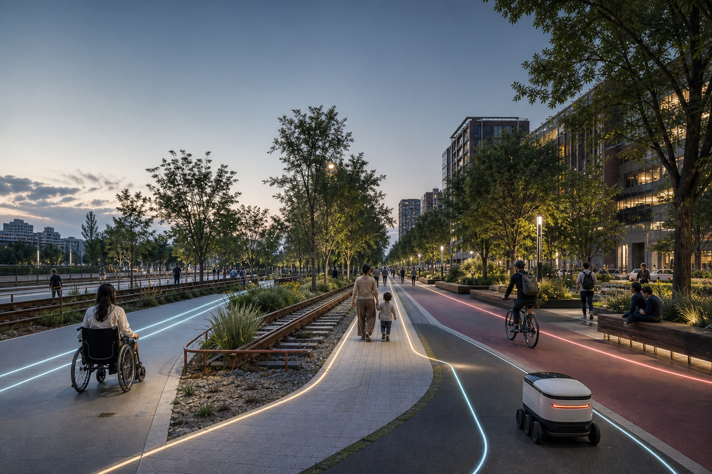
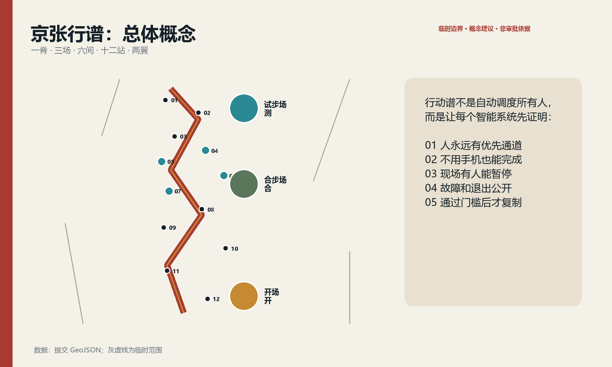
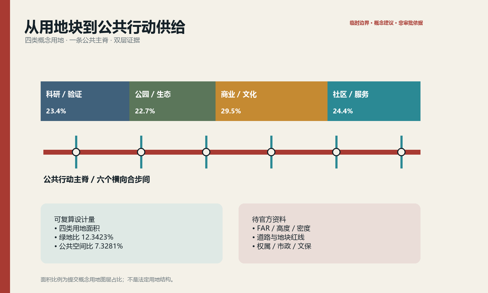
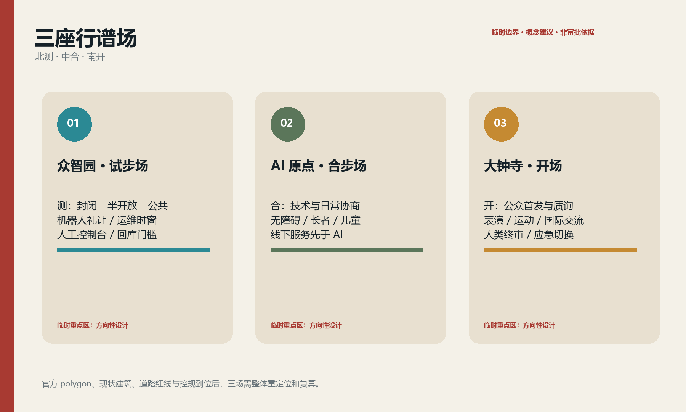
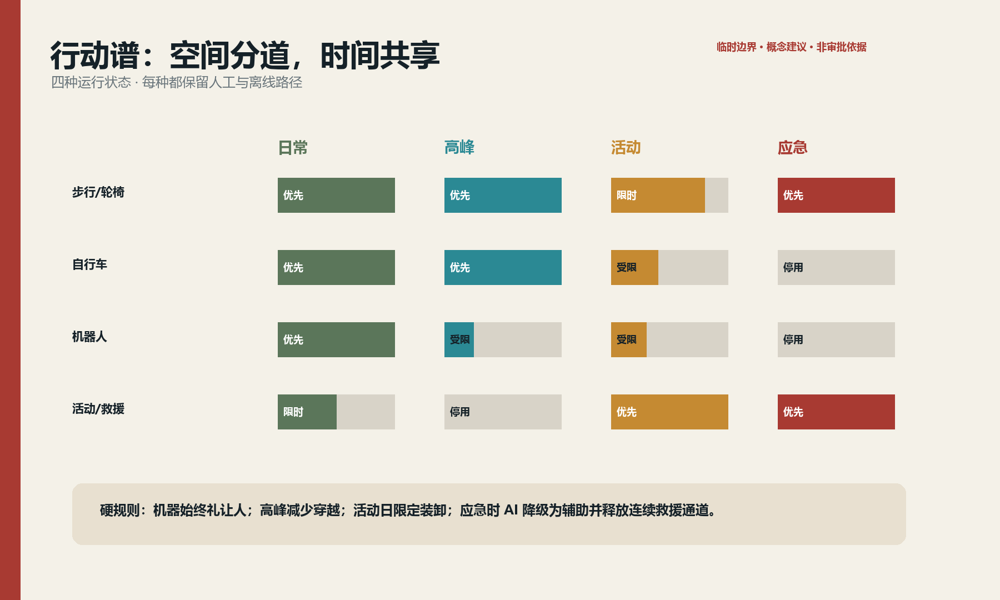
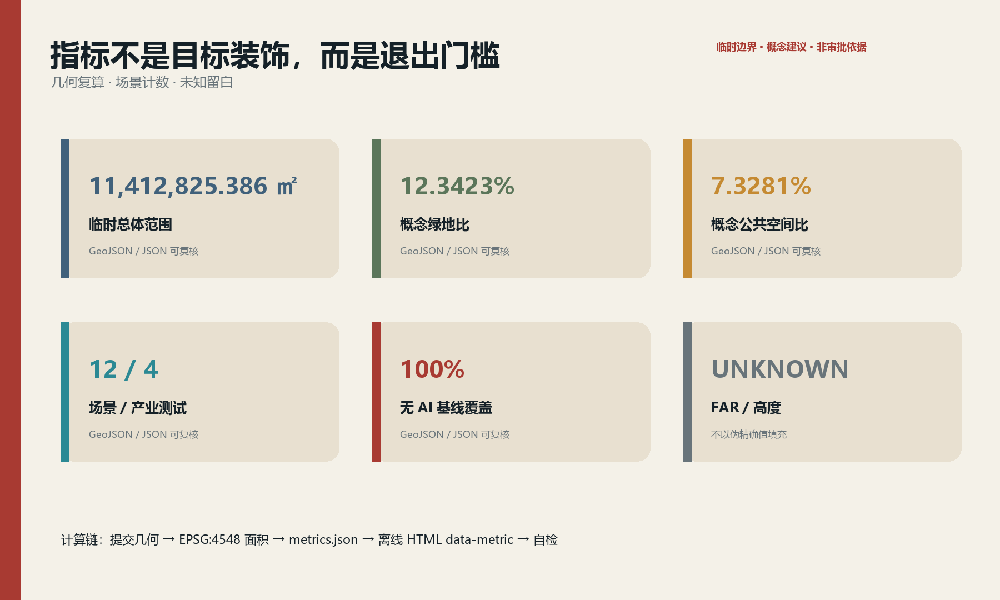

# 京张行谱 / JINGZHANG MOVEMENT SCORE

> **先排人的步，再排机器的班。** 京张铁路用运行图把不同速度、方向和优先级编进同一条线；本方案把这份纪律转译为城市公共空间。AI 不获得无条件通行权，它必须让路、解释、停用，并始终保留一条不靠手机也能走完的路。

图 0｜概念表达。图像由申报智能体生成；人物与空间为虚构，不用于事实、边界或工程论证。

## 设计依据与资料清单

本方案只把官方公告、仓库任务书、公开法规与已登记资料作为任务依据；临时边界只承担生成、展示与复算占位。公开资料没有提供可验证坐标系的官方精确 polygon、道路红线、现状建筑、控规指标、权属、市政与文保控制线，因此这些项目全部进入假设表，而不被“合理猜测”补齐。[source:OFFICIAL-ANNOUNCEMENT] [source:SOURCE-REGISTRY] [standard:PROJECT-OFFICIAL-ANNOUNCEMENT]

核心空间判断来自 `geometry/*.geojson`，三项核心指标按 EPSG:4548 复算：临时总体范围 11,412,825.386 平方米、概念绿地比 12.3423%、概念公共空间比 7.3281%。它们是**可复算的设计量**，不是官方红线面积或法定指标。[data:geometry/site_boundary.geojson#SITE-001] [metric:site_area_sqm] [metric:green_ratio]

项目以《城市设计管理办法》《控制性详细规划编制指南》《国土空间调查、规划、用途管制用地用海分类指南》组织表达，并以无障碍法、适老化政策和生成式 AI 规定约束服务设计。所有“建设、开放、运营”均为概念建议，需由规划、交通、建筑、市政、文保、法律、数据安全与运营专业团队复核。[standard:MOHURD-URBAN-DESIGN-MEASURES] [standard:BARRIER-FREE-ENVIRONMENT-LAW] [depth:existing_conditions_diagnosis]

## 三层范围工作框架

**统筹研究范围 43.6 平方公里**回答产业、文化与区域协同；**总体设计范围约 11.4 平方公里**回答公共主脊、用地、慢行、公共空间与更新项目；**三处重点区合计约 368.4 公顷**回答可执行的场景与空间接口。三层不是三张互不相干的图，而是一条“策略—结构—试点—评估—回退”的证据链。[source:SITE-PACKAGE] [depth:three_level_scope_framework]

提交采用仓库临时 polygon：`official_boundary=false`、`geometry_role=provisional_constraint`、`boundary_precision=provisional_rough`。矩形重点区不表达道路、地块或权属边界；官方 polygon 到位时，必须同时替换三层边界与三处重点区，重跑相交、面积、指标、图件、HTML 和 PDF，不能只换一张底图。[data:geometry/key_areas.geojson#PROV-KEY-001] [metric:key_area_count]

## 统筹研究范围产业与未来城市研究

品牌名“**京张行谱**”由“京张运行图”和“城市行动谱”叠合而来；英文 `JINGZHANG MOVEMENT SCORE` 强调 score 既是谱面，也是可审计规则。标志采用两条错时交汇的轨线与一个开放缺口：轨线代表人和机器的不同节拍，缺口代表人工接管与退出权。Logo 仅使用原创几何线条，不引用企业或铁路标识。[source:AGENT-TASKBOOK] [standard:PROJECT-AGENT-OPEN-CALL-TASKBOOK]

空间框架是“**一脊·三场·六间·十二站·两翼**”：京张铁路遗址公园周边形成公共行动主脊；众智园“试步场”验证具身智能与低速机器人，北京 AI 原点社区“合步场”验证日常公共服务，大钟寺“开场”承接表演、运动、创意商业与国际交流；六个合步间处理跨路、换乘、停留、充电、人工服务与应急；十二站对应场景卡；中关村科技服务翼输出合规、模型、资本与专业服务，小月河场景赋能翼提供生活场景与生态反馈。[data:geometry/roads.geojson#ROAD-001] [depth:overall_spatial_structure]

| 全球案例 | 可取机制 | 京张转译 | 不照搬的部分 |
|---|---|---|---|
| 新加坡 one-north | 研发、创业、生活与活动混合；模块化孵化空间 | 三场共享设备、短租试验单元与公共活动 | 不以园区封闭管理替代城市公共性 |
| 赫尔辛基 Kalasatama | 城市、企业、居民共同开展短周期试点并评估 | 90 天基线—试点—复盘—退出循环 | 不把“智慧”简化为传感器数量 |
| 巴塞罗那 Superblock | 把道路空间重新分给步行、停留和社区生活 | 合步间优先解决慢行连续与安全过街 | 不在缺交通数据时宣布永久封路 |
| 伦敦 SHIFT | 以场所伙伴关系组织包容性创新 | 中关村翼建立公共利益评审与开放征集 | 不把单一机构包装为已确定运营方 |
| NAVER 1784 | 建筑、电梯、网络与机器人协同 | 试步场预留可停用的机器人服务接口 | 不采用人脸识别作为公共服务门槛 |
| Toyota Woven City | 发明者与居民共同验证多种移动方式 | 用户与运维人员共同签署试点放行单 | 不把真实居民当作无条件试验对象 |

这些案例共同指向一个结论：世界级生态不是“企业名单”，而是**低门槛进入、真实场景验证、明确数据边界、可复盘退出与长期公共生活**的制度—空间组合。[source:CASE-KALASATAMA] [source:CASE-WOVEN-CITY]

## 总体设计范围城市更新与控规深度城市设计

总体范围采用“公共行动主脊 + 两侧研发/服务混合界面 + 三类合步横联”。概念用地层把科研、绿地、商业服务和社区服务组织成连续而非孤岛式分区；公共空间与绿地不等于剩余用地，而是创新团队、居民、访客和运维者共同遇见的基础设施。[data:geometry/land_use.geojson#LU-001] [metric:public_space_ratio] [depth:land_use_layout]

更新动作按“留—改—补—撤”四类表达：保留具有使用价值或文化线索的空间结构；改造首层、连廊和闲置场所成为共享试验与服务界面；补齐无障碍、遮阴、雨洪、充电、运维与人工服务节点；撤除只限于经权属、结构、文保和公众程序确认后的对象。现状建筑底数缺失，当前 `buildings.geojson` 仅为概念设计量，不是现状清查或拆除依据。[data:geometry/buildings.geojson#BLDG-001] [metric:building_footprint_area_sqm] [depth:demolish_renovate_retain]

控规深度采用“可定—待定”双栏：空间结构、公共性、场景接口、人工兜底和分期门槛可以提出；FAR、建筑高度、建筑密度、退线、路权、市政容量和具体拆改留均记为 `unknown`，待正式条件补齐后复算。设计量不升格为审批结论。[standard:MOHURD-CONTROL-DETAILED-PLANNING] [metric:floor_area_ratio]

## 重点区域详细设计

### 众智园：试步场 / Motion Lab（“测”）

定位为具身智能和自主系统的受控验证入口。空间以可切换地面标线、软隔离、观察廊、人工控制台和设备周转间构成；首层优先研发样机、检测、维修和演示，公共界面只开放通过安全门槛的低速试验。慢行主路永远高于机器人测试路权，夜间维护有固定时窗；SCN-04、05 在此先做封闭/半开放验证。[data:geometry/key_areas.geojson#PROV-KEY-001] [data:geometry/roads.geojson#ROAD-001] [depth:key_area_detailed_design]

### 北京 AI 原点社区：合步场 / Co-Motion Commons（“合”）

定位为技术与日常生活的协商界面。围绕社区服务、健康、教育与开发者交流设置可坐、可看、可拒绝的公共客厅；无障碍导航、长者康复、儿童过街、热舒适步行均先由线下服务与物理设计成立，再叠加 AI。建筑改造优先首层开放、共享会议、社区门诊转介和人工咨询，不以下载应用作为进入条件。[data:geometry/key_areas.geojson#PROV-KEY-002] [data:geometry/public_space.geojson#PUBLIC-001]

### 大钟寺：开场 / Urban Stage（“开”）

定位为公众可见、可参与、可质询的城市首发界面。以站点接驳、公共表演、运动和创意商业构成分时场地：日常是通勤与社区广场，活动日切换为分区排队、静音等候和应急疏散。多语言导览与公共表演工具必须显示“AI 生成/人工终审”，并提供人工导览、纸质地图和无屏幕路线。[data:geometry/key_areas.geojson#PROV-KEY-003] [data:geometry/public_space.geojson#PUBLIC-001]

三处范围均为粗略矩形，所有建筑形态、出入口与项目边界只表达方向。获得 official polygon、现状测绘、轨道站点边界和路网数据后，应先做步行网络、消防和交通复核，再推进建筑与工程深化。

## AI 创新生态、人才画像与 AI+ 场景

六类人物不是营销画像，而是验收者：轮椅使用者验证坡度、门槛与绕行；长者验证无手机路径和可理解性；儿童照护者验证过街冲突；研发工程师验证接口和回滚；夜班运维者验证照明、值守和故障处理；国际访客/表演者验证多语言、版权和公共参与。任何一类不能独立完成任务，场景就不算通过。[standard:BARRIER-FREE-ENVIRONMENT-LAW] [standard:ELDERLY-SMART-TECH-PLAN-2020-45]

| 场景卡 | 位置与对象 | 最小数据 / 隐私边界 | 人工复核与非 AI 基线 | 开放/退出门槛 |
|---|---|---|---|---|
| 01 无障碍等价导航 | 众智园；轮椅、视障者 | 路段障碍状态；不采集身份 | 人工服务台、触觉/高对比导视 | 断路信息未更新即停用 |
| 02 长者平衡与康复步道 | 众智园；长者 | 自愿步速、设施状态；端侧处理 | 理疗师路线、纸质动作卡 | 无专业审核不提供健康结论 |
| 03 儿童友好安全过街 | 北段合步间；儿童照护者 | 匿名流量与冲突计数 | 护学员、实体减速和信号 | 误报干扰通行即降级 |
| 04 低速配送机器人共廊★ | 众智园；研发与公众 | 车体轨迹、近失；不做人脸识别 | 安全员、人工推车配送 | 近失阈值超限立即退出公共路段 |
| 05 维护机器人时窗★ | 主脊北段；运维者 | 设备状态、封闭时长 | 人工保洁与实体围挡 | 超时或失联回库 |
| 06 活动人流排演★ | AI 原点；活动组织者 | 匿名区段人数 | 人工计数、现场总指挥 | 模型与实测偏差超阈值停用建议 |
| 07 骑行冲突预警★ | AI 原点；骑行者 | 冲突事件，不留个人轨迹 | 物理分道、镜面与人工巡查 | 警示造成分心即撤下 |
| 08 热舒适步行建议 | 中段；全体步行者 | 公共气象、遮阴状态 | 树荫、饮水和纸图 | 传感失效显示“数据不可用” |
| 09 多语言行动导览 | 中南段；国际访客 | 用户主动选择语言 | 人工导览、双语静态牌 | 翻译未经抽检不得发布 |
| 10 公共表演开场协议 | 大钟寺；创作者与公众 | 版权/授权元数据 | 人类终剪、线下节目单 | 权利不清立即撤稿 |
| 11 应急疏散离线指引 | 南段；全体人群 | 不采集个人数据 | 发光/触觉标线、广播与人员引导 | 应急状态 AI 只做辅助，不替代指挥 |
| 12 夜班安心同行 | 大钟寺；夜班者 | 按需位置，短时最小化 | 照明、值守点、电话求助 | 用户随时关闭并删除会话 |

星号为四个产业测试验证场景。十二张卡全部满足“可拒绝、可人工接管、可追溯、可退出”；`non_ai_baseline_coverage=1.0`。[data:geometry/roads.geojson#ROAD-001] [metric:scenario_node_count] [metric:non_ai_baseline_coverage]

## 用地、建筑规模与拆改留方案

概念用地只回答功能协同：科研用地承接模型、机器人与验证服务；公园绿地构成公共主脊；商业服务支持首发、餐饮、文化与夜间活动；社区服务承接健康、教育、法律与人工帮助。分区边线是设计讨论图，不是法定用地界线。[data:geometry/land_use.geojson#LU-004] [depth:development_intensity]

提交建筑基底 310,807.184 平方米用于表达“低层可进入的试验/服务界面”这一概念量；没有总建筑面积，因此 FAR 为 unknown；没有现状建筑和结构资料，因此拆、改、留数量也为 unknown。后续以“现状普查—价值评估—权属/文保核验—结构安全—碳核算—公众沟通”六步确定对象，优先保留与适应性再利用。[metric:building_footprint_area_sqm] [metric:floor_area_ratio]

## 交通、轨道、市政与公共服务设施

主脊采用四种运行状态：日常以步行和轮椅优先；通勤峰期限制机器人穿越；活动时以预约卸货、分区排队和静音等候组织；应急时所有智能建议降为辅助，释放连续疏散与救援通道。道路中心线为概念行动谱，不代表现状或规划路权。[data:geometry/roads.geojson#ROAD-001] [depth:transport_integration]

轨道站点一体化从“最后 800 米”入手：连续无障碍、遮阴、夜间照明、非机动车秩序、清晰换乘和人工问询先行，再叠加拥挤提示与路线建议。市政层采用可独立关断的端侧算力、低功耗感知和充电接口；设备不能侵占净宽、消防、盲道和树木生长空间。精确断面、客流、管线、电力和排水均待官方/清权资料。[standard:MOHURD-CONTROL-DETAILED-PLANNING]

## 蓝绿空间、公共空间与城市风貌

公共行动主脊把铁路遗产的“线性、节拍、到发、交汇”变成空间语法：耐候钢细线提示轨迹，透水铺装表达停站，树阵形成节拍，旧轨构件只在来源与文保许可明确后再利用。临时边界以灰色虚线退到背景，主视觉由连续绿廊、横向合步间与公共节点构成。[data:geometry/green_space.geojson#GREEN-001] [metric:green_ratio] [depth:blue_green_space]

三处朝圣/荣誉节点均为概念建议：**零号行谱台**公开每个试点的基线、规则、故障和退出记录；**人机合步庭**展示无障碍用户、运维者与开发者共同签署的放行单；**百年行谱厅**以铁路运行图—中关村创新史—当代公共 AI 伦理三层叙事组织展览。荣誉只授予可复核的公共贡献，不以企业付费购买命名。[metric:landmark_count]

风貌控制不预设具体高度：首层透明而不暴露隐私，转角可停留，设备可维护，屋顶优先雨水、光伏与公共活动的专业论证；媒体立面只在不眩光、不打扰居民且有内容审核时设置。所有字体、图像、人物与标识均使用原创或已清权资产。

## 更新项目清单、实施政策与分期计划

| 包 | 概念项目 | 最小试点与依赖 | 角色类别 | 通过/退出 |
|---|---|---|---|---|
| P0 | 零号行谱台 | 一处可达节点；需场地许可与人工值守 | 规划协调、社区、运维、无障碍顾问 | 连续公开 90 天；数据缺失则标红而非补写 |
| P1 | 北段试步场 | 封闭测试 + 50 米半开放段 | 机器人团队、安全员、园林运维 | 近失与故障门槛超限回到封闭场 |
| P2 | 原点合步客厅 | 线下服务台 + 四类场景 | 社区服务、医疗/教育转介、开发者 | 无手机任务完成率达标；否则停止扩张 |
| P3 | 六个合步间 | 先做一处跨路与一处换乘原型 | 交通、无障碍、街道、维护 | 高峰冲突下降且净宽合规 |
| P4 | 大钟寺开场 | 一场小规模公共活动 | 场地、消防、版权、志愿者 | 疏散演练与权利审查通过 |
| P5 | 行谱开放协议 | 公布场景接口、基线模板与退出单 | 法律、数据安全、运营、公众代表 | 每季审计；连续两次不合格退出 |

**近期 0—1 年**只做基线、原型和许可；**中期 1—3 年**在通过门槛的节点复制；**长期 3 年以后**才讨论建筑与市政的系统改造。`phasing.geojson` 只画出近期可讨论段，不是财政、建设或征收承诺。[data:geometry/phasing.geojson#PHASE-001] [depth:implementation_phasing]

年度运营建议包括春季“无障碍共测周”、夏季“夜行谱”、秋季“机器人礼让赛”、冬季“年度故障公开课”；开发者社区以公开问题清单和小额原型征集运转；国际传播统一发布中英双语的基线、许可、事故、退出与复盘摘要。活动、招商、资金和运营主体均需后续授权。[source:AGENT-TASKBOOK]

## 指标体系、面积复算与合规矩阵

| 指标 | 值/状态 | 计算与意义 |
|---|---:|---|
| 临时总体范围面积 | 11,412,825.386 ㎡ | EPSG:4548 复算临时 polygon；只用于本包一致性 |
| 概念绿地比 | 12.3423% | 概念绿地面积 / 临时总体范围；表达连续绿廊供给 |
| 概念公共空间比 | 7.3281% | 概念公共空间 / 临时总体范围；表达公共交往与试验界面 |
| 场景节点 | 12 | GeoJSON 点计数；4 个产业测试 |
| 无 AI 基线覆盖 | 100% | 12/12 场景提供物理、人工或纸质等价路径 |
| FAR / 高度 | unknown | 缺官方控规，不设伪精确值 |

三项空间指标都可从提交几何重算并在离线网页以 `data-metric/data-value` 明示；新增公共利益指标从场景卡与节点清单计数。完整任务、标准和深度覆盖分别由三个矩阵审计，正文不重复机器索引。[metric:public_space_ratio] [depth:metric_system]

## 风险、版权与合规说明

首要风险不是“AI 不够聪明”，而是临时边界、数据缺口、设备失效与权力不对称。应对顺序是：标明未知—先做物理与人工底线—最小化数据—小范围验证—公开故障—允许退出—再决定是否扩张。AI 不用于执法、资格判定、自动医疗结论或人脸门禁；生成内容须显著标识并由人终审。[standard:GENERATIVE-AI-INTERIM-MEASURES] [depth:risk_and_compliance]

概念主视觉由 OpenAI 图像生成能力按本方案提示生成；五张证据图、双语 HTML 与 PDF 由本地脚本基于提交数据生成。未使用外部照片、地图截图、远程字体、跟踪器或未清权品牌素材；详细声明见 `report/copyright_statement.md`。人物、场景和建筑均为解释性虚构，不是调研证据。

若取得正式资格预审文件、补遗或 GIS/CAD，替换触发器为：登记发布主体、日期、版本、哈希、许可和坐标系；替换所有相关边界；重跑拓扑和指标；复核路权、消防、市政、文保、权属、拆改留与可达性；重新出图并再次自检。未完成这些步骤前，本方案仅可作为开源概念设计供内容评审。

## 参考资料

以下条目与完整机器来源表一一对应；正式来源关系见 `sources.json`。[source:SOURCE-REGISTRY]

1. 北京市规划和自然资源委员会海淀分局，《百年京张 AI 创新带城市设计国际方案征集》公告，2026。
2. open-city-ai/haidian，《面向智能体的百年京张 AI 创新带城市设计开源征集任务书》，2026。
3. 住房和城乡建设部，《城市设计管理办法》与《控制性详细规划编制指南（试行）》公开文本。
4. 全国人大常委会，《中华人民共和国无障碍环境建设法》，2023。
5. 国务院办公厅，《关于切实解决老年人运用智能技术困难的实施方案》，2020。
6. JTC, one-north official estate materials.
7. Forum Virium Helsinki, *Smart Kalasatama Final Report*, 2021.
8. Barcelona City Council, *Superblock Barcelona 2015—2023*.
9. NAVER, *1784: Connecting Space, People, Technology and Robots*.
10. Toyota Motor Corporation, *Woven City Official Launch*, 2025.
