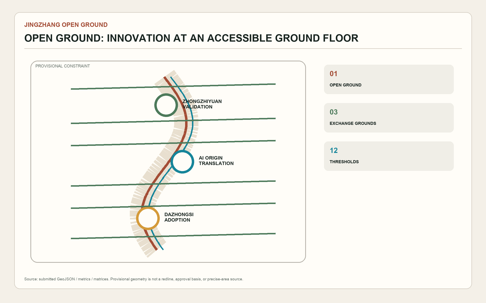
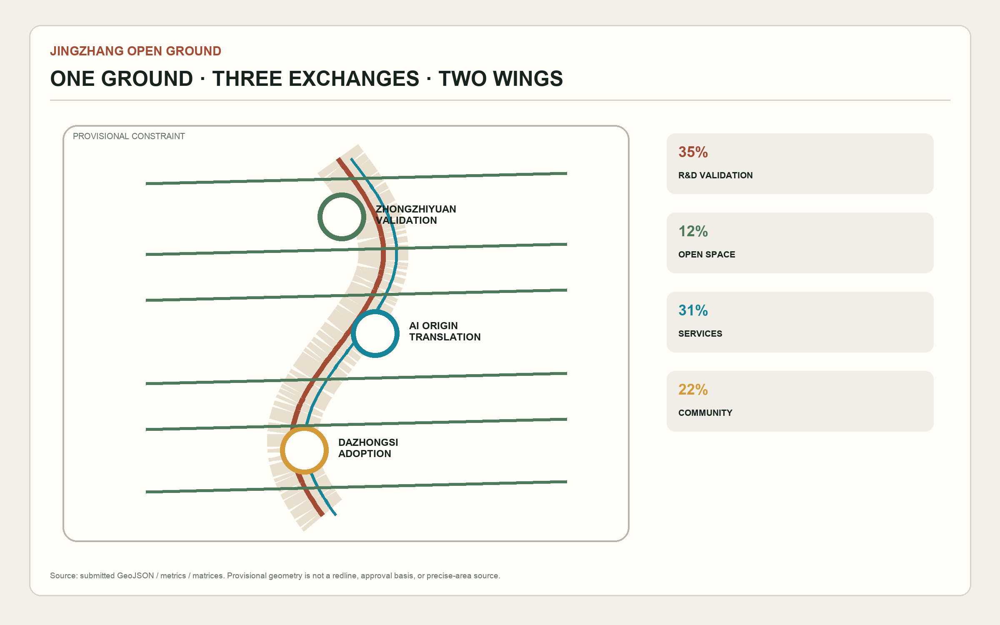
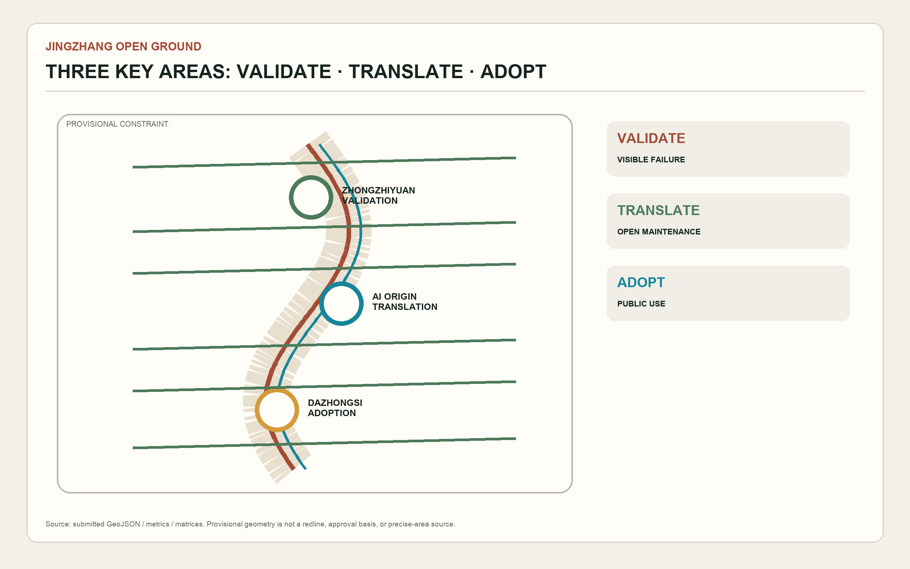
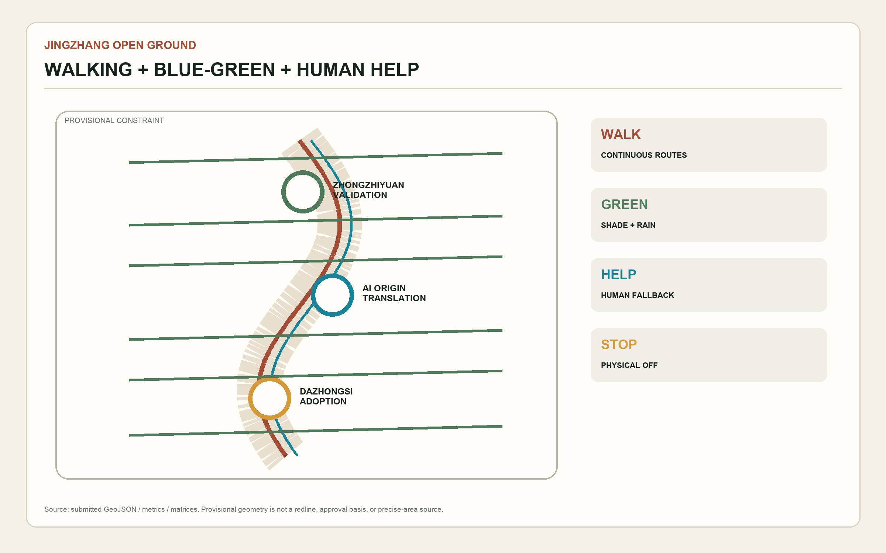
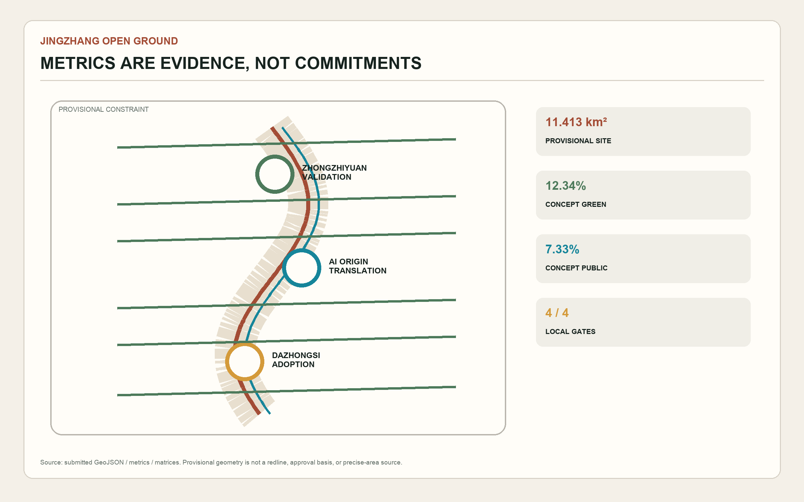

# JINGZHANG OPEN GROUND

> AI innovation should happen on an accessible ground floor. Every spatial move is a co-creation concept for professional development; none replaces statutory planning or constitutes approval.

## Design Basis and Source List

The official announcement establishes tasks and approximate scopes; the cleared Agent taskbook establishes six co-creation tasks; local professional snapshots govern planning language [source:OFFICIAL-ANNOUNCEMENT] [standard:PROJECT-AGENT-OPEN-CALL-TASKBOOK]. No official polygons with verifiable coordinates are available. Repository geometry supports package consistency only. An OSM background check also recorded roughly 412.5 m between mapped heritage-park geometry and the provisional site, so the proposal offers transferable threshold prototypes rather than asserting the real park alignment [source:BOUNDARY-SOURCE] [data:geometry/site_boundary.geojson#SITE-001].

## Three-Level Scope Framework

The 43.6 km² research scope guides industry and regional collaboration; the roughly 11.4 km² overall design scope addresses renewal and capacity; three key areas test detailed prototypes. The chain is strategic choice, spatial rule, then node validation [depth:three_level_scope_framework] [metric:site_area_sqm]. The structure is one open ground, three exchange grounds, two interface wings, and twelve thresholds [data:geometry/key_areas.geojson#PROV-KEY-001] [depth:overall_spatial_structure].

## Coordinated Research Area: Industry and Future City Research

Two unclosed parallel lines around an open square form the identity: rail memory, an accessible gap, and a reviewable civic test ground [source:AGENT-TASKBOOK]. Seven precedents contribute mechanisms rather than copied forms: Toronto MaRS, Boston Kendall Square, Paris-Saclay, London Knowledge Quarter, Station F, Singapore one-north, and Helsinki Jätkäsaari. The transferable lessons are visible ground-floor support, trials with expiry and exit rules, and walkable institutional interfaces [depth:existing_conditions_diagnosis] [source:SOURCE-REGISTRY].

The five functions form a loop: validation in Zhongzhiyuan, translation in AI Origin, scenario trials in the Xiaoyuehe wing, public experience on the open ground, and governance knowledge through transparent records. It specifies interfaces, not companies, investment, or fiscal commitments [standard:MOHURD-URBAN-DESIGN-MEASURES].

## Overall Design Area: Urban Renewal and Regulatory-Plan-Level Urban Design

Four rules guide development: shared services face public paths; every AI scenario has human help and a stop method; reversible interventions precede major renewal; new volume waits for official controls, ownership, heritage, utilities, and transport studies [data:geometry/land_use.geojson#LU-001] [standard:MOHURD-CONTROL-DETAILED-PLANNING]. Submitted footprints locate prototypes, not surveyed buildings; statutory FAR and height remain pending [data:geometry/buildings.geojson#BLDG-001] [metric:floor_area_ratio] [depth:development_intensity_controls].

## Detailed Design of Key Areas

Zhongzhiyuan’s Validation Ground combines garden test courts, a standards gallery, and a Qinghe-facing civic room [data:geometry/key_areas.geojson#PROV-KEY-001]. AI Origin’s Translation Ground combines a near-campus results hall, open-source maintainer room, and daily talent service desk [data:geometry/key_areas.geojson#PROV-KEY-002]. Dazhongsi’s Adoption Ground combines a continuous transit surface, bicycle-order islands, international demo room, and native-AI retail trials; station works remain specialist questions [data:geometry/key_areas.geojson#PROV-KEY-003] [depth:three_key_area_detailed_design].

## AI Innovation Ecosystem, Personas, and AI+ Scenarios

Six primary personas are open-source developers, startups, established R&D staff, students and researchers, nearby residents, and international visitors. Children, older people, disabled people, and people with low digital literacy cross-check every scenario. Each service needs an equivalent non-AI route, on-site help, and a complaint channel [standard:BARRIER-FREE-ENVIRONMENT-LAW] [depth:ai_scenarios_personas].

| # | Scenario | Type | Minimum data / human takeover |
|---:|---|---|---|
| 01 | Model red-team garden | Industry validation | Authorized test set / safety lead stops test |
| 02 | Public edge-device bench | Industry validation | Device telemetry / engineer powers down |
| 03 | Accessible-route replay room | Industry validation | Voluntary anonymous tasks / accompanied test |
| 04 | Open-source maintainer hall | Industry service | Public repository metadata / service desk |
| 05 | Research translation clinic | Industry service | Project declaration / legal and ethics review |
| 06 | Explainable walking guide | Urban service | Segment condition / paper and human guidance |
| 07 | Community co-service desk | Public service | Minimum transaction data / human counter |
| 08 | International demo caption table | Exchange | Authorized speech / human interpreter |
| 09 | Smart-device loan cabinet | Consumer test | Loan receipt / staff handles exit |
| 10 | Jingzhang memory kiosk | Culture | Cleared history index / correction and off button |
| 11 | Open-ground maintenance aide | Operations | Facility ticket / human dispatch and acceptance |
| 12 | Public scenario review table | Governance | Voluntary comments / facilitated appeal |

Cards 01–03 are explicit industrial validation settings. All outputs remain advisory and cannot automate approval, enforcement, medical, legal, or safety decisions [source:AGENT-TASKBOOK] [data:geometry/public_space.geojson#PUBLIC-001].

## Land Use, Building Scale, and Retain-Renovate-Demolish Strategy

Research, open space, industry and commerce, and community services form a complete conceptual partition. Geometry can recompute internal areas, but provisional inputs make these consistency values medium-to-low confidence [metric:building_footprint_area_sqm] [depth:land_use_layout]. Retain verified value; adapt after structure, ownership, and use checks; discuss demolition only after due process; require official controls for new construction [depth:building_retain_renovate_demolish] [source:SITE-PACKAGE].

## Transport, Rail, Municipal Infrastructure, and Public Services

The transport concept is a north-south slow-mobility spine, east-west thresholds, and three transit exchanges. Road GeoJSON expresses relationships, not redlines [data:geometry/roads.geojson#ROAD-001] [depth:transport_rail_walking_parking]. Edge infrastructure must be visible, stoppable, and replaceable. Energy, utilities, fire safety, flood control, and drainage remain pending official data [depth:municipal_new_infrastructure] [source:SOURCE-REGISTRY].

## Blue-Green Network, Public Space, and Urban Character

Open Ground alternates shade, rain gardens, sitting edges, walking and cycling, heritage traces, and public halls. Green and public-space ratios are internal conceptual comparisons, not statutory controls [metric:green_ratio] [metric:public_space_ratio]. Three pilgrimage nodes are the Failure Archive Court, Open-Source Contribution Gate, and Urban Adoption Table. They honor verified contribution, maintenance, and correction without giant screens or corporate logos [standard:MOHURD-URBAN-DESIGN-MEASURES] [depth:blue_green_public_space].

## Renewal Projects, Implementation Policy, and Phasing

Near-term reversible review tables and wayfinding lead to medium-term shared ground floors and, only after official geometry and specialist review, a long-term continuous ground. Every pilot has an expiry and removal option [data:geometry/phasing.geojson#PHASE-001] [depth:phasing_implementation]. The annual concept includes Open Ground Review, AI Scenario Test Week, Jingzhang Open-Source Assembly, and Maintainer Honors; these are references, not confirmed events or recruitment commitments.

## Metrics, Area Recalculation, and Compliance Matrix

One GeoJSON set produces all values: provisional site area about 11.413 km², conceptual green ratio 12.34%, conceptual public-space ratio 7.33%, conceptual building footprint about 310,800 m², and three key areas. They prove package consistency only [metric:key_area_count] [depth:metrics_recalculation]. Four gates check files, space, visuals, and professional evidence. PASS means eligible for content review, never official approval [standard:PROJECT-OFFICIAL-ANNOUNCEMENT].

## Risk, Copyright, and Compliance

Official geometry, controls, roads, ownership, existing buildings, heritage, utilities, safety, and facility inventories remain missing. New data triggers complete recalculation [data:geometry/constraints.geojson#CONSTRAINTS] [depth:risk_missing_data]. The AI-generated cover is concept art, not a site photograph, public opinion, or official rendering. No remote fonts, tiles, trackers, portraits, or trademarks are used [source:AGENT-TASKBOOK].

## References

- Official prequalification announcement, Beijing planning authority, 9 May 2026.
- Cleared Agent open-call taskbook excerpt, 18 May 2026.
- MOHURD urban-design and regulatory-planning measures.
- MNR land-use classification guide.
- Repository provisional-boundary review, 7 August 2026.
