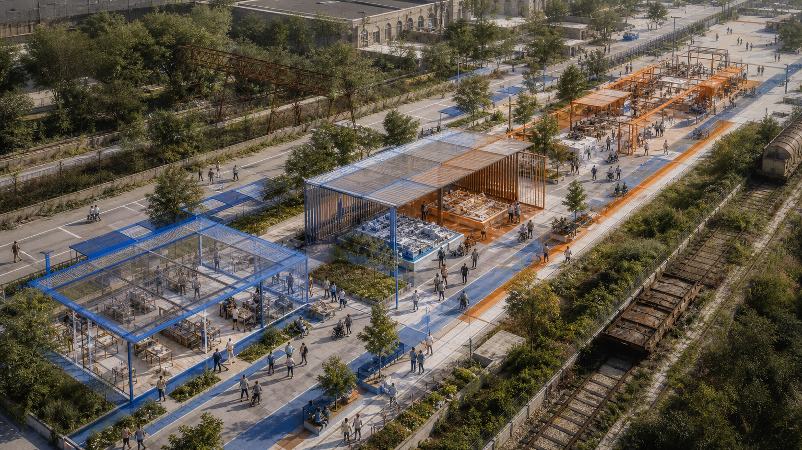
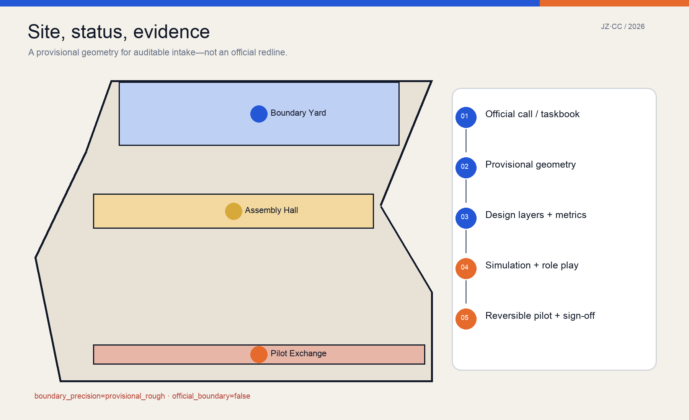
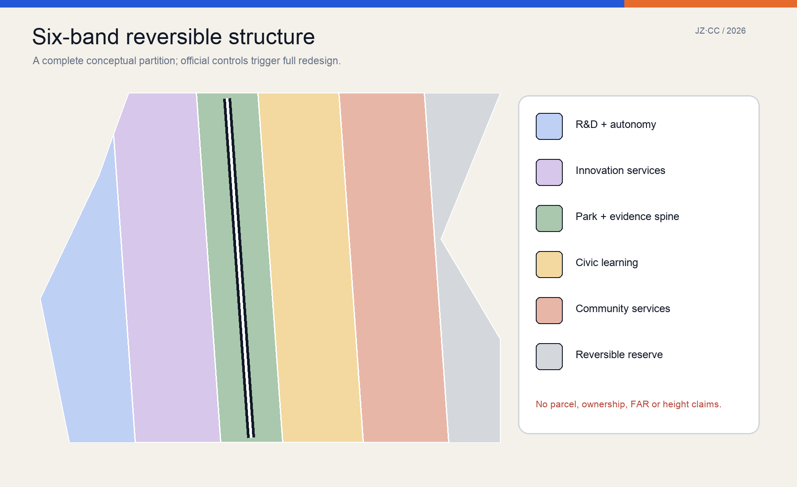
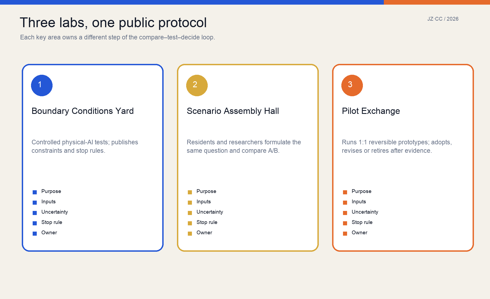
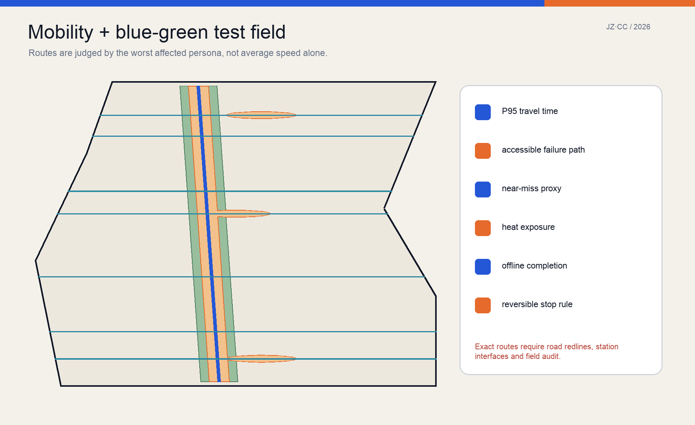
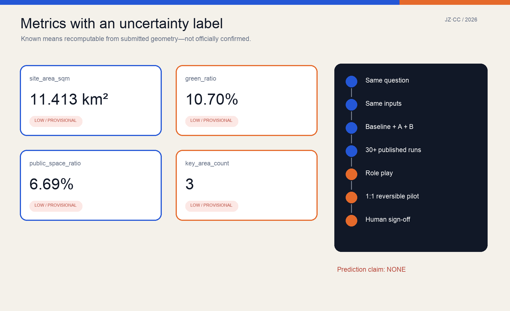

# JING-ZHANG COUNTERFACTUAL COMMONS

> Let the city see another possibility before implementation. Simulation is not prophecy; only results that survive public comparison, role play, and reversible pilots earn the right to move forward.

## Evidence basis and data inventory

This proposal is directly grounded in the official call, the repository's agent-facing taskbook, its source registry, and the machine-readable site package. The public brief establishes an approximately 43.6 km² research scope, an approximately 11.4 km² overall-design scope, and three key areas totalling approximately 368.4 ha. It does not provide official redlines, regulatory controls, road lines, ownership, a building inventory, or municipal surveys. The submission therefore retains the repository's rough substitute geometry with `official_boundary=false` and `boundary_precision=provisional_rough`. Map positions and ratios are reproducible only within that temporary geometry; they are not statutory planning conclusions. [source:OFFICIAL-ANNOUNCEMENT] [source:BOUNDARY-SOURCE]

Evidence is organized as a five-part chain: claim, source, geometry, metric, and assumption. Scope and duties return to the call and taskbook; spatial shapes return to nine GeoJSON layers; values return to `metrics.json`; missing information returns to `assumptions.json`; model method returns to `visual/assets/evidence/comparison_protocol.json`. External precedents supply transferable mechanisms, never Beijing site facts. Six case pages were retrieved from current institutional or government sources on 2026-08-22, and three method sources are peer-reviewed papers. The cover was made with OpenAI image generation and is explicitly a conceptual image, not a site photograph or exact reconstruction. [source:SOURCE-REGISTRY] [data:visual/assets/evidence/comparison_protocol.json]

## Three-level scope framework

The three scopes form one traceable control flow. The research scope asks how an open and responsible AI ecosystem could be organized; the overall-design scope asks how comparison, testing, and public deliberation could be embedded in renewal; the three key areas assign ownership of each validation step. The upper level does not invent parcel precision, and the lower level does not detach itself from ecosystem and governance. Every spatial move must declare inputs, affected people, observable outputs, stop rules, and a human owner. [source:AGENT-TASKBOOK] [depth:three_level_scope_framework]

The minimum structure is “one spine, three labs, two wings, twelve scenarios.” The Public Evidence Spine is a walkable north–south sequence. The Boundary Conditions Yard at Zhongzhiyuan, Scenario Assembly Hall at the AI Origin Community, and Pilot Exchange at Dazhongsi own different stages. The Zhongguancun service wing contributes data standards, evaluation, IP, legal, and enterprise support; the Xiaoyuehe scenario wing supports observation of environment and everyday behavior. Twelve cards cover mobility, public services, accessibility, night use, storms, delivery, public space, and energy without pretending that one model answers all questions precisely. [data:geometry/roads.geojson#ROAD-001] [data:visual/assets/evidence/scenario_cards.json]

## Innovation ecosystem and future city

The Counterfactual Commons is not another closed AI park. It adds a shared verification interface to universities, institutes, firms, public bodies, and communities. Any team may submit a baseline and A/B alternatives for the same urban question, but must publish assumptions, data window, seeds, failures, and applicability. Researchers gain repeatable field questions, companies gain a path to small real tests, residents gain the right to see trade-offs and raise counterexamples, while public authorities retain final judgment and responsibility. “Commons” means shared evidence rules; it does not imply land ownership or unrestricted release of sensitive data. [standard:PROJECT-AGENT-OPEN-CALL-TASKBOOK] [data:visual/assets/evidence/comparison_protocol.json]

Each global case contributes one mechanism. Punggol Digital District links university, industry, community, and a district data platform in a living-lab setting. London's Knowledge Quarter shows how an institutional consortium can build collaborative density before major construction. Mila and Vector connect research, industry, policy, and responsible adoption. Kendall Square demonstrates that industrial-to-innovation transformation requires long institutional and spatial accumulation. Barcelona 22@ warns that regeneration, creative economy, urban technology, and connectivity must progress together. The proposal copies none of them; it translates them into four local tests: public protocol, long-term operation, accessible civic interface, and incremental renewal. [source:CASE-JTC-PDD] [source:CASE-BARCELONA-22]

The future-city form is therefore an infrastructure for explainable trial, not a science-fiction appearance. Model tables, offline deliberation tables, full-scale samples, public version records, and explicit exit paths coexist. Ordinary people must be able to observe, question, and refuse a technical service. Suggested annual programs—Counterfactual City Week, Failure-Sample Night School, an Open Scenario Challenge, and a Community Calibration Season—are concepts for later operators, not confirmed government events or budgets.

## Overall renewal and regulatory-depth urban design

The overall design uses a complete six-band conceptual partition: research, innovation services, a park/evidence band, civic learning, community services, and reversible pilot reserve. The bands cover the provisional boundary without gaps or overlaps and communicate program relationships, not existing land use or statutory parcels. When official geometry, classification, and controls arrive, the same logic must regenerate the entire partition rather than cosmetically refining these strips. Green and public-space layers are separate reproducible overlays and may overlap the walking interface; their ratios are not statutory green-space or facility indicators. [data:geometry/land_use.geojson#LU-001] [metric:green_ratio]

Renewal begins with an evidence baseline rather than demolition: survey buildings, ownership, heritage, utilities, trees, water, intersections, and station interfaces in one coordinate and version system; record the evidence for retain, repair, adaptive reuse, new build, temporary structure, or no intervention. Current `buildings.geojson` contains only reference footprints for three lightweight labs and eight Evidence Kiosks. They test program and walking relationships, carry `reference_prototype=true`, and are neither an existing-building inventory nor development quantum. [data:geometry/buildings.geojson#BLDG-001] [assumption:A-INVENTORY-001]

FAR, heights, setbacks, and gross floor area remain unknown. The proposal offers only form principles: temporary structures are demountable, ground interfaces stay public, equipment and logistics do not sever accessibility, and railway heritage character requires professional survey. Regulatory development begins only after official boundary, parcels, ownership, inventory, heritage controls, and utilities enter the versioned dataset; then area, capacity, daylight, fire, traffic, and cost are recalculated.

## Detailed design of the three key areas

The Boundary Conditions Yard at Zhongzhiyuan owns controlled testing. It converts robot speed, sensor field, yielding rules, noise, lighting, and energy load into adjustable physical samples, and first displays the conditions under which the system cannot operate. The spatial concept includes a test court visible to the public, a human safety station, accessible bypass, failure library, and a Qinghe culture/ecology interface. Tests stop when a professionally confirmed threshold for speed, near misses, disconnection, or accessibility obstruction is crossed. [data:geometry/key_areas.geojson#PROV-KEY-001] [data:visual/assets/evidence/scenario_cards.json#SC-02]

The Scenario Assembly Hall at the AI Origin Community owns problem formulation and A/B comparison. Residents, students, researchers, and frontline staff first describe the user, baseline, and failure modes, then run repeated experiments over the same input window. Paper maps, physical models, and participation without a smartphone remain available. Its two civic landmarks are the 1:1 Scenario Table and No-AI Baseline Milepost: the former builds a street section and service flow at full scale; the latter forces every proposal to compare against current/no-AI operation. [data:geometry/key_areas.geojson#PROV-KEY-002] [data:visual/assets/evidence/personas.json]

The Pilot Exchange at Dazhongsi owns full-scale reversible trials and adoption or retirement. Movable curb modules, shade, seating, lighting, wayfinding, and micro-logistics form a test library. Each pilot publishes dates, owner, complaint route, data-minimization rule, and removal condition. The Uncertainty Beacon uses readable blue/orange/grey states—stable relative result, assumption-sensitive result, and uncalibrated—not a triumphalist smart-city screen. Permanent buildings and four-quadrant connections still depend on station, road-line, and ownership data. [data:geometry/key_areas.geojson#PROV-KEY-003] [assumption:A-CONTROLS-001]

## AI ecosystem, personas and AI+ scenarios

Six minimum personas are explicit: an ordinary lower-year student crossing daily, a wheelchair user, an older resident without a smartphone, a peak-period courier, a first-time international researcher, and a night maintenance worker. They are not fictional biographies; they test whether an average improvement transfers burden to someone else. Every comparison reports the overall distribution and the most vulnerable persona. A safety, accessibility, or offline-service regression blocks a direct pilot recommendation even when average efficiency rises. [data:visual/assets/evidence/personas.json] [standard:BARRIER-FREE-ENVIRONMENT-LAW]

Twelve AI+ cards share one contract: purpose, persona, place, inputs, baseline, A/B alternatives, observations, privacy/safety risk, validation, owner, and stop rule. At least three close the loop: robot–pedestrian co-presence begins with controlled role play at Zhongzhiyuan; the shade/rest chain is calibrated through a summer rolling and walking audit at AI Origin; shared curb allocation receives a two-week reversible marking trial at Dazhongsi. The public-service assistant retains human and paper channels; storm response requires field confirmation; energy equipment waits for engineering and fire review. [data:visual/assets/evidence/scenario_cards.json#SC-01] [data:visual/assets/evidence/scenario_cards.json#SC-12]

Six operating roles are separated: question proposer, data/model maintainer, affected-group representative, field operator, independent safety/accessibility reviewer, and final public decision owner. AI may generate alternatives, run experiments, and expose conflicts, but cannot replace the final role. Open source does not require opening sensitive data; priority artifacts are model structure, parameter bounds, aggregate results, failure samples, decision logs, and reproducible experiments.

## Land use, building capacity and retain/renew/remove

The six land-use bands are capacity placeholders that keep research, enterprise services, civic culture, community services, green space, and reversible reserve visible; they do not propose slicing a real district into six strips. `land_use.geojson` fully partitions the temporary site in EPSG:4548 so an official-boundary replacement automatically exposes gaps and overlaps. Green and public-space layers are generated from the Evidence Spine and three lab nodes; their values are geometrically reproducible and retain a low-confidence label. [data:geometry/land_use.geojson#LU-006] [metric:public_space_ratio]

The building sequence is survey, adaptive reuse, then lightweight addition. Three lab footprints are single-storey, demountable program tests with no prescribed height, FAR, or structural system; eight kiosks provide public information and rest. A real retain/renew/remove decision records structural safety, historic value, use, ownership, embodied carbon, retrofit cost, and service access building by building. Missing a critical field blocks an automated “remove” recommendation. Retention also requires fire, accessibility, equipment, and operations review. [data:geometry/buildings.geojson#BLDG-004] [assumption:A-INVENTORY-001]

Only reference footprint area is reported; gross floor area and `floor_area_ratio` remain unknown. Once official data exist, professional teams should compare conservative renewal, adaptive-reuse priority, and public-service completion under the same population/employment assumption, then evaluate daylight, traffic, facilities, infrastructure, life-cycle carbon, and cost distribution. Statutory process decides final intensity; this proposal supplies a reproducible comparison frame.

## Mobility, rail, municipal and public services

The mobility concept comprises one Evidence Spine, three key-area cross-walks, and four neighbourhood links. These are conceptual network repairs, not road redlines or confirmed station interfaces. Evaluation shifts from average speed to task reliability: wheelchair, walking, cycling, night, delivery, and interchange personas receive median and P95 travel time, failure detours, and conflict proxies. Robot or vehicle efficiency cannot be purchased by occupying accessible paths or increasing risk for the weakest user. [data:geometry/roads.geojson#ROAD-001] [data:visual/assets/evidence/scenario_cards.json#SC-04]

Rail integration currently defines an interface audit: exit location, level change, lift reliability, signal timing, weather protection, bicycle parking, night lighting, curb loading, and construction-period alternatives. Dazhongsi four-quadrant connectivity, AI Origin campus–district links, and Zhongzhiyuan external access require official road and station data. Early pilots use removable markings, temporary seating, and human guides; they do not pre-empt approvals. [assumption:A-CONTROLS-001] [depth:traffic_rail_slow_parking]

Municipal and digital infrastructure follows “minimum necessary, fail safely.” Sensors collect only what a scenario requires; offline signs and human processes survive disconnection; edge equipment has a shutdown and maintenance owner; shade, ventilation, vegetation, and scheduling precede energy-intensive equipment. Public services retain a visible human desk, paper/telephone routes, accessible toilets, water, rest, and emergency help. Capacity, pipes, fire, drainage, and distributed energy await professional surveys and calculations.

## Blue-green space, public realm and character

The blue-green system is observable environmental infrastructure, not decorative planting. The Evidence Spine forms a continuous green envelope within the provisional boundary, and the three labs form green rooms for stopping and discussion. Later calibration uses canopy, heat, stormwater, species, maintenance, and seasonal observations rather than area alone. Current `green_ratio` is a mathematical ratio between design geometry and temporary site; real vegetation, water, and statutory green space are unverified. [data:geometry/green_space.geojson#GREEN-001] [metric:green_ratio]

Public space is organized so people can see the experiment, enter deliberation, and exit digital service. Each node has a continuous accessible route, a place to sit and observe, a visible human owner, paper information, and participation without registration. The Scenario Table, Baseline Milepost, and Uncertainty Beacon become landmarks through public rules rather than monumental form. Night scenarios test energy, glare, staffing, and perceptions of women walking alone, not merely higher illuminance. [data:visual/assets/evidence/personas.json#P-03] [data:visual/assets/evidence/scenario_cards.json#SC-08]

Urban character combines railway-industrial traces, demountable research components, and ordinary Beijing street life. Rails, industrial fabric, and structures in the cover are a conceptual language and do not prove corresponding heritage on site; documentary, survey, and heritage expertise are required. The identity system uses JZ·CC, blue Alternative A, orange Alternative B, and grey unknown, always paired with words or patterns for color accessibility.

## Project list, policy and phasing

Projects are ordered by evidence gates, not investment size. “Know first” includes official geometry import; building, ownership, heritage and utility survey; walking/accessibility audit; canopy, heat, and curb observation; and data governance. “Test small” includes reversible shade/rest, curb sharing, and offline service. “Form places” includes adaptive reuse or lightweight labs. “Expand with evidence” finally addresses continuous public realm, station interfaces, and municipal works. No permanent construction is triggered by this submission. [depth:renewal_project_list] [assumption:A-COST-001]

Phasing geometry creates three reproducible work zones, while real implementation passes four gates: data gate for redlines, ownership, controls, and safety; representation gate for all six personas; evidence gate for sensitivity, random seeds, and failures; responsibility gate for a named public decision owner. A visual score or “AI recommendation” cannot advance a project that has not passed. [data:geometry/phasing.geojson#PHASE-001] [data:visual/assets/evidence/comparison_protocol.json]

Policy should establish an Urban Pilot Version Registry and a “fast small-pilot permit with strong exit duty.” Every test has version, dates, boundary, owner, data list, complaint route, shutdown, and recovery. A robust relative result only earns eligibility for field testing, never construction approval. Annual challenges and partnerships use open questions, baselines, and failure disclosure. Operator, procurement, and funding remain unconfirmed, so `phasing.geojson` is not a schedule or investment commitment.

## Metrics, recalculation and compliance

Core values are recomputed from GeoJSON in EPSG:4548: temporary site area, reference footprint, green coverage, public-space coverage, and key-area count are known; FAR is unknown. “Known” means the submitted geometry and formula produce the same number again, not official confirmation or real-world accuracy. Every value carries files, formula, unit, confidence, and assumptions. The visual page mirrors JSON through exact `data-metric` and `data-value` attributes so the chart cannot quietly diverge. [metric:site_area_sqm] [metric:public_space_ratio]

Simulation metrics cover efficiency, reliability, equity, safety, and reversibility. A mean is insufficient: show median, P05/P95, failures, distribution, and sensitivity. The same question receives the same boundary, input window, current/no-AI baseline, A/B alternatives, and published seeds. Research on path dependence shows predictive and process accuracy can conflict, and spatial-planning models may be better exploration devices. The proposal therefore makes no forecast of future footfall or business value. [source:METHOD-PATH-DEPENDENCE] [source:METHOD-ROLEPLAY-VALIDATION]

`compliance_matrix.json` maps official duties and agent.1–agent.6 to sections, geometry, metrics, drawings, and checks. `standard_matrix.json` maps urban-design, regulatory, land-use, and accessibility bases. `design_depth_matrix.json` completes missing-data items by documenting method and unknowns, not inventing values. The ODD method records purpose, entities, state variables, schedule, inputs, initialization, submodels, experiments, and fitness-for-purpose evaluation so others can rerun and critique the model. [source:METHOD-ODD-2020] [depth:metrics_recalculation]

## Risk, copyright and compliance

The largest risk is not a decimal error; it is calling an uncalibrated comparison a prediction, a provisional boundary an official redline, or a concept prototype a government commitment. The package makes those risks machine-visible: the boundary is `provisional_constraint`, intensity is unknown, buildings are `reference_prototype`, scenarios are `design_protocol_not_calibrated`, and operation, cost, and statutory conditions are assumptions. Official geometry triggers complete recalculation and invalidates old map-derived comparisons. [assumption:A-BOUNDARY-001] [depth:risk_missing_data]

Safety, privacy, and equity retain a human responsibility chain. Sensitive personal data are not an open-source prerequisite; publish aggregate observation, model structure, parameter bounds, synthetic tests, failures, and decisions first. Public service retains human transfer and offline completion. Physical AI has a safety operator, stop control, and reversible boundary. Every comparison reports the worst-affected persona. Accessibility comes from law and professional review, not model discretion. [standard:BARRIER-FREE-ENVIRONMENT-LAW] [data:visual/assets/evidence/comparison_protocol.json]

Text, figures, JSON, HTML, and PDFs were generated in this OpenAI Codex session and reviewed by the submitter. The cover uses OpenAI image generation; its prompt and purpose are recorded in the copyright statement. External cases and papers are summarized without reproducing protected passages. Repository public/cleared materials follow the source registry. The license is COMMUNITY-DISPLAY-ONLY as detailed in `report/copyright_statement.md`. This is an open-call concept, not approval, engineering design, investment advice, or an established action by any institution.

## References

Project evidence comprises the official announcement, agent taskbook, site package, source registry, and processed navigation pack. Professional bases are listed in `standard_matrix.json`; regulations are not reproduced here. The six mechanism cases are JTC Punggol Digital District, Knowledge Quarter London, Mila, Vector Institute, Cambridge Kendall Square, and Barcelona 22@. Retrieval dates and direct links are stored in `sources.json`, while `visual/assets/evidence/precedents.json` records what must not be transferred directly. [source:OFFICIAL-ANNOUNCEMENT] [data:visual/assets/evidence/precedents.json]

Model method draws on Grimm et al.'s ODD 2020 protocol, Brown et al. on path dependence and predictive/process accuracy in land-use ABM, and Ligtenberg et al. on role-play validation for spatial-planning ABM. They support three restrained conclusions: complex models need standardized and reproducible descriptions; stochastic and path-dependent results require distributions and applicability limits; and multi-actor planning models can support exploration without pretending to predict precisely. Paper metadata and DOI links are in `sources.json`. [source:METHOD-ODD-2020] [source:METHOD-ROLEPLAY-VALIDATION]

Machine entry points are `manifest.json`, `metrics.json`, nine GeoJSON layers, `visual/assets/evidence/scenario_cards.json`, `visual/assets/evidence/comparison_protocol.json`, three matrices, and `self_check.json`. Human entry points are bilingual proposals, A3 booklet, A0 boards, and offline interactive pages. If they conflict, the hash-verified structured data is the recalculation start, and the conflict is fixed as a blocker rather than resolved by choosing the prettier artifact.
