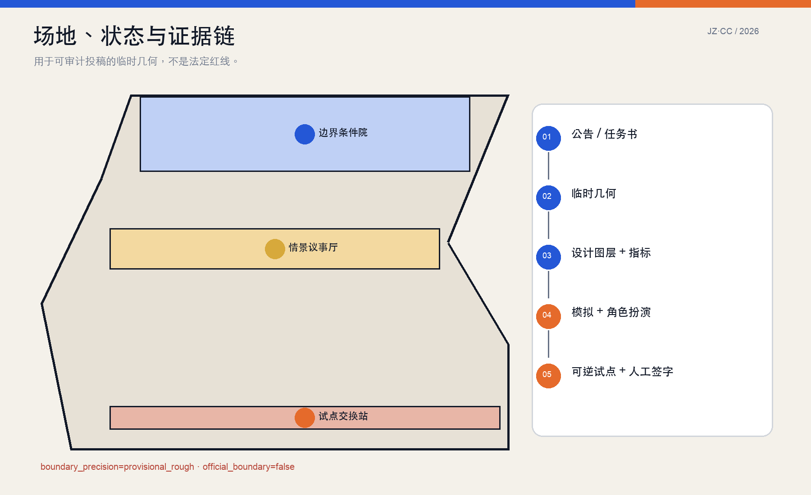
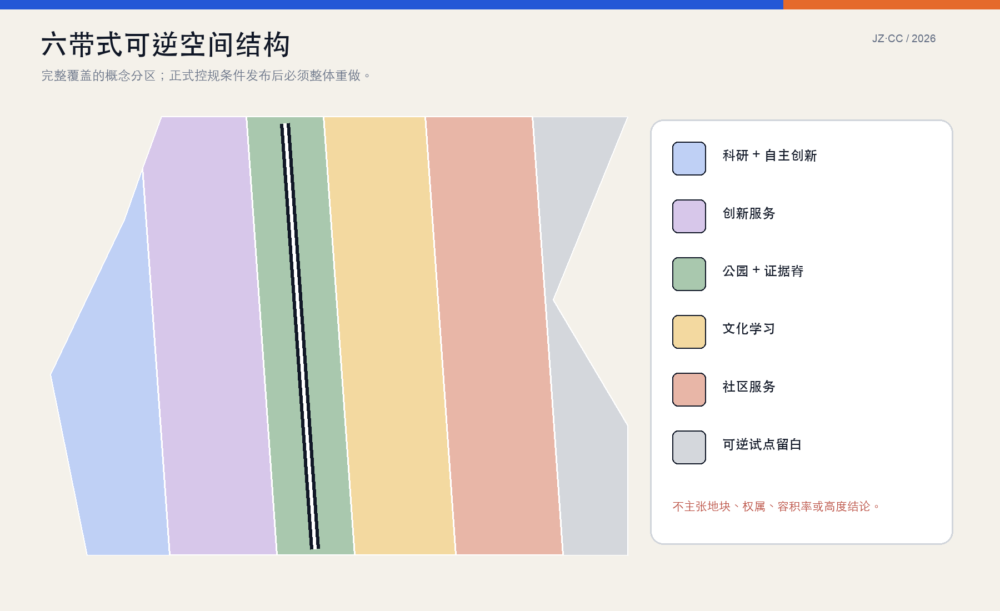
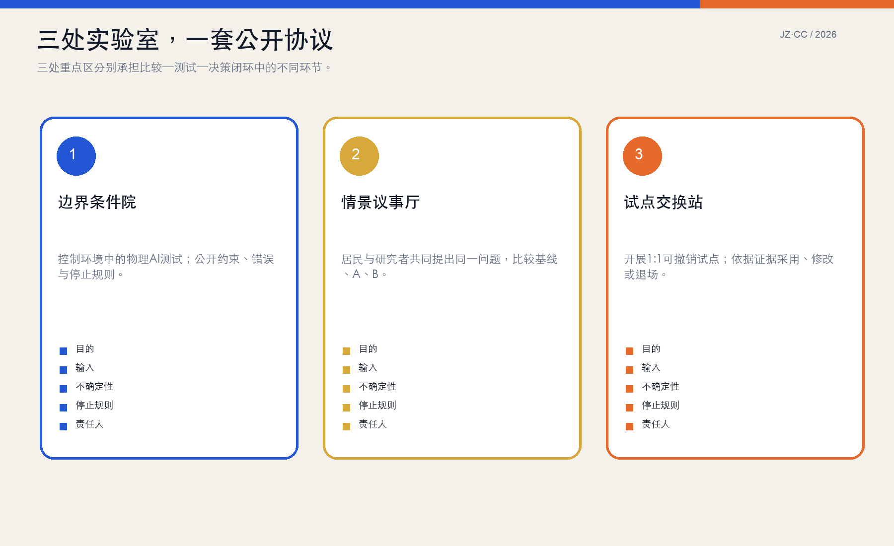
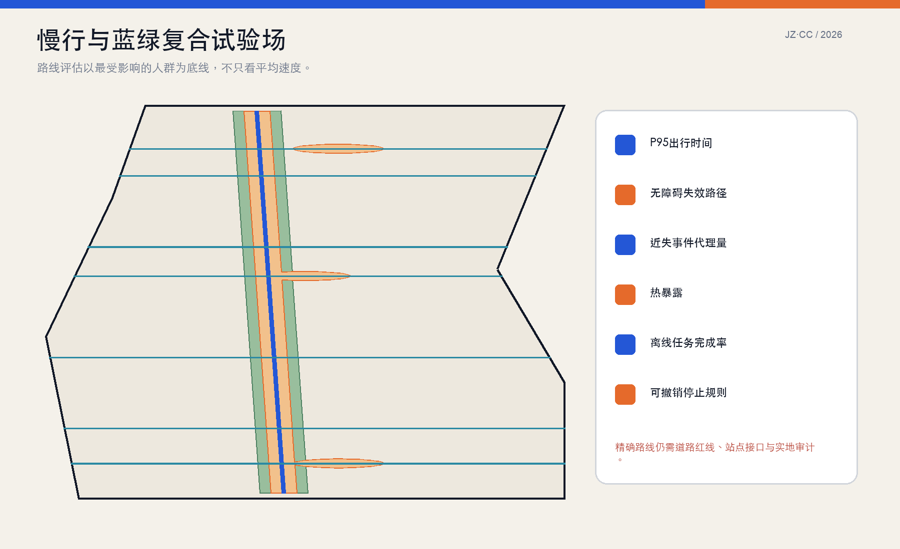
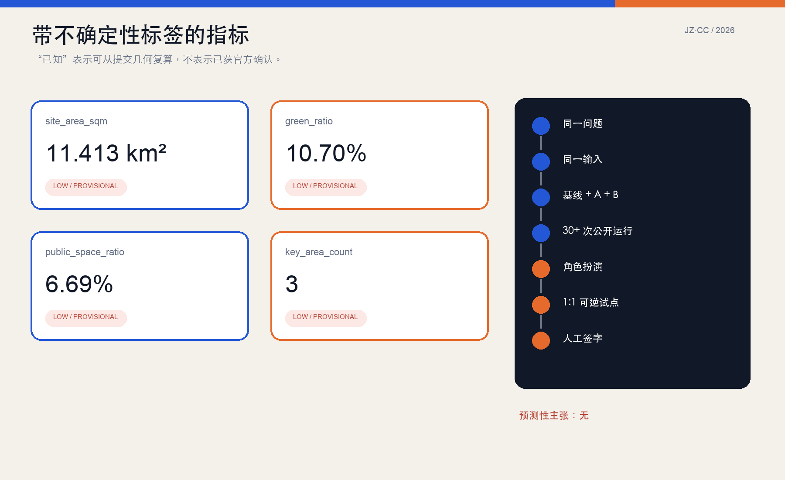

# 京张反事实公地

> 让城市在实施前，看见另一种可能。模拟不是预言；只有经过公开比较、角色扮演和可逆试点的结果，才获得进入下一步讨论的资格。

## 设计依据与资料清单

本方案以正式征集公告、仓库中的面向智能体任务书、来源登记表和机器可读场地包为直接依据。公告给出约43.6平方公里统筹研究范围、约11.4平方公里总体设计范围与三处约368.4公顷重点区域；这些面积与任务属于公开依据，但仓库尚未提供正式红线、控规条件、道路红线、权属、建筑与市政普查。本提交因此沿用仓库临时边界，明确标记 `official_boundary=false`、`boundary_precision=provisional_rough`，所有图上位置和比例只在该临时几何内可复算，不能解释成法定规划结论。[source:OFFICIAL-ANNOUNCEMENT] [source:BOUNDARY-SOURCE]

资料采用“主张—来源—图层—指标—假设”五联单：范围与任务回到公告和任务书；空间形状回到九个GeoJSON；数值回到 `metrics.json`；资料缺口回到 `assumptions.json`；模型方法回到 `visual/assets/evidence/comparison_protocol.json`。外部案例只提供机制参照，不替代北京本地调查。六个案例均来自机构或政府当前页面，检索日期为2026-08-22；三个建模方法来源为同行评审论文。封面由OpenAI图像生成工具制作，属于概念想象图，不是现状照片或精确场景复原。[source:SOURCE-REGISTRY] [data:visual/assets/evidence/comparison_protocol.json]

## 三层范围工作框架

方案把三层范围组织成一条可追踪的控制流。统筹研究范围回答“怎样形成开放而负责任的AI创新生态”；总体设计范围回答“怎样把比较、试验和公共讨论嵌入城市更新”；三处重点区回答“谁在何处完成哪一步验证”。上层不直接画伪精确地块，下层也不脱离生态与治理。每个空间动作都必须说明输入、受影响人群、可观察输出、停止规则和责任人，避免把AI场景写成没有运营主体的设备清单。[source:AGENT-TASKBOOK] [depth:three_level_scope_framework]

最小整体结构是“一脊、三院、两翼、十二场景”。一脊是从北到南可步行观察的“公开证据脊”；三院分别为众智园的边界条件院、AI原点社区的情景议事厅和大钟寺的试点交换站；中关村服务翼提供数据规范、评测、知识产权、法律与企业服务，小月河场景翼承接环境与日常行为观察。十二张场景卡贯穿交通、公共服务、无障碍、夜间、暴雨、配送、公共空间和能源，不假装一套模型能同时精确回答所有问题。[data:geometry/roads.geojson#ROAD-001] [data:visual/assets/evidence/scenario_cards.json]

## 统筹研究范围产业与未来城市研究

“反事实公地”不是另造一个封闭AI园区，而是为现有高校、科研机构、企业、公共部门与社区增加一套共同验证接口：任何团队都可以提交同一城市问题的基线、A、B方案，但必须公开假设、数据时间窗、种子、失败样本和适用边界。高质量研究因此获得可重复的现场问题，企业获得小规模真实试验入口，居民获得看见取舍和提出反例的权利，公共部门保留最终判断与责任。这里的“公地”指共同维护的证据规则，不表示土地权属或免费开放全部数据。[standard:PROJECT-AGENT-OPEN-CALL-TASKBOOK] [data:visual/assets/evidence/comparison_protocol.json]

全球案例各取一项可迁移机制：新加坡Punggol Digital District把大学、企业、社区和园区数据平台组织成生活实验室；伦敦Knowledge Quarter说明机构联盟可以先于大规模建设形成协作密度；蒙特利尔Mila和多伦多Vector Institute展示研究、产业、政策与负责任AI的接口；Kendall Square说明旧工业区向创新区转化需要长期空间与制度积累；22@ Barcelona提示更新、创意经济、城市科技和交通连接必须并行。方案不声称复制这些城市，而把它们转译成“公开协议、长期运营、可达公共界面、渐进更新”四项本地检验问题。[source:CASE-JTC-PDD] [source:CASE-BARCELONA-22]

未来城市形态因此不以科幻外观为目标，而以“可解释地试错”为新基础设施。城市里应当同时存在模型桌、离线议事桌、1:1样段、公开版本库和明确退场路径；技术体验必须能被普通人观察、质疑和拒绝。年度概念活动包括反事实城市周、失败样本夜校、全球开放情景挑战和社区校准季，均是可供后续运营团队深化的建议，不是已经确定的政府活动或预算承诺。

## 总体设计范围城市更新与控规深度城市设计

总体设计采用“六带+公开证据脊”的完整概念分区：科研、自主创新服务、公园证据带、文化学习、社区服务和可逆试点留白共同覆盖临时边界且无缝隙重叠。它表达功能关系而非现状用地或法定地块；正式红线、用地分类和控规指标到位后，应按相同生成逻辑重新切分，而不是把临时条带精修成貌似真实的地块。绿地与公共空间另以可复算覆盖层表达，可与公共步行界面重合，其比例不等同法定绿地率或公共服务设施指标。[data:geometry/land_use.geojson#LU-001] [metric:green_ratio]

城市更新的核心项目不是先拆建，而是先建立证据基线：普查既有建筑、产权、文保、市政、树木、水系、路口与站点接口；在同一坐标和版本体系中记录“保留—修缮—适应性再利用—新建—临时搭建—不介入”的判断依据。当前 `buildings.geojson` 只放置三处轻量实验室和八个开放证据亭的参考基底，用于验证程序与步行关系，明确 `reference_prototype=true`，不代表现状建筑、拆改留结论或开发量。[data:geometry/buildings.geojson#BLDG-001] [assumption:A-INVENTORY-001]

开发强度、建筑高度、退线和总建筑规模保持未知，而不是用“合理区间”掩盖缺资料。设计只提出形态原则：临时构筑物应可拆、首层应对公共步行界面开放、设备与物流不得切断无障碍链、京张线性空间的历史识别应由专业文保调查决定。控规深化触发条件是官方边界、地块、权属、建筑普查、文保控制与市政资料同时进入版本库，之后重算面积、容量、日照、消防、交通和成本。

## 重点区域详细设计

众智园“边界条件院”承担控制环境测试。它把机器人速度、传感器视野、让行规则、噪声、照明与能源负荷转成可调物理样段，入口先展示“系统在哪些条件下不能工作”。空间建议包括可封闭但可被公众观察的测试庭、人工安全员席位、无障碍绕行、故障样本库与清河文化/生态解释界面。任何测试在越过速度、近失事件、设备失联或无障碍占用阈值时立即停止；具体阈值须由交通、安全、消防和无障碍专业团队确认。[data:geometry/key_areas.geojson#PROV-KEY-001] [data:visual/assets/evidence/scenario_cards.json#SC-02]

北京AI原点社区“情景议事厅”承担问题形成与A/B比较。居民、学生、研究者和基层工作人员先共同写清服务对象、基线与失败方式，再运行同一输入窗口下的多次模拟；厅内同时保留纸质地图、实体模型和不使用智能手机的参与入口。两个可见地标是“1:1情景桌”和“零AI基线碑”：前者把街道截面和服务流程按比例搭出，后者迫使每个方案与现状/无AI基线比较，避免只展示新技术的最好一面。[data:geometry/key_areas.geojson#PROV-KEY-002] [data:visual/assets/evidence/personas.json]

大钟寺“试点交换站”承担1:1可逆试点与采用/退场。它以可搬移路缘模块、遮阴、座椅、照明、导向和微型物流设施构成测试库；每次试点公开日期、责任人、投诉入口、数据最小化规则和撤除条件。第三个地标“误差灯塔”不用彩色大屏宣称智慧，而用低技术可读的蓝/橙/灰三段显示：相对结果稳定、结果对假设敏感、尚无校准数据。正式建筑与四象限连通仍需站点接口、道路红线和权属条件，现阶段只表达工作机制。[data:geometry/key_areas.geojson#PROV-KEY-003] [assumption:A-CONTROLS-001]

## AI 创新生态、人才画像与 AI+ 场景

方案定义六类最低覆盖画像：普通通学的低年级学生、使用轮椅的社区居民、不使用智能手机的老人、高峰配送员、首次来访的海外研究者和夜间运维人员。画像不是虚构个人故事，而是检查方案是否把平均改善建立在某类人的额外负担上。每次比较都报告总体分布与最脆弱画像结果；若安全、无障碍或离线服务底线恶化，即使平均效率提高也不得直接进入试点建议。[data:visual/assets/evidence/personas.json] [standard:BARRIER-FREE-ENVIRONMENT-LAW]

十二个AI+场景使用统一卡片：目的、画像、空间、输入、基线、A/B、观测量、隐私/安全风险、验证方法、责任人和停止规则。至少三类进行闭环验证：机器人—行人共路在众智园先做封闭场角色扮演；遮阴与休息链在AI原点以夏季步行审计校准；路缘共享在大钟寺用两周可撤销标线和人工计数比较。公共服务助手必须保留人工与纸质入口；暴雨响应必须以现场确认覆盖模型输出；能源场景必须在工程与消防复核后才讨论设备。[data:visual/assets/evidence/scenario_cards.json#SC-01] [data:visual/assets/evidence/scenario_cards.json#SC-12]

创新生态的运营角色分为六类：问题发起者、数据/模型维护者、受影响群体代表、现场运营者、独立安全与无障碍复核者、最终公共责任人。AI可以生成备选、运行试验和暴露冲突，但不能替代最后一类角色。开源并不等于公开敏感数据；公开内容优先是模型结构、参数范围、聚合结果、失败样本、决策记录和可复现实验脚本，涉及个人与设施安全的数据应最小化、分级和依法处理。

## 用地、建筑规模与拆改留方案

六个用地条带是“功能容量占位器”，用于检查科研、企业服务、公共文化、社区服务、绿地和试点留白是否都被看见；它们不是建议把真实街区切成六条。`land_use.geojson` 在EPSG:4548下完整分割临时场地，保证总面积闭合，便于未来替换正式边界后自动发现缝隙和重叠。绿地与公共空间分别从公开证据脊和三处实验节点生成，数值来自几何并在图页中保留低可信度标签。[data:geometry/land_use.geojson#LU-006] [metric:public_space_ratio]

建筑策略优先“调查—适应性再利用—轻量补充”。三处实验室参考基底均为单层、可拆和可扩展的程序测试，不指定高度、容积率和结构体系；八个证据亭为模块化公共信息与休息点。对真实建筑的拆改留分类必须逐栋记录结构安全、历史价值、使用状态、产权、碳排、改造成本与服务可达性，任何一项关键资料缺失时不得自动生成“拆除”结论。保留建筑也不是零成本选择，需要消防、无障碍、设备和运营复核。[data:geometry/buildings.geojson#BLDG-004] [assumption:A-INVENTORY-001]

建筑规模只报告参考基底面积，不推导总建筑面积；`floor_area_ratio` 明确为unknown。后续专业团队获得正式资料后，应建立三个容量情景而非一个伪精确答案：保守更新、适应性再利用优先和公共服务补足，并在同一人口/就业假设下比较日照、交通、公共服务、基础设施、全生命周期碳与成本分布。最终开发强度由法定程序决定，本方案只提供可复算的比较框架。

## 交通、轨道、市政与公共服务设施

交通系统由一条公开证据脊、三条重点区对照横廊和四条社区慢行补链组成。线路是概念网络，不代表道路红线或已确认站点接口。评价从“平均速度”转向“任务可靠性”：报告轮椅、步行、骑行、夜间独行、配送和转乘画像的中位数、P95出行时间、失效绕行与冲突代理量；机器人和车辆效率不能以占用无障碍通道、增加最弱使用者风险为代价。[data:geometry/roads.geojson#ROAD-001] [data:visual/assets/evidence/scenario_cards.json#SC-04]

轨道一体化在当前阶段只定义接口审计清单：出入口位置、高差、电梯可靠性、过街相位、雨雪庇护、共享单车、夜间照明、路缘装卸和施工期替代路径。大钟寺四象限连通、AI原点校区—园区联系、众智园对外交通都必须在正式道路与站点资料到位后测绘。慢行试点先使用可撤销标线、临时座椅和人工引导，不以永久工程抢跑审批。[assumption:A-CONTROLS-001] [depth:traffic_rail_slow_parking]

市政与新型基础设施采用“最小必要、失效可退”原则：传感器只采完成场景所需的最小数据；断网时保留离线标识和人工流程；边缘算力设备有停机与维护责任人；遮阴、通风、植被和运营调度优先于新增高耗能设备。公共服务设施至少保留可见人工窗口、纸质/电话通道、无障碍卫生间、饮水、休息和紧急求助点。容量、管线、消防、排水和分布式能源均待专业资料与计算，不能从概念图反推工程可行性。

## 蓝绿空间、公共空间与城市风貌

蓝绿系统被定义为“可观察的环境基础设施”，不是装饰性绿带。公开证据脊在临时边界内形成连续绿地包络，三处实验节点形成可停留的绿色房间；后续以树冠、热环境、雨洪、物种、维护和季节数据校准，而不是仅以绿地面积评价。现阶段 `green_ratio` 是设计几何相对临时场地的数学比例，真实树木、水系和法定绿地尚未核实。[data:geometry/green_space.geojson#GREEN-001] [metric:green_ratio]

公共空间按“看得见实验、进得去讨论、退得出数字服务”组织。每个节点都要有无障碍连续路线、坐下观察的位置、清晰的人工责任人、纸质信息和无需注册的参与方式；采集数据前说明目的、保存期限和退出办法。1:1情景桌、零AI基线碑和误差灯塔构成三处地标，但它们的价值来自公开规则而非造型。夜间场景同时检查照明能耗、眩光、值守与女性独行者感受，避免单纯“更亮”。[data:visual/assets/evidence/personas.json#P-03] [data:visual/assets/evidence/scenario_cards.json#SC-08]

城市风貌采用“铁路工业痕迹+可拆科研构件+日常北京街区”的低调组合。封面中的铁轨、厂房和构筑物均为概念语言，不证明现场存在对应遗产；真实历史要由文献、测绘与文保专家确认。视觉识别以JZ·CC、蓝色方案A、橙色方案B和灰色未知状态构成，颜色永远配合文字/纹理，确保色觉差异用户也能理解。

## 更新项目清单、实施政策与分期计划

项目清单按证据门槛而非投资规模排序。第一组“先知道”包括正式边界导入、建筑/权属/文保/市政普查、慢行与无障碍审计、树冠热环境与路缘观察、数据治理协议；第二组“先试小”包括三类两周内可撤销的遮阴休息链、路缘共享和离线公共服务；第三组“再形成场所”包括三处实验室的适应性再利用或轻量搭建；第四组“经证据扩展”才包括连续公共空间、站点接口和市政改造。任何永久建设不得因本提交而自动启动。[depth:renewal_project_list] [assumption:A-COST-001]

分期图层把临时场地分成三个便于复算的工作区，但真实实施遵循四个门：资料门确认红线、权属、控制和安全；代表性门确认六类画像参与；证据门确认结果对参数敏感性、随机种子和失败样本仍稳健；责任门由明确公共责任人签字。未过门的项目可以继续研究，不能被可视化中的高分或“AI推荐”推进。[data:geometry/phasing.geojson#PHASE-001] [data:visual/assets/evidence/comparison_protocol.json]

政策建议是建立“城市试点版本库”和“小试点快速许可—强退场责任”机制：每个试点有版本、日期、边界、责任人、数据清单、投诉渠道、停机与恢复方案；通过的相对结果只获得进入现场试点的资格，不等于建设许可。年度活动、全球挑战和企业合作均采用公开问题、基线和失败披露规则；运营主体、采购方式和资金尚未确认，因此 `phasing.geojson` 不是工期或投资承诺。

## 指标体系、面积复算与合规矩阵

核心指标由GeoJSON在EPSG:4548下复算：临时场地面积、参考建筑基底、绿地覆盖、公共空间覆盖和重点区数量均为known；容积率为unknown。这里known只表示“按提交几何和公式可以重复得到同一数值”，不表示官方确认或现实准确。所有数值同时带来源文件、公式、单位、可信度和假设；视觉页用 `data-metric` 与精确 `data-value` 镜像机器值，避免图表与JSON各写一套。[metric:site_area_sqm] [metric:public_space_ratio]

模拟指标分为效率、可靠性、公平、安全与可逆性五组。单一均值不足以支持判断，至少展示中位数、P05/P95、失败次数、结果分布和敏感性；同一问题使用相同边界、输入时间窗、无AI/现状基线、A/B方案与公开随机种子。路径依赖研究表明预测准确与过程准确可能冲突，空间规划模型可更适合作为探索装置；因此方案不作未来人流或商业价值预测。[source:METHOD-PATH-DEPENDENCE] [source:METHOD-ROLEPLAY-VALIDATION]

`compliance_matrix.json` 映射公告1.3—1.5和agent.1—agent.6到章节、图层、指标、图纸与自检；`standard_matrix.json` 映射城市设计、控规、用地和无障碍依据；`design_depth_matrix.json` 对缺资料项以“已完成方法与未知声明”满足提交深度，而不是伪造数值。ODD方法用于记录模型目的、实体、状态变量、流程、输入、初始化、子模型、实验和适用性评价，使别人能够重跑并指出结构错误。[source:METHOD-ODD-2020] [depth:metrics_recalculation]

## 风险、版权与合规说明

最大风险不是模型算错一个小数，而是把尚未校准的相对比较写成预测，把临时边界写成官方红线，或把概念原型写成政府承诺。本包把这些风险落入可机器检查字段：边界为provisional_constraint；开发强度unknown；建筑为reference_prototype；场景状态为design_protocol_not_calibrated；运营、成本和法定条件进入assumptions。官方几何到位时必须整包重算，旧图不得继续作为现状底图。[assumption:A-BOUNDARY-001] [depth:risk_missing_data]

安全、隐私与公平采用人工责任链。敏感个人数据不是开源前提；优先公开聚合观测、模型结构、参数范围、合成测试、失败样本和决策记录。公共服务必须允许转人工和离线完成；物理AI必须有现场安全员、停止按钮和可撤销边界；所有比较同时报告最不利画像。无障碍要求来自法律和专业复核，不由模型自行放宽。[standard:BARRIER-FREE-ENVIRONMENT-LAW] [data:visual/assets/evidence/comparison_protocol.json]

正文、图件、JSON、HTML和PDF由本次OpenAI Codex会话生成并由提交者审核；封面使用OpenAI图像生成工具，提示词与用途写入版权声明。外部案例页面和论文仅被摘要引用，不复制受版权保护的大段文本；仓库提供的公开/清权资料按来源登记表使用。许可证为COMMUNITY-DISPLAY-ONLY，具体授权以 `report/copyright_statement.md` 为准。本方案是公开征集的概念建议，不是审批、工程设计、投资建议或任何机构的既定行动。

## 参考资料

项目依据包括北京市规划和自然资源委员会海淀分局征集公告、仓库面向智能体任务书、场地包、来源登记和处理后的事实导航。专业依据由 `standard_matrix.json` 给出，本节不重复抄录法规正文。六个全球案例的使用限于机制对比：JTC Punggol Digital District、Knowledge Quarter London、Mila、Vector Institute、Cambridge Kendall Square和Barcelona 22@；检索日期与链接保存在 `sources.json`，每个案例均在 `visual/assets/evidence/precedents.json` 中写明不可直接迁移的边界。[source:OFFICIAL-ANNOUNCEMENT] [data:visual/assets/evidence/precedents.json]

模型方法参考Grimm等人的ODD 2020协议、Brown等关于土地利用ABM路径依赖与预测/过程准确性的研究，以及Ligtenberg等对空间规划ABM进行角色扮演验证的研究。它们支持三个谨慎结论：复杂模型应有标准化、可读、可复现的说明；随机与路径依赖结果应报告分布和适用边界；多主体规划模型可以用来探索和理解，而不必冒充准确预测。具体论文元数据和DOI保存在 `sources.json`。[source:METHOD-ODD-2020] [source:METHOD-ROLEPLAY-VALIDATION]

本提交的机器可读入口依次为 `manifest.json`、`metrics.json`、九个GeoJSON、`visual/assets/evidence/scenario_cards.json`、`visual/assets/evidence/comparison_protocol.json`、三类矩阵与 `self_check.json`；人类阅读入口为中英提案、A3文册、A0展板与离线交互页。若这些文件出现不一致，以通过哈希校验的结构化数据为复算起点，并把冲突作为阻断问题修复，而不是选择更好看的版本。
