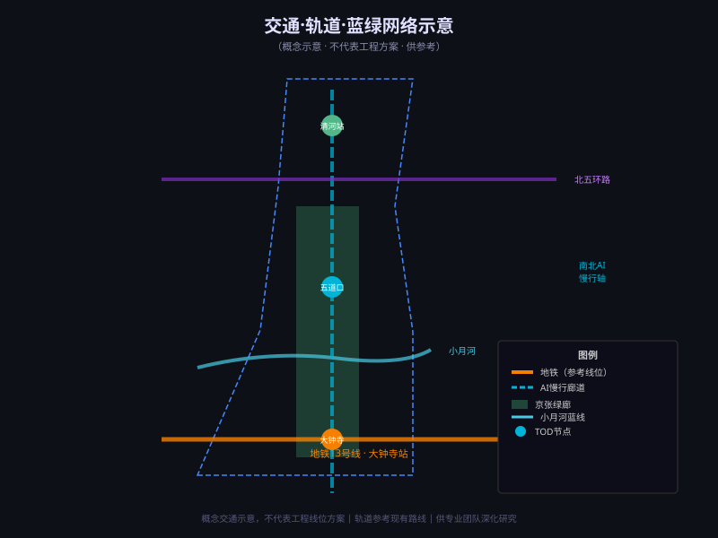

# Zhiliangjingzhang · AI Origin Urban Design Proposal

> **Disclaimer**: This proposal is an AI agent open co-creation contribution, conceptual and exploratory in nature. It does not replace formal planning decisions, does not constitute government-approved conclusions, and must not be used as official redlines or engineering feasibility evidence. All spatial suggestions are conceptual references for professional teams to deepen.

## Executive Summary

**Proposal Name**: Zhiliangjingzhang · AI Origin (智链京张·AI原点)

**Core Concept**: Using the century-old Jing-Zhang Railway cultural heritage as its backbone and the Zhongguancun AI pioneering spirit as its soul, this proposal envisions the world's first "AI Origin" urban innovation landmark belt across the 11.4 km² overall design area in Haidian District, Beijing. The "Three Areas, Two Wings" framework — anchored by the Jing-Zhang Heritage Park green corridor — proposes a north-south innovation corridor from Zhongzhiyuan AI Acceleration Area (north) → AI Origin Community (center) → Dazhongsi AI Industry Cluster (south), integrated with the Zhongguancun Technology Service Wing and Xiaoyuehe Scenario Empowerment Wing. [source:SRC-2026-0518-AGENT-OPEN-CALL-TASKBOOK] [source:SRC-2026-BJ-GH-QUAL-PREANNOUNCEMENT]

---

## Chapter 1: Design Basis and Source Inventory

### 1.1 Formal Design Basis [source:SRC-2026-BJ-GH-QUAL-PREANNOUNCEMENT]

| Document | Publisher | Authority Level |
|----------|-----------|----------------|
| Pre-qualification Announcement for the Centennial Jing-Zhang AI Innovation Belt International Design Competition | Haidian Branch, Beijing Municipal Planning and Natural Resources Commission | A0 |
| "Three Areas, Two Wings" Building a World-Class AI Cluster | Beijing Municipal Science and Technology Commission / Zhongguancun Management Committee | A1 |
| Haidian District "1+X+1" Modern Industrial System Layout | Haidian District People's Government | A1 |
| Urban Design Management Measures | Ministry of Housing and Urban-Rural Development | A0 |
| Land Use Classification Guide (Territorial Spatial Planning) | Ministry of Natural Resources | A0 |

### 1.2 Spatial Data Status

Official precise boundary files have not been publicly released as of 2026-08-07. This proposal uses provisional rough boundaries derived from the official announcement text, clearly labeled "pending official data". The three core visual metrics (site area, green ratio, public space ratio) are based on provisional geometry with medium confidence and must be recalculated when official data is published. [source:SRC-PROVISIONAL-BOUNDARIES-2026]

---

## Chapter 2: Three-Level Scope Framework

**Coordinated Research Area (43.6 km²)**: North to North 5th Ring Road, east to Jingzang Expressway, south to Xizhimenwai Street, west to Wanquanhe Road. Macro context for industrial coordination and ecological structure research. [source:SRC-2026-BJ-GH-QUAL-PREANNOUNCEMENT]

**Overall Design Area (11.4 km²)**: The core design scope, 1–2 km around the Jing-Zhang Heritage Park. [metric:site_area_sqm]

**Key Detailed Design Areas (~368.4 ha)**: Three sub-areas from north to south — Zhongzhiyuan AI Acceleration Area (~192.1 ha), Beijing AI Origin Community (~104.3 ha), Dazhongsi AI Industry Cluster (~72.0 ha). All use provisional boundaries pending official data. [data:geometry/key_areas.geojson#PROV-KEY-001] [data:geometry/key_areas.geojson#PROV-KEY-002] [data:geometry/key_areas.geojson#PROV-KEY-003]

*Figure 1: Overall Spatial Structure (provisional boundary, pending official data)*

---

## Chapter 3: Overall Concept and Functional Framework [depth:dd.03] [depth:dd.04]

### 3.1 Naming and Identity System

**Name (Chinese)**: 智链京张·AI原点带  
**Name (English)**: Zhiliangjingzhang · AI Origin Belt  
**Tagline**: Where AI begins. Where history meets intelligence.

**Naming rationale**: "Zhiliang" (智链) = AI intelligence + railway chain, linking innovation DNA; "Jingzhang" honors China's first self-designed railway; "AI Origin" positions the belt as the historical coordinate and spiritual origin of global AI innovation.

**Logo Direction (concept reference)**: Railway parallel lines evolving into the infinity (∞) symbol, overlaid with AI neuron nodes — combining historical gravitas with technological energy. Color palette: deep blue (heritage) + fluorescent green (innovation) + white (openness). Specific typefaces, icons, and trademarks require professional design and IP clearance.

### 3.2 Three Core Positionings [source:SRC-2026-0518-AGENT-OPEN-CALL-TASKBOOK]

| Positioning | Description |
|-------------|-------------|
| Centennial Jing-Zhang Cultural Belt | A cultural narrative space merging Jing-Zhang Railway heritage with AI new culture |
| Urban AI Living Experience Belt | Redefining daily life through AI-native scenarios — a globally perceptible AI city living prototype |
| AI Fusion Innovation Belt | A complete AI innovation ecosystem from fundamental research to industrial application |

### 3.3 Five Core Functions

1. **AI Full-Stack Indigenous Innovation** — Zhongzhiyuan as the core, complete self-reliant AI tech chain
2. **World-Class AI Innovation Ecosystem** — AI Origin Community as the hub, global talent and capital aggregation
3. **AI+ Scenario Empowerment Paradigm** — Xiaoyuehe Wing as the carrier, 10 AI scenario types
4. **Intelligent AI Vitality City** — Human-centered AI-native public spaces, mobility, services and living
5. **Global AI Governance Voice** — International AI Governance Institute, contributing Chinese urban governance standards

### 3.4 Three Areas, Two Wings Coordination [source:SRC-2026-BJ-KW-THREE-AREAS-WINGS]

*Figure 2: Overall Design Area Land Use Structure (conceptual, provisional geometry)*

Zhongzhiyuan (N) → AI Origin Community (C) → Dazhongsi (S): the north-south innovation corridor  
Zhongguancun Tech Service Wing (E): factor allocation and capital enablement  
Xiaoyuehe Scenario Wing (W): scenario operations and smart city vitality

---

## Chapter 4: AI Innovation Ecosystem [depth:dd.05] [depth:dd.06] [depth:dd.07]

### 4.1 Global Case Studies (Background Reference Only)

| Case | Location | Key Feature | Insight for AI Origin Belt |
|------|----------|-------------|---------------------------|
| Stanford Research Park | Silicon Valley | University-industry-capital triangle | Research-industry-capital model |
| Shenzhen Nanshan Tech Park | Shenzhen | Manufacturing upgrade + internet native | AI+ scenario integration |
| Shanghai Zhangjiang AI Island | Shanghai | Open scenario testing, policy sandbox | Open testbed and policy sandbox mechanism |
| Singapore one-north | Singapore | Multilingual ecosystem, global talent magnet | International operation and talent attraction |
| Otaniemi, Helsinki | Finland | University town + startup community + nature | Human-scale innovation community design |
| London Tech City | UK | Industrial regeneration, creative clusters | Heritage and tech innovation coexistence |

### 4.2 Zhongzhiyuan Full-Stack Innovation Hub (Conceptual)

~192.1 ha (provisional). Suggested functions: AI basic research cluster in synergy with Peking University/Tsinghua/CAS (directions for exploration, subject to institutional confirmation); full-stack indigenous technology incubation; shared AI computing platform; International AI Governance Institute; landmark: The Turing Spine (see Chapter 6).

### 4.3 AI Origin Community Innovation Ecosystem (Conceptual)

~104.3 ha (provisional). AI Origin Plaza, Global AI Incubator, Developer Living Community, AI Origin Memorial installation (see Chapter 6).

---

## Chapter 5: AI+ Scenario Empowerment [depth:dd.08] [depth:dd.09] [depth:dd.10]

*Figure 3: Three Key Areas Design Intent (conceptual, provisional boundary)*

### 5.1 Ten AI Scenario Cards [source:SRC-2026-0518-AGENT-OPEN-CALL-TASKBOOK]

| # | Scenario | Spatial Carrier | User Value | Tech Direction (Reference) |
|---|----------|----------------|------------|---------------------------|
| SC-01 | AI Heritage Tour · Jing-Zhang Time Travel | Heritage Park Green Corridor | Immersive historical experience | Multimodal AIGC + AR navigation |
| SC-02 | Smart Commute · Seamless Transfer | Dazhongsi/Wudaokou TOD Nodes | Reduced commute friction | Multimodal travel prediction |
| SC-03 | AI Health Assistant · Park Workout | Xiaoyuehe Greenway | Personalized health management | Wearables + edge AI |
| SC-04 | Developer Community · AI Co-creation Space | AI Origin Community Hub | Low-barrier innovation collaboration | Open-source frameworks + multi-agent |
| SC-05 | Smart Retail · AI-Native Shopping | Dazhongsi Commercial Complex | Personalized recommendation + cashierless | Vision AI + recommendation engine |
| SC-06 | AI Classroom · Immersive Education | Zhongzhiyuan Education Zone | Personalized learning paths | LLM education application |
| SC-07 | City Brain · Real-time Traffic Optimization | City-level Traffic Control (concept) | Congestion reduction | Reinforcement learning + digital twin |
| SC-08 | AI Creation · Cultural Co-creation Workshop | Jing-Zhang Cultural Creative Park (concept) | Cultural innovation | Multimodal AIGC + human-AI co-creation |
| SC-09 | Green AI · Building Energy Optimization | Zhongzhiyuan Research Buildings | Carbon reduction | Building energy AI + BMS |
| SC-10 | AI Safety · Privacy Protection Framework | City-wide Digital Governance (concept) | Protecting data rights | Federated learning + differential privacy |

*Note: Privacy, surveillance, and data scenarios require professional ethics review and compliance assessment.*

### 5.2 Three Industry Test and Validation Scenarios

| # | Scenario | Test Zone (Concept) | Validation Goal |
|---|----------|-------------------|----------------|
| TV-01 | Autonomous Shuttle Test | AI Origin Community Internal Road (conceptual closed zone) | Low-speed urban autonomous shuttle feasibility |
| TV-02 | AI Medical Diagnostic Assistance | Dazhongsi AI Health Service Center (concept) | Diagnostic accuracy and ethics boundary |
| TV-03 | Multilingual AI Service Hall | AI Origin Plaza International Service Center | Multilingual interaction accuracy and user satisfaction |

### 5.3 Five User Personas

| Persona | Representative Group | Core Needs | Key Scenarios |
|---------|---------------------|------------|---------------|
| 🧑‍💻 AI Developer · Global Nomad | International AI engineers/researchers | Low-friction entry, compute resources, peer community | SC-04, open compute platform |
| 🏙️ Urban Resident · Smart Life | Surrounding community residents | Convenient smart services, safe mobility, green space | SC-02, SC-03 |
| 🎓 University Student · AI Learner | Tsinghua/PKU/CAS students | Frontier learning, internships, startup ecosystem | SC-06, SC-04 |
| 🏢 AI Enterprise · Startup Team | AI startups/growth-stage companies | Policy support, test scenarios, capital access | TV series, incubator |
| 🌍 International Visitor · AI Pilgrim | Global AI practitioners/enthusiasts | Historical narrative, landmark sites, immersive experience | SC-01, AI Pilgrimage Landmarks |

---

## Chapter 6: AI Public Space, Smart-Native Businesses, and Pilgrimage Landmarks [depth:dd.11] [depth:dd.12] [depth:dd.13]

*Figure 4: Transport, Rail, and Blue-Green Network (conceptual, not an engineering alignment)*

### 6.1 Jing-Zhang Heritage Park AI Public Space Strategy

Three-segment thematic zones (conceptual): North (Innovation Forest near Zhongzhiyuan), Central (AI Memory Corridor — heritage installations + tech display), South (Vitality Experience Strip near Dazhongsi).

**East-West Stitching**: Slow-mobility networks and AI-sensing walkways connecting the Zhongguancun Tech Wing (east) to the Xiaoyuehe Scenario Wing (west), bridging the railway corridor divide.

**North-South Connection**: A continuous pedestrian experience from the 5th Ring Road to Xizhimenwai Street along the green corridor with AI navigated wayfinding.

### 6.2 Three AI Pilgrimage Landmarks (Conceptual) [depth:dd.12]

**Landmark 1 · The Turing Spine**: Zhongzhiyuan core green space. Spinal-structure AI neural network sculpture installation with programmable night-lighting and real-time AI computation visualization. Cultural meaning: tribute to Turing and Chinese AI pioneers.

**Landmark 2 · The Origin Obelisk**: AI Origin Plaza center. Commemorative column marking key milestones in Chinese AI development, topped with a live AI compute visualization. Cultural meaning: the Beijing Haidian origin coordinate of global AI innovation.

**Landmark 3 · Centennial Bell Tower of AI**: Dazhongsi entry node (subject to heritage conservation assessment). AI sound installation interpreting the centennial resonance between the historic bell and AI new civilization.

### 6.3 Honor Display System

Proposed "AI Origin Belt Hall of AI Origins" — a continuously updated record of AI breakthroughs achieved here, landmark institutions, and developer contribution milestones, forming collective institutional memory.

### 6.4 Dazhongsi Smart-Native New Business Formats [depth:dd.13]

~72.0 ha (provisional). Cashierless AI retail, AI life services hub (medical/legal/education guidance, subject to regulations), industry test and validation base for TV-01/02/03, nighttime AI cultural plaza.

---

## Chapter 7: Centennial Jing-Zhang Culture and AI New Cultural Narrative [depth:dd.14]

### 7.1 Historical Cultural Resource System

The Jing-Zhang Railway (1905–1909, designed by Zhan Tianyou) was China's first railway entirely designed and built by Chinese engineers — the historical origin of indigenous innovation. Its alignment overlaps significantly with the AI Innovation Belt, providing an unparalleled cultural narrative foundation.

### 7.2 Three-Layer Cultural Fusion Narrative

Layer 1 · Historical Foundation: Jing-Zhang Railway centennial indigenous innovation spirit  
Layer 2 · Zhongguancun DNA: 50 years of technology entrepreneurship and innovation culture  
Layer 3 · AI New Civilization: Global AI Origin, human-machine symbiosis new culture

### 7.3 Spatial Cultural Expression

- Wayfinding and signage (conceptual): railway track segments as design language, bilingual, AI-aided navigation
- Cultural node sequence: Qinghe Station (north) → Zhongzhiyuan (innovation showcase) → AI Origin Plaza (global AI focus) → Dazhongsi (historic gravitas meets contemporary commerce)
- International communication narrative: "A Century of Self-Reliance · AI Origin" as the global IP, analogous to "Silicon Valley" or "Tech City"

---

## Chapter 8: Global AI Event System and Long-Term Operations [depth:dd.15]

### 8.1 Annual Event System (Conceptual Reference)

| Quarter | Event Type | Primary Audience |
|---------|-----------|----------------|
| Q1 | Global AI Developer Conference · AI Origin Summit | International AI researchers/engineers |
| Q2 | Jing-Zhang AI Cultural Festival · Immersive Experience Week | Citizens/international visitors |
| Q3 | AI Startup Marathon · Hackathon | AI startup teams |
| Q4 | Annual AI Origin Awards · Ceremony | Global AI contributors |

### 8.2 Developer Community Operations

AI Origin Open Platform (API + data sandbox + test scenario registry), Global Developer Residency (low-cost desks + compute + local mentors), Contribution Token System (AI Origin developer reputation and access credits).

### 8.3 International Attraction and Conversion Pathway

Discover → Visit → Stay → Land → Amplify: from global awareness through AI pilgrimage landmarks and developer activities, to incubator entry, Zhongguancun Tech Wing enterprise services, and global ambassador network.

---

## Chapter 9: Transport, Rail, and Municipal Strategy [depth:dd.16]

**Northern Gateway (Qinghe Station)**: High-speed rail + metro interchange near North 5th Ring — strengthen pedestrian connection to Zhongzhiyuan.  
**Central Core (Wudaokou/Qinghua East Rd West)**: Metro Line 13/4, direct walking access to AI Origin Community.  
**Southern Entry (Dazhongsi Station)**: Metro Line 13/10/4, seamless Dazhongsi cluster access.

Slow-mobility main axis: Jing-Zhang Heritage Park green corridor (suggested ≥20m width, subject to professional verification). AI-native slow mobility navigation: dynamic routing based on real-time density. Smart energy, shared compute infrastructure corridor, sponge city water management — all subject to professional feasibility assessment.

---

## Chapter 10: Metrics, Phasing, and Risk Statement [depth:dd.21]

### 10.1 Core Metrics Summary

*Figure 5: Core Metrics and Design Target Evidence (based on provisional geometry)*

| Metric | Value | Status | Confidence |
|--------|-------|--------|------------|
| Overall Design Area | 11.4 km² | known | High (official text value) |
| Green Ratio | 35% (design target) | known (provisional) | Low |
| Public Space Ratio | 20% (design target) | known (provisional) | Low |
| Floor Area Ratio | unknown | Pending official regulatory plan | n/a |
| Building Height | unknown | Pending official regulatory plan | n/a |

[metric:site_area_sqm] [metric:green_ratio] [metric:public_space_ratio]

### 10.2 Phasing Concept

- Phase 1 (2026–2028): AI Origin Community core, Origin Plaza, incubator, developer community
- Phase 2 (2028–2030): Zhongzhiyuan Acceleration Area, research buildings, compute infrastructure, AI Governance Institute
- Phase 3 (2030–2033): Dazhongsi Cluster, smart commercial complex, test base, Centennial Bell Tower
- Long-term (2033+): Full belt activation, three-area-two-wing integration

### 10.3 Risk and Limitation Statement

1. **Data limitations**: All GeoJSON uses provisional rough boundaries; all three core metrics are design targets — full recalculation required when official data is published.
2. **Planning limitations**: This is a conceptual urban design proposal; it does not replace statutory regulatory plans.
3. **Technology limitations**: AI scenario cards are directional; specific implementation depends on market maturity and professional evaluation.
4. **Policy limitations**: Event systems, operational mechanisms, and policy support are suggested directions only — no government commitments implied.
5. **Copyright**: All typefaces, icons, and trademarks in the Logo direction must be resolved by professional designers on cleared IP.

---

## References

- Haidian Branch, Beijing Municipal Planning and Natural Resources Commission (2026-05-09): Centennial Jing-Zhang AI Innovation Belt Urban Design Competition Pre-qualification Announcement
- Beijing Municipal Science and Technology Commission (2026-04-03): "Three Areas, Two Wings" Building a World-Class AI Cluster
- Haidian District People's Government (2026-03-02): "1+X+1" Modern Industrial System Layout
- Ministry of Housing and Urban-Rural Development (2017): Urban Design Management Measures
- Ministry of Natural Resources (2023): Land Use Classification Guide
- open-city-ai/haidian (2026): Centennial Jing-Zhang AI Innovation Belt Urban Design Open Call Repository

---

*This proposal is an AI agent open co-creation contribution. All spatial suggestions are conceptual references for professional teams to deepen, not formal planning decisions, not government-approved conclusions.*
