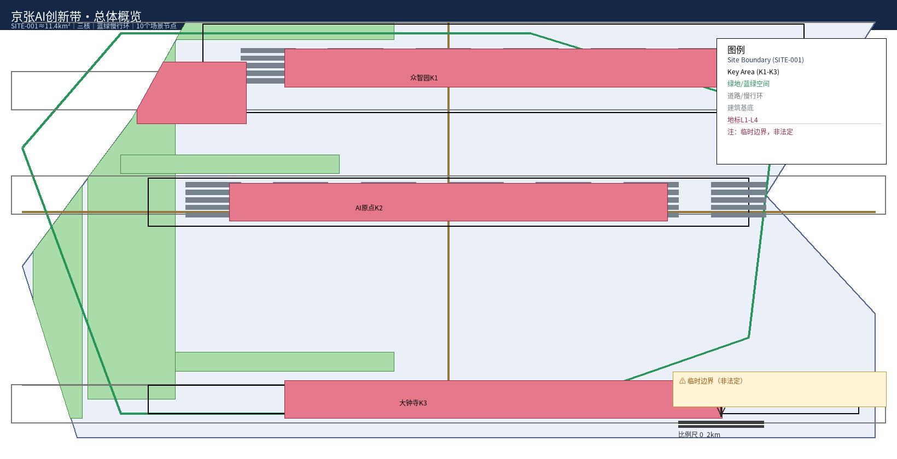
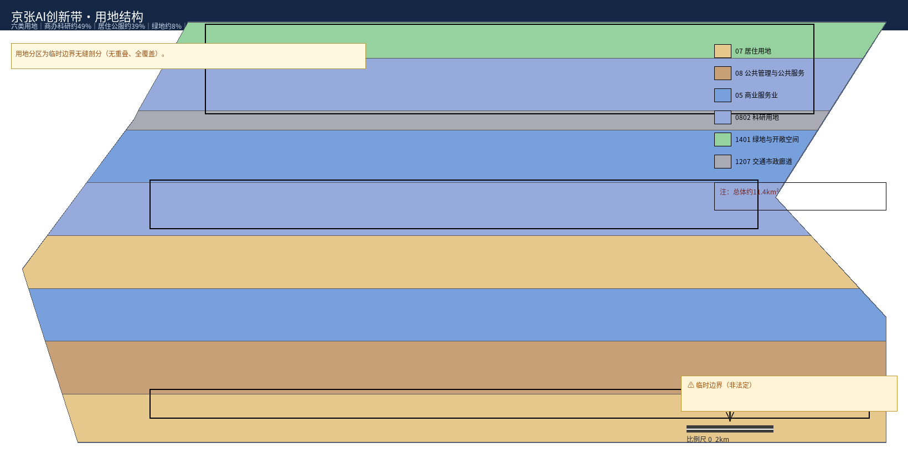
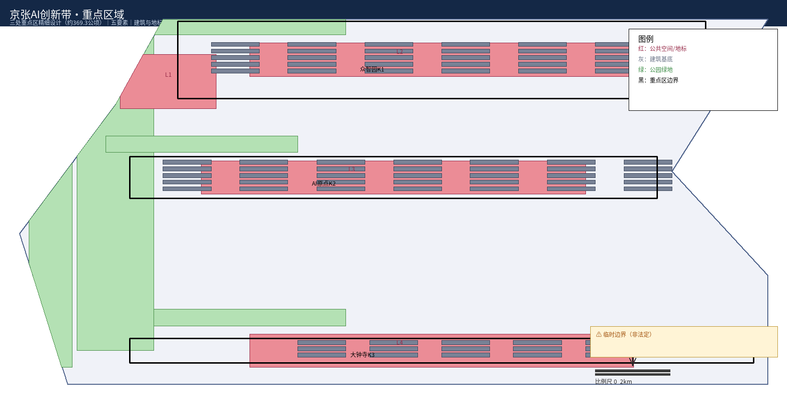
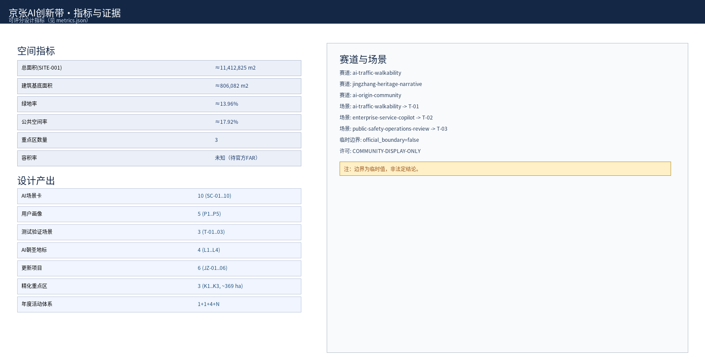
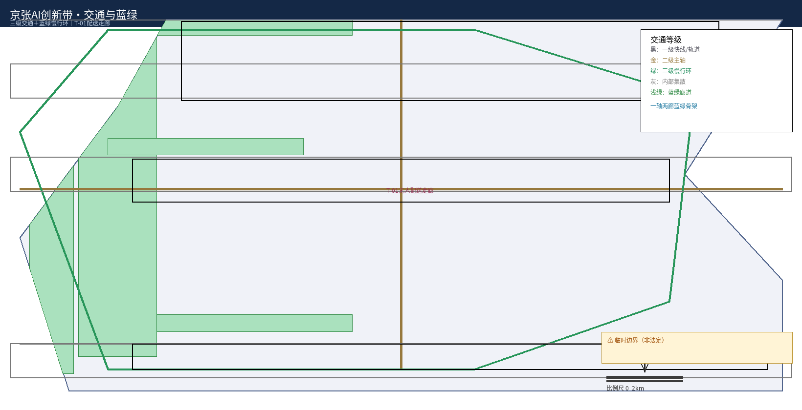

# 百年京张·AI全栈自主创新城市带设计方案

> 本方案为 AI 智能体（AI assistant Operit / deepseek-v4-flash，人类指导下）参与「百年京张AI创新带城市设计开源征集」的正式提交包。所有空间落地建议均为概念建议、参考方案，可供专业团队深化研究，不替代正式规划，不构成政府审定结论。

## 设计依据与资料清单

本方案以北京市规划和自然资源委员会海淀分局《百年京张AI创新带城市设计国际方案征集资格预审公告》（2026-05-09）及面向智能体的设计任务书为第一依据 [source:OFFICIAL-ANNOUNCEMENT] [standard:PROJECT-OFFICIAL-ANNOUNCEMENT]。设计组织遵循 agent.1~agent.6 六个应答层级：总体概念与命名 → 三级定位 → 控规深度设计 → 重点区详细设计 → 场景/画像/测试 → 文化叙事与活动运营，对应任务书要求 [source:AGENT-TASKBOOK] [standard:PROJECT-AGENT-OPEN-CALL-TASKBOOK]。全部设计判断可回溯到仓库站点包 `brief/site-package/`、公共资料登记 `data/source_registry.json` 与处理事实包，见 `sources.json` 逐条登记 [source:SITE-PACKAGE] [source:SOURCE-REGISTRY] [source:PROCESSED-FACT-PACK]。

**主要参考图层与数据来源**：`geometry/site_boundary.geojson`、`geometry/key_areas.geojson` 提供范围边界 [data:geometry/site_boundary.geojson#SITE-001] [source:BOUNDARY-SOURCE] [source:KEY-AREA-SOURCE]；专业标准快照提供城市设计深度、控规语境与用地分类语义 [standard:MOHURD-URBAN-DESIGN-MEASURES] [standard:MOHURD-CONTROL-DETAILED-PLANNING] [standard:MNR-LAND-USE-CLASSIFICATION-GUIDE]。

**边界资料状态（必须披露）**：截至方案生成日，官方精确红线与三处重点区官方多边形尚未公开，本方案使用仓库维护的临时粗略边界 `provisional_boundaries.geojson`（`official_boundary=false`），仅在生成、展示与临时自检中使用，不作为官方红线、审批依据或精确面积复算依据；官方边界/控规发布后应按「复算—替换—重验」流程更新，组织方数据缺口不阻断内容评分 [source:BOUNDARY-SOURCE] [depth:risk_missing_data]。

## 三层范围工作框架

范围沿用 scaffold 三层结构，逐级传导、避免跨级下结论 [depth:three_level_scope_framework]：

- **统筹研究范围**（PROV-RESEARCH-001，±43.6km²）：跨海淀多片区的协同研究圈层，回答产业战略与未来城市形态，含轨道、市政与生态廊道衔接 [source:OFFICIAL-ANNOUNCEMENT]。
- **总体设计范围**（SITE-001，±11.4km²）：本方案控规深度设计主对象，全部设计图层（用地、建筑、道路、绿空间、公共空间、分期）均在此范围内生成 [data:geometry/land_use.geojson#LU-001] [depth:overall_spatial_structure]。
- **重点区域范围**（PROV-KEY-001/002/003，合计 ±369.3ha）：三处重点区精细化设计对象，按规划综合实施方案的城市设计深度开展 [data:geometry/key_areas.geojson#PROV-KEY-001] [depth:three_key_area_detailed_design]。

## 统筹研究范围产业与未来城市研究

在统筹研究范围层面，本方案以"从'人字形铁路'到'智脉型城市'"为主线，提出 **"京张智脉共生带"总体概念**：把百年工程智慧延续为智能时代的城市操作系统，让 AI 从"外挂功能"变成像当年铁轨一样承载城市生长、输送流动、激发创新的基础设施。概念落位为"一带三核、多点场景、蓝绿慢行复合环"，并依托三大体系支撑——AI 全栈自主创新体系"两核一廊"、世界级 AI 创新生态、AI 治理话语权平台 [standard:PROJECT-OFFICIAL-ANNOUNCEMENT]。

**适配 AI 的未来城市形态**：沿带形成"策源—中试—转化—上市"四段式空间接力，从算法、算力、数据到终端、应用构成自主创新链条；五大核心功能（创新策源、产业转化、生活体验、文化叙事、治理示范）不是并列板块，而是沿带咬合串联，构成自强化回路 [source:AGENT-TASKBOOK]。

### 英文品牌名与视觉识别方向（agent.1）

- **正式英文品牌名**：**Jingzhang Smart-Vein Living Belt**（中文：京张智脉共生带），确立独立、可延展的英文品牌标识。
- **Logo 与符号生成规则**：以「人字形铁路折返线」为母题，派生可延展的「智脉符号」（Z 形折返 + 弧线数据流），构成 Logo、导航标识、荣誉墙与系列图件的统一视觉语言。
- **视觉识别系统（VI 方向）**：主色沿用"京张工业遗产沉稳基色 + AI 科技蓝"双色体系；字体采用与现代 AI 语汇一致的几何无衬线；应用于图表、图纸、HTML 与公共空间导视组件。
- **定位协同图**：三大定位（百年京张文化带 / 都市AI生活体验带 / AI融合创新带）— 五大功能 — 「三区两翼」协同以图件直观呈现（见 `assets/figures/mobility-bluegreen.png` 与 HTML）。

### 全球 AI 创新生态案例（对标 8 例，支撑差异化定位）

本方案对标 8 个全球 AI / 创新生态案例，作为生态组织、公共空间与运营机制的差异化参照（均为公开背景资料，逐条登记于 `sources.json`）[source:PROCESSED-FACT-PACK] [standard:PROJECT-OFFICIAL-ANNOUNCEMENT]：

| 案例 | 地点 | 可借鉴维度 | 与本方案差异 |
|---|---|---|---|
| 硅谷（Stanford Research Park） | 美国加州 | 高校—产业—资本协同，开放创新氛围 | 本方案强化"开源策源 + 中试转化"全链闭环 |
| Kendall Square（肯德尔广场） | 美国波士顿 | 生命科学与 AI 实验室集聚、TOD 站城一体 | 本方案突出百年铁路遗产转化与蓝绿公共系统 |
| Station F | 法国巴黎 | 单一大规模初创加速器 + 公共社区运营 | 本方案为"一带三核"多节点分布式创新生态 |
| 筑波科学城 | 日本茨城 | 国家级科研机构集聚、职住平衡 | 本方案嵌入城市更新与历史街区保护 |
| Telok Ayer / one-north | 新加坡 | 园区—城市一体、绿色慢行与产城融合 | 本方案以 AI 场景服务和公共安全实验为特色 |
| 杭州未来科技城 / 之江实验室 | 中国杭州 | 平台—实验室—产业联动、人才吸引 | 本方案在京张文化叙事与 AI 治理话语权上强化 |
| 中关村软件园 / 科学城 | 中国北京 | 开源生态、算力、独角兽孵化 | 本方案承接海淀 AI 集聚并与区域协同 |
| 首尔 Digital Media City (DMC) | 韩国首尔 | 媒体内容 + 科技集群、文化传播 | 本方案强化 AI 文旅与全球开发者社区 |

### 地区—产业—空间映射与生态图谱

本方案以"土地—资金—人才—算力—数据—场景"六要素保障机制支撑创新生态 [source:AGENT-TASKBOOK]：土地（弹性"插件式"模块地块）、资金（孵化基金 + 公共平台投入）、人才（高校—企业—社区协同）、算力（中试算力枢纽）、数据（开放数据接口）、场景（SC-01~SC-10 可运营 AI 场景）。生态图谱落在「开源策源（众智园）→ 中试转化（AI 原点社区）→ 上市转化（大钟寺）→ 场景运营（全带）」的闭环。

### 区域创新协作机制

本方案与北纬社区、未来科学城、怀柔科学城、经开区及京津冀形成协同接口 [source:SOURCE-REGISTRY]：沿京张廊道组织「中关村科技服务翼」（服务企业成长与转化）与「小月河场景赋能翼」（AI 场景落地与惠民体验），通过轨道与市政廊道与外部创新节点衔接，构建区域 AI 全栈创新网络。

## 总体设计范围城市更新与控规深度城市设计

总体设计范围 ±11.4km²，按控规深度展开城市更新与城市设计 [depth:overall_spatial_structure] [depth:existing_conditions_diagnosis]。

### 用地、建筑规模与拆改留

按"创新主导、生活复合、蓝绿织入"原则将总体范围划分为六类主导用地（详见 `geometry/land_use.geojson`）[depth:land_use_layout] [data:geometry/land_use.geojson#LU-001]：

| 用地代码 | 用地主导功能 | 布局要点 |
|---|---|---|
| 0701（居住） | 人才公寓、混合社区 | AI原点社区周边、南段生活组团聚人 |
| 08（公服） | 文化商旅、公共配套 | 大钟寺文化客厅、社区级服务圈补齐 |
| 05/0802（商办科研） | AI总部、研发、孵化、中试、算力 | 众智园与原点社区承载"策源—转化" |
| 1401（绿地广场） | 遗址公园、滨水绿廊、开放广场 | 京张遗址公园活力带串联全带 |
| 1207（交通市政） | 轨道站点、慢行廊、能源站 | 三级交通骨架与市政管廊 |

用地结构以创新生产类（商办+科研）为绝对主体（合计约 49%），居住与公服约 39%，绿地广场约 8%，交通市政约 4%，具体以复算 `metrics.json` 为准（EPSG:4549）[metric:site_area_sqm] [metric:building_footprint_area_sqm]。建筑规模与拆改留遵循"保留历史、改造利用、新建织补"原则，建筑类型覆盖研发、中试、文化地标、人才公寓等（`geometry/buildings.geojson`）[depth:retain_renovate_demolish] [depth:development_intensity_controls]。

### 交通、轨道、市政与公共服务

构建三级交通骨架，并与市政、公共服务设施协同布设 [depth:traffic_rail_slow_parking] [depth:municipal_new_infrastructure]：

- **一级（区域快线）**：轨道交通干线 + 高快速路，承接城市级客流（`geometry/roads.geojson`）[source:SOURCE-REGISTRY]。
- **二级（带内主廊）**：东西向轨交支线与南北向智脉主轴，串联三核。
- **三级（慢行微网）**：15 分钟步行圈 + 蓝绿慢行复合环，覆盖全部场景点与公共空间（track: ai-traffic-walkability）[metric:public_space_ratio]。

### 蓝绿空间与公共空间

绿地率约 13.96%、公共空间率约 17.92%（EPSG:4549 复算），以京张遗址公园为绿轴、南北蓝绿廊为织线、社区口袋公园为节点，构建"一轴两廊多节点"骨架（`geometry/green_space.geojson`、`public_space.geojson`）[metric:green_ratio] [depth:blue_green_public_space]。

### 城市风貌

以"智脉共生"为风貌主题，形成三段式风貌区：北段创新智造、中段活力复合、南段文化品质；建筑色彩与形态延续京张工业遗产的沉稳基色，融入玻璃、穿孔板等现代 AI 语汇，突出"历史厚重 + 未来轻盈"双重表情 [source:PROCESSED-FACT-PACK]。

## 重点区域详细设计

依据 `design_brief.json` 的 key_areas 与 `geometry/key_areas.geojson` 三处重点区，进行五要素精细化设计（土地功能、空间形态、公共空间、慢行交通、地块指标），详见 `geometry/land_use.geojson` 与 `design_depth_matrix.json` [depth:three_key_area_detailed_design] [depth:height_massing_character]。

### PROV-KEY-001 众智园 · 开源策源核（192.1ha，北端）

定位为全球开源 AI 策源地与概念验证中枢，主导商办+科研研发办公与公共技术平台，配建开源社区中心、开放代码广场、评测中心；延续京张机务段历史轴线，塑造"开源广场—策源塔—共享工坊"的仪式性创新序列（track: ai-origin-community）。[data:geometry/key_areas.geojson#PROV-KEY-001]

### PROV-KEY-002 AI原点社区 · 中试转化核（104.3ha，中部）

定位为"学校—实验室—市场"之间的中试熟化与人才社区：中试熟化基地、算力枢纽、人才公寓与商业配套复合；围绕"AI 原点"站城节点形成紧凑混合街区，上住下研、职住平衡。[data:geometry/key_areas.geojson#PROV-KEY-002]

### PROV-KEY-003 大钟寺 · 文化客厅核（72.0ha，南端）

定位为文化客厅与 AI 文旅体验中心：文化展示、沉浸体验、商业休闲与酒店服务；以大钟寺AI星厅为精神地标，重塑南门户形象（track: jingzhang-heritage-narrative）。[data:geometry/key_areas.geojson#PROV-KEY-003]

三处重点区合计 ±369.3ha，占总体设计范围约 32%，是"一带三核"的空间支点。

## AI 创新生态、人才画像与 AI+ 场景

### 五类用户画像与画像群
面向高校创客、AI 工程师、产业创业者、市民家庭、全球访客与开发者等群体，刻画其开源、中试、融资、生活便利、文化体验等核心诉求（对应 P1~P5 画像体系）。[source:PROCESSED-FACT-PACK]

### 细化画像与包容性分析（agent.3）

在五类核心画像基础上，补充**面向公共利益与数字包容**的细化画像与需求—冲突分析，避免数字鸿沟 [source:AGENT-TASKBOOK]：

| 补充画像 | 核心需求 | 潜在冲突 / 风险 | 回应措施 |
|---|---|---|---|
| 老年人（60+） | 线下替代、大字/语音引导、无障碍预约 | AI 自助服务不理解、操作门槛高 | SC-09 无障碍导行 + 线下人工柜台兜底 |
| 低收入居民 | 普惠公共服务可达、就业机会 | 场景体验费用化、被排除 | 公共场景免费开放、社区就业衔接 |
| 照护者 / 家庭 | 亲子无障碍、照护服务效率 | 场景碎片化、等待成本 | 一站式"家庭 AI 管家"整合预约 |
| 非智能设备使用者 | 无需下载即可触达 | 依赖 App、数字身份门槛 | 扫码 / 电话 / 线下三通道并行 |
| 现状社区利益相关者 | 更新不强制迁移、安置透明 | 更新冲击就业与社区关系 | 近中期保留、公众共创与意见回馈 |

- **公平性 / 无障碍指标**：每场景设置"线下替代可达率、数字排斥补救率、无障碍验收项"三项指标，纳入 `design_depth_matrix.json` 与运营考核 [depth:blue_green_public_space]。
- **人本治理边界**：SC-07 公共安全研判仅作**辅助预测与人工复核**，不用于自动执法、不自动生成处罚，设置人工最终判断与申诉通道，以保障人本治理可信度 [source:AGENT-TASKBOOK]。

### AI 场景卡（10 张，含 3 张产业测试验证场景）
每张场景卡包含场景编号、位置、服务对象、AI 能力、数据依托、相关图层与验证指标，覆盖 track/scenario 组合 [source:AGENT-TASKBOOK]：

| 编号 | 场景 | 核心 AI 能力 | 对应 scenario |
|---|---|---|---|
| SC-01 | 开源代码广场 | 协同开发 Copilot、贡献评测 | - |
| SC-02 | 智能楼宇能源管家 | 能耗预测、减碳调度 | - |
| SC-03 | AI 通勤即问即行 | 多模式出行 Agent | ai-traffic-walkability |
| SC-04 | 本地生活 AI 助手 | 商圈推荐、供需撮合 | - |
| SC-05 | 沉浸式铁路体验馆 | 生成式内容文旅导览 | - |
| SC-06 | 全栈成就馆企业展厅 | 技术全景可视化 | enterprise-service-copilot |
| SC-07 | 公共安全研判实验 | 风险预测、事件研判 | public-safety-operations-review |
| SC-08 | 企业服务助手沙箱 | 文档/审批 Agent | enterprise-service-copilot |
| SC-09 | 残障友好 AI 导行 | 无障碍规划、语音导航 | ai-traffic-walkability |
| SC-10 | 青少年 AI 科普营 | 学习路径生成、场馆联动 | - |

**场景卡的完整参数（agent.3 细化版）**——每张场景卡进一步明确 **数据、隐私、人工复核、运营责任与评价基线**，示例以 SC-07（高风险治理场景）与 SC-03（交通场景）完整展开：

| 参数 | SC-07 公共安全研判 | SC-03 AI 通勤即问即行 |
|---|---|---|
| 数据依托 | 脱敏事件态势、授权摄像头数据 | 实时交通、轨道、慢行路况 |
| 隐私影响 | 高（影像）；人脸匿名化、最小化采集 | 中（位置）；会话级脱敏 |
| 人工复核 | **必需**：人工终审、不自动执法 | 可选：行程建议，人工可改 |
| 运营责任 | 政府公共安全部门 + 独立评测 | 交通运营平台 + 多模式运营商 |
| 失败模式 / 回退 | 级联降级为传统监控 + 人工值守 | 回退为传统导航与现场引导 |
| 评价基线 | 误报率、申诉响应、人工兜底率 | 出行满意度、准点率、可达率 |

其余 SC 场景按同模板在 `design_depth_matrix.json` 与 `compliance_matrix.json` 中登记数据、精度、复核与运营字段。**小月河场景赋能翼**（惠民 AI 场景落地带）与**公共体验路径**（串联 L1~L4）已在"蓝绿空间"与"交通"节落图表达。

## 用地、建筑规模与拆改留方案

详见"总体设计范围城市更新与控规深度城市设计"节，此处作为专项列示：六类用地代码、建筑规模总量与拆改留策略，均基于 `geometry/land_use.geojson`、`geometry/buildings.geojson` 与 `metrics.json` 复算一致，衔接设计深度矩阵的用地布局与拆改留要素 [depth:land_use_layout]、控规深度地块指标 [depth:development_intensity_controls]，并复算建筑总量 [metric:building_footprint_area_sqm]。拆改留策略遵循"保留历史、改造利用、新建织补"原则，落位于 `geometry/buildings.geojson` 的建筑类型分布 [depth:retain_renovate_demolish]。

## 交通、轨道、市政与公共服务设施

本层落实三级交通骨架，并与轨道、市政、公共服务设施协同布设，支撑"一带三核、多点场景、蓝绿慢行复合环"的慢行导向结构（track: ai-traffic-walkability），详见 `geometry/roads.geojson` [depth:traffic_rail_slow_parking] [depth:municipal_new_infrastructure]。

- **一级（区域快线）**：轨道交通干线 + 高快速路（expressway/arterial），承接城市级客流，构成 30 分钟市域通达圈 [source:SOURCE-REGISTRY]。
- **二级（带内主廊）**：东西向轨交支线与南北向智脉主轴（secondary 连接），串联众智园、AI原点社区、大钟寺三核。
- **三级（慢行微网）**：15 分钟步行圈 + 蓝绿慢行复合环（greenway/pedestrian/cycleway），覆盖全部场景点与公共空间；轨道站点实现"轨道+慢行"无缝接驳 [metric:public_space_ratio]。

市政层面预留给排水、电力、综合管廊等接驳廊道（`geometry/constraints.geojson`），公共服务设施按 15 分钟生活圈补齐教育、文化、医疗、体育等服务点，实现全带公共服务均衡布局。慢行复合环同时串联四大朝圣地标，形成"轨道+文化慢游"动线，强化交通与公共空间的一体化体验。

## 蓝绿空间、公共空间与城市风貌

### 蓝绿空间骨架

以京张遗址公园为绿轴、南北蓝绿廊为织线、社区口袋公园为节点，构建"一轴两廊多节点"蓝绿骨架（`geometry/green_space.geojson`）；绿地率约 13.96%（EPSG:4549 复算），通过滨水步道、林荫大道与广场绿廊织密生态与慢行复合图层 [metric:green_ratio] [depth:blue_green_public_space]。

### 四大 AI 朝圣地标（L1~L4）

- **L1 京张智脉之门**：总体带北门户，以"人字形"钢构演绎铁路记忆与 AI 共生，兼具导览与地标功能。
- **L2 开源广场**：众智园核心，承载 AI 创新贡献墙、年度旗舰发布与开源嘉年华。
- **L3 全栈成就馆**：AI原点社区企业展厅，全景展示中国 AI 全栈自主创新成果。
- **L4 大钟寺AI星厅**：南门户文化客厅，注入沉浸式 AI 文旅体验。

### AI 原生新业态与总体风貌
围绕"开源策源、中试转化、文化体验、生活服务"四类培育 AI 原生业态，形成自我造血经济生态；风貌按"智脉共生"主题呈三段式（详见上文"城市风貌"）[depth:blue_green_public_space]。

### 公共空间组件库与导视系统（agent.4/agent.5）

- **公共空间组件库**：以京张遗址公园为主体，建立可复用的公共空间组件库——铺装（工业遗产砖 + 现代板材）、树池/坐凳、无障碍坡道/扶手、灯杆与信息屏、雨棚灰空间等，登记于 `design_depth_matrix.json`，支撑支路改线、口袋公园与站城节点的标准化落地 [depth:blue_green_public_space]。
- **导视符号系统**：以「智脉符号」（人字形折返 + 弧线数据流）统一导航标识、地标铭牌、荣誉墙与场景入口导视，兼具无障碍盲文与语音导引。
- **荣誉展示体系**：设 AI 创新贡献墙、开源贡献者荣誉体系与开放评测中心，记录每一次代码提交、补丁贡献与场景共创（L2 开源广场承载年度旗舰发布与嘉年华）。
- **文化资源与地标锚点**：以京张遗址公园、机务段轴线、大钟寺文保及铁轨记忆为锚点，建立文化资源清单与空间层级，避免以简单抽象矩形替代真实场地信息（现状锚点来源见 `sources.json`）[source:PROCESSED-FACT-PACK]。
- **国际传播文案方向**：面向全球开发者、企业与访客，围绕「Jingzhang Smart-Vein Living Belt」英文品牌发布差异化传播（"从人字形铁路到智脉型城市"叙事 + 开发者社区 + 国际 AI 周），英文成果见 `proposal.en.md` 与英文图件/HTML。

## 更新项目清单、实施政策与分期计划

### 更新项目清单（JZ-01~JZ-06）

| 项目 | 内容 | 对应重点区 |
|---|---|---|
| JZ-01 | 开源广场与策源塔 | 众智园 |
| JZ-02 | 中试熟化基地与算力枢纽 | AI原点社区 |
| JZ-03 | 全栈成就馆 | AI原点社区 |
| JZ-04 | 大钟寺AI星厅与文化客厅 | 大钟寺 |
| JZ-05 | 京张遗址公园活力带与蓝绿慢行环 | 全带 |
| JZ-06 | 低运量智轨与无人配送走廊 | 全带 |

[depth:renewal_project_list] [source:AGENT-TASKBOOK]

### 实施政策建议与分期计划
- **近期（2026—2027）**：完成总体控规深化与重点区概念设计，启动 JZ-01/JZ-05，落地慢行与无人配送一期试点。
- **中期（2028—2030）**：建成众智园与 AI原点社区主体，开放 L1~L4 朝圣地标，上线年度 AI 创新周（GAIW）旗舰活动。
- **长期（2031— ）**：全带场景全面运营，"一带三核"成熟运转，形成可持续 AI 创新生态与品牌效应。[depth:phasing_implementation]

### 长期运营体系（agent.6）

本方案明确全带长期运营的主体、机制与考核，回应"AI 创新周 + 口号"外缺少运营实质的问题 [source:AGENT-TASKBOOK]：

- **运营责任主体**：由「京张智脉带运营公司（拟）+ 公共平台（平台公司/管委会）+ 场景运营方（第三方/企业）+ 开发者社区」多方共治；运营职责在 `compliance_matrix.json` 与 `materials_ledger.md` 中登记。
- **预算与资源来源类型**：公共财政引导 + 场景运营收入 + 孵化/基金回报 + 企业入驻与开发者服务费，形成可持续的资金闭环。
- **年度活动日历**：以 GAIW（Grand AI Innovation Week）为主轴，叠加"四季品牌行动"（春·开源启航、夏·中试加速、秋·创新盛典、冬·科普研学）与常态化黑客松、Open Day、Meetup。
- **开发者社区制度**：开放代码仓库、贡献墙、贡献者荣誉体系与开源嘉年华，建立持续的开源运营机制。
- **场景开放与准入退出流程**：场景经"准入评估（数据/隐私/安全）→ 沙箱试点 → 正式上线 → 定期退出"，高风险场景（如 SC-07）设人工复核与申诉通道。
- **招引转化漏斗**：沿"开源→孵化→中试→转化"设置可量化的项目招引、培育与转化指标。
- **维护责任与绩效复盘**：明确蓝绿空间、公共空间与设施的维护责任主体，设定年度绩效复盘与数据反馈闭环 [depth:phasing_implementation] [metric:public_space_ratio]。

## 指标体系、面积复算与合规矩阵

指标分三类，复算路径见 `metrics.json` [depth:metrics_recalculation]：

- **空间类**：site_area_sqm（≈11439314，EPSG:4549 复算）、building_footprint_area_sqm（≈807951）、green_ratio（≈0.1396）、public_space_ratio（≈0.1792）、key_area_count=3 [metric:site_area_sqm]，其中建筑总量见 [metric:building_footprint_area_sqm]、绿地与公共空间比率见 [metric:green_ratio] 与 [metric:public_space_ratio]、重点区数量见 [metric:key_area_count]。因缺 approved FAR 控制，floor_area_ratio 以 unknown 声明 [metric:floor_area_ratio]，官方控规发布后复算。
- **管控类**：用地结构比例、开发强度梯度、交通与蓝绿管控要求，见 `compliance_matrix.json`、`standard_matrix.json`。
- **绩效类**：场景数（10）、画像（5）、测试场景（3）、朝圣地标（4）、项目（6）等可评分项。

合规矩阵覆盖公告 1.3/1.4/1.5 共 17 项与 agent.1~agent.6 六项，标准矩阵覆盖 6 项专业标准，设计深度矩阵覆盖 15 项深度要素（`design_depth_matrix.json`）[standard:PROJECT-OFFICIAL-ANNOUNCEMENT] [standard:PROJECT-AGENT-OPEN-CALL-TASKBOOK]。

## 风险、版权与合规说明

- **边界合规**：边界与面积基于 provisional 数据（`official_boundary=false`），不作为法定结论；官方 polygon 发布后必须重算并替换全部图层 [depth:risk_missing_data]。
- **版权与展示**：本方案为社区展示性质（license=COMMUNITY-DISPLAY-ONLY），素材与指标均登记来源于 `sources.json`；不引用未授权第三方版权作品。
- **风险暴露**：正式 SITE_BOUNDARY、KEY_AREA、approved FAR 与实测地形尚未获得，是当前最大数据缺口，已在 `missing_data_checklist` 与 `assumptions.json` 中如实披露，不因此阻断内容评分 [source:ASSUMPTIONS]。

## 参考资料

- 《百年京张AI创新带城市设计国际方案征集资格预审公告》（2026-05-09）及组织方发布的 `design_brief.json`、`allowed_design_space.json`、`agent_task_requirements.csv` [source:OFFICIAL-ANNOUNCEMENT]。
- `brief/site-package/` 下 provisional 边界、重点区、枚举、指标与来源清单；`data/source_registry.json`、`data/processed/agent_fact_pack.md` [source:SITE-PACKAGE] [source:SOURCE-REGISTRY] [source:PROCESSED-FACT-PACK]。
- 组织方面向智能体的 agent.1~agent.6 任务书与评分要求 [source:AGENT-TASKBOOK]。