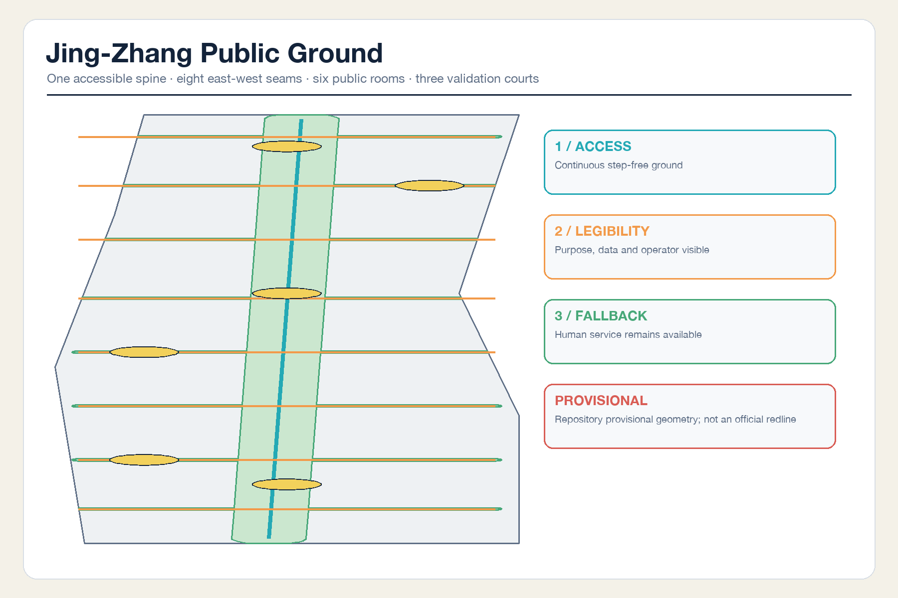
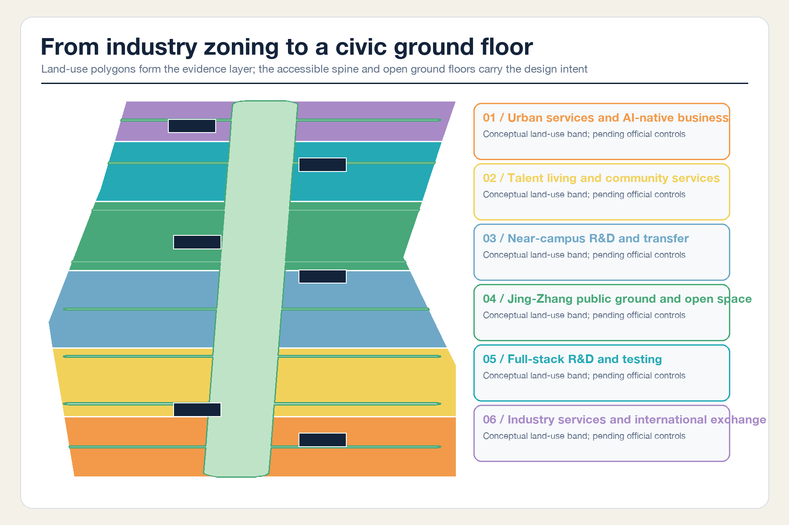
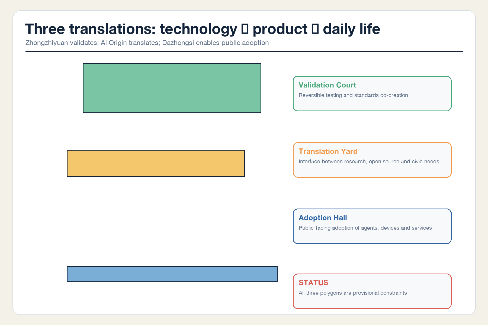
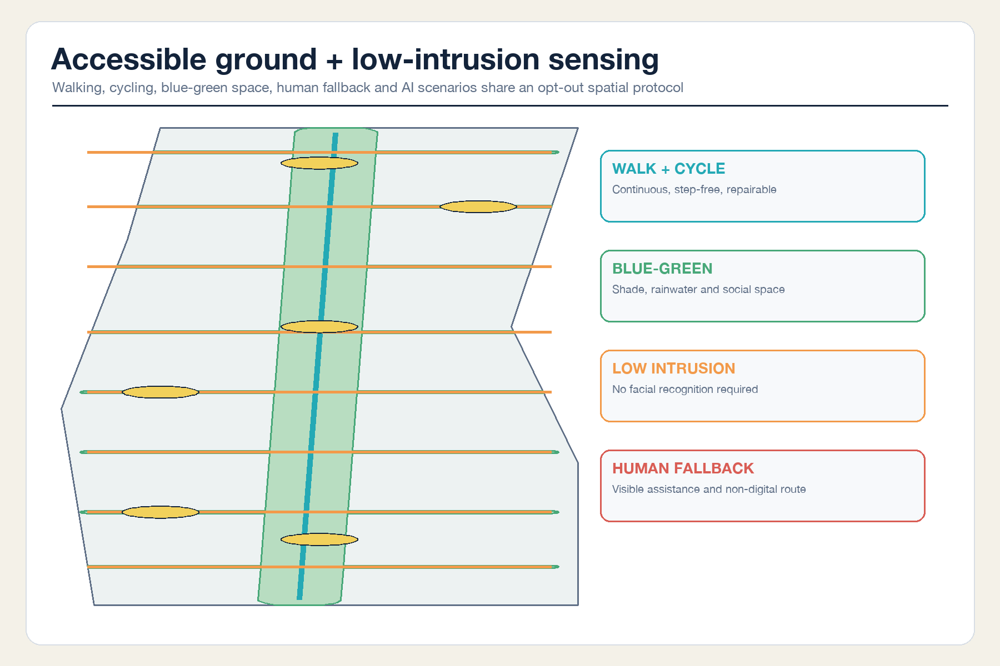
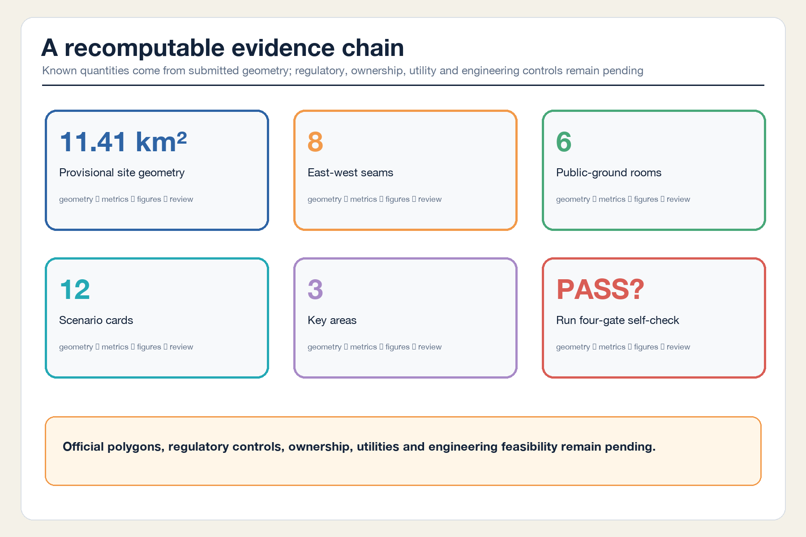

# JING-ZHANG PUBLIC GROUND

> Bring AI innovation to an accessible civic ground floor. This is an open co-creation and conceptual recommendation. It does not replace formal planning or constitute an approved government decision or implementation commitment.

## Design Basis and Source List

The proposal treats a world-class AI innovation belt as a city system that ordinary people can use and examine. Research may happen upstairs, but the ground floor must tell developers, entrepreneurs, residents, children, older people, persons with disabilities, and visitors what a service does, who is responsible, how to opt out, and where human assistance remains available. This judgment responds to the official objectives for integrated development of people, city, and industry [source:OFFICIAL-ANNOUNCEMENT] [standard:PROJECT-OFFICIAL-ANNOUNCEMENT].

Every source is screened against the repository source registry [source:SOURCE-REGISTRY]. The official announcement, the cleared Agent taskbook, and mandatory standards support tasks, terminology, and professional boundaries. International cases support typological learning only, never Haidian statutory controls. The processed fact pack is a navigation layer rather than a new authority [source:PROCESSED-FACT-PACK]. Complete provenance, dates, use, and limitations remain in `sources.json`.

No trusted official overall boundary or three key-area polygons are available. This package inherits the repository's explicitly rough provisional geometry [source:BOUNDARY-SOURCE] [source:KEY-AREA-SOURCE] and retains `official_boundary=false`. It supports concept generation, visualization, and intake checks only; it is neither an official planning boundary nor a precise area basis [data:geometry/site_boundary.geojson#SITE-001].

## Three-Level Scope Framework

The 43.6 km² Coordinated Research Area organizes the innovation loop from technical validation to translation, public adoption, and feedback. The roughly 11.4 km² provisional Overall Design Area tests land use, accessible ground floors, mobility, and blue-green continuity. The three provisional Key-Area Detailed Design Areas test whether the system can become dependable everyday space [depth:three_level_scope_framework] [metric:site_area_sqm].

These are three decision gates rather than three drawing scales: strategy answers why the system belongs in Haidian; overall design answers how it connects at ground level; key-area design answers who operates it, how it is tested, and when it stops. Once official polygons arrive, land use, buildings, green and public space, roads, phasing, metrics, and figures must be regenerated as one package [depth:metrics_recalculation].

## Coordinated Research Area: Industry and Future City Research

### Name, identity, and the Three Zones and Two Wings loop

`JING-ZHANG PUBLIC GROUND` refers both to the physical ground and to shared grounds for public verification. The identity direction uses one vertical heritage line and eight horizontal civic seams, with an open centre that preserves human judgment and future revision. It uses original geometry and typography, not third-party marks [source:AGENT-TASKBOOK] [standard:PROJECT-AGENT-OPEN-CALL-TASKBOOK].

The Three Zones and Two Wings form a feedback loop. Zhongzhiyuan validates full-stack technology and governance. The AI Origin Community translates university research into products, services, and legible rules. Dazhongsi tests market and everyday adoption. The Zhongguancun Technology Services Wing supplies legal, intellectual-property, capital, and international networks; the Xiaoyue River Scenario Enablement Wing supplies real-life feedback. Adoption outcomes return to validation [depth:overall_spatial_structure].

### Six precedents and transferable mechanisms

| Case | Verifiable characteristic | Transfer to Jing-Zhang | What is not copied |
| --- | --- | --- | --- |
| MIT Kendall Square | Research, housing, retail, innovation, and open space are mixed | Connect campus and community through accessible ground floors | Development intensity [source:CASE-KENDALL-SQUARE] |
| Barcelona 22@ | Productive-city renewal works with an innovation platform | Retain productive interfaces rather than build an office-only park | Barcelona statutory tools [source:CASE-BARCELONA-22AT] |
| Toronto MaRS | A not-for-profit platform connects science, ventures, and social value | Define demand translators and human reviewers | A predetermined operator [source:CASE-MARS-TORONTO] |
| London Knowledge Quarter | A station-centred network links diverse knowledge institutions | Organize distributed members through stations and walking | A single-property development model [source:CASE-KNOWLEDGE-QUARTER] |
| Singapore one-north / Kampong AI | Work, living, collaboration, and testbeds are coordinated | Give scenarios test gates and community management | Singapore commitments [source:CASE-ONE-NORTH] |
| Seoul Digital Media City | Digital industry, culture, public realm, and delivery governance converge | Make technology and public culture jointly accessible | Unverified present-day performance [source:CASE-SEOUL-DMC] |

## Overall Design Area: Urban Renewal and Regulatory-Plan-Level Urban Design

The overall structure is one accessible public-ground spine, eight east-west seams, six public rooms, and three validation courts. The spine follows the Jingzhang Railway Heritage Park as continuous step-free ground. The seams connect communities, campuses, industry parks, and stations. Public rooms are staffed, accessible ground-floor service interfaces with declared opening hours. The three courts test validation, translation, and adoption. The eight seams are recorded in the mobility layer [data:geometry/roads.geojson#ROAD-002] [metric:east_west_seam_count].

The topology-safe land-use layer fully partitions the provisional boundary into six conceptual bands: urban service and AI-native business; talent living and community service; near-campus R&D and transfer; public ground and open space; full-stack R&D and testing; and industry service and international exchange [data:geometry/land_use.geojson#LU-001] [standard:MNR-LAND-USE-CLASSIFICATION-GUIDE]. It is a recomputable concept, not an approved regulatory plan.

Renewal follows the sequence “open the ground floor, add reversible carriers, then review intensity.” Without parcel, ownership, or existing-building surveys, the six footprints are reversible prototypes [data:geometry/buildings.geojson#BLDG-001], not parcel-level demolition decisions. FAR, height, coverage, statutory green ratio, setbacks, road redlines, utilities, and capacity remain pending official data [standard:MOHURD-CONTROL-DETAILED-PLANNING] [depth:development_intensity_controls].

## Detailed Design of Key Areas

### Zhongzhiyuan: Reversible Validation Court

The ground-floor anchor is not a monumental exhibition hall but a reversible validation court. Bookable test rooms, standards workshops, and a visible failure log address models, chips, toolchains, edge devices, and safety governance. The court opens toward a green interface in the Qinghe direction, combining rain, shade, cycling, low-noise testing, and informal exchange. Its location remains constrained by a rough provisional polygon [data:geometry/key_areas.geojson#PROV-KEY-001].

### Beijing AI Origin Community: Research Translation Yard

The Translation Yard converts papers, open-source projects, and prototypes into civic needs, product-risk registers, and operable services. Its ground floor combines an open-source release hall, IP and legal porch, talent and family service hall, accessibility lab, and human review desk. Campus, park, and neighbourhood links use at-grade seams; no bridge or tunnel is promised without engineering evidence [data:geometry/key_areas.geojson#PROV-KEY-002].

### Dazhongsi: Public Adoption Hall

The Public Adoption Hall connects rail, commerce, agents, smart terminals, and content services. The four-quadrant walking strategy begins with at-grade wayfinding, crossing waiting space, bicycle parking, and human assistance. Underground, bridge, and rail changes remain professional options. Every displayed service declares users, data, responsible operator, and exit route [data:geometry/key_areas.geojson#PROV-KEY-003] [depth:three_key_area_detailed_design].

## AI Innovation Ecosystem, Personas, and AI+ Scenarios

Five base personas guide service design: open-source developers needing equipment and collaboration; startups needing low-cost translation, testing, and first users; growth companies needing international, talent, and supply-chain services; residents needing commuting, care, leisure, and freedom from excessive sensing; and children, older people, persons with disabilities, and low-digital-literacy users needing step-free movement, non-digital routes, and human assistance. These are service personas, not commercial behavioural profiles.

| # | Scenario card | Space / users | Data and human review | Operator role / stop condition |
| --- | --- | --- | --- | --- |
| 01★ | Open-model compatibility validation | Zhongzhiyuan / developers | Voluntary test sets; red-team and human sign-off | Independent test team / stop beyond consent |
| 02★ | Accessible edge-device testing | Zhongzhiyuan / disabled users and firms | Device logs and voluntary feedback; assistive-technology review | Scenario operator / stop on safety risk |
| 03★ | Public-service urban-agent sandbox | AI Origin / startups and residents | Synthetic or de-identified data; human review of public outputs | Public-service and technical co-owners / stop if unauditable |
| 04★ | Smart-terminal indoor/outdoor navigation integration | Dazhongsi / visitors and commuters | Device counts and error reports; on-site safety review | Property and transport team / degrade on crowding risk |
| 05 | Accessible walking navigation | Public spine / all | Conditions and device counts without facial recognition; patrol review | Park service / close on unsafe routing |
| 06 | Human-fallback visitor service | Six public rooms / low-digital-literacy users | Issue type and handling time only | Staffed service / unavailable when unstaffed |
| 07 | Research translation clinic | AI Origin / university teams | Voluntary project disclosure; legal and industry review | Translation team / pause on unclear IP |
| 08 | Community legal and privacy porch | Community ground floor / residents and startups | No case-content retention; qualified human decision | Authorized provider / no advice without human review |
| 09 | Park care and shade response | Blue-green ground / residents and maintainers | Equipment state and patrols, no personal tracking | Green-space maintenance / rollback on repeated false alarms |
| 10 | Public-health navigation and human handoff | Public rooms / all | User-initiated input; no diagnosis; human referral | Qualified provider / offline without referral channel |
| 11 | Multilingual visitor and event assistance | Dazhongsi / international visitors | Authorized event material; human proofreading | Event organizer / pause when translation risk is undisclosed |
| 12 | Public-ground deliberation and post-occupancy review | Spine / all stakeholders | Public agenda, anonymous feedback, and human minutes | Neutral facilitator / pause if dissent cannot be protected |

The four starred cards are industrial testing and validation scenarios. Every card has data minimization, human review, a responsible role, and a stop condition. The count matches the structured metric [metric:scenario_card_count].

## Land Use, Building Scale, and Retain-Renovate-Demolish Strategy

Land use follows the official classification subset without claiming a statutory amendment. Only design quantities derived from package geometry are known. Building footprint area is the combined footprint of six reversible ground-floor prototypes [metric:building_footprint_area_sqm], not existing demolition, total floor area, or development entitlement.

The retain-renovate-demolish method first surveys structural safety, ownership, heritage value, and occupancy; then retains usable buildings; then opens ground floors and adds accessible, reversible components; and only after professional review compares demolition or new build. Those surveys are absent, so no real building is classified [depth:retain_renovate_demolish] [depth:height_massing_character]. The architectural design-depth reference lacks a cleared official file and remains pending [standard:MOHURD-ARCH-DESIGN-DEPTH-2016].

## Transport, Rail, Municipal Infrastructure, and Public Services

Transport begins with continuity rather than novelty. The spine requires continuous gradients, surfaces, rest points, non-visual guidance, and basic night lighting. Each seam integrates walking, cycling, crossings, and bicycle parking. Routes from station exits to public rooms cannot require a smartphone. All lines are conceptual centrelines; redlines and traffic operations remain pending professional review [depth:traffic_rail_slow_parking].

New infrastructure does not presume ubiquitous sensing. Route evaluation prioritizes equipment counts, patrols, and voluntary feedback, with no facial-recognition requirement. Edge computing, distributed energy, drainage, utilities, fire safety, and service loads require official evidence and professional calculation before siting [depth:municipal_new_infrastructure].

## Blue-Green Network, Public Space, and Urban Character

The green network combines the north-south heritage-park band with eight transverse seams. Its area is a conceptual design quantity, not a statutory green ratio [data:geometry/green_space.geojson#GREEN-001] [metric:green_ratio]. Six public rooms add toilets, drinking water, charging, first aid, staffed guidance, legal and privacy advice, and small release events [data:geometry/public_space.geojson#PG-001] [metric:public_ground_room_count].

Urban character does not cover railway heritage with technological decoration. Railway mileage, timetables, switches, and maintenance logs become a public narrative showing where technology came from, where it was tested, and when it should be repaired. Zhongguancun culture is represented through licensed open-source contributions, failure records, and voluntary attribution rather than unauthorized portraits or marks [standard:MOHURD-URBAN-DESIGN-MEASURES] [depth:blue_green_public_space].

Three pilgrimage and honour nodes make innovation accountable: the Zhongzhiyuan Validation Court records discovered and repaired failures; the AI Origin Open-Source Contribution Steps credit code, data, standards, community organization, and solved public problems; the Dazhongsi Public Adoption Board declares services under test, responsible operators, and review dates. All remain conceptual components for professional development.

## Renewal Projects, Implementation Policy, and Phasing

| Starter package | Content | Conceptual responsible role | Prerequisites | Stop / evaluation |
| --- | --- | --- | --- | --- |
| PG-01 | Reversible displays and staffed service at three courts | Professional body + public-service team | Ownership, building safety, authorization | Quarterly review; stop on safety or rights failure |
| PG-02 | Accessible walking/cycling kits at eight seams | Transport, landscape, and community teams | Redlines, traffic, utilities, and green-space review | Temporary test before permanence |
| PG-03 | Six ground-floor public rooms | Community, industry service, and property operations | Fire safety, opening hours, and staffing budget | Publish availability and fallback records monthly |
| PG-04 | “Public Ground Pass” for scenarios | Data, legal, industry, and public representatives | Public purpose, data, responsibility, review, and exit | Automatic expiry unless renewed after review |
| PG-05 | Jing-Zhang Open Source Week and Public Ground Assembly | Developer community + cultural bodies | Event safety, site, copyright, and host authorization | Evaluate solved problems, retained contributions, and public benefit |

The three geometry phases are decision sequences rather than committed construction dates: begin with three reversible demonstrations and staffed service; extend seams and public rooms after transport, ownership, and utility review; then establish long-term operations, review, and international exchange [data:geometry/phasing.geojson#PHASE-001] [depth:phasing_implementation].

The annual rhythm includes quarterly Public Ground Open Days, a spring Open-Source Translation Camp, a summer Urban Test Week limited to authorized and interruptible tests, and an autumn Public Ground Assembly publishing successes, failures, exits, and contributions. Bilingual, reproducible material supports international communication. Participation, investment, policy support, and recruitment are never presented as confirmed [depth:renewal_project_list].

## Metrics, Area Recalculation, and Compliance Matrix

Known metrics are limited to values recomputable from the package: provisional site area; conceptual footprint, green, and public-space quantities; key-area count; public-room count; seam count; and scenario-card count. `metrics.json` records formulas, files, confidence, and assumptions; figures and offline HTML derive from the same source [depth:metrics_recalculation].

Pending metrics include statutory FAR, height, coverage, green ratio, setbacks, road redlines, rail and bridge engineering, utilities, energy, and fire capacity. Operational measures begin only after use: accessible-route availability, human-fallback availability, exit handling time, open-source reuse, and public-problem resolution. No unsupported target is invented.

`compliance_matrix.json` covers announcement sections 1.3, 1.4, and 1.5 plus agent.1–agent.6. `standard_matrix.json` distinguishes mandatory standards, usable snapshots, and missing files. `design_depth_matrix.json` links depth items to prose, geometry, metrics, drawings, and checks. Complete matrices provide traceability, not approval.

## Risk, Copyright, and Compliance

The main risk is mistaking provisional geometry for an official boundary. Every figure and offline page labels or visually subdues this status. Once official boundaries arrive, the workflow reparations all land use and clips every design layer, recalculates in EPSG:4548, and regenerates figures [depth:risk_missing_data].

Scenario risks include excessive sensing, wrong routing, bias, absent human fallback, vendor lock-in, unauthorized data, and presenting a test as a formal service. Shared safeguards are minimum data, disclosed purpose, human review, non-digital access, a responsible operator, and expiry. Any generative-AI public service receives case-specific legal review only where applicable; no general urban scenario is treated as a legal conclusion.

The Agent generated all proposal text, design geometry, figures, PDFs, and offline HTML for this submission. No third-party photos, maps, marks, portraits, font files, paper figures, or web copy are redistributed. The six international cases are attributed factual summaries. See `report/copyright_statement.md`.

## References

1. Haidian Branch of the Beijing Municipal Commission of Planning and Natural Resources, official open-call prequalification announcement, 2026-05-09.
2. Cleared repository extract of the Agent-facing Centennial Jing-Zhang AI Innovation Belt open-call taskbook.
3. Ministry of Housing and Urban-Rural Development, Measures for the Administration of Urban Design.
4. Ministry of Housing and Urban-Rural Development, Measures for Regulatory Detailed Planning.
5. Ministry of Natural Resources, Land and Sea Use Classification Guide, 2023.
6. MIT Kendall Square Initiative; Barcelona City Council 22@ materials; MaRS Discovery District; Knowledge Quarter London; JTC one-north / Kampong AI; Seoul Digital Media City policy archive.

Complete machine-readable provenance, limitations, and retrieval dates are in `sources.json` [source:SITE-PACKAGE].
