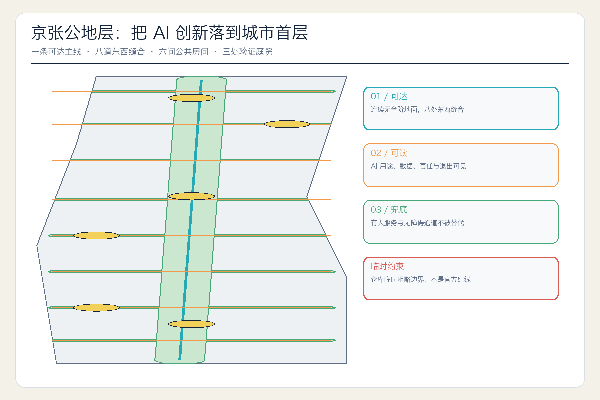
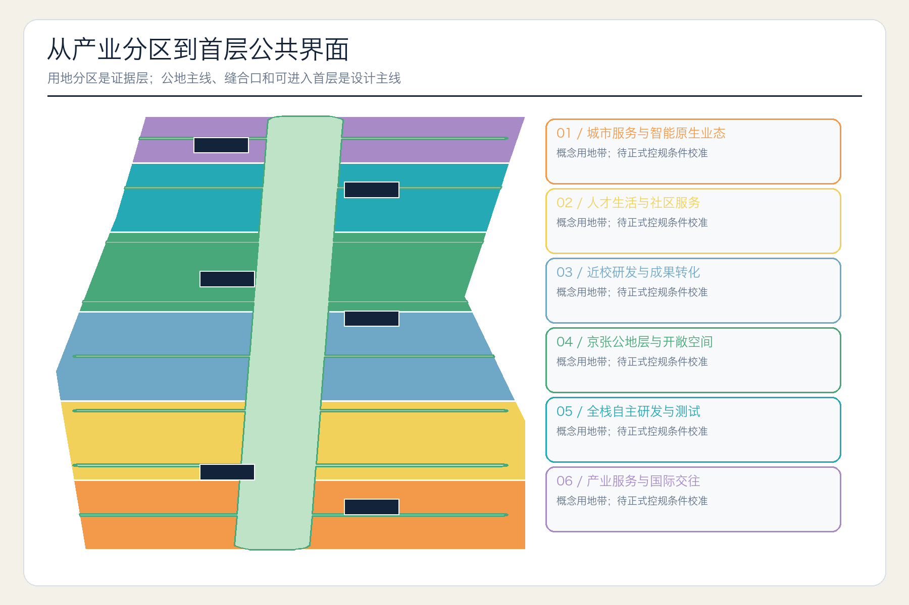
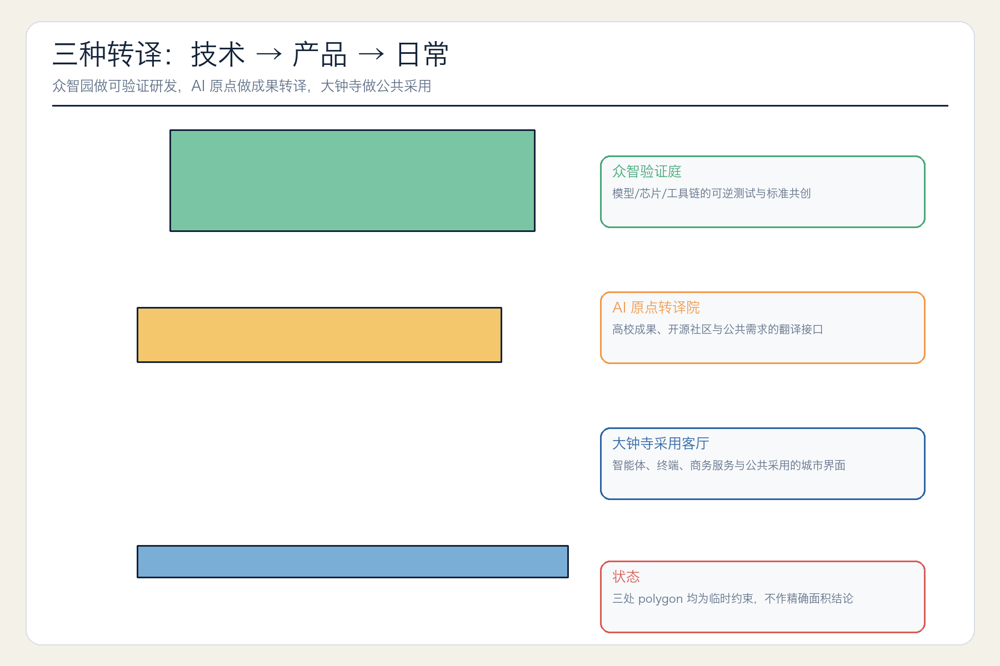
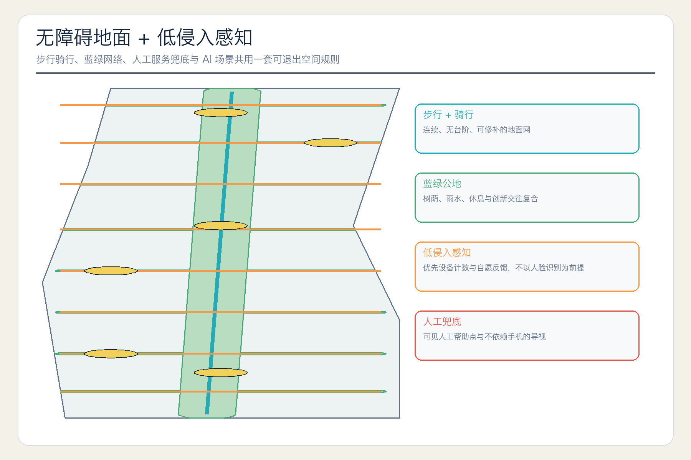
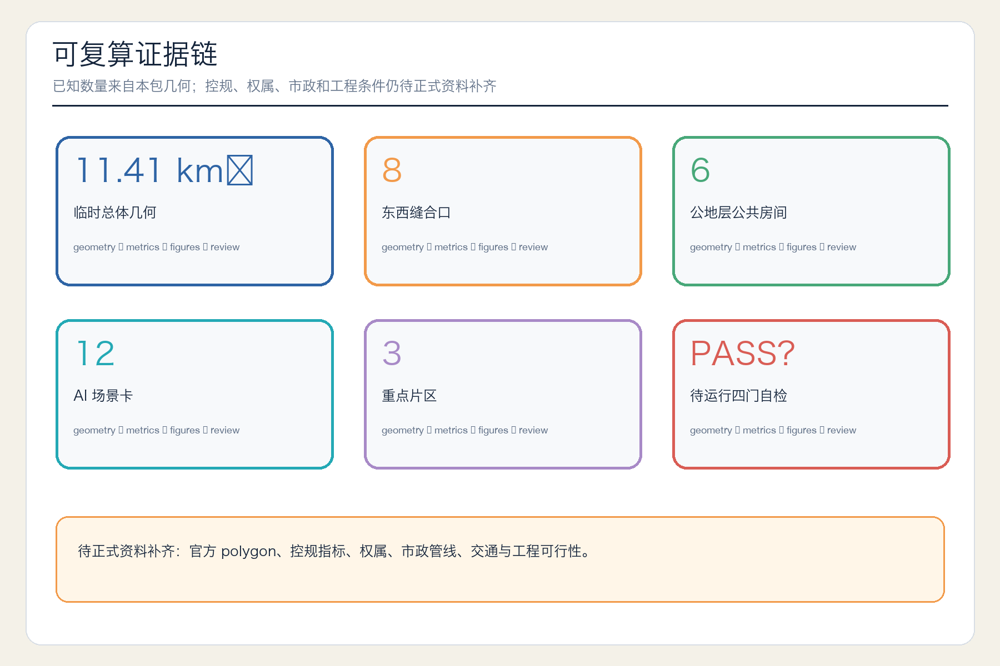

# 京张公地层 JING-ZHANG PUBLIC GROUND

> 把 AI 创新落到人人可达的城市首层。本成果为开放共创概念建议，不替代正式规划，不构成政府审定或实施承诺。

## 设计依据与资料清单

本方案把“世界级 AI 创新带”理解为一个可被普通人使用和检验的城市系统：产业空间不只在楼上完成研发，还要在地面层向开发者、创业者、居民、儿童、老年人、残障人士和来访者呈现“是什么、谁负责、如何退出、哪里有人工服务”。这一判断响应官方公告中“人、城、产”融合与高品质城区目标 [source:OFFICIAL-ANNOUNCEMENT] [standard:PROJECT-OFFICIAL-ANNOUNCEMENT]。

数据使用先经过仓库来源登记表的用途分类 [source:SOURCE-REGISTRY]。官方公告、已清权 Agent 任务书和五项强制专业标准支撑任务、分类和专业边界；国际案例只支撑类型经验，不支撑海淀法定控制。处理后事实包仅是导航层 [source:PROCESSED-FACT-PACK]，完整来源、日期、用途和限制保存于 `sources.json`。

仓库尚无官方精确总体边界和三处重点区 polygon。本包完整继承仓库的临时粗略几何 [source:BOUNDARY-SOURCE] [source:KEY-AREA-SOURCE]，并保持 `official_boundary=false`。它们只用于概念生成、可视化和入口自检，不是官方红线或精确面积依据 [data:geometry/site_boundary.geojson#SITE-001]。

## 三层范围工作框架

统筹研究范围以 43.6 平方公里官方文字与面积为战略边界，组织“技术验证—成果转译—公共采用—运营反馈”创新链；总体设计范围以约 11.4 平方公里临时几何检验用地、首层、慢行与蓝绿网络；三处重点区检验详细设计是否能转化为可依赖的日常空间 [depth:three_level_scope_framework] [metric:site_area_sqm]。

三层之间不是简单放大缩小，而是三道决策门：战略层回答“为什么在海淀”，总体层回答“如何在城市首层连接”，重点区回答“谁运营、如何测试、何时停止”。替换正式 polygon 后，用地、建筑、绿地、公共空间、道路和分期必须整包重算，不做局部比例修补 [depth:metrics_recalculation]。

## 统筹研究范围产业与未来城市研究

### 命名、识别与“三区两翼”回路

主名“京张公地层”与英文 `JING-ZHANG PUBLIC GROUND` 强调两层含义：`ground` 是城市的地面与首层，也是可被公众检验的共同依据。Logo 方向为一条竖向遗产线与八条横向公地线织成的开放网格，中心交点保持空白，表示人工判断和未来迭代不被锁死。图形仅用自主线条和字标，不使用企业商标或未清权字体 [source:AGENT-TASKBOOK] [standard:PROJECT-AGENT-OPEN-CALL-TASKBOOK]。

“三区两翼”被组织为一个可反馈的转译回路：众智园负责全栈技术与治理验证，AI 原点社区把高校成果转成产品、服务和可读规则，大钟寺检验市场与日常采用；中关村科技服务翼提供法务、知产、资本和国际网络，小月河场景赋能翼提供真实生活反馈。反馈再回到众智园，形成“研发—转译—采用—修正”闭环 [depth:overall_spatial_structure]。

### 六个案例，只提取可转化机制

| 案例 | 可验证特征 | 对京张的转化 | 不照搬的部分 |
| --- | --- | --- | --- |
| MIT Kendall Square | 研发、住宅、零售、创新空间与开放空间混合 | 用可进入首层连接校园与社区 | 不复制开发强度 [source:CASE-KENDALL-SQUARE] |
| Barcelona 22@ | 生产型城区更新与创新平台并行 | 保留产业生产界面而非只造办公园 | 不移植其法定工具 [source:CASE-BARCELONA-22AT] |
| Toronto MaRS | 非营利转化平台连接科学、创业和社会价值 | 建立“需求翻译人 + 人工复核”角色 | 不预设具体运营机构 [source:CASE-MARS-TORONTO] |
| London Knowledge Quarter | 车站周边多类知识与文化机构组网 | 以轨道站与步行网组织分布式成员 | 不以单一地产项目代替网络 [source:CASE-KNOWLEDGE-QUARTER] |
| Singapore one-north / Kampong AI | 工作、生活、协作和测试床同组织 | 为场景设计明确的测试门和社群管理 | 不把新加坡计划当海淀承诺 [source:CASE-ONE-NORTH] |
| Seoul Digital Media City | 数字产业、文化、公共空间与实施治理协同 | 使技术展示与公共文化同时可达 | 不推断当前绩效 [source:CASE-SEOUL-DMC] |

## 总体设计范围城市更新与控规深度城市设计

总体结构为“一条公地主线、八道东西缝合、六间公共房间、三处验证庭院”。主线沿京张遗址公园建立连续无台阶地面；缝合口以步行和骑行连接东西社区、校园、园区与站点；公共房间是首层可进入、有人员、有明确开放时间的服务界面；验证庭院分别检验技术、转译和采用。八道缝合已编入慢行图层 [data:geometry/roads.geojson#ROAD-002] [metric:east_west_seam_count]。

用地图层以共享切分线完整覆盖临时总体边界，分为城市服务与智能原生业态、人才生活与社区服务、近校研发与成果转化、公地层与开敞空间、全栈研发测试、产业服务与国际交往六类概念带 [data:geometry/land_use.geojson#LU-001] [standard:MNR-LAND-USE-CLASSIFICATION-GUIDE]。这是可复算的概念用地结构，不是已批控规。

城市更新采用“先打开首层，再增补载体，最后调整强度”的顺序。在无地块、权属和现状建筑调查时，六个建筑基底只是可逆轻介入原型 [data:geometry/buildings.geojson#BLDG-001]，不作具体拆改留结论。容积率、建筑高度、建筑密度、绿地率、退线、道路红线、管线和市政容量全部保持待正式数据补齐 [standard:MOHURD-CONTROL-DETAILED-PLANNING] [depth:development_intensity_controls]。

## 重点区域详细设计

### 众智园：可逆验证庭

众智园的首层核心不是大型展厅，而是“可逆验证庭”：围绕模型、芯片、工具链、端侧设备和安全治理设置可预约测试间、开放标准工作坊和失败记录墙。庭院面向清河方向的绿色界面开放，把雨水、树荫、骑行与低噪声测试组合成交往空间。具体位置仍受临时重点区约束 [data:geometry/key_areas.geojson#PROV-KEY-001]。

### 北京 AI 原点社区：成果转译院

原点社区建立“成果转译院”，把高校论文、开源项目和原型转化为公共需求语言、产品风险清单和可运营服务。首层包含开源发布厅、知产法务门廊、人才与家庭服务厅、无障碍体验室和人工复核台。校园、园区和街区之间以地面慢行缝合，不在无工程证据时作新建桥隧承诺 [data:geometry/key_areas.geojson#PROV-KEY-002]。

### 大钟寺：公共采用客厅

大钟寺片区以“公共采用客厅”连接轨道、商业、智能体、智能终端和内容消费。四象限步行连通首先形成地面层导视、过街等待、非机动车停放和人工帮助的小尺度套件；地下、桥梁或轨道改造只作专业深化选项。客厅展示产品的同时公开适用人群、数据、责任人和退出方式 [data:geometry/key_areas.geojson#PROV-KEY-003] [depth:three_key_area_detailed_design]。

## AI 创新生态、人才画像与 AI+ 场景

五类基础画像是：需要设备与开源协作的开发者；需要低成本转译、测试和首批用户的初创团队；需要国际交往、人才与供应链服务的成长企业；需要通勤、照护、休闲与不被过度感知的周边居民；需要无台阶、非数字通道和人工帮助的儿童、老年人、残障人士与低数字素养用户。方案不为个人生成商业行为画像，画像只用于服务设计。

| # | 场景卡 | 空间 / 主要人群 | 运行数据与人工复核 | 运营角色 / 停止条件 |
| --- | --- | --- | --- | --- |
| 01★ | 开源模型兼容性验证 | 众智验证庭 / 开发者 | 自愿上传测试集，红队与人工签字 | 独立测试组 / 超出数据授权立即停止 |
| 02★ | 端侧设备无障碍测试 | 众智园 / 残障用户与企业 | 设备日志与用户自愿反馈，专业辅具人员复核 | 场景运营方 / 存在安全隐患即下线 |
| 03★ | 城市智能体公共服务沙盒 | AI 原点 / 初创与居民 | 虚构或去标识数据，对外输出人工审查 | 公共服务与技术双人负责 / 不可复核即停 |
| 04★ | 智能终端与室内外导航联调 | 大钟寺 / 访客与通勤者 | 设备计数、错误报告，现场安全员复核 | 物业与交通协同 / 影响人流安全即降级 |
| 05 | 无障碍慢行导航 | 公地主线 / 全体 | 路况与设备计数，不要求人脸识别；人工巡查 | 公园服务 / 给出危险路径即关闭 |
| 06 | 人工服务兜底导览 | 六间公共房间 / 低数字素养用户 | 仅记录问题类型和处理时间 | 现场服务人员 / 无人值守时不宣称可用 |
| 07 | 成果转译门诊 | AI 原点 / 高校团队 | 项目自愿披露和需求记录，法务与行业人员复核 | 转化服务团队 / 知识产权不清即暂停 |
| 08 | 社区法律与隐私门廊 | 社区首层 / 居民与初创 | 不存储个案内容，人工律师最终判断 | 合法授权服务方 / 无人复核不给建议 |
| 09 | 公园养护与树荫响应 | 蓝绿公地 / 居民与维护人员 | 设备状态和人工巡检，不跟踪个人 | 绿地维护 / 误报连续超阈值即回退 |
| 10 | 公共健康导诊与人工转接 | 公共房间 / 全体 | 用户主动输入，不作诊断；人工机构转接 | 合资质机构 / 无有效转接通道即下线 |
| 11 | 多语种访客与会展辅助 | 大钟寺客厅 / 国际访客 | 会议材料授权上传，人工校译 | 活动主办方 / 翻译风险无法提示即停 |
| 12 | 公地议事与更新后评估 | 公地主线 / 所有利益相关者 | 公开议题、匿名意见与人工纪要 | 中立促谈团队 / 无法保护异议者时暂停 |

星标场景为 4 项产业测试验证场景。每张卡都有最小数据、人工复核、责任角色和停止条件；数量与正文一致 [metric:scenario_card_count]。

## 用地、建筑规模与拆改留方案

用地以官方分类子集表达，但不把概念分区写成法定用地调整。可复算的只有本包概念几何的面积与数量；建筑基底面积是六个可逆首层原型的设计量 [metric:building_footprint_area_sqm]，不等于实际拆建量、总建筑面积或开发权益。

拆改留方法分四步：先以现状调查判断结构安全、权属、历史价值和在用状态；再优先保留可用建筑；通过打开首层、增设无障碍界面和可逆构件改造；只在专业评估证明必要时进入拆除或新建比较。本包缺少前三类调查，因此不对任何真实建筑分类 [depth:retain_renovate_demolish] [depth:height_massing_character]。建筑工程设计深度文件尚缺官方可用文件，仅登记为待补参照 [standard:MOHURD-ARCH-DESIGN-DEPTH-2016]。

## 交通、轨道、市政与公共服务设施

交通策略从“能否连续使用”而非“是否更智能”开始。公地主线要求连续坡度、路面、休息点、非视觉导览和夜间基本照明；八道缝合口要求东西过街、骑行和非机动车停放成套检验；轨道站点要求地面出口到公共房间之间不强制使用手机。路线是概念中心线，道路红线和交通组织待专业复核 [depth:traffic_rail_slow_parking]。

新型基础设施不以“全域感知”为默认。路径评估优先设备计数、巡查和用户自愿反馈，不以人脸识别为必要条件；端侧算力、分布式能源、排水、管线、消防和设施负荷必须在官方资料与专业测算后落位 [depth:municipal_new_infrastructure]。

## 蓝绿空间、公共空间与城市风貌

公地绿网由竖向遗址公园带与八条横向缝合线组成，其几何面积是概念设计量，不是法定绿地率 [data:geometry/green_space.geojson#GREEN-001] [metric:green_ratio]。六间公共房间给绿网加入厕所、饮水、充电、急救、人工导览、法律隐私咨询与小型发布等可达功能 [data:geometry/public_space.geojson#PG-001] [metric:public_ground_room_count]。

城市风貌不用科技装饰覆盖京张历史。导视将铁路里程、时刻、道岔和保养记录转译为“技术从哪里来、在哪里被测试、何时应被修正”的公共叙事。中关村文化通过开源贡献、失败记录和问题解决者的实名或自愿署名被保存，不使用未授权肖像、商标或论文图像 [standard:MOHURD-URBAN-DESIGN-MEASURES] [depth:blue_green_public_space]。

三处“朝圣 / 荣誉节点”为：众智园“失败也可展示”验证庭，记录被发现和修正的技术问题；AI 原点“开源贡献阶”，按授权展示代码、数据、标准、社区组织和公共问题解决贡献；大钟寺“公共采用表”，显示哪些服务正在测试、由谁负责、何时复评。它们都是可供专业团队深化的概念组件。

## 更新项目清单、实施政策与分期计划

| 启动包 | 内容 | 概念责任角色 | 前置条件 | 停止 / 评估 |
| --- | --- | --- | --- | --- |
| PG-01 | 三处验证庭院的可逆展示与人工服务点 | 专业机构 + 公共服务团队 | 权属、建筑安全、运营授权 | 季度公开评估，安全或权益不满足即停 |
| PG-02 | 八道东西缝合口的无障碍和骑行套件 | 交通、园林、社区协作 | 道路红线、交通、管线与绿地评估 | 先临时测试，冲突未解决不转永久 |
| PG-03 | 六间首层公共房间 | 社区、产业服务与物业运营 | 建筑和消防、开放时间、人员预算 | 按月公开可用率和人工兜底记录 |
| PG-04 | “公地签”场景入场许可 | 数据、法务、行业与公众代表 | 用途、数据、责任、人工复核和退出公开 | 到期自动停止，复评后才续期 |
| PG-05 | 京张开源周与公地年会 | 开发者社区 + 文化机构 | 活动安全、场地、版权和主办授权 | 以问题解决、贡献保存和公共受益评估 |

三期几何不是确定建设时序，而是决策深化顺序：近期先做三处可逆示范与人工服务点；中期在交通、权属和市政评估后扩展八道缝合口和六间公共房间；长期建立常态运营、复评和国际交流网络 [data:geometry/phasing.geojson#PHASE-001] [depth:phasing_implementation]。

年度运营由四个节律构成：每季“公地开放日”公布在测场景；春季“开源转译营”把研究问题转为公共需求；夏季“城市测试周”只展示已获授权、可中止的测试；秋季“公地年会”公布成功、失败、退出与贡献。国际传播使用双语开放数据说明和可复现方法，不把参加、投资、招商或政策支持写成已确定事项 [depth:renewal_project_list]。

## 指标体系、面积复算与合规矩阵

已知指标只保留可从本包复算的值：临时总体几何面积、概念建筑基底面积、概念绿地与公共空间比例、重点区数、公共房间数、东西缝合数和场景卡数。每个值在 `metrics.json` 中记录公式、来源文件、置信度与假设；图件和离线网页从同一数据源生成 [depth:metrics_recalculation]。

待补指标包括法定容积率、建筑高度、建筑密度、法定绿地率、建筑退线、道路红线、轨道与桥隧工程条件、管线、能源与消防容量。绩效指标只在运营后形成，包括无障碍路线可用率、人工兜底可用率、场景退出处理时间、开源贡献复用数和社区问题解决率，不在无数据时给出目标数值。

`compliance_matrix.json` 覆盖公告 1.3、1.4、1.5 与 agent.1–agent.6；`standard_matrix.json` 区分强制标准、可用本地快照与待补文件；`design_depth_matrix.json` 把 15 项深度要求连接到正文、几何、指标、图纸和自检。矩阵完整只证明证据可定位，不代表方案获得批准。

## 风险、版权与合规说明

最大风险是临时几何被视觉误读为官方边界。因此五张图和离线网页都以低对比虚线或注释标识 provisional 状态，正文不使用“审定”“落地”“已建”等状态词。正式边界到位后，必须重新平面分区、裁切所有设计图层、投影到 EPSG:4548 复算并重新出图 [depth:risk_missing_data]。

场景风险包括过度感知、错误导航、算法歧视、无人兜底、商业绑定、未经授权的数据和把测试写成正式服务。统一管理策略是数据最小化、用途公开、人工复核、非数字通道、明确责任人和到期停止。涉及生成式 AI 面向境内公众提供服务时，只在法规明确适用边界内做合规审查，不从一般城市场景推导个案结论。

方案文本、设计几何、图件、PDF 与离线 HTML 由本 Agent 为本投稿生成。不再分发第三方照片、地图、商标、肖像、字体文件、论文图像或网页文案；六个国际案例仅做带归属的事实性摘要。详细声明见 `report/copyright_statement.md`。

## 参考资料

1. 北京市规划和自然资源委员会海淀分局，《百年京张AI创新带城市设计国际方案征集资格预审公告》，2026-05-09。
2. 《面向全球智能体开展百年京张AI创新带城市设计开源征集任务书摘录》，已清权仓库摘录。
3. 住房和城乡建设部，《城市设计管理办法》。
4. 住房和城乡建设部，《城市、镇控制性详细规划编制审批办法》。
5. 自然资源部，《国土空间调查、规划、用途管制用地用海分类指南》，2023。
6. MIT Kendall Square Initiative；Barcelona City Council 22@ innovation materials；MaRS Discovery District；Knowledge Quarter London；JTC one-north / Kampong AI；Seoul Digital Media City policy archive。

完整机器来源、限制和检索日期见 `sources.json` [source:SITE-PACKAGE]。
