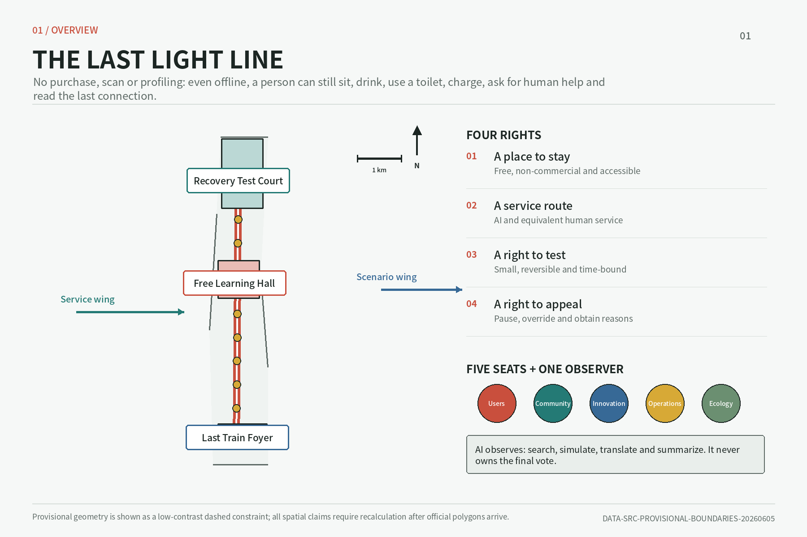
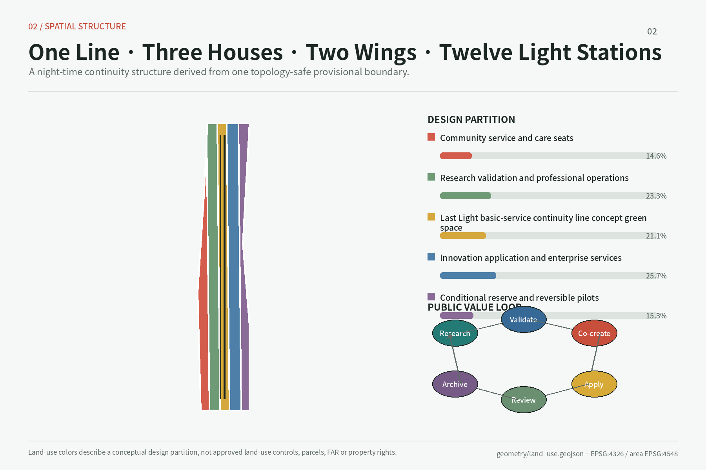
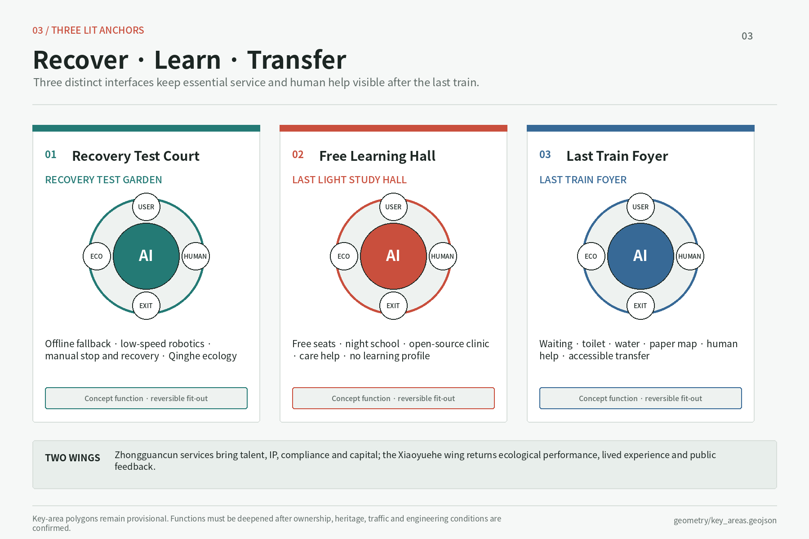
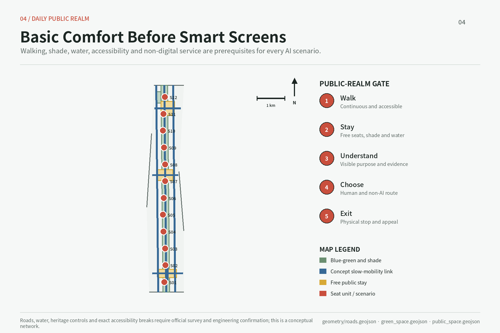
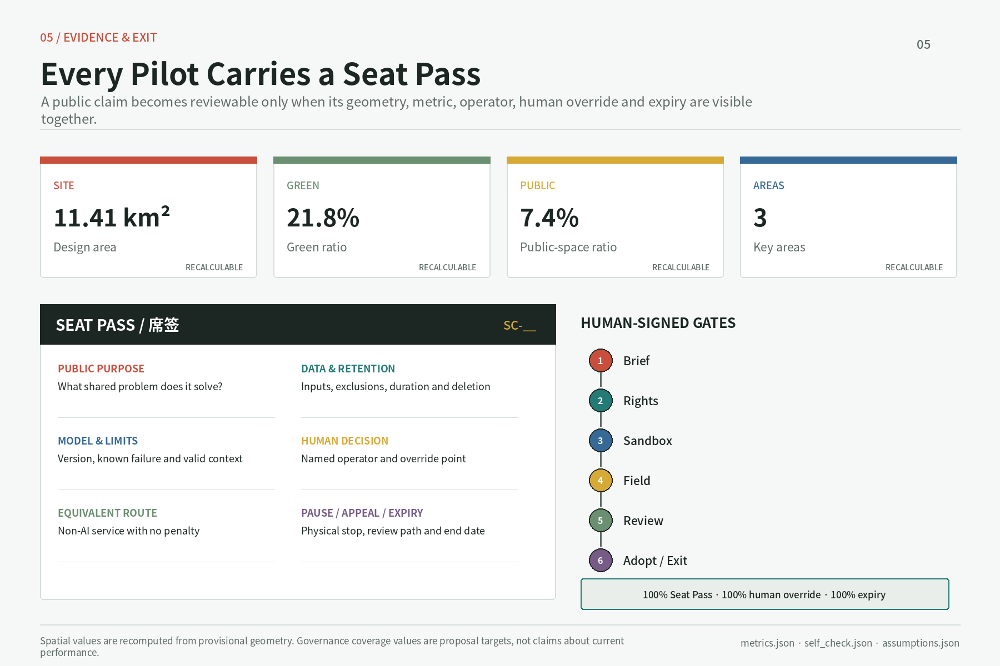

# 最后一盏灯 / THE LAST LIGHT LINE

**A Night-time Basic-Service and Human-Help Continuity Network**
*京张夜间基本服务与人工帮助连续网络*

The Last Light is neither a lamp that can never go dark nor a promise of absolute night-time safety. It is a legible public-service line that should still make sense after shops close, a phone dies, or a network fails. Its public covenant is: **without buying, scanning, or being profiled, and even when offline, a person can find a public node with a seat, water, toilet access, charging, human help, and interchange information.** The former “seat” remains as the governance foundation of spatial access, service access, permission to test, and the right to appeal. AI may observe, but it may not chair.

## Design Basis and Source Inventory

The proposal treats the official Prequalification Announcement for the Centennial Jing-Zhang AI Innovation Belt Open Call for Urban Design as the primary authority for project purpose, the three scope levels, and deliverable depth. The Agent Taskbook is the authority for the six open tasks covering identity, ecosystem, scenarios, landmarks, cultural narrative, and long-term operations. The site package, Source Registry, and processed fact pack serve as navigational and machine-audit layers; none is promoted into a new official determination [source:OFFICIAL-ANNOUNCEMENT] [source:AGENT-TASKBOOK] [source:SOURCE-REGISTRY]. Professional judgments are separately tied to urban design, Regulatory Detailed Planning, and land-use classification references. Complete source, metric, task, standard, and design-depth indexes remain in their structured files; the narrative retains only claim-adjacent evidence markers.

The most consequential factual limitation is that the polygons supplied for the Overall Design Area and all three key areas are provisional geometry. The official text states 43.6 square kilometres, 11.4 square kilometres, 368.4 hectares, and the component areas of the three key areas, but the submitted linework, intersections, and geometry-derived measurements are not Official Planning Boundaries. The package can support Content Review, spatial discussion, and provisional recomputation; it cannot support land acquisition, ownership, road-redline, FAR, height, or engineering-feasibility conclusions. Once official polygons arrive, all intersecting layers, metrics, and figures must be recomputed [source:BOUNDARY-SOURCE] [data:geometry/site_boundary.geojson#SITE-001] [depth:risk_missing_data].

The design is named “THE LAST LIGHT LINE / 最后一盏灯,” with the subtitle “A Night-time Basic-Service and Human-Help Continuity Network.” Its identity does not borrow a company mark or portrait. An open square seat, a low-luminance lamp mark, and two railway-parallel lines form the grammar: the opening means no purchase threshold; the continuous line means the next node remains findable offline; five solid edge marks stand for the human seats, and one hollow mark for the AI observer. A final logo, typeface, colour, night-glare specification, and accessibility contrast require rights clearance, trademark review, and field testing. This is an original direction, not an approved identity [standard:PROJECT-AGENT-OPEN-CALL-TASKBOOK].

## Three-Level Scope Framework

The three levels progress from strategic question to overall spatial system to focused implementation. The 43.6-square-kilometre Coordinated Research Area addresses innovation, youth night-time activity, basic service, and cross-area collaboration. The approximately 11.4-square-kilometre Overall Design Area organizes renewal, public space, transport, utilities, and industry services within roughly one to two kilometres of Jing-Zhang Railway Heritage Park. The 368.4-hectare Key-Area Detailed Design Area translates one night-time service covenant into reviewable proposals for Zhongzhiyuan, Beijing AI Origin Community, and Dazhongsi. All levels share scenario identifiers, Lamp-Station Seat Passes, offline fallback rules, and operational gates [standard:PROJECT-OFFICIAL-ANNOUNCEMENT] [depth:three_level_scope_framework].

The spatial structure is “One Line, Three Houses, Two Wings, and Twelve Lamp Stations.” The Last Light Line follows Jing-Zhang Railway Heritage Park and key east-west links to connect night walking, interchange, rest, basic supplies, and human help. “Three Houses” is a collective term for three distinct types: Zhongzhiyuan Recovery Test Court, AI Origin No-Purchase Study Hall, and Dazhongsi Last-Train Foyer. They are organizing concepts, not statutory land-use classes. The Zhongguancun Technology Services Wing supplies professional resources; the Xiaoyue River Scenario Enablement Wing returns night-time, public, and ecological feedback. The twelve Lamp-Station types are demountable, movable, and pausable “seat” components, not presumed permanent construction [source:AGENT-TASKBOOK] [data:geometry/key_areas.geojson#PROV-KEY-001] [depth:overall_spatial_structure].

The twelve types are Study, Interchange, Care, Rest, Drinking-Water, Toilet-Wayfinding, Charging, Human-Help, Night-Maintenance, Night-Worker, Offline-Information, and Recovery-Test Lamp Stations. Each Seat Pass truthfully states which of seating, water, toilet, charging, human help, and interchange information is available on site and which is within a verified walk; no interface pretends that every node is all-purpose. Paper maps, fixed signs, physical buttons, a staffed desk, or a telephone relay preserve service offline. Existing ground floors, undercrofts, path nodes, or shared rooms may host them. Once official boundaries arrive, all layers and figures are clipped and recomputed; until then, geometry shows direction and relative relationships only [data:geometry/key_areas.geojson#PROV-KEY-002] [metric:key_area_count].

## Coordinated Research: Industry and the Future City

At the coordinated-research level, “world-class” should not be defined only by enterprise density or spectacle. It should be tested by whether a person can rest and obtain human help at night without buying or scanning, whether a prototype fails safely and degrades offline, and whether an affected person can object. The three positionings therefore become a Centennial Jing-Zhang Cultural Belt that remains legible at night; an Urban AI Life Experience Belt where people may choose AI or equivalent non-AI service; and an AI Integrated Innovation Belt closing the loop among university research, recovery testing, translation, a last-train public front, and feedback. The five functions still join independent full-stack innovation, a world-class ecosystem, AI-enabled scenarios, an intelligent lively city, and AI-governance standing [source:AGENT-TASKBOOK] [standard:PROJECT-AGENT-OPEN-CALL-TASKBOOK].

The Three Zones and Two Wings form a bidirectional loop. Zhongzhiyuan tests edge operation, offline degradation, human emergency stop and recovery, energy, and ecological effects. AI Origin enables youth, students, and carers to learn without purchase or learning profiles. Dazhongsi brings interchange, toilets, water, waiting, paper maps, and human help to the period around the last train. The Technology Services Wing contributes legal, talent, compute, and standards capacity, while the Scenario Enablement Wing returns feedback from night workers, residents, operators, and ecology. No test may jump from laboratory to normal urban operation. It passes seven gates: public problem; rights/data screening; digital sandbox; limited field test; public retrospective; adoption, revision, or expiry; and archive. A responsible human signs every gate.

Six international cases are background precedents, not copyable templates. Punggol Digital District / JTC offers a mechanism lead on co-locating industry, a university, community, and a district testbed. Helsinki Kalasatama / City of Helsinki links smart-district trials to resident participation and everyday service. Mila Community of Practice offers an organizational lead from research into industry practice. Kendall Square Open Space / City of Cambridge informs an innovation-district public-space network and public participation. Waterfront Toronto Quayside DSAP prompts independent digital governance, privacy, and democratic accountability. Paris-Saclay Orsay urban campus / EPA connects research, student living, R&D, culture, and walking. Only mechanisms are translated; no area or performance is imported, and no case supports formal controls until sources are registered [source:SOURCE-REGISTRY].

The continuous light line becomes a wayfinding language: solid means verified and available tonight, dashed means testing, and grey means expired or paused. Every Lamp-Station number also points to a paper map and human help, so a phone is never compulsory. Ecosystem performance does not assume company names, investment, output, or fiscal commitments. It instead proposes measuring no-purchase opening hours, offline-fallback drills, human response, access to basic service and non-AI equivalents, timely model/data review, and complete compute-ecology accounts. These remain conceptual operational measures until baselines, owners, and definitions are confirmed.

## Overall Design: Urban Renewal and RDP-Depth Urban Design

The Overall Design turns One Line, Three Houses, Two Wings, and Twelve Lamp Stations into a renewal framework rather than a new enclosed technology park. The Last Light Line carries continuous north-south night walking, cycling, basic supplies, memory, and human-help wayfinding. Short east-west links connect transit, campus and park edges, neighbourhoods, and Xiaoyue River. The three houses share a minimum service directory and one Seat Pass protocol through the twelve station types. Industrial functions first inhabit existing ground floors, underused public edges, and reversible temporary space. Additional building is considered only after ownership, planning, heritage, fire, and municipal capacity are confirmed [standard:MOHURD-URBAN-DESIGN-MEASURES] [depth:overall_spatial_structure] [data:geometry/land_use.geojson#LU-001].

Renewal objects use five categories: retain, renovate, demolish, build new, and pending confirmation. Buildings with use value, cultural evidence, or reasonable retrofit potential are retained first. Renovation opens ground floors, improves energy performance and accessibility, and enables mixed use. Demolition is considered only when structural safety, ownership, public benefit, and whole-life carbon assessment jointly show necessity. New space fills a public-service need that existing capacity truly cannot carry. Anything with insufficient evidence stays pending. The current `buildings.geojson` supports only a conceptual footprint recomputation; it cannot establish actual occupancy, programme, or structural condition for individual buildings [data:geometry/buildings.geojson#BLDG-001] [depth:retain_renovate_demolish].

Urban-interface guidance is “low-light, visible, and without spectacle.” The corridor maintains low-disturbance public ground floors, shade, and night-time rest. Lamp lighting serves recognition, reading, and mutual visibility without glare or an implication of absolute safety. Recovery Test Court may host small failure drills, but sound, low-speed logistics, and separation remain managed. A four-quadrant pedestrian strategy disperses demand at Last-Train Foyer, and ecological buffers lead beside waterways. FAR, floor area, height, coverage, setbacks, road redlines, and parking ratios lack official controls; `floor_area_ratio` remains unknown [standard:MOHURD-CONTROL-DETAILED-PLANNING] [metric:floor_area_ratio].

Municipal capacity follows “rehearse recovery before expansion.” Every compute, logistics, or robotics test registers peak electricity, heat, network, fire, noise, waste, and maintenance responsibility, then rehearses network loss, power loss, edge fallback, human stop, and human recovery. The Green Compute Seat records compute use and ecological maintenance in a Compute-Ecology Double Ledger. This recommendation is not evidence that current utilities or fire protection are sufficient. Formal work needs underground-utility, power, drainage/flood, fire-access, and emergency-egress information with professional review [depth:municipal_new_infrastructure].

## Key-Area Detailed Design

**Zhongzhiyuan Recovery Test Court: prove that a human can take over after failure.** It hosts edge operation, offline degradation, low-speed logistics, model trust, human emergency stop and recovery, with energy and Qinghe ecology in the same retrospective. Existing research buildings form the core. Visible Recovery Garden labels normal, degraded, stopped, human-controlled, and recovered states. Low-speed logistics remains separated, speed-limited, supervised, and stoppable. Recovery-Test, Night-Maintenance, Offline-Information, and River-Ecology stations cluster here. The provisional boundary cannot determine river blue lines, entrances, or building treatment [data:geometry/key_areas.geojson#PROV-KEY-001] [depth:three_key_area_detailed_design].

**AI Origin No-Purchase Study Hall: learn and stay without buying.** Beijing AI Origin Community offers youth, students, night workers, and carers free quiet seating, water, toilet wayfinding, charging, night school, shared kitchen, care navigation, and human help. It asks neither which company a person belongs to nor builds a learning profile, attention score, or consumption label. Seat Zero, the governance prototype, displays tonight's hours, actual basic services, paper map, non-AI entrance, appeal, and review date. Study, Care, Rest, Water, and Charging Lamp Stations cluster here, but no claim is made that free space has owner consent [data:geometry/key_areas.geojson#PROV-KEY-002] [source:AGENT-TASKBOOK].

**Dazhongsi Last-Train Foyer: missing an algorithm must not mean missing human help.** Continuous walking, clear wayfinding, and a waiting ground floor around the station's four quadrants bring last-train times, interchange, toilets, water, charging, paper maps, and human help to one service front. Anonymous AI trial is a rejectable extra. Interchange, Toilet-Wayfinding, Human-Help, Offline-Information, and Night-Worker Lamp Stations serve passengers, couriers, and residents. No recommendation collects identity or faces by default or directly penalizes, decides eligibility, diagnoses, or closes cases. Connections and underground work remain conceptual pending joint review [data:geometry/key_areas.geojson#PROV-KEY-003] [metric:key_area_count].

The houses collaborate rather than duplicate. Recovery Test Court produces offline, stop, and recovery records. No-Purchase Study Hall produces unprofiled needs and co-creation. Last-Train Foyer produces interchange, basic-service, and human-help feedback. The Technology Services Wing supplies professional capability, and the Scenario Enablement Wing sends night-worker, ecological, and resident experience back into testing. All three use reversible pilots, expiry review, non-AI equivalents, and Five Seats plus One Observer. They improve continuity but promise neither absolute safety nor uninterrupted opening. Programme, roads, and public-space boundaries must be redrawn after official polygons, survey, ownership, and RDP inputs arrive.

## AI Innovation Ecosystem, Personas, and AI-Enabled Scenarios

Governance uses “Five Seats plus One Observer.” The User Seat speaks to usability; the Community Seat represents neighbours and groups at risk of exclusion; the Innovation Seat explains value and maturity; the Professional Operations Seat is accountable for planning, mobility, data, safety, and maintenance; and the Ecology Seat reviews energy, water, habitat, and whole-life effects. The Urban Agent is the observer, supporting retrieval, simulation, translation, and synthesis. It has no final vote and may not chair. Conflicts of interest are disclosed and recused; every decision records minority views, an appeal route, and a review date [standard:PROJECT-AGENT-OPEN-CALL-TASKBOOK] [depth:risk_missing_data].

Every Lamp Station and scenario displays a paper and offline-readable Seat Pass. Its nine fields are purpose and services actually available tonight; responsible party; data and retention; model version and failure conditions; mandatory human handoff; equivalent non-AI service; pause and appeal; next review; and seat/device boundary. A lit mark may not imply that a toilet, water point, or human desk is open; status must allow manual flipping. Identity and face collection are off by default. AI may not penalize, determine eligibility, diagnose, or close a complaint. Every scenario passes rights/data screening, sandbox, limited field test, and public retrospective; failure or overdue review takes it offline.

Eight personas are fictional composites. Lin Ran, a 23-year-old algorithm graduate, needs a no-purchase night seat and last-train information. Zhou Xi, a 29-year-old postdoc, needs cross-campus translation, late meetings, and IP support. Chen Qiao, a 33-year-old hardware founder and parent, needs an affordable prototype room and care navigation. Zhao Yong, a 42-year-old delivery/maintenance worker, needs night water, toilets, charging, clear right-of-way, human dispatch, and labour appeal. Liu Shuhua, a 67-year-old resident, needs seating and help without a phone. Maya, a 35-year-old international researcher and parent, needs bilingual paper maps and care information. Wang Min, a 39-year-old park operator, needs stoppable, manually recoverable equipment. Xu Ke, a 21-year-old moving-image student, needs study space and a recognized cultural contribution channel. Personas test inclusion; they never track real people.

The fifteen scenarios align space, users, data, human handoff, and operator:

| ID and scenario | Primary host | Service and governance focus |
| --- | --- | --- |
| SC01 Youth Night Landing | No-Purchase Study Hall | Free quiet seat, water, and charge; no scan or learning profile |
| SC02 Night Learning | Study Lamp Station | Peer courses; paper works offline, and learners are never ranked |
| SC03 Night Open-Source Clinic | Study/Human-Help Station | Code, licensing, and security advice; experts retain responsibility |
| SC04 Night City Brief | Offline-Information Station | Public problem and deadline; paper submission remains possible |
| SC05 Translation Duty Desk | Human-Help Station | Legal and IP navigation; no funding or policy promise |
| SC06 Low-Speed Logistics Recovery | Recovery Test Court | **Industry test:** separation, speed limit, stop, takeover, recovery |
| SC07 Offline Model Fallback | Recovery-Test Station | **Industry test:** version, edge capacity, failure, human alternative |
| SC08 Green Compute and Power Recovery | Recovery Test Court | **Industry test:** energy, heat, recovery, and ecological ledger |
| SC09 Qinghe Night Ecology | Ecology/Maintenance Station | Low light, human patrol, aggregate data; no blue-line assumption |
| SC10 Xiaoyue Night Maintenance | Night-Maintenance Station | Work-order aid, human duty, expiry, operator signature |
| SC11 Anonymous AI Trial | Last-Train Foyer | No face or forced account; human service and appeal alongside |
| SC12 Last-Train Four-Quadrant Transfer | Interchange/Offline Station | Live failure falls back to paper timetable, fixed sign, and human explanation |
| SC13 Jing-Zhang Night Memory | Rest Stations and Light Line | Cleared history, low-light signs, reviewed oral history, non-screen route |
| SC14 Night Civic Appeal | Human-Help Station | Anonymous paper submission, human intake, traceable process; AI never closes |
| SC15 Care Relay | Care Lamp Station | Child, elder, and disability navigation; emergencies go to humans |

The fifteen scenarios use `PUBLIC-001`, road, and green-space evidence, but are not approved night operations. Hours, lighting, human duty, and locations require official boundaries and real operators [data:geometry/public_space.geojson#PUBLIC-001] [metric:public_space_ratio]. SC06, SC07, and SC08 are explicit industry tests and must demonstrate fallback and human takeover after network, power, or model failure. SC09 through SC12 return river and night-mobility feedback to the three houses. Every Seat Pass returns to quarterly Five Seats review.

## Land Use, Building Capacity, and Demolish–Renovate–Retain Strategy

The land-use strategy does not invent an “AI land” classification. Civic-seat services and scenario schedules overlay compliant land-use classes. Four conceptual zones in the submitted layer show relationships among industry and research, mixed innovation and living, public cultural service, and blue-green public space; formal use must still be checked against official territorial survey, planning, and use-control classifications and RDP controls. Public seats can share time in existing buildings without assuming a use conversion. A change of use, added load, or high-risk equipment requires separate approval [standard:MNR-LAND-USE-CLASSIFICATION-GUIDE] [data:geometry/land_use.geojson#LU-002] [depth:land_use_layout].

Buildings follow “verify the footprint first, decide capacity later.” The current design layer computes approximately 4,050 square metres of building footprint. This is the summed plan projection of three conceptual reversible programme envelopes inside the submitted polygon, not a current survey or buildable floor area. Total floor area, FAR, coverage, individual heights, and ownership remain pending. Space is supplied in this order: activate public ground floors and shared rooms; make light accessibility, fire, and energy upgrades; assess demountable structures; only then study new construction. The sequence reduces the dependence of youth services on capital-intensive building [data:geometry/buildings.geojson#BLDG-001] [metric:building_footprint_area_sqm].

Demolish–Renovate–Retain decisions require four checks: heritage or industrial value, structural and fire safety, actual occupancy and tenancy, and whole-life carbon plus operating cost. Retained buildings prioritize repair and a more public interface. Renovations emphasize shared ground floors, shade, accessibility, energy improvement, and reversible equipment. Demolition enters professional comparison only for dangerous buildings that cannot reasonably be repaired or demonstrably block a major public connection. New building must show that existing capacity cannot serve a basic public interest. No individual building is classified before survey, ownership, heritage inventory, and structural assessment; AI does not guess the site [depth:retain_renovate_demolish].

The twelve Lamp-Station types retain the “seat” component system. A 1.2-metre grid coordinates components; it is not a building control line. Minimum elements are a genuinely usable seat, low-luminance mark, bilingual Seat Pass, offline paper map, human-call point or verified duty route, lockable cabinet, and wheelchair turning space. Types may add water, toilet wayfinding, charging, worktable, repair tools, or emergency isolation. Each place shows only service actually available; a smart screen may not hide missing basics. Equipment removal restores public space, and digital service keeps human/paper equivalents. Height, setback, fire, structure, and utility access require professional confirmation [depth:height_massing_character].

## Transport, Transit, Municipal Systems, and Public Facilities

Mobility starts with “let a person follow a legible light line to basic service before offering smart navigation.” Jing-Zhang Railway Heritage Park is the north-south walking and cycling spine; east-west links prioritize campuses, parks, neighbourhoods, transit, and Xiaoyue River. Dazhongsi Last-Train Foyer and Interchange Stations offer surface wayfinding, accessibility, bicycle parking, last-train information, and paper maps. Low-speed logistics at Recovery Test Court is separated from public movement. AI may detect congestion, simulate, and explain bilingually; professionals and operators decide signal, right-of-way, or circulation change [data:geometry/roads.geojson#ROAD-001] [depth:traffic_rail_slow_parking].

Parking does not default to a large new supply. It first addresses bicycles, delivery lay-bys, accessible pick-up/drop-off, and test-vehicle storage. SC12 uses aggregate counts and human observation, not identifiable trajectories. When live arrivals or navigation fail, fixed signs, paper last-train timetables, maps, and human inquiry continue. The light line means “a next help node is identified”; it does not imply that the project guarantees absolute safety along every segment. Cross-Fifth-Ring, transit, under-bridge, and underground links remain studies with no engineering conclusion. `roads.geojson` is redrawn after official redlines, station interfaces, and surveys arrive.

Municipal and New Infrastructure use layered access. The public layer provides lighting, drinking water, sanitation, charging, accessibility, and human call. The digital layer provides wired/wireless network, edge compute, removable sensors, and logs. The safety layer provides power isolation, fire protection, equipment separation, data deletion, and incident reporting. The Green Compute Seat records peak power, device utilization, heat rejection, and replacement cycle, while the Ecology Seat compares Qinghe, Xiaoyue River, and Heritage Park maintenance contributions through a Compute-Ecology Double Ledger. The ledger is an accountability device, not a green certification [depth:municipal_new_infrastructure].

Public facilities follow two baselines: people are not removed when AI is added, and staying does not require consumption. Free seating, water, night school, and care navigation at No-Purchase Study Hall; toilets, interchange, human service, and appeal at Last-Train Foyer; and charging, rest, and accessibility along the line are specified first, with AI optional. Each station publishes actual hours and faults, and “Last Light” is never represented as a 24/7 guarantee. Service radius, power, drainage, flood, fire, sanitation, human duty, and funding remain pending professional data and responsible entities. Drawings show network priorities only [source:SITE-PACKAGE].

## Blue-Green Space, Public Space, and Urban Character

Four prototypes form the blue-green system. The Last Light Line provides a legible night index for memory, rest, and human help. Qinghe Low-Disturbance Recovery Garden places ecological buffering ahead of technology tests. Xiaoyue River Scenario Bank permits temporary night-maintenance tests and public feedback. The Heritage Park “Cool Light Rest Chain” combines shade, water, permeable ground, seats, and restrained lighting. Equipment does not occupy the clear path; lamp marks and screens may not create glare or ecological disturbance. Monitoring is checked against human patrol [data:geometry/green_space.geojson#GREEN-001] [depth:blue_green_public_space].

The three pilgrimage landmarks reject giant screens and spectacle. **Seat Zero / Lamp Station Zero** at No-Purchase Study Hall demonstrates the basic covenant with a real seat, water, paper map, charging, and human entrance. **Visible Recovery Garden** at Zhongzhiyuan makes a system's online, edge fallback, stop, human takeover, and recovery chain legible at low light. **Last-Train Echo Hall** at Dazhongsi places transfer, waiting, toilets, human explanation, appeal, and public retrospective on one interface. All three are Conceptual Recommendations, not approved construction; exact site and form require boundary, ownership, landscape, and engineering review [source:AGENT-TASKBOOK] [standard:MOHURD-URBAN-DESIGN-MEASURES].

The “Seat Register: Lightkeepers Volume” is an honour system that does not record only celebrity founders. It equally acknowledges night-time problem proposers, data maintainers, developers, testers, duty staff, repairers, and reviewers, with anonymity and withdrawal. Jing-Zhang Memory links railway history, Zhongguancun innovation culture, and emerging AI culture in a narrative of arrival, staying, recovery, and relay. Historical text, images, oral histories, type, and translation require rights and fact review. Cultural signage remains distinct from the overall logo and borrows no unauthorized corporate mark.

Urban character is durable, restrained, and repairable. It keeps railway scale and linear space; Lamp Stations stay at human eye and touch scale, expressing service through low-light marks, structure, and Seat Passes rather than luminous skins. Night lighting is graded by path, basic visibility, and ecological sensitivity; brightness never substitutes for human help. A provisional 21.8289% green ratio and 7.4484% public-space ratio derive from conceptual layers and the provisional polygon. They support internal comparison only and are neither statutory ratios nor approved provision [metric:green_ratio] [metric:public_space_ratio].

## Renewal Projects, Policy, and Phased Implementation

Implementation follows “inventory night basics, repair continuity, defer heavy capital.” Near-term work verifies toilets, water, seats, charging, last-train information, and human duty, then pilots Lamp Station Zero, no-purchase night study, offline Seat Passes, network-loss drills, and manual status flips without changing ownership or statutory use. In the medium term, each house runs a screened recovery or service scenario, professionally verified walking gaps are repaired, and human-relay rosters plus ecological ledgers operate. Only long-term RDP, utilities, transport, ownership, and review inform permanent space. The phasing polygon is conceptual, not a budget or government programme [data:geometry/phasing.geojson#PHASE-001] [depth:phasing_implementation].

| Project | Near-term action | Critical dependency and exit condition |
| --- | --- | --- |
| P01 Last Light Line | Night walking audit, service-hours and paper-map check | Heritage, green, traffic, operator consent; pause a false status mark |
| P02 Lamp Station Zero and No-Purchase Hall | Free seat, water, charge, and night study | Ownership, fire, toilet, human duty; reduce without stable operation |
| P03 Zhongzhiyuan Recovery Gates | Edge, offline, low-speed logistics, stop/recovery drill | Safety, energy, insurance, takeover; pause on incident |
| P04 Last-Train Foyer and Echo Hall | Paper map, toilet, waiting, human help, anonymous trial | Transit, consumer rights, duty staff; expire by default |
| P05 Qinghe/Xiaoyue Night Ecology Ledger | Human baseline, low-light and removable-sensor test | River line, flood, ecology review; do not scale without evidence |
| P06 Four-Quadrant Night Interchange Diagnosis | Human and aggregate gap review, last-train check | Transit, traffic, utilities review; no direct construction |

Annual operations are a proposed rhythm. A spring Night City Brief Assembly publishes basic-service gaps. A summer Open Recovery Prototype Season shows only work that passed sandbox and offline drills. An autumn AI Origin Night Study and Public Trial Week offers no-purchase bilingual experience and appeal. A winter Audit and Sunset Assembly makes adoption, revision, failure, and expiry visible. Monthly night school sustains learning, and quarterly Seat Assembly uses Five Seats plus One Observer to review truthful station status, Seat Passes, human duty, and the ledger. Names, frequency, hosts, funding, and permissions are not government-confirmed [source:AGENT-TASKBOOK].

Policy recommendations include free basic service so ability to pay does not determine the right to stay. A responsible person manually confirms toilet, water, charging, and human-help status so a bright map never hides a closed site. Open interfaces and portable records prevent lock-in; models, data, and devices expire; human alternatives, night duty, and appeal enter project cost. Retrospectives show failure, unsuccessful recovery, and sunset. A youth pathway runs from night landing to no-purchase learning/clinic, City Brief, controlled test, translation, and a future mentor or deliberative seat. Enterprise participation depends on passed recovery tests and maintenance; no procurement, subsidy, investment, or recruitment is promised [depth:renewal_project_list].

The first implementation phase is evaluated through joint sign-off by the future operator, the five voting seats, and independent professionals. Its first measurable group covers Seat Pass completeness, equivalent non-AI service coverage, and human-handover drill coverage [metric:seat_pass_completeness_ratio] [metric:non_ai_equivalent_coverage_ratio] [metric:human_handover_drill_coverage_ratio].

The second group covers exit-metadata coverage and night basic-service continuity [metric:pilot_exit_metadata_coverage_ratio] [metric:night_basic_service_continuity_ratio]. Each of the five indicators has a conceptual activation target of 100%, but every current value remains unknown until there is a field inventory, verified opening hours, an operator roster, and drill samples; no baseline achievement is claimed.

## Metrics, Area Recalculation, and Compliance

Spatial metrics fall into three classes. The first can be provisionally recomputed from submitted geometry: `SITE-001` is approximately 11,412,825.386 square metres, building footprint approximately 4,050 square metres, green ratio approximately 21.8289%, public-space ratio approximately 7.4484%, and key-area count 3. They describe relationships within the design layers, not approved measures on an Official Boundary. The second class needs RDP and professional inputs: total floor area, FAR, height, coverage, setbacks, road redlines, and facility capacity remain unknown. The third is operational performance and needs an observed baseline [metric:site_area_sqm] [metric:building_footprint_area_sqm] [depth:metrics_recalculation].

Proposed operational measures include actual Lamp-Station hours and status accuracy; walking access to night basics; offline-fallback success; human-relay response; recovery time for toilet, water, and charging faults; sampled no-purchase usability across eight personas; pass, return, and sunset at every gate for fifteen scenarios; non-AI equivalent availability; first human appeal response; timely data deletion and model review; maintenance closure; and completeness of the Compute-Ecology Double Ledger. Every measure publishes formula, denominator, missing values, and owner. Face or identity tracking may not make measurement easier, and a lit lamp, footfall, or attendance is not equated with safety or impact.

The design meaning of green and public-space ratios is not “more is always better.” Green space must form ecological buffers and a Cool Seat Chain. Public space must be genuinely enterable, restful, and appealable. Building footprint has value only when it supports service without fragmenting blue-green continuity. After official polygons arrive, recalculation proceeds through projection and topology checks, boundary clipping, layer areas, overlap removal, ratio and confidence update, then synchronization of five figures, two languages, metrics, and matrices. The difference between the official textual 11.4 square kilometres and submitted geometry must not be represented as an official area correction [data:geometry/site_boundary.geojson#SITE-001] [metric:green_ratio].

The Task Coverage Matrix checks whether Announcement requirements and agent.1 through agent.6 have evidence in narrative, layers, metrics, figures, and HTML. The Professional Standards Matrix distinguishes addressed items from data gaps. The Design Depth Matrix tracks diagnosis, overall structure, land use, intensity, character, Demolish–Renovate–Retain, transport and municipal systems, blue-green space, three key areas, projects, phasing, and recalculation. Matrices are an audit layer rather than a substitute for judgment. If source, layer, and narrative conflict, certainty is downgraded and the work is revised rather than selecting the most complete-looking number [standard:MOHURD-CONTROL-DETAILED-PLANNING].

## Risk, Copyright, and Compliance

The risk radar uses a conceptual priority from 1 to 5, not statistical accident probability: privacy 4, implementation 4, public acceptance 3, operations and maintenance 4, policy compliance 4, spatial dispute 5, technical maturity 3, and fairness 4. Spatial dispute is highest because provisional boundaries, ownership, heritage, road, and river conditions cannot support engineering conclusions. Privacy, fairness, and policy risks are reduced through no identity or face collection by default, equivalent non-AI service, free baseline seats, Human Review, and appeal. Reversible, time-limited, narrow pilots with emergency stop manage implementation and maintenance. Scores order further work; formal risk assessment still requires responsible parties, professionals, and affected publics [depth:risk_missing_data] [source:SITE-PACKAGE].

AI has explicit exclusions. It may not independently penalize, decide eligibility, diagnose, close complaints, or replace planning approval. It may not present inferred company, population, traffic, ecological, or ownership information as fact. It may not compel identity recognition in the name of personalization. People without phones, with limited language access, or who reject AI retain equivalent service. Vendors provide data export, deletion, version records, and an exit plan so the city is not locked into one model, cloud, or device. A safety incident, complaint concentration, expired model, owner withdrawal, or ecological trigger allows the Professional Operations Seat to pause first and refer the issue to all Five Seats.

Original text and graphics use the submission's display license; external law, announcements, standards, and site materials are used only within their source and reuse conditions. Logos, typefaces, historical images, basemaps, portraits, company marks, model outputs, and training assets may not enter formal figures before rights registration. The Seat Register supports attribution, anonymity, and withdrawal. The complete statement is in `report/copyright_statement.md`. Offline HTML loads no remote font, map tile, script, form, or tracker [source:SOURCE-REGISTRY].

The proposal claims no official approval, funding, recruitment, delivery body, absolute night-time safety, or uninterrupted opening. Until Official Boundaries, key-area polygons, survey, ownership, RDP, utilities, roads, fire, heritage, toilet access, drinking-water hygiene, and human-duty baselines are supplied, the twelve Lamp-Station types and three landmarks remain Conceptual Recommendations. Official inputs trigger recalculation, redrawing, and multidisciplinary review. AI may observe and leave an auditable record; final judgment and human relay always remain with accountable people [standard:PROJECT-OFFICIAL-ANNOUNCEMENT] [data:geometry/key_areas.geojson#PROV-KEY-003].

## References

1. Beijing Municipal Commission of Planning and Natural Resources, Haidian Branch, *Prequalification Announcement for the Centennial Jing-Zhang AI Innovation Belt Open Call for Urban Design*: project purpose, three scope levels, key areas, and deliverable depth [source:OFFICIAL-ANNOUNCEMENT].
2. *Agent Taskbook for the Centennial Jing-Zhang AI Innovation Belt*: ten co-creation principles, three positionings, five functions, and open tasks agent.1 through agent.6 [source:AGENT-TASKBOOK].
3. Project `brief/site-package/design_brief.json` and `allowed_design_space.json`: scope status, allowed design space, coordinate policy, and submission contract; provisional geometry is not an Official Planning Boundary [source:SITE-PACKAGE].
4. Project `data/source_registry.json`: classification of formal-ready, background-only, provisional-only, and needs-review materials [source:SOURCE-REGISTRY].
5. Ministry of Housing and Urban-Rural Development references for urban design, Regulatory Detailed Planning, and architectural design depth: separation of urban-design judgment, statutory control, and pending professional confirmation [standard:MOHURD-URBAN-DESIGN-MEASURES] [standard:MOHURD-CONTROL-DETAILED-PLANNING].
6. Ministry of Natural Resources guidance for territorial survey, planning, and use-control land/sea classification: auditable land-use expression without inventing an “AI land” category [standard:MNR-LAND-USE-CLASSIFICATION-GUIDE].
7. Public materials on Punggol Digital District, Helsinki Kalasatama, Mila Community of Practice, Kendall Square Open Space, Waterfront Toronto Quayside DSAP, and Paris-Saclay Orsay urban campus are background precedents only. They support no formal control before verifiable sources are registered, and no case area or performance is transferred to Haidian.
8. The submission's complete sources, assumptions, metrics, task coverage, professional standards, and design depth are recorded in `sources.json`, `assumptions.json`, `metrics.json`, `compliance_matrix.json`, `standard_matrix.json`, and `design_depth_matrix.json`. Those machine-audit layers and this human narrative form one evidence chain.
