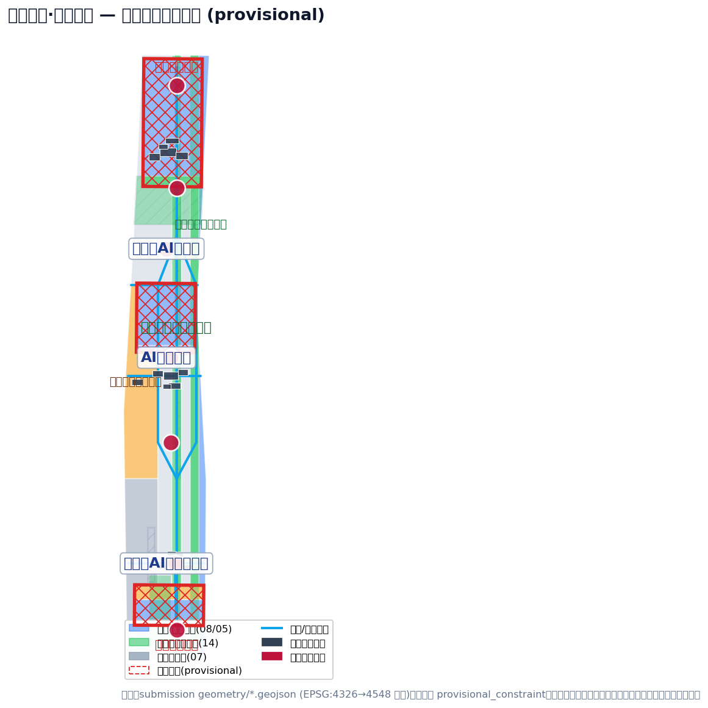
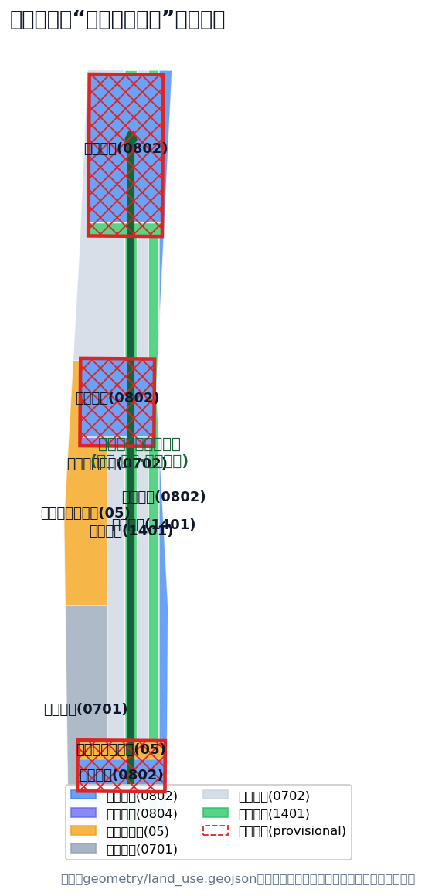
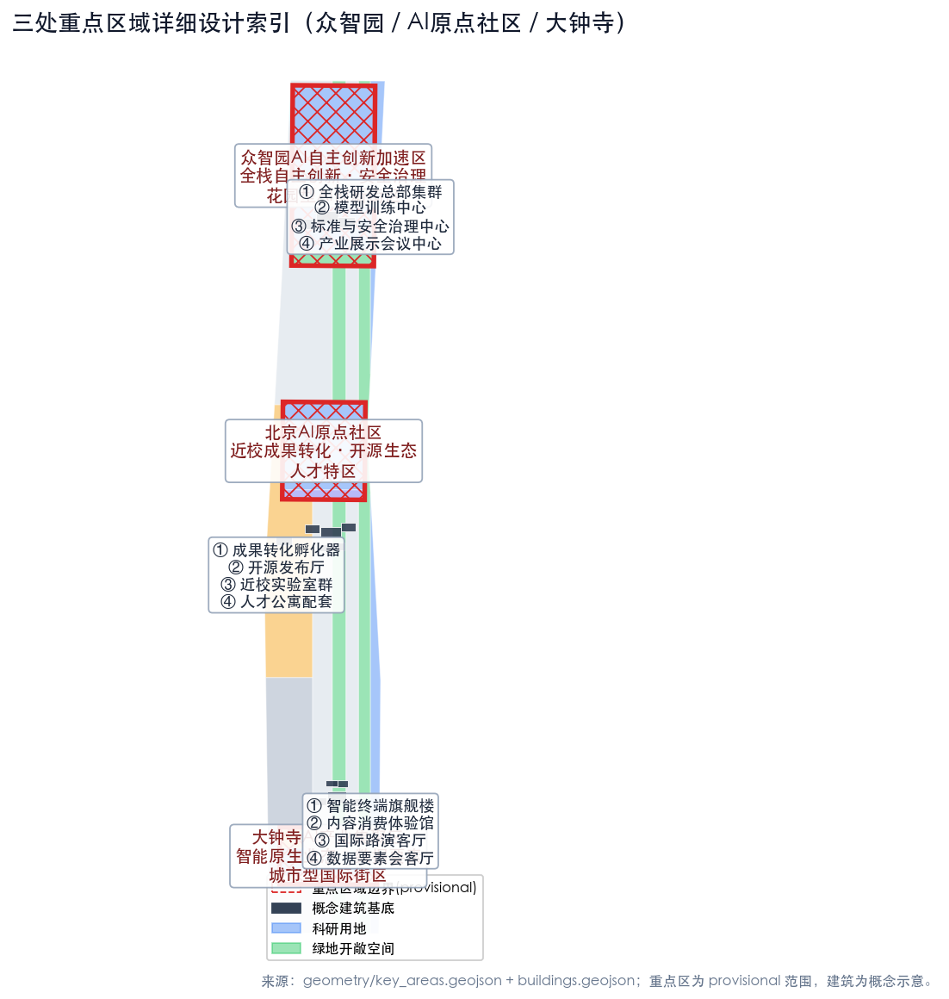
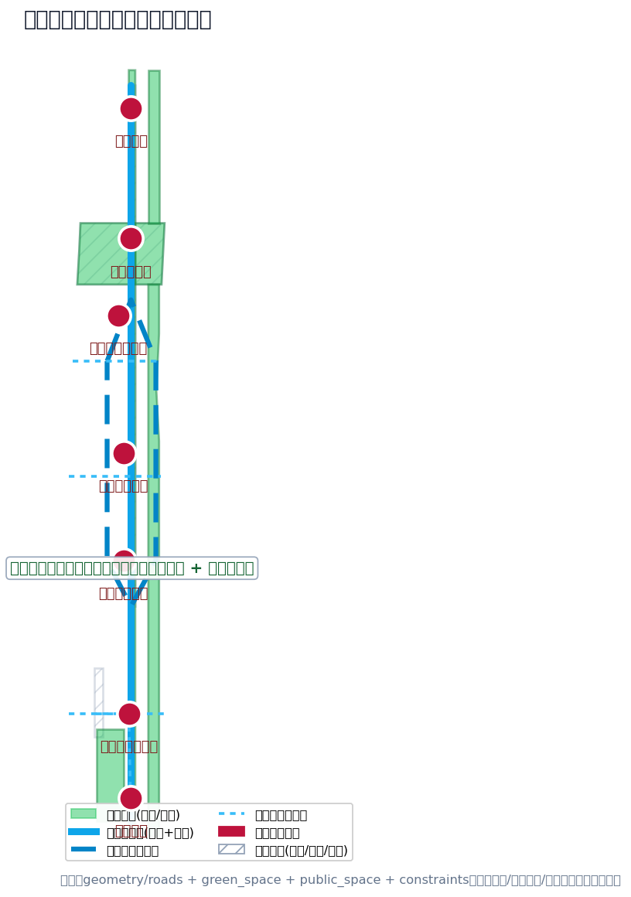
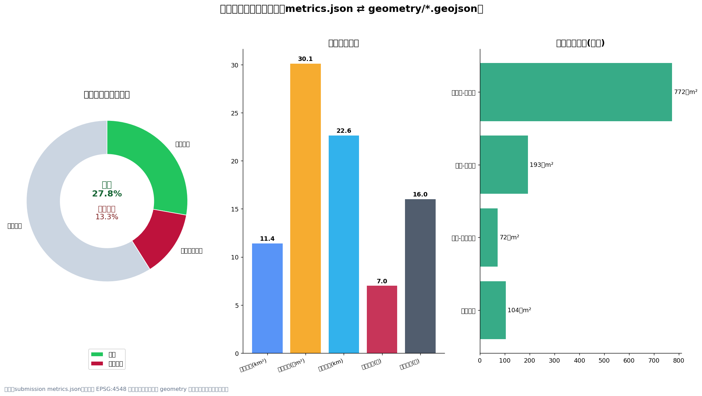

# Jing-Zhang Smart Belt · Century Resonance: Centennial Jing-Zhang AI Innovation Belt Conceptual Urban Design

## Design Basis and Source List

This proposal is generated by an AI agent based on publicly available or cleared rights data, including: the International Qualification Pre-Review Announcement for the Centennial Jing-Zhang AI Innovation Belt Urban Design issued by the Haidian Branch of the Beijing Municipal Commission of Planning and Natural Resources [source:OFFICIAL-ANNOUNCEMENT], excerpts from the open-source task book for global agents [source:AGENT-TASKBOOK], the repository maintainer's compiled site package [source:SITE-PACKAGE], the public Source Registry [source:SOURCE-REGISTRY], and the processed fact package [source:PROCESSED-FACT-PACK]. Design scope, area, tasks, and depth of outcomes are based on sections 1.3, 1.4, and 1.5 of the official announcement [standard:PROJECT-OFFICIAL-ANNOUNCEMENT][source:OFFICIAL-ANNOUNCEMENT], the principles of co-creation by intelligent entities, the three major positioning, five major functions, Three Zones and Two Wings, and six intelligent entity tasks are based on the task book [standard:PROJECT-AGENT-OPEN-CALL-TASKBOOK][source:AGENT-TASKBOOK], the depth of urban design and control methods for Public Spaces follow the Urban Design Management Measures [standard:MOHURD-URBAN-DESIGN-MEASURES][source:MOHURD-URBAN-DESIGN-MEASURES], and the control depth follows the Urban and Regulatory Detailed Planning for Towns [standard:MOHURD-CONTROL-DETAILED-PLANNING][source:MOHURD-CONTROL-DETAILED-PLANNING], land use classification follows the Guide for Land and Sea Use Classification in Territorial Space Investigation, Planning, and Control [standard:MNR-LAND-USE-CLASSIFICATION-GUIDE][source:MNR-LAND-USE-CLASSIFICATION-GUIDE], and architectural design scheme expression depth refers to the Regulations for the Depth of Architectural Engineering Design Documents [standard:MOHURD-ARCH-DESIGN-DEPTH-2016][source:MOHURD-ARCH-DESIGN-DEPTH-2016] (this standard is locally referenced as a methodological reference only, not as a formal basis).

**Boundary Condition Statement (Critical)**: As of the submission of this plan, the warehouse has not obtained official precise SITE_BOUNDARY and three KEY_AREA polygons. This plan uses the temporary rough boundaries clearly marked in `brief/site-package/geometry/provisional_boundaries.geojson` [source:BOUNDARY-SOURCE][source:KEY-AREA-SOURCE]. `geometry/site_boundary.geojson#SITE-001` and `geometry/key_areas.geojson#PROV-KEY-001/002/003` are both marked as `provisional_constraint`, `official_boundary=false`, and `boundary_precision=provisional_rough`, and are only for scheme generation, visualization, and submission self-check; they shall not be used as official redlines, approval references, or for precise area recalculation. Organizational data gaps shall not block content scoring, and all spatial layers and metrics must be recalculated uniformly according to [depth:metrics_recalculation] after the official polygons are released.

Data registration boundary: `data/source_registry.json` shows formal available data at 5 records and provisional-only data at 1 record [source:SOURCE-REGISTRY]. This plan utilizes only the notice, assignment document, Urban Design Management Measures, Control Plan Compilation Measures, and Land Use Classification Guide for task basis and design methods; any spatial control, area, ratio, and scale judgments are recalculated from the GeoJSON in this submission package ([metric:site_area_sqm][metric:green_ratio][metric:public_space_ratio]), with any matters lacking official baseline data fully disclosed in [depth:risk_missing_data] and `assumptions.json`.

## Three-Level Scope Framework

In accordance with Announcement 1.4 and 1.5, this plan is organized into a three-layer scope framework [depth:three_level_scope_framework][standard:PROJECT-OFFICIAL-ANNOUNCEMENT]:

| Level | Scope and Area | Work Objectives | Design Depth | Location of This Scheme |
| --- | --- | --- | --- | --- |
| Coordinated Research Area | 43.6 km², north to the North Fifth Ring Road, east to the Jingzhang Expressway, south to West Straight Street, west to Wanquanhe Road | AI industry ecosystem, Three Zones and Two Wings coordination, future city form, naming and logo, cultural narrative | Industry and Future City Research | This chapter and "Coordinated Research Area Industry and Future City Research" |
| Overall Design Area | 11.4 km², Jing-Zhang Heritage Park Surrounding 1-2 Kilometers | Urban Renewal Overall Framework, Land Use Structure, Transportation and Utilities, Jing-Zhang Heritage Park Vitality Belt, Urban Character | Control Detailed Urban Design [standard:MOHURD-CONTROL-DETAILED-PLANNING] | [data:geometry/land_use.geojson#LU-BELT] all layers |
| Key-Area Detailed Design Area | 368.4 ha, three key areas | Functional typology, building scale, Demolish–Renovate–Retain Strategy classification, Public Space, traffic organization | Urban Design depth of the Integrated Planning Implementation Plan [depth:three_key_area_detailed_design] | [data:geometry/key_areas.geojson#PROV-KEY-001] |

Three levels of spatial evidence: the Coordinated Research Area is temporarily defined by [data:geometry/site_boundary.geojson#SITE-001] and the boundaries expressed in the announcement; the Overall Design Area is the submitted boundary; the Key-Area Detailed Design Area is [data:geometry/key_areas.geojson#PROV-KEY-001], [data:geometry/key_areas.geojson#PROV-KEY-002], and [data:geometry/key_areas.geojson#PROV-KEY-003]. These three levels are progressively implemented: from industrial strategy to overall spatial structure to key area detailed design, with corresponding layers, indicators, and matrix items ([depth:overall_spatial_structure] [depth:land_use_layout]).

## Coordinated Research Area: Industry and Future City Research

### Overall Concept: Jing-Zhang Smart Belt · Century Echo

This plan proposes a comprehensive concept "**Jing-Zhang Smart Belt·Century Resonance**": with the historical echoes of the century-old Jing-Zhang Railway, "the first large-scale autonomous engineering of human industrial civilization," as the cultural theme, and "from steam-driven tracks to smart-driven computing power" as the narrative thread, the Coordinated Research Area is organized into a **composite cultural-ecological-innovative axis belt** [depth:overall_spatial_structure].

**Naming System (agent.1)**:
- Main Name: **Jing-Zhang Smart Belt** (English: **Jing-Zhang Smart Belt**)
- Concept Subtitle: **Century Echo** (English: **Century Echo**)
- District Naming:
Zhongzhiyuan (North Core / Full Stack Core), AI Origin Community (Origin Community / Origin Core), Dazhongsi (Grand Bell District / Resonance Core)
- Two Wing Naming: Zhongguancun Technology Services Wing (Zhongguancun Service Wing / Enabling Wing) and Xiaoyue River Scenario Enablement Wing (Xiaoyue River Scenario Wing / Experience Wing)
- Logo Direction: The core symbol is an isomorphic graphic of "rail + rail ties + neural synapses" — two parallel track lines symbolize the century-old Jing-Zhang railway, connected by pulse nodes in the middle, implying "tracks as computing power, history as the foundation"; the colors are taken from the "Jing-Zhang Iron Gray + Zhongguancun Indigo + AI Pulse Green" color series [depth:overall_spatial_structure].

**Three Key Positions**: century-old Jing-Zhang cultural belt, urban AI life experience belt, AI integration innovation belt; **Five Major Functions**: Full-Stack Independent AI Innovation System, world-class AI Innovation Ecosystem, AI-Enabled Scenario empowerment new paradigm, intelligent AI vibrant city, AI governance global discourse power [source:AGENT-TASKBOOK].

**Three Zones and Two Wings Synergistic Loop**: Zhongzhiyuan (Full-stack Autonomous + Safe Governance) → AI Origin Community (Idea Incubation + Open Source Ecosystem) → Dazhongsi (Intelligent Nativization + International Exchange), with the two wings respectively bearing "global element configuration and capital/IP empowerment" (Zhongguancun Wing) and "AI scenario empowerment and urban experience" (Xiaoyuehe Wing), forming a "incubation-conversion-industrialization-scenarization-global dissemination" closed loop [source:AGENT-TASKBOOK]. Corresponding spatial locations: [data:geometry/land_use.geojson#LU-N1] (Zhongzhiyuan full-stack R&D), [data:geometry/land_use.geojson#LU-M1] (Origin Community conversion and incubation), [data:geometry/land_use.geojson#LU-S1] (Dazhongsi intelligent nativation), [data:geometry/land_use.geojson#LU-W1] (Zhongguancun Wing), [data:geometry/land_use.geojson#LU-E2] (Xiaoyuehe Wing).

### Global AI Innovation Ecosystem Case Examples (agent.2, 5-8 cases)

The following cases are examples of verifiable world-class innovative ecological organizational models reported in the public domain. This plan only extracts their **translatable mechanisms**, without involving specific companies or unverified information [source:SOURCE-REGISTRY]:

1. **Silicon Valley,  / Stanford-Sand Hill Model**: University Pioneering + Venture Capital + Founder Community Closed Loop. Translatable: Original Community "On-Campus Conversion Street" and Zhongguancun Wing "Capital Living Room" in Synergy ([data:geometry/land_use.geojson#LU-M1][data:geometry/land_use.geojson#LU-W1]).
2. **Innovative Ecosystem of Tel Aviv, Israel**: Small Elite Teams + Government Guidance + Global Market Orientation. Translatable: The Zhongzhiyuan Safety Governance Sandbox and Standard Workshop Mechanism ([data:geometry/land_use.geojson#LU-N1]).
3. **Jing-Zhang Technology District** (Tech City): historical street district renewal + creative class aggregation. Transformable: "railway heritage + creative space" renewal strategy along the Jing-Zhang Heritage Park vitality belt ([data:geometry/land_use.geojson#LU-BELT]).
4. **One-North, Singapore**: A tripartite integration of park, community, and ecology, with mixed-use functional zones. Transformable into Zhongzhiyuan "Garden-Type AI Innovation District" with a mixed-use layout for work, residence, and commerce services ([data:geometry/land_use.geojson#LU-N3][data:geometry/land_use.geojson#LU-N4]).
5. **South Korea Seoul DMC / Pangyo**: Concentrated supply of national computing power and industrial platforms. Transformable into: Zhongzhiyuan National AI Platform and Edge Computing Station System ([data:geometry/land_use.geojson#LU-N1]).
6. **France Station F (Paris)**: Large-scale single-body incubator plus global entrepreneurial community operations. Transformable into: Dazhongsi "Smart Native Business Flagship Building + International Roadshow Living Room" composite carrier (see [data:geometry/land_use.geojson#LU-S1]).
7. **Kyoto, Japan, the "City of Scholarly Pursuits"**:  university with city deeply integrated, tradition coexists with modernity. Transformable: the original point community campus-park-neighborhood slow-transition integration and low-disturbance update([data:geometry/land_use.geojson#LU-M2]).

**Industrial-Spatial Mapping**: The full-stack innovation chain of AI (algorithm-computing-power-data-model-application-governance) is mapped to Zhongzhiyuan (algorithm/computing/governance), the Original Point Community (model/open-source/talent), Dazhongsi (application/terminal/data elements), Zhongguancun Wing (capital/IP/services), and Xiao Yuehe Wing (scenario/experience), corresponding to the agent.2 item in the `compliance_matrix.json` [depth:land_use_layout]. Land use structure indicators: research and development land approximately 372.7 million m² ([metric:land_use_rnd_sqm]), park and green space approximately 194.7 million m² ([metric:land_use_green_sqm]), commercial and service land approximately 147.7 million m² ([metric:land_use_commercial_sqm]), and residential land approximately 125.2 million m² ([metric:land_use_residential_sqm]). Key areas cover respective areas of approximately 192.9 million m² for Zhongzhiyuan ([metric:key_area_north_sqm]), 104.3 million m² for the Original Point Community ([metric:key_area_middle_sqm]), and 72.0 million m² for Dazhongsi ([metric:key_area_south_sqm]). All areas have been recalculated in GeoJSON format using EPSG:4548 ([metric:key_area_count]).

### Future Urban Form Research

AI Era Urban Form: Three Spatial Judgments: **Mixed Use** (work, residence, and commerce integrated in the same block, corresponding to the mixed-use land in Zhongzhiyuan and Dazhongsi [data:geometry/land_use.geojson#LU-N3]), **Evolvability** (land use and carriers support functional flexibility, expressed by the blank land use in [data:geometry/land_use.geojson#LU-R1]), **Scenographic Perceptibility** (AI services entering Public Spaces and pedestrian paths, corresponding to 7 public nodes such as [data:geometry/public_space.geojson#PUBLIC-ORIGIN] [metric:public_space_node_count]). Additionally, propose two systems, "AI+Transportation" and "Continuous Unbroken Green Spaces" (see the transportation and blue-green sections for details).

## Overall Design Area: Urban Renewal and Regulatory-Plan-Level Urban Design

### Overall spatial structure: one belt, three cores, dual wings, and multiple points, with a blue-green slow-moving composite loop

- **One Belt**: Jing-Zhang Relic Park Vitality Belt —— a cultural-ecological-pedestrian main axis running north-south ([data:geometry/land_use.geojson#LU-BELT][data:geometry/roads.geojson#ROAD-BELT])
- **Three Core Areas**: Zhongzhiyuan, AI Origin Community, and Dazhongsi (including key areas such as [data:geometry/key_areas.geojson#PROV-KEY-001], etc.)
- **Wings**: Zhongguancun Technology Services Wing, Xiaoyue River Scenario Enablement Wing ([data:geometry/land_use.geojson#LU-W1][data:geometry/land_use.geojson#LU-E2])
- **Multiple Points**: 7 Public Space nodes + 16 Building Footprints + 4 phased areas ([data:geometry/public_space.geojson][data:geometry/buildings.geojson][data:geometry/phasing.geojson])
- **Composite Loop**: The blue-green slow-moving composite loop connects the three cores with the two wings ([data:geometry/roads.geojson#ROAD-RING]).

### Land Use Structure and Functional Proportions [depth:land_use_layout]

This plan `geometry/land_use.geojson` fully covers the submission boundary with mutually exclusive zoning (no overlap, no gaps, see [metric:land_use_share_sqm]), with the following land use structure (areas recalculated in EPSG:4548):

| Land Use Category | Area (10,000 m²) | Percentage | Description |
| --- | --- | --- | --- |
| Research and Development Land (0802) | 372.7 | 32.7% | Main Carrier for AI R&D and Technology Transfer in Three Core Areas |
| Community Services and White Space (0702) | 290.6 | 25.5% | Pending Control Detailed Planning and Current Baseline Confirmation |
| Park Green Spaces and Open Spaces (1401) | 194.7 | 17.1% | Active Belt, Qinghe, Xiaoyuehe, and Station Front Green Spaces |
| Commercial and Business Service Land Use (05) | 147.7 | 12.9% | Dazhongsi Intelligent Native Business Types, Two-Wing Services |
| Residential Land (0701) | 125.2 | 11.0% | Zhongzhiyuan and Original Point Community Talent Residential Accompaniment |
| Education Land (0804) | 10.4 | 0.9% | Origin Community Near-School Collaboration |

> Note: The land use zoning is for the conceptual plan, and the statutory use, Floor Area Ratio, Building Height, green space ratio, setback, and building control lines are subject to the formal control plan conditions (see [depth:development_intensity_controls] and `assumptions.json`'s A-CONTROLS-001). The proportion of blank land (0702) is approximately 1/4, reserved for a conceptual arrangement to accommodate future elasticities in AI functions, and is not the final use conclusion.

### Urban Renewal Overall Framework and Identification of Inefficient Spaces

Update objects are categorized into three types [depth:retain_renovate_demolish]: **Retain** (Jing-Zhang Heritage Park, university campus areas, and the main body and cultural heritage resources along the existing community), **Renovate** (inefficient spaces along the track heritage, the surrounding environment of key enterprises in Dazhongsi, and the ground-level frontage of the original point community), and **New Construction/Adaptive Use** (north end of Zhongzhiyuan, front of Dazhongsi station, and the wing of Xiaoyuehe). All decisions for retain, renovate, and demolish are Conceptual Recommendations, and the specific conclusions for each plot will be confirmed after the official ownership, current building inventory, and control plan conditions are verified (refer to `missing_data_checklist.csv` for GAP-PARCEL-001 and GAP-BUILDING-001). (Demolish–Renovate–Retain Strategy)

### Building Scale and Intensity Control [depth:height_massing_character]

Conceptual Building Footprints totaling 16 locations ([metric:building_count]), with a combined footprint area of approximately 301,000 m² ([metric:building_footprint_area_sqm]). Building Height and density control principles: In the three-core central area, a mixed mid-to-high density (R&D headquarters/display) is recommended; along the vibrant belt and waterfront interface, a low-rise transparent interface is suggested; residential amenities should maintain the existing density. Specific numerical values are lacking due to the absence of official master plan conditions (GAP-CONTROL-001)listed as unknown([metric:floor_area_ratio][metric:building_height_m]), do not substitute speculative values for established indicators [depth:development_intensity_controls].

## Detailed Design of Key Areas

Three key areas are developed according to [data:geometry/key_areas.geojson#PROV-KEY-001/002/003] [depth:three_key_area_detailed_design], each providing a "location + spatial structure + building renewal + traffic slow zone + Public Space + AI scenarios + implementation risks" readable small plan.

### Zhongzhiyuan AI Independent Innovation Acceleration Area (192.1 ha, provisional)

- **Location**: Garden-type full-stack self-innovative district, national AI platform and security governance demonstration ([data:geometry/key_areas.geojson#PROV-KEY-001])
- **Spatial Structure**: North End R&D Headquarters Cluster([data:geometry/land_use.geojson#LU-N1])+ Qinghe River Waterside Low-Carbon Innovation Corridor([data:geometry/land_use.geojson#LU-N2])+ Industrial Display Service Belt([data:geometry/land_use.geojson#LU-N3])+ South Side Talent Residential Community([data:geometry/land_use.geojson#LU-N4])
- **Building Update**: 5 conceptual buildings (full-stack R&D headquarters, model training center, standard safety governance center, AI demonstration conference center, open-source collaboration space, etc., [data:geometry/buildings.geojson#BLDG-N-01]), to be demolished, renovated, and retained based on the confirmed baseline. (Demolish–Renovate–Retain Strategy)
- **Traffic Slow Zone**: Relying on integrated external traffic along the Fifth Ring Road (pending traffic specialty plan), cycling paths along the Qinghe interface, and cross-ring road seam nodes ([data:geometry/public_space.geojson#PUBLIC-OVER]).
- **Public Space**: Zhongzhiyuan Innovation Interaction Living Room ([data:geometry/public_space.geojson#PUBLIC-ZZY]), Qinghe Riverbank Green Space ([data:geometry/green_space.geojson#GREEN-QINGHE])
- **AI Scenarios**: Autonomous Model Testing Ground, Safety Governance Sandbox, Standard Setting Workshop, Low-Carbon Computing Experience (see Scenario Card 02/08)
- **Implementation Risks**: The Qinghe Blue Line and flood control conditions (GAP-MUNICIPAL-001), Fifth Ring Road traffic special plan, and control detail intensity conditions await official confirmation.

### Beijing AI Origin Community (104.3 ha, provisional)

- **Location**:  Campus-based Conversion Zone and Talent Special Zone, global leading AI Innovation Ecosystem originator([data:geometry/key_areas.geojson#PROV-KEY-002])
- **Spatial Structure**: North side Transformation and Research Science Belt([data:geometry/land_use.geojson#LU-M1])+ Central Education and Research Synergistic Area([data:geometry/land_use.geojson#LU-M2])+ South side Talent Living and Supporting Area([data:geometry/land_use.geojson#LU-M3])
- **Building Renovation**: Conversion outcomes incubator, open-source release hall, cluster of near-school laboratories, talent apartments, and entrepreneurship service kiosks (e.g., [data:geometry/buildings.geojson#BLDG-M-01]), suggesting low-impact, organic updates [source:OFFICIAL-ANNOUNCEMENT]
- **Traffic Slow Zone**: Transit-Station Integration at Wudaokou and Qinghua East Road West Mouth (see [data:geometry/public_space.geojson#PUBLIC-WDK]), Campus-Park-Street Slow Zone Integration (see [data:geometry/roads.geojson#ROAD-CONN-2])
- **Public Space**: Original Community Open Square ([data:geometry/public_space.geojson#PUBLIC-ORIGIN])
- **AI Scenario**: Open Source Community, Results Exhibition Hall, Talent Special Zone Services, Near-School Incubation (Scenario Card 01/07)
- **Implementation Risks**: Collaboration is needed for the boundary and ownership of the campus (GAP-PARCEL-001) and for the release of outcomes and intellectual property services.

### Dazhongsi AI Industry Agglomeration Zone (72.0 ha, provisional)

- **Location**: Urban-type Smart Economy and International Exchange District, Main Battlefield for Smart-Native Business Types ([data:geometry/key_areas.geojson#PROV-KEY-003])
- **Spatial Structure**: station front intelligent native commercial service belt([data:geometry/land_use.geojson#LU-S1])+ south side enterprise agglomeration research area([data:geometry/land_use.geojson#LU-S2])+ station front composite green space([data:geometry/land_use.geojson#LU-S3])
- **Building Renovation**: Smart Terminal Flagship Building, Content Consumption Experience Hall, International Roadshow Living Room, Data Element Reception Hall, Enterprise Service Agglomeration Building (such as [data:geometry/buildings.geojson#BLDG-S-01], etc.)
- **Traffic Slow Zone**: Design for the Four Quadrants Pedestrian Plaza at Dazhongsi Station (refer to [data:geometry/public_space.geojson#PUBLIC-DZS][data:geometry/roads.geojson#ROAD-STATION]), organization for non-motorized vehicle parking pending traffic specialty.
- **Public Space**: Station Front Composite Green Space ([data:geometry/green_space.geojson#GREEN-SOUTH]) Composite Utilization
- **AI Scenarios**: Intelligent agents and smart terminal demonstrations, content consumption, data element living room, international showcase (scene card 05/08)
- **Implementation Risks**: Transit-Station Integration conditions, planning green space composite utilization, and property rights around key enterprises (GAP-ROAD-001, GAP-PARCEL-001)

## AI Innovation Ecosystem, Personas, and AI+ Scenarios

### Five user archetypes [source:AGENT-TASKBOOK]

| Image | Typical Needs | Spatial Response | Data and Privacy Boundaries |
| --- | --- | --- | --- |
| Open Source Developer | Release, Collaborate, Test, Community Reputation | Origin Community Open Source Release Hall, Public Code Wall, Nighttime Collaboration Space ([data:geometry/buildings.geojson#BLDG-M-02]) | No personal behavior tracking; activity data only used for aggregate statistics |
| Founding Team | Low-Cost Office, Computing Power Entry Point, Product Test Bed | Zhongzhiyuan Shared Test Bed, Edge Computing Power Service Point, Security Governance Consultation ([data:geometry/buildings.geojson#BLDG-N-03]) | Computing Power and Data Services Require Separate Authorization |
| Key Corporate Visitors | Exhibitions, Business, International Reception, Talent Recruitment | Dazhongsi International Roadshow Living Room, Station Shuttle, Public Spaces Around Key Enterprises ([data:geometry/buildings.geojson#BLDG-S-03]) | Corporate Identity and Case Studies Must Clear Rights |
| Surrounding Residents | Commuting, Leisure, Community Services, Low-Impact Updates | Jing-Zhang Heritage Park Slow-Travel Loop, Community Services Embedded, Activity Grading ([data:geometry/public_space.geojson#PUBLIC-ORIGIN]) | Do Not Use Resident Profiles for Commercial Recommendations |
| College Students and Faculty | Technology Transfer, Cross-Institution Collaboration, Daily Active Transportation | Pedestrian Linkage between Campus and Park District, Technology Transfer Hub, AI Education Experience Point ([data:geometry/buildings.geojson#BLDG-M-03]) | Campus data and research outcomes require authorization |

### AI-Enabled Scenario Card (10 cards, among which 3 are for industrial Testing and Validation Scenarios)

| Number | Scenario Card | Type | Spatial Carrier | Design Description |
| --- | --- | --- | --- | --- |
| SC-01 | Open Source Gallery | Public/Community | Origin Community ([data:geometry/buildings.geojson#BLDG-M-02]) | Focused on universities, open-source communities, and startup teams, providing a platform for result releases, code contribution displays, and small-scale pitch events |
| SC-02 | Safety Governance Sandbox | **Industrial Testing Validation** | Zhongzhiyuan ([data:geometry/buildings.geojson#BLDG-N-03]) | Translating the formulation of standards, safety evaluations, and model red team testing into visitable, bookable, and regulable exhibition collaboration nodes |
| SC-03 | Edge Side Computing Hub | **Industrial Testing and Validation** | Overall Design Area Node | A prototype of New Infrastructure integrated with public services and low-carbon energy strategies, testing edge side computing service models |
| SC-04 | AI Slow-Travel Navigation | Transportation | Jing-Zhang Heritage Park Vitality Belt ([data:geometry/roads.geojson#ROAD-BELT]) | Explainable signage and low-impact sensor recognition for slow-travel breakpoints, congestion nodes, and accessibility needs |
| SC-05 | Dazhongsi International Roadshow Living Room | Sector Services | Dazhongsi ([data:geometry/buildings.geojson#BLDG-S-03]) | Display, negotiation, media release, and international exchange for smart bodies, smart terminals, and content consumption enterprises |
| SC-06 | Qinghe Low-Carbon Innovation Corridor | Public/Ecological | Zhongzhiyuan Along Qinghe River Interface ([data:geometry/green_space.geojson#GREEN-QINGHE]) | Public Living Room of the Garden Combining Green Spaces, Flood Management, Pedestrian and Bicycle Paths, and AI Demonstrations |
| SC-07 | Near-School Conversion and Resulting Innovation Street | Industrial Services | Origin Community ([data:geometry/buildings.geojson#BLDG-M-01]) | Focused on the conversion and results of university research, organizing incubation, exhibitions, legal, intellectual property, and investment and financing services |
| SC-08 | Data Element Living Room | **Industrial Testing and Validation** | Dazhongsi ([data:geometry/buildings.geojson#BLDG-S-04]) | Demonstrates data elements and digital asset circulation mechanisms with compliance, authorization, and auditability as prerequisites |
| SC-09 | AI-Enabled Living Services Sample Street | Public Services | Intersection of Community and Commerce | Medical, Education, Legal, and Other AI-Enabled Scenarios Implemented in Operable Small-Scale Street Spaces |
| SC-10 | Global AI Activity Week Route | Public/Operational | One Belt Public Space System ([data:geometry/phasing.geojson#PHASE-01]) | A walkable and shareable experience route from heritage culture, open-source community, industrial display to international showcase |

**Scenario-Space-Operation Mapping**: Each scenario card is annotated in `compliance_matrix.json` with service targets, spatial locations, operational data sources, privacy boundaries, Human Review mechanisms, operational entities, and risks (corresponding to agent.3 requirements [source:AGENT-TASKBOOK]). AI governance adheres to principles of data minimization, public sources, explainability, and human review: Urban Agents only assist in identifying pedestrian and cycling gaps, Public Space heat maps, facility maintenance, and service demands, without substituting for planning approvals, outputting unauthorized profiles, or claiming official implementation commitments.

## Land Use, Building Scale, and Retain-Renovate-Demolish Strategy

Land use classification follows [standard:MNR-LAND-USE-CLASSIFICATION-GUIDE], fully closed and covering the submitted boundary [depth:land_use_layout]; Building Footprints express the conceptual scale of 16 areas [depth:height_massing_character]; the demolish–renovate–retain strategy is expressed in three categories [depth:retain_renovate_demolish]. Key conclusions: (Demolish–Renovate–Retain Strategy)

- Industrial space main carrier: The combined area for R&D land use for the three cores is approximately 372.7 million m² ([metric:land_use_rnd_sqm]), corresponding to the needs for full-stack AI R&D, technology transfer, and enterprise clustering.
- Residential and Community Balance: The combined area for residential and community service land use is approximately 415.8 million m² ([metric:land_use_residential_sqm] and 0702 land use), supporting an integrated "work-live-social-learn" model [source:OFFICIAL-ANNOUNCEMENT].
- White Space Flexibility: 0702 White space of approximately 290.6 million m² reserved for the conceptual arrangement of new AI business forms and future functions (not for final use).

All areas, proportions, and scales can be recalculated from [data:geometry/land_use.geojson], [data:geometry/buildings.geojson], and [metric:land_use_rnd_sqm] and [metric:building_footprint_area_sqm]; when there is no control plan, existing buildings, ownership, or engineering conditions, they should all be marked as pending confirmation (see `assumptions.json`).

## Transport, Rail, Municipal Infrastructure, and Public Services

**Traffic and Slow Travel** [depth:traffic_rail_slow_parking]: With the Jing-Zhang Heritage Park Vitality Axis([data:geometry/roads.geojson#ROAD-BELT])and the Blue-Green Slow Travel Composite Ring([data:geometry/roads.geojson#ROAD-RING])as the backbone, 3 lines of east-west connection stitches (see [data:geometry/roads.geojson#ROAD-CONN-1/2/3]) span the vitality strip connecting both sides; Transit-Station Integration focuses on integrating five-way intersection ([data:geometry/public_space.geojson#PUBLIC-WDK]). Dazhongsi Station ([data:geometry/public_space.geojson#PUBLIC-DZS][data:geometry/roads.geojson#ROAD-STATION]) and Qinghua Donglu Xikou; The concept pedestrian and cyclist corridor is approximately 22.6 km in length ([metric:road_centerline_length_m]). The road right-of-way, cross-section, and traffic details are pending official conditions (GAP-ROAD-001).

**Municipal and New Infrastructure** [depth:municipal_new_infrastructure]: Propose a framework suggestion that integrates "edge-side computational hubs + distributed energy + traditional three major facilities" (see [data:geometry/buildings.geojson#BLDG-E-01]). The service radius, capacity, and engineering feasibility require confirmation through a municipal specialty review (GAP-MUNICIPAL-001).

**Public Service Facilities**: Innovative service platforms and talent living service facilities are laid out along the three cores and the vibrant belt. The baseline and capacity of these facilities are pending official data (GAP-SERVICE-001).

## Blue-Green Network, Public Space, and Urban Character

### Blue Green Public Space [depth:blue_green_public_space]

With the Jing-Zhang Ruins Park Vitality Belt as the backbone ([data:geometry/green_space.geojson#GREEN-BELT]), connect the Qinghe Riverside Green Space ([data:geometry/green_space.geojson#GREEN-QINGHE]), Xiao Yuehe Blue-Green Ecological Corridor ([data:geometry/green_space.geojson#GREEN-XYH]), and the South End Portal Green Space ([data:geometry/green_space.geojson#GREEN-SOUTH]), forming a pedestrian and cycling path system that runs north-south and connects east-west; seven Public Space nodes (north and south end portals, ring road crossing node, Wudaokou, Dazhongsi Quadrant, Open Source Square, Innovation Living Room, [metric:public_space_node_count]) carry parking, sports, innovation interaction, technology testing, and display functions. Green space area totals approximately 317.2 million m² ([metric:green_space_area_sqm]), Public Space area totals approximately 151.5 million m² ([metric:public_space_area_sqm]), with a green space ratio of 27.8% ([metric:green_ratio]) and a public space ratio of 13.3% ([metric:public_space_ratio]). Constraint corridors (Jing-Zhang Railway Heritage Park heritage corridor, Qinghe Blue Line, and Line 13 rail corridor indication) are expressed in [data:geometry/constraints.geojson#CONSTRAINT-HERITAGE], [data:geometry/constraints.geojson#CONSTRAINT-RIVER], and [data:geometry/constraints.geojson#CONSTRAINT-RAIL], with all precisions pending confirmation from official attachments.

### Three AI Sacred Sites (agent.4) [source:AGENT-TASKBOOK]

1. **"Echo Gate" Northern Portal Node** ([data:geometry/public_space.geojson#PUBLIC-NORTH]): with the imagery of the Jing-Zhang Railway's starting point + AI computational pulse device, serving as the northern spiritual entry of the belt.
2. **"Track AI Origin" Open Square** ([data:geometry/public_space.geojson#PUBLIC-ORIGIN]): Located in the AI Origin community, this open square features seating based on railroad ties and an honor wall for open contributors, commemorating the origins and spirit of collaboration.
3. **"Century Bell Echoes" Dazhongsi Station Plaza** ([data:geometry/public_space.geojson#PUBLIC-DZS]): With the cultural elements of Dazhongsi + data-driven pulse devices, it serves as an international exchange and dissemination landmark.

Propose a contribution/honor display system (open-source contribution wall, AI era contributor honor band) alongside a Public Space component library (railway light strips, neural synaptic shading structures, pulse interactive paving) — all symbols are original design directions, not reproductions of historical artifacts, do not infringe, and are not trivialized. Building implementation is pending confirmation of cultural heritage and engineering conditions (GAP-HERITAGE-001) [standard:MOHURD-URBAN-DESIGN-MEASURES].

### Urban Character and Cultural Development (agent.5)

City tone "**Iron Gray and Qing Green**": Iron gray is derived from the steel tracks and stone station buildings of the Jing-Zhang Railway, while qing green is derived from AI pulses and the mountains and waters of Haidian; cultural resources along the line, such as the Tsinghua Yuan Railway Station, adopt low, high-transparent interfaces with track narrative signage; the sign system features an original dual system of "signal lights + milestone markers." The cultural narrative thread, "From Jing-Zhang Railway to Jing-Zhang Smart Belt —— Two Centennial Leaps of Chinese Independent Innovation," is integrated with the innovation culture of Zhongguancun, the spirit of "two bombs and one star" scientists, and the new AI culture ([source:AGENT-TASKBOOK] agent.5). All fonts, images, portraits, and trademarks use Qingquan or original materials (see `report/copyright_statement.md`).

## Renewal Projects, Implementation Policy, and Phasing

### Update Project List [depth:renewal_project_list]

| Number | Project Name | Type | Spatial Location | Main Dependency | Evidence |
| --- | --- | --- | --- | --- | --- |
| JZ-01 | Jing-Zhang Site Park Slow Travel Discontinuity Seaming | Public Space/Transport | Vitality Belt Throughout | Road Right-of-Way, Underbridge Space, Traffic Organization Review | [data:geometry/roads.geojson#ROAD-BELT] |
| JZ-02 | Zhongzhiyuan Qinghe Innovation Interface | Blue-Green Space/Industrial Display | Zhongzhiyuan North End | river blue line, ecological flood protection conditions | [data:geometry/green_space.geojson#GREEN-QINGHE] |
| JZ-03 | Origin Community Near-School Conversion Street | Urban Renewal/Industrial Services | Origin Community | campus boundaries, ownership, first-floor uses | [data:geometry/buildings.geojson#BLDG-M-01] |
| JZ-04 | Dazhongsi Station Quadrant Four Pedestrian Connectivity | Integrated Railways/Active Transportation | Dazhongsi Station | railway stations, road intersections, utility lines | [data:geometry/public_space.geojson#PUBLIC-DZS] |
| JZ-05 | AI Public Services and Edge Computing Nodes | New Infrastructure/Public Services | Overall Scope Node | Energy, Computing Power, Security, and Operations Subject | [data:geometry/buildings.geojson#BLDG-E-01] |
| JZ-06 | Global AI Activity Week Public Route | Operations/Brand | One Belt Public Space System | Public Space Permits, Activity Safety, Copyright Clearance | [data:geometry/phasing.geojson#PHASE-01] |

### Phasing Plan [depth:phasing_implementation]

- **PHASE-01 Near-Term Pilot (1-3 Years)**: Lightweight Facilities, Activity Operations, Slow-Mode Pilots, and Scenario Access ([data:geometry/phasing.geojson#PHASE-01])
- **PHASE-02 Mid-Term (3-7 Years)**: Conversion of School Near-By Results and Talent Accompaniment([data:geometry/phasing.geojson#PHASE-02])
- **PHASE-03  (3-7 )**: Integration of Dazhongsi Station and Cultivation of Intelligent Native Business Forms ([data:geometry/phasing.geojson#PHASE-03])
- **PHASE-04 Long-Term (7-15 Years)**: Demonstration of Comprehensive Innovation and Security Governance for Zhongzhiyuan ([data:geometry/phasing.geojson#PHASE-04])
- **PHASE-05 Future Framework**: Elastic Margins and Governance Framework for Future Urban Forms ([data:geometry/phasing.geojson#PHASE-05])

### Global AI Innovation Ecosystem and Long-Term Operations (agent.6)

- **Annual Activity Framework**: "Jing-Zhang AI Week" (every May, commemorating the Jing-Zhang Railway's groundbreaking) + Quarterly Developer Open Days + Monthly Scenario Access Days, all as Conceptual Recommendations
- **Brand IP System**: Leverage the "Century Resonance" logo and naming system to extend the visual identity of the event; ensure long-term accumulation of the event's brand assets.
- **Developer Community Operations**: With the Original Point Community Open Source Plaza as the physical anchor point, organize code contributions, model evaluations, hackathons, and mentorship programs.
- **Scenario Access Operations**: 10 scenario cards are opened in a tiered manner based on "public data + authorized data". The test scenarios use a reservation + Human Review mechanism.
- **International Promotion and Transformation Pathways**: International Roadshow Living Room (Dazhongsi) + Global Activity Week Route (SC-10) carry the "bring in" (international talent and enterprise visits) and "go out" (output of the Jing-Zhang Smart Belt solution), and establish a transformation channel from activity participation → enterprise services → space occupancy.

All activities, recruitment, funding, and operational arrangements are expressed as "Conceptual Recommendation/Reference Proposal/Available for Further Study by Professional Teams," and do not constitute determined government arrangements [source:AGENT-TASKBOOK].

## Metrics, Area Recalculation, and Compliance Matrix

**Indicator System**:  spatial calculable indicators([metric:site_area_sqm][metric:green_ratio][metric:public_space_ratio][metric:building_footprint_area_sqm][metric:road_centerline_length_m][metric:public_space_node_count][metric:building_count][metric:phase_count][metric:key_area_count][metric:land_use_share_sqm][metric:key_area_areas_sqm])are calculated based on the submitted GeoJSON in EPSG:4548; regulatory indicators([metric:floor_area_ratio][metric:building_height_m])are listed as unknown due to the lack of official control plans. Performance metrics (including [metric:ai_innovation_index][metric:talent_density][metric:green_space_per_capita_sqm]) await calibration with industrial and population data. Three categories of metrics will be entered into metrics.json, assumptions.json, and compliance_matrix.json [depth:metrics_recalculation].

**Compliance Matrix**: `compliance_matrix.json` covers all tasks of announcements 1.3, 1.4, and 1.5 (subtasks 1.3.1-1.3.3, 1.4.1-1.4.3, 1.5.1-1.5.3) and the six intelligent agent tasks (agent.1-agent.6), with each mapping to chapters, layers, indicators, drawings, HTML modules, sources, and assumptions; `standard_matrix.json` covers all mandatory standards. `design_depth_matrix.json` covers all 15 formal depth items [depth:three_level_scope_framework][depth:overall_spatial_structure][depth:land_use_layout][depth:development_intensity_controls][depth:height_massing_character][depth:retain_renovate_demolish][depth:traffic_rail_slow_parking][depth:municipal_new_infrastructure][depth:blue_green_public_space][depth:three_key_area_detailed_design][depth:renewal_project_list][depth:phasing_implementation] [depth:metrics_recalculation][depth:risk_missing_data][depth:existing_conditions_diagnosis].

## Risk, Copyright, and Compliance

**Risk and Missing Data** ([depth:risk_missing_data]): Official Boundary, key area polygons, control planning conditions, road red lines, ownership parcels, current building stock, municipal utility lines, cultural heritage protection areas, and the base number of public service facilities are all pending (see `missing_data_checklist.csv` and `assumptions.json`), all should be described as "pending confirmation" and should not be misrepresented as verified conclusions.

**Copyright and Compliance**: All text, drawings, geometry, and code in this proposal are generated by an AI agent and are licensed under COMMUNITY-DISPLAY-ONLY (see [report/copyright_statement.md]); no confidential information, personal privacy data, or unauthorized trademarks, fonts, or images have been used. Conceptual recommendations are marked as "Conceptual Recommendation/Reference Proposal/Available for Professional Team to Deepen Research," and no claims are made of official approval, final land use control plan, ultimate ownership, or guarantee of implementation.

**AI Generated Responsibility**: The intelligent entity is responsible for the facts, sources, copyright, spatial data, metrics, and expressions; human and professional teams retain the final judgment [source:AGENT-TASKBOOK].

## References

The full machine-readable Evidence Chain for this proposal is available at [source:SITE-PACKAGE] and [source:SOURCE-REGISTRY] (source registry), [source:BOUNDARY-SOURCE] and [source:KEY-AREA-SOURCE] (Provisional Boundary), [standard:MOHURD-URBAN-DESIGN-MEASURES] (design methods), [metric:site_area_sqm] and [metric:green_ratio] (metric recalculation), and [data:geometry/land_use.geojson#LU-BELT] (spatial layers). Directory-level reference files are as follows:

- `brief/site-package/design_brief.json`
- `brief/site-package/agent_taskbook.json`
- `brief/site-package/allowed_design_space.json`
- `brief/site-package/sources.json`
- `brief/site-package/enums/`
- `brief/site-package/ranges/planning_limits.json`
- `brief/site-package/standards/standards.json`
- `brief/site-package/standards/references/*.md`
- `brief/site-package/schemas/*.json`
- `data/source_registry.json`
- `data/processed/agent_fact_pack.md`
- `data/processed/project_scope_summary.csv`
- `data/processed/agent_task_requirements.csv`
- `data/processed/source_use_matrix.csv`
- `data/processed/missing_data_checklist.csv`
- `docs/data-workflow.md`
- `docs/formal-submission-guide.md`
- `submissions/README.md`
