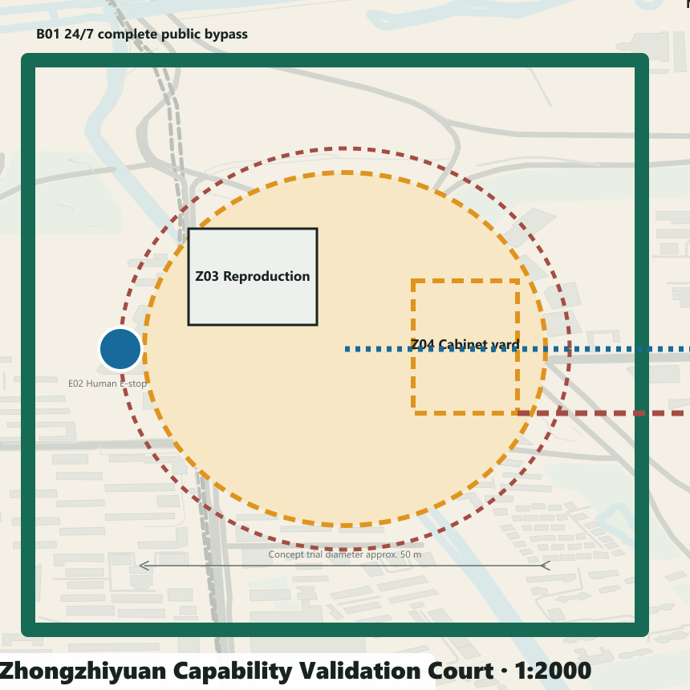
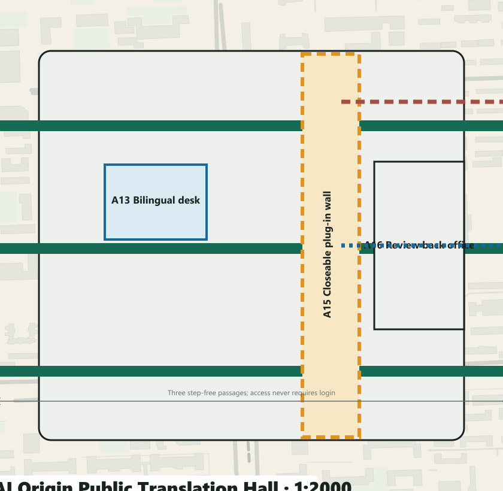
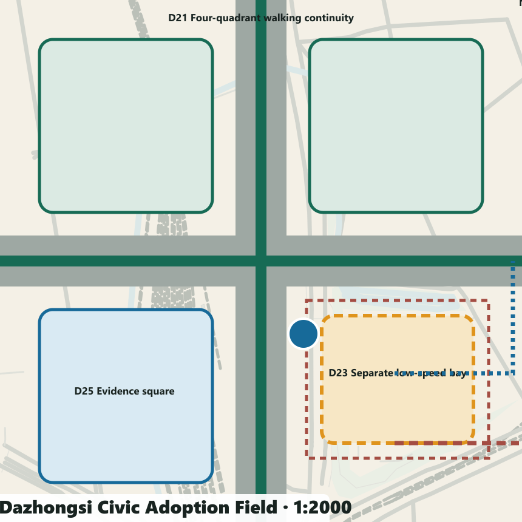

# JING-ZHANG TWO ANSWERS / 京张双答

> **Civic Adoption Receipt: for every civic problem, make the baseline work independently, then require AI to prove its increment in the same task, with the same people and in the same space.** This is one spatial plan, not two alternatives. Outcomes are limited to `adopt`, `revise` or `stop`, decided by a human scenario committee.

V4 no longer gives 12 scenarios equal graphic weight. T2, S2 and S7 become three hero scenarios for human–machine safety, civic service and transit adoption; nine further scenes remain traceable replication items. Each hero has a 1:5000 city link, 1:2000 key-area plan, 1:500 detail, 1:200 section, operating window, staff positions, emergency/removal routes and a Civic Adoption Receipt awaiting field evidence.[data:visual/assets/two-answers.json] [data:visual/assets/spatial-atlas.json]

## Design Basis and Source List

Jing-Zhang Two Answers defines the Centennial Jing-Zhang AI Innovation Belt as a **public-baseline-first civic proving line**. The permanent layer delivers continuous accessibility, walking, cycling, blue-green space, shade, static signs, staffed desks and conventional interchange. AI may enter only as a time-bounded, optional, stoppable and removable plug-in. A public evidence interface compares both paths with shared measures.[source:OFFICIAL-ANNOUNCEMENT] [source:AGENT-TASKBOOK]

All boundaries, key areas, land-use interfaces, building envelopes and nodes are conceptual proposals under provisional geometry—not official boundaries, road redlines, ownership or statutory controls. Missing survey, utilities, fire, heritage, buildings, users and performance remain unknown. Generated images are concepts, never site evidence.[source:BOUNDARY-SOURCE] [source:KEY-AREA-SOURCE]

## Three-Level Scope Framework

The 43.6 km² coordinated research context organises capability exchange; the roughly 11.4 km² provisional overall design area carries the public baseline; three provisional key areas totalling roughly 368.4 ha host full-scale prototypes. All share one protocol and evidence chain.[data:geometry/site_boundary.geojson#SITE-001]

## Coordinated Research Area: Industry and Future City Research

The regional diagram exchanges problems, evidence and capabilities: Beiwei for founder and alumni service; Future Science City for application demand; Huairou for research facilities and instruments.[source:REGION-BEIWEI] [source:REGION-FUTURE-SCIENCE-CITY] [source:REGION-HUAIROU]

E-Town connects engineering, manufacturing and scenarios; Beijing–Tianjin–Hebei connects facilities, computing and industrial transfer. Every interface stays conceptual until accountable parties and agreements exist.[source:REGION-ETOWN] [source:REGION-CAPITAL-CIRCLE]

Seven primary/official references transfer one mechanism each: long-term shared operations from one-north; renewal plus knowledge district from 22@; and evidence-led scenarios from Paris-Saclay.[source:CASE-ONE-NORTH] [source:CASE-BARCELONA] [source:CASE-PARIS-SACLAY]

Brainport contributes shared labs, Helsinki a public AI register, and Woven City a controlled test course.[source:CASE-BRAINPORT] [source:CASE-HELSINKI] [source:CASE-WOVEN]

Toronto Quayside is used only for binding public-interest and phase commitments. None proves a Beijing control condition.[source:CASE-QUAYSIDE]

## Overall Design Area: Urban Renewal and Regulatory-Plan-Level Urban Design

V4 grounds the protocol in public urban fabric and a four-scale drawing evidence chain. `visual/assets/context-open-map.json` freezes the 2026-08-13 OpenStreetMap snapshot for roads, rail, water, parks and available local building footprints. It is shown only as low-contrast context; every feature is `open_data_context / reference_only` and excluded from area, intensity, capacity and performance calculations. Drawings carry the attribution “Map data © OpenStreetMap contributors, ODbL”.

Each station moves from a 1:5000 city link to a 1:2000 key-area plan; its hero scenario then reaches a 1:500 detail and 1:200 section. Every scale remains conceptual and requires survey and official-base verification. Z01–Z07 define Zhongzhiyuan's complete bypass, enclosed loop, reproduction room, cabinet yard, safety buffer, emergency-stop sightline and removal route. A11–A16 define AI Origin's three step-free passages, staffed desk, bilingual arrival, workshop tables, closeable plug-in wall and review back office. D21–D26 define Dazhongsi's four-quadrant walking links, conventional forecourt, independent timed bay, evacuation surface, evidence square and restoration route. Suggested dimensions are prototype design decisions, not measured existing conditions; experience views convey atmosphere only.

The 43.6 km² research context organises capability exchange; the roughly 11.4 km² provisional design scope carries the public baseline; three provisional key areas totalling roughly 368.4 ha host full-scale prototypes. The Public Baseline Spine links the Zhongzhiyuan Capability Validation Station, AI Origin Public Translation Station and Dazhongsi Civic Adoption Station. The Zhongguancun Service Wing supplies legal, IP, evaluation, finance and international services; the Xiaoyuehe Scene Wing brings resident problems, climate resilience and everyday feedback.[data:geometry/site_boundary.geojson#SITE-001]

Six east–west stitches, `STITCH-01—06`, give each proof field two addressed links between surrounding neighbourhood entrances and the baseline spine. They state walking, accessibility and service-interface priorities rather than road redlines. The overall axonometric uses the same `SCN-001—012` nodes as the detailed plans, data and exhibit.[data:geometry/roads.geojson#STITCH-01] [metric:east_west_stitch_count]

## Core concept: three spatial components and the protocol

Every location uses only three component classes: permanent public baseline; removable AI plug-in; public evidence interface. The AI layer is admitted only when the ordinary answer works independently, both paths serve the same task and users, accessibility/equity/reliability do not regress, data/energy/labour/lifecycle can be recorded, and a human owner, stop condition and restoration route exist.[metric:ordinary_baseline_coverage_count]

The three classes resolve into nine stable component IDs: `B01` continuous step-free path, `B02` shade/seating/water, `B03` static signs and staffed service; `A01` low-speed robot bay, `A02` edge-compute cabinet, `A03` optional service terminal; `E01` state and metric board, `E02` human takeover and emergency stop, `E03` feedback, appeal and exit notice. The IDs recur in the atlas, station plans, scenario data and exhibit. Each also records spatial/interface demand, minimum public-route separation, power/data/staff/maintenance interfaces, open–trial–pause–retire states and its retirement destination.[data:visual/assets/spatial-atlas.json] [metric:spatial_component_type_count]

The protocol is simultaneously a spatial concept, repeatable operating mechanism, governance system and scenario network. It can travel from test courts to public service, heritage, mobility and climate settings, but every location must pass its own local gate.

## Overall design: renewal, mobility, blue-green and baseline

Renewal follows baseline → ground floor → envelope. First repair crossings, ramps, tactile cues, lighting, shade, seating, water and staffed service. Then open existing ground floors for evaluation, translation and operations. Only after survey, ownership and statutory controls may intensity or retain/renovate/rebuild decisions be made. Submitted building polygons are conceptual adaptive envelopes.[data:geometry/buildings.geojson#BLDG-001]

The typical section aligns a 3.0 m step-free walk, 2.5 m cycle lane, 1.8 m shaded rest band, controlled plug-in bay, blue-green buffer and rail memory. Dimensions are prototypes subject to survey, utilities, fire and transport engineering. Ordinary movement never crosses the robot test bay.[depth:traffic_rail_slow_parking]

## Detailed Design of Key Areas

**Zhongzhiyuan Capability Validation Court** combines a controlled loop, complete bypass, staffed safety desk and removable cabinet bay for T1–T3. Its ring geometry separates machine tests from the continuous public route.[data:geometry/public_space.geojson#PUBLIC-001]

Hero scenario T2 places the B01 bypass, suggested 4.0 m A01 controlled lane, suggested 1.5 m safety buffers, E02 stop sightline, two staff positions and equipment-removal route in the same 1:500 detail and 1:200 section. These dimensions are unverified prototype proposals. Buffer intrusion, two consecutive near misses or E-stop failure are zero-tolerance stop events.[data:visual/assets/two-answers.json#SCN-002]

**AI Origin Public Translation Hall** uses three step-free passages through an open forecourt, staffed desks, co-creation tables and a closeable plug-in wall for S1–S3. No-account entry and human review remain visible from every service point.[data:geometry/public_space.geojson#PUBLIC-002]

Hero scenario S2 overlays three barrier-free passages, a staffed bilingual arrival desk, closeable optional terminal, professional review back office and nearest human escalation route. With AI closed, paper maps, static signs, telephone booking and staffed reception still complete the same task.[data:visual/assets/two-answers.json#SCN-005]

**Dazhongsi Civic Adoption Field** sets conventional interchange and four-quadrant walking links ahead of a bounded, timed low-speed bay and public evidence square for S7–S9. The bay restores to ordinary accessible pick-up when the trial stops.[data:geometry/public_space.geojson#PUBLIC-003]

Hero scenario S7 brings four-quadrant walking, the conventional interchange forecourt, separate low-speed trial bay, evacuation surface, human takeover point and restoration line into one spatial judgement. The trial may never consume the only accessible route or conventional transport capacity.[data:visual/assets/two-answers.json#SCN-010]

The three prototypes deliberately do not share one plan type: a controlled ring and bypass resolves human–machine safety; a porous hall makes staffed translation public; a four-quadrant forecourt keeps conventional mobility dominant. Each situates baseline, plug-in and evidence interface so they remain mutually visible without making ordinary service dependent on AI.[metric:station_spatial_prototype_count]

## AI Innovation Ecosystem, Personas, and AI+ Scenarios

The three hero scenarios carry professional review depth; nine catalogue scenes carry replication breadth. All 12 retain stable IDs, map nodes, components, accountable humans, common metrics, stop events and restored states, but only T2, S2 and S7 receive full plan–detail–section–operation–receipt space in this edition.

Six stress-test profiles cover wheelchair users, pedestrians with visual impairment, older adults without smartphones, residents/caregivers, international researchers/startups, and night operations staff. T1–T3 are industry tests; S1–S9 are civic scenarios. IDs align across GeoJSON, data, drawings and the offline exhibit.[data:geometry/constraints.geojson#SCN-001]

| ID | Paired task | Space | Ordinary answer | Optional AI answer | Stop condition |
| --- | --- | --- | --- | --- | --- |
| T1 | Open model and data provenance reproduction | Capability Validation Court · reproduction room | A staffed registry, paper/offline checklist and manual licence review reproduce versions and provenance. | An optional assistant runs in isolation and produces a difference report without replacing professional sign-off. | Stop T1 when safety, rights, data minimisation, human takeover or reliable degradation fails; the human lead has final authority. |
| T2 | Controlled robot–pedestrian–accessibility test | Capability Validation Court · controlled loop | A safety steward, physical separation, pedestrian-priority route and manual emergency stop support the test. | An optional low-speed robot runs only inside a controlled window and records near misses and takeovers. | Stop T2 when safety, rights, data minimisation, human takeover or reliable degradation fails; the human lead has final authority. |
| T3 | Edge compute energy, noise and offline degradation test | Capability Validation Court · removable cabinet bay | Paper procedures, a staffed log and independent lighting keep the ordinary service operational. | A removable edge cabinet handles only necessary tasks and degrades to the staffed process when offline. | Stop T3 when safety, rights, data minimisation, human takeover or reliable degradation fails; the human lead has final authority. |
| S1 | Staffed enterprise service with optional AI triage | AI Origin Public Translation Hall · enterprise desk | A staffed desk and printed directory explain legal, IP, evaluation and finance routes. | Optional triage suggests the next desk from a public directory and never issues formal legal or investment advice. | Stop S1 when safety, rights, data minimisation, human takeover or reliable degradation fails; the human lead has final authority. |
| S2 | International arrival and civic-service navigation | AI Origin Public Translation Hall · arrival desk | A multilingual staffed desk, paper map, static signs and phone booking provide a complete arrival service. | Optional multilingual guidance explains public procedures and hands uncertain questions to staff. | Stop S2 when safety, rights, data minimisation, human takeover or reliable degradation fails; the human lead has final authority. |
| S3 | Open knowledge matching and community problem workshop | AI Origin Public Translation Hall · co-creation tables | A facilitator uses problem cards, a public directory and face-to-face workshops to match needs and resources. | An optional assistant searches licensed open knowledge and proposes candidates without setting community priorities. | Stop S3 when safety, rights, data minimisation, human takeover or reliable degradation fails; the human lead has final authority. |
| S4 | Staffed Jing-Zhang heritage tour with optional AI narration | Public Baseline Spine · rail-memory stop | Human guides, tactile models, static interpretation and a paper route provide a complete heritage service. | Optional narration uses verified sources, exposes citations and states uncertainty. | Stop S4 when safety, rights, data minimisation, human takeover or reliable degradation fails; the human lead has final authority. |
| S5 | Static accessible wayfinding with optional dynamic assistance | Public Baseline Spine · continuous accessible route | Ramps, tactile paving, high-contrast static signs and staffed help points form a continuous route. | Opt-in dynamic guidance reports barriers without continuous tracking. | Stop S5 when safety, rights, data minimisation, human takeover or reliable degradation fails; the human lead has final authority. |
| S6 | Shade, rest and extreme-weather service prompts | Xiaoyuehe Scene Wing · climate rest point | Trees, canopy, seating, water, noticeboard and human inspection provide the everyday climate service. | Optional on-device prompts combine public alerts and non-identifying sensors; staff decide opening and closure. | Stop S6 when safety, rights, data minimisation, human takeover or reliable degradation fails; the human lead has final authority. |
| S7 | Conventional transit interchange with optional low-speed feeder | Dazhongsi Civic Adoption Field · feeder bay | Rail, bus, taxi, walking links and staffed guidance remain continuously available. | An optional low-speed feeder runs only in a bounded bay and time window with pedestrians first. | Stop S7 when safety, rights, data minimisation, human takeover or reliable degradation fails; the human lead has final authority. |
| S8 | Staffed public-service desk with optional AI information guide | Dazhongsi Civic Adoption Field · civic desk | Staff, telephone, printed directory and a legible queue make the public-service desk complete. | An optional guide explains public information and immediately escalates uncertainty to staff. | Stop S8 when safety, rights, data minimisation, human takeover or reliable degradation fails; the human lead has final authority. |
| S9 | Conventional event operations with aggregate flow assistance | Dazhongsi Civic Adoption Field · event apron | Staffed ticketing, capacity signs, physical queues, evacuation lines and public address run the event. | Optional aggregate counting adjusts entrances without face recognition or individual trajectories. | Stop S9 when safety, rights, data minimisation, human takeover or reliable degradation fails; the human lead has final authority. |

## Land Use, Building Scale, and Retain-Renovate-Demolish Strategy

Four conceptual interfaces—research/learning, heritage park, industry service and community life—organise the plan without changing statutory land use. Building scale, FAR, height and retain/renovate/demolish decisions remain unknown pending ownership, controls and survey. Three polygons test only public ground floor, removable equipment and adaptable upper space.[data:geometry/land_use.geojson#LU-001]

## Transport, Rail, Municipal Infrastructure, and Public Services

Conventional rail and bus services remain primary. The Baseline Spine completes walking, cycling, accessibility and staffed guidance. Edge equipment uses independent power, low-energy operation, offline degradation and whole-unit removal; utilities, fire, waste, drainage and emergency systems await formal survey.[data:geometry/roads.geojson#ROAD-001]

## Blue-Green Network, Public Space, and Urban Character

The blue-green system retains mature trees, rail memory and continuous open space. Shade, rest, water, permeability and night safety form the ordinary answer. Graphite, green, amber and blue distinguish the three layers; AI hardware stays visually secondary and the public space remains complete after removal.[data:geometry/green_space.geojson#GREEN-001]

### Industry, talent and future-city programme

The operating loop is problem register → ordinary baseline → capability reproduction → controlled prototype → paired comparison → human adoption → annual review. Seven enduring roles are proposed: public problem owner, accessibility observer, model/data auditor, safety steward, night maintainer, multilingual service worker and scenario product manager. Rights, licensing, privacy and exit ownership are resolved before entry.[source:AGENT-TASKBOOK]

## Renewal Projects, Implementation Policy, and Phasing

Five work packages—the Baseline Spine, Validation Court, Translation Hall, Adoption Field and public evidence/committee—each name a conceptual lead operator, collaborators, permissions, S/M resource class, start gate, KPI establishment method, risks, stop condition, destination of assets and review owner. Actor names describe responsibility, not confirmed institutional participation. No investment value or public commitment is invented.[depth:renewal_project_list]

The near-term 0–6 month pilot establishes ordinary-service and accessibility baselines. Operators, collaborators and resident representatives then define measurable indicators, monitoring and evaluation before any AI pilot advances.

### Governance and exit

0–6 months: evidence, survey, ownership/control checks, accessibility audit, ordinary-service baseline, metric definitions and accountable staff. 6–12 months: three full-scale ordinary-answer prototypes only. 12–24 months: controlled removable AI enhancement and paired comparison. 24–36 months: adopt, revise or stop, with annual public review. Any stage may return to the ordinary answer.[data:geometry/phasing.geojson#PHASE-000]

A human scenario committee combines operator, accessibility/community, domain, data and safety voices. Suppliers disclose interests but do not control the final vote. Severe safety or rights events trigger immediate stop by the accountable site lead.

## Metrics, Area Recalculation, and Compliance Matrix

Known values are limited to reproducible document coverage: 12 paired scenarios, 3 hero scenarios, 9 catalogue items, 3 industry tests, 6 profiles, 12/12 ordinary baselines, 12/12 human-review assignments and 12/12 stop conditions. Completion, satisfaction, energy, cost, accessibility failure and incident metrics remain unknown and display “Field baseline pending”. The evidence chain is task → node → key-area plan → scene detail → section → two paths → minimum data → human owner → shared metric → gate/stop → Civic Adoption Receipt → adopt/revise/stop → restored site. Every receipt remains `not_field_run / pending_field_evidence`.[metric:paired_scenario_count]

## Risk, Copyright, and Compliance

No-account entry, static/tactile guidance, staffed desks and conventional interchange make the service usable through outage, refusal or low digital ability. Key risks—provisional-boundary misuse, accessibility regression, robot near misses, wrong advice, data drift, energy/e-waste, staff gaps and public distrust—are controlled through spatial separation, gates, emergency stop, data inventory, asset destinations, rosters and public review. Drawings and images do not replace survey, engineering, statutory planning or permission.[depth:risk_missing_data]

## References

[source:SOURCE-REGISTRY] [source:OFFICIAL-ANNOUNCEMENT] [source:AGENT-TASKBOOK]

- `OFFICIAL-ANNOUNCEMENT` and `AGENT-TASKBOOK`: task and scope basis.
- `BOUNDARY-SOURCE` / `KEY-AREA-SOURCE`: provisional geometry only.
- `CASE-ONE-NORTH`, `CASE-BARCELONA`, `CASE-PARIS-SACLAY`, `CASE-BRAINPORT`, `CASE-HELSINKI`, `CASE-WOVEN`, `CASE-QUAYSIDE`: primary/official benchmark mechanisms.
- `REGION-BEIWEI`, `REGION-FUTURE-SCIENCE-CITY`, `REGION-HUAIROU`, `REGION-ETOWN`, `REGION-CAPITAL-CIRCLE`: regional interface background.
- `SOURCE-REGISTRY` and `sources.json` record publisher, date, URL, licence boundary, use and limitation.
