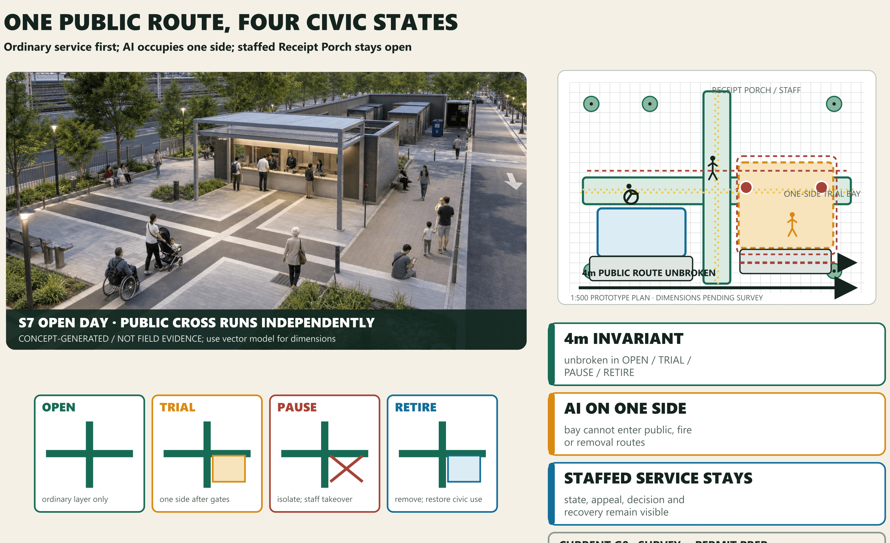

# JING-ZHANG TWO ANSWERS

> **One public route, four civic states.** At Dazhongsi centre, a **4 m prototype public route** remains continuous through OPEN, TRIAL, PAUSE and RETIRE. AI occupies only a one-sided reversible trial bay; staffed service and the Receipt Porch remain open.[data:visual/assets/prototype-model.json] [metric:s7_public_route_prototype_width_m]

The ordinary answer is an admission prerequisite, not a fallback: conventional interchange, wheelchair and tactile routes, shaded waiting, static wayfinding and a staffed desk must work independently. AI may be considered only after a same-task, same-user, same-space comparison; a human committee alone decides adopt / revise / stop. On stopping, equipment leaves through an independent maintenance route without borrowing the public layer.[data:visual/assets/two-answers.json] [depth:overall_spatial_structure]

## S7 architectural–public-space prototype

The Dazhongsi flagship has five independent, traceable layers: two 4 m public routes; a southeast one-sided trial bay and reversible buffer; a southwest staffed Receipt Porch; tree pits, rain gardens, shaded waiting and an unoccupied egress surface; and a back-of-house route for control, storage, maintenance, waste and retirement. The 1:500 plan, 1:200 lived sections, 1:50/1:20 nodes and same-camera state axonometrics share component IDs.[data:visual/assets/prototype-model.json] [depth:three_key_area_detailed_design]

The reversible prototype palette is bolted galvanized steel, perforated-metal shade, dry precast ballast foundations, permeable precast paving and replaceable evidence panels. OPEN runs the public layer only; TRIAL opens one side after permits, posts and baseline close; PAUSE isolates equipment while staff complete the same task; RETIRE removes plug-ins, relays paving and retains public service and review panels. Structure, fire, foundations, drainage and durability await specialist review; all prices remain pending_market_quote.[data:visual/assets/e2-readiness.json]

## Three alternatives, one spatial decision

Under one task, users, site and hard gates, ALT-A central mixing is reject_design because it cuts the public cross and conflicts with fire/removal; ALT-B split bays retain routes but fragment supervision and removal, so revise_design; ALT-C one-sided reversible bay is the sole advance_design. These design-option states are not field adopt / revise / stop decisions; the computation tests geometric consistency only.[data:visual/assets/spatial-decision.json] [metric:spatial_alternative_count]

ALT-C route, one-sided trial area and reversible buffer come from one local-metric audit.[metric:alt_c_public_route_length_m] [metric:alt_c_trial_area_sqm] [metric:alt_c_reversible_buffer_area_sqm]

Staff-to-e-stop distance uses the same input. Any change in official base, entrances, title or specialist constraints requires a rerun; drawings and text must follow the result.[metric:alt_c_max_estop_staff_distance_m]

## Current implementation gate: G0 survey and permit preparation

The scheme is not labelled “unimplementable”; it is honestly at **G0: enter survey and permit preparation**. The next gate requires site survey, title and rail-interface checks; closure of site, fire, accessibility, temporary power, network, traffic and equipment-safety dependencies; four independent venue, baseline-service, safety and data posts; then seven consecutive ordinary operating days. If any condition is missing, AI trial does not start, while an ordinary open day can still be prepared.[data:visual/assets/e2-readiness.json] [metric:e2_permit_gate_count]

Field footfall, safety, efficiency, satisfaction, energy, price and recovery duration remain unknown / not_field_run. Twelve measurement contracts define how to verify; they are not results.[metric:measurement_contract_count] [metric:field_verification_result_count]

## Approved planning context and operating overlay

Published 2026 context records an approximately 1,668.2 ha neighbourhood-planning area, a 9 km Jing-Zhang green belt and a “belt–axis–two centres–multiple nodes” structure, with Dazhongsi as one centre; Phase II supporting works are complete and a fishbone slow-mobility network is reported.[source:BEIJING-BLOCK-PLAN-APPROVED-20260812] [source:BEIJING-JZ-PHASE2-COMPLETE-20260714]

These facts are the credible base, not the design protagonist. The spine/stations/wings form a stoppable, removable operating layer embedded in the green belt and aligned with Dazhongsi centre and the innovation axis; six stitches align with existing or published slow-mobility directions and are not proposed roads. The official 1,668.2 ha context and the submission's 11.4 sq km provisional geometry stay separate. Government reporting is not participant fieldwork, survey, title or acceptance evidence.[data:visual/assets/spatial-atlas.json] [metric:official_planning_area_ha] [metric:submitted_provisional_area_sqm]

## Design Basis and Source List

Jing-Zhang Two Answers defines the Centennial Jing-Zhang AI Innovation Belt as a **public-baseline-first civic proving line**. The permanent layer delivers continuous accessibility, walking, cycling, blue-green space, shade, static signs, staffed desks and conventional interchange. AI may enter only as a time-bounded, optional, stoppable and removable plug-in. A public evidence interface compares both paths with shared measures.[source:OFFICIAL-ANNOUNCEMENT] [source:AGENT-TASKBOOK]

All boundaries, key areas, land-use interfaces, building envelopes and nodes are conceptual proposals under provisional geometry—not official boundaries, road redlines, ownership or statutory controls. Missing survey, utilities, fire, heritage, buildings, users and performance remain unknown. Generated images are concepts, never site evidence.[source:BOUNDARY-SOURCE] [source:KEY-AREA-SOURCE]

Culture and site context use official public sources only. Beijing's Jing-Zhang park interpretation and phase-one/two notices support the railway-memory, continuous-park and public-space background; the municipal Zhongguancun history supports a culture of experiment, transfer and sharing; Dazhongsi rail material supports directional context only. None proves exact exits, buildings, redlines or ownership.[source:JINGZHANG-PLAN-OFFICIAL] [source:JINGZHANG-PHASE1-OFFICIAL] [source:JINGZHANG-PHASE2-OFFICIAL] [source:ZHONGGUANCUN-HISTORY-OFFICIAL] [source:DAZHONGSI-LINE13-CONTEXT]

## Three-Level Scope Framework

The 43.6 km² coordinated research context organises capability exchange; the roughly 11.4 km² provisional overall design area carries the public baseline; three provisional key areas totalling roughly 368.4 ha host full-scale prototypes. All share one protocol and evidence chain.[data:geometry/site_boundary.geojson#SITE-001]

## Coordinated Research Area: Industry and Future City Research

Five exchange contracts replace generic regional arrows with fallible evidence exchange. Beiwei community supplies resident problems and accessibility baselines; Future Science City supplies research tasks and open-model capability; Huairou Science City supplies instruments and reproduction conditions; Beijing E-Town supplies manufacturing, device-safety and maintenance interfaces; the Jing-Jin-Ji interface carries cross-regional problems, compute and knowledge reuse. Each contract records problem input, capability, validation place, evidence product, four owner roles and a failure exit. Institutions are proposed roles, not partnership claims.[data:visual/assets/spatial-atlas.json]

Validation places are the Xiaoyuehe wing, Verification Ring, Translation Gate and Receipt Porch. Any failed permit, data right or ordinary baseline stops exchange and returns to ordinary service; both success and failure enter the public knowledge base.

## Overall Design Area: Urban Renewal and Regulatory-Plan-Level Urban Design

The Civic Adoption Compiler grounds the protocol in three civic landmarks, four-season operation, a five-level evidence chain and a deterministic state machine. The OSM snapshot contains only one building feature in the Dazhongsi context, so roads, rail, water and parks remain directional reference while a visible “open-data gap” hatch identifies missing building context. Every proposed edge is a design assumption rather than an existing building or statutory plan.

Each station moves from a 1:5000 city link to a 1:2000 plan; hero scenes add a 1:500 detail and 1:200 section, while S7 continues to a 1:50 assembly node and layered axonometric. Zhongzhiyuan retains its ring court and complete bypass; AI Origin retains its no-account porous hall; Dazhongsi becomes a public cross, southeast reversible trial bay, southwest evidence porch and two blue-green edges. Dimensions are prototype decisions, not measured conditions.

The 43.6 km² research context organises capability exchange; the roughly 11.4 km² provisional design scope carries the public baseline; three provisional key areas totalling roughly 368.4 ha host full-scale prototypes. The Public Baseline Spine links the Zhongzhiyuan Capability Validation Station, AI Origin Public Translation Station and Dazhongsi Civic Adoption Station. The Zhongguancun Service Wing supplies legal, IP, evaluation, finance and international services; the Xiaoyuehe Scene Wing brings resident problems, climate resilience and everyday feedback.[data:geometry/site_boundary.geojson#SITE-001]

Six east–west stitches, `STITCH-01—06`, give each proof field two addressed links between surrounding neighbourhood entrances and the baseline spine. They state walking, accessibility and service-interface priorities rather than road redlines. The overall axonometric uses the same `SCN-001—012` nodes as the detailed plans, data and exhibit.[data:geometry/roads.geojson#STITCH-01] [metric:east_west_stitch_count]

## Core concept: three spatial components and the protocol

Every location uses only three component classes: permanent public baseline; removable AI plug-in; public evidence interface. The AI layer is admitted only when the ordinary answer works independently, both paths serve the same task and users, accessibility/equity/reliability do not regress, data/energy/labour/lifecycle can be recorded, and a human owner, stop condition and restoration route exist.[metric:paired_scenario_count]

The three classes resolve into nine stable component IDs: `B01` continuous step-free path, `B02` shade/seating/water, `B03` static signs and staffed service; `A01` low-speed robot bay, `A02` edge-compute cabinet, `A03` optional service terminal; `E01` state and metric board, `E02` human takeover and emergency stop, `E03` feedback, appeal and exit notice. The IDs recur in the atlas, station plans, scenario data and exhibit. Each also records spatial/interface demand, minimum public-route separation, power/data/staff/maintenance interfaces, open–trial–pause–retire states and its retirement destination.[data:visual/assets/spatial-atlas.json] [metric:spatial_component_type_count]

The protocol is simultaneously a spatial concept, repeatable operating mechanism, governance system and scenario network. It can travel from test courts to public service, heritage, mobility and climate settings, but every location must pass its own local gate.

The supporting proposition is “**Verification forms a ring, translation forms a gate, adoption forms a porch; rules compile first, the field proves later.**” To preserve traceability to merged versions, S7 keeps stable `V7-D-*` geometry IDs; the prefix is an object lineage, not the publication version. Baseline paths, tactile guidance, ramps, crossings, curbs, interchange, trial boundary, porch, staff, E-stops, fire, storage and removal still resolve through one WGS84 chain.[data:geometry/roads.geojson#V7-D-BASE-EW] [metric:key_area_count]

Evidence progresses through `E0 public source → E1 concept design → E2 documented prototype ready → E3 controlled trial pending → E4 civic adoption pending`.[metric:evidence_ladder_level_count] S7 is `E2_documented_prototype_ready`; T2/S2 are `E1_concept_design`; `T0_synthetic_contract_verified` is a separate rule-consistency status, not a field level. E2 does not mean survey, permits, assembly or field baseline. Every publication shows `NOT FIELD-RUN`.[metric:measurement_contract_count] [metric:field_verification_result_count]

### Civic Adoption Compiler: measurement contracts, spatial decision and E2 documentation

One S7 model drives five review scales and a documented 16-item component kit.[data:visual/assets/spatial-atlas.json] [metric:s7_review_scale_count] [metric:s7_prototype_kit_item_count]

E2 also registers eight permit gates, four procurement packages and five blank forms. It **does not mean** survey, permits, procurement, assembly or field operation have occurred.[metric:e2_permit_gate_count] [metric:e2_procurement_package_count] [metric:e2_printable_form_count]

The compiler runs seven cases for each of `SCN-001—012`: ordinary baseline, missing permit, missing role, public-service regression, zero-tolerance event, human recovery and equipment retirement. It accepts only `OPEN→TRIAL`, `TRIAL→PAUSE`, `PAUSE→OPEN`, `PAUSE→RETIRE` and `RETIRE→OPEN`. Illegal jumps, incomplete permits/roles, interrupted public routes or field unknowns presented as known fail the build. The script actually generated and passed 84/84 cases as `synthetic_design_verification`; this is not field simulation or safety certification.[data:visual/assets/tabletop-results.json] [metric:synthetic_design_verification_case_count]

The ordinary public cross and staffed service must be surveyed and logged for seven consecutive operating days first. The southeast trial bay may enter `TRIAL` only after site, title, fire, accessibility, temporary power, network, traffic-management and equipment-safety gates are closed and four independent posts are staffed. Collision, buffer intrusion, emergency-stop failure, interruption of a public route or failed human takeover triggers a zero-tolerance stop. The recovery clock runs from the stop command until staff complete the same task and both public routes reopen. Recovery time remains `unknown / not_field_run`.

The three landmarks retain different spatial archetypes: the Verification Ring wraps a controlled inner ring with a complete public bypass; the Translation Gate carries three account-free paths past staffed service and professional review; the Receipt Porch combines a public cross, one-side trial bay and staffed evidence interface. All three experiential views are geometry-matched concept images, not evidence of existing conditions, dimensions or performance.

## Overall design: renewal, mobility, blue-green and baseline

Renewal follows baseline → ground floor → envelope. First repair crossings, ramps, tactile cues, lighting, shade, seating, water and staffed service. Then open existing ground floors for evaluation, translation and operations. Only after survey, ownership and statutory controls may intensity or retain/renovate/rebuild decisions be made. Submitted building polygons are conceptual adaptive envelopes.[data:geometry/buildings.geojson#BLDG-001]

The typical section aligns a 3.0 m step-free walk, 2.5 m cycle lane, 1.8 m shaded rest band, controlled plug-in bay, blue-green buffer and rail memory. Dimensions are prototypes subject to survey, utilities, fire and transport engineering. Ordinary movement never crosses the robot test bay.[depth:traffic_rail_slow_parking]

## Detailed Design of Key Areas

### Architectural family: Ring, Gate and Porch

The three landmarks share the dry-assembly **MAT-01–05** family and the grammar “public baseline / AI plug-in / evidence interface”, yet remain unmistakable in plan and section.[data:visual/assets/prototype-model.json]

- **Zhongzhiyuan Verification Ring (T2):** an all-day bypass surrounds the controlled test court. Observation arcade, safety desk, failure display and east equipment exit align across the 1:500 plan and 1:200 section. Closing the court leaves the public ring working.
- **AI Origin Translation Gate (S2):** three account-free passages cross the staffed bilingual desk, waiting edge and review backstage; a rear service strip maintains the closable plug-in wall. Static guidance and staffed service survive the night closure.
- **Dazhongsi Receipt Porch (S7):** the public cross, one-sided bay, staffed porch, blue-green edge and back-of-house form one architectural-ground system. Public, fire and removal routes do not occupy one another.

### Dazhongsi flagship: five scales

**1:5000 / 1:2000** establish directional relations among rail, park, roads and four quadrants only. The public crop contains one building feature at Dazhongsi; missing fabric is labelled “adaptation interface / survey-pending band”, never invented.[data:visual/assets/context-open-map.json] [source:OPENSTREETMAP-CONTEXT-20260813]

The **1:500 plan** draws kerbs, four ramps, two tactile routes, permeable paving, tree pits, rain gardens, waiting and shade, Receipt Porch, dual E-stops, control booth, equipment interfaces, fire route and independent removal line. A 2.4 m rear maintenance strip connects control, storage, maintenance and waste.[data:visual/assets/prototype-model.json]

Two **1:200 sections** cut public route—buffer—trial bay and Receipt Porch—public cross—blue-green edge, checking relative clear height, shade, sightline, drainage edge and human-machine separation. They are not construction drawings.[metric:architectural_section_count]

The **1:50 / 1:20 details** record reversible connections: bolted frame on ballast, removable boundary outside the tactile route, replaceable evidence rail and temporary power, and a flush permeable kerb with rain-garden overflow. Structural sizes, fire rating, wind, drainage capacity and durability await professional calculation.[metric:architectural_detail_count]

### Assembly, maintenance and four states

- **OPEN**: ordinary feeder, public cross, shaded waiting and staffed porch work independently.
- **TRIAL**: after eight permits, four posts and seven baseline days close, only the one-sided bay opens.
- **PAUSE**: dual E-stops isolate equipment; the safety lead takes over; the public route does not move.
- **RETIRE**: plug-ins and boundary leave, lifted paving is relaid, equipment exits east and evidence panels remain for review.

The 90-day sequence maps survey, permanent public layer, baseline record, timed plug-in and removal review to drawn components. Any failed permit, post or ordinary service blocks the next stage. Quantities are reproducible; prices remain **pending_market_quote**.[data:visual/assets/e2-readiness.json]

## AI Innovation Ecosystem, Personas, and AI+ Scenarios

The three hero scenarios carry professional review depth; nine catalogue scenes carry replication breadth. All 12 retain stable IDs, map nodes, components, accountable humans, common metrics, stop events and restored states, but only T2, S2 and S7 receive full plan–detail–section–operation–receipt space in this edition.

Six stress-test profiles cover wheelchair users, pedestrians with visual impairment, older adults without smartphones, residents/caregivers, international researchers/startups, and night operations staff. T1–T3 are industry tests; S1–S9 are civic scenarios. IDs align across GeoJSON, data, drawings and the offline exhibit.[data:geometry/constraints.geojson#SCN-001]

| ID | Paired task | Space | Ordinary answer | Optional AI answer | Stop condition |
| --- | --- | --- | --- | --- | --- |
| T1 | Open model and data provenance reproduction | Capability Validation Court · reproduction room | A staffed registry, paper/offline checklist and manual licence review reproduce versions and provenance. | An optional assistant runs in isolation and produces a difference report without replacing professional sign-off. | Stop T1 when safety, rights, data minimisation, human takeover or reliable degradation fails; the human lead has final authority. |
| T2 | Controlled robot–pedestrian–accessibility test | Capability Validation Court · controlled loop | A safety steward, physical separation, pedestrian-priority route and manual emergency stop support the test. | An optional low-speed robot runs only inside a controlled window and records near misses and takeovers. | Stop T2 when safety, rights, data minimisation, human takeover or reliable degradation fails; the human lead has final authority. |
| T3 | Edge compute energy, noise and offline degradation test | Capability Validation Court · removable cabinet bay | Paper procedures, a staffed log and independent lighting keep the ordinary service operational. | A removable edge cabinet handles only necessary tasks and degrades to the staffed process when offline. | Stop T3 when safety, rights, data minimisation, human takeover or reliable degradation fails; the human lead has final authority. |
| S1 | Staffed enterprise service with optional AI triage | AI Origin Public Translation Hall · enterprise desk | A staffed desk and printed directory explain legal, IP, evaluation and finance routes. | Optional triage suggests the next desk from a public directory and never issues formal legal or investment advice. | Stop S1 when safety, rights, data minimisation, human takeover or reliable degradation fails; the human lead has final authority. |
| S2 | International arrival and civic-service navigation | AI Origin Public Translation Hall · arrival desk | A multilingual staffed desk, paper map, static signs and phone booking provide a complete arrival service. | Optional multilingual guidance explains public procedures and hands uncertain questions to staff. | Stop S2 when safety, rights, data minimisation, human takeover or reliable degradation fails; the human lead has final authority. |
| S3 | Open knowledge matching and community problem workshop | AI Origin Public Translation Hall · co-creation tables | A facilitator uses problem cards, a public directory and face-to-face workshops to match needs and resources. | An optional assistant searches licensed open knowledge and proposes candidates without setting community priorities. | Stop S3 when safety, rights, data minimisation, human takeover or reliable degradation fails; the human lead has final authority. |
| S4 | Staffed Jing-Zhang heritage tour with optional AI narration | Public Baseline Spine · rail-memory stop | Human guides, tactile models, static interpretation and a paper route provide a complete heritage service. | Optional narration uses verified sources, exposes citations and states uncertainty. | Stop S4 when safety, rights, data minimisation, human takeover or reliable degradation fails; the human lead has final authority. |
| S5 | Static accessible wayfinding with optional dynamic assistance | Public Baseline Spine · continuous accessible route | Ramps, tactile paving, high-contrast static signs and staffed help points form a continuous route. | Opt-in dynamic guidance reports barriers without continuous tracking. | Stop S5 when safety, rights, data minimisation, human takeover or reliable degradation fails; the human lead has final authority. |
| S6 | Shade, rest and extreme-weather service prompts | Xiaoyuehe Scene Wing · climate rest point | Trees, canopy, seating, water, noticeboard and human inspection provide the everyday climate service. | Optional on-device prompts combine public alerts and non-identifying sensors; staff decide opening and closure. | Stop S6 when safety, rights, data minimisation, human takeover or reliable degradation fails; the human lead has final authority. |
| S7 | Conventional transit interchange with optional low-speed feeder | Dazhongsi Civic Adoption Field · feeder bay | Rail, bus, taxi, walking links and staffed guidance remain continuously available. | An optional low-speed feeder runs only in a bounded bay and time window with pedestrians first. | Stop S7 when safety, rights, data minimisation, human takeover or reliable degradation fails; the human lead has final authority. |
| S8 | Staffed public-service desk with optional AI information guide | Dazhongsi Civic Adoption Field · civic desk | Staff, telephone, printed directory and a legible queue make the public-service desk complete. | An optional guide explains public information and immediately escalates uncertainty to staff. | Stop S8 when safety, rights, data minimisation, human takeover or reliable degradation fails; the human lead has final authority. |
| S9 | Conventional event operations with aggregate flow assistance | Dazhongsi Civic Adoption Field · event apron | Staffed ticketing, capacity signs, physical queues, evacuation lines and public address run the event. | Optional aggregate counting adjusts entrances without face recognition or individual trajectories. | Stop S9 when safety, rights, data minimisation, human takeover or reliable degradation fails; the human lead has final authority. |

## Land Use, Building Scale, and Retain-Renovate-Demolish Strategy

Four conceptual interfaces—research/learning, heritage park, industry service and community life—organise the plan without changing statutory land use. Building scale, FAR, height and retain/renovate/demolish decisions remain unknown pending ownership, controls and survey. Three polygons test only public ground floor, removable equipment and adaptable upper space.[data:geometry/land_use.geojson#LU-001]

## Transport, Rail, Municipal Infrastructure, and Public Services

Conventional rail and bus services remain primary. The Baseline Spine completes walking, cycling, accessibility and staffed guidance. Edge equipment uses independent power, low-energy operation, offline degradation and whole-unit removal; utilities, fire, waste, drainage and emergency systems await formal survey.[data:geometry/roads.geojson#ROAD-001]

## Blue-Green Network, Public Space, and Urban Character

The blue-green system retains mature trees, rail memory and continuous open space. Shade, rest, water, permeability and night safety form the ordinary answer. Graphite, green, amber and blue distinguish the three layers; AI hardware stays visually secondary and the public space remains complete after removal.[data:geometry/green_space.geojson#GREEN-001]

### Three receipt landmarks, the evidence mile and international communication

The evidence mile turns the published rail, gantry crane, narrow gauge, whistle and rail-garden resources into five component types. Each follows “heritage fact—static bilingual/tactile/phone-free interpretation—optional AI enhancement—public correction—staff-reviewed receipt”. AI may not rewrite unsourced history or invent exact resource locations.[data:visual/assets/spatial-atlas.json]

Verification Ring, Translation Gate and Receipt Porch share heritage graphite, public green, AI amber and evidence blue, but not silhouettes. The honour interface records only task, evidence tier, decision, review date and contributor; it never becomes an unverified technology leaderboard.

### Industry, talent and future-city programme

The operating loop is problem register → ordinary baseline → capability reproduction → controlled prototype → paired comparison → human adoption → annual review. Seven enduring roles are proposed: public problem owner, accessibility observer, model/data auditor, safety steward, night maintainer, multilingual service worker and scenario product manager. Rights, licensing, privacy and exit ownership are resolved before entry.[source:AGENT-TASKBOOK]

## Global AI Innovation Programme and Long-Term Operation

An “Ordinary Open Day” runs public routes, accessibility, ordinary feeder, shaded waiting, staffed service and static guidance first, then checks developer permits, independent posts and the ordinary baseline. Morning opens and records the baseline; midday checks admission only; afternoon publishes state, failure and staff intervention; closing stops plug-ins, restores space, reviews manually and archives. Any missing item holds OPEN and blocks TRIAL.[data:visual/assets/two-answers.json]

Each Civic Adoption Year season produces one reusable knowledge asset: spring accessibility audit, summer capability reproduction record, autumn public-trial receipt set, and winter asset-and-exit review. Government-reported daily use is background, not public participation or field performance completed by this proposal.[source:BEIJING-JZ-PUBLIC-USE-20260730]

## Renewal Projects, Implementation Policy, and Phasing

Five work packages name conceptual operators, collaborators, permissions, start gates, risks, stop conditions and asset destinations. S7 adds 16 reproducible design quantities while unit prices, total price and procurement method remain pending formal quotation. Actor names do not imply confirmed participation.[depth:renewal_project_list] [metric:field_verification_result_count]

T2, S2 and S7 share seven RACI roles. S7 locates them at the evidence porch, trial bay, buffer, E-stops, event ledger and storage/removal line. Permit prerequisites cover site, fire, accessibility, temporary power, network, traffic and equipment safety; any gap keeps the site in `OPEN`. The kit receives daily opening checks, pre-trial interlocks, monthly lighting checks, inventory and restoration acceptance.[data:visual/assets/two-answers.json]

The near-term 0–6 month pilot establishes ordinary-service and accessibility baselines. Operators, collaborators and resident representatives then define measurable indicators, monitoring and evaluation before any AI pilot advances.

S7 also has a 90-day minimum pilot. Days 0–15 verify survey, ownership, exits, fire, utilities, accessibility and traffic. Days 16–30 build only the public routes, waiting, shade, staffed service and Receipt Porch. Days 31–45 establish the ordinary baseline over seven consecutive operating days. Days 46–75 permit a time-bounded trial only when permits and four minimum posts are in place. Days 76–90 run stop and removal drills, restore ordinary space, invite public review and sign `adopt / revise / stop`. Any failed gate pauses or returns the pilot.[data:visual/assets/two-answers.json] [metric:s7_pilot_phase_count]

### Governance and exit

0–6 months: evidence, survey, ownership/control checks, accessibility audit, ordinary-service baseline, metric definitions and accountable staff. 6–12 months: three full-scale ordinary-answer prototypes only. 12–24 months: controlled removable AI enhancement and paired comparison. 24–36 months: adopt, revise or stop, with annual public review. Any stage may return to the ordinary answer.[data:geometry/phasing.geojson#PHASE-000]

Each phase has entry, output and failure gates. Phase 0 advances only when source, permit route and accessibility audit are complete. Phase 1 outputs an independently usable ordinary service and E2 baseline; an incomplete baseline stays in Phase 1. Phase 2 begins only when zero-tolerance safety conditions, staffed RACI roles and measurable interfaces are all in place; any safety or rights event triggers `PAUSE`. Phase 3 accepts only reproducible evidence; insufficient evidence leads to `revise` or `stop`, never substitution by experience images or model self-scores.

A human scenario committee combines operator, accessibility/community, domain, data and safety voices. Suppliers disclose interests but do not control the final vote. Severe safety or rights events trigger immediate stop by the accountable site lead.

## Metrics, Area Recalculation, and Compliance Matrix

`Known design` is limited to reproducible geometry, quantities and document coverage: 12 paired scenarios, three landmarks, four seasonal cycles and 16 S7 kit items. `Synthetic verification` is 12×7=84 deterministic cases; 84/84 pass means only that admission, transition, stop, recovery and retirement contracts are internally consistent. `Field unknown` includes safety performance, completion, satisfaction, energy, cost, accessibility failure and recovery duration. Every receipt remains `not_field_run`.[metric:measurement_contract_count]  [metric:field_verification_result_count]

## Risk, Copyright, and Compliance

No-account entry, static/tactile guidance, staffed desks and conventional interchange make the service usable through outage, refusal or low digital ability. Key risks—provisional-boundary misuse, accessibility regression, robot near misses, wrong advice, data drift, energy/e-waste, staff gaps and public distrust—are controlled through spatial separation, gates, emergency stop, data inventory, asset destinations, rosters and public review. Drawings and images do not replace survey, engineering, statutory planning or permission.[depth:risk_missing_data]

## References

[source:SOURCE-REGISTRY] [source:OFFICIAL-ANNOUNCEMENT] [source:AGENT-TASKBOOK]

- `OFFICIAL-ANNOUNCEMENT` and `AGENT-TASKBOOK`: task and scope basis.
- `BOUNDARY-SOURCE` / `KEY-AREA-SOURCE`: provisional geometry only.
- `CASE-ONE-NORTH`, `CASE-BARCELONA`, `CASE-PARIS-SACLAY`, `CASE-BRAINPORT`, `CASE-HELSINKI`, `CASE-WOVEN`, `CASE-QUAYSIDE`: primary/official benchmark mechanisms.
- `REGION-BEIWEI`, `REGION-FUTURE-SCIENCE-CITY`, `REGION-HUAIROU`, `REGION-ETOWN`, `REGION-CAPITAL-CIRCLE`: regional interface background.
- `SOURCE-REGISTRY` and `sources.json` record publisher, date, URL, licence boundary, use and limitation.
