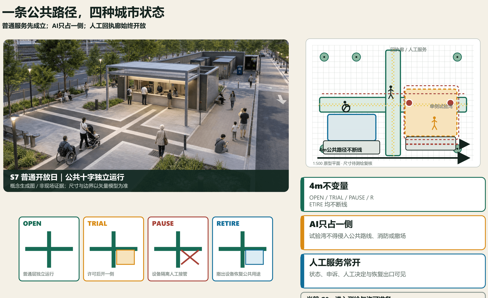
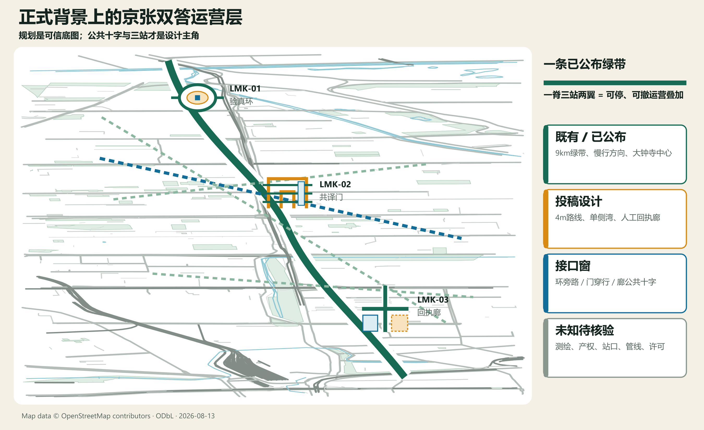
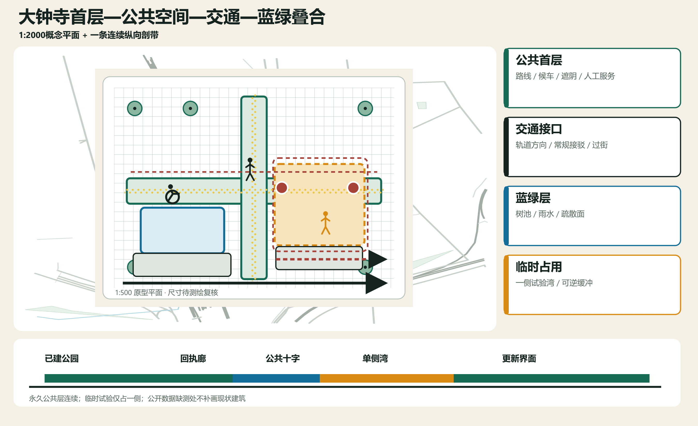
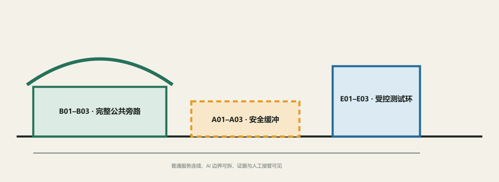
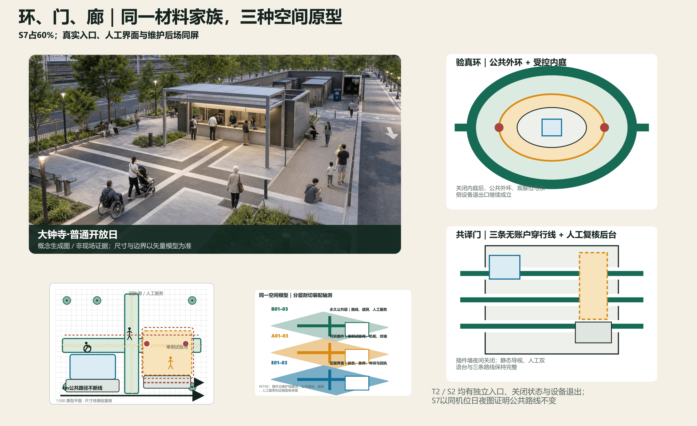
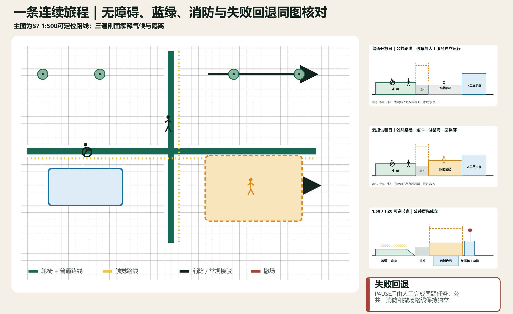
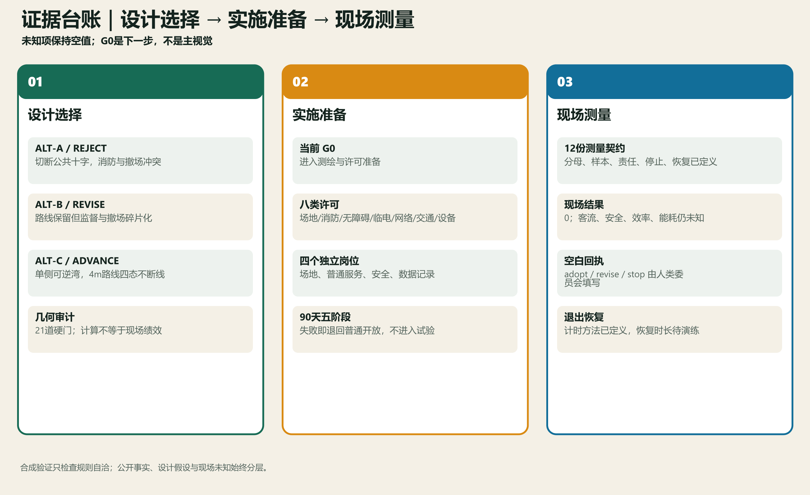

# 京张双答 / JING-ZHANG TWO ANSWERS

> **一条公共路径，四种城市状态。** 在大钟寺中心，一条 **4 米原型公共路径**在 OPEN、TRIAL、PAUSE、RETIRE 四态中始终连续；AI 只占一侧可逆试验湾，人工服务与回执廊始终开放。[data:visual/assets/prototype-model.json] [metric:s7_public_route_prototype_width_m]

普通答案不是备用方案，而是准入前提：常规接驳、轮椅与盲道路线、遮阴候车、静态导视和人工窗口必须先独立成立。AI 只有在同题、同人、同空间条件下证明增量，才可由人类委员会作出 adopt / revise / stop；停止后设备沿独立维护线撤出，公共层不借用试验空间。[data:visual/assets/two-answers.json] [depth:overall_spatial_structure]

## S7 建筑—公共空间原型

大钟寺旗舰样板由五个相互独立但可追踪的空间层组成：①南北与东西两条 4 米公共路线；②东南侧单侧试验湾与可逆缓冲；③西南侧有人值守的回执廊；④树池、雨水花园、遮阴候车和不受占用的疏散面；⑤控制、存储、维护、废弃物和设备撤场后场。1:500 平面、1:200 生活剖面、1:50/1:20 节点与同机位四态轴测使用同一组件 ID。[data:visual/assets/prototype-model.json] [depth:three_key_area_detailed_design]

材料采用可逆概念原型：螺栓连接镀锌钢框架、穿孔金属遮阳屏、干式预制压重基础、透水预制铺装和可更换证据面板。OPEN 仅运行公共层；TRIAL 在许可、岗位和普通基线齐全后限时开放一侧；PAUSE 隔离设备并由人工完成同题任务；RETIRE 拆除插件、复位铺装并保留公共服务与复盘面板。结构、消防、基础、排水与耐久仍待专业复核，价格保持 pending_market_quote。[data:visual/assets/e2-readiness.json]

## 三个备选，一次空间裁决

同一任务、用户、场地和硬门下，ALT-A 中央混合湾因切断公共十字并冲突消防/撤场而 reject_design；ALT-B 分散双湾保住路线但监督与撤场碎片化，返回 revise_design；ALT-C 单侧可逆湾是唯一 advance_design。设计备选状态不等同于现场 adopt / revise / stop，计算只证明几何规则自洽。[data:visual/assets/spatial-decision.json] [metric:spatial_alternative_count]

ALT-C 的概念公共路线、单侧试验范围和可逆缓冲均由同一局部米制审计生成。[metric:alt_c_public_route_length_m] [metric:alt_c_trial_area_sqm] [metric:alt_c_reversible_buffer_area_sqm]

岗位—急停距离沿用同一输入；正式底图、站口、权属或专业条件变化时必须重算，图纸和文字服从结果。[metric:alt_c_max_estop_staff_distance_m]

## 当前实施门：G0 进入测绘与许可准备

当前不是“不可实施”，而是诚实位于 **G0：进入测绘与许可准备**。下一道门要求完成现场测绘、权属和轨道接口核验，关闭场地/消防/无障碍/临电/网络/交通组织/设备安全等许可依赖，落实场地负责人、普通服务、安全和数据记录四个独立岗位，再记录连续 7 个普通运行日。任一条件缺失，AI 试验不启动，但普通开放日仍可独立筹备。[data:visual/assets/e2-readiness.json] [metric:e2_permit_gate_count]

现场客流、安全、效率、满意度、能耗、价格和恢复时长继续为 unknown / not_field_run。12 份测量契约说明“如何验证”，不冒充验证结果。[metric:measurement_contract_count] [metric:field_verification_result_count]

## 正式规划背景与运营叠加

2026 年公开背景明确约 1668.2 公顷街区范围、9 公里京张绿带与“一带一轴、两心多点”，大钟寺是两处中心之一；二期配套工程已完工并形成鱼骨状慢行联系。[source:BEIJING-BLOCK-PLAN-APPROVED-20260812] [source:BEIJING-JZ-PHASE2-COMPLETE-20260714]

这些事实是可信底图，不是方案主角。“一脊三站两翼”是嵌入绿带、对接大钟寺中心与创新发展轴的可停、可撤运营层；六条缝合只对接已建或已公布的慢行方向，不被画成拟建道路。官方 1668.2 公顷范围与本投稿 11.4 平方公里临时可复算几何分开登记，政府报道也不等于本团队踏勘、测绘、产权或工程验收。[data:visual/assets/spatial-atlas.json] [metric:official_planning_area_ha] [metric:submitted_provisional_area_sqm]

## 设计依据与资料清单

京张双答把百年京张 AI 创新带定义为一条**公共基线先行的城市证明线**。永久层先解决连续无障碍、慢行、蓝绿、遮阴休息、静态导视、人工窗口和常规接驳；AI 只以限时、可选、可停、可拆的插件进入；公开证据界面用同一组指标说明普通答案和 AI 答案的差异。技术不再用“是否部署”证明先进，而用“是否值得被城市采用”接受审查。[source:OFFICIAL-ANNOUNCEMENT] [source:AGENT-TASKBOOK]

本轮边界、三处重点区、用地界面、建筑包络和节点位置均为临时边界下的概念建议，不是 official boundary、道路红线、权属或控规结论。正式范围、市政、消防、遗产、现状建筑、现场客流与绩效尚未提供；相应指标保持 unknown，图像均标注概念生成，不用视觉精度冒充证据。[source:BOUNDARY-SOURCE] [source:KEY-AREA-SOURCE] [standard:PROJECT-OFFICIAL-ANNOUNCEMENT]

文化与场地背景只采用官方公开资料：京张铁路遗址公园规划解读和一期、二期建设信息用于理解铁路遗产、连续公园和公共空间目标。[source:JINGZHANG-PLAN-OFFICIAL] [source:JINGZHANG-PHASE1-OFFICIAL] [source:JINGZHANG-PHASE2-OFFICIAL]

北京市政府公开的中关村创新史用于说明“试验—转化—共享”的文化线索；大钟寺轨道背景仅作方向性接口。它们均不证明精确站口、建筑、红线或权属。[source:ZHONGGUANCUN-HISTORY-OFFICIAL] [source:DAZHONGSI-LINE13-CONTEXT]

设计证据明确分为三类：**已知设计**是可复算的几何、数量与文档覆盖；**合成验证**是规则驱动的桌面用例；**现场未知**包括客流、安全表现、效率、满意度、能耗、成本和恢复时长。[depth:existing_conditions_diagnosis]

84 项合成验证记录输入哈希、规则版本、预期/实际状态、责任触发和恢复出口，但不产生机构合作、投资、许可或现场绩效结论。[data:visual/assets/tabletop-results.json] [metric:synthetic_design_verification_case_count] [metric:field_verification_result_count]

## 三层范围工作框架

43.6 平方公里统筹研究范围用于组织跨区域能力；约 11.4 平方公里临时总体设计范围用于建立连续公共基线；约 368.4 公顷三处临时重点区用于一比一原型。三层范围共享同一双答协议与证据链，精度随资料和阶段逐级收敛。[data:geometry/site_boundary.geojson#SITE-001]

研究层回答“能力从哪里来、问题如何交换”，总体层回答“公共基线怎样连续、两翼怎样缝合”，重点区回答“每个场景如何落到平面、剖面和运营”。`site_boundary.geojson` 与 `key_areas.geojson` 只记录临时约束，所有设计 GeoJSON 都标为 `design_proposal`；约 11.4 平方公里和三处数量可作临时复算，正式面积、道路红线、地块与权属仍待官方资料。范围变更时先重算边界、面积和节点归属，再更新图纸与指标，不让概念线反向固化为控制线。[metric:site_area_sqm] [metric:key_area_count]

## 统筹研究范围产业与未来城市研究

五条交换合同把区域协同从泛化连线改成可失败的证据交换：北纬社区提供居民问题与无障碍基线；未来科学城提供研究任务与开放模型能力；怀柔科学城提供仪器和复现条件；经开区提供制造、设备安全和维护接口；京津冀接口承接跨区域问题、算力与知识复用。每条合同都记录问题输入、能力提供、验证场所、证据产品、四类责任角色和失败出口；机构仅为建议角色，不代表合作承诺。[data:visual/assets/spatial-atlas.json]

验证场所分别落在小月河翼、验真环、共译门和回执廊。任一许可、数据权利或普通基线不成立，交换立即停止并退回普通服务；成功与失败均进入公共知识库。

## 总体设计范围城市更新与控规深度城市设计

城市采纳编译器把抽象协议落到三座城市地标、四季运营、五级空间证据链和确定性状态机上。`context-open-map.json` 冻结的 OSM 参照在大钟寺范围只有 1 个建筑要素，因此图面把道路、铁路、水系和公园作为方向性参照，并把建筑缺测区明确画成“公开数据待补”；任何新界面均标记为设计假设，不能被误读为现状建筑或法定总平面。全部开放数据均为 `open_data_context / reference_only`，不进入面积、强度、容量或绩效计算。

三站从 1:5000 城市联系进入 1:2000 重点区总平面，英雄场景再进入 1:500 详图、1:200 剖面；S7 继续进入 1:50 装配节点和分层轴测。全部标为“概念比例，待测绘与官方底图复核”。众智园保留环形测试庭和完整旁路；AI 原点保留无账户穿行大厅；大钟寺被重构为“公共十字 + 东南可逆试验湾 + 西南证据门廊 + 双侧蓝绿边界”。设计尺寸是原型建议，不是现状测量；专业判断以矢量构件、结构化接口和数量公式为准。

43.6 平方公里统筹研究范围用于组织跨区域能力；约 11.4 平方公里临时总体设计范围用于建立连续公共基线；约 368.4 公顷三处临时重点区用于一比一原型。核心结构为“一脊、三站、两翼、十二组双答场景”：公共基线脊串联众智园能力验证站、AI 原点公共转译站和大钟寺城市采用站；中关村科技服务翼提供法务、知识产权、评测、融资与国际服务；小月河场景赋能翼提供居民问题、气候韧性与真实反馈。[data:geometry/site_boundary.geojson#SITE-001] [data:geometry/key_areas.geojson#PROV-KEY-001]

公共基线脊是不断线的步行、自行车、无障碍、蓝绿和人工服务系统；两翼是概念性横向缝合，不是新增道路红线。用地采取四类“界面”而非法定分类：研发学习、遗产公园、产业服务、社区生活；先修接口、首层和公共空间，再在权属与控规明确后讨论建筑强度。[data:geometry/roads.geojson#ROAD-001] [data:geometry/land_use.geojson#LU-001] [depth:overall_spatial_structure]

六条东西缝合联系以 `STITCH-01—06` 固定空间地址：每座证明场各两条，分别把周边街区入口与公共基线脊相接；它们只表达连续步行、无障碍和服务界面的优先方向，不推定道路红线。总体轴测用同一组 `SCN-001—012` 节点连接三站、两翼和公共基线，形成从总图到场景卡可追踪的空间索引。[data:geometry/roads.geojson#STITCH-01] [metric:east_west_stitch_count]

## 核心概念：三层空间构件与双答协议

每个点位只允许三类构件：①永久公共基线——坡道、盲道、静态标牌、树荫、座椅、饮水、人工窗口和常规接驳；②可拆 AI 插件——机器人、传感、端侧机柜、可选终端和低速接驳；③公开证据界面——以非识别、可理解的方式显示运行、暂停、人工接管、指标状态和投诉入口。AI 移除后，普通城市服务必须仍完整。[depth:municipal_new_infrastructure]

三类构件进一步固定为九个可复用 ID：`B01` 连续无障碍路径、`B02` 遮阴座椅饮水、`B03` 静态导视与人工服务；`A01` 低速机器人测试湾、`A02` 端侧算力机柜、`A03` 可选服务终端；`E01` 状态与指标牌、`E02` 人工接管与急停台、`E03` 反馈申诉与退出公告。九个 ID 同时出现在空间图集、重点区平面、场景数据和交互展；每项还登记空间/界面需求、与公共路径的最小隔离、电力/数据/人工/维护接口、开放—试验—暂停—退役四态，以及退役资产去向。[data:visual/assets/spatial-atlas.json] [metric:spatial_component_type_count]

AI 准入同时满足五道门：普通答案独立成立；服务同一任务与用户；不降低无障碍、公平与基本可靠性；数据、能耗、人工时间与生命周期可记录；有明确责任人、停止条件与恢复路径。证据不足时不是“先试再说”，而是保持普通答案并把 AI 标记为未准入。[metric:paired_scenario_count] [metric:measurement_contract_count]

这套“双答协议”既是空间概念，也是可复制的运营机制、治理体系和场景网络：同一协议从测试庭延伸到公共服务、文化、交通与气候空间，但每一处都必须重新通过本地准入门。

空间副命题为“**验真成环、共译成门、回执成廊；规则先编译，现场再证明**”。为保持已经合并版本的对象可追踪性，S7 继续使用稳定的 `V7-D-*` 几何 ID；版本名称不等于对象版本。公共路线、盲道、坡道、过街、路缘、接驳、试验边界、门廊、人工岗位、急停、消防、存储和撤场仍解析到同一 WGS84 证据链。[data:geometry/roads.geojson#V7-D-BASE-EW] [metric:key_area_count]

证据按 `E0 public source → E1 concept design → E2 documented prototype ready → E3 controlled trial pending → E4 civic adoption pending` 五级推进。[metric:evidence_ladder_level_count] S7 当前为 `G0_no_go_pending_survey_and_permits`，T2/S2 为 `E1_concept_design`；另设不占用现场等级的 `T0_synthetic_contract_verified`。E2 不表示测绘、许可、搭建或现场基线完成，E4 必须由人类场景委员会签署 `adopt / revise / stop`。所有页面和交互首屏统一显示 `NOT FIELD-RUN`。[metric:measurement_contract_count] [metric:field_verification_result_count]

### 城市采纳编译器：测量契约、空间裁决与 E2 文件就绪

S7 的 **设计完整 / 试验未准入文件包**由同一套几何生成五级审查尺度，并登记 16 项可复算构件。[data:visual/assets/spatial-atlas.json] [metric:s7_review_scale_count] [metric:s7_prototype_kit_item_count]

文件包登记 8 类许可、4 个采购包和 5 类空白表单；当前 8 类许可全部待办，结论明确为 **G0：进入测绘与许可准备**，不表示测绘、采购、搭建或现场运行已经发生。[metric:e2_permit_gate_count] [metric:e2_procurement_package_count] [metric:e2_printable_form_count]

“编译器”对 `SCN-001—012` 各执行七类用例：普通基线、许可缺失、岗位缺失、公共服务退化、零容忍事件、人工恢复和设备退役。状态机只接受 `OPEN→TRIAL`、`TRIAL→PAUSE`、`PAUSE→OPEN`、`PAUSE→RETIRE`、`RETIRE→OPEN`；非法跃迁、许可/岗位不全、公共路线中断，或把现场未知冒充已知，都会使构建失败。本次脚本实际生成并通过 84/84 项，结果为 `synthetic_design_verification`，不是现场仿真或安全认证。[data:visual/assets/tabletop-results.json] [metric:synthetic_design_verification_case_count]

S7 的普通公共十字和人工服务必须先完成测绘与 7 个连续运行日的基线记录。只有场地、权属、消防、无障碍、临电、网络、交通组织和设备安全八道许可门全部关闭，且场地负责人、普通服务人员、安全负责人和数据记录人员独立在岗，东南侧试验湾才可进入 `TRIAL`。碰撞、缓冲侵入、急停失效、公共路线中断或人工接管失败均触发零容忍停止；计时从停止指令开始，到人工完成同题任务且两条公共路线恢复开放为止。当前恢复时间仍为 `unknown / not_field_run`。

三座地标继续采用不同空间原型：众智园验真环以完整公共旁路包围受控内环；AI 原点共译门以三条无账户路线穿过人工服务与复核后台；大钟寺回执廊以公共十字、单侧试验湾和人工证据门廊构成旗舰样机。三张体验图均为严格对应构件关系的概念生成图，不承担现状、尺度或绩效证明。

## 总体设计：用地更新、慢行蓝绿与公共基线

更新遵循“基线—首层—包络”顺序：0 级先完成路口、坡道、触觉、照明、遮阴、座椅、饮水和人工服务；1 级开放存量首层为评测、转译、公共服务与夜班运维界面；2 级才在专业调查后决定保留、改造或新建。三个建筑 polygon 只是适应性更新包络，不代表现状建筑或拆改结论。[data:geometry/buildings.geojson#BLDG-001] [depth:retain_renovate_demolish]

典型断面把 3.0m 连续无障碍步行、2.5m 自行车、1.8m 遮阴休息、受控插件湾、蓝绿缓冲和遗产轨迹并置。尺寸是概念原型，须由测绘、树木、地下管线、消防和道路工程复核。普通路径永不穿过机器测试湾；可拆机柜使用独立回路和清晰检修边界；雨洪、树荫与休息点不是 AI 绩效的一部分。[data:geometry/green_space.geojson#GREEN-001] [depth:traffic_rail_slow_parking]

## 重点区域详细设计

### 建筑家族：环、门、廊

三座地标共享 **MAT-01–05** 干式材料家族和“公共基线 / AI 插件 / 证据界面”语法，却采用不可混淆的平面和剖面。[data:visual/assets/prototype-model.json]

- **众智园·验真环（T2）**：全天公共旁路围绕受控测试庭；观察廊、安全台、失败公示和东侧设备退出口在 1:500 平面与 1:200 剖面中对位。关闭测试庭后，公共外环和观察廊继续运行。
- **AI 原点·共译门（S2）**：三条无账户穿行线穿过人工双语台、等候界面和复核后台；可关闭插件墙由后勤带维护。夜间关闭插件后，静态导视和人工窗口仍成立。
- **大钟寺·回执廊（S7）**：公共十字、单侧试验湾、有人值守门廊、蓝绿边界与维护后场组成完整建筑—地面系统；公共路线、消防和撤场互不占用。

### 大钟寺旗舰样板：五级尺度

**1:5000 / 1:2000** 只判断轨道、公园、道路和四象限方向性接口；公开快照在大钟寺仅含一个建筑要素，缺测处统一标为“适配界面 / 待调查带”，不补画虚构建筑。[data:visual/assets/context-open-map.json] [source:OPENSTREETMAP-CONTEXT-20260813]

**1:500 平面**直接绘出路缘、四处坡道、两条触觉路线、透水铺装、树池、雨水花园、候车与遮阴、回执廊、双急停、控制亭、设备接口、消防线和独立撤场线。门廊后侧 2.4 米维护带连接控制、存储、维护和废弃物空间。[data:visual/assets/prototype-model.json]

**1:200 两道剖面**分别穿过公共路径—缓冲—试验湾和回执廊—公共十字—蓝绿边界，验证净高、遮阴、视线、雨水边缘和人机分离的相对关系；它们不是施工图。[metric:architectural_section_count]

**1:50 / 1:20 节点**记录三类可逆连接：螺栓钢框架与压重基础、触觉路线外侧的可拆隔离、可更换证据牌与临电接口、齐平透水路缘与雨水花园溢流。结构尺寸、防火等级、抗风、排水能力和耐久年限均待专业计算。[metric:architectural_detail_count]

### 装配、维护与四态

- **OPEN**：普通接驳、公共十字、遮阴候车和人工门廊独立运行。
- **TRIAL**：八类许可、四岗位和七日普通基线齐全后，仅开启单侧试验湾。
- **PAUSE**：双急停切断设备，安全负责人接管，公众路线保持不变。
- **RETIRE**：拆除插件和隔离，铺装抬起复位，设备沿东侧撤场，证据面板保留复盘。

90 天实施依次对应测绘核验、永久公共层、基线记录、限时插件和撤场复核；任何阶段的许可、岗位或普通服务失败都阻止进入下一阶段。数量可复算，单价与总价保持 **pending_market_quote**。[data:visual/assets/e2-readiness.json]

## AI 创新生态、人才画像与 AI+ 场景

三项英雄场景承担专业审查深度，九项复制场景承担协议外推广度。12/12 均保留稳定 ID、地图节点、组件、责任人、共同指标、停止事件和恢复状态，但只有 T2、S2、S7 在本轮占用完整总平面—详图—剖面—运营—回执篇幅。这一取舍避免“十二项平均用力、每项都不够深”。

六类压力测试画像是轮椅使用者、视障行人、无智能手机老人、居民及照护者、国际研究者及创业团队、夜班运营维护人员。画像用于检查路径和责任，不建立持续可识别个人档案。T1—T3 是产业测试；S1—S9 是公共场景，场景 ID 与 GeoJSON、交互展和图纸一一对应。[data:geometry/constraints.geojson#SCN-001]

| ID | 同题场景 | 空间 | 普通答案 | AI 可选增强 | 停止条件 |
| --- | --- | --- | --- | --- | --- |
| T1 | 开放模型与数据来源复现 | 众智园能力验证庭·复现室 | 人工登记模型版本、数据许可和复现步骤，提供离线检查清单。 | 在隔离环境运行可选复现助手，生成差异报告但不替代专业签字。 | 发现无权数据、无法解释的外联或复现环境越界时立即停止。 |
| T2 | 机器人—行人—无障碍受控测试 | 众智园能力验证庭·围合测试环 | 以人工安全员、实体隔离、步行优先路线和手动急停完成小规模测试。 | 可选低速机器人在限定时窗和限定速度内运行，实时记录近失误与人工接管。 | 任何人进入安全缓冲区、连续两次近失误或急停失效即停止。 |
| T3 | 端侧算力能耗、噪声与断网降级测试 | 众智园能力验证庭·可拆机柜带 | 普通服务以纸质流程、人工台账和独立照明运行。 | 可拆端侧机柜仅处理必要任务，并在断网时自动降级到人工流程。 | 超过许可噪声/热环境、异常外传或降级失败时停止。 |
| S1 | 企业服务人工窗口与 AI 辅助分诊 | AI 原点公共转译厅·企业窗口 | 人工窗口用纸质清单说明法务、知识产权、评测和融资路径。 | 可选分诊助手按公开目录建议下一站，不生成正式法律或投资意见。 | 高风险事项被自动决定、连续误分诊或人工窗口不可用时停止 AI。 |
| S2 | 国际人才抵达与公共服务导航 | AI 原点公共转译厅·抵达台 | 双语人工接待、纸质地图、静态导视和电话预约提供完整抵达服务。 | 可选多语导航助手解释公开办事目录，并把不确定问题交给人工。 | 出现身份误用、翻译改变权利义务或错误无法及时纠正时停止。 |
| S3 | 开源知识匹配与社区问题工作坊 | AI 原点公共转译厅·共创桌 | 主持人用问题卡、公开目录和面对面工作坊匹配社区问题与专业资源。 | 可选助手检索已授权开源知识，提出候选而不替代社区优先级判断。 | 抓取无许可内容、生成不可追溯建议或压过社区选择时停止。 |
| S4 | 京张文化人工导览与 AI 可选讲解 | 公共基线脊·铁路记忆节点 | 人工讲解、触摸模型、静态图文和纸质路线构成完整文化服务。 | 可选讲解按已核验史料提供多语版本，并显示来源与不确定性。 | 出现无来源断言、错误未纠正或影响遗产安全时停止。 |
| S5 | 静态无障碍导视与动态辅助导航 | 公共基线脊·连续无障碍路径 | 连续坡道、盲道、触觉节点、高对比静态导视和人工问路点独立成立。 | 可选动态导航只在用户主动选择时给出障碍提醒，不持续追踪。 | 导航引向障碍、无障碍路径中断或退出后仍留存轨迹时停止。 |
| S6 | 遮阴、休息和极端天气服务提示 | 小月河场景赋能翼·气候休息点 | 树荫、雨棚、座椅、饮水、公告牌和人工巡查构成常态服务。 | 可选端侧提示结合公开预警和现场非识别传感，建议开放/关闭休息点。 | 预警来源中断、现场值异常或提示与人工判断冲突时转人工并停止。 |
| S7 | 常规轨道接驳与低速辅助接驳 | 大钟寺城市采用场·接驳湾 | 常规公交、轨道步行连接、出租车和人工引导始终可用。 | 可选低速接驳只在限定湾、限定时窗运行，行人优先。 | 发生碰撞/近失误、定位失效、人工接管超时或投诉集中时停止。 |
| S8 | 人工公共服务台与 AI 信息导航 | 大钟寺城市采用场·公共服务台 | 有人员、电话、纸质目录和清晰排队规则的公共服务台独立运行。 | 可选信息助手解释公开办事信息并在不确定时立即转人工。 | 人工不可用、错误影响办事权利或未授权采集身份信息时停止。 |
| S9 | 常规活动组织与聚合客流辅助 | 大钟寺城市采用场·开放活动面 | 人工售检、容量牌、实体排队、疏散线和广播完成活动组织。 | 可选聚合计数只辅助调整入口，不做人脸识别和个体轨迹。 | 计数漂移、容量接近上限、出口受阻或任何安全事件时停止入场/AI。 |

## 用地、建筑规模与拆改留方案

用地采用研发学习、遗产公园、产业服务与社区生活四类概念界面；不作法定用地调整。建筑规模、容积率、高度和拆改留结论均因权属、控规和现状测绘缺失而保持 unknown。三个建筑 polygon 只测试公共首层、可拆机柜和可变上部空间的关系。[data:geometry/land_use.geojson#LU-001]

四类界面沿公共基线组织首层开放、遗产连续、产业服务和社区日常，不把矩形边界解释为地块。三处建筑包络分别容纳能力验证、公共转译与城市采用：普通服务位于可直接到达的首层，AI 机柜靠检修边界，证据面朝公共界面。`building_footprint_area_sqm`、FAR、高度、容量和拆改量全部为 unknown；Phase 0 必须补齐现状建筑普查、结构安全、产权、消防、日照、风貌与控规后，才可形成保留/改造/拆除清单和强度校核。[metric:building_footprint_area_sqm] [metric:floor_area_ratio]

## 交通、轨道、市政与公共服务设施

轨道和公交保持常规服务优先；公共基线脊补足步行、自行车、无障碍与人工引导。端侧算力采用独立回路、低功耗、断网降级和整机可拆；供配电、通信、消防、环卫、雨洪与应急必须在正式市政调查后深化。[data:geometry/roads.geojson#ROAD-001]

道路图层只表达一条南北连续基线与两条概念性横向缝合，不新增法定道路中心线。站点接驳遵循“常规轨道/公交/出租/步行先可用，低速 AI 后受控接入”，机器人测试湾与无障碍通路物理分隔。公共服务设施按静态导视、电话/纸质入口、人工窗口、可选终端四级布置。现场尚缺轨道出入口、道路红线、过街相位、停车供需、地下管线、供电容量、通信和消防条件，故运输能力、停车数、功率和工程投资不作数值承诺；Phase 0 由交通和市政专业团队测绘并建立基线。[metric:task_completion_rate]

## 蓝绿空间、公共空间与城市风貌

蓝绿空间保留成熟树木、铁路记忆和连续开敞界面，以遮阴、休息、饮水、透水和夜间安全形成普通答案。风貌以遗产石墨、公共绿色、候选琥珀和证据蓝识别三层构件；AI 设备不占据视觉主导，撤除后公共空间仍完整。[data:geometry/green_space.geojson#GREEN-001]

### 三座回执地标、文化里程与国际传播

文化里程以公开资料中的铁轨、龙门吊、窄轨、汽笛和铁轨花园建立五类构件目录。每项遵循“历史事实—静态双语/触觉/无手机讲解—AI可选增强—公众纠错—人工复核回执”；AI不得改写来源不明的历史，也不虚构资源精确位置。[data:visual/assets/spatial-atlas.json]

验真环、共译门、回执廊共享遗产石墨、公共绿色、AI琥珀和证据蓝，但不共享轮廓。荣誉界面只登记任务、证据等级、决定、复核日期和贡献者，不设未经证明的技术排行榜。

### 产业生态、人才与未来城市研究

产业闭环是“问题登记—普通基线—能力复现—受控原型—同题比较—人类采用—年度复盘”。众智园验证模型、机器人和端侧算力；AI 原点把能力转译为企业、人才、社区可使用的服务；大钟寺验证城市采用与长期维护。中关村服务翼补足法律、知识产权、评测、融资和国际接口，小月河场景翼以居民问题与气候服务检验日常价值。[source:AGENT-TASKBOOK]

人才计划不以一次活动代替运营：设置公开问题主理人、无障碍观察员、模型/数据审计员、现场安全员、夜班维护员、双语服务员和场景产品经理七类岗位；高校课程、企业中试和社区工作坊共享一套可公开问题单。成果归属、许可、隐私和退出责任在入场前写清，未确认时不进入现场。

## 一带全球 AI 创新活动体系与长期运营设计

“普通开放日”先运行公共路径、无障碍、常规接驳、遮阴候车、人工服务和静态导视，再核验开发者许可、独立岗位与普通基线。上午开放检查与基线记录；中午只做准入核验；下午公开状态、失败和人工干预；闭场后插件停机、空间复位、人工复核并归档。任何缺项都保持 OPEN，不进入 TRIAL。[data:visual/assets/two-answers.json]

城市采纳年每季产生一种可复用知识资产：春季无障碍基线审计、夏季能力复现记录、秋季公众试用回执、冬季资产与退出复盘。公开报道的日常使用仅作为背景，不是本方案已完成公众参与或现场绩效。[source:BEIJING-JZ-PUBLIC-USE-20260730]

## 更新项目清单、实施政策与分期计划

| 项目 | 主责概念主体 | 协作主体 | 前置许可与启动门 | 资源级别 | 停止与退出 |
| --- | --- | --- | --- | --- | --- |
| 公共基线脊 | 公园/公共空间运营方 | 交通、街道、无障碍组织、遗产专业团队 | 官方边界、权属、树木、管线、消防、无障碍审计 | M：工程与长期养护 | 通行不连续即不开放；普通设施作为长期资产 |
| 能力验证庭 | 独立测试运营方 | 企业、高校、安全与数据专业人员 | 测试边界、保险、急停、数据清单、撤场金 | S：可拆试验设施与班次 | 安全/数据/降级失败即 stop；设备返还提供方 |
| 公共转译厅 | 公共服务运营方 | 园区、社区、专业服务与国际服务 | 人工窗口先运行、知识库审查、无账户入口 | M：首层改造与人员 | 权利影响错误或人工缺岗即停 AI；空间继续服务 |
| 城市采用场 | 场地与交通运营方 | 活动、安全、维护和社区代表 | 常规接驳、疏散、无障碍、时窗和投诉机制 | M：公共空间与可拆插件 | 近失误/容量/接管异常即 stop；湾区恢复普通用途 |
| 公开证据与委员会 | 独立场景委员会秘书处 | 居民、无障碍代表、专业人员、运营方 | 指标定义、利益冲突披露、会议记录与申诉 | S：数据与公共沟通 | 证据不可复核则不 adopt；保留可审计档案 |

主体名称均为职责建议，不表示已获机构授权。S7 的 16 项原型包提供设计数量和计算公式，单价、总价与采购方式等待正式询价；其余项目仍只分 S/M/L 复杂度。[depth:renewal_project_list] [metric:field_verification_result_count]

T2、S2、S7 共用七角色 RACI；S7 进一步把角色落到证据门廊、试验湾、安全缓冲、双急停、事件台账和存储撤场线。许可前置覆盖场地、消防、无障碍、临电、网络、交通组织与设备安全；责任不全或许可未完成只能保持 `OPEN`。原型包实行每日开场检查、试验前联锁、月度照明检查、资产盘点和撤场验收。[data:visual/assets/two-answers.json]

近期 0—6 个月先以普通服务和无障碍审计形成试点基线，中期才接入 AI；运营主体、协作团队与居民代表共同建立指标、监测和评估方法，任何试点未达到启动门都不得进入下一阶段。

S7 另设 90 天最小试点：0—15 天核验测绘、权属、站口、消防、管线、无障碍和交通；16—30 天只搭建公共路线、候车、遮阴、人工服务和回执廊；31—45 天建立普通服务基线并完成 7 个连续运行日；46—75 天在许可齐全、四类最低岗位到位后限时试验；76—90 天执行停止演练、撤场恢复、公众复核并签署 `adopt / revise / stop`。任一阶段的失败门触发暂停或返回前一阶段。[data:visual/assets/two-answers.json] [metric:s7_pilot_phase_count]

### 治理与退出

0—6 个月完成资料补齐、现场踏勘、权属/控规/市政核验、无障碍审计、普通服务台账、指标定义和责任人；6—12 个月只建设三处一比一普通答案原型；12—24 个月在受控边界接入可拆 AI，同题、同用户、同指标比较；24—36 个月按 `adopt`、`revise`、`stop` 处理并年度公开复盘。任何阶段都可回到普通答案，不把沉没成本作为继续理由。[data:geometry/phasing.geojson#PHASE-000]

四阶段分别设置“进入—输出—失败”门：Phase 0 以资料、许可路线和无障碍审计齐备为进入下一阶段条件；Phase 1 输出可独立完成任务的普通服务及 E2 基线，基线不完整即留在本阶段；Phase 2 只在零容忍安全条件、RACI 到岗和可计量接口全部成立时进入，任何安全/权利事件立即 `PAUSE`；Phase 3 仅接受可复核证据，证据质量不足则 `revise` 或 `stop`，不得用体验图或模型自评分替代现场结果。

人类场景委员会由场地运营、无障碍/社区代表、领域专业人员、数据与安全人员组成。技术提供方披露利益关系但不拥有最终票。每个季度复核事件、投诉、人工工时、能耗、生命周期和无账户覆盖；年度报告只发布达到数据质量门槛的聚合结果。严重安全或权利事件由现场负责人即时 stop，无需等待季度会议。

## 指标体系、面积复算与合规矩阵

`known design` 只包括可复算的文档与设计覆盖：12 个双答场景、3 座回执地标、4 个季节程序、16 项 S7 构件和空间对象；它不代表现场成效。[metric:paired_scenario_count] [metric:key_area_count] 

`synthetic verification` 是 12×7=84 项规则演练，84/84 通过只说明准入、状态跃迁、停止、恢复和退役契约在给定输入下自洽；`field unknown` 包括服务完成率、安全表现、满意度、能耗、单价、总价、无障碍失败率和恢复时长，交互展显示“待现场基线 / 待正式询价”。[metric:synthetic_design_verification_case_count] [metric:measurement_contract_count] [metric:field_verification_result_count]

证据链为“任务问题 → 空间节点 → 重点区总平面 → 场景详图 → 典型剖面 → 普通/AI 两条路径 → 90 天试点 → 四季复核 → 最小数据 → 人工责任 → 共同指标 → 准入/停止 → 城市采纳回执 → adopt/revise/stop → 退出还场 → 公共知识归档”。回执和台账当前统一标记 `not_field_run / pending_field_evidence`，不把设计完成度误写成运行效果。公开界面不展示个人轨迹或未经核验的排名；模型输出不是采纳决定；`score_submission.py` 只作内部建议检查，不冒充正式评分。

## 风险、版权与合规说明

普通服务先行保障居民、老人、残障人士、青年、学生、企业、游客与夜班维护者不因设备故障、账户门槛或数字能力而被排除。无账户入口、纸质/静态导视、人工窗口和常规接驳属于永久基线；AI 是可拒绝的附加路径。最小数据、端侧/聚合优先、无持续身份画像、人工纠错和可申诉记录共同限制技术扩张。

主要风险为临时边界误读、无障碍回退、机器人近失误、错误答复、数据漂移、能耗和电子废弃、运营缺岗与公众不信任。对应控制写入空间隔离、准入门、现场急停、数据清单、设备资产去向、班次和公开复盘。概念图、图纸和建筑包络不替代测绘、工程、法定规划或审批；版权使用见 `report/copyright_statement.md`。[depth:risk_missing_data]

## 参考资料

[source:SOURCE-REGISTRY] [source:OFFICIAL-ANNOUNCEMENT] [source:AGENT-TASKBOOK]

- `OFFICIAL-ANNOUNCEMENT`：公开任务公告与范围语境。
- `AGENT-TASKBOOK`：六项 Agent 任务、边界条款与协作要求。
- `BOUNDARY-SOURCE` / `KEY-AREA-SOURCE`：仅供概念生成的临时几何。
- `CASE-ONE-NORTH`、`CASE-BARCELONA`、`CASE-PARIS-SACLAY`、`CASE-BRAINPORT`、`CASE-HELSINKI`、`CASE-WOVEN`、`CASE-QUAYSIDE`：官方/第一手机制案例。
- `REGION-BEIWEI`、`REGION-FUTURE-SCIENCE-CITY`、`REGION-HUAIROU`、`REGION-ETOWN`、`REGION-CAPITAL-CIRCLE`：区域接口背景。
- `SOURCE-REGISTRY` 与 `sources.json`：完整发布者、日期、URL、用途、许可边界与限制索引。
