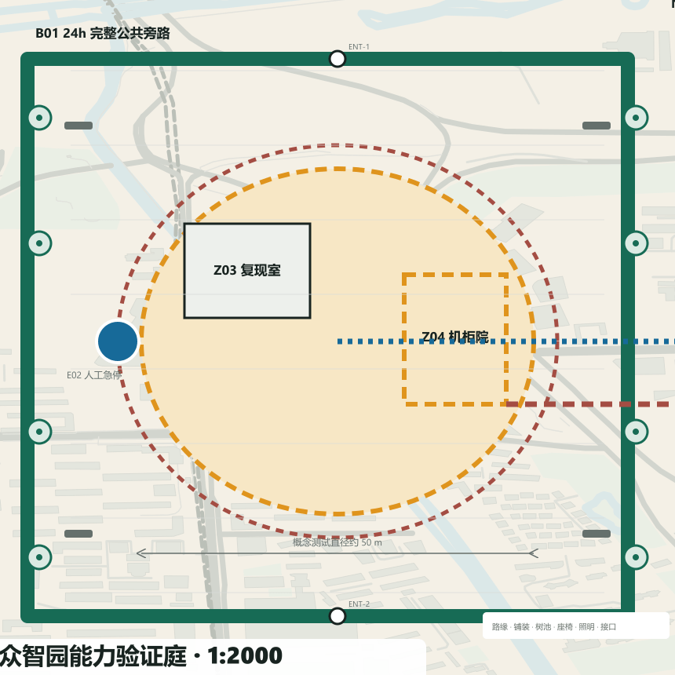
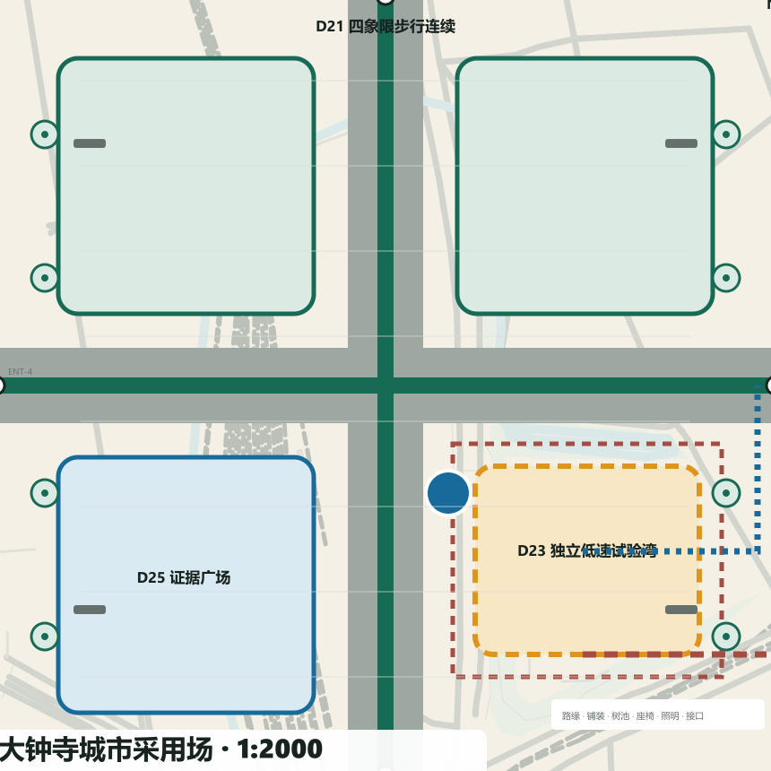

# 京张双答 / JING-ZHANG TWO ANSWERS

> **城市采纳回执 / Civic Adoption Receipt：每个城市问题，先让普通答案独立成立，再让 AI 在同题、同人、同空间中公开证明增量。** 本方案不是提交两套规划；最终只允许 `adopt`、`revise`、`stop`，并由人类场景委员会决定。

V4 不再平均展示 12 个场景，而以 T2、S2、S7 三个“英雄场景”分别证明人机安全、公共服务和交通采用；其余九项保留为可复制、可追踪的协议索引。每个英雄场景均建立 1:5000 城市联系、1:2000 重点区总平面、1:500 场景详图、1:200 典型剖面，以及运营时窗、人工岗位、应急/撤场路线和一张尚待现场证据填写的城市采纳回执。[data:visual/assets/two-answers.json] [data:visual/assets/spatial-atlas.json]

## 设计依据与资料清单

京张双答把百年京张 AI 创新带定义为一条**公共基线先行的城市证明线**。永久层先解决连续无障碍、慢行、蓝绿、遮阴休息、静态导视、人工窗口和常规接驳；AI 只以限时、可选、可停、可拆的插件进入；公开证据界面用同一组指标说明普通答案和 AI 答案的差异。技术不再用“是否部署”证明先进，而用“是否值得被城市采用”接受审查。[source:OFFICIAL-ANNOUNCEMENT] [source:AGENT-TASKBOOK]

本轮边界、三处重点区、用地界面、建筑包络和节点位置均为临时边界下的概念建议，不是 official boundary、道路红线、权属或控规结论。正式范围、市政、消防、遗产、现状建筑、现场客流与绩效尚未提供；相应指标保持 unknown，图像均标注概念生成，不用视觉精度冒充证据。[source:BOUNDARY-SOURCE] [source:KEY-AREA-SOURCE] [standard:PROJECT-OFFICIAL-ANNOUNCEMENT]

设计证据分五层：`proposal.md` 解释判断；`geometry/*.geojson` 保存空间对象；`visual/assets/two-answers.json` 保存 12 组对照契约；`metrics.json` 区分 known/unknown；三套矩阵、图纸、交互展和 `self_check.json` 形成交叉索引。公开资料研究用于机制转译，不产生机构合作、投资或实施承诺。[depth:existing_conditions_diagnosis]

## 三层范围工作框架

43.6 平方公里统筹研究范围用于组织跨区域能力；约 11.4 平方公里临时总体设计范围用于建立连续公共基线；约 368.4 公顷三处临时重点区用于一比一原型。三层范围共享同一双答协议与证据链，精度随资料和阶段逐级收敛。[data:geometry/site_boundary.geojson#SITE-001]

研究层回答“能力从哪里来、问题如何交换”，总体层回答“公共基线怎样连续、两翼怎样缝合”，重点区回答“每个场景如何落到平面、剖面和运营”。`site_boundary.geojson` 与 `key_areas.geojson` 只记录临时约束，所有设计 GeoJSON 都标为 `design_proposal`；约 11.4 平方公里和三处数量可作临时复算，正式面积、道路红线、地块与权属仍待官方资料。范围变更时先重算边界、面积和节点归属，再更新图纸与指标，不让概念线反向固化为控制线。[metric:site_area_sqm] [metric:key_area_count]

## 统筹研究范围产业与未来城市研究

区域协同采用“问题—证据—能力”交换，而非把所有设施搬进基地：北纬社区连接个体创业与校友服务；未来科学城连接场景需求与央企能力；怀柔科学城连接基础研究与仪器。[source:REGION-BEIWEI] [source:REGION-FUTURE-SCIENCE-CITY] [source:REGION-HUAIROU]

经开区连接工程中试、制造与场景证据；京津冀连接设施、算力和产业转化。每条接口都要记录问题所有者、数据边界、接收证据和人工责任，未签协议前仅为概念协作线。[source:REGION-ETOWN] [source:REGION-CAPITAL-CIRCLE]

七个国际案例各只转译一种机制：one-north 的长期运营与共享创新服务；22@Barcelona 的知识区与存量更新；Paris-Saclay 的规划/环境情景决策。[source:CASE-ONE-NORTH] [source:CASE-BARCELONA] [source:CASE-PARIS-SACLAY]

Brainport 提供共享实验和区域协作，Helsinki AI Register 提供公开登记与反馈，Woven City 提供受控实景测试，Toronto Quayside 提供公共空间与分期公共利益条款。这些机制只用于提问，不用于证明北京的空间红线或许可条件。[source:CASE-BRAINPORT] [source:CASE-HELSINKI] [source:CASE-WOVEN]

Quayside 的协议机制另作开发责任对照，不引用其空间形态。[source:CASE-QUAYSIDE]

## 总体设计范围城市更新与控规深度城市设计

V4 将抽象协议落到公开城市肌理和四级图纸证据链上：`visual/assets/context-open-map.json` 冻结了 2026-08-13 的 OpenStreetMap 道路、铁路、水系、公园及可取得的局部建筑要素，只以低对比方式帮助判断城市接口；全部要素均为 `open_data_context / reference_only`，不进入面积、强度、容量或绩效计算。图面署名为“Map data © OpenStreetMap contributors，ODbL”。

三站从 1:5000 城市联系进入 1:2000 重点区总平面，英雄场景再进入 1:500 详图和 1:200 剖面；全部标为“概念比例，待测绘与官方底图复核”。众智园通过 Z01–Z07 建立完整公共旁路、围合测试环、复现室、机柜院、安全缓冲、急停视线与撤场通道；AI 原点通过 A11–A16 建立三条无门槛路径、人工服务台、双语抵达、共创桌、可关闭插件墙与复核后台；大钟寺通过 D21–D26 建立四象限步行、常规接驳前场、独立限时湾、疏散面、证据广场与恢复路径。设计尺寸是原型建议，不是现状测量；体验图只负责空间感知，专业判断以矢量构件和结构化接口为准。

43.6 平方公里统筹研究范围用于组织跨区域能力；约 11.4 平方公里临时总体设计范围用于建立连续公共基线；约 368.4 公顷三处临时重点区用于一比一原型。核心结构为“一脊、三站、两翼、十二组双答场景”：公共基线脊串联众智园能力验证站、AI 原点公共转译站和大钟寺城市采用站；中关村科技服务翼提供法务、知识产权、评测、融资与国际服务；小月河场景赋能翼提供居民问题、气候韧性与真实反馈。[data:geometry/site_boundary.geojson#SITE-001] [data:geometry/key_areas.geojson#PROV-KEY-001]

公共基线脊是不断线的步行、自行车、无障碍、蓝绿和人工服务系统；两翼是概念性横向缝合，不是新增道路红线。用地采取四类“界面”而非法定分类：研发学习、遗产公园、产业服务、社区生活；先修接口、首层和公共空间，再在权属与控规明确后讨论建筑强度。[data:geometry/roads.geojson#ROAD-001] [data:geometry/land_use.geojson#LU-001] [depth:overall_spatial_structure]

六条东西缝合联系以 `STITCH-01—06` 固定空间地址：每座证明场各两条，分别把周边街区入口与公共基线脊相接；它们只表达连续步行、无障碍和服务界面的优先方向，不推定道路红线。总体轴测用同一组 `SCN-001—012` 节点连接三站、两翼和公共基线，形成从总图到场景卡可追踪的空间索引。[data:geometry/roads.geojson#STITCH-01] [metric:east_west_stitch_count]

## 核心概念：三层空间构件与双答协议

每个点位只允许三类构件：①永久公共基线——坡道、盲道、静态标牌、树荫、座椅、饮水、人工窗口和常规接驳；②可拆 AI 插件——机器人、传感、端侧机柜、可选终端和低速接驳；③公开证据界面——以非识别、可理解的方式显示运行、暂停、人工接管、指标状态和投诉入口。AI 移除后，普通城市服务必须仍完整。[depth:municipal_new_infrastructure]

三类构件进一步固定为九个可复用 ID：`B01` 连续无障碍路径、`B02` 遮阴座椅饮水、`B03` 静态导视与人工服务；`A01` 低速机器人测试湾、`A02` 端侧算力机柜、`A03` 可选服务终端；`E01` 状态与指标牌、`E02` 人工接管与急停台、`E03` 反馈申诉与退出公告。九个 ID 同时出现在空间图集、重点区平面、场景数据和交互展；每项还登记空间/界面需求、与公共路径的最小隔离、电力/数据/人工/维护接口、开放—试验—暂停—退役四态，以及退役资产去向。[data:visual/assets/spatial-atlas.json] [metric:spatial_component_type_count]

AI 准入同时满足五道门：普通答案独立成立；服务同一任务与用户；不降低无障碍、公平与基本可靠性；数据、能耗、人工时间与生命周期可记录；有明确责任人、停止条件与恢复路径。证据不足时不是“先试再说”，而是保持普通答案并把 AI 标记为未准入。[metric:ordinary_baseline_coverage_count] [metric:stop_condition_coverage_count]

这套“双答协议”既是空间概念，也是可复制的运营机制、治理体系和场景网络：同一协议从测试庭延伸到公共服务、文化、交通与气候空间，但每一处都必须重新通过本地准入门。

V5 将副命题固定为“**把回执画进城市：每一次 AI 试验，都必须保留一条不被牺牲的公共路径**”。回执不再是图纸旁边的表格：`B01` 公共路径、AI 试验边界、`E02` 人工接管岗位、应急线和撤场线均以稳定 `V5-*` ID 写入 WGS84 概念几何，出版时才投影到局部米制画布。这样，任一采纳决定都能反向追踪到实际空间对象，而不是只追踪到文字承诺。[data:geometry/roads.geojson#V5-Z-BYPASS] [metric:traceable_design_geometry_count]

证据按 `E0 public source → E1 concept design → E2 baseline prototype pending → E3 controlled trial pending → E4 civic adoption pending` 五级推进。当前方案只完成 E0/E1；E2 以前不设成效百分比，E3 以前不得声称 AI 增量成立，E4 必须由人类场景委员会签署 `adopt / revise / stop`。所有页面和交互首屏统一显示 `NOT FIELD-RUN`。[metric:evidence_ladder_level_count] [metric:field_performance_status]

## 总体设计：用地更新、慢行蓝绿与公共基线

更新遵循“基线—首层—包络”顺序：0 级先完成路口、坡道、触觉、照明、遮阴、座椅、饮水和人工服务；1 级开放存量首层为评测、转译、公共服务与夜班运维界面；2 级才在专业调查后决定保留、改造或新建。三个建筑 polygon 只是适应性更新包络，不代表现状建筑或拆改结论。[data:geometry/buildings.geojson#BLDG-001] [depth:retain_renovate_demolish]

典型断面把 3.0m 连续无障碍步行、2.5m 自行车、1.8m 遮阴休息、受控插件湾、蓝绿缓冲和遗产轨迹并置。尺寸是概念原型，须由测绘、树木、地下管线、消防和道路工程复核。普通路径永不穿过机器测试湾；可拆机柜使用独立回路和清晰检修边界；雨洪、树荫与休息点不是 AI 绩效的一部分。[data:geometry/green_space.geojson#GREEN-001] [depth:traffic_rail_slow_parking]

## 重点区域详细设计

**众智园能力验证庭**以“围合测试环 + 完整旁路 + 人工安全台 + 可拆机柜带”组织 T1—T3。机器人不进入连续公共基线，评测结果分公开/受限层，端侧设备先做断网和降级演练。运营顺序为登记—准入—隔离测试—公开摘要—人工决定—撤场。[data:geometry/public_space.geojson#PUBLIC-001]

英雄场景 T2 把 B01 公共旁路、A01 4.0 m 受控环、1.5 m 建议安全缓冲、E02 急停视线、两处人工岗位和设备撤场通道画在同一张 1:500 详图与 1:200 剖面上。上述尺寸只代表待复核的原型设计建议；任何人进入缓冲区、连续两次近失误或急停失效均是零容忍停止事件。[data:visual/assets/two-answers.json#SCN-002]

**AI 原点公共转译厅**以“开放前场 + 人工窗口 + 共创桌 + 可关闭插件墙”组织 S1—S3。企业、人才、社区使用同一排队和人工接管规则；公共首层不要求账户或智能手机；高风险事项只做导航和转介，不自动作出专业决定。[data:geometry/public_space.geojson#PUBLIC-002]

英雄场景 S2 将三条无门槛穿行线、双语人工抵达台、可关闭服务终端、专业复核后台和最近人工升级路径叠合；AI 关闭时纸质地图、静态导视、电话预约和人工接待仍完成同一抵达任务。[data:visual/assets/two-answers.json#SCN-005]

**大钟寺城市采用场**以“常规接驳 + 开放活动面 + 有界低速湾 + 公共证据带”组织 S7—S9。AI 只进入明确时窗与边界，活动总控和交通运营主管都有停运权；撤场后恢复为无障碍上下客和常规活动空间。[data:geometry/public_space.geojson#PUBLIC-003]

英雄场景 S7 将四象限步行联系、常规接驳前场、独立低速试验湾、疏散面、人工接管位和恢复普通上下客的撤场线并置；试验不得挤占唯一无障碍路线或常规交通容量。[data:visual/assets/two-answers.json#SCN-010]

三处原型故意不共享同一平面母题：众智园以环形隔离和旁路解决人机安全；AI 原点以三条无门槛穿行线把服务嵌入公共大厅；大钟寺以四象限步行联系和独立时限湾保障常规交通优先。每处均把普通基线、AI 插件和证据界面落实为相互可见但不相互挟持的位置关系。[metric:station_spatial_prototype_count]

三处英雄场景采用同一套四级审查尺度：1:5000 城市联系、1:2000 重点区概念总平面、1:500 组件与界面详图、1:200 典型剖面；比例均为设计原型建议，待测绘与官方底图复核。详图补充相邻建筑界面、出入口、路缘、铺装、树池、座椅、围挡、照明、临电/数据接口、人工岗位、消防与撤场线；运营轴测以 `OPEN → TRIAL → PAUSE → RETIRE` 表达空间如何切换并恢复普通用途。[data:visual/assets/spatial-atlas.json] [metric:hero_operating_state_count]

## AI 创新生态、人才画像与 AI+ 场景

三项英雄场景承担专业审查深度，九项复制场景承担协议外推广度。12/12 均保留稳定 ID、地图节点、组件、责任人、共同指标、停止事件和恢复状态，但只有 T2、S2、S7 在本轮占用完整总平面—详图—剖面—运营—回执篇幅。这一取舍避免“十二项平均用力、每项都不够深”。

六类压力测试画像是轮椅使用者、视障行人、无智能手机老人、居民及照护者、国际研究者及创业团队、夜班运营维护人员。画像用于检查路径和责任，不建立持续可识别个人档案。T1—T3 是产业测试；S1—S9 是公共场景，场景 ID 与 GeoJSON、交互展和图纸一一对应。[data:geometry/constraints.geojson#SCN-001]

| ID | 同题场景 | 空间 | 普通答案 | AI 可选增强 | 停止条件 |
| --- | --- | --- | --- | --- | --- |
| T1 | 开放模型与数据来源复现 | 众智园能力验证庭·复现室 | 人工登记模型版本、数据许可和复现步骤，提供离线检查清单。 | 在隔离环境运行可选复现助手，生成差异报告但不替代专业签字。 | 发现无权数据、无法解释的外联或复现环境越界时立即停止。 |
| T2 | 机器人—行人—无障碍受控测试 | 众智园能力验证庭·围合测试环 | 以人工安全员、实体隔离、步行优先路线和手动急停完成小规模测试。 | 可选低速机器人在限定时窗和限定速度内运行，实时记录近失误与人工接管。 | 任何人进入安全缓冲区、连续两次近失误或急停失效即停止。 |
| T3 | 端侧算力能耗、噪声与断网降级测试 | 众智园能力验证庭·可拆机柜带 | 普通服务以纸质流程、人工台账和独立照明运行。 | 可拆端侧机柜仅处理必要任务，并在断网时自动降级到人工流程。 | 超过许可噪声/热环境、异常外传或降级失败时停止。 |
| S1 | 企业服务人工窗口与 AI 辅助分诊 | AI 原点公共转译厅·企业窗口 | 人工窗口用纸质清单说明法务、知识产权、评测和融资路径。 | 可选分诊助手按公开目录建议下一站，不生成正式法律或投资意见。 | 高风险事项被自动决定、连续误分诊或人工窗口不可用时停止 AI。 |
| S2 | 国际人才抵达与公共服务导航 | AI 原点公共转译厅·抵达台 | 双语人工接待、纸质地图、静态导视和电话预约提供完整抵达服务。 | 可选多语导航助手解释公开办事目录，并把不确定问题交给人工。 | 出现身份误用、翻译改变权利义务或错误无法及时纠正时停止。 |
| S3 | 开源知识匹配与社区问题工作坊 | AI 原点公共转译厅·共创桌 | 主持人用问题卡、公开目录和面对面工作坊匹配社区问题与专业资源。 | 可选助手检索已授权开源知识，提出候选而不替代社区优先级判断。 | 抓取无许可内容、生成不可追溯建议或压过社区选择时停止。 |
| S4 | 京张文化人工导览与 AI 可选讲解 | 公共基线脊·铁路记忆节点 | 人工讲解、触摸模型、静态图文和纸质路线构成完整文化服务。 | 可选讲解按已核验史料提供多语版本，并显示来源与不确定性。 | 出现无来源断言、错误未纠正或影响遗产安全时停止。 |
| S5 | 静态无障碍导视与动态辅助导航 | 公共基线脊·连续无障碍路径 | 连续坡道、盲道、触觉节点、高对比静态导视和人工问路点独立成立。 | 可选动态导航只在用户主动选择时给出障碍提醒，不持续追踪。 | 导航引向障碍、无障碍路径中断或退出后仍留存轨迹时停止。 |
| S6 | 遮阴、休息和极端天气服务提示 | 小月河场景赋能翼·气候休息点 | 树荫、雨棚、座椅、饮水、公告牌和人工巡查构成常态服务。 | 可选端侧提示结合公开预警和现场非识别传感，建议开放/关闭休息点。 | 预警来源中断、现场值异常或提示与人工判断冲突时转人工并停止。 |
| S7 | 常规轨道接驳与低速辅助接驳 | 大钟寺城市采用场·接驳湾 | 常规公交、轨道步行连接、出租车和人工引导始终可用。 | 可选低速接驳只在限定湾、限定时窗运行，行人优先。 | 发生碰撞/近失误、定位失效、人工接管超时或投诉集中时停止。 |
| S8 | 人工公共服务台与 AI 信息导航 | 大钟寺城市采用场·公共服务台 | 有人员、电话、纸质目录和清晰排队规则的公共服务台独立运行。 | 可选信息助手解释公开办事信息并在不确定时立即转人工。 | 人工不可用、错误影响办事权利或未授权采集身份信息时停止。 |
| S9 | 常规活动组织与聚合客流辅助 | 大钟寺城市采用场·开放活动面 | 人工售检、容量牌、实体排队、疏散线和广播完成活动组织。 | 可选聚合计数只辅助调整入口，不做人脸识别和个体轨迹。 | 计数漂移、容量接近上限、出口受阻或任何安全事件时停止入场/AI。 |

## 用地、建筑规模与拆改留方案

用地采用研发学习、遗产公园、产业服务与社区生活四类概念界面；不作法定用地调整。建筑规模、容积率、高度和拆改留结论均因权属、控规和现状测绘缺失而保持 unknown。三个建筑 polygon 只测试公共首层、可拆机柜和可变上部空间的关系。[data:geometry/land_use.geojson#LU-001]

四类界面沿公共基线组织首层开放、遗产连续、产业服务和社区日常，不把矩形边界解释为地块。三处建筑包络分别容纳能力验证、公共转译与城市采用：普通服务位于可直接到达的首层，AI 机柜靠检修边界，证据面朝公共界面。`building_footprint_area_sqm`、FAR、高度、容量和拆改量全部为 unknown；Phase 0 必须补齐现状建筑普查、结构安全、产权、消防、日照、风貌与控规后，才可形成保留/改造/拆除清单和强度校核。[metric:building_footprint_area_sqm] [metric:floor_area_ratio]

## 交通、轨道、市政与公共服务设施

轨道和公交保持常规服务优先；公共基线脊补足步行、自行车、无障碍与人工引导。端侧算力采用独立回路、低功耗、断网降级和整机可拆；供配电、通信、消防、环卫、雨洪与应急必须在正式市政调查后深化。[data:geometry/roads.geojson#ROAD-001]

道路图层只表达一条南北连续基线与两条概念性横向缝合，不新增法定道路中心线。站点接驳遵循“常规轨道/公交/出租/步行先可用，低速 AI 后受控接入”，机器人测试湾与无障碍通路物理分隔。公共服务设施按静态导视、电话/纸质入口、人工窗口、可选终端四级布置。现场尚缺轨道出入口、道路红线、过街相位、停车供需、地下管线、供电容量、通信和消防条件，故运输能力、停车数、功率和工程投资不作数值承诺；Phase 0 由交通和市政专业团队测绘并建立基线。[metric:service_completion_rate]

## 蓝绿空间、公共空间与城市风貌

蓝绿空间保留成熟树木、铁路记忆和连续开敞界面，以遮阴、休息、饮水、透水和夜间安全形成普通答案。风貌以遗产石墨、公共绿色、候选琥珀和证据蓝识别三层构件；AI 设备不占据视觉主导，撤除后公共空间仍完整。[data:geometry/green_space.geojson#GREEN-001]

### 产业生态、人才与未来城市研究

产业闭环是“问题登记—普通基线—能力复现—受控原型—同题比较—人类采用—年度复盘”。众智园验证模型、机器人和端侧算力；AI 原点把能力转译为企业、人才、社区可使用的服务；大钟寺验证城市采用与长期维护。中关村服务翼补足法律、知识产权、评测、融资和国际接口，小月河场景翼以居民问题与气候服务检验日常价值。[source:AGENT-TASKBOOK]

人才计划不以一次活动代替运营：设置公开问题主理人、无障碍观察员、模型/数据审计员、现场安全员、夜班维护员、双语服务员和场景产品经理七类岗位；高校课程、企业中试和社区工作坊共享一套可公开问题单。成果归属、许可、隐私和退出责任在入场前写清，未确认时不进入现场。

## 更新项目清单、实施政策与分期计划

| 项目 | 主责概念主体 | 协作主体 | 前置许可与启动门 | 资源级别 | 停止与退出 |
| --- | --- | --- | --- | --- | --- |
| 公共基线脊 | 公园/公共空间运营方 | 交通、街道、无障碍组织、遗产专业团队 | 官方边界、权属、树木、管线、消防、无障碍审计 | M：工程与长期养护 | 通行不连续即不开放；普通设施作为长期资产 |
| 能力验证庭 | 独立测试运营方 | 企业、高校、安全与数据专业人员 | 测试边界、保险、急停、数据清单、撤场金 | S：可拆试验设施与班次 | 安全/数据/降级失败即 stop；设备返还提供方 |
| 公共转译厅 | 公共服务运营方 | 园区、社区、专业服务与国际服务 | 人工窗口先运行、知识库审查、无账户入口 | M：首层改造与人员 | 权利影响错误或人工缺岗即停 AI；空间继续服务 |
| 城市采用场 | 场地与交通运营方 | 活动、安全、维护和社区代表 | 常规接驳、疏散、无障碍、时窗和投诉机制 | M：公共空间与可拆插件 | 近失误/容量/接管异常即 stop；湾区恢复普通用途 |
| 公开证据与委员会 | 独立场景委员会秘书处 | 居民、无障碍代表、专业人员、运营方 | 指标定义、利益冲突披露、会议记录与申诉 | S：数据与公共沟通 | 证据不可复核则不 adopt；保留可审计档案 |

主体名称均为职责建议，不表示已获机构授权；资源只分 S/M/L 复杂度，不编造投资额。启动门、KPI 建立方法、风险、停止、退出资产去向和复盘责任在 `two-answers.json` 逐场景登记。[depth:renewal_project_list]

T2、S2、S7 共用七角色 RACI：资产方、场地主体、普通服务人员、AI 运营者、安全负责人、数据负责人、公众代表；许可前置覆盖场地、消防、无障碍、临电、网络、活动/交通组织与设备安全。责任不全或任一关键许可未完成时只能保持 `OPEN` 普通服务状态，不得进入 `TRIAL`。AI 设备实行每日开场、每次试验前联锁、每周资产盘点和每月公开复盘；撤场后由资产方与公众代表共同验收公共路径恢复。[data:visual/assets/two-answers.json]

近期 0—6 个月先以普通服务和无障碍审计形成试点基线，中期才接入 AI；运营主体、协作团队与居民代表共同建立指标、监测和评估方法，任何试点未达到启动门都不得进入下一阶段。

### 治理与退出

0—6 个月完成资料补齐、现场踏勘、权属/控规/市政核验、无障碍审计、普通服务台账、指标定义和责任人；6—12 个月只建设三处一比一普通答案原型；12—24 个月在受控边界接入可拆 AI，同题、同用户、同指标比较；24—36 个月按 `adopt`、`revise`、`stop` 处理并年度公开复盘。任何阶段都可回到普通答案，不把沉没成本作为继续理由。[data:geometry/phasing.geojson#PHASE-000]

四阶段分别设置“进入—输出—失败”门：Phase 0 以资料、许可路线和无障碍审计齐备为进入下一阶段条件；Phase 1 输出可独立完成任务的普通服务及 E2 基线，基线不完整即留在本阶段；Phase 2 只在零容忍安全条件、RACI 到岗和可计量接口全部成立时进入，任何安全/权利事件立即 `PAUSE`；Phase 3 仅接受可复核证据，证据质量不足则 `revise` 或 `stop`，不得用体验图或模型自评分替代现场结果。

人类场景委员会由场地运营、无障碍/社区代表、领域专业人员、数据与安全人员组成。技术提供方披露利益关系但不拥有最终票。每个季度复核事件、投诉、人工工时、能耗、生命周期和无账户覆盖；年度报告只发布达到数据质量门槛的聚合结果。严重安全或权利事件由现场负责人即时 stop，无需等待季度会议。

## 指标体系、面积复算与合规矩阵

known 只包括可复算的文档覆盖：双答场景 12、产业测试 3、画像 6、普通基线 12/12、人工复核 12/12、停止条件 12/12。服务完成率、满意度、能耗、成本、无障碍失败率和事件率均为 unknown，交互展显示“待现场基线”。比例与面积若依赖临时边界，会明确标注 provisional。[metric:paired_scenario_count] [metric:human_review_coverage_count]

证据链为“任务问题 → 空间节点 → 重点区总平面 → 场景详图 → 典型剖面 → 普通/AI 两条路径 → 最小数据 → 人工责任 → 共同指标 → 准入/停止 → 城市采纳回执 → adopt/revise/stop → 退出还场”。回执当前统一标记 `not_field_run / pending_field_evidence`，不把设计完成度误写成运行效果。公开界面不展示个人轨迹或未经核验的排名；模型输出不是采纳决定；`score_submission.py` 只作内部建议检查，不冒充正式评分。

## 风险、版权与合规说明

普通服务先行保障居民、老人、残障人士、青年、学生、企业、游客与夜班维护者不因设备故障、账户门槛或数字能力而被排除。无账户入口、纸质/静态导视、人工窗口和常规接驳属于永久基线；AI 是可拒绝的附加路径。最小数据、端侧/聚合优先、无持续身份画像、人工纠错和可申诉记录共同限制技术扩张。

主要风险为临时边界误读、无障碍回退、机器人近失误、错误答复、数据漂移、能耗和电子废弃、运营缺岗与公众不信任。对应控制写入空间隔离、准入门、现场急停、数据清单、设备资产去向、班次和公开复盘。概念图、图纸和建筑包络不替代测绘、工程、法定规划或审批；版权使用见 `report/copyright_statement.md`。[depth:risk_missing_data]

## 参考资料

[source:SOURCE-REGISTRY] [source:OFFICIAL-ANNOUNCEMENT] [source:AGENT-TASKBOOK]

- `OFFICIAL-ANNOUNCEMENT`：公开任务公告与范围语境。
- `AGENT-TASKBOOK`：六项 Agent 任务、边界条款与协作要求。
- `BOUNDARY-SOURCE` / `KEY-AREA-SOURCE`：仅供概念生成的临时几何。
- `CASE-ONE-NORTH`、`CASE-BARCELONA`、`CASE-PARIS-SACLAY`、`CASE-BRAINPORT`、`CASE-HELSINKI`、`CASE-WOVEN`、`CASE-QUAYSIDE`：官方/第一手机制案例。
- `REGION-BEIWEI`、`REGION-FUTURE-SCIENCE-CITY`、`REGION-HUAIROU`、`REGION-ETOWN`、`REGION-CAPITAL-CIRCLE`：区域接口背景。
- `SOURCE-REGISTRY` 与 `sources.json`：完整发布者、日期、URL、用途、许可边界与限制索引。
