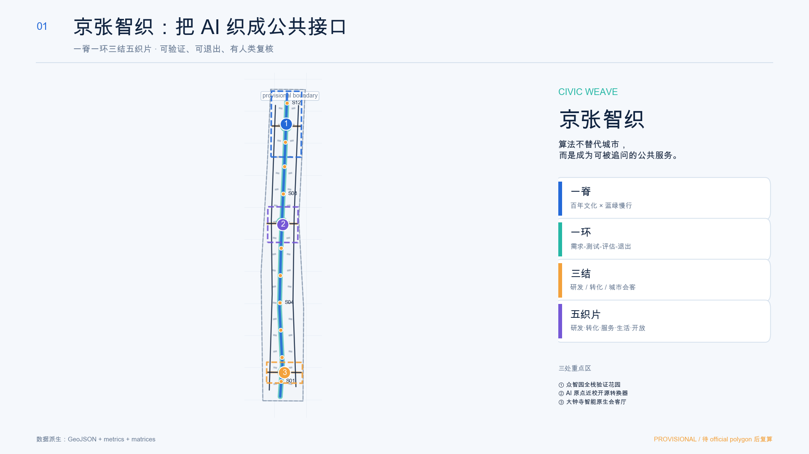
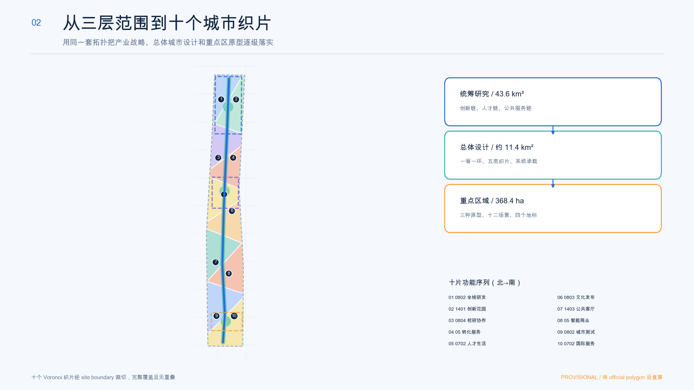
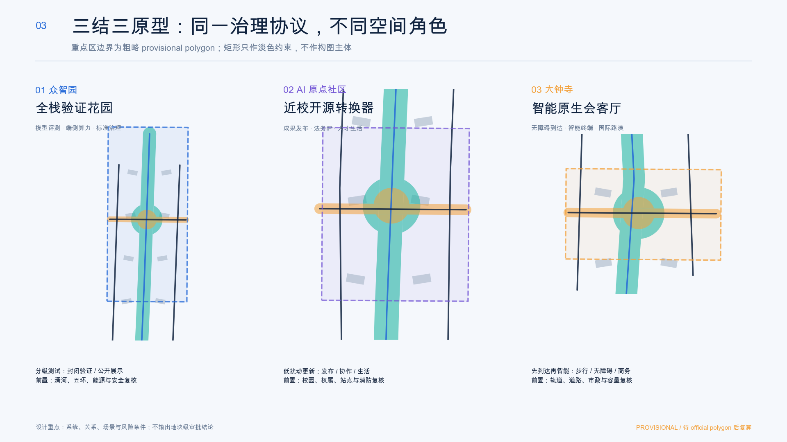
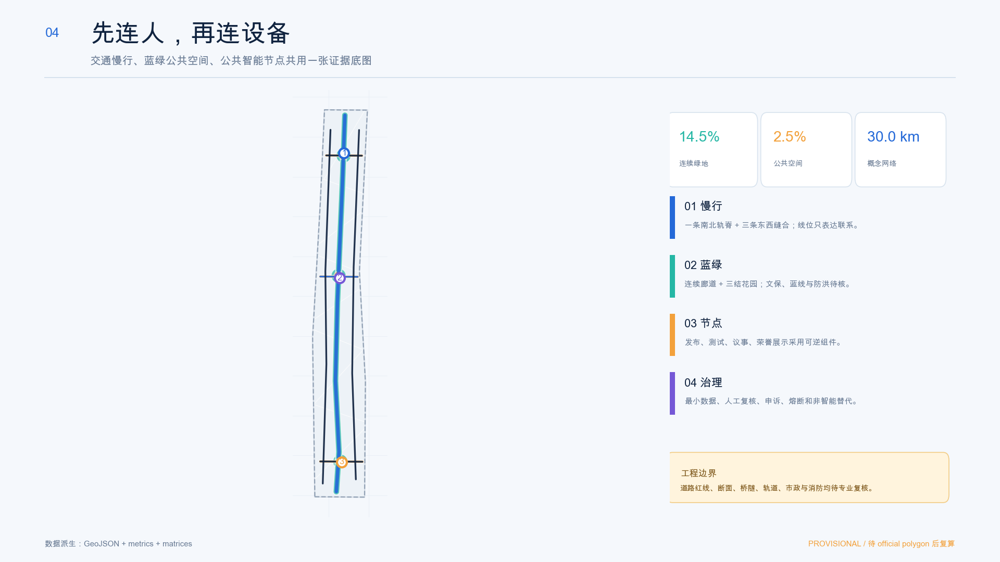
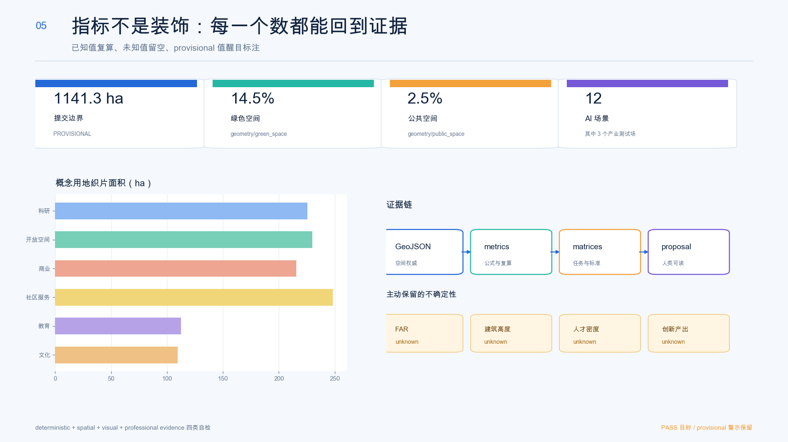

# 京张智织：可验证公共智能与AI生活实验带

**JINGZHANG CIVIC WEAVE — A Verifiable Public-Intelligence Belt**

“京张智织”不把 AI 当作建筑外立面的标签，而把它定义为一组能够被公众看见、询问、拒绝、复核和纠错的城市服务。空间结构为“**一脊一环三结五织片**”：一脊是百年京张文化与蓝绿慢行轨脊；一环是科研、转化、测试、生活、传播不断回流的公共智能环；三结对应众智园、AI 原点社区和大钟寺；五织片是研发、转化、公共服务、生活文化与蓝绿开放空间五类可重组载体。所有落地动作均为概念建议，供专业团队在 official polygon、控规、交通、文保、市政和权属资料齐备后深化。

## 设计依据与资料清单

主控依据是官方征集公告与清权的智能体任务书；城市设计、控规深度与用地分类语言分别受本地标准快照约束。[source:OFFICIAL-ANNOUNCEMENT] [source:AGENT-TASKBOOK] [source:SITE-PACKAGE] [source:SOURCE-REGISTRY] [source:PROCESSED-FACT-PACK] [standard:PROJECT-OFFICIAL-ANNOUNCEMENT] [standard:PROJECT-AGENT-OPEN-CALL-TASKBOOK] [standard:MOHURD-URBAN-DESIGN-MEASURES] [standard:MOHURD-CONTROL-DETAILED-PLANNING] [standard:MNR-LAND-USE-CLASSIFICATION-GUIDE]。`MOHURD-ARCH-DESIGN-DEPTH-2016` 尚缺官方文件，只作为缺口登记而非权威依据。[standard:MOHURD-ARCH-DESIGN-DEPTH-2016]

当前总体设计边界和三处重点区来自仓库维护者的 provisional geometry，仅用于 intake 生成、拓扑自检和人类可读图面：[source:BOUNDARY-SOURCE] [source:KEY-AREA-SOURCE] [data:geometry/site_boundary.geojson#SITE-001] [data:geometry/key_areas.geojson#PROV-KEY-001]。其复算面积约 1141.3 公顷，接近公告约值但不是 official redline；官方 polygon 到位后必须连同用地、建筑、绿地、公共空间、分期与全部指标一起重算。[depth:existing_conditions_diagnosis]

案例只作为“机制翻译”的背景证据，不进入红线、控规、面积或政府承诺：Kendall Square 提供“让创新走出建筑、进入连续公共空间”的启发 [source:CASE-KENDALL]；新加坡 one-north 提供多主题片区与产学研生活协同 [source:CASE-ONE-NORTH]；Paris-Saclay 提供科学-创新-企业转化接口 [source:CASE-PARIS-SACLAY]；首尔 DMC 提供内容产业与更新叙事 [source:CASE-SEOUL-DMC]；Toronto MaRS 提供研究转化、公共空间与交通可达性协同 [source:CASE-TORONTO-MARS]；深圳南山提供场景、技术和产品方案三螺旋 [source:CASE-SHENZHEN-NANSHAN]。上述公开资料不被升级为本项目的空间控制依据。

## 三层范围工作框架

统筹研究范围回答“全球 AI 生态怎样协同”，总体设计范围回答“产业与城市怎样互相支撑”，三处重点区回答“机制怎样在具体空间类型中被验证”。43.6 平方公里范围建立高校策源、开源协作、企业转化、公共体验和国际传播的关系；约 11.4 平方公里范围构建轨脊、织片与公共智能环；368.4 公顷重点区用三套差异化原型检验全栈研发、近校转化和智能原生消费。[depth:three_level_scope_framework] [depth:overall_spatial_structure] [metric:site_area_sqm] [metric:key_area_count]

边界层只锁定工作容器，不决定用地权属和法定指标。十个拓扑安全的概念织片完整覆盖提交边界且无缝无重叠；三条东西公共缝合界面和一条南北轨脊形成可读结构。[data:geometry/land_use.geojson#LU-001] [data:geometry/roads.geojson#ROAD-001]。当 official polygon 替换时，脚本应先锁定新约束，再重做织片分割、节点裁切、面积和图面，而不是把旧图形缩放套用。

## 统筹研究范围产业与未来城市研究

总体命名为“京张智织”，英文名 **JINGZHANG CIVIC WEAVE**。Logo 方向由两条交织线构成：深蓝线代表百年铁路与可审计证据，青绿色代表公共空间与持续生长，橙色结点代表人类作出最终判断的时刻。识别系统不使用企业商标、人物形象或未授权字体；一级语言为“智织”，二级节点用“源、验、会、游”四类动词，三级导视显示“数据来自哪里、谁在负责、如何退出”。这是品牌方向，不是政府已采用标识。[standard:PROJECT-AGENT-OPEN-CALL-TASKBOOK]

三大定位被翻译为空间行动：百年京张文化带对应轨脊叙事；都市 AI 生活体验带对应居民可拒绝、访客可理解的公共服务；AI 融合创新带对应从源头研究到场景验证的闭环。五大功能则形成“研究-开源-转化-测试-治理”循环，并由三区两翼各自承担不同角色。中关村科技服务翼提供法务、知识产权、资本和国际化接口；小月河场景赋能翼承接低风险、可回滚的城市测试。

六个案例被转译成六条可执行但不复制形态的机制：连续公共空间、主题片区协同、开放孵化客厅、文化内容生产、研究转化接口和场景三螺旋。每条机制都必须同时回答“空间载体、运营者、数据边界和失败后如何退出”，从而避免只把国外地名贴进汇报。产业生态以公开征集、分级测试、独立复核和公共反馈为基本流程；企业、投资额、产值和政策均不作未经来源支持的承诺。[depth:overall_spatial_structure]

## 总体设计范围城市更新与控规深度城市设计

总体结构为“一脊、一环、三结、五织片”。轨脊连续组织南北慢行、文化叙事与雨洪适应；公共智能环把需求提出、沙盒测试、独立评估、公共展示和迭代退出串联；三结形成可辨识的北中南锚点；五类织片通过首层共享、可逆模块和公共界面支持空间随产业阶段调整。[data:geometry/land_use.geojson#LU-001] [depth:land_use_layout]

控规深度在本方案中表现为“对象完整、证据可追踪、未知量不伪造”：用地完整分区，建筑以概念基底和类型化更新候选表达，道路只表达连通关系，绿地与公共空间可复算，三期范围完整覆盖。[data:geometry/buildings.geojson#BLDG-001] [data:geometry/phasing.geojson#PHASE-001]。但容积率、高度、建筑密度、道路红线、四线和退让均为 unknown；方案不因图面完整而越权生成法定结论。[depth:development_intensity_controls] [metric:floor_area_ratio]

城市更新采用“留价值、降扰动、补接口、再评估”的类型化方法：具有文化、结构或持续使用价值的对象优先研究保留；性能不足但可升级的对象研究适应性再利用；公共服务缺口用可逆模块补齐；只有在权属、结构、文保和碳排比较完成后才讨论拆除。当前建筑图层的 36 个基底是空间容量原型而非现状调查或拆改留清单。[depth:height_massing_character] [depth:retain_renovate_demolish] [metric:building_prototype_count]

## 重点区域详细设计

三处重点区均使用 provisional polygon，详细设计表达“定位、空间骨架、载体组合、公共界面、场景、运营与前置条件”，不形成具体宗地审批结论。[data:geometry/key_areas.geojson#PROV-KEY-001] [data:geometry/key_areas.geojson#PROV-KEY-002] [data:geometry/key_areas.geojson#PROV-KEY-003] [depth:three_key_area_detailed_design]

**众智园：全栈验证花园。** 以安全评测、端侧算力、开源工具链和标准共创为主题，把封闭测试和公众展示分成不同安全等级。清河界面作为低扰动创新花园，建筑首层研究共享实验前厅、设备预约和治理咨询；“模型证据厅”只展示可公开的测试方法、局限与纠错记录。对外交通、河道和五环接口必须等待专项复核。

**北京 AI 原点社区：近校开源转换器。** 组织“成果发布厅-开源协作廊-人才生活站-法务与知识产权诊所”的步行序列。更新以适应性再利用和小尺度首层激活为优先，提供不同租期和不同保密等级的协作空间；高校成果、个人数据和企业资料只有在授权后进入服务流程。五道口及清华东路西口的接驳仅表达慢行关系，不能解释为已批准站城方案。

**大钟寺：城市智能原生会客厅。** 四象限步行缝合作为概念骨架，串联智能体、智能终端、内容消费、国际路演和日常商业。公共空间优先解决到达、停留、遮荫、非机动车秩序和无障碍，再叠加可退出的 AI 导览；“数据要素会客厅”只讨论授权、审计和争议处理，不将个人数据交易娱乐化。所有地下、桥隧、道路及轨道接口需专业论证。

## AI 创新生态、人才画像与 AI+ 场景

六类用户画像为：高校研究者、开源开发者、初创团队、成熟企业工程与商务人员、周边居民、国际访客与新就业者。[metric:persona_count]。每类画像都按需求、可用时间、隐私敏感度、无障碍需求和失败兜底设计；“人才画像”不等于跟踪个人，而是用自愿访谈与聚合统计识别服务缺口。

十二张场景卡中，前三张为产业测试验证场景。每个场景都有空间载体、最小数据、人工复核、停止条件和责任接口：[metric:ai_scenario_count] [metric:industry_testbed_count]

| # | 场景卡 | 类型与空间 | 最小数据与人工复核 | 停止/退出条件 |
|---|---|---|---|---|
| 01 | 可解释模型街区实验室 | 产业测试·众智园 | 公开测试集；独立评测员签字 | 偏差阈值越界或无法解释即停 |
| 02 | 端侧低碳算力沙盒 | 产业测试·众智园 | 设备能耗汇总；设施人员复核 | 能源/消防条件未核即不部署 |
| 03 | 智能终端无障碍测试场 | 产业测试·大钟寺 | 自愿测试与匿名问题单；无障碍顾问复核 | 安全或可达性风险未闭环即停 |
| 04 | 开源发布与贡献溯源厅 | 原点社区 | 自愿提交的开源记录；社区委员会复核 | 版权或署名争议时下架 |
| 05 | AI 法律与知识产权诊所 | 原点社区 | 当事人授权材料；执业人员最终判断 | 无执业复核不得给结论 |
| 06 | 公共慢行协作导航 | 轨脊 | 聚合拥挤、人工巡查；交通人员复核 | 误导或无障碍冲突立即回滚 |
| 07 | 社区生活服务代理 | 社区织片 | 本地端偏好、明确同意；社区服务台兜底 | 用户可一键清除和转人工 |
| 08 | 京张文化叙事织机 | 轨脊节点 | 已清权史料；文史专家校对 | 来源不明内容不发布 |
| 09 | 城市维护分诊助手 | 公共空间 | 公开报修与设备状态；人工派单 | 不自动处罚、不做身份画像 |
| 10 | 数据授权会客厅 | 大钟寺 | 授权条款与审计日志；法律复核 | 撤回授权后停止处理 |
| 11 | 全球 AI 活动周路径 | 三结一脊 | 预约与容量汇总；活动安全负责人复核 | 超容量或风险预警时限流/取消 |
| 12 | 夜间安心回家伴行 | 公共界面 | 用户主动开启、端侧计算；人工求助入口 | 不做常态追踪，可随时关闭 |

城市智能体必须显示数据来源、置信度、负责人、申诉和退出入口；低风险建议可自动生成，高影响判断必须由人完成。视觉界面不设置“算法同意即默认开放”，不使用个人隐私训练公共系统，不绑定单一供应商。公共空间场景落在 [data:geometry/public_space.geojson#PUBLIC-001]，移动场景落在 [data:geometry/roads.geojson#ROAD-001]。

## 用地、建筑规模与拆改留方案

十个概念织片采用标准用地代码，合并后形成科研、绿地与广场、商业服务、社区服务、教育和文化六类结构。[standard:MNR-LAND-USE-CLASSIFICATION-GUIDE]。科研织片约 225.4 公顷，绿地/广场织片约 229.8 公顷，商业服务约 215.7 公顷，社区服务约 248.3 公顷，教育约 112.6 公顷，文化约 109.6 公顷。[metric:land_use_research_area_sqm] [metric:land_use_green_open_area_sqm] [metric:land_use_commercial_area_sqm] [metric:land_use_community_area_sqm] [metric:land_use_education_area_sqm] [metric:land_use_culture_area_sqm]

建筑策略不是地块清拆表，而是四级决策门：先做价值、结构、碳和权属调查；再判断保留与适应性再利用；公共服务缺口优先采用可逆模块；只有全过程比较和法定程序允许后才讨论拆除或新建。概念建筑基底总面积约 22.6 公顷，只用于验证空间关系，不推算正式建筑规模。[metric:building_footprint_area_sqm] [metric:building_height_m]

高度与体量遵循“轨脊界面连续、三结适度识别、社区尺度友好”的定性原则：首层透明但不暴露敏感研发，屋顶优先研究公共能源与雨洪性能，临文化资源位置采用低扰动和可逆构筑。精确高度、容积率、密度、退线与消防间距必须来自官方/专业资料，不能从本图层倒推。

## 交通、轨道、市政与公共服务设施

交通策略以“先连人，再连设备”为原则：一条南北绿道串联三结，三条东西公共缝合线连接园区、社区与城市界面，西侧创新服务线和东侧公共体验线构成辅助回路。概念网络长度约 30.0 公里，只表示联系，不是道路红线、断面或桥隧工程。[metric:concept_mobility_length_m] [depth:traffic_rail_slow_parking]

站点周边先处理步行过街、无障碍、换乘信息和非机动车秩序，再讨论复合开发；AI 导航只能辅助，不替代交通管理与现场标识。对于慢行断点，以“可逆临时过渡-人工观察-多部门复核-正式工程”四步推进，未完成交通和安全论证时不绘制施工线位。[data:geometry/roads.geojson#ROAD-002]

新基建采用分层服务：公共层提供网络、公开数据目录和人工服务台；创新层提供经授权的算力预约与测试环境；治理层保存最小审计日志、申诉和熔断机制。市政容量、能源负荷、消防、防洪和管线尚未获得资料，均列为前置条件，不做容量承诺。[data:geometry/constraints.geojson#CONSTRAINTS] [depth:municipal_new_infrastructure]

## 蓝绿空间、公共空间与城市风貌

轨脊绿廊与三结花园合并复算约 14.5% 的概念绿色空间；三条公共缝合界面与节点客厅约 2.5% 的概念公共空间。[data:geometry/green_space.geojson#GREEN-001] [data:geometry/public_space.geojson#PUBLIC-001] [metric:green_space_area_sqm] [metric:green_ratio] [metric:public_space_area_sqm] [metric:public_space_ratio] [depth:blue_green_public_space]。这些比例描述本次设计层，不替代已批绿地率。

文化叙事采用“铁轨-代码-共同体”三层：铁轨讲述近代工程与城市生长，代码讲述中关村开放创新，共同体讲述 AI 服务最终应增强人的能力。导视每个节点同时显示历史来源、当代用途和未来假设，避免把文化做成科技装饰。

四个 AI 朝圣/荣誉节点均为可逆公共空间概念：[metric:pilgrimage_landmark_count]。①“原点开源碑廊”记录可核验的开源贡献，不做个人崇拜；②“模型证据厅”展示测试方法、局限和纠错；③“百年信号门”以铁路信号与数据置信度对照，位置待文保复核；④“公共智能年轮”记录居民、开发者和专业团队共同改进城市服务的版本。荣誉展示必须可更正、可撤回、可补充异议。

## 更新项目清单、实施政策与分期计划

项目清单以条件而非日期承诺排序：[depth:renewal_project_list] [data:geometry/phasing.geojson#PHASE-001]。触媒期先补 official geometry、控规、建筑、道路、文保与市政底板，同时可讨论开源发布、公众共创和可逆导视；缝合期在专业复核后研究三条公共界面、重点区首层更新和站点接驳；共生期在法定程序与运营能力稳定后形成长期社区与场景开放机制。[depth:phasing_implementation] [metric:phase_count]

| 项目 | 概念动作 | 进入下一阶段的门槛 | 退出/回滚 |
|---|---|---|---|
| CW-01 证据底板 | official polygon、控规、权属、建筑、文保、市政统一版本 | 来源、坐标系、许可和哈希审查 | 版本冲突即冻结派生指标 |
| CW-02 轨脊公共界面 | 连续慢行、文化叙事、创新花园 | 交通、文保、绿地与安全复核 | 临时组件可拆除 |
| CW-03 三结公共客厅 | 研发验证、开源转化、国际路演 | 场所授权、消防、无障碍和运营主体 | 低使用率则改作普通公共服务 |
| CW-04 公共智能协议 | 数据目录、人工复核、申诉、熔断 | 隐私影响与算法影响评估 | 撤回授权、关闭模型、保留人工渠道 |
| CW-05 全球 AI 活动季 | 开源发布、城市测试、公共体验、国际传播 | 活动许可、安全容量、版权清权 | 线上替代或取消，不宣称固定举办 |

年度运营采用“四季一库”：春季问题征集、夏季测试开放、秋季全球发布、冬季独立复盘，成果进入公开知识库。开发者社区按“问题单-小样-沙盒-公开评审-有限试点-退出评估”运行；人才、企业与国际合作的转化路径以服务预约、导师对接、合规咨询和公开路演为主，不写成招商、资金或政策承诺。[standard:PROJECT-AGENT-OPEN-CALL-TASKBOOK]

## 指标体系、面积复算与合规矩阵

结构化权威顺序为 GeoJSON、metrics、矩阵、正文、图面。EPSG:4548 复算得到边界、建筑基底、绿地、公共空间、慢行长度和分期指标；AI 场景、测试场、画像与地标以正文可数对象核对。[depth:metrics_recalculation]。指标图同时显示来源文件、公式、置信度和待补数据，避免用大数字制造确定性。

本包覆盖公告 1.3、1.4、1.5 的 17 项要求与 agent.1-agent.6；`compliance_matrix.json` 将每项任务映射到章节、图层、指标、图纸、来源、假设和自检。已知指标机器索引：[metric:site_area_sqm]、[metric:building_footprint_area_sqm]、[metric:building_prototype_count]、[metric:green_space_area_sqm]、[metric:green_ratio]、[metric:public_space_area_sqm]、[metric:public_space_ratio]、[metric:concept_mobility_length_m]、[metric:key_area_count]、[metric:land_use_research_area_sqm]、[metric:land_use_green_open_area_sqm]、[metric:land_use_commercial_area_sqm]、[metric:land_use_community_area_sqm]、[metric:land_use_education_area_sqm]、[metric:land_use_culture_area_sqm]、[metric:ai_scenario_count]、[metric:industry_testbed_count]、[metric:persona_count]、[metric:pilgrimage_landmark_count]、[metric:phase_count]。未知指标 [metric:floor_area_ratio]、[metric:building_height_m]、[metric:ai_talent_density]、[metric:innovation_output_index] 保持空值并说明原因，不进入宣传口径。

设计深度证据索引还包括 [depth:land_use_layout]、[depth:development_intensity_controls]、[depth:height_massing_character]、[depth:retain_renovate_demolish]、[depth:traffic_rail_slow_parking]、[depth:municipal_new_infrastructure]、[depth:blue_green_public_space]、[depth:three_key_area_detailed_design]、[depth:renewal_project_list]、[depth:phasing_implementation]、[depth:risk_missing_data]。九类几何索引完整覆盖：[data:geometry/site_boundary.geojson#SITE-001] [data:geometry/key_areas.geojson#PROV-KEY-001] [data:geometry/land_use.geojson#LU-001] [data:geometry/buildings.geojson#BLDG-001] [data:geometry/roads.geojson#ROAD-001] [data:geometry/green_space.geojson#GREEN-001] [data:geometry/public_space.geojson#PUBLIC-001] [data:geometry/constraints.geojson#CONSTRAINTS] [data:geometry/phasing.geojson#PHASE-001]。

## 风险、版权与合规说明

首要风险不是“缺一个漂亮效果图”，而是把粗略 polygon、公开文字或 AI 推测误写成法定事实。`assumptions.json` 因此登记边界、重点区、控规、道路、权属、建筑、文保、市政和公共服务九类缺口；任何缺口未闭合时，相关结论自动降级为概念建议。[depth:risk_missing_data] [source:SOURCE-REGISTRY]

隐私方面采用数据最小化、明确同意、端侧优先、分级留存、可撤回和人工申诉；高影响判断不自动执行。公平方面要求无障碍测试、非智能替代通道和社区共评；技术成熟度不足时允许停用模型而不影响基本服务。空间争议通过 official geometry、公众意见与专业审查解决，不让算法裁决权属或审批。

全部核心图由本包 GeoJSON、metrics 和矩阵派生，使用本地系统字体与原创图形，不含远程地图瓦片、新闻图片、企业标识、人物肖像或生成式渲染。版权与生成方式见 `report/copyright_statement.md`。本方案不声称官方批准、政府背书、保证实施、确定投资、法定控规或最终工程可行性。

## 参考资料

- 官方公告与仓库本地快照：[source:OFFICIAL-ANNOUNCEMENT] [standard:PROJECT-OFFICIAL-ANNOUNCEMENT]
- 面向智能体任务书：[source:AGENT-TASKBOOK] [standard:PROJECT-AGENT-OPEN-CALL-TASKBOOK]
- 城市设计、控规与用地分类：[standard:MOHURD-URBAN-DESIGN-MEASURES] [standard:MOHURD-CONTROL-DETAILED-PLANNING] [standard:MNR-LAND-USE-CLASSIFICATION-GUIDE]
- 资料登记与 provisional geometry：[source:SOURCE-REGISTRY] [source:BOUNDARY-SOURCE] [source:KEY-AREA-SOURCE]
- 全球案例背景：[source:CASE-KENDALL] [source:CASE-ONE-NORTH] [source:CASE-PARIS-SACLAY] [source:CASE-SEOUL-DMC] [source:CASE-TORONTO-MARS] [source:CASE-SHENZHEN-NANSHAN]

> 统一边界声明：本成果为 AI 开放共创建议，不替代正式规划，不构成政府审定结论。所有空间落地建议均为概念建议、参考方案或可供专业团队深化研究。
