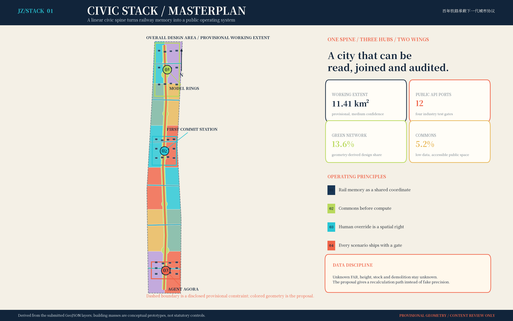
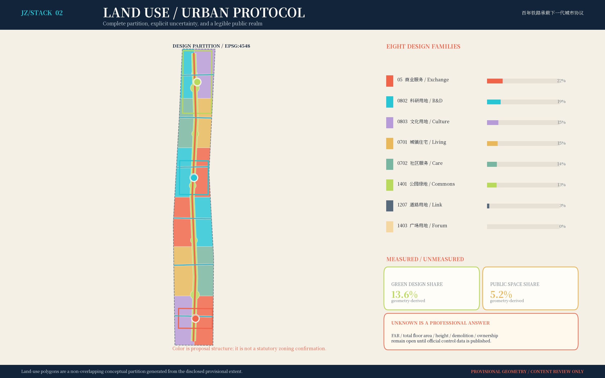
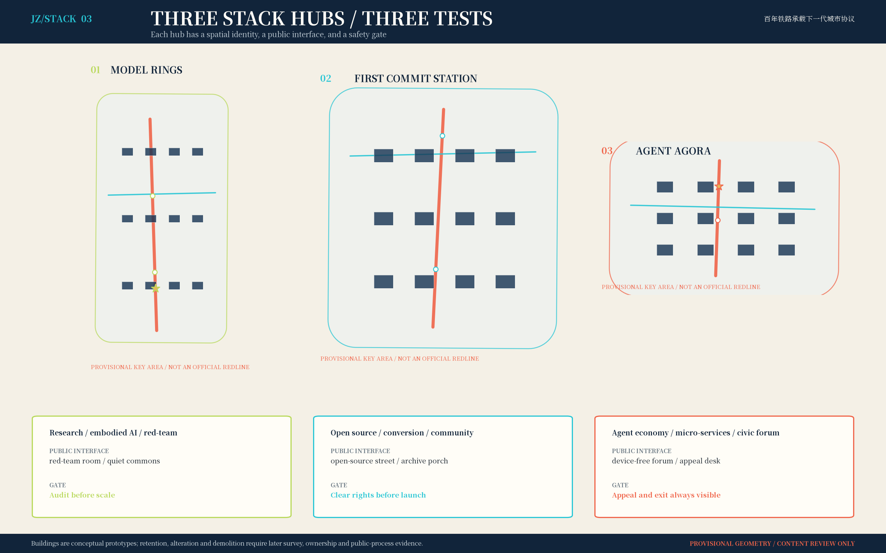
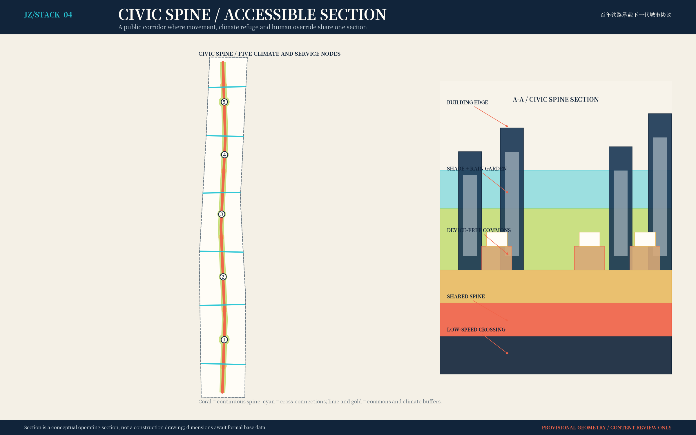
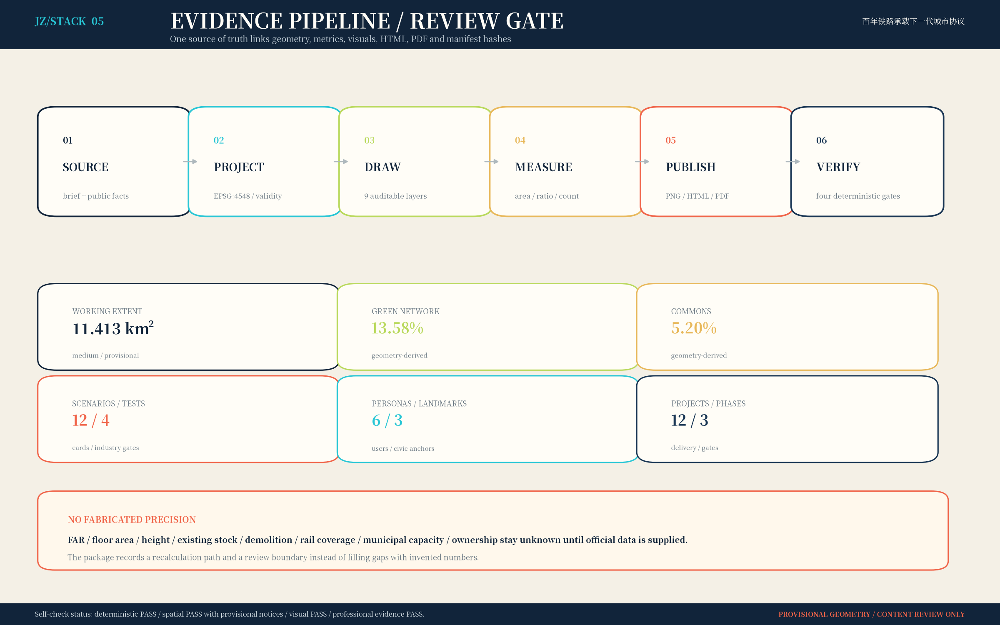

# 京张城市开源栈 / JINGZHANG CIVIC STACK

> **百年铁路承载下一代城市协议。** 方案不把 AI 当作园区里的展示设备，而把它变成一套可以插拔、审计、暂停和由人接管的公共生活基础设施。铁路记忆是共同坐标，城市栈是开放接口，人的尊严是最高权限。

## 设计依据与资料清单

本方案首先服从征集公告确定的三层范围、三处重点区域和成果深度，并把任务书的六项智能体任务翻译成“正文—图纸—九个 GeoJSON—指标—矩阵—自检”的闭环。资料使用遵守三条纪律：第一，公告和仓库中已清权的文件负责描述任务与公开事实；第二，处理后的 fact pack 只负责导航，不把二手整理升级成权威；第三，临时边界只做设计约束，绝不称作法定红线。依据链为 [source:OFFICIAL-ANNOUNCEMENT]、[source:AGENT-TASKBOOK]、[source:SITE-PACKAGE]、[source:SOURCE-REGISTRY] 与 [source:PROCESSED-FACT-PACK]，对应 [standard:PROJECT-OFFICIAL-ANNOUNCEMENT] 和 [standard:PROJECT-AGENT-OPEN-CALL-TASKBOOK]。

当前公开仓库没有可验证的官方精确 polygon。提交采用 [source:BOUNDARY-SOURCE] 和 [source:KEY-AREA-SOURCE]，在 [data:geometry/site_boundary.geojson#SITE-001]、[data:geometry/key_areas.geojson#PROV-KEY-001] 中逐要素标注 `official_boundary=false`、`geometry_role=provisional_constraint`、`boundary_precision=provisional_rough`。因此 [metric:site_area_sqm] 是临时几何的 EPSG:4548 复算值；[metric:announced_site_area_sqm]、[metric:research_scope_announced_area_sqm] 与 [metric:key_areas_announced_area_sqm] 是公告量级，二者不能互相替代。官方边界到位后必须同时重算九个图层、全部面积与比例、五张图、两套 PDF 和 HTML，不能只换一条边界线。

专业方法遵循 [standard:MOHURD-URBAN-DESIGN-MEASURES] 的公共利益与品质导向、[standard:MOHURD-CONTROL-DETAILED-PLANNING] 的控规内容结构、[standard:MNR-LAND-USE-CLASSIFICATION-GUIDE] 的用地代码，以及 [standard:MOHURD-ARCH-DESIGN-DEPTH-2016] 的成果表达参照。由于法定控规、现状普查、权属、文保、交通和市政资料缺失，本次对应事项被列为数据缺口而非猜测值；这由 [depth:existing_conditions_diagnosis] 与 assumptions.json 共同约束。所有国际案例只迁移机制，不移植规模、法规或绩效数字。

## 三层范围工作框架

三层不是三套互不相干的图，而是一个从战略假设到街道验证的“编译链”。约 43.6 km² 统筹研究层提出京津冀创新协作、人才循环和未来城市界面；约 11.4 km² 总体设计层把判断编译为一条公共脊柱、三个城市栈、两翼混合织补和十二个场景端口；约 368.4 ha 重点区域层则用建筑原型、公共空间、慢行、运营与安全闸门检验可实施性。三层工作分别回答“为什么在此协作”“空间如何承载”“一段街和一个场景怎样被验证”，由 [depth:three_level_scope_framework] 和 [depth:overall_spatial_structure] 管理。

空间结构命名为“**一脊·三栈·两翼·十二端口**”。一脊是面向所有人的京张公共脊柱；三栈由北向南是众智园“模型年轮”、AI 原点社区“第一提交站”、大钟寺“智能体议场”；两翼不是封闭园区，而是居住照护与研发转化混合的街区织补；十二端口把 AI 场景挂接到真实公共空间。端口遵循同一开放协议：最少数据、明确目的、人工复核、可申诉、可暂停、可退出。结构落在 [data:geometry/land_use.geojson#LU-001]、[data:geometry/roads.geojson#RD-001] 与 [data:geometry/constraints.geojson#S01]。

图中的虚线范围只提示临时工作域，视觉上刻意退后；彩色的公共脊柱、端口与项目才是参赛者可负责的设计内容。该表达防止粗略矩形被误读为地块红线，也方便将来用官方几何重新裁切。任务覆盖矩阵完整映射公告 17 项与智能体 6 项：`1.3.1`、`1.3.2`、`1.3.3`、`1.4.1`、`1.4.2`、`1.4.3`、`1.5.1.1`、`1.5.1.2`、`1.5.2.1`、`1.5.2.2`、`1.5.2.3`、`1.5.2.4`、`1.5.2.5`、`1.5.3.required`、`1.5.3.1`、`1.5.3.2`、`1.5.3.3`、`agent.1`、`agent.2`、`agent.3`、`agent.4`、`agent.5`、`agent.6`，每一项都在 compliance_matrix.json 中至少关联一节正文、一组图层、一项指标、A3/A0 图纸、HTML 章节、来源、假设和自检。

## 统筹研究范围产业与未来城市研究

统筹层提出“**AI 不再被圈进园区，创新能力沿公共生活传播**”。海淀承担开源基础、模型安全、科研转化和人才密度的核心接口；未来科学城可承接生命科学、能源等跨学科验证；怀柔科学城连接大科学装置与科研数据治理；北京经开区连接具身智能、制造验证和规模化场景；天津与河北节点连接制造供应链、港口物流和区域应用。这里提出的是合作接口与验证议题，不替任何地区作政策承诺。每个跨区项目必须有双方责任主体、数据边界和退出条件，不能只画一条“协同箭头”。

六个国际案例提供机制参照：[source:CASE-ONE-NORTH] 启发研究、创业、生活和公共空间邻近；[source:CASE-22BARCELONA] 启发产业更新与混合街区同步；[source:CASE-HELSINKI-TESTBED] 启发真实城市环境中的小规模测试—反馈—迭代；[source:CASE-PARIS-SACLAY] 启发科研与技术转移的接口；[source:CASE-KENDALL-SQUARE] 提醒高密创新集群必须补偿公共领域、住房与可达性；[source:CASE-MARS-TORONTO] 启发由中介平台组织创业服务和跨机构网络。迁移结果不是“复制园区”，而是六条本地规则：开放首层、短链转化、真实测试、公共回馈、生活可负担、第三方审计。

未来城市形态由五层栈组成：遗产层保存共同记忆；公共领域层提供不依赖设备的基本权利；城市计算层提供最小化、分级授权的算力与数据；场景端口层允许应用插拔；治理层拥有暂停、申诉和退出权。产业空间因此不追求单一地标，而追求从“高校/实验室—安全测试—中试服务—公共场景—反馈复盘”的短闭环。统筹层年度产出是案例更新、合作接口清单、人才与场景缺口、区域试验复盘，不以招商金额取代城市品质评价。

## 总体设计范围城市更新与控规深度城市设计

总体设计把长廊从单一通行设施改造为“城市公共 API”。中部连续脊柱优先承载步行、骑行、遮阴、雨洪缓释、遗产叙事与低门槛服务；六条横向接口把轨道、社区、高校与产业单元接到脊柱；两翼以 2×6 个城市栈单元组织科研、商业、居住、文化和社区服务。用地并集在 EPSG:4548 中覆盖临时 SITE-001 且无重叠，[metric:land_use_partition_area_sqm] 与 [metric:site_area_sqm] 可相互核验，方法见 [depth:land_use_layout]。

控规深度的态度是“能算的明确算，不能算的明确缺”。本包提供概念用地、建筑基底、道路中心线、绿地、公共空间与分期，支持结构、覆盖和比例复核；但 floor_area_ratio、total_floor_area_sqm、building_height_m 均维持 unknown，因为官方边界、法定控制、航空/景观/文保/日照条件未取得。[depth:development_intensity_controls] 和 [depth:height_massing_character] 因而记录的是校核流程：官方条件到位—叠合敏感控制—分地块算量—日照与交通市政验算—公众利益评估—版本签章，而不是提前给出高度或容积率。

更新策略优先顺序为“先调查、再开放、后增量”：保留有历史、社会与碳价值的结构；用轻介入修缮和首层开放激活可利用建筑；仅在安全、功能和公共利益证据充分时讨论替换；新增体量优先补齐公共服务和产业共享设施。建筑图层 [data:geometry/buildings.geojson#BLDG-001] 是三处重点区的形态原型，不是现状测绘，也不构成拆除清单。这一边界由 [depth:retain_renovate_demolish] 明确。

## 重点区域详细设计

三处重点区使用同一公共协议、不同主导任务，并在 [depth:three_key_area_detailed_design] 下形成“空间—场景—运营—闸门”四联表。北部众智园“模型年轮”以安全测试和开源评测为核心：围绕共享实验院、低速具身智能环、模型红队庭院与生态缓冲布置；产业测试若越权、泄露或安全员失联，必须物理/逻辑隔离。其入口不是企业门厅，而是公众可见的测试说明、版本记录和投诉窗口。

中部 AI 原点社区“第一提交站”是成果从校园走向城市的翻译器。空间由开放源码街、微型中试共享层、社区服务协办台、人才日常服务与铁路记忆站组成；首层在约定时段向公众开放，科研成果必须经过安全、伦理、可访问性与社区价值四道评审后才能进入真实场景。建筑原型保留小尺度院落和穿行关系，不用封闭大院换取管理便利。

南部大钟寺“智能体议场”把智能体经济与公共协商放在同一场所：创作者、小微企业、居民、城市运营者可以发布场景提案、审阅模型卡、发起申诉并共同复盘。议场保留纸面公告、电话和人工席位，使没有智能手机、识字困难或不愿交出数据的人仍能获得同等公共服务。三个地标——第一提交站、模型年轮、智能体议场——均为本方案原创概念，作为“朝圣地”承载贡献者荣誉，而非商业冠名。

重点区的所有建筑、通道与场景节点仍须用现场测量、权属、消防、无障碍、交通、管线、文保和公众参与八类证据校准。首开样段以“连续 800 米的公共脊柱 + 一个无设备服务亭 + 一个可停机 AI 场景”为最小验证单元；任何一类安全或权利证据缺失，都应缩小或撤回试点，而不是用设计效果图覆盖问题。

## AI 创新生态、人才画像与 AI+ 场景

生态不是企业名录，而是一套贡献者循环：研究者发布可验证能力，园区提供合规沙箱，城市端口提出真实问题，居民参与共同验收，运营团队公布模型卡、错误和退出记录。City Merge 年度“城市合并节”集中展示已经通过公共价值验证的版本，并把未通过的试验、失败原因和撤回决定同样纳入荣誉档案。品牌采用 **JZ/STACK**，斜杠像道岔，也像代码分支；中英文统一为“京张城市开源栈 / JINGZHANG CIVIC STACK”。

| 人才画像 | 角色 | 核心需要 | 必须回应的风险 |
|---|---|---|---|
| P01 | 科研人员 / 创业工程师 | 跨机构试验、共享算力、成果转化 | 知识产权边界与算力排队 |
| P02 | 周边居民 / 照护者 | 安静绿地、托老托育、可解释服务 | 被技术排除与夜间扰动 |
| P03 | 青少年 / 学习者 | 开放课程、可参与的城市实验 | 未成年人隐私与算法诱导 |
| P04 | 访客 / 铁路文化爱好者 | 连续步行、可信叙事、纪念仪式 | 迷路、数字门槛与内容失真 |
| P05 | 老年人 / 残障人士 / 配送劳动者 | 无障碍、低门槛、休息与补给 | 无智能机时权益缩水 |
| P06 | 园区与城市运营者 | 可观测指标、责任闭环、应急接管 | 系统漂移与责任不清 |

六类画像不是消费标签，而是设计审查席位。对老年人、残障人士、配送劳动者、照护者和未成年人设置专门旅程测试：无设备能否完成、轮椅能否连续通行、夜间是否有休息和照明、个人数据能否撤回、算法偏差能否被发现。画像数量 [metric:persona_count]，每次阶段闸门至少邀请其中四类参与，且弱势/高风险群体的反对意见必须进入会议记录。

| ID | 场景卡 | 领域 | 最小数据生命周期 | 暂停触发 | 人工/无设备后备 | 验证指标 |
|---|---|---|---|---|---|---|
| S01 | 无障碍连续出行代理 | 公共服务 | 端侧定位→短时路径→匿名统计→自动删除 | 导航偏差>20m或无障碍路径断点 | 转人工服务台；保留纸质/电话路径 | 无障碍路径完成率、人工转接时长 |
| S02 | 京张铁路遗产讲述代理 | 文化旅游 | 清权条目→检索生成→人工审校→版本归档 | 事实来源置信度不足或版权不清 | 只展示已审校条目；允许用户纠错 | 审校通过率、公众纠错关闭率 |
| S03 | 公共空间舒适度共治 | 社区治理 | 自愿反馈→网格聚合→工单→按期删除 | 个体识别风险或样本不足 | 仅发布聚合热区；居民可撤回数据 | 遮阴/座椅问题关闭率、撤回响应时长 |
| S04 | 社区事项人机协办台 | 公共服务 | 最少事项字段→检索→人工签核→法定期限归档 | 高风险事项或答案置信度<0.85 | 工作人员复核；线下窗口同权 | 一次办结率与高风险转人工召回率 |
| S05 | 多语小微商户开源助手 | 产业服务 | 商户自填→本地草稿→专业转介→用户删除 | 合同、税务、金融等专业判断 | 转持证专业人员；不自动签约 | 小微主体任务完成率、专业转介率 |
| S06 | 就医与康养路径助手 | 公共服务 | 用户输入→路径匹配→医护接管→不留诊断画像 | 涉及诊断、急症或个体健康推断 | 立即转医护/急救；不做诊断 | 无障碍到诊率、误触诊断拦截率 |
| S07 | 开放学习资源导航 | 教育 | 年龄分级→资源匹配→教师复核→学期清理 | 未成年人数据或内容分级不明 | 监护/教师复核；不建画像广告 | 资源可达率、未成年人投诉关闭率 |
| S08 | 轨道到达聚合调度 | 交通 | 运营聚合流→预测→现场复核→短周期留存 | 数据延迟>60秒或拥挤异常 | 恢复静态班次与现场指挥 | 信息延迟、现场疏导接管时长 |
| S09 | 边缘模型安全基准场 | 产业测试 | 脱敏样本→沙箱测试→红队→版本封存 | 越权调用、泄露或红队失败 | 自动隔离沙箱并冻结版本 | 高危漏洞关闭率、版本隔离时间 |
| S10 | 具身智能低速共行试验 | 产业测试 | 场地传感→边缘决策→安全员复核→测试后清除 | 安全员失联或安全距离触发 | 硬件急停；封闭场地复盘 | 安全接管距离、急停演练通过率 |
| S11 | 合成数据合规实验室 | 产业测试 | 合法原始数据→合成→攻击评估→可验证销毁 | 重识别风险超过审定阈值 | 销毁数据集；重跑隐私攻击测试 | 重识别攻击成功率、数据销毁可验证率 |
| S12 | 城市仿真与应急推演孪生 | 产业测试 | 校准数据→仿真→指挥复核→事件后归档 | 仿真漂移或现实事件升级 | 退出自动建议；由指挥体系接管 | 仿真误差与人工接管演练时长 |

场景总数 [metric:scenario_card_count]、空间节点 [metric:scenario_node_count]，其中 S09—S12 构成 [metric:industry_test_scenario_count] 个产业测试。每个场景上线顺序固定为：目的与必要性评审—数据字典与保存期限—小样本偏差测试—人工服务同权—红队与急停演练—公开模型卡—限时试运行—独立复盘。用户可以查询数据用途、要求更正/删除、选择不用 AI、向明确责任人申诉；高风险判断不自动作出生效决定。这套人机边界回应 agent.3、agent.5、agent.6，也将“创新”从功能数量转向可问责能力。

## 用地、建筑规模与拆改留方案

用地采用八类设计代码：科研 0802、住宅 0701、商业服务 05、文化 0803、社区服务 0702、道路 1207、公园 1401、广场 1403，编码依据 [source:LAND-USE-CLASSIFICATION]。用地表达的是结构分配，不是法定性质确认；每个要素在 [data:geometry/land_use.geojson#LU-001] 中保留面积、设计逻辑与 `conceptual_non_statutory` 状态。脊柱两侧不形成单一“科技办公墙”，而通过居住、照护、文化与研发交错，使人才的工作、学习、照护和日常消费在步行尺度内发生。

建筑图层包含 [metric:building_prototype_count] 个原型基底，几何并集 [metric:building_footprint_area_sqm]。该数值只描述三处重点区内方案原型的占地，不代表现状建筑总量、总建筑面积或法定建筑密度。原型分为共享实验、孵化、混合、社区服务、文化、人才居住和“待调查保留候选”；所有高度字段均明确 unknown。体量控制采用“连续但可穿透的低中层基座 + 节点退让 + 屋顶公共/生态第五立面”的意向，最终高度必须经过日照、景观、文保、航空与消防综合校核。

拆改留执行逐栋证据卡：结构安全、建成年代与历史价值、全生命周期碳、现有使用者与租约、产权、消防与无障碍、改造成本、公众意见八项齐备后才能分类。保留优先，修缮次之，置换为最后选项；安置、租金和经营连续性没有可接受方案时不进入施工。现状建筑面积、拆除面积、权属确认地块数仍为 unknown，分别受 A-EXISTING-001 与 A-CONTROLS-001 约束，避免“概念模型即拆迁决定”的常见误读。

## 交通、轨道、市政与公共服务设施

交通结构是“一条连续慢行主链 + 六个横向接口 + 三个栈节点接驳”。[data:geometry/roads.geojson#RD-001] 是概念中心线，总长度 [metric:conceptual_road_length_m]，不声称复刻现状轨道或道路红线。主链优先保障步行、骑行、轮椅和应急通行；横向接口分别测试轨道接驳、学校/社区穿行、产业后勤和支路微循环。停车采用共享、错峰与外围换乘的策略方向，但泊位数、站点覆盖和道路等级须待流量、站口、消防和权属资料后确定。[depth:traffic_rail_slow_parking] 管理这一数据缺口。

新型市政基础设施遵循“边缘优先、最少采集、可断网运行、人工接管”：场景端口只预留电力、通信、传感和服务接口；算力与数据按公共/内部/敏感分区，敏感数据不因空间展示而外流。地下管网、供电、再生水、雨洪和算力容量没有底表，因此 [depth:municipal_new_infrastructure] 不给容量结论，先执行探测—负荷预测—冗余—运维责任—应急演练五步校核。

公共服务采用“一台设备之外还有一个人”的最低标准。每个协办台同时提供屏幕、电话、纸面指南与工作人员；自动建议必须显示来源、版本、置信度和申诉入口；医疗、法律、救助、未成年人和重大安全事项直接进入专业人工流程。公共服务容量、服务半径与人口需求需要人口和设施台账后再算，本方案先用三类旅程验收：轮椅从轨道到公共服务、无智能手机完成一次事项、照护者在夜间找到安全休息与求助点。

## 蓝绿空间、公共空间与城市风貌

蓝绿与公共空间不是两张叠加图，而是“生态慢行—公共议事—场景验证”的共用底盘。[data:geometry/green_space.geojson#GREEN-001] 表达连续脊柱和五处降温口袋，面积 [metric:green_space_area_sqm]、比例 [metric:green_ratio]；[data:geometry/public_space.geojson#PUBLIC-001] 表达公共协议步道和五个论坛，面积 [metric:public_space_area_sqm]、比例 [metric:public_space_ratio]。比例来自设计几何并受临时边界影响，不是法定绿地率或批准指标。水文、土壤、地下管线、树种和养护条件到位后，需重做径流、热舒适、生境与全生命周期成本校核。

公共空间以四类时段工作：清晨健康与通勤、白天学习与研发、傍晚社区和小微商业、夜间低照度安全与安静。每 200—300 米的设计意向设置可坐可靠、遮阴、饮水、厕所信息、无障碍转向和人工求助；该间距是待现场验证的服务假设，不是既成事实。任何 AI 装置不得成为通行门槛，也不得用人脸识别换取座椅、照明或导览等基本权利。[depth:blue_green_public_space] 以公共性、生态性、可维护性和数字包容四维验收。

风貌系统从铁路构造逻辑而非复古造型出发：深海军蓝代表制度与可信，信号青代表开放接口，铁锈珊瑚代表工业记忆，公共绿代表共享生态，纸本米白代表无设备权利。Logo 的 JZ 双轨由斜杠道岔连接，形成可扩展的“贡献者栈”标识；三个地标共用轨枕比例、开源铭牌和双语导视，但不复制既有商业商标。地标数量 [metric:pilgrimage_landmark_count]，年度 City Merge 为贡献者更新版本铭牌，让城市荣誉来自可验证贡献而非单次造景。

## 更新项目清单、实施政策与分期计划

项目不是愿望清单，每项都绑定 A（最终负责）、R/C（执行与协同）、成本等级、进入闸门和停止条件。成本 S/M/L 仅表示相对复杂度，不是投资估算；真实投资必须建立工程量、价格基期、产权和运维模型。更新项目数量 [metric:renewal_project_count]，清单如下，并由 [depth:renewal_project_list] 管理。

| ID | 项目 | 类型 | 成本级 | A 最终负责 | R/C 执行协同 | 进入闸门 | 停止/退出条件 |
|---|---|---|---|---|---|---|---|
| JZ-01 | 京张公共脊柱首开段 | 公共空间 | M | 属地统筹 | 设计/运维/居民 | 连续无障碍样段通过实测 | 产权或消防通道未核即暂停 |
| JZ-02 | 第一提交站 First Commit Station | 遗产文化 | M | 文化与属地部门 | 社区/高校/档案机构 | 内容清权与公众共编完成 | 遗产审查未通过即退回 |
| JZ-03 | 众智园模型年轮安全场 | 产业测试 | L | 园区运营方 | 高校/企业/审计机构 | 红队、急停、隔离验收 | 任一高危漏洞未关闭即不上线 |
| JZ-04 | 原点社区开放源码街 | 更新街区 | M | 属地与产权主体 | 高校/商户/居民 | 首层开放时段与租赁机制签署 | 安置与权属无方案即不施工 |
| JZ-05 | 大钟寺智能体议场 | 公共文化 | M | 属地与公共文化机构 | 企业/居民/创作者 | 议事章程与人工申诉台运行 | 申诉责任人未到位即停用AI |
| JZ-06 | 十二端口离线服务亭 | 数字包容 | S | 公共服务运营方 | 社区工作者/志愿者 | 电话、纸面、人工三种替代可用 | 任何群体只能线上办理即否决 |
| JZ-07 | 慢行与轨道接驳补链 | 交通 | L | 交通主管部门 | 轨道/公交/街道 | 样段行程与无障碍连续性达标 | 交通影响评价未通过即调整 |
| JZ-08 | 蓝绿海绵共生链 | 生态 | L | 园林水务协同 | 运维/社区/专业单位 | 场地水文与养护责任复核 | 地下管线未探明即不破土 |
| JZ-09 | 社区服务人机协办台 | 公共服务 | S | 属地公共服务部门 | 社工/法律顾问/居民 | 高风险转人工与日志审计通过 | 误导率超过审定阈值即回滚 |
| JZ-10 | 合成数据合规实验室 | 新基建 | M | 园区与数据治理机构 | 高校/审计/企业 | 重识别攻击与退出机制通过 | 数据来源不清即销毁批次 |
| JZ-11 | 年度 City Merge 城市合并节 | 运营品牌 | S | 联盟秘书处 | 高校/社区/企业/文化机构 | 年度议题、贡献者名册与复盘公开 | 赞助影响公共议程即终止合作 |
| JZ-12 | 官方边界到位全包复算 | 治理底座 | S | 方案总控 | GIS/规划/各专业 | 九图层与全部指标一次性重跑 | 任一法定数据缺版本记录即不发布 |

分期不是日期承诺，而是三道证据门：[data:geometry/phasing.geojson#PHASE-1]“校准与首开”先完成数据登记、边界版本和两个可逆原型；PHASE-2“连接与验证”连接三栈与双网，验证交通、消防、无障碍、运营 RACI；PHASE-3“扩展与治理”才扩展十二端口和年度运营。阶段数量 [metric:phase_count]。任一阶段未完成上一道门，不得用赶工跳过；官方数据迟到时保留可逆活动，停止永久工程。这由 [depth:phasing_implementation] 约束。

政策工具包括：公共首层时段协议、试验场临时使用许可与责任险、公共数据最小化清单、模型卡与事件公开制度、弱势群体同权条款、独立伦理/安全审计、年度场景退出日、创新收益反哺公共空间。运营采用“公共部门定底线、园区承担日常责任、专业机构审计、社区拥有申诉与否决席位、企业按场景贡献”的联盟机制。KPI 同时看空间（连续性、舒适、可达）、产业（转化周期、共享使用）、公共价值（无设备完成率、投诉关闭）、AI 安全（高风险转人工、事件与回滚），禁止只用客流或融资额代替公共利益。

## 指标体系、面积复算与合规矩阵

指标分为三类：公告量级、临时边界复算、参赛者设计计数。公告量级保持原单位并注明来源；几何指标统一在 EPSG:4548 计算；计数指标从文件要素或正文编号得到。面积链为 SITE-001→用地并集→绿地/公共空间/建筑并集，允许第三方用 [data:geometry/site_boundary.geojson#SITE-001]、[data:geometry/land_use.geojson#LU-001]、[data:geometry/buildings.geojson#BLDG-001] 复算。已知指标完整索引：[metric:site_area_sqm]、[metric:announced_site_area_sqm]、[metric:research_scope_announced_area_sqm]、[metric:key_areas_announced_area_sqm]、[metric:land_use_partition_area_sqm]、[metric:green_space_area_sqm]、[metric:green_ratio]、[metric:public_space_area_sqm]、[metric:public_space_ratio]、[metric:building_footprint_area_sqm]、[metric:building_prototype_count]、[metric:conceptual_road_length_m]、[metric:scenario_node_count]、[metric:scenario_card_count]、[metric:industry_test_scenario_count]、[metric:persona_count]、[metric:pilgrimage_landmark_count]、[metric:key_area_count]、[metric:renewal_project_count]、[metric:phase_count]、[metric:case_study_count]。所有比率均保留 6 位小数用于机器校核，图上另行显示易读百分比。

[depth:metrics_recalculation] 规定复算顺序：固定来源版本和 CRS—校验几何有效性—核对用地无重叠且覆盖—求各层并集—计算面积/长度/数量—回写 metrics—同步 HTML 的 data-metric—刷新图纸与 manifest 哈希—运行确定性、空间、视觉和专业证据四套校核。由于临时边界与公告 11.4 km² 可能存在小差异，报告同时保留两者，不以四舍五入掩盖差值。

compliance_matrix.json 覆盖 23 项必选任务；standard_matrix.json 覆盖 6 项标准响应；design_depth_matrix.json 覆盖 15 项专业深度。矩阵中的 `complete` 表示本轮提供了可评审的设计/方法证据，不表示外部审批；`data_gap` 表示需要主办方或专业团队补足基础资料。核心指标必须与 visual/index.html 的 data-value 一致，自检通过只代表包内一致性和格式合格，不代表方案获批或可直接建设。

## 风险、版权与合规说明

主要风险按“触发—责任—动作—证据”管理。空间争议：官方边界或权属与临时范围冲突，A 为方案总控，动作是冻结相关永久工程并全包复算；AI 安全：越权、泄露、偏差或自动决定高风险事项，A 为场景运营者，动作是隔离、转人工、通知受影响者和独立复盘；公平包容：无设备用户成功率下降，A 为公共服务部门，动作是恢复人工/纸面并整改流程；公共接受：噪声、活动或测试引发持续投诉，A 为属地运营方，动作是缩时、缩区或退出；运维：预算和责任未锁定，A 为项目业主，动作是不进入下一阶段。

数据治理贯彻目的限定、最少必要、分级授权、短期保存、可查可删、偏差审计和事件通知。居民不因拒绝提供非必要数据而失去公共服务；申诉由明确的人类责任人处理，不让用户再次与同一模型争辩。对儿童、健康、法律、救助和公共安全数据采用更高门槛；第三方不得把试验数据二次用于广告画像。场景暂停后保留必要审计证据，其他数据按公示期限删除。[depth:risk_missing_data] 连接 A-BOUNDARY-001 至 A-AI-001 的假设登记。

图形、文字、布局、品牌概念和生成脚本为本提交原创，采用 CC BY 4.0；详细权利账本见 report/copyright_statement.md。外部资料只引用事实与机制，不复制受保护图像或大段文本；五张图由本包 GeoJSON 和自有绘图代码生成。使用 Noto Serif SC 字体时遵守 SIL Open Font License，PDF 内嵌仅为呈现。来源 URL 作为文字证据记录，不在离线 HTML 中加载远程资源。版权、隐私、商标、文保、交通、消防和建设审批仍须由相应专业责任主体确认。

## 参考资料

来源机器索引：[source:SITE-PACKAGE]、[source:SOURCE-REGISTRY]、[source:PROCESSED-FACT-PACK]、[source:BOUNDARY-SOURCE]、[source:KEY-AREA-SOURCE]、[source:OFFICIAL-ANNOUNCEMENT]、[source:AGENT-TASKBOOK]、[source:URBAN-DESIGN-MEASURES]、[source:CONTROL-DETAILED-PLANNING]、[source:LAND-USE-CLASSIFICATION]、[source:CASE-ONE-NORTH]、[source:CASE-22BARCELONA]、[source:CASE-HELSINKI-TESTBED]、[source:CASE-PARIS-SACLAY]、[source:CASE-KENDALL-SQUARE]、[source:CASE-MARS-TORONTO]。其中 [source:URBAN-DESIGN-MEASURES]、[source:CONTROL-DETAILED-PLANNING]、[source:LAND-USE-CLASSIFICATION] 用于专业方法和编码；六个 CASE 来源用于机制比较；公告、任务书、站点包和来源登记构成本地事实链。访问日期和用途边界记录在 sources.json，案例不承担本项目精确指标证明。

九个可读数据索引：[data:geometry/site_boundary.geojson#SITE-001]、[data:geometry/key_areas.geojson#PROV-KEY-001]、[data:geometry/land_use.geojson#LU-001]、[data:geometry/buildings.geojson#BLDG-001]、[data:geometry/roads.geojson#RD-001]、[data:geometry/green_space.geojson#GREEN-001]、[data:geometry/public_space.geojson#PUBLIC-001]、[data:geometry/constraints.geojson#S01]、[data:geometry/phasing.geojson#PHASE-1]。这些引用让文本、几何、指标和图纸可以相互回溯。

专业深度完整索引：[depth:existing_conditions_diagnosis]、[depth:three_level_scope_framework]、[depth:overall_spatial_structure]、[depth:land_use_layout]、[depth:development_intensity_controls]、[depth:height_massing_character]、[depth:retain_renovate_demolish]、[depth:traffic_rail_slow_parking]、[depth:municipal_new_infrastructure]、[depth:blue_green_public_space]、[depth:three_key_area_detailed_design]、[depth:renewal_project_list]、[depth:phasing_implementation]、[depth:metrics_recalculation]、[depth:risk_missing_data]。标准完整索引：[standard:PROJECT-OFFICIAL-ANNOUNCEMENT]、[standard:PROJECT-AGENT-OPEN-CALL-TASKBOOK]、[standard:MOHURD-URBAN-DESIGN-MEASURES]、[standard:MOHURD-CONTROL-DETAILED-PLANNING]、[standard:MNR-LAND-USE-CLASSIFICATION-GUIDE]、[standard:MOHURD-ARCH-DESIGN-DEPTH-2016]。

本方案的最终判断很简单：百年京张不需要一条只在渲染图里“充满 AI”的走廊，而需要一套愿意公开边界、承认未知、允许普通人不用 AI、允许系统失败后被暂停、又能持续贡献的城市协议。**铁路把城市连接起来，开源栈让连接可以被共同维护。**
