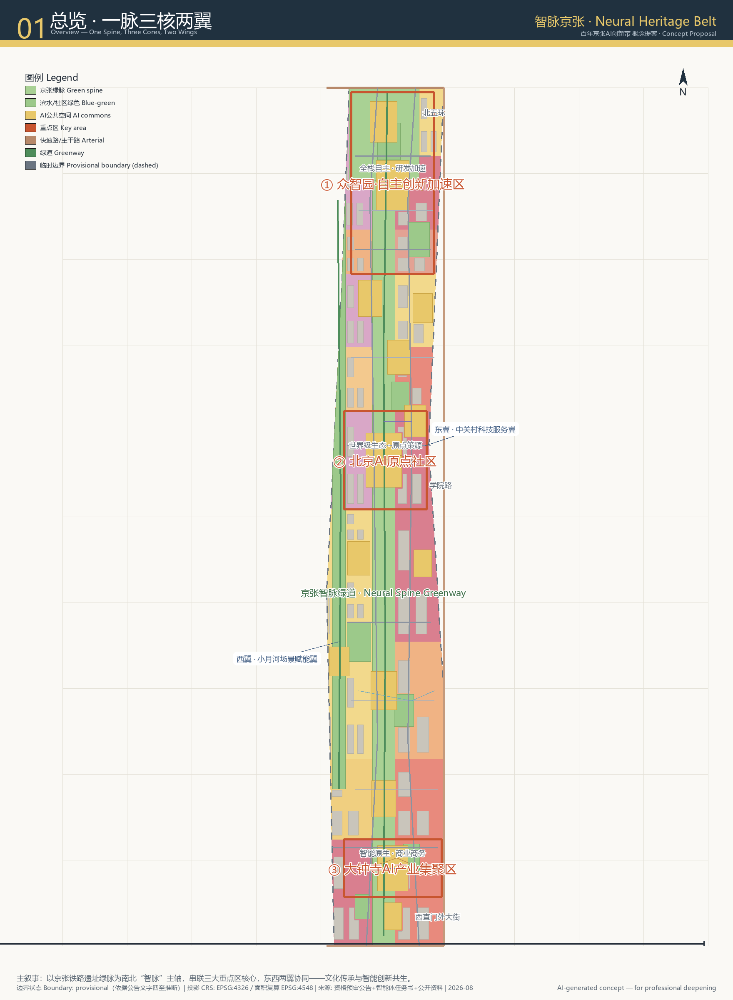
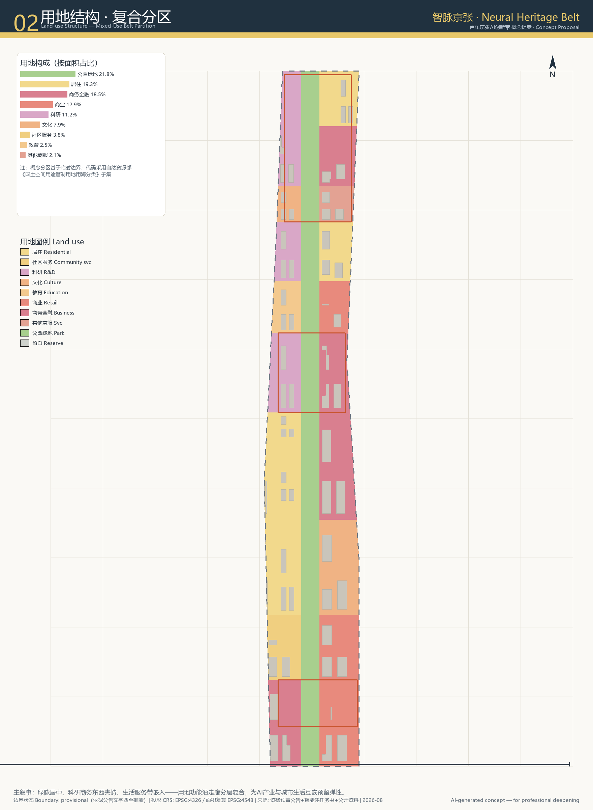
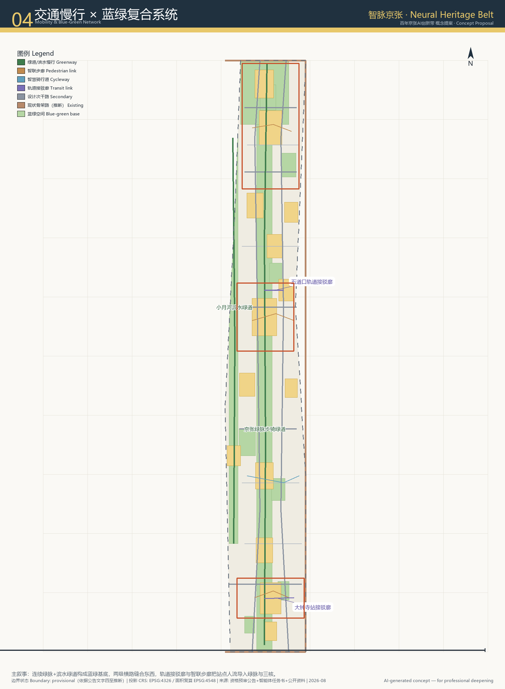
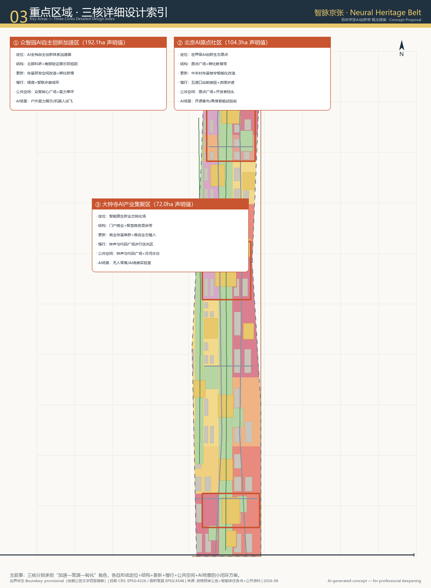
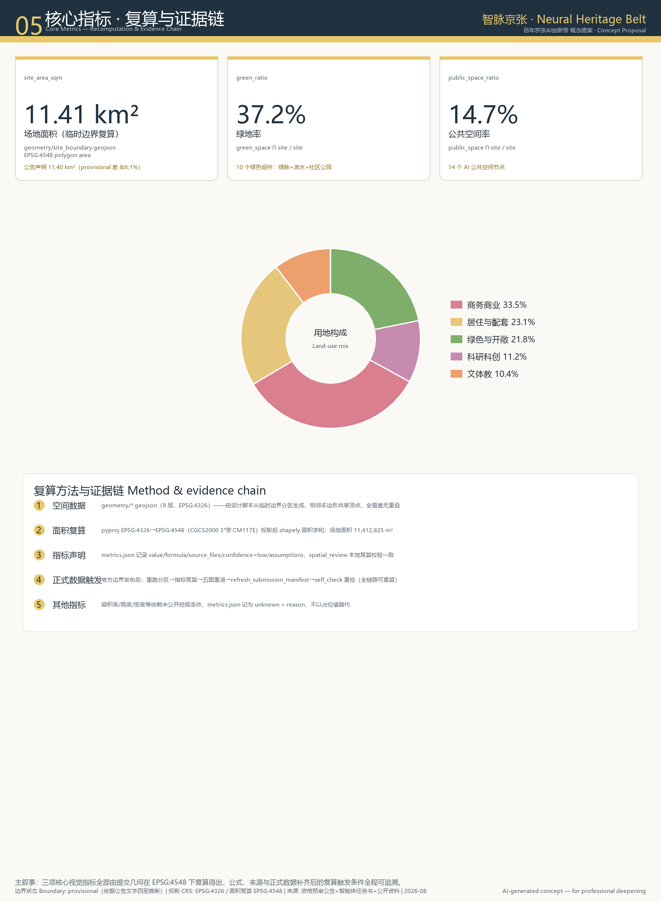

# 智脉京张 Jing-Zhang Neural Heritage Belt

## 设计依据与资料清单

本方案以北京市规划和自然资源委员会海淀分局发布的“百年京张AI创新带城市设计国际方案征集资格预审公告”[source:DATA-SRC-OFFICIAL-ANNOUNCEMENT-20260509]、面向全球智能体开源征集任务书[source:DATA-SRC-AGENT-TASKBOOK-20260518]以及项目资料包中的几何、标准、枚举和规划限制文件为设计依据[source:DATA-SRC-PROVISIONAL-BOUNDARIES-20260605]。正式控规条件、现状建筑、权属、道路红线与市政容量尚未公开，因此容积率、建筑高度、开发强度等指标统一记为 `unknown`，不在正文中作为审定结论使用[source:DATA-SRC-MOHURD-CONTROL-DETAILED-PLANNING-202311]。

用地分类采用自然资源部《国土空间调查、规划、用途管制用地用海分类指南》子集[standard:MNR-LAND-USE-CLASSIFICATION-GUIDE]；城市设计深度参照《城市设计管理办法》[standard:MOHURD-URBAN-DESIGN-MEASURES]。空间数据以 `EPSG:4326` 为交换坐标系，面积复算统一在 `EPSG:4548`（CGCS2000 / 3-degree Gauss-Kruger CM 117E）下进行[source:DATA-SRC-PROVISIONAL-BOUNDARIES-20260605]。完整来源、指标公式、合规矩阵、标准响应矩阵与设计深度矩阵见 `sources.json`、`metrics.json`、`compliance_matrix.json`、`standard_matrix.json`、`design_depth_matrix.json`。

*图1 总览：以京张铁路遗址绿脉为“智脉”主轴，串联三核，东西两翼协同（临时边界，来源：公告文字四至推断）。*

## 三层范围工作框架

项目划定三个递进工作层次[source:DATA-SRC-OFFICIAL-ANNOUNCEMENT-20260509]：

- **统筹研究范围**：约 43.6 km²，北至北五环、东至京藏高速、南至西直门外大街、西至万泉河路。该层重在研判海淀区AI产业与城市空间的区域协同，提出“智脉京张”与海淀北部、怀柔科学城、未来科学城、经开区及京津冀创新网络的衔接方向。
- **总体设计范围**：约 11.4 km²（由提交包临时边界 `geometry/site_boundary.geojson#SITE-001` 在 EPSG:4548 下复算为 11.41 km²），以北五环、学院路—西土城路、西直门外大街、大钟寺东路—荷清路为文字四至[source:DATA-SRC-PROVISIONAL-BOUNDARIES-20260605]。本层按控制性详细规划城市设计深度展开，形成用地结构、公共空间网络、交通慢行骨架与分期实施框架。
- **重点区域范围**：约 3.68 km²，包含众智园AI自主创新加速区（约 192.1 ha）、北京AI原点社区（约 104.3 ha）、大钟寺AI产业集聚区（约 72.0 ha）[source:DATA-SRC-OFFICIAL-ANNOUNCEMENT-20260509]；三区范围均为项目资料包提供的临时多边形[source:DATA-SRC-PROVISIONAL-BOUNDARIES-20260605]，仅用于方案生成与自检，不可作为官方红线或精确面积依据。

*图2 总体设计范围用地结构：绿脉居中，科研、商务金融、居住配套东西夹峙，概念分区无重叠全覆盖（来源：本项目临时边界+公开资料推断）。*

## 统筹研究范围产业与未来城市研究

### 总体概念、命名与Logo方向

方案提出 **“智脉京张 Jing-Zhang Neural Heritage Belt”** 一带总体概念：
- **“智脉”** 隐喻京张铁路百年工业遗产的空间延续与AI神经网络的双向结构——百年京张铁路是中国人自主设计建造的第一条干线铁路，象征从“工程自主”到“智能自主”的精神传承；神经网络式的多节点连接则对应AI时代“算力—算法—数据—场景”的分布式创新生态。
- **三核** 分别为“全栈自主创新加速器”“世界级生态策源地”“智能原生新业态转化场”，对应五大功能中的“AI全栈自主创新体系”“世界级AI创新生态”“AI+场景赋能新范式”。
- **两翼** 为中关村科技服务翼（东翼，要素全球化配置、资本与IP赋能）与小月河场景赋能翼（西翼，AI场景试验与智能化城市生活）。

命名体系包含：一带总名“智脉京张”、英文全称“Jing-Zhang Neural Heritage Belt”、核心区昵称“原点 Origin”“众智园 Commons of Minds”“钟声与代码 Bell & Code”。Logo方向建议以两条平行轨距线演变为“神经突触”双弧线，交汇于三个核心节点；标准色以科技蓝与生态绿为主，辅色为京张红砖褐与中关村灰，整体视觉兼具历史厚重感与AI未来感[standard:PROJECT-AGENT-OPEN-CALL-TASKBOOK]。

### 全球AI创新生态案例

方案整理了 5—8 个可参考的全球案例[standard:PROJECT-AGENT-OPEN-CALL-TASKBOOK]，并在可转化机制层面与空间语言关联：

1. **波士顿 Kendall Square**：高密度研发—高校—资本混合，经验在于“红线窄街+全天候公共空间+校企共址”，适合大钟寺存量商务楼宇的智能化更新。
2. **多伦多 Waterfront / Sidewalk Labs（规划研究阶段经验）**：AI城市实验伦理与数据治理边界、可移动模块化街道，警示不可把测试场景写成正式运营。
3. **深圳湾科技生态园**：龙头企业带动、平台型公共实验室、垂直绿化与慢行网络，适合众智园“全栈自主”空间组织。
4. **杭州云栖小镇**：年度开发者大会与开发者社区长期运营，为一带“京张智汇”年度活动体系提供参考。
5. **蒙特利尔 Mila**：开放办公、学术—产业混编、公共AI伦理沙龙，适合北京AI原点社区的开放式创新生态。
6. **首尔 Digital Media City**：媒体+技术融合地标、城市作为展示界面，为大钟寺智能原生消费场景提供参照。
7. **埃因霍温 High Tech Campus**：共享IP、专利池与设施共享，为“中关村科技服务翼”的要素配置机制提供启发。
8. **伦敦 Knowledge Quarter**：大英图书馆、高校、文化机构与初创企业共生，为文化叙事与国际传播提供参照。

## 总体设计范围城市更新与控规深度城市设计

### 空间结构

总体设计形成 **“一脉、三核、两翼、多节点”** 结构[depth:land_use_layout]：
- **一脉**：京张铁路遗址绿脉（`geometry/green_space.geojson#GS-SPINE-01`），南北贯穿总体设计范围，宽度约 250—350 m，面积约 254 ha，是整条创新带的生态与文化主轴。
- **三核**：三个重点区，分别承载自主创新加速、生态策源、产业转化功能，见 `geometry/key_areas.geojson`。
- **两翼**：东侧以学院路—西土城路为界形成中关村科技服务翼，西侧以小月河—荷清路一带形成场景赋能翼。
- **多节点**：14 个 AI 公共空间节点（`geometry/public_space.geojson`）与 10 个绿色空间组件（`geometry/green_space.geojson`）交织成网络。

### 更新对象与功能比例

用地结构由 30 个 `LAND_USE` 多边形全覆盖无重叠组成[metric:land_use_cell_count]，主要功能构成（按 EPSG:4548 面积占比）为：商务商业约 33.5%、居住与配套约 23.1%、绿色与开敞约 21.8%、科研科创约 11.2%、文体教约 10.4%。地块更新策略表述为“保留—改造—织补—少量新增”的方向性分类：对于 0902 商务金融用地与 0802 科研用地，建议以存量楼宇智能化改造与底层空间激活为主；对于 0701 居住用地，以公共服务嵌入与慢行环境整治为主；对于绿脉与公共空间，以线性开敞空间贯通与节点植入为主[standard:MOHURD-CONTROL-DETAILED-PLANNING]。

### 交通、轨道与市政配套策略

道路交通形成“现状骨架—设计横路—绿脉慢行”三级网络。现状快速路/主干路（北五环、学院路—西土城路、西直门外大街）为 `agent_inferred_from_public_data` 的推断骨架[source:DATA-SRC-PROVISIONAL-BOUNDARIES-20260605]；设计新增若干次干路与支路横切绿脉，缝合东西两翼（`geometry/roads.geojson`）。慢行系统以京张绿脉步骑绿道为主线，小月河滨水绿道为西翼支线，配合智联步廊把轨道站点人流导入三核。轨道站点接驳廊为概念建议，不替代轨道工程线位研究。

市政与新型基础设施方向包括：分布式能源与微电网试点、端侧算力节点与边缘计算机房、智慧灯杆与车路协同感知网络、雨水花园与海绵城市单元。具体管径、容量与能源负荷需待官方市政资料后由专业团队深化。

*图4 交通慢行与蓝绿复合系统：连续绿脉+横路缝合+轨道接驳廊（概念建议，非工程线位）。*

## 重点区域详细设计

### ① 众智园AI自主创新加速区（约 192.1 ha）

定位：AI全栈自主创新体系与AI治理全球话语权的核心加速器。空间结构为“北科研—中验证—南展示”三带：北部以 0802 科研用地为主，聚集芯片、框架、模型研发；中部以实验室与孵化器混合为主，设置算力草坪（`public_space.geojson#PS-09`）作为户外机器人与无人机试飞场；南部以展示与发布空间为主，依托众智核心广场（`public_space.geojson#PS-02`）举办技术发布与开源社区活动。更新方向：存量研发楼宇改造升级为主，少量新建孵化器；高度、容积率待正式控规明确。

### ② 北京AI原点社区（约 104.3 ha）

定位：世界级AI创新生态策源地与开发者精神家园。空间结构以原点广场（`public_space.geojson#PS-01`）为核心，向北连接教育孵化带，向南通过开发者码头（`public_space.geojson#PS-06`）连接小月河滨水绿道。功能以 0802 科研、0804 教育、0902 商务金融与 0701 居住配套混合为主。更新方向：中关村存量楼宇智能化改造、首层空间开放、地下空间复合利用（仅方向性建议）；强调与五道口站点的慢行接驳（`roads.geojson#RD-T-01`）。

### ③ 大钟寺AI产业集聚区（约 72.0 ha）

定位：智能原生新业态转化场与都市AI生活体验门户。空间结构以钟声与代码广场（`public_space.geojson#PS-03`）为门户，向北形成智慧商务带，向南形成智能原生消费带。功能以 0902 商务金融、0901 商业、0803 文化混合为主，底层商业植入 AI 消费实验室、无人零售体验、具身智能展示等业态。更新方向：商业存量空间业态焕新、建筑立面智慧化改造、街道步行优先化。

*图3 三处重点区设计索引：定位+空间结构+更新方向+慢行+公共空间+AI场景（临时边界，方向性建议）。*

本节证据出处：[source:KEY-AREA-SOURCE]（三处重点区临时边界）、[metric:key_area_count]、[standard:MOHURD-ARCH-DESIGN-DEPTH-2016]。
## AI 创新生态、人才画像与 AI+ 场景

### 人才与企业画像（5类以上）

1. **基础研究型科学家**：关注算力、长期资助、跨学科协作，主要活动于众智园北部科研带与AI原点社区。
2. **开源开发者/独立研究员**：关注社区氛围、快速原型场地、极客文化，聚集于开发者码头、原点广场。
3. **硬科技创业者**：关注验证场景、投资对接、中试空间，聚集于众智园加速器与大钟寺智慧商务。
4. **AI产品经理与设计师**：关注场景试验、用户反馈、消费界面，活跃于大钟寺智能原生消费带。
5. **城市居民与青少年**：关注科普、无障碍服务、代际共学，对应少年AI乐园、记忆车场等公共空间。
6. **国际访客与传播者**：关注文化地标、全球活动、可拍摄的城市意象，对应京张文化廊道与AI朝圣地标。

### AI 场景卡（10张以上）

每张场景卡均映射到空间节点、服务对象、数据边界与运营主体：

| 场景卡 | 空间节点 | 核心体验 | 隐私/伦理边界 | 运营机制 |
|---|---|---|---|---|
| SC-01 无人配送接驳 | 绿脉步骑绿道、三核楼宇 | 末端物流机器人在指定时段共享绿道 | 不采集行人身份，轨迹脱敏 | 平台+物业+市政监管 |
| SC-02 户外机器人试飞 | 算力草坪 PS-09 | 无人机/地面机器人公开测试场 | 空域/地面安全隔离，人工复核 | 众智园运营方+行业协会 |
| SC-03 AI导览京张历史 | 詹天佑纪忆广场 PS-04 | AR导览詹天佑与铁路历史 | 仅位置触发，不上传个人轨迹 | 文博机构+开源社区 |
| SC-04 智能原生消费 | 钟声与代码广场 PS-03 | 无人零售、AI菜单、具身迎宾 | 人脸识别默认关闭，可选授权 | 商业运营方+算法备案 |
| SC-05 开放算力驿站 | 原点广场 PS-01 | 开发者随时接入边缘算力与模型API | API调用日志仅用于计费 | 开源基金会+云厂商 |
| SC-06 代际AI共学 | 少年AI乐园 PS-07 | 青少年与老人共学的低代码AI工具 | 未成年人数据本地处理 | 社区+教育机构 |
| SC-07 开发者快闪市集 | 开发者码头 PS-06 | 开源项目路演与极客市集 | 公开招募，内容审核 | 开发者社区自治 |
| SC-08 滨水AI运动 | 月河水台 PS-12 | 智能步道记录运动数据（可选） | 数据可删除、可导出 | 体育运营方 |
| SC-09 智慧停车诱导 | 五道口站前客厅 PS-08 | 轨道站点周边停车与慢行诱导 | 车牌与轨迹脱敏 | 交通管理平台 |
| SC-10 城市AI伦理沙龙 | 突触广场 PS-05 | 公共讨论AI治理与算法公平 | 公开议程，无敏感数据采集 | 高校+智库+社区 |
| SC-11 智能建筑能耗优化 | 大钟寺智慧商务楼宇 | AI调节照明、空调与遮阳 | 仅楼宇级能耗数据 | 物业+能源服务商 |
| SC-12 无障碍AI助手 | 各公共空间节点 | 语音/视觉辅助老年人与视障者 | 仅本地缓存，人工可接管 | 社区服务中心 |

### 产业测试验证场景（3个以上）

1. **具身智能城市开放测试走廊**：沿京张绿脉步骑绿道划定非高峰时段测试段，验证配送机器人、清洁机器人、巡检机器人在真实城市环境中的避障与协同。
2. **多模态城市大模型评测广场**：在原点广场与算力草坪设置公开评测数据集与市民参与评测入口，推动城市大模型的公平性、可解释性与可用性测试。
3. **智能建筑与微电网联合验证园区**：在大钟寺智慧商务楼宇群中验证建筑能耗AI优化与分布式能源调度，形成可复制的低碳更新技术包。

画像与场景卡的任务依据：[source:AGENT-TASKBOOK]（agent.3 人才画像与 AI+ 场景要求）、[source:PROCESSED-FACT-PACK]（产业与人群事实导航层）。
## 用地、建筑规模与拆改留方案

本包的用地布局由 `geometry/land_use.geojson` 的 30 个多边形全覆盖无重叠表达[metric:land_use_cell_count]，用地代码采用自然资源部指南子集[standard:MNR-LAND-USE-CLASSIFICATION-GUIDE]。建筑基底由 `geometry/buildings.geojson` 给出 63 个概念体量多边形[metric:building_footprint_area_sqm]，总面积约 133.8 万 m²（临时边界复算值），仅用于表达建筑肌理与空间围合意向，**不是建筑设计方案或拆改留结论**[standard:MOHURD-CONTROL-DETAILED-PLANNING]。

因官方控规条件未公开，`metrics.json` 将容积率、建筑高度、建筑密度、绿地率、退线等控制指标记为 `unknown` 并说明原因。待官方控规、现状建筑测绘、权属资料发布后，可由专业团队按“保留—改造—织补—少量新增”的逻辑深化拆改留方案。当前正文中所有关于建筑规模、开发强度的表述均为**低置信度概念设计量**，不代表法定控制值。

## 交通、轨道、市政与公共服务设施

交通组织遵循“绿脉贯通、东西缝合、站点引流、慢行优先”原则。京张绿脉步骑绿道是南北向慢行主廊；东西向设计次干路与支路每 800—1200 m 横切一次，降低绿脉对城市东西联系的阻隔。五道口站与大钟寺站通过轨道接驳廊（`roads.geojson#RD-T-01`、`RD-T-02`）与智联步廊把人流导入三核，但轨道线位、站点出口与工程方案需由交通与轨道专业团队深化。

市政设施提出“分布式、弹性化、AI原生”方向：在绿脉与公共空间设置分布式雨水花园与海绵单元；在三核设置边缘算力节点与智能灯杆，为场景测试提供端侧算力；在居住区与人才公寓推进社区微电网与光储充一体化试点。所有管径、容量、负荷测算均待官方市政资料。

公共服务设施强调“AI+无障碍”。依据《无障碍环境建设法》第39条列举的公共服务场所精神[source:DATA-SRC-BARRIER-FREE-ENVIRONMENT-LAW]，在公共空间节点保留人工服务窗口与志愿者支持；老年人高频服务场景遵循国办发〔2020〕45号“传统服务与智能化服务并行”原则[source:DATA-SRC-ELDERLY-SMART-TECH-PLAN-2020-45]，不将数字化作为唯一服务路径。

## 蓝绿空间、公共空间与城市风貌

蓝绿系统以京张遗址公园绿脉为骨架，小月河滨水绿道为西翼，清河口绿楔与社区公园为节点，形成“一脉一河多园”网络[metric:green_ratio]。绿脉不仅是生态廊道，也是AI公共展示界面：沿线设置无人配送接驳段、户外机器人试飞区、AR铁路历史导览等场景节点。

公共空间系统包含 14 个 AI 公共空间节点[metric:public_space_node_count]，类型包括核心广场、滨水聚场、社区乐园、文化纪念广场与轨道站点客厅。每个节点均配置主题、服务对象、运营机制与隐私边界。

**AI朝圣地标（3个以上）**：
1. **原点纪念碑 Origin Obelisk**：位于原点广场，以京张铁路“人字形”线路抽象为螺旋上升的钢结构，象征从铁路自主到智能自主。
2. **智算穹顶 Commons Dome**：位于众智园核心，半室外穹顶空间用于成果发布、算力可视化与全球开发者连线。
3. **钟声与代码塔 Bell & Code Tower**：位于大钟寺门户，结合钟声历史意象与数字光影，成为智能原生消费区的入口地标。

城市风貌强调“科技温度”：建筑色彩以灰、白、木色为基调，公共建筑与地标点缀科技蓝与生态绿；屋顶鼓励绿化光伏一体化；街道家具与导视系统融合铁路轨距、机车车轮等京张文化符号。

## 更新项目清单、实施政策与分期计划

分期计划由 `geometry/phasing.geojson` 表达为近、中、远三期[metric:phase_count]：

- **近期（1—3年）**：以三核公共空间与绿脉示范段为先导，实施原点广场、众智核心广场、钟声与代码广场、京张绿脉步骑绿道示范段、算力草坪。目标是形成可体验、可展示的“第一印象”。
- **中期（3—6年）**：滚动推进东翼研发转化与西翼社区更新，完善次干路/支路网，建设开发者码头、月河水台、五道口站前客厅，启动具身智能测试走廊与多模态城市大模型评测广场。
- **远期（6—10年）**：完成绿脉全线贯通与南部延伸，推进边缘居住区提升与南部门户建设，形成完整的品牌活动体系与开发者社区自治机制。

政策机制方向（均为概念建议）包括：存量楼宇智能化更新补贴、AI场景沙盒监管试点、开源算力券、人才公寓与公共服务配套包、AI企业“场景合伙人”制度。所有资金、招商、政策表述均不构成政府承诺。

## 全球AI创新活动体系与长期运营

### 年度活动体系

- **京张智汇大会**：每年秋季举办的全球开发者与创新生态大会，主会场设于众智园智算穹顶。
- **AI原点马拉松**：全年多场黑客松与开源挑战赛，围绕具身智能、城市大模型、无障碍AI等主题。
- **钟声与代码灯光季**：冬季在大钟寺门户举办数字光影艺术节，结合京张文化叙事。
- **小月河场景市集**：每月一次的AI生活方式市集，测试新消费场景。

### 开发者社区与场景开放运营

建立“一带一社区多节点”开发者社区运营机制：线上以开源平台与模型广场为载体，线下以原点社区开发者码头为总部，各公共空间节点为分布式活动场。场景开放采用“沙盒申请—安全评估—公开测试—效果复盘”四步流程，所有测试场景均需人工复核与退出机制。

### 国际传播与招引转化

传播主题从“百年京张”到“百年智脉”，通过英文标识系统、双语内容生产、海外开发者大会联动、全球开源项目落地等方式提升一带国际辨识度。招引转化路径：活动曝光 → 场景体验 → 社区入驻 → 企业注册/联合实验室成立 → 长期生态贡献。

## 指标体系、面积复算与合规矩阵

三项核心视觉指标全部由提交几何在 `EPSG:4548` 下复算得出[metric:site_area_sqm][metric:green_ratio][metric:public_space_ratio]：

- 场地面积：`site_area_sqm` = 11,412,825 m²（临时边界复算值），与公告声明值 11.4 km² 偏差 <1%。
- 绿地率：`green_ratio` = 37.2%，由 `green_space` 与 `site_boundary` 交集面积除以场地面积得出。
- 公共空间率：`public_space_ratio` = 14.7%，由 `public_space` 与 `site_boundary` 交集面积除以场地面积得出。

*图5 核心指标复算与证据链：三项指标公式、来源、复算触发条件全程可追溯。*

公告 1.3—1.5 任务与智能体任务书 agent.1—agent.6 的覆盖情况详见 `compliance_matrix.json`；专业标准响应详见 `standard_matrix.json`；设计深度项详见 `design_depth_matrix.json`。

## 风险、版权与合规说明

本方案所有空间落地建议均为概念建议、参考方案或可供专业团队深化研究，不替代正式规划，不构成政府审定结论[source:DATA-SRC-AGENT-TASKBOOK-20260518]。临时边界来自公告文字四至推断，不可作为官方红线、审批依据或精确面积依据[source:DATA-SRC-PROVISIONAL-BOUNDARIES-20260605]。

来源合法性：仅使用项目资料包、公开政策文件、公开资料与AI生成设计内容；未使用秘密地图、非公开表格或伪造官方背书。引用的生成式AI内容与可视化素材遵循《生成式人工智能服务管理暂行办法》边界[source:DATA-SRC-GENERATIVE-AI-INTERIM-MEASURES]，不作为事实证据使用。图件、Logo方向、渲染图均为概念表达，不侵犯第三方商标、字体、人物肖像或版权。

待补资料：官方精确边界、控规条件、现状建筑测绘、权属、市政容量、文保紫线、道路红线、航空限高等。建议在官方资料发布后对几何、指标、图纸与矩阵进行全量复算并更新版本。

## 参考资料

1. 北京市规划和自然资源委员会海淀分局. 百年京张AI创新带城市设计国际方案征集资格预审公告，2026-05-09. [standard:PROJECT-OFFICIAL-ANNOUNCEMENT] [source:OFFICIAL-ANNOUNCEMENT]
2. 用户提供清权. 面向全球智能体开展百年京张AI创新带城市设计开源征集任务书摘录，2026-05-18. [standard:PROJECT-AGENT-OPEN-CALL-TASKBOOK] [source:AGENT-TASKBOOK]
3. 住房和城乡建设部. 城市设计管理办法，2023. [standard:MOHURD-URBAN-DESIGN-MEASURES]
4. 住房和城乡建设部. 城市、镇控制性详细规划编制审批办法，2022. [standard:MOHURD-CONTROL-DETAILED-PLANNING]
5. 自然资源部. 国土空间调查、规划、用途管制用地用海分类指南，2023. [standard:MNR-LAND-USE-CLASSIFICATION-GUIDE]
6. 国家互联网信息办公室等七部门. 生成式人工智能服务管理暂行办法，2023.
7. 全国人民代表大会常务委员会. 中华人民共和国无障碍环境建设法，2023.
8. 国务院办公厅. 关于切实解决老年人运用智能技术困难实施方案（国办发〔2020〕45号），2020.
